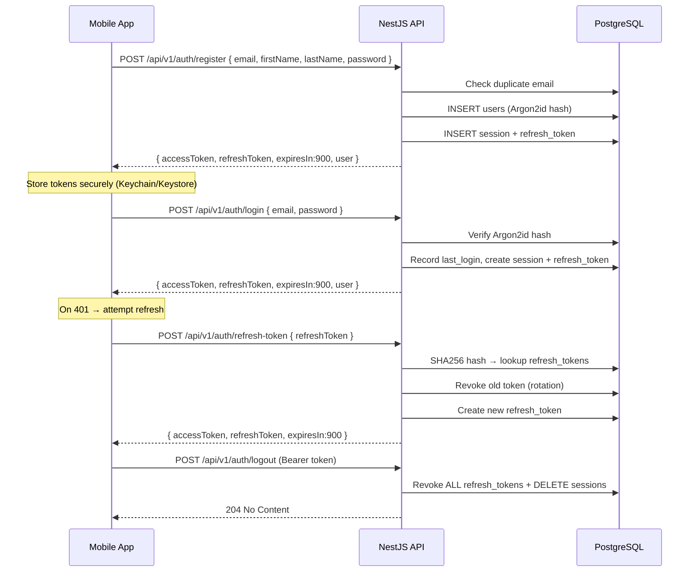

# گزارش جامع پلتفرم Xennic — مستندات پیاده‌سازی اپلیکیشن موبایل

**تاریخ:** 2026-07-02
**نگارش:** 1.0
**هدف:** ارائه تصویر کامل از ساختار، معماری، APIها، دیتابیس و سرویس‌های پلتفرم Xennic برای طراحی و پیاده‌سازی اپلیکیشن موبایل

---

## فهرست

1. [معرفی پلتفرم](#1-معرفی-پلتفرم)
2. [معماری کلی](#2-معماری-کلی)
3. [Authentication & Authorization](#3-authentication--authorization)
4. [Multi-Tenancy (Workspace Isolation)](#4-multi-tenancy-workspace-isolation)
5. [Database Schema](#5-database-schema)
6. [API Endpoints](#6-api-endpoints)
7. [Python Microservices](#7-python-microservices)
8. [Shared Packages & Types](#8-shared-packages--types)
9. [Web Frontend Patterns (مرجع برای موبایل)](#9-web-frontend-patterns-مرجع-برای-موبایل)
10. [Business Domains](#10-business-domains)
11. [Security](#11-security)
12. [Infrastructure & Deployment](#12-infrastructure--deployment)
13. [توصیه‌های معماری برای اپلیکیشن موبایل](#13-توصیه‌های-معماری-برای-اپلیکیشن-موبایل)

---

## 1. معرفی پلتفرم

**Xennic** یک پلتفرم SaaS مهندسی برق است که خدمات زیر را ارائه می‌دهد:

| سرویس | توضیح |
|-------|-------|
| **محاسبات مهندسی برق** | ماشین‌حساب‌های تخصصی (کابل، ترانسفورماتور، حفاظت، کیفیت توان و ...) |
| **دستیار هوش مصنوعی** | AI Agentهای تخصصی مهندسی برق با قابلیت RAG |
| **سیستم دانش (Knowledge)** | پایگاه دانش مهندسی با قابلیت نشر، نسخه‌بندی و گردش کار |
| **مدیریت پروژه** | پروژه‌های مهندسی با قابلیت همکاری تیمی |
| **بازارگاه (Marketplace)** | کاتالوگ محصولات و تجهیزات برق |
| **سیستم اشتراک و صورتحساب** | پلن‌های Free/Pro/Enterprise |
| **مدیریت اسناد (Vision)** | آنالیز تصاویر، پلاک‌خوانی و مدارک فنی |

### Technology Stack

| لایه | تکنولوژی |
|------|-----------|
| **Backend API** | NestJS 11 + Fastify (پورت 3000) |
| **Frontend Web** | Next.js 15 (پورت 3001) |
| **Database** | PostgreSQL 17 + Prisma ORM |
| **Python Services** | FastAPI (engineering, ai, vision) |
| **Message Queue** | RabbitMQ 4 |
| **Cache** | Redis 8 |
| **Vector DB** | Qdrant |
| **Object Storage** | MinIO (S3-compatible) |
| **Search** | Meilisearch |
| **Monorepo** | pnpm workspace + Turborepo |
| **Auth** | JWT (RS256) + Argon2id |

---

## 2. معماری کلی

### 2.1 Monorepo Structure

```
xennic/
├── apps/
│   ├── api/              # NestJS Backend (پورت 3000)
│   └── web/              # Next.js Frontend (پورت 3001)
├── packages/
│   ├── config/           # Shared config (env, tsconfig, eslint, prettier)
│   ├── database/         # Prisma client + tenant extension
│   ├── openapi/          # Auto-generated OpenAPI spec (v1/openapi.json)
│   ├── shared/           # Shared utilities (Result type, logger, AppError)
│   └── types/            # Shared TypeScript interfaces
├── services/
│   └── api-gateway/      # خالی (placeholder)
├── workspace/
│   └── services/
│       ├── engineering-service/  # Python/FastAPI (پورت 8001)
│       ├── ai-service/           # Python/FastAPI (پورت 8002)
│       └── vision-service/       # Python/FastAPI (پورت 8003)
├── infrastructure/
│   ├── docker/           # Docker compose, env, secrets
│   ├── kubernetes/       # K8s manifests
│   └── nginx/            # Nginx configs
├── prisma/
│   ├── schema.prisma     # Full database schema
│   ├── seed.js           # CJS seed script
│   └── migrations/       # 4 migrations
└── docs/
    ├── TEST_GUIDE.md     # راهنمای تست API
    ├── STATUS_REPORT.md  # وضعیت ماژول‌ها
    ├── LANDING-PATCH.md  # صفحه فرود
    └── knowledge/        # ساختار خالی دانش مهندسی
```

### 2.2 Architecture Diagram

```
Mobile App (Flutter/React Native)
        │
        │ HTTPS / REST + JWT
        ▼
┌──────────────────────────────────────────────┐
│           NestJS API (Fastify)                │
│           localhost:3000                      │
│           /api/v1/*                           │
│                                               │
│  ┌─────────┐ ┌──────────┐ ┌──────────────┐   │
│  │Auth/JWT │ │Workspace │ │ 23 Feature   │   │
│  │ Guards  │ │  Guard   │ │   Modules    │   │
│  └─────────┘ └──────────┘ └──────────────┘   │
│                                               │
│  Prisma Client + Tenant Extension (ASL)       │
└──────────────────────┬───────────────────────┘
                       │
         ┌─────────────┼─────────────┐
         ▼             ▼             ▼
    PostgreSQL 17   MinIO S3     Meilisearch
    (Main DB)      (Files)      (Full-text search)
         │
         │ (via HTTP)
         ▼
┌──────────────────────┐
│  Python Microservices│
│                      │
│  engineering-service │─── Qdrant (Vector DB)
│  (port 8001)         │
│                      │
│  ai-service          │─── OpenAI/Anthropic/Groq
│  (port 8002)         │
│                      │
│  vision-service      │─── OCR + AI
│  (port 8003)         │
└──────────────────────┘

Infrastructure:
  PostgreSQL 17 + Redis 8 + RabbitMQ 4 + MinIO + Qdrant
```

### 2.3 Request Flow

```
Mobile App
  │
  ├─ 1. POST /api/v1/auth/login ───────────────► Auth Module
  │     ◄── { accessToken, refreshToken, user }    │
  │                                                 │
  ├─ 2. GET /api/v1/workspaces?limit=1 ──────────► Workspace Module
  │     ◄── [{ id, code, name }]                   │
  │                                                 │
  ├─ 3. All requests include:
  │     Authorization: Bearer <accessToken>
  │     x-workspace-id: <workspaceId>
  │
  ├─ 4. JwtAuthGuard ──► validates RS256 JWT
  ├─ 5. WorkspaceGuard ──► checks workspace membership
  ├─ 6. PermissionsGuard ──► checks @RequirePermissions()
  ├─ 7. Prisma Tenant Extension ──► auto-filters by workspace_id
  └─ 8. Response: { success: true, data: T } | { success: false, error }
```

---

## 3. Authentication & Authorization

### 3.1 Authentication Flow



### 3.2 JWT Token Structure

**Access Token (RS256 signed):**
- TTL: 900 ثانیه (15 دقیقه) — قابل تنظیم via `JWT_ACCESS_TOKEN_TTL`
- Payload: `{ sub: userId, email, workspaceId?, roles: string[], iat, exp }`
- الگوریتم: RS256 (نامتقارن — امضا با private key، تایید با public key)
- کلیدها: `infrastructure/docker/secrets/jwtRS256.key` و `.pub`

**Refresh Token:**
- opaque string تصادفی 128 کاراکتری hex
- TTL: 30 روز (قابل تنظیم via `JWT_REFRESH_TOKEN_TTL`)
- SHA256 hash ذخیره شده در جدول `refresh_tokens`
- **یکبار مصرف** — هر refresh توکن قبلی را باطل می‌کند (rotation)

### 3.3 Authorization Layers

| لایه | گارد | وظیفه |
|------|------|--------|
| 1 | `JwtAuthGuard` | اعتبارسنجی JWT + استخراج user از payload |
| 2 | `WorkspaceGuard` | استخراج workspaceId از header/param/body + بررسی عضویت |
| 3 | `PermissionsGuard` | بررسی `@RequirePermissions('domain.action')` |
| 4 | `AdminGuard` | دسترسی فقط SUPER_ADMIN یا PLATFORM_ADMIN |
| 5 | `SuperAdminGuard` | دسترسی فقط SUPER_ADMIN (برای hard-delete) |
| 6 | `XennicThrottlerGuard` | Rate limiting عمومی (100 req / 60s) |
| 7 | `AuthThrottlerGuard` | Rate محدودتر برای auth (login: 5/60s, register: 3/60s) |

### 3.4 RBAC Model

**12 Role:**
- **Platform-level:** `SUPER_ADMIN`, `PLATFORM_ADMIN`, `SUPPORT_ADMIN`
- **Workspace-level:** `OWNER`, `ADMIN`, `ENGINEER`, `EDITOR`, `KNOWLEDGE_WRITER`, `REVIEWER`, `CONSULTANT`, `MEMBER`, `VIEWER`

**60+ Permission** در 8 domain (identity, workspace, projects, engineering, ai, marketplace, storage, api, knowledge, admin)

**Role-Permission Assignment:**
- `SUPER_ADMIN` → همه permissions
- `OWNER` → کنترل کامل workspace
- `ENGINEER` → engineering + project + knowledge + AI + files
- `VIEWER` → فقط خواندن

### 3.5 Password Hashing

- **الگوریتم:** Argon2id
- پارامترها: memoryCost=65536, timeCost=3, parallelism=4

---

## 4. Multi-Tenancy (Workspace Isolation)

### 4.1 Strategy

**Shared database, shared tables, row-level isolation** via `workspace_id` column.

### 4.2 Implementation Layers

**Layer A — Prisma Tenant Extension (Automatic):**
فایل `packages/database/src/tenant-extension.ts` یک Prisma middleware که:
- `findMany`/`findFirst`/`count`: اضافه کردن `WHERE workspace_id = ?`
- `create`/`createMany`: inject کردن `workspace_id`
- `update`/`delete`: اضافه کردن workspace_id به WHERE

**Layer B — AsyncLocalStorage (TenantContext):**
- `TenantContext` از `AsyncLocalStorage` استفاده می‌کند
- `WorkspaceGuard` مقدار workspace_id را در ابتدای هر request تنظیم می‌کند
- Prisma extension به صورت خودکار این مقدار را می‌خواند

**Layer C — Raw SQL:**
برخی repository‌ها از `prisma.$queryRaw` استفاده می‌کنند — در این موارد workspace_id باید دستی اضافه شود.

### 4.3 Workspace-Scoped Entities (26 مدل)

`projects`, `calculations`, `files`, `conversations`, `ai_usage`, `orders`, `invoices`, `payments`, `transactions`, `payment_methods`, `subscription_payments`, `knowledge`, `api_keys`, `webhooks`, `audit_logs`, `usage_logs`, `workspace_members`, `workspace_invitations`, `workspace_settings`, `subscriptions`, `sessions` (اختیاری), `user_roles`, `feature_flags` (اختیاری)

### 4.4 Workspace API

| Method | Path | توضیح |
|--------|------|-------|
| `POST` | `/workspaces` | ایجاد workspace (سازنده OWNER می‌شود) |
| `GET` | `/workspaces` | لیست workspaceهای کاربر |
| `GET` | `/workspaces/:id` | جزئیات workspace |
| `PUT` | `/workspaces/:id` | ویرایش نام |
| `DELETE` | `/workspaces/:id` | Soft delete |
| `PATCH` | `/workspaces/:id/restore` | بازیابی |
| `DELETE` | `/workspaces/:id/hard` | حذف دائمی (SuperAdmin) |
| `GET` | `/workspaces/:workspaceId/members` | لیست اعضا |
| `POST` | `/workspaces/:workspaceId/members` | افزودن عضو |
| `PATCH` | `/workspaces/:workspaceId/members/:userId` | تغییر نقش |
| `DELETE` | `/workspaces/:workspaceId/members/:userId` | حذف عضو |
| `GET` | `/workspaces/:workspaceId/invitations` | لیست دعوتنامه‌ها |
| `POST` | `/workspaces/:workspaceId/invitations` | ارسال دعوتنامه |
| `POST` | `/workspaces/invitations/accept` | پذیرش دعوتنامه |
| `GET` | `/workspaces/:workspaceId/dashboard` | داشبورد workspace |
| `GET` | `/workspaces/:workspaceId/settings` | تنظیمات workspace |
| `PUT` | `/workspaces/:workspaceId/settings` | بروزرسانی تنظیمات |

### 4.5 Critical for Mobile

اپلیکیشن موبایل باید در هر request دارای دو header باشد:
```
Authorization: Bearer <accessToken>
x-workspace-id: <currentWorkspaceId>
```

---

## 5. Database Schema

### 5.1 Overview

- **Database:** PostgreSQL 17
- **ORM:** Prisma 6
- **ID Strategy:** تمام entityها UUID v4
- **Soft Delete:** از طریق فیلد `deleted_at` در کاربران، workspaceها، پروژه‌ها، محصولات و فایل‌ها
- **No Enums:** تمام فیلدهای status/type از نوع String هستند (اعتبارسنجی در لایه application)
- **4 Migration:** از تاریخ 2026-06-02 تا 2026-06-18

### 5.2 Domain Models Summary

| Domain | تعداد مدل‌ها | مدل‌های اصلی |
|--------|-------------|-------------|
| **Identity** | 6 | users, sessions, refresh_tokens, password_reset_tokens, roles, permissions, user_roles, role_permissions |
| **Workspace** | 4 | workspaces, workspace_members, workspace_invitations, workspace_settings |
| **Subscription** | 3 | plans, subscriptions, usage_logs |
| **Billing** | 5 | invoices, payments, transactions, payment_methods, subscription_payments |
| **Project** | 3 | projects, project_members, project_notes, project_reports |
| **Engineering** | 3 | calculations, calculation_templates, engineering_standards |
| **AI** | 4 | agents, conversations, messages, ai_usage |
| **Knowledge** | 14 | knowledge, translations, taxonomy, media, formulas, examples, standards bridge, versions, comments, workflows, workflow_history, analytics, categories, topics, tags, disciplines, audiences |
| **Marketplace** | 4 | vendors, products, product_translations, orders, order_items |
| **Storage** | 2 | files, file_versions |
| **API** | 2 | api_keys, webhooks |
| **Notification** | 1 | notifications |
| **Admin** | 3 | system_settings, feature_flags, audit_logs |

### 5.3 Entity Relationship Diagram (Text)

```
USERS ──┬── SESSIONS
         ├── REFRESH_TOKENS
         ├── PASSWORD_RESET_TOKENS
         ├── USER_ROLES ──── ROLES ──── ROLE_PERMISSIONS ──── PERMISSIONS
         ├── WORKSPACE_MEMBERS ──── WORKSPACES ──── WORKSPACE_SETTINGS
         ├── WORKSPACE_INVITATIONS
         ├── PROJECTS ──── PROJECT_MEMBERS ──── PROJECT_NOTES ──── PROJECT_REPORTS
         ├── CALCULATIONS
         ├── FILES ──── FILE_VERSIONS
         ├── NOTIFICATIONS
         ├── AI_USAGE
         ├── ORDERS ──── ORDER_ITEMS ──── PRODUCTS ──── PRODUCT_TRANSLATIONS ──── VENDORS
         ├── KNOWLEDGE (author/reviewer) ──── KNOWLEDGE_TRANSLATIONS
         │                                   ├── KNOWLEDGE_TAXONOMY
         │                                   ├── KNOWLEDGE_MEDIA
         │                                   ├── KNOWLEDGE_FORMULAS
         │                                   ├── KNOWLEDGE_EXAMPLES
         │                                   ├── KNOWLEDGE_STANDARDS ──── ENGINEERING_STANDARDS
         │                                   ├── KNOWLEDGE_VERSIONS
         │                                   ├── KNOWLEDGE_COMMENTS
         │                                   ├── KNOWLEDGE_WORKFLOWS ──── KNOWLEDGE_WORKFLOW_HISTORY
         │                                   └── KNOWLEDGE_ANALYTICS
         ├── KNOWLEDGE_COMMENTS
         └── KNOWLEDGE_WORKFLOWS (assignee/reviewer)

WORKSPACES ──┬── SUBSCRIPTIONS ──── PLANS
             ├── USAGE_LOGS
             ├── INVOICES ──── PAYMENTS ──── TRANSACTIONS
             │               └── SUBSCRIPTION_PAYMENTS
             ├── PAYMENT_METHODS
             ├── API_KEYS
             ├── WEBHOOKS
             └── KNOWLEDGE

CATEGORIES ── (self-referencing parent_id)

SYSTEM_SETTINGS (key-value)
FEATURE_FLAGS (optional plan_id, workspace_id)
AUDIT_LOGS
```

### 5.4 Seed Data

| Entity | تعداد | توضیح |
|--------|-------|-------|
| Plans | 3 | free, pro, enterprise |
| Roles | 12 | SUPER_ADMIN تا VIEWER |
| Permissions | 60+ | در 10 domain |
| Engineering Standards | 15 | IEC, IEEE, NFPA, ISIRI |
| AI Agents | 7 | electrical-engineer, solar-consultant, ... |
| Admin User | 1 | admin@xennic.ir |
| Default Workspace | 1 | XENNIC |
| Vendors | 7 | شرکت‌های تجهیزات برق |
| Products | 40+ | کابل، ترانس، MCCB، ... |

---

## 6. API Endpoints

### 6.1 Complete Module & Endpoint Inventory

23 ماژول فعال در NestJS:

| # | Module | Prefix | تعداد Endpoint | توضیح |
|---|--------|--------|----------------|-------|
| 1 | **Health** | `/health` | 3 | Public endpoints: health, live, ready |
| 2 | **Auth** | `/auth` | 8 | register, login, refresh, logout, forgot-password, reset-password, change-password, me |
| 3 | **User** | `/users` | 8 | CRUD + profile + hard-delete + restore |
| 4 | **Workspace** | `/workspaces` | 15+ | CRUD + members + invitations + settings + dashboard |
| 5 | **RBAC** | `/roles`, `/permissions` | 8 | Roles CRUD, permissions CRUD + assign |
| 6 | **Project** | `/projects` | 12 | CRUD + members + notes |
| 7 | **Engineering** | `/engineering` | 5 | CRUD calculations + export + proxy to Python |
| 8 | **Subscription** | `/subscriptions` | 4 | Plans list, current subscription, subscribe, usage |
| 9 | **Billing** | `/billing` | 11 | Invoices, payments, payment-methods, transactions, dashboard, callback |
| 10 | **Storage** | `/storage` | 6 | Upload, files CRUD, download, stats |
| 11 | **Notification** | `/notifications` | 4 | List, mark-read, mark-all-read, unread-count |
| 12 | **AI** | `/ai` | 6 | Agents, conversations CRUD, messages, validate-calculation |
| 13 | **Consultations** | `/consultations` | 6 | List, get, create, reply, AI-reply, update-status |
| 14 | **Admin** | `/admin` | 16+ | Dashboard, users, workspaces, subscriptions, activity, audit-logs, settings, plans, taxonomy CRUD |
| 15 | **Search** | `/search` | 1 | Multi-entity full-text search |
| 16 | **Knowledge** | `/knowledge` | 25+ | Full CRUD + workflow/publish/archive/review + versions + comments + taxonomy + standards + analytics + public routes |
| 17 | **Standards** | `/standards` | 7 | Engineering standards CRUD + link to knowledge |
| 18 | **Marketplace** | `/marketplace` | 12 | Products, vendors, orders CRUD |
| 19 | **API Keys** | `/api-keys` | 5 | Create, list, get, revoke, validate |
| 20 | **Webhooks** | `/webhooks` | 5 | Create, list, get, update, delete |
| 21 | **Email** | `/email` | 1 | POST /email/test (SuperAdmin only) |
| 22 | **Feature Flags** | `/feature-flags` | 6 | Public enabled list + admin CRUD/toggle |
| 23 | **Vision** | `/vision` | 2 | POST /vision/upload, GET /vision/health (proxy to Python) |

### 6.2 Unified Response Format

**Success:**
```json
{
  "success": true,
  "data": { ... },
  "meta": { "page": 1, "limit": 20, "total": 100 }
}
```

**Error:**
```json
{
  "success": false,
  "error": {
    "code": "UNAUTHORIZED",
    "message": "اعتبارسنجی ناموفق"
  }
}
```

### 6.3 HTTP Status Codes Used

| کد | موارد استفاده |
|----|-------------|
| 200 | Success |
| 201 | Created (POST) |
| 204 | No Content (DELETE, logout) |
| 400 | Validation error (forbidNonWhitelisted) |
| 401 | Unauthorized (invalid/expired JWT) |
| 403 | Forbidden (insufficient permissions, no workspace) |
| 404 | Not Found |
| 409 | Conflict (duplicate email, etc.) |
| 422 | Unprocessable Entity |
| 429 | Too Many Requests (rate limit) |
| 500 | Internal Server Error |
| 503 | Service Unavailable (Python service down) |

---

## 7. Python Microservices

### 7.1 engineering-service (پورت 8001)

**Framework:** FastAPI
**Role:** موتور محاسبات مهندسی برق

**Calculators Implemented (13):**
| کد | نام | وضعیت |
|----|-----|-------|
| BASIC-001 | Ohm's Law | ✅ |
| BASIC-002/3/4 | Active/Apparent/Reactive Power | ✅ |
| BASIC-005 | Power Factor | ✅ |
| CABLE-001 | Cable Ampacity | ✅ |
| CABLE-002 | Voltage Drop | ✅ |
| CABLE-003 | Short Circuit Withstand | ✅ |
| CABLE-004 | PE/CPC Sizing | ✅ |
| TRF-001..4 | Transformer Sizing/Losses/Regulation/K-Factor | ✅ |
| PROT-001 | MCCB Selection | ✅ |

**Pending Calculators (13):**
PQ-001..6 (Power Quality), SOLAR-001..3, EARTH-001..2, LIGHT-001, PS-001..2, ARC-001

### 7.2 ai-service (پورت 8002)

**Framework:** FastAPI + LangChain + LangGraph
**Role:** دستیار هوشمند مهندسی برق با RAG

**Providers:** OpenAI, Anthropic, Groq
**Vector DB:** Qdrant

### 7.3 vision-service (پورت 8003)

**Framework:** FastAPI
**Role:** آنالیز تصاویر، پلاک‌خوانی تجهیزات، OCR مدارک فنی

---

## 8. Shared Packages & Types

### 8.1 `@xennic/shared`

| Export | Type | کاربرد در موبایل |
|--------|------|-----------------|
| `Result<T, E>` | `{ success: true, data: T } | { success: false, error: E }` | الگوی پاسخ API — موبایل باید این ساختار را درک کند |
| `AppError` | Class { message, statusCode } | مدیریت خطا |

### 8.2 `@xennic/types`

| Export | کاربرد در موبایل |
|--------|-----------------|
| `BaseEntity` | اینترفیس پایه `{ id, createdAt, updatedAt, deletedAt? }` |
| `TenantContext` | `{ workspaceId, userId, userRoles, permissions }` — توضیح می‌دهد موبایل چه چیزی باید track کند |

### 8.3 Key DTOs for Mobile

**Auth:**
```
LoginDto:           { email, password }
RegisterDto:        { email, firstName, lastName, password, phone? }
RefreshTokenDto:    { refreshToken }
AuthResponseDto:    { accessToken, refreshToken, expiresIn, tokenType, user }
UserResponseDto:    { id, email, firstName, lastName, status, isEmailVerified }
```

**Workspace:**
```
CreateWorkspaceDto:      { name }
AddMemberDto:            { userId, role }
InviteMemberDto:         { email, role }
AcceptInvitationDto:     { token }
WorkspaceSettingsDto:    { brand, localization, industry, calculation, notification, features }
WorkspaceDashboardDto:   { stats: { members, projects, calculations, storage } }
```

**Project:**
```
CreateProjectDto:    { name, description?, startDate?, endDate? }
ProjectResponseDto:  { id, name, description, status, startDate, endDate, createdBy, timestamps }
```

**Calculation:**
```
CreateCalculationDto:    { type, inputs: {}, projectId?, standardVersion? }
CalculationResponseDto:  { id, type, inputs, results, engineVersion, standardVersion, createdAt }
```

---

## 9. Web Frontend Patterns (مرجع برای موبایل)

### 9.1 Authentication Flow (Web Reference)

**Login:**
1. `POST /auth/login` با `email, password`
2. ذخیره `accessToken` در `localStorage` و `refreshToken` در Zustand persist
3. فراخوانی `GET /admin/check` برای بررسی isAdmin
4. فراخوانی `GET /workspaces?limit=1` برای دریافت workspace
5. ذخیره `workspaceId` در `localStorage`

**API Client** (الگوی قابل تکرار در موبایل):
- استفاده از `fetch()` خالص (بدون Axios)
- Base URL: `{API_BASE}/api/v1`
- inject خودکار headers: `Authorization` و `x-workspace-id`
- پشتیبانی از `FormData` برای آپلود
- Unify response: استخراج `data` از `{ success, data }`
- On 401: پاک کردن تمام tokens و redirect به login

### 9.2 State Management

**Zustand Stores (الگو برای موبایل):**
```
auth.store.ts:
  state: { token, refreshToken, user, workspaceId, isAuthenticated, isAdmin }
  persist middleware → SecureStorage (Keychain در موبایل)
  actions: setAuth, setWorkspace, clearAuth, updateUser
```

### 9.3 Route Structure (Screen Map for Mobile)

| Group | مسیرهای Web | اسکرین‌های موبایل |
|-------|-------------|------------------|
| **Landing** | `/`, `/fa` | Landing page, onboarding |
| **Auth** | `/login`, `/register`, `/forgot-password` | Login, Register, Forgot Password |
| **Public** | `/knowledge`, `/public/*` | Knowledge base (public) |
| **Dashboard** | `/dashboard` | Home/Dashboard screen |
| **Projects** | `/projects` | Project list + detail |
| **Engineering** | `/engineering` | Calculator catalog + form + results |
| **AI** | `/ai` | AI chat/conversation |
| **Vision** | `/vision` | Camera upload + analysis results |
| **Energy** | `/energy` | Bill analyzer |
| **Knowledge** | `/knowledge-manage` | Knowledge articles (CRUD) |
| **Marketplace** | `/marketplace` | Product catalog + orders |
| **Consultations** | `/consultations` | Consultation requests |
| **Notifications** | `/notifications` | Notification list |
| **Settings** | `/settings` | Profile, workspace, security, plan, appearance |
| **Admin** | `/admin` | Admin dashboard (SuperAdmin only) |
| **Search** | `/search` | Global search |

### 9.4 Responsive Patterns Already Present

طراحی web از الگوهای responsive زیر استفاده می‌کند که موبایل باید replicae کند:
- **Sidebar** → FAB drawer bottom-left در موبایل
- **Search bar** → Search icon modal در موبایل
- **Grid layouts** → تک ستونه در موبایل
- **RTL/LTR** → پشتیبانی کامل با `dir` روی HTML
- **100dvh** → استفاده از dynamic viewport height
- **Bottom navigation** → جایگزین sidebar در موبایل

### 9.5 i18n Structure

- Localeها: `fa` (پیش‌فرض) و `en`
- Namespaceها: common, auth, nav, dashboard, projects, engineering, errors, settings, ...
- موبایل می‌تواند از همان کلیدهای پیام و ساختار استفاده کند

---

## 10. Business Domains

### 10.1 Subscription Plans

| پلن | قیمت ماهانه | پروژه | محاسبات/ماه | AI/ماه | فضا | API |
|-----|------------|-------|-------------|--------|-----|-----|
| **Free** | $0 | 3 | 100 | 50 | 1GB | ❌ |
| **Pro** | $49 | نامحدود | نامحدود | 10K | 100GB | سطح 1 |
| **Enterprise** | سفارشی | نامحدود | نامحدود | نامحدود | نامحدود | سطح 3 + SSO |

### 10.2 AI Agents

| Agent | وضعیت | کاربرد |
|-------|-------|--------|
| electrical-engineer | فعال | مشاور عمومی مهندسی برق |
| solar-consultant | فعال | مشاور سیستم‌های خورشیدی |
| protection-engineer | فعال | مشاور حفاظت |
| power-quality | فعال | مشاور کیفیت توان |
| researcher | فعال | تحقیق و جستجو |
| document-analyst | فعال | آنالیز مدارک فنی |
| drawing-analyst | غیرفعال | آنالیز نقشه‌ها |

---

## 11. Security

### 11.1 Current Security Measures

| مورد | پیاده‌سازی |
|------|-----------|
| **CORS** | فقط origins مجاز (`CORS_ORIGINS`) — بدون wildcard |
| **Rate Limiting** | 4 سطح: عمومی (100/60s), Auth (5/60s), AI (20/60s), Admin |
| **JWT RS256** | امضای نامتقارن با کلید RSA |
| **Argon2id** | هش کردن رمز عبور با حافظه 64MB |
| **DTO Validation** | whitelist + forbidNonWhitelisted (Global ValidationPipe) |
| **Soft Delete** | حذف منطقی اکثر entities |
| **Audit Log** | لاگ تمام عملیات RBAC و hard-delete |
| **Multi-Tenant Isolation** | workspace_id در تمام کوئری‌ها (Prisma extension) |

### 11.2 Mobile Security Recommendations

- **Token Storage:** Keychain (iOS) / EncryptedSharedPreferences (Android) — هرگز localStorage
- **SSL Pinning:** برای جلوگیری از MITM
- **Biometric Auth:** امکان قفل اپ با fingerprint/FaceID
- **Session Timeout:** Lock screen پس از مدت inactivity
- **Certificate Pinning** برای API connection

---

## 12. Infrastructure & Deployment

### 12.1 Docker Infrastructure

```yaml
infrastructure/docker/compose/base/docker-compose.yml:
  - postgres:17-alpine (پورت 5432)
  - redis:8-alpine (پورت 6380)
  - rabbitmq:4-management (پورت 5672, 15672)
  - engineering-service (پورت 8001)
  - vision-service (پورت 8003)
  - ai-service (پورت 8002)

workspace/docker-compose.yml:
  - qdrant (پورت 6333, 6334)
```

### 12.2 Environment Variables Required

```
HOST, PORT, NODE_ENV, DATABASE_URL
JWT_PRIVATE_KEY_PATH, JWT_PUBLIC_KEY_PATH
JWT_ACCESS_TOKEN_TTL, JWT_REFRESH_TOKEN_TTL
CORS_ORIGINS
THROTTLE_* (rate limiting)
ADMIN_EMAIL, ADMIN_PASSWORD
AI_PROVIDER, AI_API_KEY, AI_MODEL, AI_BASE_URL, AI_MAX_TOKENS, AI_TEMPERATURE
MINIO_* (endpoint, port, access key, secret key, bucket)
MEILISEARCH_HOST, MEILISEARCH_API_KEY
QDRANT_HOST, QDRANT_API_KEY
```

### 12.3 CI/CD

در حال حاضر **هیچ CI pipeline** وجود ندارد (بدون `.github/`). تمام بررسی‌ها به صورت local انجام می‌شود.

---

## 13. توصیه‌های معماری برای اپلیکیشن موبایل

### 13.1 تکنولوژی پیشنهادی

| لایه | گزینه‌های پیشنهادی |
|------|-------------------|
| **Framework** | React Native (CLI, نه Expo) یا Flutter |
| **State Management** | Zustand (هماهنگ با web) یا Riverpod (Flutter) |
| **API Client** | fetch wrapper مشابه web یا GraphQL (در آینده) |
| **Secure Storage** | react-native-keychain / flutter_secure_storage |
| **Navigation** | React Navigation / GoRouter (Flutter) |
| **i18n** | react-i18next / flutter_localizations |
| **Offline First** | آبجکت‌تیو مرحله دوم |
| **Push Notification** | Firebase Cloud Messaging |
| **Analytics** | Mixpanel / Amplitude / Firebase |

### 13.2 ساختار پروژه پیشنهادی

```
mobile/
├── src/
│   ├── api/              # API client (مشابه lib/api/ در web)
│   │   ├── client.ts     # fetch wrapper با auto-auth
│   │   ├── auth.ts       # auth endpoints
│   │   ├── workspace.ts  # workspace endpoints
│   │   ├── project.ts
│   │   ├── engineering.ts
│   │   └── ...
│   ├── stores/           # Zustand stores (مطابق web)
│   │   ├── auth.store.ts
│   │   └── toast.store.ts
│   ├── screens/          # Screens per domain
│   │   ├── auth/
│   │   ├── dashboard/
│   │   ├── projects/
│   │   ├── engineering/
│   │   ├── ai/
│   │   └── ...
│   ├── components/       # Shared UI components
│   ├── hooks/            # Custom hooks
│   ├── i18n/             # Localization (مطابق web)
│   │   ├── fa.json
│   │   └── en.json
│   ├── navigation/       # Navigation config
│   ├── theme/            # Theming (dark/light)
│   ├── types/            # TypeScript types
│   └── utils/            # Utilities
```

### 13.3 MVP Screens (اولویت پیاده‌سازی)

| اولویت | Screen | وابستگی |
|--------|--------|---------|
| **P0** | Login / Register / Forgot Password | Auth Module |
| **P0** | Workspace List + Selector | Workspace Module |
| **P0** | Dashboard Home | Workspace Dashboard |
| **P1** | Project List + Detail | Project Module |
| **P1** | Calculator Catalog + Form + Results | Engineering Module |
| **P1** | Profile + Settings | User + Settings Module |
| **P2** | AI Chat | AI Module |
| **P2** | Notifications | Notification Module |
| **P2** | Vision Upload + Results | Vision Module |
| **P3** | Knowledge Base | Knowledge Module |
| **P3** | Marketplace | Marketplace Module |
| **P3** | Admin Dashboard | Admin Module |
| **P3** | Global Search | Search Module |
| **P3** | Consultations | Consultations Module |
| **P3** | Billing / Subscription | Billing Module |

### 13.4 Auth Flow در موبایل

```
App Launch
  │
  ├─ Check SecureStorage for tokens
  │
  ├─ Has valid accessToken?
  │   ├─ Yes → Set Authorization header → Go to Home
  │   └─ No → Has refreshToken?
  │       ├─ Yes → POST /auth/refresh-token
  │       │   ├─ Success → Update tokens → Go to Home
  │       │   └─ Fail → Clear tokens → Go to Login
  │       └─ No → Go to Login
  │
  ├─ On Login/Register Success:
  │   ├─ Store accessToken + refreshToken in SecureStorage
  │   ├─ Store user in Zustand (not persisted)
  │   ├─ GET /workspaces?limit=1 → select workspace
  │   ├─ Store workspaceId in SecureStorage
  │   └─ Navigate to Home
  │
  └─ On 401 from any request:
      ├─ Attempt POST /auth/refresh-token
      ├─ Success → Retry original request with new token
      └─ Fail → Clear all + Navigate to Login
```

### 13.5 Android & iOS Specific Considerations

| مورد | توضیح |
|------|-------|
| **Secure Storage** | Keychain (iOS) / EncryptedSharedPreferences (Android) |
| **Biometric Lock** | LocalAuthentication (iOS) / BiometricPrompt (Android) |
| **Push Notifications** | APNs (iOS) / FCM (Android) |
| **Deep Linking** | Universal Links (iOS) / App Links (Android) برای پذیرش دعوتنامه و reset password |
| **Offline Queue** | Store mutations when offline, sync when online (مرحله دوم) |
| **Background Fetch** | برای sync notification badges |
| **Camera Access** | Vision service (OCR پلاک تجهیزات) |
| **File Picker** | برای آپلود مدارک فنی |
| **RTL Support** | پشتیبانی کامل از راست‌به‌چپ برای فارسی |

### 13.6 API Client Pattern (کد مرجع برای موبایل)

```typescript
// الگوی API Client از web — قابل ترجمه به Dart/Swift/Kotlin
class ApiClient {
  private baseUrl: string;
  private secureStorage: SecureStorage;

  async get<T>(path: string): Promise<T> {
    const token = await this.secureStorage.get('accessToken');
    const wsId = await this.secureStorage.get('workspaceId');

    const res = await fetch(`${this.baseUrl}/api/v1${path}`, {
      headers: {
        'Authorization': `Bearer ${token}`,
        'x-workspace-id': wsId,
        'Content-Type': 'application/json',
      },
    });

    if (res.status === 401) {
      const refreshed = await this.tryRefreshToken();
      if (refreshed) return this.get(path); // retry
      throw new AuthError('SESSION_EXPIRED');
    }

    const json = await res.json();
    if (!json.success) throw new ApiError(json.error);
    return json.data;
  }
}
```

---

## پیوست‌ها

### A. مستندات مرتبط

| مسیر | توضیح |
|------|-------|
| `docs/TEST_GUIDE.md` | راهنمای گام‌به‌گام تست API |
| `docs/STATUS_REPORT.md` | وضعیت ماژول‌ها و اولویت‌های توسعه |
| `docs/LANDING-PATCH.md` | صفحه فرود (لندینگ) |
| `packages/openapi/v1/openapi.json` | مشخصات OpenAPI (auto-generated) |
| `prisma/schema.prisma` | کاملترین منبع دیتا مدل |
| `apps/api/src/main.ts` | کانفیگ اصلی API (CORS, Swagger, Validation) |
| `apps/api/src/api.module.ts` | لیست کامل ماژول‌های فعال |
| `.env.example` | متغیرهای محیطی مورد نیاز |

### B. نسخه‌های نرم‌افزاری

| dependency | نسخه |
|-----------|-------|
| Node.js | 24+ |
| pnpm | 10.33.0 |
| NestJS | 11.x |
| Fastify | 5.x |
| Next.js | 15.3 |
| Prisma | 6.x |
| PostgreSQL | 17 |
| Redis | 8 |
| RabbitMQ | 4 |
| Python | 3.12+ |
| FastAPI | 0.115 |
| TypeScript | 6.x |
| React | 19.x |
| Zustand | 5.x |
| TanStack Query | 5.x |
| Tailwind CSS | 4.x |
| LangChain | 0.3 |

### C. وضعیت فعلی توسعه (بر اساس STATUS_REPORT)

| وضعیت | شرح |
|-------|------|
| ✅ کامل | Health, Auth, User, Workspace, RBAC, Project (7 ماژول NestJS) |
|   کامل | 13 Calculator در Python engineering-service |
| 🟡 ناقص | Workspace Members (multi-user) |
| 🔴 شروع نشده | Engineering Gateway در NestJS, Power Quality Module, Subscription Module, Billing, Storage, Notification, AI Gateway |
| 📂 خالی | Enterprise modules (5), Knowledge Factory, docs/knowledge/ |

---

**تاریخ نگارش:** 2026-07-02
**تهیه شده بر اساس:** کد منبع، اسناد فنی، کانفیگ‌ها و API پلتفرم Xennic
