# Xennic — Project Bootstrap Context

> **SINGLE ENTRY POINT for every AI agent (Cursor, OpenCode, Claude Code, Codex, ChatGPT, Gemini, etc.)**
>
> Read this document first before making any code changes.
> See Section 15 — AI Startup Checklist for mandatory pre-work.
> See Section 16 — Bootstrap Version for version compatibility.

---

## Table of Contents

1. [Executive Summary](#1-executive-summary)
2. [Architecture Overview](#2-architecture-overview)
3. [Module Registry](#3-module-registry)
4. [Sprint History](#4-sprint-history)
5. [Current Readiness](#5-current-readiness)
6. [Critical Technical Debt](#6-critical-technical-debt)
7. [Coding Standards](#7-coding-standards)
8. [Development Rules](#8-development-rules)
9. [Runtime Topology](#9-runtime-topology)
10. [Database Overview](#10-database-overview)
11. [Event Topology](#11-event-topology)
12. [AI Infrastructure](#12-ai-infrastructure)
13. [Deployment Topology](#13-deployment-topology)
14. [Roadmap](#14-roadmap)
15. [AI Startup Checklist](#15-ai-startup-checklist)
16. [Bootstrap Version](#16-bootstrap-version)
17. [AI Startup Flow](#17-ai-startup-flow)

---

## 1. Executive Summary

### Project Vision

Xennic is an **Enterprise Engineering Intelligence Platform** — a comprehensive, event-driven, domain-driven platform that combines engineering calculation engines, document intelligence, knowledge management, and enterprise AI infrastructure into a unified system for electrical engineering and industrial knowledge domains.

### Mission

To provide engineers and enterprises with an intelligent platform that orchestrates engineering calculations, document processing, knowledge graphs, and AI-powered reasoning — all within a secure, multi-tenant, production-grade architecture.

### Target Users

- Electrical engineers (primary)
- Industrial facility operators
- Engineering consultants
- Knowledge managers
- Enterprise AI/ML teams
- System integrators

### Business Goals

1. Automate engineering calculations (80+ calculator types)
2. Digitize and structure engineering knowledge from documents
3. Provide AI-assisted engineering reasoning
4. Enable multi-tenant SaaS deployment
5. Support marketplace for engineering products
6. Achieve enterprise-grade security and compliance

### Engineering Goals

1. Persistent event handoff through an outbox pattern, with runtime limitations documented in the Knowledge audit
2. Domain-Driven Design across all modules
3. Multi-tenant isolation at the database level
4. Provider-neutral AI gateway (8 providers)
5. Comprehensive test coverage (unit + integration + e2e)
6. Production-grade resilience (circuit breakers, retry, chaos engineering)

### Current Project Maturity

**~7.8 / 10 — CONDITIONAL GO for pilot deployment**

| Dimension            | Score                |
| -------------------- | -------------------- |
| API Maturity         | 85%                  |
| Database Maturity    | 70%                  |
| Security             | 80%                  |
| Knowledge Platform   | 70%                  |
| Enterprise AI        | 25%                  |
| Testing              | 15% (8.72% coverage) |
| Deployment Readiness | 40%                  |
| Infrastructure       | 65%                  |

### Current Development Phase

**Sprint O1 — Enterprise Orchestration Platform** (in development)

---

## 2. Architecture Overview

### Monorepo Structure

```
xennic/
├── apps/
│   ├── api/           # NestJS API (Fastify, port 3000)
│   └── web/           # Next.js (port 3001, i18n)
├── packages/
│   ├── config/        # Shared configs (tsconfig, prettier, env)
│   ├── database/      # Prisma client + repositories + tenant context
│   ├── openapi/       # Auto-generated OpenAPI spec
│   ├── shared/        # Constants, errors, guards, logger, result
│   └── types/         # Base entity, tenant context types
├── services/
│   └── api-gateway/   # Empty placeholder
├── workers/           # Placeholder (declared in pnpm-workspace)
├── workspace/
│   └── services/
│       ├── engineering-service/  # FastAPI, port 8001
│       ├── ai-service/           # FastAPI, port 8002
│       └── vision-service/       # FastAPI, port 8003
├── prisma/            # Schema + migrations + seed
├── docs/              # Documentation
├── infrastructure/    # Docker, k8s, nginx, scripts
├── scripts/           # DB setup, debug, test utilities
└── tools/             # Utility scripts
```

### Architecture Diagram

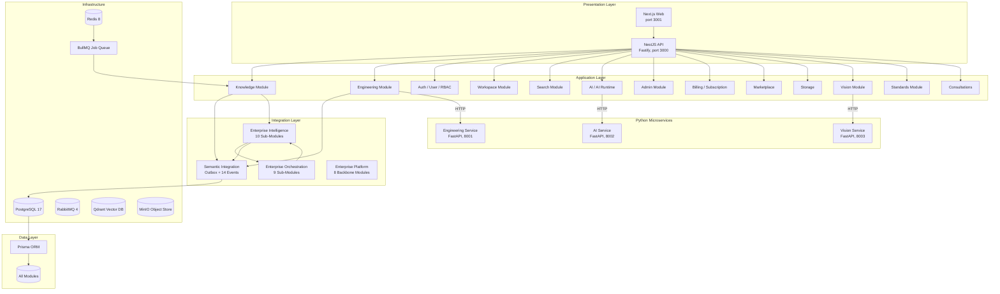

### Technology Stack

| Component               | Technology       | Version   |
| ----------------------- | ---------------- | --------- |
| **API Framework**       | NestJS + Fastify | 11.x      |
| **Web Framework**       | Next.js          | 15.x      |
| **Database**            | PostgreSQL       | 17        |
| **ORM**                 | Prisma           | 6.x       |
| **Cache**               | Redis            | 8         |
| **Message Queue**       | RabbitMQ         | 4         |
| **Vector DB**           | Qdrant           | latest    |
| **Object Storage**      | MinIO            | latest    |
| **Job Queue**           | BullMQ           | latest    |
| **Python API**          | FastAPI          | latest    |
| **Monorepo**            | pnpm + Turborepo | pnpm 10.x |
| **Language (API)**      | TypeScript       | 6.x       |
| **Language (Services)** | Python           | 3.12+     |
| **Testing (TS)**        | Jest             | latest    |
| **Testing (Python)**    | pytest           | latest    |
| **Container**           | Docker           | latest    |
| **Orchestration**       | Kubernetes       | planned   |

### Architectural Patterns

| Pattern                    | Status                  | Details                                               |
| -------------------------- | ----------------------- | ----------------------------------------------------- |
| Domain-Driven Design (DDD) | ✅ All modules          | domain/application/infrastructure/presentation layers |
| CQRS                       | ✅ Enterprise Messaging | Command/Query bus separation                          |
| Event-Driven               | ✅ Semantic Integration | 14 domain-event contracts and an outbox relay         |
| Outbox Pattern             | ✅ Implemented          | event_outbox table with 5s poll relay                 |
| Saga Pattern               | ✅ Enterprise Saga      | Orchestrator + compensation                           |
| Repository Pattern         | ✅ All modules          | Interface-based, tested                               |
| Circuit Breaker            | ✅ Engineering Client   | 3-state: CLOSED/OPEN/HALF_OPEN                        |
| Retry with Backoff         | ✅ Engineering Client   | 3 retries, 1s/2s/4s                                   |
| Multi-Tenancy              | ✅ All modules          | workspace_id on every entity                          |
| RBAC                       | ✅ All modules          | Roles, permissions, user_roles                        |
| Provider-Neutral AI        | ✅ AI Gateway           | 8 providers with routing/failover                     |

---

## 3. Module Registry

### Legend

- **Status:** ✅ Complete, ⚠️ Partial, 🔴 Not Started, 🟡 In Progress
- **Dependencies:** Modules this module imports or requires
- **Owner:** Team responsible

### 3.1 Core Business Modules

#### Health

| Attribute           | Value                                                |
| ------------------- | ---------------------------------------------------- |
| **Purpose**         | API health check endpoint for Docker/liveness probes |
| **Status**          | ✅ Complete                                          |
| **Dependencies**    | None                                                 |
| **Owner**           | Architecture Team                                    |
| **Public APIs**     | `GET /api/v1/health`                                 |
| **Internal APIs**   | `HealthService.getStatus()`                          |
| **Database tables** | None                                                 |
| **Events**          | None                                                 |
| **Roadmap**         | Stable                                               |
| **Known gaps**      | None                                                 |

#### Auth

| Attribute           | Value                                                                                                                                           |
| ------------------- | ----------------------------------------------------------------------------------------------------------------------------------------------- |
| **Purpose**         | Authentication — JWT (RS256) login/register/refresh/logout/password reset                                                                       |
| **Status**          | ✅ Complete                                                                                                                                     |
| **Dependencies**    | User module, Workspace module                                                                                                                   |
| **Owner**           | Architecture Team                                                                                                                               |
| **Public APIs**     | `POST /auth/login`, `POST /auth/register`, `POST /auth/refresh`, `POST /auth/logout`, `POST /auth/forgot-password`, `POST /auth/reset-password` |
| **Internal APIs**   | `AuthService`, `JwtStrategy`, `JwtAuthGuard`                                                                                                    |
| **Database tables** | `refresh_tokens`, `password_reset_tokens`                                                                                                       |
| **Events**          | None                                                                                                                                            |
| **Roadmap**         | MFA planned                                                                                                                                     |
| **Known gaps**      | No MFA, no OAuth2 social login                                                                                                                  |

#### User

| Attribute           | Value                                                         |
| ------------------- | ------------------------------------------------------------- |
| **Purpose**         | User CRUD, profile management, admin user management          |
| **Status**          | ✅ Complete                                                   |
| **Dependencies**    | Auth module, Storage module (avatar)                          |
| **Owner**           | Architecture Team                                             |
| **Public APIs**     | `GET/PUT /users/profile`, `GET/PUT/DELETE /users/:id` (admin) |
| **Internal APIs**   | `UserService`, `UserRepository`                               |
| **Database tables** | `users`                                                       |
| **Events**          | None                                                          |
| **Roadmap**         | Profile enrichment                                            |
| **Known gaps**      | None                                                          |

#### Workspace

| Attribute           | Value                                                                                                 |
| ------------------- | ----------------------------------------------------------------------------------------------------- |
| **Purpose**         | Multi-tenant workspaces, members, invitations, settings                                               |
| **Status**          | ✅ Complete (⚠️ workspace_members gaps documented)                                                    |
| **Dependencies**    | User module, RBAC module                                                                              |
| **Owner**           | Architecture Team                                                                                     |
| **Public APIs**     | `CRUD /workspaces`, `workspaces/:id/members`, `workspaces/:id/invitations`, `workspaces/:id/settings` |
| **Internal APIs**   | `WorkspaceService`, `WorkspaceGuard`, `TenantContext`                                                 |
| **Database tables** | `workspaces`, `workspace_members`, `workspace_invitations`, `workspace_settings`                      |
| **Events**          | None                                                                                                  |
| **Roadmap**         | Workspace-level feature flags                                                                         |
| **Known gaps**      | Workspace_members table has partial gaps                                                              |

#### RBAC

| Attribute           | Value                                                       |
| ------------------- | ----------------------------------------------------------- |
| **Purpose**         | Role-based access control — roles, permissions, user_roles  |
| **Status**          | ✅ Complete                                                 |
| **Dependencies**    | Workspace module                                            |
| **Owner**           | Architecture Team                                           |
| **Public APIs**     | `CRUD /roles`, `CRUD /permissions`, `roles/:id/permissions` |
| **Internal APIs**   | `PermissionsGuard`, `RolesService`, `PermissionService`     |
| **Database tables** | `roles`, `permissions`, `role_permissions`, `user_roles`    |
| **Events**          | None                                                        |
| **Roadmap**         | Policy-based authorization                                  |
| **Known gaps**      | None                                                        |

#### Project

| Attribute           | Value                                                             |
| ------------------- | ----------------------------------------------------------------- |
| **Purpose**         | Engineering project management with members, notes, reports       |
| **Status**          | ✅ Complete                                                       |
| **Dependencies**    | Workspace module, User module                                     |
| **Owner**           | Engineering Team                                                  |
| **Public APIs**     | `CRUD /projects`, `projects/:id/members`, `projects/:id/notes`    |
| **Internal APIs**   | `ProjectService`, `ProjectRepository`                             |
| **Database tables** | `projects`, `project_members`, `project_notes`, `project_reports` |
| **Events**          | None                                                              |
| **Roadmap**         | Project templates                                                 |
| **Known gaps**      | None                                                              |

#### Engineering

| Attribute           | Value                                                                                               |
| ------------------- | --------------------------------------------------------------------------------------------------- |
| **Purpose**         | Gateway to engineering-service (80+ calculators), circuit breaker, retry                            |
| **Status**          | ✅ Complete (⚠️ Gateway needs proxy refactor)                                                       |
| **Dependencies**    | Engineering Service (Python, port 8001), Project module                                             |
| **Owner**           | Engineering Team                                                                                    |
| **Public APIs**     | `POST /engineering/calculate/:type`, `GET /engineering/calculations/:id`, `GET /engineering/health` |
| **Internal APIs**   | `EngineeringClientService`, `CircuitBreaker`, `CalculationRepository`                               |
| **Database tables** | `calculations`, `calculation_templates`                                                             |
| **Events**          | None                                                                                                |
| **Roadmap**         | Streaming calculation results                                                                       |
| **Known gaps**      | `proxyJson` uses raw fetch (bypasses circuit breaker); Energy OCR endpoints use raw fetch           |

#### Subscription / Billing

| Attribute           | Value                                                                                                                      |
| ------------------- | -------------------------------------------------------------------------------------------------------------------------- |
| **Purpose**         | Plans, subscriptions, invoices, payments, usage tracking                                                                   |
| **Status**          | ✅ Complete                                                                                                                |
| **Dependencies**    | Workspace module, User module                                                                                              |
| **Owner**           | Business Team                                                                                                              |
| **Public APIs**     | `GET /plans`, `CRUD /subscriptions`, `GET /invoices`, `POST /payments`                                                     |
| **Internal APIs**   | `SubscriptionService`, `BillingService`, `PaymentGateway`                                                                  |
| **Database tables** | `plans`, `subscriptions`, `invoices`, `payments`, `transactions`, `payment_methods`, `subscription_payments`, `usage_logs` |
| **Events**          | None                                                                                                                       |
| **Roadmap**         | Online payment gateway integration                                                                                         |
| **Known gaps**      | Payment gateway is stub                                                                                                    |

#### Storage

| Attribute           | Value                                                             |
| ------------------- | ----------------------------------------------------------------- |
| **Purpose**         | File storage with versioning (MinIO-backed)                       |
| **Status**          | ✅ Complete                                                       |
| **Dependencies**    | Workspace module, User module, MinIO                              |
| **Owner**           | Infrastructure Team                                               |
| **Public APIs**     | `POST /storage/upload`, `GET /storage/:id`, `DELETE /storage/:id` |
| **Internal APIs**   | `StorageService`, `FileRepository`                                |
| **Database tables** | `files`, `file_versions`                                          |
| **Events**          | None                                                              |
| **Roadmap**         | MinIO integration in base docker-compose                          |
| **Known gaps**      | MinIO not in base compose; controller missing                     |

#### Notification

| Attribute           | Value                                                      |
| ------------------- | ---------------------------------------------------------- |
| **Purpose**         | In-app notifications, multi-channel delivery               |
| **Status**          | 🔴 Not Started (entity + service + controller all missing) |
| **Dependencies**    | User module                                                |
| **Owner**           | Architecture Team                                          |
| **Public APIs**     | Planned                                                    |
| **Internal APIs**   | Planned                                                    |
| **Database tables** | `notifications` (schema exists)                            |
| **Events**          | None                                                       |
| **Roadmap**         | Email, SMS, push notifications                             |
| **Known gaps**      | Completely unimplemented beyond schema                     |

#### AI

| Attribute           | Value                                                                             |
| ------------------- | --------------------------------------------------------------------------------- |
| **Purpose**         | AI agent management, conversation storage, usage tracking                         |
| **Status**          | ✅ Complete                                                                       |
| **Dependencies**    | AI Service (Python, port 8002), Workspace module                                  |
| **Owner**           | AI Team                                                                           |
| **Public APIs**     | `GET /ai/agents`, `CRUD /ai/conversations`, `POST /ai/conversations/:id/messages` |
| **Internal APIs**   | `AiService`, `ConversationService`                                                |
| **Database tables** | `agents`, `conversations`, `messages`, `ai_usage`                                 |
| **Events**          | None                                                                              |
| **Roadmap**         | Multi-agent orchestration                                                         |
| **Known gaps**      | Controller exists; service is thin wrapper                                        |

#### AI Runtime

| Attribute           | Value                                                    |
| ------------------- | -------------------------------------------------------- |
| **Purpose**         | In-memory AI runtime caches (memory store, prompt store) |
| **Status**          | ✅ Complete                                              |
| **Dependencies**    | AI module                                                |
| **Owner**           | AI Team                                                  |
| **Public APIs**     | Runtime management endpoints                             |
| **Internal APIs**   | `MemoryAbstractionService`, `PromptRegistryService`      |
| **Database tables** | None (in-memory)                                         |
| **Events**          | Consumes cache invalidation events                       |
| **Roadmap**         | Persistent storage replacement                           |
| **Known gaps**      | In-memory only — no Redis adapter                        |

#### Knowledge

| Attribute           | Value                                                                                                                                                                                                                                                                     |
| ------------------- | ------------------------------------------------------------------------------------------------------------------------------------------------------------------------------------------------------------------------------------------------------------------------- |
| **Purpose**         | Knowledge articles CRUD, taxonomy, translations, workflow, analytics                                                                                                                                                                                                      |
| **Status**          | ✅ Complete (core CRUD + lifecycle)                                                                                                                                                                                                                                       |
| **Dependencies**    | Workspace module, User module, Storage module                                                                                                                                                                                                                             |
| **Owner**           | Knowledge Team                                                                                                                                                                                                                                                            |
| **Public APIs**     | `CRUD /knowledge`, lifecycle/workflow/rich-content routes, `GET /knowledge/search`, `GET /public/knowledge/:slug`                                                                                                                                                         |
| **Internal APIs**   | `KnowledgeService`, `KnowledgeRepository`, `KnowledgeSearchService`                                                                                                                                                                                                       |
| **Database tables** | `knowledge`, `knowledge_translations`, `knowledge_taxonomy`, `knowledge_media`, `knowledge_formulas`, `knowledge_examples`, `knowledge_standards`, `knowledge_versions`, `knowledge_comments`, `knowledge_workflows`, `knowledge_workflow_history`, `knowledge_analytics` |
| **Events**          | Emits active `KnowledgeArticlePublished` and `KnowledgeArticleArchived` lifecycle events                                                                                                                                                                                  |
| **Roadmap**         | AI-assisted article generation                                                                                                                                                                                                                                            |
| **Known gaps**      | 12 knowledge tables but sparse usage                                                                                                                                                                                                                                      |

#### Knowledge Factory

| Attribute           | Value                                                                                                                                                                 |
| ------------------- | --------------------------------------------------------------------------------------------------------------------------------------------------------------------- |
| **Purpose**         | Automated document ingestion pipeline (upload → classify → parse → chunk → embed → publish)                                                                           |
| **Status**          | ⚠️ Dormant target architecture — module not imported; list/detail are stubbed; queue/worker activation blockers (see `docs/knowledge/knowledge-runtime-audit.md`)     |
| **Dependencies**    | Intended: Workspace, User, AI, Vision, Redis/BullMQ; not active in the API runtime                                                                                    |
| **Owner**           | Knowledge Team                                                                                                                                                        |
| **Public APIs**     | `POST /knowledge-factory/documents/upload`, `GET /knowledge-factory/documents`, `GET /knowledge-factory/documents/:id`, `POST /knowledge-factory/documents/:id/retry` |
| **Internal APIs**   | `IngestionService`, `ClassificationService`, `ChunkingService`, `PublishWorker`                                                                                       |
| **Database tables** | `knowledge_documents`, `knowledge_document_chunks`, `knowledge_pipeline_runs`, `knowledge_extractions`                                                                |
| **Events**          | Event types/workers exist, but Factory is not an active runtime producer                                                                                              |
| **Roadmap**         | OCR integration, table extraction, DWG support                                                                                                                        |
| **Known gaps**      | Module dormant; stubbed document reads; inconsistent guards/permissions; incomplete analytics; unsafe queue/worker configuration                                      |

#### Knowledge Intelligence

| Attribute           | Value                                                                                                                                                                                                                                                                          |
| ------------------- | ------------------------------------------------------------------------------------------------------------------------------------------------------------------------------------------------------------------------------------------------------------------------------ |
| **Purpose**         | Semantic reasoning layer — knowledge graph, metrics, citations, ontologies                                                                                                                                                                                                     |
| **Status**          | ✅ Active — 28 guarded reasoning, metrics, citation, clustering, search, ontology, and taxonomy routes                                                                                                                                                                         |
| **Dependencies**    | Workspace/RBAC and graph persistence; Knowledge Factory is not required for current HTTP operation                                                                                                                                                                             |
| **Owner**           | Knowledge Team                                                                                                                                                                                                                                                                 |
| **Public APIs**     | Graph traversal/reasoning, metrics, citations, search, clustering/duplicates, ontologies, taxonomy (no generic graph CRUD controller)                                                                                                                                          |
| **Internal APIs**   | `GraphNodeRepository`, `GraphEdgeRepository`, `GraphMetricsRepository`, `KnowledgeConfidenceService`, `KnowledgeFreshnessService`, `KnowledgeAuthorityService`, `KnowledgeCompletenessService`, `GraphTraversalService`, `ConflictDetectionService`, `OntologyRegistryService` |
| **Database tables** | `knowledge_graph_nodes`, `knowledge_graph_edges`, `knowledge_graph_metrics`, `ontologies`, `ontology_classes`, `ontology_relations`, `knowledge_citations`, `document_similarities`, `knowledge_clusters`                                                                      |
| **Events**          | Active CMS publish/archive handlers synchronize article graph projections; automatic Factory-originated creation remains unavailable                                                                                                                                           |
| **Roadmap**         | Advanced reasoning, SPARQL-like query                                                                                                                                                                                                                                          |
| **Known gaps**      | No vector store integration for hybrid search; shared `PermissionsGuard` fails open on unexpected authorization-service errors and must be hardened outside this Knowledge-only change                                                                                         |

#### Semantic Integration

| Attribute           | Value                                                                                                                                                         |
| ------------------- | ------------------------------------------------------------------------------------------------------------------------------------------------------------- |
| **Purpose**         | Event-driven integration layer — persistent outbox, process-local event bus, and idempotency records                                                          |
| **Status**          | ⚠️ Active with delivery limitations; see `docs/knowledge/semantic-integration-implementation.md`                                                              |
| **Dependencies**    | Knowledge Intelligence and AI Runtime; globally exports the event publisher                                                                                   |
| **Owner**           | Architecture Team                                                                                                                                             |
| **Public APIs**     | None (internal event infrastructure)                                                                                                                          |
| **Internal APIs**   | `DomainEventPublisher`, `SemanticEventBus`, `OutboxRelayService`, two Factory-document handlers, and two active CMS article handlers                          |
| **Database tables** | `event_outbox`, `event_process_log`                                                                                                                           |
| **Events**          | 14 contracts; CMS publish/archive are active, while Factory-originated contracts have no active Factory producer                                              |
| **Roadmap**         | Atomic source/outbox transactions, propagated handler failures, safe relay claiming/backoff, dead-letter controls, and a distributed event bus                |
| **Known gaps**      | Source/outbox writes are non-atomic; handler errors can be swallowed before relay delivery status; retries use fixed polling; subscriptions are process-local |

#### Search

| Attribute           | Value                                                                  |
| ------------------- | ---------------------------------------------------------------------- |
| **Purpose**         | Hybrid search (full-text + vector via Qdrant) with workspace isolation |
| **Status**          | ✅ Complete                                                            |
| **Dependencies**    | Knowledge module, Qdrant vector DB                                     |
| **Owner**           | Knowledge Team                                                         |
| **Public APIs**     | `POST /search`, `GET /search/health`                                   |
| **Internal APIs**   | `SearchService`, `HybridSearchService`, `SearchRepository`             |
| **Database tables** | None (uses knowledge tables + Qdrant)                                  |
| **Events**          | Consumes: SearchIndexUpdated                                           |
| **Roadmap**         | Federated search across all modules                                    |
| **Known gaps**      | Qdrant not in base docker-compose; needs live instance for E2E tests   |

#### Consultations

| Attribute           | Value                                             |
| ------------------- | ------------------------------------------------- |
| **Purpose**         | Engineering consultation requests and management  |
| **Status**          | ✅ Complete                                       |
| **Dependencies**    | Workspace module, User module, Engineering module |
| **Owner**           | Engineering Team                                  |
| **Public APIs**     | `CRUD /consultations`                             |
| **Internal APIs**   | `ConsultationService`                             |
| **Database tables** | Consultation-related tables                       |
| **Events**          | None                                              |
| **Roadmap**         | AI-assisted consultation                          |
| **Known gaps**      | None                                              |

#### Admin

| Attribute           | Value                                                         |
| ------------------- | ------------------------------------------------------------- |
| **Purpose**         | System administration — settings, audit logs, user management |
| **Status**          | ✅ Complete                                                   |
| **Dependencies**    | All modules                                                   |
| **Owner**           | Architecture Team                                             |
| **Public APIs**     | Admin CRUD endpoints                                          |
| **Internal APIs**   | `AdminService`, `AuditLogService`                             |
| **Database tables** | `system_settings`, `audit_logs`                               |
| **Events**          | None                                                          |
| **Roadmap**         | Admin dashboard                                               |
| **Known gaps**      | None                                                          |

#### Marketplace

| Attribute           | Value                                                                                 |
| ------------------- | ------------------------------------------------------------------------------------- |
| **Purpose**         | Product catalog, vendor management, ordering                                          |
| **Status**          | ✅ Complete                                                                           |
| **Dependencies**    | Workspace module, User module, Billing module                                         |
| **Owner**           | Business Team                                                                         |
| **Public APIs**     | `CRUD /marketplace/products`, `CRUD /marketplace/vendors`, `POST /marketplace/orders` |
| **Internal APIs**   | `MarketplaceService`, `ProductRepository`, `OrderService`                             |
| **Database tables** | `vendors`, `products`, `product_translations`, `orders`, `order_items`                |
| **Events**          | None                                                                                  |
| **Roadmap**         | Vendor dashboard, payment gateway                                                     |
| **Known gaps**      | Payment gateway is stub                                                               |

#### API Keys

| Attribute           | Value                                        |
| ------------------- | -------------------------------------------- |
| **Purpose**         | API key management for external integrations |
| **Status**          | ✅ Complete                                  |
| **Dependencies**    | Workspace module                             |
| **Owner**           | Architecture Team                            |
| **Public APIs**     | `CRUD /api-keys`                             |
| **Internal APIs**   | `ApiKeyService`, `ApiKeyGuard`               |
| **Database tables** | `api_keys`                                   |
| **Events**          | None                                         |
| **Roadmap**         | Key rotation automation                      |
| **Known gaps**      | None                                         |

#### Webhooks

| Attribute           | Value                                          |
| ------------------- | ---------------------------------------------- |
| **Purpose**         | Outbound webhook delivery with SSRF protection |
| **Status**          | ✅ Complete                                    |
| **Dependencies**    | Workspace module                               |
| **Owner**           | Architecture Team                              |
| **Public APIs**     | `CRUD /webhooks`                               |
| **Internal APIs**   | `WebhookService`, `WebhookDeliveryService`     |
| **Database tables** | `webhooks`                                     |
| **Events**          | Emits webhook events                           |
| **Roadmap**         | Retry and idempotency                          |
| **Known gaps**      | SSRF protection implemented                    |

#### Email

| Attribute           | Value                                             |
| ------------------- | ------------------------------------------------- |
| **Purpose**         | Email delivery service                            |
| **Status**          | ✅ Complete (service + repository, no controller) |
| **Dependencies**    | None                                              |
| **Owner**           | Infrastructure Team                               |
| **Public APIs**     | None (internal)                                   |
| **Internal APIs**   | `EmailService`, `EmailRepository`                 |
| **Database tables** | Email-related tables                              |
| **Events**          | None                                              |
| **Roadmap**         | Template engine                                   |
| **Known gaps**      | Not wired to any module                           |

#### Feature Flags

| Attribute           | Value                                               |
| ------------------- | --------------------------------------------------- |
| **Purpose**         | Feature flag management with plan/workspace scoping |
| **Status**          | ✅ Complete (service + repository, no controller)   |
| **Dependencies**    | Plan module                                         |
| **Owner**           | Architecture Team                                   |
| **Public APIs**     | None (internal)                                     |
| **Internal APIs**   | `FeatureFlagService`                                |
| **Database tables** | `feature_flags`                                     |
| **Events**          | None                                                |
| **Roadmap**         | A/B testing support                                 |
| **Known gaps**      | Not wired to any module                             |

#### Vision

| Attribute           | Value                                                                    |
| ------------------- | ------------------------------------------------------------------------ |
| **Purpose**         | Gateway to vision-service (OCR, document analysis, nameplate extraction) |
| **Status**          | ✅ Complete                                                              |
| **Dependencies**    | Vision Service (Python, port 8003)                                       |
| **Owner**           | Vision Team                                                              |
| **Public APIs**     | `POST /vision/analyze`, `POST /vision/ocr`                               |
| **Internal APIs**   | `VisionClientService`                                                    |
| **Database tables** | None                                                                     |
| **Events**          | None                                                                     |
| **Roadmap**         | Real-time video processing                                               |
| **Known gaps**      | Uses raw fetch (no circuit breaker)                                      |

#### Standards

| Attribute           | Value                                                        |
| ------------------- | ------------------------------------------------------------ |
| **Purpose**         | Engineering standards management (IEC, IEEE, etc.)           |
| **Status**          | ✅ Complete                                                  |
| **Dependencies**    | Knowledge module                                             |
| **Owner**           | Engineering Team                                             |
| **Public APIs**     | `CRUD /standards`                                            |
| **Internal APIs**   | `StandardService`, `StandardRepository`                      |
| **Database tables** | `engineering_standards` (cross-ref with knowledge_standards) |
| **Events**          | None                                                         |
| **Roadmap**         | Standard versioning                                          |
| **Known gaps**      | None                                                         |

### 3.2 Enterprise Platform Modules (Sprint E1)

| Module                            | Purpose                                                   | Status      | DB Tables        | APIs     |
| --------------------------------- | --------------------------------------------------------- | ----------- | ---------------- | -------- |
| **Enterprise Messaging**          | Command Bus, Query Bus, Message Queue, DLQ                | ✅ Complete | None (in-memory) | Internal |
| **Enterprise Event Architecture** | Schema registry, versioning, compatibility, replay        | ✅ Complete | None (in-memory) | Internal |
| **Enterprise Saga**               | Saga orchestrator, compensation, step timeout             | ✅ Complete | None (in-memory) | Internal |
| **Enterprise Cache**              | Tag-based invalidation, TTL, namespaces, pattern matching | ✅ Complete | None (in-memory) | Internal |
| **Enterprise Observability**      | Distributed tracing, metrics, structured logging          | ✅ Complete | None (in-memory) | Internal |
| **Enterprise Config**             | Feature flags, scoped config (system/workspace/user)      | ✅ Complete | None (in-memory) | Internal |
| **Enterprise API Platform**       | API discovery, version tracking, token-bucket rate limit  | ✅ Complete | None (in-memory) | Internal |
| **Enterprise Search Federation**  | Multi-source federated search, scoring, dedup             | ✅ Complete | None (in-memory) | Internal |

**Known gaps (all E1 modules):** In-memory stores only — need PostgreSQL/Redis adapters for production.

### 3.3 Enterprise Intelligence Modules (Sprint I1)

| Module                  | Purpose                                             | Status      | Files | Tests   |
| ----------------------- | --------------------------------------------------- | ----------- | ----- | ------- |
| **Context Engine**      | 11 source builders + context assembler with caching | ✅ Complete | 13    | 29 unit |
| **Memory Platform**     | 7 memory types with indexing, expiration            | ✅ Complete | 12    | 28 unit |
| **Prompt Governance**   | Registry, versioning, templates, policies, audit    | ✅ Complete | 18    | 37 unit |
| **Tool Registry**       | JSON Schema validation, capability discovery        | ✅ Complete | 11    | 35 unit |
| **Skill Registry**      | Dependency resolution, DAG composition              | ✅ Complete | 11    | 24 unit |
| **Reasoning Engine**    | DAG execution graph, reflection, verification       | ✅ Complete | 15    | 26 unit |
| **Policy Engine**       | Priority-ordered, deny-overrides, wildcard          | ✅ Complete | 10    | 22 unit |
| **AI Gateway**          | 8 providers, quotas, retry, latency telemetry       | ✅ Complete | 16    | 15 unit |
| **Evaluation Platform** | Pluggable strategies, regression detection          | ✅ Complete | 13    | 21 unit |
| **Intelligence SDK**    | 9 API facades + cross-cutting workflows             | ✅ Complete | 11    | —       |

**Total:** 135 files, ~12,000 LOC, ~237 unit + 39 integration tests.

**Known gaps (all I1 modules):** In-memory first — persistence interfaces defined but no DB implementations.

### 3.4 Enterprise Orchestration Modules (Sprint O1 — In Progress)

| Module                   | Purpose                            | Status         |
| ------------------------ | ---------------------------------- | -------------- |
| **Conversation Runtime** | Multi-turn conversation management | 🟡 In Progress |
| **Cost Management**      | AI cost tracking and budgeting     | 🟡 In Progress |
| **Execution Context**    | Execution context propagation      | 🟡 In Progress |
| **Explainability**       | AI decision explainability         | 🟡 In Progress |
| **Human-in-the-Loop**    | Human approval workflows           | 🟡 In Progress |
| **Multi-Agent**          | Multi-agent coordination           | 🟡 In Progress |
| **Planning Engine**      | AI task planning                   | 🟡 In Progress |
| **Workflow Engine**      | Workflow definition and execution  | 🟡 In Progress |
| **Workflow Runtime**     | Workflow execution runtime         | 🟡 In Progress |

### 3.5 AI Provider Management (Sprint P2 — In Progress)

| Attribute           | Value                                                                                                                                                                                                                                                              |
| ------------------- | ------------------------------------------------------------------------------------------------------------------------------------------------------------------------------------------------------------------------------------------------------------------ |
| **Purpose**         | Multi-provider AI management — providers, models, credentials, health, usage, routing policies                                                                                                                                                                     |
| **Status**          | 🟡 In Progress (domain + infrastructure layers complete)                                                                                                                                                                                                           |
| **Dependencies**    | AI Gateway, Workspace module                                                                                                                                                                                                                                       |
| **Owner**           | AI Team                                                                                                                                                                                                                                                            |
| **Database tables** | `ai_providers`, `ai_models`, `ai_provider_credentials`, `ai_provider_health`, `ai_provider_usage`, `ai_provider_statistics`, `ai_provider_quotas`, `ai_provider_model_capabilities`, `ai_routing_policies`, `ai_routing_rules`, `ai_feature_flags`, `ai_audit_log` |

### 3.6 Python Microservices

#### Engineering Service (port 8001)

| Attribute       | Value                                                                                                                                                |
| --------------- | ---------------------------------------------------------------------------------------------------------------------------------------------------- |
| **Purpose**     | Electrical engineering calculations — 13 router categories, 80+ calculators                                                                          |
| **Status**      | ✅ Full                                                                                                                                              |
| **Calculators** | basic, cable, transformer, protection, switchgear, lighting, power_system, renewable, economics, grounding, harmonic, energy_analyzer, power_quality |
| **Tests**       | Extensive: test_calculators/ (18 subdirs), test_core/, integration/                                                                                  |

#### AI Service (port 8002)

| Attribute      | Value                                                                                  |
| -------------- | -------------------------------------------------------------------------------------- |
| **Purpose**    | LLM orchestration, RAG pipeline, agents                                                |
| **Status**     | ✅ LLM orchestration                                                                   |
| **Components** | Agents (document_analyst, electrical_engineer), RAG pipeline, vector store integration |
| **Tests**      | test_agents.py, test_vector_store.py                                                   |

#### Vision Service (port 8003)

| Attribute           | Value                                                                                                                                                                                   |
| ------------------- | --------------------------------------------------------------------------------------------------------------------------------------------------------------------------------------- |
| **Purpose**         | Document/nameplate OCR, bill extraction, vision pipeline                                                                                                                                |
| **Status**          | ✅ Document analysis                                                                                                                                                                    |
| **Pipeline Stages** | preprocessing (denoiser, deskew, enhancer, corrector, validator) → detection (classifier) → OCR (tesseract, paddle, vision_llm) → extraction (nameplate, bill) → knowledge → validation |
| **Tests**           | test_extractors.py, test_pipeline.py, test_preprocessing.py, test_validation.py                                                                                                         |

---

## 4. Sprint History

### Sprint 0 — Repository Initialization

| Attribute        | Value                                                      |
| ---------------- | ---------------------------------------------------------- |
| **Goal**         | Initialize monorepo with NestJS + Next.js + Prisma         |
| **Deliverables** | pnpm workspace, Turborepo config, Prisma schema, seed data |
| **Impact**       | Foundation for all subsequent development                  |
| **Gaps**         | Minimal documentation                                      |

### Sprint D1 — Domain Foundation

| Attribute        | Value                                                              |
| ---------------- | ------------------------------------------------------------------ |
| **Goal**         | Core domain modules: Auth, User, Workspace, RBAC, Project          |
| **Deliverables** | Complete module structure with DDD layers, JWT auth, multi-tenancy |
| **Impact**       | Established DDD patterns used by all subsequent modules            |
| **Gaps**         | No workspace_members hardening                                     |

### Sprint K1 — Knowledge Foundation

| Attribute        | Value                                                                     |
| ---------------- | ------------------------------------------------------------------------- |
| **Goal**         | Knowledge module with CRUD, publish, search                               |
| **Deliverables** | KnowledgeController, KnowledgeService, 12 knowledge tables, hybrid search |
| **Impact**       | Core knowledge management capability                                      |
| **Gaps**         | No automated ingestion pipeline                                           |

### Sprint K2 — Semantic Integration

| Attribute                | Value                                                                                                                                                                                          |
| ------------------------ | ---------------------------------------------------------------------------------------------------------------------------------------------------------------------------------------------- |
| **Goal**                 | Event-driven integration layer connecting all modules                                                                                                                                          |
| **Deliverables**         | 12 domain events, outbox pattern, SemanticEventBus, OutboxRelayService, 2 handlers (DocumentPublished + CacheInvalidation), event_outbox + event_process_log tables, ADR + event topology docs |
| **Architectural Impact** | Established outbox pattern as core integration mechanism; 13 new TypeScript files                                                                                                              |
| **Gaps**                 | In-memory event bus; RabbitMQ adapter needed for distribution                                                                                                                                  |

### Sprint K3 — Platform Integration

| Attribute        | Value                                                          |
| ---------------- | -------------------------------------------------------------- |
| **Goal**         | Workspace hardening, engineering gateway                       |
| **Deliverables** | WorkspaceGuard, RBAC sync, ownership transfer, circuit breaker |
| **Impact**       | Multi-tenant security hardened                                 |
| **Gaps**         | Circuit breaker not on all HTTP clients                        |

### Sprint K4 — Production Integration Certification

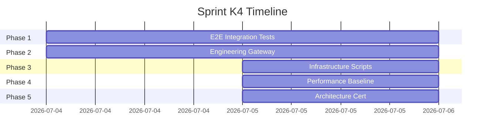

| Attribute                | Value                                                                                                                                                                                                               |
| ------------------------ | ------------------------------------------------------------------------------------------------------------------------------------------------------------------------------------------------------------------- |
| **Goal**                 | Production Integration Certification — 5 phases                                                                                                                                                                     |
| **Deliverables**         | 36 integration tests (43 assertions, 100% pass), circuit breaker (9 unit tests), engineering client (11 integration tests), health-check/startup-order/graceful-shutdown/benchmark scripts, 5 certification reports |
| **Architectural Impact** | Validated integration of Knowledge + Semantic Integration + Engineering Gateway                                                                                                                                     |
| **Gaps**                 | OpenAPI generation hangs; MinIO/Qdrant not in base compose; 718 `any` warnings                                                                                                                                      |

### Sprint E1 — Enterprise Platform Backbone

| Attribute                | Value                                                                                                              |
| ------------------------ | ------------------------------------------------------------------------------------------------------------------ |
| **Goal**                 | Enterprise-grade backbone: messaging, events, sagas, cache, observability, config, API platform, search federation |
| **Deliverables**         | 8 modules, ~1,650 LOC, 45 integration tests, ADRs 012-016                                                          |
| **Architectural Impact** | Enterprise messaging with CQRS; saga orchestration; tag-based cache invalidation; distributed tracing              |
| **Gaps**                 | All modules in-memory only; no Redis/PgBuster/RabbitMQ adapters                                                    |

### Sprint E2 — Enterprise Production Validation

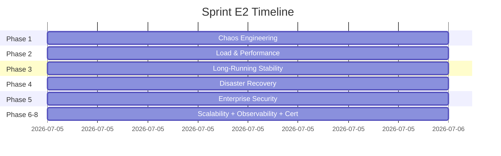

| Attribute                | Value                                                                                                                                                                                                                               |
| ------------------------ | ----------------------------------------------------------------------------------------------------------------------------------------------------------------------------------------------------------------------------------- |
| **Goal**                 | Enterprise Production Validation & Certification — 8 phases                                                                                                                                                                         |
| **Deliverables**         | 19 chaos scenarios, 4 k6 scripts (smoke/load/stress/soak), soak + memory profiler, disaster recovery RTO/RPO doc, OWASP checklist, security scan, scalability assessment, observability validation, production certification report |
| **Architectural Impact** | Validated resilience, scalability, security                                                                                                                                                                                         |
| **Gaps**                 | Kubernetes manifests not created; Prometheus metrics not exposed as HTTP endpoint                                                                                                                                                   |

### Sprint G1 — Enterprise Release Governance & Quality Gate

| Attribute                | Value                                                                                                                                                                                |
| ------------------------ | ------------------------------------------------------------------------------------------------------------------------------------------------------------------------------------ |
| **Goal**                 | Release governance automation — 8 phases, zero business logic changes                                                                                                                |
| **Deliverables**         | Release validator (15 steps), release manifest, build certification (A+-Fail), release checklist (25 items), GitHub CI pipeline (8 jobs), version policy docs, bootstrap integration |
| **Architectural Impact** | All 15 validation gates must pass before code reaches main; architecture, typecheck, lint, tests, docs all enforced automatically                                                    |
| **Gaps**                 | No end-to-end test for the CI pipeline itself (requires GitHub runner)                                                                                                               |

### Sprint I1 — Enterprise Intelligence Platform

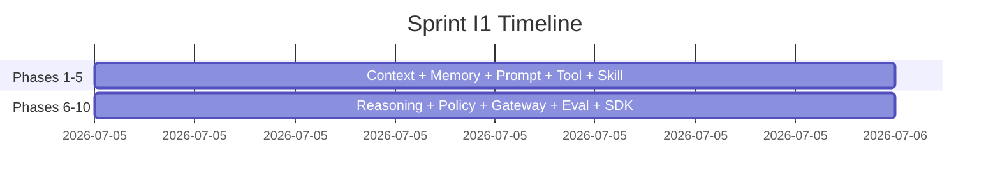

| Attribute                | Value                                                                                                                                                                              |
| ------------------------ | ---------------------------------------------------------------------------------------------------------------------------------------------------------------------------------- |
| **Goal**                 | Enterprise Intelligence Platform — 10 modules, 135 files, ~12,000 LOC                                                                                                              |
| **Deliverables**         | 10 modules (Context Engine, Memory Platform, Prompt Governance, Tool Registry, Skill Registry, Reasoning Engine, Policy Engine, AI Gateway, Evaluation Platform, Intelligence SDK) |
| **Architectural Impact** | Complete AI infrastructure layer; provider-neutral gateway; no LLM in reasoning engine                                                                                             |
| **Gaps**                 | In-memory persistence only; 10 @Global() modules increase startup complexity                                                                                                       |

### Sprint O1 — Enterprise Orchestration (Current)

| Attribute   | Value                                                                                                                                                        |
| ----------- | ------------------------------------------------------------------------------------------------------------------------------------------------------------ |
| **Goal**    | Enterprise Orchestration Platform — 9 modules                                                                                                                |
| **Status**  | 🟡 In Progress                                                                                                                                               |
| **Modules** | Conversation Runtime, Cost Management, Execution Context, Explainability, Human-in-the-Loop, Multi-Agent, Planning Engine, Workflow Engine, Workflow Runtime |
| **Gaps**    | Initial development phase                                                                                                                                    |

### Sprint P2 — AI Provider Management (Current)

| Attribute  | Value                                                                 |
| ---------- | --------------------------------------------------------------------- |
| **Goal**   | Multi-provider AI management — 12 new Prisma models, routing policies |
| **Status** | 🟡 In Progress (domain + infrastructure)                              |
| **Gaps**   | Presentation layer incomplete                                         |

---

## 5. Current Readiness

### Overall Readiness: 7.8 / 10 (CONDITIONAL GO)

| Dimension                    | Score  | Status                                                                         |
| ---------------------------- | ------ | ------------------------------------------------------------------------------ |
| **Production Readiness**     | 7.8/10 | CONDITIONAL GO — 4 critical, 5 high, 5 medium conditions remain                |
| **Enterprise Readiness**     | 7.3/10 | Enterprise AI modules complete; orchestration in progress                      |
| **Infrastructure Readiness** | 6.5/10 | Docker compose exists; k8s manifests missing; MinIO/Qdrant not in base compose |
| **Security Readiness**       | 8.5/10 | JWT + RBAC + workspace isolation; SSRF protected; OWASP assessed               |
| **Testing Readiness**        | 6.0/10 | 36 integration tests pass; 8.72% coverage; 3/23 modules have tests             |
| **Deployment Readiness**     | 7.0/10 | Release gate CI (8 jobs); build OK; lint OK on all packages                    |

### Remaining Blockers

1. **OpenAPI generation hangs** — Blocks API documentation pipeline
2. **Web build timeout** — Next.js standalone build hangs (unknown root cause)
3. **No CI/CD pipeline** — No automated verification
4. **Lint broken on 4/6 packages** — Code quality not enforced
5. **718 `any` warnings** — Reduces type safety
6. **In-memory stores** — Cache, event bus, saga stores all in-memory (not shared across instances)
7. **MinIO/Qdrant not in base docker-compose** — Not available in dev stack

---

## 6. Critical Technical Debt

### Open Issues

| #   | Issue                                              | Impact                            | Effort  | Status       |
| --- | -------------------------------------------------- | --------------------------------- | ------- | ------------ |
| 1   | OpenAPI generation hangs on `NestFactory.create()` | Blocks API documentation pipeline | 2h      | Known        |
| 2   | 718 `any` type warnings                            | Reduces type safety               | 40h     | Pre-existing |
| 3   | Web build timeout (Next.js)                        | Cannot deploy web                 | Unknown | Unknown      |
| 4   | 98 `throw new Error` instead of NestJS exceptions  | Unhandled 500s in production      | 2-4 wk  | Critical     |

### Known Limitations

| Limitation                            | Impact                                          | Workaround                      |
| ------------------------------------- | ----------------------------------------------- | ------------------------------- |
| In-memory event bus (not distributed) | Events not shared across multiple API instances | Single-instance deployment      |
| In-memory cache (not Redis-backed)    | Cache lost on restart                           | Acceptable for single-instance  |
| In-memory saga store                  | Saga state lost on restart                      | Acceptable for single-instance  |
| In-memory memory platform             | All 7 memory layers in-process                  | In-memory per design (Phase I1) |

### Temporary Implementations

| Component       | Current           | Target                    |
| --------------- | ----------------- | ------------------------- |
| Event Bus       | In-memory pub/sub | RabbitMQ adapter          |
| Cache           | In-memory Map     | Redis adapter             |
| Saga Store      | In-memory Map     | PostgreSQL persistence    |
| Memory Platform | In-memory stores  | PostgreSQL/Redis adapters |
| AI Runtime      | In-memory caches  | Redis-backed              |

### Stub Implementations

| Component           | Stub Detail                      |
| ------------------- | -------------------------------- |
| Payment Gateway     | Not connected to real gateway    |
| API Gateway service | `services/api-gateway/` is empty |
| Notification module | Schema exists, no implementation |
| Workers directory   | Not created yet                  |

### Performance Bottlenecks

| Bottleneck                 | Details                                                             |
| -------------------------- | ------------------------------------------------------------------- |
| Single PostgreSQL instance | No read replicas, no PgBouncer                                      |
| In-process cache           | Not shared, lost on restart                                         |
| BullMQ with single Redis   | No Redis cluster                                                    |
| Monolithic NestJS API      | Single process; horizontal scaling requires Redis/RabbitMQ adapters |

### Future Migrations

| Migration                         | Target Sprint | Effort  |
| --------------------------------- | ------------- | ------- |
| In-memory → Redis cache           | Post-O1       | 1 wk    |
| In-memory → RabbitMQ event bus    | Post-O1       | 2 wk    |
| In-memory → PostgreSQL saga store | Post-O1       | 1 wk    |
| Monolith → Microservices API      | Post-O1       | Unknown |
| Docker → Kubernetes               | Post-O1       | 2-3 wk  |

---

## 7. Coding Standards

### DDD Rules

1. **Entities** have identity (UUID), are mutable, and contain domain logic
2. **Value Objects** are immutable, have no identity, and are compared by value
3. **Aggregates** are consistency boundaries with a single root entity
4. **Repositories** are interface-based, one per aggregate root
5. **Domain Services** contain business logic that doesn't naturally belong to an entity or VO
6. **Application Services** orchestrate domain logic, use repositories, and handle transactions
7. **Infrastructure** implements interfaces defined in domain layer

### SOLID in Practice

| Principle             | Implementation                                       |
| --------------------- | ---------------------------------------------------- |
| Single Responsibility | Each class has exactly one reason to change          |
| Open/Closed           | Modules open for extension, closed for modification  |
| Liskov Substitution   | Interface implementations are interchangeable        |
| Interface Segregation | Interfaces are small and focused                     |
| Dependency Inversion  | High-level modules don't depend on low-level modules |

### Repository Rules

1. Repository interfaces are defined in `domain/`
2. Repository implementations are in `infrastructure/persistence/`
3. Repositories return domain entities, not DTOs
4. Repositories never expose Prisma types
5. One repository per aggregate root
6. Repositories handle data access only — no business logic

### Application Services

1. Services orchestrate domain logic
2. Services inject repositories (via interfaces)
3. Services handle transactions and commit on success
4. Services throw domain exceptions on business rule violations
5. Services never access Prisma directly

### Entity Rules

1. All entities extend `BaseEntity` (id, createdAt, updatedAt, deletedAt)
2. All entity IDs are UUIDs
3. All entities have soft-delete via `deletedAt`
4. Entity properties are private, accessed via methods
5. Entity constructors enforce invariants

### Value Objects

1. Decorated with `@ValueObject()` decorator
2. Immutable — properties are `readonly`
3. Implement `equals()` for value comparison
4. No ORM mapping — stored as JSON in database

### Module Boundaries

```
module/
├── domain/
│   ├── entities/
│   ├── value-objects/
│   ├── interfaces/ (repository, factory)
│   └── services/ (domain services)
├── application/
│   ├── services/ (application services)
│   └── dto/
├── infrastructure/
│   ├── persistence/ (repository implementations)
│   ├── http/ (HTTP clients, circuit breakers)
│   └── adapters/ (external service adapters)
└── presentation/
    ├── controllers/
    ├── guards/
    └── decorators/
```

### Dependency Rules

1. Domain layer → no imports from outer layers
2. Application layer → imports domain
3. Infrastructure layer → implements domain interfaces
4. Presentation layer → imports application services
5. No circular dependencies between modules

### Import Rules

1. All relative imports use `.js` extension: `import { Foo } from './foo.js'`
2. No barrel/index.ts re-exports (explicit imports only)
3. No deep imports across module boundaries

### Naming Conventions

| Element    | Convention    | Example                        |
| ---------- | ------------- | ------------------------------ |
| Modules    | `kebab-case`  | `knowledge-factory`            |
| Classes    | `PascalCase`  | `KnowledgeFactoryService`      |
| Methods    | `camelCase`   | `getDocumentById()`            |
| Files      | `kebab-case`  | `knowledge-factory.service.ts` |
| Interfaces | `I` prefix    | `IEventHandler`                |
| Enums      | `PascalCase`  | `EventType`                    |
| Types      | `PascalCase`  | `DomainEvent`                  |
| Variables  | `camelCase`   | `documentId`                   |
| Constants  | `UPPER_SNAKE` | `MAX_RETRY_COUNT`              |

### Testing Rules

1. Unit tests: `*.spec.ts`, co-located with source
2. E2E tests: `*.e2e-spec.ts`, in `test/` directory
3. Test file mirrors source path: `service.ts` → `service.spec.ts`
4. Mock external dependencies; use `@nestjs/testing` Test.createTestingModule
5. Use `jest.fn()` or `jest.spyOn()` for mocks
6. Target ≥ 80% coverage for new code

### Swagger Rules

1. Controllers use `@ApiTags()`, `@ApiOperation()`, `@ApiBearerAuth()`
2. DTOs use `@ApiProperty()` with descriptions
3. Unified response: `{success, data, meta}` / `{success, error}`
4. Swagger auto-generated during build — never edit `packages/openapi/v1/openapi.json` manually

---

## 8. Development Rules

### DO

- ✅ DO use `.js` extension in all imports: `import { Foo } from './foo.js'`
- ✅ DO use `@Global()` for shared infrastructure modules
- ✅ DO define interfaces in domain layer
- ✅ DO implement repositories for data access
- ✅ DO use `WorkspaceGuard` for multi-tenant isolation
- ✅ DO use `JwtAuthGuard` for authentication
- ✅ DO use `@nestjs/testing` for unit tests
- ✅ DO use `pnpm` for package management
- ✅ DO run `pnpm typecheck` after any TypeScript change
- ✅ DO run `pnpm db:generate` after any Prisma schema change
- ✅ DO validate DTOs with `class-validator` + `class-transformer`
- ✅ DO configure `whitelist: true`, `forbidNonWhitelisted: true` in ValidationPipe

### DON'T

- ❌ DON'T bypass the Repository layer — never access Prisma directly in Controllers
- ❌ DON'T inject Infrastructure into Domain
- ❌ DON'T use `throw new Error()` — use NestJS exceptions (`NotFoundException`, `BadRequestException`, etc.)
- ❌ DON'T use barrel/index.ts re-exports
- ❌ DON'T edit `packages/openapi/v1/openapi.json` manually
- ❌ DON'T use Express-specific patterns (req/res) — use Fastify
- ❌ DON'T commit `.env` files with secrets
- ❌ DON'T add `any` types without explicit justification

### NEVER

- 🔴 NEVER use raw `fetch()` for HTTP calls to microservices — use the `EngineeringClientService` with circuit breaker
- 🔴 NEVER bypass `WorkspaceGuard` for multi-tenant endpoints
- 🔴 NEVER skip idempotency checks in event handlers
- 🔴 NEVER access the database directly outside repository layer
- 🔴 NEVER skip `@ApiProperty()` decorators on DTOs
- 🔴 NEVER commit without running `pnpm typecheck` first

### ALWAYS

- ✅ ALWAYS use interfaces for cross-layer communication
- ✅ ALWAYS preserve backward compatibility in public APIs
- ✅ ALWAYS use correlation IDs for cross-service requests
- ✅ ALWAYS validate input with DTOs + ValidationPipe
- ✅ ALWAYS soft-delete entities (set `deletedAt`, never hard-delete)
- ✅ ALWAYS log with structured logging (never `console.log`)
- ✅ ALWAYS use the outbox pattern for publishing domain events
- ✅ ALWAYS check `event_process_log` for idempotency
- ✅ ALWAYS add Swagger decorators to new endpoints

---

## 9. Runtime Topology

### Service Map

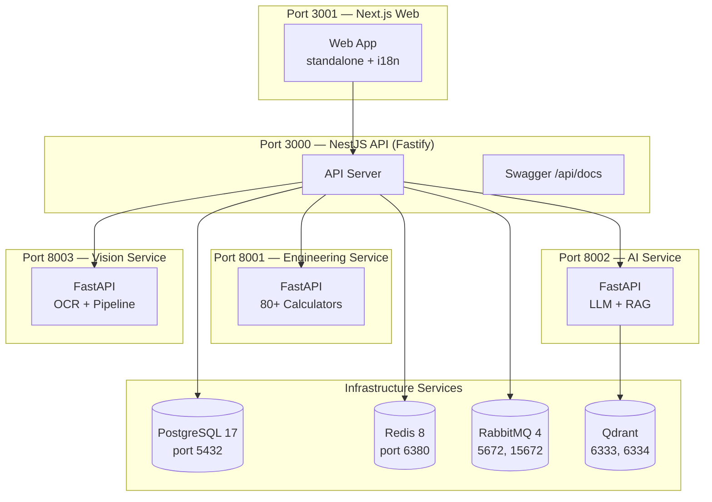

### Ports

| Service             | Port  | Protocol | Purpose                        |
| ------------------- | ----- | -------- | ------------------------------ |
| NestJS API          | 3000  | HTTP     | API server with /api/v1 prefix |
| Swagger UI          | 3000  | HTTP     | /api/docs endpoint             |
| Next.js Web         | 3001  | HTTP     | Client application             |
| Engineering Service | 8001  | HTTP     | Python FastAPI calculators     |
| AI Service          | 8002  | HTTP     | Python FastAPI LLM/RAG         |
| Vision Service      | 8003  | HTTP     | Python FastAPI OCR/pipeline    |
| PostgreSQL          | 5432  | TCP      | Primary database               |
| Redis               | 6380  | TCP      | Cache + BullMQ                 |
| RabbitMQ            | 5672  | TCP      | Message broker                 |
| RabbitMQ Mgmt       | 15672 | HTTP     | Management UI                  |
| Qdrant              | 6333  | HTTP     | Vector search API              |
| Qdrant gRPC         | 6334  | gRPC     | Vector search gRPC             |

### Containers

| Container           | Image                                             | Mem Limit | Depends On          |
| ------------------- | ------------------------------------------------- | --------- | ------------------- |
| postgres            | postgres:17-alpine                                | Default   | —                   |
| redis               | redis:8-alpine                                    | Default   | —                   |
| rabbitmq            | rabbitmq:4-management                             | Default   | —                   |
| engineering-service | Build from workspace/services/engineering-service | Default   | —                   |
| vision-service      | Build from workspace/services/vision-service      | 2G        | —                   |
| ai-service          | Build from workspace/services/ai-service          | Default   | engineering-service |
| qdrant              | qdrant/qdrant:latest                              | Default   | —                   |

### Docker Compose Files

| File                                                    | Services                                                                   |
| ------------------------------------------------------- | -------------------------------------------------------------------------- |
| `infrastructure/docker/compose/base/docker-compose.yml` | postgres, redis, rabbitmq, engineering-service, vision-service, ai-service |
| `workspace/docker-compose.yml`                          | qdrant                                                                     |
| `infrastructure/docker/compose/production/`             | Production env templates                                                   |

### Startup Order

1. **PostgreSQL** — Database must be available first
2. **Redis** — Cache and BullMQ dependency
3. **RabbitMQ** — Message broker
4. **Engineering Service** — First Python service (other services depend on it)
5. **Vision Service** — Document processing
6. **AI Service** — LLM orchestration (depends on engineering-service)
7. **NestJS API** — Main API gateway
8. **Next.js Web** — Client app (depends on API)

### Shutdown Order

1. Next.js Web → NestJS API → AI Service → Vision Service → Engineering Service → RabbitMQ → Redis → PostgreSQL

### Health Endpoints

| Service             | Endpoint             |
| ------------------- | -------------------- |
| NestJS API          | `GET /api/v1/health` |
| Engineering Service | `GET /health`        |
| AI Service          | `GET /health`        |
| Vision Service      | `GET /health`        |

### Environment Variables

Key env vars (see `.env` for full list):

| Variable            | Purpose                              |
| ------------------- | ------------------------------------ |
| `DATABASE_URL`      | PostgreSQL connection string         |
| `REDIS_URL`         | Redis connection string              |
| `RABBITMQ_URLS`     | RabbitMQ connection string           |
| `JWT_PUBLIC_KEY`    | JWT RS256 public key                 |
| `JWT_PRIVATE_KEY`   | JWT RS256 private key (dev only)     |
| `JWT_EXPIRATION`    | JWT token expiry                     |
| `OPENAI_API_KEY`    | OpenAI API key                       |
| `ANTHROPIC_API_KEY` | Anthropic API key                    |
| `CORS_ORIGINS`      | Allowed CORS origins                 |
| `NODE_ENV`          | Environment (development/production) |

---

## 10. Database Overview

### Database Engine

PostgreSQL 17 with Prisma ORM. Schema at `prisma/schema.prisma`.

### Key Conventions

| Convention    | Rule                                           |
| ------------- | ---------------------------------------------- |
| IDs           | UUID v4 (all entities)                         |
| Multi-Tenancy | `workspace_id` on every tenant-scoped entity   |
| Soft Delete   | `deletedAt` timestamp column                   |
| Timestamps    | `createdAt`, `updatedAt` on all entities       |
| Naming        | `snake_case` for tables, `camelCase` in Prisma |
| Migrations    | Prisma Migrate (`pnpm db:migrate`)             |

### Core Schema Groups

```mermaid
erDiagram
    USERS ||--o{ WORKSPACE_MEMBERS : "belongs to"
    WORKSPACES ||--o{ WORKSPACE_MEMBERS : "has"
    WORKSPACES ||--o{ PROJECTS : "has"
    USERS ||--o{ PROJECTS : "creates"

    WORKSPACES ||--o{ KNOWLEDGE : "has"
    WORKSPACES ||--o{ KNOWLEDGE_DOCUMENTS : "has"

    KNOWLEDGE ||--o{ KNOWLEDGE_TRANSLATIONS : "has"
    KNOWLEDGE ||--o{ KNOWLEDGE_TAXONOMY : "has"
    KNOWLEDGE ||--o{ KNOWLEDGE_VERSIONS : "has"

    KNOWLEDGE_DOCUMENTS ||--o{ KNOWLEDGE_DOCUMENT_CHUNKS : "has"
    KNOWLEDGE_DOCUMENTS ||--o{ KNOWLEDGE_PIPELINE_RUNS : "has"
    KNOWLEDGE_DOCUMENTS ||--o{ KNOWLEDGE_EXTRACTIONS : "has"

    KNOWLEDGE_GRAPH_NODES ||--o{ KNOWLEDGE_GRAPH_EDGES : "source"
    KNOWLEDGE_GRAPH_NODES ||--o{ KNOWLEDGE_GRAPH_METRICS : "has"

    EVENT_OUTBOX ||--o{ EVENT_PROCESS_LOG : "tracks"

    USERS ||--o{ ROLES : "assigned via"
    ROLES ||--o{ PERMISSIONS : "has"

    PLANS ||--o{ SUBSCRIPTIONS : "defines"
    WORKSPACES ||--o{ SUBSCRIPTIONS : "has"

    VENDORS ||--o{ PRODUCTS : "offers"
    ORDERS ||--o{ ORDER_ITEMS : "contains"
```

### Entity Count: ~55+ models

| Domain Group           | Tables | Key Entities                                                                                                                                                                                                                                      |
| ---------------------- | ------ | ------------------------------------------------------------------------------------------------------------------------------------------------------------------------------------------------------------------------------------------------- |
| Identity & Auth        | 5      | users, sessions, refresh_tokens, password_reset_tokens                                                                                                                                                                                            |
| Workspace              | 4      | workspaces, workspace_members, workspace_invitations, workspace_settings                                                                                                                                                                          |
| RBAC                   | 4      | roles, permissions, role_permissions, user_roles                                                                                                                                                                                                  |
| Project                | 4      | projects, project_members, project_notes, project_reports                                                                                                                                                                                         |
| Subscription           | 3      | plans, subscriptions, usage_logs                                                                                                                                                                                                                  |
| Billing                | 6      | invoices, payments, transactions, payment_methods, subscription_payments                                                                                                                                                                          |
| Engineering            | 2      | calculations, calculation_templates                                                                                                                                                                                                               |
| AI                     | 4      | agents, conversations, messages, ai_usage                                                                                                                                                                                                         |
| Knowledge              | 12     | knowledge, knowledge_translations, knowledge_taxonomy, knowledge_media, knowledge_formulas, knowledge_examples, knowledge_standards, knowledge_versions, knowledge_comments, knowledge_workflows, knowledge_workflow_history, knowledge_analytics |
| Knowledge Factory      | 4      | knowledge_documents, knowledge_document_chunks, knowledge_pipeline_runs, knowledge_extractions                                                                                                                                                    |
| Knowledge Intelligence | 9      | knowledge_graph_nodes, knowledge_graph_edges, knowledge_graph_metrics, ontologies, ontology_classes, ontology_relations, knowledge_citations, document_similarities, knowledge_clusters                                                           |
| Storage                | 2      | files, file_versions                                                                                                                                                                                                                              |
| API                    | 2      | api_keys, webhooks                                                                                                                                                                                                                                |
| Notification           | 1      | notifications                                                                                                                                                                                                                                     |
| Admin                  | 2      | system_settings, feature_flags                                                                                                                                                                                                                    |
| Semantic Integration   | 2      | event_outbox, event_process_log                                                                                                                                                                                                                   |
| Marketplace            | 5      | vendors, products, product_translations, orders, order_items                                                                                                                                                                                      |
| AI Provider Mgmt       | 12     | ai_providers, ai_models, ai_provider_credentials, ai_provider_health, ai_provider_usage, ai_provider_statistics, ai_provider_quotas, ai_provider_model_capabilities, ai_routing_policies, ai_routing_rules, ai_feature_flags, ai_audit_log        |
| Standards              | 1      | engineering_standards                                                                                                                                                                                                                             |
| Audit                  | 1      | audit_logs                                                                                                                                                                                                                                        |

### Migration Strategy

- Development: `pnpm db:migrate` (Prisma Migrate dev)
- Apply without migration: `pnpm db:push` + `pnpm db:generate` + `pnpm db:seed`
- Reset: `pnpm db:reset` (migrate reset --force + seed)
- Seed: `node prisma/seed.js` (pure CJS, no tsx)

### Prisma Conventions

1. `@@map("snake_case")` on all models
2. `@map("snake_case")` on all fields
3. `@default(now())` for createdAt
4. `@updatedAt` for updatedAt
5. `@default(uuid())` for UUID fields
6. `workspace_id` on all tenant-scoped models
7. `deletedAt DateTime?` for soft delete
8. `@@unique([field1, field2])` for composite unique constraints

---

## 11. Event Topology

### Domain Events — Complete Registry

14 immutable domain-event contracts with typed payloads, versioning, and correlation/causation/tracing IDs:

| #   | Event                       | Source/runtime state            | Payload summary                                                                              | Version | Consumers                                              |
| --- | --------------------------- | ------------------------------- | -------------------------------------------------------------------------------------------- | ------- | ------------------------------------------------------ |
| 1   | `DocumentUploaded`          | Knowledge Factory, dormant      | document/workspace/file identity, type, size, creator                                        | 1       | None                                                   |
| 2   | `DocumentClassified`        | Knowledge Factory, dormant      | document/workspace identity, classification                                                  | 1       | None                                                   |
| 3   | `DocumentParsed`            | Knowledge Factory, dormant      | document/workspace identity                                                                  | 1       | None                                                   |
| 4   | `DocumentNormalized`        | Knowledge Factory, dormant      | document/workspace identity                                                                  | 1       | None                                                   |
| 5   | `DocumentChunked`           | Knowledge Factory, dormant      | document/workspace identity, chunk count                                                     | 1       | None                                                   |
| 6   | `EmbeddingsGenerated`       | Knowledge Factory, dormant      | document/workspace identity, embedding count                                                 | 1       | None                                                   |
| 7   | `DocumentPublished`         | Knowledge Factory, dormant      | document/workspace/knowledge identity and publication metadata                               | 1       | `DocumentPublishedHandler`, `CacheInvalidationHandler` |
| 8   | `KnowledgeArticlePublished` | Knowledge CMS, active           | article/workspace identity, slug, title, locale, visibility, version, author, content traits | 1       | `KnowledgeArticlePublishedHandler`                     |
| 9   | `KnowledgeArticleArchived`  | Knowledge CMS, active           | article/workspace identity, archive timestamp                                                | 1       | `KnowledgeArticleArchivedHandler`                      |
| 10  | `GraphNodeCreated`          | Semantic Integration follow-up  | node/workspace/entity identity, type, label                                                  | 1       | None                                                   |
| 11  | `GraphEdgesCreated`         | Semantic Integration follow-up  | node/workspace identity, edge count and IDs                                                  | 1       | None                                                   |
| 12  | `OntologyUpdated`           | Knowledge Intelligence contract | ontology/workspace identity and action                                                       | 1       | None                                                   |
| 13  | `MetricsCalculated`         | Semantic Integration follow-up  | node/workspace identity and four metrics/composite                                           | 1       | None                                                   |
| 14  | `SearchIndexUpdated`        | Semantic Integration contract   | entity/workspace identity                                                                    | 1       | None                                                   |

### Event Flow

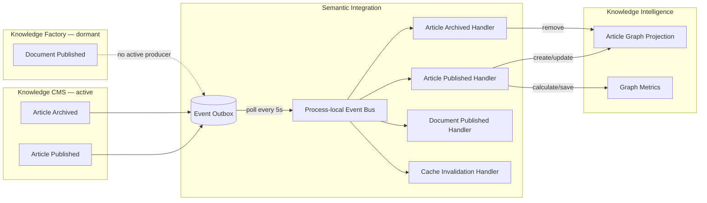

The CMS article path is active. The Factory path is source-level architecture only while `KnowledgeFactoryModule` remains unregistered. For delivery limitations and detailed sequences, see `docs/knowledge/event-topology.md`.

### Event Schema

```typescript
interface DomainEvent<T> {
  eventId: string; // UUID v4
  eventType: EventType; // 14 versioned event contracts
  eventVersion: number; // Schema version (starts at 1)
  correlationId: string; // Links all events from same document
  causationId: string; // Links to the causing event
  tracingId: string; // End-to-end trace
  timestamp: string; // ISO 8601
  source: string; // Module name
  data: T; // Typed payload
  metadata: {
    userId?: string;
    workspaceId: string;
    retryCount: number;
  };
}
```

### Event correlation

Active CMS lifecycle events are root events: the event factory generates their correlation, causation, and tracing identifiers. The dormant `DocumentPublishedHandler` supplies the parent event ID as the causation input for `GraphNodeCreated` and `MetricsCalculated`; with the current factory this also becomes each follow-up event's `correlationId`. The implementation therefore does not preserve one original correlation ID across the full intended Factory chain.

### Outbox Table Schema

```sql
CREATE TABLE event_outbox (
  id              UUID PRIMARY KEY DEFAULT gen_random_uuid(),
  event_id        UUID NOT NULL UNIQUE,
  event_type      VARCHAR(50) NOT NULL,
  event_version   INT DEFAULT 1,
  correlation_id  UUID NOT NULL,
  causation_id    UUID,
  tracing_id      UUID NOT NULL,
  source          VARCHAR(50) NOT NULL,
  payload         JSONB NOT NULL,
  metadata        JSONB DEFAULT '{}',
  workspace_id    UUID NOT NULL,
  status          VARCHAR(20) DEFAULT 'pending',
  retry_count     INT DEFAULT 0,
  max_retries     INT DEFAULT 3,
  last_error      TEXT,
  created_at      TIMESTAMPTZ DEFAULT NOW(),
  last_attempt_at TIMESTAMPTZ
);
```

### Idempotency

Completed handlers consult `event_process_log` before repeating work for the same event ID and handler name. This supports idempotent handling but is not a strict exactly-once guarantee.

### Retry Strategy

- The outbox stores a maximum of 3 attempts and moves exhausted rows to `dead_letter`.
- Relay-level failures return a row to `pending`; retries happen on the fixed five-second poll, not exponential backoff.
- Repository types allow `pending`, `delivered`, `failed`, and `dead_letter`; the relay normally transitions `pending` to `delivered`, back to `pending`, or to `dead_letter` (it has no `processing` state).
- `SemanticEventBus` catches handler errors, so a handler failure currently does not reach the relay retry branch and the row can still be marked `delivered`.
- Source mutations and outbox inserts are separate operations rather than one atomic transaction.

### Future: Enterprise Event Streaming

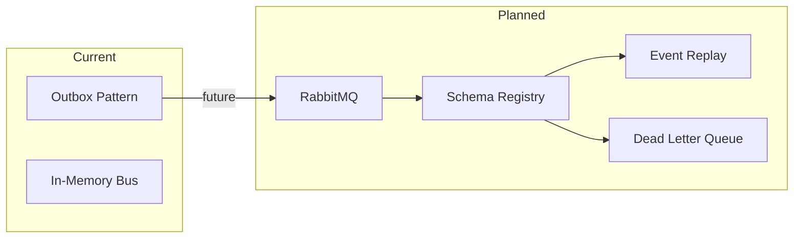

### Event-Driven Enterprise Saga

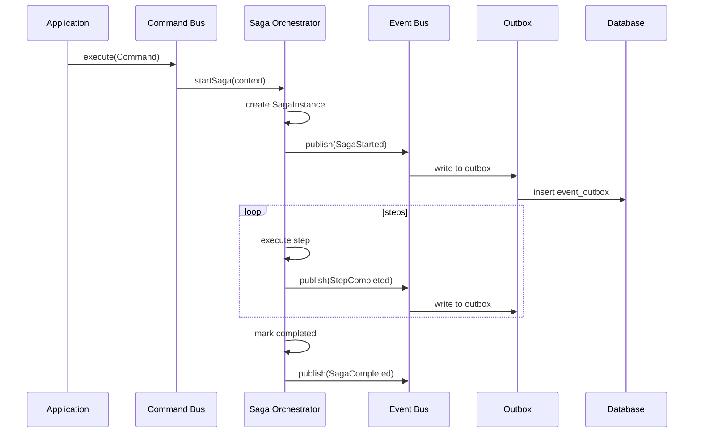

---

## 12. AI Infrastructure

### AI Architecture Overview

```mermaid
graph TB
    subgraph "Enterprise Intelligence SDK"
        SDK[IntelligenceClient]
    end

    subgraph "Layer 1 — Foundation"
        CE[Context Engine<br/>11 source builders]
        MP[Memory Platform<br/>7 memory layers]
        PG[Prompt Governance<br/>templates + policies]
        TR[Tool Registry<br/>JSON Schema validation]
        SR[Skill Registry<br/>dependency DAG]
    end

    subgraph "Layer 2 — Reasoning"
        RE[Reasoning Engine<br/>DAG execution + reflection]
        PE[Policy Engine<br/>deny-overrides-allow]
    end

    subgraph "Layer 3 — AI Gateway"
        AI_GW[AI Gateway<br/>Provider-Neutral]
        OPENAI[OpenAI]
        ANTHROPIC[Anthropic]
        GEMINI[Google Gemini]
        GROQ[Groq]
        OR[OpenRouter]
        OLLAMA[Ollama]
        VOYAGE[VoyageAI]
        AZURE[Azure OpenAI]
    end

    subgraph "Layer 4 — Evaluation"
        EVAL[Evaluation Platform<br/>regression detection]
    end

    subgraph "Enterprise Orchestration"
        COST[Cost Management]
        HITL[Human-in-the-Loop]
        MULTI[Multi-Agent]
        WF[Workflow Engine]
    end

    SDK --> CE
    SDK --> MP
    SDK --> PG
    SDK --> TR
    SDK --> SR

    SDK --> RE
    SDK --> PE
    SDK --> AI_GW
    SDK --> EVAL

    RE --> TR
    RE --> SR

    PE --> CE
    PE --> MP
    PE --> TR
    PE --> SR

    AI_GW --> OPENAI
    AI_GW --> ANTHROPIC
    AI_GW --> GEMINI
    AI_GW --> GROQ
    AI_GW --> OR
    AI_GW --> OLLAMA
    AI_GW --> VOYAGE
    AI_GW --> AZURE

    SDK --> COST
    SDK --> HITL
    SDK --> MULTI
    SDK --> WF
```

### AI Runtime

| Component                            | Description                                       | Status              |
| ------------------------------------ | ------------------------------------------------- | ------------------- |
| **DomainEventPublisher**             | Publishes domain events to outbox                 | ✅                  |
| **MemoryAbstractionService**         | In-memory store for AI Runtime                    | ✅                  |
| **PromptRegistryService**            | In-memory prompt template store                   | ✅                  |
| **CacheInvalidationHandler**         | Clears caches on dormant `DocumentPublished` flow | ⚠️ Producer dormant |
| **KnowledgeArticlePublishedHandler** | Upserts CMS article graph projection + metrics    | ✅                  |
| **KnowledgeArticleArchivedHandler**  | Removes archived CMS article graph projection     | ✅                  |

### Knowledge Factory

| Component                 | Description                     | Status     |
| ------------------------- | ------------------------------- | ---------- |
| **Ingestion Workflow**    | Target document intake pipeline | ⚠️ Dormant |
| **Classification Engine** | Document type classification    | ⚠️ Dormant |
| **Chunking Engine**       | Document chunking strategies    | ⚠️ Dormant |
| **Publishing Service**    | Publish to knowledge store      | ⚠️ Dormant |
| **PublishWorker**         | Intended event producer         | ⚠️ Dormant |

### Knowledge Intelligence

| Component               | Description                      | Status |
| ----------------------- | -------------------------------- | ------ |
| **Knowledge Graph**     | Nodes + edges + metrics          | ✅     |
| **Citation Management** | Citation tracking and provenance | ✅     |
| **Conflict Detection**  | Conflicting knowledge detection  | ✅     |
| **Ontology Registry**   | Ontology management              | ✅     |
| **Clustering**          | Knowledge clustering             | ✅     |
| **Similarity**          | Document similarity scoring      | ✅     |

### AI Gateway — Provider Support

| Provider      | Type                  | Status |
| ------------- | --------------------- | ------ |
| OpenAI        | Chat + Embeddings     | ✅     |
| Anthropic     | Chat                  | ✅     |
| Google Gemini | Chat                  | ✅     |
| Groq          | Chat (fast inference) | ✅     |
| OpenRouter    | Chat (multi-provider) | ✅     |
| Ollama        | Chat (local)          | ✅     |
| VoyageAI      | Embeddings only       | ✅     |
| Azure OpenAI  | Chat                  | ✅     |

### AI Provider Management (Planned)

| Component             | Description                        | Status         |
| --------------------- | ---------------------------------- | -------------- |
| Provider Registry     | Provider/model lifecycle           | 🟡 In Progress |
| Credential Management | AES-256-GCM encrypted storage      | 🟡 In Progress |
| Health Monitoring     | Provider health + latency tracking | 🟡 In Progress |
| Usage Tracking        | Token/cost tracking per workspace  | 🟡 In Progress |
| Routing Policies      | Smart routing with conditions      | 🟡 In Progress |
| Quota Management      | Rate limiting per provider         | 🟡 In Progress |

---

## 13. Deployment Topology

### Development

```
┌─────────────────────────────────────────────────────────────┐
│                     Docker Compose (Local)                    │
│                                                               │
│  postgres:17 ── redis:8 ── rabbitmq:4 ── qdrant:latest       │
│       │            │            │              │              │
│       └────────────┴────────────┴──────────────┘              │
│                         │                                     │
│  ┌──────────────────────┴──────────────────────────────────┐  │
│  │  App Stack                                             │  │
│  │  api:3000       web:3001    eng:8001    ai:8002   vi:8003│  │
│  └─────────────────────────────────────────────────────────┘  │
│                                                               │
│  pnpm dev           # Turbo runs all in watch mode             │
│  docker-compose up  # Infrastructure only                     │
└─────────────────────────────────────────────────────────────┘
```

### Staging (Future)

```
┌─────────────────────────────────────────────────────────────┐
│                      VPS / Single Server                      │
│                                                               │
│  nginx (reverse proxy + SSL)                                  │
│       │                                                       │
│  ├── api:3000     web:3001    eng:8001    ai:8002   vi:8003  │
│  ├── postgres:17  redis:8     rabbitmq:4   qdrant:latest     │
│  └── Prometheus + Grafana (monitoring)                        │
│                                                               │
│  Docker compose with production profiles                      │
│  Health checks + auto-restart                                 │
└─────────────────────────────────────────────────────────────┘
```

### Production (Future — Kubernetes)

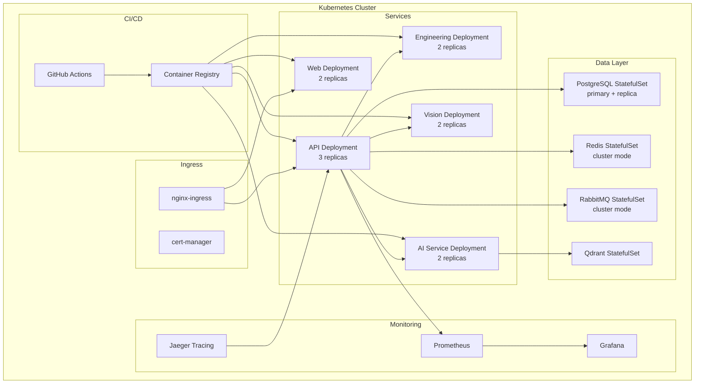

### Infrastructure Scripts

| Script                                                   | Purpose                           | Status |
| -------------------------------------------------------- | --------------------------------- | ------ |
| `infrastructure/scripts/health-check.sh`                 | Verify all 8 services             | ✅     |
| `infrastructure/scripts/validate-startup-order.sh`       | Validate depends_on + healthcheck | ✅     |
| `infrastructure/scripts/graceful-shutdown.sh`            | Test reverse-order shutdown       | ✅     |
| `infrastructure/scripts/benchmark.sh`                    | Performance baseline              | ✅     |
| `infrastructure/chaos/chaos-runner.sh`                   | 19 chaos scenarios                | ✅     |
| `infrastructure/benchmark/load-test-runner.sh`           | k6 load test runner               | ✅     |
| `infrastructure/stability/soak-test-runner.sh`           | Long-running stability            | ✅     |
| `infrastructure/stability/memory-profiler.sh`            | V8 memory profiling               | ✅     |
| `infrastructure/disaster-recovery/dr-validate.sh`        | Disaster recovery validation      | ✅     |
| `infrastructure/security/security-scan.sh`               | OWASP security scan               | ✅     |
| `infrastructure/observability/validate-observability.sh` | Observability checks              | ✅     |

### Environment Files

| File                                                               | Purpose                     |
| ------------------------------------------------------------------ | --------------------------- |
| `.env`                                                             | Root env vars (development) |
| `apps/web/.env.local`                                              | Next.js local env           |
| `infrastructure/docker/.env`                                       | Docker compose env          |
| `infrastructure/docker/compose/production/.env.production.example` | Production env template     |

---

## 14. Roadmap

### Completed

| Sprint    | Focus                   | Modules                                  | Status |
| --------- | ----------------------- | ---------------------------------------- | ------ |
| Sprint 0  | Repository Init         | Monorepo, Prisma, seed                   | ✅     |
| Sprint D1 | Domain Foundation       | Auth, User, Workspace, RBAC, Project     | ✅     |
| Sprint K1 | Knowledge Foundation    | Knowledge module, search                 | ✅     |
| Sprint K2 | Semantic Integration    | 12 events, outbox, bus, handlers         | ✅     |
| Sprint K3 | Platform Integration    | Workspace hardening, circuit breaker     | ✅     |
| Sprint K4 | Production Integration  | 36 tests, certification reports          | ✅     |
| Sprint E1 | Enterprise Backbone     | 8 platform modules                       | ✅     |
| Sprint E2 | Production Validation   | Chaos, load, DR, security, observability | ✅     |
| Sprint I1 | Enterprise Intelligence | 10 AI modules (135 files, ~12K LOC)      | ✅     |

### In Progress

| Sprint    | Focus                    | Modules                                                                                                                                                | Status         |
| --------- | ------------------------ | ------------------------------------------------------------------------------------------------------------------------------------------------------ | -------------- |
| Sprint O1 | Enterprise Orchestration | Conversation Runtime, Cost Mgmt, Execution Context, Explainability, Human-in-the-Loop, Multi-Agent, Planning Engine, Workflow Engine, Workflow Runtime | 🟡 In Progress |
| Sprint P2 | AI Provider Management   | 12 Prisma models, routing policies, credentials                                                                                                        | 🟡 In Progress |

### Next Sprint

| Sprint    | Focus                          | Description                                             |
| --------- | ------------------------------ | ------------------------------------------------------- |
| Sprint P3 | Provider Management Completion | Presentation layer, admin UI                            |
| Sprint O2 | Orchestration Completion       | Testing, integration, certification                     |
| Sprint M1 | Memory & Messaging Production  | Redis adapter, RabbitMQ adapter, PostgreSQL persistence |
| Sprint D2 | Deployment                     | Kubernetes manifests, CI/CD pipeline, staging VPS       |

### Future

| Phase                | Description                                                       | Effort  | Timeline   |
| -------------------- | ----------------------------------------------------------------- | ------- | ---------- |
| Foundation Hardening | Fix 98 `throw new Error`, fix lint, fix throttler, fix .gitignore | 1-2 mo  | Immediate  |
| Knowledge Factory    | Full pipeline: OCR, table extraction, DWG support                 | 3-6 mo  | Q3-Q4 2026 |
| Enterprise AI        | RAG pipeline, agent orchestration, safety guardrails              | 2-3 mo  | Q4 2026    |
| Enterprise Agents    | AI agents integration with event bus                              | 2-3 mo  | Q1 2027    |
| Testing Expansion    | Unit/integration tests for all modules                            | Ongoing | Ongoing    |
| Production Hardening | Fix `any` types, CHANGELOG, versioning                            | 1-2 mo  | Q2 2027    |

### Long-Term

| Initiative              | Description                             |
| ----------------------- | --------------------------------------- |
| Multi-region deployment | Geographic distribution for low latency |
| Real-time collaboration | Multi-user concurrent editing           |
| Mobile platform         | Native mobile apps                      |
| Advanced NLP            | Persian language engineering NLP        |
| OpenAPI marketplace     | Third-party plugin ecosystem            |
| Enterprise SSO          | SAML, OAuth2, LDAP integration          |

### Dependency Chain

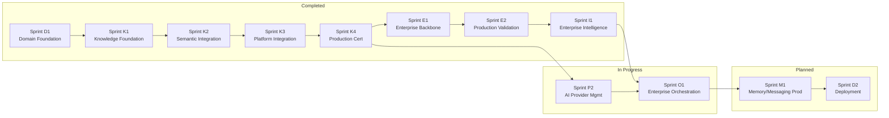

---

## 15. AI Startup Checklist

> **⚠️ MANDATORY — Every AI agent MUST complete this checklist before making any code changes.**

### Step 1: Read PROJECT_BOOTSTRAP.md

**You are here.** ✅ This document is the single entry point.

### Step 2: Read STATUS_REPORT.md

File: `docs/STATUS_REPORT.md`

Understand module-level status for every component. Check for:

- Which modules are ✅ complete vs 🔴 not started
- Current sprint priorities
- Module dependency status

### Step 3: Read AGENTS.md

File: `AGENTS.md`

Understand:

- Monorepo commands (pnpm build, dev, lint, test, typecheck)
- NestJS API conventions (Fastify, Swagger, module imports with `.js`)
- Database commands (pnpm db:apply, db:reset, db:migrate)
- Python service commands (ruff, mypy, pytest)
- Docker compose setup
- Coding conventions and quirks

### Step 3.5: Run Architecture Validation

File: `tools/architecture/validate.ts`
Rules: `tools/architecture/rules/*.yaml` (87 rules across 11 categories)

Run before any code change:

```bash
pnpm validate:arch
```

This validates:

- DDD layer isolation (domain must not import infrastructure)
- Import conventions (.js extension for ESM compatibility)
- Naming conventions (kebab-case files, PascalCase classes)
- Cross-module import boundaries
- Circular dependencies between modules
- Repository interface/impl pairing
- Framework-free domain layer

See ADR-020 for full rule definitions and enforcement strategy.

### Step 4: Read All ADR Files

Directory: `docs/adr/`

| ADR     | Topic                                  |
| ------- | -------------------------------------- |
| ADR-011 | Knowledge Factory                      |
| ADR-012 | Knowledge Intelligence Layer           |
| 012     | Enterprise Messaging Bus               |
| 013     | Enterprise Event Schema Registry       |
| 014     | Distributed Saga Orchestration         |
| 015     | Unified Cache Invalidation             |
| 016     | Enterprise Observability               |
| 017     | Enterprise Intelligence Platform       |
| 018     | Enterprise Orchestration Platform      |
| **019** | **Bootstrap Enforcement Layer**        |
| **020** | **Architecture Governance Automation** |

### Step 5: Read Executive Summary

File: `docs/audit/13_EXECUTIVE_SUMMARY.md`

Understand:

- Overall project completion (~50%)
- Key metrics (28 modules, 162 endpoints, 61 models, 568 tests)
- Top 10 critical gaps
- Remaining phases and effort estimates (~12-14 months total)

### Step 6: Understand Completed Sprints

From Section 4 of this document, understand:

- What each sprint delivered
- Architectural impact of each sprint
- Remaining gaps and known limitations

### Step 7: List Current Blockers

| #   | Blocker                          | Impact                            | Status             |
| --- | -------------------------------- | --------------------------------- | ------------------ |
| 1   | OpenAPI generation hangs         | Blocks API documentation pipeline | Known              |
| 2   | Web build timeout (Next.js)      | Cannot deploy web                 | Unknown root cause |
| 3   | No CI/CD pipeline                | No automated verification         | Missing            |
| 4   | Lint broken on 4/6 packages      | Code quality not enforced         | Pre-existing       |
| 5   | 718 `any` warnings               | Reduced type safety               | Pre-existing       |
| 6   | In-memory stores not distributed | No horizontal scaling             | Documented         |
| 7   | MinIO/Qdrant not in base compose | Not available in dev stack        | Missing            |

### Step 8: WAIT FOR USER INSTRUCTION

> **🔴 CRITICAL RULE:**
> Do NOT make any code changes until the user explicitly instructs you.
> After completing Steps 1-7, report your understanding and wait.

---

## 16. Bootstrap Version

### Version Table

| Field                    | Value                         |
| ------------------------ | ----------------------------- |
| **Bootstrap Version**    | 1.2.0                         |
| **Last Updated**         | 2026-07-06                    |
| **Architecture Version** | 1.1                           |
| **Schema Version**       | 1.0                           |
| **Knowledge Version**    | 1.0                           |
| **Sprint Version**       | O1 (Enterprise Orchestration) |
| **ADR Index Version**    | 20 (ADR-001 through ADR-020)  |

### Read Compatibility

| Agent Type    | Min Bootstrap Version | Status               |
| ------------- | --------------------- | -------------------- |
| Cursor        | 1.0.0                 | ✅ Compatible        |
| OpenCode      | 1.0.0                 | ✅ Compatible        |
| Claude Code   | 1.0.0                 | ✅ Compatible        |
| Codex         | 1.0.0                 | ✅ Compatible        |
| ChatGPT       | 1.0.0                 | ✅ Compatible        |
| Gemini        | 1.0.0                 | ✅ Compatible        |
| Future agents | ≥ 1.0.0               | ⚠️ Verify before use |

### Version Bump Triggers

Bump the Bootstrap Version when:

| Change Type         | Version Bump               | Example                          |
| ------------------- | -------------------------- | -------------------------------- |
| New major module    | Minor bump (1.0.0 → 1.1.0) | New enterprise module added      |
| Schema change       | Patch bump (1.0.0 → 1.0.1) | New Prisma model added           |
| ADR added           | Patch bump                 | New ADR accepted (e.g., ADR-020) |
| Architecture change | Minor bump                 | Module restructured              |
| Sprint completion   | Patch bump                 | Sprint completed                 |
| Breaking API change | Major bump (1.0.0 → 2.0.0) | API endpoint removed             |

### Validation

```bash
# Run bootstrap validation
./scripts/bootstrap/bootstrap-check.sh

# Expected output: "✓ VALIDATION PASSED"
# Exit code 0 = valid, 1 = invalid
```

---

## 17. AI Startup Flow

### Mandatory Agent Startup Sequence

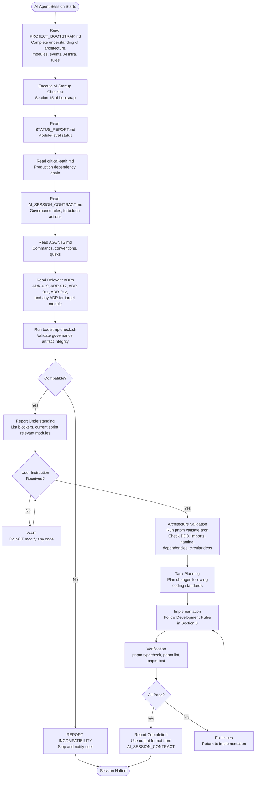

### Flow Phases

| Phase          | Actions                                                  | Duration       |
| -------------- | -------------------------------------------------------- | -------------- |
| **Load**       | Read all governance artifacts, run validator             | ~2-3 minutes   |
| **Understand** | Report project state, current blockers, relevant modules | Immediate      |
| **Wait**       | Pause for user instruction                               | Variable       |
| **Plan**       | Architecture validation, task planning                   | 1-2 minutes    |
| **Implement**  | Code changes following rules                             | Task-dependent |
| **Verify**     | Typecheck, lint, test                                    | 1-5 minutes    |
| **Report**     | Completion summary with output format                    | 30 seconds     |

### Fast-Start Commissions

```bash
# After completing the checklist, use these commands:

# Build everything
pnpm build

# Development
pnpm dev

# Type check (MUST pass before any code change)
pnpm typecheck

# Run tests
pnpm test
pnpm test:e2e

# Database
pnpm db:generate    # After schema changes
pnpm db:apply       # Apply schema + seed

# Format
pnpm format

# Lint
pnpm lint

# Architecture Validation (MUST pass before any code change)
pnpm validate:arch
```

---

## Document References

| Document                                    | Path                                                     | Purpose                                     |
| ------------------------------------------- | -------------------------------------------------------- | ------------------------------------------- |
| **PROJECT_BOOTSTRAP.md**                    | `docs/PROJECT_BOOTSTRAP.md`                              | **This document** — Single entry point      |
| **STATUS_REPORT.md**                        | `docs/STATUS_REPORT.md`                                  | Module-level status for all components      |
| **AGENTS.md**                               | `AGENTS.md`                                              | Agent guide for commands and conventions    |
| **13_EXECUTIVE_SUMMARY.md**                 | `docs/audit/13_EXECUTIVE_SUMMARY.md`                     | Executive summary, metrics, gaps            |
| **12_NEXT_ROADMAP.md**                      | `docs/audit/12_NEXT_ROADMAP.md`                          | Next development roadmap                    |
| **critical-path.md**                        | `docs/critical-path.md`                                  | Production certification dependency chain   |
| **readiness-score.md**                      | `docs/readiness-score.md`                                | Production readiness score (7.8/10)         |
| **technical-debt-report.md**                | `docs/technical-debt-report.md`                          | Technical debt registry                     |
| **production-integration-report.md**        | `docs/production-integration-report.md`                  | K4 integration test results                 |
| **production-certification-report.md**      | `docs/production-certification-report.md`                | E2 production certification                 |
| **architecture-validation-report.md**       | `docs/architecture-validation-report.md`                 | Architecture validation                     |
| **scalability-assessment.md**               | `docs/scalability-assessment.md`                         | Horizontal scalability assessment           |
| **enterprise-intelligence-architecture.md** | `docs/enterprise-intelligence-architecture.md`           | Sprint I1 architecture                      |
| **enterprise-platform-architecture.md**     | `docs/enterprise-platform-architecture.md`               | Sprint E1 architecture                      |
| **Knowledge Factory ADR**                   | `docs/adr/ADR-011-knowledge-factory.md`                  | KF architecture decision                    |
| **Knowledge Intelligence ADR**              | `docs/adr/ADR-012-knowledge-intelligence-layer.md`       | KI architecture decision                    |
| **AI_SESSION_CONTRACT.md**                  | `docs/AI_SESSION_CONTRACT.md`                            | Governance contract for AI agent sessions   |
| **Semantic Integration ADR**                | `docs/adr/012-enterprise-messaging-bus.md`               | SI architecture decision                    |
| **Bootstrap Enforcement ADR**               | `docs/adr/ADR-019-bootstrap-enforcement.md`              | Bootstrap enforcement decision              |
| **Bootstrap Validator**                     | `scripts/bootstrap/bootstrap-check.sh`                   | Governance artifact validation script       |
| **Architecture Governance ADR**             | `docs/adr/ADR-020-architecture-governance-automation.md` | Architecture governance automation decision |
| **Architecture Rules**                      | `tools/architecture/rules/*.yaml`                        | 87 machine-readable architecture rules      |
| **Architecture Validator**                  | `tools/architecture/validate.ts`                         | Automated architecture governance validator |
| **Technical Debt Register**                 | `docs/TECHNICAL_DEBT_REGISTER.md`                        | Current governance debt items (0 open)      |
| **Release Validator**                       | `tools/release/release-validator.ts`                     | 15-step release validation orchestrator     |
| **Version Policy**                          | `docs/VERSION_POLICY.md`                                 | SemVer, ADR, bootstrap, migration numbering |
| **Release Gate CI**                         | `.github/workflows/release-gate.yml`                     | 8-job sequential pipeline                   |
| **Release Manifest**                        | `docs/generated/release-manifest.json`                   | Auto-generated release metadata             |
| **Build Certification**                     | `docs/generated/build-certification.md`                  | 6-dimension certification (grade A+-Fail)   |
| **Release Checklist**                       | `docs/generated/release-checklist.md`                    | 25-item pre-deployment checklist            |
| **Governance Report**                       | `docs/generated/governance-report.md`                    | Auto-generated architecture health report   |
| **Dependency Graph**                        | `docs/generated/module-dependency-graph.md`              | Auto-generated module dependency graph      |
| **Event Topology**                          | `docs/knowledge/event-topology.md`                       | Event flow diagrams                         |
| **Semantic Integration Impl**               | `docs/knowledge/semantic-integration-implementation.md`  | SI implementation report                    |
| **Knowledge Factory Architecture**          | `docs/knowledge/knowledge-factory-architecture.md`       | KF architecture                             |
| **Knowledge Intelligence Architecture**     | `docs/knowledge/knowledge-intelligence-architecture.md`  | KI architecture                             |

---

_Document generated: 2026-07-06_
_Maintainer: Chief Enterprise Architect_
_Next review: Start of each sprint_
