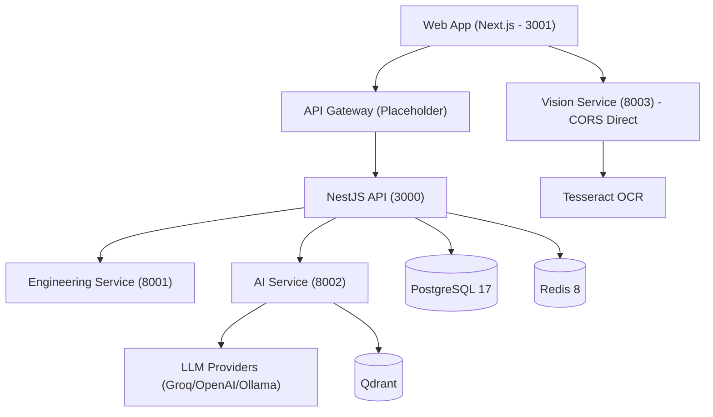

# Xennic — پلتفرم مهندسی برق هوشمند

**نسخه**: ۱.۰.۰ | **وضعیت**: توسعه فعال (MVP)

---

## درباره

Xennic یک پلتفرم مهندسی برق مبتنی بر هوش مصنوعی است که به مهندسان برق در تحلیل، طراحی و مستندسازی تجهیزات الکتریکی کمک می‌کند. این پلتفرم با ترکیب OCR پیشرفته، موتورهای محاسباتی مهندسی، و سیستم دانش مهندسی، یک دستیار هوشمند برای مهندسان برق فراهم می‌کند.

> این سند وضعیت **فعلی** پلتفرم را توصیف می‌کند. برای معماری هدف و چشم‌انداز بلندمدت، به اسناد با پسوند `_SPEC_v*` در هر زیرشاخه مراجعه کنید.

---

## وضعیت فعلی (Current State)

| مؤلفه | مسئولیت | وضعیت |
|-------|----------|--------|
| **NestJS API** | API مرکزی، احراز هویت، کاربران | ✅ فعال (پورت ۳۰۰۰) |
| **Web Frontend** (Next.js) | رابط کاربری | ✅ فعال (پورت ۳۰۰۱) |
| **Vision Service** | OCR و تحلیل تصاویر | ✅ فعال (پورت ۸۰۰۳) |
| **Engineering Service** | محاسبات مهندسی برق | ✅ فعال (پورت ۸۰۰۱) |
| **AI Service** | هوش مصنوعی و LLM | ✅ فعال (پورت ۸۰۰۲) |
| **API Gateway** | پروکسی درخواست‌ها | 🔄 Placeholder |
| **PostgreSQL 17** | دیتابیس اصلی | ✅ فعال |
| **Redis 8** | کش و صف | ✅ فعال |
| **RabbitMQ 4** | پیام‌رسانی | ✅ فعال |
| **Qdrant** | جستجوی برداری | ✅ فعال |
| **Knowledge System** | پایگاه دانش | 📋 برنامه‌ریزی |
| **Marketplace** | بازارگاه محتوا | 📋 برنامه‌ریزی |
| **Mobile App** | اپلیکیشن موبایل | 📋 برنامه‌ریزی |

---

## معماری فعلی

## ساختار مستندات

| بخش | مسیر | توضیح |
|------|------|-------|
| **معماری جاری** | `architecture/` | وضعیت فعلی + اسناد معماری هدف (_SPEC_v*) |
| **سرویس‌ها** | `services/` | Vision, Engineering, AI Service |
| **بینایی ماشین** | `ai/VISION_AI.md` | OCR Pipeline، Cascade OCR |
| **دانش** | `knowledge/KNOWLEDGE_PLATFORM.md` | پلتفرم دانش (در حال توسعه) |
| **مهندسی** | `engineering/` | موتور محاسبات + کاتالوگ فرمول‌ها |
| **پایگاه داده** | `database/DATABASE_ARCHITECTURE.md` | معماری دیتابیس جاری |
| **API** | `api/API_REFERENCE.md` | مرجع API تمام سرویس‌ها |
| **فرانت‌اند** | `frontend/FRONTEND_ARCHITECTURE.md` | معماری Next.js |
| **زیرساخت** | `infrastructure/INFRASTRUCTURE.md` | Docker, پورت‌ها, env |
| **امنیت** | `security/SECURITY_MODEL.md` | JWT, RBAC, Multi-tenant |
| **توسعه** | `development/DEVELOPER_GUIDE.md` | راهنمای راه‌اندازی و توسعه |
| **محصول** | `product/PRODUCT_VISION.md` | چشم‌انداز محصول و پرسونا |
| **نقشه راه** | `roadmap/ROADMAP.md` | اولویت‌ها و فازهای توسعه |
| **تصمیمات معماری** | `decisions/ADR-*.md` | سوابق تصمیمات فنی |
| **استانداردها** | `standards/` | استانداردهای کدنویسی |
| **مدیریت پروژه** | `project-management/` | governance و roadmap کلی |
| **استقرار** | `deployment/` | specs استقرار و توسعه |
