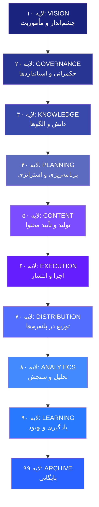
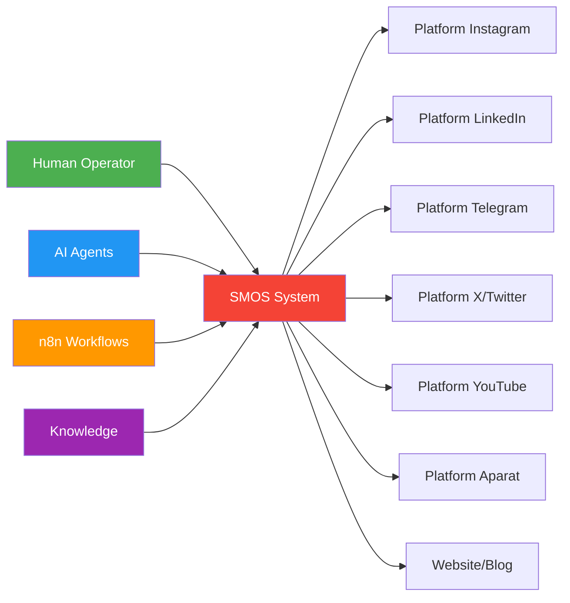
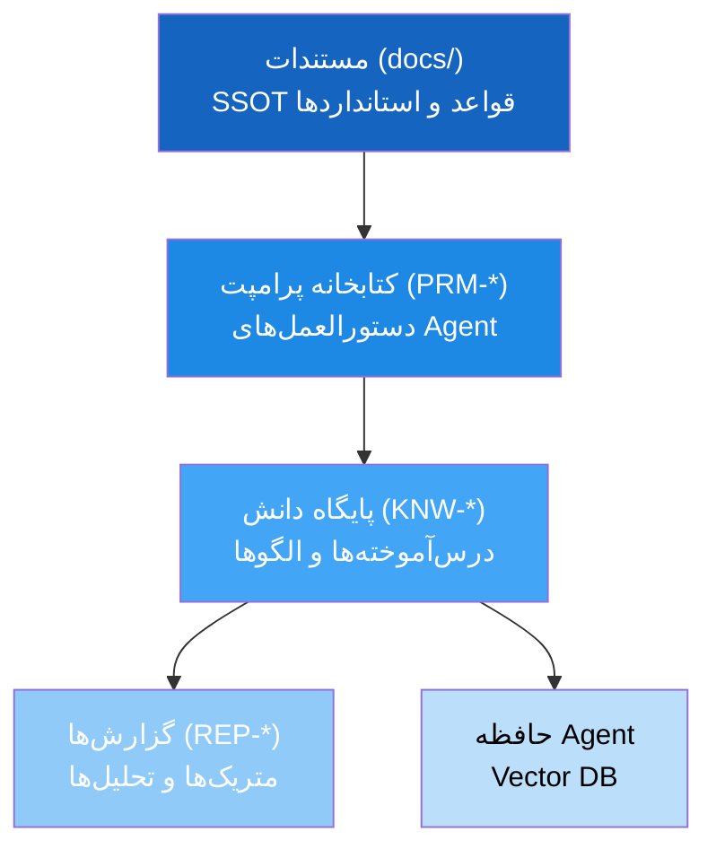
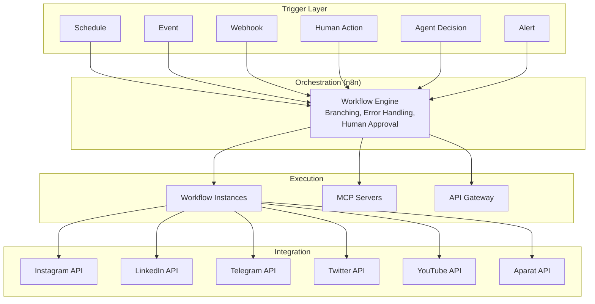
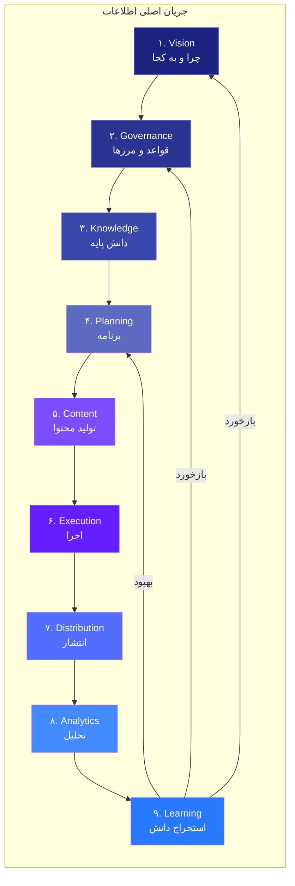
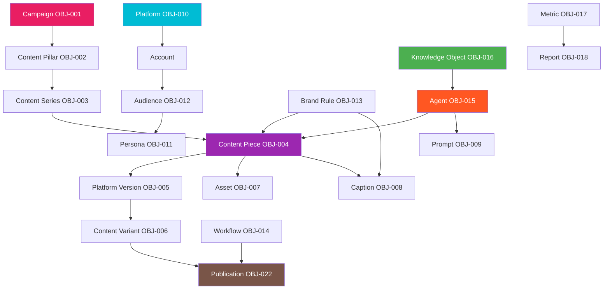
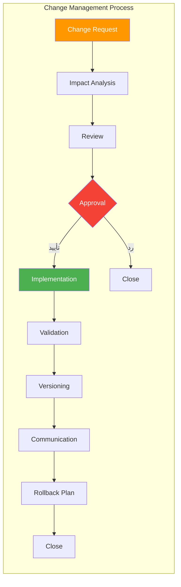
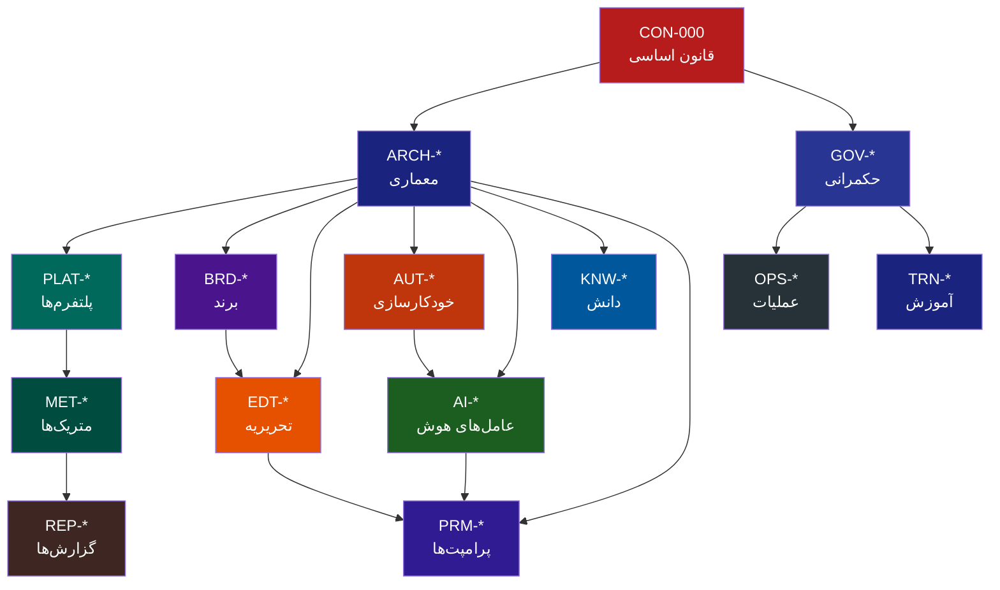

# SMOS Enterprise System Blueprint — نمای کلی سیستم SMOS

> **شناسه:** ARCH-001
> **وضعیت:** پیش‌نویس
> **نسخه:** 1.0.0-draft
> **به‌روزرسانی:** 2026-06-27
> **مسئول:** معمار سیستم
> **وابستگی:** [CON-000](../05-CONSTITUTION/00-constitution.md), [ARCH-000](./00-architecture-overview.md), [ARCH-010](./10-meta-architecture.md), [ARCH-030](./30-governance-architecture.md)
> **مخاطب:** human, agent, n8n, mcp

---

## ۱. Executive Summary

SMOS (Social Media Operating System) یک **سیستم عامل سازمانی** برای مدیریت تمام فعالیت‌های رسانه‌ای شرکت Xennic است. SMOS یک نرم‌افزار یا ابزار نیست — یک **بستر یکپارچه** شامل انسان، عامل‌های هوشمند (AI Agents)، گردش کارهای خودکار (n8n Workflows) و دانش سازمانی است.

این سند **نقشه کامل سیستم** (System Blueprint) است: یک سند معرفی که کل SMOS را از زوایای کسب‌وکار، مهندسی، دانش، هوش مصنوعی، خودکارسازی و حکمرانی توضیح می‌دهد. برای خواندن این سند نیازی به مراجعه به سند دیگر نیست — این سند خود به عنوان **دروازه ورود** به کل سیستم مستندات SMOS عمل می‌کند.

### هسته SMOS در یک نگاه

| جنبه           | خلاصه                                                               |
| -------------- | ------------------------------------------------------------------- |
| **چیست**       | سیستم عامل مدیریت شبکه‌های اجتماعی                                  |
| **مالک**       | شرکت Xennic (زر نور نیرو یکتا)                                      |
| **هدف**        | ایجاد یکپارچگی، پایداری و مقیاس‌پذیری در فعالیت‌های رسانه‌ای سازمان |
| **مخاطبان**    | انسان، AI Agent، n8n، MCP                                           |
| **معماری**     | ۱۰ لایه سازمانی — از Vision تا Archive                              |
| **اسناد**      | ۱۷ ماژول، ۴۱+ سند                                                   |
| **عامل‌ها**    | ۱۴ AI Agent با مسئولیت واحد                                         |
| **خودکارسازی** | n8n, MCP, API — لایه اجرایی                                         |
| **حکمرانی**    | ۱۰ لایه حکمرانی، ۱۴ نقش RACI، ۹ نوع تصمیم                           |
| **دانش**       | ۵ مخزن دانش، ۲۲ شیء، ۱۶ رابطه هستی‌شناسی                            |

---

## ۲. What is SMOS?

SMOS = **Social Media Operating System**. یک سیستم عامل سازمانی برای مدیریت شبکه‌های اجتماعی که:

- **یکپارچه** است: همه فعالیت‌های رسانه‌ای در یک بستر مدیریت می‌شوند
- **چندعاملی** است: انسان، AI Agent و سیستم‌های خودکار با هم کار می‌کنند
- **دانش‌محور** است: هر عملیات دانش تولید می‌کند و هر دانش عملیات را بهبود می‌بخشد
- **حکمرانی‌شده** است: همه چیز با قواعد، نقش‌ها و اختیارات مشخص اداره می‌شود
- **مستندات‌محور** است: همه اسناد منبع حقیقت واحد (SSOT) هستند

SMOS سه وجه دارد:

```
┌─────────────────────────────────────────────────────────────────┐
│                      SMOS — سه وجه                              │
├─────────────────────────────────────────────────────────────────┤
│                                                                  │
│  ┌─────────────────┐  ┌─────────────────┐  ┌─────────────────┐  │
│  │    لایه فکری     │  │   لایه اجرایی    │  │   لایه دانش     │  │
│  │  (Governance)   │  │  (Automation)   │  │  (Knowledge)   │  │
│  │                 │  │                 │  │                 │  │
│  │  • قانون اساسی  │  │  • n8n          │  │  • مستندات      │  │
│  │  • معماری       │  │  • AI Agents   │  │  • پرامپت‌ها    │  │
│  │  • حکمرانی      │  │  • MCP Servers │  │  • پایگاه دانش  │  │
│  │  • استانداردها  │  │  • API Gateway  │  │  • گزارش‌ها    │  │
│  │  • برند         │  │  • Platform APIs│  │  • Agent Memory │  │
│  └─────────────────┘  └─────────────────┘  └─────────────────┘  │
│                                                                  │
└─────────────────────────────────────────────────────────────────┘
```

### SMOS نیست:

- یک نرم‌افزار社交‌مدیا (مانند Hootsuite یا Buffer)
- یک ابزار تولید محتوا
- یک پروژه موقت
- یک پلتفرم فناوری خاص
- یک دیتابیس یا سرویس ابری

طبق [CON-000](../05-CONSTITUTION/00-constitution.md) §۱: "SMOS یک سیستم عامل است — بستری برای مدیریت تمام فعالیت‌های رسانه‌ای سازمان در طول زمان."

---

## ۳. Purpose

### چرا SMOS وجود دارد؟

1. **یکپارچگی**: تمام فعالیت‌های رسانه‌ای سازمان در یک چارچوب واحد مدیریت می‌شوند
2. **پایداری**: سیستم برای حداقل ۱۰ سال بدون بازطراحی اساسی طراحی شده است
3. **مقیاس**: از یک تیم تا سازمان بزرگ قابل رشد است
4. **حافظه سازمانی**: دانش فردی به دانش سازمانی تبدیل و حفظ می‌شود
5. **تعادل AI-انسان**: کارایی خودکار با قضاوت انسانی ترکیب می‌شود
6. **چندعاملی**: هم انسان، هم Agent، هم سیستم‌های خودکار می‌توانند از آن استفاده کنند

### اهداف کلان (طبق CON-000)

| هدف     | توضیح                                                  |
| ------- | ------------------------------------------------------ |
| **۱.۱** | ایجاد سیستم پایدار، مقیاس‌پذیر و قابل اعتماد           |
| **۱.۲** | تضمین یکپارچگی در تمام ارتباطات رسانه‌ای               |
| **۱.۳** | تبدیل دانش فردی به دانش سازمانی                        |
| **۱.۴** | تعادل مؤثر بین کارایی خودکار و قضاوت انسانی            |
| **۱.۵** | بستر قابل استفاده برای حداقل یک دهه                    |
| **۱.۶** | تضمین قابل برنامه‌ریزی، اجرا، اندازه‌گیری و بهبود بودن |

---

## ۴. Business Context

### سازمان Xennic

Xennic (زر نور نیرو یکتا) شرکتی است که SMOS را به عنوان سیستم عامل رسانه‌ای خود ایجاد کرده است. SMOS منعکس‌کننده هویت، ارزش‌ها و اهداف سازمانی Xennic است.

### ذی‌نفعان

| نقش                                   | مشارکت در SMOS                            |
| ------------------------------------- | ----------------------------------------- |
| مدیر ارشد (Media Director)            | تصویب استراتژی، قانون اساسی، تصمیمات کلان |
| معمار سیستم (System Architect)        | طراحی معماری، تأیید استانداردها           |
| مدیر برند (Brand Manager)             | حفظ هویت برند                             |
| مدیر محتوا (Content Manager)          | مدیریت تولید و انتشار محتوا               |
| مهندس حکمرانی (Governance Engineer)   | نگهداری استانداردها و قواعد               |
| مهندس AI (AI Governance Manager)      | مدیریت عامل‌های هوشمند                    |
| مهندس اتوماسیون (Automation Engineer) | پیاده‌سازی n8n workflows                  |
| معمار دانش (Knowledge Manager)        | مدیریت دانش سازمانی                       |
| تحلیل‌گر (Analyst)                    | اندازه‌گیری و گزارش                       |
| اپراتور انسانی (Human Operator)       | اجرای عملیات روزانه                       |

### بستر فناوری (مستقل از پلتفرم)

SMOS مستقل از فناوری است. با این حال، معماری برای ابزارهای زیر طراحی شده است:

- **n8n**: موتور گردش کار خودکار
- **MCP (Model Context Protocol)**: پروتکل زمینه مدل برای Agentها
- **Vector DB**: پایگاه داده برداری برای حافظه Agent
- **Markdown + Git**: برای مستندات و version control
- **Platform APIs**: Graph API, REST API شبکه‌های اجتماعی

---

## ۵. High-Level Architecture

### لایه‌های معماری (Enterprise Layer Model)

معماری SMOS از ۱۰ لایه سازمانی تشکیل شده است که از Vision (چشم‌انداز) تا Archive (بایگانی) را پوشش می‌دهد. این لایه‌ها در [ARCH-010](./10-meta-architecture.md) تعریف شده‌اند.



### مستندات منتسب به هر لایه

| لایه         | مستندات SSOT                                                                                                                                       |
| ------------ | -------------------------------------------------------------------------------------------------------------------------------------------------- |
| Vision       | [CON-000](../05-CONSTITUTION/00-constitution.md)                                                                                                   |
| Governance   | [GOV-\*](../10-GOVERNANCE/), [ARCH-030](./30-governance-architecture.md), [ARCH-031](./31-change-management.md), [ARCH-032](./32-ai-governance.md) |
| Knowledge    | [ARCH-003](./03-glossary.md), [ARCH-012](./12-knowledge-model.md), [KNW-\*](../45-KNOWLEDGE/)                                                      |
| Planning     | [PLAT-\*](../20-PLATFORMS/), [BRD-\*](../22-BRAND/), [EDT-\*](../24-EDITORIAL/)                                                                    |
| Content      | [AI-\*](../40-AI-AGENTS/), [PRM-\*](../35-PROMPTS/), [EDT-\*](../24-EDITORIAL/)                                                                    |
| Execution    | [AUT-\*](../30-AUTOMATION/), [OPS-\*](../50-OPERATIONS/)                                                                                           |
| Distribution | [PLAT-\*](../20-PLATFORMS/), [AUT-\*](../30-AUTOMATION/)                                                                                           |
| Analytics    | [MET-\*](../60-METRICS/), [REP-\*](../55-REPORTS/), [AI-002](../40-AI-AGENTS/20-analytics-agent/)                                                  |
| Learning     | [KNW-\*](../45-KNOWLEDGE/), [PRM-\*](../35-PROMPTS/), [AI-\*](../40-AI-AGENTS/)                                                                    |
| Archive      | [ARC-\*](../90-ARCHIVE/)                                                                                                                           |

---

## ۶. Major Components

SMOS از ۵ مؤلفه اصلی تشکیل شده است:



### ۶.۱ انسان (Human Operator)

انسان در SMOS سه نقش اصلی دارد:

- **تصمیم‌گیرنده**: تأیید محتوا، تغییر استراتژی، تصویب استانداردها
- **نظارت‌کننده**: نظارت بر عملکرد Agentها و Workflowها
- **خلاق**: تولید ایده، نگارش محتوای حساس، تعامل با مخاطبان

### ۶.۲ عامل‌های هوشمند (AI Agents)

۱۴ Agent با مسئولیت واحد — جزئیات در [ARCH-013](./13-ai-operating-model.md) و [AI-\*](../40-AI-AGENTS/).

| Agent        | وظیفه                    | سطح اختیار |
| ------------ | ------------------------ | ---------- |
| Orchestrator | هماهنگی مرکزی            | A-1        |
| Research     | تحقیق و جمع‌آوری اطلاعات | A-1        |
| Planning     | برنامه‌ریزی محتوا        | A-1        |
| Writing      | تولید محتوا              | A-2        |
| Review       | بازبینی محتوا            | A-1        |
| Fact Check   | راستی‌آزمایی             | A-2        |
| Graphic      | تولید تصویر              | A-2        |
| Video        | تولید ویدئو              | A-2        |
| Publishing   | انتشار                   | A-3        |
| Monitoring   | نظارت                    | A-3        |
| Analytics    | تحلیل داده               | A-2        |
| Knowledge    | استخراج دانش             | A-2        |
| Improvement  | بهبود مستمر              | A-1        |
| Engagement   | تعامل با مخاطبان         | A-2        |

### ۶.۳ خودکارسازی (n8n Workflows)

لایه اجرایی SMOS — جزئیات در [ARCH-014](./14-automation-model.md).

| خط لوله          | وظیفه                            |
| ---------------- | -------------------------------- |
| Content Pipeline | تولید → بازبینی → تأیید → انتشار |
| Monitoring       | نظارت بر عملکرد پلتفرم‌ها        |
| Reporting        | تولید گزارش‌های دوره‌ای          |
| Alerts           | هشدار و اعلان                    |
| Integrations     | یکپارچه‌سازی با API پلتفرم‌ها    |

### ۶.۴ دانش (Knowledge)

۵ مخزن دانش — جزئیات در [ARCH-012](./12-knowledge-model.md).

| مخزن        | محتوا                       |
| ----------- | --------------------------- |
| مستندات     | قوانین، استانداردها، معماری |
| پرامپت‌ها   | دستورالعمل‌های Agent        |
| پایگاه دانش | درس‌آموخته‌ها، الگوها       |
| گزارش‌ها    | متریک‌ها، تحلیل‌ها          |
| حافظه Agent | دانش عملیاتی Agentها        |

### ۶.۵ مستندات (Documents)

۱۷ ماژول مستندات — جزئیات در [ARCH-000](./00-architecture-overview.md).

---

## ۷. Knowledge Architecture

SMOS یک سیستم **دانش‌محور** است. دانش در هسته سیستم جریان دارد و هر عملیات دانش جدید تولید می‌کند.

### مخازن دانش (۵ گانه)



### جریان دانش (Knowledge Flow)

```
لایه Vision (CON-000)  →  اهداف و استراتژی
       ↓
لایه Governance (GOV-*)  →  قواعد و استانداردها
       ↓
لایه Knowledge (KNW-*)  →  دانش پایه
       ↓
لایه Planning (PLAT-*)  →  برنامه عملیاتی
       ↓
لایه Content (AI + PRM)  →  تولید محتوا
       ↓
لایه Execution (AUT)  →  اجرا و انتشار
       ↓
لایه Analytics (MET)  →  داده و تحلیل
       ↓
لایه Learning (KNW + AI)  →  استخراج دانش جدید
       ↓
            بازخورد به لایه‌های بالاتر
```

### هستی‌شناسی (Ontology)

۲۲ شیء با ۱۶ رابطه معنایی — جزئیات در [ARCH-003](./03-glossary.md) §۶ و [ARCH-011](./11-object-model.md).

| رابطه          | مثال                      |
| -------------- | ------------------------- |
| `governs`      | Constitution → همه اسناد  |
| `contains`     | Campaign → Content Pillar |
| `creates`      | AI Agent → Content Piece  |
| `approves`     | Human → Publication       |
| `supersedes`   | ADR جدید → ADR قدیمی      |
| `derived_from` | Insight → Finding         |
| `measures`     | Report → Metric           |

---

## ۸. Governance Architecture

حکمرانی SMOS در ۱۰ لایه تعریف شده است — از Enterprise تا Asset. جزئیات کامل در [ARCH-030](./30-governance-architecture.md).

```mermaid
graph TD
    subgraph "سلسله‌مراتب حکمرانی"
        G1["Enterprise (CON-000)"] --> G2["Program (CAM-*)"]
        G2 --> G3["System (ARCH-*, GOV-*)"]
        G3 --> G4["Module (docs/ module)"]
        G4 --> G5["Document (single doc)"]
        G5 --> G6["Knowledge Object (KNW-*)"]
        G6 --> G7["Workflow (AUT-*)"]
        G7 --> G8["AI Agent (AI-*)"]
        G8 --> G9["Platform (PLAT-*)"]
        G9 --> G10["Asset (AST-*)"]
    end

    style G1 fill:#b71c1c,color:#fff
    style G2 fill:#c62828,color:#fff
    style G3 fill:#d32f2f,color:#fff
    style G4 fill:#e53935,color:#fff
    style G5 fill:#ef5350,color:#fff
    style G6 fill:#e57373,color:#fff
    style G7 fill:#ef9a9a,color:#000
    style G8 fill:#ffcdd2,color:#000
    style G9 fill:#ffebee,color:#000
    style G10 fill:#fce4ec,color:#000
```



### مدل مالکیت

هر موجودیت SMOS دارای ۶ نقش مالکیتی است — [ARCH-030](./30-governance-architecture.md) §۴:

| نقش        | مسئولیت            |
| ---------- | ------------------ |
| Owner      | پاسخگویی نهایی     |
| Custodian  | مدیریت روزمره      |
| Maintainer | به‌روزرسانی فنی    |
| Reviewer   | بازبینی تغییرات    |
| Approver   | تأیید نهایی        |
| Consumer   | استفاده از موجودیت |

### RACI

۱۴ نقش در ماتریس RACI تعریف شده‌اند — [ARCH-030](./30-governance-architecture.md) §۵.

### انواع تصمیم

| نوع       | Owner           | سطح تأیید                 |
| --------- | --------------- | ------------------------- |
| استراتژیک | مدیر ارشد       | L4 (Board)                |
| معماری    | معمار سیستم     | L3 (Architect + Director) |
| عملیاتی   | اپراتور         | L2 (Manager)              |
| تحریریه   | مدیر محتوا      | L2                        |
| پلتفرم    | مدیر پلتفرم     | L2                        |
| برند      | مدیر برند       | L3                        |
| AI        | مهندس AI        | L3                        |
| اتوماسیون | مهندس اتوماسیون | L3                        |
| اضطراری   | مدیر رسانه      | L5 (Fast Track)           |

**سطوح تأیید:** L1 خودکار, L2 تک‌نفره, L3 دو نفره, L4 گروهی, L5 اضطراری.

### استانداردهای مستندات

۵ استاندارد حکمرانی در [GOV-001](./../10-GOVERNANCE/01-documentation-standards.md) تا [GOV-005](./../10-GOVERNANCE/05-metadata.md) تعریف شده‌اند:

| استاندارد | محتوا                                |
| --------- | ------------------------------------ |
| GOV-001   | ساختار، قالب و قواعد نگارش اسناد     |
| GOV-002   | نسخه‌بندی Semantic X.Y.Z             |
| GOV-003   | شناسه اسناد، نام فایل، نام دایرکتوری |
| GOV-004   | ۶ نوع ارجاع، DAG, پیشگیری از دور     |
| GOV-005   | ۱۰ فیلد فراداده اجباری و اختیاری     |

---

## ۹. AI Architecture

معماری AI از ۱۴ عامل هوشمند با مسئولیت واحد تشکیل شده است. جزئیات کامل در [ARCH-013](./13-ai-operating-model.md).

```mermaid
graph TD
    O["Orchestrator<br/>Agent-000<br/>هماهنگی مرکزی"] --> R["Research<br/>Agent-001<br/>تحقیق"]
    O --> P["Planning<br/>Agent-002<br/>برنامه‌ریزی"]
    O --> W["Writing<br/>Agent-003<br/>تولید محتوا"]
    O --> RV["Review<br/>Agent-004<br/>بازبینی"]
    O --> FC["Fact Check<br/>Agent-005<br/>راستی‌آزمایی"]
    O --> G["Graphic<br/>Agent-006<br/>تصویر"]
    O --> V["Video<br/>Agent-007<br/>ویدئو"]
    O --> PB["Publishing<br/>Agent-008<br/>انتشار"]
    O --> M["Monitoring<br/>Agent-009<br/>نظارت"]
    O --> A["Analytics<br/>Agent-010<br/>تحلیل"]
    O --> K["Knowledge<br/>Agent-011<br/>دانش"]
    O --> I["Improvement<br/>Agent-012<br/>بهبود"]
    O --> E["Engagement<br/>Agent-013<br/>تعامل"]
    O --> S["Scheduler<br/>Agent-014<br/>زمان‌بندی"]

    style O fill:#ff6f00,color:#fff
    style R fill:#1565c0,color:#fff
    style P fill:#1e88e5,color:#fff
    style W fill:#42a5f5,color:#fff
    style RV fill:#7c4dff,color:#fff
    style FC fill:#651fff,color:#fff
    style G fill:#00c853,color:#fff
    style V fill:#00e676,color:#fff
    style PB fill:#ff9100,color:#fff
    style M fill:#ffab00,color:#fff
    style A fill:#d50000,color:#fff
    style K fill:#aa00ff,color:#fff
    style I fill:#6200ea,color:#fff
    style E fill:#2962ff,color:#fff
    style S fill:#0091ea,color:#fff
```



### سطوح اختیار Agentها — [ARCH-032](./32-ai-governance.md)

| سطح | توضیح                | Agentها                                                               |
| --- | -------------------- | --------------------------------------------------------------------- |
| A-0 | بدون اختیار AI       | —                                                                     |
| A-1 | پیشنهاد به انسان     | Research, Planning, Review, Improvement                               |
| A-2 | اقدام با نظارت انسان | Writing, Graphic, Video, Fact Check, Analytics, Knowledge, Engagement |
| A-3 | خودکار حوزه محدود    | Publishing (تأییدشده), Monitoring                                     |
| A-4 | خودکار کامل          | Data Collection, Logging                                              |

### اقدامات ممنوعه Agentها

Agentها هرگز نمی‌توانند:

- محتوای تأییدنشده منتشر کنند
- قواعد برند را تغییر دهند
- قانون اساسی را تغییر دهند
- مرزهای اختیار Agent دیگر را تغییر دهند
- به نام انسان بدون مجوز پیام ارسال کنند

---

## ۱۰. Automation Architecture

لایه خودکارسازی SMOS از n8n به عنوان موتور orchestration استفاده می‌کند. جزئیات کامل در [ARCH-014](./14-automation-model.md).



### خطوط لوله اصلی

| خط لوله          | محرک                            | گام‌ها                                           |
| ---------------- | ------------------------------- | ------------------------------------------------ |
| Content Pipeline | برنامه زمان‌بندی + تأیید انسانی | تحقیق → نگارش → بازبینی → تأیید → تولید → انتشار |
| Monitoring       | زمان‌بندی (ساعتی)               | دریافت داده → تحلیل → هشدار در صورت نیاز         |
| Reporting        | زمان‌بندی (روزانه/هفتگی/ماهانه) | جمع‌آوری → پردازش → قالب‌بندی → توزیع            |
| Alerts           | رویداد (Metric Threshold)       | تشخیص → ارزیابی → اعلان                          |

### اصل کلیدی

**Automation و Agent جدا هستند:** Agent تصمیم می‌گیرد (لایه هوش)، Automation اجرا می‌کند (لایه اجرا). — [ADR-013](./34-adr-system.md#adr-list)

---

## ۱۱. Content Architecture

### چرخه حیات محتوا (Content Lifecycle)

محتوا در SMOS یک چرخه ۱۵ مرحله‌ای را طی می‌کند — جزئیات در [ARCH-011](./11-object-model.md) §۶.

```
Idea → Research → Validation → Planning → Writing → Review →
Approval → Production → Publishing → Distribution → Monitoring →
Analytics → Knowledge Extraction → Continuous Improvement → Archive
```

### سلسله‌مراتب محتوا

```
Campaign (کمپین)
  └── Content Pillar (ستون محتوا)
       └── Content Series (سری محتوا)
            └── Content Piece (قطعه محتوا)
                 └── Platform Version (نسخه پلتفرم)
                      └── Content Variant (واریانت A/B)
                           └── Publication (انتشار)
```

### انواع محتوا

| نوع              | توضیح                 | SSOT    |
| ---------------- | --------------------- | ------- |
| Content Piece    | واحد پایه محتوا       | CONT-\* |
| Platform Version | بومی‌سازی برای پلتفرم | CONT-\* |
| Content Variant  | تغییر A/B             | CONT-\* |
| Caption          | متن همراه             | CONT-\* |
| Asset            | فایل رسانه‌ای         | AST-\*  |

---

## ۱۲. Platform Architecture

### پلتفرم‌های هدف

| پلتفرم         | SSOT                                                         | اولویت | API             |
| -------------- | ------------------------------------------------------------ | ------ | --------------- |
| —              | [PLAT-000](../20-PLATFORMS/00-platform-playbook-standard.md) | P0     | Master Template |
| Instagram      | PLAT-001                                                     | P1     | Graph API       |
| LinkedIn       | PLAT-002                                                     | P1     | REST API        |
| Telegram       | PLAT-003                                                     | P1     | Bot API         |
| X / Twitter    | PLAT-004                                                     | P2     | REST API        |
| YouTube        | PLAT-005                                                     | P2     | Data API        |
| Aparat         | PLAT-006                                                     | P2     | REST API        |
| Website / Blog | PLAT-007                                                     | P2     | CMS API         |

### مدل برند — [BRD-\*](../22-BRAND/)

| سند     | محتوا                             |
| ------- | --------------------------------- |
| BRD-000 | نمای کلی برند                     |
| BRD-001 | هویت برند (لوگو، رنگ، تایپوگرافی) |
| BRD-002 | صدای برند و لحن                   |
| BRD-003 | راهنمای بصری                      |
| BRD-004 | قالب‌های برند                     |

### مدل تحریریه — [EDT-\*](../24-EDITORIAL/)

| سند     | محتوا                  |
| ------- | ---------------------- |
| EDT-000 | نمای کلی تحریریه       |
| EDT-001 | دستورالعمل‌های محتوا   |
| EDT-002 | لحن و سبک نگارش        |
| EDT-003 | تقویم تحریریه          |
| EDT-004 | انواع و قالب‌های محتوا |

---

## ۱۳. Information Flow

جریان اطلاعات در SMOS از Vision به سمت Learning و سپس بازخورد به Vision حرکت می‌کند.



### مسیرهای اطلاعاتی کلیدی

| مسیر                | مبدأ            | مقصد            | پروتکل          |
| ------------------- | --------------- | --------------- | --------------- |
| Strategic Direction | CON-000         | ARCH-_, GOV-_   | Human review    |
| Content Brief       | EDT-003         | AI Agents       | Prompt          |
| Content Draft       | AI Agents       | Human           | Markdown/Text   |
| Approval            | Human           | n8n             | API Call        |
| Publication         | n8n             | Platform        | REST API        |
| Metrics             | Platform        | Analytics Agent | API             |
| Insights            | Analytics Agent | KNW-\*          | Structured data |
| Knowledge           | KNW-\*          | PRM-\*          | Review + Update |

---

## ۱۴. Object Relationships

۲۲ شیء SMOS در [ARCH-011](./11-object-model.md) تعریف شده‌اند. روابط اصلی بین آن‌ها:



### جدول روابط اصلی

| از               | رابطه       | به               |
| ---------------- | ----------- | ---------------- |
| Campaign         | `contains`  | Content Pillar   |
| Content Pillar   | `contains`  | Content Series   |
| Content Series   | `contains`  | Content Piece    |
| Content Piece    | `has`       | Platform Version |
| Platform Version | `has`       | Content Variant  |
| Content Variant  | `has`       | Publication      |
| Content Piece    | `has`       | Asset, Caption   |
| AI Agent         | `creates`   | Content Piece    |
| Human            | `approves`  | Publication      |
| Workflow         | `publishes` | Publication      |
| Constitution     | `governs`   | همه              |

---

## ۱۵. System Lifecycle

### چرخه حیات سند — [ARCH-031](./31-change-management.md) §۵

```
Proposal → Draft → Review → Approved/Rejected → Published →
Deprecated/Superseded → Archived → Kept/Deleted
```

### چرخه حیات محتوا — [ARCH-011](./11-object-model.md) §۶

```
Idea → Research → Validation → Planning → Writing → Review →
Approval → Production → Publishing → Distribution → Monitoring →
Analytics → Knowledge Extraction → Continuous Improvement → Archive
```

### چرخه حیات دانش — [ARCH-033](./33-knowledge-audit-traceability.md) §۳

```
Creation → Validation → Review → Approval → Publication → Active →
  └── Review (سالانه) → Keep / Update / Expired → Archive / Deprecated
```

### چرخه حیات ADR — [ARCH-034](./34-adr-system.md) §۴

```
Proposed → Reviewed → Accepted/Rejected → Superseded
  └── (ADRها هرگز حذف نمی‌شوند)
```

### چرخه حیات Agent — [ARCH-013](./13-ai-operating-model.md) §۵

```
Defined → Developed → Tested → Active → Monitoring → Updated → Deprecated
```

### چرخه حیات Workflow — [ARCH-014](./14-automation-model.md)

```
Design → Development → Testing → Active → Paused → Deprecated
```

---

## ۱۶. Decision Flow

### سلسله‌مراتب تصمیم‌گیری

```
CON-000  قانون اساسی  ← بالاترین مرجع
   │
   ▼
ARCH-*  معماری  ← تصمیمات ساختاری
   │
   ▼
GOV-*  حکمرانی  ← قواعد و استانداردها
   │
   ▼
POLICIES  خط‌مشی‌ها  ← اجرای استانداردها
   │
   ▼
PROCEDURES  رویه‌ها  ← دستورالعمل‌های اجرایی
   │
   ▼
ACTIONS  اقدامات  ← اجرا توسط انسان یا Agent
```

### فرایند تصمیم‌گیری (طبق ARCH-030)



### ADR — ثبت تصمیمات معماری

هر تصمیم معماری در ADR ثبت می‌شود — [ARCH-034](./34-adr-system.md). ADRها:

- غیرقابل حذف هستند (فقط supersede)
- شماره‌گذاری ترتیبی: ADR-NNN
- شامل زمینه، گزینه‌ها، تصمیم و پیامدها
- برای انسان و Agent قابل خواندن

۲۸ ADR تاکنون ثبت شده است (S0.0 تا S0.3).

---

## ۱۷. Documentation Map

SMOS دارای ۱۷ ماژول مستندات است که در docs/ سازماندهی شده‌اند. جزئیات کامل در [ARCH-000](./00-architecture-overview.md).

### ماژول‌ها

| ماژول        | شناسه | طبقه       | اولویت | وضعیت      |
| ------------ | ----- | ---------- | ------ | ---------- |
| معماری       | ARCH  | استراتژیک  | P0     | ✅ ۱۲ سند  |
| قانون اساسی  | CON   | استراتژیک  | P0     | ✅ CON-000 |
| حکمرانی      | GOV   | استراتژیک  | P0     | ✅ ۵ سند   |
| پلتفرم‌ها    | PLAT  | پلتفرم     | P1     | ⬜ خالی    |
| برند         | BRD   | پلتفرم     | P1     | ⬜ خالی    |
| تحریریه      | EDT   | پلتفرم     | P1     | ⬜ خالی    |
| دارایی‌ها    | AST   | عملیاتی    | P2     | ⬜ خالی    |
| خودکارسازی   | AUT   | خودکارسازی | P0     | ⬜ خالی    |
| پرامپت‌ها    | PRM   | خودکارسازی | P1     | ⬜ خالی    |
| عامل‌های هوش | AI    | عامل هوش   | P0     | ⬜ خالی    |
| دانش         | KNW   | مرجع       | P2     | ⬜ خالی    |
| عملیات       | OPS   | عملیاتی    | P0     | ⬜ خالی    |
| گزارش‌ها     | REP   | عملیاتی    | P1     | ⬜ خالی    |
| متریک‌ها     | MET   | عملیاتی    | P1     | ⬜ خالی    |
| مرجع         | REF   | مرجع       | P1     | ⬜ خالی    |
| آموزش        | TRN   | آموزشی     | P1     | ⬜ خالی    |
| آرشیو        | ARC   | تاریخی     | P3     | ⬜ خالی    |

### گراف وابستگی مستندات



---

## ۱۸. Relationship with Constitution

[CON-000](../05-CONSTITUTION/00-constitution.md) **قانون اساسی SMOS** عالی‌ترین سند سیستم است. رابطه ARCH-001 با CON-000:

| جنبه           | CON-000                           | ARCH-001                             |
| -------------- | --------------------------------- | ------------------------------------ |
| **جایگاه**     | سند عالی — رأس هرم                | سند معماری — زیرمجموعه CON-000       |
| **محتوا**      | مأموریت، چشم‌انداز، ارزش‌ها، اصول | نقشه سیستم، مؤلفه‌ها، روابط          |
| **مخاطب**      | همه                               | معماران، مهندسان، تصمیم‌گیرندگان     |
| **تغییرپذیری** | بسیار نادر — MAJOR.MINOR          | فصلی — X.Y.Z                         |
| **دامنه**      | چرایی و اصول                      | چیستی و چگونگی                       |
| **تطابق**      | —                                 | همه محتوای ARCH-001 تابع CON-000 است |

### اصول بنیادین از CON-000 که معماری را شکل می‌دهند

| اصل از CON-000          | تجلی در معماری           |
| ----------------------- | ------------------------ |
| §۴ — اصول بنیادین       | لایه‌های سازمانی، SSOT   |
| §۱۰ — اصول حکمرانی      | ۱۰ لایه حکمرانی، RACI    |
| §۱۱ — اصول تصمیم‌گیری   | ۹ نوع تصمیم، سطوح تأیید  |
| §۱۳ — اصول معماری       | معماری متا، مدل اشیاء    |
| §۱۶ — یکپارچگی برند     | BRD-_, EDT-_             |
| §۱۷ — همکاری انسان و AI | ۱۴ Agent + انسان در حلقه |

---

## ۱۹. Relationship with ADR

ADRها (Architectural Decision Records) سیستم ثبت تصمیمات معماری SMOS هستند. ۲۸ ADR تاکنون ثبت شده — [ARCH-034](./34-adr-system.md).

### ADRهای کلیدی که معماری را شکل داده‌اند

| ADR     | تصمیم                               | تأثیر              |
| ------- | ----------------------------------- | ------------------ |
| ADR-001 | CONSTITUTION سند عالی سیستم         | CON-000 در رأس هرم |
| ADR-010 | ARCH-010 معماری متا = الگوی عملیاتی | ۱۰ لایه سازمانی    |
| ADR-012 | ۱۴ Agent با مسئولیت واحد            | معماری Agentها     |
| ADR-013 | Automation ≠ Agent                  | لایه‌های مجزا      |
| ADR-015 | تأیید انسانی برای ۵ حوزه            | Human-in-the-loop  |
| ADR-019 | حکمرانی ۱۰ لایه                     | ساختار حکمرانی     |
| ADR-020 | ۶ نقش مالکیتی                       | مدل مالکیت         |
| ADR-022 | ۹ نوع تصمیم                         | چارچوب تصمیم‌گیری  |
| ADR-028 | ADR سیستم ترتیبی                    | شماره‌گذاری ADR    |

### قواعد ADR

- هر تصمیم معماری باید در ADR ثبت شود
- ADRها غیرقابل حذف هستند (فقط supersede)
- هر ADR باید گزینه‌های جایگزین را بررسی کند
- ADRها برای انسان و Agent قابل خواندن هستند

---

## ۲۰. Future Evolution

### نقشه راه (Roadmap) — از ARCH-000

| فاز                           | ماژول‌ها                              | وضعیت           |
| ----------------------------- | ------------------------------------- | --------------- |
| فاز ۰ — پایه                  | ARCH-\*                               | ✅ کامل         |
| فاز ۱ — قانون اساسی و حکمرانی | CON, GOV, ARCH-001, ARCH-003          | 🔄 در حال انجام |
| فاز ۲ — حکمرانی و برند        | GOV-000, ARCH-002, ARCH-004, BRD, EDT | ⬜              |
| فاز ۳ — پلتفرم‌ها             | PLAT-\*                               | ⬜              |
| فاز ۴ — خودکارسازی و عامل‌ها  | AUT, PRM, AI                          | ⬜              |
| فاز ۵ — عملیات و متریک‌ها     | OPS, MET, REP                         | ⬜              |
| فاز ۶ — تکمیل                 | KNW, REF, TRN                         | ⬜              |

### استراتژی توسعه

| سناریو               | اقدام                                       |
| -------------------- | ------------------------------------------- |
| افزودن پلتفرم جدید   | دایرکتوری جدید در PLAT-\*, ثبت در PLAT-000  |
| افزودن Agent جدید    | دایرکتوری جدید در AI-\*, به‌روزرسانی AI-005 |
| افزودن Workflow جدید | زیرشاخه جدید در AUT-\*, ثبت در AUT-000      |
| بازبینی معماری       | هر ۶ ماه — انتقال اسناد قدیمی به ARCHIVE    |
| تغییر ساختاری        | نیاز به ADR + تأیید معمار سیستم             |

### اصول تکامل

- معماری برای ۱۰ سال آینده طراحی شده است
- پلتفرم‌ها قابل تعویض هستند
- فناوری زیرساخت قابل تغییر است
- SSOTها تغییر نمی‌کنند — محتوا به‌روز می‌شود
- قانون اساسی پایدار است

---

## ۲۱. Reading Guide

### برای خوانندگان جدید

اگر تازه با SMOS آشنا شده‌اید، مسیر پیشنهادی:

| مرحله | سند                                                       | چرا                         |
| ----- | --------------------------------------------------------- | --------------------------- |
| ۱     | [CON-000](../05-CONSTITUTION/00-constitution.md)          | درک مأموریت، ارزش‌ها و اصول |
| ۲     | **ARCH-001** (همین سند)                                   | درک نمای کلی سیستم          |
| ۳     | [ARCH-010](./10-meta-architecture.md)                     | درک لایه‌ها و معماری متا    |
| ۴     | [ARCH-030](./30-governance-architecture.md)               | درک حکمرانی و مالکیت        |
| ۵     | [GOV-001](../10-GOVERNANCE/01-documentation-standards.md) | درک استانداردهای مستندات    |

### برای تصمیم‌گیرندگان

| نقش             | اسناد پیشنهادی                  |
| --------------- | ------------------------------- |
| مدیر ارشد       | CON-000, ARCH-001, ARCH-030     |
| معمار سیستم     | همه ARCH-_, GOV-_, CON-000      |
| مدیر برند       | BRD-_, EDT-_, CON-000           |
| مهندس AI        | ARCH-013, ARCH-032, AI-_, PRM-_ |
| مهندس اتوماسیون | ARCH-014, AUT-\*, GOV-002       |
| تحلیل‌گر        | MET-_, REP-_, ARCH-012          |

### برای AI Agentها

| Agent           | اسناد ضروری                     |
| --------------- | ------------------------------- |
| Orchestrator    | ARCH-013, AI-005, GOV-\*        |
| Writing Agent   | EDT-_, BRD-_, PRM-001, ARCH-003 |
| Analytics Agent | MET-_, REP-_, PRM-002           |
| Knowledge Agent | ARCH-012, ARCH-033, KNW-\*      |

### نقشه ذهنی اسناد

```
شروع از CON-000 (چرا)
     │
     ▼
ARCH-001 (چه و چگونه) ← شما اینجا هستید
     │
     ├── ARCH-010 (لایه‌ها)
     │    ├── ARCH-011 (اشیاء)
     │    ├── ARCH-012 (دانش)
     │    ├── ARCH-013 (Agentها)
     │    └── ARCH-014 (خودکارسازی)
     │
     ├── ARCH-030 (حکمرانی)
     │    ├── ARCH-031 (تغییر)
     │    ├── ARCH-032 (AI حکمرانی)
     │    ├── ARCH-033 (دانش، حسابرسی)
     │    └── ARCH-034 (ADR)
     │
     ├── GOV-001..005 (استانداردها)
     │
     └── به سمت PLAT-*, BRD-*, EDT-*, ... (اجرا)
```

---

## تغییرات

| نسخه        | تاریخ      | تغییر                         | توسط        |
| ----------- | ---------- | ----------------------------- | ----------- |
| ۱.۰.۰-draft | 2026-06-27 | انتشار اولیه — نمای کلی سیستم | معمار سیستم |
