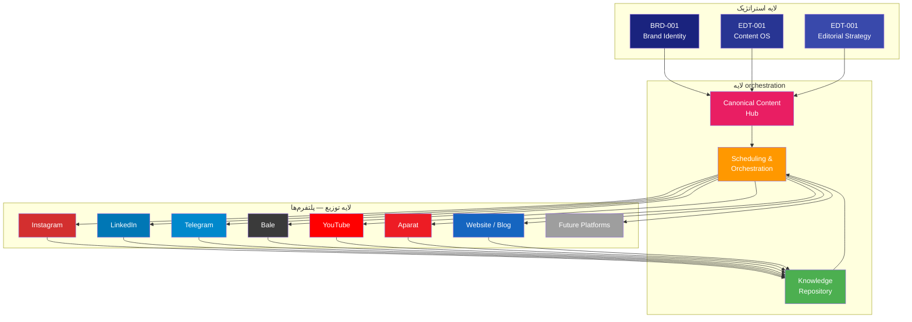
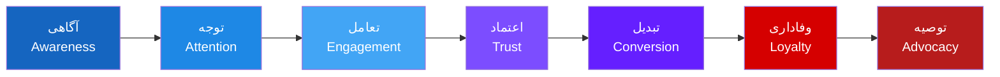
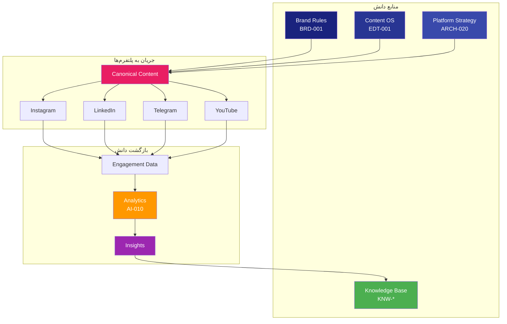
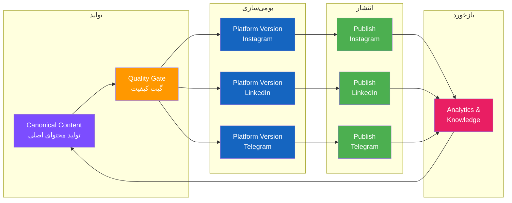
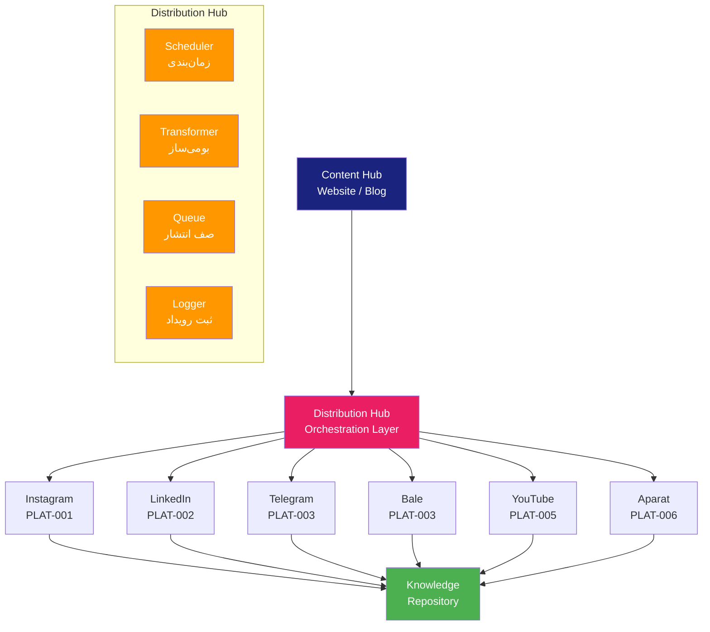
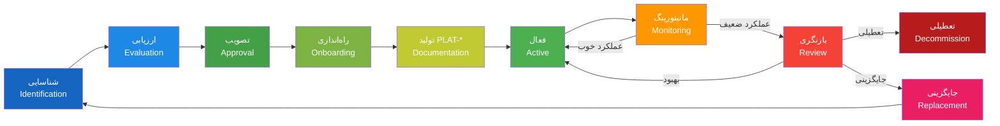

# Enterprise Multi-Platform Strategy — استراتژی چندپلتفرمی سازمانی

> **شناسه:** ARCH-020
> **وضعیت:** پیش‌نویس
> **نسخه:** 1.0.0-draft
> **به‌روزرسانی:** 2026-06-27
> **مسئول:** معمار سیستم
> **وابستگی:** [CON-000](../05-CONSTITUTION/00-constitution.md), [ARCH-001](./01-system-overview.md), [ARCH-010](./10-meta-architecture.md), [ARCH-011](./11-object-model.md), [BRD-001](../22-BRAND/10-brand-identity.md), [EDT-001](../24-EDITORIAL/10-content-guidelines.md)
> **مخاطب:** human, agent, n8n, mcp

---

## Architectural Dependencies

### Upstream Dependencies

| سند                                                 | نوع وابستگی | دلیل                                      |
| --------------------------------------------------- | ----------- | ----------------------------------------- |
| [CON-000](../05-CONSTITUTION/00-constitution.md)    | governs     | اصول یکپارچگی رسانه‌ای، حاکمیت برند       |
| [ARCH-001](./01-system-overview.md)                 | depends-on  | نمای کلی سیستم، مؤلفه پلتفرم              |
| [ARCH-010](./10-meta-architecture.md)               | depends-on  | لایه‌های سازمانی (Planning, Distribution) |
| [ARCH-011](./11-object-model.md)                    | depends-on  | اشیاء Platform, Account, Audience         |
| [ARCH-012](./12-knowledge-model.md)                 | depends-on  | جریان دانش بین پلتفرم‌ها                  |
| [ARCH-013](./13-ai-operating-model.md)              | depends-on  | Agentهای مرتبط با پلتفرم                  |
| [ARCH-030](./30-governance-architecture.md)         | depends-on  | حکمرانی پلتفرم، تصمیمات پلتفرمی           |
| [BRD-001](../22-BRAND/10-brand-identity.md)         | depends-on  | هویت برند در همه پلتفرم‌ها                |
| [EDT-001](../24-EDITORIAL/10-content-guidelines.md) | depends-on  | چرخه حیات محتوا، توزیع پلتفرمی            |

### Downstream Dependencies

| سند                                                          | نوع وابستگی  | دلیل                                                         |
| ------------------------------------------------------------ | ------------ | ------------------------------------------------------------ |
| [PLAT-000](../20-PLATFORMS/00-platform-playbook-standard.md) | derives      | PLAT-000 از ARCH-020 برای طبقه‌بندی پلتفرم‌ها استفاده می‌کند |
| [PLAT-\*](../20-PLATFORMS/)                                  | derived-from | هر PLAT-\* از ARCH-020 و PLAT-000 مشتق می‌شود                |
| [AUT-\*](../30-AUTOMATION/)                                  | implements   | گردش کارهای توزیع، انتشار، مانیتورینگ                        |
| [AI-\*](../40-AI-AGENTS/)                                    | implements   | Agentهای Publishing, Monitoring, Engagement                  |
| [MET-\*](../60-METRICS/)                                     | measures     | KPIهای هر پلتفرم                                             |
| [REP-\*](../55-REPORTS/)                                     | reports      | گزارش‌های عملکرد پلتفرم                                      |

### SSOT Ownership

| موضوع                             | SSOT                   |
| --------------------------------- | ---------------------- |
| Multi-Platform Strategy           | **ARCH-020** (این سند) |
| Platform Classification           | **ARCH-020** (این سند) |
| Platform Priority Matrix          | **ARCH-020** (این سند) |
| Cross-Platform Distribution Rules | **ARCH-020** (این سند) |
| Content-to-Platform Mapping       | **ARCH-020** (این سند) |
| Platform-specific Playbook        | PLAT-\* (هر پلتفرم)    |
| Platform Posting Schedule         | PLAT-\* (هر پلتفرم)    |
| Platform Algorithm Details        | PLAT-\* (هر پلتفرم)    |

### Related ADRs

| ADR     | عنوان                             | ارتباط                        |
| ------- | --------------------------------- | ----------------------------- |
| ADR-001 | CONSTITUTION به عنوان سند عالی    | مبنای یکپارچگی پلتفرم‌ها      |
| ADR-010 | معماری متا به عنوان الگوی عملیاتی | لایه Planning, Distribution   |
| ADR-011 | چرخه حیات محتوا ۱۵ مرحله الزامی   | مرحله Distribution در پلتفرم  |
| ADR-013 | جداسازی Automation و Agent        | توزیع پلتفرمی توسط Automation |
| ADR-019 | حکمرانی ۱۰ لایه                   | لایه Platform در حکمرانی      |

### Related Objects (from ARCH-011)

Platform (OBJ-010), Account (OBJ-019), Audience (OBJ-012), Persona (OBJ-011), Platform Version (OBJ-005), Content Variant (OBJ-006), Publication (OBJ-022), Metric (OBJ-017), Campaign (OBJ-001)

### Related AI Agents (from ARCH-013)

Orchestrator (000), Planning (002), Publishing (008), Monitoring (009), Analytics (010), Knowledge (011), Engagement (013), Scheduler (014)

---

## ۱. Executive Summary

این سند **معماری استراتژی چندپلتفرمی سازمانی SMOS** را تعریف می‌کند. پلتفرم‌های رسانه‌ای در SMOS نقاط پایانی (endpoints) هستند که محتوای سازمانی در آن‌ها ظاهر می‌شود، با مخاطبان تعامل می‌کند و دانش جدید تولید می‌کند.

هر پلتفرم یک کانال توزیع با ماهیت، مخاطب و نقش منحصربه‌فرد است. استراتژی چندپلتفرمی SMOS تضمین می‌کند که:

- هر پلتفرم نقش سازمانی مشخصی دارد — بدون هم‌پوشانی
- محتوا به صورت یکپارچه در همه پلتفرم‌ها جریان دارد
- هویت برند در همه جا یکسان است
- دانش تولیدشده در هر پلتفرم به کل سیستم بازمی‌گردد
- پلتفرم‌های جدید بدون بازطراحی معماری اضافه می‌شوند

این سند پل استراتژیک بین [BRD-001](../22-BRAND/10-brand-identity.md) (برند) و [EDT-001](../24-EDITORIAL/10-content-guidelines.md) (محتوا) از یک سو و [PLAT-\*](../20-PLATFORMS/) (کتابچه‌های پلتفرم) از سوی دیگر است.

---

## ۲. Purpose

### چرا استراتژی چندپلتفرمی وجود دارد؟

1. **یکپارچگی**: هر پلتفرم نقش مشخصی دارد — بدون سردرگمی استراتژیک
2. **کارایی**: منابع در پلتفرم‌هایی تخصیص می‌یابند که بیشترین بازده را دارند
3. **سازگاری برند**: مخاطب در همه پلتفرم‌ها یک برند واحد را تجربه می‌کند
4. **جریان دانش**: یادگیری از یک پلتفرم به پلتفرم دیگر منتقل می‌شود
5. **مقیاس‌پذیری**: پلتفرم‌های جدید با کمترین هزینه معماری اضافه می‌شوند
6. **چندعاملی**: انسان، Agent و Workflow همگی از یک چارچوب واحد پیروی می‌کنند

### اهداف کلان (طبق CON-000)

| هدف                       | ارتباط با پلتفرم                                         |
| ------------------------- | -------------------------------------------------------- |
| **۱.۱** سیستم پایدار      | پلتفرم‌ها بدون وابستگی به یکدیگر قابل مدیریت هستند       |
| **۱.۲** یکپارچگی رسانه‌ای | همه پلتفرم‌ها از یک هویت برند و چرخه محتوا پیروی می‌کنند |
| **۱.۳** دانش سازمانی      | دانش هر پلتفرم به کل سیستم بازمی‌گردد                    |
| **۱.۵** دهه‌ای            | پلتفرم‌های جدید بدون بازطراحی معماری اضافه می‌شوند       |

---

## ۳. Enterprise Media Philosophy

فلسفه رسانه‌ای سازمانی SMOS چارچوب فکری پشت تمام تصمیمات پلتفرمی است.

### اصول فلسفی

| اصل                          | توضیح                                                          |
| ---------------------------- | -------------------------------------------------------------- |
| **پلتفرم کانال است نه هویت** | هویت برند مستقل از پلتفرم است — برند در همه جا یکسان است       |
| **مخاطب محور است نه پلتفرم** | مخاطب در مرکز است، پلتفرم فقط وسیله ارتباط است                 |
| **هم‌افزایی به جای تکرار**   | پلتفرم‌ها مکمل یکدیگرند — محتوای تکراری در چند پلتفرم ممنوع    |
| **استقلال عملیاتی**          | هر پلتفرم مستقل از دیگران قابل مدیریت، بهینه‌سازی و تعطیلی است |
| **دانش‌بازگشت**              | هر پلتفرم دانش جدید تولید می‌کند که به کل سیستم بازمی‌گردد     |
| **سازگاری با آینده**         | پلتفرم‌های آینده باید بدون تغییر معماری قابل اضافه شدن باشند   |

### اصول استراتژیک

| اصل       | توضیح                                                                                       |
| --------- | ------------------------------------------------------------------------------------------- |
| **MP-01** | هر پلتفرم یک مأموریت سازمانی مشخص دارد                                                      |
| **MP-02** | هیچ دو پلتفرمی نقش یکسان ندارند                                                             |
| **MP-03** | اولویت‌بندی پلتفرم‌ها بر اساس بازده استراتژیک است، نه عادت یا روند                          |
| **MP-04** | محتوای اصلی (Canonical) در مخزن مرکزی تولید می‌شود — پلتفرم‌ها نسخه بومی‌شده دریافت می‌کنند |
| **MP-05** | تعامل در هر پلتفرم متناسب با ماهیت همان پلتفرم است                                          |
| **MP-06** | پلتفرم‌ها بر اساس شاخص‌های عینی ارزیابی می‌شوند — نه احساسی                                 |

---

## ۴. Media Ecosystem Architecture

اکوسیستم رسانه‌ای SMOS از سه لایه تشکیل شده است که پلتفرم‌ها در پایین‌ترین لایه (توزیع) قرار دارند.



### اجزای اکوسیستم

| مؤلفه                          | نقش                                | SSOT    |
| ------------------------------ | ---------------------------------- | ------- |
| **Brand Identity**             | هویت و قواعد برند در همه پلتفرم‌ها | BRD-001 |
| **Content OS**                 | چرخه حیات و کیفیت محتوا            | EDT-001 |
| **Editorial Strategy**         | استراتژی تحریریه و تقویم           | EDT-001 |
| **Canonical Content Hub**      | محتوای اصلی پیش از توزیع پلتفرمی   | CONT-\* |
| **Knowledge Repository**       | دانش استخراج‌شده از هر پلتفرم      | KNW-\*  |
| **Scheduling & Orchestration** | زمان‌بندی و orchestration توزیع    | AUT-\*  |
| **Platforms**                  | نقاط پایانی توزیع و تعامل          | PLAT-\* |

---

## ۵. Platform Classification Framework

چارچوب طبقه‌بندی پلتفرم‌ها در SMOS بر اساس چهار بُعد تعریف می‌شود:

| بُعد             | طیف                             | توضیح                               |
| ---------------- | ------------------------------- | ----------------------------------- |
| **مالکیت**       | Owned ↔ Third-Party             | پلتفرم تحت کنترل سازمان یا شخص ثالث |
| **ماهیت محتوا**  | Text ↔ Image ↔ Video ↔ Mixed    | نوع محتوای غالب در پلتفرم           |
| **ماهیت ارتباط** | Broadcast ↔ Community ↔ Network | یک‌طرفه، اجتماع محور یا شبکه‌ای     |
| **مخاطب**        | General ↔ Professional ↔ Niche  | عموم، حرفه‌ای یا تخصصی              |

### طبقه‌بندی پلتفرم‌های هدف

| پلتفرم           | مالکیت      | ماهیت محتوا                  | ماهیت ارتباط | مخاطب          |
| ---------------- | ----------- | ---------------------------- | ------------ | -------------- |
| Website / Blog   | Owned       | Mixed (Text + Image)         | Broadcast    | General        |
| Instagram        | Third-Party | Mixed (Image + Video)        | Network      | General        |
| LinkedIn         | Third-Party | Mixed (Text + Image)         | Network      | Professional   |
| Telegram         | Third-Party | Mixed (Text + Image + Video) | Community    | General        |
| Bale             | Third-Party | Mixed (Text + Image + Video) | Community    | General        |
| YouTube          | Third-Party | Video                        | Broadcast    | General        |
| Aparat           | Third-Party | Video                        | Broadcast    | General (Iran) |
| Future Platforms | Variable    | Variable                     | Variable     | Variable       |

---

## ۶. Platform Roles

هر پلتفرم در SMOS یک نقش سازمانی مشخص دارد. این نقش‌ها از بالاترین سطح استراتژیک تا پایین‌ترین سطح عملیاتی تعریف شده‌اند.

### نقش‌های استراتژیک

| نقش                    | توضیح                                       | پلتفرم‌ها          |
| ---------------------- | ------------------------------------------- | ------------------ |
| **Hub (مرکز)**         | مخزن اصلی محتوای سازمانی — SSOT برای انتشار | Website / Blog     |
| **Reach (دسترسی)**     | گسترده‌ترین دسترسی به مخاطب عام             | Instagram, YouTube |
| **Network (شبکه)**     | ارتباطات حرفه‌ای و B2B                      | LinkedIn           |
| **Community (اجتماع)** | تعامل مستقیم و گفتگو با مخاطب وفادار        | Telegram, Bale     |
| **Archive (بایگانی)**  | مخزن بلندمدت محتوای ویدئویی                 | YouTube, Aparat    |

### نقش‌های عملیاتی

| نقش                      | توضیح                         |
| ------------------------ | ----------------------------- |
| **Content Distribution** | توزیع محتوای تأییدشده         |
| **Audience Engagement**  | تعامل با مخاطبان              |
| **Brand Presence**       | حضور و دیده‌شدن برند          |
| **Lead Generation**      | تولید سرنخ و تبدیل            |
| **Market Intelligence**  | جمع‌آوری داده و تحلیل بازار   |
| **Knowledge Collection** | استخراج دانش از بازخورد مخاطب |

---

## ۷. Audience Journey Architecture

معماری سفر مخاطب در SMOS یک مسیر چندمرحله‌ای است که مخاطب را از آگاهی تا وفاداری هدایت می‌کند.



### نقش پلتفرم‌ها در سفر مخاطب

| مرحله          | هدف              | پلتفرم اصلی        | پلتفرم کمکی         |
| -------------- | ---------------- | ------------------ | ------------------- |
| **Awareness**  | دیده‌شدن اولیه   | Instagram, YouTube | LinkedIn            |
| **Attention**  | جلب توجه عمیق‌تر | YouTube, Aparat    | Instagram           |
| **Engagement** | تعامل و گفتگو    | Telegram, Bale     | Instagram, LinkedIn |
| **Trust**      | ایجاد اعتماد     | Website / Blog     | LinkedIn            |
| **Conversion** | تبدیل به اقدام   | Website / Blog     | Telegram            |
| **Loyalty**    | وفاداری بلندمدت  | Telegram, Bale     | Website / Blog      |
| **Advocacy**   | توصیه دیگران     | Telegram           | Instagram           |

### اصول سفر مخاطب

| اصل       | توضیح                                                 |
| --------- | ----------------------------------------------------- |
| **AJ-01** | مخاطب در هر مرحله از سفر در پلتفرم مناسب هدایت می‌شود |
| **AJ-02** | هر پلتفرم وظیفه مشخصی در سفر مخاطب دارد               |
| **AJ-03** | انتقال مخاطب بین پلتفرم‌ها طبیعی و بدون اصطکاک است    |
| **AJ-04** | سفر مخاطب برای هر persona می‌تواند متفاوت باشد        |
| **AJ-05** | موفقیت در هر مرحله با KPI مشخص اندازه‌گیری می‌شود     |

---

## ۸. Knowledge Flow Across Platforms

دانش در SMOS یک چرخه بسته بین پلتفرم‌ها و مخازن دانش دارد. هر پلتفرم نه تنها محتوا دریافت می‌کند، بلکه دانش جدید به سیستم بازمی‌گرداند.



### انواع دانش برگشتی از پلتفرم‌ها

| نوع دانش             | منبع                | مقصد           | کاربرد                      |
| -------------------- | ------------------- | -------------- | --------------------------- |
| Engagement Pattern   | همه پلتفرم‌ها       | KNW-\*         | بهینه‌سازی زمان و نوع محتوا |
| Audience Insight     | Telegram, Bale      | KNW-\*         | شناخت بهتر مخاطب            |
| Content Performance  | Instagram, LinkedIn | MET-_, KNW-_   | بهبود کیفیت محتوا           |
| Trend Signal         | همه پلتفرم‌ها       | KNW-\*, AI-001 | شناسایی روندهای جدید        |
| Competitive Intel    | LinkedIn, Website   | KNW-\*         | تحلیل رقابتی                |
| Feedback & Sentiment | Telegram, Bale      | KNW-\*, AI-013 | بهبود محصول و خدمات         |

---

## ۹. Canonical Publishing Strategy

استراتژی انتشار متعارف (Canonical) در SMOS تضمین می‌کند که یک محتوای اصلی در مخزن مرکزی تولید می‌شود و نسخه‌های بومی‌شده برای هر پلتفرم از آن مشتق می‌شوند.

### اصول انتشار متعارف

| اصل       | توضیح                                                                           |
| --------- | ------------------------------------------------------------------------------- |
| **CP-01** | هر محتوا یک نسخه متعارف (Canonical) دارد که در Hub ذخیره می‌شود                 |
| **CP-02** | نسخه متعارف مستقل از پلتفرم است — بدون بومی‌سازی                                |
| **CP-03** | هر پلتفرم یک Platform Version از محتوای متعارف دریافت می‌کند                    |
| **CP-04** | Platform Version نسخه متعارف را بومی‌سازی می‌کند — محتوای اصلی را تغییر نمی‌دهد |
| **CP-05** | انتشار در پلتفرم‌ها به ترتیب اولویت انجام می‌شود                                |
| **CP-06** | تأیید انسانی برای انتشار در هر پلتفرم الزامی است (طبق ADR-015)                  |

### فرایند انتشار متعارف



---

## ۱۰. Cross-Platform Distribution Strategy

استراتژی توزیع بین‌پلتفرمی SMOS تعیین می‌کند که محتوا چگونه، در چه ترتیبی و با چه فاصله زمانی در پلتفرم‌ها توزیع می‌شود.

### اصول توزیع

| اصل       | توضیح                                                            |
| --------- | ---------------------------------------------------------------- |
| **CD-01** | محتوای متعارف ابتدا در Hub (Website/Blog) منتشر می‌شود           |
| **CD-02** | سپس نسخه‌های بومی‌شده در پلتفرم‌های اولویت P1 توزیع می‌شوند      |
| **CD-03** | فاصله انتشار بین پلتفرم‌ها بر اساس ماهیت هر پلتفرم تعیین می‌شود  |
| **CD-04** | توزیع همزمان در پلتفرم‌های رقیب (هم‌خانواده) ممنوع است           |
| **CD-05** | محتوای وابسته به زمان (time-sensitive) می‌تواند همزمان توزیع شود |

### ترتیب توزیع پیش‌فرض

| مرحله | پلتفرم           | تأخیر از مرحله قبل        |
| ----- | ---------------- | ------------------------- |
| ۱     | Website / Blog   | ۰ (Hub)                   |
| ۲     | LinkedIn         | +۲ ساعت                   |
| ۳     | Instagram        | +۴ ساعت                   |
| ۴     | Telegram         | +۶ ساعت                   |
| ۵     | Bale             | +۱ ساعت از Telegram       |
| ۶     | YouTube / Aparat | +۲۴ ساعت (محتوای ویدئویی) |

### انواع توزیع

| نوع                         | توضیح                     | کاربرد                          |
| --------------------------- | ------------------------- | ------------------------------- |
| **Full Distribution**       | توزیع در همه پلتفرم‌ها    | محتوای استراتژیک، کمپین اصلی    |
| **Selective Distribution**  | توزیع در پلتفرم‌های منتخب | محتوای تخصصی، محتوای پلتفرم‌خاص |
| **Exclusive Distribution**  | توزیع در یک پلتفرم        | محتوای انحصاری، تعامل خاص       |
| **Syndicated Distribution** | توزیع با تأخیر زمانی      | محتوای همیشه‌سبز                |

---

## ۱۱. Cross-Posting Rules

قواعد انتشار متقابل (Cross-Posting) در SMOS از تکرار محتوای یکسان در چند پلتفرم و سردرگمی مخاطب جلوگیری می‌کند.

### قواعد عمومی

| قاعده     | توضیح                                                                         |
| --------- | ----------------------------------------------------------------------------- |
| **XP-01** | محتوای یکسان در بیش از یک پلتفرم ممنوع — هر پلتفرم نسخه بومی‌شده خود را دارد  |
| **XP-02** | محتوای هم‌خانواده (مثلاً تلگرام و بله) باید محتوای متفاوت یا مکمل داشته باشند |
| **XP-03** | لینک به محتوای Hub در همه پلتفرم‌ها مجاز است                                  |
| **XP-04** | محتوای فوری (urgent) می‌تواند همزمان در همه پلتفرم‌ها منتشر شود               |
| **XP-05** | Cross-posting خودکار فقط برای محتوای تأییدشده مجاز است                        |
| **XP-06** | هر پلتفرم Caption و Call-to-Action مخصوص خود را دارد                          |

### ماتریس Cross-Posting

| محتوای اصلی            | Instagram    | LinkedIn  | Telegram      | Bale          | YouTube | Aparat |
| ---------------------- | ------------ | --------- | ------------- | ------------- | ------- | ------ |
| **Blog Post**          | خلاصه تصویری | نسخه کامل | چکیده + لینک  | چکیده + لینک  | —       | —      |
| **Instagram Post**     | —            | —         | Repost + لینک | Repost + لینک | —       | —      |
| **LinkedIn Article**   | خلاصه        | —         | چکیده + لینک  | چکیده + لینک  | —       | —      |
| **Video (YouTube)**    | Preview      | —         | Announce      | Announce      | —       | همزمان |
| **Video (Short)**      | Reels        | —         | ارسال مستقیم  | ارسال مستقیم  | Shorts  | —      |
| **Telegram Exclusive** | —            | —         | —             | محتوای متفاوت | —       | —      |

---

## ۱۲. Platform Priority Matrix

ماتریس اولویت‌بندی پلتفرم‌ها، تخصیص منابع و توجه را بر اساس بازده استراتژیک تعیین می‌کند.

### اولویت‌بندی استراتژیک

| اولویت                | پلتفرم                        | دلیل استراتژیک                | تخصیص منابع |
| --------------------- | ----------------------------- | ----------------------------- | ----------- |
| **P0 — Hub**          | Website / Blog                | SSOT انتشار، مالکیت کامل،SEO  | ۲۵٪         |
| **P1 — Primary**      | Instagram, LinkedIn, Telegram | بیشترین دسترسی، تعامل و بازده | ۴۵٪         |
| **P2 — Secondary**    | Bale, YouTube, Aparat         | پوشش مکمل، بایگانی ویدئو      | ۲۰٪         |
| **P3 — Experimental** | Future Platforms              | آزمایش، یادگیری، رشد آینده    | ۱۰٪         |

### ماتریس اولویت

| معیار                  | Website | Instagram | LinkedIn | Telegram | Bale    | YouTube  | Aparat        |
| ---------------------- | ------- | --------- | -------- | -------- | ------- | -------- | ------------- |
| **Reach Potential**    | متوسط   | بالا      | متوسط    | بالا     | متوسط   | بالا     | بالا (ایران)  |
| **Engagement Rate**    | پایین   | متوسط     | پایین    | بالا     | بالا    | پایین    | پایین         |
| **Ownership**          | کامل    | محدود     | محدود    | محدود    | محدود   | محدود    | محدود         |
| **Brand Control**      | کامل    | متوسط     | متوسط    | متوسط    | متوسط   | بالا     | بالا          |
| **Lead Generation**    | بالا    | متوسط     | بالا     | متوسط    | متوسط   | کم       | کم            |
| **Knowledge Return**   | بالا    | متوسط     | بالا     | بالا     | بالا    | کم       | کم            |
| **Iran Accessibility** | کامل    | نیاز VPN  | نیاز VPN | کامل     | کامل    | نیاز VPN | کامل          |
| **Strategic Value**    | پایه    | گسترش     | تخصص     | تعامل    | جایگزین | بایگانی  | بایگانی ایران |

---

## ۱۳. Content-to-Platform Mapping

نگاشت محتوا به پلتفرم تعیین می‌کند که هر نوع محتوای SMOS در کدام پلتفرم‌ها توزیع می‌شود.

### انواع محتوا (از EDT-001)

| نوع محتوا         | توضیح                | پلتفرم‌های هدف                | اولویت |
| ----------------- | -------------------- | ----------------------------- | ------ |
| **مقاله تحلیلی**  | تحلیل عمیق موضوع     | Website (Hub), LinkedIn       | P1     |
| **خبر صنعت**      | رویدادها و اخبار     | Instagram, Telegram, LinkedIn | P1     |
| **محتوای آموزشی** | آموزش و راهنما       | Website, YouTube, Instagram   | P1     |
| **محتوای کوتاه**  | نکته، نقل قول، آمار  | Instagram, Telegram, Bale     | P1     |
| **ویدئوی بلند**   | مستند، مصاحبه، آموزش | YouTube, Aparat               | P2     |
| **ویدئوی کوتاه**  | Reels, Shorts        | Instagram, YouTube, Aparat    | P2     |
| **اینفوگرافیک**   | داده بصری            | Instagram, LinkedIn           | P2     |
| **پادکست**        | محتوای صوتی          | Website, Telegram             | P2     |
| **خبرنامه**       | محتوای دوره‌ای       | Website (Email), Telegram     | P2     |
| **محتوای تعاملی** | نظرسنجی، سؤال        | Telegram, Bale, Instagram     | P2     |

### ماتریس تناسب محتوا-پلتفرم

| بُعد محتوا          | Website | Instagram | LinkedIn | Telegram | Bale  | YouTube | Aparat |
| ------------------- | ------- | --------- | -------- | -------- | ----- | ------- | ------ |
| **عمق تحلیلی**      | عالی    | کم        | عالی     | متوسط    | متوسط | خوب     | خوب    |
| **سرعت انتشار**     | متوسط   | عالی      | خوب      | فوری     | فوری  | کم      | کم     |
| **تعامل با مخاطب**  | کم      | خوب       | کم       | عالی     | عالی  | کم      | کم     |
| **اشتراک‌گذاری**    | کم      | عالی      | متوسط    | عالی     | عالی  | خوب     | متوسط  |
| **ماندگاری محتوا**  | عالی    | کم        | خوب      | متوسط    | متوسط | عالی    | عالی   |
| **SEO / Discovery** | عالی    | خوب       | عالی     | متوسط    | کم    | عالی    | خوب    |

---

## ۱۴. Platform Capability Matrix

ماتریس قابلیت‌های پلتفرم، توانمندی‌های فنی و ارتباطی هر پلتفرم را برای برنامه‌ریزی محتوا مشخص می‌کند.

| قابلیت                  | Website | Instagram   | LinkedIn | Telegram | Bale    | YouTube    | Aparat   |
| ----------------------- | ------- | ----------- | -------- | -------- | ------- | ---------- | -------- |
| **متن بلند**            | ✓       | ✗           | ✓        | ✓        | ✓       | ✗          | ✗        |
| **متن کوتاه**           | ✓       | ✓           | ✓        | ✓        | ✓       | ✗          | ✗        |
| **تصویر**               | ✓       | ✓           | ✓        | ✓        | ✓       | ✓          | ✓        |
| **ویدئوی کوتاه (<۶۰s)** | ✓       | ✓ (Reels)   | ✓        | ✓        | ✓       | ✓ (Shorts) | ✓        |
| **ویدئوی بلند**         | ✓       | ✗           | ✗        | ✗        | ✗       | ✓          | ✓        |
| **اینفوگرافیک**         | ✓       | ✓           | ✓        | ✓        | ✓       | ✗          | ✗        |
| **صدا / پادکست**        | ✓       | ✗           | ✗        | ✓        | ✓       | ✗          | ✗        |
| **لایو / استریم**       | ✗       | ✓           | ✓        | ✗        | ✗       | ✓          | ✓        |
| **نظرسنجی**             | محدود   | ✓ (Stories) | ✓        | ✓        | ✓       | ✗          | ✗        |
| **لینک در پست**         | ✓       | ✗ (Bio)     | ✓        | ✓        | ✓       | ✓          | ✓        |
| **SEO**                 | ✓       | محدود       | ✓        | محدود    | ✗       | ✓          | ✓        |
| **API دسترسی**          | کامل    | Graph API   | REST API | Bot API  | Bot API | Data API   | REST API |
| **اتوماسیون**           | کامل    | محدود       | محدود    | کامل     | کامل    | محدود      | محدود    |
| **تحلیل داده**          | کامل    | محدود       | محدود    | محدود    | محدود   | کامل       | محدود    |
| **مخاطب ایران**         | کامل    | VPN         | VPN      | کامل     | کامل    | VPN        | کامل     |

---

## ۱۵. Content Hub Architecture

معماری هاب محتوا (Content Hub) — Website / Blog — به عنوان مخزن مرکزی و SSOT انتشار تمام محتوای سازمانی.

### نقش هاب

| نقش                 | توضیح                                                |
| ------------------- | ---------------------------------------------------- |
| **SSOT انتشار**     | اولین و کامل‌ترین نسخه هر محتوا در هاب منتشر می‌شود  |
| **مرجع لینک**       | همه پلتفرم‌ها به محتوای هاب لینک می‌دهند             |
| **بایگانی بلندمدت** | همه محتواها بدون محدودیت پلتفرم در هاب ذخیره می‌شوند |
| **SEO Hub**         | موتورهای جستجو محتوای هاب را ایندکس می‌کنند          |
| **Hub Conversion**  | مخاطبان از همه پلتفرم‌ها به هاب هدایت می‌شوند        |

### اصول معماری هاب

| اصل        | توضیح                                                           |
| ---------- | --------------------------------------------------------------- |
| **HUB-01** | هاب مالکیت کامل سازمانی دارد — وابسته به پلتفرم سوم نیست        |
| **HUB-02** | هر محتوای سازمانی یک صفحه در هاب دارد                           |
| **HUB-03** | هاب قابل جستجو، دسته‌بندی و برچسب‌گذاری است                     |
| **HUB-04** | هاب از همه انواع محتوا (متن، تصویر، ویدئو، صدا) پشتیبانی می‌کند |
| **HUB-05** | هاب خروجی API برای توزیع خودکار به پلتفرم‌ها فراهم می‌کند       |
| **HUB-06** | هاب با تمامی پلتفرم‌های SMOS یکپارچه است                        |

---

## ۱۶. Distribution Hub Architecture

معماری هاب توزیع، لایه orchestration است که توزیع محتوا از هاب به پلتفرم‌ها را مدیریت می‌کند.



### اجزای هاب توزیع

| مؤلفه           | وظیفه                                   | SSOT         |
| --------------- | --------------------------------------- | ------------ |
| **Scheduler**   | زمان‌بندی انتشار بر اساس اولویت و فاصله | AUT-\*       |
| **Transformer** | بومی‌سازی محتوا برای هر پلتفرم          | PRM-_, AI-_  |
| **Queue**       | مدیریت صف انتشار و retry                | AUT-\*       |
| **Logger**      | ثبت تمام رویدادهای توزیع                | AUT-_, KNW-_ |

---

## ۱۷. Engagement Architecture

معماری تعامل، نحوه و چارچوب تعامل با مخاطبان در هر پلتفرم را تعریف می‌کند.

### اصول تعامل

| اصل       | توضیح                                                                                |
| --------- | ------------------------------------------------------------------------------------ |
| **EG-01** | تعامل با مخاطب در هر پلتفرم متناسب با ماهیت همان پلتفرم است                          |
| **EG-02** | پاسخ به مخاطبان در اولویت است — حداکثر زمان پاسخ ۲۴ ساعت                             |
| **EG-03** | صدای برند در همه تعاملات یکسان است (طبق BRD-001)                                     |
| **EG-04** | تعاملات توسط AI Agent (Engagement, AI-013) انجام می‌شود — تأیید انسانی در موارد حساس |
| **EG-05** | تمام تعاملات ثبت و برای استخراج دانش تحلیل می‌شوند                                   |

### انواع تعامل

| نوع تعامل                 | پلتفرم‌ها                    | مسئول                 | سطح اختیار              |
| ------------------------- | ---------------------------- | --------------------- | ----------------------- |
| **پاسخ به کامنت عمومی**   | Instagram, LinkedIn, YouTube | AI-013 (Engagement)   | A-2                     |
| **پاسخ به پیام خصوصی**    | Telegram, Bale, Instagram DM | AI-013 + Human        | A-2 (AI) / Human review |
| **مدیریت نظرسنجی**        | Telegram, Bale, Instagram    | AI-013                | A-2                     |
| **تعامل بحرانی**          | همه                          | Human only            | Human only              |
| **کامنت‌گذاری در دیگران** | Instagram, LinkedIn          | AI-013 + Human review | A-1 (AI proposes)       |

---

## ۱۸. Community Architecture

معماری اجتماع، چارچوب مدیریت و رشد جوامع مخاطبان در پلتفرم‌های اجتماع‌محور را تعریف می‌کند.

### انواع اجتماع

| نوع اجتماع  | پلتفرم                | هدف                                 | استراتژی                  |
| ----------- | --------------------- | ----------------------------------- | ------------------------- |
| **عمومی**   | Telegram              | اطلاع‌رسانی و تعامل گسترده          | محتوای منظم، نظرسنجی، Q&A |
| **اختصاصی** | Telegram (Supergroup) | تعامل عمیق با مخاطبان وفادار        | گفتگو، بازخورد، هم‌آفرینی |
| **جایگزین** | Bale                  | پشتیبان Telegram برای مخاطبان ایران | محتوای مشابه با بومی‌سازی |
| **حرفه‌ای** | LinkedIn              | شبکه متخصصان و همکاران              | مقالات حرفه‌ای، بحث تخصصی |

### اصول اجتماع

| اصل       | توضیح                                                   |
| --------- | ------------------------------------------------------- |
| **CM-01** | هر اجتماع یک هدف مشخص دارد — اجتماع بدون هدف ممنوع      |
| **CM-02** | اجتماع‌ها توسط AI و انسان مدیریت می‌شوند                |
| **CM-03** | قواعد رفتار در هر اجتماع شفاف است                       |
| **CM-04** | بازخورد اجتماع به طور منظم استخراج و تحلیل می‌شود       |
| **CM-05** | اجتماع‌های غیرفعال پس از ۳ ماه بدون تعامل، بسته می‌شوند |

---

## ۱۹. Conversion Architecture

معماری تبدیل، چارچوب هدایت مخاطبان از آگاهی به اقدام را در سراسر پلتفرم‌ها تعریف می‌کند.

### اهداف تبدیل

| هدف تبدیل                | پلتفرم اصلی                 | معیار              |
| ------------------------ | --------------------------- | ------------------ |
| **Visit Website**        | همه پلتفرم‌ها → Website     | Click-through Rate |
| **Subscribe Newsletter** | Website, Telegram           | اشتراک جدید        |
| **Contact / Inquiry**    | Website, LinkedIn, Telegram | فرم تماس           |
| **Purchase / Service**   | Website                     | تبدیل نهایی        |
| **Download Resource**    | Website, Telegram           | دانلود             |
| **Follow / Join**        | همه پلتفرم‌ها               | Followers, Members |

### قواعد تبدیل

| قاعده     | توضیح                                          |
| --------- | ---------------------------------------------- |
| **CV-01** | هر محتوا یک Call-to-Action مشخص دارد           |
| **CV-02** | CTA متناسب با مرحله مخاطب در سفر انتخاب می‌شود |
| **CV-03** | همه مسیرهای تبدیل به هاب (Website) ختم می‌شوند |
| **CV-04** | تبدیل‌ها ردیابی و اندازه‌گیری می‌شوند          |
| **CV-05** | CTA در پلتفرم‌های مختلف می‌تواند متفاوت باشد   |

---

## ۲۰. Analytics Architecture

معماری تحلیل، چارچوب جمع‌آوری، پردازش و گزارش‌دهی داده‌های عملکرد پلتفرم را تعریف می‌کند.

### اصول تحلیل

| اصل       | توضیح                                                        |
| --------- | ------------------------------------------------------------ |
| **AN-01** | داده‌های همه پلتفرم‌ها در یک سیستم مرکزی جمع‌آوری می‌شود     |
| **AN-02** | هر پلتفرم KPIهای اختصاصی خود را دارد                         |
| **AN-03** | داده‌ها برای انسان و Agent قابل دسترسی هستند                 |
| **AN-04** | تحلیل‌ها به صورت خودکار توسط AI-010 (Analytics) انجام می‌شود |
| **AN-05** | خروجی تحلیل به مخازن دانش بازمی‌گردد                         |

### سلسله‌مراتب تحلیل

| سطح           | توضیح                   | فرکانس | مسئول                  |
| ------------- | ----------------------- | ------ | ---------------------- |
| **Real-time** | مانیتورینگ لحظه‌ای      | پیوسته | AI-009 (Monitoring)    |
| **Daily**     | عملکرد روزانه پلتفرم‌ها | روزانه | AI-010 (Analytics)     |
| **Weekly**    | روندها و الگوهای هفتگی  | هفتگی  | AI-010 + Human         |
| **Monthly**   | گزارش جامع ماهانه       | ماهانه | Human + AI-010         |
| **Quarterly** | تحلیل استراتژیک فصلی    | فصلی   | Human (Media Director) |

---

## ۲۱. Enterprise KPI Framework

چارچوب KPI سازمانی برای اندازه‌گیری عملکرد هر پلتفرم در چارچوب اهداف SMOS.

### ابعاد KPI

| بُعد           | KPI نمونه                          | پلتفرم‌ها                   |
| -------------- | ---------------------------------- | --------------------------- |
| **Reach**      | Impressions, Followers, Views      | همه                         |
| **Engagement** | Likes, Comments, Shares, Saves     | همه                         |
| **Conversion** | Clicks, Leads, Subscriptions       | Website, LinkedIn, Telegram |
| **Retention**  | Return Rate, Churn                 | Telegram, Bale, Website     |
| **Quality**    | Content Score, Brand Consistency   | همه (داخلی)                 |
| **Knowledge**  | Insights Extracted, Feedback Loops | همه                         |

### KPIهای کلیدی هر پلتفرم

| پلتفرم        | KPI اصلی                 | KPI ثانویه                   | KPI کیفیت                    |
| ------------- | ------------------------ | ---------------------------- | ---------------------------- |
| **Website**   | Page Views, Time on Page | Bounce Rate, Conversion Rate | Content Freshness, SEO Score |
| **Instagram** | Engagement Rate          | Reach, Follower Growth       | Brand Consistency Score      |
| **LinkedIn**  | Engagement Rate          | Connections, Article Views   | Professional Relevance       |
| **Telegram**  | Active Members           | Message Views, Forward Rate  | Response Time                |
| **Bale**      | Active Members           | Message Views                | Channel Growth               |
| **YouTube**   | Watch Time               | Views, Subscribers           | Video Retention Rate         |
| **Aparat**    | Views                    | Watch Time                   | Iran-specific Reach          |

---

## ۲۲. Platform Governance

حکمرانی پلتفرم‌ها چارچوب تصمیم‌گیری، مالکیت و مسئولیت‌های مرتبط با هر پلتفرم را تعریف می‌کند.

### اصول حکمرانی

| اصل       | توضیح                                                      |
| --------- | ---------------------------------------------------------- |
| **PG-01** | هر پلتفرم یک مالک مشخص دارد                                |
| **PG-02** | تصمیمات پلتفرمی در چارچوب ARCH-020 و PLAT-\* گرفته می‌شوند |
| **PG-03** | تغییر استراتژی پلتفرم نیازمند تأیید معمار سیستم است        |
| **PG-04** | اضافه شدن پلتفرم جدید نیازمند ADR است                      |
| **PG-05** | تعطیلی پلتفرم نیازمند مصوبه مدیر رسانه است                 |

### مالکیت پلتفرم‌ها (RACI)

| نقش            | Website          | Instagram        | LinkedIn         | Telegram         | Bale             | YouTube          | Aparat           |
| -------------- | ---------------- | ---------------- | ---------------- | ---------------- | ---------------- | ---------------- | ---------------- |
| **Owner**      | Media Director   | Media Director   | Media Director   | Media Director   | Media Director   | Media Director   | Media Director   |
| **Custodian**  | Platform Manager | Platform Manager | Platform Manager | Platform Manager | Platform Manager | Platform Manager | Platform Manager |
| **Maintainer** | Automation Eng.  | Automation Eng.  | Automation Eng.  | Automation Eng.  | Automation Eng.  | Automation Eng.  | Automation Eng.  |
| **Reviewer**   | Content Manager  | Content Manager  | Content Manager  | Content Manager  | Content Manager  | Content Manager  | Content Manager  |
| **Approver**   | System Architect | System Architect | System Architect | System Architect | System Architect | System Architect | System Architect |
| **Consumer**   | All agents       | All agents       | All agents       | All agents       | All agents       | All agents       | All agents       |

### انواع تصمیمات پلتفرمی

| نوع تصمیم              | سطح تأیید    | مسئول                             |
| ---------------------- | ------------ | --------------------------------- |
| افزودن پلتفرم جدید     | L4 (گروهی)   | Media Director + System Architect |
| تغییر اولویت پلتفرم    | L3 (دو نفره) | Media Director + System Architect |
| تعطیلی پلتفرم          | L4 (گروهی)   | Media Director + Board            |
| تغییر استراتژی پلتفرم  | L3 (دو نفره) | System Architect                  |
| تغییرات عملیاتی پلتفرم | L2 (تک‌نفره) | Platform Manager                  |

---

## ۲۳. Platform Lifecycle

چرخه حیات پلتفرم در SMOS از شناسایی تا تعطیلی یا جایگزینی را پوشش می‌دهد.



### مراحل چرخه حیات

| مرحله              | ورودی                      | خروجی             | مسئول               |
| ------------------ | -------------------------- | ----------------- | ------------------- |
| **Identification** | فرصت بازار، درخواست سازمان | گزارش فرصت        | Platform Manager    |
| **Evaluation**     | گزارش فرصت                 | تحلیل هزینه-فایده | System Architect    |
| **Approval**       | تحلیل + ADR                | ADR مصوب          | Media Director      |
| **Onboarding**     | ADR مصوب                   | حساب فعال         | Automation Engineer |
| **Documentation**  | حساب فعال                  | PLAT-\*           | Platform Manager    |
| **Active**         | PLAT-\*                    | عملیات روزانه     | Platform Manager    |
| **Monitoring**     | داده عملکرد                | گزارش ماهانه      | Analytics Agent     |
| **Review**         | گزارش بازه‌ای              | تصمیم ادامه/تعطیل | Media Director      |
| **Decommission**   | تصمیم تعطیل                | بایگانی           | Automation Engineer |
| **Replacement**    | پلتفرم جدید                | چرخه جدید         | System Architect    |

---

## ۲۴. Future Platform Integration

معماری یکپارچه‌سازی پلتفرم‌های آینده تضمین می‌کند که SMOS بدون بازطراحی می‌تواند پلتفرم‌های جدید را جذب کند.

### اصول یکپارچه‌سازی آینده

| اصل       | توضیح                                                                |
| --------- | -------------------------------------------------------------------- |
| **FP-01** | هر پلتفرم جدید از چارچوب طبقه‌بندی ARCH-020 پیروی می‌کند             |
| **FP-02** | پلتفرم جدید نیازمند PLAT-\* جدید است — بدون تغییر معماری             |
| **FP-03** | پلتفرم جدید در ماتریس اولویت در سطح P3 (Experimental) شروع می‌کند    |
| **FP-04** | پلتفرم جدید باید حداقل یک نقش منحصربه‌فرد داشته باشد                 |
| **FP-05** | یکپارچه‌سازی با API پلتفرم جدید از طریق لایه Automation انجام می‌شود |

### فرایند یکپارچه‌سازی پلتفرم جدید

| مرحله | اقدام                       | خروجی                   |
| ----- | --------------------------- | ----------------------- |
| ۱     | شناسایی و طبقه‌بندی پلتفرم  | Platform Classification |
| ۲     | تحلیل نقش و ارزش استراتژیک  | Opportunity Report      |
| ۳     | تصویب با ADR                | ADR                     |
| ۴     | ایجاد PLAT-\*               | PLAT-NNN                |
| ۵     | پیاده‌سازی یکپارچه‌سازی API | AUT-\*                  |
| ۶     | راه‌اندازی و آزمایش         | Active Platform         |
| ۷     | ارزیابی پس از ۳ ماه         | Review Report           |

---

## ۲۵. Risks & Constraints

### ریسک‌های استراتژیک

| ریسک                      | احتمال | تأثیر | کاهش                                             |
| ------------------------- | ------ | ----- | ------------------------------------------------ |
| **وابستگی به پلتفرم سوم** | بالا   | بالا  | هاب مالکیتی (Website)، چندپلتفرمی                |
| **تغییر الگوریتم پلتفرم** | بالا   | متوسط | استراتژی محتوا-محور، نه الگوریتم-محور            |
| **تحریم/فیلتر پلتفرم**    | متوسط  | بالا  | پلتفرم‌های داخلی (Bale, Aparat) به عنوان پشتیبان |
| **تغییر خط‌مشی API**      | متوسط  | بالا  | معماری لایه‌ای، جداسازی یکپارچه‌سازی             |
| **خستگی مخاطب**           | متوسط  | متوسط | تنوع محتوا، بومی‌سازی پلتفرمی                    |
| **تعارض بین پلتفرم‌ها**   | کم     | متوسط | قواعد Cross-Posting, نقش‌های مجزا                |

### محدودیت‌ها

| محدودیت                  | توضیح                                                  |
| ------------------------ | ------------------------------------------------------ |
| **منابع انسانی**         | تیم محدود — اتوماسیون حداکثری ضروری است                |
| **منابع مالی**           | تبلیغات پولی محدود — تمرکز بر organic                  |
| **محدودیت پلتفرم ایران** | اینستاگرام، یوتیوب نیاز VPN — پلتفرم‌های داخلی جایگزین |
| **سرعت اینترنت**         | ویدئوی بلند برای مخاطب ایران محدودیت دارد              |
| **زمان**                 | تیم چندوظیفه‌ای — بهینه‌سازی فرایند ضروری است          |

---

## ۲۶. Reading Guide

### راهنمای خواندن این سند

| مخاطب               | بخش‌های کلیدی           | اقدام                       |
| ------------------- | ----------------------- | --------------------------- |
| **مدیر رسانه**      | ۱, ۲, ۳, ۱۲, ۲۱, ۲۲     | تصویب استراتژی، تخصیص منابع |
| **معمار سیستم**     | ۴, ۵, ۶, ۱۵, ۱۶, ۲۳, ۲۴ | طراحی و نگهداری معماری      |
| **مدیر محتوا**      | ۹, ۱۰, ۱۱, ۱۳, ۱۷       | برنامه‌ریزی و توزیع محتوا   |
| **مدیر پلتفرم**     | ۷, ۸, ۱۴, ۱۸, ۱۹        | مدیریت روزانه پلتفرم        |
| **AI Agents**       | ۴, ۸, ۱۶, ۱۷, ۲۰        | اجرای فرایندهای خودکار      |
| **مهندس اتوماسیون** | ۱۶, ۲۰, ۲۲              | پیاده‌سازی خطوط لوله        |

### مسیر خواندن وابسته

```
برای درک کامل استراتژی چندپلتفرمی:
1. [CON-000](../05-CONSTITUTION/00-constitution.md) — اصول یکپارچگی رسانه‌ای
2. [BRD-001](../22-BRAND/10-brand-identity.md) — هویت برند
3. [EDT-001](../24-EDITORIAL/10-content-guidelines.md) — سیستم محتوا
4. ARCH-020 (این سند) — استراتژی پلتفرم
5. [PLAT-*](../20-PLATFORMS/) — کتابچه هر پلتفرم
```

---

## تغییرات

| نسخه        | تاریخ      | تغییر        | توسط        |
| ----------- | ---------- | ------------ | ----------- |
| ۱.۰.۰-draft | 2026-06-27 | انتشار اولیه | معمار سیستم |
