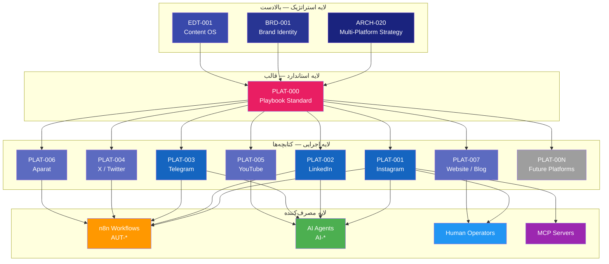
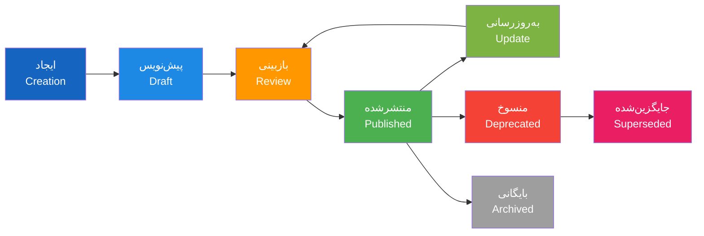
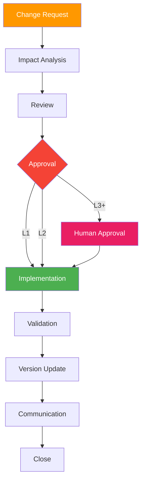

# Enterprise Platform Playbook Standard — استاندارد کتابچه پلتفرم سازمانی

> **شناسه:** PLAT-000
> **وضعیت:** پیش‌نویس
> **نسخه:** 1.0.0-draft
> **به‌روزرسانی:** 2026-06-27
> **مسئول:** معمار سیستم
> **وابستگی:** [CON-000](../05-CONSTITUTION/00-constitution.md), [ARCH-001](../00-ARCHITECTURE/01-system-overview.md), [ARCH-020](../00-ARCHITECTURE/20-enterprise-multi-platform-strategy.md), [GOV-001](../10-GOVERNANCE/01-documentation-standards.md), [GOV-003](../10-GOVERNANCE/03-naming-conventions.md), [GOV-004](../10-GOVERNANCE/04-cross-references.md)
> **مخاطب:** human, agent, n8n, mcp

---

## Document Position in SMOS

### Why This Document Exists

هر کتابچه پلتفرم (PLAT-\*) در SMOS باید از یک ساختار یکسان، استاندارد و قابل پیش‌بینی پیروی کند. بدون این استاندارد:

- هر PLAT-\* ساختار متفاوتی خواهد داشت — سردرگمی انسان و Agent
- استخراج داده از کتابچه‌ها برای AI Agents غیرممکن می‌شود
- اعتبارسنجی خودکار (validation) غیرممکن است
- اضافه کردن پلتفرم جدید نیازمند طراحی دوباره ساختار است
- هماهنگی بین PLAT-\* و سایر اسناد (ARCH-020, BRD-001, EDT-001) مختل می‌شود

PLAT-000 این مشکلات را با تعریف یک **قالب مادر (Master Template)** حل می‌کند که همه PLAT-\*ها باید از آن پیروی کنند.

### Problems It Solves

1. **نبود یکپارچگی ساختاری**: هر PLAT-\* ساختار متفاوت → یکسان‌سازی با PLAT-000
2. **عدم قابلیت پردازش ماشینی**: Agentها نمی‌توانند محتوای آزاد را پردازش کنند → بلوک‌های JSON استاندارد
3. **اعتبارسنجی دستی**: بررسی هر PLAT-\* به صورت دستی → Validation خودکار با قواعد PLAT-000
4. **تکرار محتوا**: هر PLAT-\* محتوای مشابه را تکرار می‌کند → SSOT با PLAT-000
5. **سخت‌افزودن پلتفرم جدید**: نیاز به طراحی ساختار → پیروی از قالب آماده

### Explicit Scope

این سند **فقط** تعریف می‌کند:

- ساختار اجباری هر PLAT-\* (۳۴ بخش)
- فراداده و شناسه‌های مورد نیاز
- بلوک‌های ماشین‌خوان (Machine Readable Blocks)
- شمای JSON برای داده‌های ساختاریافته
- قواعد اعتبارسنجی خودکار
- گیت‌های کیفیت و بررسی
- چرخه حیات و مدیریت تغییر هر PLAT-\*

### Explicit Non-Scope

این سند **هرگز** شامل موارد زیر نیست:

- اطلاعات مختص یک پلتفرم خاص (Instagram, LinkedIn, Telegram, و غیره)
- قواعد انتشار، زمان‌بندی، هشتگ، الگوریتم
- محتوای عملیاتی یا راهنمای استفاده از پلتفرم
- استراتژی محتوا یا لحن برند در پلتفرم‌ها
- کدهای API یا اسکریپت‌های اجرایی

### Upstream Dependencies

| سند                                                                     | نوع وابستگی | دلیل                                     |
| ----------------------------------------------------------------------- | ----------- | ---------------------------------------- |
| [CON-000](../05-CONSTITUTION/00-constitution.md)                        | governs     | اصول یکپارچگی، کیفیت، حاکمیت             |
| [ARCH-001](../00-ARCHITECTURE/01-system-overview.md)                    | depends-on  | نمای کلی سیستم، معماری پلتفرم            |
| [ARCH-020](../00-ARCHITECTURE/20-enterprise-multi-platform-strategy.md) | depends-on  | استراتژی چندپلتفرمی، طبقه‌بندی پلتفرم‌ها |
| [GOV-001](../10-GOVERNANCE/01-documentation-standards.md)               | depends-on  | استانداردهای نگارش و قالب اسناد          |
| [GOV-003](../10-GOVERNANCE/03-naming-conventions.md)                    | depends-on  | قراردادهای نام‌گذاری شناسه‌ها            |
| [GOV-004](../10-GOVERNANCE/04-cross-references.md)                      | depends-on  | نظام ارجاع متقابل                        |

### Downstream Dependencies

| سند                                          | نوع وابستگی  | دلیل                                          |
| -------------------------------------------- | ------------ | --------------------------------------------- |
| [PLAT-001](../20-PLATFORMS/10-instagram/)    | derived-from | کتابچه اینستاگرام از PLAT-000 مشتق می‌شود     |
| [PLAT-002](../20-PLATFORMS/20-linkedin/)     | derived-from | کتابچه لینکدین از PLAT-000 مشتق می‌شود        |
| [PLAT-003](../20-PLATFORMS/30-telegram/)     | derived-from | کتابچه تلگرام از PLAT-000 مشتق می‌شود         |
| [PLAT-004](../20-PLATFORMS/40-x-twitter/)    | derived-from | کتابچه ایکس از PLAT-000 مشتق می‌شود           |
| [PLAT-005](../20-PLATFORMS/50-youtube/)      | derived-from | کتابچه یوتیوب از PLAT-000 مشتق می‌شود         |
| [PLAT-006](../20-PLATFORMS/60-aparat/)       | derived-from | کتابچه آپارات از PLAT-000 مشتق می‌شود         |
| [PLAT-007](../20-PLATFORMS/70-website-blog/) | derived-from | کتابچه وبلاگ از PLAT-000 مشتق می‌شود          |
| [PLAT-\*](../20-PLATFORMS/)                  | derived-from | همه کتابچه‌های آینده از PLAT-000 مشتق می‌شوند |
| [AUT-\*](../30-AUTOMATION/)                  | implements   | گردش کارهای خودکار از PLAT-\* استفاده می‌کنند |
| [AI-\*](../40-AI-AGENTS/)                    | implements   | Agentها از PLAT-\* برای اجرا استفاده می‌کنند  |

### SSOT Ownership

| موضوع                         | SSOT                   |
| ----------------------------- | ---------------------- |
| Platform Playbook Structure   | **PLAT-000** (این سند) |
| Required Playbook Metadata    | **PLAT-000** (این سند) |
| Machine Readable Block Format | **PLAT-000** (این سند) |
| JSON Schema for Platform Data | **PLAT-000** (این سند) |
| Validation Rules for PLAT-\*  | **PLAT-000** (این سند) |
| Quality Gates for PLAT-\*     | **PLAT-000** (این سند) |
| Platform-specific Content     | PLAT-NNN (هر پلتفرم)   |
| Platform-specific Rules       | PLAT-NNN (هر پلتفرم)   |

### Related ADRs

| ADR     | عنوان                             | ارتباط                          |
| ------- | --------------------------------- | ------------------------------- |
| ADR-001 | CONSTITUTION به عنوان سند عالی    | مبنای یکپارچگی PLAT-\*          |
| ADR-010 | معماری متا به عنوان الگوی عملیاتی | لایه Planning, Distribution     |
| ADR-013 | جداسازی Automation و Agent        | PLAT-\* برای Agent و Automation |
| ADR-019 | حکمرانی ۱۰ لایه                   | لایه Platform در حکمرانی        |

### Related Objects (from ARCH-011)

Platform (OBJ-010), Account (OBJ-019), Audience (OBJ-012), Persona (OBJ-011), Platform Version (OBJ-005), Content Variant (OBJ-006), Publication (OBJ-022), Metric (OBJ-017), Workflow (OBJ-014), Agent (OBJ-015), Prompt (OBJ-009)

### Related AI Agents (from ARCH-013)

Orchestrator (000), Planning (002), Publishing (008), Monitoring (009), Analytics (010), Knowledge (011), Engagement (013), Scheduler (014)

---

## ۱. Executive Summary

PLAT-000 **استاندارد کتابچه پلتفرم سازمانی** SMOS است. این سند یک **قالب مادر (Master Template)** است که ساختار، فراداده، بلوک‌های ماشین‌خوان، شمای JSON، قواعد اعتبارسنجی و گیت‌های کیفیت را برای تمام کتابچه‌های پلتفرم (PLAT-001 تا PLAT-999) تعریف می‌کند.

هر PLAT-\* در SMOS:

- از ساختار ۳۴ بخشی PLAT-000 پیروی می‌کند — بدون استثنا
- فراداده اجباری PLAT-000 را شامل می‌شود
- بلوک‌های ماشین‌خوان PLAT-000 را پیاده‌سازی می‌کند
- از شمای JSON PLAT-000 برای داده‌های ساختاریافته استفاده می‌کند
- قبل از انتشار، همه Validation Rules و Quality Gates را پاس می‌کند

این سند مستقیماً از [ARCH-020](../00-ARCHITECTURE/20-enterprise-multi-platform-strategy.md) (استراتژی چندپلتفرمی) مشتق شده و به عنوان واسط بین استراتژی معماری و کتابچه‌های عملیاتی هر پلتفرم عمل می‌کند.

---

## ۲. Purpose

### اهداف PLAT-000

1. **یکسان‌سازی ساختار**: همه PLAT-\*ها از یک قالب واحد پیروی می‌کنند
2. **قابلیت پردازش ماشینی**: Agentها و Workflowها می‌توانند هر PLAT-\* را بدون ابهام پردازش کنند
3. **اعتبارسنجی خودکار**: Validation Rules PLAT-000 به صورت خودکار بررسی می‌شوند
4. **کاهش هزینه ایجاد**: هر PLAT-\* جدید از قالب آماده پیروی می‌کند — بدون طراحی دوباره
5. **تضمین کیفیت**: Quality Gates تضمین می‌کنند هر PLAT-\* قبل از انتشار استانداردهای لازم را دارد
6. **هماهنگی با معماری**: PLAT-\*ها با ARCH-020، BRD-001 و EDT-001 سازگار هستند

### اصول PLAT-000

| اصل             | توضیح                                                                |
| --------------- | -------------------------------------------------------------------- |
| **PLAT-000-01** | همه PLAT-\*ها از این الگو پیروی می‌کنند — بدون استثنا                |
| **PLAT-000-02** | محتوای تکراری در PLAT-\*ها ممنوع — هر موضوع در SSOT خود تعریف می‌شود |
| **PLAT-000-03** | بلوک‌های JSON و ماشین‌خوان برای Agentها و Workflowها الزامی است      |
| **PLAT-000-04** | تغییر در ساختار PLAT-000 نیازمند ADR است                             |
| **PLAT-000-05** | هر PLAT-\* باید به ARCH-020 و PLAT-000 ارجاع دهد                     |
| **PLAT-000-06** | PLAT-\*ها هرگز شامل محتوای استراتژیک (از ARCH-020) نمی‌شوند          |

---

## ۳. Scope

### دامنه شمول

PLAT-000 همه کتابچه‌های پلتفرم زیر را پوشش می‌دهد:

| شناسه     | پلتفرم           | دامنه                         |
| --------- | ---------------- | ----------------------------- |
| PLAT-001  | Instagram        | کتابچه عملیاتی اینستاگرام     |
| PLAT-002  | LinkedIn         | کتابچه عملیاتی لینکدین        |
| PLAT-003  | Telegram         | کتابچه عملیاتی تلگرام         |
| PLAT-004  | X / Twitter      | کتابچه عملیاتی ایکس           |
| PLAT-005  | YouTube          | کتابچه عملیاتی یوتیوب         |
| PLAT-006  | Aparat           | کتابچه عملیاتی آپارات         |
| PLAT-007  | Website / Blog   | کتابچه عملیاتی وبسایت و وبلاگ |
| PLAT-008+ | Future Platforms | کتابچه پلتفرم‌های آینده       |

### دامنه عدم شمول

PLAT-000 شامل موارد زیر **نمی‌شود**:

- اطلاعات مختص یک پلتفرم خاص
- قواعد انتشار، زمان‌بندی، هشتگ‌ها
- استراتژی محتوا یا لحن برند
- راهنمای API یا کدهای اجرایی
- محتوای بازاریابی یا تبلیغاتی
- قواعد تعامل با مخاطب خاص پلتفرم
- الگوریتم‌های پلتفرم یا بهینه‌سازی

---

## ۴. Platform Playbook Philosophy

فلسفه کتابچه پلتفرم SMOS چارچوب فکری پشت طراحی و نگارش هر PLAT-\* است.

### اصول فلسفی

| اصل                         | توضیح                                                                     |
| --------------------------- | ------------------------------------------------------------------------- |
| **کتابچه به عنوان قانون**   | هر PLAT-\* سند قانونی برای پلتفرم خود است — همه عوامل از آن پیروی می‌کنند |
| **کتابچه به عنوان رابط**    | PLAT-\* واسط بین استراتژی (ARCH-020, BRD-001) و اجرا (AUT, AI) است        |
| **کتابچه به عنوان SSOT**    | هر PLAT-\* تنها مرجع معتبر برای قواعد عملیاتی پلتفرم خود است              |
| **کتابچه به عنوان کد**      | PLAT-\* هم برای انسان خوانا است و هم برای ماشین قابل پردازش               |
| **کتابچه به عنوان قرارداد** | PLAT-\* تعهدات تیم به مخاطب در آن پلتفرم را تعریف می‌کند                  |

### اصول ساختاری

| اصل      | توضیح                                                       |
| -------- | ----------------------------------------------------------- |
| **S-01** | هر PLAT-\* دقیقاً ۳۴ بخش دارد — بدون حذف یا جابجایی         |
| **S-02** | بخش‌ها به ترتیب PLAT-000 هستند — بدون تغییر ترتیب           |
| **S-03** | هدر و فراداده در همه PLAT-\*ها یکسان است (با مقادیر متفاوت) |
| **S-04** | بلوک‌های JSON با شمای PLAT-000 مطابقت دارند                 |
| **S-05** | ارجاعات به SSOTهای دیگر از قواعد GOV-004 پیروی می‌کنند      |

---

## ۵. Platform Playbook Architecture

معماری کتابچه پلتفرم در SMOS از سه لایه تشکیل شده است.



### جریان داده بین لایه‌ها

| مسیر                 | مبدأ     | مقصد        | محتوا                           |
| -------------------- | -------- | ----------- | ------------------------------- |
| استراتژی → استاندارد | ARCH-020 | PLAT-000    | طبقه‌بندی، نقش، اولویت          |
| برند → استاندارد     | BRD-001  | PLAT-000    | هویت، صدا، زبان                 |
| محتوا → استاندارد    | EDT-001  | PLAT-000    | چرخه حیات، انواع محتوا          |
| استاندارد → کتابچه   | PLAT-000 | PLAT-NNN    | ساختار، فراداده، شمای JSON      |
| کتابچه → اجرا        | PLAT-NNN | AUT-_, AI-_ | قواعد عملیاتی، triggerها، KPIها |

---

## ۶. Required Metadata

هر PLAT-\* باید با بلوک فراداده زیر شروع شود. این بلوک برای انسان و Agent قابل خواندن است.

### قالب هدر

```markdown
# [نام پلتفرم فارسی] — [نام پلتفرم انگلیسی]

> **شناسه:** PLAT-NNN
> **وضعیت:** [پیش‌نویس / منتشرشده / منسوخ / جایگزین‌شده]
> **نسخه:** X.Y.Z[-suffix]
> **به‌روزرسانی:** YYYY-MM-DD
> **مسئول:** [نقش]
> **وابستگی:** [PLAT-000](../20-PLATFORMS/00-platform-playbook-standard.md), [ARCH-020](../00-ARCHITECTURE/20-enterprise-multi-platform-strategy.md)
> **مخاطب:** human, agent, n8n, mcp
```

### فیلدهای اجباری

| فیلد            | توضیح                      | مثال                     |
| --------------- | -------------------------- | ------------------------ |
| **شناسه**       | PLAT-NNN — طبق GOV-003     | `PLAT-001`               |
| **وضعیت**       | یکی از ۵ وضعیت             | `پیش‌نویس`               |
| **نسخه**        | Semantic X.Y.Z طبق GOV-002 | `1.0.0-draft`            |
| **به‌روزرسانی** | تاریخ ISO 8601             | `2026-06-27`             |
| **مسئول**       | نقش مالک سند               | `مدیر پلتفرم اینستاگرام` |
| **وابستگی**     | حداقل PLAT-000 + ARCH-020  | `PLAT-000, ARCH-020`     |
| **مخاطب**       | human همیشه + دیگران       | `human, agent, n8n, mcp` |

### فیلدهای اختیاری

| فیلد            | توضیح                         |
| --------------- | ----------------------------- |
| **مخاطب**       | توضیح هدف سند (۱-۲ خط)        |
| **طبقه**        | طبقه پلتفرم از ARCH-020       |
| **پلتفرم آیدی** | شناسه یکتای پلتفرم در سیستم   |
| **API نسخه**    | نسخه API پلتفرم در زمان نگارش |

---

## ۷. Canonical Playbook Structure

ساختار متعارف (Canonical) هر PLAT-\* شامل ۳۴ بخش زیر است. همه بخش‌ها **اجباری** هستند. هیچ بخشی حذف یا جابجا نمی‌شود.

### فهرست بخش‌ها

| #   | بخش                     | توضیح                        | بلوک JSON             |
| --- | ----------------------- | ---------------------------- | --------------------- |
| ۱   | Executive Summary       | خلاصه اجرایی کتابچه          | platform_summary      |
| ۲   | Purpose                 | هدف و دلیل وجود کتابچه       | platform_purpose      |
| ۳   | Scope                   | دامنه شمول و عدم شمول        | platform_scope        |
| ۴   | Platform Identity       | هویت پلتفرم در SMOS          | platform_identity     |
| ۵   | Platform Overview       | نمای کلی از پلتفرم           | platform_overview     |
| ۶   | Strategic Role          | نقش استراتژیک از ARCH-020    | strategic_role        |
| ۷   | Audience Definition     | تعریف مخاطبان پلتفرم         | audience_definition   |
| ۸   | Platform Mission        | مأموریت پلتفرم               | platform_mission      |
| ۹   | Platform Objectives     | اهداف پلتفرم                 | platform_objectives   |
| ۱۰  | Platform KPIs           | شاخص‌های کلیدی عملکرد        | platform_kpis         |
| ۱۱  | Platform Constraints    | محدودیت‌های پلتفرم           | platform_constraints  |
| ۱۲  | Content Types           | انواع محتوای قابل انتشار     | content_types         |
| ۱۳  | Content Strategy        | استراتژی محتوای پلتفرم       | content_strategy      |
| ۱۴  | Content Mapping         | نگاشت محتوای عمومی به پلتفرم | content_mapping       |
| ۱۵  | Publishing Model        | مدل انتشار                   | publishing_model      |
| ۱۶  | Publishing Rules        | قواعد انتشار                 | publishing_rules      |
| ۱۷  | Post Types              | انواع پست                    | post_types            |
| ۱۸  | Visual Guidelines       | راهنمای بصری مختص پلتفرم     | visual_guidelines     |
| ۱۹  | Caption Guidelines      | راهنمای نگارش کپشن           | caption_guidelines    |
| ۲۰  | Hashtag Strategy        | استراتژی هشتگ‌ها             | hashtag_strategy      |
| ۲۱  | Community Model         | مدل اجتماع                   | community_model       |
| ۲۲  | Engagement Model        | مدل تعامل                    | engagement_model      |
| ۲۳  | Moderation Model        | مدیریت محتوای نامناسب        | moderation_model      |
| ۲۴  | Response Templates      | قالب‌های پاسخ                | response_templates    |
| ۲۵  | AI Collaboration        | همکاری با عامل‌های هوشمند    | ai_collaboration      |
| ۲۶  | Automation Interfaces   | رابط‌های خودکارسازی          | automation_interfaces |
| ۲۷  | Workflow References     | ارجاع به گردش کارها          | workflow_references   |
| ۲۸  | Machine Readable Blocks | بلوک‌های ماشین‌خوان          | machine_readable      |
| ۲۹  | Decision Tables         | جداول تصمیم                  | decision_tables       |
| ۳۰  | Validation Rules        | قواعد اعتبارسنجی             | validation_rules      |
| ۳۱  | Quality Gates           | گیت‌های کیفیت                | quality_gates         |
| ۳۲  | Compliance Checklist    | چک‌لیست تطابق                | compliance_checklist  |
| ۳۳  | Change Log              | تغییرات نسخه‌ها              | change_log            |
| ۳۴  | Reading Guide           | راهنمای خواندن               | reading_guide         |

---

## ۸. Platform Identity Section

بخش هویت پلتفرم، جایگاه و مشخصات پایه پلتفرم را در اکوسیستم SMOS تعریف می‌کند.

### فیلدهای اجباری

| فیلد                   | توضیح                  | نوع           |
| ---------------------- | ---------------------- | ------------- |
| **Platform ID**        | شناسه SMOS             | `PLAT-NNN`    |
| **Platform Name (FA)** | نام فارسی              | `string`      |
| **Platform Name (EN)** | نام انگلیسی            | `string`      |
| **Owner Company**      | شرکت مالک پلتفرم       | `string`      |
| **Platform Category**  | طبقه از ARCH-020 §۵    | `enum`        |
| **Platform Role**      | نقش از ARCH-020 §۶     | `enum`        |
| **Platform Priority**  | اولویت از ARCH-020 §۱۲ | `P0/P1/P2/P3` |
| **API Type**           | نوع API پلتفرم         | `string`      |
| **API Version**        | نسخه API               | `string`      |
| **Authentication**     | نوع احراز هویت         | `string`      |
| **Rate Limits**        | محدودیت نرخ درخواست    | `string`      |

### بلوک JSON

```json
{
  "platform_identity": {
    "id": "PLAT-NNN",
    "name_fa": "نام فارسی",
    "name_en": "نام انگلیسی",
    "owner": "شرکت مالک",
    "category": "دسته‌بندی",
    "role": "نقش استراتژیک",
    "priority": "P1",
    "api": {
      "type": "REST API",
      "version": "vXX.Y",
      "auth": "OAuth 2.0",
      "rate_limits": "XXX requests/hour"
    }
  }
}
```

---

## ۹. Audience Definition Section

تعریف مخاطبان پلتفرم شامل پرسوناها، دموگرافیک و رفتار مخاطبان.

### فیلدهای اجباری

| فیلد                      | توضیح                                     |
| ------------------------- | ----------------------------------------- |
| **Primary Audience**      | مخاطب اصلی پلتفرم                         |
| **Secondary Audience**    | مخاطب ثانویه                              |
| **Audience Demographics** | دموگرافیک مخاطبان (سن، جنسیت، مکان)       |
| **Audience Behavior**     | رفتار مخاطبان در پلتفرم                   |
| **Peak Hours**            | ساعات اوج حضور مخاطب                      |
| **Content Preferences**   | ترجیحات محتوایی مخاطب                     |
| **Personas**              | پرسوناهای هدف (ارجاع به ARCH-011 OBJ-011) |

### بلوک JSON

```json
{
  "audience_definition": {
    "primary": "مخاطب اصلی",
    "secondary": "مخاطب ثانویه",
    "demographics": {
      "age_range": "XX-YY",
      "gender": "مخلوط",
      "location": "ایران / جهانی"
    },
    "behavior": {
      "active_hours": ["HH:MM-HH:MM"],
      "content_preferences": ["نوع۱", "نوع۲"],
      "engagement_style": "فعال / غیرفعال"
    },
    "personas": ["PERSONA-ID-1", "PERSONA-ID-2"]
  }
}
```

---

## ۱۰. Platform Mission

مأموریت پلتفرم — نقش منحصربه‌فرد پلتفرم در اکوسیستم SMOS. این بخش از ARCH-020 §۶ مشتق می‌شود.

### ساختار

```markdown
## [شماره]. Platform Mission

مأموریت [نام پلتفرم] در SMOS:

**"[مأموریت یک خطی]"**

### ابعاد مأموریت

| بعد     | توضیح         |
| ------- | ------------- |
| [بعد ۱] | توضیح بعد اول |
| [بعد ۲] | توضیح بعد دوم |
| [بعد ۳] | توضیح بعد سوم |
```

---

## ۱۱. Platform Objectives

اهداف پلتفرم — اهداف مشخص، قابل اندازه‌گیری و محدود به زمان برای پلتفرم.

### ساختار

| هدف    | توضیح     | KPI مرتبط | زمان    | اولویت |
| ------ | --------- | --------- | ------- | ------ |
| OBJ-01 | توضیح هدف | KPI-XXX   | QX 140X | P1     |
| OBJ-02 | توضیح هدف | KPI-XXX   | QX 140X | P1     |
| OBJ-03 | توضیح هدف | KPI-XXX   | QX 140X | P2     |

---

## ۱۲. Platform KPIs

شاخص‌های کلیدی عملکرد پلتفرم — از MET-\* و ARCH-020 §۲۱ مشتق می‌شوند.

### ساختار

| KPI             | توضیح     | هدف       | فرکانس اندازه‌گیری      | مسئول      |
| --------------- | --------- | --------- | ----------------------- | ---------- |
| KPI-PLAT-NNN-01 | توضیح KPI | مقدار هدف | روزانه / هفتگی / ماهانه | AI / Human |
| KPI-PLAT-NNN-02 | توضیح KPI | مقدار هدف | روزانه / هفتگی / ماهانه | AI / Human |

### بلوک JSON

```json
{
  "platform_kpis": [
    {
      "id": "KPI-PLAT-NNN-01",
      "name": "نام KPI",
      "description": "توضیح",
      "target": "مقدار هدف",
      "unit": "واحد اندازه‌گیری",
      "frequency": "daily|weekly|monthly",
      "owner": "AI-XXX|Human Role"
    }
  ]
}
```

---

## ۱۳. Platform Constraints

محدودیت‌های پلتفرم — شامل محدودیت‌های فنی، محتوایی، قانونی و تجاری.

### انواع محدودیت

| نوع محدودیت   | توضیح                        | مثال                                       |
| ------------- | ---------------------------- | ------------------------------------------ |
| **Technical** | محدودیت‌های فنی API و پلتفرم | Character limit, File size, Format support |
| **Content**   | محدودیت‌های محتوایی پلتفرم   | Prohibited content types, Age restrictions |
| **Legal**     | محدودیت‌های قانونی           | Data privacy, Copyright, Regional laws     |
| **Business**  | محدودیت‌های تجاری            | Competition policy, Brand safety           |

### بلوک JSON

```json
{
  "platform_constraints": [
    {
      "type": "technical|content|legal|business",
      "description": "توضیح محدودیت",
      "impact": "تأثیر بر عملیات",
      "mitigation": "کاهش اثر"
    }
  ]
}
```

---

## ۱۴. Content Strategy Section

استراتژی محتوای پلتفرم — تعریف می‌کند چه محتوایی در این پلتفرم منتشر می‌شود.

### فیلدهای اجباری

| فیلد                  | توضیح                                  |
| --------------------- | -------------------------------------- |
| **Content Pillars**   | ستون‌های محتوای پلتفرم                 |
| **Content Mix**       | نسبت انواع محتوا (درصد)                |
| **Content Frequency** | تعداد پست در روز/هفته                  |
| **Content Calendar**  | تقویم محتوایی پیشنهادی                 |
| **Content Sources**   | منابع تولید محتوا (AI, Human, Curated) |
| **Repurpose Rules**   | قواعد بازمصرف محتوا                    |

### بلوک JSON

```json
{
  "content_strategy": {
    "pillars": ["ستون۱", "ستون۲", "ستون۳"],
    "mix": {
      "educational": 40,
      "promotional": 20,
      "interactive": 20,
      "inspirational": 20
    },
    "frequency": {
      "per_day": 2,
      "per_week": 14,
      "best_times": ["HH:MM", "HH:MM"]
    },
    "sources": {
      "ai_generated": 60,
      "human_written": 30,
      "curated": 10
    }
  }
}
```

---

## ۱۵. Content Mapping Rules

قواعد نگاشت محتوای عمومی SMOS به این پلتفرم خاص. این بخش از EDT-001 و ARCH-020 §۱۳ مشتق می‌شود.

### ساختار

| نوع محتوای عمومی (از EDT-001) | نسخه پلتفرم       | تغییرات لازم                | مسئول تبدیل      |
| ----------------------------- | ----------------- | --------------------------- | ---------------- |
| مقاله تحلیلی                  | نسخه خلاصه + لینک | خلاصه‌سازی، اضافه کردن CTA  | AI-003 (Writing) |
| خبر صنعت                      | نسخه کامل         | تطابق با فرمت پلتفرم        | AI-003           |
| محتوای آموزشی                 | نسخه بومی‌شده     | بومی‌سازی برای مخاطب پلتفرم | AI-003           |

---

## ۱۶. Publishing Model

مدل انتشار — تعریف می‌کند محتوا چگونه، توسط چه کسی و با چه فرایندی در پلتفرم منتشر می‌شود.

### فیلدهای اجباری

| فیلد                     | توضیح                             |
| ------------------------ | --------------------------------- |
| **Publishing Workflow**  | گردش کار انتشار (ارجاع به AUT-\*) |
| **Approval Chain**       | زنجیره تأیید مورد نیاز            |
| **Publishing Queue**     | صف انتشار و اولویت‌بندی           |
| **Scheduling Rules**     | قواعد زمان‌بندی                   |
| **Auto-publish Rules**   | قواعد انتشار خودکار               |
| **Human Approval Gates** | گیت‌های تأیید انسانی              |

### بلوک JSON

```json
{
  "publishing_model": {
    "workflow_id": "AUT-NNN",
    "approval_chain": ["AI-XXX Review", "Human Approval"],
    "queue_priority": "P1|P2|P3",
    "auto_publish": {
      "enabled": true,
      "conditions": ["content_type == 'news'", "confidence > 0.9"]
    },
    "human_gates": ["first_publish", "campaign_content", "crisis_response"]
  }
}
```

---

## ۱۷. Community Model

مدیریت اجتماع مخاطبان در پلتفرم — تعریف ساختار، قواعد و فرایندهای اجتماع.

### فیلدهای اجباری

| فیلد                      | توضیح                                        |
| ------------------------- | -------------------------------------------- |
| **Community Type**        | نوع اجتماع (Public, Private, Group, Channel) |
| **Community Rules**       | قواعد اجتماع                                 |
| **Growth Strategy**       | استراتژی رشد اجتماع                          |
| **Moderation Team**       | تیم مدیریت اجتماع (انسان + AI)               |
| **Onboarding Process**    | فرایند ورود اعضای جدید                       |
| **Content Sharing Rules** | قواعد اشتراک‌گذاری محتوا در اجتماع           |

---

## ۱۸. Engagement Model

مدل تعامل با مخاطبان — تعریف می‌کند چگونه و با چه فرکانسی با مخاطبان تعامل می‌شود.

### فیلدهای اجباری

| فیلد                         | توضیح                                     |
| ---------------------------- | ----------------------------------------- |
| **Engagement Types**         | انواع تعامل (Reply, Like, Share, Comment) |
| **Response Time SLA**        | حداکثر زمان پاسخ                          |
| **Tone Guidelines**          | راهنمای لحن در تعاملات (ارجاع به BRD-001) |
| **Escalation Path**          | مسیر ارتقا برای موارد حساس                |
| **AI Engagement Rules**      | قواعد تعامل توسط AI                       |
| **Human Intervention Rules** | قواعد مداخله انسانی                       |

---

## ۱۹. Moderation Model

مدل مدیریت محتوای نامناسب — تعریف قواعد و فرایندهای پالایش محتوا.

### فیلدهای اجباری

| فیلد                    | توضیح                                                    |
| ----------------------- | -------------------------------------------------------- |
| **Moderation Types**    | انواع پالایش (Pre-moderation, Post-moderation, Reactive) |
| **Prohibited Content**  | محتوای ممنوع در پلتفرم                                   |
| **Spam Rules**          | قواعد تشخیص اسپم                                         |
| **User Blocking Rules** | قواعد مسدودسازی کاربران                                  |
| **Reporting Process**   | فرایند گزارش محتوای نامناسب                              |
| **Appeal Process**      | فرایند اعتراض به تصمیمات                                 |

---

## ۲۰. AI Collaboration

همکاری با عامل‌های هوشمند — تعریف می‌کند کدام Agentها با این پلتفرم تعامل دارند و با چه سطح اختیاری.

### فیلدهای اجباری

| Agent ID            | نقش در پلتفرم            | سطح اختیار | ورودی            | خروجی            |
| ------------------- | ------------------------ | ---------- | ---------------- | ---------------- |
| AI-003 (Writing)    | تولید محتوای مختص پلتفرم | A-2        | Content Brief    | Platform Version |
| AI-008 (Publishing) | انتشار خودکار            | A-3        | Approved Content | Publication      |
| AI-009 (Monitoring) | نظارت بر عملکرد          | A-3        | Platform Data    | Alerts           |
| AI-010 (Analytics)  | تحلیل داده پلتفرم        | A-2        | Metrics          | Reports          |
| AI-013 (Engagement) | تعامل با مخاطبان         | A-2        | Messages         | Replies          |

### بلوک JSON

```json
{
  "ai_collaboration": [
    {
      "agent_id": "AI-NNN",
      "agent_name": "نام Agent",
      "role": "نقش در پلتفرم",
      "authority_level": "A-1|A-2|A-3",
      "inputs": ["ورودی۱", "ورودی۲"],
      "outputs": ["خروجی۱", "خروجی۲"],
      "human_oversight": true|false
    }
  ]
}
```

---

## ۲۱. Automation Interfaces

رابط‌های خودکارسازی — تعریف می‌کند کدام Workflowهای n8n با این پلتفرم کار می‌کنند.

### فیلدهای اجباری

| Workflow ID | وظیفه        | Trigger            | فرکانس          |
| ----------- | ------------ | ------------------ | --------------- |
| AUT-XXX     | انتشار محتوا | Scheduled + Manual | روزانه          |
| AUT-XXX     | مانیتورینگ   | Scheduled          | ساعتی           |
| AUT-XXX     | گزارش‌گیری   | Scheduled          | هفتگی           |
| AUT-XXX     | استخراج دانش | Event-driven       | پس از هر انتشار |

### بلوک JSON

```json
{
  "automation_interfaces": [
    {
      "workflow_id": "AUT-NNN",
      "task": "توضیح وظیفه",
      "trigger": "schedule|event|webhook|manual",
      "frequency": "hourly|daily|weekly|monthly",
      "inputs": ["ورودی"],
      "outputs": ["خروجی"],
      "error_handling": "retry|alert|stop"
    }
  ]
}
```

---

## ۲۲. Machine Readable Blocks

بلوک‌های ماشین‌خوان — بلوک‌های JSON استاندارد که در انتهای هر PLAT-\* قرار می‌گیرند و توسط Agentها و Workflowها پردازش می‌شوند.

### بلوک اصلی

```json
{
  "plat_metadata": {
    "doc_id": "PLAT-NNN",
    "version": "X.Y.Z",
    "status": "draft|published|deprecated",
    "updated": "YYYY-MM-DD",
    "owner": "نقش مسئول",
    "upstream": ["PLAT-000", "ARCH-020"],
    "downstream": ["AUT-*", "AI-*"]
  }
}
```

### شناسه‌های استاندارد

#### Workflow IDs

```json
{
  "workflow_ids": {
    "publish": "AUT-NNN-PUB",
    "monitor": "AUT-NNN-MON",
    "report": "AUT-NNN-RPT",
    "engage": "AUT-NNN-ENG",
    "extract": "AUT-NNN-EXT"
  }
}
```

#### Agent IDs

```json
{
  "agent_ids": {
    "writer": "AI-003",
    "publisher": "AI-008",
    "monitor": "AI-009",
    "analytics": "AI-010",
    "engagement": "AI-013",
    "scheduler": "AI-014"
  }
}
```

#### Automation IDs

```json
{
  "automation_ids": {
    "content_pipeline": "AUT-NNN-001",
    "monitoring_pipeline": "AUT-NNN-002",
    "reporting_pipeline": "AUT-NNN-003",
    "alert_pipeline": "AUT-NNN-004"
  }
}
```

#### Object IDs

```json
{
  "object_ids": {
    "platform": "OBJ-010",
    "account": "OBJ-019",
    "audience": "OBJ-012",
    "content_piece": "OBJ-004",
    "platform_version": "OBJ-005",
    "publication": "OBJ-022",
    "metric": "OBJ-017"
  }
}
```

#### Prompt IDs

```json
{
  "prompt_ids": {
    "content_creation": "PRM-NNN-CC",
    "caption_generation": "PRM-NNN-CG",
    "engagement_reply": "PRM-NNN-ER",
    "analytics_report": "PRM-NNN-AR"
  }
}
```

#### Decision IDs

```json
{
  "decision_ids": {
    "publish_approval": "DEC-PLAT-NNN-001",
    "content_rejection": "DEC-PLAT-NNN-002",
    "engagement_escalation": "DEC-PLAT-NNN-003",
    "moderation_action": "DEC-PLAT-NNN-004"
  }
}
```

#### KPI IDs

```json
{
  "kpi_ids": {
    "reach": "KPI-PLAT-NNN-01",
    "engagement": "KPI-PLAT-NNN-02",
    "conversion": "KPI-PLAT-NNN-03",
    "growth": "KPI-PLAT-NNN-04",
    "quality": "KPI-PLAT-NNN-05"
  }
}
```

#### Event IDs

```json
{
  "event_ids": {
    "content_published": "EVT-PLAT-NNN-001",
    "content_failed": "EVT-PLAT-NNN-002",
    "threshold_breached": "EVT-PLAT-NNN-003",
    "engagement_alert": "EVT-PLAT-NNN-004",
    "moderation_flag": "EVT-PLAT-NNN-005"
  }
}
```

#### State IDs

```json
{
  "state_ids": {
    "platform_active": "STATE-PLAT-NNN-01",
    "platform_paused": "STATE-PLAT-NNN-02",
    "platform_error": "STATE-PLAT-NNN-03",
    "platform_maintenance": "STATE-PLAT-NNN-04",
    "platform_deprecated": "STATE-PLAT-NNN-05"
  }
}
```

---

## ۲۳. JSON Schemas

شمای JSON برای داده‌های ساختاریافته در PLAT-\*ها. این شمای‌ها توسط Agentها و ابزارهای اعتبارسنجی استفاده می‌شوند.

### Platform Metadata Schema

```json
{
  "$schema": "http://json-schema.org/draft-07/schema#",
  "title": "Platform Metadata",
  "type": "object",
  "required": [
    "doc_id",
    "version",
    "status",
    "updated",
    "owner",
    "platform_name_fa",
    "platform_name_en",
    "category",
    "role",
    "priority",
    "api_type"
  ],
  "properties": {
    "doc_id": { "type": "string", "pattern": "^PLAT-\\d{3}$" },
    "version": { "type": "string", "pattern": "^\\d+\\.\\d+\\.\\d+" },
    "status": { "type": "string", "enum": ["draft", "published", "deprecated", "superseded"] },
    "updated": { "type": "string", "format": "date" },
    "owner": { "type": "string" },
    "platform_name_fa": { "type": "string" },
    "platform_name_en": { "type": "string" },
    "category": { "type": "string" },
    "role": { "type": "string" },
    "priority": { "type": "string", "enum": ["P0", "P1", "P2", "P3"] },
    "api_type": { "type": "string" }
  }
}
```

### Content Types Schema

```json
{
  "$schema": "http://json-schema.org/draft-07/schema#",
  "title": "Platform Content Types",
  "type": "array",
  "items": {
    "type": "object",
    "required": ["id", "name", "description", "format", "max_length", "supports_media"],
    "properties": {
      "id": { "type": "string", "pattern": "^CT-PLAT-NNN-\\d{2}$" },
      "name": { "type": "string" },
      "description": { "type": "string" },
      "format": { "type": "string", "enum": ["text", "image", "video", "mixed", "story", "reel"] },
      "max_length": { "type": "integer" },
      "supports_media": { "type": "boolean" },
      "media_types": { "type": "array", "items": { "type": "string" } }
    }
  }
}
```

### Publishing Rules Schema

```json
{
  "$schema": "http://json-schema.org/draft-07/schema#",
  "title": "Publishing Rules",
  "type": "object",
  "required": ["max_daily", "min_interval", "approval_required", "auto_publish_allowed"],
  "properties": {
    "max_daily": { "type": "integer", "minimum": 1 },
    "min_interval": { "type": "integer", "minimum": 0 },
    "approval_required": { "type": "boolean" },
    "auto_publish_allowed": { "type": "boolean" },
    "auto_publish_conditions": {
      "type": "array",
      "items": { "type": "string" }
    },
    "scheduling": {
      "type": "object",
      "properties": {
        "best_times": { "type": "array", "items": { "type": "string" } },
        "worst_times": { "type": "array", "items": { "type": "string" } },
        "timezone": { "type": "string" }
      }
    }
  }
}
```

### Approval Rules Schema

```json
{
  "$schema": "http://json-schema.org/draft-07/schema#",
  "title": "Approval Rules",
  "type": "object",
  "required": ["approval_chain", "levels", "escalation"],
  "properties": {
    "approval_chain": {
      "type": "array",
      "items": { "type": "string" }
    },
    "levels": {
      "type": "object",
      "properties": {
        "L1": { "type": "array", "items": { "type": "string" } },
        "L2": { "type": "array", "items": { "type": "string" } },
        "L3": { "type": "array", "items": { "type": "string" } }
      }
    },
    "escalation": { "type": "string" },
    "auto_approve_types": {
      "type": "array",
      "items": { "type": "string" }
    },
    "human_required_types": {
      "type": "array",
      "items": { "type": "string" }
    }
  }
}
```

### Workflow References Schema

```json
{
  "$schema": "http://json-schema.org/draft-07/schema#",
  "title": "Workflow References",
  "type": "array",
  "items": {
    "type": "object",
    "required": ["workflow_id", "task", "trigger"],
    "properties": {
      "workflow_id": { "type": "string", "pattern": "^AUT-\\d{3}" },
      "task": { "type": "string" },
      "trigger": { "type": "string", "enum": ["schedule", "event", "webhook", "manual"] },
      "frequency": { "type": "string" },
      "inputs": { "type": "array", "items": { "type": "string" } },
      "outputs": { "type": "array", "items": { "type": "string" } }
    }
  }
}
```

### KPI Definitions Schema

```json
{
  "$schema": "http://json-schema.org/draft-07/schema#",
  "title": "KPI Definitions",
  "type": "array",
  "items": {
    "type": "object",
    "required": ["id", "name", "description", "target", "unit", "frequency"],
    "properties": {
      "id": { "type": "string", "pattern": "^KPI-PLAT-NNN-\\d{2}$" },
      "name": { "type": "string" },
      "description": { "type": "string" },
      "target": { "type": "string" },
      "unit": { "type": "string" },
      "frequency": { "type": "string", "enum": ["daily", "weekly", "monthly", "quarterly"] },
      "owner": { "type": "string" },
      "thresholds": {
        "type": "object",
        "properties": {
          "warning": { "type": "string" },
          "critical": { "type": "string" }
        }
      }
    }
  }
}
```

### Community Rules Schema

```json
{
  "$schema": "http://json-schema.org/draft-07/schema#",
  "title": "Community Rules",
  "type": "object",
  "required": ["type", "rules", "moderation_style"],
  "properties": {
    "type": { "type": "string", "enum": ["public", "private", "group", "channel"] },
    "rules": {
      "type": "array",
      "items": {
        "type": "object",
        "required": ["id", "rule"],
        "properties": {
          "id": { "type": "string" },
          "rule": { "type": "string" },
          "enforcement": { "type": "string", "enum": ["automatic", "manual", "hybrid"] }
        }
      }
    },
    "moderation_style": { "type": "string", "enum": ["pre", "post", "reactive"] },
    "growth_strategy": { "type": "string" }
  }
}
```

---

## ۲۴. Decision Tables

جداول تصمیم — تعریف می‌کنند در شرایط مختلف چه تصمیمی باید گرفته شود. این جداول برای Agentها و Human Operators قابل استفاده هستند.

### قالب جدول تصمیم

```markdown
| وضعیت   | شرط       | تصمیم   | مسئول      | زمان      |
| ------- | --------- | ------- | ---------- | --------- |
| وضعیت ۱ | شرط A و B | تصمیم X | AI-NNN     | فوری      |
| وضعیت ۲ | شرط C     | تصمیم Y | Human      | < ۲۴ ساعت |
| وضعیت ۳ | شرط D     | تصمیم Z | AI + Human | < ۱ ساعت  |
```

### Decision IDs استاندارد

| شناسه            | حوزه       | توضیح                          |
| ---------------- | ---------- | ------------------------------ |
| DEC-PLAT-NNN-001 | Publishing | تأیید یا رد انتشار محتوا       |
| DEC-PLAT-NNN-002 | Content    | رد یا بازگشت محتوا برای ویرایش |
| DEC-PLAT-NNN-003 | Engagement | escalation تعامل به انسان      |
| DEC-PLAT-NNN-004 | Moderation | مسدودسازی، هشدار یا حذف محتوا  |
| DEC-PLAT-NNN-005 | Community  | تأیید یا رد عضویت در اجتماع    |
| DEC-PLAT-NNN-006 | Crisis     | فعال‌سازی پروتکل بحران         |

---

## ۲۵. Validation Rules

قواعد اعتبارسنجی خودکار برای هر PLAT-\*. این قواعد توسط ابزارهای اعتبارسنجی (انسان یا Agent) بررسی می‌شوند.

### قواعد عمومی

| #       | قاعده                                                | توضیح                 | نوع |
| ------- | ---------------------------------------------------- | --------------------- | --- |
| VAL-001 | هدر سند باید شامل همه فیلدهای اجباری PLAT-000 باشد   | missing_metadata      |
| VAL-002 | شناسه سند باید با الگوی `PLAT-NNN` مطابقت داشته باشد | invalid_id            |
| VAL-003 | نسخه سند باید با Semantic X.Y.Z مطابقت داشته باشد    | invalid_version       |
| VAL-004 | وضعیت سند باید یکی از مقادیر مجاز باشد               | invalid_status        |
| VAL-005 | فیلد وابستگی باید شامل PLAT-000 و ARCH-020 باشد      | missing_dependency    |
| VAL-006 | تاریخ به‌روزرسانی باید به فرمت YYYY-MM-DD باشد       | invalid_date          |
| VAL-007 | فیلد مسئول باید خالی نباشد                           | missing_owner         |
| VAL-008 | همه ۳۴ بخش باید وجود داشته باشند                     | missing_section       |
| VAL-009 | ترتیب بخش‌ها باید با PLAT-000 مطابقت داشته باشد      | invalid_section_order |

### قواعد محتوایی

| #       | قاعده                                                               | توضیح                    | نوع |
| ------- | ------------------------------------------------------------------- | ------------------------ | --- |
| VAL-010 | بخش Platform Identity باید شامل همه فیلدهای اجباری باشد             | missing_identity_field   |
| VAL-011 | بخش Audience Definition باید شامل Primary و Secondary Audience باشد | missing_audience         |
| VAL-012 | بخش Platform Mission باید خالی نباشد                                | missing_mission          |
| VAL-013 | بخش Platform Objectives باید حداقل ۱ هدف داشته باشد                 | missing_objectives       |
| VAL-014 | بخش Platform KPIs باید حداقل ۳ KPI داشته باشد                       | insufficient_kpis        |
| VAL-015 | بخش Platform Constraints باید شامل محدودیت‌های فنی باشد             | missing_constraints      |
| VAL-016 | بخش AI Collaboration باید حداقل یک Agent معرفی کند                  | missing_ai_collaboration |
| VAL-017 | بخش Automation Interfaces باید حداقل یک Workflow معرفی کند          | missing_automation       |

### قواعد ارجاع

| #       | قاعده                                                      | توضیح                | نوع |
| ------- | ---------------------------------------------------------- | -------------------- | --- |
| VAL-018 | همه ارجاعات به AUT-\* باید به Workflowهای معتبر اشاره کنند | invalid_workflow_ref |
| VAL-019 | همه ارجاعات به AI-\* باید به Agentهای معتبر اشاره کنند     | invalid_agent_ref    |
| VAL-020 | همه ارجاعات به PRM-\* باید به Promptهای معتبر اشاره کنند   | invalid_prompt_ref   |
| VAL-021 | همه ارجاعات به OBJ-\* باید به Objects معتبر اشاره کنند     | invalid_object_ref   |
| VAL-022 | ارجاع به سند Draft مجاز نیست (طبق GOV-004)                 | draft_reference      |
| VAL-023 | ارجاع دایره‌ای ممنوع (طبق GOV-004)                         | circular_reference   |
| VAL-024 | همه ارجاعات به اسناد خارجی باید URL کامل داشته باشند       | broken_external_ref  |

### قواعد JSON

| #       | قاعده                                                                  | توضیح               | نوع |
| ------- | ---------------------------------------------------------------------- | ------------------- | --- |
| VAL-025 | بلوک JSON بخش Machine Readable باید با شمای PLAT-000 مطابقت داشته باشد | invalid_json_schema |
| VAL-026 | بلوک JSON باید شامل همه فیلدهای اجباری شمای مربوط باشد                 | missing_json_field  |
| VAL-027 | شناسه‌های تکراری در بلوک‌های JSON مجاز نیست                            | duplicate_json_id   |
| VAL-028 | مقادیر enum باید با مقادیر تعریف‌شده در شمای مطابقت داشته باشند        | invalid_enum_value  |

### قواعد KPI

| #       | قاعده                                     | توضیح                 | نوع |
| ------- | ----------------------------------------- | --------------------- | --- |
| VAL-029 | هر KPI باید شناسه یکتا داشته باشد         | duplicate_kpi         |
| VAL-030 | هر KPI باید واحد اندازه‌گیری داشته باشد   | missing_kpi_unit      |
| VAL-031 | هر KPI باید فرکانس اندازه‌گیری داشته باشد | missing_kpi_frequency |
| VAL-032 | KPIهای تکراری بین PLAT-\*ها ممنوع         | cross_plat_kpi_dup    |

### قواعد کیفیت

| #       | قاعده                                                     | توضیح                       | نوع |
| ------- | --------------------------------------------------------- | --------------------------- | --- |
| VAL-033 | محتوای تکراری از ARCH-020 یا BRD-001 در PLAT-\* مجاز نیست | duplicate_strategic_content |
| VAL-034 | محتوای عملیاتی پلتفرم‌های دیگر در این PLAT-\* مجاز نیست   | cross_platform_content      |
| VAL-035 | بخش Reading Guide باید خالی نباشد                         | missing_reading_guide       |

---

## ۲۶. Platform Lifecycle

چرخه حیات هر PLAT-\* در SMOS. این بخش از ARCH-020 §۲۳ مشتق می‌شود.



### وضعیت‌ها و قواعد گذار

| وضعیت          | توضیح                      | گذار مجاز به                         |
| -------------- | -------------------------- | ------------------------------------ |
| **Creation**   | سند در حال ایجاد           | Draft                                |
| **Draft**      | پیش‌نویس اولیه             | Review                               |
| **Review**     | تحت بازبینی                | Published, Draft (بازگشت برای اصلاح) |
| **Published**  | منتشرشده و معتبر           | Update, Deprecated, Archived         |
| **Update**     | در حال به‌روزرسانی         | Review                               |
| **Deprecated** | منسوخ، همچنان قابل استفاده | Superseded, Archived                 |
| **Superseded** | جایگزین‌شده با نسخه جدید   | Archived                             |
| **Archived**   | بایگانی‌شده، غیرقابل تغییر | —                                    |

---

## ۲۷. Change Management

مدیریت تغییرات در PLAT-\*ها. این بخش از ARCH-031 مشتق می‌شود.

### انواع تغییر

| نوع تغییر      | توضیح                                 | مجوز                               | سطح تأیید   |
| -------------- | ------------------------------------- | ---------------------------------- | ----------- |
| **Patch**      | اصلاح خطا، به‌روزرسانی لینک           | Platform Manager                   | L1 (خودکار) |
| **Minor**      | افزودن بخش جدید، به‌روزرسانی KPI      | Platform Manager + Content Manager | L2          |
| **Major**      | بازنویسی بخش، تغییر استراتژی          | Media Director + System Architect  | L3          |
| **Structural** | تغییر ساختار PLAT-000 (همه PLAT-\*ها) | System Architect + ADR             | L4          |

### فرایند تغییر



---

## ۲۸. Versioning

نسخه‌بندی PLAT-\*ها طبق GOV-002 (Semantic X.Y.Z).

### قواعد نسخه‌بندی

| تغییر                            | سطح    | مثال          |
| -------------------------------- | ------ | ------------- |
| اصلاح خطا، به‌روزرسانی لینک      | PATCH  | ۱.۰.۰ → ۱.۰.۱ |
| افزودن بخش جدید، به‌روزرسانی KPI | MINOR  | ۱.۰.۰ → ۱.۱.۰ |
| بازنویسی کامل، تغییر ساختار      | MAJOR  | ۱.۰.۰ → ۲.۰.۰ |
| پیش‌نویس                         | Suffix | ۱.۰.۰-draft   |

### قواعد اضافی

| قاعده  | توضیح                                                        |
| ------ | ------------------------------------------------------------ |
| VER-01 | همیشه یک PLAT-\* فعال (Published) وجود دارد                  |
| VER-02 | نسخه جدید قبل از انتشار باید همه Validation Rules را پاس کند |
| VER-03 | تغییر MAJOR نیازمند ADR است                                  |
| VER-04 | تغییر MINOR نیازمند تأیید Platform Manager است               |
| VER-05 | تغییر PATCH نیازمند تأیید نیست (فقط ثبت)                     |

---

## ۲۹. Cross References

قواعد ارجاع متقابل در PLAT-\*ها. این بخش از GOV-004 مشتق می‌شود.

### ارجاعات الزامی

| سند مبدأ | سند مقصد | نوع ارجاع    | دلیل                |
| -------- | -------- | ------------ | ------------------- |
| PLAT-NNN | PLAT-000 | derived-from | قالب ساختار         |
| PLAT-NNN | ARCH-020 | depends-on   | استراتژی چندپلتفرمی |
| PLAT-NNN | BRD-001  | depends-on   | هویت برند           |
| PLAT-NNN | EDT-001  | depends-on   | سیستم محتوا         |
| PLAT-NNN | GOV-001  | follows      | استاندارد مستندات   |

### ارجاعات اختیاری

| سند مبدأ | سند مقصد | نوع ارجاع  | شرط                          |
| -------- | -------- | ---------- | ---------------------------- |
| PLAT-NNN | AUT-\*   | implements | اگر Workflow مرتبط وجود دارد |
| PLAT-NNN | AI-\*    | implements | اگر Agent مرتبط وجود دارد    |
| PLAT-NNN | PRM-\*   | uses       | اگر Prompt مرتبط وجود دارد   |
| PLAT-NNN | MET-\*   | references | اگر KPI مشترک وجود دارد      |

---

## ۳۰. Quality Gates

گیت‌های کیفیت — هر PLAT-\* باید قبل از انتشار همه این گیت‌ها را پاس کند.


### توضیح گیت‌ها

| #   | گیت                     | مسئول           | معیارها                      | خروجی           |
| --- | ----------------------- | --------------- | ---------------------------- | --------------- |
| ۱   | **Architecture Review** | معمار سیستم     | تطابق با ARCH-020 و PLAT-000 | تأیید معماری    |
| ۲   | **Brand Review**        | مدیر برند       | تطابق با BRD-001             | تأیید برند      |
| ۳   | **Editorial Review**    | مدیر محتوا      | تطابق با EDT-001             | تأیید محتوا     |
| ۴   | **Governance Review**   | مهندس حکمرانی   | تطابق با GOV-\*              | تأیید حکمرانی   |
| ۵   | **Automation Review**   | مهندس اتوماسیون | صحت Workflow References      | تأیید اتوماسیون |
| ۶   | **AI Review**           | مهندس AI        | صحت Agent References         | تأیید AI        |
| ۷   | **Compliance Review**   | مدیر ارشد       | تطابق با خط‌مشی سازمان       | تأیید نهایی     |

---

## ۳۱. Compliance Checklist

چک‌لیست تطابق — پیش از انتشار هر PLAT-\*، همه موارد زیر باید تأیید شوند.

### چک‌لیست عمومی

| #    | مورد                                              | تأیید |
| ---- | ------------------------------------------------- | ----- |
| C-01 | هدر سند کامل و مطابق با PLAT-000 §۶ است           | □     |
| C-02 | همه ۳۴ بخش وجود دارند                             | □     |
| C-03 | ترتیب بخش‌ها با PLAT-000 مطابقت دارد              | □     |
| C-04 | هیچ محتوای استراتژیک از ARCH-020 تکرار نشده است   | □     |
| C-05 | همه ارجاعات به اسناد معتبر هستند                  | □     |
| C-06 | هیچ ارجاعی به سند Draft نشده است                  | □     |
| C-07 | بلوک JSON با شمای PLAT-000 مطابقت دارد            | □     |
| C-08 | شناسه‌ها تکراری نیستند                            | □     |
| C-09 | محتوای مختص پلتفرم دیگر در این PLAT-\* وجود ندارد | □     |

### چک‌لیست محتوایی

| #    | مورد                                | تأیید |
| ---- | ----------------------------------- | ----- |
| C-10 | Platform Mission تعریف شده است      | □     |
| C-11 | حداقل ۳ KPI تعریف شده است           | □     |
| C-12 | Audience Definition کامل است        | □     |
| C-13 | Constraints تعریف شده‌اند           | □     |
| C-14 | Content Types تعریف شده‌اند         | □     |
| C-15 | Publishing Model تعریف شده است      | □     |
| C-16 | AI Collaboration تعریف شده است      | □     |
| C-17 | Automation Interfaces تعریف شده‌اند | □     |

### چک‌لیست فنی

| #    | مورد                                                   | تأیید |
| ---- | ------------------------------------------------------ | ----- |
| C-18 | Workflow References به Workflowهای معتبر اشاره می‌کنند | □     |
| C-19 | Agent IDs به Agentهای معتبر اشاره می‌کنند              | □     |
| C-20 | JSON بلوک‌ها از نظر syntax معتبر هستند                 | □     |
| C-21 | همه Decision IDs یکتا هستند                            | □     |
| C-22 | همه Event IDs یکتا هستند                               | □     |
| C-23 | همه State IDs یکتا هستند                               | □     |

---

## ۳۲. Review Checklist

چک‌لیست بازبینی — برای بازبینان هر PLAT-\*.

| حوزه          | معیار                                                   | بازبین          |
| ------------- | ------------------------------------------------------- | --------------- |
| **معماری**    | آیا ساختار با PLAT-000 مطابقت دارد؟                     | معمار سیستم     |
| **معماری**    | آیا Strategic Role با ARCH-020 هماهنگ است؟              | معمار سیستم     |
| **برند**      | آیا Tone و Voice با BRD-001 مطابقت دارد؟                | مدیر برند       |
| **برند**      | آیا Visual Guidelines با فلسفه بصری BRD-001 سازگار است؟ | مدیر برند       |
| **محتوا**     | آیا Content Types با EDT-001 سازگار هستند؟              | مدیر محتوا      |
| **محتوا**     | آیا Content Mapping با EDT-001 مطابقت دارد؟             | مدیر محتوا      |
| **حکمرانی**   | آیا Metadata کامل است؟                                  | مهندس حکمرانی   |
| **حکمرانی**   | آیا Cross-references معتبر هستند؟                       | مهندس حکمرانی   |
| **اتوماسیون** | آیا Workflow References قابل پیاده‌سازی هستند؟          | مهندس اتوماسیون |
| **AI**        | آیا AI Collaboration با ARCH-013 سازگار است؟            | مهندس AI        |
| **کیفیت**     | آیا همه Validation Rules پاس شده‌اند؟                   | معمار سیستم     |

---

## ۳۳. Definition of Done

PLAT-NNN **کامل** است فقط اگر:

### شرایط الزامی

| #   | شرط                                                  | توضیح                                  |
| --- | ---------------------------------------------------- | -------------------------------------- |
| ✓   | **همه ۳۴ بخش وجود دارند**                            | هیچ بخشی حذف یا ادغام نشده است         |
| ✓   | **ترتیب بخش‌ها صحیح است**                            | ترتیب دقیقاً مطابق PLAT-000 §۷ است     |
| ✓   | **فراداده کامل است**                                 | همه فیلدهای اجباری §۶ پر شده‌اند       |
| ✓   | **بلوک JSON معتبر است**                              | با شمای PLAT-000 §۲۳ مطابقت دارد       |
| ✓   | **شناسه‌ها یکتا هستند**                              | هیچ شناسه تکراری در بلوک‌ها وجود ندارد |
| ✓   | **همه Validation Rules پاس شده‌اند**                 | ۳۵ قاعده §۲۵ پاس شده‌اند               |
| ✓   | **همه Quality Gates پاس شده‌اند**                    | ۷ گیت §۳۰ پاس شده‌اند                  |
| ✓   | **همه Compliance Items تأیید شده‌اند**               | ۲۳ آیتم §۳۱ تأیید شده‌اند              |
| ✓   | **ارجاعات همگی معتبر هستند**                         | هیچ Broken Link وجود ندارد             |
| ✓   | **AI Agents می‌توانند ساختار را مصرف کنند**          | بدون ابهام و نیاز به تفسیر             |
| ✓   | **Human Contributors ساختار یکسان را دنبال می‌کنند** | یکسان در همه PLAT-\*ها                 |
| ✓   | **تنها یک PLAT-NNN معتبر وجود دارد**                 | آخرین نسخه Published                   |

---

## ۳۴. Reading Guide

### راهنمای خواندن این سند

| مخاطب               | بخش‌های کلیدی     | اقدام                                  |
| ------------------- | ----------------- | -------------------------------------- |
| **نویسنده PLAT-\*** | ۵, ۶, ۷, ۸-۲۱, ۳۳ | ایجاد PLAT-NNN با پیروی از قالب        |
| **بازبین PLAT-\***  | ۳۰, ۳۱, ۳۲        | بازبینی و تأیید PLAT-NNN               |
| **معمار سیستم**     | ۱-۷, ۲۲-۲۷        | نگهداری استاندارد PLAT-000             |
| **مهندس حکمرانی**   | ۶, ۲۹, ۳۰         | تأیید تطابق با GOV-\*                  |
| **مهندس اتوماسیون** | ۲۱, ۲۶, ۲۷        | پیاده‌سازی Workflow References         |
| **مهندس AI**        | ۲۰, ۲۲, ۲۳        | پیاده‌سازی Agent References            |
| **AI Agents**       | ۲۲, ۲۳, ۲۴        | پردازش بلوک‌های JSON و Decision Tables |

### مسیر خواندن وابسته

```
برای ایجاد یک PLAT-NNN جدید:
1. [ARCH-020](../00-ARCHITECTURE/20-enterprise-multi-platform-strategy.md) — استراتژی چندپلتفرمی
2. PLAT-000 (این سند) — قالب استاندارد
3. [GOV-001](../10-GOVERNANCE/01-documentation-standards.md) — استاندارد مستندات
4. [GOV-003](../10-GOVERNANCE/03-naming-conventions.md) — قراردادهای نام‌گذاری
```

---

## تغییرات

| نسخه        | تاریخ      | تغییر        | توسط        |
| ----------- | ---------- | ------------ | ----------- |
| ۱.۰.۰-draft | 2026-06-27 | انتشار اولیه | معمار سیستم |
