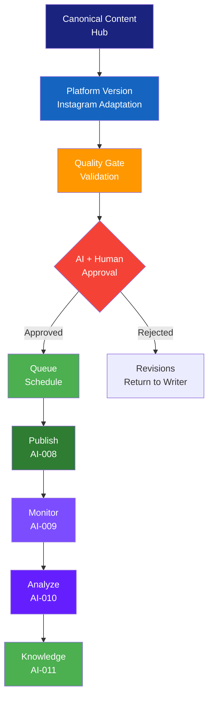

# اینستاگرام — Instagram Playbook

> **شناسه:** PLAT-001
> **وضعیت:** پیش‌نویس
> **نسخه:** 1.0.0-draft
> **به‌روزرسانی:** 2026-06-27
> **مسئول:** مدیر پلتفرم اینستاگرام
> **وابستگی:** [PLAT-000](../00-platform-playbook-standard.md), [ARCH-020](../../00-ARCHITECTURE/20-enterprise-multi-platform-strategy.md)
> **مخاطب:** human, agent, n8n, mcp

---

## Architectural Dependencies

### Why This Document Exists

هر کتابچه پلتفرم SMOS باید از PLAT-000 پیروی کند. PLAT-001 این ساختار را برای پلتفرم اینستاگرام پیاده‌سازی می‌کند و قواعد عملیاتی مختص اینستاگرام را به عنوان SSOT تعریف می‌کند. بدون این سند:

- Agentها نمی‌دانند چه محتوایی در اینستاگرام منتشر کنند
- قواعد بصری، کپشن و هشتگ ناپایدار و وابسته به افراد خواهند بود
- فرایند انتشار، تأیید و تعامل بدون استاندارد و غیرقابل پیش‌بینی خواهد بود
- دانش استخراج‌شده از تعاملات اینستاگرام به سیستم بازنمی‌گردد

### Problems It Solves

1. **نبود SSOT برای اینستاگرام**: هر تیم برداشت متفاوتی از قواعد اینستاگرام دارد → PLAT-001 به عنوان تنها مرجع معتبر
2. **عدم یکپارچگی بصری**: محتوای بصری اینستاگرام بدون هویت برند واحد → قواعد بصری مشتق از [BRD-001](../../22-BRAND/10-brand-identity.md)
3. **نبود استاندارد کپشن**: هر نویسنده سبک متفاوتی دارد → سیستم کپشن استاندارد با ۵ کلاس طول
4. **نبود استراتژی هشتگ**: هشتگ‌های تصادفی و بدون هدف → سیستم هشتگ سازمانی ۴ سطحی
5. **عدم هماهنگی AI**: Agentها نمی‌دانند در اینستاگرام چگونه عمل کنند → AI Collaboration با قواعد مشخص
6. **از دست دادن دانش**: تعاملات اینستاگرام به دانش سازمانی تبدیل نمی‌شود → Engagement Model با Knowledge Capture

### Explicit Scope

این سند فقط تعریف می‌کند:

- هویت و مأموریت اینستاگرام در SMOS (برگرفته از [ARCH-020](../../00-ARCHITECTURE/20-enterprise-multi-platform-strategy.md))
- انواع محتوای قابل انتشار (برگرفته از [EDT-002](../../24-EDITORIAL/20-content-taxonomy.md))
- قواعد عملیاتی انتشار، کپشن، هشتگ و تعامل مختص اینستاگرام
- همکاری با Agentها و رابط‌های خودکارسازی (برگرفته از [ARCH-013](../../00-ARCHITECTURE/13-ai-operating-model.md))
- KPIها و متریک‌های مختص اینستاگرام

### Explicit Non-Scope

این سند هرگز شامل موارد زیر نیست:

- استراتژی چندپلتفرمی (به [ARCH-020](../../00-ARCHITECTURE/20-enterprise-multi-platform-strategy.md) مراجعه کنید)
- هویت برند، صدا و شخصیت برند (به [BRD-001](../../22-BRAND/10-brand-identity.md) مراجعه کنید)
- انواع محتوا و تعریف CT-IDها (به [EDT-002](../../24-EDITORIAL/20-content-taxonomy.md) مراجعه کنید)
- کد API یا اسکریپت‌های اجرایی (به [AUT-\*](../../30-AUTOMATION/) مراجعه کنید)
- چرخه حیات محتوا و کیفیت (به [EDT-001](../../24-EDITORIAL/10-content-guidelines.md) مراجعه کنید)
- قواعد برند برای Agentها (به [BRD-001 §۲۱](../../22-BRAND/10-brand-identity.md) مراجعه کنید)

### Upstream Dependencies

| سند                                                                        | نوع وابستگی  | دلیل                                        |
| -------------------------------------------------------------------------- | ------------ | ------------------------------------------- |
| [PLAT-000](../00-platform-playbook-standard.md)                            | derived-from | قالب ساختار ۳۴ بخشی                         |
| [ARCH-020](../../00-ARCHITECTURE/20-enterprise-multi-platform-strategy.md) | depends-on   | نقش استراتژیک، طبقه‌بندی، اولویت            |
| [CON-000](../../05-CONSTITUTION/00-constitution.md)                        | governs      | اصول یکپارچگی، کیفیت، حاکمیت                |
| [BRD-001](../../22-BRAND/10-brand-identity.md)                             | depends-on   | هویت برند، صدا، لحن، فلسفه بصری             |
| [EDT-001](../../24-EDITORIAL/10-content-guidelines.md)                     | depends-on   | چرخه حیات محتوا، کیفیت                      |
| [EDT-002](../../24-EDITORIAL/20-content-taxonomy.md)                       | depends-on   | شناسه‌های CT-ID، طبقه‌بندی محتوا            |
| [ARCH-013](../../00-ARCHITECTURE/13-ai-operating-model.md)                 | depends-on   | Agentهای Publishing, Engagement, Monitoring |
| [GOV-001](../../10-GOVERNANCE/01-documentation-standards.md)               | follows      | استاندارد نگارش سند                         |
| [GOV-003](../../10-GOVERNANCE/03-naming-conventions.md)                    | follows      | قراردادهای نام‌گذاری شناسه‌ها               |
| [GOV-004](../../10-GOVERNANCE/04-cross-references.md)                      | follows      | نظام ارجاع متقابل                           |

### Downstream Dependencies

| سند                            | نوع وابستگی | دلیل                                         |
| ------------------------------ | ----------- | -------------------------------------------- |
| [AUT-\*](../../30-AUTOMATION/) | implements  | گردش کارهای انتشار، مانیتورینگ، تعامل        |
| [AI-\*](../../40-AI-AGENTS/)   | implements  | Agentهای Writing, Graphic, Video, Engagement |
| [PRM-\*](../../35-PROMPTS/)    | implements  | پرامپت‌های تولید محتوای اینستاگرام           |
| [MET-\*](../../60-METRICS/)    | measures    | KPIهای عملکرد اینستاگرام                     |

### SSOT Ownership

| موضوع                           | SSOT                   |
| ------------------------------- | ---------------------- |
| Instagram-specific Rules        | **PLAT-001** (این سند) |
| Instagram Content Mapping       | **PLAT-001** (این سند) |
| Instagram Post Types            | **PLAT-001** (این سند) |
| Instagram Hashtag Strategy      | **PLAT-001** (این سند) |
| Instagram Engagement Rules      | **PLAT-001** (این سند) |
| Instagram Visual Implementation | **PLAT-001** (این سند) |
| Brand Visual Philosophy         | BRD-001                |
| Content Type Definitions        | EDT-002                |
| Multi-Platform Strategy         | ARCH-020               |
| Platform Playbook Structure     | PLAT-000               |

### Related ADRs

| ADR     | عنوان                             | ارتباط                                  |
| ------- | --------------------------------- | --------------------------------------- |
| ADR-010 | معماری متا به عنوان الگوی عملیاتی | لایه Distribution (اینستاگرام)          |
| ADR-013 | جداسازی Automation و Agent        | اینستاگرام توسط Automation توزیع می‌شود |
| ADR-015 | تأیید انسانی برای انتشار الزامی   | گیت‌های تأیید در اینستاگرام             |
| ADR-019 | حکمرانی ۱۰ لایه                   | لایه Platform در حکمرانی اینستاگرام     |

### Related Objects (from ARCH-011)

Platform (OBJ-010), Account (OBJ-019), Audience (OBJ-012), Persona (OBJ-011), Platform Version (OBJ-005), Content Variant (OBJ-006), Publication (OBJ-022), Metric (OBJ-017), Campaign (OBJ-001), Asset (OBJ-007), Caption (OBJ-008)

### Related AI Agents (from ARCH-013)

Orchestrator (000), Research (001), Planning (002), Writing (003), Review (004), Fact Check (005), Graphic (006), Video (007), Publishing (008), Monitoring (009), Analytics (010), Knowledge (011), Engagement (013), Scheduler (014)

---

## ۱. Executive Summary

PLAT-001 کتابچه عملیاتی اینستاگرام Xennic است. این سند از [PLAT-000](../00-platform-playbook-standard.md) (قالب مادر کتابچه‌های پلتفرم) و [ARCH-020](../../00-ARCHITECTURE/20-enterprise-multi-platform-strategy.md) (استراتژی چندپلتفرمی) مشتق شده و به عنوان **تنها مرجع معتبر (SSOT)** برای قواعد عملیاتی اینستاگرام عمل می‌کند.

اینستاگرام در SMOS نقش **Reach (دسترسی)** را دارد ([ARCH-020 §۶](../../00-ARCHITECTURE/20-enterprise-multi-platform-strategy.md#۶-platform-roles)) — گسترده‌ترین دسترسی به مخاطب عام. اولویت استراتژیک: **P1**.

PLAT-001 با رعایت اصل [PLAT-000-02](../00-platform-playbook-standard.md#اصول-plat-000) (محتوای تکراری ممنوع) هیچ معماری، برند یا طبقه‌بندی محتوایی را تکرار نمی‌کند و صرفاً تفسیر عملیاتی مختص اینستاگرام ارائه می‌دهد.

---

## ۲. Purpose

### اهداف PLAT-001

1. **تعریف نقش اینستاگرام** در اکوسیستم SMOS — برگرفته از [ARCH-020 §۶](../../00-ARCHITECTURE/20-enterprise-multi-platform-strategy.md#۶-platform-roles)
2. **نگاشت انواع محتوای متعارف** به قالب‌های اینستاگرام — برگرفته از [EDT-002](../../24-EDITORIAL/20-content-taxonomy.md)
3. **استانداردسازی بصری اینستاگرام** — برگرفته از فلسفه بصری [BRD-001 §۱۴](../../22-BRAND/10-brand-identity.md#۱۴-visual-philosophy)
4. **استانداردسازی کپشن و هشتگ** — مشتق از [BRD-001 §۱۰-۱۲](../../22-BRAND/10-brand-identity.md#۱۰-brand-voice)
5. **تعریف همکاری AI** — برگرفته از [ARCH-013](../../00-ARCHITECTURE/13-ai-operating-model.md)
6. **تعریف KPIهای اختصاصی** — برگرفته از [ARCH-020 §۲۱](../../00-ARCHITECTURE/20-enterprise-multi-platform-strategy.md#۲۱-enterprise-kpi-framework)

### اصول PLAT-001

| اصل         | توضیح                                                                                                                                                             |
| ----------- | ----------------------------------------------------------------------------------------------------------------------------------------------------------------- |
| **INST-01** | هر محتوا در اینستاگرام از یک CT-ID معتبر ([EDT-002](../../24-EDITORIAL/20-content-taxonomy.md)) پیروی می‌کند                                                      |
| **INST-02** | محتوای بصری تابع فلسفه بصری [BRD-001 §۱۴](../../22-BRAND/10-brand-identity.md#۱۴-visual-philosophy) است                                                           |
| **INST-03** | لحن در اینستاگرام تابع ماتریس لحن [BRD-001 §۱۱](../../22-BRAND/10-brand-identity.md#۱۱-brand-tone-matrix) است                                                     |
| **INST-04** | اینستاگرام کانال توزیع است نه هویت برند — [ARCH-020 §۳](../../00-ARCHITECTURE/20-enterprise-multi-platform-strategy.md#۳-enterprise-media-philosophy)             |
| **INST-05** | تعاملات اینستاگرام باید به دانش سازمانی بازگردد — [ARCH-020 §۸](../../00-ARCHITECTURE/20-enterprise-multi-platform-strategy.md#۸-knowledge-flow-across-platforms) |

---

## ۳. Scope

### دامنه شمول

- حساب رسمی Xennic در اینستاگرام (و حساب‌های فرعی مرتبط)
- انواع پست: Post, Carousel, Reel, Story, Highlight, Live, Guide, Broadcast Channel
- فرایندهای انتشار، تأیید، بازبینی، زمان‌بندی
- تعامل با مخاطبان: کامنت، DM، تعامل با دیگران
- محتوای بصری: تصویر، ویدئو، گرافیک، موشن
- استراتژی هشتگ، کپشن و CTA
- KPIها و متریک‌های عملکرد

### دامنه عدم شمول

- استراتژی کلی پلتفرم (به [ARCH-020](../../00-ARCHITECTURE/20-enterprise-multi-platform-strategy.md) مراجعه کنید)
- تعریف انواع محتوا (به [EDT-002](../../24-EDITORIAL/20-content-taxonomy.md) مراجعه کنید)
- هویت برند و فلسفه بصری (به [BRD-001](../../22-BRAND/10-brand-identity.md) مراجعه کنید)
- تبلیغات پولی و ادز (بودجه و استراتژی مجزا)
- API پیاده‌سازی (به [AUT-\*](../../30-AUTOMATION/) مراجعه کنید)
- سایر پلتفرم‌ها (هر یک PLAT-\* خود را دارند)

---

## ۴. Platform Identity

### هویت پلتفرم در SMOS

| فیلد                     | مقدار                                                                                                                                             |
| ------------------------ | ------------------------------------------------------------------------------------------------------------------------------------------------- |
| **Platform ID**          | PLAT-001                                                                                                                                          |
| **Platform Name (FA)**   | اینستاگرام                                                                                                                                        |
| **Platform Name (EN)**   | Instagram                                                                                                                                         |
| **Owner Company**        | Meta Platforms, Inc.                                                                                                                              |
| **Platform Category**    | Third-Party ([ARCH-020 §۵](../../00-ARCHITECTURE/20-enterprise-multi-platform-strategy.md#۵-platform-classification-framework))                   |
| **Platform Role**        | Reach (دسترسی) — گسترده‌ترین دسترسی به مخاطب عام ([ARCH-020 §۶](../../00-ARCHITECTURE/20-enterprise-multi-platform-strategy.md#۶-platform-roles)) |
| **Platform Priority**    | P1 ([ARCH-020 §۱۲](../../00-ARCHITECTURE/20-enterprise-multi-platform-strategy.md#۱۲-platform-priority-matrix))                                   |
| **Content Nature**       | Mixed (Image + Video)                                                                                                                             |
| **Communication Nature** | Network ([ARCH-020 §۵](../../00-ARCHITECTURE/20-enterprise-multi-platform-strategy.md#۵-platform-classification-framework))                       |
| **Audience Type**        | General                                                                                                                                           |
| **API Type**             | Graph API                                                                                                                                         |
| **API Version**          | v19.0+                                                                                                                                            |
| **Authentication**       | OAuth 2.0 + Facebook Login                                                                                                                        |
| **Rate Limits**          | 200 calls/hour per user token (standard)                                                                                                          |

### بلوک JSON

```json
{
  "platform_identity": {
    "id": "PLAT-001",
    "name_fa": "اینستاگرام",
    "name_en": "Instagram",
    "owner": "Meta Platforms, Inc.",
    "category": "third_party",
    "role": "reach",
    "priority": "P1",
    "content_nature": "mixed_image_video",
    "communication_nature": "network",
    "audience_type": "general",
    "api": {
      "type": "Graph API",
      "version": "v19.0",
      "auth": "OAuth 2.0",
      "rate_limits": "200 calls/hour per user token"
    }
  }
}
```

---

## ۵. Platform Overview

اینستاگرام یک پلتفرم اشتراک‌گذاری تصویر و ویدئو متعلق به Meta است که در SMOS نقش **Reach (دسترسی)** را ایفا می‌کند ([ARCH-020 §۶](../../00-ARCHITECTURE/20-enterprise-multi-platform-strategy.md#۶-platform-roles)). این پلتفرم با ماهیت بصری و شبکه‌ای خود، گسترده‌ترین دسترسی را به مخاطب عام فراهم می‌کند.

### ویژگی‌های کلیدی

| ویژگی               | توضیح                                 |
| ------------------- | ------------------------------------- |
| **ماهیت**           | بصری-محور (Image/Video First)         |
| **مخاطب**           | عمومی، جوان (۱۸-۳۴ سال غالب)          |
| **ارتباط**          | شبکه‌ای (Follow + Explore + Hashtag)  |
| **تعامل**           | Like, Comment, Share, Save, DM        |
| **مالکیت**          | Third-Party (Meta) — محدودیت در کنترل |
| **دسترسی در ایران** | نیاز به VPN                           |
| **نوع API**         | Graph API — محدودیت در اتوماسیون      |
| **SEO**             | محدود — جستجوی داخلی + هشتگ           |

---

## ۶. Strategic Role

نقش استراتژیک اینستاگرام در SMOS از [ARCH-020 §۶](../../00-ARCHITECTURE/20-enterprise-multi-platform-strategy.md#۶-platform-roles) مشتق شده است:

### نقش اصلی: Reach (دسترسی)

ایجاد گسترده‌ترین دسترسی به مخاطب عام از طریق محتوای بصری جذاب و قابل اشتراک‌گذاری.

### نقش‌های عملیاتی

| نقش عملیاتی              | توضیح                                       |
| ------------------------ | ------------------------------------------- |
| **Brand Presence**       | حضور و دیده‌شدن برند Xennic در فضای بصری    |
| **Audience Engagement**  | تعامل با مخاطبان از طریق کامنت، DM و استوری |
| **Content Distribution** | توزیع نسخه بصری محتوای متعارف               |
| **Knowledge Collection** | استخراج دانش از بازخورد و تعاملات           |
| **Market Intelligence**  | جمع‌آوری داده و تحلیل روندها                |

### موقعیت در سفر مخاطب ([ARCH-020 §۷](../../00-ARCHITECTURE/20-enterprise-multi-platform-strategy.md#۷-audience-journey-architecture))

| مرحله سفر          | نقش اینستاگرام                             |
| ------------------ | ------------------------------------------ |
| Awareness (آگاهی)  | **اصلی** — اولین نقطه تماس مخاطب با برند   |
| Attention (توجه)   | کمکی — در کنار YouTube                     |
| Engagement (تعامل) | کمکی — در کنار Telegram                    |
| Conversion (تبدیل) | **CTA به Website** — لینک در Bio و Stories |

---

## ۷. Audience Definition

### مخاطبان اینستاگرام Xennic

تعریف مخاطبان بر اساس [ARCH-020 §۷](../../00-ARCHITECTURE/20-enterprise-multi-platform-strategy.md#۷-audience-journey-architecture) و اصول [CON-000](../../05-CONSTITUTION/00-constitution.md).

| فیلد                      | مقدار                                                                  |
| ------------------------- | ---------------------------------------------------------------------- |
| **Primary Audience**      | جوانان ۱۸-۳۴ سال فارسی‌زبان جویای دانش و آگاهی                         |
| **Secondary Audience**    | متخصصان و حرفه‌مندان ۲۵-۴۵ سال                                         |
| **Audience Demographics** | سن: ۱۸-۴۵، جنسیت: مخلوط، مکان: ایران (با VPN) + ایران‌یان خارج از کشور |
| **Audience Behavior**     | مصرف محتوای بصری کوتاه، تعامل با استوری، جستجوی هشتگ                   |
| **Peak Hours (Iran)**     | ۲۱:۰۰-۲۳:۰۰ (شب)، ۱۲:۰۰-۱۴:۰۰ (ظهر)                                    |
| **Content Preferences**   | ویدئوی کوتاه (Reels)، اینفوگرافیک، کاروسل آموزشی، محتوای پشت صحنه      |
| **Personas**              | دانشجو، کارمند دانش‌پسند، متخصص فناوری، کارآفرین                       |

### پرسوناهای هدف (ارجاع به ARCH-011 OBJ-011)

| پرسونا             | سن    | نیاز محتوایی               | رفتار در اینستاگرام                      |
| ------------------ | ----- | -------------------------- | ---------------------------------------- |
| **دانشجوی کنجکاو** | ۱۸-۲۵ | یادگیری سریع، نکات آموزشی  | دنبال کردن هشتگ‌های آموزشی، ذخیره پست‌ها |
| **متخصص فناوری**   | ۲۵-۴۰ | تحلیل صنعت، بینش تخصصی     | تعامل با محتوای تحلیلی، اشتراک‌گذاری     |
| **مدیر کسب‌وکار**  | ۳۰-۴۵ | مطالعه موردی، اعتمادسازی   | مصرف محتوای حرفه‌ای، DM برای همکاری      |
| **مخاطب عام**      | ۲۰-۴۵ | محتوای الهام‌بخش، پشت صحنه | تعامل سطحی، اشتراک محتوای جذاب           |

---

## ۸. Platform Mission

مأموریت اینستاگرام در SMOS:

**"ایجاد گسترده‌ترین دسترسی بصری به برند Xennic و جذب مخاطبان جدید از طریق محتوای تصویری جذاب، آموزشی و الهام‌بخش."**

### ابعاد مأموریت

| بعد              | توضیح                                                            |
| ---------------- | ---------------------------------------------------------------- |
| **دسترسی**       | حداکثرسازی Reach از طریق محتوای بصری قابل اشتراک و الگوریتم-پسند |
| **آگاهی‌بخشی**   | معرفی برند Xennic به مخاطبان جدید با محتوای ارزشمند              |
| **تعامل اولیه**  | ایجاد نخستین نقطه تماس و تعامل مخاطب با برند                     |
| **هدایت به هاب** | انتقال مخاطبان از اینستاگرام به Website برای تبدیل نهایی         |

---

## ۹. Platform Objectives

اهداف اینستاگرام Xennic — برگرفته از [ARCH-020 §۲۱](../../00-ARCHITECTURE/20-enterprise-multi-platform-strategy.md#۲۱-enterprise-kpi-framework) و [CON-000](../../05-CONSTITUTION/00-constitution.md).

| هدف       | توضیح                                 | KPI مرتبط       | زمان    | اولویت |
| --------- | ------------------------------------- | --------------- | ------- | ------ |
| OBJ-IG-01 | افزایش Reach ماهانه                   | KPI-PLAT-001-01 | Q3 1405 | P1     |
| OBJ-IG-02 | افزایش نرخ تعامل (Engagement Rate)    | KPI-PLAT-001-02 | Q3 1405 | P1     |
| OBJ-IG-03 | رشد Followers                         | KPI-PLAT-001-04 | Q4 1405 | P1     |
| OBJ-IG-04 | افزایش کلیک به Website از Bio/Stories | KPI-PLAT-001-06 | Q4 1405 | P2     |
| OBJ-IG-05 | استخراج دانش از تعاملات               | KPI-PLAT-001-10 | Q1 1406 | P2     |
| OBJ-IG-06 | بهبود Brand Consistency Score         | KPI-PLAT-001-11 | Q1 1406 | P2     |

---

## ۱۰. Platform KPIs

شاخص‌های کلیدی عملکرد اینستاگرام — از [ARCH-020 §۲۱](../../00-ARCHITECTURE/20-enterprise-multi-platform-strategy.md#۲۱-enterprise-kpi-framework) مشتق شده است.

| KPI             | توضیح                                            | هدف         | فرکانس اندازه‌گیری | مسئول               |
| --------------- | ------------------------------------------------ | ----------- | ------------------ | ------------------- |
| KPI-PLAT-001-01 | Reach — تعداد حساب‌های منحصربه‌فرد دیده‌شده      | +۲۰٪ ماهانه | روزانه             | AI-009 (Monitoring) |
| KPI-PLAT-001-02 | Engagement Rate — (تعاملات / Reach) × ۱۰۰        | > ۳٪        | هفتگی              | AI-010 (Analytics)  |
| KPI-PLAT-001-03 | Saves — تعداد ذخیره‌سازی پست‌ها                  | +۱۵٪ ماهانه | هفتگی              | AI-010              |
| KPI-PLAT-001-04 | Follower Growth — رشد دنبال‌کنندگان              | +۵٪ ماهانه  | روزانه             | AI-009              |
| KPI-PLAT-001-05 | Profile Visits — بازدید از پروفایل               | +۱۰٪ ماهانه | هفتگی              | AI-010              |
| KPI-PLAT-001-06 | Website Clicks — کلیک از Bio/Stories             | +۱۵٪ ماهانه | هفتگی              | AI-010              |
| KPI-PLAT-001-07 | Story Completion Rate — نرخ تکمیل استوری         | > ۷۰٪       | هفتگی              | AI-010              |
| KPI-PLAT-001-08 | Reel Plays — تعداد پخش Reel                      | +۲۵٪ ماهانه | روزانه             | AI-009              |
| KPI-PLAT-001-09 | DM Response Time — میانگین زمان پاسخ به DM       | < ۲ ساعت    | روزانه             | AI-013 (Engagement) |
| KPI-PLAT-001-10 | Knowledge Return — تعداد Insightهای استخراج‌شده  | > ۵ هفتگی   | هفتگی              | AI-011 (Knowledge)  |
| KPI-PLAT-001-11 | Brand Consistency Score — تطابق محتوا با BRD-001 | > ۹۰٪       | هفتگی              | AI-004 (Review)     |

### بلوک JSON

```json
{
  "platform_kpis": [
    {
      "id": "KPI-PLAT-001-01",
      "name": "Reach",
      "description": "تعداد حساب‌های منحصربه‌فرد دیده‌شده",
      "target": "+20% monthly",
      "unit": "count",
      "frequency": "daily",
      "owner": "AI-009"
    },
    {
      "id": "KPI-PLAT-001-02",
      "name": "Engagement Rate",
      "description": "نرخ تعامل (تعاملات / Reach × 100)",
      "target": "> 3%",
      "unit": "percentage",
      "frequency": "weekly",
      "owner": "AI-010"
    },
    {
      "id": "KPI-PLAT-001-11",
      "name": "Brand Consistency Score",
      "description": "تطابق محتوای منتشرشده با BRD-001",
      "target": "> 90%",
      "unit": "percentage",
      "frequency": "weekly",
      "owner": "AI-004"
    }
  ]
}
```

---

## ۱۱. Platform Constraints

محدودیت‌های اینستاگرام — شامل محدودیت‌های فنی، محتوایی، قانونی و تجاری.

### Technical

| محدودیت                       | توضیح                                            | تأثیر                           | کاهش اثر                                      |
| ----------------------------- | ------------------------------------------------ | ------------------------------- | --------------------------------------------- |
| **Character Limit (Caption)** | حداکثر ۲,۲۰۰ کاراکتر                             | محدودیت در محتوای طولانی        | استفاده از Carousel برای محتوای بلند          |
| **Character Limit (Bio)**     | حداکثر ۱۵۰ کاراکتر                               | محدودیت در معرفی                | لینک در Bio + خلاصه کوتاه                     |
| **Image Ratio**               | ۱:۱ (Square), ۴:۵ (Portrait), ۱.۹۱:۱ (Landscape) | نیاز به تطابق ابعاد             | Templates استاندارد برای هر فرمت              |
| **Video Length (Feed)**       | حداکثر ۶۰ دقیقه (پست), ۹۰ ثانیه (Carousel)       | محدودیت محتوای بلند             | محتوای بلند → YouTube + Preview در اینستاگرام |
| **Video Length (Reels)**      | حداکثر ۹۰ ثانیه                                  | محدودیت محتوای کوتاه            | مناسب برای CT-004 (Educational Short)         |
| **Video Length (Stories)**    | حداکثر ۶۰ ثانیه                                  | محدودیت استوری                  | تکه‌تکه کردن محتوای بلند                      |
| **File Size (Image)**         | حداکثر ۸MB                                       | محدودیت کیفیت                   | بهینه‌سازی تصاویر                             |
| **File Size (Video)**         | حداکثر ۴GB (Reels), ۶۵۰MB (Feed)                 | محدودیت ویدئو                   | فشرده‌سازی استاندارد                          |
| **Link in Caption**           | **غیرفعال**                                      | لینک فقط در Bio, Stories, Reels | CTA به Bio + لینک در استوری                   |
| **API Rate Limit**            | ۲۰۰ درخواست/ساعت                                 | محدودیت اتوماسیون               | بهینه‌سازی درخواست‌ها                         |

### Content

| محدودیت                | توضیح                                                         |
| ---------------------- | ------------------------------------------------------------- |
| **Prohibited Content** | محتوای خشونت‌آمیز، تبعیض‌آمیز، نقض کپی‌رایت (طبق خط‌مشی Meta) |
| **Age Restrictions**   | محتوای ۱۸+ نیازمند محدودیت سنی                                |
| **Political Content**  | محدودیت‌های پلتفرم برای محتوای سیاسی                          |
| **Music Copyright**    | محدودیت استفاده از موسیقی دارای کپی‌رایت در Reels             |
| **Watermark**          | محتوای دارای واترمارک پلتفرم‌های دیگر (TikTok) محدودیت دارد   |

### Legal

| محدودیت                | توضیح                                    |
| ---------------------- | ---------------------------------------- |
| **Data Privacy**       | GDPR, CCPA — جمع‌آوری داده مخاطبان محدود |
| **Iran Accessibility** | اینستاگرام در ایران فیلتر است — نیاز VPN |
| **Meta Policies**      | تابع خط‌مشی Meta — تغییرات یک‌طرفه       |

### Business

| محدودیت                  | توضیح                                           |
| ------------------------ | ----------------------------------------------- |
| **No Organic Link**      | لینک در کپشن غیرفعال — وابستگی به Bio و Stories |
| **Algorithm Dependency** | دیده‌شدن وابسته به الگوریتم — کنترل محدود       |
| **Ad Cost**              | تبلیغات پولی نیازمند بودجه مجزا                 |
| **Meta Changes**         | تغییرات الگوریتم و API بدون اطلاع قبلی          |

### بلوک JSON

```json
{
  "platform_constraints": [
    {
      "type": "technical",
      "description": "Character limit for captions: 2,200 characters",
      "impact": "Long-form content requires Carousel format",
      "mitigation": "Use Carousel posts for content > 2,200 chars"
    },
    {
      "type": "technical",
      "description": "No clickable links in post captions",
      "impact": "Direct traffic limited to Bio and Stories",
      "mitigation": "Link in Bio strategy + Story links + Reels links"
    },
    {
      "type": "content",
      "description": "Watermark from competing platforms restricted",
      "impact": "Cannot repost TikTok content with watermark",
      "mitigation": "Original content production only"
    },
    {
      "type": "legal",
      "description": "Instagram banned in Iran — requires VPN",
      "impact": "Limited organic reach within Iran",
      "mitigation": "Focus on non-Iran Persian audience + Telegram/Bale alternative"
    }
  ]
}
```

---

## ۱۲. Content Types

این بخش فقط CT-IDهای قابل انتشار در اینستاگرام را فهرست می‌کند. تعریف کامل هر CT-ID در [EDT-002 §§۸-۱۸](../../24-EDITORIAL/20-content-taxonomy.md) موجود است.

### CT-IDهای سازگار با اینستاگرام

بر اساس [EDT-002 §۲۴](../../24-EDITORIAL/20-content-taxonomy.md#۲۴-platform-independence) و فیلد `compatible_platforms` هر CT-ID:

| CT-ID  | نام                    | قالب اینستاگرام              | محدودیت             |
| ------ | ---------------------- | ---------------------------- | ------------------- |
| CT-003 | Infographic            | Carousel, Single Image       | —                   |
| CT-004 | Educational Short      | Reels, Carousel, Story       | —                   |
| CT-009 | Industry Insight       | Carousel, Post               | متن کوتاه           |
| CT-011 | Product Introduction   | Post, Reels, Carousel        | —                   |
| CT-012 | Case Study             | Carousel, Post               | خلاصه‌شده           |
| CT-013 | Promotional Campaign   | Post, Reels, Story, Carousel | —                   |
| CT-014 | Webinar/Live Promotion | Post, Story, Reels           | —                   |
| CT-015 | Testimonial            | Post, Story, Quote Card      | مجوز انتشار         |
| CT-016 | Discussion Starter     | Post, Story (Poll/Question)  | —                   |
| CT-017 | Poll/Survey            | Story (Poll/Quiz)            | —                   |
| CT-019 | UGC                    | Repost, Story                | مجوز انتشار         |
| CT-020 | CTA                    | Post, Story                  | لینک در Bio/Stories |
| CT-022 | Offer/Discount         | Post, Story, Reels           | —                   |
| CT-023 | Behind the Scenes      | Story, Post, Reels           | —                   |
| CT-024 | Company Culture        | Post, Reels, Story           | —                   |
| CT-026 | Quiz/Assessment        | Story (Quiz)                 | محدود به استوری     |
| CT-027 | Challenge/Contest      | Post, Story, Reels           | —                   |
| CT-029 | Event Announcement     | Post, Story, Reels           | —                   |
| CT-030 | Live Coverage          | Live                         | نیاز به ناظر انسانی |
| CT-031 | Event Recap            | Post, Carousel, Reels        | —                   |
| CT-036 | Crisis Statement       | Post (pin)                   | فقط انسان           |
| CT-037 | Crisis Update          | Post, Story                  | فقط انسان           |
| CT-038 | Apology/Correction     | Post                         | فقط انسان           |

### CT-IDهای غیرمجاز در اینستاگرام

| CT-ID                        | دلیل عدم پشتیبانی                                      |
| ---------------------------- | ------------------------------------------------------ |
| CT-001 (Educational Article) | اینستاگرام از متن بلند پشتیبانی نمی‌کند — فقط Carousel |
| CT-002 (Educational Video)   | محدودیت طول ویدئو — مناسب YouTube                      |
| CT-005 (Educational Series)  | بدون قابلیت سری‌سازی بومی                              |
| CT-006 (Technical Analysis)  | متن طولانی غیرقابل انتشار                              |
| CT-007 (Research Report)     | حجم و طول نامناسب                                      |
| CT-008 (Whitepaper)          | کاملاً نامناسب برای اینستاگرام                         |
| CT-010 (Opinion Piece)       | متن‌محور — غیربصری                                     |
| CT-018 (Community Update)    | محدودیت ابزارهای اجتماع                                |
| CT-021 (Landing Page)        | فقط وب‌سایت                                            |
| CT-025 (Transparency Report) | حجم داده بالا، غیربصری                                 |
| CT-028 (Interactive Tool)    | فقط وب‌سایت                                            |
| CT-032-035 (Knowledge)       | داخلی                                                  |
| CT-039-042 (Internal)        | داخلی                                                  |

---

## ۱۳. Content Strategy

### Content Pillars

ستون‌های محتوای اینستاگرام Xennic — برگرفته از [BRD-001 §۵](../../22-BRAND/10-brand-identity.md#۵-brand-dna) (DNA برند: نور × نیرو × یکتا) و [ARCH-020 §۱۳](../../00-ARCHITECTURE/20-enterprise-multi-platform-strategy.md#۱۳-content-to-platform-mapping).

#### Pillar 1: Knowledge Nugget (نور)

| فیلد                     | مقدار                                  |
| ------------------------ | -------------------------------------- |
| **Purpose**              | انتقال دانش و آگاهی در قالب بصری کوتاه |
| **Target Audience**      | دانشجویان، مخاطبان جویای یادگیری       |
| **Primary CT-IDs**       | CT-003, CT-004, CT-009                 |
| **Business Goal**        | Brand Awareness, Authority             |
| **Knowledge Goal**       | Awareness → Understanding              |
| **Brand Goal**           | نور (روشن‌گری) — ارزش‌آفرینی آموزشی    |
| **Priority**             | P1                                     |
| **Publishing Frequency** | ۳-۴ بار در هفته                        |

#### Pillar 2: Brand Impact (نیرو)

| فیلد                     | مقدار                                    |
| ------------------------ | ---------------------------------------- |
| **Purpose**              | نمایش تأثیرگذاری، قدرت و نتیجه‌بخشی برند |
| **Target Audience**      | متخصصان، مدیران کسب‌وکار                 |
| **Primary CT-IDs**       | CT-011, CT-012, CT-015                   |
| **Business Goal**        | Conversion, Trust                        |
| **Knowledge Goal**       | Decision → Action                        |
| **Brand Goal**           | نیرو (تأثیرگذاری) — متقاعدسازی حرفه‌ای   |
| **Priority**             | P1                                       |
| **Publishing Frequency** | ۲ بار در هفته                            |

#### Pillar 3: Unique Perspective (یکتا)

| فیلد                     | مقدار                                        |
| ------------------------ | -------------------------------------------- |
| **Purpose**              | نمایش دیدگاه منحصربه‌فرد و سبک متمایز Xennic |
| **Target Audience**      | همه مخاطبان                                  |
| **Primary CT-IDs**       | CT-023, CT-024, CT-027                       |
| **Business Goal**        | Brand Awareness, Engagement                  |
| **Knowledge Goal**       | Connection → Participation                   |
| **Brand Goal**           | یکتا (منحصربه‌فردی) — اصالت و نوآوری         |
| **Priority**             | P1                                           |
| **Publishing Frequency** | ۲ بار در هفته                                |

#### Pillar 4: Community Pulse (اجتماع)

| فیلد                     | مقدار                           |
| ------------------------ | ------------------------------- |
| **Purpose**              | تعامل و گفتگو با مخاطبان        |
| **Target Audience**      | Followers فعال                  |
| **Primary CT-IDs**       | CT-016, CT-017, CT-019          |
| **Business Goal**        | Engagement, Retention           |
| **Knowledge Goal**       | Participation → Connection      |
| **Brand Goal**           | ارتباط انسانی — صمیمیت و شفافیت |
| **Priority**             | P2                              |
| **Publishing Frequency** | ۱-۲ بار در هفته                 |

### Content Mix

| دسته                   | درصد | توضیح                      |
| ---------------------- | ---- | -------------------------- |
| **Knowledge Nugget**   | ۴۰٪  | محتوای آموزشی و بینش صنعت  |
| **Brand Impact**       | ۲۵٪  | محصول، مطالعه موردی، گواهی |
| **Unique Perspective** | ۲۰٪  | پشت صحنه، فرهنگ، چالش      |
| **Community Pulse**    | ۱۵٪  | بحث، نظرسنجی، UGC          |

### Content Frequency

| نوع پست                  | تعداد در هفته                   | بهترین زمان              |
| ------------------------ | ------------------------------- | ------------------------ |
| **Feed Post / Carousel** | ۴-۵                             | ۲۱:۰۰-۲۳:۰۰, ۱۲:۰۰-۱۴:۰۰ |
| **Reels**                | ۳-۴                             | ۲۱:۰۰-۲۳:۰۰, ۰۸:۰۰-۱۰:۰۰ |
| **Stories**              | ۵-۷ روزانه                      | ۱۰:۰۰-۲۳:۰۰              |
| **Total**                | ۷-۹ محتوای اصلی + استوری روزانه | زمان ایران (UTC+3:30)    |

### Content Sources

| منبع              | درصد | مسئول                                              |
| ----------------- | ---- | -------------------------------------------------- |
| **AI Generated**  | ۶۰٪  | AI-003 (Writing), AI-006 (Graphic), AI-007 (Video) |
| **Human Written** | ۳۰٪  | Content Team                                       |
| **Curated / UGC** | ۱۰٪  | AI-013 (Engagement) for UGC identification         |

---

## ۱۴. Content Mapping

نگاشت CT-IDها به قالب‌های اینستاگرام — برگرفته از [EDT-002 §۲۴](../../24-EDITORIAL/20-content-taxonomy.md#۲۴-platform-independence).

| CT-ID  | فرمت متعارف            | نسخه اینستاگرام                            | تغییرات لازم                      | مسئول تبدیل              | اولویت |
| ------ | ---------------------- | ------------------------------------------ | --------------------------------- | ------------------------ | ------ |
| CT-003 | Infographic (Standard) | Carousel (۱۰ اسلاید), Single Image         | تطابق ابعاد ۴:۵                   | AI-006 (Graphic)         | P1     |
| CT-004 | Educational Short      | Reels (۳۰-۶۰ ثانیه), Carousel (۵-۸ اسلاید) | بومی‌سازی بصری                    | AI-006 + AI-003          | P1     |
| CT-009 | Industry Insight       | Carousel (۵-۷ اسلاید), Post                | تبدیل متن به بصری                 | AI-003 + AI-006          | P1     |
| CT-011 | Product Introduction   | Post + Reels (۱۵-۳۰ ثانیه)                 | خلاصه‌سازی بصری                   | AI-006 + AI-007          | P1     |
| CT-012 | Case Study             | Carousel (۸-۱۰ اسلاید)                     | خلاصه به ۳ بخش: مشکل-راه‌حل-نتیجه | AI-003                   | P2     |
| CT-013 | Promotional Campaign   | Post + Reels + Story + Carousel            | چندقالبی                          | AI-003 + AI-006 + AI-007 | P1     |
| CT-014 | Event Promotion        | Post + Story + Reels                       | CTA به لینک ثبت‌نام               | AI-003 + AI-006          | P2     |
| CT-015 | Testimonial            | Post (Quote Card), Story                   | طراحی کارت نقل‌قول                | AI-006                   | P2     |
| CT-016 | Discussion Starter     | Post (سؤال), Story (Poll)                  | سؤال جذاب بصری                    | AI-003 + AI-006          | P2     |
| CT-017 | Poll/Survey            | Story (Poll/Quiz/Emoji Slider)             | طراحی تعاملی استوری               | AI-003                   | P2     |
| CT-019 | UGC                    | Repost + Story (Quote)                     | درخواست مجوز + برندگذاری مجدد     | Human + AI-004 (Review)  | P2     |
| CT-020 | CTA                    | Post + Story + Reels (End Card)            | لینک در Bio + Stories             | AI-003                   | P1     |
| CT-022 | Offer/Discount         | Post + Story + Reels                       | محدودیت زمانی در تصویر            | AI-003 + AI-006          | P2     |
| CT-023 | Behind the Scenes      | Story + Reels + Post                       | محتوای انسانی (AI ممنوع)          | Human                    | P2     |
| CT-024 | Company Culture        | Post + Reels + Story                       | نمایش ارزش‌ها                     | AI-003 (پیش‌نویس)        | P2     |
| CT-027 | Challenge/Contest      | Post (اعلام) + Story + Reels               | هشتگ اختصاصی                      | AI-003 + AI-006          | P2     |
| CT-029 | Event Announcement     | Post + Story + Reels (Teaser)              | تاریخ و لینک در Bio               | AI-003 + AI-006          | P2     |
| CT-030 | Live Coverage          | Live                                       | نیاز به ناظر انسانی               | Human + AI-013           | P1     |
| CT-031 | Event Recap            | Carousel + Reels (Highlights)              | ۵-۱۰ اسلاید خلاصه                 | AI-003 + AI-007          | P2     |
| CT-036 | Crisis Statement       | Post (Pinned)                              | فقط انسان                         | Human                    | P0     |
| CT-037 | Crisis Update          | Post + Story                               | فقط انسان                         | Human                    | P0     |
| CT-038 | Apology/Correction     | Post (Pinned)                              | فقط انسان                         | Human                    | P0     |

---

## ۱۵. Publishing Model

### Publishing Workflow

برگرفته از [EDT-001 §۶](../../24-EDITORIAL/10-content-guidelines.md) (چرخه حیات محتوا) و [ARCH-020 §۹](../../00-ARCHITECTURE/20-enterprise-multi-platform-strategy.md#۹-canonical-publishing-strategy).



### Approval Chain

| سطح تأیید                | نقش             | شرایط                                 |
| ------------------------ | --------------- | ------------------------------------- |
| **L1 — AI Review**       | AI-004 (Review) | همه محتواها — بررسی برند، لحن، کیفیت  |
| **L2 — Human Editorial** | Content Manager | CT-012, CT-019, CT-031, CT-036~038    |
| **L3 — Human Brand**     | Brand Manager   | CT-011 (اولین انتشار), CT-013         |
| **Auto-approve**         | —               | CT-016, CT-017, CT-020 (اعتماد > ۹۰٪) |

### Scheduling Rules

| نوع محتوا             | بهترین روز      | بهترین زمان | حداقل فاصله بین پست‌ها |
| --------------------- | --------------- | ----------- | ---------------------- |
| **Educational**       | یکشنبه-چهارشنبه | ۲۱:۰۰       | ۴ ساعت                 |
| **Promotional**       | پنجشنبه-جمعه    | ۱۲:۰۰       | ۶ ساعت                 |
| **Community**         | همه روزها       | ۲۰:۰۰-۲۳:۰۰ | ۲ ساعت                 |
| **Behind the Scenes** | پنجشنبه         | ۱۰:۰۰       | —                      |

### Auto-publish Rules

| شرط                         | مجاز بودن   | توضیح             |
| --------------------------- | ----------- | ----------------- |
| CT-004 (Educational Short)  | **مجاز**    | اعتماد AI > ۹۰٪   |
| CT-009 (Industry Insight)   | **مجاز**    | اعتماد AI > ۹۰٪   |
| CT-016 (Discussion Starter) | **مجاز**    | بدون تأیید انسانی |
| CT-017 (Poll/Survey)        | **مجاز**    | بدون تأیید انسانی |
| CT-020 (CTA)                | **مجاز**    | بررسی برند خودکار |
| CT-011 (Product Intro)      | **غیرمجاز** | نیاز تأیید انسانی |
| CT-012 (Case Study)         | **غیرمجاز** | نیاز تأیید انسانی |
| CT-036~038 (Crisis)         | **غیرمجاز** | فقط انسان         |

---

## ۱۶. Publishing Rules

### قواعد عمومی

| قاعده         | توضیح                                                                                                                                                              |
| ------------- | ------------------------------------------------------------------------------------------------------------------------------------------------------------------ |
| **PUB-IG-01** | هر پست قبل از انتشار باید گیت‌های کیفیت PLAT-000 را پاس کند                                                                                                        |
| **PUB-IG-02** | محتوای بحرانی (CT-036~038) فقط توسط انسان منتشر شود                                                                                                                |
| **PUB-IG-03** | CTA در کپشن → "لینک در Bio" — لینک مستقیم ممنوع                                                                                                                    |
| **PUB-IG-04** | حداکثر ۳ پست در روز — حداقل ۴ ساعت فاصله                                                                                                                           |
| **PUB-IG-05** | اولین پست روز قبل از ۱۲:۰۰ ظهر منتشر نشود                                                                                                                          |
| **PUB-IG-06** | Reels اولویت بالاتری نسبت به Post در زمان اوج دارند                                                                                                                |
| **PUB-IG-07** | محتوای تکراری از پلتفرم‌های دیگر در اینستاگرام ممنوع — [ARCH-020 §۱۱ XP-01](../../00-ARCHITECTURE/20-enterprise-multi-platform-strategy.md#۱۱-cross-posting-rules) |
| **PUB-IG-08** | Stories روزانه حداقل ۳ و حداکثر ۱۰ عدد                                                                                                                             |

### بومی‌سازی محتوا

بر اساس [ARCH-020 §۹](../../00-ARCHITECTURE/20-enterprise-multi-platform-strategy.md#۹-canonical-publishing-strategy) (Canonical Publishing Strategy):

| تغییر                 | توضیح                                             |
| --------------------- | ------------------------------------------------- |
| **منبع**              | محتوای متعارف از Hub (Website)                    |
| **بومی‌سازی**         | تبدیل به قالب بصری اینستاگرام                     |
| **تغییر محتوای اصلی** | **ممنوع** — Platform Version فقط بومی‌سازی می‌کند |
| **CTA**               | متناسب با اینستاگرام — لینک در Bio                |

---

## ۱۷. Post Types

### اشیاء اینستاگرام (Instagram Objects)

بر اساس [ARCH-011 OBJ-004](../../00-ARCHITECTURE/11-object-model.md) (Content Piece) و OBJ-005 (Platform Version).

#### Post (Single Image/Video)

| فیلد               | مقدار                                                                                                      |
| ------------------ | ---------------------------------------------------------------------------------------------------------- |
| **Mission**        | انتشار محتوای تصویری یا ویدئویی تکی در Feed                                                                |
| **Lifecycle**      | Normal (۳-۷ روز)                                                                                           |
| **Owner**          | AI-003 (Writing Brief) + AI-006 (Graphic) + AI-004 (Review)                                                |
| **Metadata**       | CT-ID, Caption, Hashtags, Location (اختیاری), Alt Text                                                     |
| **Quality Gate**   | Brand Review (AI-004) + Format Validation                                                                  |
| **Related CT-IDs** | CT-003, CT-009, CT-011, CT-015, CT-016, CT-020, CT-022, CT-023, CT-024, CT-027, CT-029, CT-031, CT-036~038 |

#### Carousel

| فیلد               | مقدار                                                   |
| ------------------ | ------------------------------------------------------- |
| **Mission**        | ارائه چندین تصویر/ویدئو در یک پست — مناسب محتوای آموزشی |
| **Lifecycle**      | Normal (۵-۱۰ روز)                                       |
| **Owner**          | AI-003 + AI-006 + AI-004                                |
| **Metadata**       | CT-ID, Caption, Hashtags, Sequence شماره‌گذاری          |
| **Quality Gate**   | Sequence Validation + Brand Review                      |
| **Max Slides**     | ۱۰                                                      |
| **Related CT-IDs** | CT-003, CT-004, CT-009, CT-011, CT-012, CT-031          |

#### Reel

| فیلد               | مقدار                                                          |
| ------------------ | -------------------------------------------------------------- |
| **Mission**        | ویدئوی کوتاه عمودی برای حداکثر دسترسی                          |
| **Lifecycle**      | Rapid (۱-۳ روز)                                                |
| **Owner**          | AI-003 (Script) + AI-007 (Video) + AI-006 (Thumbnail)          |
| **Metadata**       | CT-ID, Caption, Hashtags, Cover Image, Music (اختیاری)         |
| **Quality Gate**   | Aspect Ratio (۹:۱۶) + Audio Check + Brand Review               |
| **Duration**       | ۱۵-۶۰ ثانیه                                                    |
| **Related CT-IDs** | CT-004, CT-011, CT-013, CT-022, CT-024, CT-027, CT-029, CT-031 |

#### Story

| فیلد                   | مقدار                                                                                                          |
| ---------------------- | -------------------------------------------------------------------------------------------------------------- |
| **Mission**            | محتوای زودگذر ۲۴ ساعته برای تعامل لحظه‌ای                                                                      |
| **Lifecycle**          | Rapid (۲۴ ساعت)                                                                                                |
| **Owner**              | AI-003 + AI-013 (Engagement for interactive)                                                                   |
| **Metadata**           | CT-ID, Interactive Elements (Poll, Quiz, Question)                                                             |
| **Quality Gate**       | Brand Review (AI-004 auto)                                                                                     |
| **Duration per Slide** | ۱۵ ثانیه                                                                                                       |
| **Max per Day**        | ۱۰                                                                                                             |
| **Related CT-IDs**     | CT-004, CT-013, CT-014, CT-016, CT-017, CT-019, CT-020, CT-022, CT-023, CT-024, CT-026, CT-027, CT-029, CT-031 |

#### Highlight

| فیلد             | مقدار                                              |
| ---------------- | -------------------------------------------------- |
| **Mission**      | بایگانی دائمی Stories مهم                          |
| **Lifecycle**    | Evergreen (تا حذف دستی)                            |
| **Owner**        | Human (Content Manager)                            |
| **Metadata**     | Name, Cover Image, CT-ID                           |
| **Quality Gate** | Brand Review                                       |
| **Categories**   | آموزشی, محصولات, پشت صحنه, رویدادها, سوالات متداول |

#### Live

| فیلد               | مقدار                                                |
| ------------------ | ---------------------------------------------------- |
| **Mission**        | پخش زنده برای تعامل مستقیم با مخاطب                  |
| **Lifecycle**      | Real-time + ۳۰ روز در Archive                        |
| **Owner**          | Human (Host) + AI-013 (Engagement — مدیریت کامنت‌ها) |
| **Metadata**       | Title, Schedule, CT-ID (CT-030)                      |
| **Quality Gate**   | Pre-approval (Content Manager)                       |
| **Human Required** | بله — ناظر انسانی الزامی                             |

#### Guide

| فیلد               | مقدار                                     |
| ------------------ | ----------------------------------------- |
| **Mission**        | مجموعه‌ای از پست‌ها و Reels با موضوع واحد |
| **Lifecycle**      | Slow (۱-۲ هفته ایجاد)                     |
| **Owner**          | AI-003 (Planning) + AI-006 (Graphic)      |
| **Metadata**       | Title, Description, CT-IDs مرتبط          |
| **Quality Gate**   | Editorial Review                          |
| **Related CT-IDs** | CT-003, CT-004, CT-009                    |

#### Broadcast Channel

| فیلد             | مقدار                                |
| ---------------- | ------------------------------------ |
| **Mission**      | کانال اعلانات یک‌طرفه برای Followers |
| **Lifecycle**    | Evergreen                            |
| **Owner**        | AI-003 (Writing for updates)         |
| **Metadata**     | Channel Name, CT-ID                  |
| **Quality Gate** | Brand Review                         |
| **Content Type** | اعلانات، به‌روزرسانی‌ها، پشت صحنه    |

#### Comment

| فیلد             | مقدار                                    |
| ---------------- | ---------------------------------------- |
| **Mission**      | تعامل با مخاطبان در بخش کامنت‌ها         |
| **Lifecycle**    | Rapid (ساعت‌ها)                          |
| **Owner**        | AI-013 (Engagement) + Human (Escalation) |
| **Metadata**     | Post ID, Response Template, Tone         |
| **Quality Gate** | Tone Check (AI-004)                      |
| **SLA**          | < ۲۴ ساعت برای کامنت‌های معمولی          |

#### Direct Message (DM)

| فیلد             | مقدار                                    |
| ---------------- | ---------------------------------------- |
| **Mission**      | ارتباط خصوصی با مخاطبان                  |
| **Lifecycle**    | Rapid (ساعت‌ها)                          |
| **Owner**        | AI-013 (پاسخ اولیه) + Human (مسائل حساس) |
| **Metadata**     | User ID, Context, Escalation Level       |
| **Quality Gate** | Human Review برای A-3                    |
| **SLA**          | < ۲ ساعت پاسخ اولیه                      |

#### Pinned Post

| فیلد               | مقدار                                    |
| ------------------ | ---------------------------------------- |
| **Mission**        | محتوای مهم دائمی در بالای پروفایل        |
| **Lifecycle**      | Evergreen                                |
| **Owner**          | Content Manager (Human)                  |
| **Related CT-IDs** | CT-020 (CTA به Website), CT-036 (Crisis) |

#### Collection

| فیلد          | مقدار                                    |
| ------------- | ---------------------------------------- |
| **Mission**   | دسته‌بندی پست‌های ذخیره‌شده توسط مخاطبان |
| **Lifecycle** | Evergreen                                |
| **Owner**     | AI-010 (Analytics) + Human               |
| **Metadata**  | Collection Name, Related CT-IDs          |

---

## ۱۸. Visual Guidelines

راهنمای بصری اینستاگرام — کاملاً مشتق از فلسفه بصری [BRD-001 §§۱۴-۲۰](../../22-BRAND/10-brand-identity.md#۱۴-visual-philosophy). هیچ قاعده بصری جدیدی در اینجا تعریف نمی‌شود — فقط تفسیر عملیاتی برای اینستاگرام.

### Visual Philosophy Implementation

بر اساس [BRD-001 §۱۴](../../22-BRAND/10-brand-identity.md#۱۴-visual-philosophy):

| اصل BRD-001                   | پیاده‌سازی در اینستاگرام                                           |
| ----------------------------- | ------------------------------------------------------------------ |
| **روشنایی (VIS-PHIL-01)**     | پس‌زمینه روشن — تصاویر با نور کافی — از فیلترهای تیره اجتناب       |
| **سادگی (VIS-PHIL-02)**       | کاروسل‌های مینیمال — حداکثر ۳ عنصر در هر اسلاید — white space کافی |
| **انسجام (VIS-PHIL-03)**      | قالب ثابت برای کاروسل‌های آموزشی — فونت، رنگ و فاصله یکسان         |
| **هدفمندی (VIS-PHIL-04)**     | هر عنصر بصری یک دلیل دارد — بدون تزئین بی‌هدف                      |
| **دسترس‌پذیری (VIS-PHIL-05)** | Alt Text برای همه تصاویر — کنتراست کافی — فونت خوانا               |

### Color Usage

بر اساس [BRD-001 §۱۵](../../22-BRAND/10-brand-identity.md#۱۵-color-philosophy):

| کارکرد        | پیاده‌سازی در اینستاگرام                            |
| ------------- | --------------------------------------------------- |
| **رنگ اصلی**  | در Header کاروسل‌ها, قالب‌های ثابت, استوری‌های برند |
| **رنگ تأکید** | CTA, دکمه‌ها, عناصر تعاملی در استوری                |
| **رنگ زمینه** | پس‌زمینه کاروسل‌های آموزشی — سفید یا کرم            |
| **کنتراست**   | متن روی تصویر → حتماً پس‌زمینه نیمه‌شفاف یا سایه    |

### Typography Usage

بر اساس [BRD-001 §۱۶](../../22-BRAND/10-brand-identity.md#۱۶-typography-philosophy):

| کارکرد      | پیاده‌سازی در اینستاگرام                                    |
| ----------- | ----------------------------------------------------------- |
| **Display** | Cover تصاویر, تیتر کاروسل‌ها                                |
| **Body**    | متن اسلایدهای کاروسل — حداکثر ۳ خط                          |
| **Accent**  | نقل‌قول‌ها, آمار, اعداد مهم                                 |
| **فارسی**   | فونت فارسی با پشتیبانی کامل — اندازه حداقل ۲۴pt برای موبایل |

### Graphic Consistency

| قاعده         | توضیح                                                              |
| ------------- | ------------------------------------------------------------------ |
| **VIS-IG-01** | همه کاروسل‌های آموزشی از یک قالب (Template) ثابت استفاده می‌کنند   |
| **VIS-IG-02** | Resolution حداقل ۱۰۸۰×۱۰۸۰ px برای پست‌های مربعی                   |
| **VIS-IG-03** | Aspect Ratio Reels: ۹:۱۶ (۱۰۸۰×۱۹۲۰)                               |
| **VIS-IG-04** | Aspect Ratio Carousel: ۴:۵ (۱۰۸۰×۱۳۵۰)                             |
| **VIS-IG-05** | Aspect Ratio Story: ۹:۱۶ (۱۰۸۰×۱۹۲۰)                               |
| **VIS-IG-06** | لوگوی Xennic در گوشه بالا-راست یا پایین-راست تصاویر                |
| **VIS-IG-07** | حاشیه امن (Safe Zone) ۱۰٪ از هر طرف — متن خارج از این محدوده نباشد |

### Photography Principles

بر اساس [BRD-001 §۱۹](../../22-BRAND/10-brand-identity.md#۱۹-photography-philosophy):

| اصل       | پیاده‌سازی در اینستاگرام                                       |
| --------- | -------------------------------------------------------------- |
| **اصالت** | عکس‌های واقعی از تیم، دفتر کار، رویدادها — بدون استوک غیرضروری |
| **کیفیت** | نورپردازی طبیعی — وضوح بالا — بدون نویز                        |
| **روایت** | هر عکس داستان Xennic را روایت می‌کند — انسان در مرکز           |
| **طبیعی** | ویرایش حداقلی — فیلتر ملایم برند (در صورت نیاز)                |

### Motion Principles

بر اساس [BRD-001 §۲۰](../../22-BRAND/10-brand-identity.md#۲۰-motion-philosophy):

| اصل            | پیاده‌سازی در اینستاگرام                             |
| -------------- | ---------------------------------------------------- |
| **هدفمند**     | حرکت در Reels و Stories فقط برای انتقال پیام         |
| **نرم**        | Transitions نرم — بدون برش ناگهانی                   |
| **شتاب**       | حرکت سریع ولی نه عجولانه —时长 مناسب برای خواندن متن |
| **دسترس‌پذیر** | بدون متن متحرک سریع — امکان خواندن برای همه          |

### Accessibility

| الزام         | توضیح                                                          |
| ------------- | -------------------------------------------------------------- |
| **Alt Text**  | همه تصاویر باید Alt Text توصیفی داشته باشند (AI-006 تولید کند) |
| **Contrast**  | نسبت کنتراست ≥ ۴.۵:۱ برای متن معمولی، ≥ ۳:۱ برای متن بزرگ      |
| **Caption**   | ویدئوهای Reels باید زیرنویس فارسی داشته باشند                  |
| **Font Size** | حداقل ۲۴pt برای متن در تصاویر موبایل                           |

---

## ۱۹. Caption Guidelines

### Caption Philosophy

کپشن‌های اینستاگرام از صدا و لحن برند [BRD-001 §§۱۰-۱۱](../../22-BRAND/10-brand-identity.md#۱۰-brand-voice) پیروی می‌کنند.

| اصل               | توضیح                                        |
| ----------------- | -------------------------------------------- |
| **مکمل تصویر**    | کپشن محتوای تصویر را تکمیل می‌کند — نه تکرار |
| **CTA در انتها**  | دعوت به اقدام در خطوط پایانی کپشن            |
| **هشتگ در انتها** | هشتگ‌ها بعد از متن اصلی — در انتهای کپشن     |
| **لحن متناسب**    | لحن بر اساس CT-ID و ماتریس BRD-001 §۱۱       |

### Length Classes

| کلاس       | تعداد کاراکتر | کاربرد                   | CT-IDهای مناسب                 |
| ---------- | ------------- | ------------------------ | ------------------------------ |
| **Micro**  | < ۱۰۰         | CTA, نقل‌قول, سؤال       | CT-016, CT-020, CT-015         |
| **Short**  | ۱۰۰-۳۰۰       | اطلاع‌رسانی, نکته سریع   | CT-004, CT-009, CT-022         |
| **Medium** | ۳۰۰-۸۰۰       | توضیح, داستان, آموزش     | CT-003, CT-011, CT-023, CT-024 |
| **Long**   | ۸۰۰-۱۵۰۰      | آموزش عمیق, مطالعه موردی | CT-012, CT-031                 |
| **Max**    | ۱۵۰۰-۲۲۰۰     | محتوای تحلیلی            | CT-009 (موارد خاص)             |

### CTA Philosophy

| نوع CTA         | مثال                              | CT-ID مناسب            |
| --------------- | --------------------------------- | ---------------------- |
| **Educational** | "این پست را برای بعد ذخیره کنید"  | CT-003, CT-004         |
| **Engagement**  | "نظرتان را در کامنت بنویسید"      | CT-016, CT-017         |
| **Conversion**  | "لینک در Bio — همین حالا ببینید"  | CT-020, CT-022, CT-011 |
| **Follow**      | "مارا دنبال کنید برای نکات بیشتر" | CT-004, CT-009         |

### Knowledge Style

بر اساس DNA نور [BRD-001 §۵](../../22-BRAND/10-brand-identity.md#۵-brand-dna):

| عنصر      | توضیح                           |
| --------- | ------------------------------- |
| **آغاز**  | واقعیت یا آمار جالب → جلب توجه  |
| **بدنه**  | توضیح ساده و روان → انتقال دانش |
| **پایان** | CTA آموزشی → ذخیره یا اشتراک    |

### Authority Style

بر اساس DNA نیرو [BRD-001 §۵](../../22-BRAND/10-brand-identity.md#۵-brand-dna):

| عنصر      | توضیح                      |
| --------- | -------------------------- |
| **آغاز**  | ادعا یا دیدگاه جسورانه     |
| **بدنه**  | شواهد، داده، استدلال       |
| **پایان** | CTA تعاملی → نظر شما چیست؟ |

### Brand Tone

بر اساس [BRD-001 §۱۱](../../22-BRAND/10-brand-identity.md#۱۱-brand-tone-matrix):

| زمینه کپشن    | لحن پیش‌فرض             | رعایت            |
| ------------- | ----------------------- | ---------------- |
| **آموزشی**    | رسمی + فنی + منطقی      | TONE-01, TONE-02 |
| **تبلیغاتی**  | غیررسمی + هیجانی + جسور | TONE-01, TONE-02 |
| **تعاملی**    | غیررسمی + گرم + دوستانه | TONE-01, TONE-02 |
| **الهام‌بخش** | آزاد + هیجانی + عمیق    | TONE-01, TONE-04 |
| **بحرانی**    | رسمی + جدی + دقیق       | TONE-01, TONE-02 |

---

## ۲۰. Hashtag Strategy

### Enterprise Hashtag Strategy

استراتژی هشتگ سازمانی Xennic در اینستاگرام — برگرفته از استراتژی برند [BRD-001](../../22-BRAND/10-brand-identity.md).

### سیستم هشتگ ۴ سطحی

| سطح                | توضیح                    | تعداد | مثال                                          |
| ------------------ | ------------------------ | ----- | --------------------------------------------- |
| **L1 — Branded**   | هشتگ اختصاصی برند Xennic | ۱-۲   | #Xennic, #زر*نور*نیرو_یکتا                    |
| **L2 — Campaign**  | هشتگ کمپین‌های خاص       | ۱-۲   | #SMOS, #رسانه_هوشمند                          |
| **L3 — Technical** | هشتگ‌های تخصصی حوزه      | ۳-۵   | #هوش*مصنوعی, #مدیریت*رسانه, #دیجیتال_مارکتینگ |
| **L4 — Reach**     | هشتگ‌های عمومی پرکاربرد  | ۲-۳   | #آموزش, #تکنولوژی, #استارتاپ                  |

### Branded Hashtags

| هشتگ                  | نوع             | کاربرد                      |
| --------------------- | --------------- | --------------------------- |
| **#Xennic**           | Primary Branded | همه محتواها                 |
| **#زر*نور*نیرو_یکتا** | Branded (FA)    | محتوای برند و فرهنگ سازمانی |
| **#Xennic_SMOS**      | Product         | محتوای مرتبط با SMOS        |

### Technical Hashtags

بر اساس حوزه‌های دانشی [EDT-002 §۲۰](../../24-EDITORIAL/20-content-taxonomy.md#ابعاد-دانشی):

| حوزه                 | هشتگ‌های پیشنهادی                           |
| -------------------- | ------------------------------------------- |
| **هوش مصنوعی**       | #هوش*مصنوعی, #AI, #یادگیری*ماشین            |
| **مدیریت رسانه**     | #مدیریت*رسانه, #رسانه*اجتماعی, #smm         |
| **دیجیتال مارکتینگ** | #دیجیتال*مارکتینگ, #بازاریابی*محتوایی, #سئو |
| **فناوری**           | #تکنولوژی, #نوآوری, #فناوری_اطلاعات         |

### Campaign Hashtags

| کمپین           | هشتگ اختصاصی            | مدت   |
| --------------- | ----------------------- | ----- |
| SMOS Launch     | #SMOS, #انقلاب_رسانه‌ای | ۳ ماه |
| Brand Awareness | #Xennic_Story           | دائمی |

### Governance Rules

| قاعده          | توضیح                                                      |
| -------------- | ---------------------------------------------------------- |
| **HASH-IG-01** | حداکثر ۱۰ هشتگ در هر پست — ۵-۷ بهینه                       |
| **HASH-IG-02** | هشتگ‌ها در انتهای کپشن — ۲ خط فاصله بعد از متن اصلی        |
| **HASH-IG-03** | Branded hashtag (#Xennic) در همه پست‌ها الزامی             |
| **HASH-IG-04** | هشتگ‌های تکراری و نامربوط ممنوع                            |
| **HASH-IG-05** | از هشتگ‌های رقبا استفاده نشود                              |
| **HASH-IG-06** | هشتگ‌های Campaign پس از پایان کمپین حذف شوند (از Template) |
| **HASH-IG-07** | فارسی و انگلیسی ترکیب شوند — ۶۰٪ فارسی, ۴۰٪ انگلیسی        |

---

## ۲۱. Community Model

### Instagram Community Architecture

برگرفته از [ARCH-020 §۱۸](../../00-ARCHITECTURE/20-enterprise-multi-platform-strategy.md#۱۸-community-architecture) (Community Architecture).

| فیلد                   | مقدار                                            |
| ---------------------- | ------------------------------------------------ |
| **Community Type**     | Public (Network-based)                           |
| **Community Goal**     | Brand Awareness, Initial Engagement              |
| **Growth Strategy**    | Organic + Hashtag Strategy + Cross-promotion     |
| **Moderation Team**    | AI-013 (Engagement) + Human (Content Manager)    |
| **Onboarding Process** | Follow → First Interaction → Bio Visit → Website |

### Community Rules

| شماره    | قاعده                                 | اجرا                        |
| -------- | ------------------------------------- | --------------------------- |
| CM-IG-01 | احترام متقابل در کامنت‌ها             | AI-013 (Moderation)         |
| CM-IG-02 | اسپم و لینک‌های نامرتبط ممنوع         | AI-013 (Moderation)         |
| CM-IG-03 | نظرات توهین‌آمیز حذف و کاربر مسدود    | AI-013 + Human              |
| CM-IG-04 | سؤالات تخصصی → ارجاع به DM یا Website | AI-013                      |
| CM-IG-05 | بازخورد سازنده → استخراج دانش         | AI-013 → AI-011 (Knowledge) |

### Growth Strategy

| روش                        | توضیح                                   | مسئول               |
| -------------------------- | --------------------------------------- | ------------------- |
| **Hashtag Optimization**   | استفاده از هشتگ‌های پرطرفدار مرتبط      | AI-010 (Analytics)  |
| **Reels First**            | تمرکز بر Reels برای Reach حداکثری       | AI-007 (Video)      |
| **Cross-promotion**        | معرفی اینستاگرام در Telegram و LinkedIn | AI-003 (Writing)    |
| **Engagement Pods**        | تعامل با صفحات مرتبط                    | AI-013 (Engagement) |
| **User Generated Content** | تشویق به تولید محتوا توسط مخاطبان       | Human               |

---

## ۲۲. Engagement Model

### Engagement Architecture

برگرفته از [ARCH-020 §۱۷](../../00-ARCHITECTURE/20-enterprise-multi-platform-strategy.md#۱۷-engagement-architecture) (Engagement Architecture).

| فیلد                         | مقدار                                                                   |
| ---------------------------- | ----------------------------------------------------------------------- |
| **Primary Engagement Agent** | AI-013 (Engagement)                                                     |
| **Human Oversight**          | موارد A-3 و بالاتر                                                      |
| **Tone Guidelines**          | [BRD-001 §۱۱](../../22-BRAND/10-brand-identity.md#۱۱-brand-tone-matrix) |
| **Response SLA**             | < ۲۴ ساعت برای کامنت‌ها, < ۲ ساعت برای DM                               |

### Comment Handling

| نوع کامنت                    | پاسخ                               | مسئول                      | SLA       |
| ---------------------------- | ---------------------------------- | -------------------------- | --------- |
| **Positive / Appreciation**  | تشکر + دعوت به اقدام               | AI-013                     | < ۱۲ ساعت |
| **Question (Simple)**        | پاسخ مستقیم + پیشنهاد مطالعه بیشتر | AI-013                     | < ۱۲ ساعت |
| **Question (Technical)**     | پاسخ + لینک به منبع                | AI-013 + AI-001 (Research) | < ۲۴ ساعت |
| **Criticism (Constructive)** | پذیرش + تشکر + توضیح               | AI-013 + Human Review      | < ۲۴ ساعت |
| **Negative / Complaint**     | عذرخواهی + انتقال به DM            | Human                      | < ۴ ساعت  |
| **Spam / Offensive**         | حذف + مسدودسازی                    | AI-013                     | فوری      |
| **Crisis-related**           | فعال‌سازی پروتکل بحران             | Human (Media Director)     | فوری      |

### DM Handling

| نوع DM               | پاسخ                              | مسئول          | SLA      |
| -------------------- | --------------------------------- | -------------- | -------- |
| **General Inquiry**  | پاسخ استاندارد + دعوت به Website  | AI-013         | < ۲ ساعت |
| **Business Inquiry** | اطلاعات تماس + زمان ملاقات        | AI-013 + Human | < ۴ ساعت |
| **Support Request**  | راهنمایی + انتقال به تیم پشتیبانی | AI-013         | < ۲ ساعت |
| **Complaint**        | عذرخواهی + پیگیری                 | Human          | < ۱ ساعت |
| **Crisis / Urgent**  | اطلاع به Media Director           | Human          | فوری     |

### Community Growth

| فعالیت                        | توضیح                             | فرکانس    |
| ----------------------------- | --------------------------------- | --------- |
| **تعامل با Followers**        | لایک و کامنت در پست‌های Followers | روزانه    |
| **پاسخ به کامنت‌ها**          | پاسخ به همه کامنت‌های معنادار     | < ۲۴ ساعت |
| **DM Follow-up**              | پیگیری DM‌های بی‌پاسخ             | روزانه    |
| **Engagement با Pages مرتبط** | کامنت در صفحات هم‌حوزه            | هفتگی     |

### Escalation

| سطح                        | شرط                          | اقدام                     | مسئول                    |
| -------------------------- | ---------------------------- | ------------------------- | ------------------------ |
| **L1 — AI**                | کامنت معمولی, سؤال ساده      | پاسخ خودکار               | AI-013                   |
| **L2 — AI + Human Review** | انتقاد, سؤال تخصصی           | AI پیش‌نویس + انسان تأیید | AI-013 + Content Manager |
| **L3 — Human**             | شکایت, بحران, پیشنهاد همکاری | انسان کامل                | Content Manager          |
| **L4 — Management**        | بحران برند, مسئله حقوقی      | Media Director            | Media Director           |

### Crisis Response

بر اساس [BRD-001 §۲۲](../../22-BRAND/10-brand-identity.md#۲۲-human-communication-rules) و [EDT-002 §۱۷](../../24-EDITORIAL/20-content-taxonomy.md#۱۷-crisis-communication):

| مرحله | اقدام                                   | مسئول                  |
| ----- | --------------------------------------- | ---------------------- |
| ۱     | تشخیص بحران در کامنت‌ها/DM              | AI-013 (Alert)         |
| ۲     | اطلاع به Media Director                 | AI-013                 |
| ۳     | فعال‌سازی پروتکل بحران                  | Media Director         |
| ۴     | پاسخ در کامنت: "لطفاً پیام خصوصی بدهید" | Human                  |
| ۵     | انتشار بیانیه (CT-036)                  | Media Director + Legal |

### Knowledge Capture

بر اساس [ARCH-020 §۸](../../00-ARCHITECTURE/20-enterprise-multi-platform-strategy.md#۸-knowledge-flow-across-platforms):

| نوع دانش          | منبع                  | خروجی                    |
| ----------------- | --------------------- | ------------------------ |
| **سؤالات متداول** | کامنت‌ها و DM         | به‌روزرسانی FAQ (CT-035) |
| **بازخورد محتوا** | واکنش به پست‌ها       | Insight برای بهبود محتوا |
| **نیازهای مخاطب** | سؤالات تکراری         | ایده محتوای جدید         |
| **روندها**        | هشتگ‌ها و رفتار مخاطب | Trend Report             |

---

## ۲۳. Moderation Model

### Moderation Types

| نوع                 | توضیح                                 | کاربرد           |
| ------------------- | ------------------------------------- | ---------------- |
| **Post-moderation** | کامنت پس از انتشار بررسی می‌شود       | کامنت‌های معمولی |
| **Reactive**        | فقط کامنت‌های گزارش‌شده بررسی می‌شوند | محتوای قدیمی     |
| **Auto-moderation** | فیلتر خودکار کلمات ممنوع              | اسپم و توهین     |

### Prohibited Content

| نوع                | مثال                     | اقدام               |
| ------------------ | ------------------------ | ------------------- |
| **اسپم**           | لینک‌های تبلیغاتی تکراری | حذف + مسدودسازی     |
| **توهین**          | الفاظ رکیک, تبعیض        | حذف + مسدودسازی     |
| **اطلاعات نادرست** | اخبار جعلی               | حذف + پاسخ توضیحی   |
| **نقض حریم خصوصی** | اطلاعات شخصی             | حذف + گزارش به Meta |

### Spam Rules

| قاعده         | توضیح                                          |
| ------------- | ---------------------------------------------- |
| **MOD-IG-01** | کامنت‌های تکراری در چند پست = اسپم             |
| **MOD-IG-02** | لینک خارجی در کامنت = بررسی دستی               |
| **MOD-IG-03** | پیام‌های تبلیغاتی DM = Reply استاندارد "ممنوع" |
| **MOD-IG-04** | Follow/Unfollow مکرر = مسدودسازی               |

---

## ۲۴. Response Templates

### Comment Response Templates

الگوهای پاسخ استاندارد برای کامنت‌های اینستاگرام — طراحی شده بر اساس [BRD-001 §§۱۰-۱۲](../../22-BRAND/10-brand-identity.md#۱۰-brand-voice).

| موقعیت             | الگو                                                                                                                                 | متغیرها  |
| ------------------ | ------------------------------------------------------------------------------------------------------------------------------------ | -------- |
| **تشکر ساده**      | "ممنون از لطفتون 🙌 خوشحالیم که براتون مفید بود."                                                                                    | —        |
| **سؤال آموزشی**    | "سؤال خوبی پرسیدید! توی پست بعدی حتماً به این موضوع می‌پردازیم. تا اون موقع می‌تونید مقاله کاملش رو توی سایت بخونید — لینک توی Bio." | موضوع    |
| **درخواست منبع**   | "حتماً! منبع این مطلب [نام منبع] هست. لینک کامل توی Bio قرار داده شده."                                                              | نام منبع |
| **نظر مخالف**      | "نظر شما محترمه. همیشه استقبال می‌کنیم از دیدگاه‌های مختلف. اگه مایلید بیشتر بحث کنیم، خوشحال می‌شیم توی DM."                        | —        |
| **پیشنهاد همکاری** | "ممنون از پیشنهادتون! لطفاً از طریق ایمیل [ایمیل] با تیم ما در تماس باشید."                                                          | ایمیل    |
| **گزارش مشکل**     | "متأسفیم از این تجربه. لطفاً پیام خصوصی بدید تا تیم پشتیبانی سریعتر پیگیری کنه."                                                     | —        |

### DM Response Templates

| موقعیت            | الگو                                                                      |
| ----------------- | ------------------------------------------------------------------------- |
| **پاسخ اولیه**    | "سلام! وقت بخیر. چطور می‌تونم به شما کمک کنم؟"                            |
| **اطلاعات محصول** | "ممنون از پیامتون. اطلاعات کامل محصول رو می‌تونید از صفحه [لینک] ببینید." |
| **پشتیبانی**      | "سلام. تیم پشتیبانی ما پیگیر مشکل شماست. ظرف ۲۴ ساعت پاسخ می‌دیم."        |

---

## ۲۵. AI Collaboration

### همکاری با Agentها

برگرفته از [ARCH-013](../../00-ARCHITECTURE/13-ai-operating-model.md) و [EDT-002 §۲۵](../../24-EDITORIAL/20-content-taxonomy.md#۲۵-ai-interpretation-rules).

| Agent ID            | نقش در اینستاگرام                        | سطح اختیار | ورودی                   | خروجی                  |
| ------------------- | ---------------------------------------- | ---------- | ----------------------- | ---------------------- |
| AI-001 (Research)   | تحقیق برای محتوای CT-006, CT-007, CT-009 | A-2        | موضوع تحقیق             | Research Brief         |
| AI-003 (Writing)    | نگارش کپشن، کانتنت بریف، CTA             | A-2        | CT-ID + Brief           | Caption, Content Brief |
| AI-004 (Review)     | بازبینی تطابق با برند و لحن              | A-2        | Caption + Visual        | Approval / Revision    |
| AI-005 (Fact Check) | راستی‌آزمایی محتوای فنی                  | A-2        | Content Draft           | Verification Report    |
| AI-006 (Graphic)    | طراحی تصاویر، کاروسل، اینفوگرافیک        | A-2        | Content Brief + BRD-001 | Visual Assets          |
| AI-007 (Video)      | تولید Reels, ویدئوهای کوتاه              | A-2        | Script + Assets         | Reel                   |
| AI-008 (Publishing) | انتشار زمان‌بندی‌شده                     | A-3        | Approved Content        | Publication            |
| AI-009 (Monitoring) | نظارت بر عملکرد پست‌ها                   | A-3        | Platform Data           | Alerts, Reports        |
| AI-010 (Analytics)  | تحلیل عملکرد و تولید Insight             | A-2        | Metrics                 | Weekly Reports         |
| AI-011 (Knowledge)  | استخراج دانش از تعاملات                  | A-2        | Comments, DM, Metrics   | Knowledge Objects      |
| AI-013 (Engagement) | پاسخ به کامنت و DM                       | A-2        | Comments, DM            | Replies                |
| AI-014 (Scheduler)  | بهینه‌سازی زمان انتشار                   | A-2        | Past Performance        | Schedule               |

### Authority Levels

بر اساس [ARCH-013 §۵](../../00-ARCHITECTURE/13-ai-operating-model.md):

| سطح     | توضیح                | Agentها در اینستاگرام                                                          |
| ------- | -------------------- | ------------------------------------------------------------------------------ |
| **A-1** | پیشنهاد به انسان     | —                                                                              |
| **A-2** | اجرا با نظارت انسان  | AI-001, AI-003, AI-004, AI-005, AI-006, AI-007, AI-010, AI-011, AI-013, AI-014 |
| **A-3** | اجرای مستقل (با Log) | AI-008, AI-009                                                                 |

### بلوک JSON

```json
{
  "ai_collaboration": [
    {
      "agent_id": "AI-003",
      "agent_name": "Writing Agent",
      "role": "Instagram Caption Writer",
      "authority_level": "A-2",
      "inputs": ["CT-ID", "content_brief", "BRD-001_tone_matrix"],
      "outputs": ["caption", "content_brief"],
      "human_oversight": true
    },
    {
      "agent_id": "AI-006",
      "agent_name": "Graphic Agent",
      "role": "Instagram Visual Creator",
      "authority_level": "A-2",
      "inputs": ["content_brief", "BRD-001_visual_philosophy"],
      "outputs": ["image", "carousel", "infographic"],
      "human_oversight": true
    },
    {
      "agent_id": "AI-008",
      "agent_name": "Publishing Agent",
      "role": "Instagram Publisher",
      "authority_level": "A-3",
      "inputs": ["approved_content", "schedule"],
      "outputs": ["publication_record"],
      "human_oversight": false
    },
    {
      "agent_id": "AI-013",
      "agent_name": "Engagement Agent",
      "role": "Instagram Comment & DM Manager",
      "authority_level": "A-2",
      "inputs": ["comment", "dm", "response_template"],
      "outputs": ["reply"],
      "human_oversight": true
    }
  ]
}
```

---

## ۲۶. Automation Interfaces

### Workflow Interfaces for n8n

برگرفته از [ARCH-014](../../00-ARCHITECTURE/14-automation-model.md) — فقط رابط‌ها تعریف می‌شوند، نه طراحی Workflow.

| Workflow ID | وظیفه                                                                      | Trigger                                               | فرکانس    |
| ----------- | -------------------------------------------------------------------------- | ----------------------------------------------------- | --------- |
| AUT-IG-001  | Content Pipeline — دریافت محتوای متعارف از Hub + بومی‌سازی برای اینستاگرام | Event (content.created with ct_id in compatible list) | روزانه    |
| AUT-IG-002  | Publishing Pipeline — انتشار محتوای تأییدشده در اینستاگرام                 | Scheduled + Manual                                    | روزانه    |
| AUT-IG-003  | Monitoring Pipeline — مانیتورینگ عملکرد پست‌ها                             | Scheduled                                             | ساعتی     |
| AUT-IG-004  | Engagement Pipeline — پاسخ خودکار به کامنت‌ها                              | Event (new_comment)                                   | Real-time |
| AUT-IG-005  | Reporting Pipeline — گزارش هفتگی عملکرد                                    | Scheduled                                             | هفتگی     |
| AUT-IG-006  | Knowledge Extraction — استخراج دانش از تعاملات                             | Event (new_interaction) + Scheduled                   | روزانه    |
| AUT-IG-007  | Alert Pipeline — هشدار در صورت کاهش عملکرد یا بحران                        | Event (threshold_breached)                            | Real-time |

### بلوک JSON

```json
{
  "automation_interfaces": [
    {
      "workflow_id": "AUT-IG-001",
      "task": "Content Pipeline — Instagram Adaptation",
      "trigger": "event",
      "frequency": "daily",
      "inputs": ["canonical_content", "CT-ID", "BRD-001"],
      "outputs": ["platform_version"],
      "error_handling": "alert"
    },
    {
      "workflow_id": "AUT-IG-002",
      "task": "Publishing Pipeline",
      "trigger": "schedule",
      "frequency": "daily",
      "inputs": ["approved_content", "schedule"],
      "outputs": ["publication"],
      "error_handling": "retry"
    },
    {
      "workflow_id": "AUT-IG-004",
      "task": "Engagement Pipeline",
      "trigger": "event",
      "frequency": "real-time",
      "inputs": ["comment", "dm"],
      "outputs": ["reply", "escalation"],
      "error_handling": "alert"
    }
  ]
}
```

---

## ۲۷. Workflow References

### Automation Workflows

| Workflow ID | وظیفه                | Agent مرتبط                    |
| ----------- | -------------------- | ------------------------------ |
| AUT-IG-001  | Content Pipeline     | AI-003, AI-006, AI-007, AI-004 |
| AUT-IG-002  | Publishing Pipeline  | AI-008                         |
| AUT-IG-003  | Monitoring Pipeline  | AI-009                         |
| AUT-IG-004  | Engagement Pipeline  | AI-013                         |
| AUT-IG-005  | Reporting Pipeline   | AI-010                         |
| AUT-IG-006  | Knowledge Extraction | AI-011                         |
| AUT-IG-007  | Alert Pipeline       | AI-009, AI-013                 |

### Object IDs

| شناسه   | شیء              | نقش در اینستاگرام                |
| ------- | ---------------- | -------------------------------- |
| OBJ-010 | Platform         | کانال اینستاگرام                 |
| OBJ-019 | Account          | حساب کاربری Xennic               |
| OBJ-012 | Audience         | مخاطبان اینستاگرام               |
| OBJ-005 | Platform Version | نسخه اینستاگرام از محتوای متعارف |
| OBJ-022 | Publication      | هر پست منتشرشده                  |
| OBJ-007 | Asset            | تصاویر و ویدئوهای آپلودشده       |
| OBJ-008 | Caption          | متن همراه هر پست                 |

### Prompt IDs

| شناسه     | وظیفه                            | Agent  |
| --------- | -------------------------------- | ------ |
| PRM-IG-CC | Content Creation برای اینستاگرام | AI-003 |
| PRM-IG-CG | Caption Generation               | AI-003 |
| PRM-IG-VG | Visual Generation                | AI-006 |
| PRM-IG-ER | Engagement Reply                 | AI-013 |
| PRM-IG-AR | Analytics Report                 | AI-010 |

---

## ۲۸. Machine Readable Blocks

### بلوک اصلی

```json
{
  "plat_metadata": {
    "doc_id": "PLAT-001",
    "version": "1.0.0-draft",
    "status": "draft",
    "updated": "2026-06-27",
    "owner": "مدیر پلتفرم اینستاگرام",
    "upstream": ["PLAT-000", "ARCH-020", "BRD-001", "EDT-001", "EDT-002"],
    "downstream": ["AUT-IG-*", "AI-003", "AI-006", "AI-007", "AI-008", "AI-013"]
  }
}
```

### Workflow IDs

```json
{
  "workflow_ids": {
    "content_pipeline": "AUT-IG-001",
    "publish": "AUT-IG-002",
    "monitor": "AUT-IG-003",
    "engage": "AUT-IG-004",
    "report": "AUT-IG-005",
    "extract": "AUT-IG-006",
    "alert": "AUT-IG-007"
  }
}
```

### Agent IDs

```json
{
  "agent_ids": {
    "research": "AI-001",
    "writer": "AI-003",
    "review": "AI-004",
    "fact_check": "AI-005",
    "graphic": "AI-006",
    "video": "AI-007",
    "publisher": "AI-008",
    "monitor": "AI-009",
    "analytics": "AI-010",
    "knowledge": "AI-011",
    "engagement": "AI-013",
    "scheduler": "AI-014"
  }
}
```

### Automation IDs

```json
{
  "automation_ids": {
    "content_pipeline": "AUT-IG-001",
    "publishing_pipeline": "AUT-IG-002",
    "monitoring_pipeline": "AUT-IG-003",
    "engagement_pipeline": "AUT-IG-004",
    "reporting_pipeline": "AUT-IG-005",
    "knowledge_pipeline": "AUT-IG-006",
    "alert_pipeline": "AUT-IG-007"
  }
}
```

### Object IDs

```json
{
  "object_ids": {
    "platform": "OBJ-010",
    "account": "OBJ-019",
    "audience": "OBJ-012",
    "persona": "OBJ-011",
    "platform_version": "OBJ-005",
    "content_piece": "OBJ-004",
    "publication": "OBJ-022",
    "metric": "OBJ-017",
    "asset": "OBJ-007",
    "caption": "OBJ-008",
    "campaign": "OBJ-001"
  }
}
```

### Prompt IDs

```json
{
  "prompt_ids": {
    "content_creation": "PRM-IG-CC",
    "caption_generation": "PRM-IG-CG",
    "visual_generation": "PRM-IG-VG",
    "engagement_reply": "PRM-IG-ER",
    "analytics_report": "PRM-IG-AR"
  }
}
```

### Decision IDs

```json
{
  "decision_ids": {
    "publish_approval": "DEC-PLAT-001-001",
    "content_rejection": "DEC-PLAT-001-002",
    "engagement_escalation": "DEC-PLAT-001-003",
    "moderation_action": "DEC-PLAT-001-004",
    "auto_publish_override": "DEC-PLAT-001-005",
    "crisis_activation": "DEC-PLAT-001-006"
  }
}
```

### KPI IDs

```json
{
  "kpi_ids": {
    "reach": "KPI-PLAT-001-01",
    "engagement_rate": "KPI-PLAT-001-02",
    "saves": "KPI-PLAT-001-03",
    "follower_growth": "KPI-PLAT-001-04",
    "profile_visits": "KPI-PLAT-001-05",
    "website_clicks": "KPI-PLAT-001-06",
    "story_completion": "KPI-PLAT-001-07",
    "reel_plays": "KPI-PLAT-001-08",
    "dm_response_time": "KPI-PLAT-001-09",
    "knowledge_return": "KPI-PLAT-001-10",
    "brand_consistency": "KPI-PLAT-001-11"
  }
}
```

### Event IDs

```json
{
  "event_ids": {
    "content_published": "EVT-PLAT-001-001",
    "content_failed": "EVT-PLAT-001-002",
    "threshold_breached": "EVT-PLAT-001-003",
    "engagement_alert": "EVT-PLAT-001-004",
    "moderation_flag": "EVT-PLAT-001-005",
    "crisis_detected": "EVT-PLAT-001-006",
    "knowledge_extracted": "EVT-PLAT-001-007"
  }
}
```

### State IDs

```json
{
  "state_ids": {
    "platform_active": "STATE-PLAT-001-01",
    "platform_paused": "STATE-PLAT-001-02",
    "platform_error": "STATE-PLAT-001-03",
    "platform_maintenance": "STATE-PLAT-001-04",
    "platform_deprecated": "STATE-PLAT-001-05"
  }
}
```

---

## ۲۹. Decision Tables

جداول تصمیم اینستاگرام — برای Agentها و Human Operators.

### Publishing Decisions

| وضعیت               | شرط                                            | تصمیم                         | مسئول          | زمان      |
| ------------------- | ---------------------------------------------- | ----------------------------- | -------------- | --------- |
| محتوای جدید         | CT-ID ∈ Auto-publish List AND Confidence > ۰.۹ | انتشار خودکار                 | AI-008         | فوری      |
| محتوای جدید         | CT-ID ∉ Auto-publish List                      | ارسال برای تأیید انسانی       | AI-004 → Human | < ۲۴ ساعت |
| محتوای بازبینی‌شده  | Reject از AI-004                               | بازگشت به Writer + دلیل       | AI-003         | < ۴۸ ساعت |
| درخواست انتشار فوری | CT-036~038 Crisis                              | تأیید Media Director + انتشار | Human (MD)     | < ۱ ساعت  |

### Engagement Escalation

| وضعیت        | شرط                 | تصمیم                  | مسئول           | زمان      |
| ------------ | ------------------- | ---------------------- | --------------- | --------- |
| کامنت معمولی | Positive or Neutral | پاسخ با Template       | AI-013          | < ۱۲ ساعت |
| کامنت منفی   | Contains Complaint  | پاسخ + انتقال به DM    | AI-013 + Human  | < ۴ ساعت  |
| DM بحرانی    | توهین, تهدید, بحران | ارتقا به L4            | AI-013 → MD     | فوری      |
| سؤال تخصصی   | نیاز به تحقیق       | پاسخ با Research Agent | AI-013 + AI-001 | < ۲۴ ساعت |

### Moderation Decisions

| وضعیت       | شرط           | تصمیم                | مسئول  | زمان      |
| ----------- | ------------- | -------------------- | ------ | --------- |
| اسپم        | تکراری + لینک | حذف خودکار           | AI-013 | فوری      |
| توهین       | کلمات ممنوع   | حذف + مسدودسازی      | AI-013 | فوری      |
| گزارش کاربر | بررسی دستی    | تصمیم بر اساس خط‌مشی | Human  | < ۲۴ ساعت |

### Crisis Activation

| وضعیت          | شرط                        | تصمیم                      | مسئول       | زمان     |
| -------------- | -------------------------- | -------------------------- | ----------- | -------- |
| هشدار بحران    | چند کامنت منفی در < ۱ ساعت | فعال‌سازی پروتکل           | AI-013 → MD | فوری     |
| بحران تأییدشده | تأیید MD                   | قفل انتشار + انتشار بیانیه | MD + Legal  | < ۱ ساعت |

---

## ۳۰. Validation Rules

### قواعد عمومی (از PLAT-000 — همه الزامی)

تمامی ۳۵ قاعده VAL-001 تا VAL-035 از [PLAT-000 §۲۵](../00-platform-playbook-standard.md#۲۵-validation-rules) برای PLAT-001 الزامی است.

### قواعد اختصاصی اینستاگرام

| #         | قاعده                                                         | توضیح                    | نوع |
| --------- | ------------------------------------------------------------- | ------------------------ | --- |
| VAL-IG-01 | همه پست‌ها باید CT-ID معتبر از لیست سازگار داشته باشند        | invalid_ct_for_platform  |
| VAL-IG-02 | ابعاد تصویر باید با استانداردهای اینستاگرام مطابقت داشته باشد | invalid_aspect_ratio     |
| VAL-IG-03 | Resolution تصویر ≥ ۱۰۸۰px در کوچک‌ترین ضلع                    | low_resolution           |
| VAL-IG-04 | Reels ≤ ۹۰ ثانیه و ≥ ۱۵ ثانیه                                 | invalid_reel_duration    |
| VAL-IG-05 | Stories ≤ ۶۰ ثانیه                                            | invalid_story_duration   |
| VAL-IG-06 | Carousel ≥ ۲ اسلاید و ≤ ۱۰ اسلاید                             | invalid_carousel_length  |
| VAL-IG-07 | Caption ≤ ۲,۲۰۰ کاراکتر                                       | caption_too_long         |
| VAL-IG-08 | Bio ≤ ۱۵۰ کاراکتر                                             | bio_too_long             |
| VAL-IG-09 | Hashtag ≥ ۵ و ≤ ۱۰ در هر پست                                  | invalid_hashtag_count    |
| VAL-IG-10 | Alt Text برای همه تصاویر الزامی                               | missing_alt_text         |
| VAL-IG-11 | برند هشتگ #Xennic در همه پست‌ها                               | missing_branded_hashtag  |
| VAL-IG-12 | Crisis content (CT-036~038) فقط توسط انسان                    | ai_cannot_publish_crisis |
| VAL-IG-13 | UGC (CT-019) نیازمند مجوز کتبی                                | missing_ugc_permission   |

---

## ۳۱. Quality Gates

### گیت‌های کیفیت (از PLAT-000 — همه الزامی)

تمامی ۷ گیت کیفیت از [PLAT-000 §۳۰](../00-platform-playbook-standard.md#۳۰-quality-gates) برای PLAT-001 الزامی است:
۱. Architecture Review
۲. Brand Review
۳. Editorial Review
۴. Governance Review
۵. Automation Review
۶. AI Review
۷. Compliance Review

### گیت‌های اختصاصی اینستاگرام

| #   | گیت                       | مسئول     | معیارها                                                      | خروجی             |
| --- | ------------------------- | --------- | ------------------------------------------------------------ | ----------------- |
| ۱   | **Visual Quality Gate**   | مدیر برند | تطابق با BRD-001 §۱۴-۲۰, Aspect Ratio, Resolution, Safe Zone | تأیید بصری        |
| ۲   | **Hashtag Gate**          | AI-004    | Hashtag count, Branded hashtag, Relevance                    | تأیید هشتگ        |
| ۳   | **Accessibility Gate**    | AI-004    | Alt Text, Caption, Contrast, Font Size                       | تأیید دسترس‌پذیری |
| ۴   | **CT-Compatibility Gate** | AI-004    | CT-ID در لیست سازگار با اینستاگرام                           | تأیید CT          |

---

## ۳۲. Compliance Checklist

### چک‌لیست عمومی (از PLAT-000 — همه الزامی)

تمامی ۲۳ آیتم C-01 تا C-23 از [PLAT-000 §۳۱](../00-platform-playbook-standard.md#۳۱-compliance-checklist) برای PLAT-001 الزامی است.

### چک‌لیست اختصاصی اینستاگرام

| #       | مورد                                                                                                  | تأیید |
| ------- | ----------------------------------------------------------------------------------------------------- | ----- |
| C-IG-01 | همه CT-IDهای استفاده‌شده در لیست سازگار با اینستاگرام هستند                                           | □     |
| C-IG-02 | Visual Guidelines با BRD-001 مطابقت دارد                                                              | □     |
| C-IG-03 | Caption Guidelines با BRD-001 مطابقت دارد                                                             | □     |
| C-IG-04 | Hashtag Strategy شامل #Xennic است                                                                     | □     |
| C-IG-05 | AI Agent Mapping کامل و دقیق است                                                                      | □     |
| C-IG-06 | همه post types تعریف شده‌اند (Post, Carousel, Reel, Story, Highlight, Live, Guide, Broadcast Channel) | □     |
| C-IG-07 | Automation Interfaces به AUT-\*های معتبر ارجاع می‌دهند                                                | □     |
| C-IG-08 | Crisis protocol تعریف شده است                                                                         | □     |
| C-IG-09 | هیچ محتوای استراتژیک از ARCH-020 تکرار نشده است                                                       | □     |
| C-IG-10 | هیچ تعریف CT-ID از EDT-002 تکرار نشده است                                                             | □     |

---

## ۳۳. Change Log

| نسخه        | تاریخ      | تغییر                                    | توسط                   |
| ----------- | ---------- | ---------------------------------------- | ---------------------- |
| ۱.۰.۰-draft | 2026-06-27 | انتشار اولیه — کتابچه عملیاتی اینستاگرام | مدیر پلتفرم اینستاگرام |

---

## ۳۴. Reading Guide

### راهنمای خواندن این سند

| مخاطب                      | بخش‌های کلیدی          | اقدام                              |
| -------------------------- | ---------------------- | ---------------------------------- |
| **مدیر پلتفرم اینستاگرام** | ۱-۱۱, ۳۰-۳۲            | مدیریت روزانه اینستاگرام           |
| **تولیدکننده محتوا**       | ۱۲-۲۰                  | تولید محتوای مطابق با قواعد        |
| **طراح گرافیک**            | ۱۸ (Visual Guidelines) | طراحی بصری مطابق با برند           |
| **AI Agent Developer**     | ۲۵, ۲۶, ۲۷, ۲۸         | پیاده‌سازی Agentها برای اینستاگرام |
| **مهندس اتوماسیون**        | ۲۶, ۲۷                 | پیاده‌سازی Workflowهای n8n         |
| **مدیر برند**              | ۱۸, ۱۹, ۲۰, ۳۱         | تطابق با برند                      |
| **AI Agents**              | ۲۴, ۲۵, ۲۸, ۲۹         | اجرای فرایندهای خودکار             |

### مسیر خواندن وابسته

```
برای درک کامل کتابچه اینستاگرام:
1. [PLAT-000](../00-platform-playbook-standard.md) — قالب مادر کتابچه پلتفرم
2. [ARCH-020](../../00-ARCHITECTURE/20-enterprise-multi-platform-strategy.md) — استراتژی چندپلتفرمی
3. [BRD-001](../../22-BRAND/10-brand-identity.md) — هویت برند Xennic
4. [EDT-002](../../24-EDITORIAL/20-content-taxonomy.md) — طبقه‌بندی محتوا
5. PLAT-001 (این سند) — کتابچه اینستاگرام
```

---

## تغییرات

| نسخه        | تاریخ      | تغییر        | توسط                   |
| ----------- | ---------- | ------------ | ---------------------- |
| ۱.۰.۰-draft | 2026-06-27 | انتشار اولیه | مدیر پلتفرم اینستاگرام |
