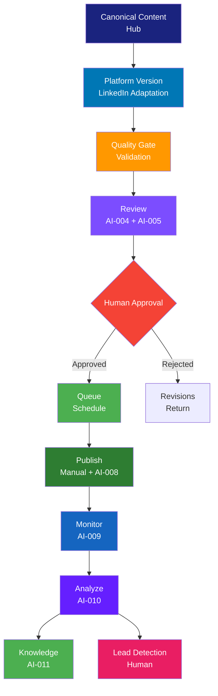

# لینکدین — LinkedIn Playbook

> **شناسه:** PLAT-002
> **وضعیت:** پیش‌نویس
> **نسخه:** 1.0.0-draft
> **به‌روزرسانی:** 2026-06-27
> **مسئول:** مدیر پلتفرم لینکدین
> **وابستگی:** [PLAT-000](../00-platform-playbook-standard.md), [ARCH-020](../../00-ARCHITECTURE/20-enterprise-multi-platform-strategy.md)
> **مخاطب:** human, agent, n8n, mcp

---

## Architectural Dependencies

### Why This Document Exists

لینکدین پلتفرم اصلی ارتباطات حرفه‌ای و B2B در SMOS است. بدون این سند:

- محتوای حرفه‌ای لینکدین بدون استاندارد و وابسته به افراد خواهد بود
- فرصت‌های B2B و Thought Leadership از دست می‌روند
- Agentها نمی‌دانند لحن حرفه‌ای در لینکدین چگونه باید باشد
- Employer Branding و جذب استعداد بدون استراتژی مشخص است

### Problems It Solves

1. **نبود SSOT برای لینکدین**: هر تیم برداشت متفاوتی از قواعد لینکدین دارد → PLAT-002 به عنوان تنها مرجع معتبر
2. **عدم یکپارچگی Thought Leadership**: محتوای فکری و تحلیلی بدون هویت برند واحد → استانداردسازی با [BRD-001](../../22-BRAND/10-brand-identity.md)
3. **نبود استراتژی تعامل حرفه‌ای**: کامنت‌گذاری و شبکه‌سازی بدون برنامه → Engagement Model با قواعد مشخص
4. **عدم بهره‌برداری B2B**: لینکدین به عنوان منبع Lead استفاده نمی‌شود → Conversion Architecture
5. **نبود هماهنگی Employer Branding**: محتوای استخدامی و فرهنگ سازمانی بدون استراتژی → Content Pillars

### Explicit Scope

این سند فقط تعریف می‌کند:

- هویت و مأموریت لینکدین در SMOS (برگرفته از [ARCH-020](../../00-ARCHITECTURE/20-enterprise-multi-platform-strategy.md))
- انواع محتوای قابل انتشار (برگرفته از [EDT-002](../../24-EDITORIAL/20-content-taxonomy.md))
- قواعد عملیاتی انتشار، نگارش، هشتگ و تعامل مختص لینکدین
- همکاری با Agentها و رابط‌های خودکارسازی
- KPIها و متریک‌های مختص لینکدین

### Explicit Non-Scope

- استراتژی چندپلتفرمی — [ARCH-020](../../00-ARCHITECTURE/20-enterprise-multi-platform-strategy.md)
- هویت برند و فلسفه بصری — [BRD-001](../../22-BRAND/10-brand-identity.md)
- انواع محتوا و CT-ID — [EDT-002](../../24-EDITORIAL/20-content-taxonomy.md)
- کد API یا Workflow طراحی — [AUT-\*](../../30-AUTOMATION/)
- چرخه حیات محتوا — [EDT-001](../../24-EDITORIAL/10-content-guidelines.md)
- قواعد Agent — [BRD-001 §۲۱](../../22-BRAND/10-brand-identity.md)

### Upstream Dependencies

| سند                                                                        | نوع وابستگی  | دلیل                         |
| -------------------------------------------------------------------------- | ------------ | ---------------------------- |
| [PLAT-000](../00-platform-playbook-standard.md)                            | derived-from | قالب ساختار ۳۴ بخشی          |
| [ARCH-020](../../00-ARCHITECTURE/20-enterprise-multi-platform-strategy.md) | depends-on   | نقش استراتژیک، طبقه‌بندی     |
| [CON-000](../../05-CONSTITUTION/00-constitution.md)                        | governs      | اصول یکپارچگی، کیفیت         |
| [BRD-001](../../22-BRAND/10-brand-identity.md)                             | depends-on   | هویت برند، صدا، لحن          |
| [EDT-001](../../24-EDITORIAL/10-content-guidelines.md)                     | depends-on   | چرخه حیات محتوا              |
| [EDT-002](../../24-EDITORIAL/20-content-taxonomy.md)                       | depends-on   | CT-IDها، طبقه‌بندی محتوا     |
| [ARCH-013](../../00-ARCHITECTURE/13-ai-operating-model.md)                 | depends-on   | Agentهای Writing, Engagement |
| [GOV-001](../../10-GOVERNANCE/01-documentation-standards.md)               | follows      | استاندارد نگارش              |
| [GOV-004](../../10-GOVERNANCE/04-cross-references.md)                      | follows      | نظام ارجاع متقابل            |

### Downstream Dependencies

| سند                            | نوع وابستگی | دلیل                                 |
| ------------------------------ | ----------- | ------------------------------------ |
| [AUT-\*](../../30-AUTOMATION/) | implements  | گردش کارهای انتشار، تعامل            |
| [AI-\*](../../40-AI-AGENTS/)   | implements  | Agentهای Writing, Review, Engagement |
| [PRM-\*](../../35-PROMPTS/)    | implements  | پرامپت‌های تولید محتوای لینکدین      |
| [MET-\*](../../60-METRICS/)    | measures    | KPIهای عملکرد لینکدین                |
| [HR-\*](../../80-TRAINING/)    | uses        | Employer Branding و جذب استعداد      |

### SSOT Ownership

| موضوع                          | SSOT                   |
| ------------------------------ | ---------------------- |
| LinkedIn-specific Rules        | **PLAT-002** (این سند) |
| LinkedIn Content Mapping       | **PLAT-002** (این سند) |
| LinkedIn Post Types            | **PLAT-002** (این سند) |
| LinkedIn Hashtag Strategy      | **PLAT-002** (این سند) |
| LinkedIn Engagement Rules      | **PLAT-002** (این سند) |
| LinkedIn Visual Implementation | **PLAT-002** (این سند) |
| Brand Visual Philosophy        | BRD-001                |
| Content Type Definitions       | EDT-002                |
| Multi-Platform Strategy        | ARCH-020               |
| Platform Playbook Structure    | PLAT-000               |

### Related ADRs

| ADR     | عنوان                             | ارتباط                      |
| ------- | --------------------------------- | --------------------------- |
| ADR-010 | معماری متا به عنوان الگوی عملیاتی | لایه Distribution (لینکدین) |
| ADR-013 | جداسازی Automation و Agent        | لینکدین توسط Automation     |
| ADR-015 | تأیید انسانی برای انتشار الزامی   | محتوای تحلیلی نیازمند تأیید |
| ADR-019 | حکمرانی ۱۰ لایه                   | لایه Platform               |

### Related Objects (from ARCH-011)

Platform (OBJ-010), Account (OBJ-019), Audience (OBJ-012), Persona (OBJ-011), Platform Version (OBJ-005), Content Variant (OBJ-006), Publication (OBJ-022), Metric (OBJ-017), Campaign (OBJ-001), Asset (OBJ-007), Caption (OBJ-008)

### Related AI Agents (from ARCH-013)

Orchestrator (000), Research (001), Planning (002), Writing (003), Review (004), Fact Check (005), Graphic (006), Video (007), Publishing (008), Monitoring (009), Analytics (010), Knowledge (011), Engagement (013), Scheduler (014)

---

## ۱. Executive Summary

PLAT-002 کتابچه عملیاتی لینکدین Xennic است. این سند از [PLAT-000](../00-platform-playbook-standard.md) (قالب مادر کتابچه‌های پلتفرم) و [ARCH-020](../../00-ARCHITECTURE/20-enterprise-multi-platform-strategy.md) (استراتژی چندپلتفرمی) مشتق شده و به عنوان **تنها مرجع معتبر (SSOT)** برای قواعد عملیاتی لینکدین عمل می‌کند.

لینکدین در SMOS نقش **Network (شبکه)** را دارد ([ARCH-020 §۶](../../00-ARCHITECTURE/20-enterprise-multi-platform-strategy.md#۶-platform-roles)) — ارتباطات حرفه‌ای و B2B. اولویت استراتژیک: **P1**.

PLAT-002 با رعایت اصل [PLAT-000-02](../00-platform-playbook-standard.md#اصول-plat-000) (محتوای تکراری ممنوع) هیچ معماری، برند یا طبقه‌بندی محتوایی را تکرار نمی‌کند و صرفاً تفسیر عملیاتی مختص لینکدین ارائه می‌دهد.

---

## ۲. Purpose

### اهداف PLAT-002

1. **تعریف نقش لینکدین** در اکوسیستم SMOS — برگرفته از [ARCH-020 §۶](../../00-ARCHITECTURE/20-enterprise-multi-platform-strategy.md#۶-platform-roles)
2. **نگاشت انواع محتوای متعارف** به قالب‌های لینکدین — برگرفته از [EDT-002](../../24-EDITORIAL/20-content-taxonomy.md)
3. **استانداردسازی Thought Leadership** — مشتق از [BRD-001](../../22-BRAND/10-brand-identity.md)
4. **استانداردسازی نگارش حرفه‌ای** — مشتق از [BRD-001 §§۱۰-۱۲](../../22-BRAND/10-brand-identity.md#۱۰-brand-voice)
5. **تعریف همکاری AI** — برگرفته از [ARCH-013](../../00-ARCHITECTURE/13-ai-operating-model.md)
6. **تعریف KPIهای اختصاصی** — برگرفته از [ARCH-020 §۲۱](../../00-ARCHITECTURE/20-enterprise-multi-platform-strategy.md#۲۱-enterprise-kpi-framework)

### اصول PLAT-002

| اصل         | توضیح                                                                                                                                              |
| ----------- | -------------------------------------------------------------------------------------------------------------------------------------------------- |
| **LINK-01** | هر محتوا در لینکدین از یک CT-ID معتبر ([EDT-002](../../24-EDITORIAL/20-content-taxonomy.md)) پیروی می‌کند                                          |
| **LINK-02** | لحن حرفه‌ای تابع ماتریس لحن [BRD-001 §۱۱](../../22-BRAND/10-brand-identity.md#۱۱-brand-tone-matrix) است                                            |
| **LINK-03** | لینکدین بستر Thought Leadership است — محتوا باید ارزش تحلیلی داشته باشد                                                                            |
| **LINK-04** | لینکدین کانال توزیع است نه هویت برند — [ARCH-020 §۳](../../00-ARCHITECTURE/20-enterprise-multi-platform-strategy.md#۳-enterprise-media-philosophy) |
| **LINK-05** | تعاملات لینکدین منبع اصلی Lead Generation و B2B است                                                                                                |

---

## ۳. Scope

### دامنه شمول

- Company Page رسمی Xennic در لینکدین
- پروفایل‌های کلیدی تیم (Employee Advocacy)
- انواع پست: Post, Article, Carousel (Document), Video, Poll, Newsletter, Event, Live
- فرایندهای انتشار، تأیید، بازبینی
- تعامل: کامنت، DM, Comment Strategy
- LinkedIn Groups (در صورت وجود)
- LinkedIn Ads (رابطه با AUT-\*)

### دامنه عدم شمول

- استراتژی کلی پلتفرم — [ARCH-020](../../00-ARCHITECTURE/20-enterprise-multi-platform-strategy.md)
- انواع محتوا — [EDT-002](../../24-EDITORIAL/20-content-taxonomy.md)
- هویت برند — [BRD-001](../../22-BRAND/10-brand-identity.md)
- بودجه تبلیغات پولی
- API پیاده‌سازی — [AUT-\*](../../30-AUTOMATION/)
- سایر پلتفرم‌ها

---

## ۴. Platform Identity

### هویت پلتفرم در SMOS

| فیلد                     | مقدار                                                                                                                                    |
| ------------------------ | ---------------------------------------------------------------------------------------------------------------------------------------- |
| **Platform ID**          | PLAT-002                                                                                                                                 |
| **Platform Name (FA)**   | لینکدین                                                                                                                                  |
| **Platform Name (EN)**   | LinkedIn                                                                                                                                 |
| **Owner Company**        | Microsoft Corporation                                                                                                                    |
| **Platform Category**    | Third-Party ([ARCH-020 §۵](../../00-ARCHITECTURE/20-enterprise-multi-platform-strategy.md#۵-platform-classification-framework))          |
| **Platform Role**        | Network (شبکه) — ارتباطات حرفه‌ای و B2B ([ARCH-020 §۶](../../00-ARCHITECTURE/20-enterprise-multi-platform-strategy.md#۶-platform-roles)) |
| **Platform Priority**    | P1 ([ARCH-020 §۱۲](../../00-ARCHITECTURE/20-enterprise-multi-platform-strategy.md#۱۲-platform-priority-matrix))                          |
| **Content Nature**       | Mixed (Text + Image)                                                                                                                     |
| **Communication Nature** | Network                                                                                                                                  |
| **Audience Type**        | Professional                                                                                                                             |
| **API Type**             | LinkedIn Marketing API + REST API                                                                                                        |
| **API Version**          | v2                                                                                                                                       |
| **Authentication**       | OAuth 2.0                                                                                                                                |
| **Rate Limits**          | 100 calls/day for UGC posts; 100,000 calls/day for ad accounts                                                                           |

### بلوک JSON

```json
{
  "platform_identity": {
    "id": "PLAT-002",
    "name_fa": "لینکدین",
    "name_en": "LinkedIn",
    "owner": "Microsoft Corporation",
    "category": "third_party",
    "role": "network",
    "priority": "P1",
    "content_nature": "mixed_text_image",
    "communication_nature": "network",
    "audience_type": "professional",
    "api": {
      "type": "Marketing API + REST API",
      "version": "v2",
      "auth": "OAuth 2.0",
      "rate_limits": "100 calls/day (UGC), 100K calls/day (ads)"
    }
  }
}
```

---

## ۵. Platform Overview

لینکدین یک پلتفرم شبکه‌سازی حرفه‌ای متعلق به Microsoft است که در SMOS نقش **Network (شبکه)** را ایفا می‌کند ([ARCH-020 §۶](../../00-ARCHITECTURE/20-enterprise-multi-platform-strategy.md#۶-platform-roles)). این پلتفرم بستر اصلی ارتباطات B2B، Thought Leadership و Employer Branding است.

### ویژگی‌های کلیدی

| ویژگی               | توضیح                                        |
| ------------------- | -------------------------------------------- |
| **ماهیت**           | متن‌محور حرفه‌ای (Professional Text-First)   |
| **مخاطب**           | حرفه‌ای، متخصص، مدیران، تصمیم‌گیرندگان       |
| **ارتباط**          | شبکه‌ای (Connection-based)                   |
| **تعامل**           | Like, Comment, Share, Repost, Article Read   |
| **مالکیت**          | Third-Party (Microsoft)                      |
| **دسترسی در ایران** | نیاز به VPN                                  |
| **نوع API**         | Marketing API — محدودیت شدید در اتوماسیون    |
| **SEO**             | قوی — محتوای لینکدین در Google ایندکس می‌شود |
| **Lead Generation** | قوی — پلتفرم اصلی B2B                        |

---

## ۶. Strategic Role

نقش استراتژیک لینکدین در SMOS از [ARCH-020 §۶](../../00-ARCHITECTURE/20-enterprise-multi-platform-strategy.md#۶-platform-roles) مشتق شده است:

### نقش اصلی: Network (شبکه)

ایجاد و گسترش شبکه ارتباطات حرفه‌ای، B2B و Thought Leadership.

### نقش‌های عملیاتی

| نقش عملیاتی                | توضیح                                            |
| -------------------------- | ------------------------------------------------ |
| **Thought Leadership**     | تولید و توزیع محتوای تحلیلی و تخصصی              |
| **B2B Trust Building**     | ایجاد اعتماد با مخاطبان حرفه‌ای و تصمیم‌گیرندگان |
| **Lead Generation**        | تولید سرنخ‌های تجاری B2B                         |
| **Employer Branding**      | جذب استعداد و نمایش فرهنگ سازمانی                |
| **Knowledge Distribution** | توزیع محتوای دانشی و تحقیقاتی                    |
| **Corporate Branding**     | حضور برند سازمانی در فضای حرفه‌ای                |

### موقعیت در سفر مخاطب ([ARCH-020 §۷](../../00-ARCHITECTURE/20-enterprise-multi-platform-strategy.md#۷-audience-journey-architecture))

| مرحله سفر          | نقش لینکدین                     |
| ------------------ | ------------------------------- |
| Awareness (آگاهی)  | کمکی — در کنار Instagram        |
| Trust (اعتماد)     | **اصلی** — ایجاد اعتماد حرفه‌ای |
| Conversion (تبدیل) | کمکی — CTA به Website           |
| Advocacy (توصیه)   | کمکی — اشتراک محتوای حرفه‌ای    |

---

## ۷. Audience Definition

### مخاطبان لینکدین Xennic

تعریف مخاطبان بر اساس [ARCH-020 §۷](../../00-ARCHITECTURE/20-enterprise-multi-platform-strategy.md#۷-audience-journey-architecture).

| فیلد                      | مقدار                                                                |
| ------------------------- | -------------------------------------------------------------------- |
| **Primary Audience**      | متخصصان فناوری، مدیران، کارآفرینان فارسی‌زبان                        |
| **Secondary Audience**    | متخصصان منابع انسانی، سرمایه‌گذاران، روزنامه‌نگاران حوزه فناوری      |
| **Audience Demographics** | سن: ۲۵-۵۵، جنسیت: مخلوط، مکان: ایران (با VPN) + بین‌المللی           |
| **Audience Behavior**     | مصرف محتوای تحلیلی، شبکه‌سازی حرفه‌ای، جستجوی فرصت‌های شغلی و تجاری  |
| **Peak Hours**            | ۰۸:۰۰-۱۰:۰۰ (صبح), ۱۲:۰۰-۱۴:۰۰ (ظهر), ۲۰:۰۰-۲۲:۰۰ (شب) — روزهای کاری |
| **Content Preferences**   | مقالات تحلیلی، بینش صنعت، مطالعه موردی، محتوای رهبری فکری            |
| **Personas**              | مدیر فناوری، کارآفرین، متخصص حوزه، سرمایه‌گذار                       |

### پرسوناهای هدف (ارجاع به ARCH-011 OBJ-011)

| پرسونا                            | سن    | نیاز محتوایی                     | رفتار در لینکدین         |
| --------------------------------- | ----- | -------------------------------- | ------------------------ |
| **مدیر فناوری (CTO/IT Director)** | ۳۵-۵۵ | تحلیل صنعت، روندهای فناوری       | مصرف مقاله، تعامل محدود  |
| **کارآفرین و بنیان‌گذار**         | ۲۸-۴۵ | مطالعه موردی، درس‌آموخته         | شبکه‌سازی، کامنت، اشتراک |
| **متخصص حوزه (AI/ML/Marketing)**  | ۲۵-۴۰ | بینش تخصصی، آموزش حرفه‌ای        | تولید محتوا، بحث تخصصی   |
| **مدیر منابع انسانی**             | ۳۰-۵۰ | Employer Branding, فرهنگ سازمانی | جستجوی استعداد           |
| **سرمایه‌گذار و مشاور**           | ۴۰-۶۵ | تحلیل بازار, اعتماد سازمانی      | شبکه‌سازی سطح بالا       |

---

## ۸. Platform Mission

مأموریت لینکدین در SMOS:

**"ایجاد مرجعیت فکری و شبکه حرفه‌ای Xennic در فضای B2B از طریق محتوای تحلیلی، تخصصی و رهبری فکری."**

### ابعاد مأموریت

| بعد             | توضیح                                                      |
| --------------- | ---------------------------------------------------------- |
| **مرجعیت**      | تثبیت Xennic به عنوان مرجع فکری در حوزه رسانه هوشمند و AI  |
| **شبکه‌سازی**   | ایجاد و گسترش شبکه ارتباطات حرفه‌ای و B2B                  |
| **اعتماد**      | ایجاد اعتماد در مخاطبان حرفه‌ای برای همکاری و سرمایه‌گذاری |
| **جذب استعداد** | جذب نیروهای متخصص از طریق Employer Branding                |

---

## ۹. Platform Objectives

اهداف لینکدین Xennic — برگرفته از [ARCH-020 §۲۱](../../00-ARCHITECTURE/20-enterprise-multi-platform-strategy.md#۲۱-enterprise-kpi-framework).

| هدف       | توضیح                        | KPI مرتبط       | زمان    | اولویت |
| --------- | ---------------------------- | --------------- | ------- | ------ |
| OBJ-LI-01 | افزایش Professional Reach    | KPI-PLAT-002-01 | Q3 1405 | P1     |
| OBJ-LI-02 | افزایش Engagement Rate       | KPI-PLAT-002-03 | Q3 1405 | P1     |
| OBJ-LI-03 | رشد Followers Company Page   | KPI-PLAT-002-04 | Q4 1405 | P1     |
| OBJ-LI-04 | افزایش Website Clicks        | KPI-PLAT-002-08 | Q4 1405 | P2     |
| OBJ-LI-05 | Lead Generation از محتوا     | KPI-PLAT-002-09 | Q1 1406 | P1     |
| OBJ-LI-06 | استخراج دانش از تعاملات      | KPI-PLAT-002-11 | Q1 1406 | P2     |
| OBJ-LI-07 | افزایش Connection Growth تیم | KPI-PLAT-002-05 | Q4 1405 | P2     |

---

## ۱۰. Platform KPIs

شاخص‌های کلیدی عملکرد لینکدین — از [ARCH-020 §۲۱](../../00-ARCHITECTURE/20-enterprise-multi-platform-strategy.md#۲۱-enterprise-kpi-framework) مشتق شده است.

| KPI             | توضیح                                            | هدف         | فرکانس اندازه‌گیری | مسئول               |
| --------------- | ------------------------------------------------ | ----------- | ------------------ | ------------------- |
| KPI-PLAT-002-01 | Professional Reach — Impression                  | +۱۵٪ ماهانه | روزانه             | AI-009 (Monitoring) |
| KPI-PLAT-002-02 | Impressions — تعداد نمایش پست‌ها                 | +۲۰٪ ماهانه | روزانه             | AI-009              |
| KPI-PLAT-002-03 | Engagement Rate — (تعاملات / Impressions) × ۱۰۰  | > ۲٪        | هفتگی              | AI-010 (Analytics)  |
| KPI-PLAT-002-04 | Follower Growth — رشد دنبال‌کنندگان Company Page | +۳٪ ماهانه  | هفتگی              | AI-010              |
| KPI-PLAT-002-05 | Connection Growth — رشد ارتباطات تیم             | +۵٪ ماهانه  | هفتگی              | AI-010              |
| KPI-PLAT-002-06 | Article Reads — تعداد مطالعه مقالات              | +۱۰٪ ماهانه | هفتگی              | AI-010              |
| KPI-PLAT-002-07 | Post Engagement — Like, Comment, Share           | +۱۵٪ ماهانه | روزانه             | AI-009              |
| KPI-PLAT-002-08 | Website Clicks — کلیک از لینک در پست             | +۱۰٪ ماهانه | هفتگی              | AI-010              |
| KPI-PLAT-002-09 | Lead Generation — تعداد Lead از لینکدین          | > ۵ ماهانه  | ماهانه             | Human + AI-010      |
| KPI-PLAT-002-10 | Content Score — امتیاز کیفیت محتوای تحلیلی       | > ۸۵٪       | هفتگی              | AI-004 (Review)     |
| KPI-PLAT-002-11 | Knowledge Return — Insight استخراج‌شده           | > ۳ هفتگی   | هفتگی              | AI-011 (Knowledge)  |
| KPI-PLAT-002-12 | Recruitment Impact — تعداد متقاضی از لینکدین     | > ۱۰ ماهانه | ماهانه             | Human (HR)          |

### بلوک JSON

```json
{
  "platform_kpis": [
    {
      "id": "KPI-PLAT-002-01",
      "name": "Professional Reach",
      "description": "تعداد حساب‌های حرفه‌ای دیده‌شده",
      "target": "+15% monthly",
      "unit": "count",
      "frequency": "daily",
      "owner": "AI-009"
    },
    {
      "id": "KPI-PLAT-002-03",
      "name": "Engagement Rate",
      "description": "نرخ تعامل (تعاملات / Impressions × 100)",
      "target": "> 2%",
      "unit": "percentage",
      "frequency": "weekly",
      "owner": "AI-010"
    },
    {
      "id": "KPI-PLAT-002-10",
      "name": "Content Score",
      "description": "امتیاز کیفیت محتوای تحلیلی و تخصصی",
      "target": "> 85%",
      "unit": "percentage",
      "frequency": "weekly",
      "owner": "AI-004"
    }
  ]
}
```

---

## ۱۱. Platform Constraints

محدودیت‌های لینکدین — شامل محدودیت‌های فنی، محتوایی، قانونی و تجاری.

### Technical

| محدودیت                  | توضیح                                  | تأثیر                     | کاهش اثر                        |
| ------------------------ | -------------------------------------- | ------------------------- | ------------------------------- |
| **Post Character Limit** | حداکثر ۳,۰۰۰ کاراکتر                   | محدودیت در محتوای طولانی  | استفاده از LinkedIn Articles    |
| **Article Length**       | عدم محدودیت مشخص                       | مناسب برای محتوای بلند    | انتشار کامل مقاله در لینکدین    |
| **Image Ratio**          | ۱:۱, ۱.۹۱:۱, ۴:۳                       | نیاز به تطابق ابعاد       | Templates استاندارد             |
| **Video Length**         | حداکثر ۱۰ دقیقه (پست), ۳ دقیقه (Story) | محدودیت محتوای بلند       | محتوای بلند → YouTube + Preview |
| **Video Size**           | حداکثر ۵GB                             | محدودیت کیفیت             | فشرده‌سازی استاندارد            |
| **Document Upload**      | PDF, DOC, PPT — حداکثر ۱۰۰MB           | محدودیت حجم               | بهینه‌سازی اسناد                |
| **Carousel (Document)**  | حداکثر ۳۰۰ اسلاید                      | مناسب برای محتوای آموزشی  | —                               |
| **API Rate Limit (UGC)** | ۱۰۰ درخواست/روز                        | محدودیت شدید اتوماسیون    | حداقل اتوماسیون، حداکثر دستی    |
| **API Rate Limit (Ads)** | ۱۰۰,۰۰۰ درخواست/روز                    | محدودیت کمتر برای تبلیغات | استفاده از Ads API              |
| **Link in Post**         | **مجاز**                               | لینک در متن پست مجاز است  | CTA مستقیم                      |

### Content

| محدودیت                  | توضیح                                 |
| ------------------------ | ------------------------------------- |
| **Professional Context** | محتوای غیرحرفه‌ای و شخصی نامناسب      |
| **Prohibited Content**   | محتوای تبعیض‌آمیز، خشونت، محتوای جنسی |
| **Political Content**    | محدودیت محتوای سیاسی                  |
| **Misinformation**       | الگوریتم تشخیص اخبار جعلی             |
| **Repetitive Content**   | محتوای تکراری (اسپم) محدودیت دارد     |

### Legal

| محدودیت                | توضیح                                 |
| ---------------------- | ------------------------------------- |
| **GDPR**               | GDPR, CCPA — جمع‌آوری داده محدود      |
| **Iran Accessibility** | لینکدین در ایران فیلتر است — نیاز VPN |
| **Microsoft Policies** | تابع خط‌مشی Microsoft                 |
| **Data Scraping**      | اسکرپینگ داده ممنوع                   |

### Business

| محدودیت                | توضیح                          |
| ---------------------- | ------------------------------ |
| **API Restriction**    | محدودیت شدید در اتوماسیون UGC  |
| **Algorithm**          | دیده‌شدن وابسته به الگوریتم    |
| **Ad Cost**            | LinkedIn Ads هزینه بالایی دارد |
| **Content Saturation** | رقابت بالای محتوا در فید       |

### بلوک JSON

```json
{
  "platform_constraints": [
    {
      "type": "technical",
      "description": "UGC API limited to 100 calls/day",
      "impact": "Automated publishing severely restricted",
      "mitigation": "Manual publishing for organic content; API for ads only"
    },
    {
      "type": "technical",
      "description": "Post character limit: 3,000 characters",
      "impact": "Long-form analysis requires LinkedIn Articles",
      "mitigation": "Use LinkedIn Articles for content > 3,000 chars"
    },
    {
      "type": "legal",
      "description": "LinkedIn banned in Iran — requires VPN",
      "impact": "Limited organic reach within Iran",
      "mitigation": "Focus on international Persian-speaking professionals"
    },
    {
      "type": "business",
      "description": "API automation restrictions",
      "impact": "Cannot automate comment replies or DMs",
      "mitigation": "Human-driven engagement with AI-assisted drafting"
    }
  ]
}
```

---

## ۱۲. Content Types

این بخش فقط CT-IDهای قابل انتشار در لینکدین را فهرست می‌کند. تعریف کامل هر CT-ID در [EDT-002 §§۸-۱۸](../../24-EDITORIAL/20-content-taxonomy.md) موجود است.

### CT-IDهای سازگار با لینکدین

بر اساس [EDT-002 §۲۴](../../24-EDITORIAL/20-content-taxonomy.md#۲۴-platform-independence) و فیلد `compatible_platforms` هر CT-ID:

| CT-ID  | نام                    | قالب لینکدین                  | محدودیت      |
| ------ | ---------------------- | ----------------------------- | ------------ |
| CT-001 | Educational Article    | Article, Post (خلاصه)         | —            |
| CT-003 | Infographic            | Document (PDF), Post (Image)  | —            |
| CT-004 | Educational Short      | Post, Document                | —            |
| CT-005 | Educational Series     | Article Series                | انتشار هفتگی |
| CT-006 | Technical Analysis     | Article, Post (خلاصه)         | —            |
| CT-007 | Research Report        | Article, Document (PDF)       | —            |
| CT-008 | Whitepaper             | Document (PDF)                | —            |
| CT-009 | Industry Insight       | Post                          | —            |
| CT-010 | Opinion Piece          | Post, Article                 | تأیید مدیریت |
| CT-011 | Product Introduction   | Post, Article                 | —            |
| CT-012 | Case Study             | Article, Document (PDF), Post | —            |
| CT-013 | Promotional Campaign   | Post, Document                | —            |
| CT-014 | Webinar/Live Promotion | Post, Event                   | —            |
| CT-015 | Testimonial            | Post                          | مجوز انتشار  |
| CT-016 | Discussion Starter     | Post (Poll/Question)          | —            |
| CT-017 | Poll/Survey            | Post (Poll)                   | —            |
| CT-019 | UGC                    | Repost, Post                  | مجوز انتشار  |
| CT-020 | CTA                    | Post, Article                 | —            |
| CT-022 | Offer/Discount         | Post                          | محدود (B2B)  |
| CT-024 | Company Culture        | Post, Article, Video          | —            |
| CT-025 | Transparency Report    | Article, Document             | —            |
| CT-029 | Event Announcement     | Post, Event                   | —            |
| CT-030 | Live Coverage          | LinkedIn Live                 | نیاز تأیید   |
| CT-031 | Event Recap            | Post, Article, Video          | —            |
| CT-036 | Crisis Statement       | Post (pin), Article           | فقط انسان    |
| CT-037 | Crisis Update          | Post                          | فقط انسان    |
| CT-038 | Apology/Correction     | Post                          | فقط انسان    |

### CT-IDهای غیرمجاز یا محدود در لینکدین

| CT-ID                      | دلیل عدم پشتیبانی                     |
| -------------------------- | ------------------------------------- |
| CT-002 (Educational Video) | محدودیت طول ویدئو — مناسب YouTube     |
| CT-018 (Community Update)  | LinkedIn Group محدودیت دارد           |
| CT-021 (Landing Page)      | فقط وب‌سایت                           |
| CT-023 (Behind the Scenes) | محتوای غیررسمی — نامناسب برای لینکدین |
| CT-026 (Quiz/Assessment)   | بدون ابزار Quiz بومی                  |
| CT-027 (Challenge/Contest) | ماهیت غیرحرفه‌ای                      |
| CT-028 (Interactive Tool)  | فقط وب‌سایت                           |
| CT-032~035 (Knowledge)     | داخلی                                 |
| CT-039~042 (Internal)      | داخلی                                 |

---

## ۱۳. Content Strategy

### Content Pillars

برگرفته از [BRD-001 §۵](../../22-BRAND/10-brand-identity.md#۵-brand-dna) (DNA برند: نور × نیرو × یکتا) و [ARCH-020 §۱۳](../../00-ARCHITECTURE/20-enterprise-multi-platform-strategy.md#۱۳-content-to-platform-mapping).

#### Pillar 1: Thought Leadership (نور)

| فیلد                     | مقدار                                              |
| ------------------------ | -------------------------------------------------- |
| **Purpose**              | تثبیت مرجعیت فکری Xennic در حوزه رسانه هوشمند و AI |
| **Audience**             | مدیران فناوری، متخصصان حوزه                        |
| **Primary CT-IDs**       | CT-006, CT-007, CT-009, CT-010                     |
| **Business Goal**        | Authority, Trust                                   |
| **Knowledge Goal**       | Analysis → Synthesis                               |
| **Brand Goal**           | نور (روشن‌گری) — ارائه تحلیل عمیق و آگاهی‌بخش      |
| **Priority**             | P1                                                 |
| **Publishing Frequency** | ۲-۳ بار در هفته                                    |

#### Pillar 2: B2B Authority (نیرو)

| فیلد                     | مقدار                                             |
| ------------------------ | ------------------------------------------------- |
| **Purpose**              | نمایش توانمندی‌ها، موفقیت‌ها و قابلیت‌های سازمانی |
| **Audience**             | تصمیم‌گیرندگان B2B، سرمایه‌گذاران                 |
| **Primary CT-IDs**       | CT-011, CT-012, CT-015, CT-025                    |
| **Business Goal**        | Lead Generation, Conversion                       |
| **Knowledge Goal**       | Decision → Action                                 |
| **Brand Goal**           | نیرو (تأثیرگذاری) — نمایش قدرت و نتیجه‌بخشی       |
| **Priority**             | P1                                                |
| **Publishing Frequency** | ۲ بار در هفته                                     |

#### Pillar 3: Knowledge Distribution (نور × نیرو)

| فیلد                     | مقدار                                            |
| ------------------------ | ------------------------------------------------ |
| **Purpose**              | توزیع دانش سازمانی در قالب محتوای آموزشی حرفه‌ای |
| **Audience**             | متخصصان حوزه، مدیران فناوری                      |
| **Primary CT-IDs**       | CT-001, CT-003, CT-004, CT-005                   |
| **Business Goal**        | Brand Awareness, Authority                       |
| **Knowledge Goal**       | Awareness → Understanding                        |
| **Brand Goal**           | نور + نیرو — آموزش حرفه‌ای همراه با اعتبار       |
| **Priority**             | P1                                               |
| **Publishing Frequency** | ۲-۳ بار در هفته                                  |

#### Pillar 4: Corporate Culture (یکتا)

| فیلد                     | مقدار                                            |
| ------------------------ | ------------------------------------------------ |
| **Purpose**              | نمایش فرهنگ سازمانی، ارزش‌ها و Employer Branding |
| **Audience**             | متقاضیان کار، متخصصان منابع انسانی               |
| **Primary CT-IDs**       | CT-024, CT-019, CT-014                           |
| **Business Goal**        | Recruitment, Brand Awareness                     |
| **Knowledge Goal**       | Connection → Trust                               |
| **Brand Goal**           | یکتا (منحصربه‌فردی) — اصالت و انسان‌محوری        |
| **Priority**             | P2                                               |
| **Publishing Frequency** | ۱ بار در هفته                                    |

### Content Mix

| دسته                       | درصد | توضیح                       |
| -------------------------- | ---- | --------------------------- |
| **Thought Leadership**     | ۴۰٪  | تحلیل، بینش صنعت، دیدگاه    |
| **B2B Authority**          | ۲۵٪  | محصول، مطالعه موردی، شفافیت |
| **Knowledge Distribution** | ۲۵٪  | آموزش حرفه‌ای، اینفوگرافیک  |
| **Corporate Culture**      | ۱۰٪  | فرهنگ سازمانی، استخدام      |

### Content Frequency

| نوع پست               | تعداد در هفته      | بهترین زمان                            |
| --------------------- | ------------------ | -------------------------------------- |
| **Post**              | ۷-۱۰               | ۰۸:۰۰-۱۰:۰۰, ۱۲:۰۰-۱۴:۰۰ شنبه-چهارشنبه |
| **Article**           | ۱-۲                | سه‌شنبه-چهارشنبه صبح                   |
| **Document/Carousel** | ۱-۲                | یکشنبه-دوشنبه                          |
| **Total**             | ۹-۱۴ محتوا در هفته | روزهای کاری                            |

### Content Sources

| منبع                            | درصد | مسئول                                      |
| ------------------------------- | ---- | ------------------------------------------ |
| **AI Generated + Human Review** | ۶۰٪  | AI-003 (Writing) + AI-004 (Review) + Human |
| **Human Written**               | ۳۰٪  | Content Team (تحلیل‌های استراتژیک)         |
| **Curated / Repurposed**        | ۱۰٪  | از Hub به لینکدین                          |

---

## ۱۴. Content Mapping

نگاشت CT-IDها به قالب‌های لینکدین — برگرفته از [EDT-002 §۲۴](../../24-EDITORIAL/20-content-taxonomy.md#۲۴-platform-independence).

| CT-ID  | فرمت متعارف          | نسخه لینکدین                              | تغییرات لازم                          | مسئول تبدیل     | اولویت |
| ------ | -------------------- | ----------------------------------------- | ------------------------------------- | --------------- | ------ |
| CT-001 | Educational Article  | LinkedIn Article or Post (۸۰۰-۱۵۰۰ chars) | خلاصه‌سازی + CTA                      | AI-003          | P1     |
| CT-003 | Infographic          | Document (PDF) or Post (Image)            | تطابق ابعاد ۱:۱ یا ۱.۹۱:۱             | AI-006          | P1     |
| CT-004 | Educational Short    | Post (۳۰۰-۸۰۰ chars)                      | تبدیل به متن حرفه‌ای                  | AI-003          | P1     |
| CT-005 | Educational Series   | Article Series (هفتگی)                    | برنامه‌ریزی ۳-۱۰ قسمتی                | AI-003 + AI-002 | P1     |
| CT-006 | Technical Analysis   | LinkedIn Article (full) + Post (summary)  | انتشار کامل در Article + تیزر در Post | AI-001 + AI-003 | P1     |
| CT-007 | Research Report      | Article + Document (PDF)                  | خلاصه مقاله + PDF کامل                | AI-001 + AI-003 | P1     |
| CT-008 | Whitepaper           | Document (PDF) + Post                     | PDF مستقیم                            | AI-001          | P2     |
| CT-009 | Industry Insight     | Post                                      | متن کوتاه حرفه‌ای                     | AI-003          | P1     |
| CT-010 | Opinion Piece        | Post or Article                           | لحن رسمی + تحلیلی                     | AI-003 + Human  | P1     |
| CT-011 | Product Introduction | Post + Article                            | توضیح حرفه‌ای                         | AI-003          | P1     |
| CT-012 | Case Study           | Article or Document (PDF) + Post          | کامل در Article                       | AI-001 + AI-003 | P1     |
| CT-013 | Promotional Campaign | Post + Document                           | محدود (B2B مناسب)                     | AI-003          | P2     |
| CT-014 | Webinar/Live         | Post + Event                              | CTA به ثبت‌نام                        | AI-003          | P2     |
| CT-015 | Testimonial          | Post (Quote + Image)                      | طراحی Quote Card                      | AI-006          | P2     |
| CT-016 | Discussion Starter   | Post with Question                        | سؤال حرفه‌ای                          | AI-003          | P2     |
| CT-017 | Poll/Survey          | Native Poll                               | سؤال تحلیلی                           | AI-003          | P2     |
| CT-019 | UGC                  | Repost with Commentary                    | مجوز + تحلیل                          | Human           | P2     |
| CT-020 | CTA                  | Post + Article (End)                      | لینک مستقیم مجاز                      | AI-003          | P1     |
| CT-022 | Offer/Discount       | Post                                      | محدود به B2B                          | AI-003          | P2     |
| CT-024 | Company Culture      | Post, Video, Article                      | روایت ارزش‌ها                         | AI-003 + Human  | P2     |
| CT-025 | Transparency Report  | Article + Document                        | کامل در Article                       | AI-001 + AI-003 | P2     |
| CT-029 | Event Announcement   | Post + Event                              | تاریخ + لینک                          | AI-003          | P2     |
| CT-030 | Live Coverage        | LinkedIn Live                             | نیاز تأیید قبلی                       | Human           | P1     |
| CT-031 | Event Recap          | Post + Article                            | خلاصه + تحلیل                         | AI-003          | P2     |
| CT-036 | Crisis Statement     | Post (pinned)                             | فقط انسان                             | Human           | P0     |
| CT-037 | Crisis Update        | Post                                      | فقط انسان                             | Human           | P0     |
| CT-038 | Apology/Correction   | Post                                      | فقط انسان                             | Human           | P0     |

---

## ۱۵. Publishing Model

### Publishing Workflow

برگرفته از [EDT-001 §۶](../../24-EDITORIAL/10-content-guidelines.md) (چرخه حیات محتوا) و [ARCH-020 §۹](../../00-ARCHITECTURE/20-enterprise-multi-platform-strategy.md#۹-canonical-publishing-strategy).



### Approval Chain

| سطح تأیید                 | نقش             | شرایط                                         |
| ------------------------- | --------------- | --------------------------------------------- |
| **L1 — AI Review**        | AI-004 + AI-005 | همه محتواها — Fact Check + Brand Review       |
| **L2 — Human Editorial**  | Content Manager | CT-006, CT-007, CT-010, CT-012                |
| **L3 — Human Management** | Media Director  | CT-008, CT-025, CT-036~038                    |
| **Auto-approve**          | —               | CT-004, CT-009, CT-016, CT-017 (اعتماد > ۹۰٪) |

### Scheduling Rules

| نوع محتوا                  | بهترین روز      | بهترین زمان      | حداقل فاصله |
| -------------------------- | --------------- | ---------------- | ----------- |
| **Thought Leadership**     | شنبه-سه‌شنبه    | ۰۸:۰۰-۱۰:۰۰      | ۴ ساعت      |
| **B2B Authority**          | یکشنبه-چهارشنبه | ۱۲:۰۰-۱۴:۰۰      | ۶ ساعت      |
| **Knowledge Distribution** | شنبه-دوشنبه     | ۰۸:۰۰-۱۰:۰۰      | ۳ ساعت      |
| **Corporate Culture**      | پنجشنبه         | ۱۰:۰۰-۱۲:۰۰      | —           |
| **Weekend**                | جمعه            | **انتشار ممنوع** | —           |

### Auto-publish Rules

| شرط                         | مجاز بودن   | توضیح                           |
| --------------------------- | ----------- | ------------------------------- |
| CT-004 (Educational Short)  | **مشروط**   | اعتماد AI > ۹۰٪ + Editor Review |
| CT-009 (Industry Insight)   | **مشروط**   | اعتماد AI > ۹۰٪ + Editor Review |
| CT-016 (Discussion Starter) | **مجاز**    | بدون تأیید انسانی               |
| CT-017 (Poll/Survey)        | **مجاز**    | بدون تأیید انسانی               |
| CT-020 (CTA)                | **غیرمجاز** | نیاز تأیید انسانی               |
| CT-006/007/010              | **غیرمجاز** | نیاز Fact Check + Editorial     |
| CT-036~038 (Crisis)         | **غیرمجاز** | فقط انسان                       |

---

## ۱۶. Publishing Rules

### قواعد عمومی

| قاعده         | توضیح                                                                                                                                                |
| ------------- | ---------------------------------------------------------------------------------------------------------------------------------------------------- |
| **PUB-LI-01** | هر پست قبل از انتشار باید گیت‌های کیفیت PLAT-000 را پاس کند                                                                                          |
| **PUB-LI-02** | محتوای بحرانی (CT-036~038) فقط توسط انسان منتشر شود                                                                                                  |
| **PUB-LI-03** | لینک در پست مجاز است — لینک به محتوای Hub (Website)                                                                                                  |
| **PUB-LI-04** | حداکثر ۲ پست در روز — حداقل ۴ ساعت فاصله                                                                                                             |
| **PUB-LI-05** | انتشار در روز جمعه (تعطیل ایران) ممنوع                                                                                                               |
| **PUB-LI-06** | مقالات (Articles) حتماً کامل در لینکدین نوشته شوند — نه فقط Preview                                                                                  |
| **PUB-LI-07** | محتوای تکراری از پلتفرم‌های دیگر ممنوع — [ARCH-020 §۱۱ XP-01](../../00-ARCHITECTURE/20-enterprise-multi-platform-strategy.md#۱۱-cross-posting-rules) |
| **PUB-LI-08** | Employee Advocacy — کارکنان می‌توانند محتوای Company Page را در پروفایل خود به اشتراک بگذارند                                                        |

### بومی‌سازی محتوا

بر اساس [ARCH-020 §۹](../../00-ARCHITECTURE/20-enterprise-multi-platform-strategy.md#۹-canonical-publishing-strategy):

| تغییر                 | توضیح                                             |
| --------------------- | ------------------------------------------------- |
| **منبع**              | محتوای متعارف از Hub (Website)                    |
| **بومی‌سازی**         | تبدیل به لحن حرفه‌ای و قالب لینکدین               |
| **Article**           | مقاله کامل در LinkedIn Articles — نه فقط خلاصه    |
| **تغییر محتوای اصلی** | **ممنوع** — Platform Version فقط بومی‌سازی می‌کند |
| **CTA**               | لینک مستقیم به Website مجاز است                   |

---

## ۱۷. Post Types

### اشیاء لینکدین (LinkedIn Objects)

بر اساس [ARCH-011 OBJ-004](../../00-ARCHITECTURE/11-object-model.md) (Content Piece) و OBJ-005 (Platform Version).

#### Post

| فیلد               | مقدار                                                                                                              |
| ------------------ | ------------------------------------------------------------------------------------------------------------------ |
| **Mission**        | انتشار محتوای کوتاه حرفه‌ای در Feed                                                                                |
| **Lifecycle**      | Normal (۱-۳ روز)                                                                                                   |
| **Owner**          | AI-003 (Writing) + AI-004 (Review)                                                                                 |
| **Metadata**       | CT-ID, Caption, Hashtags, Link (اختیاری), Image/Video                                                              |
| **Quality Gate**   | Fact Check + Brand Review (AI-004+AI-005)                                                                          |
| **Length**         | ۱۵۰-۳,۰۰۰ کاراکتر                                                                                                  |
| **Related CT-IDs** | CT-004, CT-009, CT-010, CT-011, CT-015, CT-016, CT-017, CT-019, CT-020, CT-022, CT-024, CT-029, CT-031, CT-036~038 |

#### Article

| فیلد               | مقدار                                                          |
| ------------------ | -------------------------------------------------------------- |
| **Mission**        | انتشار محتوای بلند تحلیلی و تخصصی                              |
| **Lifecycle**      | Slow (۳-۱۰ روز)                                                |
| **Owner**          | AI-001 (Research) + AI-003 (Writing) + AI-004 + AI-005         |
| **Metadata**       | CT-ID, Title, Banner Image, SEO Description, Hashtags          |
| **Quality Gate**   | Fact Check + Editorial Review + Brand Review                   |
| **Length**         | ۸۰۰-۵,۰۰۰+ کلمه                                                |
| **Related CT-IDs** | CT-001, CT-005, CT-006, CT-007, CT-010, CT-012, CT-025, CT-031 |

#### Document / Carousel

| فیلد               | مقدار                                  |
| ------------------ | -------------------------------------- |
| **Mission**        | ارائه اسناد PDF و PPT در قالب Carousel |
| **Lifecycle**      | Normal (۳-۷ روز)                       |
| **Owner**          | AI-006 (Graphic) + AI-003 (Content)    |
| **Metadata**       | CT-ID, Title, Page Count, Hashtags     |
| **Quality Gate**   | Format Validation + Brand Review       |
| **Max Pages**      | ۳۰۰                                    |
| **Related CT-IDs** | CT-003, CT-007, CT-008, CT-012, CT-025 |

#### Video

| فیلد               | مقدار                               |
| ------------------ | ----------------------------------- |
| **Mission**        | محتوای ویدئویی حرفه‌ای              |
| **Lifecycle**      | Slow (۱-۲ هفته)                     |
| **Owner**          | AI-007 (Video) + AI-003 (Script)    |
| **Metadata**       | CT-ID, Caption, Thumbnail, Hashtags |
| **Quality Gate**   | Brand Review + Format Check         |
| **Duration**       | ۳۰ ثانیه - ۱۰ دقیقه                 |
| **Related CT-IDs** | CT-024, CT-030, CT-031              |

#### Poll

| فیلد               | مقدار                                     |
| ------------------ | ----------------------------------------- |
| **Mission**        | نظرسنجی حرفه‌ای برای تعامل و جمع‌آوری نظر |
| **Lifecycle**      | Rapid (۳-۷ روز)                           |
| **Owner**          | AI-003 (Writing) + AI-013 (Engagement)    |
| **Metadata**       | CT-ID, Question, Options (۲-۴), Duration  |
| **Quality Gate**   | Brand Review                              |
| **Duration**       | ۱-۱۴ روز                                  |
| **Related CT-IDs** | CT-016, CT-017                            |

#### Newsletter

| فیلد               | مقدار                                      |
| ------------------ | ------------------------------------------ |
| **Mission**        | انتشار دوره‌ای محتوای حرفه‌ای برای مشترکان |
| **Lifecycle**      | Weekly / Bi-weekly                         |
| **Owner**          | AI-003 (Writing) + Human (Editor)          |
| **Metadata**       | CT-ID, Title, Issue #, Description         |
| **Quality Gate**   | Editorial Review                           |
| **Related CT-IDs** | CT-001, CT-005, CT-009                     |

#### Event

| فیلد               | مقدار                                    |
| ------------------ | ---------------------------------------- |
| **Mission**        | اعلام و مدیریت رویدادهای حرفه‌ای         |
| **Lifecycle**      | Normal (۱-۴ هفته قبل)                    |
| **Owner**          | Human (Event Manager) + AI-003           |
| **Metadata**       | CT-ID, Title, Date, Time, Link, Speakers |
| **Quality Gate**   | Brand Review                             |
| **Related CT-IDs** | CT-014, CT-029                           |

#### LinkedIn Live

| فیلد               | مقدار                              |
| ------------------ | ---------------------------------- |
| **Mission**        | پخش زنده رویدادهای حرفه‌ای         |
| **Lifecycle**      | Real-time + Archive                |
| **Owner**          | Human (Host) + AI-013 (Engagement) |
| **Metadata**       | CT-ID, Title, Schedule, Speakers   |
| **Quality Gate**   | Pre-approval (Media Director)      |
| **Human Required** | بله                                |

#### Comment

| فیلد             | مقدار                                    |
| ---------------- | ---------------------------------------- |
| **Mission**      | تعامل حرفه‌ای در بخش کامنت‌ها            |
| **Lifecycle**    | Rapid (ساعت‌ها)                          |
| **Owner**        | AI-013 (Engagement) + Human (Escalation) |
| **Metadata**     | Post ID, Response Template, Tone         |
| **Quality Gate** | Tone Check (AI-004)                      |
| **SLA**          | < ۲۴ ساعت                                |

#### Direct Message (DM)

| فیلد             | مقدار                                   |
| ---------------- | --------------------------------------- |
| **Mission**      | مکاتبات حرفه‌ای خصوصی — Lead Generation |
| **Lifecycle**    | Rapid (ساعت‌ها)                         |
| **Owner**        | Human + AI-013 (پاسخ اولیه)             |
| **Metadata**     | User ID, Context, Lead Score            |
| **Quality Gate** | Human Review (همه)                      |
| **SLA**          | < ۴ ساعت پاسخ اولیه                     |

#### Company Page

| فیلد           | مقدار                                           |
| -------------- | ----------------------------------------------- |
| **Mission**    | صفحه رسمی سازمانی — مرکز برند Xennic در لینکدین |
| **Lifecycle**  | Evergreen                                       |
| **Owner**      | Content Manager (Human)                         |
| **Metadata**   | CT-ID (برای پست‌های صفحه)                       |
| **Components** | About, Services, Jobs, Life, Posts              |

#### Employee Advocacy

| فیلد          | مقدار                                                                                       |
| ------------- | ------------------------------------------------------------------------------------------- |
| **Mission**   | همکاران کلیدی محتوای سازمانی را در پروفایل شخصی به اشتراک می‌گذارند                         |
| **Lifecycle** | Ongoing                                                                                     |
| **Owner**     | HR + Content Manager                                                                        |
| **Metadata**  | Content Library, Share Guidelines                                                           |
| **Rules**     | طبق [BRD-001 §۲۲ HCOM-02](../../22-BRAND/10-brand-identity.md#۲۲-human-communication-rules) |

---

## ۱۸. Visual Guidelines

راهنمای بصری لینکدین — کاملاً مشتق از فلسفه بصری [BRD-001 §§۱۴-۲۰](../../22-BRAND/10-brand-identity.md#۱۴-visual-philosophy).

### Visual Philosophy Implementation

بر اساس [BRD-001 §۱۴](../../22-BRAND/10-brand-identity.md#۱۴-visual-philosophy):

| اصل BRD-001     | پیاده‌سازی در لینکدین                                |
| --------------- | ---------------------------------------------------- |
| **روشنایی**     | تصاویر حرفه‌ای با نور کافی — پس‌زمینه سفید یا روشن   |
| **سادگی**       | طراحی مینیمال برای Document/Carousel — حداکثر ۳ عنصر |
| **انسجام**      | برندگذاری ثابت در Header مقالات — فونت و رنگ یکسان   |
| **هدفمندی**     | هر تصویر دلیل وجودی دارد — نمودار، داده، اینفوگرافیک |
| **دسترس‌پذیری** | Alt Text, Contrast ≥ ۴.۵:۱, Font ≥ ۲۴pt              |

### Color Usage

بر اساس [BRD-001 §۱۵](../../22-BRAND/10-brand-identity.md#۱۵-color-philosophy):

| کارکرد        | پیاده‌سازی در لینکدین                              |
| ------------- | -------------------------------------------------- |
| **رنگ اصلی**  | Banner Company Page, Header مقالات, Cover Document |
| **رنگ تأکید** | CTA, آمار, اعداد کلیدی در اینفوگرافیک              |
| **رنگ زمینه** | سفید برای Documentation — حرفه‌ای و تمیز           |

### Typography Usage

بر اساس [BRD-001 §۱۶](../../22-BRAND/10-brand-identity.md#۱۶-typography-philosophy):

| کارکرد        | پیاده‌سازی در لینکدین                 |
| ------------- | ------------------------------------- |
| **Heading**   | سرفصل‌های Articles, Document Carousel |
| **Body**      | متن اصلی — رسمی و خوانا               |
| **Accent**    | نقل‌قول‌ها, آمار, داده‌های کلیدی      |
| **Monospace** | کد, داده فنی                          |

### Graphic Consistency

| قاعده         | توضیح                                                   |
| ------------- | ------------------------------------------------------- |
| **VIS-LI-01** | همه Document Carouselها از یک قالب ثابت استفاده می‌کنند |
| **VIS-LI-02** | Resolution حداقل ۱۲۰۰×۶۲۷ px برای Post                  |
| **VIS-LI-03** | Aspect Ratio: ۱:۱ (مربعی), ۱.۹۱:۱ (لنداسکیپ), ۴:۳       |
| **VIS-LI-04** | Banner Company Page: ۱۱۲۸×۱۹۱ px                        |
| **VIS-LI-05** | لوگوی Xennic در Header مقالات و Document                |
| **VIS-LI-06** | فونت رسمی و حرفه‌ای — بدون فونت تزئینی                  |

### Photography Principles

بر اساس [BRD-001 §۱۹](../../22-BRAND/10-brand-identity.md#۱۹-photography-philosophy):

| اصل         | پیاده‌سازی در لینکدین                   |
| ----------- | --------------------------------------- |
| **حرفه‌ای** | عکس‌های رسمی از تیم، دفتر کار، رویدادها |
| **کیفیت**   | نورپردازی حرفه‌ای — وضوح بالا           |
| **روایت**   | هر عکس داستان حرفه‌ای دارد              |
| **طبیعی**   | ویرایش حداقلی                           |

---

## ۱۹. Caption Guidelines

### Writing Philosophy

کپشن‌های لینکدین از صدا و لحن برند [BRD-001 §§۱۰-۱۱](../../22-BRAND/10-brand-identity.md#۱۰-brand-voice) پیروی می‌کنند.

| اصل              | توضیح                                       |
| ---------------- | ------------------------------------------- |
| **ارزش تحلیلی**  | هر کپشن باید یک Insight یا دیدگاه ارائه دهد |
| **لحن حرفه‌ای**  | رسمی + منطقی + محترم — غیررسمی محدود        |
| **CTA در انتها** | دعوت به بحث، نظر یا کلیک                    |
| **هشتگ محدود**   | ۳-۵ هشتگ هدفمند — نه انبوه                  |
| **لینک مجاز**    | لینک به Website در متن پست مجاز است         |

### Tone Ranges by CT-ID

| CT-ID                      | لحن پیش‌فرض              | منبع BRD-001     |
| -------------------------- | ------------------------ | ---------------- |
| **CT-001, CT-005, CT-006** | رسمی + فنی + منطقی       | آموزشی           |
| **CT-007, CT-008**         | رسمی + دقیق + آکادمیک    | خبری             |
| **CT-009, CT-010**         | رسمی + تحلیلی + جسور     | الهام‌بخش        |
| **CT-011, CT-012**         | رسمی + گرم + متقاعدکننده | تبلیغاتی حرفه‌ای |
| **CT-016, CT-017**         | نیمه‌رسمی + تعاملی       | تعاملی           |
| **CT-024**                 | رسمی + گرم + الهام‌بخش   | پشتیبانی         |
| **CT-025**                 | رسمی + دقیق + شفاف       | خبری             |
| **CT-036~038**             | رسمی + جدی + دقیق        | بحرانی           |

### CTA Philosophy

| نوع CTA        | مثال                                                  | CT-ID مناسب            |
| -------------- | ----------------------------------------------------- | ---------------------- |
| **Discussion** | "نظر شما چیست؟ تجربه شما در این زمینه چطور بوده؟"     | CT-009, CT-010, CT-016 |
| **Knowledge**  | "مقاله کامل را در سایت ما بخوانید: [لینک]"            | CT-001, CT-006, CT-007 |
| **Lead Gen**   | "برای مشاوره رایگان، پیام خصوصی بدید"                 | CT-011, CT-012         |
| **Engagement** | "اگر موافقید، با لایک و اشتراک به دیگران هم کمک کنید" | CT-004                 |

### Language Principles

| قاعده                                                                                                   | توضیح |
| ------------------------------------------------------------------------------------------------------- | ----- |
| از واژگان تخصصی با توضیح استفاده شود — مخاطب حرفه‌ای ولی متنوع                                          |
| جملات خبری ۱۵-۲۵ کلمه — ساختار فارسی حفظ شود                                                            |
| از کهن‌الگوی حکیم ([BRD-001 §۸](../../22-BRAND/10-brand-identity.md#۸-brand-archetype)) — آموزش و آگاهی |
| آمار و داده با منبع — اعتباربخشی به محتوا                                                               |

---

## ۲۰. Hashtag Strategy

### Enterprise Hashtag Strategy for LinkedIn

برگرفته از [BRD-001](../../22-BRAND/10-brand-identity.md) و استراتژی هشتگ سازمانی.

### سیستم هشتگ ۳ سطحی (متناسب با لینکدین)

| سطح                   | توضیح                  | تعداد | مثال                                          |
| --------------------- | ---------------------- | ----- | --------------------------------------------- |
| **L1 — Branded**      | هشتگ اختصاصی برند      | ۱     | #Xennic                                       |
| **L2 — Industry**     | هشتگ‌های حوزه تخصصی    | ۲-۳   | #هوش*مصنوعی, #مدیریت*رسانه, #DigitalMarketing |
| **L3 — Professional** | هشتگ‌های حرفه‌ای عمومی | ۱-۲   | #رهبری_فکری, #فناوری, #Innovation             |

### Branded Hashtags

| هشتگ             | کاربرد                |
| ---------------- | --------------------- |
| **#Xennic**      | همه محتواها           |
| **#SMOS**        | محتوای مرتبط با سیستم |
| **#Xennic_SMOS** | محتوای تخصصی SMOS     |

### Industry Hashtags

| حوزه                  | هشتگ‌های پیشنهادی                                 |
| --------------------- | ------------------------------------------------- |
| **AI & Technology**   | #ArtificialIntelligence, #MachineLearning, #AI    |
| **Media & Marketing** | #DigitalMarketing, #ContentStrategy, #SocialMedia |
| **Management**        | #Leadership, #Innovation, #DigitalTransformation  |
| **Persian Tech**      | #هوش*مصنوعی, #مدیریت*رسانه, #تحول_دیجیتال         |

### Campaign Hashtags

| کمپین              | هشتگ اختصاصی       | مدت   |
| ------------------ | ------------------ | ----- |
| SMOS Launch        | #SMOS              | ۳ ماه |
| Thought Leadership | #XennicPerspective | دائمی |

### Governance Rules

| قاعده          | توضیح                                          |
| -------------- | ---------------------------------------------- |
| **HASH-LI-01** | حداکثر ۵ هشتگ در هر پست — ۳-۵ بهینه            |
| **HASH-LI-02** | هشتگ‌ها در انتهای پست — بعد از CTA             |
| **HASH-LI-03** | #Xennic در همه پست‌های Company Page الزامی     |
| **HASH-LI-04** | هشتگ‌های نامربوط و اسپمی ممنوع                 |
| **HASH-LI-05** | ترکیب فارسی و انگلیسی — ۵۰٪ فارسی, ۵۰٪ انگلیسی |
| **HASH-LI-06** | از هشتگ‌های رقبا استفاده نشود                  |

---

## ۲۱. Community Model

### LinkedIn Community Architecture

برگرفته از [ARCH-020 §۱۸](../../00-ARCHITECTURE/20-enterprise-multi-platform-strategy.md#۱۸-community-architecture).

| فیلد                   | مقدار                                                          |
| ---------------------- | -------------------------------------------------------------- |
| **Community Type**     | Professional Network                                           |
| **Community Goal**     | B2B Trust, Thought Leadership, Talent Acquisition              |
| **Growth Strategy**    | Content-driven + Connection Building + Employee Advocacy       |
| **Moderation Team**    | Human (Content Manager) + AI-013 (Monitoring)                  |
| **Onboarding Process** | Follow Company Page → Engagement → Connection → Website → Lead |

### Community Rules

| شماره    | قاعده                               | اجرا            |
| -------- | ----------------------------------- | --------------- |
| CM-LI-01 | احترام و ادب حرفه‌ای در کامنت‌ها    | AI-013 + Human  |
| CM-LI-02 | خودتبلیغی در کامنت‌های دیگران ممنوع | Human           |
| CM-LI-03 | پاسخ به کامنت‌های تخصصی توسط متخصص  | Human           |
| CM-LI-04 | هر Connection دعوت با پیام شخصی     | AI-013 Template |
| CM-LI-05 | بازخورد حرفه‌ای → استخراج دانش      | AI-013 → AI-011 |

### Growth Strategy

| روش                      | توضیح                                             | مسئول          |
| ------------------------ | ------------------------------------------------- | -------------- |
| **Content Marketing**    | محتوای تحلیلی با ارزش                             | AI-003 + Human |
| **Employee Advocacy**    | کارکنان محتوا را در پروفایل خود به اشتراک بگذارند | HR             |
| **Connection Building**  | تیم به صورت هدفمند Connection می‌سازد             | Human          |
| **LinkedIn Groups**      | مشارکت در Groups تخصصی                            | Human          |
| **Hashtag Optimization** | هشتگ‌های حرفه‌ای هدفمند                           | AI-010         |

---

## ۲۲. Engagement Model

### Engagement Architecture

برگرفته از [ARCH-020 §۱۷](../../00-ARCHITECTURE/20-enterprise-multi-platform-strategy.md#۱۷-engagement-architecture).

| فیلد                         | مقدار                                                                                        |
| ---------------------------- | -------------------------------------------------------------------------------------------- |
| **Primary Engagement Agent** | AI-013 (Engagement) — پیش‌نویس + Human تأیید                                                 |
| **Human Oversight**          | **الزامی** — API محدودیت اتوماسیون دارد                                                      |
| **Tone Guidelines**          | [BRD-001 §۱۱](../../22-BRAND/10-brand-identity.md#۱۱-brand-tone-matrix) — لحن رسمی و حرفه‌ای |
| **Response SLA**             | < ۲۴ ساعت برای کامنت, < ۴ ساعت برای DM                                                       |

### Comment Strategy

| نوع کامنت                  | پاسخ                     | مسئول                  | SLA       |
| -------------------------- | ------------------------ | ---------------------- | --------- |
| **Positive / Agreement**   | تشکر + دعوت به بحث بیشتر | AI-013 + Human         | < ۲۴ ساعت |
| **Professional Question**  | پاسخ تحلیلی + منبع       | AI-013 + AI-001        | < ۲۴ ساعت |
| **Constructive Criticism** | پذیرش + تشکر + توضیح     | Human                  | < ۲۴ ساعت |
| **Technical Debate**       | استدلال + داده + منبع    | Human (Expert)         | < ۴۸ ساعت |
| **Spam / Self-promo**      | حذف (در صورت امکان)      | AI-013 + Human         | فوری      |
| **Crisis / Negative PR**   | فعال‌سازی پروتکل بحران   | Human (Media Director) | فوری      |

### Thought Leadership Engagement

| فعالیت                      | توضیح                        | فرکانس             |
| --------------------------- | ---------------------------- | ------------------ |
| **کامنت در پست‌های دیگران** | افزودن ارزش به بحث‌های تخصصی | روزانه (۳-۵ کامنت) |
| **اشتراک محتوای دیگران**    | Repost با تحلیل شخصی         | هفتگی (۲-۳)        |
| **پاسخ به کامنت‌ها**        | پاسخ به همه کامنت‌ها         | < ۲۴ ساعت          |
| **DM Follow-up**            | پیگیری مکالمات B2B           | روزانه             |

### Lead Generation from Engagement

| مرحله | اقدام                           | مسئول            |
| ----- | ------------------------------- | ---------------- |
| ۱     | شناسایی پتانسیل Lead در تعاملات | AI-013 (Scoring) |
| ۲     | بررسی توسط Human                | Content Manager  |
| ۳     | DM شخصی با پیشنهاد ارزش         | Human            |
| ۴     | انتقال به CRM / Website         | Human            |

---

## ۲۳. Moderation Model

### Moderation Types

| نوع                 | توضیح                           | کاربرد       |
| ------------------- | ------------------------------- | ------------ |
| **Post-moderation** | کامنت پس از انتشار بررسی می‌شود | همه کامنت‌ها |
| **Reactive**        | فقط کامنت‌های گزارش‌شده         | محتوای قدیمی |

### Prohibited Content

| نوع               | مثال              | اقدام               |
| ----------------- | ----------------- | ------------------- |
| **اسپم**          | لینک‌های تبلیغاتی | حذف (در صورت امکان) |
| **توهین حرفه‌ای** | بی‌احترامی        | گزارش به لینکدین    |

---

## ۲۴. Response Templates

### Comment Response Templates

| موقعیت                 | الگو                                                                                                                              |
| ---------------------- | --------------------------------------------------------------------------------------------------------------------------------- |
| **موافقت حرفه‌ای**     | "ممنون از دیدگاه شما. کاملاً درسته — این موضوع دقیقاً یکی از محورهای اصلی تحلیل ماست."                                            |
| **سؤال تخصصی**         | "سؤال خوبی پرسیدید. در این زمینه می‌تونم به مقاله کامل در سایت اشاره کنم: [لینک]. اگه سؤال خاص‌تری دارید، خوشحال می‌شم بحث کنیم." |
| **نظر مخالف محترمانه** | "نظر شما محترمه. این دیدگاه هم می‌تونه معتبر باشه. تجربه شما در این زمینه چطور بوده؟"                                             |
| **تشکر از بازخورد**    | "ممنون از بازخورد شما. این نکته رو در تحلیل‌های بعدی مد نظر قرار می‌دیم."                                                         |

### DM Response Templates

| موقعیت              | الگو                                                                                                                               |
| ------------------- | ---------------------------------------------------------------------------------------------------------------------------------- |
| **پاسخ اولیه B2B**  | "سلام [Name]. ممنون از پیامتون. خوشحال می‌شم در مورد [topic] بیشتر صحبت کنیم. لطفاً بفرمایید در چه حوزه‌ای می‌توانیم کمکتان کنیم؟" |
| **درخواست اطلاعات** | "سلام. اطلاعات کامل رو می‌تونید از صفحه [Link] دریافت کنید. اگه سؤال خاصی دارید، در خدمتم."                                        |
| **پیشنهاد همکاری**  | "ممنون از پیشنهادتون. لطفاً از طریق ایمیل [email] با تیم ما در تماس باشید."                                                        |

---

## ۲۵. AI Collaboration

### همکاری با Agentها

برگرفته از [ARCH-013](../../00-ARCHITECTURE/13-ai-operating-model.md) و [EDT-002 §۲۵](../../24-EDITORIAL/20-content-taxonomy.md#۲۵-ai-interpretation-rules).

| Agent ID            | نقش در لینکدین                      | سطح اختیار | ورودی            | خروجی               |
| ------------------- | ----------------------------------- | ---------- | ---------------- | ------------------- |
| AI-001 (Research)   | تحقیق برای CT-006, CT-007, CT-008   | A-2        | موضوع تحقیق      | Research Brief      |
| AI-003 (Writing)    | نگارش پست، مقاله، Document Carousel | A-2        | CT-ID + Brief    | Post, Article       |
| AI-004 (Review)     | بازبینی تطابق با برند، لحن، کیفیت   | A-2        | Content          | Approval / Revision |
| AI-005 (Fact Check) | راستی‌آزمایی محتوای تحلیلی          | A-2        | Content Draft    | Verification Report |
| AI-006 (Graphic)    | طراحی تصاویر، Document Carousel     | A-2        | Content Brief    | Visual Assets       |
| AI-007 (Video)      | تولید ویدئوهای حرفه‌ای              | A-2        | Script           | Video               |
| AI-008 (Publishing) | انتشار (API محدود — عمدتاً دستی)    | A-2        | Approved Content | Publication         |
| AI-009 (Monitoring) | نظارت بر عملکرد                     | A-3        | Platform Data    | Alerts              |
| AI-010 (Analytics)  | تحلیل عملکرد                        | A-2        | Metrics          | Reports             |
| AI-011 (Knowledge)  | استخراج دانش                        | A-2        | Comments, DM     | Knowledge Objects   |
| AI-013 (Engagement) | پیش‌نویس پاسخ کامنت و DM            | A-1        | Comments, DM     | Draft Reply + Human |
| AI-014 (Scheduler)  | بهینه‌سازی زمان انتشار              | A-2        | Past Performance | Schedule            |

### Authority Levels

| سطح     | توضیح                | Agentها در لینکدین                                                             |
| ------- | -------------------- | ------------------------------------------------------------------------------ |
| **A-1** | پیشنهاد به انسان     | AI-013 (Engagement)                                                            |
| **A-2** | اجرا با نظارت انسان  | AI-001, AI-003, AI-004, AI-005, AI-006, AI-007, AI-008, AI-010, AI-011, AI-014 |
| **A-3** | اجرای مستقل (با Log) | AI-009                                                                         |

---

## ۲۶. Automation Interfaces

### Workflow Interfaces for n8n

| Workflow ID | وظیفه                                                       | Trigger                 | فرکانس    |
| ----------- | ----------------------------------------------------------- | ----------------------- | --------- |
| AUT-LI-001  | Content Pipeline — دریافت محتوای متعارف + بومی‌سازی لینکدین | Event (content.created) | روزانه    |
| AUT-LI-002  | Publishing Pipeline — انتشار محتوای تأییدشده                | Scheduled + Manual      | روزانه    |
| AUT-LI-003  | Monitoring Pipeline — مانیتورینگ عملکرد                     | Scheduled               | ساعتی     |
| AUT-LI-004  | Reporting Pipeline — گزارش هفتگی                            | Scheduled               | هفتگی     |
| AUT-LI-005  | Knowledge Extraction — استخراج دانش                         | Event + Scheduled       | روزانه    |
| AUT-LI-006  | Lead Detection — شناسایی پتانسیل Lead                       | Event (interaction)     | Real-time |

### بلوک JSON

```json
{
  "automation_interfaces": [
    {
      "workflow_id": "AUT-LI-001",
      "task": "Content Pipeline — LinkedIn Adaptation",
      "trigger": "event",
      "frequency": "daily",
      "inputs": ["canonical_content", "CT-ID", "BRD-001"],
      "outputs": ["platform_version"],
      "error_handling": "alert"
    },
    {
      "workflow_id": "AUT-LI-002",
      "task": "Publishing Pipeline",
      "trigger": "schedule",
      "frequency": "daily",
      "inputs": ["approved_content", "schedule"],
      "outputs": ["publication"],
      "error_handling": "retry"
    },
    {
      "workflow_id": "AUT-LI-006",
      "task": "Lead Detection",
      "trigger": "event",
      "frequency": "real-time",
      "inputs": ["engagement_data", "profile_data"],
      "outputs": ["lead_alert"],
      "error_handling": "alert"
    }
  ]
}
```

---

## ۲۷. Workflow References

### Automation Workflows

| Workflow ID | وظیفه                | Agent مرتبط                            |
| ----------- | -------------------- | -------------------------------------- |
| AUT-LI-001  | Content Pipeline     | AI-001, AI-003, AI-006, AI-004, AI-005 |
| AUT-LI-002  | Publishing Pipeline  | AI-008                                 |
| AUT-LI-003  | Monitoring Pipeline  | AI-009                                 |
| AUT-LI-004  | Reporting Pipeline   | AI-010                                 |
| AUT-LI-005  | Knowledge Extraction | AI-011                                 |
| AUT-LI-006  | Lead Detection       | AI-013, AI-010                         |

### Object IDs

| شناسه   | شیء              | نقش در لینکدین                |
| ------- | ---------------- | ----------------------------- |
| OBJ-010 | Platform         | کانال لینکدین                 |
| OBJ-019 | Account          | Company Page Xennic           |
| OBJ-012 | Audience         | مخاطبان حرفه‌ای               |
| OBJ-005 | Platform Version | نسخه لینکدین از محتوای متعارف |
| OBJ-022 | Publication      | هر پست/مقاله منتشرشده         |
| OBJ-007 | Asset            | تصاویر، ویدئوها، اسناد        |
| OBJ-008 | Caption          | متن همراه                     |

### Prompt IDs

| شناسه     | وظیفه                     | Agent  |
| --------- | ------------------------- | ------ |
| PRM-LI-CC | Content Creation LinkedIn | AI-003 |
| PRM-LI-CG | Caption Generation        | AI-003 |
| PRM-LI-AG | Article Generation        | AI-003 |
| PRM-LI-VG | Visual Generation         | AI-006 |
| PRM-LI-ER | Engagement Reply          | AI-013 |
| PRM-LI-AR | Analytics Report          | AI-010 |

---

## ۲۸. Machine Readable Blocks

### بلوک اصلی

```json
{
  "plat_metadata": {
    "doc_id": "PLAT-002",
    "version": "1.0.0-draft",
    "status": "draft",
    "updated": "2026-06-27",
    "owner": "مدیر پلتفرم لینکدین",
    "upstream": ["PLAT-000", "ARCH-020", "BRD-001", "EDT-001", "EDT-002"],
    "downstream": ["AUT-LI-*", "AI-003", "AI-004", "AI-005", "AI-006", "AI-013"]
  }
}
```

### Workflow IDs

```json
{
  "workflow_ids": {
    "content_pipeline": "AUT-LI-001",
    "publish": "AUT-LI-002",
    "monitor": "AUT-LI-003",
    "report": "AUT-LI-004",
    "extract": "AUT-LI-005",
    "lead_detection": "AUT-LI-006"
  }
}
```

### Agent IDs

```json
{
  "agent_ids": {
    "research": "AI-001",
    "writer": "AI-003",
    "review": "AI-004",
    "fact_check": "AI-005",
    "graphic": "AI-006",
    "video": "AI-007",
    "publisher": "AI-008",
    "monitor": "AI-009",
    "analytics": "AI-010",
    "knowledge": "AI-011",
    "engagement": "AI-013",
    "scheduler": "AI-014"
  }
}
```

### Automation IDs

```json
{
  "automation_ids": {
    "content_pipeline": "AUT-LI-001",
    "publishing_pipeline": "AUT-LI-002",
    "monitoring_pipeline": "AUT-LI-003",
    "reporting_pipeline": "AUT-LI-004",
    "knowledge_pipeline": "AUT-LI-005",
    "lead_detection_pipeline": "AUT-LI-006"
  }
}
```

### Object IDs

```json
{
  "object_ids": {
    "platform": "OBJ-010",
    "account": "OBJ-019",
    "audience": "OBJ-012",
    "persona": "OBJ-011",
    "platform_version": "OBJ-005",
    "content_piece": "OBJ-004",
    "publication": "OBJ-022",
    "metric": "OBJ-017",
    "asset": "OBJ-007",
    "caption": "OBJ-008",
    "campaign": "OBJ-001"
  }
}
```

### Prompt IDs

```json
{
  "prompt_ids": {
    "content_creation": "PRM-LI-CC",
    "caption_generation": "PRM-LI-CG",
    "article_generation": "PRM-LI-AG",
    "visual_generation": "PRM-LI-VG",
    "engagement_reply": "PRM-LI-ER",
    "analytics_report": "PRM-LI-AR"
  }
}
```

### Decision IDs

```json
{
  "decision_ids": {
    "publish_approval": "DEC-PLAT-002-001",
    "content_rejection": "DEC-PLAT-002-002",
    "engagement_escalation": "DEC-PLAT-002-003",
    "moderation_action": "DEC-PLAT-002-004",
    "lead_qualification": "DEC-PLAT-002-005",
    "crisis_activation": "DEC-PLAT-002-006"
  }
}
```

### KPI IDs

```json
{
  "kpi_ids": {
    "professional_reach": "KPI-PLAT-002-01",
    "impressions": "KPI-PLAT-002-02",
    "engagement_rate": "KPI-PLAT-002-03",
    "follower_growth": "KPI-PLAT-002-04",
    "connection_growth": "KPI-PLAT-002-05",
    "article_reads": "KPI-PLAT-002-06",
    "post_engagement": "KPI-PLAT-002-07",
    "website_clicks": "KPI-PLAT-002-08",
    "lead_generation": "KPI-PLAT-002-09",
    "content_score": "KPI-PLAT-002-10",
    "knowledge_return": "KPI-PLAT-002-11",
    "recruitment_impact": "KPI-PLAT-002-12"
  }
}
```

### Event IDs

```json
{
  "event_ids": {
    "content_published": "EVT-PLAT-002-001",
    "content_failed": "EVT-PLAT-002-002",
    "threshold_breached": "EVT-PLAT-002-003",
    "engagement_alert": "EVT-PLAT-002-004",
    "moderation_flag": "EVT-PLAT-002-005",
    "crisis_detected": "EVT-PLAT-002-006",
    "lead_detected": "EVT-PLAT-002-007"
  }
}
```

### State IDs

```json
{
  "state_ids": {
    "platform_active": "STATE-PLAT-002-01",
    "platform_paused": "STATE-PLAT-002-02",
    "platform_error": "STATE-PLAT-002-03",
    "platform_maintenance": "STATE-PLAT-002-04",
    "platform_deprecated": "STATE-PLAT-002-05"
  }
}
```

---

## ۲۹. Decision Tables

### Publishing Decisions

| وضعیت               | شرط                                    | تصمیم                  | مسئول           | زمان      |
| ------------------- | -------------------------------------- | ---------------------- | --------------- | --------- |
| محتوای جدید         | CT ∈ Auto-publish AND Confidence > ۰.۹ | Auto-publish           | AI-008          | زمان‌بندی |
| محتوای تحلیلی       | CT-006/007/010                         | ارسال برای Fact Check  | AI-005          | < ۲۴ ساعت |
| محتوای بازبینی‌شده  | Fact Check Failed                      | بازگشت به Writer       | AI-003          | < ۴۸ ساعت |
| درخواست انتشار فوری | CT-036~038 Crisis                      | تأیید Media Director   | Human           | < ۱ ساعت  |
| LinkedIn Article    | CT-001/006/007/012                     | Human Editorial Review | Content Manager | < ۴۸ ساعت |

### Lead Detection

| وضعیت         | شرط                    | تصمیم              | مسئول          | زمان      |
| ------------- | ---------------------- | ------------------ | -------------- | --------- |
| تعامل بالا    | User کامنت تخصصی گذاشت | Lead Score +۱      | AI-013         | Real-time |
| DM دریافتی    | درخواست همکاری/خدمات   | Lead Qualification | Human          | < ۴ ساعت  |
| Profile Visit | بازدید از Company Page | Connection Request | AI-013 + Human | < ۲۴ ساعت |

### Engagement Escalation

| وضعیت        | شرط                 | تصمیم                     | مسئول          | زمان      |
| ------------ | ------------------- | ------------------------- | -------------- | --------- |
| کامنت معمولی | Positive or Neutral | AI پیش‌نویس → Human تأیید | AI-013 + Human | < ۲۴ ساعت |
| کامنت تخصصی  | نیاز به تحلیل عمیق  | پاسخ توسط Human Expert    | Human          | < ۴۸ ساعت |
| DM بحرانی    | شکایت, بحران        | ارتقا به L4               | AI-013 → MD    | فوری      |

### Crisis Activation

| وضعیت          | شرط                        | تصمیم               | مسئول       | زمان     |
| -------------- | -------------------------- | ------------------- | ----------- | -------- |
| هشدار بحران    | چند کامنت منفی در < ۱ ساعت | فعال‌سازی پروتکل    | AI-013 → MD | فوری     |
| بحران تأییدشده | تأیید MD                   | قفل انتشار + بیانیه | MD + Legal  | < ۱ ساعت |

---

## ۳۰. Validation Rules

### قواعد عمومی (از PLAT-000 — همه الزامی)

تمامی ۳۵ قاعده VAL-001 تا VAL-035 از [PLAT-000 §۲۵](../00-platform-playbook-standard.md#۲۵-validation-rules) برای PLAT-002 الزامی است.

### قواعد اختصاصی لینکدین

| #         | قاعده                                                  | توضیح                    | نوع |
| --------- | ------------------------------------------------------ | ------------------------ | --- |
| VAL-LI-01 | همه پست‌ها باید CT-ID معتبر از لیست سازگار داشته باشند | invalid_ct_for_platform  |
| VAL-LI-02 | Post ≤ ۳,۰۰۰ کاراکتر                                   | post_too_long            |
| VAL-LI-03 | Image Ratio: ۱:۱, ۱.۹۱:۱, or ۴:۳                       | invalid_aspect_ratio     |
| VAL-LI-04 | Video ≤ ۱۰ دقیقه و ≥ ۳۰ ثانیه                          | invalid_video_duration   |
| VAL-LI-05 | Article ≥ ۸۰۰ کلمه                                     | article_too_short        |
| VAL-LI-06 | Document (PDF) ≤ ۱۰۰MB                                 | document_too_large       |
| VAL-LI-07 | Hashtags ≥ ۳ و ≤ ۵ در هر پست                           | invalid_hashtag_count    |
| VAL-LI-08 | #Xennic در همه پست‌های Company Page الزامی             | missing_branded_hashtag  |
| VAL-LI-09 | محتوای تحلیلی (CT-006/007) نیازمند Fact Check          | missing_fact_check       |
| VAL-LI-10 | Crisis content (CT-036~038) فقط توسط انسان             | ai_cannot_publish_crisis |
| VAL-LI-11 | Lead detection نیازمند Human Review                    | lead_needs_human         |
| VAL-LI-12 | پست با لینک خارجی باید CTA داشته باشد                  | link_without_cta         |

---

## ۳۱. Quality Gates

### گیت‌های کیفیت (از PLAT-000 — همه الزامی)

تمامی ۷ گیت کیفیت از [PLAT-000 §۳۰](../00-platform-playbook-standard.md#۳۰-quality-gates) برای PLAT-002 الزامی است.

### گیت‌های اختصاصی لینکدین

| #   | گیت                         | مسئول          | معیارها                        | خروجی         |
| --- | --------------------------- | -------------- | ------------------------------ | ------------- |
| ۱   | **Fact Check Gate**         | AI-005 + Human | صحت داده‌ها، منابع، آمار       | تأیید واقعیات |
| ۲   | **Professional Tone Gate**  | AI-004         | لحن حرفه‌ای، مطابقت با BRD-001 | تأیید لحن     |
| ۳   | **CTA Gate**                | AI-004         | CTA مناسب برای لینکدین         | تأیید CTA     |
| ۴   | **Lead Qualification Gate** | Human          | پتانسیل Lead در تعاملات        | تأیید Lead    |

---

## ۳۲. Compliance Checklist

### چک‌لیست عمومی (از PLAT-000 — همه الزامی)

تمامی ۲۳ آیتم C-01 تا C-23 از [PLAT-000 §۳۱](../00-platform-playbook-standard.md#۳۱-compliance-checklist) برای PLAT-002 الزامی است.

### چک‌لیست اختصاصی لینکدین

| #       | مورد                                                                                         | تأیید |
| ------- | -------------------------------------------------------------------------------------------- | ----- |
| C-LI-01 | همه CT-IDهای استفاده‌شده در لیست سازگار با لینکدین هستند                                     | □     |
| C-LI-02 | Visual Guidelines با BRD-001 مطابقت دارد                                                     | □     |
| C-LI-03 | Writing System با BRD-001 مطابقت دارد                                                        | □     |
| C-LI-04 | Hashtag Strategy شامل #Xennic است                                                            | □     |
| C-LI-05 | AI Agent Mapping برای لینکدین مناسب است (A-1 برای Engagement)                                | □     |
| C-LI-06 | همه post types تعریف شده‌اند (Post, Article, Document, Video, Poll, Newsletter, Event, Live) | □     |
| C-LI-07 | Automation Interfaces با محدودیت API لینکدین سازگار است                                      | □     |
| C-LI-08 | Lead Detection process تعریف شده است                                                         | □     |
| C-LI-09 | هیچ محتوای استراتژیک از ARCH-020 تکرار نشده است                                              | □     |
| C-LI-10 | هیچ تعریف CT-ID از EDT-002 تکرار نشده است                                                    | □     |
| C-LI-11 | Employee Advocacy rules تعریف شده‌اند                                                        | □     |

---

## ۳۳. Change Log

| نسخه        | تاریخ      | تغییر                                 | توسط                |
| ----------- | ---------- | ------------------------------------- | ------------------- |
| ۱.۰.۰-draft | 2026-06-27 | انتشار اولیه — کتابچه عملیاتی لینکدین | مدیر پلتفرم لینکدین |

---

## ۳۴. Reading Guide

### راهنمای خواندن این سند

| مخاطب                   | بخش‌های کلیدی                                  | اقدام                 |
| ----------------------- | ---------------------------------------------- | --------------------- |
| **مدیر پلتفرم لینکدین** | ۱-۱۱, ۳۰-۳۲                                    | مدیریت روزانه لینکدین |
| **تولیدکننده محتوا**    | ۱۲-۲۰                                          | تولید محتوای حرفه‌ای  |
| **نویسنده مقالات**      | ۱۲, ۱۴, ۱۷, ۱۹                                 | نگارش مقالات تحلیلی   |
| **طراح گرافیک**         | ۱۸ (Visual Guidelines)                         | طراحی بصری حرفه‌ای    |
| **AI Agent Developer**  | ۲۵, ۲۶, ۲۷, ۲۸                                 | پیاده‌سازی Agentها    |
| **مهندس اتوماسیون**     | ۲۶, ۲۷                                         | پیاده‌سازی Workflow   |
| **مدیر برند**           | ۱۸, ۱۹, ۲۰, ۳۱                                 | تطابق با برند         |
| **تیم منابع انسانی**    | ۱۳ (Corporate Culture), ۱۷ (Employee Advocacy) | Employer Branding     |

### مسیر خواندن وابسته

```
برای درک کامل کتابچه لینکدین:
1. [PLAT-000](../00-platform-playbook-standard.md) — قالب مادر کتابچه پلتفرم
2. [ARCH-020](../../00-ARCHITECTURE/20-enterprise-multi-platform-strategy.md) — استراتژی چندپلتفرمی
3. [BRD-001](../../22-BRAND/10-brand-identity.md) — هویت برند Xennic
4. [EDT-002](../../24-EDITORIAL/20-content-taxonomy.md) — طبقه‌بندی محتوا
5. PLAT-002 (این سند) — کتابچه لینکدین
```

---

## تغییرات

| نسخه        | تاریخ      | تغییر        | توسط                |
| ----------- | ---------- | ------------ | ------------------- |
| ۱.۰.۰-draft | 2026-06-27 | انتشار اولیه | مدیر پلتفرم لینکدین |
