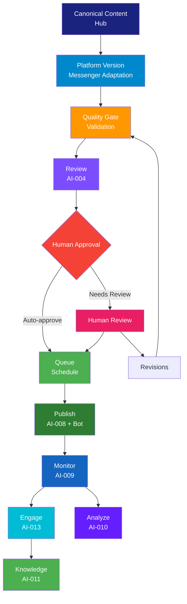

# تلگرام و بله — Telegram & Bale Playbook

> **شناسه:** PLAT-003
> **وضعیت:** پیش‌نویس
> **نسخه:** 1.0.0-draft
> **به‌روزرسانی:** 2026-06-27
> **مسئول:** مدیر پلتفرم پیام‌رسان
> **وابستگی:** [PLAT-000](../00-platform-playbook-standard.md), [ARCH-020](../../00-ARCHITECTURE/20-enterprise-multi-platform-strategy.md)
> **مخاطب:** human, agent, n8n, mcp

---

## Architectural Dependencies

### Why This Document Exists

تلگرام و بله پلتفرم‌های اصلی ارتباط مستقیم با اجتماع مخاطبان SMOS هستند. بدون این سند:

- تعامل با اجتماع مخاطبان بدون استاندارد و وابسته به افراد خواهد بود
- فرصت‌های Loyalty و Advocacy از دست می‌روند
- Agentها نمی‌دانند لحن صمیمی و اجتماعی در پیام‌رسان چگونه باید باشد
- هماهنگی بین Telegram (P1) و Bale (P2) بدون استراتژی مشخص است

### Problems It Solves

1. **نبود SSOT برای پیام‌رسان‌ها**: هر تیم برداشت متفاوتی از قواعد کانال و گروه دارد → PLAT-003 به عنوان تنها مرجع معتبر
2. **عدم یکپارچگی Community**: اجتماع مخاطبان بدون هویت برند واحد → استانداردسازی با [ARCH-020 §۱۸](../../00-ARCHITECTURE/20-enterprise-multi-platform-strategy.md#۱۸-community-architecture)
3. **نبود استراتژی تعامل دوسویه**: محتوای یک‌طرفه در کانال — بدون گفتگو → Engagement Model دوطرفه
4. **عدم بهره‌برداری از Supergroup**: پتانسیل تعامل عمیق با مخاطبان وفادار استفاده نمی‌شود → Exclusive Community
5. **نبود هماهنگی Telegram-Bale**: محتوای مشابه در دو پلتفرم بدون تمایز → Cross-posting Rules

### Explicit Scope

این سند فقط تعریف می‌کند:

- هویت و مأموریت تلگرام و بله در SMOS (برگرفته از [ARCH-020](../../00-ARCHITECTURE/20-enterprise-multi-platform-strategy.md))
- انواع محتوای قابل انتشار (برگرفته از [EDT-002](../../24-EDITORIAL/20-content-taxonomy.md))
- قواعد عملیاتی انتشار، نگارش، تعامل و مدیریت اجتماع مختص تلگرام و بله
- همکاری با Agentها و رابط‌های خودکارسازی
- KPIها و متریک‌های مختص پیام‌رسان

### Explicit Non-Scope

- استراتژی چندپلتفرمی — [ARCH-020](../../00-ARCHITECTURE/20-enterprise-multi-platform-strategy.md)
- هویت برند و فلسفه بصری — [BRD-001](../../22-BRAND/10-brand-identity.md)
- انواع محتوا و CT-ID — [EDT-002](../../24-EDITORIAL/20-content-taxonomy.md)
- کد API یا Workflow طراحی — [AUT-\*](../../30-AUTOMATION/)
- چرخه حیات محتوا — [EDT-001](../../24-EDITORIAL/10-content-guidelines.md)
- سایر پلتفرم‌ها (Instagram, LinkedIn و غیره)

### Upstream Dependencies

| سند                                                                        | نوع وابستگی  | دلیل                                             |
| -------------------------------------------------------------------------- | ------------ | ------------------------------------------------ |
| [PLAT-000](../00-platform-playbook-standard.md)                            | derived-from | قالب ساختار ۳۴ بخشی                              |
| [ARCH-020](../../00-ARCHITECTURE/20-enterprise-multi-platform-strategy.md) | depends-on   | نقش استراتژیک، طبقه‌بندی، Community Architecture |
| [CON-000](../../05-CONSTITUTION/00-constitution.md)                        | governs      | اصول یکپارچگی، کیفیت                             |
| [BRD-001](../../22-BRAND/10-brand-identity.md)                             | depends-on   | هویت برند، صدا، لحن                              |
| [EDT-001](../../24-EDITORIAL/10-content-guidelines.md)                     | depends-on   | چرخه حیات محتوا                                  |
| [EDT-002](../../24-EDITORIAL/20-content-taxonomy.md)                       | depends-on   | CT-IDها، طبقه‌بندی محتوا                         |
| [ARCH-013](../../00-ARCHITECTURE/13-ai-operating-model.md)                 | depends-on   | Agentهای Writing, Engagement, Knowledge          |
| [GOV-001](../../10-GOVERNANCE/01-documentation-standards.md)               | follows      | استاندارد نگارش                                  |
| [GOV-004](../../10-GOVERNANCE/04-cross-references.md)                      | follows      | نظام ارجاع متقابل                                |

### Downstream Dependencies

| سند                            | نوع وابستگی | دلیل                                                |
| ------------------------------ | ----------- | --------------------------------------------------- |
| [AUT-\*](../../30-AUTOMATION/) | implements  | گردش کارهای انتشار، تعامل، استخراج دانش             |
| [AI-\*](../../40-AI-AGENTS/)   | implements  | Agentهای Writing, Engagement, Knowledge, Monitoring |
| [PRM-\*](../../35-PROMPTS/)    | implements  | پرامپت‌های تولید محتوای پیام‌رسان                   |
| [MET-\*](../../60-METRICS/)    | measures    | KPIهای عملکرد کانال و گروه                          |

### SSOT Ownership

| موضوع                            | SSOT                   |
| -------------------------------- | ---------------------- |
| Telegram-specific Rules          | **PLAT-003** (این سند) |
| Bale-specific Rules              | **PLAT-003** (این سند) |
| Telegram & Bale Content Mapping  | **PLAT-003** (این سند) |
| Telegram & Bale Post Types       | **PLAT-003** (این سند) |
| Telegram & Bale Community Model  | **PLAT-003** (این سند) |
| Telegram & Bale Engagement Rules | **PLAT-003** (این سند) |
| Brand Visual Philosophy          | BRD-001                |
| Content Type Definitions         | EDT-002                |
| Multi-Platform Strategy          | ARCH-020               |
| Platform Playbook Structure      | PLAT-000               |

### Related ADRs

| ADR     | عنوان                                            | ارتباط                     |
| ------- | ------------------------------------------------ | -------------------------- |
| ADR-010 | معماری متا به عنوان الگوی عملیاتی                | لایه Distribution (تلگرام) |
| ADR-013 | جداسازی Automation و Agent                       | پیام‌رسان توسط Automation  |
| ADR-019 | حکمرانی ۱۰ لایه                                  | لایه Platform              |
| ADR-024 | استراتژی Cross-posting بین پلتفرم‌های هم‌خانواده | Telegram-Bale XP           |

### Related Objects (from ARCH-011)

Platform (OBJ-010), Account (OBJ-019), Audience (OBJ-012), Persona (OBJ-011), Platform Version (OBJ-005), Content Variant (OBJ-006), Publication (OBJ-022), Metric (OBJ-017), Campaign (OBJ-001), Asset (OBJ-007), Caption (OBJ-008), Workflow (OBJ-014), Agent (OBJ-015), Prompt (OBJ-009)

### Related AI Agents (from ARCH-013)

Orchestrator (000), Planning (002), Writing (003), Review (004), Fact Check (005), Graphic (006), Publishing (008), Monitoring (009), Analytics (010), Knowledge (011), Engagement (013), Scheduler (014)

---

## ۱. Executive Summary

PLAT-003 کتابچه عملیاتی پیام‌رسان‌های تلگرام (Telegram) و بله (Bale) در SMOS است. این سند از [PLAT-000](../00-platform-playbook-standard.md) (قالب مادر کتابچه‌های پلتفرم) و [ARCH-020](../../00-ARCHITECTURE/20-enterprise-multi-platform-strategy.md) (استراتژی چندپلتفرمی) مشتق شده و به عنوان **تنها مرجع معتبر (SSOT)** برای قواعد عملیاتی هر دو پلتفرم عمل می‌کند.

تلگرام و بله در SMOS نقش **Community (اجتماع)** را دارند ([ARCH-020 §۶](../../00-ARCHITECTURE/20-enterprise-multi-platform-strategy.md#۶-platform-roles)) — تعامل مستقیم و گفتگو با مخاطب وفادار. اولویت استراتژیک: **تلگرام P1 — بله P2**.

این سند هر دو پلتفرم را به دلیل ماهیت هم‌خانواده ([ARCH-020 §۱۱](../../00-ARCHITECTURE/20-enterprise-multi-platform-strategy.md#۱۱-cross-posting-rules))، نقش استراتژیک یکسان و معماری اجتماع مشترک در یک کتابچه پوشش می‌دهد. بله به عنوان پلتفرم پشتیبان داخلی (Backup) برای تلگرام در ایران عمل می‌کند.

PLAT-003 با رعایت اصل [PLAT-000-02](../00-platform-playbook-standard.md#اصول-plat-000) (محتوای تکراری ممنوع) هیچ معماری، برند یا طبقه‌بندی محتوایی را تکرار نمی‌کند و صرفاً تفسیر عملیاتی مختص پیام‌رسان‌ها ارائه می‌دهد.

---

## ۲. Purpose

### اهداف PLAT-003

1. **تعریف نقش تلگرام و بله** در اکوسیستم SMOS — برگرفته از [ARCH-020 §۶](../../00-ARCHITECTURE/20-enterprise-multi-platform-strategy.md#۶-platform-roles)
2. **نگاشت انواع محتوای متعارف** به قالب‌های پیام‌رسان — برگرفته از [EDT-002](../../24-EDITORIAL/20-content-taxonomy.md)
3. **استانداردسازی مدیریت اجتماع (Community)** — مشتق از [ARCH-020 §۱۸](../../00-ARCHITECTURE/20-enterprise-multi-platform-strategy.md#۱۸-community-architecture)
4. **تعریف مدل تعامل دوسویه** — مشتق از [BRD-001 §§۱۰-۱۲](../../22-BRAND/10-brand-identity.md#۱۰-brand-voice)
5. **هماهنگی Telegram-Bale** — تمایز محتوا و زمان‌بندی بین دو پلتفرم هم‌خانواده
6. **تعریف همکاری AI** — برگرفته از [ARCH-013](../../00-ARCHITECTURE/13-ai-operating-model.md)
7. **تعریف KPIهای اختصاصی** — برگرفته از [ARCH-020 §۲۱](../../00-ARCHITECTURE/20-enterprise-multi-platform-strategy.md#۲۱-enterprise-kpi-framework)

### اصول PLAT-003

| اصل        | توضیح                                                                                                                                                     |
| ---------- | --------------------------------------------------------------------------------------------------------------------------------------------------------- |
| **MSG-01** | هر محتوا در تلگرام و بله از یک CT-ID معتبر ([EDT-002](../../24-EDITORIAL/20-content-taxonomy.md)) پیروی می‌کند                                            |
| **MSG-02** | لحن صمیمی و اجتماعی تابع ماتریس لحن [BRD-001 §۱۱](../../22-BRAND/10-brand-identity.md#۱۱-brand-tone-matrix) است                                           |
| **MSG-03** | تلگرام و بله بستر اجتماع هستند — تعامل دوسویه اولویت دارد                                                                                                 |
| **MSG-04** | تلگرام و بله کانال توزیع هستند نه هویت برند — [ARCH-020 §۳](../../00-ARCHITECTURE/20-enterprise-multi-platform-strategy.md#۳-enterprise-media-philosophy) |
| **MSG-05** | محتوای تلگرام و بله باید متفاوت و مکمل باشد — [ARCH-020 §۱۱ XP-02](../../00-ARCHITECTURE/20-enterprise-multi-platform-strategy.md#۱۱-cross-posting-rules) |
| **MSG-06** | بله پلتفرم پشتیبان تلگرام در ایران است — انطباق محتوا با بومی‌سازی                                                                                        |
| **MSG-07** | تعاملات پیام‌رسان منبع اصلی استخراج دانش و بازخورد است                                                                                                    |

---

## ۳. Scope

### دامنه شمول

- **Telegram**: کانال عمومی (Channel), سوپرگروه (Supergroup/Giga Group), ربات (Bot)
- **Bale**: کانال عمومی, گروه, ربات
- انواع محتوا: متن, تصویر, ویدئو, فایل, نظرسنجی, لینک
- فرایندهای انتشار، تأیید، زمان‌بندی
- تعامل: کامنت (گروه), نظرسنجی, Q&A, DM (ربات)
- Telegram Premium features (Stories, Voice Chats)
- Bale-specific features (فایل‌های حجیم, سرویس‌های داخلی ایران)

### دامنه عدم شمول

- استراتژی کلی پلتفرم — [ARCH-020](../../00-ARCHITECTURE/20-enterprise-multi-platform-strategy.md)
- انواع محتوا — [EDT-002](../../24-EDITORIAL/20-content-taxonomy.md)
- هویت برند — [BRD-001](../../22-BRAND/10-brand-identity.md)
- بودجه تبلیغات یا اسپانسر
- API پیاده‌سازی — [AUT-\*](../../30-AUTOMATION/)
- سایر پلتفرم‌ها

---

## ۴. Platform Identity

### هویت پلتفرم‌ها در SMOS

#### Telegram

| فیلد                     | مقدار                                                                                                                                      |
| ------------------------ | ------------------------------------------------------------------------------------------------------------------------------------------ |
| **Platform ID**          | PLAT-003 (Telegram)                                                                                                                        |
| **Platform Name (FA)**   | تلگرام                                                                                                                                     |
| **Platform Name (EN)**   | Telegram                                                                                                                                   |
| **Owner Company**        | Telegram FZ-LLC (Dennis Cuțe)                                                                                                              |
| **Platform Category**    | Third-Party ([ARCH-020 §۵](../../00-ARCHITECTURE/20-enterprise-multi-platform-strategy.md#۵-platform-classification-framework))            |
| **Platform Role**        | Community (اجتماع) — تعامل مستقیم و گفتگو ([ARCH-020 §۶](../../00-ARCHITECTURE/20-enterprise-multi-platform-strategy.md#۶-platform-roles)) |
| **Platform Priority**    | P1 ([ARCH-020 §۱۲](../../00-ARCHITECTURE/20-enterprise-multi-platform-strategy.md#۱۲-platform-priority-matrix))                            |
| **Content Nature**       | Mixed (Text + Image + Video + File)                                                                                                        |
| **Communication Nature** | Community                                                                                                                                  |
| **Audience Type**        | General (Persian-speaking)                                                                                                                 |
| **API Type**             | Bot API + MTProto API                                                                                                                      |
| **API Version**          | Bot API 7.0+                                                                                                                               |
| **Authentication**       | Bot Token + User Authorization                                                                                                             |
| **Rate Limits**          | 30 messages/second per bot; 20 messages/minute per chat                                                                                    |

#### Bale

| فیلد                     | مقدار                                                                                                           |
| ------------------------ | --------------------------------------------------------------------------------------------------------------- |
| **Platform ID**          | PLAT-003 (Bale — Sub-platform)                                                                                  |
| **Platform Name (FA)**   | بله                                                                                                             |
| **Platform Name (EN)**   | Bale (Divar)                                                                                                    |
| **Owner Company**        | Divar (ویژن پردازش ارتباط)                                                                                      |
| **Platform Category**    | Third-Party — Domestic (Iran)                                                                                   |
| **Platform Role**        | Community (اجتماع) — پشتیبان داخلی تلگرام                                                                       |
| **Platform Priority**    | P2 ([ARCH-020 §۱۲](../../00-ARCHITECTURE/20-enterprise-multi-platform-strategy.md#۱۲-platform-priority-matrix)) |
| **Content Nature**       | Mixed (Text + Image + Video + File)                                                                             |
| **Communication Nature** | Community                                                                                                       |
| **Audience Type**        | General (Iranian, without VPN)                                                                                  |
| **API Type**             | Bale Bot API (MTProto-compatible)                                                                               |
| **API Version**          | Bot API 2.0+                                                                                                    |
| **Authentication**       | Bot Token                                                                                                       |
| **Rate Limits**          | Comparable to Telegram Bot API                                                                                  |

### بلوک JSON

```json
{
  "platform_identity": {
    "primary": {
      "id": "PLAT-003",
      "name_fa": "تلگرام",
      "name_en": "Telegram",
      "owner": "Telegram FZ-LLC",
      "category": "third_party",
      "role": "community",
      "priority": "P1",
      "content_nature": "mixed",
      "communication_nature": "community",
      "audience_type": "general_persian",
      "api": {
        "type": "Bot API + MTProto API",
        "version": "v7.0",
        "auth": "Bot Token",
        "rate_limits": "30 msg/sec per bot, 20 msg/min per chat"
      }
    },
    "secondary": {
      "id": "PLAT-003-BALE",
      "name_fa": "بله",
      "name_en": "Bale",
      "owner": "Divar (ویژن پردازش ارتباط)",
      "category": "third_party_domestic",
      "role": "community_backup",
      "priority": "P2",
      "content_nature": "mixed",
      "communication_nature": "community",
      "audience_type": "general_iranian",
      "api": {
        "type": "Bale Bot API",
        "version": "v2.0",
        "auth": "Bot Token",
        "rate_limits": "Similar to Telegram Bot API"
      }
    }
  }
}
```

---

## ۵. Platform Overview

### Telegram

تلگرام یک پلتفرم پیام‌رسان ابری متعلق به Telegram FZ-LLC است که در SMOS نقش **Community (اجتماع)** را ایفا می‌کند ([ARCH-020 §۶](../../00-ARCHITECTURE/20-enterprise-multi-platform-strategy.md#۶-platform-roles)). این پلتفرم بستر اصلی تعامل مستقیم، گفتگو و اجتماع مخاطبان فارسی‌زبان است.

#### ویژگی‌های کلیدی

| ویژگی                 | توضیح                                                     |
| --------------------- | --------------------------------------------------------- |
| **ماهیت**             | پیام‌رسان ابری — متن‌محور با پشتیبانی همه‌جانبه مدیا      |
| **مخاطب**             | عمومی — فارسی‌زبانان ایران و جهان                         |
| **ارتباط**            | کانال (یک‌طرفه) + گروه/سوپرگروه (دوسویه)                  |
| **تعامل**             | View, Forward, Reply, Reaction, Poll, Voice Chat, Comment |
| **مالکیت**            | Third-Party (غیروابسته به دولت)                           |
| **دسترسی در ایران**   | آزاد (با فیلترینگ موقت احتمالی)                           |
| **نوع API**           | Bot API (عمومی) — قوی‌ترین API بین پیام‌رسان‌ها           |
| **SEO**               | محدود — کانال‌ها در موتورهای جستجو ایندکس نمی‌شوند        |
| **حجم فایل**          | تا ۲GB (Premium تا ۴GB)                                   |
| **ویژگی منحصربه‌فرد** | کانال‌های نامحدود, Supergroup تا ۲۰۰K عضو, Bot API کامل   |

### Bale

بله یک پلتفرم پیام‌رسان داخلی ایرانی متعلق به Divar است که در SMOS نقش **Community Backup** را ایفا می‌کند. این پلتفرم پشتیبان داخلی تلگرام برای مخاطبان ایرانی است ([ARCH-020 §۱۸](../../00-ARCHITECTURE/20-enterprise-multi-platform-strategy.md#۱۸-community-architecture)).

#### ویژگی‌های کلیدی

| ویژگی               | توضیح                                              |
| ------------------- | -------------------------------------------------- |
| **ماهیت**           | پیام‌رسان داخلی — مشابه تلگرام با قابلیت‌های بومی  |
| **مخاطب**           | عمومی — کاربران ایرانی بدون VPN                    |
| **ارتباط**          | کانال (یک‌طرفه) + گروه (دوسویه)                    |
| **تعامل**           | View, Forward, Reply, Like, Poll                   |
| **مالکیت**          | ایرانی (Divar / ویژن پردازش ارتباط)                |
| **دسترسی در ایران** | آزاد — بدون نیاز VPN                               |
| **نوع API**         | Bot API (سازگار با MTProto تلگرام)                 |
| **حجم فایل**        | تا ۱GB (بومی‌سازی شده برای ایران)                  |
| **مزیت رقابتی**     | عدم وابستگی به فیلترینگ, پشتیبانی از زیرساخت ایران |

---

## ۶. Strategic Role

نقش استراتژیک تلگرام و بله در SMOS از [ARCH-020 §۶](../../00-ARCHITECTURE/20-enterprise-multi-platform-strategy.md#۶-platform-roles) مشتق شده است:

### نقش اصلی: Community (اجتماع)

تعامل مستقیم، گفتگو و ایجاد اجتماع مخاطبان وفادار.

### نقش‌های عملیاتی

| نقش عملیاتی              | توضیح                                      | پلتفرم اصلی |
| ------------------------ | ------------------------------------------ | ----------- |
| **Community Building**   | ایجاد و رشد اجتماع مخاطبان در کانال عمومی  | هر دو       |
| **Deep Engagement**      | تعامل عمیق با مخاطبان وفادار در Supergroup | Telegram    |
| **Audience Insight**     | استخراج بازخورد و دانش از تعاملات          | هر دو       |
| **Loyalty & Retention**  | حفظ مخاطبان وفادار از طریق محتوای اختصاصی  | Telegram    |
| **Advocacy**             | تبدیل مخاطبان به مبلغان برند               | Telegram    |
| **Crisis Communication** | اطلاع‌رسانی سریع در شرایط بحرانی           | هر دو       |
| **Iran Domestic Reach**  | دسترسی به مخاطبان ایرانی بدون VPN          | Bale        |

### موقعیت در سفر مخاطب ([ARCH-020 §۷](../../00-ARCHITECTURE/20-enterprise-multi-platform-strategy.md#۷-audience-journey-architecture))

| مرحله سفر          | نقش تلگرام                           | نقش بله                 |
| ------------------ | ------------------------------------ | ----------------------- |
| Awareness (آگاهی)  | کمکی — دریافت از Instagram/LinkedIn  | کمکی — دریافت از تلگرام |
| Engagement (تعامل) | **اصلی** — نظرسنجی, Q&A, بحث         | کمکی — نظرسنجی, Q&A     |
| Conversion (تبدیل) | متوسط — لینک به Website              | محدود                   |
| Loyalty (وفاداری)  | **اصلی** — محتوای اختصاصی Supergroup | کمکی                    |
| Advocacy (توصیه)   | **اصلی** — اشتراک محتوا توسط اعضا    | محدود                   |

---

## ۷. Audience Definition

### مخاطبان تلگرام و بله

تعریف مخاطبان بر اساس [ARCH-020 §۷](../../00-ARCHITECTURE/20-enterprise-multi-platform-strategy.md#۷-audience-journey-architecture).

| فیلد                      | مقدار                                                                                 |
| ------------------------- | ------------------------------------------------------------------------------------- |
| **Primary Audience**      | کاربران فارسی‌زبان ایران و جهان — عموم مخاطبان علاقه‌مند به رسانه هوشمند و AI         |
| **Secondary Audience**    | متخصصان فناوری, کارآفرینان, دانشجویان, مخاطبان بین‌المللی فارسی‌زبان                  |
| **Audience Demographics** | سن: ۱۸-۵۵, جنسیت: مخلوط, مکان: ایران (۸۰٪) + سایر کشورها (۲۰٪)                        |
| **Audience Behavior**     | مصرف روزانه محتوا, تعامل در گروه‌ها, اشتراک محتوا, استفاده از ربات                    |
| **Peak Hours**            | **تلگرام**: ۰۸:۰۰-۱۰:۰۰, ۱۲:۰۰-۱۴:۰۰, ۲۰:۰۰-۲۳:۰۰ — **بله**: ۰۸:۰۰-۱۰:۰۰, ۱۶:۰۰-۲۰:۰۰ |
| **Content Preferences**   | محتوای آموزشی کوتاه, خبر, اطلاع‌رسانی, نظرسنجی, محتوای اختصاصی                        |
| **Personas**              | کاربر عادی, فعال گروه, مصرف‌کننده محتوا, مبلغ برند                                    |

### پرسوناهای هدف (ارجاع به ARCH-011 OBJ-011)

| پرسونا                     | سن    | نیاز محتوایی                         | رفتار در پیام‌رسان                            |
| -------------------------- | ----- | ------------------------------------ | --------------------------------------------- |
| **کاربر عادی**             | ۲۰-۴۰ | محتوای آموزشی ساده, خبر, اطلاع‌رسانی | مصرف غیرفعال — مشاهده و Forward               |
| **فعال گروه (Supergroup)** | ۲۵-۴۵ | بحث تخصصی, Q&A, محتوای اختصاصی       | شرکت فعال — کامنت, سؤال, پیشنهاد              |
| **مصرف‌کننده محتوا**       | ۱۸-۳۵ | محتوای بصری, آموزش کوتاه, خبر        | مصرف روزانه — لایک و اشتراک محدود             |
| **مبلغ برند (Advocate)**   | ۲۵-۴۰ | محتوای انحصاری, دعوت به اقدام        | اشتراک محتوا در گروه‌های دیگر, دعوت از دیگران |

---

## ۸. Platform Mission

مأموریت پیام‌رسان‌ها در SMOS:

**"ایجاد و مدیریت اجتماع مخاطبان وفادار Xennic از طریق تعامل دوسویه، محتوای اختصاصی و گفتگوی مستمر در بستر پیام‌رسان‌های ایرانی و بین‌المللی."**

### ابعاد مأموریت

| بعد          | توضیح                                                        |
| ------------ | ------------------------------------------------------------ |
| **اجتماع**   | ایجاد فضای امن و فعال برای گفتگو و تبادل نظر مخاطبان         |
| **وفاداری**  | تبدیل مخاطب عادی به عضو وفادار اجتماع از طریق محتوای اختصاصی |
| **تعامل**    | تعامل روزانه و دوسویه با اعضای اجتماع                        |
| **بازخورد**  | استخراج دانش، بازخورد و بینش از تعاملات اعضا                 |
| **پشتیبانی** | دسترسی پایدار به مخاطبان ایرانی از طریق بله (Backup)         |

---

## ۹. Platform Objectives

اهداف تلگرام و بله — برگرفته از [ARCH-020 §۲۱](../../00-ARCHITECTURE/20-enterprise-multi-platform-strategy.md#۲۱-enterprise-kpi-framework).

| هدف       | توضیح                                 | KPI مرتبط       | زمان    | اولویت |
| --------- | ------------------------------------- | --------------- | ------- | ------ |
| OBJ-TG-01 | افزایش Members کانال تلگرام           | KPI-PLAT-003-01 | Q3 1405 | P1     |
| OBJ-TG-02 | افزایش Active Members Supergroup      | KPI-PLAT-003-02 | Q3 1405 | P1     |
| OBJ-TG-03 | افزایش نرخ تعامل (View/Forward/Reply) | KPI-PLAT-003-03 | Q4 1405 | P1     |
| OBJ-TG-04 | افزایش Forward Rate محتوا             | KPI-PLAT-003-05 | Q4 1405 | P1     |
| OBJ-TG-05 | رشد کانال بله (پشتیبان)               | KPI-PLAT-003-07 | Q4 1405 | P2     |
| OBJ-TG-06 | استخراج بازخورد از تعاملات Supergroup | KPI-PLAT-003-10 | Q1 1406 | P1     |
| OBJ-TG-07 | کاهش Response Time در تعاملات         | KPI-PLAT-003-09 | Q3 1405 | P2     |
| OBJ-TG-08 | افزایش نرخ Retention اعضای Supergroup | KPI-PLAT-003-11 | Q1 1406 | P1     |

---

## ۱۰. Platform KPIs

شاخص‌های کلیدی عملکرد پیام‌رسان‌ها — از [ARCH-020 §۲۱](../../00-ARCHITECTURE/20-enterprise-multi-platform-strategy.md#۲۱-enterprise-kpi-framework) مشتق شده است.

| KPI             | توضیح                                                       | هدف          | فرکانس اندازه‌گیری | مسئول               |
| --------------- | ----------------------------------------------------------- | ------------ | ------------------ | ------------------- |
| KPI-PLAT-003-01 | Channel Members — تعداد اعضای کانال تلگرام                  | +۱۰٪ ماهانه  | هفتگی              | AI-009 (Monitoring) |
| KPI-PLAT-003-02 | Active Members Supergroup — اعضای فعال گروه                 | > ۱۵٪ از کل  | هفتگی              | AI-009              |
| KPI-PLAT-003-03 | Message Views — میانگین بازدید هر پست                       | +۱۵٪ ماهانه  | روزانه             | AI-009              |
| KPI-PLAT-003-04 | Engagement Rate — (Reactions + Comments + Forwards) / Views | > ۸٪         | هفتگی              | AI-010 (Analytics)  |
| KPI-PLAT-003-05 | Forward Rate — نسبت Forward به Views                        | > ۳٪         | هفتگی              | AI-010              |
| KPI-PLAT-003-06 | Poll Participation — درصد شرکت در نظرسنجی‌ها                | > ۲۰٪        | هفتگی              | AI-009              |
| KPI-PLAT-003-07 | Bale Channel Growth — رشد کانال بله                         | +۸٪ ماهانه   | هفتگی              | AI-009              |
| KPI-PLAT-003-08 | Response Time — زمان پاسخ به سؤالات Supergroup              | < ۲ ساعت     | روزانه             | AI-013 (Engagement) |
| KPI-PLAT-003-09 | Content Quality Score — امتیاز کیفیت محتوای کانال           | > ۸۰٪        | هفتگی              | AI-004 (Review)     |
| KPI-PLAT-003-10 | Knowledge Return — بازخورد و Insight استخراج‌شده            | > ۵ هفتگی    | هفتگی              | AI-011 (Knowledge)  |
| KPI-PLAT-003-11 | Retention Rate — ماندگاری اعضای Supergroup                  | > ۷۰٪ ماهانه | ماهانه             | AI-010              |

### بلوک JSON

```json
{
  "platform_kpis": [
    {
      "id": "KPI-PLAT-003-01",
      "name": "Channel Members",
      "description": "تعداد اعضای کانال تلگرام",
      "target": "+10% monthly",
      "unit": "count",
      "frequency": "weekly",
      "owner": "AI-009"
    },
    {
      "id": "KPI-PLAT-003-02",
      "name": "Supergroup Active Members",
      "description": "درصد اعضای فعال Supergroup",
      "target": "> 15% of total",
      "unit": "percentage",
      "frequency": "weekly",
      "owner": "AI-009"
    },
    {
      "id": "KPI-PLAT-003-04",
      "name": "Engagement Rate",
      "description": "نرخ تعامل (Reactions + Comments + Forwards) / Views",
      "target": "> 8%",
      "unit": "percentage",
      "frequency": "weekly",
      "owner": "AI-010"
    },
    {
      "id": "KPI-PLAT-003-10",
      "name": "Knowledge Return",
      "description": "تعداد بازخورد و Insight استخراج‌شده از تعاملات",
      "target": "> 5 weekly",
      "unit": "count",
      "frequency": "weekly",
      "owner": "AI-011"
    }
  ]
}
```

---

## ۱۱. Platform Constraints

محدودیت‌های تلگرام و بله — شامل محدودیت‌های فنی، محتوایی، قانونی و تجاری.

### Telegram — Technical

| محدودیت                | توضیح                        | تأثیر                   | کاهش اثر                        |
| ---------------------- | ---------------------------- | ----------------------- | ------------------------------- |
| **Message Length**     | حداکثر ۴,۰۹۶ کاراکتر         | محدودیت محتوای بلند     | استفاده از Telegraph (linked)   |
| **Media Caption**      | حداکثر ۱,۰۲۴ کاراکتر         | محدودیت متن همراه تصویر | توضیح کامل در کامنت اول         |
| **Video Size**         | حداکثر ۲GB (Premium ۴GB)     | محدودیت ناچیز           | فشرده‌سازی استاندارد            |
| **File Size**          | حداکثر ۲GB                   | محدودیت ناچیز           | اکثر فایل‌ها پشتیبانی می‌شوند   |
| **Supergroup Members** | حداکثر ۲۰۰,۰۰۰ عضو           | محدودیت رشد گروه        | ارتقا به Giga Group (نیاز تماس) |
| **Channel Members**    | نامحدود                      | —                       | —                               |
| **Bot API Rate**       | ۳۰ پیام/ثانیه                | محدودیت اتوماسیون       | صف‌بندی پیام‌ها                 |
| **Bot API Per Chat**   | ۲۰ پیام/دقیقه                | محدودیت پاسخ گروهی      | Throttling خودکار               |
| **Stories**            | ۲ داستان/روز (Premium بیشتر) | محدودیت Stories         | محتوای Stories محدود            |

### Telegram — Content

| محدودیت               | توضیح                                         |
| --------------------- | --------------------------------------------- |
| **Copyright**         | حذف محتوای دارای حق نشر در صورت شکایت         |
| **Adult Content**     | ممنوع (با نظارت بومی تلگرام)                  |
| **Spam**              | محدودیت ارسال انبوه — محدودیت اکانت           |
| **Channel Rules**     | عدم رعایت قوانین منجر به محدودیت کانال می‌شود |
| **Political Content** | محدودیت محتوای سیاسی طبق قوانین ایران         |

### Telegram — Legal

| محدودیت              | توضیح                                                |
| -------------------- | ---------------------------------------------------- |
| **GDPR**             | تابع GDPR برای کاربران اروپایی                       |
| **Iran Regulations** | تابع قوانین جمهوری اسلامی ایران در مورد محتوا        |
| **Data Privacy**     | حریم خصوصی کاربران — جمع‌آوری داده محدود             |
| **Bot Policy**       | ربات‌ها نمی‌توانند پیام‌های خصوصی کاربران را بخوانند |

### Bale — Specific Constraints

| محدودیت              | توضیح                      | تأثیر                  | کاهش اثر                 |
| -------------------- | -------------------------- | ---------------------- | ------------------------ |
| **Audience Size**    | مخاطب محدودتر از تلگرام    | Reach کمتر             | محتوای بومی‌شده و متناسب |
| **Bot API Features** | امکانات کمتر از تلگرام     | محدودیت در اتوماسیون   | ساده‌سازی Workflow       |
| **File Size**        | حداکثر ۱GB                 | محدودیت کمتر از تلگرام | فشرده‌سازی               |
| **Supergroup Limit** | محدودیت کمتر از تلگرام     | —                      | —                        |
| **API Maturity**     | API جوان‌تر و کمتر تست‌شده | احتمال ناپایداری       | Fallback به تلگرام       |

### بلوک JSON

```json
{
  "platform_constraints": [
    {
      "type": "technical",
      "platform": "telegram",
      "description": "Message character limit: 4,096 characters",
      "impact": "Long-form content requires Telegraph external link",
      "mitigation": "Use Telegraph for articles > 4K chars; link in channel post"
    },
    {
      "type": "technical",
      "platform": "telegram",
      "description": "Bot API: 30 msg/sec per bot, 20 msg/min per chat",
      "impact": "Automated responses must be throttled",
      "mitigation": "Message queuing and throttling in automation layer"
    },
    {
      "type": "technical",
      "platform": "telegram",
      "description": "Supergroup member cap: 200,000",
      "impact": "Group growth limited",
      "mitigation": "Request Giga Group upgrade when approaching limit"
    },
    {
      "type": "legal",
      "platform": "telegram",
      "description": "Possible filtering in Iran",
      "impact": "Complete loss of Iran audience",
      "mitigation": "Bale as domestic backup platform"
    },
    {
      "type": "technical",
      "platform": "bale",
      "description": "Bale Bot API has fewer features than Telegram",
      "impact": "Limited automation capabilities",
      "mitigation": "Simplified automation for Bale; full automation on Telegram"
    }
  ]
}
```

---

## ۱۲. Content Types

این بخش فقط CT-IDهای قابل انتشار در تلگرام و بله را فهرست می‌کند. تعریف کامل هر CT-ID در [EDT-002 §§۸-۱۸](../../24-EDITORIAL/20-content-taxonomy.md) موجود است.

### CT-IDهای سازگار با تلگرام و بله

بر اساس [EDT-002 §۲۴](../../24-EDITORIAL/20-content-taxonomy.md#۲۴-platform-independence) و فیلد `compatible_platforms` هر CT-ID:

#### Telegram

| CT-ID  | نام                    | قالب تلگرام               | محدودیت            |
| ------ | ---------------------- | ------------------------- | ------------------ |
| CT-001 | Educational Article    | Post + Telegraph Link     | متن ≤ ۴۰۹۶ کاراکتر |
| CT-002 | Educational Video      | Media Post (Video)        | حجم ≤ ۲GB          |
| CT-004 | Educational Short      | Text Post                 | —                  |
| CT-006 | Technical Analysis     | Post + Telegraph Link     | متن ≤ ۴۰۹۶ کاراکتر |
| CT-009 | Industry Insight       | Text Post                 | —                  |
| CT-011 | Product Introduction   | Media/Text Post           | —                  |
| CT-013 | Promotional Campaign   | Media Post                | محدود              |
| CT-016 | **Discussion Starter** | Text Post + Group Forward | **اولویت**         |
| CT-017 | **Poll / Survey**      | Poll                      | **اولویت**         |
| CT-018 | **Community Update**   | Text Post                 | **اولویت**         |
| CT-019 | **UGC**                | Forward + Comment         | مجوز انتشار        |
| CT-020 | CTA                    | Text Post (Link)          | —                  |
| CT-024 | Company Culture        | Media/Text Post           | —                  |
| CT-025 | Transparency Report    | Post + File (PDF)         | —                  |
| CT-029 | Event Announcement     | Text/Media Post           | —                  |
| CT-031 | Event Recap            | Media Post                | —                  |
| CT-032 | Knowledge Tip          | Text Post                 | **اولویت**         |
| CT-036 | Crisis Statement       | Pinned Post               | فقط انسان          |
| CT-037 | Crisis Update          | Text Post                 | فقط انسان          |
| CT-038 | Apology/Correction     | Text Post                 | فقط انسان          |

#### Bale

| CT-ID  | نام                    | قالب بله          | محدودیت     |
| ------ | ---------------------- | ----------------- | ----------- |
| CT-016 | **Discussion Starter** | Text Post + Group | **اولویت**  |
| CT-017 | **Poll / Survey**      | Poll              | **اولویت**  |
| CT-018 | **Community Update**   | Text Post         | **اولویت**  |
| CT-032 | **Knowledge Tip**      | Text Post         | **اولویت**  |
| CT-004 | Educational Short      | Text Post         | —           |
| CT-009 | Industry Insight       | Text Post         | —           |
| CT-013 | Promotional Campaign   | Media Post        | محدود       |
| CT-019 | UGC                    | Forward + Comment | مجوز انتشار |
| CT-020 | CTA                    | Text Post         | —           |
| CT-036 | Crisis Statement       | Pinned Post       | فقط انسان   |

### CT-IDهای غیرمجاز یا محدود

| CT-ID                                   | دلیل عدم پشتیبانی                        |
| --------------------------------------- | ---------------------------------------- |
| CT-003 (Infographic)                    | محدودیت نمایش — مناسب Instagram/LinkedIn |
| CT-005 (Educational Series)             | عدم ابزار سری — مناسب Website/LinkedIn   |
| CT-007 (Research Report)                | حجم بالا — مناسب Website                 |
| CT-008 (Whitepaper)                     | حجم بالا — مناسب Website                 |
| CT-010 (Opinion Piece)                  | بستر نامناسب — مناسب LinkedIn            |
| CT-012 (Case Study)                     | حجم بالا — مناسب Website/LinkedIn        |
| CT-014 (Webinar/Live)                   | مناسب Instagram Live/LinkedIn Live       |
| CT-015 (Testimonial)                    | عدم بستر مناسب                           |
| CT-021~023 (Landing/Behind Scenes/Quiz) | بستر نامناسب                             |
| CT-026~028 (Challenge/Interactive)      | فقط وبسایت                               |
| CT-030 (Live Coverage)                  | عدم Instagram Live معادل                 |
| CT-033~035 (Internal Knowledge)         | داخلی                                    |
| CT-039~042 (Internal)                   | داخلی                                    |

---

## ۱۳. Content Strategy

### Content Pillars

برگرفته از [BRD-001 §۵](../../22-BRAND/10-brand-identity.md#۵-brand-dna) (DNA برند: نور × نیرو × یکتا) و [ARCH-020 §۱۳](../../00-ARCHITECTURE/20-enterprise-multi-platform-strategy.md#۱۳-content-to-platform-mapping).

#### Pillar 1: Community Engagement (نور — تعاملی)

| فیلد                     | مقدار                                      |
| ------------------------ | ------------------------------------------ |
| **Purpose**              | ایجاد و حفظ تعامل روزانه با اجتماع مخاطبان |
| **Audience**             | همه اعضای کانال و Supergroup               |
| **Primary CT-IDs**       | CT-016, CT-017, CT-018, CT-032             |
| **Business Goal**        | Loyalty, Retention, Feedback               |
| **Knowledge Goal**       | Awareness → Connection                     |
| **Brand Goal**           | نور (روشن‌گری) — آگاهی‌بخش و مشارکتی       |
| **Priority**             | P1                                         |
| **Publishing Frequency** | روزانه — ۱-۲ پست                           |

#### Pillar 2: Knowledge Distribution (نور — آموزشی)

| فیلد                     | مقدار                                        |
| ------------------------ | -------------------------------------------- |
| **Purpose**              | توزیع محتوای آموزشی کوتاه و قابل مصرف روزانه |
| **Audience**             | کاربر عادی, مصرف‌کننده محتوا                 |
| **Primary CT-IDs**       | CT-001, CT-004, CT-032                       |
| **Business Goal**        | Brand Awareness, Authority                   |
| **Knowledge Goal**       | Understanding → Application                  |
| **Brand Goal**           | نور (روشن‌گری) — آموزش ساده و کاربردی        |
| **Priority**             | P1                                           |
| **Publishing Frequency** | روزانه — ۱-۲ پست                             |

#### Pillar 3: News & Updates (نیرو)

| فیلد                     | مقدار                                          |
| ------------------------ | ---------------------------------------------- |
| **Purpose**              | اطلاع‌رسانی به‌روز درباره Xennic, SMOS و صنعت  |
| **Audience**             | همه مخاطبان                                    |
| **Primary CT-IDs**       | CT-009, CT-011, CT-025, CT-029                 |
| **Business Goal**        | Awareness, Transparency                        |
| **Knowledge Goal**       | Awareness → Decision                           |
| **Brand Goal**           | نیرو (تأثیرگذاری) — اطلاع‌رسانی شفاف و به‌موقع |
| **Priority**             | P1                                             |
| **Publishing Frequency** | ۳-۵ بار در هفته                                |

#### Pillar 4: Exclusive Content (یکتا)

| فیلد                     | مقدار                                             |
| ------------------------ | ------------------------------------------------- |
| **Purpose**              | محتوای اختصاصی Supergroup — فقط برای اعضای وفادار |
| **Audience**             | اعضای فعال Supergroup                             |
| **Primary CT-IDs**       | CT-006, CT-018, CT-019, CT-024                    |
| **Business Goal**        | Loyalty, Advocacy                                 |
| **Knowledge Goal**       | Synthesis → Action                                |
| **Brand Goal**           | یکتا (منحصربه‌فردی) — اصالت و انحصار              |
| **Priority**             | P1 (Supergroup)                                   |
| **Publishing Frequency** | ۲-۳ بار در هفته (Supergroup)                      |

#### Pillar 5: Crisis Communication (نیرو — بحرانی)

| فیلد                     | مقدار                                        |
| ------------------------ | -------------------------------------------- |
| **Purpose**              | اطلاع‌رسانی سریع و شفاف در شرایط بحرانی      |
| **Audience**             | همه مخاطبان                                  |
| **Primary CT-IDs**       | CT-036, CT-037, CT-038                       |
| **Business Goal**        | Trust, Transparency                          |
| **Brand Goal**           | نیرو (تأثیرگذاری) — قاطعیت و شفافیت در بحران |
| **Priority**             | P0 (فوری)                                    |
| **Publishing Frequency** | بر اساس رویداد                               |

### Content Mix

| دسته                       | درصد | توضیح                       |
| -------------------------- | ---- | --------------------------- |
| **Community Engagement**   | ۳۵٪  | نظرسنجی, بحث, شروع گفتگو    |
| **Knowledge Distribution** | ۳۰٪  | آموزش کوتاه, نکات دانشی     |
| **News & Updates**         | ۲۰٪  | خبر, اطلاعیه, رویداد        |
| **Exclusive (Supergroup)** | ۱۰٪  | محتوای اختصاصی اعضای وفادار |
| **Crisis (در صورت نیاز)**  | ۵٪   | اطلاع‌رسانی بحرانی          |

### Content Frequency

| نوع محتوا           | پلتفرم   | تعداد در روز     | بهترین زمان         |
| ------------------- | -------- | ---------------- | ------------------- |
| **Channel Post**    | Telegram | ۲-۳              | ۰۸:۰۰, ۱۲:۰۰, ۲۰:۰۰ |
| **Supergroup Post** | Telegram | ۱-۲              | ۱۰:۰۰, ۲۱:۰۰        |
| **Poll**            | Telegram | ۲-۳ بار در هفته  | ۱۲:۰۰               |
| **Channel Post**    | Bale     | ۱-۲              | ۰۸:۰۰, ۱۷:۰۰        |
| **Total**           | —        | ۴-۷ محتوا در روز | —                   |

### Content Sources

| منبع                            | درصد | مسئول                                  |
| ------------------------------- | ---- | -------------------------------------- |
| **AI Generated + Human Review** | ۷۰٪  | AI-003 (Writing) + AI-004 (Review)     |
| **Human Written**               | ۲۰٪  | Content Team (محتوای اختصاصی و بحرانی) |
| **Curated / Repurposed**        | ۱۰٪  | از Hub به پیام‌رسان                    |

---

## ۱۴. Content Mapping

نگاشت CT-IDها به قالب‌های تلگرام و بله — برگرفته از [EDT-002 §۲۴](../../24-EDITORIAL/20-content-taxonomy.md#۲۴-platform-independence).

### Telegram

| CT-ID  | فرمت متعارف          | نسخه تلگرام               | تغییرات لازم                      | مسئول تبدیل     | اولویت |
| ------ | -------------------- | ------------------------- | --------------------------------- | --------------- | ------ |
| CT-001 | Educational Article  | Post + Telegraph Link     | خلاصه ۲۰۰-۴۰۰ کاراکتر + لینک      | AI-003          | P1     |
| CT-002 | Educational Video    | Media Post                | آپلود ویدئو + کپشن ≤ ۱۰۲۴ کاراکتر | AI-007          | P1     |
| CT-004 | Educational Short    | Text Post                 | متن ۱۰۰-۳۰۰ کاراکتر + Media       | AI-003          | P1     |
| CT-006 | Technical Analysis   | Post + Telegraph Link     | خلاصه + لینک مقاله کامل           | AI-001 + AI-003 | P1     |
| CT-009 | Industry Insight     | Text Post                 | متن ۱۵۰-۳۰۰ کاراکتر               | AI-003          | P1     |
| CT-011 | Product Introduction | Media/Text Post           | متن + تصویر محصول                 | AI-003          | P1     |
| CT-013 | Promotional Campaign | Media Post                | محدود — حداکثر ۲ بار در هفته      | AI-003          | P2     |
| CT-016 | Discussion Starter   | Text Post + Group Forward | متن سؤال + دعوت به بحث            | AI-003          | P1     |
| CT-017 | Poll / Survey        | Native Poll               | سؤال + ۲-۴ گزینه                  | AI-003          | P1     |
| CT-018 | Community Update     | Text Post                 | اطلاع‌رسانی اجتماع                | AI-003          | P1     |
| CT-019 | UGC                  | Forward + Comment         | مجوز + معرفی کاربر                | Human           | P2     |
| CT-020 | CTA                  | Text Post (Link)          | CTA به Website                    | AI-003          | P1     |
| CT-024 | Company Culture      | Media/Text Post           | تصویر + متن                       | AI-003          | P2     |
| CT-025 | Transparency Report  | Post + File (PDF)         | خلاصه + PDF                       | AI-001 + AI-003 | P2     |
| CT-029 | Event Announcement   | Text/Media Post           | تاریخ + لینک                      | AI-003          | P2     |
| CT-031 | Event Recap          | Media Post                | تصاویر + خلاصه                    | AI-003          | P2     |
| CT-032 | Knowledge Tip        | Text Post                 | ۵۰-۱۵۰ کاراکتر + Media            | AI-003          | P1     |
| CT-036 | Crisis Statement     | Pinned Post               | فقط انسان                         | Human           | P0     |
| CT-037 | Crisis Update        | Text Post                 | فقط انسان                         | Human           | P0     |
| CT-038 | Apology/Correction   | Text Post                 | فقط انسان                         | Human           | P0     |

### Bale

| CT-ID  | فرمت متعارف          | نسخه بله          | تغییرات لازم             | مسئول تبدیل | اولویت |
| ------ | -------------------- | ----------------- | ------------------------ | ----------- | ------ |
| CT-004 | Educational Short    | Text Post         | بومی‌سازی برای مخاطب بله | AI-003      | P2     |
| CT-009 | Industry Insight     | Text Post         | خلاصه از نسخه تلگرام     | AI-003      | P2     |
| CT-013 | Promotional Campaign | Media Post        | محدود                    | AI-003      | P2     |
| CT-016 | Discussion Starter   | Text Post + Group | نسخه بومی‌شده            | AI-003      | P1     |
| CT-017 | Poll / Survey        | Native Poll       | سؤال بومی                | AI-003      | P1     |
| CT-018 | Community Update     | Text Post         | نسخه بومی‌شده            | AI-003      | P1     |
| CT-019 | UGC                  | Forward + Comment | مجوز                     | Human       | P2     |
| CT-020 | CTA                  | Text Post         | بومی‌سازی                | AI-003      | P2     |
| CT-032 | Knowledge Tip        | Text Post         | نسخه بومی‌شده            | AI-003      | P1     |
| CT-036 | Crisis Statement     | Pinned Post       | فقط انسان                | Human       | P0     |

---

## ۱۵. Publishing Model

### Publishing Workflow

برگرفته از [EDT-001 §۶](../../24-EDITORIAL/10-content-guidelines.md) (چرخه حیات محتوا) و [ARCH-020 §۹](../../00-ARCHITECTURE/20-enterprise-multi-platform-strategy.md#۹-canonical-publishing-strategy).



### Approval Chain

| سطح تأیید                | نقش             | شرایط                                                 |
| ------------------------ | --------------- | ----------------------------------------------------- |
| **L1 — AI Review**       | AI-004          | همه محتواها — Brand Review                            |
| **L2 — Human Editorial** | Content Manager | CT-036~038 (Crisis), Campaign Content                 |
| **Auto-approve**         | —               | CT-004, CT-009, CT-016, CT-017, CT-032 (اعتماد > ۹۰٪) |

### Scheduling Rules

| نوع محتوا                  | بهترین زمان                   | حداقل فاصله |
| -------------------------- | ----------------------------- | ----------- |
| **Knowledge Tip (CT-032)** | ۰۸:۰۰                         | ۲ ساعت      |
| **Community Engagement**   | ۱۲:۰۰, ۲۰:۰۰                  | ۳ ساعت      |
| **News & Updates**         | ۱۰:۰۰, ۱۶:۰۰                  | ۴ ساعت      |
| **Exclusive (Supergroup)** | ۲۱:۰۰                         | —           |
| **Poll**                   | ۱۲:۰۰ (سه‌شنبه, پنجشنبه)      | —           |
| **Bale Content**           | ۰۸:۰۰, ۱۷:۰۰                  | —           |
| **Weekend (جمعه)**         | **محدود** — فقط محتوای تعاملی | —           |

### Auto-publish Rules

| شرط                         | مجاز بودن   | توضیح           |
| --------------------------- | ----------- | --------------- |
| CT-004 (Educational Short)  | **مجاز**    | اعتماد AI > ۹۰٪ |
| CT-009 (Industry Insight)   | **مجاز**    | اعتماد AI > ۹۰٪ |
| CT-016 (Discussion Starter) | **مجاز**    | —               |
| CT-017 (Poll/Survey)        | **مجاز**    | —               |
| CT-032 (Knowledge Tip)      | **مجاز**    | —               |
| CT-020 (CTA)                | **مجاز**    | —               |
| CT-036~038 (Crisis)         | **غیرمجاز** | فقط انسان       |

### Telegram-Bale Distribution Sequence

بر اساس [ARCH-020 §۱۰](../../00-ARCHITECTURE/20-enterprise-multi-platform-strategy.md#۱۰-canonical-distribution-sequence):

| مرحله | پلتفرم               | تأخیر               | محتوا                             |
| ----- | -------------------- | ------------------- | --------------------------------- |
| ۴     | **Telegram Channel** | +۶ ساعت از Hub      | محتوای عمومی + لینک               |
| ۵     | **Bale Channel**     | +۱ ساعت از Telegram | نسخه بومی‌شده — **متفاوت و مکمل** |

---

## ۱۶. Publishing Rules

### قواعد عمومی

| قاعده          | توضیح                                                                                                                                              |
| -------------- | -------------------------------------------------------------------------------------------------------------------------------------------------- |
| **PUB-MSG-01** | هر پست قبل از انتشار باید گیت‌های کیفیت PLAT-000 را پاس کند                                                                                        |
| **PUB-MSG-02** | محتوای بحرانی (CT-036~038) فقط توسط انسان منتشر شود                                                                                                |
| **PUB-MSG-03** | حداکثر ۳ پست در کانال تلگرام در روز — حداقل ۲ ساعت فاصله                                                                                           |
| **PUB-MSG-04** | حداکثر ۲ پست در کانال بله در روز                                                                                                                   |
| **PUB-MSG-05** | پست‌های کانال با قابلیت کامنت (Comment) فعال شوند                                                                                                  |
| **PUB-MSG-06** | محتوای Supergroup فقط برای اعضا — از کانال بازنشر نشود                                                                                             |
| **PUB-MSG-07** | محتوای تکراری بین تلگرام و بله ممنوع — [ARCH-020 §۱۱ XP-02](../../00-ARCHITECTURE/20-enterprise-multi-platform-strategy.md#۱۱-cross-posting-rules) |
| **PUB-MSG-08** | محتوای اختصاصی هر پلتفرم نباید در پلتفرم دیگر تکرار شود                                                                                            |

### بومی‌سازی محتوا

بر اساس [ARCH-020 §۹](../../00-ARCHITECTURE/20-enterprise-multi-platform-strategy.md#۹-canonical-publishing-strategy):

| تغییر                 | توضیح                                             |
| --------------------- | ------------------------------------------------- |
| **منبع**              | محتوای متعارف از Hub (Website)                    |
| **بومی‌سازی تلگرام**  | لحن صمیمی و اجتماعی + لینک به منابع               |
| **بومی‌سازی بله**     | نسخه بومی‌شده برای مخاطب ایرانی — لحن رسمی‌تر     |
| **تلگرام → بله**      | ترجمه به لحن بومی + تغییرات محتوایی برای تمایز    |
| **تغییر محتوای اصلی** | **ممنوع** — Platform Version فقط بومی‌سازی می‌کند |
| **CTA**               | لینک به Website + دعوت به Supergroup              |

---

## ۱۷. Post Types

### اشیاء تلگرام و بله (Messenger Objects)

بر اساس [ARCH-011 OBJ-004](../../00-ARCHITECTURE/11-object-model.md) (Content Piece) و OBJ-005 (Platform Version).

#### Channel Post (Telegram & Bale)

| فیلد               | مقدار                                                                                                                              |
| ------------------ | ---------------------------------------------------------------------------------------------------------------------------------- |
| **Mission**        | انتشار محتوای عمومی برای همه اعضای کانال                                                                                           |
| **Lifecycle**      | Normal (۱-۳ روز) — محتوای کانال                                                                                                    |
| **Owner**          | AI-003 (Writing) + AI-004 (Review)                                                                                                 |
| **Metadata**       | CT-ID, Text, Media, Link, Schedule                                                                                                 |
| **Quality Gate**   | Brand Review (AI-004)                                                                                                              |
| **Length**         | ۱۰۰-۴,۰۹۶ کاراکتر                                                                                                                  |
| **Media Support**  | Image, Video, File, Poll, Audio, Voice                                                                                             |
| **Related CT-IDs** | CT-001, CT-002, CT-004, CT-006, CT-009, CT-011, CT-013, CT-016, CT-018, CT-020, CT-024, CT-025, CT-029, CT-031, CT-032, CT-036~038 |

#### Supergroup Post (Telegram)

| فیلد               | مقدار                                                          |
| ------------------ | -------------------------------------------------------------- |
| **Mission**        | تعامل عمیق با اعضای وفادار در گروه اختصاصی                     |
| **Lifecycle**      | Rapid (ساعت‌ها) — تعامل و بحث                                  |
| **Owner**          | AI-003 + AI-013 (Engagement) + Human (Moderator)               |
| **Metadata**       | CT-ID, Text, Media, Poll                                       |
| **Quality Gate**   | Brand Review (AI-004)                                          |
| **Length**         | ۵۰-۴,۰۹۶ کاراکتر                                               |
| **Access**         | **انحصاری** — فقط اعضای Supergroup                             |
| **Related CT-IDs** | CT-016, CT-017, CT-018, CT-019, CT-024, CT-032, CT-006 (خلاصه) |

#### Poll (Telegram & Bale)

| فیلد               | مقدار                                           |
| ------------------ | ----------------------------------------------- |
| **Mission**        | نظرسنجی برای تعامل و جمع‌آوری نظر مخاطبان       |
| **Lifecycle**      | Rapid (۱-۷ روز)                                 |
| **Owner**          | AI-003 + AI-013                                 |
| **Metadata**       | CT-ID, Question, Options (۲-۱۰), Anonymous Mode |
| **Quality Gate**   | Brand Review                                    |
| **Duration**       | ۱-۷ روز                                         |
| **Related CT-IDs** | CT-017                                          |

#### Media Post (Telegram & Bale)

| فیلد               | مقدار                                              |
| ------------------ | -------------------------------------------------- |
| **Mission**        | انتشار ویدئو، تصویر یا فایل آموزشی                 |
| **Lifecycle**      | Normal (۱-۳ روز)                                   |
| **Owner**          | AI-007 (Video) / AI-006 (Image) + AI-003 (Caption) |
| **Metadata**       | CT-ID, Media File, Caption (≤ ۱۰۲۴ chars)          |
| **Quality Gate**   | Format Validation + Brand Review                   |
| **Max Size**       | Telegram: ۲GB, Bale: ۱GB                           |
| **Related CT-IDs** | CT-002, CT-011, CT-024                             |

#### Story (Telegram Premium)

| فیلد               | مقدار                                     |
| ------------------ | ----------------------------------------- |
| **Mission**        | محتوای زودگذر و تعاملی — اطلاع‌رسانی سریع |
| **Lifecycle**      | Rapid (۲۴-۴۸ ساعت)                        |
| **Owner**          | AI-006 (Graphic) + Human                  |
| **Metadata**       | CT-ID, Image/Video, Text Overlay          |
| **Quality Gate**   | Brand Review                              |
| **Visibility**     | All / Close Friends (Supergroup)          |
| **Frequency**      | حداکثر ۲ در روز                           |
| **Related CT-IDs** | CT-004, CT-009, CT-018, CT-029            |

#### Pinned Post (Telegram & Bale)

| فیلد               | مقدار                                      |
| ------------------ | ------------------------------------------ |
| **Mission**        | محتوای ثابت و مهم — اطلاعیه دائمی یا بحران |
| **Lifecycle**      | Slow (روزها تا هفته‌ها)                    |
| **Owner**          | Human (Content Manager)                    |
| **Metadata**       | CT-ID, Text, Media                         |
| **Quality Gate**   | Human Approval                             |
| **Max Pinned**     | ۱ (کانال) / ۲ (گروه)                       |
| **Related CT-IDs** | CT-036, CT-037, CT-038, CT-018             |

#### Bot DM (Telegram & Bale Bot)

| فیلد             | مقدار                                                   |
| ---------------- | ------------------------------------------------------- |
| **Mission**      | تعامل خصوصی با کاربران — پاسخ خودکار, خبرنامه, پشتیبانی |
| **Lifecycle**    | Real-time                                               |
| **Owner**        | AI-013 (Engagement) + AUT-\* (Bot Workflow)             |
| **Metadata**     | User ID, Message Type, Context                          |
| **Quality Gate** | Brand Review + Spam Check                               |
| **Rules**        | هرگز پیام ناخواسته (Spam) ارسال نشود                    |
| **SLA**          | < ۵ دقیقه برای پاسخ خودکار                              |

#### Voice Chat (Telegram Supergroup)

| فیلد               | مقدار                                   |
| ------------------ | --------------------------------------- |
| **Mission**        | تعامل زنده صوتی با اعضای Supergroup     |
| **Lifecycle**      | Real-time                               |
| **Owner**          | Human (Host) + AI-013 (Chat Moderation) |
| **Metadata**       | CT-ID, Topic, Schedule                  |
| **Quality Gate**   | Human Approval                          |
| **Frequency**      | هفتگی / دو‌هفتگی                        |
| **Related CT-IDs** | CT-016, CT-018                          |

#### Comment (Telegram Supergroup)

| فیلد             | مقدار                                     |
| ---------------- | ----------------------------------------- |
| **Mission**      | تعامل دوسویه در بخش کامنت کانال یا گروه   |
| **Lifecycle**    | Rapid (ساعت‌ها)                           |
| **Owner**        | AI-013 (Engagement) + Human (Escalation)  |
| **Metadata**     | Post ID, Response Template, Tone          |
| **Quality Gate** | Tone Check (AI-004)                       |
| **SLA**          | < ۱ ساعت در Supergroup, < ۴ ساعت در کانال |

---

## ۱۸. Visual Guidelines

راهنمای بصری تلگرام و بله — کاملاً مشتق از فلسفه بصری [BRD-001 §§۱۴-۲۰](../../22-BRAND/10-brand-identity.md#۱۴-visual-philosophy).

### Visual Philosophy Implementation

بر اساس [BRD-001 §۱۴](../../22-BRAND/10-brand-identity.md#۱۴-visual-philosophy):

| اصل BRD-001     | پیاده‌سازی در پیام‌رسان                                   |
| --------------- | --------------------------------------------------------- |
| **روشنایی**     | تصاویر با کنتراست بالا — مناسب نمایش در موبایل            |
| **سادگی**       | طراحی مینیمال — حداکثر ۲ عنصر در هر تصویر                 |
| **انسجام**      | برندگذاری ثابت در Header پست‌های کانال — لوگو و رنگ یکسان |
| **هدفمندی**     | هر تصویر دلیل وجودی دارد — نمودار، عکس محصول، تیتر خبر    |
| **دسترس‌پذیری** | متون خوانا با فونت ≥ ۱۴pt در موبایل                       |

### Color Usage

بر اساس [BRD-001 §۱۵](../../22-BRAND/10-brand-identity.md#۱۵-color-philosophy):

| کارکرد        | پیاده‌سازی در پیام‌رسان                              |
| ------------- | ---------------------------------------------------- |
| **رنگ اصلی**  | Header کانال, تصاویر پست‌ها, پروفایل کانال           |
| **رنگ تأکید** | CTA, آمار, اعداد کلیدی, Poll Options                 |
| **رنگ زمینه** | سفید یا تیره برای تصاویر — مطابق با Background کانال |

### Graphic Consistency

| قاعده          | توضیح                                              |
| -------------- | -------------------------------------------------- |
| **VIS-MSG-01** | همه پست‌های تصویری از یک قالب ثابت استفاده می‌کنند |
| **VIS-MSG-02** | Resolution حداقل ۱۰۸۰×۱۰۸۰ px برای تصاویر کانال    |
| **VIS-MSG-03** | Aspect Ratio: ۱:۱ (مربعی), ۱۶:۹ (لنداسکیپ)         |
| **VIS-MSG-04** | کانال Photo / Cover: حداقل ۱۰۰۰×۵۰۰ px             |
| **VIS-MSG-05** | لوگوی Xennic در تمام تصاویر پست‌ها                 |
| **VIS-MSG-06** | فونت خوانا و مناسب موبایل — بدون فونت تزئینی       |
| **VIS-MSG-07** | ویدئوها با زیرنویس فارسی (در صورت نیاز)            |

### Bale-Specific Visual Rules

| قاعده         | توضیح                                                   |
| ------------- | ------------------------------------------------------- |
| **VIS-BL-01** | قالب‌های تصویری کاملاً مشابه تلگرام — فقط بومی‌سازی متن |
| **VIS-BL-02** | استفاده از رنگ‌های ملی (اختیاری) برای محتوای بومی       |
| **VIS-BL-03** | حذف المان‌های بین‌المللی غیرمرتبط با مخاطب ایرانی       |

---

## ۱۹. Caption Guidelines

### Writing Philosophy

کپشن‌های تلگرام و بله از صدا و لحن برند [BRD-001 §§۱۰-۱۱](../../22-BRAND/10-brand-identity.md#۱۰-brand-voice) پیروی می‌کنند.

| اصل                | توضیح                                                                                           |
| ------------------ | ----------------------------------------------------------------------------------------------- |
| **صمیمیت**         | لحن گرم و دوستانه — نه بیش از حد رسمی                                                           |
| **اختصار**         | کپشن‌های کوتاه و مفید — ۵۰-۳۰۰ کاراکتر بهینه                                                    |
| **ارزش**           | هر پست باید یک ارزش مشخص ارائه دهد                                                              |
| **CTA**            | دعوت به تعامل — نظر, بحث, اشتراک, کلیک                                                          |
| **صمیمیت حرفه‌ای** | تلفیق صمیمیت با حرفه‌ای‌گری — [BRD-001 §۱۰](../../22-BRAND/10-brand-identity.md#۱۰-brand-voice) |

### Tone Ranges by CT-ID

| CT-ID                      | لحن پیش‌فرض                 | منبع BRD-001 |
| -------------------------- | --------------------------- | ------------ |
| **CT-001, CT-004, CT-032** | صمیمی + آموزشی + ساده       | آموزشی       |
| **CT-002**                 | صمیمی + بصری + کوتاه        | آموزشی       |
| **CT-006**                 | نیمه‌رسمی + تحلیلی          | الهام‌بخش    |
| **CT-009**                 | خبری + مختصر                | خبری         |
| **CT-011, CT-013**         | صمیمی + متقاعدکننده         | تبلیغاتی     |
| **CT-016, CT-017**         | صمیمی + تعاملی + دعوت‌کننده | تعاملی       |
| **CT-018**                 | صمیمی + گرم + اجتماعی       | پشتیبانی     |
| **CT-024**                 | گرم + الهام‌بخش             | پشتیبانی     |
| **CT-025**                 | رسمی + دقیق + شفاف          | خبری         |
| **CT-036~038**             | رسمی + جدی + دقیق           | بحرانی       |

### CTA Philosophy

| نوع CTA        | مثال                                                     | CT-ID مناسب    |
| -------------- | -------------------------------------------------------- | -------------- |
| **Discussion** | "نظر شما چیه؟ تو کامنت‌ها برامون بنویسید"                | CT-016, CT-017 |
| **Engagement** | "اگه مفید بود، برای دوستاتون فوروارد کنید"               | CT-004, CT-032 |
| **Knowledge**  | "مطلب کامل رو در وبلاگ ما بخونید: [لینک]"                | CT-001, CT-006 |
| **Community**  | "برای دسترسی به محتوای اختصاصی، به سوپرگروه ما بپیوندید" | CT-018         |
| **Action**     | "همین حالا عضو کانال بشید"                               | CT-020         |

### Language Principles

| قاعده                                                                                                   | توضیح |
| ------------------------------------------------------------------------------------------------------- | ----- |
| از واژگان ساده و روان استفاده شود — مخاطب عمومی                                                         |
| جملات کوتاه — ۱۰-۲۰ کلمه                                                                                |
| از کهن‌الگوی حکیم ([BRD-001 §۸](../../22-BRAND/10-brand-identity.md#۸-brand-archetype)) — آموزش و آگاهی |
| از طنز ملایم و اصطلاحات روزمره مجاز — متناسب با مخاطب پیام‌رسان                                         |

### Bale Caption Adaptations

| تغییر     | توضیح                                       |
| --------- | ------------------------------------------- |
| **لحن**   | کمی رسمی‌تر از تلگرام — متناسب با مخاطب بله |
| **منابع** | ارجاع به منابع داخلی ایران (در صورت نیاز)   |
| **CTA**   | دعوت به کانال بله + تلگرام (متقابل)         |

---

## ۲۰. Hashtag Strategy

### Enterprise Hashtag Strategy for Messengers

برگرفته از [BRD-001](../../22-BRAND/10-brand-identity.md) و استراتژی هشتگ سازمانی.

### Hashtag Usage in Channels

**نکته مهم**: هشتگ‌ها در تلگرام و بله عملکرد جستجوی داخلی دارند، اما الگوریتم Feed وجود ندارد. هشتگ‌ها برای سازماندهی محتوا و جستجوی بعدی استفاده می‌شوند.

| سطح               | توضیح             | تعداد | مثال                       |
| ----------------- | ----------------- | ----- | -------------------------- |
| **L1 — Category** | دسته‌بندی محتوا   | ۱     | #آموزش, #خبر, #نظرخواهی    |
| **L2 — Branded**  | هشتگ اختصاصی برند | ۱     | #Xennic                    |
| **L3 — Topic**    | موضوع مشخص        | ۱-۲   | #هوش*مصنوعی, #مدیریت*رسانه |

### Branded Hashtags

| هشتگ             | کاربرد                     |
| ---------------- | -------------------------- |
| **#Xennic**      | همه محتواها — شناسایی برند |
| **#SMOS**        | محتوای مرتبط با سیستم      |
| **#Xennic_SMOS** | محتوای تخصصی SMOS          |

### Category Hashtags

| دسته       | هشتگ                         |
| ---------- | ---------------------------- |
| **آموزشی** | #آموزش, #دانستنی, #نکته      |
| **خبری**   | #خبر, #اطلاعیه, #به‌روزرسانی |
| **تعاملی** | #نظرخواهی, #گفتگو, #سؤال     |
| **اجتماع** | #اجتماع, #اعضا, #کانال       |

### Governance Rules

| قاعده           | توضیح                                       |
| --------------- | ------------------------------------------- |
| **HASH-MSG-01** | حداکثر ۳ هشتگ در هر پست — ۱-۲ بهینه         |
| **HASH-MSG-02** | هشتگ‌ها در انتهای پست — بعد از متن اصلی     |
| **HASH-MSG-03** | #Xennic در همه پست‌های کانال الزامی         |
| **HASH-MSG-04** | هشتگ‌های نامرتبط ممنوع                      |
| **HASH-MSG-05** | هشتگ‌ها به فارسی — استفاده محدود از انگلیسی |
| **HASH-MSG-06** | هر پست حداقل یک هشتگ دسته‌بندی دارد         |

---

## ۲۱. Community Model

### Messenger Community Architecture

برگرفته از [ARCH-020 §۱۸](../../00-ARCHITECTURE/20-enterprise-multi-platform-strategy.md#۱۸-community-architecture).

| فیلد                   | Telegram (Primary)                                 | Bale (Secondary)                 |
| ---------------------- | -------------------------------------------------- | -------------------------------- |
| **Community Type**     | Channel (عمومی) + Supergroup (اختصاصی)             | Channel (عمومی) + Group          |
| **Community Goal**     | اطلاع‌رسانی + تعامل عمیق                           | پشتیبان داخلی + دسترسی ایران     |
| **Growth Strategy**    | Content-driven + Cross-promotion + Invite Links    | Cross-promotion from Telegram    |
| **Moderation Team**    | AI-013 + Human Moderator                           | AI-013 + Human (حداقلی)          |
| **Onboarding Process** | Join Channel → Engage → Join Supergroup → Advocate | Join Channel → Engage → Advocate |

### Telegram Community Layers

| لایه                            | نوع         | هدف                        | اندازه  | دسترسی        |
| ------------------------------- | ----------- | -------------------------- | ------- | ------------- |
| **L1 — Public Channel**         | کانال عمومی | اطلاع‌رسانی و محتوای عمومی | نامحدود | عمومی         |
| **L2 — Supergroup (Exclusive)** | گروه خصوصی  | تعامل عمیق با اعضای وفادار | ≤ ۲۰۰K  | دعوت‌نامه     |
| **L3 — Bot Subscribers**        | ربات        | تعامل خصوصی و خبرنامه      | نامحدود | عضویت در ربات |

### Community Rules

| شماره     | قاعده                                            | اجرا            | پلتفرم   |
| --------- | ------------------------------------------------ | --------------- | -------- |
| CM-MSG-01 | احترام و ادب در گروه — هرگونه توهین ممنوع        | AI-013 + Human  | هر دو    |
| CM-MSG-02 | خودتبلیغی و اسپم ممنوع — حذف + هشدار             | AI-013          | هر دو    |
| CM-MSG-03 | محتوای نامرتبط با موضوع کانال ممنوع              | AI-013          | هر دو    |
| CM-MSG-04 | سؤالات تخصصی توسط متخصص پاسخ داده شود            | Human           | Telegram |
| CM-MSG-05 | بازخورد اعضا → استخراج دانش                      | AI-013 → AI-011 | Telegram |
| CM-MSG-06 | اعضای فعال Supergroup دعوت‌نامه دریافت کنند      | Human           | Telegram |
| CM-MSG-07 | محتوای Supergroup هرگز در کانال عمومی تکرار نشود | AI-004          | Telegram |
| CM-MSG-08 | کانال بله منعکس‌کننده محتوای متفاوت از تلگرام    | AI-004          | Bale     |

### Growth Strategy

| روش                       | توضیح                                       | مسئول           | پلتفرم          |
| ------------------------- | ------------------------------------------- | --------------- | --------------- |
| **Content Marketing**     | محتوای با ارزش روزانه                       | AI-003 + AI-004 | هر دو           |
| **Cross-promotion**       | معرفی کانال در Instagram, LinkedIn, Website | AI-003          | هر دو           |
| **Invite Links**          | لینک دعوت عمومی + محدود                     | AI-013          | Telegram        |
| **Supergroup Onboarding** | دعوت از اعضای فعال کانال به Supergroup      | AI-013 + Human  | Telegram        |
| **Bale Promotion**        | معرفی کانال بله در تلگرام (CT-018)          | AI-003          | Telegram → Bale |

---

## ۲۲. Engagement Model

### Engagement Architecture

برگرفته از [ARCH-020 §۱۷](../../00-ARCHITECTURE/20-enterprise-multi-platform-strategy.md#۱۷-engagement-architecture).

| فیلد                                | Telegram                                                                                  | Bale                       |
| ----------------------------------- | ----------------------------------------------------------------------------------------- | -------------------------- |
| **Primary Engagement Agent**        | AI-013 (Engagement) — پاسخ خودکار + Human                                                 | AI-013 — پاسخ خودکار محدود |
| **Human Oversight**                 | Supergroup: Human Moderator ضروری                                                         | حداقلی                     |
| **Tone Guidelines**                 | [BRD-001 §۱۱](../../22-BRAND/10-brand-identity.md#۱۱-brand-tone-matrix) — صمیمی و اجتماعی | کمی رسمی‌تر                |
| **Response SLA (Supergroup)**       | < ۱ ساعت                                                                                  | < ۴ ساعت                   |
| **Response SLA (Channel Comments)** | < ۴ ساعت                                                                                  | < ۲۴ ساعت                  |
| **Response SLA (Bot DM)**           | < ۵ دقیقه (خودکار)                                                                        | < ۱۰ دقیقه (خودکار)        |

### Comment Strategy (Supergroup & Channel Comments)

| نوع کامنت                  | پاسخ                         | مسئول          | SLA      |
| -------------------------- | ---------------------------- | -------------- | -------- |
| **Positive / Agreement**   | تشکر + دعوت به بحث بیشتر     | AI-013         | < ۱ ساعت |
| **Question (ساده)**        | پاسخ مستقیم + منبع           | AI-013         | < ۱ ساعت |
| **Question (تخصصی)**       | پاسخ تحلیلی + ارجاع به Human | AI-013 → Human | < ۴ ساعت |
| **Constructive Criticism** | پذیرش + تشکر + توضیح         | Human          | < ۴ ساعت |
| **Spam / Self-promo**      | حذف + هشدار (اختیاری)        | AI-013         | فوری     |
| **Crisis / Complaint**     | فعال‌سازی پروتکل بحران       | Human (CM)     | فوری     |

### Bot Engagement

| نوع تعامل               | توضیح                                 | فرکانس         |
| ----------------------- | ------------------------------------- | -------------- |
| **Welcome Message**     | پیام خوش‌آمد به اعضای جدید کانال/گروه | بر اساس رویداد |
| **Auto-reply**          | پاسخ به کلمات کلیدی مشخص              | Real-time      |
| **Scheduled Broadcast** | ارسال محتوای برنامه‌ریزی‌شده          | روزانه         |
| **Poll/Quiz**           | نظرسنجی و آزمون تعاملی                | هفتگی          |
| **Feedback Collection** | جمع‌آوری بازخورد                      | هفتگی          |

### Poll Strategy

| نوع نظرسنجی          | توضیح                        | فرکانس         |
| -------------------- | ---------------------------- | -------------- |
| **Content Feedback** | نظرخواهی درباره محتوای کانال | هفتگی          |
| **Topic Selection**  | انتخاب موضوع پست بعدی        | دو‌هفته‌ای     |
| **Audience Insight** | شناخت بیشتر مخاطب            | ماهانه         |
| **Quick Poll**       | نظرسنجی سریع درباره رویدادها | بر اساس رویداد |

---

## ۲۳. Moderation Model

### Moderation Types

| نوع                 | توضیح                               | کاربرد                |
| ------------------- | ----------------------------------- | --------------------- |
| **Post-moderation** | پیام‌ها پس از انتشار بررسی می‌شوند  | Supergroup (Telegram) |
| **Pre-moderation**  | پیام‌ها قبل از انتشار تأیید می‌شوند | کانال (همیشه)         |
| **Reactive**        | فقط پیام‌های گزارش‌شده              | گروه بله              |

### Prohibited Content

| نوع                       | مثال                               | اقدام                     |
| ------------------------- | ---------------------------------- | ------------------------- |
| **اسپم**                  | لینک‌های تبلیغاتی, پیام‌های تکراری | حذف + Ban (در صورت تکرار) |
| **توهین**                 | بی‌احترامی, فحاشی                  | حذف + Warning → Ban       |
| **محتوای نامرتبط**        | خارج از موضوع کانال                | هشدار → حذف               |
| **Political/Hate Speech** | محتوای سیاسی تند, نفرت‌پراکنی      | حذف + Ban فوری            |
| **Copyright**             | محتوای دارای حق نشر بدون مجوز      | حذف                       |
| **Fake News**             | اطلاعات نادرست                     | حذف + تصحیح               |

### Moderation Workflow

| مرحله | اقدام                    | مسئول                      | زمان      |
| ----- | ------------------------ | -------------------------- | --------- |
| ۱     | شناسایی محتوای مشکوک     | AI-013 (Automated Filters) | Real-time |
| ۲     | بررسی اولیه              | AI-013                     | < ۵ دقیقه |
| ۳     | Spam → حذف خودکار        | AI-013                     | فوری      |
| ۴     | نامشخص → ارجاع به Human  | AI-013 → Human Moderator   | < ۱ ساعت  |
| ۵     | بحرانی → ارتقا به مدیریت | Human → Media Director     | فوری      |

---

## ۲۴. Response Templates

### Channel Interaction Templates

| موقعیت                | الگو                                                                                  |
| --------------------- | ------------------------------------------------------------------------------------- |
| **تشکر از بازخورد**   | "ممنون از بازخوردتون. خوشحالیم که این مطلب براتون مفید بوده."                         |
| **دعوت به بحث**       | "نظر شما چیه؟ تجربه خودتون رو در این زمینه برامون بنویسید."                           |
| **پاسخ به سؤال ساده** | "سؤال خوبی پرسیدید. بله، دقیقاً همینطوره. برای اطلاعات بیشتر به پست قبل مراجعه کنید." |

### Supergroup Response Templates

| موقعیت         | الگو                                                                              |
| -------------- | --------------------------------------------------------------------------------- |
| **موافقت**     | "کاملاً درسته. ممنون از دیدگاه شما."                                              |
| **سؤال تخصصی** | "سؤال خوبی پرسیدید. در این زمینه می‌تونم به مقاله کامل در سایت اشاره کنم: [لینک]" |
| **نظر مخالف**  | "نظر شما محترمه. این دیدگاه جالبیه — می‌تونیم بیشتر در موردش بحث کنیم."           |
| **پیشنهاد**    | "پیشنهاد خوبی بود. حتماً در برنامه محتوایی بعدی مد نظر قرار می‌دیم."              |

### Bot DM Templates

| موقعیت                 | الگو                                                                                                   |
| ---------------------- | ------------------------------------------------------------------------------------------------------ |
| **Welcome New Member** | "سلام! به کانال Xennic خوش آمدید. اینجا هر روز محتوای آموزشی و خبری در حوزه رسانه هوشمند منتشر می‌شه." |
| **Auto-reply Keyword** | "ممنون از پیامتون. برای اطلاعات بیشتر می‌تونید به [Link] مراجعه کنید."                                 |
| **Feedback Thanks**    | "ممنون از بازخورد شما. پیام شما ثبت شد و توسط تیم ما بررسی خواهد شد."                                  |

---

## ۲۵. AI Collaboration

### همکاری با Agentها

برگرفته از [ARCH-013](../../00-ARCHITECTURE/13-ai-operating-model.md) و [EDT-002 §۲۵](../../24-EDITORIAL/20-content-taxonomy.md#۲۵-ai-interpretation-rules).

| Agent ID            | نقش در تلگرام و بله                       | سطح اختیار | ورودی              | خروجی               |
| ------------------- | ----------------------------------------- | ---------- | ------------------ | ------------------- |
| AI-003 (Writing)    | نگارش متن پست‌های کانال و Supergroup      | A-2        | CT-ID + Brief      | Post Text           |
| AI-004 (Review)     | بازبینی تطابق با برند و لحن               | A-2        | Content            | Approval / Revision |
| AI-006 (Graphic)    | طراحی تصاویر پست‌ها                       | A-2        | Content Brief      | Visual Assets       |
| AI-007 (Video)      | تولید ویدئوهای آموزشی کوتاه               | A-2        | Script             | Video               |
| AI-008 (Publishing) | انتشار خودکار در کانال (Bot API)          | A-3        | Approved Content   | Publication         |
| AI-009 (Monitoring) | نظارت بر عملکرد کانال و گروه              | A-3        | Platform Data      | Alerts              |
| AI-010 (Analytics)  | تحلیل عملکرد محتوا                        | A-2        | Metrics            | Reports             |
| AI-011 (Knowledge)  | استخراج دانش از تعاملات Supergroup        | A-2        | Comments, Polls    | Knowledge Objects   |
| AI-012 (Search)     | جستجوی دانش در پایگاه دانش                | A-2        | User Questions     | Answers             |
| AI-013 (Engagement) | پاسخ به کامنت‌ها, نظارت گروه, مدیریت ربات | A-2        | Messages, Comments | Replies, Alerts     |
| AI-014 (Scheduler)  | بهینه‌سازی زمان انتشار                    | A-2        | Past Performance   | Schedule            |

### Authority Levels

| سطح               | توضیح                          | Agentها در پیام‌رسان                                           |
| ----------------- | ------------------------------ | -------------------------------------------------------------- |
| **A-2**           | اجرا با نظارت انسان            | AI-003, AI-004, AI-006, AI-007, AI-010, AI-011, AI-013, AI-014 |
| **A-3**           | اجرای مستقل (با Log)           | AI-008, AI-009                                                 |
| **A-3 + Monitor** | اجرای مستقل با نظارت غیرهمزمان | AI-013 (Bot DM Auto-reply)                                     |

---

## ۲۶. Automation Interfaces

### Workflow Interfaces for n8n

| Workflow ID | وظیفه                                                         | Trigger                 | فرکانس    |
| ----------- | ------------------------------------------------------------- | ----------------------- | --------- |
| AUT-TG-001  | Content Pipeline — دریافت محتوای متعارف + بومی‌سازی پیام‌رسان | Event (content.created) | روزانه    |
| AUT-TG-002  | Publishing Pipeline — انتشار در Telegram + Bale               | Scheduled               | روزانه    |
| AUT-TG-003  | Monitoring Pipeline — مانیتورینگ عملکرد                       | Scheduled               | ساعتی     |
| AUT-TG-004  | Reporting Pipeline — گزارش هفتگی                              | Scheduled               | هفتگی     |
| AUT-TG-005  | Knowledge Extraction — استخراج دانش از Supergroup             | Event + Scheduled       | روزانه    |
| AUT-TG-006  | Engagement Pipeline — پاسخ خودکار به کامنت و DM               | Event-driven            | Real-time |
| AUT-TG-007  | Poll Management — ایجاد و مدیریت نظرسنجی‌ها                   | Scheduled + Event       | هفتگی     |
| AUT-TG-008  | Bale Sync — هماهنگی محتوای بله با تلگرام                      | Scheduled               | روزانه    |

### بلوک JSON

```json
{
  "automation_interfaces": [
    {
      "workflow_id": "AUT-TG-001",
      "task": "Content Pipeline — Messenger Adaptation",
      "trigger": "event",
      "frequency": "daily",
      "inputs": ["canonical_content", "CT-ID", "platform"],
      "outputs": ["platform_version"],
      "error_handling": "alert"
    },
    {
      "workflow_id": "AUT-TG-002",
      "task": "Publishing Pipeline — Telegram + Bale",
      "trigger": "schedule",
      "frequency": "daily",
      "inputs": ["approved_content", "schedule"],
      "outputs": ["publication"],
      "error_handling": "retry"
    },
    {
      "workflow_id": "AUT-TG-005",
      "task": "Knowledge Extraction from Supergroup",
      "trigger": "event",
      "frequency": "daily",
      "inputs": ["supergroup_comments", "poll_results"],
      "outputs": ["knowledge_objects", "insights"],
      "error_handling": "alert"
    },
    {
      "workflow_id": "AUT-TG-008",
      "task": "Bale Sync — Cross-platform coordination",
      "trigger": "schedule",
      "frequency": "daily",
      "inputs": ["telegram_publications", "bale_content_plan"],
      "outputs": ["bale_publications", "sync_report"],
      "error_handling": "alert"
    }
  ]
}
```

---

## ۲۷. Workflow References

### Automation Workflows

| Workflow ID | وظیفه                | Agent مرتبط            |
| ----------- | -------------------- | ---------------------- |
| AUT-TG-001  | Content Pipeline     | AI-003, AI-004, AI-006 |
| AUT-TG-002  | Publishing Pipeline  | AI-008                 |
| AUT-TG-003  | Monitoring Pipeline  | AI-009                 |
| AUT-TG-004  | Reporting Pipeline   | AI-010                 |
| AUT-TG-005  | Knowledge Extraction | AI-011, AI-013         |
| AUT-TG-006  | Engagement Pipeline  | AI-013, AI-012         |
| AUT-TG-007  | Poll Management      | AI-003, AI-013         |
| AUT-TG-008  | Bale Sync            | AI-003, AI-004         |

### Object IDs

| شناسه   | شیء              | نقش در پیام‌رسان                |
| ------- | ---------------- | ------------------------------- |
| OBJ-010 | Platform         | کانال تلگرام / بله              |
| OBJ-019 | Account          | کانال Xennic                    |
| OBJ-012 | Audience         | اعضای کانال و گروه              |
| OBJ-005 | Platform Version | نسخه پیام‌رسان از محتوای متعارف |
| OBJ-022 | Publication      | هر پست منتشرشده در کانال        |
| OBJ-007 | Asset            | تصاویر, ویدئوها, فایل‌ها        |
| OBJ-008 | Caption          | متن همراه                       |
| OBJ-017 | Metric           | بازدید, تعامل, رشد              |
| OBJ-003 | Knowledge Object | بازخورد و Insight استخراج‌شده   |

### Prompt IDs

| شناسه     | وظیفه                     | Agent  |
| --------- | ------------------------- | ------ |
| PRM-TG-CC | Content Creation Telegram | AI-003 |
| PRM-TG-CG | Caption Generation        | AI-003 |
| PRM-TG-PO | Poll Generation           | AI-003 |
| PRM-TG-ER | Engagement Reply          | AI-013 |
| PRM-TG-KE | Knowledge Extraction      | AI-011 |
| PRM-TG-AR | Analytics Report          | AI-010 |
| PRM-BL-CC | Content Creation Bale     | AI-003 |

---

## ۲۸. Machine Readable Blocks

### بلوک اصلی

```json
{
  "plat_metadata": {
    "doc_id": "PLAT-003",
    "version": "1.0.0-draft",
    "status": "draft",
    "updated": "2026-06-27",
    "owner": "مدیر پلتفرم پیام‌رسان",
    "upstream": ["PLAT-000", "ARCH-020", "BRD-001", "EDT-001", "EDT-002"],
    "downstream": ["AUT-TG-*", "AI-003", "AI-004", "AI-008", "AI-009", "AI-011", "AI-013"]
  }
}
```

### Workflow IDs

```json
{
  "workflow_ids": {
    "content_pipeline": "AUT-TG-001",
    "publish": "AUT-TG-002",
    "monitor": "AUT-TG-003",
    "report": "AUT-TG-004",
    "extract": "AUT-TG-005",
    "engage": "AUT-TG-006",
    "poll": "AUT-TG-007",
    "bale_sync": "AUT-TG-008"
  }
}
```

### Agent IDs

```json
{
  "agent_ids": {
    "writer": "AI-003",
    "review": "AI-004",
    "graphic": "AI-006",
    "video": "AI-007",
    "publisher": "AI-008",
    "monitor": "AI-009",
    "analytics": "AI-010",
    "knowledge": "AI-011",
    "search": "AI-012",
    "engagement": "AI-013",
    "scheduler": "AI-014"
  }
}
```

### Automation IDs

```json
{
  "automation_ids": {
    "content_pipeline": "AUT-TG-001",
    "publishing_pipeline": "AUT-TG-002",
    "monitoring_pipeline": "AUT-TG-003",
    "reporting_pipeline": "AUT-TG-004",
    "knowledge_pipeline": "AUT-TG-005",
    "engagement_pipeline": "AUT-TG-006",
    "poll_pipeline": "AUT-TG-007",
    "bale_sync_pipeline": "AUT-TG-008"
  }
}
```

### Object IDs

```json
{
  "object_ids": {
    "platform": "OBJ-010",
    "account": "OBJ-019",
    "audience": "OBJ-012",
    "persona": "OBJ-011",
    "platform_version": "OBJ-005",
    "content_piece": "OBJ-004",
    "publication": "OBJ-022",
    "metric": "OBJ-017",
    "asset": "OBJ-007",
    "caption": "OBJ-008",
    "knowledge_object": "OBJ-003"
  }
}
```

### Prompt IDs

```json
{
  "prompt_ids": {
    "content_creation": "PRM-TG-CC",
    "caption_generation": "PRM-TG-CG",
    "poll_generation": "PRM-TG-PO",
    "engagement_reply": "PRM-TG-ER",
    "knowledge_extraction": "PRM-TG-KE",
    "analytics_report": "PRM-TG-AR",
    "bale_content_creation": "PRM-BL-CC"
  }
}
```

### Decision IDs

```json
{
  "decision_ids": {
    "publish_approval": "DEC-PLAT-003-001",
    "content_rejection": "DEC-PLAT-003-002",
    "engagement_escalation": "DEC-PLAT-003-003",
    "moderation_action": "DEC-PLAT-003-004",
    "community_ban": "DEC-PLAT-003-005",
    "crisis_activation": "DEC-PLAT-003-006",
    "poll_creation": "DEC-PLAT-003-007",
    "bale_content_sync": "DEC-PLAT-003-008"
  }
}
```

### KPI IDs

```json
{
  "kpi_ids": {
    "channel_members": "KPI-PLAT-003-01",
    "supergroup_active": "KPI-PLAT-003-02",
    "message_views": "KPI-PLAT-003-03",
    "engagement_rate": "KPI-PLAT-003-04",
    "forward_rate": "KPI-PLAT-003-05",
    "poll_participation": "KPI-PLAT-003-06",
    "bale_growth": "KPI-PLAT-003-07",
    "response_time": "KPI-PLAT-003-08",
    "content_quality": "KPI-PLAT-003-09",
    "knowledge_return": "KPI-PLAT-003-10",
    "retention_rate": "KPI-PLAT-003-11"
  }
}
```

### Event IDs

```json
{
  "event_ids": {
    "content_published": "EVT-PLAT-003-001",
    "content_failed": "EVT-PLAT-003-002",
    "threshold_breached": "EVT-PLAT-003-003",
    "engagement_alert": "EVT-PLAT-003-004",
    "moderation_flag": "EVT-PLAT-003-005",
    "crisis_detected": "EVT-PLAT-003-006",
    "poll_created": "EVT-PLAT-003-007",
    "knowledge_extracted": "EVT-PLAT-003-008",
    "bale_sync_completed": "EVT-PLAT-003-009"
  }
}
```

### State IDs

```json
{
  "state_ids": {
    "platform_active": "STATE-PLAT-003-01",
    "platform_paused": "STATE-PLAT-003-02",
    "platform_error": "STATE-PLAT-003-03",
    "platform_maintenance": "STATE-PLAT-003-04",
    "platform_deprecated": "STATE-PLAT-003-05",
    "telegram_filtered": "STATE-PLAT-003-06",
    "bale_primary_active": "STATE-PLAT-003-07"
  }
}
```

---

## ۲۹. Decision Tables

### Publishing Decisions

| وضعیت             | شرط                                    | تصمیم                 | مسئول           | زمان      |
| ----------------- | -------------------------------------- | --------------------- | --------------- | --------- |
| محتوای جدید       | CT ∈ Auto-publish AND Confidence > ۰.۹ | Auto-publish          | AI-008          | زمان‌بندی |
| محتوای بحرانی     | CT-036~038 Crisis                      | تأیید Content Manager | Human           | < ۱ ساعت  |
| محتوای Supergroup | CT-016/017/032                         | انتشار مستقیم در گروه | AI-008          | زمان‌بندی |
| محتوای اختصاصی    | CT-006/018/024 (Supergroup)            | تأیید Content Manager | Human           | < ۴ ساعت  |
| محتوای تبلیغاتی   | CT-013                                 | تأیید هفتگی           | Content Manager | < ۴۸ ساعت |

### Moderation Decisions

| وضعیت         | شرط                         | تصمیم                   | مسئول          | زمان       |
| ------------- | --------------------------- | ----------------------- | -------------- | ---------- |
| اسپم          | Link + Repetitive           | حذف خودکار              | AI-013         | فوری       |
| توهین         | Offensive Language          | هشدار → Ban (تکرار)     | AI-013 → Human | < ۳۰ دقیقه |
| محتوای مشکوک  | Flagged by Filters          | ارسال برای Human Review | AI-013 → Human | < ۱ ساعت   |
| بحران در گروه | Multiple Reports < ۱۰ دقیقه | فعال‌سازی پروتکل        | AI-013 → MD    | فوری       |

### Telegram-Bale Sync Decisions

| وضعیت                 | شرط                         | تصمیم                     | مسئول      | زمان      |
| --------------------- | --------------------------- | ------------------------- | ---------- | --------- |
| محتوای جدید در تلگرام | CT ∈ Cross-publishable      | بومی‌سازی + انتشار در بله | AUT-TG-008 | +۱ ساعت   |
| محتوای انحصاری تلگرام | CT-006/018/024 (Supergroup) | عدم انتشار در بله         | AI-004     | —         |
| بحران                 | CT-036~038                  | انتشار همزمان در هر دو    | Human      | فوری      |
| فیلتر تلگرام          | Telegram Unavailable        | Bale as Primary           | Human      | < ۲۴ ساعت |

### Engagement Escalation

| وضعیت        | شرط                 | تصمیم                     | مسئول          | زمان      |
| ------------ | ------------------- | ------------------------- | -------------- | --------- |
| کامنت معمولی | Simple Question     | پاسخ خودکار               | AI-013         | < ۵ دقیقه |
| سؤال تخصصی   | Domain-specific     | پیش‌نویس AI + Human تأیید | AI-013 → Human | < ۴ ساعت  |
| شکایت        | Complaint           | ارتقا به Content Manager  | AI-013 → CM    | < ۱ ساعت  |
| بحران        | Multiple Complaints | فعال‌سازی پروتکل          | AI-013 → MD    | فوری      |

---

## ۳۰. Validation Rules

### قواعد عمومی (از PLAT-000 — همه الزامی)

تمامی ۳۵ قاعده VAL-001 تا VAL-035 از [PLAT-000 §۲۵](../00-platform-playbook-standard.md#۲۵-validation-rules) برای PLAT-003 الزامی است.

### قواعد اختصاصی پیام‌رسان

| #          | قاعده                                                                                                                                              | توضیح                              | نوع |
| ---------- | -------------------------------------------------------------------------------------------------------------------------------------------------- | ---------------------------------- | --- |
| VAL-MSG-01 | همه پست‌ها باید CT-ID معتبر از لیست سازگار داشته باشند                                                                                             | invalid_ct_for_platform            |
| VAL-MSG-02 | Channel Post ≤ ۴,۰۹۶ کاراکتر                                                                                                                       | post_too_long                      |
| VAL-MSG-03 | Supergroup Post ≠ Channel Post (محتوای تکراری ممنوع)                                                                                               | duplicate_content_across_layers    |
| VAL-MSG-04 | Caption ≤ ۱,۰۲۴ کاراکتر برای Media Post                                                                                                            | caption_too_long                   |
| VAL-MSG-05 | Video ≤ ۲GB (Telegram) / ≤ ۱GB (Bale)                                                                                                              | video_too_large                    |
| VAL-MSG-06 | Poll Options بین ۲-۱۰                                                                                                                              | invalid_poll_options               |
| VAL-MSG-07 | Hashtags ≥ ۱ و ≤ ۳ در هر پست                                                                                                                       | invalid_hashtag_count              |
| VAL-MSG-08 | #Xennic در همه پست‌های کانال الزامی                                                                                                                | missing_branded_hashtag            |
| VAL-MSG-09 | محتوای بحرانی (CT-036~038) فقط توسط انسان                                                                                                          | ai_cannot_publish_crisis           |
| VAL-MSG-10 | محتوای تلگرام و بله باید متفاوت باشد (XP-02) [ARCH-020 §۱۱](../../00-ARCHITECTURE/20-enterprise-multi-platform-strategy.md#۱۱-cross-posting-rules) | duplicate_content_across_platforms |
| VAL-MSG-11 | Supergroup content exclusive — not published in channel                                                                                            | supergroup_content_leak            |
| VAL-MSG-12 | هر پست کانال باید حداقل یک Category Hashtag داشته باشد                                                                                             | missing_category_hashtag           |
| VAL-MSG-13 | محتوای Supergroup نیازمند دعوت‌نامه برای اعضای جدید                                                                                                | missing_onboarding                 |

---

## ۳۱. Quality Gates

### گیت‌های کیفیت (از PLAT-000 — همه الزامی)

تمامی ۷ گیت کیفیت از [PLAT-000 §۳۰](../00-platform-playbook-standard.md#۳۰-quality-gates) برای PLAT-003 الزامی است.

### گیت‌های اختصاصی پیام‌رسان

| #   | گیت                       | مسئول          | معیارها                                   | خروجی        |
| --- | ------------------------- | -------------- | ----------------------------------------- | ------------ |
| ۱   | **Tone Gate (Messenger)** | AI-004         | لحن صمیمی و اجتماعی، مطابقت با BRD-001    | تأیید لحن    |
| ۲   | **Community Gate**        | AI-004 + Human | محتوای مناسب برای اجتماع عمومی/اختصاصی    | تأیید اجتماع |
| ۳   | **Moderation Gate**       | AI-013         | عدم وجود محتوای ممنوع، اسپم، توهین        | تأیید پالایش |
| ۴   | **Cross-platform Gate**   | AI-004         | عدم تکرار محتوا بین تلگرام و بله          | تأیید تمایز  |
| ۵   | **Bot Safety Gate**       | AI-004         | محتوای مناسب برای انتشار خودکار توسط ربات | تأیید ربات   |

---

## ۳۲. Compliance Checklist

### چک‌لیست عمومی (از PLAT-000 — همه الزامی)

تمامی ۲۳ آیتم C-01 تا C-23 از [PLAT-000 §۳۱](../00-platform-playbook-standard.md#۳۱-compliance-checklist) برای PLAT-003 الزامی است.

### چک‌لیست اختصاصی پیام‌رسان

| #        | مورد                                                                                                | تأیید |
| -------- | --------------------------------------------------------------------------------------------------- | ----- |
| C-MSG-01 | همه CT-IDهای استفاده‌شده در لیست سازگار با تلگرام/بله هستند                                         | □     |
| C-MSG-02 | Visual Guidelines با BRD-001 مطابقت دارد                                                            | □     |
| C-MSG-03 | Writing System با BRD-001 مطابقت دارد                                                               | □     |
| C-MSG-04 | Hashtag Strategy شامل #Xennic است                                                                   | □     |
| C-MSG-05 | AI Agent Mapping برای پیام‌رسان مناسب است (A-2/A-3)                                                 | □     |
| C-MSG-06 | همه post types تعریف شده‌اند (Channel, Supergroup, Poll, Media, Story, Bot DM, Voice Chat, Comment) | □     |
| C-MSG-07 | Automation Interfaces با Bot API تلگرام و بله سازگار است                                            | □     |
| C-MSG-08 | Cross-platform Rules بین تلگرام و بله تعریف شده است                                                 | □     |
| C-MSG-09 | هیچ محتوای استراتژیک از ARCH-020 تکرار نشده است                                                     | □     |
| C-MSG-10 | هیچ تعریف CT-ID از EDT-002 تکرار نشده است                                                           | □     |
| C-MSG-11 | Moderation Model برای Supergroup تعریف شده است                                                      | □     |
| C-MSG-12 | Bale content strategy برای تمایز از تلگرام تعریف شده است                                            | □     |

---

## ۳۳. Change Log

| نسخه        | تاریخ      | تغییر                                      | توسط                  |
| ----------- | ---------- | ------------------------------------------ | --------------------- |
| ۱.۰.۰-draft | 2026-06-27 | انتشار اولیه — کتابچه عملیاتی تلگرام و بله | مدیر پلتفرم پیام‌رسان |

---

## ۳۴. Reading Guide

### راهنمای خواندن این سند

| مخاطب                     | بخش‌های کلیدی                                              | اقدام                            |
| ------------------------- | ---------------------------------------------------------- | -------------------------------- |
| **مدیر پلتفرم پیام‌رسان** | ۱-۱۱, ۳۰-۳۲                                                | مدیریت روزانه کانال و Supergroup |
| **تولیدکننده محتوا**      | ۱۲-۲۰                                                      | تولید محتوای مناسب پیام‌رسان     |
| **مدیر Supergroup**       | ۲۱, ۲۲, ۲۳, ۲۴                                             | مدیریت تعاملات و اجتماع          |
| **طراح گرافیک**           | ۱۸ (Visual Guidelines)                                     | طراحی بصری برای کانال            |
| **AI Agent Developer**    | ۲۵, ۲۶, ۲۷, ۲۸                                             | پیاده‌سازی Agentها               |
| **مهندس اتوماسیون**       | ۲۶, ۲۷                                                     | پیاده‌سازی Workflow              |
| **مدیر برند**             | ۱۸, ۱۹, ۲۰, ۳۱                                             | تطابق با برند                    |
| **مدیر بحران**            | ۶ (Crisis), ۲۳ (Moderation), ۲۹ (Decision Tables)          | پروتکل بحران                     |
| **تیم بله**               | ۱۴ (Bale Mapping), ۱۶ (Bale Schedule), ۲۱ (Bale Community) | مدیریت کانال بله                 |

### مسیر خواندن وابسته

```
برای درک کامل کتابچه پیام‌رسان:
1. [PLAT-000](../00-platform-playbook-standard.md) — قالب مادر کتابچه پلتفرم
2. [ARCH-020](../../00-ARCHITECTURE/20-enterprise-multi-platform-strategy.md) — استراتژی چندپلتفرمی
3. [BRD-001](../../22-BRAND/10-brand-identity.md) — هویت برند Xennic
4. [EDT-002](../../24-EDITORIAL/20-content-taxonomy.md) — طبقه‌بندی محتوا
5. PLAT-003 (این سند) — کتابچه تلگرام و بله
```

---

## تغییرات

| نسخه        | تاریخ      | تغییر        | توسط                  |
| ----------- | ---------- | ------------ | --------------------- |
| ۱.۰.۰-draft | 2026-06-27 | انتشار اولیه | مدیر پلتفرم پیام‌رسان |
