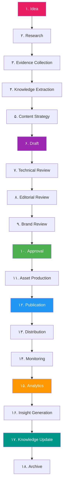
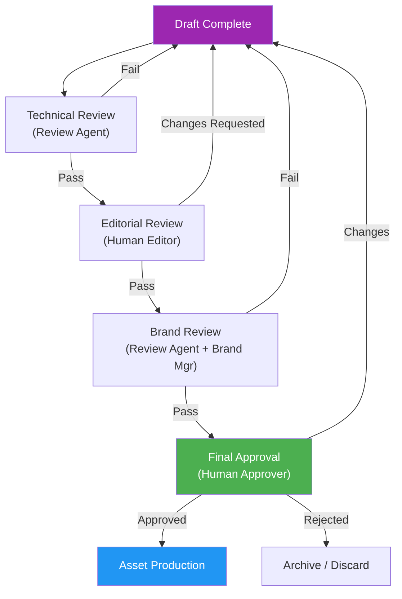
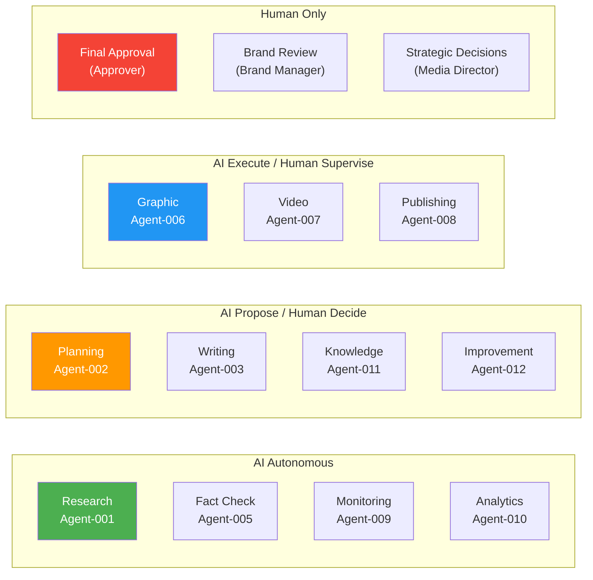
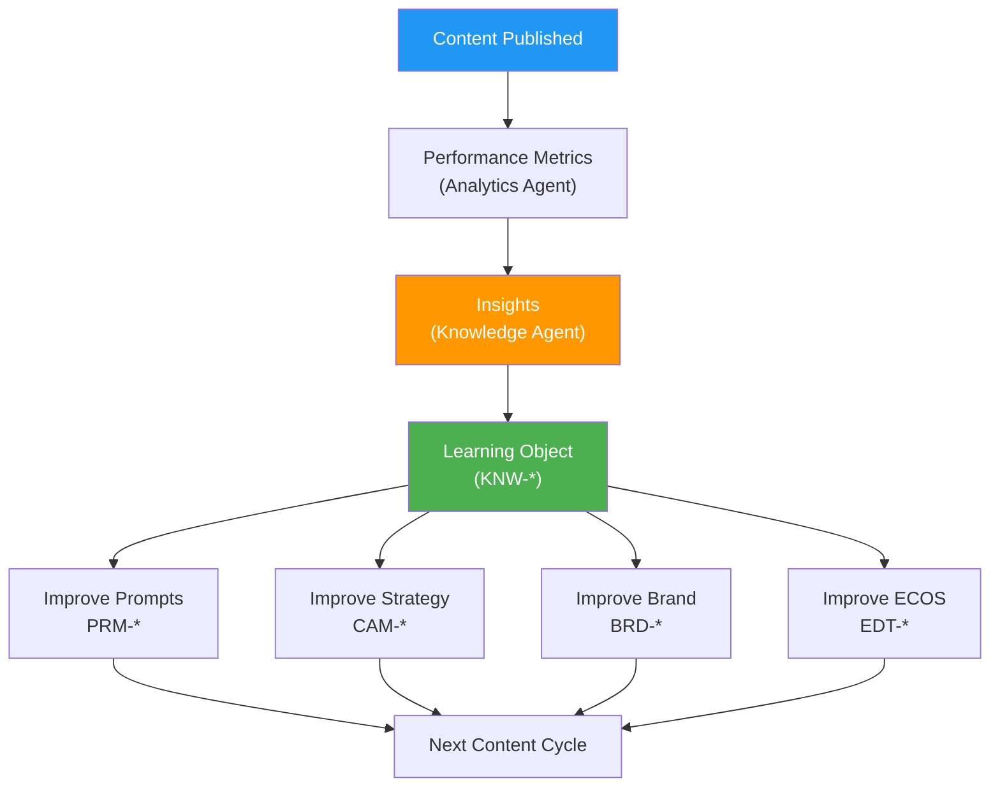

# Enterprise Content Operating System (ECOS) — سیستم عامل محتوای سازمانی

> **شناسه:** EDT-001
> **وضعیت:** پیش‌نویس
> **نسخه:** 1.0.0-draft
> **به‌روزرسانی:** 2026-06-27
> **مسئول:** مدیر محتوا (Content Manager)
> **وابستگی:** [CON-000](../05-CONSTITUTION/00-constitution.md), [ARCH-001](../00-ARCHITECTURE/01-system-overview.md), [ARCH-003](../00-ARCHITECTURE/03-glossary.md), [ARCH-011](../00-ARCHITECTURE/11-object-model.md), [ARCH-012](../00-ARCHITECTURE/12-knowledge-model.md), [ARCH-013](../00-ARCHITECTURE/13-ai-operating-model.md), [ARCH-014](../00-ARCHITECTURE/14-automation-model.md), [ARCH-030](../00-ARCHITECTURE/30-governance-architecture.md), [BRD-001](../22-BRAND/10-brand-identity.md), [GOV-001](../10-GOVERNANCE/01-documentation-standards.md), [GOV-004](../10-GOVERNANCE/04-cross-references.md)
> **مخاطب:** human, agent, n8n, mcp

---

## Architectural Dependencies

### Upstream Dependencies

| سند                                                          | نوع وابستگی | دلیل                                    |
| ------------------------------------------------------------ | ----------- | --------------------------------------- |
| [CON-000](../05-CONSTITUTION/00-constitution.md)             | governs     | اصول کیفیت، یکپارچگی، همکاری انسان و AI |
| [ARCH-001](../00-ARCHITECTURE/01-system-overview.md)         | depends-on  | نمای کلی سیستم، معماری محتوا            |
| [ARCH-003](../00-ARCHITECTURE/03-glossary.md)                | depends-on  | واژگان رسمی، هستی‌شناسی                 |
| [ARCH-010](../00-ARCHITECTURE/10-meta-architecture.md)       | depends-on  | لایه‌های سازمانی (Content, Knowledge)   |
| [ARCH-011](../00-ARCHITECTURE/11-object-model.md)            | depends-on  | ۲۲ شیء، چرخه حیات محتوا                 |
| [ARCH-012](../00-ARCHITECTURE/12-knowledge-model.md)         | depends-on  | مخازن دانش، جریان اطلاعات، حلقه بازخورد |
| [ARCH-013](../00-ARCHITECTURE/13-ai-operating-model.md)      | depends-on  | ۱۴ Agent، اختیار و محدودیت              |
| [ARCH-014](../00-ARCHITECTURE/14-automation-model.md)        | depends-on  | خط لوله محتوا، triggerها                |
| [ARCH-030](../00-ARCHITECTURE/30-governance-architecture.md) | depends-on  | حکمرانی، RACI، تصمیمات                  |
| [ARCH-031](../00-ARCHITECTURE/31-change-management.md)       | depends-on  | مدیریت تغییر                            |
| [BRD-001](../22-BRAND/10-brand-identity.md)                  | depends-on  | هویت برند، صدا، لحن، زبان               |
| [GOV-001](../10-GOVERNANCE/01-documentation-standards.md)    | depends-on  | استانداردهای مستندات                    |
| [GOV-004](../10-GOVERNANCE/04-cross-references.md)           | depends-on  | نظام ارجاع متقابل                       |

### Downstream Dependencies

| سند                         | نوع وابستگی        | دلیل                                             |
| --------------------------- | ------------------ | ------------------------------------------------ |
| [PLAT-\*](../20-PLATFORMS/) | depends-on EDT-001 | کتابچه‌های پلتفرم از ECOS استفاده می‌کنند        |
| [AUT-\*](../30-AUTOMATION/) | implements         | گردش کارهای n8n ECOS را پیاده‌سازی می‌کنند       |
| [AI-\*](../40-AI-AGENTS/)   | implements         | Agentها فرایندهای ECOS را اجرا می‌کنند           |
| [PRM-\*](../35-PROMPTS/)    | implements         | پرامپت‌ها قواعد ECOS را در Agentها اعمال می‌کنند |
| [OPS-\*](../50-OPERATIONS/) | follows            | رویه‌های عملیاتی از ECOS پیروی می‌کنند           |
| [MET-\*](../60-METRICS/)    | measures           | KPIها کیفیت ECOS را اندازه‌گیری می‌کنند          |
| [REP-\*](../55-REPORTS/)    | reports            | گزارش‌ها عملکرد ECOS را نمایش می‌دهند            |

### SSOT Ownership

| موضوع                  | SSOT                  |
| ---------------------- | --------------------- |
| Content Lifecycle      | **EDT-001** (این سند) |
| Content Objects        | **EDT-001** (این سند) |
| Quality Framework      | **EDT-001** (این سند) |
| Content Review Rules   | **EDT-001** (این سند) |
| Content Platform Rules | PLAT-\* (هر پلتفرم)   |
| Brand Voice & Tone     | BRD-001               |

### Related ADRs

| ADR     | عنوان                             | ارتباط                     |
| ------- | --------------------------------- | -------------------------- |
| ADR-010 | معماری متا به عنوان الگوی عملیاتی | لایه Content در معماری متا |
| ADR-011 | چرخه حیات محتوا ۱۵ مرحله الزامی   | مبنای چرخه حیات ECOS       |
| ADR-012 | ۱۴ Agent با مسئولیت واحد          | Agentها در هر مرحله        |
| ADR-013 | جداسازی Automation و Agent        | لایه اجرا vs لایه هوش      |
| ADR-015 | تأیید انسانی الزامی برای ۵ حوزه   | گیت‌های کیفیت انسانی       |

### Related Objects (from ARCH-011)

Campaign, Content Pillar, Content Series, Content Piece, Platform Version, Content Variant, Asset, Caption, Publication, Approval, Feedback, Knowledge Object, Metric, Report, Task

### Related AI Agents (from ARCH-013)

Orchestrator (000), Research (001), Planning (002), Writing (003), Review (004), Fact Check (005), Graphic (006), Video (007), Publishing (008), Monitoring (009), Analytics (010), Knowledge (011), Improvement (012)

---

## ۱. Executive Summary

ECOS (Enterprise Content Operating System) **سیستم عامل محتوای سازمانی SMOS** است. ECOS تعریف می‌کند که محتوا در SMOS چگونه ایجاد، تأیید، انتشار، اندازه‌گیری و به دانش تبدیل می‌شود.

ECOS یک سیستم تحریره ساده نیست — یک **سیستم عامل** است که تمام جنبه‌های حیات محتوا را پوشش می‌دهد:

```
┌─────────────────────────────────────────────────────────────┐
│                    ECOS Architecture                         │
├─────────────────────────────────────────────────────────────┤
│                                                              │
│  ┌─────────┐  ┌─────────┐  ┌─────────┐  ┌─────────┐        │
│  │ اشیاء   │→│ چرخه    │→│ کیفیت  │→│ حکمرانی │        │
│  │ محتوا   │  │ حیات    │  │         │  │         │        │
│  └─────────┘  └─────────┘  └─────────┘  └─────────┘        │
│       │            │            │            │              │
│       ▼            ▼            ▼            ▼              │
│  ┌─────────┐  ┌─────────┐  ┌─────────┐  ┌─────────┐        │
│  │ دانش   │←│ AI +    │←│ بازخورد│←│ یادگیری │        │
│  │         │  │ انسان   │  │         │  │         │        │
│  └─────────┘  └─────────┘  └─────────┘  └─────────┘        │
│                                                              │
└─────────────────────────────────────────────────────────────┘
```

### اصول بنیادین

| اصل         | توضیح                                       |
| ----------- | ------------------------------------------- |
| **ECOS-01** | هر محتوا یک دارایی دانش مدیریت‌شده است      |
| **ECOS-02** | هر محتوا دارای چرخه حیات کامل است           |
| **ECOS-03** | هر مرحله دارای گیت کیفیت است                |
| **ECOS-04** | هر محتوا قابل ردیابی و حسابرسی است          |
| **ECOS-05** | هر محتوای منتشرشده به سیستم دانش بازمی‌گردد |
| **ECOS-06** | انسان در حلقه تصمیم‌های کلیدی است           |

---

## ۲. Purpose of ECOS

ECOS برای پنج هدف طراحی شده است:

| هدف             | توضیح                                                |
| --------------- | ---------------------------------------------------- |
| **یکپارچگی**    | همه محتوا در همه پلتفرم‌ها از یک سیستم پیروی می‌کند  |
| **کیفیت**       | هر محتوا استانداردهای مشخصی را پاس می‌کند            |
| **ردیابی**      | هر محتوا قابل پیگیری از ایده تا انتشار و بازخورد است |
| **بازگشت دانش** | هر محتوا دانش جدیدی به سیستم بازمی‌گرداند            |
| **مقیاس‌پذیری** | سیستم برای هر تعداد پلتفرم و محتوا کار می‌کند        |

---

## ۳. Content Philosophy

فلسفه محتوای SMOS:

| اصل             | توضیح                                                                  |
| --------------- | ---------------------------------------------------------------------- |
| **ارزش‌آفرینی** | هر محتوا باید برای مخاطب ارزش ایجاد کند — ارزش = سرگرمی + آموزش + بینش |
| **اصالت**       | محتوا واقعی، دقیق و مبتنی بر شواهد است                                 |
| **سازگاری**     | محتوا با هویت برند و ارزش‌های سازمان سازگار است                        |
| **مخاطب‌محوری** | محتوا برای مخاطب خاص طراحی می‌شود، نه برای همه                         |
| **دانش‌زایی**   | هر محتوا فرصتی برای تولید دانش جدید است                                |
| **تکامل**       | محتوا بر اساس بازخورد و یادگیری بهبود می‌یابد                          |

---

## ۴. Content Taxonomy

### سلسله‌مراتب محتوا

```
Enterprise Vision
  └── Content Strategy (استراتژی محتوا)
       └── Campaign (کمپین)
            └── Content Pillar (ستون محتوا)
                 └── Content Series (سری محتوا)
                      └── Content Piece (قطعه محتوا)
                           └── Platform Version (نسخه پلتفرم)
                                └── Content Variant (واریانت)
                                     └── Publication (انتشار)
```

### انواع محتوا بر اساس هدف

| نوع             | هدف                  | مثال                        |
| --------------- | -------------------- | --------------------------- |
| **آموزشی**      | انتقال دانش و آگاهی  | راهنما، آموزش، مقاله تحلیلی |
| **الهام‌بخش**   | ایجاد انگیزه و بینش  | داستان موفقیت، نقل‌قول      |
| **سرگرم‌کننده** | جلب توجه و تعامل     | چالش، نظرسنجی، طنز          |
| **تبلیغاتی**    | معرفی محصول/خدمت     | معرفی، پیشنهاد ویژه         |
| **تعاملی**      | ایجاد ارتباط دوطرفه  | پرسش و پاسخ، گفتگو          |
| **اخباری**      | اطلاع‌رسانی رویدادها | اطلاعیه، بیانیه             |
| **حمایتی**      | پشتیبانی از مخاطب    | پاسخ به سؤال، راهنمایی      |

---

## ۵. Content Object Model

ECOS از ۱۵ شیء اصلی تشکیل شده است:

### CO-01: Idea (ایده)

| فیلد         | مقدار                                           |
| ------------ | ----------------------------------------------- |
| **هدف**      | ثبت اولیه یک ایده برای محتوا                    |
| **والد**     | Content Strategy / Campaign                     |
| **مالک**     | هر کس                                           |
| **وضعیت‌ها** | new → reviewed → accepted → rejected → archived |
| **SSOT**     | ابزاری (سیستم)                                  |

### CO-02: Research (تحقیق)

| فیلد         | مقدار                                          |
| ------------ | ---------------------------------------------- |
| **هدف**      | اطلاعات ساختاریافته درباره موضوع               |
| **والد**     | Idea                                           |
| **مالک**     | Research Agent / Researcher                    |
| **وضعیت‌ها** | in_progress → completed → validated → archived |
| **SSOT**     | ابزاری                                         |

### CO-03: Evidence (شاهد)

| فیلد         | مقدار                                |
| ------------ | ------------------------------------ |
| **هدف**      | منبع قابل استناد برای یک ادعا        |
| **والد**     | Research                             |
| **مالک**     | Fact Check Agent / Researcher        |
| **وضعیت‌ها** | collected → verified →引用 → expired |
| **SSOT**     | ابزاری                               |

### CO-04: Knowledge Object (شیء دانش)

| فیلد         | مقدار                                           |
| ------------ | ----------------------------------------------- |
| **هدف**      | واحد پایه دانش — تعریف‌شده در ARCH-012          |
| **والد**     | Knowledge Domain                                |
| **مالک**     | Knowledge Manager                               |
| **وضعیت‌ها** | draft → reviewed → approved → active → archived |
| **SSOT**     | [KNW-\*](../45-KNOWLEDGE/)                      |

### CO-05: Insight (بینش)

| فیلد         | مقدار                                      |
| ------------ | ------------------------------------------ |
| **هدف**      | دانش عمیق و قابل اقدام از ترکیب یافته‌ها   |
| **والد**     | Finding                                    |
| **مالک**     | Analytics Agent / Analyst                  |
| **وضعیت‌ها** | generated → validated → applied → archived |
| **SSOT**     | [KNW-\*](../45-KNOWLEDGE/)                 |

### CO-06: Content Brief (خلاصه محتوا)

| فیلد         | مقدار                           |
| ------------ | ------------------------------- |
| **هدف**      | سند راهنمای تولید یک قطعه محتوا |
| **والد**     | Content Series                  |
| **مالک**     | Content Manager                 |
| **وضعیت‌ها** | draft → reviewed → approved     |
| **SSOT**     | ابزاری                          |

### CO-07: Draft (پیش‌نویس)

| فیلد         | مقدار                                     |
| ------------ | ----------------------------------------- |
| **هدف**      | نسخه اولیه محتوای تولیدشده                |
| **والد**     | Content Brief                             |
| **مالک**     | Writing Agent / Writer                    |
| **وضعیت‌ها** | in_progress → submitted → revised → final |
| **SSOT**     | ابزاری                                    |

### CO-08: Review (بازبینی)

| فیلد         | مقدار                                                           |
| ------------ | --------------------------------------------------------------- |
| **هدف**      | ثبت و مدیریت فرایند بازبینی                                     |
| **والد**     | Draft                                                           |
| **مالک**     | Reviewer                                                        |
| **وضعیت‌ها** | pending → in_progress → changes_requested → approved → rejected |
| **SSOT**     | ابزاری                                                          |

### CO-09: Approval (تأیید)

| فیلد         | مقدار                         |
| ------------ | ----------------------------- |
| **هدف**      | ثبت تصمیم نهایی برای انتشار   |
| **والد**     | Review                        |
| **مالک**     | Approver                      |
| **وضعیت‌ها** | pending → approved → rejected |
| **SSOT**     | ابزاری                        |

### CO-10: Publication (انتشار)

| فیلد         | مقدار                                                  |
| ------------ | ------------------------------------------------------ |
| **هدف**      | ثبت رویداد انتشار در پلتفرم                            |
| **والد**     | Content Variant                                        |
| **مالک**     | Publishing Agent                                       |
| **وضعیت‌ها** | scheduled → publishing → published → failed → retrying |
| **SSOT**     | ابزاری                                                 |

### CO-11: Asset (دارایی)

| فیلد         | مقدار                                                       |
| ------------ | ----------------------------------------------------------- |
| **هدف**      | فایل رسانه‌ای — تعریف‌شده در ARCH-011                       |
| **والد**     | Content Piece                                               |
| **مالک**     | Asset Manager                                               |
| **وضعیت‌ها** | uploaded → processing → ready → in_use → archived → deleted |
| **SSOT**     | [AST-\*](../26-ASSETS/)                                     |

### CO-12: Campaign (کمپین)

| فیلد         | مقدار                                                     |
| ------------ | --------------------------------------------------------- |
| **هدف**      | مجموعه فعالیت‌های رسانه‌ای با هدف مشخص                    |
| **مالک**     | Media Director                                            |
| **وضعیت‌ها** | draft → approved → active → paused → completed → archived |
| **SSOT**     | CAM-\*                                                    |

### CO-13: Metric (متریک)

| فیلد         | مقدار                                       |
| ------------ | ------------------------------------------- |
| **هدف**      | کمیت قابل اندازه‌گیری عملکرد محتوا          |
| **مالک**     | Analyst                                     |
| **وضعیت‌ها** | defined → implemented → active → deprecated |
| **SSOT**     | [MET-\*](../60-METRICS/)                    |

### CO-14: Feedback (بازخورد)

| فیلد         | مقدار                                        |
| ------------ | -------------------------------------------- |
| **هدف**      | نظر اصلاحی یا تکمیلی                         |
| **مالک**     | Reviewer / Consumer                          |
| **وضعیت‌ها** | submitted → acknowledged → resolved → closed |
| **SSOT**     | ابزاری                                       |

### CO-15: Learning (یادگیری)

| فیلد         | مقدار                                      |
| ------------ | ------------------------------------------ |
| **هدف**      | دانش استخراج‌شده از عملکرد محتوا           |
| **مالک**     | Knowledge Agent                            |
| **وضعیت‌ها** | extracted → validated → applied → archived |
| **SSOT**     | [KNW-\*](../45-KNOWLEDGE/)                 |

---

## ۶. Content Lifecycle

### چرخه حیات کامل محتوا (۱۸ مرحله)



### جزئیات هر مرحله

#### Stage 1: Idea

| فیلد          | مقدار                                             |
| ------------- | ------------------------------------------------- |
| **ورودی**     | نیاز مخاطب، هدف کمپین، فرصت محتوایی               |
| **خروجی**     | ایده ثبت‌شده با موضوع، هدف، مخاطب                 |
| **مالک**      | Content Manager / Research Agent                  |
| **شرط ورود**  | — (اولین مرحله)                                   |
| **شرط خروج**  | ایده ثبت و اولویت‌بندی شده است                    |
| **گیت کیفیت** | ایده با استراتژی محتوا و ارزش‌های برند سازگار است |
| **AI مجاز**   | Research Agent می‌تواند ایده پیشنهاد دهد          |

#### Stage 2: Research

| فیلد          | مقدار                                       |
| ------------- | ------------------------------------------- |
| **ورودی**     | ایده تأییدشده                               |
| **خروجی**     | گزارش تحقیق شامل منابع، داده‌ها، تحلیل رقبا |
| **مالک**      | Research Agent                              |
| **شرط ورود**  | ایده تأیید و اولویت‌بندی شده                |
| **شرط خروج**  | حداقل ۳ منبع معتبر جمع‌آوری شده             |
| **گیت کیفیت** | منابع معتبر، به‌روز و مرتبط                 |
| **AI مجاز**   | Research Agent — مستقل                      |

#### Stage 3: Evidence Collection

| فیلد          | مقدار                                                                                      |
| ------------- | ------------------------------------------------------------------------------------------ |
| **ورودی**     | گزارش تحقیق                                                                                |
| **خروجی**     | شواهد مستند با درجه اعتبار                                                                 |
| **مالک**      | Fact Check Agent                                                                           |
| **شرط ورود**  | تحقیق تکمیل شده                                                                            |
| **شرط خروج**  | هر ادعا حداقل یک شاهد معتبر دارد                                                           |
| **گیت کیفیت** | شواهد با [ARCH-033](../00-ARCHITECTURE/33-knowledge-audit-traceability.md) §۴ مطابقت دارند |
| **AI مجاز**   | Fact Check Agent — مستقل                                                                   |

#### Stage 4: Knowledge Extraction

| فیلد          | مقدار                                  |
| ------------- | -------------------------------------- |
| **ورودی**     | تحقیق + شواهد                          |
| **خروجی**     | اشیاء دانش ساختاریافته                 |
| **مالک**      | Knowledge Agent                        |
| **شرط ورود**  | شواهد جمع‌آوری و اعتبارسنجی شده‌اند    |
| **شرط خروج**  | دانش استخراج‌شده در KNW-\* ثبت شده     |
| **گیت کیفیت** | دانش جدید با دانش موجود تضاد ندارد     |
| **AI مجاز**   | Knowledge Agent — نیاز به تأیید انسانی |

#### Stage 5: Content Strategy

| فیلد          | مقدار                                     |
| ------------- | ----------------------------------------- |
| **ورودی**     | دانش + اهداف کمپین                        |
| **خروجی**     | Content Brief شامل هدف، مخاطب، لحن، کانال |
| **مالک**      | Planning Agent + Content Manager          |
| **شرط ورود**  | دانش پایه موجود است                       |
| **شرط خروج**  | Brief توسط Content Manager تأیید شده      |
| **گیت کیفیت** | Brief با CAM-_ و BRD-_ سازگار است         |
| **AI مجاز**   | Planning Agent — پیشنهاد، تأیید با انسان  |

#### Stage 6: Draft

| فیلد          | مقدار                                          |
| ------------- | ---------------------------------------------- |
| **ورودی**     | Content Brief                                  |
| **خروجی**     | پیش‌نویس محتوای کامل                           |
| **مالک**      | Writing Agent                                  |
| **شرط ورود**  | Brief تأیید شده                                |
| **شرط خروج**  | متن کامل، ساختاریافته و خوانا                  |
| **گیت کیفیت** | رعایت BRD-001 §۱۰ (صدا)، §۱۱ (لحن)، §۱۲ (زبان) |
| **AI مجاز**   | Writing Agent — مستقل در تولید                 |

#### Stage 7: Technical Review

| فیلد          | مقدار                                  |
| ------------- | -------------------------------------- |
| **ورودی**     | پیش‌نویس                               |
| **خروجی**     | گزارش بازبینی فنی                      |
| **مالک**      | Review Agent                           |
| **شرط ورود**  | پیش‌نویس کامل                          |
| **شرط خروج**  | خطاهای فنی (SEO, لینک, قالب) بررسی شده |
| **گیت کیفیت** | ساختار فنی، SEO readiness، لینک‌ها     |
| **AI مجاز**   | Review Agent — مستقل                   |

#### Stage 8: Editorial Review

| فیلد          | مقدار                                        |
| ------------- | -------------------------------------------- |
| **ورودی**     | پیش‌نویس + گزارش فنی                         |
| **خروجی**     | گزارش بازبینی تحریریه                        |
| **مالک**      | Human Editor / Review Agent                  |
| **شرط ورود**  | Technical Review گذرانده                     |
| **شرط خروج**  | کیفیت نگارش، روانی، انسجام تأیید شده         |
| **گیت کیفیت** | زبان، ساختار، وضوح، انسجام                   |
| **AI مجاز**   | Review Agent — پیشنهاد؛ تأیید نهایی با انسان |

#### Stage 9: Brand Review

| فیلد          | مقدار                                        |
| ------------- | -------------------------------------------- |
| **ورودی**     | پیش‌نویس + اصلاحات تحریریه                   |
| **خروجی**     | گزارش تطابق برند                             |
| **مالک**      | Review Agent + Brand Manager                 |
| **شرط ورود**  | Editorial Review گذرانده                     |
| **شرط خروج**  | تطابق کامل با BRD-001                        |
| **گیت کیفیت** | صدا، لحن، زبان، ارزش‌ها، شخصیت برند          |
| **AI مجاز**   | Review Agent — بازبینی؛ تأیید نهایی با انسان |

#### Stage 10: Approval

| فیلد          | مقدار                                     |
| ------------- | ----------------------------------------- |
| **ورودی**     | پیش‌نویس نهایی + همه گزارش‌های بازبینی    |
| **خروجی**     | تصمیم تأیید / رد / تغییر                  |
| **مالک**      | Approver (Human)                          |
| **شرط ورود**  | هر ۳ بازبینی (فنی، تحریریه، برند) گذرانده |
| **شرط خروج**  | تصمیم ثبت شده                             |
| **گیت کیفیت** | — (مرحله تصمیم)                           |
| **AI مجاز**   | **خیر** — فقط انسان                       |

#### Stage 11: Asset Production

| فیلد          | مقدار                                            |
| ------------- | ------------------------------------------------ |
| **ورودی**     | محتوای تأییدشده + نیازمندی‌های بصری              |
| **خروجی**     | Assetهای نهایی (تصویر، ویدئو، اینفوگرافیک)       |
| **مالک**      | Graphic Agent / Video Agent                      |
| **شرط ورود**  | محتوا تأیید شده                                  |
| **شرط خروج**  | Assetها با BRD-001 §§۱۴-۲۰ سازگارند              |
| **گیت کیفیت** | کیفیت بصری، تطابق برند, техническая спецификация |
| **AI مجاز**   | Graphic/Video Agent — نیاز به تأیید انسانی       |

#### Stage 12: Publication

| فیلد          | مقدار                                          |
| ------------- | ---------------------------------------------- |
| **ورودی**     | محتوای نهایی + Assetها + برنامه زمان‌بندی      |
| **خروجی**     | محتوای منتشرشده در پلتفرم                      |
| **مالک**      | Publishing Agent                               |
| **شرط ورود**  | همه تأییدها اخذ شده، Assetها آماده             |
| **شرط خروج**  | محتوا در پلتفرم منتشر شده                      |
| **گیت کیفیت** | —                                              |
| **AI مجاز**   | Publishing Agent — خودکار برای محتوای تأییدشده |

#### Stage 13: Distribution

| فیلد          | مقدار                                           |
| ------------- | ----------------------------------------------- |
| **ورودی**     | محتوای منتشرشده                                 |
| **خروجی**     | محتوا در کانال‌های توزیع (وبسایت، خبرنامه، RSS) |
| **مالک**      | n8n Workflow                                    |
| **شرط ورود**  | Publication موفق                                |
| **شرط خروج**  | محتوا در همه کانال‌های توزیع هدف منتشر شده      |
| **گیت کیفیت** | توزیع کامل و بدون خطا                           |
| **AI مجاز**   | **خیر** — خودکارسازی n8n                        |

#### Stage 14: Monitoring

| فیلد          | مقدار                             |
| ------------- | --------------------------------- |
| **ورودی**     | داده‌های API پلتفرم               |
| **خروجی**     | هشدارها، داده‌های خام عملکرد      |
| **مالک**      | Monitoring Agent                  |
| **شرط ورود**  | محتوا منتشر شده                   |
| **شرط خروج**  | داده‌های ۲۴ ساعت اول جمع‌آوری شده |
| **گیت کیفیت** | داده‌ها کامل و بدون نقص           |
| **AI مجاز**   | Monitoring Agent — خودکار         |

#### Stage 15: Analytics

| فیلد          | مقدار                                |
| ------------- | ------------------------------------ |
| **ورودی**     | داده‌های خام + MET-\*                |
| **خروجی**     | گزارش تحلیل، روندها، یافته‌ها        |
| **مالک**      | Analytics Agent                      |
| **شرط ورود**  | داده کافی (حداقل ۷ روز) جمع‌آوری شده |
| **شرط خروج**  | تحلیل کامل با یافته‌های مستند        |
| **گیت کیفیت** | تحلیل مبتنی بر داده، نه حدس          |
| **AI مجاز**   | Analytics Agent — مستقل در تحلیل     |

#### Stage 16: Insight Generation

| فیلد          | مقدار                                  |
| ------------- | -------------------------------------- |
| **ورودی**     | گزارش تحلیل + یافته‌ها                 |
| **خروجی**     | بینش‌های قابل اقدام                    |
| **مالک**      | Knowledge Agent                        |
| **شرط ورود**  | تحلیل تکمیل شده                        |
| **شرط خروج**  | بینش‌ها مستند و قابل ارجاع             |
| **گیت کیفیت** | بینش با شواهد پشتیبانی می‌شود          |
| **AI مجاز**   | Knowledge Agent — نیاز به تأیید انسانی |

#### Stage 17: Knowledge Update

| فیلد          | مقدار                                     |
| ------------- | ----------------------------------------- |
| **ورودی**     | بینش‌های تأییدشده                         |
| **خروجی**     | به‌روزرسانی KNW-_, PRM-_, BRD-_, EDT-_    |
| **مالک**      | Knowledge Manager                         |
| **شرط ورود**  | بینش‌ها تأیید شده‌اند                     |
| **شرط خروج**  | دانش در SSOT مربوطه ثبت شده               |
| **گیت کیفیت** | دانش جدید با ARCH-033 §۳ مطابقت دارد      |
| **AI مجاز**   | Knowledge Agent — پیشنهاد؛ تأیید با انسان |

#### Stage 18: Archive

| فیلد          | مقدار                                           |
| ------------- | ----------------------------------------------- |
| **ورودی**     | محتوای قدیمی (بیش از ۱ سال)                     |
| **خروجی**     | محتوا در آرشیو با فراداده کامل                  |
| **مالک**      | سیستم (n8n)                                     |
| **شرط ورود**  | محتوا بیش از ۱ سال منتشر شده و بدون به‌روزرسانی |
| **شرط خروج**  | محتوا در ARC-\* بایگانی شده                     |
| **گیت کیفیت** | فراداده کامل، قابل بازیابی                      |
| **AI مجاز**   | سیستم — خودکار                                  |

---

## ۷. Knowledge-to-Content Pipeline

```mermaid
graph LR
    subgraph "Knowledge Layer"
        K1["KNW-*<br/>پایگاه دانش"] --> K2["Research Agent<br/>تحقیق"]
        K2 --> K3["Evidence<br/>شواهد"]
        K3 --> K4["Fact Check Agent<br/>راستی‌آزمایی"]
    end

    subgraph "Content Layer"
        K4 --> C1["Content Brief<br/>(Planning Agent)"]
        C1 --> C2["Draft<br/>(Writing Agent)"]
        C2 --> C3["Review<br/>(Review Agent)"]
        C3 --> C4["Approval<br/>(Human)"]
    end

    subgraph "Execution Layer"
        C4 --> E1["Asset Production<br/>(Graphic/Video Agent)"]
        E1 --> E2["Publication<br/>(Publishing Agent)"]
        E2 --> E3["Distribution<br/>(n8n)"]
    end

    subgraph "Feedback Layer"
        E3 --> F1["Monitoring<br/>(Monitoring Agent)"]
        F1 --> F2["Analytics<br/>(Analytics Agent)"]
        F2 --> F3["Knowledge Agent<br/>Insight Extraction"]
        F3 -->|"به‌روزرسانی"| K1
    end

    style K1 fill:#009688,color:#fff
    style C2 fill:#9c27b0,color:#fff
    style C4 fill:#4caf50,color:#fff
    style E2 fill:#2196f3,color:#fff
    style F3 fill:#ff9800,color:#fff
```



---

## ۸. Research Framework

| مرحله              | توضیح                             | مسئول            |
| ------------------ | --------------------------------- | ---------------- |
| **موضوع‌یابی**     | شناسایی موضوعات مرتبط با کمپین    | Research Agent   |
| **جمع‌آوری منابع** | یافتن منابع معتبر (داخلی + خارجی) | Research Agent   |
| **تحلیل رقبا**     | بررسی محتوای رقبا در موضوع        | Research Agent   |
| **اعتبارسنجی**     | بررسی اعتبار منابع                | Fact Check Agent |
| **خلاصه‌سازی**     | استخراج نکات کلیدی                | Research Agent   |
| **ذخیره دانش**     | ثبت در KNW-\*                     | Knowledge Agent  |

### قواعد تحقیق

| قاعده  | توضیح                                          |
| ------ | ---------------------------------------------- |
| RSR-01 | حداقل ۳ منبع مستقل برای هر موضوع               |
| RSR-02 | منابع باید تاریخ‌دار و قابل استناد باشند       |
| RSR-03 | ادعاهای بدون منبع باید صریحاً برچسب‌گذاری شوند |
| RSR-04 | تحقیق باید قابل بازتولید (reproducible) باشد   |

---

## ۹. Evidence & Source Validation

### درجات اعتبار شواهد

| درجه    | توضیح                     | مثال                       |
| ------- | ------------------------- | -------------------------- |
| **T-1** | تأییدشده توسط متخصص       | مقاله علمی، گزارش رسمی     |
| **T-2** | منبع معتبر با ارجاع       | خبرگزاری رسمی، سایت دولتی  |
| **T-3** | منبع نیمه‌معتبر           | وبلاگ تخصصی، رسانه غیررسمی |
| **T-4** | تأییدنشده — نیاز به بررسی | شبکه اجتماعی، منبع شخصی    |
| **T-5** | غیرقابل استناد            | شایعه، حدس، منبع ناشناس    |

### قواعد استفاده

| درجه | مجاز در محتوا          | نیاز به ذکر منبع |
| ---- | ---------------------- | ---------------- |
| T-1  | بله                    | بله              |
| T-2  | بله                    | بله              |
| T-3  | با احتیاط              | بله              |
| T-4  | فقط پس از ارتقا به T-3 | بله              |
| T-5  | هرگز                   | —                |

---

## ۱۰. Audience Mapping

| فیلد              | توضیح                                                      |
| ----------------- | ---------------------------------------------------------- |
| **مخاطب هدف**     | گروه مخاطب مشخص از AUD-\*                                  |
| **نیاز**          | نیاز اطلاعاتی، عاطفی یا عملی مخاطب                         |
| **زمینه**         | بستر و موقعیت مصرف محتوا                                   |
| **دانش پیش‌نیاز** | سطح دانش مخاطب درباره موضوع                                |
| **هدف محتوا**     | آنچه مخاطب پس از مصرف محتوا باید بداند/احساس کند/انجام دهد |

### ماتریس مخاطب × محتوا

| بعد مخاطب  | تأثیر بر محتوا                     |
| ---------- | ---------------------------------- |
| سطح دانش   | عمق فنی، jargon                    |
| نیاز عاطفی | لحن (ماتریس BRD-001 §۱۱)           |
| بستر مصرف  | طول محتوا، قالب                    |
| انتظار     | نوع محتوا (آموزشی، الهام‌بخش، ...) |

---

## ۱۱. Content Intent Framework

چارچوب قصد محتوا — هر محتوا باید یک قصد مشخص داشته باشد:

| قصد            | توضیح               | شاخص موفقیت            |
| -------------- | ------------------- | ---------------------- |
| **آگاه‌سازی**  | افزایش آگاهی مخاطب  | اشتراک‌گذاری، بازدید   |
| **آموزش**      | انتقال دانش         | بازخورد مثبت, ذخیره    |
| **متقاعدسازی** | تغییر نگرش یا رفتار | کلیک, ثبت‌نام, خرید    |
| **سرگرمی**     | ایجاد تجربه مثبت    | تعامل, اشتراک          |
| **ارتباط**     | ایجاد رابطه بلندمدت | بازگشت مخاطب, وفاداری  |
| **اقدام**      | دعوت به اقدام مشخص  | نرخ تبدیل (Conversion) |

### قاعده قصد

| قاعده  | توضیح                                     |
| ------ | ----------------------------------------- |
| INT-01 | هر محتوا دقیقاً یک قصد اصلی دارد          |
| INT-02 | قصدهای فرعی می‌توانند مکمل باشند          |
| INT-03 | شاخص موفقیت بر اساس قصد اصلی تعریف می‌شود |

---

## ۱۲. Editorial Governance

### ماتریس RACI محتوا

| فعالیت                   | Content Manager | Writer/Agent | Reviewer | Brand Manager | Approver | Publisher |
| ------------------------ | --------------- | ------------ | -------- | ------------- | -------- | --------- |
| **تعریف استراتژی محتوا** | A/R             | C            | C        | C             | I        | —         |
| **تولید ایده**           | A               | R            | C        | —             | —        | —         |
| **تحقیق**                | I               | R            | C        | —             | —        | —         |
| **نویسندگی**             | I               | R            | —        | —             | —        | —         |
| **بازبینی فنی**          | C               | —            | R        | —             | —        | —         |
| **بازبینی تحریریه**      | C               | —            | A/R      | —             | —        | —         |
| **بازبینی برند**         | C               | —            | C        | A/R           | —        | —         |
| **تأیید نهایی**          | C               | —            | C        | C             | A/R      | —         |
| **تولید Asset**          | I               | R            | —        | C             | —        | —         |
| **انتشار**               | I               | —            | —        | —             | —        | A/R       |
| **نظارت**                | I               | —            | —        | —             | —        | A/R       |
| **تحلیل**                | A               | R            | —        | —             | —        | I         |
| **به‌روزرسانی دانش**     | C               | R            | C        | —             | A        | —         |

R = Responsible, A = Accountable, C = Consulted, I = Informed

### سطوح بازبینی

| سطح | نوع         | بازبین        | حداکثر زمان |
| --- | ----------- | ------------- | ----------- |
| L-1 | فنی         | Review Agent  | خودکار      |
| L-2 | تحریریه     | Human Editor  | ۴ ساعت      |
| L-3 | برند        | Brand Manager | ۸ ساعت      |
| L-4 | تأیید نهایی | Approver      | ۴ ساعت      |

---

## ۱۳. Quality Assurance Framework

### ۱۲ بُعد کیفیت

| بُعد                    | توضیح                | معیار                               | اندازه‌گیری        |
| ----------------------- | -------------------- | ----------------------------------- | ------------------ |
| **Accuracy**            | دقت اطلاعات          | عدم وجود خطای واقعی                 | Fact Check Agent   |
| **Evidence**            | استناد به منابع      | هر ادعا = منبع                      | Evidence Collector |
| **Brand Alignment**     | تطابق با برند        | مطابقت با BRD-001                   | Review Agent       |
| **Engineering Quality** | کیفیت فنی            | SEO, readability, structure         | Review Agent       |
| **Language Quality**    | کیفیت زبان           | دستور زبان، املا، روانی             | Human Editor       |
| **Readability**         | خوانایی              | نمره خوانایی > ۶۰٪                  | ابزار خودکار       |
| **SEO Readiness**       | آمادگی SEO           | کلمات کلیدی, متا, ساختار            | Review Agent       |
| **Platform Neutrality** | بی‌طرفی پلتفرمی      | عدم وابستگی به یک پلتفرم            | Review Agent       |
| **AI Safety**           | ایمنی AI             | عدم محتوای مضر, تبعیض‌آمیز          | AI Safety Check    |
| **Human Review Status** | وضعیت بازبینی انسانی | مراحل بازبینی کامل                  | سیستم              |
| **Freshness**           | تازگی                | کمتر از ۱ سال از آخرین به‌روزرسانی  | سیستم              |
| **Reusability**         | قابلیت استفاده مجدد  | قابل بومی‌سازی برای پلتفرم‌های دیگر | Content Manager    |

### گیت‌های کیفیت (Quality Gates)

هر مرحله از چرخه حیات یک گیت کیفیت دارد (در §۶ تعریف شده). محتوا بدون عبور از گیت نمی‌تواند به مرحله بعد برود.

---

## ۱۴. Human Review Workflow



---

## ۱۵. AI Collaboration Workflow



### ماتریس همکاری AI-انسان

| مرحله                | AI      | انسان     | سطح اختیار |
| -------------------- | ------- | --------- | ---------- |
| Idea                 | پیشنهاد | انتخاب    | A-1        |
| Research             | اجرا    | نظارت     | A-2        |
| Evidence             | اجرا    | —         | A-4        |
| Knowledge Extraction | پیشنهاد | تأیید     | A-1        |
| Content Strategy     | پیشنهاد | تأیید     | A-1        |
| Draft                | اجرا    | نظارت     | A-2        |
| Technical Review     | اجرا    | —         | A-4        |
| Editorial Review     | پیشنهاد | تأیید     | A-1        |
| Brand Review         | پیشنهاد | تأیید     | A-1        |
| Approval             | —       | فقط انسان | A-0        |
| Asset Production     | اجرا    | نظارت     | A-2        |
| Publication          | اجرا    | —         | A-3        |
| Distribution         | —       | —         | Automation |
| Monitoring           | اجرا    | —         | A-4        |
| Analytics            | اجرا    | نظارت     | A-2        |
| Insight Generation   | پیشنهاد | تأیید     | A-1        |
| Knowledge Update     | پیشنهاد | تأیید     | A-1        |
| Archive              | اجرا    | —         | A-4        |

### آستانه اطمینان (Confidence Thresholds)

| فعالیت       | آستانه | اقدام در زیر آستانه         |
| ------------ | ------ | --------------------------- |
| تولید متن    | ۸۵٪    | ارسال به بازبینی انسانی優先 |
| تحلیل داده   | ۹۰٪    | بررسی دستی                  |
| تطابق برند   | ۹۵٪    | ارسال به Brand Manager      |
| راستی‌آزمایی | ۹۸٪    | برچسب "نیاز به بررسی"       |
| پیشنهاد دانش | ۸۰٪    | ارسال به Knowledge Manager  |

### قواعد escalation

| شرط                     | اقدام                         |
| ----------------------- | ----------------------------- |
| AI اطمینان < آستانه     | ارسال به انسان                |
| ۲ بازبینی متوالی ناموفق | ارسال به Reviewer ارشد        |
| مغایرت بین AI و انسان   | انسان تصمیم نهایی             |
| خطای بحرانی             | توقف workflow + اعلان به مدیر |

---

## ۱۶. Approval Matrix (RACI)

جدول کامل RACI در §۱۲ ارائه شده است. سطوح تأیید:

| سطح     | تأییدکننده      | دامنه          |
| ------- | --------------- | -------------- |
| **A-1** | Review Agent    | فنی، ساختاری   |
| **A-2** | Human Editor    | تحریریه، زبان  |
| **A-3** | Brand Manager   | برند، هویت     |
| **A-4** | Content Manager | استراتژیک      |
| **A-5** | Media Director  | بحرانی، استثنا |

---

## ۱۷. Publishing Readiness Criteria

محتوا برای انتشار آماده است اگر و فقط اگر:

| معیار  | توضیح                                               |
| ------ | --------------------------------------------------- |
| PRC-01 | همه بازبینی‌ها (فنی، تحریریه، برند) گذرانده شده‌اند |
| PRC-02 | تأیید نهایی (Human Approval) ثبت شده                |
| PRC-03 | Assetهای مورد نیاز تولید و تأیید شده‌اند            |
| PRC-04 | Platform Version برای پلتفرم هدف تعریف شده          |
| PRC-05 | Caption متناسب با پلتفرم نوشته شده                  |
| PRC-06 | زمان‌بندی انتشار در تقویم تحریریه ثبت شده           |
| PRC-07 | همه حقوق محتوا (تصویر، موسیقی) clear شده            |
| PRC-08 | محتوا با قواعد پلتفرم (PLAT-\*) سازگار است          |

---

## ۱۸. Distribution Strategy Model

| کانال توزیع        | هدف                       | محتوای مناسب      |
| ------------------ | ------------------------- | ----------------- |
| **پلتفرم اصلی**    | انتشار اولیه              | محتوای کامل       |
| **وبسایت**         | آرشیو + SEO               | محتوای کامل + متا |
| **خبرنامه**        | اطلاع‌رسانی به مشترکان    | خلاصه + لینک      |
| **RSS**            | feed readers              | عنوان + خلاصه     |
| **Cross-platform** | انتشار در پلتفرم‌های دیگر | Platform Version  |
| **Repurpose**      | استفاده مجدد در قالب دیگر | Content Variant   |

---

## ۱۹. Performance Measurement Framework

| مرحله         | معیار                | ابزار            |
| ------------- | -------------------- | ---------------- |
| پیش از انتشار | نمره کیفیت (۱۲ بُعد) | Review Agent     |
| لحظه انتشار   | موفقیت/شکست انتشار   | Publishing Agent |
| ۲۴ ساعت       | تعامل اولیه          | Monitoring Agent |
| ۷ روز         | عملکرد اصلی          | Analytics Agent  |
| ۳۰ روز        | روند بلندمدت         | Analytics Agent  |
| ۳ ماه         | تأثیر استراتژیک      | Human Analyst    |
| ۱ سال         | بازبینی نهایی        | Content Manager  |

---

## ۲۰. Feedback & Learning Loop



---

## ۲۱. Knowledge Feedback Integration

| بازخورد            | مبدأ        | مقصد              | فرکانس |
| ------------------ | ----------- | ----------------- | ------ |
| بهبود محتوای بعدی  | Analytics   | Campaign Strategy | هفتگی  |
| به‌روزرسانی پرامپت | Knowledge   | PRM-\*            | ماهانه |
| به‌روزرسانی دانش   | Knowledge   | KNW-\*            | هفتگی  |
| بهبود فرایند       | Improvement | AUT-\*            | ماهانه |
| بهبود استاندارد    | Human       | EDT-\*            | فصلی   |

---

## ۲۲. Content Versioning

| نوع تغییر         | سطح نسخه         | مثال          |
| ----------------- | ---------------- | ------------- |
| اصلاح تایپو       | PATCH            | ۱.۰.۰ → ۱.۰.۱ |
| به‌روزرسانی محتوا | MINOR            | ۱.۰.۰ → ۱.۱.۰ |
| بازنویسی کامل     | MAJOR            | ۱.۰.۰ → ۲.۰.۰ |
| تغییر پلتفرم      | Platform Version | —             |

### قواعد نسخه‌بندی محتوا

| قاعده | توضیح                                              |
| ----- | -------------------------------------------------- |
| CV-01 | هر Content Piece یک شماره نسخه اصلی دارد           |
| CV-02 | هر Platform Version یک شماره نسخه مستقل دارد       |
| CV-03 | تغییر در نسخه پلتفرم بر نسخه اصلی تأثیر نمی‌گذارد  |
| CV-04 | نسخه‌های قدیمی هرگز حذف نمی‌شوند — بایگانی می‌شوند |
| CV-05 | هر نسخه باید Change Log داشته باشد                 |

---

## ۲۳. Content Retirement & Archive Policy

| شرط بایگانی | توضیح                                |
| ----------- | ------------------------------------ |
| AGE-01      | محتوای بیش از ۱ سال بدون به‌روزرسانی |
| AGE-02      | کمپین تمام‌شده                       |
| AGE-03      | محتوای جایگزین‌شده با نسخه جدیدتر    |
| AGE-04      | محتوای نامرتبط با استراتژی فعلی      |
| AGE-05      | دستور مدیریت برای بایگانی            |

### وضعیت‌های نهایی محتوا

| وضعیت      | توضیح                             | دسترسی      |
| ---------- | --------------------------------- | ----------- |
| Active     | محتوای فعال                       | عمومی       |
| Inactive   | محتوای غیرفعال (بدون انتشار جدید) | داخلی       |
| Deprecated | محتوای منسوخ                      | فقط ارجاع   |
| Archived   | بایگانی‌شده                       | فقط حسابرسی |
| Deleted    | حذف‌شده (با مجوز مدیر ارشد)       | —           |

---

## ۲۴. Compliance Requirements

| الزام                                    | توضیح                     | مسئول            |
| ---------------------------------------- | ------------------------- | ---------------- |
| هر محتوا باید با CON-۰۰۰ سازگار باشد     | تأیید در Review           | Reviewer         |
| هر محتوا باید با BRD-001 سازگار باشد     | تأیید در Brand Review     | Brand Manager    |
| هر محتوا باید قوانین پلتفرم را رعایت کند | تأیید در Platform Review  | Platform Manager |
| هر محتوا باید قابل ردیابی باشد           | فراداده کامل              | سیستم            |
| هر محتوا باید قابل حسابرسی باشد          | لاگ تمام مراحل            | سیستم            |
| محتوای منتشرشده قابل حذف نیست            | فقط بایگانی               | سیستم            |
| حقوق محتوا باید clear باشد               | تأیید در Asset Production | Asset Manager    |

---

## ۲۵. Future Evolution

| سناریو                 | اقدام                                                   |
| ---------------------- | ------------------------------------------------------- |
| افزودن پلتفرم جدید     | ایجاد PLAT-\* جدید + Platform Version type جدید         |
| افزودن نوع محتوای جدید | تعریف در Content Taxonomy + ایجاد PRM-\* جدید           |
| تغییر فرایند بازبینی   | به‌روزرسانی EDT-001 + AUT-\*                            |
| افزودن Agent جدید      | تعریف در ARCH-013 + به‌روزرسانی AI Collaboration Matrix |

### اصول تکامل

- ECOS برای ۱۰ سال آینده طراحی شده است
- انواع محتوا قابل افزایش هستند — چارچوب ثابت می‌ماند
- پلتفرم‌ها قابل تعویض هستند — فرایندهای ECOS پایدار می‌مانند
- Agentها قابل افزودن هستند — ماتریس همکاری به‌روز می‌شود

---

## ۲۶. Reading Guide

### نقشه ذهنی ECOS

```
شروع از Content Philosophy (§۳)
    │
    ├── Taxonomy (§۴) + Object Model (§۵) = چیستی محتوا
    │
    ├── Lifecycle (§۶) = چگونه محتوا زندگی می‌کند
    │    └── هر مرحله ← Research (§۸) ← Evidence (§۹) ← Quality (§۱۳)
    │
    ├── Governance (§۱۲) + RACI (§۱۶) = چه کسی چه کار می‌کند
    │    └── Human Review (§۱۴) + AI Collaboration (§۱۵)
    │
    ├── Quality (§۱۳) + Readiness (§۱۷) = استانداردها
    │
    ├── Performance (§۱۹) + Feedback (§۲۰) = اندازه‌گیری و بهبود
    │
    └── Archive (§۲۳) = پایان چرخه
```

### برای مخاطبان مختلف

| نقش                     | بخش‌های پیشنهادی                             |
| ----------------------- | -------------------------------------------- |
| Content Manager         | §§۱-۶, ۱۲, ۱۳, ۱۶, ۱۷, ۲۳                    |
| Writer / Writing Agent  | §§۴, ۵, ۶ (Draft), ۱۰, ۱۱, ۱۳                |
| Reviewer / Review Agent | §§۶, ۱۳, ۱۴, ۱۵                              |
| AI Agent Developer      | §§۶ (AI مجاز), ۱۵, ۲۱                        |
| Brand Manager           | §§۹ (Brand Review), ۱۲, ۱۳ (Brand Alignment) |
| Media Director          | §§۱, ۲, ۳, ۱۲, ۲۴, ۲۵                        |

---

## تغییرات

| نسخه        | تاریخ      | تغییر               | توسط       |
| ----------- | ---------- | ------------------- | ---------- |
| ۱.۰.۰-draft | 2026-06-27 | انتشار اولیه — ECOS | مدیر محتوا |
