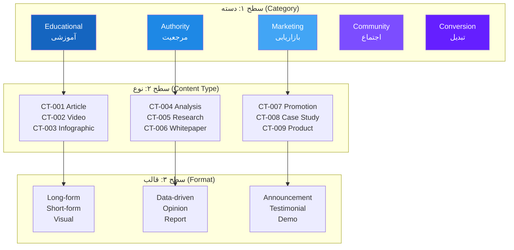
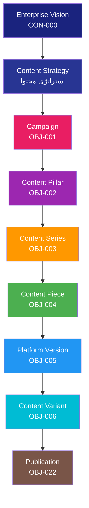
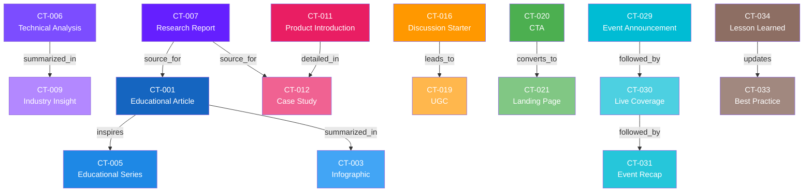

# Enterprise Content Taxonomy — طبقه‌بندی محتوای سازمانی

> **شناسه:** EDT-002
> **وضعیت:** پیش‌نویس
> **نسخه:** 1.0.0-draft
> **به‌روزرسانی:** 2026-06-27
> **مسئول:** معمار دانش و محتوای سازمانی
> **وابستگی:** [CON-000](../05-CONSTITUTION/00-constitution.md), [ARCH-001](../00-ARCHITECTURE/01-system-overview.md), [ARCH-003](../00-ARCHITECTURE/03-glossary.md), [ARCH-011](../00-ARCHITECTURE/11-object-model.md), [ARCH-012](../00-ARCHITECTURE/12-knowledge-model.md), [EDT-001](./10-content-guidelines.md)
> **مخاطب:** human, agent, n8n, mcp

---

## Architectural Dependencies

### Upstream Dependencies

| سند                                                  | نوع وابستگی | دلیل                              |
| ---------------------------------------------------- | ----------- | --------------------------------- |
| [CON-000](../05-CONSTITUTION/00-constitution.md)     | governs     | اصول کیفیت محتوا، یکپارچگی        |
| [ARCH-001](../00-ARCHITECTURE/01-system-overview.md) | depends-on  | نمای کلی سیستم، سلسله‌مراتب محتوا |
| [ARCH-003](../00-ARCHITECTURE/03-glossary.md)        | depends-on  | واژگان رسمی، هستی‌شناسی محتوا     |
| [ARCH-011](../00-ARCHITECTURE/11-object-model.md)    | depends-on  | اشیاء محتوا، روابط، چرخه حیات     |
| [ARCH-012](../00-ARCHITECTURE/12-knowledge-model.md) | depends-on  | جریان دانش، بازخورد محتوا به دانش |
| [EDT-001](./10-content-guidelines.md)                | depends-on  | چرخه حیات محتوا، کیفیت، همکاری AI |

### Downstream Dependencies

| سند                         | نوع وابستگی | دلیل                                                  |
| --------------------------- | ----------- | ----------------------------------------------------- |
| [PLAT-\*](../20-PLATFORMS/) | uses        | هر PLAT-\* از CT-IDها برای نگاشت محتوا استفاده می‌کند |
| [AUT-\*](../30-AUTOMATION/) | implements  | گردش کارها بر اساس نوع محتوا تصمیم می‌گیرند           |
| [AI-\*](../40-AI-AGENTS/)   | implements  | Agentها بر اساس CT-ID محتوا تولید می‌کنند             |
| [PRM-\*](../35-PROMPTS/)    | implements  | پرامپت‌ها بر اساس نوع محتوا طراحی می‌شوند             |
| [MET-\*](../60-METRICS/)    | measures    | KPIها بر اساس نوع محتوا تعریف می‌شوند                 |

### SSOT Ownership

| موضوع                      | SSOT                  |
| -------------------------- | --------------------- |
| Content Type Definitions   | **EDT-002** (این سند) |
| Content Taxonomy Hierarchy | **EDT-002** (این سند) |
| Content Type Canonical IDs | **EDT-002** (این سند) |
| Content Attribute Model    | **EDT-002** (این سند) |
| Content Type Metadata      | **EDT-002** (این سند) |
| Content Relationships      | **EDT-002** (این سند) |
| Content Lifecycle by Type  | **EDT-002** (این سند) |
| Content Object Lifecycle   | EDT-001               |
| Content Quality Rules      | EDT-001               |
| Platform-specific Content  | PLAT-\*               |

### Related ADRs

| ADR     | عنوان                            | ارتباط                      |
| ------- | -------------------------------- | --------------------------- |
| ADR-011 | چرخه حیات محتوا ۱۵ مرحله الزامی  | چرخه حیات بر اساس نوع محتوا |
| ADR-014 | ۵ مخزن دانش                      | خروجی دانش هر نوع محتوا     |
| ADR-017 | Knowledge Graph منبع حقیقت روابط | روابط بین انواع محتوا       |

### Related Objects (from ARCH-011)

Content Piece (OBJ-004), Platform Version (OBJ-005), Content Variant (OBJ-006), Asset (OBJ-007), Caption (OBJ-008), Campaign (OBJ-001), Content Pillar (OBJ-002), Content Series (OBJ-003), Knowledge Object (OBJ-016), Metric (OBJ-017)

### Related AI Agents (from ARCH-013)

Orchestrator (000), Research (001), Planning (002), Writing (003), Review (004), Fact Check (005), Graphic (006), Video (007), Analytics (010), Knowledge (011)

---

## ۱. Executive Summary

این سند **طبقه‌بندی محتوای سازمانی (Enterprise Content Taxonomy)** SMOS را تعریف می‌کند. تاکسونومی محتوا یک سیستم طبقه‌بندی سلسله‌مراتبی است که همه انواع محتوای تولیدی توسط Xennic را با شناسه‌های متعارف (Canonical IDs)، ویژگی‌ها، فراداده، روابط و قواعد پوشش می‌دهد.

تاکسونومی محتوا:

- مستقل از پلتفرم است — همه پلتفرم‌ها از یک سیستم طبقه‌بندی استفاده می‌کنند
- مستقل از قالب است — یک نوع محتوا می‌تواند در قالب‌های مختلف ظاهر شود
- قابل توسعه است — انواع محتوای جدید بدون تغییر ساختار اضافه می‌شوند
- ماشین‌خوان است — Agentها و Workflowها بر اساس CT-ID تصمیم می‌گیرند

این سند از [EDT-001](./10-content-guidelines.md) (ECOS) مشتق شده و طبقه‌بندی دقیق‌تری نسبت به §۴ EDT-001 ارائه می‌دهد.

---

## ۲. Purpose

### اهداف EDT-002

1. **یکسان‌سازی**: همه محتوا در همه پلتفرم‌ها از یک سیستم طبقه‌بندی پیروی می‌کند
2. **قابلیت جستجو**: هر محتوا با شناسه نوع خود قابل شناسایی و جستجو است
3. **تصمیم‌گیری خودکار**: Agentها بر اساس CT-ID نوع محتوا را تشخیص می‌دهند و رفتار مناسب را انتخاب می‌کنند
4. **تحلیل و گزارش**: KPIها بر اساس نوع محتوا دسته‌بندی و تحلیل می‌شوند
5. **توسعه‌پذیری**: انواع محتوای جدید بدون تغییر معماری اضافه می‌شوند
6. **هماهنگی با ECOS**: هر نوع محتوا چرخه حیات، کیفیت و قواعد خود را دارد

### اصول تاکسونومی

| اصل        | توضیح                                                         |
| ---------- | ------------------------------------------------------------- |
| **TAX-01** | هر محتوا دقیقاً یک نوع اصلی (Primary Type) دارد               |
| **TAX-02** | هر محتوا می‌تواند چندین نوع فرعی (Secondary Types) داشته باشد |
| **TAX-03** | انواع محتوا مستقل از قالب (Format) هستند                      |
| **TAX-04** | انواع محتوا مستقل از پلتفرم هستند                             |
| **TAX-05** | شناسه انواع محتوا (CT-ID) در کل SMOS یکتا است                 |
| **TAX-06** | اضافه کردن نوع محتوای جدید نیازمند به‌روزرسانی EDT-002 است    |

---

## ۳. Scope

### دامنه شمول

- همه انواع محتوای تولیدی توسط Xennic در تمام پلتفرم‌ها
- محتوای متعارف (Canonical) و نسخه‌های پلتفرمی (Platform Versions)
- محتوای تولیدشده توسط انسان، AI Agent و Curated
- محتوای داخلی (Internal) و خارجی (External)
- محتوای جاری (Active) و بایگانی‌شده (Archived)

### دامنه عدم شمول

- جزئیات پیاده‌سازی در پلتفرم‌های خاص
- قواعد نگارش یا لحن محتوا (به BRD-001 و EDT-001 مراجعه کنید)
- فراداده فنی Assetها (به AST-\* مراجعه کنید)
- KPIها و متریک‌های اندازه‌گیری (به MET-\* مراجعه کنید)
- گردش کارهای خودکار (به AUT-\* مراجعه کنید)

---

## ۴. Taxonomy Philosophy

فلسفه تاکسونومی محتوای SMOS.

### اصول فلسفی

| اصل              | توضیح                                                         |
| ---------------- | ------------------------------------------------------------- |
| **هدف‌محوری**    | نوع محتوا بر اساس هدف آن تعریف می‌شود، نه قالب یا پلتفرم      |
| **مخاطب‌محوری**  | هر نوع محتوا برای یک نیاز خاص مخاطب طراحی شده است             |
| **سلسله‌مراتب**  | انواع محتوا در یک ساختار سلسله‌مراتبی سازماندهی می‌شوند       |
| **انعطاف‌پذیری** | یک قطعه محتوا می‌تواند چند نوع باشد (Multiple Classification) |
| **ثبات**         | تعریف هر نوع محتوا در طول زمان پایدار است — تغییر نیازمند ADR |
| **ماشین‌خوانی**  | هر نوع محتوا با شناسه عددی (CT-NNN) قابل شناسایی است          |

### ابعاد طبقه‌بندی

| بُعد                | طیف                                                                                                                        | توضیح                           |
| ------------------- | -------------------------------------------------------------------------------------------------------------------------- | ------------------------------- |
| **Primary Purpose** | Educational / Authority / Marketing / Community / Conversion / Trust / Interactive / Event / Knowledge / Crisis / Internal | هدف اصلی محتوا                  |
| **Audience Intent** | Learn / Decide / Engage / Buy / Trust / Participate / Know                                                                 | نیت مخاطب در مصرف محتوا         |
| **Knowledge Goal**  | Awareness / Understanding / Application / Analysis / Synthesis                                                             | سطح دانشی که محتوا ارائه می‌دهد |
| **Business Goal**   | Brand Awareness / Lead Generation / Engagement / Retention / Conversion / Authority / Trust                                | هدف تجاری محتوا                 |
| **Format**          | Article / Video / Image / Audio / Infographic / Interactive                                                                | قالب محتوا (مستقل از نوع)       |
| **Lifecycle Speed** | Rapid (hours) / Normal (days) / Slow (weeks) / Evergreen (months/years)                                                    | سرعت چرخه حیات محتوا            |

---

## ۵. Content Classification Model

مدل طبقه‌بندی محتوا در SMOS از سه سطح تشکیل شده است.



### سطوح طبقه‌بندی

| سطح                   | توضیح                               | مثال                                        |
| --------------------- | ----------------------------------- | ------------------------------------------- |
| **Category**          | دسته‌بندی سطح بالا بر اساس هدف اصلی | Educational, Authority, Marketing           |
| **Content Type (CT)** | نوع مشخص محتوا با شناسه یکتا        | CT-001 (Educational Article)                |
| **Format**            | قالب ارائه محتوا                    | Long-form Article, Short Video, Infographic |
| **Platform Version**  | نسخه بومی‌شده برای پلتفرم           | Instagram Version, LinkedIn Version         |

---

## ۶. Content Object Hierarchy

سلسله‌مراتب اشیاء محتوا در SMOS. این بخش از ARCH-011 §۴ و EDT-001 §۴ مشتق شده است.



### اشیاء محتوا (از ARCH-011 و EDT-001)

| شیء              | شناسه   | نقش در تاکسونومی                                  |
| ---------------- | ------- | ------------------------------------------------- |
| Content Piece    | OBJ-004 | واحد پایه — دارای CT-ID                           |
| Platform Version | OBJ-005 | نسخه بومی‌شده برای پلتفرم — مشتق از Content Piece |
| Content Variant  | OBJ-006 | تغییر A/B — مشتق از Platform Version              |
| Campaign         | OBJ-001 | مجموعه محتوا با هدف تجاری                         |
| Content Pillar   | OBJ-002 | حوزه موضوعی پایدار                                |
| Content Series   | OBJ-003 | دنباله محتوای مرتبط                               |
| Asset            | OBJ-007 | فایل رسانه‌ای وابسته به Content Piece             |

---

## ۷. Canonical Content Categories

دسته‌های متعارف محتوا در SMOS. یازده دسته اصلی تمام انواع محتوای سازمانی را پوشش می‌دهند.

| شناسه دسته | نام دسته                 | هدف اصلی              | مخاطب اصلی            |
| ---------- | ------------------------ | --------------------- | --------------------- |
| CAT-EDU    | **Educational**          | انتقال دانش و آگاهی   | مخاطبان جویای یادگیری |
| CAT-AUT    | **Authority**            | ایجاد مرجعیت و اعتبار | مخاطبان حرفه‌ای       |
| CAT-MKT    | **Marketing**            | معرفی و ترویج         | مخاطبان هدف           |
| CAT-COM    | **Community**            | تعامل و گفتگو         | اعضای اجتماع          |
| CAT-CNV    | **Conversion**           | تبدیل به اقدام        | مخاطبان آماده تصمیم   |
| CAT-TRS    | **Trust Building**       | ایجاد اعتماد          | مخاطبان مردد          |
| CAT-INT    | **Interactive**          | مشارکت فعال           | مخاطبان فعال          |
| CAT-EVT    | **Event**                | رویدادها و مناسبت‌ها  | مخاطبان رویداد        |
| CAT-KNW    | **Knowledge**            | مستندسازی دانش        | تیم داخلی و Agentها   |
| CAT-CRS    | **Crisis Communication** | مدیریت بحران          | همه ذی‌نفعان          |
| CAT-INT    | **Internal**             | ارتباطات داخلی        | تیم Xennic            |

---

## ۸. Educational Content

محتوای آموزشی — انتقال دانش و آگاهی به مخاطبان.

| فیلد                | مقدار                                     |
| ------------------- | ----------------------------------------- |
| **Purpose**         | آموزش، آگاهی‌بخشی، توانمندسازی مخاطب      |
| **Knowledge Goal**  | Awareness → Understanding                 |
| **Business Goal**   | Brand Awareness, Authority                |
| **Audience Intent** | Learn                                     |
| **Tone Range**      | رسمی-غیررسمی، فنی-عمومی (طبق BRD-001 §۱۱) |

### انواع محتوای آموزشی

#### CT-001: Educational Article

| فیلد                 | مقدار                                            |
| -------------------- | ------------------------------------------------ |
| **شناسه**            | CT-001                                           |
| **نام**              | Educational Article — مقاله آموزشی               |
| **قالب‌های ممکن**    | Long-form Article, Blog Post, LinkedIn Article   |
| **طول**              | ۸۰۰-۳۰۰۰ کلمه                                    |
| **هدف دانشی**        | توضیح مفهوم، فرایند یا ایده                      |
| **چرخه حیات**        | Normal (۳-۷ روز)                                 |
| **AI مجاز**          | Writing Agent (پیش‌نویس), Review Agent (بازبینی) |
| **تأیید انسانی**     | Editorial Review + Brand Review                  |
| **پلتفرم‌های مناسب** | Website, LinkedIn, Telegram                      |
| **فراداده اجباری**   | موضوع، سطح دانش, مدت زمان مطالعه, منابع          |

#### CT-002: Educational Video

| فیلد                 | مقدار                                       |
| -------------------- | ------------------------------------------- |
| **شناسه**            | CT-002                                      |
| **نام**              | Educational Video — ویدئوی آموزشی           |
| **قالب‌های ممکن**    | Tutorial, Explanation, Screencast           |
| **طول**              | ۳-۲۰ دقیقه                                  |
| **هدف دانشی**        | نمایش فرایند، توضیح تصویری                  |
| **چرخه حیات**        | Slow (۱-۲ هفته)                             |
| **AI مجاز**          | Video Agent (تولید), Review Agent (بازبینی) |
| **تأیید انسانی**     | Editorial Review + Brand Review             |
| **پلتفرم‌های مناسب** | YouTube, Aparat, Website                    |
| **فراداده اجباری**   | موضوع, سطح, مدت, زیرنویس, منابع             |

#### CT-003: Infographic

| فیلد                 | مقدار                                         |
| -------------------- | --------------------------------------------- |
| **شناسه**            | CT-003                                        |
| **نام**              | Infographic — اینفوگرافیک                     |
| **قالب‌های ممکن**    | Static Image, Interactive, Animated           |
| **هدف دانشی**        | نمایش داده، فرایند یا رابطه به صورت بصری      |
| **چرخه حیات**        | Normal (۳-۵ روز)                              |
| **AI مجاز**          | Graphic Agent (طراحی), Review Agent (بازبینی) |
| **تأیید انسانی**     | Brand Review                                  |
| **پلتفرم‌های مناسب** | Instagram, LinkedIn, Website, Telegram        |
| **فراداده اجباری**   | موضوع, داده‌های منبع, اندازه                  |

#### CT-004: Educational Short

| فیلد                 | مقدار                                    |
| -------------------- | ---------------------------------------- |
| **شناسه**            | CT-004                                   |
| **نام**              | Educational Short — محتوای کوتاه آموزشی  |
| **قالب‌های ممکن**    | Carousel, Short Video, Tip Card          |
| **طول**              | ۳۰-۶۰ ثانیه ویدئو / ۵-۱۰ اسلاید کارousel |
| **هدف دانشی**        | نکته سریع، ترفند، آمار جالب              |
| **چرخه حیات**        | Rapid (ساعات-۱ روز)                      |
| **AI مجاز**          | Writing Agent + Graphic Agent            |
| **تأیید انسانی**     | Brand Review (خودکار برای اطمینان > ۹۰٪) |
| **پلتفرم‌های مناسب** | Instagram, Telegram, LinkedIn            |

#### CT-005: Educational Series

| فیلد                 | مقدار                                            |
| -------------------- | ------------------------------------------------ |
| **شناسه**            | CT-005                                           |
| **نام**              | Educational Series — سری محتوای آموزشی           |
| **قالب‌های ممکن**    | Multi-part Article, Video Series, Email Course   |
| **تعداد قسمت‌ها**    | ۳-۱۰ قسمت                                        |
| **هدف دانشی**        | آموزش عمیق و گام‌به‌گام                          |
| **چرخه حیات**        | Slow (۲-۶ هفته)                                  |
| **AI مجاز**          | Planning Agent (برنامه), Writing Agent (هر قسمت) |
| **تأیید انسانی**     | Editorial Review + Brand Review (هر قسمت)        |
| **پلتفرم‌های مناسب** | Website, YouTube, LinkedIn, Telegram             |

---

## ۹. Authority Content

محتوای مرجعیت — ایجاد اعتبار و تخصص سازمانی.

| فیلد                | مقدار                         |
| ------------------- | ----------------------------- |
| **Purpose**         | اثبات تخصص، ایجاد مرجعیت فکری |
| **Knowledge Goal**  | Analysis → Synthesis          |
| **Business Goal**   | Authority, Trust              |
| **Audience Intent** | Learn, Decide                 |
| **Tone Range**      | رسمی + فنی + منطقی            |

### انواع محتوای مرجعیت

#### CT-006: Technical Analysis

| فیلد                 | مقدار                                            |
| -------------------- | ------------------------------------------------ |
| **شناسه**            | CT-006                                           |
| **نام**              | Technical Analysis — تحلیل فنی                   |
| **قالب‌های ممکن**    | Long-form Article, Report, Thread                |
| **طول**              | ۱۵۰۰-۵۰۰۰ کلمه                                   |
| **هدف دانشی**        | تحلیل عمیق یک موضوع تخصصی                        |
| **چرخه حیات**        | Slow (۱-۳ هفته)                                  |
| **AI مجاز**          | Research Agent (تحقیق), Writing Agent (پیش‌نویس) |
| **تأیید انسانی**     | Fact Check + Editorial + Brand Review            |
| **پلتفرم‌های مناسب** | Website, LinkedIn                                |
| **فراداده اجباری**   | حوزه تخصصی, روش‌شناسی, منابع, سطح تخصص           |

#### CT-007: Research Report

| فیلد                 | مقدار                                              |
| -------------------- | -------------------------------------------------- |
| **شناسه**            | CT-007                                             |
| **نام**              | Research Report — گزارش تحقیقاتی                   |
| **قالب‌های ممکن**    | PDF Report, Series of Articles, Data Dashboard     |
| **طول**              | ۳۰۰۰-۱۰۰۰۰ کلمه                                    |
| **هدف دانشی**        | ارائه یافته‌های تحقیق با داده                      |
| **چرخه حیات**        | Slow (۲-۶ هفته)                                    |
| **AI مجاز**          | Research Agent (تحقیق), Analytics Agent (داده)     |
| **تأیید انسانی**     | Fact Check + Editorial + Brand + Management Review |
| **پلتفرم‌های مناسب** | Website, LinkedIn, Email                           |
| **فراداده اجباری**   | روش‌شناسی, حجم نمونه, تاریخ, اعتبار داده           |

#### CT-008: Whitepaper

| فیلد                 | مقدار                                   |
| -------------------- | --------------------------------------- |
| **شناسه**            | CT-008                                  |
| **نام**              | Whitepaper — مقاله سفید                 |
| **قالب‌های ممکن**    | PDF, Long-form Web Page                 |
| **طول**              | ۵۰۰۰-۱۵۰۰۰ کلمه                         |
| **هدف دانشی**        | ارائه دیدگاه عمیق و جامع درباره موضوع   |
| **چرخه حیات**        | Slow (۱-۳ ماه)                          |
| **AI مجاز**          | Research Agent + Writing Agent (دستیار) |
| **تأیید انسانی**     | Full Review Chain + Media Director      |
| **پلتفرم‌های مناسب** | Website (Hub), Email                    |
| **فراداده اجباری**   | حوزه, نسخه, نویسندگان, تاریخ, مجوز      |

#### CT-009: Industry Insight

| فیلد                 | مقدار                                            |
| -------------------- | ------------------------------------------------ |
| **شناسه**            | CT-009                                           |
| **نام**              | Industry Insight — بینش صنعت                     |
| **قالب‌های ممکن**    | Short Article, LinkedIn Post, Video Commentary   |
| **طول**              | ۳۰۰-۱۰۰۰ کلمه                                    |
| **هدف دانشی**        | ارائه دیدگاه درباره رویداد یا روند صنعت          |
| **چرخه حیات**        | Rapid (ساعات-۱ روز)                              |
| **AI مجاز**          | Research Agent (تحقیق), Writing Agent (نویسندگی) |
| **تأیید انسانی**     | Editorial Review                                 |
| **پلتفرم‌های مناسب** | LinkedIn, Instagram, Telegram                    |

#### CT-010: Opinion Piece

| فیلد                 | مقدار                                                    |
| -------------------- | -------------------------------------------------------- |
| **شناسه**            | CT-010                                                   |
| **نام**              | Opinion Piece — دیدگاه                                   |
| **قالب‌های ممکن**    | Article, Op-Ed, Video Commentary                         |
| **طول**              | ۵۰۰-۲۰۰۰ کلمه                                            |
| **هدف دانشی**        | ارائه دیدگاه سازمان درباره موضوع                         |
| **چرخه حیات**        | Normal (۲-۵ روز)                                         |
| **AI مجاز**          | Writing Agent (پیش‌نویس) — **نیاز به تأیید انسانی کامل** |
| **تأیید انسانی**     | Editorial + Brand + Management Review                    |
| **پلتفرم‌های مناسب** | Website, LinkedIn, Telegram                              |
| **فراداده اجباری**   | موضع سازمان, تاریخ, نویسنده مسئول                        |

---

## ۱۰. Marketing Content

محتوای بازاریابی — معرفی، ترویج و تبلیغ.

| فیلد                | مقدار                                     |
| ------------------- | ----------------------------------------- |
| **Purpose**         | معرفی محصول/خدمت، ترویج ارزش              |
| **Knowledge Goal**  | Awareness → Interest                      |
| **Business Goal**   | Lead Generation, Conversion               |
| **Audience Intent** | Learn, Decide                             |
| **Tone Range**      | غیررسمی + هیجانی + جسور (طبق BRD-001 §۱۱) |

### انواع محتوای بازاریابی

#### CT-011: Product Introduction

| فیلد                 | مقدار                                  |
| -------------------- | -------------------------------------- |
| **شناسه**            | CT-011                                 |
| **نام**              | Product Introduction — معرفی محصول     |
| **قالب‌های ممکن**    | Post, Article, Video, Demo             |
| **هدف**              | معرفی محصول/خدمت جدید                  |
| **چرخه حیات**        | Normal (۲-۵ روز)                       |
| **AI مجاز**          | Writing Agent, Video Agent (دمو)       |
| **تأیید انسانی**     | Brand Review + Management Review       |
| **پلتفرم‌های مناسب** | Instagram, LinkedIn, Telegram, Website |

#### CT-012: Case Study

| فیلد                 | مقدار                                    |
| -------------------- | ---------------------------------------- |
| **شناسه**            | CT-012                                   |
| **نام**              | Case Study — مطالعه موردی                |
| **قالب‌های ممکن**    | Article, Video, Infographic, Testimonial |
| **طول**              | ۱۰۰۰-۳۰۰۰ کلمه                           |
| **هدف**              | نمایش موفقیت با مشتری/پروژه واقعی        |
| **چرخه حیات**        | Slow (۱-۲ هفته)                          |
| **AI مجاز**          | Research Agent (تحقیق), Writing Agent    |
| **تأیید انسانی**     | Fact Check + Brand + Legal Review        |
| **پلتفرم‌های مناسب** | Website, LinkedIn, Instagram             |
| **فراداده اجباری**   | مشتری, تاریخ, نتایج, مجوز انتشار         |

#### CT-013: Promotional Campaign

| فیلد                 | مقدار                                       |
| -------------------- | ------------------------------------------- |
| **شناسه**            | CT-013                                      |
| **نام**              | Promotional Campaign — محتوای تبلیغاتی      |
| **قالب‌های ممکن**    | Multi-format Campaign, Ad Creative, Banner  |
| **هدف**              | ترویج پیشنهاد ویژه یا رویداد                |
| **چرخه حیات**        | Rapid (ساعات-۱ روز)                         |
| **AI مجاز**          | Writing Agent + Graphic Agent + Video Agent |
| **تأیید انسانی**     | Brand Review + Management Review            |
| **پلتفرم‌های مناسب** | همه پلتفرم‌ها                               |
| **فراداده اجباری**   | بودجه, تاریخ شروع/پایان, CTA, تخفیف         |

#### CT-014: Webinar / Live Event Promotion

| فیلد                 | مقدار                                               |
| -------------------- | --------------------------------------------------- |
| **شناسه**            | CT-014                                              |
| **نام**              | Webinar / Live Event Promotion — محتوای رویداد زنده |
| **قالب‌های ممکن**    | Announcement Post, Email, Registration Page         |
| **هدف**              | جذب شرکت‌کننده برای رویداد                          |
| **چرخه حیات**        | Normal (۱-۲ هفته قبل از رویداد)                     |
| **AI مجاز**          | Writing Agent + Graphic Agent                       |
| **تأیید انسانی**     | Brand Review                                        |
| **پلتفرم‌های مناسب** | Instagram, Telegram, LinkedIn, Email, Website       |

#### CT-015: Testimonial / Social Proof

| فیلد                 | مقدار                                    |
| -------------------- | ---------------------------------------- |
| **شناسه**            | CT-015                                   |
| **نام**              | Testimonial / Social Proof — گواهی مخاطب |
| **قالب‌های ممکن**    | Quote Card, Video Testimonial, Review    |
| **هدف**              | ایجاد اعتماد با نمایش تجربه دیگران       |
| **چرخه حیات**        | Rapid (۱ روز)                            |
| **AI مجاز**          | Graphic Agent (طراحی)                    |
| **تأیید انسانی**     | Brand Review + Legal Review (مجوز)       |
| **پلتفرم‌های مناسب** | Instagram, LinkedIn, Website             |
| **فراداده اجباری**   | منبع, تاریخ, مجوز انتشار                 |

---

## ۱۱. Community Content

محتوای اجتماع — تعامل و گفتگو با مخاطبان.

| فیلد                | مقدار                          |
| ------------------- | ------------------------------ |
| **Purpose**         | ایجاد تعامل، گفتگو، احساس تعلق |
| **Knowledge Goal**  | Participation → Connection     |
| **Business Goal**   | Engagement, Retention          |
| **Audience Intent** | Engage, Participate            |
| **Tone Range**      | غیررسمی + گرم + دوستانه        |

### انواع محتوای اجتماع

#### CT-016: Discussion Starter

| فیلد                 | مقدار                                              |
| -------------------- | -------------------------------------------------- |
| **شناسه**            | CT-016                                             |
| **نام**              | Discussion Starter — شروع گفتگو                    |
| **قالب‌های ممکن**    | Question Post, Poll, Open-ended Statement          |
| **هدف**              | تحریک بحث و تبادل نظر                              |
| **چرخه حیات**        | Rapid (ساعات)                                      |
| **AI مجاز**          | Writing Agent (پیشنهاد), Engagement Agent (مدیریت) |
| **تأیید انسانی**     | — (نظارت پس از انتشار)                             |
| **پلتفرم‌های مناسب** | Telegram, Bale, Instagram, LinkedIn                |

#### CT-017: Poll / Survey

| فیلد                 | مقدار                                       |
| -------------------- | ------------------------------------------- |
| **شناسه**            | CT-017                                      |
| **نام**              | Poll / Survey — نظرسنجی                     |
| **قالب‌های ممکن**    | Native Poll, External Survey, Quiz          |
| **هدف**              | جمع‌آوری نظر مخاطبان + تعامل                |
| **چرخه حیات**        | Rapid (ساعات-۱ روز)                         |
| **AI مجاز**          | Engagement Agent (ایجاد و مدیریت)           |
| **تأیید انسانی**     | —                                           |
| **پلتفرم‌های مناسب** | Telegram, Bale, Instagram Stories, LinkedIn |
| **فراداده اجباری**   | هدف نظرسنجی, گزینه‌ها, مدت                  |

#### CT-018: Community Update

| فیلد                 | مقدار                                       |
| -------------------- | ------------------------------------------- |
| **شناسه**            | CT-018                                      |
| **نام**              | Community Update — به‌روزرسانی اجتماع       |
| **قالب‌های ممکن**    | Announcement Post, Newsletter, Video Update |
| **هدف**              | اطلاع‌رسانی به اعضای اجتماع                 |
| **چرخه حیات**        | Normal (۱-۳ روز)                            |
| **AI مجاز**          | Writing Agent                               |
| **تأیید انسانی**     | Brand Review                                |
| **پلتفرم‌های مناسب** | Telegram, Bale, Email                       |

#### CT-019: User Generated Content (UGC)

| فیلد                 | مقدار                                               |
| -------------------- | --------------------------------------------------- |
| **شناسه**            | CT-019                                              |
| **نام**              | User Generated Content — محتوای تولیدشده توسط کاربر |
| **قالب‌های ممکن**    | Repost, Share, Remix                                |
| **هدف**              | نمایش و قدردانی از مشارکت مخاطبان                   |
| **چرخه حیات**        | Rapid (ساعات)                                       |
| **AI مجاز**          | Engagement Agent (شناسایی), Review Agent (بازبینی)  |
| **تأیید انسانی**     | Brand Review + Legal Review (مجوز)                  |
| **پلتفرم‌های مناسب** | Instagram, Telegram, LinkedIn                       |

---

## ۱۲. Conversion Content

محتوای تبدیل — هدایت مخاطب به اقدام.

| فیلد                | مقدار                              |
| ------------------- | ---------------------------------- |
| **Purpose**         | تبدیل مخاطب به مشتری یا اقدام مشخص |
| **Knowledge Goal**  | Decision → Action                  |
| **Business Goal**   | Conversion, Lead Generation        |
| **Audience Intent** | Buy, Decide                        |
| **Tone Range**      | غیررسمی + هیجانی + منطقی           |

### انواع محتوای تبدیل

#### CT-020: Call to Action (CTA)

| فیلد                 | مقدار                               |
| -------------------- | ----------------------------------- |
| **شناسه**            | CT-020                              |
| **نام**              | Call to Action — دعوت به اقدام      |
| **قالب‌های ممکن**    | Button, Link Post, Banner, End Card |
| **هدف**              | دعوت مستقیم به اقدام مشخص           |
| **چرخه حیات**        | Rapid (ساعات)                       |
| **AI مجاز**          | Writing Agent (پیشنهاد CTA)         |
| **تأیید انسانی**     | Brand Review                        |
| **پلتفرم‌های مناسب** | همه پلتفرم‌ها                       |

#### CT-021: Landing Page Content

| فیلد                 | مقدار                                      |
| -------------------- | ------------------------------------------ |
| **شناسه**            | CT-021                                     |
| **نام**              | Landing Page Content — محتوای صفحه فرود    |
| **قالب‌های ممکن**    | Web Page with Form, Lead Magnet Page       |
| **هدف**              | دریافت اطلاعات مخاطب در ازای ارزش          |
| **چرخه حیات**        | Normal (۳-۷ روز)                           |
| **AI مجاز**          | Writing Agent (متن), Graphic Agent (تصویر) |
| **تأیید انسانی**     | Brand Review + Management Review           |
| **پلتفرم‌های مناسب** | Website                                    |
| **فراداده اجباری**   | CTA, فرم, lead magnet, thank-you page      |

#### CT-022: Offer / Discount

| فیلد                 | مقدار                                   |
| -------------------- | --------------------------------------- |
| **شناسه**            | CT-022                                  |
| **نام**              | Offer / Discount — پیشنهاد ویژه و تخفیف |
| **قالب‌های ممکن**    | Post, Banner, Story, Email              |
| **هدف**              | ایجاد انگیزه خرید با پیشنهاد محدود      |
| **چرخه حیات**        | Rapid (ساعات-۱ روز)                     |
| **AI مجاز**          | Writing Agent + Graphic Agent           |
| **تأیید انسانی**     | Brand Review + Management Review        |
| **پلتفرم‌های مناسب** | Instagram, Telegram, Email, Website     |

---

## ۱۳. Trust Building Content

محتوای اعتمادسازی — ایجاد اعتماد و اعتبار.

| فیلد                | مقدار                               |
| ------------------- | ----------------------------------- |
| **Purpose**         | ایجاد اعتماد، شفافیت، ارتباط انسانی |
| **Knowledge Goal**  | Trust → Loyalty                     |
| **Business Goal**   | Trust, Retention                    |
| **Audience Intent** | Trust, Know                         |
| **Tone Range**      | رسمی + عمومی + گرم                  |

### انواع محتوای اعتمادسازی

#### CT-023: Behind the Scenes

| فیلد                 | مقدار                             |
| -------------------- | --------------------------------- |
| **شناسه**            | CT-023                            |
| **نام**              | Behind the Scenes — پشت صحنه      |
| **قالب‌های ممکن**    | Photo, Video, Story, Post         |
| **هدف**              | نمایش انسان‌وارگی و شفافیت سازمان |
| **چرخه حیات**        | Rapid (ساعات-۱ روز)               |
| **AI مجاز**          | — (محتوای انسانی)                 |
| **تأیید انسانی**     | Brand Review                      |
| **پلتفرم‌های مناسب** | Instagram, Telegram               |

#### CT-024: Company Culture

| فیلد                 | مقدار                                    |
| -------------------- | ---------------------------------------- |
| **شناسه**            | CT-024                                   |
| **نام**              | Company Culture — فرهنگ سازمانی          |
| **قالب‌های ممکن**    | Post, Video, Article, Employee Spotlight |
| **هدف**              | نمایش ارزش‌ها و فرهنگ سازمان             |
| **چرخه حیات**        | Normal (۲-۵ روز)                         |
| **AI مجاز**          | Writing Agent (پیش‌نویس)                 |
| **تأیید انسانی**     | Brand Review + HR Review                 |
| **پلتفرم‌های مناسب** | LinkedIn, Instagram, Website             |

#### CT-025: Transparency Report

| فیلد                 | مقدار                                   |
| -------------------- | --------------------------------------- |
| **شناسه**            | CT-025                                  |
| **نام**              | Transparency Report — گزارش شفافیت      |
| **قالب‌های ممکن**    | Article, Report, Video                  |
| **هدف**              | ارائه اطلاعات شفاف درباره عملکرد سازمان |
| **چرخه حیات**        | Slow (۱-۲ هفته)                         |
| **AI مجاز**          | Analytics Agent (داده), Writing Agent   |
| **تأیید انسانی**     | Full Review Chain + Media Director      |
| **پلتفرم‌های مناسب** | Website, LinkedIn, Telegram             |
| **فراداده اجباری**   | دوره گزارش, داده‌ها, روش‌شناسی          |

---

## ۱۴. Interactive Content

محتوای تعاملی — مشارکت فعال مخاطب.

| فیلد                | مقدار                            |
| ------------------- | -------------------------------- |
| **Purpose**         | مشارکت فعال مخاطب در تجربه محتوا |
| **Knowledge Goal**  | Participation → Co-creation      |
| **Business Goal**   | Engagement, Feedback             |
| **Audience Intent** | Participate                      |
| **Tone Range**      | غیررسمی + خلاق + گرم             |

### انواع محتوای تعاملی

#### CT-026: Quiz / Assessment

| فیلد                 | مقدار                                                |
| -------------------- | ---------------------------------------------------- |
| **شناسه**            | CT-026                                               |
| **نام**              | Quiz / Assessment — آزمون و ارزیابی                  |
| **قالب‌های ممکن**    | Interactive Quiz, Personality Test, Score Calculator |
| **هدف**              | تعامل عمیق + جمع‌آوری داده                           |
| **چرخه حیات**        | Slow (۱-۲ هفته)                                      |
| **AI مجاز**          | Writing Agent (سؤالات), Analytics Agent (نتایج)      |
| **تأیید انسانی**     | Editorial Review                                     |
| **پلتفرم‌های مناسب** | Website, Instagram (Stories), Telegram (Bot)         |

#### CT-027: Challenge / Contest

| فیلد                 | مقدار                                  |
| -------------------- | -------------------------------------- |
| **شناسه**            | CT-027                                 |
| **نام**              | Challenge / Contest — چالش و مسابقه    |
| **قالب‌های ممکن**    | Announcement + Participation + Results |
| **هدف**              | ایجاد هیجان و مشارکت جمعی              |
| **چرخه حیات**        | Normal (۱-۲ هفته چالش)                 |
| **AI مجاز**          | Writing Agent + Engagement Agent       |
| **تأیید انسانی**     | Brand Review + Legal Review            |
| **پلتفرم‌های مناسب** | Instagram, Telegram                    |

#### CT-028: Interactive Tool

| فیلد                 | مقدار                                       |
| -------------------- | ------------------------------------------- |
| **شناسه**            | CT-028                                      |
| **نام**              | Interactive Tool — ابزار تعاملی             |
| **قالب‌های ممکن**    | Calculator, Configurator, Interactive Chart |
| **هدف**              | ارائه ارزش عملی به مخاطب                    |
| **چرخه حیات**        | Slow (۱-۴ هفته)                             |
| **AI مجاز**          | — (توسعه فنی)                               |
| **تأیید انسانی**     | Technical Review + Brand Review             |
| **پلتفرم‌های مناسب** | Website                                     |

---

## ۱۵. Event Content

محتوای رویداد — پوشش و مدیریت رویدادها.

| فیلد                | مقدار                               |
| ------------------- | ----------------------------------- |
| **Purpose**         | اطلاع‌رسانی، پوشش و پیگیری رویدادها |
| **Knowledge Goal**  | Awareness → Participation           |
| **Business Goal**   | Engagement, Authority               |
| **Audience Intent** | Learn, Participate                  |

### انواع محتوای رویداد

#### CT-029: Event Announcement

| فیلد              | مقدار                             |
| ----------------- | --------------------------------- |
| **شناسه**         | CT-029                            |
| **نام**           | Event Announcement — اعلام رویداد |
| **قالب‌های ممکن** | Post, Email, Banner, Video Teaser |
| **هدف**           | اطلاع‌رسانی و جذب شرکت‌کننده      |
| **چرخه حیات**     | Normal (۱-۲ هفته قبل)             |
| **AI مجاز**       | Writing Agent + Graphic Agent     |
| **تأیید انسانی**  | Brand Review                      |

#### CT-030: Live Coverage

| فیلد              | مقدار                                                    |
| ----------------- | -------------------------------------------------------- |
| **شناسه**         | CT-030                                                   |
| **نام**           | Live Coverage — پوشش زنده                                |
| **قالب‌های ممکن** | Live Stream, Live Blog, Real-time Posts                  |
| **هدف**           | پوشش لحظه‌ای رویداد                                      |
| **چرخه حیات**     | Rapid (Real-time)                                        |
| **AI مجاز**       | Engagement Agent (مدیریت), Writing Agent (تولید لحظه‌ای) |
| **تأیید انسانی**  | Human Monitor (نظارت زنده)                               |

#### CT-031: Event Recap

| فیلد              | مقدار                                       |
| ----------------- | ------------------------------------------- |
| **شناسه**         | CT-031                                      |
| **نام**           | Event Recap — خلاصه رویداد                  |
| **قالب‌های ممکن** | Article, Video Summary, Photo Album, Report |
| **هدف**           | ثبت و اشتراک دستاوردهای رویداد              |
| **چرخه حیات**     | Rapid (۱-۲ روز پس از رویداد)                |
| **AI مجاز**       | Writing Agent + Video Agent                 |
| **تأیید انسانی**  | Editorial Review                            |

---

## ۱۶. Knowledge Content

محتوای دانش — مستندسازی دانش سازمانی.

| فیلد                | مقدار                           |
| ------------------- | ------------------------------- |
| **Purpose**         | مستندسازی و اشتراک دانش سازمانی |
| **Knowledge Goal**  | Documentation → Reusability     |
| **Business Goal**   | Efficiency, Learning            |
| **Audience Intent** | Know, Learn                     |
| **Tone Range**      | رسمی + فنی + دقیق               |

### انواع محتوای دانش

#### CT-032: Documentation

| فیلد                 | مقدار                                   |
| -------------------- | --------------------------------------- |
| **شناسه**            | CT-032                                  |
| **نام**              | Documentation — مستندات                 |
| **قالب‌های ممکن**    | Wiki, README, Technical Spec, API Doc   |
| **هدف**              | ثبت دانش فنی و فرایندی                  |
| **چرخه حیات**        | Slow (Evergreen)                        |
| **AI مجاز**          | Knowledge Agent (استخراج و به‌روزرسانی) |
| **تأیید انسانی**     | Technical Review                        |
| **پلتفرم‌های مناسب** | Website (Docs), Internal Wiki           |

#### CT-033: Best Practice

| فیلد                 | مقدار                               |
| -------------------- | ----------------------------------- |
| **شناسه**            | CT-033                              |
| **نام**              | Best Practice — بهترین روش          |
| **قالب‌های ممکن**    | Guide, Checklist, Template          |
| **هدف**              | اشتراک روش‌های اثبات‌شده            |
| **چرخه حیات**        | Slow (فصلی)                         |
| **AI مجاز**          | Knowledge Agent + Improvement Agent |
| **تأیید انسانی**     | Editorial Review                    |
| **پلتفرم‌های مناسب** | Website, Internal, KNW-\*           |

#### CT-034: Lesson Learned

| فیلد                 | مقدار                               |
| -------------------- | ----------------------------------- |
| **شناسه**            | CT-034                              |
| **نام**              | Lesson Learned — درس‌آموخته         |
| **قالب‌های ممکن**    | Post-mortem, Retrospective Report   |
| **هدف**              | ثبت یادگیری از تجربیات              |
| **چرخه حیات**        | Normal (پس از هر پروژه/کمپین)       |
| **AI مجاز**          | Knowledge Agent + Improvement Agent |
| **تأیید انسانی**     | Management Review                   |
| **پلتفرم‌های مناسب** | Internal, KNW-\*                    |

#### CT-035: FAQ

| فیلد                 | مقدار                                                   |
| -------------------- | ------------------------------------------------------- |
| **شناسه**            | CT-035                                                  |
| **نام**              | FAQ — پرسش‌های متداول                                   |
| **قالب‌های ممکن**    | Page, Document, Chatbot Script                          |
| **هدف**              | پاسخ به سؤالات رایج مخاطبان                             |
| **چرخه حیات**        | Slow (به‌روزرسانی ماهانه)                               |
| **AI مجاز**          | Knowledge Agent + Engagement Agent (استخراج از تعاملات) |
| **تأیید انسانی**     | Editorial Review                                        |
| **پلتفرم‌های مناسب** | Website, Telegram (Bot), Internal                       |

---

## ۱۷. Crisis Communication

محتوای بحران — مدیریت ارتباطات در شرایط بحرانی.

| فیلد                | مقدار                               |
| ------------------- | ----------------------------------- |
| **Purpose**         | مدیریت بحران، حفظ اعتماد            |
| **Knowledge Goal**  | Clarity → Reassurance               |
| **Business Goal**   | Trust, Risk Management              |
| **Audience Intent** | Know, Trust                         |
| **Tone Range**      | رسمی + جدی + دقیق (طبق BRD-001 §۱۱) |

### انواع محتوای بحران

#### CT-036: Crisis Statement

| فیلد                 | مقدار                                            |
| -------------------- | ------------------------------------------------ |
| **شناسه**            | CT-036                                           |
| **نام**              | Crisis Statement — بیانیه بحران                  |
| **قالب‌های ممکن**    | Official Statement, Press Release, Video Message |
| **هدف**              | پاسخ رسمی و شفاف به بحران                        |
| **چرخه حیات**        | Rapid (ساعات)                                    |
| **AI مجاز**          | **خیر** — فقط انسان                              |
| **تأیید انسانی**     | Media Director + Legal + CEO                     |
| **پلتفرم‌های مناسب** | همه پلتفرم‌ها (همزمان)                           |
| **فراداده اجباری**   | تاریخ, زمان, موضوع بحران, سطح بحران              |

#### CT-037: Crisis Update

| فیلد                 | مقدار                              |
| -------------------- | ---------------------------------- |
| **شناسه**            | CT-037                             |
| **نام**              | Crisis Update — به‌روزرسانی بحران  |
| **قالب‌های ممکن**    | Short Post, Status Update          |
| **هدف**              | اطلاع‌رسانی پیشرفت در مدیریت بحران |
| **چرخه حیات**        | Rapid (ساعات-روز)                  |
| **AI مجاز**          | **خیر** — فقط انسان                |
| **تأیید انسانی**     | Media Director                     |
| **پلتفرم‌های مناسب** | همه پلتفرم‌ها                      |

#### CT-038: Apology / Correction

| فیلد                 | مقدار                                     |
| -------------------- | ----------------------------------------- |
| **شناسه**            | CT-038                                    |
| **نام**              | Apology / Correction — عذرخواهی و اصلاحیه |
| **قالب‌های ممکن**    | Statement, Post, Correction Note          |
| **هدف**              | پذیرش خطا و اصلاح                         |
| **چرخه حیات**        | Rapid (ساعات)                             |
| **AI مجاز**          | **خیر** — فقط انسان                       |
| **تأیید انسانی**     | Media Director + Brand Manager            |
| **پلتفرم‌های مناسب** | همه پلتفرم‌ها                             |

---

## ۱۸. Internal Content

محتوای داخلی — ارتباطات و مستندات درون‌سازمانی.

| فیلد                | مقدار                     |
| ------------------- | ------------------------- |
| **Purpose**         | ارتباطات داخلی تیم Xennic |
| **Knowledge Goal**  | Alignment → Efficiency    |
| **Business Goal**   | Operational Efficiency    |
| **Audience Intent** | Know, Execute             |
| **Tone Range**      | رسمی + مستقیم + عملی      |

### انواع محتوای داخلی

#### CT-039: Internal Memo

| فیلد              | مقدار                               |
| ----------------- | ----------------------------------- |
| **شناسه**         | CT-039                              |
| **نام**           | Internal Memo — یادداشت داخلی       |
| **قالب‌های ممکن** | Email, Document, Post               |
| **هدف**           | اطلاع‌رسانی تصمیمات و تغییرات داخلی |
| **چرخه حیات**     | Rapid (ساعات)                       |
| **AI مجاز**       | Writing Agent (پیش‌نویس)            |
| **تأیید انسانی**  | Management Review                   |
| **دسترسی**        | Internal Only                       |

#### CT-040: Process Document

| فیلد              | مقدار                           |
| ----------------- | ------------------------------- |
| **شناسه**         | CT-040                          |
| **نام**           | Process Document — مستند فرایند |
| **قالب‌های ممکن** | SOP, Runbook, Workflow Diagram  |
| **هدف**           | ثبت و استانداردسازی فرایندها    |
| **چرخه حیات**     | Slow (فصلی)                     |
| **AI مجاز**       | Knowledge Agent                 |
| **تأیید انسانی**  | Technical Review                |
| **دسترسی**        | Internal Only                   |

#### CT-041: Team Update

| فیلد              | مقدار                           |
| ----------------- | ------------------------------- |
| **شناسه**         | CT-041                          |
| **نام**           | Team Update — به‌روزرسانی تیم   |
| **قالب‌های ممکن** | Newsletter, Post, Meeting Notes |
| **هدف**           | هماهنگی و شفافیت درون تیم       |
| **چرخه حیات**     | Weekly                          |
| **AI مجاز**       | Writing Agent                   |
| **تأیید انسانی**  | —                               |
| **دسترسی**        | Internal Only                   |

#### CT-042: Training Material

| فیلد              | مقدار                                   |
| ----------------- | --------------------------------------- |
| **شناسه**         | CT-042                                  |
| **نام**           | Training Material — محتوای آموزشی داخلی |
| **قالب‌های ممکن** | Guide, Video, Presentation, Quiz        |
| **هدف**           | آموزش تیم در موضوعات مختلف              |
| **چرخه حیات**     | Slow (سالانه)                           |
| **AI مجاز**       | Writing Agent + Video Agent             |
| **تأیید انسانی**  | Editorial Review + Management Review    |
| **دسترسی**        | Internal Only                           |

---

## ۱۹. Future Content Types

انواع محتوای آینده — چارچوبی برای اضافه کردن انواع جدید.

### اصول افزودن نوع جدید

| اصل        | توضیح                                                |
| ---------- | ---------------------------------------------------- |
| **FCT-01** | هر نوع جدید باید حداقل یک هدف منحصربه‌فرد داشته باشد |
| **FCT-02** | نوع جدید باید با یکی از ۱۱ دسته اصلی سازگار باشد     |
| **FCT-03** | نوع جدید نیازمند ثبت در EDT-002 است                  |
| **FCT-04** | شناسه CT-NNN به صورت ترتیبی اختصاص می‌یابد           |
| **FCT-05** | نوع جدید باید همه فیلدهای اجباری را داشته باشد       |
| **FCT-06** | نوع جدید نباید با انواع موجود هم‌پوشانی داشته باشد   |

### فرایند افزودن

| مرحله | اقدام                        | مسئول             |
| ----- | ---------------------------- | ----------------- |
| ۱     | شناسایی نیاز                 | Content Manager   |
| ۲     | بررسی عدم هم‌پوشانی          | Content Manager   |
| ۳     | ثبت در EDT-002 با CT-ID بعدی | System Architect  |
| ۴     | به‌روزرسانی پرامپت‌های مرتبط | AI Engineer       |
| ۵     | به‌روزرسانی PLAT-\*ها        | Platform Managers |
| ۶     | اعلام به تیم                 | Content Manager   |

---

## ۲۰. Content Attributes

ویژگی‌های محتوا — ابعاد توصیفی که هر قطعه محتوا را مشخص می‌کند.

### ابعاد اصلی

| بُعد                  | نوع    | توضیح              | مقادیر ممکن                                            |
| --------------------- | ------ | ------------------ | ------------------------------------------------------ |
| **Primary Type**      | enum   | نوع اصلی محتوا     | CT-001 .. CT-042                                       |
| **Secondary Types**   | enum[] | انواع فرعی         | CT-001 .. CT-042                                       |
| **Format**            | enum   | قالب ارائه         | article, video, image, audio, infographic, interactive |
| **Length**            | enum   | اندازه محتوا       | short, medium, long, xlong                             |
| **Tone**              | enum   | لحن مسلط           | formal, informal, technical, emotional, humorous       |
| **Knowledge Level**   | enum   | سطح دانش           | beginner, intermediate, advanced, expert               |
| **Lifecycle Speed**   | enum   | سرعت چرخه          | rapid, normal, slow, evergreen                         |
| **Production Effort** | enum   | effort تولید       | low, medium, high, xhigh                               |
| **AI Suitability**    | enum   | مناسب‌بودن برای AI | full, partial, review, human_only                      |

### ابعاد تجاری

| بُعد               | نوع       | توضیح       | مقادیر ممکن                                                              |
| ------------------ | --------- | ----------- | ------------------------------------------------------------------------ |
| **Campaign**       | reference | کمپین مرتبط | CAM-NNN                                                                  |
| **Content Pillar** | reference | ستون محتوا  | PILLAR-NNN                                                               |
| **Business Goal**  | enum[]    | اهداف تجاری | awareness, lead_gen, engagement, conversion, retention, trust, authority |
| **Target Persona** | reference | پرسونای هدف | PERSONA-ID                                                               |

### ابعاد دانشی

| بُعد                  | نوع    | توضیح       | مقادیر ممکن                                                            |
| --------------------- | ------ | ----------- | ---------------------------------------------------------------------- |
| **Knowledge Domain**  | enum   | حوزه دانش   | technology, business, design, marketing, ai, industry                  |
| **Knowledge Goal**    | enum   | هدف دانشی   | awareness, understanding, application, analysis, synthesis, evaluation |
| **Source Type**       | enum   | نوع منبع    | original, curated, synthesized, translated, repurposed                 |
| **Credibility Score** | number | نمره اعتبار | ۰.۰ - ۱.۰                                                              |

---

## ۲۱. Metadata Model

مدل فراداده برای هر قطعه محتوا.

### فراداده اجباری (همه انواع)

| فیلد         | نوع    | توضیح             | مثال                                         |
| ------------ | ------ | ----------------- | -------------------------------------------- |
| `content_id` | string | شناسه یکتای محتوا | CONT-2026-06-27-001                          |
| `ct_id`      | string | شناسه نوع محتوا   | CT-001                                       |
| `title`      | string | عنوان محتوا       | "Introduction to AI"                         |
| `language`   | string | زبان محتوا        | fa, en                                       |
| `owner`      | string | مالک محتوا (نقش)  | Writing Agent                                |
| `created_at` | date   | تاریخ ایجاد       | 2026-06-27                                   |
| `updated_at` | date   | آخرین به‌روزرسانی | 2026-06-27                                   |
| `status`     | enum   | وضعیت             | draft, review, approved, published, archived |
| `version`    | string | نسخه              | 1.0.0                                        |

### فراداده اختیاری

| فیلد              | نوع      | توضیح                           |
| ----------------- | -------- | ------------------------------- |
| `tags`            | string[] | برچسب‌های محتوا                 |
| `summary`         | string   | خلاصه محتوا (برای SEO و اشتراک) |
| `cover_image`     | string   | مسیر تصویر کاور                 |
| `reading_time`    | number   | زمان مطالعه (دقیقه)             |
| `keywords`        | string[] | کلمات کلیدی                     |
| `related_content` | string[] | محتوای مرتبط (content_idها)     |
| `campaign_id`     | string   | کمپین مرتبط                     |
| `pillar_id`       | string   | ستون محتوا                      |

### بلوک JSON

```json
{
  "content_metadata": {
    "content_id": "CONT-2026-06-27-001",
    "ct_id": "CT-001",
    "title": "عنوان محتوا",
    "language": "fa",
    "owner": "نقش مالک",
    "created_at": "2026-06-27",
    "updated_at": "2026-06-27",
    "status": "draft|review|approved|published|archived",
    "version": "1.0.0",
    "tags": ["برچسب۱", "برچسب۲"],
    "summary": "خلاصه محتوا",
    "reading_time": 10,
    "keywords": ["کلمه۱", "کلمه۲"],
    "campaign_id": "CAM-001",
    "pillar_id": "PILLAR-001"
  }
}
```

---

## ۲۲. Content Relationships

روابط بین انواع محتوا در SMOS.



### انواع روابط

| نوع رابطه       | توضیح                                    | مثال                                       |
| --------------- | ---------------------------------------- | ------------------------------------------ |
| `inspires`      | یک محتوا الهام‌بخش محتوای دیگر است       | Educational Article → Educational Series   |
| `summarized_in` | یک محتوا در قالب خلاصه‌تر ارائه شده      | Technical Analysis → Industry Insight      |
| `source_for`    | یک محتوا منبع محتوای دیگر است            | Research Report → Educational Article      |
| `detailed_in`   | یک محتوا در قالب مفصل‌تر توضیح داده شده  | Product Intro → Case Study                 |
| `leads_to`      | یک محتوا به محتوای دیگر هدایت می‌کند     | Discussion Starter → UGC                   |
| `converts_to`   | محتوای تبدیل‌کننده به اقدام              | CTA → Landing Page                         |
| `followed_by`   | دنباله زمانی                             | Event Announcement → Live Coverage → Recap |
| `updates`       | محتوای جدید جایگزین یا به‌روزرسانی قدیمی | Lesson Learned → Best Practice             |
| `repurposed_as` | استفاده مجدد در قالب دیگر                | Article → Infographic                      |
| `related_to`    | ارتباط موضوعی                            | هم‌دسته                                    |

---

## ۲۳. Content Lifecycle Mapping

نگاشت چرخه حیات محتوا بر اساس نوع محتوا. این بخش از EDT-001 §۶ مشتق شده است.

### چرخه حیات پایه (از EDT-001)

```
Idea → Research → Evidence → Knowledge Extraction → Content Strategy →
Draft → Technical Review → Editorial Review → Brand Review →
Approval → Asset Production → Publication → Distribution →
Monitoring → Analytics → Insight Generation → Knowledge Update → Archive
```

### تغییرات بر اساس نوع محتوا

| نوع محتوا                       | چرخه      | مراحل حذف‌شده                                    | مراحل اضافه                         |
| ------------------------------- | --------- | ------------------------------------------------ | ----------------------------------- |
| **CT-001 Educational Article**  | کامل      | —                                                | —                                   |
| **CT-002 Educational Video**    | کامل      | —                                                | Asset Production (Video)            |
| **CT-004 Educational Short**    | کوتاه‌شده | Evidence, Knowledge Extraction, Technical Review | —                                   |
| **CT-007 Research Report**      | Extended  | —                                                | Peer Review, Data Validation        |
| **CT-011 Product Introduction** | کوتاه‌شده | Evidence, Knowledge Extraction                   | —                                   |
| **CT-016 Discussion Starter**   | Minimal   | Idea تا Publication فقط                          | —                                   |
| **CT-020 CTA**                  | Minimal   | Draft → Brand Review → Publication               | —                                   |
| **CT-025 Transparency Report**  | Extended  | —                                                | Legal Review, Data Audit            |
| **CT-030 Live Coverage**        | Special   | Real-time                                        | Live Monitoring, Real-time Approval |
| **CT-036 Crisis Statement**     | Special   | Accelerated                                      | Emergency Approval, Legal Review    |
| **CT-039 Internal Memo**        | Minimal   | Draft → Review → Publication                     | —                                   |

---

## ۲۴. Platform Independence

تاکسونومی محتوا مستقل از پلتفرم است. این بخش قواعد این استقلال را تعریف می‌کند.

### اصول استقلال از پلتفرم

| اصل       | توضیح                                                   |
| --------- | ------------------------------------------------------- |
| **PI-01** | CT-ID در همه پلتفرم‌ها یکسان است                        |
| **PI-02** | تعریف هر CT مستقل از قالب پلتفرم است                    |
| **PI-03** | یک CT می‌تواند در چند پلتفرم با قالب‌های مختلف ظاهر شود |
| **PI-04** | Platform Version یک CT است — نوع محتوا تغییر نمی‌کند    |
| **PI-05** | قواعد پلتفرم (PLAT-\*) به CT-ID ارجاع می‌دهند، نه برعکس |

### نگاشت CT به پلتفرم‌ها (راهنما، نه قانون)

| CT-ID                         | پلتفرم‌های مناسب              | پلتفرم‌های نامناسب             |
| ----------------------------- | ----------------------------- | ------------------------------ |
| CT-001 (Educational Article)  | Website, LinkedIn, Telegram   | Instagram (بدون لینک), YouTube |
| CT-002 (Educational Video)    | YouTube, Aparat, Website      | Telegram (محدودیت حجم)         |
| CT-004 (Educational Short)    | Instagram, Telegram, LinkedIn | Website                        |
| CT-006 (Technical Analysis)   | Website, LinkedIn             | Instagram, Telegram            |
| CT-013 (Promotional Campaign) | همه                           | —                              |
| CT-016 (Discussion Starter)   | Telegram, Bale, Instagram     | Website, YouTube               |
| CT-036 (Crisis Statement)     | همه (همزمان)                  | —                              |

---

## ۲۵. AI Interpretation Rules

قواعد تفسیر تاکسونومی توسط AI Agents.

### اصول تفسیر

| اصل           | توضیح                                            |
| ------------- | ------------------------------------------------ |
| **AI-TAX-01** | هر Agent باید CT-ID را در ورودی خود تشخیص دهد    |
| **AI-TAX-02** | Agentها بر اساس CT-ID رفتار خود را تنظیم می‌کنند |
| **AI-TAX-03** | Agentها نمی‌توانند CT-ID محتوا را تغییر دهند     |
| **AI-TAX-04** | Agentها می‌توانند Secondary Types پیشنهاد دهند   |
| **AI-TAX-05** | CT-ID نامعتبر = رد درخواست توسط Agent            |

### راهنمای Agentها

| Agent                | CT-IDهای مرتبط                 | رفتار                     |
| -------------------- | ------------------------------ | ------------------------- |
| **Research (001)**   | CT-006, CT-007, CT-008         | تحقیق عمیق با منابع       |
| **Research (001)**   | CT-004, CT-009                 | تحقیق سریع و سطحی         |
| **Writing (003)**    | CT-001, CT-005, CT-006         | نگارش طولانی و مفصل       |
| **Writing (003)**    | CT-004, CT-009, CT-016         | نگارش کوتاه و چابک        |
| **Review (004)**     | همه                            | بازبینی بر اساس قواعد CT  |
| **Graphic (006)**    | CT-003, CT-004, CT-015         | تولید تصویر و اینفوگرافیک |
| **Video (007)**      | CT-002, CT-030                 | تولید ویدئو               |
| **Publishing (008)** | همه                            | انتشار بر اساس اولویت CT  |
| **Analytics (010)**  | همه                            | تحلیل بر اساس دسته CT     |
| **Knowledge (011)**  | CT-032, CT-033, CT-034, CT-035 | استخراج و ثبت دانش        |

### بلوک JSON

```json
{
  "ai_interpretation": [
    {
      "ct_id": "CT-NNN",
      "agents": ["AI-001", "AI-003", "AI-004"],
      "behavior": "full_autonomy|partial|review_required|human_only",
      "confidence_threshold": 0.9,
      "quality_gates": ["technical_review", "editorial_review", "brand_review"]
    }
  ]
}
```

---

## ۲۶. Automation Interfaces

رابط‌های خودکارسازی — تعریف می‌کند Workflowهای n8n چگونه با CT-IDها تعامل دارند.

### رویدادهای مبتنی بر CT

| رویداد                 | توضیح                             | Workflow مرتبط            |
| ---------------------- | --------------------------------- | ------------------------- |
| `content.ct-created`   | محتوای جدید با CT-ID خاص ایجاد شد | AUT-\* (Content Pipeline) |
| `content.ct-published` | محتوای با CT-ID خاص منتشر شد      | AUT-\* (Distribution)     |
| `content.ct-archived`  | محتوای با CT-ID خاص بایگانی شد    | AUT-\* (Archive)          |

### قواعد مسیریابی

| CT-ID                  | Pipeline                                            | اولویت | SLA       |
| ---------------------- | --------------------------------------------------- | ------ | --------- |
| CT-006, CT-007, CT-008 | Full Pipeline (تحقیق + راستی‌آزمایی + بازبینی کامل) | P1     | ۲ هفته    |
| CT-001, CT-002, CT-005 | Standard Pipeline                                   | P1     | ۱ هفته    |
| CT-004, CT-009, CT-016 | Quick Pipeline                                      | P2     | ۱ روز     |
| CT-013, CT-020, CT-022 | Rapid Pipeline                                      | P2     | ساعات     |
| CT-036, CT-037, CT-038 | Emergency Pipeline                                  | P0     | Real-time |

### بلوک JSON

```json
{
  "automation_interfaces": {
    "event_triggers": {
      "content_ct_created": "AUT-NNN-001",
      "content_ct_published": "AUT-NNN-002",
      "content_ct_archived": "AUT-NNN-003"
    },
    "routing_rules": [
      {
        "ct_ids": ["CT-006", "CT-007"],
        "pipeline": "full",
        "priority": "P1",
        "sla_days": 14
      }
    ]
  }
}
```

---

## ۲۷. Object IDs

شناسه‌های اشیاء مرتبط با تاکسونومی محتوا.

| شناسه   | شیء              | نقش در تاکسونومی              |
| ------- | ---------------- | ----------------------------- |
| OBJ-001 | Campaign         | مجموعه محتوا با هدف تجاری     |
| OBJ-002 | Content Pillar   | حوزه موضوعی پایدار            |
| OBJ-003 | Content Series   | سری محتوای مرتبط              |
| OBJ-004 | Content Piece    | واحد پایه محتوا — دارای CT-ID |
| OBJ-005 | Platform Version | نسخه بومی‌شده برای پلتفرم     |
| OBJ-006 | Content Variant  | تغییر A/B                     |
| OBJ-007 | Asset            | دارایی رسانه‌ای               |
| OBJ-008 | Caption          | متن همراه                     |
| OBJ-016 | Knowledge Object | خروجی دانش محتوا              |
| OBJ-017 | Metric           | متریک عملکرد                  |
| OBJ-022 | Publication      | ثبت انتشار                    |

---

## ۲۸. Content IDs

شناسه‌های محتوا — قالب و قواعد.

### قالب Content ID

```
CONT-YYYY-MM-DD-NNN
```

| بخش      | توضیح               | مثال |
| -------- | ------------------- | ---- |
| **CONT** | پیشوند ثابت Content | CONT |
| **YYYY** | سال ایجاد           | 2026 |
| **MM**   | ماه ایجاد           | 06   |
| **DD**   | روز ایجاد           | 27   |
| **NNN**  | شماره ترتیبی روزانه | 001  |

### قواعد

| قاعده  | توضیح                                       |
| ------ | ------------------------------------------- |
| CID-01 | هر Content Piece یک CONT-ID یکتا دارد       |
| CID-02 | CONT-ID در زمان ایجاد اختصاص می‌یابد        |
| CID-03 | شماره‌گذاری روزانه از ۰۰۱ شروع می‌شود       |
| CID-04 | CONT-ID هرگز تغییر نمی‌کند                  |
| CID-05 | CONT-ID حذف‌شده به محتوای دیگر داده نمی‌شود |

---

## ۲۹. JSON Schemas

شمای JSON برای داده‌های تاکسونومی.

### Content Type Definition Schema

```json
{
  "$schema": "http://json-schema.org/draft-07/schema#",
  "title": "Content Type Definition",
  "type": "object",
  "required": [
    "ct_id",
    "name_fa",
    "name_en",
    "category",
    "purpose",
    "knowledge_goal",
    "business_goal",
    "audience_intent",
    "lifecycle_speed",
    "ai_suitability",
    "formats"
  ],
  "properties": {
    "ct_id": { "type": "string", "pattern": "^CT-\\d{3}$" },
    "name_fa": { "type": "string" },
    "name_en": { "type": "string" },
    "category": {
      "type": "string",
      "enum": [
        "educational",
        "authority",
        "marketing",
        "community",
        "conversion",
        "trust_building",
        "interactive",
        "event",
        "knowledge",
        "crisis",
        "internal"
      ]
    },
    "purpose": { "type": "string" },
    "knowledge_goal": { "type": "string" },
    "business_goal": { "type": "string" },
    "audience_intent": { "type": "string" },
    "lifecycle_speed": { "type": "string", "enum": ["rapid", "normal", "slow", "evergreen"] },
    "ai_suitability": { "type": "string", "enum": ["full", "partial", "review", "human_only"] },
    "formats": {
      "type": "array",
      "items": { "type": "string" }
    },
    "compatible_platforms": {
      "type": "array",
      "items": { "type": "string" }
    },
    "required_metadata": {
      "type": "array",
      "items": { "type": "string" }
    }
  }
}
```

### Content Instance Schema

```json
{
  "$schema": "http://json-schema.org/draft-07/schema#",
  "title": "Content Instance",
  "type": "object",
  "required": ["content_id", "ct_id", "title", "language", "owner", "created_at", "status"],
  "properties": {
    "content_id": { "type": "string", "pattern": "^CONT-\\d{4}-\\d{2}-\\d{2}-\\d{3}$" },
    "ct_id": { "type": "string", "pattern": "^CT-\\d{3}$" },
    "secondary_ct_ids": {
      "type": "array",
      "items": { "type": "string", "pattern": "^CT-\\d{3}$" }
    },
    "title": { "type": "string" },
    "language": { "type": "string", "enum": ["fa", "en"] },
    "owner": { "type": "string" },
    "created_at": { "type": "string", "format": "date" },
    "updated_at": { "type": "string", "format": "date" },
    "status": {
      "type": "string",
      "enum": [
        "draft",
        "in_review",
        "changes_requested",
        "approved",
        "in_production",
        "published",
        "archived",
        "deprecated"
      ]
    },
    "version": { "type": "string", "pattern": "^\\d+\\.\\d+\\.\\d+" },
    "campaign_id": { "type": "string" },
    "pillar_id": { "type": "string" },
    "tags": {
      "type": "array",
      "items": { "type": "string" }
    }
  }
}
```

### Content Relationship Schema

```json
{
  "$schema": "http://json-schema.org/draft-07/schema#",
  "title": "Content Relationship",
  "type": "object",
  "required": ["source_id", "target_id", "relationship"],
  "properties": {
    "source_id": { "type": "string", "pattern": "^CONT-" },
    "target_id": { "type": "string", "pattern": "^CONT-" },
    "relationship": {
      "type": "string",
      "enum": [
        "inspires",
        "summarized_in",
        "source_for",
        "detailed_in",
        "leads_to",
        "converts_to",
        "followed_by",
        "updates",
        "repurposed_as",
        "related_to"
      ]
    },
    "weight": { "type": "number", "minimum": 0, "maximum": 1 }
  }
}
```

---

## ۳۰. Validation Rules

قواعد اعتبارسنجی برای محتوا و تاکسونومی.

### قواعد عمومی

| #         | قاعده                                       | توضیح                | نوع |
| --------- | ------------------------------------------- | -------------------- | --- |
| CT-VAL-01 | هر محتوا باید CT-ID معتبر داشته باشد        | invalid_ct_id        |
| CT-VAL-02 | CT-ID باید در EDT-002 ثبت شده باشد          | undefined_ct_id      |
| CT-VAL-03 | هر محتوا دقیقاً یک Primary Type دارد        | missing_primary_type |
| CT-VAL-04 | Secondary Types با Primary Type تضاد ندارند | conflicting_types    |
| CT-VAL-05 | Format محتوا با CT-ID سازگار است            | invalid_format       |
| CT-VAL-06 | فراداده اجباری برای این CT-ID کامل است      | missing_metadata     |
| CT-VAL-07 | CONT-ID یکتا است                            | duplicate_content_id |

### قواعد رابطه

| #         | قاعده                             | توضیح                 | نوع |
| --------- | --------------------------------- | --------------------- | --- |
| CT-VAL-08 | Relationship type معتبر است       | invalid_relationship  |
| CT-VAL-09 | source_id و target_id معتبر هستند | invalid_content_ref   |
| CT-VAL-10 | رابطه دایره‌ای ممنوع              | circular_relationship |

### قواعد پلتفرم

| #         | قاعده                                             | توضیح                      | نوع |
| --------- | ------------------------------------------------- | -------------------------- | --- |
| CT-VAL-11 | CT-ID در PLAT-\* پلتفرم هدف پشتیبانی می‌شود       | unsupported_ct_on_platform |
| CT-VAL-12 | Platform Version با CT-ID محتوای اصلی مطابقت دارد | version_ct_mismatch        |

### قواعد JSON

| #         | قاعده                                 | توضیح                 | نوع |
| --------- | ------------------------------------- | --------------------- | --- |
| CT-VAL-13 | بلوک JSON با شمای EDT-002 مطابقت دارد | json_schema_violation |
| CT-VAL-14 | همه فیلدهای اجباری در JSON پر شده‌اند | missing_json_field    |

---

## ۳۱. Cross References

قواعد ارجاع متقابل بین EDT-002 و سایر اسناد.

### ارجاعات الزامی

| سند مبدأ | سند مقصد        | نوع ارجاع                           |
| -------- | --------------- | ----------------------------------- |
| PLAT-NNN | EDT-002 (§۸-۱۸) | uses — نگاشت CT-ID به پلتفرم        |
| AI-\*    | EDT-002 (§۲۵)   | implements — تفسیر CT-ID توسط Agent |
| AUT-\*   | EDT-002 (§۲۶)   | implements — مسیریابی بر اساس CT-ID |
| PRM-\*   | EDT-002 (§۸-۱۸) | implements — پرامپت بر اساس CT-ID   |
| MET-\*   | EDT-002 (§۱۰)   | measures — KPI بر اساس CT-ID        |
| CAM-\*   | EDT-002 (§۲۰)   | contains — Campaign شامل CT-IDها    |

### ارجاعات اختیاری

| سند مبدأ | سند مقصد | نوع ارجاع  | شرط                     |
| -------- | -------- | ---------- | ----------------------- |
| BRD-\*   | EDT-002  | references | لحن بر اساس CT-ID       |
| EDT-001  | EDT-002  | references | چرخه حیات بر اساس CT-ID |

---

## ۳۲. Reading Guide

### راهنمای خواندن این سند

| مخاطب                   | بخش‌های کلیدی  | اقدام                                 |
| ----------------------- | -------------- | ------------------------------------- |
| **Content Manager**     | ۱-۷, ۲۰-۲۳, ۳۰ | استفاده از CT-ID در برنامه‌ریزی محتوا |
| **نویسنده PLAT-\***     | ۸-۱۸, ۲۴       | نگاشت CT-ID به پلتفرم                 |
| **AI Agent Developer**  | ۲۵, ۲۶, ۲۹     | پیاده‌سازی تفسیر CT-ID                |
| **Automation Engineer** | ۲۶, ۲۸, ۳۰     | مسیریابی Workflow بر اساس CT-ID       |
| **Prompt Engineer**     | ۸-۱۸, ۲۵       | طراحی پرامپت بر اساس CT-ID            |
| **System Architect**    | ۱-۷, ۲۷-۳۱     | نگهداری و توسعه تاکسونومی             |

### مسیر خواندن وابسته

```
برای درک کامل تاکسونومی محتوا:
1. [EDT-001](./10-content-guidelines.md) — ECOS سیستم عامل محتوا
2. EDT-002 (این سند) — طبقه‌بندی محتوا
3. [ARCH-003](../00-ARCHITECTURE/03-glossary.md) — واژه‌نامه
4. [ARCH-011](../00-ARCHITECTURE/11-object-model.md) — مدل اشیاء
```

---

## تغییرات

| نسخه        | تاریخ      | تغییر        | توسط                        |
| ----------- | ---------- | ------------ | --------------------------- |
| ۱.۰.۰-draft | 2026-06-27 | انتشار اولیه | معمار دانش و محتوای سازمانی |
