# Enterprise Execution Architecture — معماری اجرای سازمانی SMOS

> **شناسه:** SMOS-701
> **وضعیت:** پیش‌نویس
> **نسخه:** 1.0.0-draft
> **خانواده:** EXEC
> **دامنه:** EXD-01
> **نوع:** Enterprise Execution Architecture
> **تاریخ:** 2026-07-01
> **مسئول:** معمار اجرای سیستم
> **SSOT:** ✅ بله — تک منبع حقیقت معماری اجرای سازمانی
> **وابستگی:** KNW-000, AI-000, AUT-000, PRM-000, DEPLOY-001, ARCH-001, ARCH-010, ARCH-011, ARCH-012, ARCH-013, ARCH-014, GOV-001, GOV-002, GOV-003, GOV-004, GOV-005
> **مخاطب:** system-architect, ai-architect, automation-engineer, ai-agent, mcp, workflow-engineer, devops-engineer

---

## ۱. Executive Summary

SMOS-701 معماری اجرای سازمانی SMOS را تعریف می‌کند. این سند به عنوان **تک منبع حقیقت (SSOT)** برای تمام جنبه‌های اجرای سیستم — نحوه اجرای Workflowها، Agentها، دانش، محاسبات، RAG، تصمیم‌گیری، یادگیری و انتشار — عمل می‌کند.

### چرا SMOS-701 وجود دارد

SMOS یک سیستم عامل سازمانی با هشت Runtime مجزا است که هر کدام وظیفه مشخصی دارند. بدون معماری اجرا:

- Runtimeها بدون استاندارد مشترک تعامل می‌کنند
- چرخه حیات اجرا نامشخص است
- بافت (Context) بین Runtimeها گم می‌شود
- خطاها و بازیابی بدون الگوی مشخص باقی می‌مانند
- ممیزی و ردیابی اجرا غیرممکن است
- مقیاس‌پذیری سیستم محدود می‌شود

SMOS-701 این شکاف را با تعریف یک **معماری اجرای لایه‌ای** پر می‌کند که هشت Runtime, چهارده قرارداد اجرا و شش Schema اصلی را تعریف می‌کند.

### معماری اجرا در یک نگاه

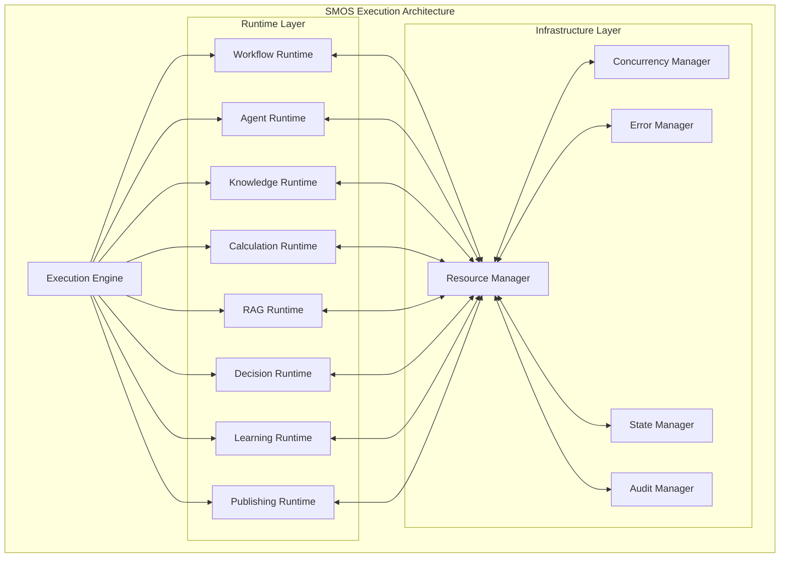
```mermaid
graph TB
    subgraph "SMOS Execution Architecture"
        EE[Execution Engine]

        subgraph "Runtime Layer"
            WR[Workflow Runtime]
            AR[Agent Runtime]
            KR[Knowledge Runtime]
            CR[Calculation Runtime]
            RR[RAG Runtime]
            DR[Decision Runtime]
            LR[Learning Runtime]
            PR[Publishing Runtime]
        end

        subgraph "Infrastructure Layer"
            RM[Resource Manager]
            CM[Concurrency Manager]
            EM[Error Manager]
            SM[State Manager]
            AM[Audit Manager]
        end

        EE --> WR
        EE --> AR
        EE --> KR
        EE --> CR
        EE --> RR
        EE --> DR
        EE --> LR
        EE --> PR

        WR <--> RM
        AR <--> RM
        KR <--> RM
        CR <--> RM
        RR <--> RM
        DR <--> RM
        LR <--> RM
        PR <--> RM

        RM <--> CM
        RM <--> EM
        RM <--> SM
        RM <--> AM
    end
```

### اعداد کلیدی

| آیتم                  | مقدار                        |
| --------------------- | ---------------------------- |
| تعداد Runtime         | ۸ عدد                        |
| تعداد قرارداد اجرا    | ۱۴ عدد                       |
| تعداد Schema          | ۶ عدد                        |
| سطح بلوغ اولیه        | ML-03                        |
| حداکثر Runtime همزمان | نامحدود (مقیاس‌پذیر)         |
| حداکثر تأخیر مجاز     | ۵۰۰ms برای Runtimeهای همزمان |
| سطح اطمینان پیش‌فرض   | CL-80                        |

---

## ۲. Purpose & Scope

### ۲.۱ Purpose

SMOS-701 معماری اجرای سازمانی SMOS را برای دستیابی به اهداف زیر تعریف می‌کند:

1. **تعریف زبان مشترک اجرا**: همه Runtimeها از یک چارچوب معماری واحد پیروی می‌کنند
2. **تفکیک مسئولیت‌ها**: هر Runtime یک وظیفه مشخص دارد
3. **یکپارچگی بین Runtimeها**: تعامل استاندارد و پیش‌بینی‌پذیر بین Runtimeها
4. **قابلیت ردیابی**: هر اجرا قابل ردیابی، حسابرسی و اندازه‌گیری است
5. **مقیاس‌پذیری**: Runtimeهای جدید بدون بازطراحی معماری اضافه می‌شوند
6. **تاب‌آوری**: خطاها مدیریت و بازیابی می‌شوند بدون ازدست‌رفتن داده
7. **امنیت**: اجرا با اصول امنیتی SMOS هماهنگ است

### ۲.۲ Inside Scope

| حوزه                    | توضیح                       |
| ----------------------- | --------------------------- |
| معماری Execution Engine | لایه‌ها، اجزاء، مدل‌ها      |
| Runtime Workflow        | نحوه اجرای Workflow         |
| Runtime Agent           | نحوه اجرای AI Agent         |
| Runtime Knowledge       | دسترسی به دانش در زمان اجرا |
| Runtime Calculation     | محاسبات و فرمول‌ها          |
| Runtime RAG             | بازیابی و تولید افزوده      |
| Runtime Decision        | تصمیم‌گیری هوشمند           |
| Runtime Learning        | حلقه‌های یادگیری            |
| Runtime Publishing      | خطوط لوله انتشار            |
| مدل تعامل Runtimeها     | ارتباط بین Runtimeها        |
| چرخه حیات Runtime       | راه‌اندازی، پایدار، خاموشی  |
| مدل وضعیت Runtime       | وضعیت‌های هر Runtime        |
| مدل انتشار بافت         | جریان بافت بین Runtimeها    |
| مدیریت منابع            | حافظه، توکن، پردازش         |
| مدل همروندی             | موازی و ترتیبی              |
| مدیریت خطا              | الگوهای خطا                 |
| بازیابی                 | استراتژی‌های بازیابی        |
| حسابرسی                 | ثبت و ردیابی                |
| امنیت                   | یکپارچگی امنیت              |
| نظارت                   | مانیتورینگ Runtimeها        |
| قراردادهای اجرا         | قرارداد بین Runtimeها       |
| Schema                  | تعاریف JSON                 |
| ADR                     | تصمیمات معماری              |
| مدل بلوغ                | سطوح بلوغ اجرا              |

### ۲.۳ Outside Scope

| حوزه              | دلیل                |
| ----------------- | ------------------- |
| پیاده‌سازی کد     | حوزه پیاده‌سازی فنی |
| APIهای خاص        | حوزه پیاده‌سازی     |
| Vendorهای خاص     | خنثی‌بودن فناوری    |
| پیکربندی محیطی    | حوزه DEPLOY-\*      |
| پرامپت‌های اجرایی | حوزه PRM-\*         |
| Workflowهای خاص   | حوزه AUT-\*         |
| Agentهای خاص      | حوزه AI-\*          |
| دانش عملیاتی      | حوزه KNW-\*         |

---

## ۳. Architectural Position

### ۳.۱ جایگاه در سلسله‌مراتب اسناد

SMOS-701 در لایه معماری اجرا قرار دارد و به عنوان پل بین معماری طراحی و معماری پیاده‌سازی عمل می‌کند.

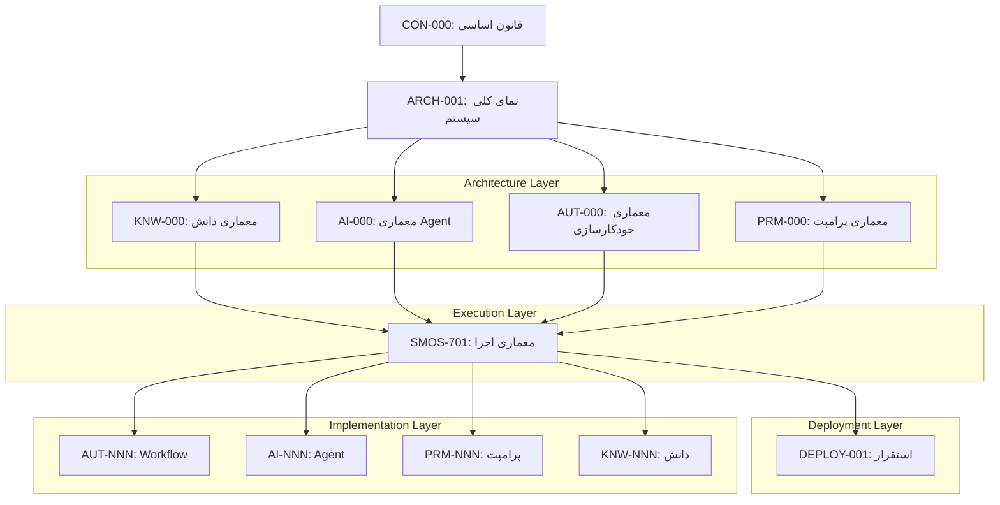
```mermaid
graph TD
    CON[CON-000: قانون اساسی]
    ARCH[ARCH-001: نمای کلی سیستم]

    subgraph "Architecture Layer"
        KNW[KNW-000: معماری دانش]
        AI[AI-000: معماری Agent]
        AUT[AUT-000: معماری خودکارسازی]
        PRM[PRM-000: معماری پرامپت]
    end

    subgraph "Execution Layer"
        EXEC[SMOS-701: معماری اجرا]
    end

    subgraph "Deployment Layer"
        DEPLOY[DEPLOY-001: استقرار]
    end

    subgraph "Implementation Layer"
        WFL[AUT-NNN: Workflow]
        AGT[AI-NNN: Agent]
        PRM_N[PRM-NNN: پرامپت]
        KNW_N[KNW-NNN: دانش]
    end

    CON --> ARCH
    ARCH --> KNW
    ARCH --> AI
    ARCH --> AUT
    ARCH --> PRM

    KNW --> EXEC
    AI --> EXEC
    AUT --> EXEC
    PRM --> EXEC

    EXEC --> DEPLOY
    EXEC --> WFL
    EXEC --> AGT
    EXEC --> PRM_N
    EXEC --> KNW_N
```

### ۳.۲ رابطه با معماری‌های مادر

| سند مادر                                                             | رابطه         | ماهیت رابطه                                          |
| -------------------------------------------------------------------- | ------------- | ---------------------------------------------------- |
| [KNW-000](../70-KNOWLEDGE/00-enterprise-knowledge-architecture.md)   | runtime-of    | دانش در زمان اجرا توسط Knowledge Runtime مصرف می‌شود |
| [AI-000](../40-AI-AGENTS/00-enterprise-ai-agent-architecture.md)     | runtime-of    | Agentها توسط Agent Runtime اجرا می‌شوند              |
| [AUT-000](../50-AUTOMATION/00-enterprise-automation-architecture.md) | runtime-of    | Workflowها توسط Workflow Runtime اجرا می‌شوند        |
| [PRM-000](../60-PROMPTS/00-enterprise-prompt-architecture.md)        | consumed-by   | پرامپت‌ها توسط RAG و Decision Runtime مصرف می‌شوند   |
| [DEPLOY-001](../15-DEPLOY/00-deployment-strategy.md)                 | deployment-of | SMOS-701 تعریف می‌کند چه چیزی مستقر می‌شود           |
| [ARCH-010](../00-ARCHITECTURE/10-meta-architecture.md)               | extends       | معماری اجرا از معماری متا مشتق می‌شود                |
| [ARCH-011](../00-ARCHITECTURE/11-object-model.md)                    | uses          | اشیاء SMOS در Runtimeها پردازش می‌شوند               |
| [ARCH-014](../00-ARCHITECTURE/14-automation-model.md)                | extends       | مدل خودکارسازی در Runtime Workflow پیاده‌سازی می‌شود |

### ۳.۳ اصل تفکیم از محتوا

SMOS-701 فقط معماری اجرا را تعریف می‌کند — نه پیاده‌سازی، نه پلتفرم، نه Vendor. معماری اجرا مستقل از:

- زبان برنامه‌نویسی (Java, Go, Python, TypeScript)
- پلتفرم اجرایی (Kubernetes, Serverless, Bare-metal)
- Vendor ابری (AWS, Azure, GCP, On-premise)
- فناوری Workflow (Temporal, n8n, Airflow, LangGraph)
- مدل زبانی (GPT, Claude, Gemini, Llama)

---

## ۴. Design Principles

SMOS-701 با اصول معماری زیر طراحی شده است. همه Runtimeها و قراردادها باید از این اصول پیروی کنند.

| ID     | اصل                           | توضیح                                                                                   | منشأ                  |
| ------ | ----------------------------- | --------------------------------------------------------------------------------------- | --------------------- |
| EXP-01 | **تفکیک Runtime**             | هر Runtime یک وظیفه واحد و مشخص دارد — هم‌پوشانی مجاز نیست                              | Single Responsibility |
| EXP-02 | **بافت به عنوان جریان اولیه** | بافت (Context) بین Runtimeها به صورت صریح و ساختاریافته جریان می‌یابد                   | Context Propagation   |
| EXP-03 | **قرارداد صریح**              | هر Runtime قرارداد ورودی/خروجی خود را به صورت Schema اعلام می‌کند                       | Contract-First        |
| EXP-04 | **خطا به عنوان داده**         | خطاها موجودیت‌های درجه اول هستند — نه استثنا                                            | Error as Data         |
| EXP-05 | **بازیابی همیشه ممکن**        | هر Runtime باید قابلیت بازیابی از هر وضعیت خطا را داشته باشد                            | Resiliency            |
| EXP-06 | **همروندی ایمن**              | Runtimeها باید برای اجرای همزمان طراحی شوند                                             | Concurrency Safety    |
| EXP-07 | **ردیابی سراسری**             | هر اجرا یک Trace ID منحصربه‌فرد دارد که در تمام Runtimeها جریان می‌یابد                 | Distributed Tracing   |
| EXP-08 | **بدون وضعیت مشترک**          | Runtimeها وضعیت را از طریق بافت منتقل می‌کنند — نه حافظه مشترک                          | Stateless Design      |
| EXP-09 | **منابع محدود**               | هر Runtime باید با محدودیت منابع (حافظه، توکن، زمان) کار کند                            | Resource Awareness    |
| EXP-10 | **تکامل تدریجی**              | Runtimeهای جدید بدون تغییر Runtimeهای موجود اضافه می‌شوند                               | Open-Closed           |
| EXP-11 | **عدم وابستگی دایره‌ای**      | Runtimeها وابستگی دایره‌ای ندارند — A می‌تواند B را صدا بزند، B نمی‌تواند A را صدا بزند | Acyclic Dependency    |
| EXP-12 | **بازیابی مستقل**             | خطای یک Runtime نباید Runtimeهای دیگر را از کار بیندازد                                 | Isolation             |
| EXP-13 | **اندازه‌گیری همه چیز**       | همه Runtimeها معیارهای عملکرد را منتشر می‌کنند                                          | Observability         |
| EXP-14 | **امنیت در لایه اجرا**        | احراز هویت و مجوز در تمام Runtimeها اعمال می‌شود                                        | Security by Design    |

---

## ۵. Execution Engine Architecture

### ۵.۱ نمای کلی

Execution Engine هسته مرکزی معماری اجرای SMOS است. این Engine مسئول هماهنگی، زمان‌بندی و نظارت بر همه Runtimeها است.

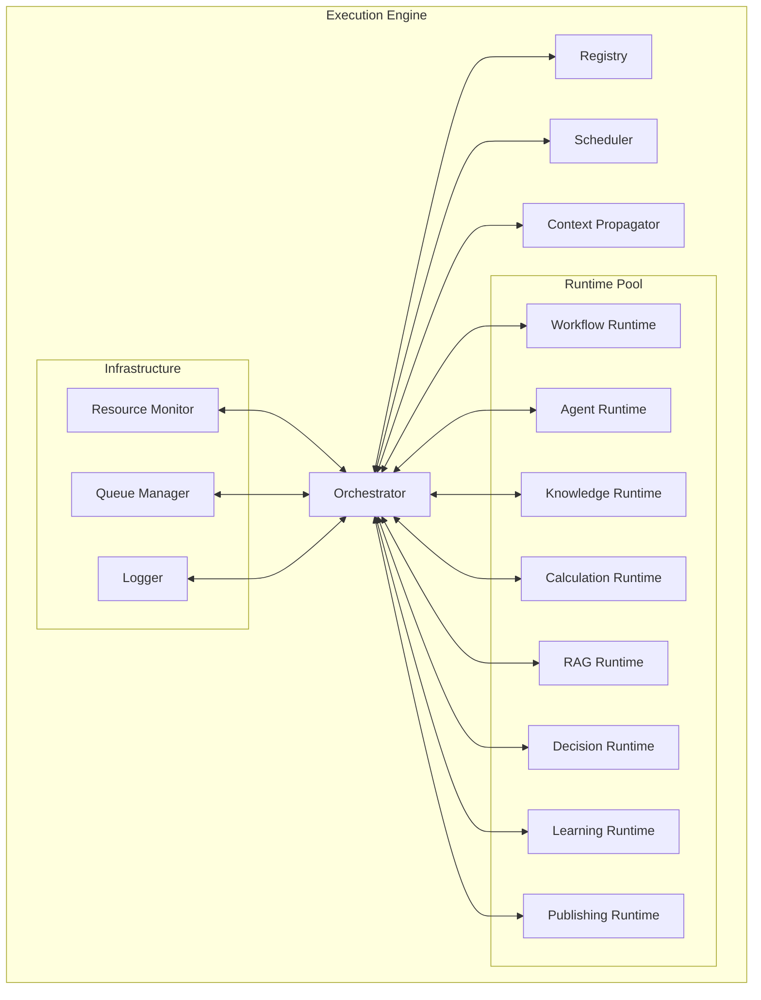
```mermaid
graph TB
    subgraph "Execution Engine"
        S[Orchestrator]
        R[Registry]
        Sched[Scheduler]
        CP[Context Propagator]

        subgraph "Runtime Pool"
            RT1[Workflow Runtime]
            RT2[Agent Runtime]
            RT3[Knowledge Runtime]
            RT4[Calculation Runtime]
            RT5[RAG Runtime]
            RT6[Decision Runtime]
            RT7[Learning Runtime]
            RT8[Publishing Runtime]
        end

        subgraph "Infrastructure"
            RM[Resource Monitor]
            Q[Queue Manager]
            L[Logger]
        end

        S <--> R
        S <--> Sched
        S <--> CP
        S <--> RT1
        S <--> RT2
        S <--> RT3
        S <--> RT4
        S <--> RT5
        S <--> RT6
        S <--> RT7
        S <--> RT8
        RM <--> S
        Q <--> S
        L <--> S
    end
```

### ۵.۲ اجزاء Execution Engine

| مؤلفه                  | مسئولیت                                                       |
| ---------------------- | ------------------------------------------------------------- |
| **Orchestrator**       | هماهنگی بین Runtimeها، مسیریابی درخواست‌ها، مدیریت جریان اجرا |
| **Registry**           | ثبت Runtimeها، قابلیت‌ها، وضعیت و قراردادها                   |
| **Scheduler**          | زمان‌بندی اجراها، مدیریت صف، تخصیص Runtime                    |
| **Context Propagator** | انتشار بافت بین Runtimeها، تبدیل فرمت بافت، اعتبارسنجی بافت   |
| **Runtime Pool**       | مجموعه Runtimeهای ثبت‌شده و فعال                              |
| **Resource Monitor**   | نظارت بر مصرف منابع (حافظه، توکن، CPU)                        |
| **Queue Manager**      | مدیریت صف‌های اجرا، اولویت‌بندی، backpressure                 |
| **Logger**             | ثبت همه رویدادهای اجرا برای حسابرسی و ردیابی                  |

### ۵.۳ لایه‌های معماری

Execution Engine در پنج لایه سازماندهی شده است:

| لایه | نام                      | توضیح                                 |
| ---- | ------------------------ | ------------------------------------- |
| L-01 | **Interface Layer**      | API, Event, Webhook — ورودی‌های خارجی |
| L-02 | **Orchestration Layer**  | مسیریابی، زمان‌بندی، هماهنگی          |
| L-03 | **Runtime Layer**        | ۸ Runtime مجزا                        |
| L-04 | **Infrastructure Layer** | منابع، صف، ثبت، مانیتورینگ            |
| L-05 | **Persistence Layer**    | ذخیره وضعیت، بافت، تاریخچه            |

### ۵.۴ جریان درخواست در Execution Engine

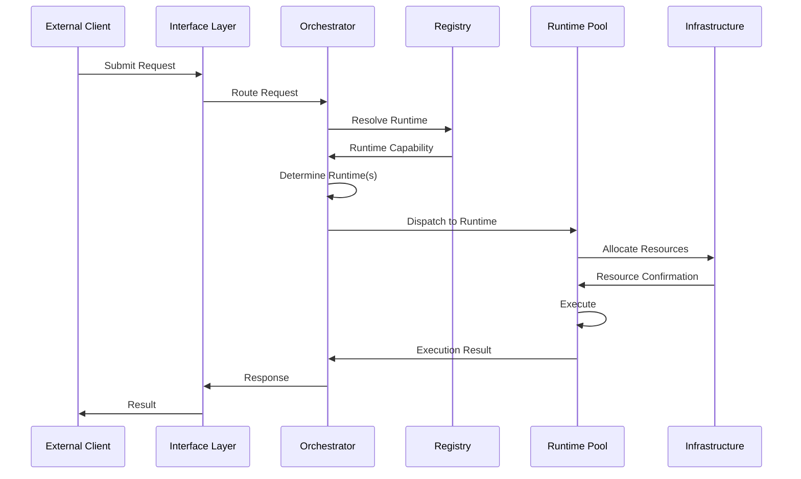
```mermaid
sequenceDiagram
    participant Client as External Client
    participant API as Interface Layer
    participant ORC as Orchestrator
    participant REG as Registry
    participant RTS as Runtime Pool
    participant INF as Infrastructure

    Client->>API: Submit Request
    API->>ORC: Route Request
    ORC->>REG: Resolve Runtime
    REG->>ORC: Runtime Capability
    ORC->>ORC: Determine Runtime(s)
    ORC->>RTS: Dispatch to Runtime
    RTS->>INF: Allocate Resources
    INF->>RTS: Resource Confirmation
    RTS->>RTS: Execute
    RTS->>ORC: Execution Result
    ORC->>API: Response
    API->>Client: Result
```

---

## ۶. Workflow Runtime

### ۶.۱ Purpose

Workflow Runtime مسئول اجرای گردش‌های کار خودکار (Automation Workflows) است. این Runtime با [AUT-000](../50-AUTOMATION/00-enterprise-automation-architecture.md) هماهنگ است و Workflowهای تعریف‌شده در AUT-NNN را اجرا می‌کند.

### ۶.۲ معماری

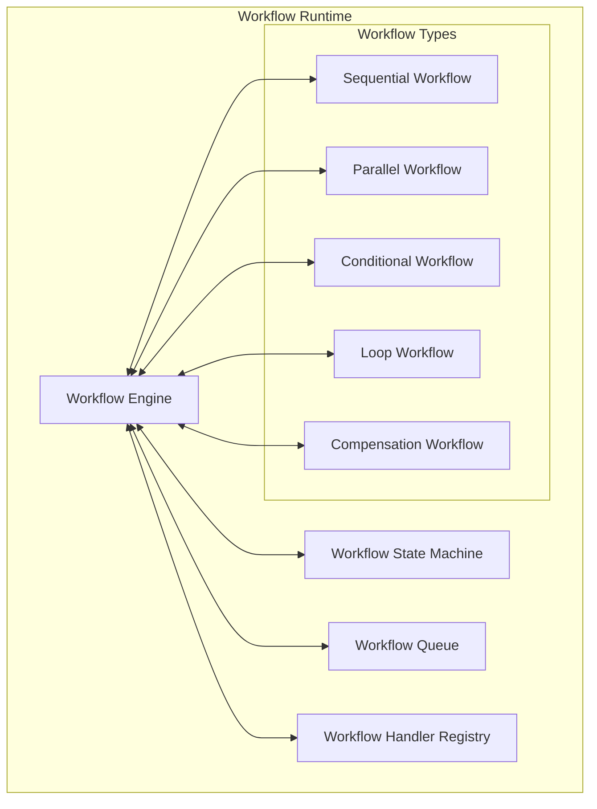
```mermaid
graph TB
    subgraph "Workflow Runtime"
        WE[Workflow Engine]
        WS[Workflow State Machine]
        WQ[Workflow Queue]
        WH[Workflow Handler Registry]

        subgraph "Workflow Types"
            WT1[Sequential Workflow]
            WT2[Parallel Workflow]
            WT3[Conditional Workflow]
            WT4[Loop Workflow]
            WT5[Compensation Workflow]
        end

        WE <--> WS
        WE <--> WQ
        WE <--> WH
        WE <--> WT1
        WE <--> WT2
        WE <--> WT3
        WE <--> WT4
        WE <--> WT5
    end
```

### ۶.۳ مسئولیت‌ها

1. **بارگذاری Workflow**: خواندن تعریف Workflow از Registry (AUT-001)
2. **مدیریت وضعیت**: پیگیری وضعیت هر Workflow Instance
3. **مدیریت صف**: زمان‌بندی و اولویت‌بندی اجرای Workflow
4. **ارسال رویداد**: انتشار رویدادهای Workflow به Runtimeهای دیگر
5. **مدیریت خطا**: شناسایی و مدیریت خطاهای Workflow
6. **جبران (Compensation)**: اجرای جبران در صورت شکست
7. **ردیابی**: ثبت هر مرحله از اجرا

### ۶.۴ وضعیت‌های Workflow

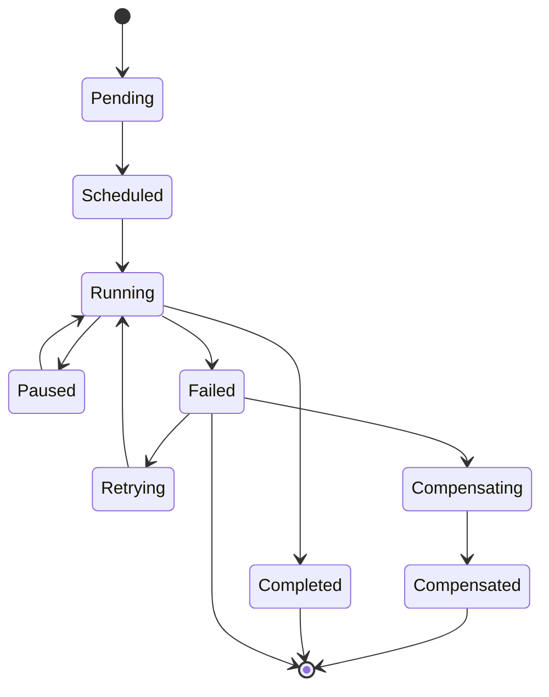
```mermaid
stateDiagram-v2
    [*] --> Pending
    Pending --> Scheduled
    Scheduled --> Running
    Running --> Paused
    Paused --> Running
    Running --> Completed
    Running --> Failed
    Failed --> Retrying
    Retrying --> Running
    Failed --> Compensating
    Compensating --> Compensated
    Compensated --> [*]
    Completed --> [*]
    Failed --> [*]
```

### ۶.۵ ورودی و خروجی

| جنبه        | توضیح                                                      |
| ----------- | ---------------------------------------------------------- |
| **ورودی**   | Workflow Definition (JSON), Initial Context, Trigger Event |
| **خروجی**   | Execution Result, Updated Context, Event Log               |
| **قرارداد** | WorkflowContract با متدهای execute, compensate, getStatus  |
| **خطاها**   | WorkflowError, StepError, TimeoutError, CompensateError    |

---

## ۷. Agent Runtime

### ۷.۱ Purpose

Agent Runtime مسئول اجرای AI Agentها است. این Runtime با [AI-000](../40-AI-AGENTS/00-enterprise-ai-agent-architecture.md) هماهنگ است و Agentهای تعریف‌شده در AI-NNN را اجرا می‌کند.

### ۷.۲ معماری

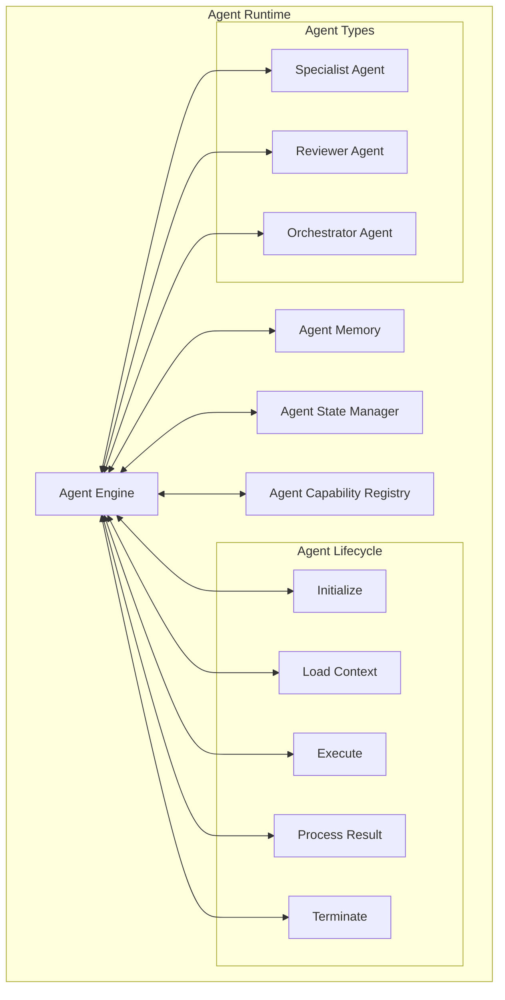
```mermaid
graph TB
    subgraph "Agent Runtime"
        AE[Agent Engine]
        AM[Agent Memory]
        AS[Agent State Manager]
        AC[Agent Capability Registry]

        subgraph "Agent Lifecycle"
            INIT[Initialize]
            LOAD[Load Context]
            EXEC[Execute]
            PROC[Process Result]
            TERM[Terminate]
        end

        subgraph "Agent Types"
            AT1[Specialist Agent]
            AT2[Reviewer Agent]
            AT3[Orchestrator Agent]
        end

        AE <--> AM
        AE <--> AS
        AE <--> AC
        AE <--> INIT
        AE <--> LOAD
        AE <--> EXEC
        AE <--> PROC
        AE <--> TERM
        AE <--> AT1
        AE <--> AT2
        AE <--> AT3
    end
```

### ۷.۳ مسئولیت‌ها

1. **بارگذاری Agent Configuration**: خواندن مشخصات Agent از AI-NNN
2. **مدیریت حافظه Agent**: حافظه کوتاه‌مدت و بلندمدت Agent
3. **هماهنگی با LLM**: ارسال پرامپت و دریافت پاسخ
4. **اعتبارسنجی خروجی**: بررسی خروجی با قوانین AI-000
5. **مدیریت ابزار**: فراخوانی ابزارهای تعریف‌شده برای Agent
6. **ردیابی هزینه**: شمارش توکن و زمان اجرا
7. **بازیابی**: مدیریت خطاهای LLM و ابزار

### ۷.۴ وضعیت‌های Agent

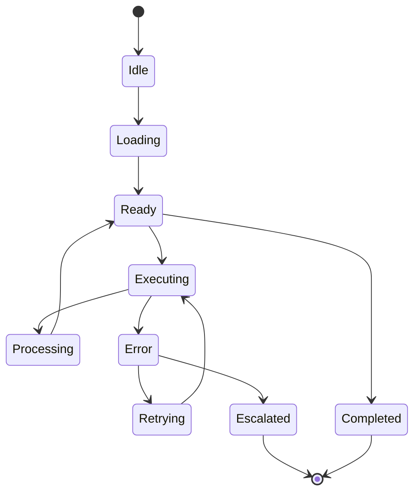
```mermaid
stateDiagram-v2
    [*] --> Idle
    Idle --> Loading
    Loading --> Ready
    Ready --> Executing
    Executing --> Processing
    Processing --> Ready
    Executing --> Error
    Error --> Retrying
    Retrying --> Executing
    Error --> Escalated
    Escalated --> [*]
    Ready --> Completed
    Completed --> [*]
```

### ۷.۵ ورودی و خروجی

| جنبه        | توضیح                                                     |
| ----------- | --------------------------------------------------------- |
| **ورودی**   | Agent ID, Input Context, Goal, Authority Level            |
| **خروجی**   | Agent Result, Updated Context, Trace Log                  |
| **قرارداد** | AgentContract با متدهای load, execute, process, terminate |
| **خطاها**   | AgentError, LLMError, ToolError, AuthError, TimeoutError  |

---

## ۸. Knowledge Runtime

### ۸.۱ Purpose

Knowledge Runtime مسئول دسترسی به دانش در زمان اجرا است. این Runtime با [KNW-000](../70-KNOWLEDGE/00-enterprise-knowledge-architecture.md) هماهنگ است و دانش ذخیره‌شده در KNW-NNN را بازیابی، اعتبارسنجی و ارائه می‌کند.

### ۸.۲ معماری

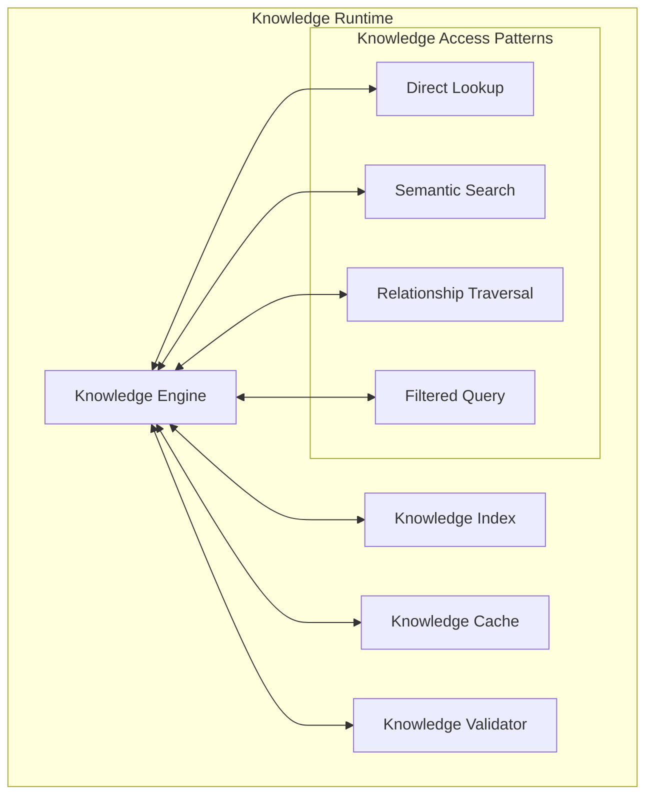
```mermaid
graph TB
    subgraph "Knowledge Runtime"
        KE[Knowledge Engine]
        KI[Knowledge Index]
        KC[Knowledge Cache]
        KV[Knowledge Validator]

        subgraph "Knowledge Access Patterns"
            KAP1[Direct Lookup]
            KAP2[Semantic Search]
            KAP3[Relationship Traversal]
            KAP4[Filtered Query]
        end

        KE <--> KI
        KE <--> KC
        KE <--> KV
        KE <--> KAP1
        KE <--> KAP2
        KE <--> KAP3
        KE <--> KAP4
    end
```

### ۸.۳ مسئولیت‌ها

1. **بازیابی دانش**: جستجو و بازیابی دانش بر اساس شناسه، مفهوم یا رابطه
2. **ذخیره‌سازی موقت**: کش دانش‌های پرکاربرد برای کاهش تأخیر
3. **اعتبارسنجی هنگام خروج**: بررسی اعتبار دانش قبل از تحویل
4. **ردیابی دسترسی**: ثبت هر دسترسی به دانش برای ممیزی
5. **مدیریت نسخه**: بازگرداندن نسخه صحیح دانش
6. **ترجمه بافت**: تبدیل بافت اجرا به کوئری دانش

### ۸.۴ وضعیت‌های Knowledge Runtime

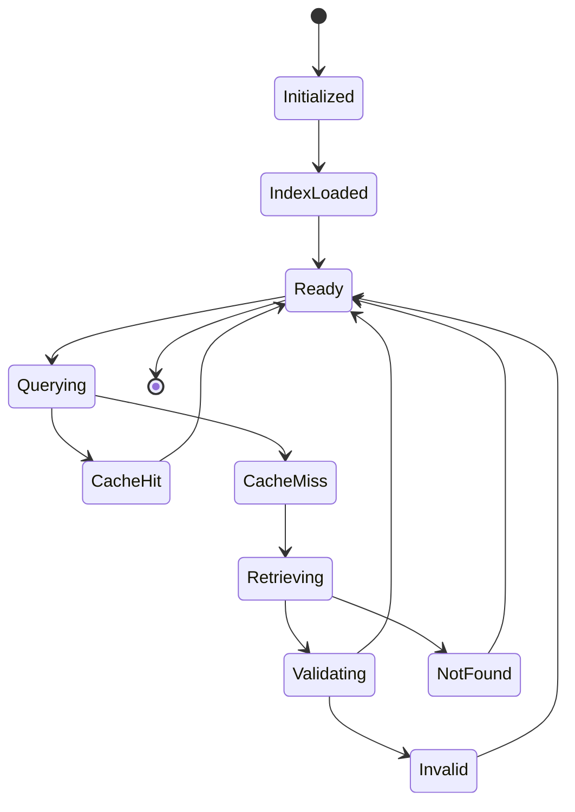
```mermaid
stateDiagram-v2
    [*] --> Initialized
    Initialized --> IndexLoaded
    IndexLoaded --> Ready
    Ready --> Querying
    Querying --> CacheHit
    Querying --> CacheMiss
    CacheHit --> Ready
    CacheMiss --> Retrieving
    Retrieving --> Validating
    Validating --> Ready
    Retrieving --> NotFound
    NotFound --> Ready
    Validating --> Invalid
    Invalid --> Ready
    Ready --> [*]
```

### ۸.۵ ورودی و خروجی

| جنبه        | توضیح                                                           |
| ----------- | --------------------------------------------------------------- |
| **ورودی**   | Knowledge Query, Context Filters, Version Constraint            |
| **خروجی**   | Knowledge Result, Confidence Score, Source References           |
| **قرارداد** | KnowledgeContract با متدهای query, lookup, validate, cache      |
| **خطاها**   | KnowledgeNotFound, KnowledgeInvalid, KnowledgeStale, IndexError |

---

## ۹. Calculation Runtime

### ۹.۱ Purpose

Calculation Runtime مسئول اجرای محاسبات، فرمول‌ها و تبدیل‌های عددی است. این Runtime محاسبات خالص (Pure Calculations) را بدون عوارض جانبی اجرا می‌کند.

### ۹.۲ معماری

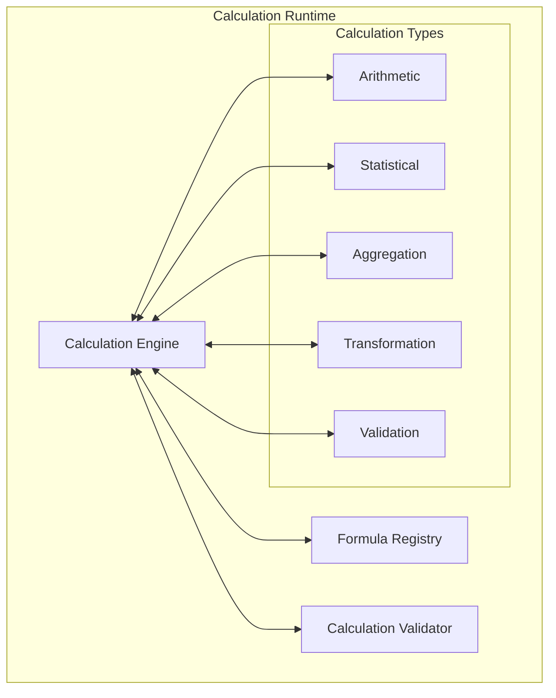
```mermaid
graph TB
    subgraph "Calculation Runtime"
        CE[Calculation Engine]
        CF[Formula Registry]
        CV[Calculation Validator]

        subgraph "Calculation Types"
            CT1[Arithmetic]
            CT2[Statistical]
            CT3[Aggregation]
            CT4[Transformation]
            CT5[Validation]
        end

        CE <--> CF
        CE <--> CV
        CE <--> CT1
        CE <--> CT2
        CE <--> CT3
        CE <--> CT4
        CE <--> CT5
    end
```

### ۹.۳ مسئولیت‌ها

1. **اجرای فرمول**: ارزیابی عبارات ریاضی و منطقی
2. **اعتبارسنجی نتیجه**: بررسی صحت محاسبات
3. **مدیریت دقت**: کنترل دقت اعداد (گرد کردن، truncation)
4. **ردیابی وابستگی**: شناسایی وابستگی‌های محاسباتی
5. **بهینه‌سازی**: کش نتایج میانی برای محاسبات تکراری

### ۹.۴ انواع محاسبات

| نوع                | توضیح             | مثال                         |
| ------------------ | ----------------- | ---------------------------- |
| **Arithmetic**     | عملیات پایه ریاضی | جمع، تفریق، ضرب، تقسیم       |
| **Statistical**    | محاسبات آماری     | میانگین، میانه، انحراف معیار |
| **Aggregation**    | تجمیع داده‌ها     | جمع کل، شمارش، گروه‌بندی     |
| **Transformation** | تبدیل فرمت        | درصد، نسبت، نرخ رشد          |
| **Validation**     | اعتبارسنجی شرطی   | بررسی محدوده، تطبیق الگو     |

### ۹.۵ ورودی و خروجی

| جنبه        | توضیح                                                   |
| ----------- | ------------------------------------------------------- |
| **ورودی**   | Formula String, Input Values, Precision Config          |
| **خروجی**   | Calculation Result, Unit, Confidence                    |
| **قرارداد** | CalculationContract با متدهای evaluate, validate, batch |
| **خطاها**   | DivisionByZero, Overflow, PrecisionLoss, InvalidFormula |

---

## ۱۰. RAG Runtime

### ۱۰.۱ Purpose

RAG Runtime (Retrieval-Augmented Generation Runtime) مسئول ترکیب بازیابی دانش با تولید متن توسط LLM است. این Runtime پرامپت‌های تعریف‌شده در PRM-NNN را با دانش بازیابی‌شده از KNW-NNN غنی می‌کند.

### ۱۰.۲ معماری

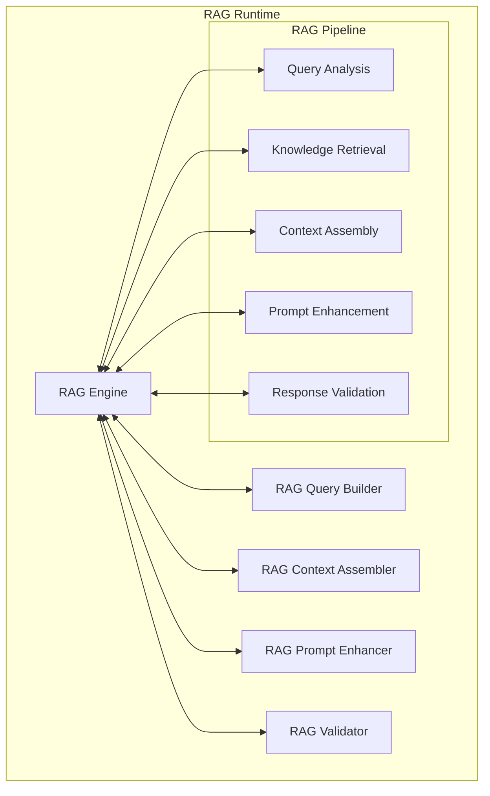
```mermaid
graph TB
    subgraph "RAG Runtime"
        RAGE[RAG Engine]
        RAGQ[RAG Query Builder]
        RAGC[RAG Context Assembler]
        RAGP[RAG Prompt Enhancer]
        RAGV[RAG Validator]

        subgraph "RAG Pipeline"
            RP1[Query Analysis]
            RP2[Knowledge Retrieval]
            RP3[Context Assembly]
            RP4[Prompt Enhancement]
            RP5[Response Validation]
        end

        RAGE <--> RAGQ
        RAGE <--> RAGC
        RAGE <--> RAGP
        RAGE <--> RAGV
        RAGE <--> RP1
        RAGE <--> RP2
        RAGE <--> RP3
        RAGE <--> RP4
        RAGE <--> RP5
    end
```

### ۱۰.۳ مسئولیت‌ها

1. **تحلیل Query**: استخراج نیاز اطلاعاتی از درخواست
2. **بازیابی دانش**: جستجو در Knowledge Runtime برای یافتن دانش مرتبط
3. **مونتاژ بافت**: ترکیب دانش بازیابی‌شده در یک بافت ساختاریافته
4. **بهبود پرامپت**: تزریق دانش به پرامپت اصلی
5. **اعتبارسنجی پاسخ**: بررسی پاسخ تولیدشده با دانش منبع
6. **مدیریت منابع**: محدودیت اندازه بافت RAG برای توکن‌های LLM

### ۱۰.۴ خط لوله RAG

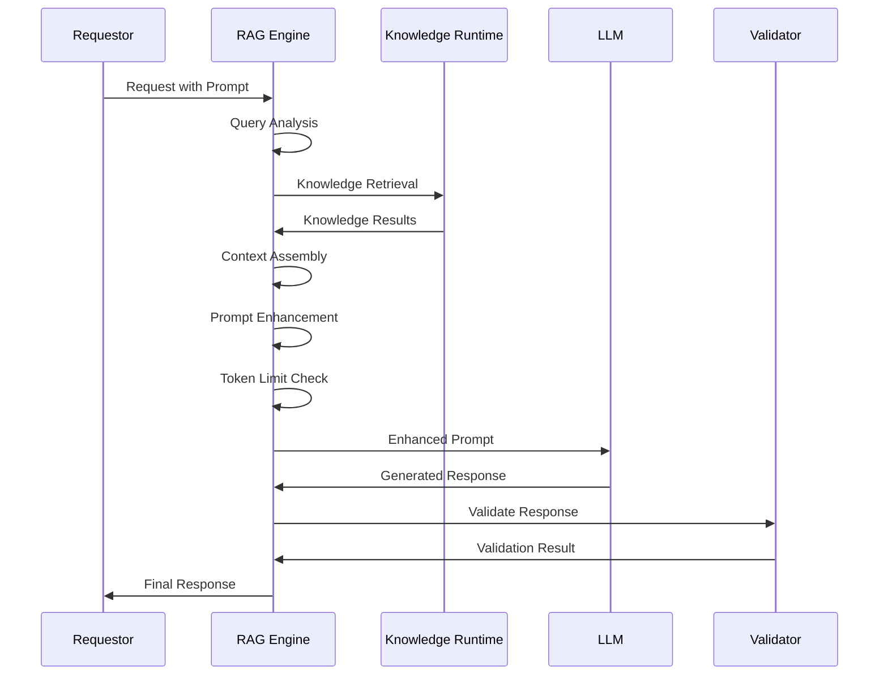
```mermaid
sequenceDiagram
    participant Client as Requestor
    participant RAGE as RAG Engine
    participant KR as Knowledge Runtime
    participant LLM as LLM
    participant VAL as Validator

    Client->>RAGE: Request with Prompt
    RAGE->>RAGE: Query Analysis
    RAGE->>KR: Knowledge Retrieval
    KR->>RAGE: Knowledge Results
    RAGE->>RAGE: Context Assembly
    RAGE->>RAGE: Prompt Enhancement
    RAGE->>RAGE: Token Limit Check
    RAGE->>LLM: Enhanced Prompt
    LLM->>RAGE: Generated Response
    RAGE->>VAL: Validate Response
    VAL->>RAGE: Validation Result
    RAGE->>Client: Final Response
```

### ۱۰.۵ استراتژی‌های RAG

| استراتژی            | توضیح                             | کاربرد                    |
| ------------------- | --------------------------------- | ------------------------- |
| **Single-shot RAG** | یک بار بازیابی، یک بار تولید      | پاسخ‌های ساده             |
| **Multi-step RAG**  | بازیابی تدریجی با اصلاح Query     | پاسخ‌های پیچیده           |
| **Iterative RAG**   | بازیابی → تولید → بازیابی → اصلاح | پاسخ‌های نیازمند دقت بالا |
| **Self-RAG**        | تولید با ارجاع به دانش معتبر      | پاسخ‌های نیازمند استناد   |

### ۱۰.۶ ورودی و خروجی

| جنبه        | توضیح                                                                             |
| ----------- | --------------------------------------------------------------------------------- |
| **ورودی**   | Base Prompt (PRM), Query, Knowledge Constraints                                   |
| **خروجی**   | Enhanced Response, Source Citations, Confidence Score                             |
| **قرارداد** | RAGContract با متدهای retrieve, enhance, generate, validate                       |
| **خطاها**   | TokenLimitExceeded, KnowledgeInsufficient, ResponseInvalid, HallucinationDetected |

---

## ۱۱. Decision Runtime

### ۱۱.۱ Purpose

Decision Runtime مسئول اجرای تصمیم‌گیری‌های هوشمند در SMOS است. این Runtime تصمیمات تعریف‌شده در KNW-104 و KNW-506 را در زمان اجرا ارزیابی می‌کند.

### ۱۱.۲ معماری

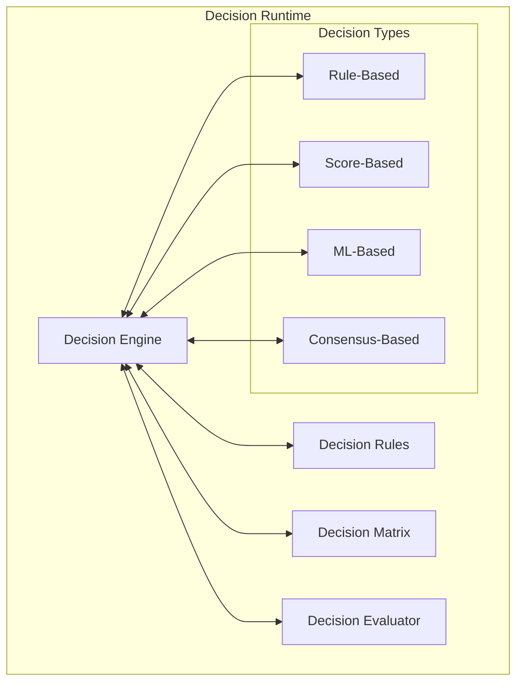
```mermaid
graph TB
    subgraph "Decision Runtime"
        DE[Decision Engine]
        DR[Decision Rules]
        DM[Decision Matrix]
        DEVAL[Decision Evaluator]

        subgraph "Decision Types"
            DT1[Rule-Based]
            DT2[Score-Based]
            DT3[ML-Based]
            DT4[Consensus-Based]
        end

        DE <--> DR
        DE <--> DM
        DE <--> DEVAL
        DE <--> DT1
        DE <--> DT2
        DE <--> DT3
        DE <--> DT4
    end
```

### ۱۱.۳ مسئولیت‌ها

1. **ارزیابی شرایط**: بررسی شرایط تصمیم بر اساس بافت جاری
2. **اجرای قواعد**: اعمال قواعد تصمیم‌گیری (KNW-102, KNW-104)
3. **محاسبه امتیاز**: ارزیابی گزینه‌ها با ماتریس‌های تصمیم
4. **ارجاع (Escalation)**: ارجاع تصمیم به سطح بالاتر در صورت نیاز
5. **ثبت تصمیم**: ثبت دلیل، گزینه‌ها و نتیجه تصمیم
6. **بازیابی تصمیم**: معکوس‌سازی تصمیم در صورت تغییر شرایط

### ۱۱.۴ مدل‌های تصمیم

| مدل                 | توضیح                               | سطح اختیار |
| ------------------- | ----------------------------------- | ---------- |
| **Rule-Based**      | تصمیم بر اساس قواعد if-then         | A-0, A-1   |
| **Score-Based**     | تصمیم بر اساس امتیازدهی به گزینه‌ها | A-2, A-3   |
| **ML-Based**        | تصمیم بر اساس مدل یادگیری ماشین     | A-3, A-4   |
| **Consensus-Based** | تصمیم با توافق چند Agent            | A-4        |

### ۱۱.۵ ورودی و خروجی

| جنبه        | توضیح                                                                   |
| ----------- | ----------------------------------------------------------------------- |
| **ورودی**   | Decision Query, Context, Authority Level, Options                       |
| **خروجی**   | Decision Result, Rationale, Alternatives, Risk Score                    |
| **قرارداد** | DecisionContract با متدهای evaluate, decide, escalate, reverse          |
| **خطاها**   | InsufficientAuthority, ConflictOfInterest, InvalidOption, RuleViolation |

---

## ۱۲. Learning Runtime

### ۱۲.۱ Purpose

Learning Runtime مسئول اجرای حلقه‌های یادگیری سازمانی است. این Runtime با [KNW-508](../70-KNOWLEDGE/514-ai-learning-architecture.md) هماهنگ است و فرآیندهای یادگیری Agentها را مدیریت می‌کند.

### ۱۲.۲ معماری

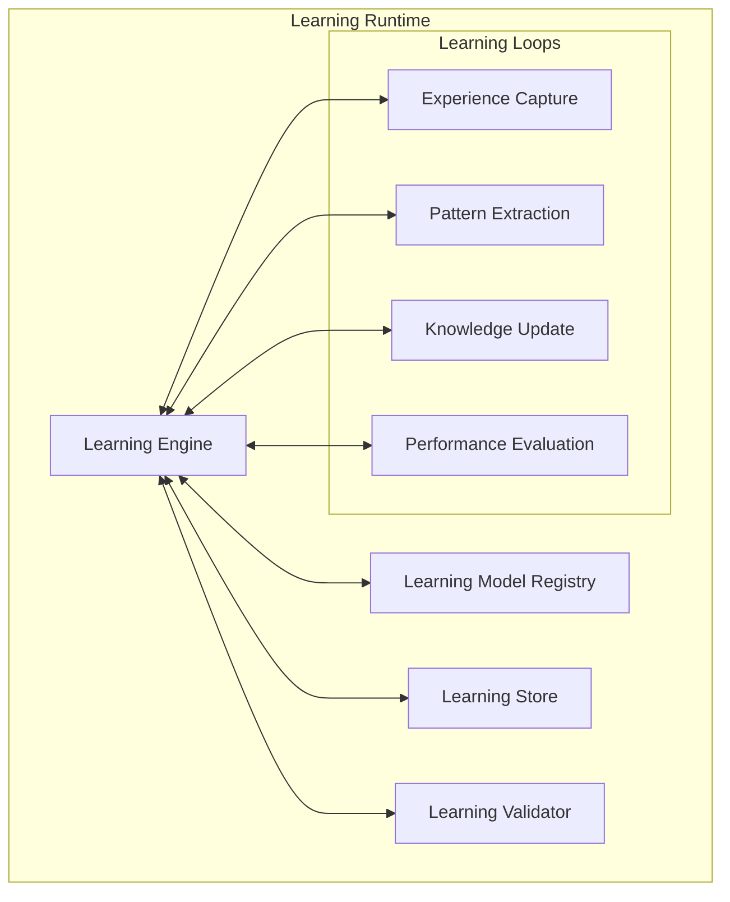
```mermaid
graph TB
    subgraph "Learning Runtime"
        LE[Learning Engine]
        LM[Learning Model Registry]
        LS[Learning Store]
        LV[Learning Validator]

        subgraph "Learning Loops"
            LL1[Experience Capture]
            LL2[Pattern Extraction]
            LL3[Knowledge Update]
            LL4[Performance Evaluation]
        end

        LE <--> LM
        LE <--> LS
        LE <--> LV
        LE <--> LL1
        LE <--> LL2
        LE <--> LL3
        LE <--> LL4
    end
```

### ۱۲.۳ مسئولیت‌ها

1. **ثبت تجربه**: ذخیره تجربیات Agentها در Learning Store
2. **استخراج الگو**: شناسایی الگوهای تکراری از تجربیات
3. **به‌روزرسانی دانش**: به‌روزرسانی KNW-NNN بر اساس یادگیری
4. **ارزیابی عملکرد**: اندازه‌گیری اثربخشی یادگیری
5. **انتشار یادگیری**: اشتراک‌گذاری یادگیری بین Agentها
6. **جلوگیری از overfitting**: کنترل یادگیری بیش از حد

### ۱۲.۴ چرخه یادگیری

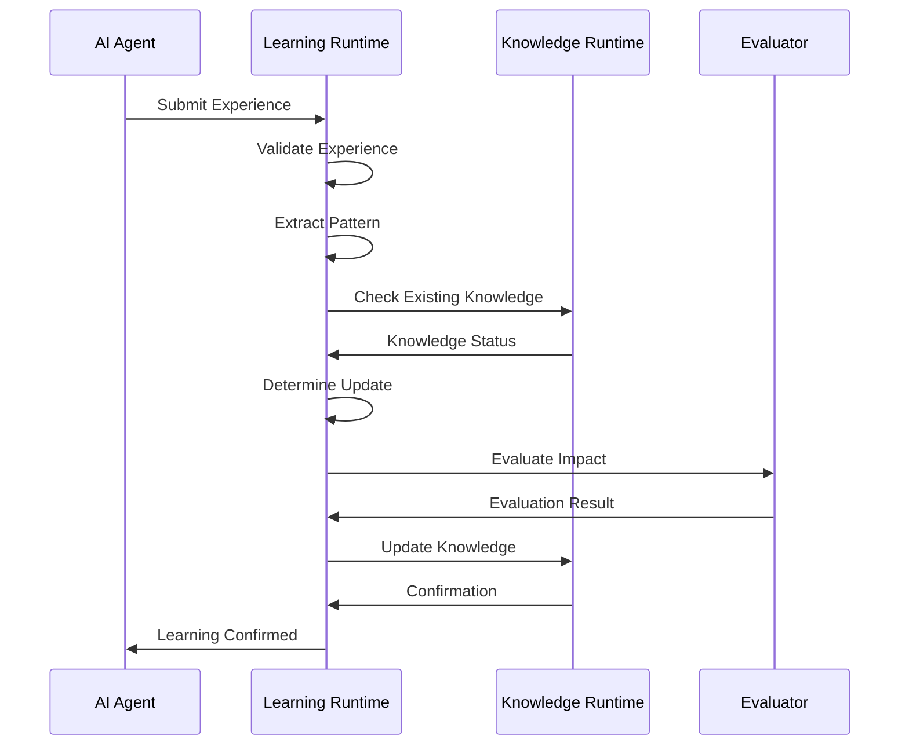
```mermaid
sequenceDiagram
    participant Agent as AI Agent
    participant LR as Learning Runtime
    participant KR as Knowledge Runtime
    participant EVAL as Evaluator

    Agent->>LR: Submit Experience
    LR->>LR: Validate Experience
    LR->>LR: Extract Pattern
    LR->>KR: Check Existing Knowledge
    KR->>LR: Knowledge Status
    LR->>LR: Determine Update
    LR->>EVAL: Evaluate Impact
    EVAL->>LR: Evaluation Result
    LR->>KR: Update Knowledge
    KR->>LR: Confirmation
    LR->>Agent: Learning Confirmed
```

### ۱۲.۵ ورودی و خروجی

| جنبه        | توضیح                                                               |
| ----------- | ------------------------------------------------------------------- |
| **ورودی**   | Experience Data, Agent Context, Learning Goal                       |
| **خروجی**   | Learned Pattern, Knowledge Update, Performance Delta                |
| **قرارداد** | LearningContract با متدهای capture, learn, update, evaluate         |
| **خطاها**   | InsufficientData, PatternNotFound, UpdateConflict, ValidationFailed |

---

## ۱۳. Publishing Runtime

### ۱۳.۱ Purpose

Publishing Runtime مسئول اجرای خطوط لوله انتشار محتوا است. این Runtime فرآیند انتشار از آماده‌سازی تا توزیع نهایی را مدیریت می‌کند و با [PLAT-000](../20-PLATFORMS/00-platform-playbook-standard.md) هماهنگ است.

### ۱۳.۲ معماری

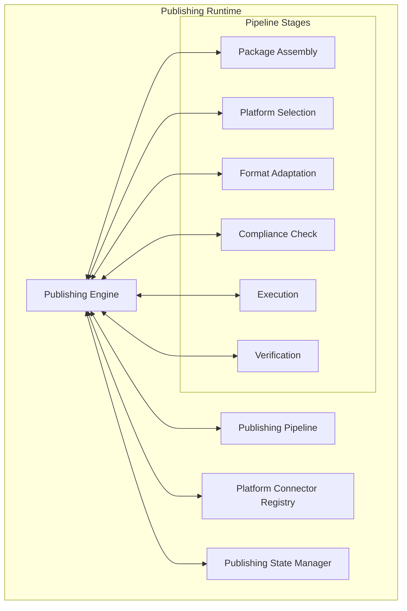
```mermaid
graph TB
    subgraph "Publishing Runtime"
        PE[Publishing Engine]
        PP[Publishing Pipeline]
        PC[Platform Connector Registry]
        PS[Publishing State Manager]

        subgraph "Pipeline Stages"
            PS1[Package Assembly]
            PS2[Platform Selection]
            PS3[Format Adaptation]
            PS4[Compliance Check]
            PS5[Execution]
            PS6[Verification]
        end

        PE <--> PP
        PE <--> PC
        PE <--> PS
        PE <--> PS1
        PE <--> PS2
        PE <--> PS3
        PE <--> PS4
        PE <--> PS5
        PE <--> PS6
    end
```

### ۱۳.۳ مسئولیت‌ها

1. **مونتاژ بسته انتشار**: ترکیب محتوا، رسانه و فراداده در یک بسته واحد
2. **انتخاب پلتفرم**: تعیین پلتفرم‌های هدف بر اساس استراتژی
3. **تطبیق فرمت**: تبدیل محتوا به فرمت مناسب هر پلتفرم
4. **بررسی انطباق**: اعتبارسنجی محتوا با قواعد هر پلتفرم
5. **اجرای انتشار**: ارسال محتوا به پلتفرم‌ها از طریق API
6. **تأیید انتشار**: بررسی موفقیت‌آمیز بودن انتشار
7. **بازیابی انتشار**: جبران در صورت شکست انتشار

### ۱۳.۴ خط لوله انتشار

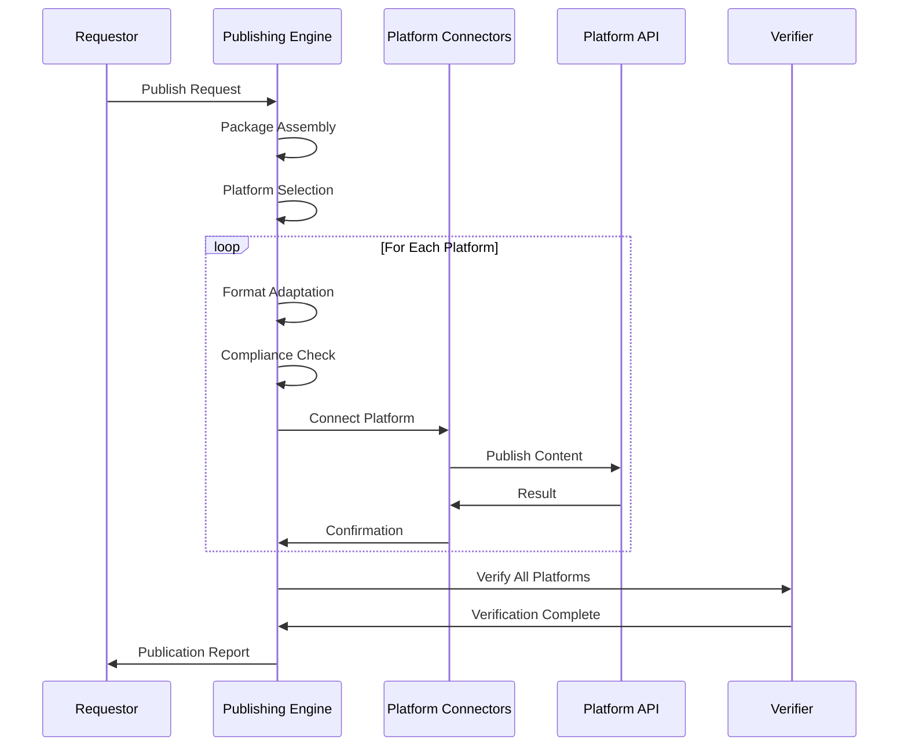
```mermaid
sequenceDiagram
    participant Client as Requestor
    participant PE as Publishing Engine
    participant PC as Platform Connectors
    participant PLAT as Platform API
    participant VER as Verifier

    Client->>PE: Publish Request
    PE->>PE: Package Assembly
    PE->>PE: Platform Selection
    loop For Each Platform
        PE->>PE: Format Adaptation
        PE->>PE: Compliance Check
        PE->>PC: Connect Platform
        PC->>PLAT: Publish Content
        PLAT->>PC: Result
        PC->>PE: Confirmation
    end
    PE->>VER: Verify All Platforms
    VER->>PE: Verification Complete
    PE->>Client: Publication Report
```

### ۱۳.۵ ورودی و خروجی

| جنبه        | توضیح                                                                        |
| ----------- | ---------------------------------------------------------------------------- |
| **ورودی**   | Content Package, Platform List, Schedule Config, Compliance Rules            |
| **خروجی**   | Publication Report, Platform Statuses, Error Log                             |
| **قرارداد** | PublishingContract با متدهای assemble, select, adapt, check, execute, verify |
| **خطاها**   | PlatformUnavailable, ComplianceViolation, AdaptationFailed, PartialFailure   |

---

## ۱۴. Interaction Between Runtimes

### ۱۴.۱ مدل ارتباط بین Runtimeها

Runtimeها از طریق **قراردادهای صریح** و **بافت انتشار یافته** با هم ارتباط برقرار می‌کنند. هیچ Runtimeای مستقیماً به Runtime دیگر دسترسی ندارد — همه ارتباطات از طریق Execution Engine یا از طریق Context Propagator انجام می‌شود.

### ۱۴.۲ الگوهای تعامل

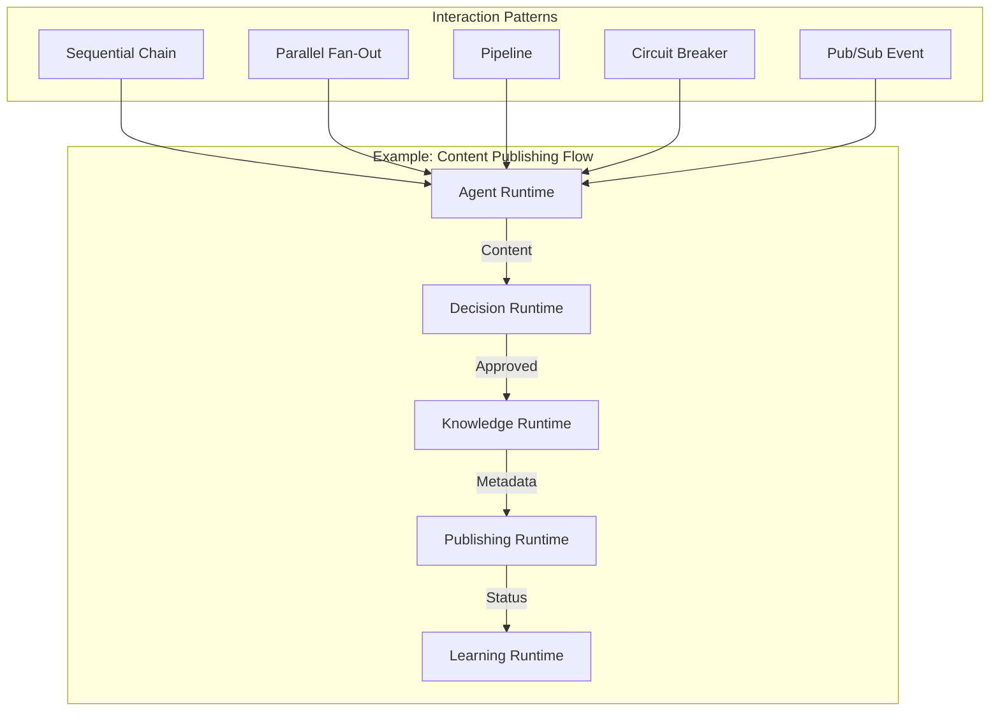
```mermaid
graph TB
    subgraph "Interaction Patterns"
        IP1[Sequential Chain]
        IP2[Parallel Fan-Out]
        IP3[Pipeline]
        IP4[Circuit Breaker]
        IP5[Pub/Sub Event]
    end

    subgraph "Example: Content Publishing Flow"
        AR[Agent Runtime] -->|Content| VR[Decision Runtime]
        VR -->|Approved| KR[Knowledge Runtime]
        KR -->|Metadata| PR[Publishing Runtime]
        PR -->|Status| LR[Learning Runtime]
    end

    IP1 --> AR
    IP2 --> AR
    IP3 --> AR
    IP4 --> AR
    IP5 --> AR
```

### ۱۴.۳ ماتریس تعامل Runtimeها

| از / به         | Workflow | Agent | Knowledge | Calculation | RAG | Decision | Learning | Publishing |
| --------------- | -------- | ----- | --------- | ----------- | --- | -------- | -------- | ---------- |
| **Workflow**    | —        | ✅    | ✅        | ✅          | ✅  | ✅       | ✅       | ✅         |
| **Agent**       | —        | ✅    | ✅        | ✅          | ✅  | ✅       | ✅       | ✅         |
| **Knowledge**   | —        | —     | —         | ✅          | ✅  | ✅       | ✅       | —          |
| **Calculation** | —        | —     | ✅        | —           | —   | ✅       | ✅       | —          |
| **RAG**         | —        | ✅    | ✅        | —           | —   | ✅       | —        | —          |
| **Decision**    | —        | ✅    | ✅        | ✅          | —   | —        | ✅       | ✅         |
| **Learning**    | —        | ✅    | ✅        | ✅          | —   | ✅       | —        | —          |
| **Publishing**  | —        | —     | —         | —           | —   | —        | ✅       | —          |

### ۱۴.۴ پروتکل تعامل

هر تعامل بین Runtimeها از پروتکل زیر پیروی می‌کند:

1. **فراخوان**: Runtime مبدأ یک درخواست با بافت جاری ارسال می‌کند
2. **مسیریابی**: Execution Engine درخواست را به Runtime مقصد هدایت می‌کند
3. **اجرا**: Runtime مقصد درخواست را اجرا می‌کند
4. **بازگشت**: Runtime مقصد نتیجه را با بافت به‌روزشده برمی‌گرداند
5. **ادامه**: Runtime مبدأ با بافت جدید ادامه می‌دهد

---

## ۱۵. Runtime Lifecycle

### ۱۵.۱ فازهای چرخه حیات

هر Runtime از یک چرخه حیات سه فازی پیروی می‌کند:

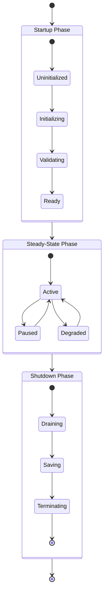
```mermaid
stateDiagram-v2
    state "Startup Phase" as SP
    state "Steady-State Phase" as SSP
    state "Shutdown Phase" as SHP

    [*] --> SP
    SP --> SSP
    SSP --> SHP
    SHP --> [*]

    state SP {
        [*] --> Uninitialized
        Uninitialized --> Initializing
        Initializing --> Validating
        Validating --> Ready
    }

    state SSP {
        [*] --> Active
        Active --> Paused
        Paused --> Active
        Active --> Degraded
        Degraded --> Active
    }

    state SHP {
        [*] --> Draining
        Draining --> Saving
        Saving --> Terminating
        Terminating --> [*]
    }
```

### ۱۵.۲ Startup Phase

| مرحله             | توضیح                             | معیار موفقیت                |
| ----------------- | --------------------------------- | --------------------------- |
| **Uninitialized** | Runtime هنوز بارگذاری نشده        | —                           |
| **Initializing**  | بارگذاری پیکربندی، اتصال به منابع | همه Configها بارگذاری شوند  |
| **Validating**    | اعتبارسنجی پیکربندی و اتصالات     | همه Health Checks عبور کنند |
| **Ready**         | Runtime آماده دریافت درخواست      | اولین Heartbeat موفق        |

### ۱۵.۳ Steady-State Phase

| وضعیت        | توضیح                               | مدت زمان            |
| ------------ | ----------------------------------- | ------------------- |
| **Active**   | Runtime عادی، پذیرش درخواست         | نامحدود             |
| **Paused**   | Runtime مکث، عدم پذیرش درخواست جدید | محدود (تا ۳۰ دقیقه) |
| **Degraded** | Runtime با ظرفیت کاهش‌یافته         | محدود (تا ۲ ساعت)   |

### ۱۵.۴ Shutdown Phase

| مرحله           | توضیح                                          | مهلت     |
| --------------- | ---------------------------------------------- | -------- |
| **Draining**    | عدم پذیرش درخواست جدید، اتمام درخواست‌های جاری | ۳۰ ثانیه |
| **Saving**      | ذخیره وضعیت و بافت نهایی                       | ۱۰ ثانیه |
| **Terminating** | آزادسازی منابع و قطع اتصالات                   | ۵ ثانیه  |

---

## ۱۶. Runtime State Model

### ۱۶.۱ مدل وضعیت مشترک

همه Runtimeها از یک مدل وضعیت مشترک پیروی می‌کنند:

```mermaid
stateDiagram-v2
    [*] --> Created
    Created --> Initialized
    Initialized --> Ready
    Ready --> Running
    Running --> Completed
    Running --> Failed
    Running --> Paused
    Paused --> Running
    Failed --> Retrying
    Retrying --> Running
    Failed --> Escalated
    Escalated --> [*]
    Completed --> [*]
```

### ۱۶.۲ ثبت وضعیت اجرا (Execution Manifest)

هر اجرا دارای یک Execution Manifest است که وضعیت را در کل اجرا ثبت می‌کند:

```json
{
  "executionManifest": {
    "executionId": "exec-20260701-a1b2c3",
    "runtimeId": "agent-runtime-01",
    "requestId": "req-20260701-x9y8z7",
    "state": "running",
    "stateHistory": [
      {
        "state": "created",
        "timestamp": "2026-07-01T08:00:00.000Z"
      },
      {
        "state": "initialized",
        "timestamp": "2026-07-01T08:00:00.050Z"
      },
      {
        "state": "ready",
        "timestamp": "2026-07-01T08:00:00.100Z"
      },
      {
        "state": "running",
        "timestamp": "2026-07-01T08:00:00.200Z"
      }
    ],
    "contextId": "ctx-20260701-b2c3d4",
    "parentId": null,
    "errorCount": 0,
    "retryCount": 0,
    "startedAt": "2026-07-01T08:00:00.000Z",
    "updatedAt": "2026-07-01T08:00:00.200Z"
  }
}
```

### ۱۶.۳ انتقال‌های وضعیت مجاز

| از          | به          | شرط                          |
| ----------- | ----------- | ---------------------------- |
| Created     | Initialized | همه وابستگی‌ها موجود         |
| Initialized | Ready       | Health Check گذرانده         |
| Ready       | Running     | درخواست دریافت شده           |
| Running     | Completed   | اجرا با موفقیت پایان یافته   |
| Running     | Failed      | خطای غیرقابل بازیابی         |
| Running     | Paused      | محدودیت منابع یا دستور خارجی |
| Paused      | Running     | رفع محدودیت یا دستور ادامه   |
| Failed      | Retrying    | خطای قابل بازیابی            |
| Retrying    | Running     | تلاش مجدد موفق               |
| Failed      | Escalated   | خطای نیازمند مداخله انسانی   |

---

## ۱۷. Context Propagation Model

### ۱۷.۱ مفهوم بافت (Context)

بافت مجموعه‌ای از داده‌های ساختاریافته است که در طول اجرا بین Runtimeها جریان می‌یابد. بافت شامل:

- **Execution Context**: Trace ID, Span ID, Parent ID
- **Data Context**: ورودی‌ها، خروجی‌های میانی، نتایج
- **Security Context**: شناسه عامل، سطح دسترسی، توکن
- **Resource Context**: محدودیت منابع، اولویت
- **Environment Context**: محیط اجرا، Feature Flags

### ۱۷.۲ مدل انتشار بافت

```mermaid
sequenceDiagram
    participant R1 as Runtime A
    participant CP as Context Propagator
    participant R2 as Runtime B
    participant R3 as Runtime C

    R1->>CP: Submit Context
    CP->>CP: Validate Context
    CP->>CP: Transform Context
    CP->>R2: Forward Context
    R2->>R2: Execute with Context
    R2->>CP: Return Updated Context
    CP->>CP: Merge Context
    CP->>R3: Forward Merged Context
    R3->>R3: Execute with Context
    R3->>CP: Return Final Context
    CP->>R1: Return Final Context
```

### ۱۷.۳ ساختار بافت

```json
{
  "executionContext": {
    "traceId": "trace-20260701-a1b2c3d4",
    "spanId": "span-20260701-e5f6g7h8",
    "parentSpanId": "span-20260701-i9j0k1l2",
    "sequence": 3,
    "runtimeChain": ["workflow-runtime", "agent-runtime", "decision-runtime"]
  },
  "dataContext": {
    "input": {
      "contentId": "cnt-20260701-m3n4o5p6",
      "platform": "instagram",
      "action": "publish"
    },
    "intermediate": {
      "strategyApproved": true,
      "contentValidated": true
    },
    "output": null
  },
  "securityContext": {
    "agentId": "AI-003",
    "authorityLevel": "A-3",
    "tokenHash": "sha256$abc123...",
    "sessionId": "sess-20260701-q7r8s9t0"
  },
  "resourceContext": {
    "maxTokens": 4096,
    "timeoutMs": 30000,
    "priority": 5,
    "budgetCategory": "content-production"
  },
  "environmentContext": {
    "environment": "staging",
    "version": "1.0.0",
    "featureFlags": ["rag-enhanced", "parallel-publishing"]
  }
}
```

### ۱۷.۴ قوانین انتشار

1. **بافت همیشه با درخواست سفر می‌کند** — هر درخواست یک بافت دارد
2. **بافت فقط رشد می‌کند** — داده‌های جدید اضافه می‌شوند، داده‌های قبلی حذف نمی‌شوند
3. **بافت قابل اعتبارسنجی است** — Schema بافت در Runtime Registry ثبت شده
4. **بافت محدودیت اندازه دارد** — حداکثر ۱MB (پس از فشرده‌سازی)
5. **بافت امن است** — فیلدهای حساس رمزنگاری می‌شوند

---

## ۱۸. Resource Management

### ۱۸.۱ انواع منابع

| منبع        | واحد اندازه‌گیری | محدودیت پیش‌فرض           |
| ----------- | ---------------- | ------------------------- |
| **Token**   | تعداد توکن (LLM) | ۴,۰۹۶ توکن در هر درخواست  |
| **Memory**  | MB               | ۵۱۲ MB در هر Runtime      |
| **Compute** | CPU میلی‌ثانیه   | ۱۰,۰۰۰ ms در هر اجرا      |
| **Storage** | KB               | ۱۰۰ KB بافت در هر اجرا    |
| **Network** | تعداد درخواست    | ۱۰۰ req/min در هر Runtime |
| **Time**    | میلی‌ثانیه       | ۳۰,۰۰۰ ms در هر اجرا      |

### ۱۸.۲ مدل تخصیص منابع

```mermaid
graph TB
    subgraph "Resource Management"
        RM[Resource Manager]
        BP[Budget Pool]
        AC[Allocation Controller]
        QC[Quota Controller]

        subgraph "Budget Categories"
            BC1[Content Production]
            BC2[Strategy Planning]
            BC3[Knowledge Operations]
            BC4[Publishing]
            BC5[Learning]
        end

        RM <--> BP
        RM <--> AC
        RM <--> QC
        RM <--> BC1
        RM <--> BC2
        RM <--> BC3
        RM <--> BC4
        RM <--> BC5
    end
```

### ۱۸.۳ استراتژی‌های تخصیص

| استراتژی       | توضیح                               | کاربرد               |
| -------------- | ----------------------------------- | -------------------- |
| **Fair Share** | تخصیص برابر بین Runtimeها           | Runtimeهای هم‌اولویت |
| **Priority**   | تخصیص بر اساس اولویت                | Runtimeهای بحرانی    |
| **Budget**     | تخصیص بر اساس بودجه ازپیش‌تعریف‌شده | Runtimeهای تجاری     |
| **Adaptive**   | تخصیص پویا بر اساس تقاضا            | Runtimeهای متغیر     |
| **Reserved**   | تخصیص تضمینی                        | Runtimeهای حیاتی     |

### ۱۸.۴ Backpressure

وقتی Runtime به محدودیت منابع می‌رسد:

1. **Warning**: هشدار به Execution Engine
2. **Throttle**: کاهش نرخ پذیرش درخواست
3. **Queue Offload**: انتقال درخواست‌ها به صف خارجی
4. **Drop**: رد درخواست‌های اضافی با Retry-After

---

## ۱۹. Concurrency Model

### ۱۹.۱ اصول همروندی

1. **Runtimeها مستقل هستند** — هر Runtime در مرز خود اجرا می‌شود
2. **وضعیت مشترک وجود ندارد** — همه داده‌ها از طریق بافت منتقل می‌شوند
3. **همروندی در سطح Runtime** — هر Runtime می‌تواند چندین Instance داشته باشد
4. **ترتیبی در سطح Execution** — یک اجرا می‌تواند مراحل ترتیبی و موازی داشته باشد

### ۱۹.۲ الگوهای همروندی

```mermaid
graph TB
    subgraph "Sequential Execution"
        A[Step 1] --> B[Step 2] --> C[Step 3]
    end

    subgraph "Parallel Fan-Out"
        D[Start] --> E[Task A]
        D --> F[Task B]
        D --> G[Task C]
        E --> H[Join]
        F --> H
        G --> H
    end

    subgraph "Pipeline"
        I[Stage 1] --> J[Stage 2]
        J --> K[Stage 3]
    end
```

### ۱۹.۳ مدل اجرا

| مدل                 | توضیح                   | قفل             | مثال                |
| ------------------- | ----------------------- | --------------- | ------------------- |
| **Single-Threaded** | یک Runtime, یک درخواست  | ندارد           | Calculation Runtime |
| **Multi-Threaded**  | یک Runtime, چند درخواست | Read/Write Lock | Agent Runtime       |
| **Event-Driven**    | غیرهمزمان با Event Loop | ندارد           | Workflow Runtime    |
| **Actor Model**     | هر درخواست یک Actor     | Mailbox         | Publishing Runtime  |
| **Partitioned**     | هر پارتیشن یک Thread    | Shard Lock      | Knowledge Runtime   |

### ۱۹.۴ مدیریت Race Condition

1. **هر Execution یک Trace ID دارد** — هیچ دو Execution یکسان نیست
2. **بافت immutable است برای Runtimeهای downstream** — Runtime upstream می‌تواند بافت را تغییر دهد
3. **منابع stateful با Optimistic Locking** — جلوگیری از overwrite همزمان
4. **Idempotency Tokens** — هر درخواست یک token منحصربه‌فرد دارد

---

## ۲۰. Error Handling Architecture

### ۲۰.۱ طبقه‌بندی خطاها

```mermaid
graph TB
    subgraph "Error Classification"
        E1[Transient Errors]
        E2[Permanent Errors]
        E3[Business Errors]
        E4[Security Errors]
        E5[Resource Errors]
    end

    subgraph "Transient"
        T1[Timeout]
        T2[Network Error]
        T3[Rate Limit]
        T4[Service Unavailable]
    end

    subgraph "Permanent"
        P1[Invalid Input]
        P2[Config Error]
        P3[Contract Violation]
    end

    subgraph "Business"
        B1[Rule Violation]
        B2[Authority Denied]
        B3[Validation Failed]
    end

    subgraph "Security"
        S1[Authentication Failed]
        S2[Authorization Denied]
        S3[Token Expired]
    end

    subgraph "Resource"
        R1[Out of Memory]
        R2[Token Limit]
        R3[Quota Exceeded]
    end

    E1 --> T1
    E1 --> T2
    E1 --> T3
    E1 --> T4
    E2 --> P1
    E2 --> P2
    E2 --> P3
    E3 --> B1
    E3 --> B2
    E3 --> B3
    E4 --> S1
    E4 --> S2
    E4 --> S3
    E5 --> R1
    E5 --> R2
    E5 --> R3
```

### ۲۰.۲ ساختار خطا

```json
{
  "error": {
    "code": "EXEC-ERR-0023",
    "type": "transient",
    "severity": "high",
    "runtime": "agent-runtime",
    "message": {
      "fa": "مهلت زمانی اجرای Agent به پایان رسید",
      "en": "Agent execution timeout exceeded"
    },
    "details": {
      "agentId": "AI-003",
      "timeoutMs": 30000,
      "elapsedMs": 30102
    },
    "stack": [
      {
        "runtime": "agent-runtime",
        "span": "execution",
        "timestamp": "2026-07-01T08:00:30.102Z"
      },
      {
        "runtime": "llm-connector",
        "span": "generate",
        "timestamp": "2026-07-01T08:00:30.100Z"
      }
    ],
    "retryable": true,
    "retryAfterMs": 5000,
    "correlationId": "corr-20260701-a1b2c3d4"
  }
}
```

### ۲۰.۳ استراتژی‌های مدیریت خطا

| نوع خطا       | استراتژی           | عملیات                       |
| ------------- | ------------------ | ---------------------------- |
| **Transient** | Retry with backoff | تلاش مجدد با تأخیر تصاعدی    |
| **Permanent** | Fail fast          | قطع اجرا و ثبت خطا           |
| **Business**  | Escalate           | ارجاع به سطح بالاتر یا انسان |
| **Security**  | Block and alert    | قطع دسترسی و اعلان امنیتی    |
| **Resource**  | Throttle and retry | کاهش نرخ و تلاش مجدد         |

### ۲۰.۴ Retry Policy

```json
{
  "retryPolicy": {
    "maxRetries": 3,
    "initialBackoffMs": 1000,
    "backoffMultiplier": 2.0,
    "maxBackoffMs": 30000,
    "jitterMs": 100,
    "retryableErrors": ["EXEC-ERR-0001", "EXEC-ERR-0002", "EXEC-ERR-0003"],
    "nonRetryableErrors": ["EXEC-ERR-0101", "EXEC-ERR-0102"],
    "onExhausted": "escalate"
  }
}
```

---

## ۲۱. Recovery Architecture

### ۲۱.۱ اصول بازیابی

1. **بازیابی همیشه از آخرین وضعیت شناخته‌شده** — از Execution Manifest
2. **Idempotency**: عملیات تکراری نتیجه یکسان دارند
3. **Graceful Degradation**: در صورت کاهش منابع، Runtime با ظرفیت کمتر ادامه می‌دهد
4. **Save Point**: هر Runtime می‌تواند نقاط ذخیره (Save Point) تعریف کند

### ۲۱.۲ استراتژی‌های بازیابی

```mermaid
graph TB
    subgraph "Recovery Strategies"
        RS1[Retry Recovery]
        RS2[Checkpoint Recovery]
        RS3[Compensation Recovery]
        RS4[Fallback Recovery]
        RS5[Human Intervention]
    end

    subgraph "Trigger Conditions"
        TC1[Runtime Crash]
        TC2[Node Failure]
        TC3[Network Partition]
        TC4[Resource Exhaustion]
    end

    TC1 --> RS1
    TC1 --> RS2
    TC2 --> RS2
    TC3 --> RS1
    TC3 --> RS4
    TC4 --> RS5
    TC4 --> RS3
```

### ۲۱.۳ مدل بازیابی

| استراتژی                  | توضیح                           | RTO        | RPO        |
| ------------------------- | ------------------------------- | ---------- | ---------- |
| **Retry Recovery**        | تلاش مجدد همان عملیات           | < ۱ دقیقه  | صفر        |
| **Checkpoint Recovery**   | ادامه از آخرین Save Point       | < ۵ دقیقه  | < ۱ دقیقه  |
| **Compensation Recovery** | جبران عملیات ناقص و شروع دوباره | < ۱۰ دقیقه | < ۵ دقیقه  |
| **Fallback Recovery**     | استفاده از Runtime جایگزین      | < ۱۵ دقیقه | < ۱۰ دقیقه |
| **Human Intervention**    | مداخله دستی اپراتور             | > ۳۰ دقیقه | متغیر      |

---

## ۲۲. Audit Architecture

### ۲۲.۱ اهداف حسابرسی

1. **ردیابی کامل**: هر اجرا از ابتدا تا انتها قابل ردیابی است
2. **غیرقابل انکار**: همه رویدادها با امضای دیجیتال ثبت می‌شوند
3. **قابلیت بازپخش**: تاریخچه اجراها قابل بازپخش است
4. **انطباق**: همه اجراها با قوانین حکمرانی (GOV-004, ARCH-030) مطابقت دارند

### ۲۲.۲ رویدادهای حسابرسی

```mermaid
sequenceDiagram
    participant RT as Runtime
    participant AL as Audit Logger
    participant AS as Audit Store
    participant AV as Audit Verifier

    RT->>AL: Runtime Started
    AL->>AL: Create Audit Event
    AL->>AS: Store Event

    RT->>AL: Request Received
    AL->>AL: Create Audit Event
    AL->>AS: Store Event

    RT->>AL: Execution Step
    AL->>AL: Create Audit Event
    AL->>AS: Store Event

    RT->>AL: Execution Complete
    AL->>AL: Create Audit Event
    AL->>AS: Store Event

    AS->>AV: Verify Chain
    AV->>AL: Chain Verified
```

### ۲۲.۳ ساختار رویداد حسابرسی

```json
{
  "auditEvent": {
    "eventId": "audit-20260701-a1b2c3d4",
    "timestamp": "2026-07-01T08:00:00.000Z",
    "type": "execution.completed",
    "runtime": "agent-runtime",
    "executionId": "exec-20260701-e5f6g7h8",
    "actorId": "AI-003",
    "actorType": "ai-agent",
    "authorityLevel": "A-3",
    "action": "content_production.execute",
    "resourceId": "cnt-20260701-i9j0k1l2",
    "resourceType": "content-asset",
    "outcome": "success",
    "changes": [
      {
        "field": "status",
        "from": "pending",
        "to": "produced"
      },
      {
        "field": "producer",
        "from": null,
        "to": "AI-003"
      }
    ],
    "signature": "rsa256$base64signature...",
    "correlationId": "corr-20260701-m3n4o5p6"
  }
}
```

### ۲۲.۴ سطوح حسابرسی

| سطح             | جزئیات               | ذخیره‌سازی | Runtimeهای مشمول            |
| --------------- | -------------------- | ---------- | --------------------------- |
| **L1-Summary**  | فقط شروع و پایان     | ۹۰ روز     | همه Runtimeها               |
| **L2-Detailed** | مراحل اصلی           | ۳۰ روز     | Workflow, Agent, Publishing |
| **L3-Full**     | همه رویدادها         | ۷ روز      | Decision, Learning          |
| **L4-Data**     | داده‌های ورودی/خروجی | ۱ روز      | RAG (فقط Metadata)          |

---

## ۲۳. Security Integration

### ۲۳.۱ اصول امنیتی در لایه اجرا

1. **Authentication در مرز**: هر درخواست به Execution Engine احراز هویت می‌شود
2. **Authorization در Runtime**: هر Runtime سطح دسترسی را اعمال می‌کند
3. **Encryption در транзит**: بافت بین Runtimeها رمزنگاری می‌شود
4. **Audit Trail غیرقابل تغییر**: همه رویدادها ثبت می‌شوند
5. **Minimum Privilege**: هر Runtime فقط به منابع موردنیاز دسترسی دارد

### ۲۳.۲ مدل امنیتی

```mermaid
graph TB
    subgraph "Security Model"
        subgraph "Authentication"
            A1[Token Validation]
            A2[Mutual TLS]
            A3[Session Check]
        end

        subgraph "Authorization"
            Z1[Role Check]
            Z2[Authority Level]
            Z3[Resource Policy]
        end

        subgraph "Security Services"
            S1[Token Service]
            S2[Policy Engine]
            S3[Audit Service]
        end

        A1 --> Z1
        A2 --> Z2
        A3 --> Z3

        Z1 --> S1
        Z2 --> S2
        Z3 --> S3
    end
```

### ۲۳.۳ Security Context در بافت

هر بافت یک Security Context دارد که در طول اجرا منتقل می‌شود:

```json
{
  "securityContext": {
    "authentication": {
      "method": "jwt",
      "issuer": "smos-auth",
      "subject": "AI-003",
      "issuedAt": "2026-07-01T08:00:00.000Z",
      "expiresAt": "2026-07-01T09:00:00.000Z"
    },
    "authorization": {
      "authorityLevel": "A-3",
      "roles": ["content-producer"],
      "permissions": ["content:read", "content:write", "knowledge:read"],
      "restrictions": ["no-delete", "rate-limit:100/hour"]
    },
    "audit": {
      "traceId": "trace-20260701-a1b2c3d4",
      "sessionId": "sess-20260701-e5f6g7h8"
    }
  }
}
```

---

## ۲۴. Monitoring Integration

### ۲۴.۱ معیارهای نظارت

هر Runtime معیارهای زیر را به صورت بلادرنگ منتشر می‌کند:

| دسته                 | معیار                | واحد   |
| -------------------- | -------------------- | ------ |
| **Throughput**       | درخواست در ثانیه     | req/s  |
| **Latency**          | تأخیر متوسط و P95    | ms     |
| **Error Rate**       | نرخ خطا              | %      |
| **Resource Usage**   | مصرف حافظه و CPU     | MB, %  |
| **Queue Depth**      | عمق صف               | count  |
| **Active Instances** | تعداد نمونه‌های فعال | count  |
| **Token Usage**      | مصرف توکن (برای LLM) | tokens |
| **Cache Hit Rate**   | نرخ ضربه کش          | %      |

### ۲۴.۲ Health Check

هر Runtime یک endpoint Health Check دارد:

```json
{
  "healthCheck": {
    "runtimeId": "agent-runtime-01",
    "status": "healthy",
    "uptime": "72h15m30s",
    "version": "1.0.0",
    "lastHeartbeat": "2026-07-01T08:00:00.000Z",
    "checks": [
      {
        "name": "llm-connection",
        "status": "healthy",
        "latencyMs": 45,
        "lastChecked": "2026-07-01T08:00:00.000Z"
      },
      {
        "name": "knowledge-cache",
        "status": "healthy",
        "size": 256,
        "hitRate": 0.87
      },
      {
        "name": "resource-pool",
        "status": "healthy",
        "availableTokens": 2048,
        "availableMemory": 256
      }
    ],
    "metrics": {
      "requestsPerSecond": 12.5,
      "p95LatencyMs": 250,
      "errorRate": 0.02
    }
  }
}
```

### ۲۴.۳ رویدادهای هشدار

| رویداد               | سطح      | عملیات                              |
| -------------------- | -------- | ----------------------------------- |
| Runtime Down         | Critical | اعلان فوری، Active-Passive Failover |
| Error Rate > 5%      | High     | بررسی خودکار، Escalation به تیم     |
| Latency P95 > 500ms  | Warning  | افزایش منابع، بررسی bottleneck      |
| Token Usage > 80%    | Warning  | محدودیت Request, Alert              |
| Cache Hit Rate < 50% | Info     | بهینه‌سازی Cache                    |

---

## ۲۵. Execution Contracts

### ۲۵.۱ مفهوم قرارداد اجرا

قرارداد اجرا (Execution Contract) یک Interface رسمی است که هر Runtime برای تعامل با Runtimeهای دیگر تعریف می‌کند. قراردادها مستقل از پیاده‌سازی هستند و فقط معماری را تعریف می‌کنند.

### ۲۵.۲ انواع قرارداد

| قرارداد                 | Runtime مبدأ | Runtime مقصد                | متدها                                           |
| ----------------------- | ------------ | --------------------------- | ----------------------------------------------- |
| **WorkflowContract**    | Workflow     | همه                         | execute, compensate, getStatus                  |
| **AgentContract**       | Agent        | همه                         | load, execute, process, terminate               |
| **KnowledgeContract**   | Knowledge    | Agent, Decision, RAG        | query, lookup, validate, cache                  |
| **CalculationContract** | Calculation  | Agent, Decision, Learning   | evaluate, validate, batch                       |
| **RAGContract**         | RAG          | Agent, Publishing           | retrieve, enhance, generate, validate           |
| **DecisionContract**    | Decision     | Agent, Workflow, Publishing | evaluate, decide, escalate, reverse             |
| **LearningContract**    | Learning     | Agent, Knowledge            | capture, learn, update, evaluate                |
| **PublishingContract**  | Publishing   | Workflow, Decision          | assemble, select, adapt, check, execute, verify |

### ۲۵.۳ ساختار قرارداد

```json
{
  "executionContract": {
    "contractId": "agent-contract-v1",
    "name": "Agent Execution Contract",
    "version": "1.0.0",
    "runtime": "agent-runtime",
    "methods": [
      {
        "name": "execute",
        "inputSchema": {
          "$ref": "#/definitions/AgentInput"
        },
        "outputSchema": {
          "$ref": "#/definitions/AgentOutput"
        },
        "errorSchema": {
          "$ref": "#/definitions/AgentError"
        },
        "timeoutMs": 30000,
        "retryable": true,
        "idempotent": true
      },
      {
        "name": "load",
        "inputSchema": {
          "$ref": "#/definitions/LoadInput"
        },
        "outputSchema": {
          "$ref": "#/definitions/LoadOutput"
        },
        "errorSchema": {
          "$ref": "#/definitions/LoadError"
        },
        "timeoutMs": 5000,
        "retryable": false,
        "idempotent": true
      }
    ],
    "security": {
      "requiredAuthority": "A-1",
      "authentication": "required"
    },
    "resources": {
      "maxTokens": 4096,
      "maxMemoryMb": 512,
      "maxDurationMs": 30000
    }
  }
}
```

---

## ۲۶. Schema Definitions

این بخش شامل شش Schema اصلی معماری اجرا است. همه Schemaها با JSON Schema Draft-07 تعریف شده‌اند.

### ۲۶.۱ ExecutionEngine Schema

```json
{
  "$schema": "http://json-schema.org/draft-07/schema#",
  "$id": "smos:execution:execution-engine:v1",
  "title": "Execution Engine Schema",
  "description": "Schema for the SMOS Execution Engine configuration and state",
  "type": "object",
  "required": ["engineId", "version", "runtimes", "configuration"],
  "properties": {
    "engineId": {
      "type": "string",
      "pattern": "^exec-engine-[a-z0-9-]+$",
      "description": "Unique identifier for the execution engine instance"
    },
    "version": {
      "type": "string",
      "pattern": "^\\d+\\.\\d+\\.\\d+$",
      "description": "Semantic version of the execution engine"
    },
    "runtimes": {
      "type": "array",
      "items": {
        "$ref": "#/definitions/RuntimeReference"
      },
      "minItems": 1,
      "uniqueItems": true
    },
    "configuration": {
      "$ref": "#/definitions/EngineConfiguration"
    },
    "state": {
      "$ref": "#/definitions/EngineState"
    },
    "metrics": {
      "$ref": "#/definitions/EngineMetrics"
    }
  },
  "definitions": {
    "RuntimeReference": {
      "type": "object",
      "required": ["runtimeId", "runtimeType", "status"],
      "properties": {
        "runtimeId": { "type": "string" },
        "runtimeType": {
          "type": "string",
          "enum": [
            "workflow",
            "agent",
            "knowledge",
            "calculation",
            "rag",
            "decision",
            "learning",
            "publishing"
          ]
        },
        "status": {
          "type": "string",
          "enum": ["initialized", "ready", "active", "paused", "degraded", "terminated"]
        },
        "version": { "type": "string" }
      }
    },
    "EngineConfiguration": {
      "type": "object",
      "properties": {
        "maxConcurrentRuntimes": { "type": "integer", "minimum": 1 },
        "defaultTimeoutMs": { "type": "integer", "minimum": 1000 },
        "maxRetries": { "type": "integer", "minimum": 0, "maximum": 10 },
        "auditLevel": {
          "type": "string",
          "enum": ["L1-Summary", "L2-Detailed", "L3-Full", "L4-Data"]
        },
        "tracingEnabled": { "type": "boolean" }
      }
    },
    "EngineState": {
      "type": "object",
      "properties": {
        "status": {
          "type": "string",
          "enum": ["starting", "running", "stopping", "stopped", "error"]
        },
        "activeRuntimes": { "type": "integer" },
        "queuedRequests": { "type": "integer" },
        "uptimeSeconds": { "type": "integer" }
      }
    },
    "EngineMetrics": {
      "type": "object",
      "properties": {
        "totalRequests": { "type": "integer" },
        "successfulRequests": { "type": "integer" },
        "failedRequests": { "type": "integer" },
        "averageLatencyMs": { "type": "number" },
        "p95LatencyMs": { "type": "number" }
      }
    }
  }
}
```

### ۲۶.۲ RuntimeRegistry Schema

```json
{
  "$schema": "http://json-schema.org/draft-07/schema#",
  "$id": "smos:execution:runtime-registry:v1",
  "title": "Runtime Registry Schema",
  "description": "Schema for the runtime registry that manages all registered runtimes",
  "type": "object",
  "required": ["registryId", "runtimes"],
  "properties": {
    "registryId": {
      "type": "string",
      "pattern": "^reg-[a-z0-9-]+$"
    },
    "runtimes": {
      "type": "array",
      "items": {
        "$ref": "#/definitions/RuntimeRegistration"
      }
    },
    "version": {
      "type": "integer",
      "minimum": 1
    },
    "lastUpdated": {
      "type": "string",
      "format": "date-time"
    }
  },
  "definitions": {
    "RuntimeRegistration": {
      "type": "object",
      "required": ["runtimeId", "runtimeType", "contracts", "capabilities"],
      "properties": {
        "runtimeId": { "type": "string" },
        "runtimeType": {
          "type": "string",
          "enum": [
            "workflow",
            "agent",
            "knowledge",
            "calculation",
            "rag",
            "decision",
            "learning",
            "publishing"
          ]
        },
        "contracts": {
          "type": "array",
          "items": {
            "type": "object",
            "properties": {
              "contractId": { "type": "string" },
              "version": { "type": "string" },
              "methods": {
                "type": "array",
                "items": {
                  "type": "object",
                  "properties": {
                    "name": { "type": "string" },
                    "inputSchema": { "type": "string" },
                    "outputSchema": { "type": "string" },
                    "timeoutMs": { "type": "integer" },
                    "retryable": { "type": "boolean" }
                  },
                  "required": ["name"]
                }
              }
            },
            "required": ["contractId", "version"]
          }
        },
        "capabilities": {
          "type": "array",
          "items": {
            "type": "object",
            "properties": {
              "capabilityId": { "type": "string" },
              "name": { "type": "string" },
              "description": { "type": "string" },
              "version": { "type": "string" }
            },
            "required": ["capabilityId", "name"]
          }
        },
        "status": {
          "type": "string",
          "enum": ["registered", "active", "inactive", "deprecated"]
        },
        "healthEndpoint": {
          "type": "string",
          "format": "uri"
        }
      }
    }
  }
}
```

### ۲۶.۳ RuntimeInteraction Schema

```json
{
  "$schema": "http://json-schema.org/draft-07/schema#",
  "$id": "smos:execution:runtime-interaction:v1",
  "title": "Runtime Interaction Schema",
  "description": "Schema for interactions between runtimes",
  "type": "object",
  "required": ["interactionId", "sourceRuntime", "targetRuntime", "pattern", "context"],
  "properties": {
    "interactionId": {
      "type": "string",
      "pattern": "^interact-[a-z0-9-]+$"
    },
    "sourceRuntime": {
      "$ref": "#/definitions/RuntimeEndpoint"
    },
    "targetRuntime": {
      "$ref": "#/definitions/RuntimeEndpoint"
    },
    "pattern": {
      "type": "string",
      "enum": ["sequential", "parallel-fan-out", "pipeline", "circuit-breaker", "pub-sub"]
    },
    "context": {
      "$ref": "#/definitions/InteractionContext"
    },
    "timeoutMs": {
      "type": "integer",
      "minimum": 100
    },
    "retryPolicy": {
      "$ref": "#/definitions/RetryPolicy"
    },
    "security": {
      "type": "object",
      "properties": {
        "requiredAuthority": { "type": "string" },
        "encryption": {
          "type": "string",
          "enum": ["none", "transport", "end-to-end"]
        }
      }
    }
  },
  "definitions": {
    "RuntimeEndpoint": {
      "type": "object",
      "required": ["runtimeId", "runtimeType"],
      "properties": {
        "runtimeId": { "type": "string" },
        "runtimeType": {
          "type": "string",
          "enum": [
            "workflow",
            "agent",
            "knowledge",
            "calculation",
            "rag",
            "decision",
            "learning",
            "publishing"
          ]
        },
        "instanceId": { "type": "string" }
      }
    },
    "InteractionContext": {
      "type": "object",
      "properties": {
        "traceId": { "type": "string" },
        "parentSpanId": { "type": "string" },
        "spanId": { "type": "string" },
        "priority": {
          "type": "integer",
          "minimum": 0,
          "maximum": 10
        }
      },
      "required": ["traceId", "spanId"]
    },
    "RetryPolicy": {
      "type": "object",
      "properties": {
        "maxRetries": { "type": "integer", "minimum": 0 },
        "initialBackoffMs": { "type": "integer", "minimum": 100 },
        "backoffMultiplier": { "type": "number", "minimum": 1.0 },
        "maxBackoffMs": { "type": "integer", "minimum": 1000 }
      }
    }
  }
}
```

### ۲۶.۴ RuntimeLifecycle Schema

```json
{
  "$schema": "http://json-schema.org/draft-07/schema#",
  "$id": "smos:execution:runtime-lifecycle:v1",
  "title": "Runtime Lifecycle Schema",
  "description": "Schema for the lifecycle management of a runtime",
  "type": "object",
  "required": ["lifecycleId", "runtimeId", "phase", "transitions"],
  "properties": {
    "lifecycleId": {
      "type": "string",
      "pattern": "^lc-[a-z0-9-]+$"
    },
    "runtimeId": {
      "type": "string"
    },
    "phase": {
      "type": "string",
      "enum": ["startup", "steady-state", "shutdown"]
    },
    "state": {
      "type": "string",
      "enum": [
        "uninitialized",
        "initializing",
        "validating",
        "ready",
        "active",
        "paused",
        "degraded",
        "draining",
        "saving",
        "terminating"
      ]
    },
    "transitions": {
      "type": "array",
      "items": {
        "$ref": "#/definitions/StateTransition"
      }
    },
    "startupConfig": {
      "$ref": "#/definitions/StartupConfig"
    },
    "shutdownConfig": {
      "$ref": "#/definitions/ShutdownConfig"
    },
    "healthChecks": {
      "type": "array",
      "items": {
        "type": "object",
        "properties": {
          "name": { "type": "string" },
          "endpoint": { "type": "string" },
          "intervalMs": { "type": "integer" },
          "timeoutMs": { "type": "integer" },
          "threshold": {
            "type": "object",
            "properties": {
              "healthy": { "type": "integer" },
              "unhealthy": { "type": "integer" }
            }
          }
        },
        "required": ["name", "endpoint"]
      }
    }
  },
  "definitions": {
    "StateTransition": {
      "type": "object",
      "required": ["from", "to", "condition"],
      "properties": {
        "from": { "type": "string" },
        "to": { "type": "string" },
        "condition": { "type": "string" },
        "timeoutMs": { "type": "integer" },
        "onFailure": { "type": "string" }
      }
    },
    "StartupConfig": {
      "type": "object",
      "properties": {
        "dependencies": {
          "type": "array",
          "items": { "type": "string" }
        },
        "configSources": {
          "type": "array",
          "items": {
            "type": "object",
            "properties": {
              "source": { "type": "string" },
              "required": { "type": "boolean" }
            }
          }
        }
      }
    },
    "ShutdownConfig": {
      "type": "object",
      "properties": {
        "drainTimeoutMs": { "type": "integer" },
        "saveTimeoutMs": { "type": "integer" },
        "forceTimeoutMs": { "type": "integer" },
        "preserveState": { "type": "boolean" }
      }
    }
  }
}
```

### ۲۶.۵ ExecutionContract Schema

```json
{
  "$schema": "http://json-schema.org/draft-07/schema#",
  "$id": "smos:execution:execution-contract:v1",
  "title": "Execution Contract Schema",
  "description": "Schema for defining contracts between runtimes",
  "type": "object",
  "required": ["contractId", "name", "version", "runtime", "methods"],
  "properties": {
    "contractId": {
      "type": "string",
      "pattern": "^[a-z]+-contract-v\\d+$"
    },
    "name": {
      "type": "string"
    },
    "version": {
      "type": "string",
      "pattern": "^\\d+\\.\\d+\\.\\d+$"
    },
    "runtime": {
      "type": "string"
    },
    "description": {
      "type": "string"
    },
    "methods": {
      "type": "array",
      "items": {
        "$ref": "#/definitions/ContractMethod"
      },
      "minItems": 1
    },
    "security": {
      "$ref": "#/definitions/ContractSecurity"
    },
    "resources": {
      "$ref": "#/definitions/ContractResources"
    },
    "observability": {
      "type": "object",
      "properties": {
        "metrics": {
          "type": "array",
          "items": { "type": "string" }
        },
        "tracing": { "type": "boolean" },
        "logging": {
          "type": "string",
          "enum": ["none", "summary", "detailed", "full"]
        }
      }
    }
  },
  "definitions": {
    "ContractMethod": {
      "type": "object",
      "required": ["name", "inputSchema", "outputSchema"],
      "properties": {
        "name": { "type": "string" },
        "description": { "type": "string" },
        "inputSchema": { "type": "object" },
        "outputSchema": { "type": "object" },
        "errorSchema": { "type": "object" },
        "timeoutMs": { "type": "integer", "minimum": 100 },
        "retryable": { "type": "boolean" },
        "idempotent": { "type": "boolean" },
        "sideEffects": { "type": "boolean" }
      }
    },
    "ContractSecurity": {
      "type": "object",
      "properties": {
        "requiredAuthority": {
          "type": "string",
          "enum": ["A-0", "A-1", "A-2", "A-3", "A-4"]
        },
        "authentication": {
          "type": "string",
          "enum": ["none", "optional", "required"]
        },
        "authorization": {
          "type": "string",
          "enum": ["none", "role-based", "policy-based"]
        },
        "auditLevel": {
          "type": "string",
          "enum": ["L1-Summary", "L2-Detailed", "L3-Full", "L4-Data"]
        }
      }
    },
    "ContractResources": {
      "type": "object",
      "properties": {
        "maxTokens": {
          "type": "integer",
          "minimum": 0
        },
        "maxMemoryMb": {
          "type": "integer",
          "minimum": 0
        },
        "maxDurationMs": {
          "type": "integer",
          "minimum": 100
        },
        "maxRetries": {
          "type": "integer",
          "minimum": 0
        }
      }
    }
  }
}
```

### ۲۶.۶ RuntimeConfiguration Schema

```json
{
  "$schema": "http://json-schema.org/draft-07/schema#",
  "$id": "smos:execution:runtime-configuration:v1",
  "title": "Runtime Configuration Schema",
  "description": "Schema for configuring a runtime instance",
  "type": "object",
  "required": ["runtimeId", "runtimeType", "settings"],
  "properties": {
    "runtimeId": {
      "type": "string"
    },
    "runtimeType": {
      "type": "string",
      "enum": [
        "workflow",
        "agent",
        "knowledge",
        "calculation",
        "rag",
        "decision",
        "learning",
        "publishing"
      ]
    },
    "settings": {
      "$ref": "#/definitions/RuntimeSettings"
    },
    "resources": {
      "$ref": "#/definitions/ResourceLimits"
    },
    "connections": {
      "type": "array",
      "items": {
        "$ref": "#/definitions/ConnectionConfig"
      }
    },
    "logging": {
      "$ref": "#/definitions/LoggingConfig"
    },
    "features": {
      "type": "object",
      "additionalProperties": {
        "type": "boolean"
      }
    },
    "tags": {
      "type": "object",
      "additionalProperties": {
        "type": "string"
      }
    }
  },
  "definitions": {
    "RuntimeSettings": {
      "type": "object",
      "properties": {
        "concurrency": {
          "type": "integer",
          "minimum": 1,
          "default": 1
        },
        "maxQueueDepth": {
          "type": "integer",
          "minimum": 1,
          "default": 100
        },
        "defaultTimeoutMs": {
          "type": "integer",
          "minimum": 100,
          "default": 30000
        },
        "retryPolicy": {
          "type": "object",
          "properties": {
            "maxRetries": { "type": "integer", "default": 3 },
            "backoffMs": { "type": "integer", "default": 1000 },
            "backoffMultiplier": { "type": "number", "default": 2.0 }
          }
        },
        "cacheConfig": {
          "type": "object",
          "properties": {
            "enabled": { "type": "boolean", "default": true },
            "ttlSeconds": { "type": "integer", "default": 300 },
            "maxSize": { "type": "integer", "default": 100 }
          }
        }
      }
    },
    "ResourceLimits": {
      "type": "object",
      "properties": {
        "maxMemoryMb": {
          "type": "integer",
          "minimum": 64,
          "default": 512
        },
        "maxTokens": {
          "type": "integer",
          "minimum": 0,
          "default": 4096
        },
        "maxDurationMs": {
          "type": "integer",
          "minimum": 1000,
          "default": 30000
        },
        "maxConcurrentRequests": {
          "type": "integer",
          "minimum": 1,
          "default": 10
        }
      }
    },
    "ConnectionConfig": {
      "type": "object",
      "required": ["name", "type", "endpoint"],
      "properties": {
        "name": { "type": "string" },
        "type": {
          "type": "string",
          "enum": [
            "llm",
            "knowledge-base",
            "workflow-engine",
            "platform-api",
            "cache",
            "queue",
            "database"
          ]
        },
        "endpoint": { "type": "string" },
        "timeoutMs": { "type": "integer" },
        "retryEnabled": { "type": "boolean" },
        "poolSize": { "type": "integer" }
      }
    },
    "LoggingConfig": {
      "type": "object",
      "properties": {
        "level": {
          "type": "string",
          "enum": ["debug", "info", "warn", "error"],
          "default": "info"
        },
        "format": {
          "type": "string",
          "enum": ["json", "text"],
          "default": "json"
        },
        "auditEnabled": { "type": "boolean", "default": true },
        "metricsEnabled": { "type": "boolean", "default": true },
        "tracingEnabled": { "type": "boolean", "default": true }
      }
    }
  }
}
```

---

## ۲۷. Cross-Reference Matrix

### ۲۷.۱ ماتریس ارجاع متقابل با اسناد SMOS

| سند SMOS                                                                 | ارجاع در SMOS-701 | ماهیت                                                |
| ------------------------------------------------------------------------ | ----------------- | ---------------------------------------------------- |
| [KNW-000](../70-KNOWLEDGE/00-enterprise-knowledge-architecture.md)       | §۳, §۸, §۱۰       | Knowledge Runtime از KNW-000 مشتق می‌شود             |
| [KNW-001](../70-KNOWLEDGE/10-knowledge-index.md)                         | §۸                | Index برای Knowledge Query استفاده می‌شود            |
| [KNW-101](../70-KNOWLEDGE/100-business-knowledge-foundation.md)          | §۸                | دانش کسب‌وکار در Runtime مصرف می‌شود                 |
| [KNW-102](../70-KNOWLEDGE/102-business-rules-policies.md)                | §۱۱               | قواعد در Decision Runtime اجرا می‌شوند               |
| [KNW-104](../70-KNOWLEDGE/105-business-decision-architecture.md)         | §۱۱               | معماری تصمیم در Decision Runtime پیاده‌سازی می‌شود   |
| [KNW-301](../70-KNOWLEDGE/300-platform-knowledge-foundation.md)          | §۱۳               | دانش پلتفرم در Publishing Runtime مصرف می‌شود        |
| [KNW-401](../70-KNOWLEDGE/400-operations-knowledge-foundation.md)        | §۶, §۲۰, §۲۱      | دانش عملیات برای Recovery استفاده می‌شود             |
| [KNW-501](../70-KNOWLEDGE/500-ai-knowledge-foundation.md)                | §۷, §۱۰           | دانش AI در Agent و RAG Runtime مصرف می‌شود           |
| [KNW-502](../70-KNOWLEDGE/502-ai-reasoning-architecture.md)              | §۱۱               | استدلال در Decision Runtime استفاده می‌شود           |
| [KNW-506](../70-KNOWLEDGE/510-ai-decision-architecture.md)               | §۱۱               | تصمیم‌گیری AI در Decision Runtime پیاده‌سازی می‌شود  |
| [KNW-508](../70-KNOWLEDGE/514-ai-learning-architecture.md)               | §۱۲               | Learning Runtime از KNW-508 مشتق می‌شود              |
| [AI-000](../40-AI-AGENTS/00-enterprise-ai-agent-architecture.md)         | §۳, §۷            | Agent Runtime از AI-000 مشتق می‌شود                  |
| [AI-001](../40-AI-AGENTS/10-content-strategy-agent.md)                   | §۷                | Agent مشخص در Agent Runtime اجرا می‌شود              |
| [AI-002](../40-AI-AGENTS/20-content-planning-agent.md)                   | §۷                | Agent مشخص در Agent Runtime اجرا می‌شود              |
| [AI-003](../40-AI-AGENTS/30-content-production-agent.md)                 | §۷                | Agent مشخص در Agent Runtime اجرا می‌شود              |
| [AI-004](../40-AI-AGENTS/40-content-review-agent.md)                     | §۷, §۱۱           | Agent بازبینی از Decision Runtime استفاده می‌کند     |
| [AI-005](../40-AI-AGENTS/50-search-discoverability-agent.md)             | §۷, §۱۰           | Agent کشف از RAG Runtime استفاده می‌کند              |
| [AI-006](../40-AI-AGENTS/60-media-asset-production-agent.md)             | §۷, §۱۳           | Agent رسانه از Publishing Runtime استفاده می‌کند     |
| [AI-007](../40-AI-AGENTS/65-video-production-agent.md)                   | §۷                | Agent ویدئو در Agent Runtime اجرا می‌شود             |
| [AI-008](../40-AI-AGENTS/70-publishing-distribution-agent.md)            | §۷, §۱۳           | Agent انتشار از Publishing Runtime استفاده می‌کند    |
| [AI-009](../40-AI-AGENTS/75-community-engagement-agent.md)               | §۷                | Agent اجتماع در Agent Runtime اجرا می‌شود            |
| [AI-010](../40-AI-AGENTS/80-analytics-performance-intelligence-agent.md) | §۷, §۲۴           | Agent تحلیل Metrics را از Runtimeها دریافت می‌کند    |
| [AI-011](../40-AI-AGENTS/85-enterprise-knowledge-management-agent.md)    | §۷, §۸            | Agent دانش از Knowledge Runtime استفاده می‌کند       |
| [AI-012](../40-AI-AGENTS/90-continuous-improvement-agent.md)             | §۷, §۱۲           | Agent بهبود از Learning Runtime استفاده می‌کند       |
| [AI-013](../40-AI-AGENTS/130-research-agent.md)                          | §۷, §۱۰           | Agent پژوهش از RAG Runtime استفاده می‌کند            |
| [AI-014](../40-AI-AGENTS/99-enterprise-ai-orchestrator.md)               | §۵, §۱۴           | Orchestrator با Execution Engine هماهنگ است          |
| [AUT-000](../50-AUTOMATION/00-enterprise-automation-architecture.md)     | §۳, §۶            | Workflow Runtime از AUT-000 مشتق می‌شود              |
| [AUT-001](../30-AUTOMATION/00-automation-index.md)                       | §۶                | Workflow Registry از AUT-001 استفاده می‌کند          |
| [PRM-000](../60-PROMPTS/00-enterprise-prompt-architecture.md)            | §۳, §۱۰           | پرامپت‌ها در RAG Runtime مصرف می‌شوند                |
| [PRM-403](../35-PROMPTS/160-knowledge-retrieval-strategy.md)             | §۱۰               | استراتژی بازیابی در RAG Runtime اجرا می‌شود          |
| [PRM-901](../35-PROMPTS/90-orchestrator-system-definition.md)            | §۵, §۱۴           | تعریف Orchestrator با Execution Engine هماهنگ است    |
| [DEPLOY-001](../15-DEPLOY/00-deployment-strategy.md)                     | §۳                | استقرار Runtimeها از DEPLOY-001 پیروی می‌کند         |
| [ARCH-001](../00-ARCHITECTURE/01-system-overview.md)                     | §۳                | نمای کلی سیستم، زمینه معماری اجرا                    |
| [ARCH-010](../00-ARCHITECTURE/10-meta-architecture.md)                   | §۳                | معماری اجرا از معماری متا مشتق می‌شود                |
| [ARCH-011](../00-ARCHITECTURE/11-object-model.md)                        | §۳                | اشیاء SMOS در Runtimeها پردازش می‌شوند               |
| [ARCH-014](../00-ARCHITECTURE/14-automation-model.md)                    | §۶                | مدل خودکارسازی در Workflow Runtime پیاده‌سازی می‌شود |
| [ARCH-030](../00-ARCHITECTURE/30-governance-architecture.md)             | §۲۲, §۲۳          | حکمرانی در Audit و Security Runtime اعمال می‌شود     |
| [GOV-001](../10-GOVERNANCE/01-documentation-standards.md)                | §۱                | قالب مستندات                                         |
| [GOV-003](../10-GOVERNANCE/03-naming-conventions.md)                     | §۱                | قرارداد نام‌گذاری                                    |
| [GOV-004](../10-GOVERNANCE/04-cross-references.md)                       | §۲۷               | نظام ارجاع متقابل                                    |

---

## ۲۸. Architectural Decisions (ADRs)

### ADR-001: انتخاب مدل هشت Runtime

| فیلد      | مقدار                       |
| --------- | --------------------------- |
| **شناسه** | ADR-EXEC-001                |
| **عنوان** | انتخاب مدل هشت Runtime مجزا |
| **وضعیت** | پذیرفته شده                 |
| **تاریخ** | 2026-07-01                  |

**زمینه:** SMOS نیاز به اجرای انواع مختلف عملیات (Workflow, Agent, Knowledge, ...) دارد. آیا باید یک Runtime همه‌کاره داشته باشیم یا Runtimeهای تخصصی؟

**گزینه‌ها:**

1. **یک Runtime monolithic**: ساده‌تر اما وابستگی بالا و مقیاس‌پذیری کم
2. **Runtimeهای تخصصی مجزا**: پیچیده‌تر اما منعطف، مقیاس‌پذیر و قابل نگهداری
3. **مدل ترکیبی**: برخی Runtimeها تخصصی، برخی عمومی — ناسازگاری معماری

**تصمیم:** گزینه ۲ — هشت Runtime تخصصی مجزا.

**دلایل:**

- تفکیک مسئولیت‌ها (Single Responsibility)
- هر Runtime می‌تواند مستقل مقیاس شود
- خطای یک Runtime بقیه را تحت تأثیر قرار نمی‌دهد
- Runtimeهای جدید بدون تغییر Runtimeهای موجود اضافه می‌شوند

**پیامدها:**

- مثبت: مقیاس‌پذیری، قابلیت نگهداری، جداسازی خطا
- منفی: پیچیدگی ارتباط بین Runtimeها، نیاز به Context Propagation

---

### ADR-002: بافت به عنوان جریان اولیه

| فیلد      | مقدار                          |
| --------- | ------------------------------ |
| **شناسه** | ADR-EXEC-002                   |
| **عنوان** | بافت به عنوان جریان اولیه داده |
| **وضعیت** | پذیرفته شده                    |
| **تاریخ** | 2026-07-01                     |

**زمینه:** Runtimeها نیاز به تبادل داده دارند. آیا داده‌ها را از طریق حافظه مشترک منتقل کنیم یا از طریق بافت؟

**گزینه‌ها:**

1. **حافظه مشترک (Shared State)**: سریع اما پیچیده در همروندی و ردیابی
2. **بافت جریان‌یافته (Context Propagation)**: کندتر اما قابل ردیابی، امن و تست‌پذیر

**تصمیم:** گزینه ۲ — بافت به عنوان جریان اولیه.

**دلایل:**

- ردیابی کامل تمام داده‌های جاری
- عدم نیاز به هماهنگی حافظه مشترک
- تست‌پذیری: هر Runtime با بافت تست می‌شود
- امنیت: بافت رمزنگاری می‌شود

**پیامدها:**

- مثبت: ردیابی، تست‌پذیری، امنیت
- منفی: سربار serialization/deserialization

---

### ADR-003: خطا به عنوان داده

| فیلد      | مقدار                             |
| --------- | --------------------------------- |
| **شناسه** | ADR-EXEC-003                      |
| **عنوان** | خطا به عنوان داده (Error as Data) |
| **وضعیت** | پذیرفته شده                       |
| **تاریخ** | 2026-07-01                        |

**زمینه:** چگونه خطاها در Runtimeها مدیریت شوند — استثنا (Exception) یا داده (Data)?

**گزینه‌ها:**

1. **استثنا (Exception)**: پرتاب استثنا و catch در سطح بالا
2. **داده (Error as Data)**: خطا به عنوان بخشی از خروجی

**تصمیم:** گزینه ۲ — خطا به عنوان داده.

**دلایل:**

- خطاها بخشی از قرارداد Runtime هستند
- Runtimeهای downstream می‌توانند خطا را ببینند و واکنش نشان دهند
- ردیابی: خطا در بافت و Audit ثبت می‌شود

**پیامدها:**

- مثبت: شفافیت، ردیابی، تصمیم‌گیری بر اساس خطا
- منفی: نیاز به بررسی صریح خطاها

---

### ADR-004: قراردادهای صریح بین Runtimeها

| فیلد      | مقدار                     |
| --------- | ------------------------- |
| **شناسه** | ADR-EXEC-004              |
| **عنوان** | قراردادهای صریح با Schema |
| **وضعیت** | پذیرفته شده               |
| **تاریخ** | 2026-07-01                |

**زمینه:** Runtimeها چگونه Interface خود را اعلام کنند — ضمنی (Implicit) یا صریح (Explicit)?

**گزینه‌ها:**

1. **ضمنی**: هر Runtime مستقیماً متدهای Runtime دیگر را صدا می‌زند
2. **صریح با Schema**: هر Runtime قرارداد خود را با JSON Schema اعلام می‌کند

**تصمیم:** گزینه ۲ — قراردادهای صریح.

**دلایل:**

- Runtimeهای جدید می‌توانند قراردادهای موجود را مصرف کنند
- اعتبارسنجی خودکار ورودی/خروجی
- مستندسازی خودکار Runtimeها

**پیامدها:**

- مثبت: قابلیت ترکیب، اعتبارسنجی، مستندسازی
- منفی: سربار تعریف و نگهداری قراردادها

---

### ADR-005: Context Propagator مرکزی

| فیلد      | مقدار                    |
| --------- | ------------------------ |
| **شناسه** | ADR-EXEC-005             |
| **عنوان** | Context Propagator مرکزی |
| **وضعیت** | پذیرفته شده              |
| **تاریخ** | 2026-07-01               |

**زمینه:** بافت چگونه بین Runtimeها منتقل شود — مستقیم یا از طریق Propagator مرکزی؟

**گزینه‌ها:**

1. **مستقیم**: هر Runtime بافت را مستقیماً به Runtime بعدی می‌فرستد
2. **مرکزی**: Context Propagator مرکزی بافت را مدیریت می‌کند

**تصمیم:** گزینه ۲ — Context Propagator مرکزی.

**دلایل:**

- تبدیل و اعتبارسنجی متمرکز بافت
- امکان logging و tracing متمرکز
- Runtimeها نیازی به دانش از یکدیگر ندارند

**پیامدها:**

- مثبت: تمرکز، قابلیت ردیابی، سادگی Runtimeها
- منفی: Single Point of Coordination (نه Single Point of Failure)

---

## ۲۹. Maturity Model

### ۲۹.۱ سطوح بلوغ معماری اجرا

| سطح       | نام       | توضیح                                    | معیارها                                    |
| --------- | --------- | ---------------------------------------- | ------------------------------------------ |
| **ML-01** | Initial   | Runtimeها تعریف نشده یا ناقص             | حداقل ۳ Runtime فعال                       |
| **ML-02** | Defined   | Runtimeها تعریف و مستند شده              | همه ۸ Runtime تعریف شده                    |
| **ML-03** | Managed   | Runtimeها با قراردادهای صریح کار می‌کنند | ۱۴ قرارداد فعال, Context Propagation       |
| **ML-04** | Measured  | Runtimeها با Metrics و Monitoring        | Health Checks, Error Tracking, SLIs        |
| **ML-05** | Optimized | Runtimeها خودبهبود و خودبازیاب           | Auto-scaling, Self-healing, Learning Loops |

### ۲۹.۲ وضعیت فعلی و هدف

| بعد                 | وضعیت فعلی | هدف (شش ماه) | هدف (یک سال)       |
| ------------------- | ---------- | ------------ | ------------------ |
| Runtime Coverage    | ۶ از ۸     | ۸ از ۸       | ۸ از ۸             |
| Contracts           | ۶ از ۱۴    | ۱۴ از ۱۴     | ۱۴ از ۱۴ با Schema |
| Monitoring          | Manual     | Automated    | Self-healing       |
| Error Handling      | Basic      | Structured   | Predictive         |
| Context Propagation | Partial    | Full         | Optimized          |
| Maturity Level      | **ML-03**  | **ML-04**    | **ML-05**          |

### ۲۹.۳ نقشه راه تکامل

| مرحله             | بازه     | دستاوردها                                             |
| ----------------- | -------- | ----------------------------------------------------- |
| **Foundation**    | ماه ۱-۲  | پیاده‌سازی ۸ Runtime, ۶ قرارداد پایه                  |
| **Integration**   | ماه ۳-۴  | ۱۴ قرارداد کامل, Context Propagation, Audit           |
| **Observability** | ماه ۵-۶  | Monitoring, Health Checks, Metrics, Dashboards        |
| **Resiliency**    | ماه ۷-۸  | Self-healing, Auto-recovery, Compensation             |
| **Optimization**  | ماه ۹-۱۲ | Learning Loops, Predictive Scaling, Anomaly Detection |

---

## ۳۰. Gaps & Future Work

### ۳۰.۱ شکاف‌های شناسایی‌شده

| شکاف       | توضیح                                              | اولویت | راهکار پیشنهادی                              |
| ---------- | -------------------------------------------------- | ------ | -------------------------------------------- |
| **GAP-01** | Runtime State Machine یکپارچه هنوز پیاده‌سازی نشده | بالا   | توسعه Runtime State Manager در فاز بعدی      |
| **GAP-02** | Context Propagation Schema کامل نیست               | بالا   | تکمیل Context Schema با همه فیلدهای موردنیاز |
| **GAP-03** | Learning Runtime فقط معماری دارد — loop کامل نیست  | متوسط  | تکمیل Learning Loop با Feedback از Agentها   |
| **GAP-04** | محاسبات توزیع‌شده بین Runtimeها تعریف نشده         | متوسط  | طراحی Distributed Computation Model          |
| **GAP-05** | Disaster Recovery بین Regionها تعریف نشده          | بالا   | تکمیل DR Strategy در هماهنگی با DEPLOY-001   |
| **GAP-06** | Test Framework برای قراردادهای Runtime وجود ندارد  | متوسط  | طراحی Contract Testing Framework             |

### ۳۰.۲ کارهای آینده

| کار          | توضیح                                                            | وابستگی              | زمان تخمینی |
| ------------ | ---------------------------------------------------------------- | -------------------- | ----------- |
| **SMOS-702** | Runtime Implementation Blueprint — جزئیات پیاده‌سازی‌ هر Runtime | SMOS-701             | اسپرینت S2  |
| **SMOS-703** | Context Propagation Protocol — پروتکل انتشار بافت                | SMOS-701             | اسپرینت S3  |
| **SMOS-704** | Runtime Security Model — مدل امنیتی اجرا                         | SMOS-701, ARCH-032   | اسپرینت S4  |
| **SMOS-705** | Execution Testing Framework — چارچوب تست قراردادها               | SMOS-701             | اسپرینت S5  |
| **SMOS-706** | Multi-Region Execution — اجرای چند منطقه‌ای                      | SMOS-701, DEPLOY-001 | اسپرینت S6  |
| **SMOS-707** | Auto-Scaling & Self-Healing — مقیاس‌پذیری خودکار                 | SMOS-701, SMOS-702   | اسپرینت S7  |
| **SMOS-708** | Execution Governance Model — حکمرانی اجرا                        | SMOS-701, ARCH-030   | اسپرینت S8  |

### ۳۰.۳ Runtimeهای آینده

Runtimeهای زیر برای نسخه‌های آینده برنامه‌ریزی شده‌اند:

| Runtime                  | توضیح                               | اولویت |
| ------------------------ | ----------------------------------- | ------ |
| **Simulation Runtime**   | شبیه‌سازی سناریوهای "چه می‌شود اگر" | متوسط  |
| **Analytics Runtime**    | تحلیل بلادرنگ داده‌های عملکرد       | بالا   |
| **Scheduling Runtime**   | زمان‌بندی پیشرفته با تقویم          | متوسط  |
| **Compliance Runtime**   | بررسی انطباق در زمان اجرا           | بالا   |
| **Notification Runtime** | اعلان‌ها و هشدارهای بلادرنگ         | پایین  |

---

## تغییرات

| نسخه        | تاریخ      | تغییر                       | توسط              |
| ----------- | ---------- | --------------------------- | ----------------- |
| 1.0.0-draft | 2026-07-01 | نگارش اولیه سند معماری اجرا | معمار اجرای سیستم |
