# SMOS-702 — ماشین حالت اجرا (Execution State Machine)

## ۱. Document Control

| Field             | Value                               |
| ----------------- | ----------------------------------- |
| **Document ID**   | SMOS-702                            |
| **Document Name** | Execution State Machine             |
| **Phase**         | P7.S01 — Execution Architecture     |
| **Version**       | v1.0.0-draft                        |
| **Status**        | Draft                               |
| **Authority**     | AI-014 (Enterprise AI Orchestrator) |
| **Domain**        | Execution (FAM-05)                  |
| **Layer**         | LYR-01 (Strategic)                  |
| **Supersedes**    | —                                   |
| **Next Review**   | P7.S03                              |

**Keywords:** state machine, execution, transition, recovery, audit, persistence, orchestration

---

## ۲. Purpose & Scope

هدف این سند، تعریف کامل و رسمی **ماشین حالت اجرا** در SMOS است. هر Task، Workflow، و Session در سیستم از یک مدل حالت واحد پیروی می‌کند که در این سند تعریف شده است.

**Scope:**

- تمام Agentهای SMOS (AI-001 تا AI-014)
- تمام Workflowهای AUT-001
- تمام Sessionهای Orchestration (AI-014)
- تمام Sub-processهای تعریف‌شده در KNW-103

**Out of Scope:**

- پیاده‌سازی کد (Implementation)
- جزئیات دیتابیس
- State Machine کتابخانه‌های خارجی

---

## ۳. State Model Philosophy

ماشین حالت اجرای SMOS بر پنج اصل زیر استوار است:

1. **قطعیت (Determinism):** هر حالت ورودی‌ها و خروجی‌های مشخصی دارد
2. **ردیابی (Traceability):** هر انتقال ثبت و قابل ممیزی است
3. **بازیابی (Recoverability):** هر حالت می‌تواند به Recovery منتقل شود
4. **ترکیب‌پذیری (Composability):** حالت‌ها می‌توانند مرکب (Compound) باشند
5. **پایایی (Durability):** وضعیت در حافظه دائمی ذخیره می‌شود

این مدل برگرفته از اصول معماری AI-000 (§۶) و AUT-000 (§۴) است.

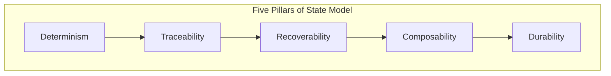

---

## ۴. State Categories

حالت‌های اجرا به ۵ دسته کلی تقسیم می‌شوند:

| Category     | ID      | States                                                                                                                                                                            | Description         |
| ------------ | ------- | --------------------------------------------------------------------------------------------------------------------------------------------------------------------------------- | ------------------- |
| **Pending**  | CAT-PEN | Queued, Paused, Deferred                                                                                                                                                          | منتظر شروع یا ادامه |
| **Active**   | CAT-ACT | Planning, Searching, Reasoning, Calculating, Calling Tools, Waiting, Learning, Publishing, Initializing, Validating, Transforming, Analyzing, Synthesizing, Deploying, Monitoring | در حال اجرا         |
| **Terminal** | CAT-TER | Completed, Failed, Cancelled, Archived                                                                                                                                            | پایان یافته         |
| **Recovery** | CAT-REC | Recovery, Rolled Back, Retry                                                                                                                                                      | بازیابی             |
| **Compound** | CAT-CMP | ActiveSet, ExecutionSet, KnowledgeSet, RecoveryFlow                                                                                                                               | ترکیبی از چند حالت  |

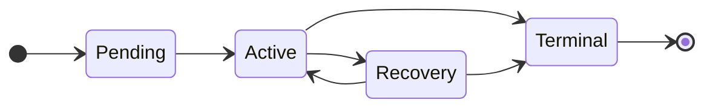

---

## ۵. Queued State

### تعریف

وظیفه در صف انتظار قرار دارد. هنوز هیچ پردازشی آغاز نشده است.

### Triggers

| Trigger ID | Source       | Description                    |
| ---------- | ------------ | ------------------------------ |
| TRG-Q01    | AI-014       | Task submitted by Orchestrator |
| TRG-Q02    | AUT Workflow | Workflow triggered             |
| TRG-Q03    | External API | Incoming request               |
| TRG-Q04    | Schedule     | Cron-based activation          |

### Transitions

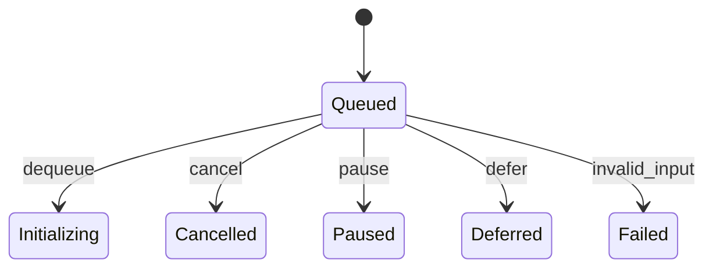

| From   | To           | Condition          | Action                 |
| ------ | ------------ | ------------------ | ---------------------- |
| Queued | Initializing | Resource available | Dequeue, assign worker |
| Queued | Cancelled    | User/System cancel | Remove from queue      |
| Queued | Paused       | System overload    | Suspend scheduling     |
| Queued | Deferred     | Dependency missing | Postpone               |
| Queued | Failed       | Invalid payload    | Log error              |

### JSON Block

```json
{
  "stateId": "Queued",
  "category": "CAT-PEN",
  "description": "Task is waiting in queue for processing",
  "entryActions": ["validate_payload", "assign_priority", "enqueue_timestamp"],
  "exitActions": ["dequeue", "allocate_resources"],
  "allowedTransitions": ["Initializing", "Cancelled", "Paused", "Deferred", "Failed"],
  "maxDwellTime": "P1D",
  "persistenceMode": "VOLATILE"
}
```

---

## ۶. Planning State

### تعریف

عامل در حال برنامه‌ریزی مراحل اجرا است. این حالت مخصوص Agentهای سطح A-3 و A-4 است (AI-001, AI-002, AI-014).

### Triggers

| Trigger ID | Source       | Description                   |
| ---------- | ------------ | ----------------------------- |
| TRG-PL01   | Initializing | After initialization complete |
| TRG-PL02   | AI-014       | Orchestration plan required   |
| TRG-PL03   | PRM-101      | Strategic planning prompt     |

### Transitions

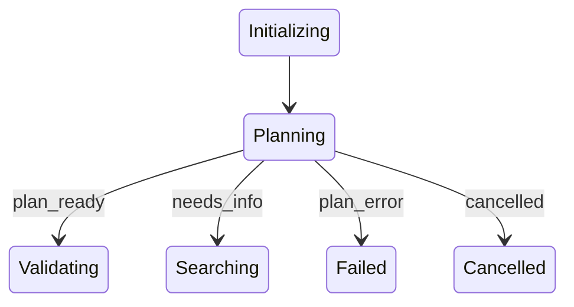

| From     | To         | Condition             |
| -------- | ---------- | --------------------- |
| Planning | Validating | Plan draft complete   |
| Planning | Searching  | Missing information   |
| Planning | Failed     | Plan cannot be formed |
| Planning | Cancelled  | External cancellation |

### JSON Block

```json
{
  "stateId": "Planning",
  "category": "CAT-ACT",
  "subCategory": "Strategic",
  "agents": ["AI-001", "AI-002", "AI-014"],
  "allowedTransitions": ["Validating", "Searching", "Failed", "Cancelled"],
  "maxDwellTime": "PT30M",
  "promptSource": ["PRM-101", "PRM-102"]
}
```

---

## ۷. Searching State

### تعریف

عامل در حال جستجوی اطلاعات از منابع داخلی یا خارجی است. توسط AI-005, AI-011, AI-013 استفاده می‌شود.

### Triggers

| Trigger ID | Source                        |
| ---------- | ----------------------------- |
| TRG-SR01   | Planning                      |
| TRG-SR02   | Reasoning                     |
| TRG-SR03   | PRM-403 (Knowledge Retrieval) |

### Transitions

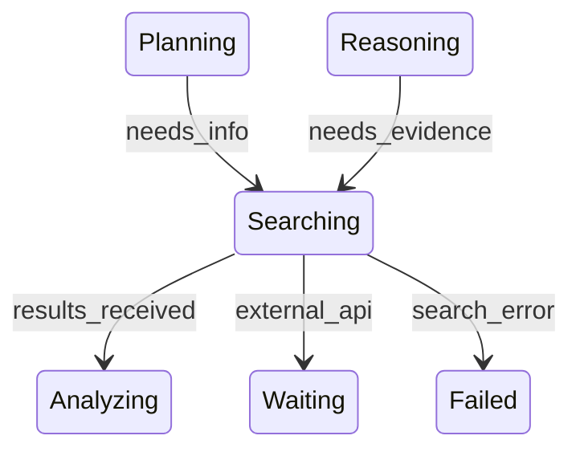

| From      | To        | Condition              |
| --------- | --------- | ---------------------- |
| Searching | Analyzing | Internal results ready |
| Searching | Waiting   | External API call      |
| Searching | Failed    | Timeout / error        |

### JSON Block

```json
{
  "stateId": "Searching",
  "category": "CAT-ACT",
  "subCategory": "Research",
  "agents": ["AI-005", "AI-011", "AI-013"],
  "allowedTransitions": ["Analyzing", "Waiting", "Failed", "Cancelled"],
  "maxDwellTime": "PT10M",
  "retryPolicy": "EXPONENTIAL_BACKOFF"
}
```

---

## ۸. Reasoning State

### تعریف

عامل در حال استدلال و تصمیم‌گیری بر اساس اطلاعات موجود است. این هسته اصلی Agentهای هوشمند SMOS است.

### Triggers

| Trigger ID | Source                     |
| ---------- | -------------------------- |
| TRG-RS01   | Validating                 |
| TRG-RS02   | Analyzing                  |
| TRG-RS03   | PRM-103 (Decision Framing) |

### Transitions

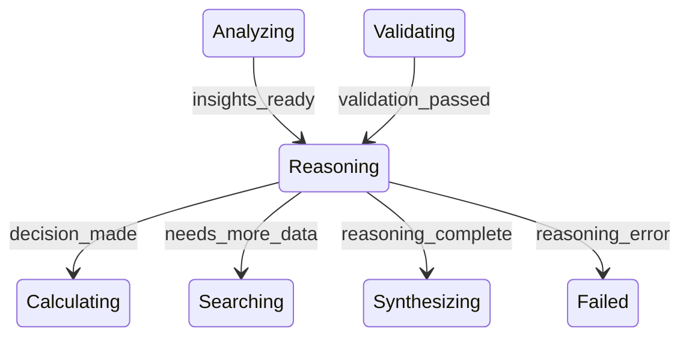

| From      | To           | Condition             |
| --------- | ------------ | --------------------- |
| Reasoning | Calculating  | Quantitative decision |
| Reasoning | Synthesizing | Qualitative output    |
| Reasoning | Searching    | Insufficient data     |
| Reasoning | Failed       | Logic error           |

### JSON Block

```json
{
  "stateId": "Reasoning",
  "category": "CAT-ACT",
  "subCategory": "Cognitive",
  "agents": ["AI-001", "AI-003", "AI-012", "AI-013", "AI-014"],
  "allowedTransitions": ["Calculating", "Synthesizing", "Searching", "Failed", "Cancelled"],
  "maxDwellTime": "PT15M",
  "reasoningModel": "CHAIN_OF_THOUGHT"
}
```

---

## ۹. Calculating State

### تعریف

عامل در حال محاسبات عددی، آماری، یا KPI است. توسط AI-010 (Analytics) استفاده می‌شود.

### Triggers

| Trigger ID | Source                       |
| ---------- | ---------------------------- |
| TRG-CL01   | Reasoning                    |
| TRG-CL02   | PRM-320 (Performance Report) |

### Transitions

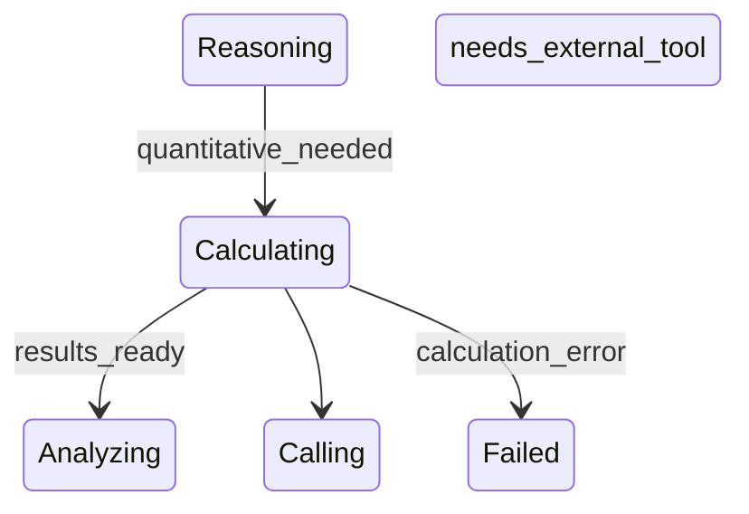

| From        | To            | Condition                 |
| ----------- | ------------- | ------------------------- |
| Calculating | Analyzing     | Results computed          |
| Calculating | Calling Tools | Need external computation |
| Calculating | Failed        | Math error / overflow     |

### JSON Block

```json
{
  "stateId": "Calculating",
  "category": "CAT-ACT",
  "subCategory": "Analytical",
  "agents": ["AI-010", "AI-012"],
  "allowedTransitions": ["Analyzing", "Calling Tools", "Failed", "Cancelled"],
  "maxDwellTime": "PT5M",
  "precision": "FLOAT64"
}
```

---

## ۱۰. Calling Tools State

### تعریف

عامل در حال فراخوانی ابزار خارجی (API, Function Call, MCP Tool) است.

### Triggers

| Trigger ID | Source                              |
| ---------- | ----------------------------------- |
| TRG-TO01   | Calculating                         |
| TRG-TO02   | Searching                           |
| TRG-TO03   | PRM-903 (Agent Capability Matching) |

### Transitions

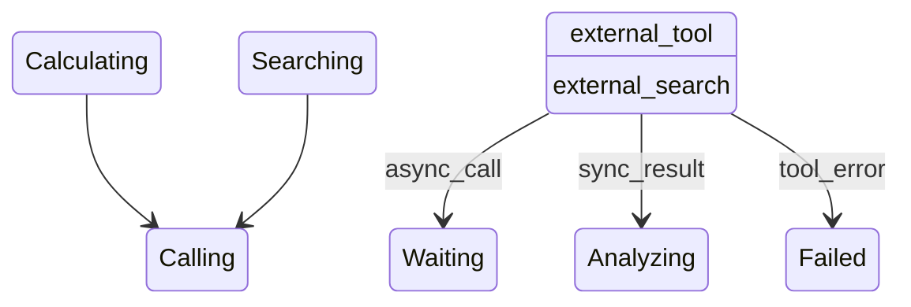

| From          | To        | Condition            |
| ------------- | --------- | -------------------- |
| Calling Tools | Waiting   | Async invocation     |
| Calling Tools | Analyzing | Sync result received |
| Calling Tools | Failed    | Tool timeout/error   |

### JSON Block

```json
{
  "stateId": "Calling Tools",
  "category": "CAT-ACT",
  "subCategory": "Execution",
  "allowedTransitions": ["Waiting", "Analyzing", "Failed", "Cancelled"],
  "maxDwellTime": "PT2M",
  "toolTimeout": "PT30S"
}
```

---

## ۱۱. Waiting State

### تعریف

عامل منتظر پاسخ از یک سرویس خارجی، Agent دیگر، یا ورودی انسانی است.

### Triggers

| Trigger ID | Source            |
| ---------- | ----------------- |
| TRG-WT01   | Calling Tools     |
| TRG-WT02   | External service  |
| TRG-WT03   | Human-in-the-loop |

### Transitions

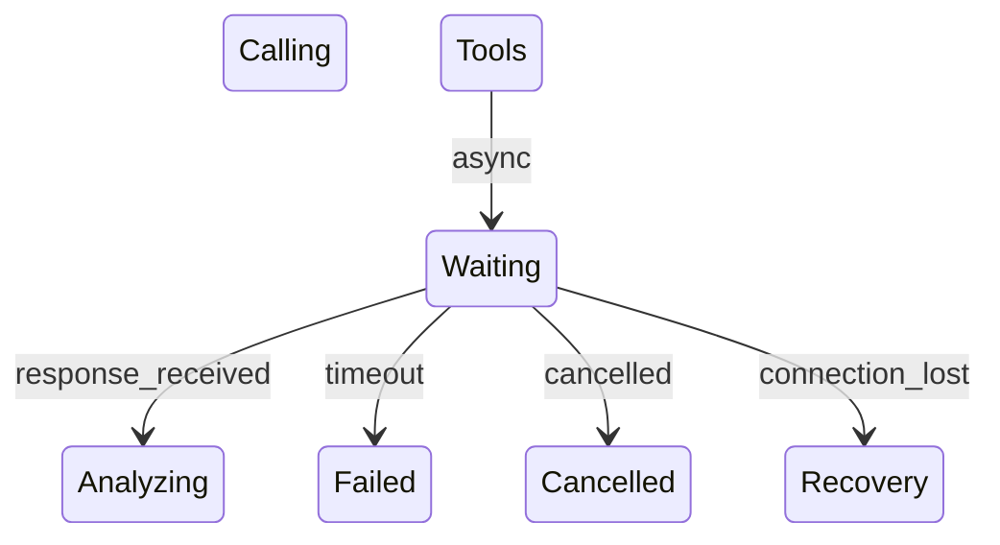

| From    | To        | Condition              |
| ------- | --------- | ---------------------- |
| Waiting | Analyzing | Response arrived       |
| Waiting | Failed    | Timeout expired        |
| Waiting | Cancelled | User cancelled         |
| Waiting | Recovery  | Connection interrupted |

### JSON Block

```json
{
  "stateId": "Waiting",
  "category": "CAT-ACT",
  "subCategory": "Suspended",
  "allowedTransitions": ["Analyzing", "Failed", "Cancelled", "Recovery"],
  "maxDwellTime": "PT1H",
  "waitTypes": ["EXTERNAL_API", "AGENT_RESPONSE", "HUMAN_INPUT"]
}
```

---

## ۱۲. Learning State

### تعریف

عامل در حال یادگیری از نتایج اجرا، ثبت درس‌آموخته‌ها، و به‌روزرسانی دانش سازمانی است. توسط AI-011 و AI-012 استفاده می‌شود.

### Triggers

| Trigger ID | Source                    |
| ---------- | ------------------------- |
| TRG-LN01   | Completed                 |
| TRG-LN02   | Failed                    |
| TRG-LN03   | PRM-430 (Lessons Learned) |

### Transitions

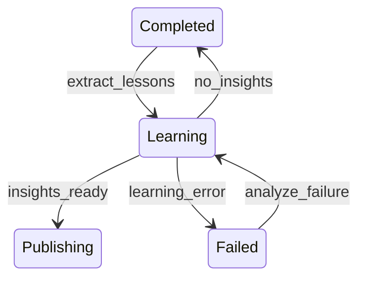

| From     | To         | Condition               |
| -------- | ---------- | ----------------------- |
| Learning | Publishing | New knowledge generated |
| Learning | Completed  | No actionable insight   |
| Learning | Failed     | Learning process error  |

### JSON Block

```json
{
  "stateId": "Learning",
  "category": "CAT-ACT",
  "subCategory": "Cognitive",
  "agents": ["AI-011", "AI-012"],
  "allowedTransitions": ["Publishing", "Completed", "Failed", "Cancelled"],
  "maxDwellTime": "PT10M",
  "learningSources": ["PRM-430", "PRM-431", "PRM-432"]
}
```

---

## ۱۳. Publishing State

### تعریف

عامل در حال انتشار خروجی به پلتفرم مقصد یا بازگشت نتیجه به Orchestrator است. توسط AI-008 (Publishing Agent) استفاده می‌شود.

### Triggers

| Trigger ID | Source                                |
| ---------- | ------------------------------------- |
| TRG-PB01   | Synthesizing                          |
| TRG-PB02   | Learning                              |
| TRG-PB03   | PRM-302 (Publishing Package Assembly) |

### Transitions

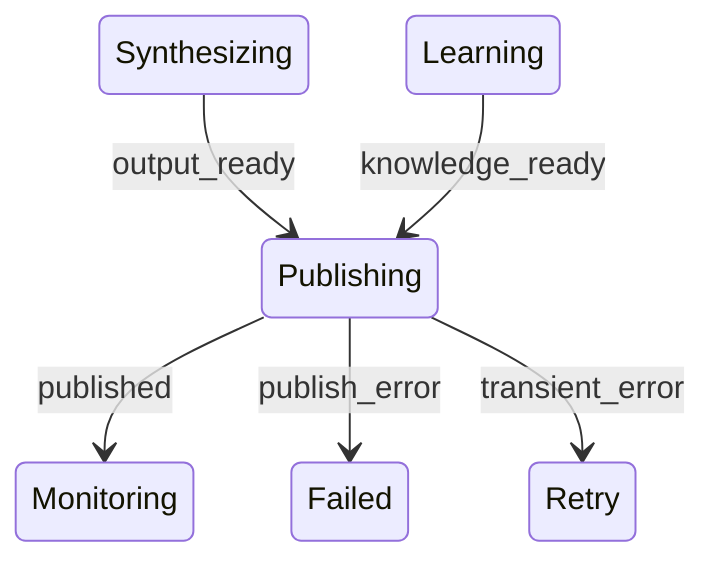

| From       | To         | Condition              |
| ---------- | ---------- | ---------------------- |
| Publishing | Monitoring | Successfully published |
| Publishing | Failed     | Permanent error        |
| Publishing | Retry      | Transient error        |

### JSON Block

```json
{
  "stateId": "Publishing",
  "category": "CAT-ACT",
  "subCategory": "Execution",
  "agents": ["AI-008", "AI-011"],
  "allowedTransitions": ["Monitoring", "Failed", "Retry", "Cancelled"],
  "maxDwellTime": "PT5M",
  "publishingTargets": [
    "PLAT-001",
    "PLAT-002",
    "PLAT-003",
    "PLAT-004",
    "PLAT-005",
    "PLAT-006",
    "PLAT-007"
  ]
}
```

---

## ۱۴. Completed State

### تعریف

وظیفه با موفقیت به پایان رسیده است. این یک حالت پایانی (Terminal) است.

### Triggers

| Trigger ID | Source       |
| ---------- | ------------ |
| TRG-CP01   | Monitoring   |
| TRG-CP02   | Synthesizing |
| TRG-CP03   | Learning     |

### Transitions

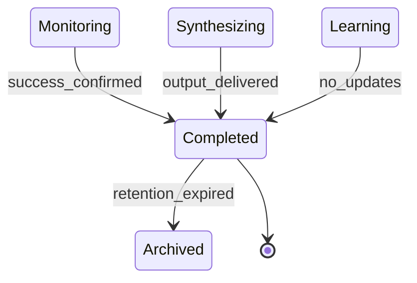

| From      | To       | Condition                 |
| --------- | -------- | ------------------------- |
| Completed | Archived | After retention period    |
| Completed | [*]      | Orchestrator acknowledged |

### JSON Block

```json
{
  "stateId": "Completed",
  "category": "CAT-TER",
  "terminal": true,
  "entryActions": ["compute_metrics", "notify_orchestrator", "cleanup_resources"],
  "allowedTransitions": ["Archived"],
  "retentionPeriod": "P90D"
}
```

---

## ۱۵. Failed State

### تعریف

وظیفه با خطا مواجه شده و قادر به ادامه نیست. این یک حالت پایانی است.

### Triggers

| Trigger ID | Source                |
| ---------- | --------------------- |
| TRG-FL01   | Any state             |
| TRG-FL02   | External system error |
| TRG-FL03   | Validation failure    |

### Transitions

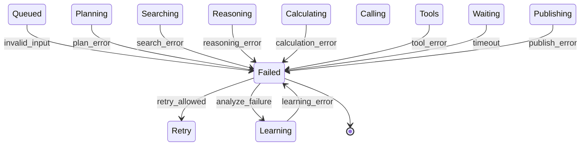

| From   | To       | Condition                |
| ------ | -------- | ------------------------ |
| Failed | Retry    | Retry policy allows      |
| Failed | Learning | Failure analysis         |
| Failed | [*]      | Terminal acknowledgement |

### JSON Block

```json
{
  "stateId": "Failed",
  "category": "CAT-TER",
  "terminal": true,
  "entryActions": ["capture_error_details", "increment_failure_count", "notify_orchestrator"],
  "allowedTransitions": ["Retry", "Learning", "Recovery"],
  "maxRetries": 3,
  "retryInterval": "PT1M"
}
```

---

## ۱۶. Rolled Back State

### تعریف

وظیفه به حالت قبل از اجرا برگردانده شده است. این وضعیت پس از شکست در Workflowهای تراکنشی رخ می‌دهد.

### Triggers

| Trigger ID | Source                      |
| ---------- | --------------------------- |
| TRG-RB01   | Failed with rollback policy |
| TRG-RB02   | Recovery strategy           |
| TRG-RB03   | AUT-000 compensation        |

### Transitions

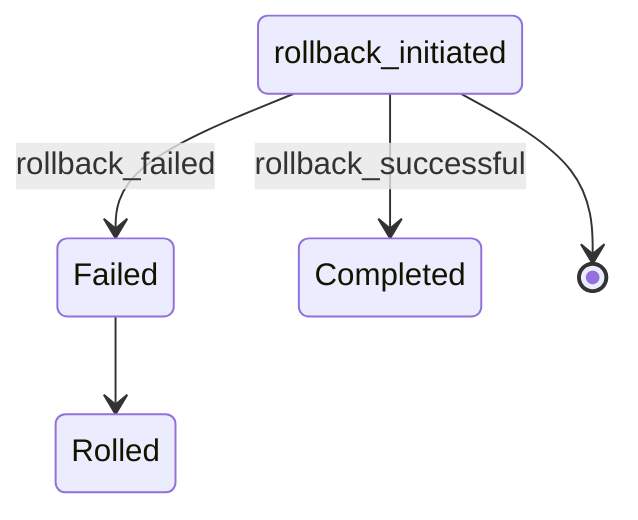

| From        | To        | Condition                 |
| ----------- | --------- | ------------------------- |
| Rolled Back | Completed | Full compensation success |
| Rolled Back | Failed    | Compensation failed       |
| Rolled Back | [*]       | Orchestrator acknowledged |

### JSON Block

```json
{
  "stateId": "Rolled Back",
  "category": "CAT-REC",
  "entryActions": ["initiate_compensation", "log_rollback"],
  "exitActions": ["verify_compensation"],
  "allowedTransitions": ["Completed", "Failed"],
  "compensationStrategy": "REVERSE_ORDER"
}
```

---

## ۱۷. Retry State

### تعریف

وظیفه پس از شکست، مجدداً تلاش می‌کند. تعداد تلاش‌ها و فاصله بین آن‌ها توسط خط‌مشی Retry تعیین می‌شود.

### Triggers

| Trigger ID | Source                   |
| ---------- | ------------------------ |
| TRG-RT01   | Failed with retry policy |
| TRG-RT02   | Transient error detected |

### Transitions

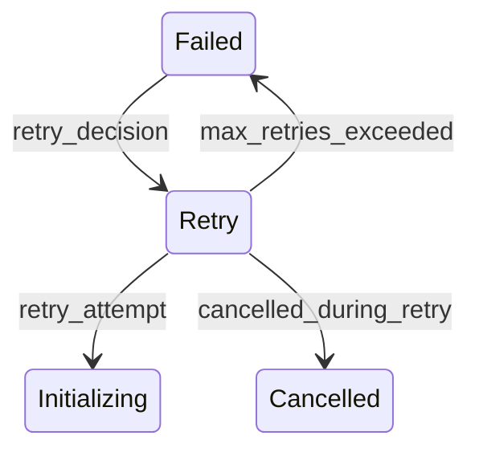

| From  | To           | Condition              |
| ----- | ------------ | ---------------------- |
| Retry | Initializing | Retry attempt begins   |
| Retry | Failed       | Max retries reached    |
| Retry | Cancelled    | Cancelled during retry |

### JSON Block

```json
{
  "stateId": "Retry",
  "category": "CAT-REC",
  "entryActions": ["increment_retry_count", "compute_backoff", "schedule_retry"],
  "allowedTransitions": ["Initializing", "Failed", "Cancelled"],
  "backoffAlgorithm": "EXPONENTIAL_BACKOFF",
  "backoffBase": 2,
  "maxBackoff": "PT30M",
  "jitter": true
}
```

---

## ۱۸. Cancelled State

### تعریف

وظیفه توسط کاربر، Orchestrator، یا سیستم لغو شده است. این یک حالت پایانی است.

### Triggers

| Trigger ID | Source              |
| ---------- | ------------------- |
| TRG-CC01   | User request        |
| TRG-CC02   | AI-014 orchestrator |
| TRG-CC03   | System shutdown     |
| TRG-CC04   | Priority preemption |

### Transitions

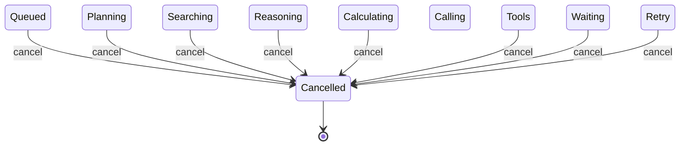

| From             | To        | Condition     |
| ---------------- | --------- | ------------- |
| Any non-terminal | Cancelled | Cancel signal |

### JSON Block

```json
{
  "stateId": "Cancelled",
  "category": "CAT-TER",
  "terminal": true,
  "entryActions": ["release_resources", "notify_dependents", "log_cancellation_reason"],
  "cancellationSources": ["USER", "ORCHESTRATOR", "SYSTEM", "PREEMPTION"]
}
```

---

## ۱۹. Paused State

### تعریف

وظیفه به طور موقت متوقف شده است. می‌تواند بعداً از همان نقطه ادامه یابد.

### Triggers

| Trigger ID | Source               |
| ---------- | -------------------- |
| TRG-PS01   | System overload      |
| TRG-PS02   | User pause           |
| TRG-PS03   | Resource unavailable |

### Transitions

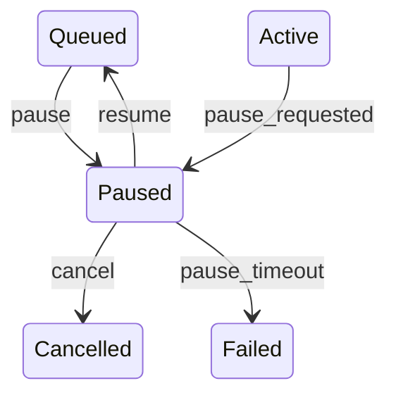

| From   | To        | Condition                   |
| ------ | --------- | --------------------------- |
| Paused | Queued    | Resume signal               |
| Paused | Cancelled | Cancel during pause         |
| Paused | Failed    | Max pause duration exceeded |

### JSON Block

```json
{
  "stateId": "Paused",
  "category": "CAT-PEN",
  "entryActions": ["snapshot_state", "release_resources"],
  "exitActions": ["restore_state", "reallocate_resources"],
  "allowedTransitions": ["Queued", "Cancelled", "Failed"],
  "maxPauseDuration": "P7D"
}
```

---

## ۲۰. Recovery State

### تعریف

وظیفه در حال بازیابی از خطا یا قطعی است. این یک حالت میانی است که به وضعیت قبلی یا جایگزین منتقل می‌شود.

### Triggers

| Trigger ID | Source                                |
| ---------- | ------------------------------------- |
| TRG-RV01   | Connection lost                       |
| TRG-RV02   | Node failure                          |
| TRG-RV03   | State corruption detected             |
| TRG-RV04   | PRM-905 (Execution Recovery Strategy) |

### Transitions

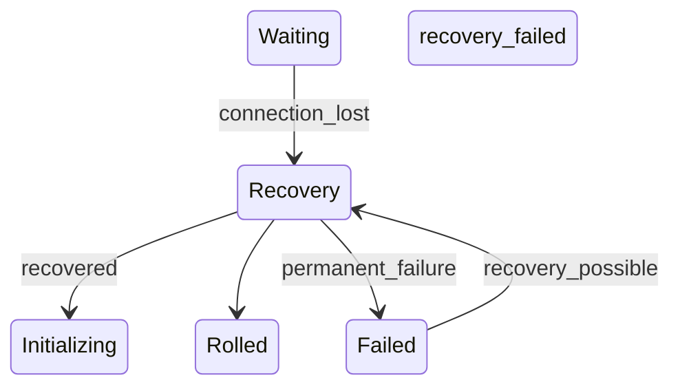

| From     | To           | Condition                     |
| -------- | ------------ | ----------------------------- |
| Recovery | Initializing | State restored successfully   |
| Recovery | Rolled Back  | Recovery not possible         |
| Recovery | Failed       | Recovery attempted and failed |

### JSON Block

```json
{
  "stateId": "Recovery",
  "category": "CAT-REC",
  "entryActions": ["assess_damage", "load_last_checkpoint", "validate_state_integrity"],
  "exitActions": ["commit_recovery", "log_recovery_outcome"],
  "allowedTransitions": ["Initializing", "Rolled Back", "Failed"],
  "recoveryStrategy": "CHECKPOINT_RESTORE",
  "maxRecoveryAttempts": 2
}
```

---

## ۲۱. Compound States (حالت‌های مرکب)

حالت‌های مرکب گروه‌هایی از حالت‌های ساده هستند که یک مرحله منطقی از اجرا را نمایش می‌دهند.

### ۲۱.۱ ActiveSet

شامل تمام حالت‌های فعال: Initializing, Planning, Searching, Reasoning, Calculating, Calling Tools, Waiting, Learning, Publishing, Validating, Transforming, Analyzing, Synthesizing, Deploying, Monitoring

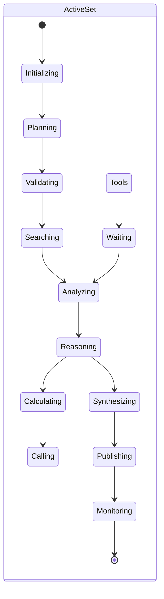

### ۲۱.۲ ExecutionSet

زیرمجموعه‌ای از ActiveSet شامل مراحل اجرای مستقیم: Searching, Reasoning, Calculating, Calling Tools, Transforming

### ۲۱.۳ KnowledgeSet

زیرمجموعه‌ای از ActiveSet شامل مراحل یادگیری و دانش: Learning, Analyzing, Synthesizing

### ۲۱.۴ RecoveryFlow

شامل حالت‌های بازیابی: Recovery, Rolled Back, Retry

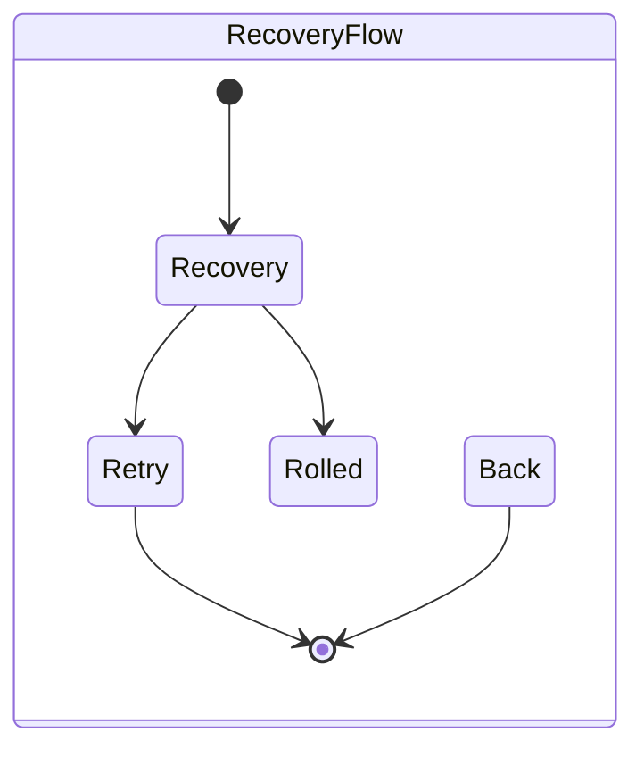

---

## ۲۲. Global State Transition Diagram

```mermaid
stateDiagram-v2
    direction LR
    [*] --> Queued
    Queued --> Initializing : dequeue
    Queued --> Paused : pause
    Queued --> Deferred : defer
    Queued --> Cancelled : cancel
    Queued --> Failed : invalid_input

    Initializing --> Planning : ready
    Initializing --> Failed : init_error

    Planning --> Validating : plan_ready
    Planning --> Searching : needs_info
    Planning --> Failed : plan_error

    Validating --> Reasoning : passed
    Validating --> Searching : needs_evidence
    Validating --> Failed : validation_failed

    Searching --> Analyzing : results_ready
    Searching --> Waiting : external_call
    Searching --> Failed : search_error

    Analyzing --> Reasoning : insights_ready
    Analyzing --> Searching : needs_more_data
    Analyzing --> Failed : analysis_error

    Reasoning --> Calculating : quantitative
    Reasoning --> Synthesizing : qualitative
    Reasoning --> Searching : needs_data
    Reasoning --> Failed : reasoning_error

    Calculating --> Analyzing : results_ready
    Calculating --> Calling Tools : needs_tool
    Calculating --> Failed : calculation_error

    Calling Tools --> Waiting : async
    Calling Tools --> Analyzing : sync_result
    Calling Tools --> Failed : tool_error

    Waiting --> Analyzing : response
    Waiting --> Failed : timeout
    Waiting --> Recovery : disconnected

    Synthesizing --> Publishing : output_ready
    Synthesizing --> Completed : direct_delivery
    Synthesizing --> Failed : synthesis_error

    Publishing --> Monitoring : published
    Publishing --> Retry : transient_error
    Publishing --> Failed : permanent_error

    Monitoring --> Completed : success
    Monitoring --> Failed : verification_failed
    Monitoring --> Learning : extract_insights

    Learning --> Publishing : insights_ready
    Learning --> Completed : no_insights
    Learning --> Failed : learning_error

    Completed --> Archived : retention_expired
    Completed --> [*]

    Failed --> Retry : retry_allowed
    Failed --> Learning : analyze
    Failed --> Recovery : recoverable
    Failed --> Rolled Back : rollback
    Failed --> [*]

    Retry --> Initializing : retry_attempt
    Retry --> Failed : max_retries
    Retry --> Cancelled : cancelled

    Rolled Back --> Completed : success
    Rolled Back --> Failed : failed

    Recovery --> Initializing : restored
    Recovery --> Rolled Back : not_restorable
    Recovery --> Failed : recovery_failed

    Paused --> Queued : resume
    Paused --> Cancelled : cancel
    Paused --> Failed : timeout

    Deferred --> Queued : dependency_met
    Deferred --> Cancelled : cancel
    Deferred --> Failed : dependency_failed

    Cancelled --> [*]
    Archived --> [*]
```

---

## ۲۳. State Transition Matrix

| From ↓ → To →     | Queued | Init | Plan | Valid | Search | Analy | Reason | Calcul | Tools | Wait | Synth | Pub | Monit | Learn | Comp | Fail | Retry | RollB | Canc | Pause | Defer | Recov | Arch |
| ----------------- | ------ | ---- | ---- | ----- | ------ | ----- | ------ | ------ | ----- | ---- | ----- | --- | ----- | ----- | ---- | ---- | ----- | ----- | ---- | ----- | ----- | ----- | ---- |
| **Queued**        | -      | ✓    | -    | -     | -      | -     | -      | -      | -     | -    | -     | -   | -     | -     | -    | ✓    | -     | -     | ✓    | ✓     | ✓     | -     | -    |
| **Initializing**  | -      | -    | ✓    | -     | -      | -     | -      | -      | -     | -    | -     | -   | -     | -     | -    | ✓    | -     | -     | -    | -     | -     | -     | -    |
| **Planning**      | -      | -    | -    | ✓     | ✓      | -     | -      | -      | -     | -    | -     | -   | -     | -     | -    | ✓    | -     | -     | ✓    | -     | -     | -     | -    |
| **Validating**    | -      | -    | -    | -     | ✓      | -     | ✓      | -      | -     | -    | -     | -   | -     | -     | -    | ✓    | -     | -     | -    | -     | -     | -     | -    |
| **Searching**     | -      | -    | -    | -     | -      | ✓     | -      | -      | -     | ✓    | -     | -   | -     | -     | -    | ✓    | -     | -     | ✓    | -     | -     | -     | -    |
| **Analyzing**     | -      | -    | -    | -     | ✓      | -     | ✓      | -      | -     | -    | -     | -   | -     | -     | -    | ✓    | -     | -     | -    | -     | -     | -     | -    |
| **Reasoning**     | -      | -    | -    | -     | ✓      | -     | -      | ✓      | -     | -    | ✓     | -   | -     | -     | -    | ✓    | -     | -     | ✓    | -     | -     | -     | -    |
| **Calculating**   | -      | -    | -    | -     | -      | ✓     | -      | -      | ✓     | -    | -     | -   | -     | -     | -    | ✓    | -     | -     | -    | -     | -     | -     | -    |
| **Calling Tools** | -      | -    | -    | -     | -      | ✓     | -      | -      | -     | ✓    | -     | -   | -     | -     | -    | ✓    | -     | -     | ✓    | -     | -     | -     | -    |
| **Waiting**       | -      | -    | -    | -     | -      | ✓     | -      | -      | -     | -    | -     | -   | -     | -     | -    | ✓    | -     | -     | ✓    | -     | -     | ✓     | -    |
| **Synthesizing**  | -      | -    | -    | -     | -      | -     | -      | -      | -     | -    | -     | ✓   | -     | -     | ✓    | ✓    | -     | -     | -    | -     | -     | -     | -    |
| **Publishing**    | -      | -    | -    | -     | -      | -     | -      | -      | -     | -    | -     | -   | ✓     | -     | -    | ✓    | ✓     | -     | ✓    | -     | -     | -     | -    |
| **Monitoring**    | -      | -    | -    | -     | -      | -     | -      | -      | -     | -    | -     | -   | -     | ✓     | ✓    | ✓    | -     | -     | -    | -     | -     | -     | -    |
| **Learning**      | -      | -    | -    | -     | -      | -     | -      | -      | -     | -    | -     | ✓   | -     | -     | ✓    | ✓    | -     | -     | ✓    | -     | -     | -     | -    |
| **Completed**     | -      | -    | -    | -     | -      | -     | -      | -      | -     | -    | -     | -   | -     | -     | -    | -    | -     | -     | -    | -     | -     | -     | ✓    |
| **Failed**        | -      | -    | -    | -     | -      | -     | -      | -      | -     | -    | -     | -   | -     | ✓     | -    | -    | ✓     | ✓     | -    | -     | -     | ✓     | -    |
| **Retry**         | -      | ✓    | -    | -     | -      | -     | -      | -      | -     | -    | -     | -   | -     | -     | -    | ✓    | -     | -     | ✓    | -     | -     | -     | -    |
| **Rolled Back**   | -      | -    | -    | -     | -      | -     | -      | -      | -     | -    | -     | -   | -     | -     | ✓    | ✓    | -     | -     | -    | -     | -     | -     | -    |
| **Cancelled**     | -      | -    | -    | -     | -      | -     | -      | -      | -     | -    | -     | -   | -     | -     | -    | -    | -     | -     | -    | -     | -     | -     | -    |
| **Paused**        | ✓      | -    | -    | -     | -      | -     | -      | -      | -     | -    | -     | -   | -     | -     | -    | ✓    | -     | -     | ✓    | -     | -     | -     | -    |
| **Deferred**      | ✓      | -    | -    | -     | -      | -     | -      | -      | -     | -    | -     | -   | -     | -     | -    | ✓    | -     | -     | ✓    | -     | -     | -     | -    |
| **Recovery**      | -      | ✓    | -    | -     | -      | -     | -      | -      | -     | -    | -     | -   | -     | -     | -    | ✓    | -     | ✓     | -    | -     | -     | -     | -    |
| **Archived**      | -      | -    | -    | -     | -      | -     | -      | -      | -     | -    | -     | -   | -     | -     | -    | -    | -     | -     | -    | -     | -     | -     | -    |

**Legend:** ✓ = Valid transition; - = Invalid transition

---

## ۲۴. State Execution Semantics

هر حالت دارای مجموعه‌ای از عملیات ورود، ماندن، و خروج است.

| State         | Entry Action                                         | During (Loop)        | Exit Action               |
| ------------- | ---------------------------------------------------- | -------------------- | ------------------------- |
| Queued        | validate_payload, assign_priority, enqueue_timestamp | check_resources      | dequeue, allocate_worker  |
| Initializing  | load_context, init_dependencies                      | health_check         | verify_init_complete      |
| Planning      | load_plan_template                                   | generate_plan        | finalize_plan             |
| Validating    | load_validation_rules                                | apply_validations    | compile_validation_report |
| Searching     | build_search_query                                   | execute_search       | collect_results           |
| Analyzing     | load_analysis_framework                              | process_data         | compute_insights          |
| Reasoning     | load_reasoning_framework                             | apply_logic          | produce_conclusion        |
| Calculating   | load_formulas                                        | execute_calculations | format_results            |
| Calling Tools | authenticate_tool                                    | invoke_api           | parse_response            |
| Waiting       | set_timeout                                          | poll_status          | cancel_timeout            |
| Synthesizing  | load_synthesis_template                              | combine_inputs       | produce_output            |
| Publishing    | format_output                                        | execute_publish      | confirm_delivery          |
| Monitoring    | set_monitoring_criteria                              | verify_outcome       | compute_verification      |
| Learning      | load_learning_framework                              | extract_lessons      | update_knowledge_base     |
| Completed     | compute_metrics, notify_orchestrator                 | —                    | cleanup_resources         |
| Failed        | capture_error, increment_failure_count, notify       | —                    | cleanup_resources         |
| Retry         | increment_retry_count, compute_backoff               | wait_interval        | begin_retry               |
| Rolled Back   | initiate_compensation                                | execute_compensation | verify_compensation       |
| Cancelled     | release_resources, notify_dependents                 | —                    | log_cancellation          |
| Paused        | snapshot_state, release_resources                    | —                    | restore_state             |
| Deferred      | record_dependency, postpone                          | check_dependency     | resolve_deferral          |
| Recovery      | assess_damage, load_checkpoint                       | validate_integrity   | commit_recovery           |
| Archived      | compress_state, move_to_cold_storage                 | —                    | —                         |

```mermaid
sequenceDiagram
    participant E as Executor
    participant S as StateMachine
    participant A as Audit

    E->>S: transition(Current, Next, Payload)
    S->>S: validate_transition(Current, Next)
    alt Invalid Transition
        S-->>E: TransitionError
        S->>A: log_violation(Current, Next, reason)
    else Valid Transition
        S->>S: execute_exit_actions(Current)
        S->>A: log_exit(Current, timestamp)
        S->>S: execute_entry_actions(Next)
        S->>A: log_entry(Next, timestamp)
        S-->>E: TransitionSuccess
    end
```

---

## ۲۵. State Persistence Model

هر انتقال حالت در حافظه دائمی ذخیره می‌شود. مدل persistence از سه لایه تشکیل شده است:

1. **Volatile Cache (Redis):** وضعیت فعلی، dwell time
2. **Event Store (Cassandra-like):** تمام انتقال‌ها با timestamp
3. **Cold Storage (S3-like):** بایگانی طولانی‌مدت

```mermaid
graph TD
    subgraph "Persistence Layers"
        L1[Layer 1: Volatile Cache<br/>Current State, Dwell Timer]
        L2[Layer 2: Event Store<br/>All Transitions, Audit Log]
        L3[Layer 3: Cold Storage<br/>Archived States, Full Snapshots]
    end

    SM[State Machine] --> L1
    SM --> L2
    L2 --> L3

    subgraph "Data Model"
        DM[StateTransitionRecord]
    end
```

### Persistence Record

| Field               | Type          | Description                    |
| ------------------- | ------------- | ------------------------------ |
| executionId         | UUID (string) | Unique execution identifier    |
| taskId              | UUID (string) | Parent task identifier         |
| agentId             | string        | Agent that owns this execution |
| currentState        | string        | Current state name             |
| previousState       | string        | Previous state name            |
| transitionTimestamp | datetime      | ISO 8601 timestamp             |
| transitionReason    | string        | Reason for transition          |
| payloadHash         | string        | SHA-256 of input payload       |
| version             | integer       | Monotonic version counter      |

---

## ۲۶. State Recovery Model

بازیابی حالت بر اساس **Checkpoint Restore** انجام می‌شود. هر حالت یک Checkpoint در ورود ثبت می‌کند و در خروج تأیید می‌کند.

### Recovery Flow

```mermaid
sequenceDiagram
    participant SM as StateMachine
    participant PS as PersistenceStore
    participant RM as RecoveryManager

    SM->>PS: checkpoint(executionId, currentState, snapshot)
    Note over SM,PS: Periodic checkpoint during execution

    alt Failure Occurs
        RM->>PS: loadLastCheckpoint(executionId)
        PS-->>RM: checkpointData
        RM->>RM: validateIntegrity(checkpointData)

        alt Valid Checkpoint
            RM->>SM: restore(executionId, checkpointData)
            SM->>SM: transitionTo(Recovery)
            SM->>SM: transitionTo(checkpoint.state)
        else Corrupted Checkpoint
            RM->>SM: transitionTo(Rolled Back)
            SM->>SM: log("state_corrupted")
        end
    end
```

### Recovery Strategies

| Strategy               | Description                  | Use Case                |
| ---------------------- | ---------------------------- | ----------------------- |
| **CHECKPOINT_RESTORE** | Restore from last checkpoint | Default strategy        |
| **REPLAY**             | Replay all events from start | Data corruption         |
| **COMPENSATE**         | Execute compensation actions | Transactional workflows |
| **RETRY**              | Retry from current state     | Transient errors        |
| **RESET**              | Start from beginning         | Fatal inconsistency     |

---

## ۲۷. State Audit & Logging

هر انتقال حالت باید در **Audit Log** ثبت شود. سطح دسترسی به Audit Log بر اساس A-0 تا A-4 تعریف می‌شود.

### Audit Record Structure

```json
{
  "auditId": "a7b8c9d0-e1f2-4a3b-8c5d-6e7f8a9b0c1d",
  "timestamp": "2026-07-01T14:30:00.000Z",
  "executionId": "e1f2a3b4-c5d6-4e7f-8a9b-0c1d2e3f4a5b",
  "taskId": "t1a2b3c4-d5e6-4f7a-8b9c-0d1e2f3a4b5c",
  "transition": {
    "fromState": "Planning",
    "toState": "Validating",
    "reason": "plan_ready",
    "triggerId": "TRG-PL01"
  },
  "agentId": "AI-014",
  "decisionPath": ["rule_001", "policy_003"],
  "duration": 2450,
  "metadata": {}
}
```

### Audit Events

| Event              | Description                | Level    |
| ------------------ | -------------------------- | -------- |
| STATE_ENTRY        | وارد شدن به حالت           | INFO     |
| STATE_EXIT         | خروج از حالت               | INFO     |
| STATE_TRANSITION   | انتقال بین حالت‌ها         | INFO     |
| INVALID_TRANSITION | تلاش برای انتقال نامعتبر   | WARN     |
| STATE_TIMEOUT      | سپری شدن زمان مجاز در حالت | ERROR    |
| STATE_CORRUPTED    | تخریب وضعیت                | CRITICAL |
| STATE_RECOVERY     | بازیابی وضعیت              | INFO     |

---

## ۲۸. Schema Definitions

### ۲۸.۱ ExecutionState Schema

```json
{
  "$schema": "https://json-schema.org/draft-07/schema#",
  "$id": "smos://schemas/execution/state/v1",
  "title": "ExecutionState",
  "description": "Valid execution states in SMOS state machine",
  "type": "string",
  "enum": [
    "Queued",
    "Initializing",
    "Planning",
    "Validating",
    "Searching",
    "Analyzing",
    "Reasoning",
    "Calculating",
    "Calling Tools",
    "Waiting",
    "Synthesizing",
    "Publishing",
    "Monitoring",
    "Learning",
    "Completed",
    "Failed",
    "Retry",
    "Rolled Back",
    "Cancelled",
    "Paused",
    "Deferred",
    "Recovery",
    "Archived"
  ]
}
```

### ۲۸.۲ StateTransition Schema

```json
{
  "$schema": "https://json-schema.org/draft-07/schema#",
  "$id": "smos://schemas/execution/transition/v1",
  "title": "StateTransition",
  "description": "A single state transition record",
  "type": "object",
  "required": ["executionId", "fromState", "toState", "timestamp", "reason"],
  "properties": {
    "executionId": {
      "type": "string",
      "format": "uuid",
      "description": "Unique execution identifier"
    },
    "fromState": {
      "$ref": "#/definitions/executionState"
    },
    "toState": {
      "$ref": "#/definitions/executionState"
    },
    "timestamp": {
      "type": "string",
      "format": "date-time",
      "description": "ISO 8601 transition timestamp"
    },
    "reason": {
      "type": "string",
      "description": "Machine-readable reason code"
    },
    "triggerId": {
      "type": "string",
      "description": "Trigger identifier"
    },
    "duration": {
      "type": "integer",
      "description": "Duration in previous state (ms)",
      "minimum": 0
    },
    "metadata": {
      "type": "object",
      "description": "Additional context"
    }
  },
  "definitions": {
    "executionState": {
      "type": "string",
      "enum": [
        "Queued",
        "Initializing",
        "Planning",
        "Validating",
        "Searching",
        "Analyzing",
        "Reasoning",
        "Calculating",
        "Calling Tools",
        "Waiting",
        "Synthesizing",
        "Publishing",
        "Monitoring",
        "Learning",
        "Completed",
        "Failed",
        "Retry",
        "Rolled Back",
        "Cancelled",
        "Paused",
        "Deferred",
        "Recovery",
        "Archived"
      ]
    }
  }
}
```

### ۲۸.۳ StateMachineConfig Schema

```json
{
  "$schema": "https://json-schema.org/draft-07/schema#",
  "$id": "smos://schemas/execution/machine-config/v1",
  "title": "StateMachineConfig",
  "description": "Configuration for the execution state machine instance",
  "type": "object",
  "required": ["machineId", "agentId", "allowedTransitions", "maxDwellTimes", "persistenceConfig"],
  "properties": {
    "machineId": {
      "type": "string",
      "description": "Unique state machine identifier"
    },
    "agentId": {
      "type": "string",
      "enum": [
        "AI-000",
        "AI-001",
        "AI-002",
        "AI-003",
        "AI-004",
        "AI-005",
        "AI-006",
        "AI-007",
        "AI-008",
        "AI-009",
        "AI-010",
        "AI-011",
        "AI-012",
        "AI-013",
        "AI-014"
      ],
      "description": "Agent that owns this machine"
    },
    "allowedTransitions": {
      "type": "object",
      "additionalProperties": {
        "type": "array",
        "items": { "type": "string" }
      },
      "description": "Map of state -> allowed next states"
    },
    "maxDwellTimes": {
      "type": "object",
      "additionalProperties": {
        "type": "string",
        "pattern": "^P"
      },
      "description": "Maximum dwell time per state (ISO 8601 duration)"
    },
    "persistenceConfig": {
      "type": "object",
      "required": ["mode", "retentionPeriod"],
      "properties": {
        "mode": {
          "type": "string",
          "enum": ["VOLATILE", "PERSISTENT", "ARCHIVAL"]
        },
        "retentionPeriod": {
          "type": "string",
          "pattern": "^P"
        },
        "checkpointInterval": {
          "type": "string",
          "pattern": "^PT"
        }
      }
    },
    "recoveryConfig": {
      "type": "object",
      "properties": {
        "strategy": {
          "type": "string",
          "enum": ["CHECKPOINT_RESTORE", "REPLAY", "COMPENSATE", "RETRY", "RESET"]
        },
        "maxRetries": {
          "type": "integer",
          "minimum": 0,
          "maximum": 10
        }
      }
    }
  }
}
```

### ۲۸.۴ StatePersistence Schema

```json
{
  "$schema": "https://json-schema.org/draft-07/schema#",
  "$id": "smos://schemas/execution/persistence/v1",
  "title": "StatePersistence",
  "description": "State persistence record structure",
  "type": "object",
  "required": ["executionId", "currentState", "version", "lastTransitionTimestamp", "snapshot"],
  "properties": {
    "executionId": {
      "type": "string",
      "format": "uuid"
    },
    "currentState": {
      "type": "string"
    },
    "version": {
      "type": "integer",
      "minimum": 1,
      "description": "Monotonic version counter"
    },
    "lastTransitionTimestamp": {
      "type": "string",
      "format": "date-time"
    },
    "previousState": {
      "type": "string"
    },
    "snapshot": {
      "type": "object",
      "description": "State snapshot payload"
    },
    "snapshotHash": {
      "type": "string",
      "description": "SHA-256 of snapshot"
    },
    "dwellTimeMs": {
      "type": "integer",
      "minimum": 0,
      "description": "Time spent in current state (ms)"
    }
  }
}
```

### ۲۸.۵ StateAudit Schema

```json
{
  "$schema": "https://json-schema.org/draft-07/schema#",
  "$id": "smos://schemas/execution/audit/v1",
  "title": "StateAudit",
  "description": "Audit record for state machine transitions",
  "type": "object",
  "required": ["auditId", "timestamp", "executionId", "transition", "agentId"],
  "properties": {
    "auditId": {
      "type": "string",
      "format": "uuid"
    },
    "timestamp": {
      "type": "string",
      "format": "date-time"
    },
    "executionId": {
      "type": "string",
      "format": "uuid"
    },
    "taskId": {
      "type": "string",
      "format": "uuid"
    },
    "transition": {
      "type": "object",
      "required": ["fromState", "toState", "reason"],
      "properties": {
        "fromState": { "type": "string" },
        "toState": { "type": "string" },
        "reason": { "type": "string" },
        "triggerId": { "type": "string" },
        "duration": {
          "type": "integer",
          "minimum": 0
        }
      }
    },
    "agentId": {
      "type": "string"
    },
    "decisionPath": {
      "type": "array",
      "items": { "type": "string" },
      "description": "Rules/policies applied during transition"
    },
    "level": {
      "type": "string",
      "enum": ["INFO", "WARN", "ERROR", "CRITICAL"]
    },
    "metadata": {
      "type": "object"
    }
  }
}
```

### ۲۸.۶ StateRecovery Schema

```json
{
  "$schema": "https://json-schema.org/draft-07/schema#",
  "$id": "smos://schemas/execution/recovery/v1",
  "title": "StateRecovery",
  "description": "Recovery record for state restoration",
  "type": "object",
  "required": ["recoveryId", "executionId", "failedState", "strategy", "timestamp"],
  "properties": {
    "recoveryId": {
      "type": "string",
      "format": "uuid"
    },
    "executionId": {
      "type": "string",
      "format": "uuid"
    },
    "failedState": {
      "type": "string",
      "description": "State where failure occurred"
    },
    "recoveryState": {
      "type": "string",
      "description": "State restored to"
    },
    "strategy": {
      "type": "string",
      "enum": ["CHECKPOINT_RESTORE", "REPLAY", "COMPENSATE", "RETRY", "RESET"]
    },
    "timestamp": {
      "type": "string",
      "format": "date-time"
    },
    "attempt": {
      "type": "integer",
      "minimum": 1,
      "description": "Recovery attempt number"
    },
    "success": {
      "type": "boolean"
    },
    "checkpointRef": {
      "type": "string",
      "description": "Reference to checkpoint data"
    },
    "errorDetails": {
      "type": "string"
    },
    "duration": {
      "type": "integer",
      "description": "Recovery duration (ms)"
    }
  }
}
```

---

## ۲۹. Cross-Reference Matrix

| SMOS-702 Element     | Related Document       | Relationship                    |
| -------------------- | ---------------------- | ------------------------------- |
| Full State Model     | AI-000 (§۶)            | Agent lifecycle derives states  |
| Queued, Planning     | AI-001, AI-002         | Strategy & Planning agents      |
| Searching, Reasoning | AI-005, AI-011, AI-013 | Research & Knowledge agents     |
| Calculating          | AI-010                 | Analytics agent                 |
| Learning             | AI-011, AI-012         | Knowledge & Improvement agents  |
| Publishing           | AI-008, PLAT-001..007  | Publishing agent + Playbooks    |
| Retry, Recovery      | AUT-000 (§۴)           | Automation failure model        |
| Rolled Back          | KNW-103 (§۷)           | Compensation processes          |
| State Persistence    | KNW-503                | AI Memory architecture          |
| Audit Logging        | ARCH-031               | Governance compliance           |
| Schema Definitions   | KNW-000 (§۲۴)          | Knowledge schema registry       |
| Recovery Model       | PRM-905                | Recovery strategy prompt        |
| Transition Matrix    | PRM-906                | Cross-agent consistency         |
| Compound States      | AI-014                 | Orchestrator session management |
| Maturity Model       | KNW-307                | Platform evolution architecture |

---

## ۳۰. Maturity Model

| Level  | Name        | Description                                                |
| ------ | ----------- | ---------------------------------------------------------- |
| **L0** | Ad-hoc      | بدون ماشین حالت؛ هر Agent مستقل عمل می‌کند                 |
| **L1** | Defined     | ماشین حالت پایه با ۱۰ حالت اصلی تعریف شده است              |
| **L2** | Managed     | تمام ۲۳ حالت تعریف شده، transition matrix کامل است         |
| **L3** | Measured    | Persistence، audit، و metrics فعال است                     |
| **L4** | Recoverable | Recovery خودکار با checkpoint و retry                      |
| **L5** | Optimized   | Compound states، adaptive transitions، predictive recovery |

وضعیت فعلی SMOS: **L3** — تمام ۲۳ حالت تعریف شده، persistence و audit فعال است.

```mermaid
graph LR
    L0[L0: Ad-hoc] --> L1[L1: Defined]
    L1 --> L2[L2: Managed]
    L2 --> L3[L3: Measured]
    L3 --> L4[L4: Recoverable]
    L4 --> L5[L5: Optimized]
    style L3 fill:#4CAF50,color:#fff
    style L4 fill:#FF9800,color:#fff
    style L5 fill:#9C27B0,color:#fff
```

---

## ۳۱. Gaps & Future Work

### Gaps شناسایی‌شده

| Gap ID | Description                  | Impact                        | Proposed Solution                     |
| ------ | ---------------------------- | ----------------------------- | ------------------------------------- |
| GAP-01 | عدم تعریف Priority Queue     | هرج و مرج در اولویت‌بندی      | مدل Priority Execution Queue          |
| GAP-02 | نبود State Timeout handler   | اشغال بی‌محدودیت منابع        | Timeout watchdog per state            |
| GAP-03 | عدم پیش‌بینی Circuit Breaker | آبشار خطا در زنجیره Workflow  | Circuit breaker pattern برای هر Agent |
| GAP-04 | نبود Bulkhead pattern        | تداخل منابع بین Agentها       | Thread pool isolation                 |
| GAP-05 | عدم تعریف Saga pattern       | ناسازگاری در Workflowهای بلند | Saga orchestrator (AI-014 extension)  |

### Future Work

| Item                                     | Priority | Target Sprint |
| ---------------------------------------- | -------- | ------------- |
| پیاده‌سازی Priority Queue در AI-014      | High     | P7.S03        |
| اضافه کردن Circuit Breaker به AUT-000    | Medium   | P7.S04        |
| تعریف Saga pattern برای Workflowهای بلند | Medium   | P7.S05        |
| State Timeout handler در تمام Agentها    | High     | P7.S02        |
| Bulkhead isolation metrics               | Low      | P7.S06        |
| Predictive recovery با ML                | Low      | P8.S01        |

---

### Appendix A: Additional States

علاوه بر حالت‌های اصلی، حالت‌های مکمل زیر نیز در ماشین حالت تعریف می‌شوند:

| State        | Category | Description                                  |
| ------------ | -------- | -------------------------------------------- |
| Initializing | CAT-ACT  | بارگذاری context، وابستگی‌ها، منابع          |
| Validating   | CAT-ACT  | اعتبارسنجی ورودی، طرح، یا خروجی              |
| Transforming | CAT-ACT  | تغییر فرمت یا ساختار داده                    |
| Analyzing    | CAT-ACT  | تحلیل داده‌ها و استخراج insight              |
| Synthesizing | CAT-ACT  | ترکیب نتایج در خروجی نهایی                   |
| Deploying    | CAT-ACT  | استقرار در محیط هدف                          |
| Monitoring   | CAT-ACT  | نظارت بر موفقیت اجرا                         |
| Archiving    | CAT-TER  | بایگانی وضعیت تکمیل‌شده                      |
| Deferred     | CAT-PEN  | به تعویق افتادن به دلیل وابستگی برآورده‌نشده |

```mermaid
stateDiagram-v2
    direction TB
    [*] --> Pending
    Pending --> Active
    Active --> Terminal
    Active --> Recovery
    Recovery --> Active
    Recovery --> Terminal

    state Pending {
        [*] --> Queued
        Queued --> Paused
        Queued --> Deferred
    }

    state Active {
        [*] --> Initializing
        Initializing --> Planning
        Planning --> Validating
        Validating --> Searching
        Searching --> Analyzing
        Analyzing --> Reasoning
        Reasoning --> Calculating
        Calculating --> Calling Tools
        Calling Tools --> Waiting
        Waiting --> Analyzing
        Reasoning --> Synthesizing
        Synthesizing --> Transforming
        Transforming --> Deploying
        Deploying --> Publishing
        Publishing --> Monitoring
        Monitoring --> Learning
    }

    state Terminal {
        [*] --> Completed
        Completed --> Archived
        Failed
        Cancelled
    }

    state Recovery {
        [*] --> Recovery
        Recovery --> Retry
        Recovery --> Rolled Back
    }
```

---

_— End of SMOS-702 —_
