# Execution Context Model — مدل بافت اجرایی SMOS

> **شناسه:** SMOS-703
> **وضعیت:** پیش‌نویس
> **نسخه:** 1.0.0-draft
> **خانواده:** EXEC
> **دامنه:** EXD-03
> **نوع:** Context Architecture
> **تاریخ:** 2026-07-01
> **مسئول:** معمار اجرایی سیستم
> **SSOT:** ✅ بله — تک منبع حقیقت مدل بافت اجرایی
> **وابستگی:** ARCH-001, ARCH-010, ARCH-011, ARCH-012, AI-000, AI-014, AUT-000, PRM-000, KNW-000, KNW-502
> **مخاطب:** system-architect, ai-orchestrator, agent-developer, security-engineer, automation-engineer

---

## 1. Document Control

### 1.1 Purpose

مدل بافت اجرایی (Execution Context Model) چارچوبی را تعریف می‌کند که نحوه جریان‌یابی، مالکیت، تغییر و نابودی بافت (Context) را در سراسر سیستم اجرایی SMOS مشخص می‌سازد.

### 1.2 Scope

| درون حوزه               | برون حوزه                    |
| ----------------------- | ---------------------------- |
| تعریف انواع بافت اجرایی | پیاده‌سازی کد Context        |
| چرخه حیات بافت          | APIهای خاص زبان برنامه‌نویسی |
| مدل انتشار بافت         | Vendor SDKها                 |
| امنیت و انزوای بافت     | پیاده‌سازی دیتابیس           |
| نسخه‌بندی و سریال‌سازی  | کانفیگ runtime خاص           |
| اعتبارسنجی بافت         | الگوریتم‌های بهینه‌سازی      |

### 1.3 Audience

| نقش                 | نیازمندی                         |
| ------------------- | -------------------------------- |
| System Architect    | فهم معماری بافت برای طراحی سیستم |
| AI Orchestrator     | مدیریت جریان بافت بین Agentها    |
| Agent Developer     | پیاده‌سازی مصرف بافت در Agent    |
| Security Engineer   | اعمال سیاست‌های امنیتی بافت      |
| Automation Engineer | طراحی Workflowهای مبتنی بر بافت  |

### 1.4 Version Control

| نسخه        | تاریخ      | تغییر                                                                                                                                                | توسط        |
| ----------- | ---------- | ---------------------------------------------------------------------------------------------------------------------------------------------------- | ----------- |
| 1.0.0-draft | 2026-07-01 | نگارش اولیه — مدل بافت اجرایی SMOS. ۲۸+ بخش, ۶ JSON Schema (Draft-07), ۴ Mermaid Diagram. ۱۰ نوع بافت, ۶ مرحله چرخه حیات, ۴ مدل انتشار, ۵ سطح انزوا. | معمار سیستم |

---

## 2. Purpose & Scope

### چرا مدل بافت اجرایی؟

SMOS یک سیستم چندعاملی (Multi-Agent) است که در آن Agentها، Workflowها و سرویس‌ها با یکدیگر تعامل دارند. بدون یک مدل بافت مشخص:

- Agentها داده‌های یکدیگر را بازنویسی می‌کنند
- مرزهای اطلاعاتی نفوذپذیر می‌شوند
- خطاهای ناشی از بافت ناقص قابل ردیابی نیستند
- امنیت بافت قابل تضمین نیست
- هماهنگی بین Agentها غیرممکن می‌شود

### اهداف معماری

1. **تعریف ۱۰ نوع بافت مجزا** با مرزهای مالکیتی مشخص
2. **مدل انتشار استاندارد** برای جریان بافت بین مؤلفه‌ها
3. **امنیت لایه‌ای** بر اساس نوع و سطح دسترسی بافت
4. **قابلیت ردیابی** تغییرات بافت در طول زمان
5. **انزوای کامل** بافت‌های حساس از بافت‌های عمومی

### مخاطبان سند

| شناسه      | نقش               | مسئولیت بافتی               |
| ---------- | ----------------- | --------------------------- |
| EXC-AUD-01 | معمار سیستم       | طراحی و نگهداری مدل بافت    |
| EXC-AUD-02 | هماهنگ‌ساز AI     | مدیریت مسیریابی بافت        |
| EXC-AUD-03 | توسعه‌دهنده Agent | مصرف صحیح بافت              |
| EXC-AUD-04 | مهندس امنیت       | اعمال سیاست‌های امنیتی      |
| EXC-AUD-05 | مهندس خودکارسازی  | طراحی Workflowهای بافت‌محور |

---

## 3. Context Architecture Principles

| ID     | اصل                    | توضیح                                                        | پیامد نقض                  |
| ------ | ---------------------- | ------------------------------------------------------------ | -------------------------- |
| EXP-01 | **مرز مالکیتی**        | هر بافت یک مالک واحد دارد                                    | تداخل دسترسی و فساد داده   |
| EXP-02 | **انزوای پیش‌فرض**     | بافت‌ها به صورت پیش‌فرض از یکدیگر جدا هستند                  | نشت اطلاعات بین Agentها    |
| EXP-03 | **انتشار صریح**        | انتشار بافت فقط با مجوز صریح انجام می‌شود                    | دسترسی غیرمجاز به بافت     |
| EXP-04 | **تغییرناپذیری مشترک** | بافت مشترک پس از انتشار در جای خود تغییر می‌کند — نه در مبدأ | ناهماهنگی در سراسر سیستم   |
| EXP-05 | **ردیابی‌پذیری**       | هر تغییر بافت قابل ردیابی به عامل تغییردهنده است             | ناتوانی در دیباگ           |
| EXP-06 | **کمینگی بافت**        | هر Agent فقط حداقل بافت مورد نیاز را دریافت می‌کند           | افزایش سطح حمله            |
| EXP-07 | **طول عمر محدود**      | هر بافت یک طول عمر مشخص دارد                                 | انباشت بافت‌های منسوخ      |
| EXP-08 | **نسخه‌بندی اجباری**   | هر بافت دارای نسخه صریح است                                  | ابهام در بافت جاری         |
| EXP-09 | **اعتبارسنجی در مرز**  | بافت در مرزهای انتشار اعتبارسنجی می‌شود                      | نفوذ بافت نامعتبر          |
| EXP-10 | **وارثت محدود**        | بافت فرزند فقط subset مشخصی از بافت والد را به ارث می‌برد    | انباشت بافت غیرضروری       |
| EXP-11 | **سریال‌پذیری**        | همه بافت‌ها قابل سریال‌سازی به JSON هستند                    | ناتوانی در ذخیره و بازیابی |
| EXP-12 | **خنثی‌بودن زبانی**    | مدل بافت مستقل از زبان برنامه‌نویسی است                      | وابستگی فنی                |

---

## 4. Global Context — بافت سراسری

### 4.1 Definition

بافت سراسری (Global Context) بالاترین سطح بافت در SMOS است. این بافت در زمان راه‌اندازی سیستم ایجاد می‌شود و تا پایان حیات سیستم پایدار می‌ماند.

### 4.2 Ownership

| ویژگی          | مقدار                        |
| -------------- | ---------------------------- |
| **مالک**       | AI Orchestrator (AI-014)     |
| **سطح دسترسی** | Read-Only برای همه Agentها   |
| **نویسنده**    | فقط Orchestrator             |
| **طول عمر**    | از Startup تا Shutdown       |
| **ذخیره‌سازی** | In-Memory + Persistent Cache |
| **حجم تخمینی** | < ۱۰۰KB                      |

### 4.3 Contents

| بلوک                 | توضیح              | مثال                              |
| -------------------- | ------------------ | --------------------------------- |
| SMOS Identity        | هویت سیستم         | system_id, version, environment   |
| Global Configuration | پیکربندی سراسری    | feature_flags, limits, defaults   |
| Root Authority       | مرجع ریشه          | master_certificate, root_keys     |
| System Mode          | حالت سیستم         | active_mode, emergency_state      |
| Global Clock         | زمان سراسری هماهنگ | epoch, timezone, heartbeat        |
| Active Components    | مؤلفه‌های فعال     | agent_registry, workflow_registry |

### 4.4 Lifecycle

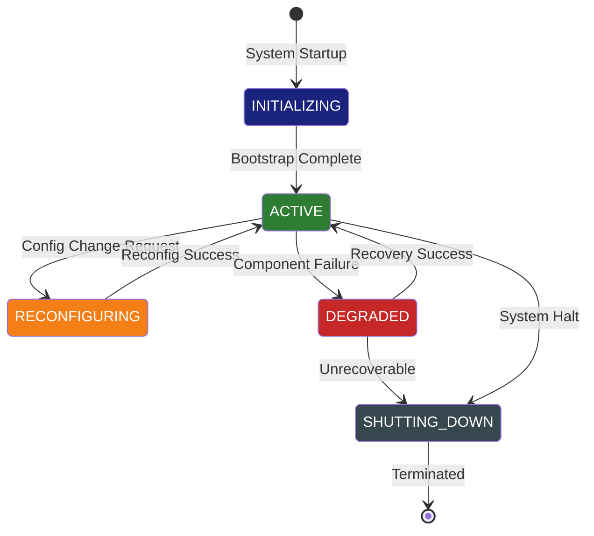

---

## 5. Workspace Context — بافت فضای کار

### 5.1 Definition

بافت فضای کار (Workspace Context) یک بافت سطح-مؤسسه است که هر workspace مستقل SMOS را تعریف می‌کند. یک SMOS می‌تواند چندین workspace داشته باشد (مثلاً برندهای مختلف، تیم‌های مختلف، پروژه‌های مختلف).

### 5.2 Ownership

| ویژگی          | مقدار                                       |
| -------------- | ------------------------------------------- |
| **مالک**       | Workspace Manager (مؤلفه سیستمی)            |
| **سطح دسترسی** | Read-Write برای Agentهای منتسب به Workspace |
| **نویسنده**    | Workspace Manager + Agentهای مجاز           |
| **طول عمر**    | از ایجاد Workspace تا حذف آن                |
| **ذخیره‌سازی** | Persistent                                  |
| **حجم تخمینی** | < ۱۰MB                                      |

### 5.3 Contents

| بلوک                | توضیح                      |
| ------------------- | -------------------------- |
| Workspace Identity  | شناسه, نام, نوع Workspace  |
| Member Registry     | فهرست Agentهای منتسب       |
| Brand Configuration | پیکربندی برند workspace    |
| Platform Bindings   | اتصالات پلتفرمی workspace  |
| Resource Quotas     | سهمیه منابع workspace      |
| Access Control List | سیاست‌های دسترسی workspace |

### 5.4 Isolation Model

هر Workspace Context کاملاً از Workspaceهای دیگر ایزوله است. هیچ Agentای در یک Workspace نمی‌تواند به بافت Workspace دیگر دسترسی داشته باشد مگر از طریق Shared Context.

---

## 6. Agent Context — بافت عامل

### 6.1 Definition

بافت عامل (Agent Context) بافت مختص یک Agent خاص است. هر Agent در SMOS یک Agent Context منحصربه‌فرد دارد که وضعیت، پیکربندی و حافظه جاری آن را نگه می‌دارد.

### 6.2 Ownership

| ویژگی          | مقدار                                  |
| -------------- | -------------------------------------- |
| **مالک**       | خود Agent (هر Agent مالک بافت خود است) |
| **سطح دسترسی** | Read-Write برای Agent مالک             |
| **نویسنده**    | Agent مالک                             |
| **خواننده**    | Orchestrator (فقط خواندن)              |
| **طول عمر**    | از Instantiation تا Termination        |
| **ذخیره‌سازی** | In-Memory (با Snapshot دوره‌ای)        |
| **حجم تخمینی** | < ۵MB                                  |

### 6.3 Contents

```
AgentContext {
  identity: AgentIdentity
  state: AgentState
  configuration: AgentConfiguration
  session: SessionData
  current_task: TaskContext
  capability_manifest: Capability[]
  dependency_cache: DependencyMap
  metrics: AgentMetrics
}
```

### 6.4 Lifecycle

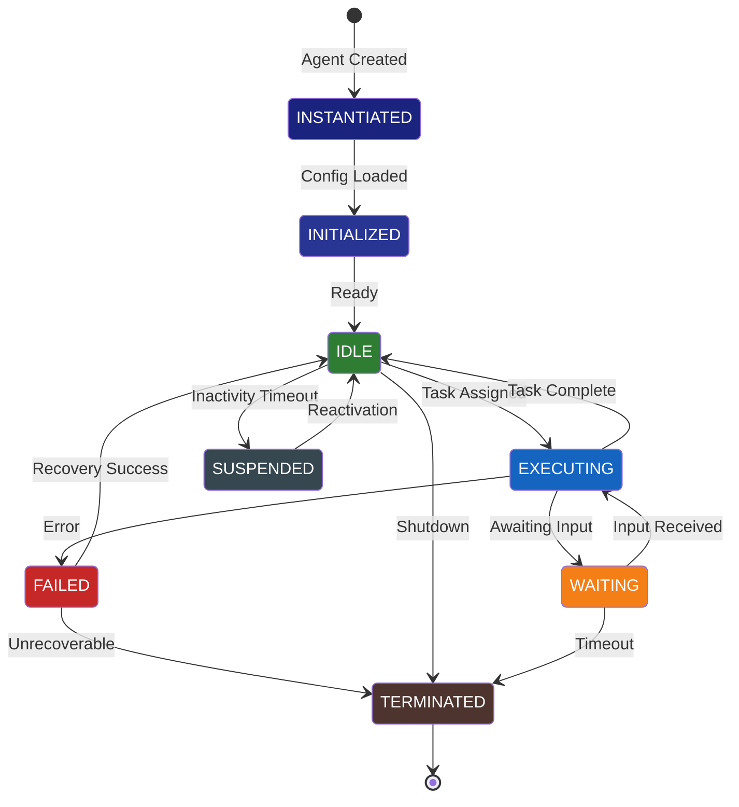

---

## 7. Conversation Context — بافت مکالمه

### 7.1 Definition

بافت مکالمه (Conversation Context) بافت موقتی است که برای یک مکالمه یا تعامل واحد بین SMOS و یک موجودیت خارجی (کاربر انسانی، Agent دیگر، سیستم خارجی) ایجاد می‌شود.

### 7.2 Ownership

| ویژگی          | مقدار                                  |
| -------------- | -------------------------------------- |
| **مالک**       | Agent آغازگر مکالمه                    |
| **سطح دسترسی** | Read-Write برای شرکت‌کنندگان در مکالمه |
| **نویسنده**    | شرکت‌کنندگان مجاز                      |
| **طول عمر**    | از آغاز تا پایان مکالمه                |
| **ذخیره‌سازی** | In-Memory (اختیاری: Persistent)        |
| **حجم تخمینی** | < ۱MB                                  |
| **انقضا**      | TTL پس از آخرین فعالیت                 |

### 7.3 Contents

| بلوک               | توضیح                     |
| ------------------ | ------------------------- |
| Conversation ID    | شناسه یکتای مکالمه        |
| Participants       | فهرست شرکت‌کنندگان با نقش |
| Message History    | تاریخچه پیام‌ها           |
| Current Turn       | نوبت جاری و وضعیت         |
| Shared Variables   | متغیرهای اشتراکی مکالمه   |
| Context References | ارجاع به بافت‌های مرتبط   |
| State Machine      | ماشین وضعیت مکالمه        |

### 7.4 State Machine

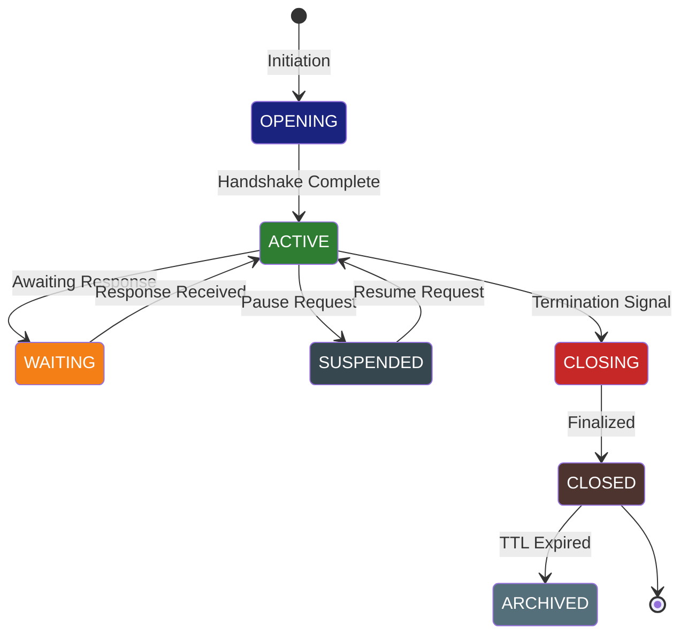

---

## 8. Calculation Context — بافت محاسبه

### 8.1 Definition

بافت محاسبه (Calculation Context) یک بافت موقتی است که برای یک عملیات محاسباتی واحد ایجاد می‌شود. این بافت شامل ورودی‌ها، میانی‌ها و خروجی‌های محاسبه است.

### 8.2 Ownership

| ویژگی          | مقدار                       |
| -------------- | --------------------------- |
| **مالک**       | مؤلفه اجراکننده محاسبه      |
| **سطح دسترسی** | Read-Write برای مؤلفه مالک  |
| **نویسنده**    | فقط مؤلفه مالک              |
| **طول عمر**    | از شروع تا پایان محاسبه     |
| **ذخیره‌سازی** | In-Memory                   |
| **حجم تخمینی** | < ۱۰MB                      |
| **انقضا**      | بلافاصله پس از پایان محاسبه |

### 8.3 Contents

| بلوک                 | توضیح                    |
| -------------------- | ------------------------ |
| Input Parameters     | پارامترهای ورودی         |
| Intermediate Results | نتایج میانی              |
| Output Result        | نتیجه نهایی              |
| Execution Trace      | رد اجرا (برای Debug)     |
| Error State          | وضعیت خطا (در صورت وجود) |
| Performance Metrics  | معیارهای عملکرد محاسبه   |
| Dependency Graph     | گراف وابستگی محاسباتی    |

### 8.4 Mutation Rules

- فقط مؤلفه مالک می‌تواند بافت محاسبه را تغییر دهد
- نتایج میانی پس از پایان محاسبه پاک می‌شوند
- خطا در هر مرحله کل بافت را در وضعیت Error قرار می‌دهد
- بافت محاسبه هرگز به صورت کامل به بیرون منتشر نمی‌شود (فقط result)

---

## 9. Document Context — بافت سند

### 9.1 Definition

بافت سند (Document Context) بافتی است که یک سند SMOS (محتوا، گزارش، دانش) را در طول چرخه حیات خود همراهی می‌کند. این بافت فراداده، وضعیت، تاریخچه و وابستگی‌های سند را نگه می‌دارد.

### 9.2 Ownership

| ویژگی          | مقدار                         |
| -------------- | ----------------------------- |
| **مالک**       | Agent تولیدکننده سند          |
| **سطح دسترسی** | Read-Write برای Agentهای مجاز |
| **نویسنده**    | Agentهای زنجیره تولید         |
| **طول عمر**    | از ایجاد تا بایگانی سند       |
| **ذخیره‌سازی** | Persistent                    |
| **حجم تخمینی** | < ۵MB                         |
| **نسخه‌بندی**  | الزامی (SemVer)               |

### 9.3 Contents

```
DocumentContext {
  document_id: UUID
  document_type: DocumentType
  version: SemanticVersion
  status: DocumentStatus
  metadata: DocumentMetadata
  provenance: ProvenanceChain
  review_history: ReviewRecord[]
  publication_state: PublicationState
  platform_adaptations: PlatformAdaptation[]
  related_documents: DocumentReference[]
}
```

---

## 10. Memory Context — بافت حافظه

### 10.1 Definition

بافت حافظه (Memory Context) بافت پایدار Agent است که دانش حاصل از تجربیات گذشته را نگه می‌دارد. این بافت معادل حافظه بلندمدت (Long-Term Memory) در معماری‌های شناختی است.

### 10.2 Ownership

| ویژگی          | مقدار                                 |
| -------------- | ------------------------------------- |
| **مالک**       | Agent (هر Agent حافظه خود را دارد)    |
| **سطح دسترسی** | Write: خود Agent / Read: Orchestrator |
| **طول عمر**    | همیشگی (تا حذف Agent)                 |
| **ذخیره‌سازی** | Persistent (Vector Store + Key-Value) |
| **حجم تخمینی** | نامحدود (با限额)                      |
| **نسخه‌بندی**  | دوره‌ای (Snapshots)                   |
| **بازیابی**    | Semantic Search + Exact Match         |

### 10.3 Structure

| لایه | نام               | توضیح                      | TTL        |
| ---- | ----------------- | -------------------------- | ---------- |
| L1   | Working Memory    | حافظه کاری جلسه جاری       | Session    |
| L2   | Short-Term Memory | رویدادهای اخیر (۲۴ ساعت)   | 24h        |
| L3   | Long-Term Memory  | دانش پایدار و یادگرفته‌شده | Indefinite |
| L4   | Episodic Memory   | خاطرات رویدادهای خاص       | ۳۰ روز     |
| L5   | Procedural Memory | دانش نحوه انجام کارها      | Indefinite |

### 10.4 Lifecycle

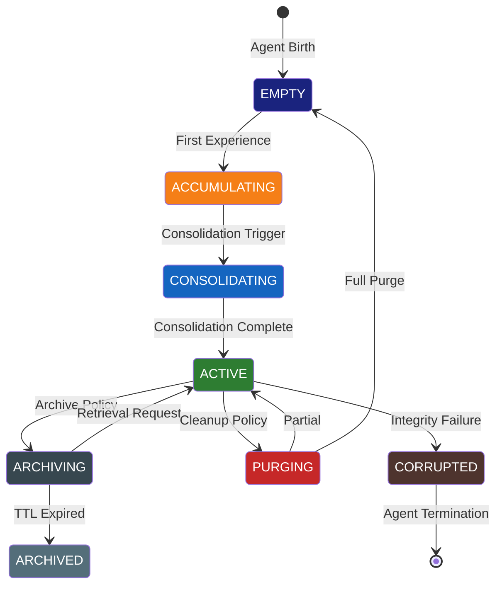

### 10.5 Integration with KNW-503

Memory Context مستقیماً با معماری حافظه تعریف‌شده در [KNW-503](../70-KNOWLEDGE/504-ai-memory-architecture.md) مرتبط است. KNW-503 انواع حافظه (AMT-001 تا AMT-008) را تعریف می‌کند و Memory Context پیاده‌سازی اجرایی آن انواع را در runtime فراهم می‌کند.

---

## 11. Tool Context — بافت ابزار

### 11.1 Definition

بافت ابزار (Tool Context) بافتی است که یک ابزار (Tool) در SMOS را در طول فراخوانی خود همراهی می‌کند. ابزارها قابلیت‌های خارجی هستند که Agentها فراخوانی می‌کنند.

### 11.2 Ownership

| ویژگی          | مقدار                            |
| -------------- | -------------------------------- |
| **مالک**       | Tool Registry (مؤلفه سیستمی)     |
| **سطح دسترسی** | Read-Write برای Tool در حال اجرا |
| **نویسنده**    | Tool + Agent فراخوان             |
| **طول عمر**    | از فراخوانی تا بازگشت نتیجه      |
| **ذخیره‌سازی** | In-Memory                        |
| **حجم تخمینی** | < ۵۰MB                           |
| **انزوا**      | Sandbox کامل                     |

### 11.3 Contents

| بلوک                  | توضیح                            |
| --------------------- | -------------------------------- |
| Tool Identity         | شناسه و نسخه ابزار               |
| Invocation Parameters | پارامترهای فراخوانی              |
| Credentials (Ref)     | ارجاع به اعتبارنامه (بدون مقدار) |
| Execution Environment | محیط اجرا و محدودیت‌ها           |
| Progress State        | وضعیت پیشرفت                     |
| Partial Results       | نتایج جزئی                       |
| Error Information     | اطلاعات خطا                      |
| Resource Usage        | مصرف منابع                       |

### 11.4 Security Model

- Tool Context در یک Sandbox ایزوله اجرا می‌شود
- هیچ دسترسی به بافت‌های دیگر ندارد مگر از طریق Context Reference
- اعتبارنامه‌ها به صورت مقدار ذخیره نمی‌شوند (فقط Reference)
- ابزارها نمی‌توانند به Memory Context دسترسی داشته باشند

---

## 12. Shared Context — بافت اشتراکی

### 12.1 Definition

بافت اشتراکی (Shared Context) یک بافت هماهنگ‌کننده است که بین چندین Agent یا Workflow به اشتراک گذاشته می‌شود. این بافت واسط هماهنگی و تبادل داده بین مؤلفه‌های مجاز است.

### 12.2 Ownership

| ویژگی           | مقدار                                           |
| --------------- | ----------------------------------------------- |
| **مالک**        | AI Orchestrator (AI-014)                        |
| **نویسندگان**   | Agentهای مجاز (توسط Orchestrator تعریف می‌شوند) |
| **خوانندگان**   | Agentهای مجاز                                   |
| **طول عمر**     | متغیر (تعریف‌شده در زمان ایجاد)                 |
| **ذخیره‌سازی**  | In-Memory (با Replication)                      |
| **حجم تخمینی**  | < ۱۰MB                                          |
| **مدل همزمانی** | Optimistic Locking + Conflict Resolution        |

### 12.3 Contents

```
SharedContext {
  context_id: UUID
  scope: CollaborationScope
  participants: ParticipantRole[]
  shared_state: SharedState
  coordination: CoordinationProtocol
  conflict_resolution: ConflictStrategy
  access_policy: AccessPolicy
  ttl: Duration
}
```

### 12.4 Conflict Resolution

| استراتژی         | توضیح                       | کاربرد             |
| ---------------- | --------------------------- | ------------------ |
| Last-Write-Wins  | آخرین نویسنده برنده است     | داده‌های غیرحساس   |
| First-Write-Wins | اولین نویسنده برنده است     | پیکربندی           |
| Merge            | ادغام خودکار تغییرات        | اسناد متنی         |
| Manual           | نیاز به تأیید انسانی        | تصمیمات حساس       |
| Version-Vector   | بردار نسخه برای تشخیص تعارض | داده‌های توزیع‌شده |

---

## 13. Immutable Context — بافت تغییرناپذیر

### 13.1 Definition

بافت تغییرناپذیر (Immutable Context) بافتی است که پس از ایجاد قابل تغییر نیست. این بافت برای ثبت رویدادها، لاگ‌ها، شواهد و داده‌های حسابرسی استفاده می‌شود.

### 13.2 Ownership

| ویژگی             | مقدار                                |
| ----------------- | ------------------------------------ |
| **مالک**          | Audit System                         |
| **سطح دسترسی**    | Append-Only + Read                   |
| **نویسنده**       | هر مؤلفه (فقط Append)                |
| **تغییر**         | ❌ غیرممکن                           |
| **حذف**           | ❌ غیرممکن (فعال‌سازی با گریس خاص)   |
| **طول عمر**       | همیشگی                               |
| **ذخیره‌سازی**    | Write-Once Storage / Blockchain-like |
| **امضای دیجیتال** | الزامی                               |

### 13.3 Mutation Rules

- هیچ بافت تغییرناپذیری پس از ایجاد تغییر نمی‌کند
- هر گونه تلاش برای تغییر رد می‌شود
- نسخه جدید به صورت Append به زنجیره اضافه می‌شود
- حذف فقط از طریق Immutable Deletion Protocol (IDP) ممکن است

### 13.4 Usage

| مورد استفاده     | نوع بافت تغییرناپذیر       | توضیح                 |
| ---------------- | -------------------------- | --------------------- |
| Audit Log        | ImmutableAuditContext      | ثبت رویدادهای حسابرسی |
| Decision Record  | ImmutableDecisionContext   | ثبت تصمیمات Agent     |
| Provenance Chain | ImmutableProvenanceContext | زنجیره تأیید منشأ     |
| Signed Contract  | ImmutableContractContext   | قراردادهای امضاشده    |
| Evidence Package | ImmutableEvidenceContext   | شواهد غیرقابل انکار   |

---

## 14. Context Lifecycle

### 14.1 Unified Lifecycle Model

همه انواع بافت از یک مدل چرخه حیات واحد پیروی می‌کنند:

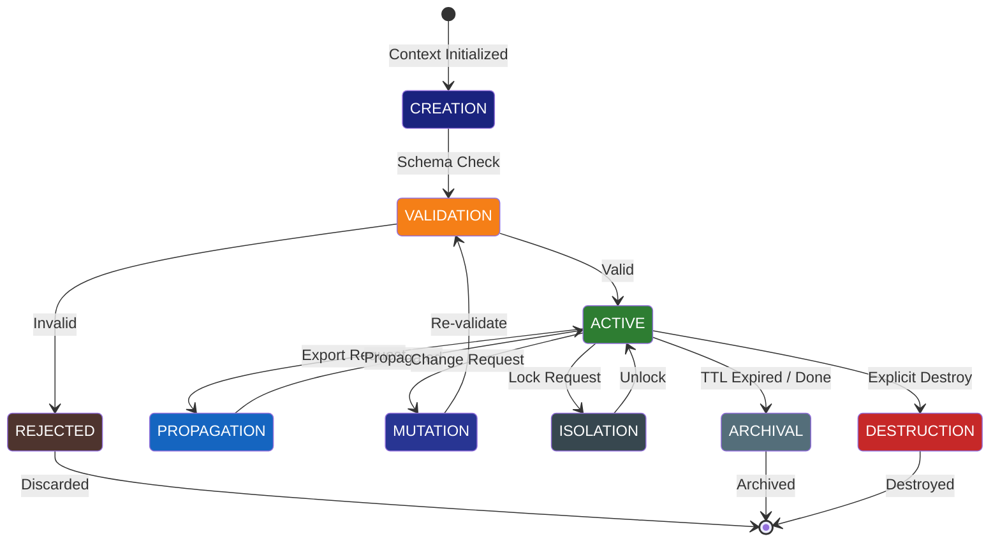

### 14.2 Lifecycle Stages

| Stage           | توضیح                    | ورودی                   | خروجی                |
| --------------- | ------------------------ | ----------------------- | -------------------- |
| **CREATION**    | ایجاد اولیه بافت         | پارامترهای سازنده       | Context Instance     |
| **VALIDATION**  | اعتبارسنجی ساختار        | Context Instance        | Validated / Rejected |
| **ACTIVE**      | بافت فعال و قابل استفاده | Validated Context       | Active Context       |
| **PROPAGATION** | انتشار به مؤلفه دیگر     | Export Request          | Propagated Context   |
| **MUTATION**    | تغییر مجاز               | Change Request          | Updated Context      |
| **ISOLATION**   | قفل برای تغییرات اتمی    | Lock Request            | Isolated Context     |
| **ARCHIVAL**    | بایگانی                  | TTL / Completion Signal | Archived Context     |
| **DESTRUCTION** | نابودی                   | Destroy Signal          | —                    |

---

## 15. Context Propagation Model

### 15.1 Propagation Mechanisms

بافت‌ها از طریق مکانیزم‌های زیر بین مؤلفه‌ها منتشر می‌شوند:

| مکانیزم          | توضیح                             | نوع          | تأخیر            |
| ---------------- | --------------------------------- | ------------ | ---------------- |
| Direct Reference | ارسال ارجاع مستقیم                | Synchronous  | فوری             |
| Copy-On-Write    | کپی با قابلیت نوشتن مجزا          | Synchronous  | Low              |
| Streaming        | جریان پیوسته داده                 | Asynchronous | Real-Time        |
| Event Broadcast  | انتشار رویداد به مشترکین          | Asynchronous | Eventual         |
| Pull             | مؤلفه مقصد بافت را درخواست می‌کند | Synchronous  | Request-Response |
| Snapshot         | عکس دوره‌ای                       | Batch        | Scheduled        |

### 15.2 Propagation Rules

1. **Authorization Check**: هر انتشار نیاز به مجوز دارد
2. **Schema Validation**: بافت قبل از انتشار اعتبارسنجی می‌شود
3. **Size Limit**: حجم بافت منتشرشده محدود است
4. **Traceable**: هر انتشار یک Trace ID دارد
5. **No Cyclic**: انتشار چرخه‌ای ممنوع است
6. **Atomic or Rollback**: انتشار یا کامل است یا برنمی‌گردد

### 15.3 Propagation Sequence

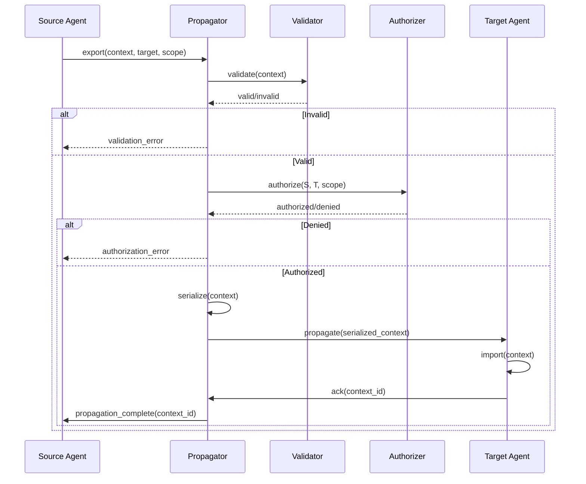

### 15.4 Propagation Matrix

| از / به      | Global | Workspace | Agent       | Conversation | Calc | Document | Memory   | Tool | Shared   | Immutable |
| ------------ | ------ | --------- | ----------- | ------------ | ---- | -------- | -------- | ---- | -------- | --------- |
| Global       | —      | ✅ RO     | ✅ RO       | ❌           | ❌   | ❌       | ❌       | ❌   | ❌       | ✅ Append |
| Workspace    | ❌     | —         | ✅ RO       | ✅ RO        | ❌   | ✅       | ❌       | ❌   | ✅       | ✅ Append |
| Agent        | ❌     | ❌        | ✅ COW      | ✅           | ✅   | ✅       | ✅       | ✅   | ✅       | ✅ Append |
| Conversation | ❌     | ❌        | ❌          | —            | ❌   | ✅       | ❌       | ❌   | ❌       | ✅ Append |
| Calculation  | ❌     | ❌        | ✅ Result   | ❌           | —    | ❌       | ❌       | ❌   | ❌       | ❌        |
| Document     | ❌     | ✅        | ✅          | ✅           | ❌   | —        | ❌       | ❌   | ✅       | ✅ Append |
| Memory       | ❌     | ❌        | ✅ Retrieve | ❌           | ❌   | ❌       | —        | ❌   | ✅ Query | ❌        |
| Tool         | ❌     | ❌        | ✅ Result   | ❌           | ❌   | ❌       | ❌       | —    | ❌       | ✅ Append |
| Shared       | ✅ RO  | ✅        | ✅          | ✅           | ❌   | ✅       | ✅ Query | ✅   | —        | ✅ Append |
| Immutable    | ❌     | ❌        | ❌          | ❌           | ❌   | ❌       | ❌       | ❌   | ❌       | —         |

> ✅ = مجاز, ❌ = غیرمجاز, RO = فقط خواندنی, COW = Copy-On-Write, Append = فقط افزودن, Retrieve = بازیابی, Query = پرس‌وجو

---

## 16. Context Isolation Model

### 16.1 Isolation Levels

| Level | نام            | توضیح                            | کاربرد                  |
| ----- | -------------- | -------------------------------- | ----------------------- |
| L0    | None           | بدون انزوا — بافت کاملاً اشتراکی | Global Context          |
| L1    | Read Isolation | بافت فقط توسط مالک نوشته می‌شود  | Workspace Context       |
| L2    | Full Isolation | بافت کاملاً محصور                | Agent Context (Default) |
| L3    | Sandbox        | بافت در محیط Sandbox اجرا می‌شود | Tool Context            |
| L4    | Immutable      | بافت تغییرناپذیر و فقط Append    | Immutable Context       |

### 16.2 Isolation Boundaries

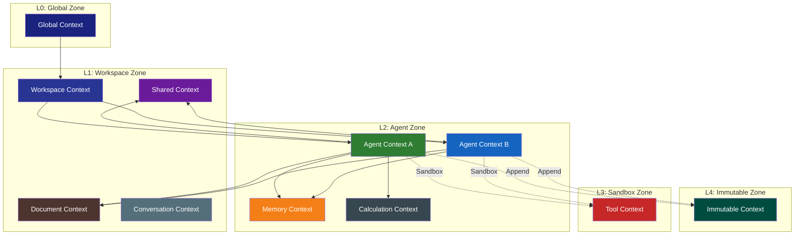

### 16.3 Boundary Crossing Protocol

هر عبور از مرز انزوا نیازمند:

1. **Context Crossing Request**: درخواست صریح عبور از مرز
2. **Authorization Validation**: تأیید مجوز عبور
3. **Schema Transformation**: تبدیل به قالب مرز مقصد (در صورت نیاز)
4. **Audit Logging**: ثبت رویداد عبور در Immutable Context
5. **Size Check**: بررسی حجم بافت عبوری

---

## 17. Context Inheritance Model

### 17.1 Inheritance Hierarchy

بافت‌ها می‌توانند از یکدیگر ارث‌بری کنند. سلسله‌مراتب ارث‌بری به صورت زیر است:

```
Global Context
└── Workspace Context (inherits: identity, mode, clock)
    ├── Agent Context (inherits: workspace_id, brand_config)
    │   ├── Conversation Context (inherits: agent_id, capabilities)
    │   ├── Calculation Context (inherits: agent_id, config)
    │   ├── Document Context (inherits: agent_id, workspace)
    │   └── Memory Context (inherits: agent_id, retention_policy)
    ├── Tool Context (inherits: workspace_id, resource_quota)
    ├── Shared Context (inherits: workspace_id, acl)
    └── Immutable Context (inherits: workspace_id, audit_policy)
```

### 17.2 Inheritance Rules

| Rule   | توضیح                                                                 |
| ------ | --------------------------------------------------------------------- |
| INR-01 | هر بافت فقط از یک والد ارث‌بری می‌کند (Single Inheritance)            |
| INR-02 | subset مشخصی از بافت والد به ارث می‌رسد (Selective Inheritance)       |
| INR-03 | بافت فرزند می‌تواند مقادیر به‌ارث‌رسیده را بازنویسی کند (Override)    |
| INR-04 | تغییر در بافت والد پس از ارث‌بری بر بافت فرزند تأثیر ندارد (Snapshot) |
| INR-05 | سطح دسترسی فرزند نمی‌تواند بیشتر از والد باشد (Non-Escalation)        |
| INR-06 | طول عمر فرزند نمی‌تواند بیشتر از والد باشد (Lifetime Bound)           |

### 17.3 Override Matrix

| فیلد       | قابل بازنویسی؟ | محدودیت                |
| ---------- | -------------- | ---------------------- |
| identity   | ❌             | ثابت                   |
| timestamps | ❌             | خودکار                 |
| parent_ref | ❌             | ثابت                   |
| acl        | ✅             | فقط Tightening         |
| config     | ✅             | بدون محدودیت           |
| state      | ✅             | فقط Forward Transition |
| metadata   | ✅             | بدون محدودیت           |
| ttl        | ✅             | فقط کاهش               |

---

## 18. Context Mutation Rules

### 18.1 Mutation Authority Matrix

| نوع بافت     | مالک  | Orchestrator | Agent هم‌سطح | Agent دیگر | System    |
| ------------ | ----- | ------------ | ------------ | ---------- | --------- |
| Global       | ✅ RW | ✅ RW        | ❌           | ❌         | ✅ RW     |
| Workspace    | ✅ RW | ✅ RW        | ❌           | ❌         | ✅ RO     |
| Agent        | ✅ RW | ✅ RO        | ❌           | ❌         | ❌        |
| Conversation | ✅ RW | ✅ RO        | ✅ (مجاز)    | ❌         | ❌        |
| Calculation  | ✅ RW | ❌           | ❌           | ❌         | ❌        |
| Document     | ✅ RW | ✅ RW        | ❌           | ❌         | ❌        |
| Memory       | ✅ RW | ✅ RO        | ❌           | ❌         | ❌        |
| Tool         | ✅ RW | ❌           | ❌           | ❌         | ✅ RW     |
| Shared       | ✅ RW | ✅ RW        | ✅ (مجاز)    | ❌         | ❌        |
| Immutable    | ❌    | ❌           | ❌           | ❌         | ✅ Append |

> ✅ RW = خواندن و نوشتن, ✅ RO = فقط خواندن, ❌ = دسترسی ندارد

### 18.2 Mutation Validation Rules

| ID     | Rule                   | توضیح                                               |
| ------ | ---------------------- | --------------------------------------------------- |
| MVR-01 | **Owner-Only Write**   | فقط مالک می‌تواند بافت را تغییر دهد (مگر در Shared) |
| MVR-02 | **Schema Compliance**  | هر تغییر باید با Schema بافت سازگار باشد            |
| MVR-03 | **Version Bump**       | هر تغییر نسخه بافت را افزایش می‌دهد                 |
| MVR-04 | **Audit Trail**        | هر تغییر در زنجیره حسابرسی ثبت می‌شود               |
| MVR-05 | **Atomic Mutation**    | تغییرات اتمی هستند (همه یا هیچ)                     |
| MVR-06 | **No Blind Overwrite** | هر تغییر نیاز به Read قبلی دارد                     |
| MVR-07 | **Immutable Lock**     | Immutable Context هرگز تغییر نمی‌کند                |
| MVR-08 | **Size Cap**           | تغییر نباید حجم مجاز را نقض کند                     |
| MVR-09 | **State Transition**   | تغییر وضعیت فقط در مسیرهای مجاز                     |
| MVR-10 | **Dependency Check**   | تغییر نباید وابستگی‌های فعال را بشکند               |

### 18.3 Mutation Sequence

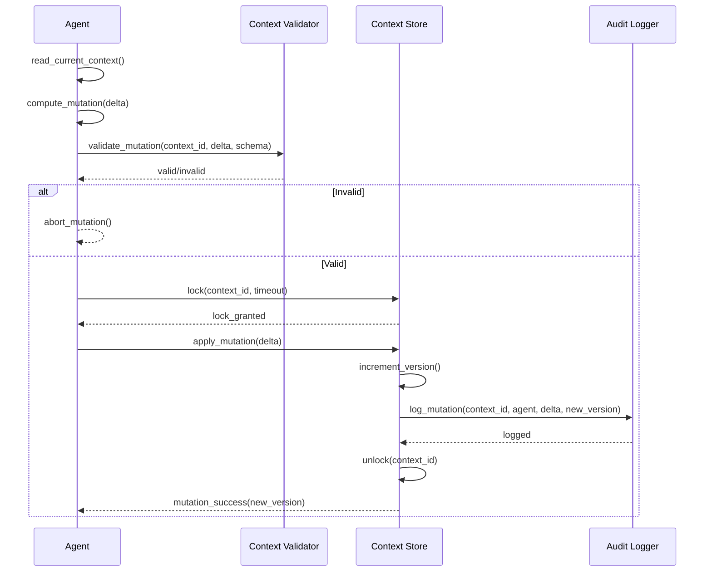

---

## 19. Context Security

### 19.1 Access Control Model

مدل امنیتی بافت از چهار لایه تشکیل شده است:

| لایه | نام            | مکانیزم                                |
| ---- | -------------- | -------------------------------------- |
| L1   | Authentication | تأیید هویت مؤلفه درخواست‌کننده         |
| L2   | Authorization  | بررسی مجوز دسترسی بر اساس Context ACL  |
| L3   | Encryption     | رمزنگاری بافت در حال انتقال و ذخیره    |
| L4   | Audit          | ثبت همه دسترسی‌ها در Immutable Context |

### 19.2 Security Levels Per Context

| نوع بافت     | حداقل Auth          | Encryption at Rest | Encryption in Transit | Audit Required |
| ------------ | ------------------- | ------------------ | --------------------- | -------------- |
| Global       | System Token        | ✅                 | ✅                    | ✅             |
| Workspace    | Agent Identity      | ✅                 | ✅                    | ✅             |
| Agent        | Agent Identity      | ✅                 | ✅                    | ✅             |
| Conversation | Session Token       | اختیاری            | ✅                    | اختیاری        |
| Calculation  | Internal Only       | اختیاری            | ✅                    | ❌             |
| Document     | Agent Identity      | ✅                 | ✅                    | ✅             |
| Memory       | Agent Identity      | ✅ (Full)          | ✅                    | ✅             |
| Tool         | Tool Token          | ✅                 | ✅                    | ✅             |
| Shared       | Collaboration Token | ✅                 | ✅                    | ✅             |
| Immutable    | System Signature    | ✅ (Full)          | ✅                    | ✅ (Immutable) |

### 19.3 Security Context Schema

هر Security Context شامل حداقل موارد زیر است:

```
SecurityContext {
  authentication: {
    method: "token" | "certificate" | "signature"
    identity: IdentityClaim
    timestamp: ISODateTime
    nonce: UUID
  }
  authorization: {
    context_type: ContextType
    requested_access: "read" | "write" | "append" | "admin"
    granted_by: AuthorizationPolicy
    expires_at: ISODateTime
  }
  audit: {
    session_id: UUID
    trace_id: UUID
    parent_trace_id: UUID?
  }
}
```

---

## 20. Context Serialization

### 20.1 Serialization Format

همه بافت‌ها از JSON به عنوان فرمت سریال‌سازی اولیه استفاده می‌کنند. یک فرمت باینری فشرده (CBOR) برای انتقال با حجم بالا پشتیبانی می‌شود.

| فرمت        | کاربرد             | توضیح                    |
| ----------- | ------------------ | ------------------------ |
| JSON        | پیش‌فرض            | خوانا برای انسان و ماشین |
| CBOR        | انتقال با حجم بالا | فشرده و سریع             |
| JSON Lines  | Streaming          | جریان خط‌به‌خط           |
| MessagePack | Internal IPC       | کمترین حجم               |

### 20.2 Serialization Schema

```json
{
  "$schema": "http://json-schema.org/draft-07/schema#",
  "$id": "smos://schemas/context-serialization/1.0.0",
  "title": "ContextSerializationEnvelope",
  "description": "Envelope for serialized context transport in SMOS",
  "type": "object",
  "required": ["context_id", "context_type", "version", "payload", "metadata"],
  "properties": {
    "context_id": {
      "type": "string",
      "format": "uuid",
      "description": "Unique context identifier"
    },
    "context_type": {
      "type": "string",
      "enum": [
        "global",
        "workspace",
        "agent",
        "conversation",
        "calculation",
        "document",
        "memory",
        "tool",
        "shared",
        "immutable"
      ]
    },
    "version": {
      "type": "string",
      "pattern": "^\\d+\\.\\d+\\.\\d+$",
      "description": "Semantic version of this context instance"
    },
    "payload": {
      "type": "object",
      "description": "The actual context data"
    },
    "metadata": {
      "type": "object",
      "required": ["created_at", "owner", "ttl"],
      "properties": {
        "created_at": { "type": "string", "format": "date-time" },
        "owner": { "type": "string" },
        "ttl": { "type": "integer", "minimum": 0 },
        "parent_id": { "type": "string", "format": "uuid" },
        "signature": { "type": "string" }
      }
    }
  }
}
```

### 20.3 Serialization Rules

| Rule  | توضیح                                                     |
| ----- | --------------------------------------------------------- |
| SR-01 | همه فیلدهای اجباری باید presence داشته باشند              |
| SR-02 | فیلدهای خالی با null (نه undefined یا حذف) نشان داده شوند |
| SR-03 | Timestamps در فرمت ISO 8601                               |
| SR-04 | Binary data به Base64 encoded                             |
| SR-05 | Circular references ممنوع                                 |
| SR-06 | Maximum depth: ۱۰ سطح                                     |
| SR-07 | Maximum payload size: بر اساس نوع بافت                    |

---

## 21. Context Caching

### 21.1 Cache Architecture

بافت‌ها برای کاهش تأخیر و بهبود عملکرد در سطوح مختلف کش می‌شوند:

| سطح | نام              | مکان              | سرعت    | حجم     | TTL پیش‌فرض |
| --- | ---------------- | ----------------- | ------- | ------- | ----------- |
| L1  | Agent Cache      | In-Process Agent  | < ۱μs   | ۱۰MB    | ۵ دقیقه     |
| L2  | Workspace Cache  | Workspace Server  | < ۵μs   | ۱۰۰MB   | ۱۵ دقیقه    |
| L3  | Global Cache     | Distributed Cache | < ۱۰ms  | ۱GB     | ۳۰ دقیقه    |
| L4  | Persistent Store | Database          | < ۱۰۰ms | نامحدود | —           |

### 21.2 Cache Invalidation

| رویداد              | L1           | L2           | L3           | L4  |
| ------------------- | ------------ | ------------ | ------------ | --- |
| Context Mutation    | ✅ Immediate | ✅ Immediate | ⏳ ۳۰s       | —   |
| Context Propagation | ✅ Immediate | ✅ Immediate | ⏳ ۶۰s       | —   |
| TTL Expiry          | ✅           | ✅           | ✅           | ✅  |
| System Reconfigure  | ✅ Immediate | ✅ Immediate | ✅ Immediate | —   |
| Agent Shutdown      | ✅ Immediate | —            | —            | —   |

### 21.3 Cache Coherency

- **Read-Through**: خواندن از طریق کش (کش در صورت عدم وجود از منبع پر می‌کند)
- **Write-Through**: نوشتن هم در کش و هم در منبع
- **Write-Behind**: نوشتن ابتدا در کش، سپس با تأخیر در منبع (فقط برای بافت‌های غیرحساس)
- **TTL-Based**: انقضای خودکار بر اساس TTL

---

## 22. Context Versioning

### 22.1 Versioning Scheme

همه بافت‌ها از SemVer 2.0 برای نسخه‌بندی استفاده می‌کنند:

```
MAJOR.MINOR.PATCH

MAJOR: تغییر ناسازگار با نسخه‌های قبلی
MINOR: افزودن قابلیت جدید (سازگار با عقب)
PATCH: رفع اشکال یا تغییر جزئی
```

### 22.2 Version Lifecycle

| Stage             | توضیح         | Example          |
| ----------------- | ------------- | ---------------- |
| Draft             | در حال توسعه  | 1.0.0-draft      |
| Alpha             | آزمایش داخلی  | 1.0.0-alpha.1    |
| Beta              | آزمایش محدود  | 1.0.0-beta.2     |
| Release Candidate | آماده انتشار  | 1.0.0-rc.1       |
| Stable            | انتشار پایدار | 1.0.0            |
| Deprecated        | منسوخ         | 1.0.0-deprecated |
| Archived          | بایگانی       | 1.0.0-archived   |

### 22.3 Version Compatibility

| تغییر             | MAJOR | MINOR | PATCH |
| ----------------- | ----- | ----- | ----- |
| افزودن فیلد جدید  | ✅    | ✅    | ✅    |
| حذف فیلد          | ❌    | ✅    | ✅    |
| تغییر نوع فیلد    | ❌    | ❌    | ❌    |
| تغییر Required    | ❌    | ✅    | ✅    |
| افزودن Enum Value | ❌    | ✅    | ✅    |
| حذف Enum Value    | ❌    | ❌    | ❌    |
| تغییر Validation  | ❌    | ✅    | ✅    |

---

## 23. Schema Definitions

### 23.1 GlobalContext Schema

```json
{
  "$schema": "http://json-schema.org/draft-07/schema#",
  "$id": "smos://schemas/context/global/1.0.0",
  "title": "GlobalContext",
  "description": "Global execution context for the entire SMOS instance",
  "type": "object",
  "required": [
    "context_id",
    "context_type",
    "system_identity",
    "global_config",
    "system_mode",
    "global_clock",
    "version"
  ],
  "properties": {
    "context_id": { "type": "string", "format": "uuid" },
    "context_type": { "const": "global" },
    "version": { "type": "string", "pattern": "^\\d+\\.\\d+\\.\\d+(-[a-zA-Z0-9]+)?$" },
    "system_identity": {
      "type": "object",
      "required": ["system_id", "instance_id", "environment"],
      "properties": {
        "system_id": { "type": "string", "pattern": "^smos-[a-z0-9-]+$" },
        "instance_id": { "type": "string", "format": "uuid" },
        "environment": { "type": "string", "enum": ["dev", "staging", "production", "dr"] }
      }
    },
    "global_config": {
      "type": "object",
      "properties": {
        "feature_flags": {
          "type": "object",
          "additionalProperties": { "type": "boolean" }
        },
        "limits": {
          "type": "object",
          "properties": {
            "max_agents": { "type": "integer", "minimum": 1 },
            "max_workspaces": { "type": "integer", "minimum": 1 },
            "max_context_size_bytes": { "type": "integer", "minimum": 1024 }
          }
        }
      }
    },
    "system_mode": {
      "type": "string",
      "enum": ["normal", "maintenance", "emergency", "degraded", "shutdown"]
    },
    "global_clock": {
      "type": "object",
      "required": ["epoch_ms", "timezone", "heartbeat"],
      "properties": {
        "epoch_ms": { "type": "integer" },
        "timezone": { "type": "string" },
        "heartbeat": { "type": "integer" }
      }
    },
    "component_registry": {
      "type": "object",
      "patternProperties": {
        "^[a-z_]+$": {
          "type": "object",
          "required": ["status", "version"],
          "properties": {
            "status": { "type": "string", "enum": ["active", "degraded", "offline"] },
            "version": { "type": "string" }
          }
        }
      }
    },
    "metadata": { "$ref": "#/definitions/ContextMetadata" }
  },
  "definitions": {
    "ContextMetadata": {
      "type": "object",
      "required": ["created_at", "owner", "ttl_ms"],
      "properties": {
        "created_at": { "type": "string", "format": "date-time" },
        "owner": { "type": "string", "const": "ai-orchestrator" },
        "ttl_ms": { "type": "integer", "minimum": -1 },
        "signature": { "type": "string" }
      }
    }
  }
}
```

### 23.2 AgentContext Schema

```json
{
  "$schema": "http://json-schema.org/draft-07/schema#",
  "$id": "smos://schemas/context/agent/1.0.0",
  "title": "AgentContext",
  "description": "Context specific to a single AI Agent in SMOS",
  "type": "object",
  "required": [
    "context_id",
    "context_type",
    "version",
    "agent_identity",
    "agent_state",
    "agent_configuration"
  ],
  "properties": {
    "context_id": { "type": "string", "format": "uuid" },
    "context_type": { "const": "agent" },
    "version": { "type": "string", "pattern": "^\\d+\\.\\d+\\.\\d+$" },
    "parent_context_id": { "type": "string", "format": "uuid" },
    "agent_identity": {
      "type": "object",
      "required": ["agent_id", "agent_type", "family", "capability_level"],
      "properties": {
        "agent_id": { "type": "string", "pattern": "^AI-\\d{3}$" },
        "agent_type": {
          "type": "string",
          "enum": ["specialist", "orchestrator", "reviewer", "coordinator"]
        },
        "family": {
          "type": "string",
          "enum": ["content", "operations", "knowledge", "orchestration"]
        },
        "capability_level": { "type": "string", "pattern": "^A-[0-4]$" }
      }
    },
    "agent_state": {
      "type": "string",
      "enum": [
        "instantiated",
        "initialized",
        "idle",
        "executing",
        "waiting",
        "failed",
        "suspended",
        "terminated"
      ]
    },
    "agent_configuration": {
      "type": "object",
      "required": ["workspace_id", "retention_policy"],
      "properties": {
        "workspace_id": { "type": "string", "format": "uuid" },
        "retention_policy": {
          "type": "object",
          "properties": {
            "memory_ttl_days": { "type": "integer", "minimum": 1 },
            "max_context_size_bytes": { "type": "integer" }
          }
        },
        "capabilities": {
          "type": "array",
          "items": { "type": "string" }
        }
      }
    },
    "current_task": {
      "type": "object",
      "properties": {
        "task_id": { "type": "string", "format": "uuid" },
        "status": { "type": "string" },
        "started_at": { "type": "string", "format": "date-time" }
      }
    },
    "metadata": { "$ref": "#/definitions/ContextMetadata" }
  },
  "definitions": {
    "ContextMetadata": {
      "type": "object",
      "required": ["created_at", "owner", "ttl_ms"],
      "properties": {
        "created_at": { "type": "string", "format": "date-time" },
        "owner": { "type": "string" },
        "ttl_ms": { "type": "integer", "minimum": -1 }
      }
    }
  }
}
```

### 23.3 ConversationContext Schema

```json
{
  "$schema": "http://json-schema.org/draft-07/schema#",
  "$id": "smos://schemas/context/conversation/1.0.0",
  "title": "ConversationContext",
  "description": "Context for a single conversation or interaction in SMOS",
  "type": "object",
  "required": ["context_id", "context_type", "version", "conversation_id", "participants", "state"],
  "properties": {
    "context_id": { "type": "string", "format": "uuid" },
    "context_type": { "const": "conversation" },
    "version": { "type": "string", "pattern": "^\\d+\\.\\d+\\.\\d+$" },
    "conversation_id": { "type": "string", "format": "uuid" },
    "parent_context_id": { "type": "string", "format": "uuid" },
    "participants": {
      "type": "array",
      "minItems": 2,
      "items": {
        "type": "object",
        "required": ["id", "role", "joined_at"],
        "properties": {
          "id": { "type": "string" },
          "role": {
            "type": "string",
            "enum": ["initiator", "responder", "observer", "facilitator"]
          },
          "joined_at": { "type": "string", "format": "date-time" }
        }
      }
    },
    "state": {
      "type": "string",
      "enum": ["opening", "active", "waiting", "suspended", "closing", "closed", "archived"]
    },
    "message_history": {
      "type": "array",
      "items": {
        "type": "object",
        "required": ["message_id", "sender", "timestamp", "content_type"],
        "properties": {
          "message_id": { "type": "string", "format": "uuid" },
          "sender": { "type": "string" },
          "timestamp": { "type": "string", "format": "date-time" },
          "content_type": {
            "type": "string",
            "enum": ["text", "command", "data", "event", "error"]
          },
          "content_summary": { "type": "string", "maxLength": 256 }
        }
      },
      "maxItems": 1000
    },
    "shared_variables": {
      "type": "object",
      "additionalProperties": true,
      "maxProperties": 50
    },
    "ttl_seconds": { "type": "integer", "minimum": 60, "default": 3600 },
    "metadata": { "$ref": "#/definitions/ContextMetadata" }
  },
  "definitions": {
    "ContextMetadata": {
      "type": "object",
      "required": ["created_at", "owner"],
      "properties": {
        "created_at": { "type": "string", "format": "date-time" },
        "owner": { "type": "string" },
        "trace_id": { "type": "string", "format": "uuid" }
      }
    }
  }
}
```

### 23.4 ContextPropagation Schema

```json
{
  "$schema": "http://json-schema.org/draft-07/schema#",
  "$id": "smos://schemas/context/propagation/1.0.0",
  "title": "ContextPropagation",
  "description": "Schema for context propagation requests between SMOS components",
  "type": "object",
  "required": [
    "propagation_id",
    "source_id",
    "target_id",
    "context_id",
    "propagation_type",
    "scope"
  ],
  "properties": {
    "propagation_id": { "type": "string", "format": "uuid" },
    "source_id": { "type": "string" },
    "target_id": { "type": "string" },
    "context_id": { "type": "string", "format": "uuid" },
    "propagation_type": {
      "type": "string",
      "enum": [
        "direct_reference",
        "copy_on_write",
        "streaming",
        "event_broadcast",
        "pull",
        "snapshot"
      ]
    },
    "scope": {
      "type": "object",
      "required": ["context_types", "max_depth", "max_size_bytes"],
      "properties": {
        "context_types": {
          "type": "array",
          "items": {
            "type": "string",
            "enum": [
              "global",
              "workspace",
              "agent",
              "conversation",
              "calculation",
              "document",
              "memory",
              "tool",
              "shared",
              "immutable"
            ]
          }
        },
        "max_depth": { "type": "integer", "minimum": 1, "maximum": 10 },
        "max_size_bytes": { "type": "integer", "minimum": 1024 },
        "include_metadata": { "type": "boolean", "default": true },
        "include_provenance": { "type": "boolean", "default": false }
      }
    },
    "authorization": {
      "type": "object",
      "required": ["token", "granted_by"],
      "properties": {
        "token": { "type": "string" },
        "granted_by": { "type": "string" },
        "expires_at": { "type": "string", "format": "date-time" }
      }
    },
    "scheduling": {
      "type": "object",
      "properties": {
        "priority": { "type": "integer", "minimum": 0, "maximum": 100 },
        "timeout_ms": { "type": "integer", "minimum": 100 },
        "retry_policy": {
          "type": "object",
          "properties": {
            "max_retries": { "type": "integer", "minimum": 0 },
            "backoff_ms": { "type": "integer", "minimum": 100 }
          }
        }
      }
    },
    "timestamp": { "type": "string", "format": "date-time" }
  }
}
```

### 23.5 ContextIsolation Schema

```json
{
  "$schema": "http://json-schema.org/draft-07/schema#",
  "$id": "smos://schemas/context/isolation/1.0.0",
  "title": "ContextIsolation",
  "description": "Schema defining isolation boundaries and rules for SMOS contexts",
  "type": "object",
  "required": [
    "isolation_id",
    "context_type",
    "isolation_level",
    "boundary_rules",
    "crossing_protocol"
  ],
  "properties": {
    "isolation_id": { "type": "string", "format": "uuid" },
    "context_type": {
      "type": "string",
      "enum": [
        "global",
        "workspace",
        "agent",
        "conversation",
        "calculation",
        "document",
        "memory",
        "tool",
        "shared",
        "immutable"
      ]
    },
    "isolation_level": {
      "type": "string",
      "enum": ["L0_none", "L1_read", "L2_full", "L3_sandbox", "L4_immutable"]
    },
    "boundary_rules": {
      "type": "object",
      "required": ["allow_outbound", "allow_inbound", "max_external_participants"],
      "properties": {
        "allow_outbound": { "type": "boolean" },
        "allow_inbound": { "type": "boolean" },
        "max_external_participants": { "type": "integer", "minimum": 0 },
        "allowed_propagation_types": {
          "type": "array",
          "items": {
            "type": "string",
            "enum": [
              "direct_reference",
              "copy_on_write",
              "streaming",
              "event_broadcast",
              "pull",
              "snapshot"
            ]
          }
        },
        "crossing_audit_required": { "type": "boolean", "default": true }
      }
    },
    "crossing_protocol": {
      "type": "object",
      "required": ["authorization_required", "schema_transformation", "audit_logging"],
      "properties": {
        "authorization_required": { "type": "boolean" },
        "schema_transformation": { "type": "boolean" },
        "audit_logging": { "type": "boolean" },
        "size_check_enabled": { "type": "boolean", "default": true },
        "max_crossing_size_bytes": { "type": "integer" },
        "encryption_required": { "type": "boolean", "default": true }
      }
    },
    "sandbox_config": {
      "type": "object",
      "properties": {
        "memory_limit_bytes": { "type": "integer" },
        "cpu_quota": { "type": "integer" },
        "network_access": { "type": "boolean", "default": false },
        "filesystem_access": {
          "type": "object",
          "properties": {
            "read_paths": { "type": "array", "items": { "type": "string" } },
            "write_paths": { "type": "array", "items": { "type": "string" } }
          }
        }
      }
    },
    "metadata": {
      "type": "object",
      "properties": {
        "created_at": { "type": "string", "format": "date-time" },
        "owner": { "type": "string" },
        "policy_version": { "type": "string", "pattern": "^\\d+\\.\\d+\\.\\d+$" }
      }
    }
  }
}
```

### 23.6 ContextSecurity Schema

```json
{
  "$schema": "http://json-schema.org/draft-07/schema#",
  "$id": "smos://schemas/context/security/1.0.0",
  "title": "ContextSecurity",
  "description": "Security configuration and policy for SMOS context access",
  "type": "object",
  "required": [
    "security_id",
    "context_type",
    "authentication",
    "authorization",
    "encryption",
    "audit"
  ],
  "properties": {
    "security_id": { "type": "string", "format": "uuid" },
    "context_type": {
      "type": "string",
      "enum": [
        "global",
        "workspace",
        "agent",
        "conversation",
        "calculation",
        "document",
        "memory",
        "tool",
        "shared",
        "immutable"
      ]
    },
    "authentication": {
      "type": "object",
      "required": ["method", "required_level"],
      "properties": {
        "method": {
          "type": "string",
          "enum": [
            "system_token",
            "agent_identity",
            "session_token",
            "internal_only",
            "tool_token",
            "system_signature"
          ]
        },
        "required_level": {
          "type": "string",
          "enum": ["L1_token", "L2_identity", "L3_certificate", "L4_multi_factor"]
        },
        "token_ttl_seconds": { "type": "integer", "minimum": 60 },
        "nonce_required": { "type": "boolean", "default": false }
      }
    },
    "authorization": {
      "type": "object",
      "required": ["default_access", "policy_ref"],
      "properties": {
        "default_access": {
          "type": "string",
          "enum": ["none", "read", "write", "append", "admin"]
        },
        "policy_ref": { "type": "string" },
        "allow_override": { "type": "boolean", "default": false },
        "max_grantees": { "type": "integer", "minimum": 0 },
        "expires_at": { "type": "string", "format": "date-time" }
      }
    },
    "encryption": {
      "type": "object",
      "required": ["at_rest", "in_transit"],
      "properties": {
        "at_rest": {
          "type": "object",
          "properties": {
            "enabled": { "type": "boolean" },
            "algorithm": { "type": "string", "default": "AES-256-GCM" },
            "key_rotation_days": { "type": "integer" }
          }
        },
        "in_transit": {
          "type": "object",
          "properties": {
            "enabled": { "type": "boolean", "default": true },
            "tls_version": { "type": "string", "enum": ["1.2", "1.3"] },
            "mtls_required": { "type": "boolean", "default": false }
          }
        }
      }
    },
    "audit": {
      "type": "object",
      "required": ["enabled", "immutable_log"],
      "properties": {
        "enabled": { "type": "boolean" },
        "immutable_log": { "type": "boolean" },
        "retention_days": { "type": "integer", "minimum": 30 },
        "events": {
          "type": "array",
          "items": {
            "type": "string",
            "enum": ["access", "mutation", "propagation", "creation", "destruction", "crossing"]
          }
        }
      }
    }
  }
}
```

---

## 24. Context Propagation Examples

### 24.1 Example 1: Agent-to-Agent Handoff

در این سناریو، Agent A (Content Production) یک سند تولید می‌کند و آن را به Agent B (Content Review) برای بازبینی تحویل می‌دهد.

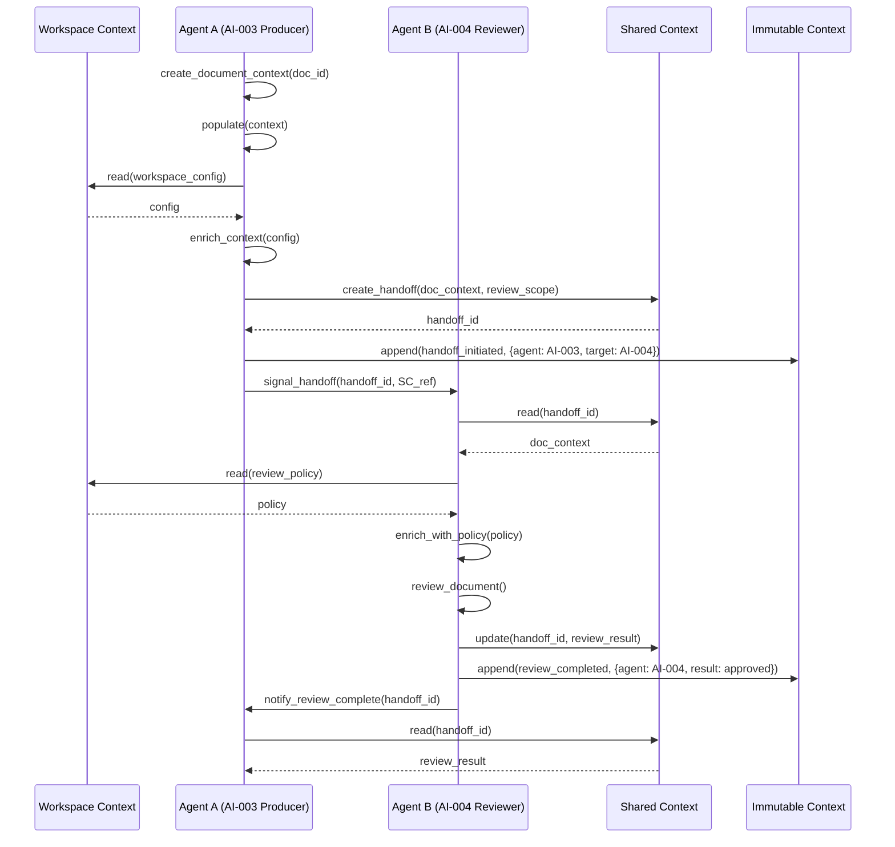

### 24.2 Example 2: Multi-Agent Orchestration

در این سناریو، Orchestrator یک workflow انتشار را بین چند Agent هماهنگ می‌کند.

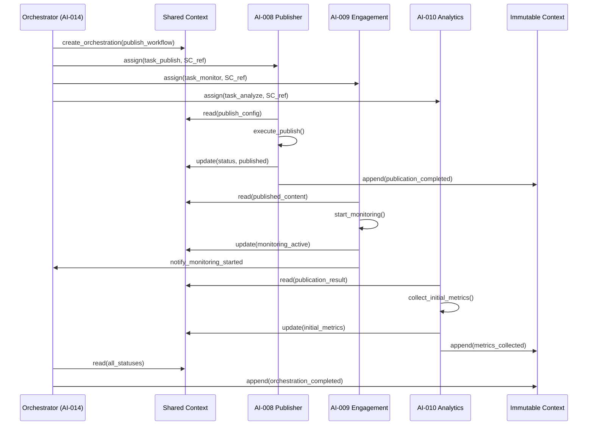

### 24.3 Example 3: Tool Execution with Context Isolation

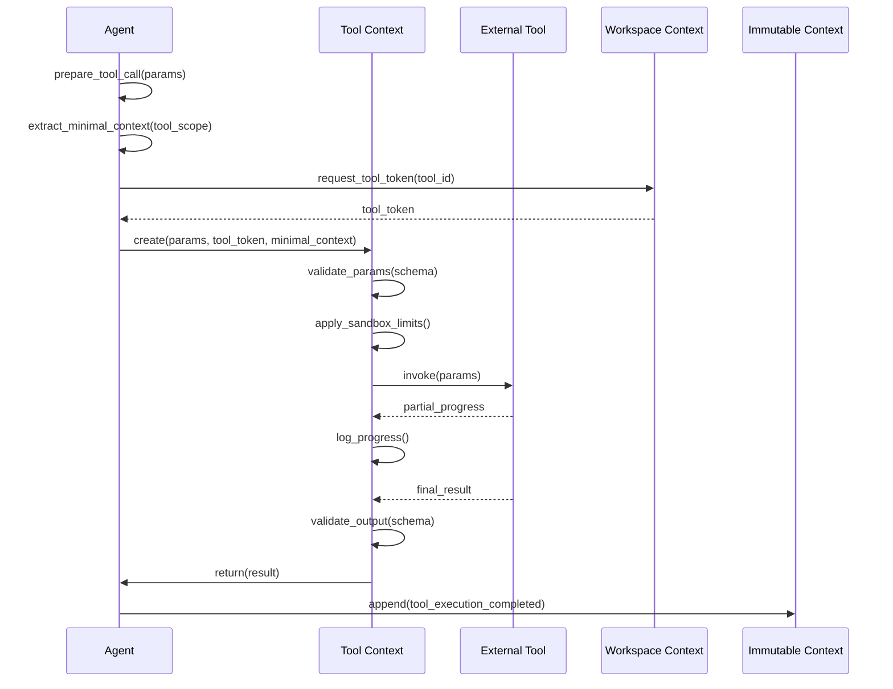

---

## 25. Cross-Reference Matrix

### 25.1 Context ↔ Architecture Documents

| سند                                                                  | بافت‌های مرتبط            | توضیح                                       |
| -------------------------------------------------------------------- | ------------------------- | ------------------------------------------- |
| [ARCH-001](../00-ARCHITECTURE/01-system-overview.md)                 | Global, Workspace         | نمای کلی سیستم — لایه‌های اجرایی            |
| [ARCH-010](../00-ARCHITECTURE/10-meta-architecture.md)               | همه انواع                 | معماری متا — سلسله‌مراتب لایه‌ها            |
| [ARCH-011](../00-ARCHITECTURE/11-object-model.md)                    | Document                  | مدل اشیاء — چرخه حیات سند                   |
| [ARCH-012](../00-ARCHITECTURE/12-knowledge-management-model.md)      | Memory                    | مدل مدیریت دانش                             |
| [AI-000](../40-AI-AGENTS/00-enterprise-ai-agent-architecture.md)     | Agent                     | معماری مادر Agentها — سطح اختیار A-0 تا A-4 |
| [AI-014](../40-AI-AGENTS/99-enterprise-ai-orchestrator.md)           | Shared, Immutable, Global | هماهنگ‌ساز سازمانی — مدیریت جریان بافت      |
| [AUT-000](../50-AUTOMATION/00-enterprise-automation-architecture.md) | Tool, Calculation         | معماری خودکارسازی — ابزار و محاسبات         |
| [PRM-000](../60-PROMPTS/00-enterprise-prompt-architecture.md)        | Conversation, Agent       | معماری پرامپت — بافت مکالمه و Agent         |
| [KNW-000](../70-KNOWLEDGE/00-enterprise-knowledge-architecture.md)   | Memory, Immutable         | معماری دانش — حافظه و ثبت                   |
| [KNW-502](../70-KNOWLEDGE/502-ai-reasoning-architecture.md)          | Calculation, Conversation | معماری استدلال — بافت محاسبه و مکالمه       |
| [KNW-503](../70-KNOWLEDGE/504-ai-memory-architecture.md)             | Memory                    | معماری حافظه — انواع و عملیات حافظه         |
| [DEPLOY-001](../15-DEPLOY/00-deployment-strategy.md)                 | Global                    | استراتژی استقرار — بافت سراسری              |

### 25.2 Context ↔ AI Agent

| Agent               | بافت‌های مصرفی                            | بافت‌های تولیدی              |
| ------------------- | ----------------------------------------- | ---------------------------- |
| AI-001 Strategy     | Global, Workspace, Memory                 | Document (Strategy)          |
| AI-002 Planning     | Global, Workspace, Memory, Document       | Document (Plan)              |
| AI-003 Production   | Workspace, Document, Memory, Tool         | Document (Content)           |
| AI-004 Review       | Document, Shared, Workspace               | Document (Review), Immutable |
| AI-005 SEO          | Document, Workspace, Global               | Document (SEO)               |
| AI-006 Media        | Document, Tool, Workspace                 | Document (Media)             |
| AI-007 Video        | Document, Tool, Workspace                 | Document (Video)             |
| AI-008 Publishing   | Document, Shared, Tool, Global            | Immutable, Shared            |
| AI-009 Engagement   | Conversation, Shared, Workspace           | Immutable, Conversation      |
| AI-010 Analytics    | Document, Shared, Memory, Workspace       | Document (Report), Immutable |
| AI-011 Knowledge    | Memory, Document, Shared, Workspace       | Memory, Document (Knowledge) |
| AI-012 Improvement  | Memory, Document, Shared, Immutable       | Document (Proposal), Shared  |
| AI-013 Research     | Memory, Conversation, Document, Tool      | Document (Research)          |
| AI-014 Orchestrator | Global, Workspace, Shared, Immutable, همه | Shared, Immutable, Global    |

### 25.3 Context ↔ Automation Workflow

| Workflow                 | بافت‌های کلیدی                    |
| ------------------------ | --------------------------------- |
| Content Production Chain | Agent, Document, Tool, Shared     |
| Publishing Pipeline      | Shared, Document, Tool, Immutable |
| Review & Approval        | Shared, Document, Immutable       |
| Community Response       | Conversation, Shared, Immutable   |
| Performance Reporting    | Memory, Document, Shared          |
| Knowledge Extraction     | Memory, Document, Immutable       |
| Research Investigation   | Memory, Conversation, Document    |

---

## 26. Architectural Decisions

### AD-001: Single Inheritance Model

| فیلد      | مقدار                                                                                                                   |
| --------- | ----------------------------------------------------------------------------------------------------------------------- |
| **شناسه** | AD-EXC-001                                                                                                              |
| **عنوان** | Single Inheritance Context Model                                                                                        |
| **زمینه** | بافت‌ها می‌توانند از سلسله‌مراتب ارث‌بری پیروی کنند. گزینه‌های Multiple Inheritance, Single Inheritance, No Inheritance |
| **تصمیم** | Single Inheritance با Selective Inheritance (INR-02)                                                                    |
| **دلیل**  | Multiple Inheritance پیچیدگی مدیریت تعارض را افزایش می‌دهد. No Inheritance باعث تکرار داده می‌شود.                      |
| **پیامد** | سلسله‌مراتب ساده، قابل ردیابی و قابل اعتبارسنجی                                                                         |
| **ارجاع** | بخش ۱۷ — Context Inheritance Model                                                                                      |
| **تاریخ** | 2026-07-01                                                                                                              |

### AD-002: Immutable Append-Only for Audit

| فیلد      | مقدار                                                             |
| --------- | ----------------------------------------------------------------- |
| **شناسه** | AD-EXC-002                                                        |
| **عنوان** | Immutable Context as Append-Only Audit Log                        |
| **زمینه** | نیاز به ذخیره‌سازی غیرقابل تغییر برای حسابرسی و شواهد             |
| **تصمیم** | Immutable Context فقط Append-Only است و پس از نوشتن تغییر نمی‌کند |
| **دلیل**  | یکپارچگی حسابرسی، قابلیت اثبات، تطابق با استانداردهای امنیتی      |
| **پیامد** | نیاز به Immutable Deletion Protocol (IDP) برای حذف با مجوز ویژه   |
| **ارجاع** | بخش ۱۳ — Immutable Context                                        |
| **تاریخ** | 2026-07-01                                                        |

### AD-003: Orchestrator as Global Context Owner

| فیلد      | مقدار                                                                         |
| --------- | ----------------------------------------------------------------------------- |
| **شناسه** | AD-EXC-003                                                                    |
| **عنوان** | AI Orchestrator as Single Owner of Global Context                             |
| **زمینه** | چه کسی مالک Global Context است؟                                               |
| **تصمیم** | AI Orchestrator (AI-014) تنها مالک Global Context است                         |
| **دلیل**  | Orchestrator بالاترین سطح اختیار (A-4) را دارد و هماهنگ‌کننده نهایی سیستم است |
| **پیامد** | همه Agentها Global Context را فقط خواندنی می‌بینند                            |
| **ارجاع** | بخش ۴ — Global Context                                                        |
| **تاریخ** | 2026-07-01                                                                    |

### AD-004: Copy-On-Write for Cross-Boundary Propagation

| فیلد      | مقدار                                             |
| --------- | ------------------------------------------------- |
| **شناسه** | AD-EXC-004                                        |
| **عنوان** | Copy-On-Write Default for Cross-Boundary Context  |
| **زمینه** | نحوه انتشار بافت بین مرزهای انزوا                 |
| **تصمیم** | استفاده از Copy-On-Write به عنوان مکانیزم پیش‌فرض |
| **دلیل**  | حفظ انزوای بافت مبدأ، جلوگیری از تغییرات ناخواسته |
| **پیامد** | سربار حافظه اضافی اما انزوای کامل                 |
| **ارجاع** | بخش ۱۵ — Context Propagation Model                |
| **تاریخ** | 2026-07-01                                        |

### AD-005: No Direct Memory Access for Tools

| فیلد      | مقدار                                                           |
| --------- | --------------------------------------------------------------- |
| **شناسه** | AD-EXC-005                                                      |
| **عنوان** | Tool Isolation from Memory Context                              |
| **زمینه** | آیا ابزارهای خارجی باید به حافظه Agent دسترسی داشته باشند؟      |
| **تصمیم** | ابزارها هیچ دسترسی به Memory Context ندارند                     |
| **دلیل**  | امنیت، حریم خصوصی، جلوگیری از نشت حافظه Agent به ابزارهای خارجی |
| **پیامد** | ابزارها فقط داده‌های صریحاً ارسال‌شده را می‌بینند               |
| **ارجاع** | بخش ۱۱ — Tool Context, بخش ۱۶ — Context Isolation Model         |
| **تاریخ** | 2026-07-01                                                      |

### AD-006: TTL-Based Expiry for All Mutable Contexts

| فیلد      | مقدار                                          |
| --------- | ---------------------------------------------- |
| **شناسه** | AD-EXC-006                                     |
| **عنوان** | Mandatory TTL for All Mutable Contexts         |
| **زمینه** | چه زمانی بافت‌ها باید منقضی شوند؟              |
| **تصمیم** | همه بافت‌های mutable دارای TTL اجباری هستند    |
| **دلیل**  | جلوگیری از انباشت بافت‌های منسوخ، مدیریت حافظه |
| **پیامد** | بافت‌های فعال باید قبل از انقضا تمدید شوند     |
| **ارجاع** | بخش ۱۴ — Context Lifecycle                     |
| **تاریخ** | 2026-07-01                                     |

---

## 27. Maturity Model

### 27.1 Context Architecture Maturity Levels

| سطح | نام       | توضیح                                   | معیار                                      |
| --- | --------- | --------------------------------------- | ------------------------------------------ |
| C0  | Ad-hoc    | بدون مدل بافت مشخص                      | Agentها از متغیرهای سراسری استفاده می‌کنند |
| C1  | Defined   | انواع بافت تعریف شده‌اند                | ۱۰ نوع بافت شناسایی‌شده                    |
| C2  | Managed   | چرخه حیات و انتشار مدیریت می‌شود        | Propagation Matrix فعال                    |
| C3  | Measured  | معیارهای عملکرد بافت اندازه‌گیری می‌شود | Metrics & Monitoring فعال                  |
| C4  | Optimized | بهینه‌سازی خودکار بافت                  | Self-tuning Context                        |

### 27.2 Current Assessment

| بعد           | وضعیت فعلی                   | سطح هدف |
| ------------- | ---------------------------- | ------- |
| Context Types | ✅ C2 (همه ۱۰ نوع تعریف شده) | C4      |
| Lifecycle     | ✅ C2 (مدل تعریف شده)        | C3      |
| Propagation   | ✅ C2 (ماتریس تعریف شده)     | C3      |
| Isolation     | ✅ C1 (سطح‌بندی شده)         | C3      |
| Security      | ✅ C1 (مدل امنیتی)           | C3      |
| Serialization | ✅ C1 (Schemaها)             | C2      |
| Caching       | ❌ C0 (تعریف‌نشده)           | C2      |
| Versioning    | ✅ C1 (SemVer)               | C3      |
| Monitoring    | ❌ C0                        | C2      |

### 27.3 Roadmap

| فاز   | هدف                                   | اسپرینت |
| ----- | ------------------------------------- | ------- |
| P7.S1 | تعریف مدل بافت (این سند)              | جاری    |
| P7.S2 | پیاده‌سازی Context Registry           | آینده   |
| P7.S3 | پیاده‌سازی Context Propagation Engine | آینده   |
| P7.S4 | پیاده‌سازی Context Monitoring         | آینده   |
| P7.S5 | بهینه‌سازی خودکار Context             | آینده   |

---

## 28. Gaps & Future Work

### 28.1 Identified Gaps

| Gap ID     | توضیح                                                                            | اولویت | راه حل پیشنهادی                |
| ---------- | -------------------------------------------------------------------------------- | ------ | ------------------------------ |
| GAP-EXC-01 | **Context Monitoring**: هیچ مکانیزم نظارت بر سلامت بافت تعریف نشده است           | بالا   | Context Health Checker         |
| GAP-EXC-02 | **Context Recovery**: مدل بازیابی بافت پس از Crash تعریف نشده است                | بالا   | Context Recovery Protocol      |
| GAP-EXC-03 | **Cross-Workspace Sharing**: سازوکار اشتراک محدود بین Workspaceها تعریف نشده است | متوسط  | Cross-Workspace Bridge Context |
| GAP-EXC-04 | **Context Compression**: فشرده‌سازی بافت برای انتقال با حجم بالا                 | متوسط  | Compression Layer              |
| GAP-EXC-05 | **Context Validation Plugins**: پلاگین‌های اعتبارسنجی سفارشی                     | کم     | Plugin Architecture            |
| GAP-EXC-06 | **Context Referral Model**: ارجاع غیرمستقیم به جای کپی                           | کم     | Lazy Context Reference         |
| GAP-EXC-07 | **Context Governance Integration**: ادغام با GOV-001 تا GOV-005                  | متوسط  | Context Governance Policy      |

### 28.2 Future Work

| حوزه                  | توضیح                                                  | زمان‌بندی |
| --------------------- | ------------------------------------------------------ | --------- |
| Context Registry      | پیاده‌سازی رجیستری مرکزی برای ردیابی همه بافت‌های فعال | P7.S2     |
| Context Visualization | ابزار بصری برای مشاهده جریان بافت در زمان واقعی        | P7.S3     |
| Context Analytics     | تحلیل الگوهای استفاده از بافت برای بهینه‌سازی          | P7.S4     |
| Context Simulation    | شبیه‌سازی سناریوهای انتشار بافت                        | P7.S5     |
| Auto-Scaling Context  | مقیاس‌گذاری خودکار بر اساس حجم بافت                    | P8        |

### 28.3 Integration Roadmap

| سند                           | وضعیت ادغام     | برنامه |
| ----------------------------- | --------------- | ------ |
| Integration with AI-014       | تعریف‌شده       | P7.S2  |
| Integration with AUT-000      | تعریف‌شده       | P7.S3  |
| Integration with PRM-901..907 | تعریف‌شده       | P7.S2  |
| Integration with KNW-503      | تعریف‌شده       | P7.S4  |
| Integration with GOV-001..005 | برنامه‌ریزی‌شده | P7.S5  |

---

## 29. Glossary

| اصطلاح                          | تعریف                                                                                |
| ------------------------------- | ------------------------------------------------------------------------------------ |
| **بافت (Context)**              | مجموعه‌ای از داده‌های ساختاریافته که وضعیت یک مؤلفه یا تعامل را در SMOS توصیف می‌کند |
| **انتشار (Propagation)**        | فرآیند انتقال بافت از یک مؤلفه به مؤلفه دیگر                                         |
| **انزوا (Isolation)**           | مرز محافظتی که دسترسی به بافت را محدود می‌کند                                        |
| **ارث‌بری (Inheritance)**       | مکانیزم انتقال subset بافت والد به بافت فرزند                                        |
| **تغییرناپذیری (Immutability)** | ویژگی بافتی که پس از ایجاد قابل تغییر نیست                                           |
| **چرخه حیات (Lifecycle)**       | مجموعه مراحل قابل پیش‌بینی که یک بافت از ایجاد تا نابودی طی می‌کند                   |
| **سریال‌سازی (Serialization)**  | تبدیل بافت به فرمت قابل انتقال                                                       |
| **اعتبارسنجی (Validation)**     | بررسی انطباق بافت با Schema و قوانین                                                 |
| **Sandbox**                     | محیط ایزوله برای اجرای ابزارها با محدودیت‌های منابع                                  |
| **Copy-On-Write**               | مکانیزم کپی بافت در لحظه نوشتن برای حفظ انزوای مبدأ                                  |

---

## 30. Statistics

### آمار SMOS-703

| شاخص                          | مقدار |
| ----------------------------- | ----- |
| تعداد انواع بافت              | ۱۰    |
| تعداد اصول معماری             | ۱۲    |
| تعداد مراحل چرخه حیات         | ۸     |
| تعداد سطوح انزوا              | ۵     |
| تعداد مکانیزم‌های انتشار      | ۶     |
| تعداد قواعد ارث‌بری           | ۶     |
| تعداد قواعد تغییر             | ۱۰    |
| تعداد سطوح امنیتی             | ۴     |
| تعداد JSON Schemaها           | ۶     |
| تعداد Mermaid Diagramها       | ۴     |
| تعداد تصمیمات معماری          | ۶     |
| تعداد Gapهای شناسایی‌شده      | ۷     |
| تعداد نگاشت‌های Agent         | ۱۴    |
| تعداد Architectural Decisions | ۶     |

---

## 31. Change Log

| نسخه        | تاریخ      | تغییر                                                                                                                                                                                                                                                                                                                                                                                                           | توسط        |
| ----------- | ---------- | --------------------------------------------------------------------------------------------------------------------------------------------------------------------------------------------------------------------------------------------------------------------------------------------------------------------------------------------------------------------------------------------------------------- | ----------- |
| 1.0.0-draft | 2026-07-01 | نگارش اولیه — مدل بافت اجرایی SMOS-703. ۳۱ بخش, ۶ JSON Schema (Draft-07), ۴ Mermaid Diagram. ۱۰ نوع بافت: Global, Workspace, Agent, Conversation, Calculation, Document, Memory, Tool, Shared, Immutable. چرخه حیات ۸ مرحله‌ای, ۶ مکانیزم انتشار, ۵ سطح انزوا, مدل ارث‌بری تک‌والدی, ماتریس تغییرات, مدل امنیتی ۴ لایه, تصمیمات معماری (AD-EXC-001 تا AD-EXC-006). بخش‌های Gaps & Future Work و Maturity Model. | معمار سیستم |
