# SMOS-704 — معماری هماهنگ‌سازی گردش کار (Workflow Orchestration Architecture)

> **شناسه:** SMOS-704
> **وضعیت:** پیش‌نویس
> **نسخه:** 1.0.0-draft
> **خانواده:** EXEC
> **دامنه:** EXD-04
> **نوع:** Orchestration Architecture
> **تاریخ:** 2026-07-01
> **مسئول:** معمار اجرای سیستم
> **SSOT:** ✅ بله — تک منبع حقیقت معماری هماهنگ‌سازی گردش کار
> **وابستگی:** SMOS-701, SMOS-702, SMOS-703, AUT-000, AUT-001, AI-014, KNW-000, KNW-502, PRM-000, PRM-901, PRM-902, PRM-903, PRM-904, PRM-905, PRM-906, PRM-907
> **مخاطب:** system-architect, ai-orchestrator, workflow-engineer, automation-engineer, agent-developer

---

## ۱. کنترل سند (Document Control)

| بخش                | مقدار                               |
| ------------------ | ----------------------------------- |
| شناسه سند          | SMOS-704                            |
| عنوان              | Workflow Orchestration Architecture |
| فاز                | P7.S01 — Execution Architecture     |
| نسخه               | v1.0.0-draft                        |
| وضعیت              | Draft                               |
| مسئول              | معمار اجرای سیستم                   |
| تاریخ ایجاد        | 2026-07-01                          |
| تاریخ بازبینی بعدی | P7.S03                              |
| سطح اختیار         | A-4 (Enterprise)                    |
| دامنه              | EXD-04 — Orchestration              |
| زبان روایت         | فارسی                               |
| زبان شناسه‌ها      | انگلیسی                             |

### ۱.۱ تاریخچه نسخه

| نسخه        | تاریخ      | تغییرات                                                                    | توسط        |
| ----------- | ---------- | -------------------------------------------------------------------------- | ----------- |
| 1.0.0-draft | 2026-07-01 | نگارش اولیه — ۱۲ الگوی هماهنگ‌سازی، ۲۸+ بخش، ۶ Schema، ۲۰+ Mermaid Diagram | معمار سیستم |

### ۱.۲ واژگان کلیدی

| اصطلاح              | تعریف                                                             |
| ------------------- | ----------------------------------------------------------------- |
| **Workflow**        | یک گردش کار متشکل از یک یا چند Step که با ترتیب مشخص اجرا می‌شوند |
| **Step**            | واحد اجرایی کوچک‌ترین جزء یک Workflow                             |
| **Orchestration**   | هماهنگی و مدیریت اجرای Stepها با رعایت وابستگی‌ها و قواعد         |
| **Compensation**    | عملیات جبرانی برای بازگردانی اثر یک Step ناموفق                   |
| **Saga**            | الگوی تراکنش توزیع‌شده با جبران‌پذیری                             |
| **Checkpoint**      | نقطه ذخیره وضعیت برای قابلیت بازیابی                              |
| **Circuit Breaker** | الگوی قطع خودکار برای جلوگیری از خطای آبشاری                      |

---

## ۲. هدف و دامنه (Purpose & Scope)

### ۲.۱ هدف

SMOS-704 معماری هماهنگ‌سازی گردش کار سازمانی SMOS را تعریف می‌کند. این سند مشخص می‌کند که Workflowها چگونه با یکدیگر ترکیب می‌شوند، چگونه به صورت ترتیبی، موازی، سلسله‌مراتبی، شرطی و پویا اجرا می‌شوند، و چگونه خطاها، زمان‌های انتظار، تلاش مجدد و جبران مدیریت می‌شوند.

اهداف اصلی:

1. **تعریف ۱۲ الگوی هماهنگ‌سازی** شامل Sequential, Parallel, Hierarchical, Nested, Conditional, Dynamic, Human Approval, Rollback, Timeout, Retry, Checkpoint, Saga
2. **ارائه مدل ترکیب Workflow** — قواعد ترکیب الگوها در یک Workflow مرکب
3. **ارائه مدل خطا و بازیابی** — نحوه مدیریت شکست در هر الگو
4. **ارائه مدل ممیزی** — ثبت و ردیابی کامل هر orchestration
5. **تعریف ۶ Schema JSON (Draft-07)** برای مهم‌ترین الگوها

### ۲.۲ درون دامنه (In Scope)

| حوزه                        | توضیح                            |
| --------------------------- | -------------------------------- |
| ۱۲ الگوی هماهنگ‌سازی        | تعریف، حالت، دیاگرام، مثال       |
| معماری Orchestration Engine | مؤلفه‌ها، اتصالات، دیاگرام       |
| مدل حالت Workflow           | وضعیت‌های هر الگو                |
| مدل خطا و بازیابی           | استراتژی‌های خطا به ازای هر الگو |
| مدل ممیزی                   | ثبت رویدادهای orchestration      |
| Schemaهای JSON              | تعاریف رسمی برای ۶ الگو          |
| قواعد ترکیب Workflow        | ترکیب مجاز الگوها                |
| کاتالوگ Workflowها          | نگاشت به AUT-NNN                 |
| مثال‌های orchestration      | سناریوهای واقعی SMOS             |

### ۲.۳ برون دامنه (Out of Scope)

| حوزه                                | دلیل                               |
| ----------------------------------- | ---------------------------------- |
| پیاده‌سازی کد                       | حوزه پیاده‌سازی فنی                |
| Orchestration Engine پیاده‌سازی شده | حوزه اجرایی                        |
| Workflowهای خاص AUT-NNN             | حوزه AUT-001 و AUT-NNN             |
| جزئیات زبان برنامه‌نویسی            | خنثی‌بودن فناوری                   |
| زیرساخت صف و Broker                 | حوزه SMOS-705 و Event Architecture |

---

## ۳. اصول معماری هماهنگ‌سازی (Orchestration Architecture Principles)

| #      | اصل                                          | توضیح                                                                      | پیامد نقض                            |
| ------ | -------------------------------------------- | -------------------------------------------------------------------------- | ------------------------------------ |
| ORP-01 | **جداسانی مسئولیت (Separation of Concerns)** | هر Workflow یک وظیفه مشخص دارد و نباید چند مسئولیت را همزمان مدیریت کند.   | Workflowهای پیچیده و غیرقابل نگهداری |
| ORP-02 | **ترکیب‌پذیری (Composability)**              | هر Workflow باید بتواند به عنوان زیرواحد Workflow دیگر عمل کند.            | بازطراحی مکرر و دوباره‌کاری          |
| ORP-03 | **جبران‌پذیری (Compensatability)**           | هر Workflow باید قابلیت جبران (Rollback) داشته باشد.                       | ناتوانی در بازیابی از خطاهای جزئی    |
| ORP-04 | **تعیین‌کنندگی (Determinism)**               | خروجی Workflow برای ورودی یکسان باید همواره یکسان باشد.                    | غیرقابل پیش‌بینی بودن سیستم          |
| ORP-05 | **شفافیت (Observability)**                   | وضعیت هر Step در هر لحظه قابل مشاهده است.                                  | ناتوانی در دیباگ و عیب‌یابی          |
| ORP-06 | **بازیابی‌پذیری (Recoverability)**           | هر Workflow قابلیت بازیابی از Checkpoint را دارد.                          | از دست دادن پیشرفت در خطا            |
| ORP-07 | **مرز مشخص (Bounded Context)**               | هر Workflow در یک زمینه مشخص اجرا می‌شود و به Contextهای دیگر نشت نمی‌کند. | تداخل داده و حالت                    |
| ORP-08 | **اختیارمند (Authority-Aware)**              | هر Workflow سطح اختیار مشخصی دارد و نمی‌تواند از آن فراتر رود.             | نقض حکمرانی SMOS                     |
| ORP-09 | **انعطاف‌پذیری (Elasticity)**                | Workflowها می‌توانند در پاسخ به بار یا خطا مقیاس‌دهی شوند.                 | تنگنای عملکردی                       |
| ORP-10 | **ضدآسیب‌پذیری (Anti-Fragility)**            | Workflowها باید از خطاها بیاموزند و قوی‌تر شوند.                           | تکرار خطاهای مشابه                   |
| ORP-11 | **تک‌منبع حقیقت (SSOT)**                     | هر Workflow دقیقاً یک منبع حقیقت برای وضعیت خود دارد.                      | ناهماهنگی وضعیت                      |
| ORP-12 | **حکمرانی پیش‌فرض (Governance by Default)**  | همه Workflowها تابع قواعد حکمرانی AUT-000 و CON-000 هستند.                 | نقض استانداردهای سازمانی             |

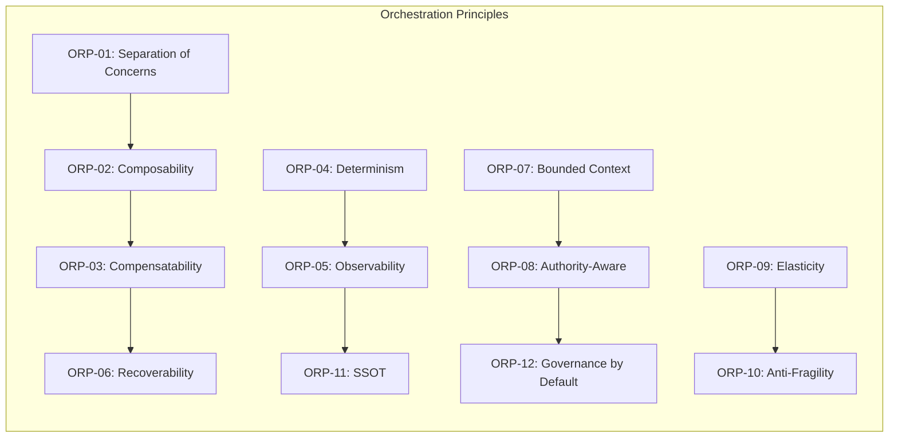

---

## ۴. اجرای ترتیبی (Sequential Execution)

### ۴.۱ تعریف

در الگوی اجرای ترتیبی، Stepها یکی پس از دیگری و به ترتیب مشخص اجرا می‌شوند. هر Step پس از اتمام موفق Step قبلی آغاز می‌شود. این الگو ساده‌ترین و بنیادی‌ترین الگوی هماهنگ‌سازی است.

**مشخصات:**

- ترتیب اجرا: خطی و ثابت
- وابستگی: هر Step به Step قبلی وابسته است
- خطا: شکست هر Step کل Workflow را متوقف می‌کند
- کاربرد: پردازش‌های خطی مانند تولید محتوا→بازبینی→انتشار

### ۴.۲ مدل حالت (State Model)

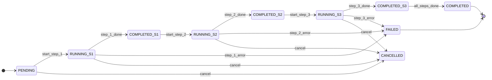

### ۴.۳ دیاگرام اجرا

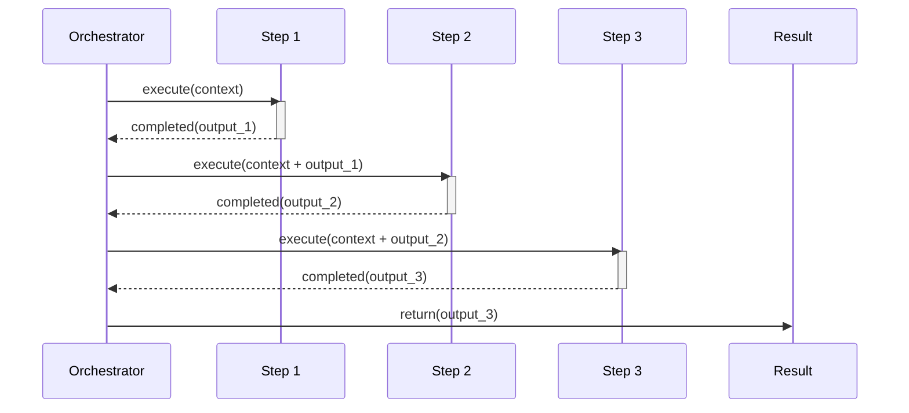

### ۴.۴ مثال SMOS: خط لوله تولید و انتشار محتوا

یک Workflow ترتیبی شامل:

1. **Step 1** — AI-003 تولید محتوای متعارف
2. **Step 2** — AI-004 بازبینی و تضمین کیفیت
3. **Step 3** — AI-008 انتشار و توزیع

هر Step خروجی خود را به Step بعدی منتقل می‌کند. اگر Step 2 شکست بخورد (Rejected)، کل Workflow به حالت Failed می‌رود و به AI-014 گزارش می‌دهد.

---

## ۵. اجرای موازی (Parallel Execution)

### ۵.۱ تعریف

در الگوی اجرای موازی، چندین Step به صورت همزمان اجرا می‌شوند. این الگو از دو مرحله تشکیل شده است: **Fork** (شاخه‌شدن) و **Join** (پیوستن). پس از اتمام همه شاخه‌ها، Workflow ادامه می‌یابد.

**مشخصات:**

- Fork: یک Step به چند Step موازی تقسیم می‌شود
- Join: همه شاخه‌ها باید کامل شوند تا Workflow ادامه یابد
- خطا: می‌تواند خطای یک شاخه را تحمل کند (بسته به خط‌مشی)
- کاربرد: تولید همزمان محتوا برای چند پلتفرم

### ۵.۲ مدل حالت

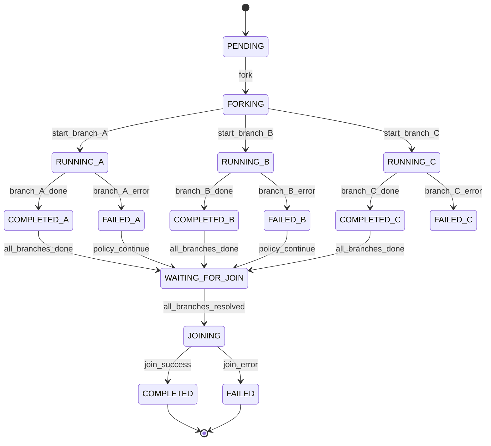

### ۵.۳ دیاگرام Fork/Join

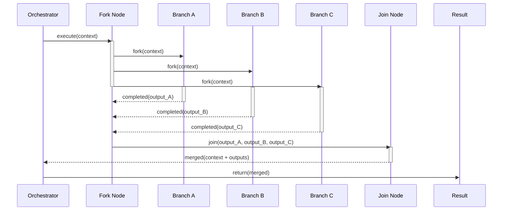

### ۵.۴ مثال SMOS: تطبیق محتوا برای چند پلتفرم

پس از تولید محتوای متعارف توسط AI-003، Workflow به سه شاخه موازی تقسیم می‌شود:

1. **شاخه A** — PRM-207 تطبیق قالب برای اینستاگرام
2. **شاخه B** — PRM-207 تطبیق قالب برای لینکدین
3. **شاخه C** — PRM-207 تطبیق قالب برای تلگرام

پس از اتمام همه شاخه‌ها، Join انجام می‌شود و بسته انتشار کامل به AI-008 تحویل داده می‌شود.

---

## ۶. اجرای سلسله‌مراتبی (Hierarchical Execution)

### ۶.۱ تعریف

در الگوی سلسله‌مراتبی، یک Workflow پدر (Parent) می‌تواند Workflowهای فرزند (Child) را فراخوانی کند. Parent کنترل کاملی بر فرزندان دارد — می‌تواند آن‌ها را متوقف، لغو یا اولویت‌بندی کند.

**مشخصات:**

- Parent مسئول چرخه حیات Child است
- Childها مرز Context والد را به ارث می‌برند
- خطای Child می‌تواند توسط Parent مدیریت یا به والد بالاتر ارسال شود
- کاربرد: Orchestration سطح سازمانی توسط AI-014

### ۶.۲ دیاگرام سلسله‌مراتبی

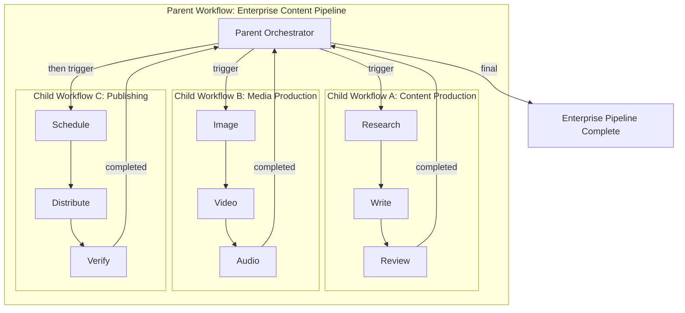

### ۶.۳ مدل تعامل Parent-Child

```mermaid
sequenceDiagram
    participant P as Parent Orchestrator
    participant CA as Child Workflow A
    participant CB as Child Workflow B
    participant CC as Child Workflow C

    P->>CA: spawn(context, authority)
    activate CA
    note over CA: Executing...
    CA-->>P: completed(output_A)
    deactivate CA

    P->>CB: spawn(context + output_A)
    activate CB
    note over CB: Executing...
    CB-->>P: completed(output_B)
    deactivate CB

    alt success
        P->>CC: spawn(context + output_B)
        activate CC
        note over CC: Executing...
        CC-->>P: completed(output_C)
        deactivate CC
        P-->>P: finalize(success)
    else child_failure
        CB-->>P: failed(error)
        deactivate CB
        P->>CA: compensate()
        activate CA
        CA-->>P: compensated
        deactivate CA
        P-->>P: finalize(failure, compensated)
    end
```

### ۶.۴ مثال SMOS: خط لوله سازمانی AI-014

AI-014 به عنوان Parent Orchestrator:

1. **Child A** — AI-011 مدیریت دانش (بازیابی دانش)
2. **Child B** — AI-001 استراتژی محتوا (برنامه‌ریزی)
3. **Child C** — AI-002 برنامه‌ریزی محتوا (تقویم)
4. **Child D** — AI-003 تولید محتوا (اجرا)

AI-014 پس از اتمام هر Child تصمیم می‌گیرد که Child بعدی را شروع کند یا مسیر جایگزین را انتخاب نماید.

---

## ۷. گردش‌های کاری تو در تو (Nested Workflows)

### ۷.۱ تعریف

در الگوی Nested، یک Workflow می‌تواند درون Step یک Workflow دیگر به عنوان **زیرگردش‌کار (Sub-workflow)** اجرا شود. تفاوت با Hierarchical در این است که Parent از وجود Sub-workflow به عنوان یک Step آگاه است و Sub-workflow یک خروجی مشخص به Parent برمی‌گرداند.

**مشخصات:**

- Sub-workflow به عنوان یک Step抽象 در Parent دیده می‌شود
- Sub-workflow یک ورودی دریافت و یک خروجی برمی‌گرداند
- Parent منتظر می‌ماند تا Sub-workflow کامل شود
- Sub-workflow می‌تواند خود شامل Sub-workflowهای دیگری باشد (تودرتو)

### ۷.۲ دیاگرام Nested Workflow

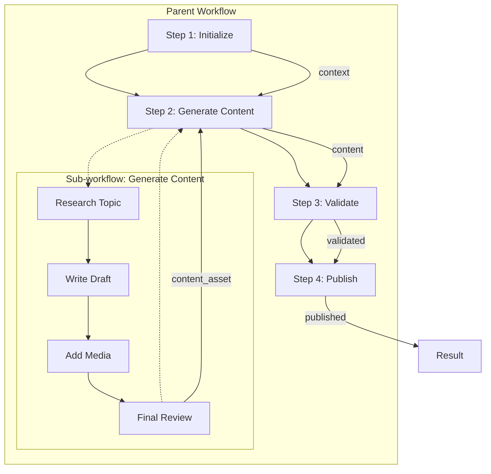

### ۷.۳ مدل تعامل Nesting

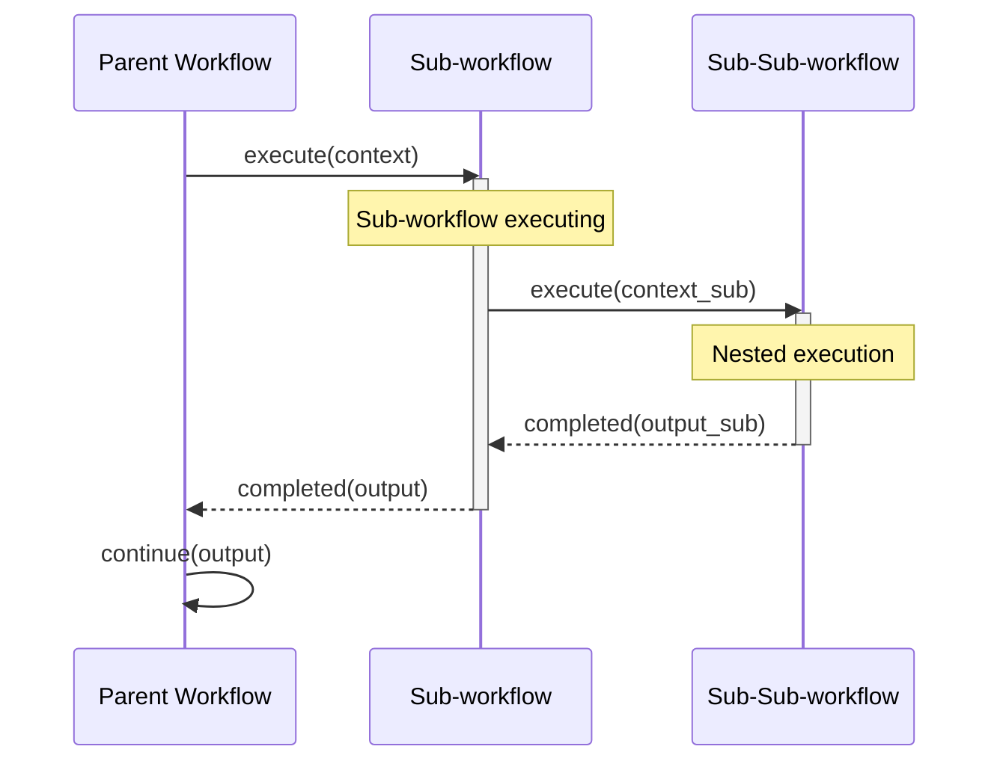

### ۷.۴ مثال SMOS: Sub-workflow تأیید انتشار

در Workflow انتشار (AUT-XXX)، Step "Platform Approval" یک Sub-workflow است که خود شامل:

1. اعتبارسنجی انطباق پلتفرمی (PRM-305)
2. بررسی محدودیت‌های محتوایی پلتفرم
3. تأیید نهایی توسط Sub-workflow انسانی (در صورت نیاز)

---

## ۸. گردش‌های کاری شرطی (Conditional Workflows)

### ۸.۱ تعریف

در الگوی شرطی، مسیر اجرا بر اساس نتیجه یک **گره تصمیم (Decision Node)** تعیین می‌شود. هر Decision Node یک شرط را ارزیابی می‌کند و بر اساس نتیجه، Step بعدی را انتخاب می‌کند.

**مشخصات:**

- Decision Node یک عبارت بولی یا چندمقداری را ارزیابی می‌کند
- هر مسیر خروجی یک Step مشخص است
- می‌تواند مسیر پیش‌فرض (Default) داشته باشد
- کاربرد: تصمیم‌گیری بر اساس کیفیت محتوا، نوع پلتفرم، سطح اختیار

### ۸.۲ دیاگرام شرطی

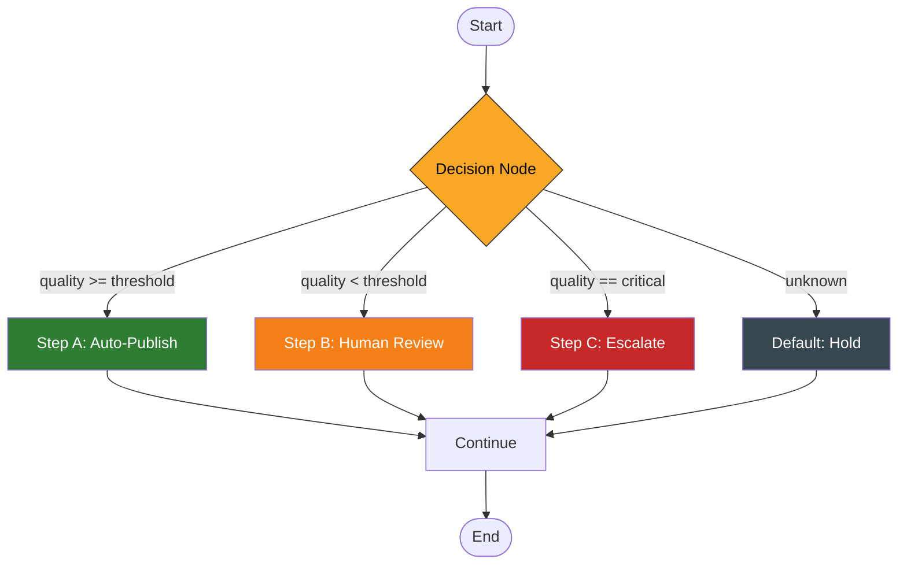

### ۸.۳ مدل حالت شرطی

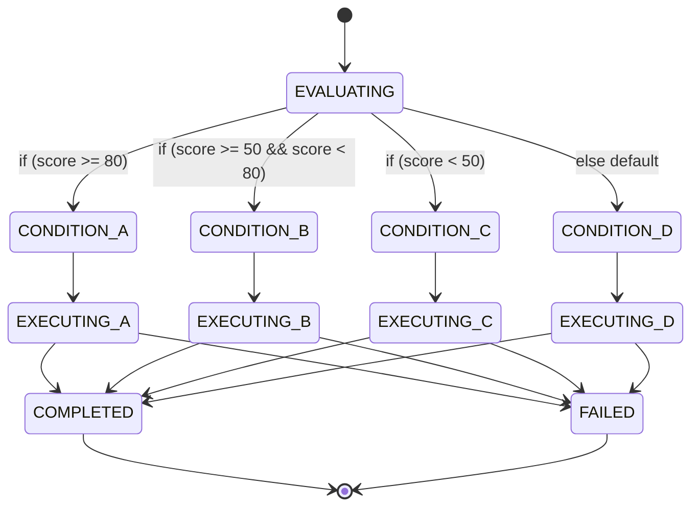

### ۸.۴ مثال SMOS: مسیر کیفیت محتوا

پس از بازبینی توسط AI-004:

- **Score ≥ 80** → مسیر مستقیم به AI-008 برای انتشار خودکار
- **Score ≥ 50** → مسیر بازبینی انسانی (Human Review)
- **Score < 50** → مسیر بازگشت به AI-003 برای بازتولید
- **Score == Critical** → مسیر ارجاع به AI-014 و Human Escalation

---

## ۹. گردش‌های کاری پویا (Dynamic Workflows)

### ۹.۱ تعریف

در الگوی پویا، ساختار Workflow در زمان اجرا و بر اساس ورودی‌ها و بافت جاری تعیین می‌شود. برخلاف Workflowهای ایستا که از پیش تعریف شده‌اند، Workflow پویا می‌تواند Stepهای جدید ایجاد کند، مسیرها را تغییر دهد یا Stepها را حذف کند.

**مشخصات:**

- ترکیب در زمان اجرا (Runtime Composition)
- تطبیق با بافت و داده‌های ورودی
- قابلیت افزودن Stepهای جدید به صورت پویا
- نیازمند Orchestrator هوشمند (AI-014)

### ۹.۲ دیاگرام ترکیب پویا

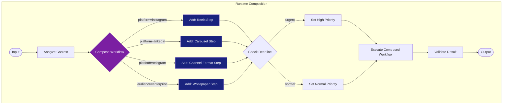

### ۹.۳ مدل تعامل Dynamic Composition

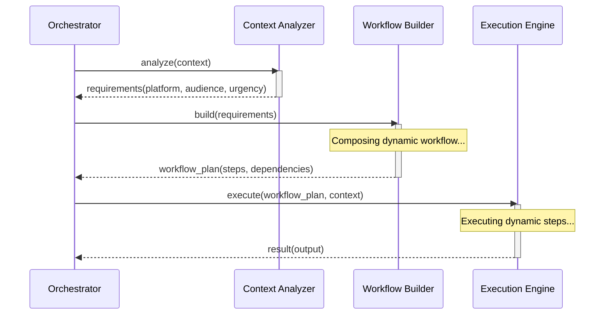

### ۹.۴ مثال SMOS: خط لوله انتشار چندپلتفرمی پویا

AI-014 یک درخواست انتشار دریافت می‌کند. بر اساس بافت:

- **پلتفرم‌های هدف:** اینستاگرام + لینکدین
- **نوع محتوا:** ویدئو
- **مخاطب:** B2B

Workflow پویا شامل:

1. AI-003 تولید محتوای متعارف
2. AI-007 تولید ویدئو (به دلیل نوع محتوا = ویدئو)
3. شاخه موازی: تطبیق برای اینستاگرام (Reels) و لینکدین (Video)
4. AI-008 انتشار در دو پلتفرم
5. AI-009 تعامل با جامعه (فقط در صورت بازخورد)

---

## ۱۰. گردش‌های کاری تأیید انسانی (Human Approval Workflows)

### ۱۰.۱ تعریف

الگوی Human Approval یک مکان در Workflow ایجاد می‌کند که اجرا متوقف می‌شود و منتظر تأیید، رد یا بازبینی توسط انسان می‌ماند. این الگو پل بین Automation و Human است.

**مشخصات:**

- Pause: Workflow در نقطه مشخص متوقف می‌شود
- Approve: Workflow با خروجی تعیین‌شده ادامه می‌یابد
- Reject: Workflow به حالت Failed یا Revision می‌رود
- Escalate: درخواست به انسان سطح بالاتر ارسال می‌شود
- Timeout: در صورت عدم پاسخ انسان، مسیر پیش‌فرض اجرا می‌شود

### ۱۰.۲ دیاگرام Human Approval

```mermaid
stateDiagram-v2
    direction TB
    [*] --> PENDING
    PENDING --> RUNNING
    RUNNING --> AWAITING_APPROVAL : human_approval_required

    AWAITING_APPROVAL --> APPROVED : approve
    AWAITING_APPROVAL --> REJECTED : reject
    AWAITING_APPROVAL --> REVISION_REQUESTED : request_revision
    AWAITING_APPROVAL --> ESCALATED : escalate
    AWAITING_APPROVAL --> TIMEOUT : deadline_exceeded

    APPROVED --> CONTINUE
    REJECTED --> COMPENSATING
    REVISION_REQUESTED --> REVISING
    ESCALATED --> AWAITING_APPROVAL_2

    AWAITING_APPROVAL_2 --> APPROVED_2 : approve
    AWAITING_APPROVAL_2 --> REJECTED_2 : reject

    COMPENSATING --> COMPENSATED
    COMPENSATED --> FAILED
    REVISING --> RUNNING
    CONTINUE --> COMPLETED
    TIMEOUT --> CONTINUE : auto_approve
    TIMEOUT --> COMPENSATING : auto_reject

    COMPLETED --> [*]
    FAILED --> [*]

    style AWAITING_APPROVAL fill:#ff8f00,color:#000
    style AWAITING_APPROVAL_2 fill:#ff8f00,color:#000
    style APPROVED fill:#2e7d32,color:#fff
    style REJECTED fill:#c62828,color:#fff
```

### ۱۰.۳ دیاگرام توالی تأیید انسانی

```mermaid
sequenceDiagram
    participant W as Workflow
    participant O as Orchestrator
    participant H as Human Operator
    participant E as Escalation Manager

    W->>O: approval_required(context, payload)
    activate O

    O->>O: pause_workflow()
    O->>H: notify_approval(workflow_id, payload, deadline)
    activate H

    alt approve
        H-->>O: approve(workflow_id, comment)
        deactivate H
        O->>W: resume(approved, comment)
        deactivate O

    else reject
        H-->>O: reject(workflow_id, reason)
        deactivate H
        O->>W: compensate(reason)
        deactivate O

    else request_revision
        H-->>O: revision_request(workflow_id, feedback)
        deactivate H
        O->>W: revise(feedback)
        deactivate O

    else escalate
        H-->>O: escalate(workflow_id)
        deactivate H
        O->>E: escalate_to_supervisor(workflow_id)
        activate E
        E-->>O: supervisor_decision(decision)
        deactivate E
        O->>W: resume(decision)

    else timeout
        H--xO: timeout
        O->>W: auto_approve(default_policy)
        deactivate O
    end
```

### ۱۰.۴ مثال SMOS: تأیید محتوای بحرانی

یک محتوای استراتژیک (مثلاً بیانیه رسمی شرکت) نیازمند تأیید انسانی است:

1. AI-003 محتوا را تولید می‌کند
2. AI-004 محتوا را بازبینی می‌کند (Score = ۸۵، ولی نوع = "بیانیه رسمی")
3. Workflow در حالت AWAITING_APPROVAL قرار می‌گیرد
4. به مدیر بازاریابی اعلان ارسال می‌شود
5. مدیر تأیید می‌کند → Workflow ادامه می‌یابد
6. اگر مدیر ظرف ۲۴ ساعت پاسخ ندهد → به مدیر ارشد ارجاع می‌شود (Escalation)

---

## ۱۱. مدل بازگشت (Rollback Model)

### ۱۱.۱ تعریف

الگوی Rollback امکان بازگشت اثر یک یا چند Step را فراهم می‌کند. این الگو مبتنی بر **جبران (Compensation)** است — برای هر Step یک عملیات جبرانی تعریف می‌شود که در صورت نیاز اجرا می‌گردد.

**مشخصات:**

- هر Step می‌تواند یک Compensation Handler داشته باشد
- Rollback می‌تواند جزئی (یک Step) یا کامل (کل Workflow) باشد
- ترتیب جبران برعکس ترتیب اجراست (LIFO)
- کاربرد: خطا در مراحل پایانی، رد انسانی، نقض محدودیت

### ۱۱.۲ دیاگرام Rollback با جبران

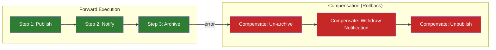

### ۱۱.۳ مدل حالت Compensation

```mermaid
stateDiagram-v2
    direction TB
    [*] --> EXECUTING
    EXECUTING --> COMPLETED : success
    EXECUTING --> COMPENSATING : failure / rejection

    state COMPENSATING {
        [*] --> COMPENSATE_S3
        COMPENSATE_S3 --> COMPENSATE_S2 : done
        COMPENSATE_S2 --> COMPENSATE_S1 : done
        COMPENSATE_S1 --> COMPENSATED : all_done
    end

    COMPENSATED --> ROLLED_BACK
    ROLLED_BACK --> [*]

    COMPENSATING --> COMPENSATION_FAILED : error during rollback
    COMPENSATION_FAILED --> MANUAL_RECOVERY_REQUIRED
    MANUAL_RECOVERY_REQUIRED --> [*]

    COMPLETED --> [*]

    style COMPENSATING fill:#e65100,color:#fff
    style COMPENSATION_FAILED fill:#b71c1c,color:#fff
    style MANUAL_RECOVERY_REQUIRED fill:#880e4f,color:#fff
```

### ۱۱.۴ مثال SMOS: جبران انتشار ناقص

اگر انتشار در پلتفرم سوم (مثلاً آپارات) شکست بخورد:

1. **Compensation Step 1:** محتوای منتشرشده در یوتیوب را حذف کن (Unpublish)
2. **Compensation Step 2:** اعلان‌های ارسال‌شده را لغو کن (Withdraw)
3. **Compensation Step 3:** وضعیت محتوا را به Draft برگردان

---

## ۱۲. مدل زمان انتظار (Timeout Model)

### ۱۲.۱ تعریف

الگوی Timeout محدودیت زمانی برای اجرای یک Step یا کل Workflow تعیین می‌کند. اگر Step در مهلت مقرر کامل نشود، Timeout Handler فعال می‌شود.

**مشخصات:**

- **Deadline:** مهلت نهایی برای اتمام Workflow
- **TTL (Time To Live):** حداکثر زمان حیات یک Step
- **Per-Step Timeout:** زمان انتظار مجزا برای هر Step
- **Escalation Policy:** سیاست افزایش در صورت Timeout

### ۱۲.۲ دیاگرام Timeout

```mermaid
sequenceDiagram
    participant O as Orchestrator
    participant S as Step
    participant T as Timer
    participant E as Escalation Handler

    O->>S: execute(timeout=30s)
    O->>T: start_timer(30s)

    activate S
    activate T

    alt completes within timeout
        S-->>O: completed(output)
        deactivate S
        O->>T: cancel_timer()
        deactivate T
        O->>O: continue_workflow()

    else timeout exceeded
        T->>O: timeout(step_id)
        deactivate T
        O->>S: cancel()
        deactivate S

        alt retry available
            O->>E: handle_timeout(step_id, retry_count=1)
            activate E
            E-->>O: retry_policy(retry)
            deactivate E
            O->>S: retry(context, timeout=30s)

        else escalation
            O->>E: handle_timeout(step_id, escalate=true)
            activate E
            E-->>O: escalation_decision
            deactivate E
        end
    end
```

### ۱۲.۳ تنظیمات Timeout

| پارامتر               | نوع       | پیش‌فرض | توضیح                            |
| --------------------- | --------- | ------- | -------------------------------- |
| `defaultTimeout`      | Duration  | PT5M    | زمان انتظار پیش‌فرض برای هر Step |
| `maxTimeout`          | Duration  | PT1H    | حداکثر زمان انتظار مجاز          |
| `perStepTimeout`      | Duration  | —       | زمان انتظار اختصاصی Step         |
| `deadline`            | Timestamp | —       | مهلت نهایی Workflow              |
| `ttl`                 | Duration  | PT24H   | حداکثر طول عمر Workflow          |
| `escalationDelay`     | Duration  | PT5M    | تأخیر قبل از ارجاع Timeout       |
| `autoRetry`           | Boolean   | false   | تلاش مجدد خودکار پس از Timeout   |
| `maxRetriesOnTimeout` | Integer   | ۲       | حداکثر تلاش مجدد برای Timeout    |

---

## ۱۳. مدل تلاش مجدد (Retry Model)

### ۱۳.۱ تعریف

الگوی Retry امکان تکرار یک Step ناموفق را با استراتژی مشخص فراهم می‌کند. Retry می‌تواند با Backoff (تأخیر تدریجی)، حداکثر تعداد دفعات و Circuit Breaker ترکیب شود.

**مشخصات:**

- **Max Retries:** حداکثر تعداد تلاش مجدد
- **Backoff Strategy:** ثابت، تصاعدی، تصادفی
- **Retryable Errors:** خطاهای قابل تلاش مجدد
- **Non-Retryable Errors:** خطاهای غیرقابل تلاش مجدد
- **Circuit Breaker:** قطع خودکار پس از شکست‌های متوالی

### ۱۳.۲ دیاگرام Retry با Backoff

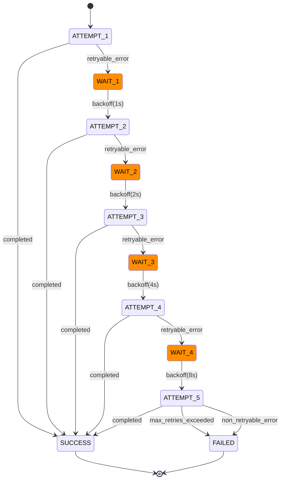

### ۱۳.۳ مدل Circuit Breaker

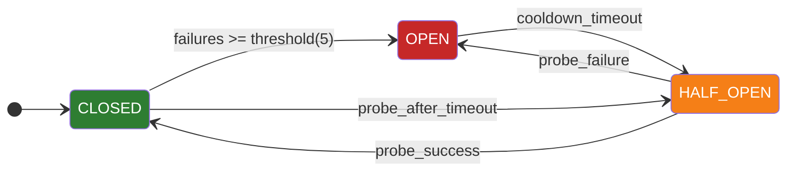

### ۱۳.۴ مثال SMOS: Retry در انتشار پلتفرم

هنگام انتشار در اینستاگرام:

1. **Attempt 1:** API اینستاگرام timeout → Retryable Error
2. **Wait 1s:** Backoff تصاعدی
3. **Attempt 2:** نرخ درخواست بالا → Retryable Error
4. **Wait 2s:** Backoff تصاعدی
5. **Attempt 3:** موفق → SUCCESS
6. اگر Attempt ۵ نیز شکست بخورد → Circuit Breaker باز می‌شود → انتشار به صف بعدی منتقل می‌شود

---

## ۱۴. مدل ایست بازرسی (Checkpoint Model)

### ۱۴.۱ تعریف

الگوی Checkpoint امکان ذخیره وضعیت میانی Workflow را فراهم می‌کند. در صورت خطا، Workflow می‌تواند از آخرین Checkpoint ادامه یابد (نه از ابتدا).

**مشخصات:**

- **Savepoint:** وضعیت کامل Workflow در یک نقطه ذخیره می‌شود
- **Resume:** Workflow از آخرین Savepoint ادامه می‌یابد
- **Recovery:** بازیابی خودکار پس از خطای سیستم
- **Persistent:** Checkpointها در حافظه دائمی ذخیره می‌شوند

### ۱۴.۲ دیاگرام Checkpoint

```mermaid
flowchart TB
    START([Start]) --> CP1{Checkpoint 1}
    CP1 --> S1[Step 1]
    S1 --> CP2{Checkpoint 2}
    CP2 --> S2[Step 2]
    S2 --> CP3{Checkpoint 3}
    CP3 --> S3[Step 3]
    S3 --> CP4{Checkpoint 4}
    CP4 --> FINAL([End])

    CP3 -.->|failure| CP3
    CP3 -.->|resume from CP3| S3

    subgraph "Persistent Store"
        P[(Checkpoint Store)]
    end

    CP1 -.->|save| P
    CP2 -.->|save| P
    CP3 -.->|save| P
    CP4 -.->|save| P

    style CP1 fill:#1565c0,color:#fff
    style CP2 fill:#1565c0,color:#fff
    style CP3 fill:#1565c0,color:#fff
    style CP4 fill:#1565c0,color:#fff
    style P fill:#37474f,color:#fff
```

### ۱۴.۳ مدل بازیابی از Checkpoint

```mermaid
sequenceDiagram
    participant W as Workflow
    participant O as Orchestrator
    participant CS as Checkpoint Store
    participant RM as Recovery Manager

    W->>CS: save_checkpoint(workflow_id, step, state)
    activate CS
    CS-->>W: checkpoint_id
    deactivate CS

    W->>W: step_3_executing

    Note over W: SYSTEM CRASH

    O->>RM: recover(workflow_id)
    activate RM
    RM->>CS: latest_checkpoint(workflow_id)
    activate CS
    CS-->>RM: checkpoint(workflow_id, step_3, state)
    deactivate CS
    RM-->>O: recovery_plan(step_3, state)
    deactivate RM

    O->>W: resume(step_3, state)
    activate W
    W-->>O: completed
    deactivate W
```

### ۱۴.۴ مثال SMOS: بازیابی از خطا در خط لوله طولانی

یک خط لوله تولید محتوا با ۱۰ Step. Checkpointها در Stepهای ۱, ۳, ۵, ۷, ۹ ذخیره می‌شوند. اگر سیستم در Step ۶ crash کند:

- بازیابی از Checkpoint ۵ (Step 5)
- Step ۶ دوباره اجرا می‌شود
- بدون نیاز به تکرار Stepهای ۱-۵

---

## ۱۵. الگوی ساگا (Saga Pattern)

### ۱۵.۱ تعریف

Saga یک الگوی تراکنش توزیع‌شده است که در آن هر Step یک عملیات جبرانی (Compensation) دارد. اگر یکی از Stepها شکست بخورد، تمام Stepهای قبلی با عملیات جبرانی خود بازگردانده می‌شوند.

دو نوع Saga:

- **Choreography:** هر Step رویداد منتشر می‌کند و Step بعدی به رویداد گوش می‌دهد
- **Orchestration:** یک Orchestrator مرکزی ترتیب و جبران Stepها را مدیریت می‌کند

SMOS از **Orchestration-based Saga** استفاده می‌کند.

### ۱۵.۲ دیاگرام Saga

```mermaid
flowchart LR
    subgraph "Saga: Content Publishing Pipeline"
        direction TB

        subgraph "Forward TX"
            T1[TX1: Create Draft] --> T2[TX2: Add Media]
            T2 --> T3[TX3: Review & Approve]
            T3 --> T4[TX4: Publish to Platform]
            T4 --> T5[TX5: Notify Subscribers]
        end

        subgraph "Compensation (Rollback)"
            T5 -.->|failure| C5[C5: Withdraw Notification]
            C5 --> C4[C4: Unpublish from Platform]
            C4 --> C3[C3: Unapprove]
            C3 --> C2[C2: Remove Media]
            C2 --> C1[C1: Delete Draft]
        end
    end

    T1 -->|success| T2
    T2 -->|success| T3
    T3 -->|success| T4
    T4 -->|success| T5
    T5 -->|success| DONE([Saga Complete])

    T3 -->|failure| C2
    T4 -->|failure| C3
    T5 -->|failure| C4

    style T1 fill:#2e7d32,color:#fff
    style T2 fill:#2e7d32,color:#fff
    style T3 fill:#2e7d32,color:#fff
    style T4 fill:#2e7d32,color:#fff
    style T5 fill:#2e7d32,color:#fff
    style C1 fill:#c62828,color:#fff
    style C2 fill:#c62828,color:#fff
    style C3 fill:#c62828,color:#fff
    style C4 fill:#c62828,color:#fff
    style C5 fill:#c62828,color:#fff
    style DONE fill:#1a237e,color:#fff
```

### ۱۵.۳ مدل حالت Saga

```mermaid
stateDiagram-v2
    direction TB
    [*] --> SAGA_STARTED

    state "Transaction 1" as TX1 {
        [*] --> TX1_EXECUTING
        TX1_EXECUTING --> TX1_COMPLETED
        TX1_EXECUTING --> TX1_FAILED
    }

    state "Transaction 2" as TX2 {
        [*] --> TX2_EXECUTING
        TX2_EXECUTING --> TX2_COMPLETED
        TX2_EXECUTING --> TX2_FAILED
    }

    state "Transaction 3" as TX3 {
        [*] --> TX3_EXECUTING
        TX3_EXECUTING --> TX3_COMPLETED
        TX3_EXECUTING --> TX3_FAILED
    }

    state "Compensation" as COMP {
        [*] --> COMPENSATING_TX2
        COMPENSATING_TX2 --> COMPENSATING_TX1 : done
        COMPENSATING_TX1 --> COMPENSATED : done
        COMPENSATING_TX2 --> COMP_FAILED : error
        COMPENSATING_TX1 --> COMP_FAILED : error
    }

    SAGA_STARTED --> TX1 : begin
    TX1_COMPLETED --> TX2 : next
    TX2_COMPLETED --> TX3 : next
    TX3_COMPLETED --> SAGA_COMPLETED : all_transactions_successful

    TX1_FAILED --> SAGA_FAILED : no_compensation_needed
    TX2_FAILED --> COMP : compensate_tx1
    TX3_FAILED --> COMP : compensate_tx2_and_tx1

    SAGA_COMPLETED --> [*]
    SAGA_FAILED --> [*]
    COMPENSATED --> SAGA_FAILED
    COMP_FAILED --> MANUAL_INTERVENTION_REQUIRED
    MANUAL_INTERVENTION_REQUIRED --> [*]

    style TX1_FAILED fill:#c62828,color:#fff
    style TX2_FAILED fill:#c62828,color:#fff
    style TX3_FAILED fill:#c62828,color:#fff
    style COMP fill:#e65100,color:#fff
    style COMP_FAILED fill:#b71c1c,color:#fff
    style MANUAL_INTERVENTION_REQUIRED fill:#880e4f,color:#fff
```

### ۱۵.۴ مثال SMOS: انتشار چندپلتفرمی به عنوان Saga

یک Saga برای انتشار یک محتوا در سه پلتفرم:

1. **TX1:** انتشار در وبسایت (CMS API)
2. **TX2:** انتشار در اینستاگرام (Graph API)
3. **TX3:** انتشار در لینکدین (LinkedIn API)

اگر TX3 شکست بخورد:

- C2: حذف از اینستاگرام (Unpublish)
- C1: حذف از وبسایت (Unpublish)
- وضعیت نهایی: Saga FAILED، محتوا در هیچ پلتفرمی منتشر نشد

---

## ۱۶. قواعد ترکیب گردش کار (Workflow Composition Rules)

### ۱۶.۱ قواعد عمومی

| #      | قاعده                               | توضیح                                                   |
| ------ | ----------------------------------- | ------------------------------------------------------- |
| CMP-01 | **ترکیب ترتیبی در موازی**           | یک Workflow موازی می‌تواند شامل شاخه‌های ترتیبی باشد    |
| CMP-02 | **ترکیب موازی در ترتیبی**           | یک Step در Workflow ترتیبی می‌تواند یک Fork/Join باشد   |
| CMP-03 | **Nested در هر الگو**               | هر Step از هر الگو می‌تواند یک Sub-workflow باشد        |
| CMP-04 | **شرطی در موازی**                   | هر شاخه Fork می‌تواند یک Decision Node داشته باشد       |
| CMP-05 | **Human Approval در هر نقطه**       | Human Approval می‌تواند در هر Step از هر الگو قرار گیرد |
| CMP-06 | **حداکثر عمق Nesting**              | ۵ سطح تودرتو (نقض باعث خطای معماری می‌شود)              |
| CMP-07 | **Saga به عنوان بیرونی‌ترین الگو**  | Saga می‌تواند هر الگوی دیگر را در بر گیرد               |
| CMP-08 | **Dynamic تنها در سطح اول**         | ترکیب پویا فقط در سطح اول Workflow مجاز است             |
| CMP-09 | **یک Checkpoint به ازای هر ۵ Step** | حداقل یک Checkpoint در هر ۵ Step متوالی                 |
| CMP-10 | **عدم تداخل جبران**                 | Compensation دو Workflow مجاور نباید با هم تداخل کنند   |

### ۱۶.۲ ماتریس ترکیب مجاز

| الگو               | Sequential | Parallel | Hierarchical | Nested | Conditional | Dynamic | Human Approval | Saga |
| ------------------ | ---------- | -------- | ------------ | ------ | ----------- | ------- | -------------- | ---- |
| **Sequential**     | ✅         | ✅       | ✅           | ✅     | ✅          | ❌      | ✅             | ✅   |
| **Parallel**       | ✅         | ✅       | ✅           | ✅     | ✅          | ❌      | ✅             | ✅   |
| **Hierarchical**   | ✅         | ✅       | ✅           | ✅     | ✅          | ❌      | ✅             | ✅   |
| **Nested**         | ✅         | ✅       | ✅           | ✅     | ✅          | ❌      | ✅             | ✅   |
| **Conditional**    | ✅         | ✅       | ✅           | ✅     | ✅          | ❌      | ✅             | ✅   |
| **Dynamic**        | ❌         | ❌       | ❌           | ❌     | ❌          | ❌      | ❌             | ❌   |
| **Human Approval** | ✅         | ✅       | ✅           | ✅     | ✅          | ❌      | ❌             | ✅   |
| **Saga**           | ✅         | ✅       | ✅           | ✅     | ✅          | ❌      | ✅             | ❌   |

### ۱۶.۳ دیاگرام ترکیب مرکب

```mermaid
graph TB
    subgraph "Composite Workflow Example"
        START([Start]) --> SAGA{Saga Root}

        subgraph "Saga Transaction"
            SEQ[Sequential Block]
            PAR[Parallel Block]
            COND[Conditional Block]
            HA[Human Approval]
        end

        SAGA --> SEQ
        SEQ -->|step_1| PAR
        PAR -->|fork_a| COND
        PAR -->|fork_b| HA

        COND -->|quality_ok| MERGE
        COND -->|quality_fail| COMP[Compensation]

        HA -->|approved| MERGE
        HA -->|rejected| COMP

        MERGE --> FINAL([End])
        COMP --> FINAL
    end

    style SAGA fill:#1a237e,color:#fff
    style COMP fill:#c62828,color:#fff
    style HA fill:#ff8f00,color:#000
```

---

## ۱۷. مدیریت حالت گردش کار (Workflow State Management)

### ۱۷.۱ مدل حالت جامع

تمام Workflowها در SMOS از یک مدل حالت واحد پیروی می‌کنند که در SMOS-702 (§۴) تعریف شده است. مدل زیر حالت‌های مختص Orchestration را نشان می‌دهد:

```mermaid
stateDiagram-v2
    direction LR
    [*] --> PENDING
    PENDING --> PLANNING
    PLANNING --> EXECUTING
    EXECUTING --> WAITING

    WAITING --> EXECUTING : dependency_resolved
    WAITING --> CANCELLED : cancelled

    EXECUTING --> SUSPENDED : human_approval_needed
    SUSPENDED --> EXECUTING : resumed

    EXECUTING --> COMPLETED : success
    EXECUTING --> FAILED : error

    FAILED --> COMPENSATING
    COMPENSATING --> COMPENSATED
    COMPENSATED --> FAILED

    FAILED --> RETRYING
    RETRYING --> EXECUTING : retry
    RETRYING --> FAILED : max_retries

    FAILED --> [*]
    COMPLETED --> [*]
    CANCELLED --> [*]
    COMPENSATED --> [*]

    state PLANNING {
        [*] --> DECOMPOSING
        DECOMPOSING --> ROUTING
        ROUTING --> ALLOCATING
        ALLOCATING --> PLAN_READY
        PLAN_READY --> [*]
    end
```

### ۱۷.۲ جدول حالت‌ها

| حالت         | دسته    | توضیح                        | مدت زمان بیشینه |
| ------------ | ------- | ---------------------------- | --------------- |
| PENDING      | CAT-PEN | در صف انتظار                 | P1D             |
| PLANNING     | CAT-ACT | در حال برنامه‌ریزی مسیر اجرا | PT5M            |
| EXECUTING    | CAT-ACT | در حال اجرا                  | PT1H            |
| WAITING      | CAT-PEN | منتظر وابستگی                | PT30M           |
| SUSPENDED    | CAT-PEN | متوقف برای تأیید انسانی      | P7D             |
| COMPLETED    | CAT-TER | با موفقیت پایان یافته        | —               |
| FAILED       | CAT-TER | با خطا پایان یافته           | —               |
| CANCELLED    | CAT-TER | لغو شده                      | —               |
| COMPENSATING | CAT-REC | در حال جبران                 | PT15M           |
| COMPENSATED  | CAT-REC | جبران شده                    | —               |
| RETRYING     | CAT-REC | در حال تلاش مجدد             | PT30M           |

### ۱۷.۳ ذخیره‌سازی حالت

| ویژگی                     | مقدار                                |
| ------------------------- | ------------------------------------ |
| **مکان ذخیره**            | State Store پایدار                   |
| **فرمت**                  | JSON (Serialized)                    |
| **بازیابی**               | بر اساس Workflow ID                  |
| **حافظه نهان**            | In-Memory Cache برای حالت‌های ACTIVE |
| **TTL حالت‌های TERMINAL** | P90D (بایگانی پس از ۹۰ روز)          |
| **قفل هم‌زمانی**          | Optimistic Locking با Version Vector |

---

## ۱۸. مدیریت خطای گردش کار (Workflow Error Handling)

### ۱۸.۱ دسته‌بندی خطاها

| دسته               | شناسه   | مثال                    | قابل Retry | نیازمند Compensation |
| ------------------ | ------- | ----------------------- | ---------- | -------------------- |
| **خطای ورودی**     | ERR-INP | Validation Failure      | ❌         | ❌                   |
| **خطای وابستگی**   | ERR-DEP | Service Unavailable     | ✅         | ❌                   |
| **خطای زمان اجرا** | ERR-RUN | Timeout, Crash          | ✅         | ✅                   |
| **خطای منطق**      | ERR-LOG | Business Rule Violation | ❌         | ✅                   |
| **خطای امنیت**     | ERR-SEC | Authorization Failed    | ❌         | ❌                   |
| **خطای منابع**     | ERR-RES | Rate Limit, Quota       | ✅         | ❌                   |
| **خطای جبران**     | ERR-CMP | Compensation Failed     | ❌         | ❌                   |

### ۱۸.۲ خط‌مشی خطا به ازای الگو

| الگو           | خط‌مشی پیش‌فرض       | Retry      | Compensation         | Human Escalation       |
| -------------- | -------------------- | ---------- | -------------------- | ---------------------- |
| Sequential     | توقف در اولین خطا    | ✅ (۳ بار) | ✅                   | در Retry ۳ ام          |
| Parallel       | توقف همه شاخه‌ها     | ✅ (۲ بار) | ✅                   | در خطای Join           |
| Hierarchical   | ارسال به Parent      | ✅ (۳ بار) | ✅ توسط Parent       | در صورت درخواست Parent |
| Nested         | بازگشت خطا به Parent | ✅ (۲ بار) | ✅ توسط Sub-workflow | در صورت درخواست        |
| Conditional    | مسیر پیش‌فرض         | ❌         | ❌                   | در صورت عدم تطابق      |
| Dynamic        | توقف و بازنگری طرح   | ❌         | ❌                   | همیشه                  |
| Human Approval | Timeout → Auto       | ❌         | ❌                   | Timeout → Escalation   |
| Saga           | جبران معکوس          | ❌         | ✅ (اجباری)          | در صورت شکست جبران     |

### ۱۸.۳ دیاگرام مدیریت خطا

```mermaid
flowchart TB
    ERROR([Error Occurred]) --> CLASSIFY{Classify Error}

    CLASSIFY -->|ERR-INP| REJECT[Reject Workflow]
    CLASSIFY -->|ERR-DEP| RETRY{Retry Available?}
    CLASSIFY -->|ERR-RUN| CHECKPOINT{Checkpoint Available?}
    CLASSIFY -->|ERR-LOG| COMPENSATE[Compensate]
    CLASSIFY -->|ERR-SEC| ESCALATE[Human Escalation]
    CLASSIFY -->|ERR-RES| BACKOFF[Backoff & Retry]

    RETRY -->|Yes| EXECUTE_RETRY[Execute Retry]
    RETRY -->|No| FAIL[Fail Workflow]

    CHECKPOINT -->|Yes| RESTORE[Restore Checkpoint]
    CHECKPOINT -->|No| COMPENSATE

    EXECUTE_RETRY -->|Success| CONTINUE[Continue Workflow]
    EXECUTE_RETRY -->|Failed| FAIL

    RESTORE -->|Success| CONTINUE
    RESTORE -->|Failed| COMPENSATE

    COMPENSATE -->|Success| ROLLED_BACK[Rolled Back]
    COMPENSATE -->|Failed| MANUAL[Manual Intervention Required]

    style ERROR fill:#c62828,color:#fff
    style REJECT fill:#37474f,color:#fff
    style FAIL fill:#c62828,color:#fff
    style MANUAL fill:#880e4f,color:#fff
    style ROLLED_BACK fill:#e65100,color:#fff
    style CONTINUE fill:#2e7d32,color:#fff
```

---

## ۱۹. بازیابی گردش کار (Workflow Recovery)

### ۱۹.۱ استراتژی‌های بازیابی

| سناریو                  | استراتژی                     | مکانیزم                             |
| ----------------------- | ---------------------------- | ----------------------------------- |
| **Crash سیستم**         | بازیابی از آخرین Checkpoint  | Checkpoint Store + Recovery Manager |
| **خطای Step**           | Retry با Backoff             | Retry Model (§۱۳)                   |
| **شکست جبران**          | Manual Intervention          | Human Escalation                    |
| **Timeout**             | Auto-Approval یا Retry       | Timeout Model (§۱۲)                 |
| **تداخل داده**          | بازگشت به نسخه قبل           | Versioned State Store               |
| **Circut Breaker Open** | Cooldown → Half-Open → Retry | Circuit Breaker (§۱۳.۳)             |

### ۱۹.۲ دیاگرام بازیابی

```mermaid
sequenceDiagram
    participant W as Workflow
    participant O as Orchestrator
    participant RM as Recovery Manager
    participant CS as Checkpoint Store
    participant S as Step

    Note over W,S: SYSTEM FAILURE

    O->>RM: initiate_recovery(workflow_id)
    activate RM

    RM->>CS: find_latest_checkpoint(workflow_id)
    activate CS
    CS-->>RM: checkpoint(step=3, state=..., context=...)
    deactivate CS

    RM->>RM: validate_checkpoint(integrity)
    RM->>RM: build_recovery_plan()

    alt recovery_possible
        RM-->>O: recovery_plan(step=3, resume_from=3)
        deactivate RM
        O->>S: resume(step_3, restored_context)
        activate S
        S-->>O: completed
        deactivate S
        O->>O: continue_workflow()
    else recovery_impossible
        RM-->>O: recovery_plan(action=compensate)
        deactivate RM
        O->>W: compensate_all()
        activate W
        W-->>O: compensated
        deactivate W
        O->>O: notify_human(manual_recovery_needed)
    end
```

### ۱۹.۳ پارامترهای بازیابی

| پارامتر                 | پیش‌فرض     | توضیح                              |
| ----------------------- | ----------- | ---------------------------------- |
| `maxRecoveryAttempts`   | ۳           | حداکثر تلاش برای بازیابی           |
| `recoveryCheckInterval` | PT5S        | فاصله بررسی وضعیت بازیابی          |
| `checkpointFrequency`   | per_5_steps | تعداد Step بین دو Checkpoint       |
| `recoveryTimeout`       | PT10M       | مهلت بازیابی                       |
| `autoRecoverEnabled`    | true        | بازیابی خودکار پس از Crash         |
| `gracefulDegradation`   | true        | کاهش تدریجی سرویس به جای شکست کامل |

---

## ۲۰. ممیزی گردش کار (Workflow Audit)

### ۲۰.۱ رویدادهای ممیزی

هر Workflow یک زنجیره از رویدادهای غیرقابل تغییر تولید می‌کند:

| رویداد                    | توضیح                    | Payload کلیدی                               |
| ------------------------- | ------------------------ | ------------------------------------------- |
| `workflow.started`        | Workflow آغاز شد         | workflowId, type, context, timestamp        |
| `workflow.planned`        | مسیر اجرا برنامه‌ریزی شد | planPath, steps[], dependencies[]           |
| `workflow.step.started`   | یک Step آغاز شد          | stepId, stepType, input                     |
| `workflow.step.completed` | یک Step کامل شد          | stepId, output, duration                    |
| `workflow.step.failed`    | یک Step شکست خورد        | stepId, error, retryCount                   |
| `workflow.compensated`    | جبران انجام شد           | compensationChain, status                   |
| `workflow.completed`      | Workflow کامل شد         | finalOutput, totalDuration                  |
| `workflow.failed`         | Workflow شکست خورد       | finalError, failedStep                      |
| `workflow.cancelled`      | Workflow لغو شد          | reason, cancelledBy                         |
| `workflow.decision`       | تصمیم در Decision Node   | decisionId, condition, result, selectedPath |

### ۲۰.۲ ساختار رویداد ممیزی

```json
{
  "auditId": "audit_f47ac10b-58cc-4372-a567-0e02b2c3d479",
  "workflowId": "wfl_8a1b2c3d-4e5f-6789-abcd-ef0123456789",
  "event": "workflow.step.completed",
  "timestamp": "2026-07-01T10:30:00.000Z",
  "source": "orchestration-engine",
  "traceId": "trace_a1b2c3d4",
  "spanId": "span_005",
  "parentSpanId": "span_002",
  "data": {
    "stepId": "step_3",
    "stepType": "content_production",
    "outputRef": "asset_canonical_001",
    "duration": "PT45S",
    "agentId": "AI-003",
    "retryCount": 0
  },
  "signature": "base64encoded_hmac_signature"
}
```

### ۲۰.۳ زنجیره ممیزی

```mermaid
graph LR
    subgraph "Audit Trail"
        E1[workflow.started] --> E2[workflow.planned]
        E2 --> E3[workflow.step.started]
        E3 --> E4[workflow.step.completed]
        E4 --> E5[workflow.decision]
        E5 --> E6[workflow.step.started]
        E6 --> E7[workflow.step.failed]
        E7 --> E8[workflow.compensated]
        E8 --> E9[workflow.failed]
    end

    subgraph "Audit Store"
        AS[(Immutable Audit Log)]
    end

    E1 -.-> AS
    E2 -.-> AS
    E3 -.-> AS
    E4 -.-> AS
    E5 -.-> AS
    E6 -.-> AS
    E7 -.-> AS
    E8 -.-> AS
    E9 -.-> AS

    style AS fill:#37474f,color:#fff
    style E7 fill:#c62828,color:#fff
    style E8 fill:#e65100,color:#fff
    style E9 fill:#c62828,color:#fff
```

---

## ۲۱. معماری موتور هماهنگ‌سازی (Orchestration Engine Architecture)

### ۲۱.۱ دیاگرام مؤلفه‌ها

```mermaid
graph TB
    subgraph "Orchestration Engine"
        direction TB

        OI[Orchestration Interface]

        subgraph "Core Components"
            SM[State Manager]
            EM[Execution Manager]
            PM[Plan Manager]
            CM[Compensation Manager]
            TM[Timeout Manager]
            RM[Retry Manager]
            CHK[Checkpoint Manager]
            AM[Audit Manager]
        end

        subgraph "External Interfaces"
            A14[AI-014 Orchestrator]
            WF[Workflow Registry]
            EV[Event Bus - SMOS-705]
            CTX[Context Store - SMOS-703]
            ST[State Store - SMOS-702]
        end

        OI --> SM
        OI --> EM
        OI --> PM

        EM --> CM
        EM --> TM
        EM --> RM
        EM --> CHK
        EM --> SM

        SM --> AM
        PM --> AM
        CM --> AM

        A14 --> OI
        OI --> WF
        OI --> EV
        OI --> CTX
        OI --> ST
    end

    subgraph "Layers"
        L1[Presentation: REST / Event / gRPC]
        L2[Orchestration: AI-014 + Engine]
        L3[Execution: Runtime Layer]
        L4[Persistence: State / Audit / Checkpoint]
    end

    L1 --> L2
    L2 --> L3
    L3 --> L4

    style A14 fill:#1a237e,color:#fff
    style OI fill:#1565c0,color:#fff
```

### ۲۱.۲ مؤلفه‌ها و مسئولیت‌ها

| مؤلفه                       | مسئولیت                                         | وابستگی               |
| --------------------------- | ----------------------------------------------- | --------------------- |
| **Orchestration Interface** | دریافت درخواست‌های orchestration از AI-014      | AI-014                |
| **State Manager**           | مدیریت وضعیت جاری Workflow                      | SMOS-702, State Store |
| **Execution Manager**       | اجرای Stepها، مدیریت ترتیب و هم‌زمانی           | Runtime Layer         |
| **Plan Manager**            | برنامه‌ریزی مسیر اجرا (Decomposition + Routing) | PRM-902, PRM-904      |
| **Compensation Manager**    | مدیریت جبران و Rollback                         | Compensation Store    |
| **Timeout Manager**         | مدیریت زمان‌بندی Timeoutها                      | Timer Service         |
| **Retry Manager**           | مدیریت Retry و Backoff                          | Circuit Breaker       |
| **Checkpoint Manager**      | ذخیره و بازیابی Checkpoint                      | Checkpoint Store      |
| **Audit Manager**           | ثبت رویدادهای ممیزی                             | Audit Store           |

### ۲۱.۳ جریان تعامل مؤلفه‌ها

```mermaid
sequenceDiagram
    participant AI14 as AI-014
    participant OI as Orchestration Interface
    participant PM as Plan Manager
    participant EM as Execution Manager
    participant SM as State Manager
    participant AM as Audit Manager
    participant CM as Compensation Manager

    AI14->>OI: orchestrate(workflow_request)
    activate OI

    OI->>PM: build_plan(request)
    activate PM
    PM-->>OI: execution_plan
    deactivate PM

    OI->>SM: initialize_state(plan)
    activate SM
    SM-->>OI: state_initialized
    deactivate SM

    OI->>AM: log(workflow.started)

    loop for each step in plan
        OI->>EM: execute_step(step, context)
        activate EM

        alt step completes
            EM-->>OI: step_completed(output)
            OI->>SM: update_state(step, completed)
            OI->>AM: log(workflow.step.completed)
        else step fails
            EM-->>OI: step_failed(error)
            OI->>SM: update_state(step, failed)
            OI->>AM: log(workflow.step.failed)

            OI->>CM: compensate(compensation_plan)
            activate CM
            CM-->>OI: compensated
            deactivate CM

            OI->>AM: log(workflow.compensated)
        end

        deactivate EM
    end

    OI-->>AI14: orchestration_result(status, output)
    deactivate OI
```

---

## ۲۲. تعاریف Schema (Schema Definitions)

### ۲۲.۱ SequentialWorkflow Schema

```json
{
  "$schema": "http://json-schema.org/draft-07/schema#",
  "$id": "smos:execution:sequential-workflow:1.0.0",
  "title": "SMOS Sequential Workflow",
  "type": "object",
  "properties": {
    "id": {
      "type": "string",
      "pattern": "^wfl_[a-f0-9-]{36}$"
    },
    "type": {
      "type": "string",
      "const": "sequential"
    },
    "name": {
      "type": "string",
      "minLength": 1,
      "maxLength": 128
    },
    "version": {
      "type": "string",
      "pattern": "^\\d+\\.\\d+\\.\\d+(-[a-zA-Z0-9]+)?$"
    },
    "authority": {
      "type": "string",
      "enum": ["A-0", "A-1", "A-2", "A-3", "A-4"]
    },
    "steps": {
      "type": "array",
      "items": {
        "type": "object",
        "properties": {
          "id": { "type": "string" },
          "type": { "type": "string" },
          "timeout": { "type": "string", "pattern": "^PT[0-9]+[SMH]$" },
          "retryPolicy": {
            "type": "object",
            "properties": {
              "maxRetries": { "type": "integer", "minimum": 0, "maximum": 10 },
              "backoffStrategy": {
                "type": "string",
                "enum": ["fixed", "exponential", "random"]
              },
              "initialDelay": { "type": "string", "pattern": "^PT[0-9]+[SMH]$" }
            }
          },
          "compensation": {
            "type": "object",
            "properties": {
              "handlerId": { "type": "string" },
              "timeout": { "type": "string", "pattern": "^PT[0-9]+[SMH]$" }
            }
          }
        },
        "required": ["id", "type"]
      },
      "minItems": 1,
      "maxItems": 100
    },
    "input": {
      "type": "object",
      "properties": {
        "schema": { "type": "string" },
        "contextRefs": {
          "type": "array",
          "items": { "type": "string" }
        }
      }
    },
    "output": {
      "type": "object",
      "properties": {
        "schema": { "type": "string" }
      }
    },
    "checkpointConfig": {
      "type": "object",
      "properties": {
        "enabled": { "type": "boolean", "default": true },
        "interval": { "type": "integer", "minimum": 1, "default": 5 }
      }
    }
  },
  "required": ["id", "type", "name", "version", "authority", "steps"]
}
```

### ۲۲.۲ ParallelWorkflow Schema

```json
{
  "$schema": "http://json-schema.org/draft-07/schema#",
  "$id": "smos:execution:parallel-workflow:1.0.0",
  "title": "SMOS Parallel Workflow",
  "type": "object",
  "properties": {
    "id": {
      "type": "string",
      "pattern": "^wfl_[a-f0-9-]{36}$"
    },
    "type": {
      "type": "string",
      "const": "parallel"
    },
    "name": {
      "type": "string",
      "minLength": 1,
      "maxLength": 128
    },
    "fork": {
      "type": "object",
      "properties": {
        "strategy": {
          "type": "string",
          "enum": ["all", "any", "n_of_m", "weighted"]
        },
        "nRequired": {
          "type": "integer",
          "minimum": 1,
          "description": "Required completions for n_of_m strategy"
        },
        "branches": {
          "type": "array",
          "items": {
            "type": "object",
            "properties": {
              "id": { "type": "string" },
              "steps": {
                "type": "array",
                "items": {
                  "type": "object",
                  "properties": {
                    "id": { "type": "string" },
                    "type": { "type": "string" }
                  },
                  "required": ["id", "type"]
                }
              },
              "timeout": { "type": "string", "pattern": "^PT[0-9]+[SMH]$" },
              "onError": {
                "type": "string",
                "enum": ["fail_branch", "skip_branch", "fail_all", "continue"]
              }
            },
            "required": ["id", "steps"]
          },
          "minItems": 2,
          "maxItems": 50
        }
      },
      "required": ["strategy", "branches"]
    },
    "join": {
      "type": "object",
      "properties": {
        "strategy": {
          "type": "string",
          "enum": ["all_completed", "any_completed", "n_completed", "timed"]
        },
        "timeout": { "type": "string", "pattern": "^PT[0-9]+[SMH]$" },
        "onTimeout": {
          "type": "string",
          "enum": ["fail", "continue_with_completed", "cancel_remaining"]
        }
      },
      "required": ["strategy"]
    },
    "authority": {
      "type": "string",
      "enum": ["A-0", "A-1", "A-2", "A-3", "A-4"]
    }
  },
  "required": ["id", "type", "name", "fork", "join", "authority"]
}
```

### ۲۲.۳ ConditionalWorkflow Schema

```json
{
  "$schema": "http://json-schema.org/draft-07/schema#",
  "$id": "smos:execution:conditional-workflow:1.0.0",
  "title": "SMOS Conditional Workflow",
  "type": "object",
  "properties": {
    "id": {
      "type": "string",
      "pattern": "^wfl_[a-f0-9-]{36}$"
    },
    "type": {
      "type": "string",
      "const": "conditional"
    },
    "name": {
      "type": "string",
      "minLength": 1,
      "maxLength": 128
    },
    "decisionNodes": {
      "type": "array",
      "items": {
        "type": "object",
        "properties": {
          "id": { "type": "string" },
          "condition": {
            "type": "object",
            "properties": {
              "expression": { "type": "string" },
              "language": {
                "type": "string",
                "enum": ["jq", "jsonpath", "cel", "custom"]
              }
            },
            "required": ["expression", "language"]
          },
          "paths": {
            "type": "array",
            "items": {
              "type": "object",
              "properties": {
                "label": { "type": "string" },
                "match": { "type": "string" },
                "steps": {
                  "type": "array",
                  "items": {
                    "type": "object",
                    "properties": {
                      "id": { "type": "string" },
                      "type": { "type": "string" }
                    },
                    "required": ["id", "type"]
                  }
                }
              },
              "required": ["label", "match", "steps"]
            },
            "minItems": 2
          },
          "defaultPath": { "type": "string" }
        },
        "required": ["id", "condition", "paths"]
      },
      "minItems": 1
    },
    "authority": {
      "type": "string",
      "enum": ["A-0", "A-1", "A-2", "A-3", "A-4"]
    }
  },
  "required": ["id", "type", "name", "decisionNodes", "authority"]
}
```

### ۲۲.۴ DynamicWorkflow Schema

```json
{
  "$schema": "http://json-schema.org/draft-07/schema#",
  "$id": "smos:execution:dynamic-workflow:1.0.0",
  "title": "SMOS Dynamic Workflow",
  "type": "object",
  "properties": {
    "id": {
      "type": "string",
      "pattern": "^wfl_[a-f0-9-]{36}$"
    },
    "type": {
      "type": "string",
      "const": "dynamic"
    },
    "name": {
      "type": "string",
      "minLength": 1,
      "maxLength": 128
    },
    "compositionRules": {
      "type": "object",
      "properties": {
        "allowedStepTypes": {
          "type": "array",
          "items": { "type": "string" }
        },
        "maxSteps": {
          "type": "integer",
          "minimum": 1,
          "maximum": 100
        },
        "maxDepth": {
          "type": "integer",
          "minimum": 1,
          "maximum": 5
        },
        "allowedPatterns": {
          "type": "array",
          "items": {
            "type": "string",
            "enum": ["sequential", "parallel", "conditional", "human_approval"]
          }
        }
      },
      "required": ["allowedStepTypes", "maxSteps"]
    },
    "contextAnalyzers": {
      "type": "array",
      "items": {
        "type": "object",
        "properties": {
          "id": { "type": "string" },
          "purpose": { "type": "string" },
          "inputSchema": { "type": "string" },
          "outputSchema": { "type": "string" }
        },
        "required": ["id", "purpose"]
      }
    },
    "authority": {
      "type": "string",
      "enum": ["A-3", "A-4"]
    }
  },
  "required": ["id", "type", "name", "compositionRules", "authority"]
}
```

### ۲۲.۵ HumanApprovalWorkflow Schema

```json
{
  "$schema": "http://json-schema.org/draft-07/schema#",
  "$id": "smos:execution:human-approval-workflow:1.0.0",
  "title": "SMOS Human Approval Workflow",
  "type": "object",
  "properties": {
    "id": {
      "type": "string",
      "pattern": "^wfl_[a-f0-9-]{36}$"
    },
    "type": {
      "type": "string",
      "const": "human_approval"
    },
    "name": {
      "type": "string",
      "minLength": 1,
      "maxLength": 128
    },
    "approvalConfig": {
      "type": "object",
      "properties": {
        "requiredApprovers": {
          "type": "integer",
          "minimum": 1,
          "maximum": 10,
          "default": 1
        },
        "approverRoles": {
          "type": "array",
          "items": { "type": "string" },
          "minItems": 1
        },
        "escalationRoles": {
          "type": "array",
          "items": { "type": "string" }
        },
        "timeout": {
          "type": "string",
          "pattern": "^PT[0-9]+[SMH]$",
          "default": "PT24H"
        },
        "onTimeout": {
          "type": "string",
          "enum": ["auto_approve", "auto_reject", "escalate", "retry_notification"]
        },
        "allowRevision": {
          "type": "boolean",
          "default": true
        },
        "maxRevisions": {
          "type": "integer",
          "minimum": 1,
          "maximum": 5,
          "default": 3
        },
        "notificationChannels": {
          "type": "array",
          "items": {
            "type": "string",
            "enum": ["email", "sms", "push", "dashboard", "webhook"]
          }
        }
      },
      "required": ["requiredApprovers", "approverRoles", "timeout", "onTimeout"]
    },
    "authority": {
      "type": "string",
      "enum": ["A-2", "A-3", "A-4"]
    }
  },
  "required": ["id", "type", "name", "approvalConfig", "authority"]
}
```

### ۲۲.۶ SagaWorkflow Schema

```json
{
  "$schema": "http://json-schema.org/draft-07/schema#",
  "$id": "smos:execution:saga-workflow:1.0.0",
  "title": "SMOS Saga Workflow",
  "type": "object",
  "properties": {
    "id": {
      "type": "string",
      "pattern": "^wfl_[a-f0-9-]{36}$"
    },
    "type": {
      "type": "string",
      "const": "saga"
    },
    "name": {
      "type": "string",
      "minLength": 1,
      "maxLength": 128
    },
    "transactions": {
      "type": "array",
      "items": {
        "type": "object",
        "properties": {
          "id": { "type": "string" },
          "name": { "type": "string" },
          "steps": {
            "type": "array",
            "items": {
              "type": "object",
              "properties": {
                "id": { "type": "string" },
                "type": { "type": "string" },
                "compensationHandler": {
                  "type": "string",
                  "description": "Reference to compensation workflow/handler"
                },
                "compensationTimeout": {
                  "type": "string",
                  "pattern": "^PT[0-9]+[SMH]$"
                }
              },
              "required": ["id", "type", "compensationHandler"]
            },
            "minItems": 1
          }
        },
        "required": ["id", "name", "steps"]
      },
      "minItems": 2,
      "maxItems": 50
    },
    "compensationStrategy": {
      "type": "string",
      "enum": ["reverse_order", "parallel", "custom"]
    },
    "onCompensationFailure": {
      "type": "string",
      "enum": ["manual_intervention", "retry_compensation", "log_and_continue"]
    },
    "authority": {
      "type": "string",
      "enum": ["A-3", "A-4"]
    }
  },
  "required": ["id", "type", "name", "transactions", "compensationStrategy", "authority"]
}
```

---

## ۲۳. کاتالوگ کامل گردش کار (Complete Workflow Catalog)

| #   | نوع Workflow                  | شناسه AUT | الگوی هماهنگ‌سازی            | Agent مصرف‌کننده | خانواده       |
| --- | ----------------------------- | --------- | ---------------------------- | ---------------- | ------------- |
| ۱   | Content Production Pipeline   | AUT-101   | Sequential                   | AI-003, AI-004   | Content       |
| ۲   | Multi-Platform Adaptation     | AUT-102   | Parallel                     | AI-003, AI-005   | Content       |
| ۳   | Enterprise Content Strategy   | AUT-201   | Hierarchical                 | AI-001, AI-002   | Strategic     |
| ۴   | Content Review & Approval     | AUT-301   | Conditional + Human Approval | AI-004           | Review        |
| ۵   | Publishing Distribution       | AUT-401   | Saga                         | AI-008           | Operations    |
| ۶   | Knowledge Ingestion           | AUT-501   | Sequential                   | AI-011           | Knowledge     |
| ۷   | Research Pipeline             | AUT-502   | Hierarchical + Sequential    | AI-013           | Knowledge     |
| ۸   | Performance Report Generation | AUT-601   | Conditional                  | AI-010           | Analytics     |
| ۹   | Community Engagement          | AUT-701   | Dynamic + Human Approval     | AI-009           | Operations    |
| ۱۰  | Improvement Cycle             | AUT-801   | Saga                         | AI-012           | Knowledge     |
| ۱۱  | Media Asset Production        | AUT-301   | Parallel                     | AI-006           | Content       |
| ۱۲  | Video Production Pipeline     | AUT-302   | Sequential + Human Approval  | AI-007           | Content       |
| ۱۳  | Brand Voice Compliance        | AUT-303   | Conditional                  | AI-004           | Review        |
| ۱۴  | Cross-Agent Orchestration     | AUT-901   | Hierarchical + Dynamic       | AI-014           | Orchestration |
| ۱۵  | Learning & Evolution          | AUT-802   | Saga + Checkpoint            | AI-012           | Knowledge     |
| ۱۶  | Content Scheduling            | AUT-402   | Sequential                   | AI-008           | Operations    |
| ۱۷  | Disaster Recovery             | AUT-901   | Saga + Rollback              | AI-014           | Orchestration |
| ۱۸  | Human Escalation              | AUT-902   | Human Approval               | AI-014           | Orchestration |
| ۱۹  | A/B Content Testing           | AUT-103   | Parallel + Conditional       | AI-003, AI-010   | Content       |
| ۲۰  | Compliance Validation         | AUT-304   | Conditional + Human Approval | AI-004           | Review        |

---

## ۲۴. مثال‌های هماهنگ‌سازی (Orchestration Examples)

### ۲۴.۱ مثال کامل: انتشار محتوای سازمانی

```mermaid
sequenceDiagram
    participant H as Human
    participant A14 as AI-014 Orchestrator
    participant A01 as AI-001 Strategy
    participant A02 as AI-002 Planning
    participant A03 as AI-003 Production
    participant A04 as AI-004 Review
    participant A08 as AI-008 Publishing
    participant A10 as AI-010 Analytics

    H->>A14: enterprise_request(create_content)
    activate A14

    A14->>A14: decompose_task(request)
    A14->>A14: plan_execution_path()

    A14->>A01: execute(strategy_planning, context)
    activate A01
    A01-->>A14: strategy_plan(goals, themes, kpi)
    deactivate A01

    A14->>A02: execute(content_planning, strategy_plan)
    activate A02
    A02-->>A14: content_plan(calendar, topics, formats)
    deactivate A02

    A14->>A03: execute(content_production, content_plan)
    activate A03
    A03-->>A14: canonical_content(content_asset)
    deactivate A03

    A14->>A04: execute(review_quality, canonical_content)
    activate A04
    A04-->>A14: review_result(score=85, status=conditional)
    deactivate A04

    alt score >= 80
        A14->>A08: execute(publish, canonical_content)
        activate A08
        A08-->>A14: publication_result(platforms, urls)
        deactivate A08

        A14->>A10: execute(track_performance, publication_result)
        activate A10
        A10-->>A14: performance_report(initial_metrics)
        deactivate A10

        A14-->>H: result(content_live, urls, metrics)
    else score < 80
        A14->>A04: execute(human_review, canonical_content)
        activate A04
        A04-->>A14: human_decision(approved_with_revisions)
        deactivate A04

        A14->>A03: execute(revise_content, feedback)
        activate A03
        A03-->>A14: revised_content
        deactivate A03

        A14->>A08: execute(publish, revised_content)
        activate A08
        A08-->>A14: publication_result
        deactivate A08

        A14-->>H: result(content_live_with_revisions)
    end

    deactivate A14
```

### ۲۴.۲ مثال: خط لوله دانش با Saga

```mermaid
sequenceDiagram
    participant O as AI-014 Orchestrator
    participant K as AI-011 Knowledge
    participant R as AI-013 Research
    participant S as Knowledge Store

    O->>O: saga_begin(knowledge_ingestion)

    O->>K: TX1: extract(source_document)
    activate K
    K-->>O: extracted_entities
    deactivate K

    O->>K: TX2: validate(extracted_entities)
    activate K
    K-->>O: validated_knowledge
    deactivate K

    O->>K: TX3: store(validated_knowledge)
    activate K
    K->>S: persist(knowledge_package)
    S-->>K: stored
    K-->>O: stored_knowledge_id
    deactivate K

    alt TX3 fails
        O->>K: C2: rollback_validation(validated_knowledge)
        activate K
        K-->>O: rolled_back
        deactivate K

        O->>K: C1: rollback_extraction(source_document)
        activate K
        K-->>O: rolled_back
        deactivate K

        O->>O: saga_failed(compensated)
    else all TX success
        O->>O: saga_completed(knowledge_registered)
    end
```

### ۲۴.۳ مثال: Dynamic Workflow برای پاسخ به بحران

```mermaid
sequenceDiagram
    participant O as AI-014 Orchestrator
    participant CA as Context Analyzer
    participant WB as Workflow Builder
    participant A03 as AI-003 Production
    participant A09 as AI-009 Community
    participant A04 as AI-004 Review

    Note over O: Crisis Mode Activated

    O->>CA: analyze_crisis_context(alert)
    activate CA
    CA-->>O: crisis_analysis(severity=high, platform=twitter, audience=all)
    deactivate CA

    O->>WB: build_crisis_workflow(analysis)
    activate WB
    WB-->>O: dynamic_plan(steps=[fast_response, publish, monitor])
    deactivate WB

    O->>A03: execute(emergency_response, context)
    activate A03
    A03-->>O: response_draft(statement)
    deactivate A03

    O->>A04: execute(rapid_review, response_draft)
    activate A04
    A04-->>O: approved_for_release
    deactivate A04

    O->>O: publish_to_platforms(twitter, linkedin)

    O->>A09: execute(monitor_community, response)
    activate A09
    A09-->>O: community_pulse(positive_trend)
    deactivate A09

    O->>O: crisis_workflow_complete()
```

---

## ۲۵. ماتریس ارجاع متقابل (Cross-Reference Matrix)

| سند                                | شناسه                                                                         | رابطه                      | بخش‌های مرتبط    |
| ---------------------------------- | ----------------------------------------------------------------------------- | -------------------------- | ---------------- |
| Enterprise Execution Architecture  | [SMOS-701](../75-EXECUTION/01-enterprise-execution-architecture.md)           | Parent — معماری اجرا       | §۲.۲, §۳, §۵, §۹ |
| Execution State Machine            | [SMOS-702](../75-EXECUTION/02-execution-state-machine.md)                     | Peer — مدل حالت            | §۱۷, §۱۸, §۴-§۱۵ |
| Execution Context Model            | [SMOS-703](../75-EXECUTION/03-execution-context-model.md)                     | Peer — مدل بافت            | §۲۱, §۹          |
| Enterprise Event Architecture      | [SMOS-705](../75-EXECUTION/05-enterprise-event-architecture.md)               | Peer — رویدادها            | §۲۰, §۲۱         |
| Enterprise Automation Architecture | [AUT-000](../50-AUTOMATION/00-enterprise-automation-architecture.md)          | Parent — معماری خودکارسازی | §۳, §۱۶, §۲۳     |
| Automation Index                   | [AUT-001](../30-AUTOMATION/00-automation-index.md)                            | Derived — نمایه Workflow   | §۲۳              |
| Enterprise AI Orchestrator         | [AI-014](../40-AI-AGENTS/99-enterprise-ai-orchestrator.md)                    | Consumer — هماهنگ‌ساز      | §۶, §۹, §۲۱, §۲۴ |
| Enterprise Knowledge Architecture  | [KNW-000](../70-KNOWLEDGE/00-enterprise-knowledge-architecture.md)            | Reference — دانش           | §۲۴.۲            |
| AI Reasoning Architecture          | [KNW-502](../70-KNOWLEDGE/502-ai-reasoning-architecture.md)                   | Reference — استدلال        | §۹, §۱۸          |
| Enterprise Prompt Architecture     | [PRM-000](../60-PROMPTS/00-enterprise-prompt-architecture.md)                 | Reference — پرامپت         | §۱۰, §۱۳         |
| System Task Decomposition          | [PRM-902](../35-PROMPTS/92-system-task-decomposition.md)                      | Reference — تجزیه وظایف    | §۲۱.۲            |
| Execution Routing Strategy         | [PRM-904](../35-PROMPTS/94-execution-routing-strategy.md)                     | Reference — مسیریابی       | §۲۱.۲            |
| Execution Recovery Strategy        | [PRM-905](../35-PROMPTS/95-execution-recovery-strategy.md)                    | Reference — بازیابی        | §۱۹              |
| Cross-Agent Consistency            | [PRM-906](../35-PROMPTS/96-cross-agent-consistency-validation.md)             | Reference — سازگاری        | §۱۶              |
| Orchestration Completion           | [PRM-907](../35-PROMPTS/97-enterprise-orchestration-completion-validation.md) | Reference — تکمیل          | §۲۰              |
| Enterprise Deployment              | [DEPLOY-001](../15-DEPLOY/00-deployment-strategy.md)                          | Reference — استقرار        | §۲۸              |

---

## ۲۶. تصمیمات معماری (Architectural Decisions)

| ADR-ID     | تصمیم                                                   | گزینه‌ها                     | دلیل                                            | تاریخ      |
| ---------- | ------------------------------------------------------- | ---------------------------- | ----------------------------------------------- | ---------- |
| ADR-704-01 | **انتخاب Orchestration-based Saga** به جای Choreography | Choreography / Orchestration | کنترل مرکزی، قابلیت ردیابی، مدیریت خطای یکپارچه | 2026-07-01 |
| ADR-704-02 | **Checkpoint به ازای هر ۵ Step**                        | هر ۳ / ۵ / ۱۰ Step           | توازن بین سربار ذخیره‌سازی و قابلیت بازیابی     | 2026-07-01 |
| ADR-704-03 | **حداکثر عمق Nesting: ۵ سطح**                           | ۳ / ۵ / ۱۰ سطح               | جلوگیری از پیچیدگی بیش از حد و کاهش عملکرد      | 2026-07-01 |
| ADR-704-04 | **Dynamic Workflow فقط در سطح اول**                     | هر سطح / فقط سطح اول         | کاهش پیچیدگی و افزایش پیش‌بینی‌پذیری            | 2026-07-01 |
| ADR-704-05 | **Backoff تصاعدی پیش‌فرض**                              | ثابت / تصاعدی / تصادفی       | کاهش بار در خطاهای متوالی، سازگار با Rate Limit | 2026-07-01 |
| ADR-704-06 | **قفل خوش‌بینانه (Optimistic Locking)**                 | خوش‌بینانه / بدبینانه        | عملکرد بالاتر در سناریوهای کم‌تصادم             | 2026-07-01 |
| ADR-704-07 | **حالت‌های TERMINAL با TTL ۹۰ روز**                     | ۳۰ / ۹۰ / ۳۶۵ روز            | انطباق با نیازهای حسابرسی و ذخیره‌سازی بهینه    | 2026-07-01 |
| ADR-704-08 | **Human Approval با Escalation خودکار**                 | فقط Approval / با Escalation | جلوگیری از بن‌بست در غیاب اپراتور               | 2026-07-01 |

---

## ۲۷. مدل بلوغ (Maturity Model)

| سطح   | نام            | ویژگی‌ها                                                    | وضعیت SMOS-704    |
| ----- | -------------- | ----------------------------------------------------------- | ----------------- |
| ML-01 | **Initial**    | Workflowهای ایستا و ترتیبی، بدون جبران                      | ❌ پشت‌سرگذاشته   |
| ML-02 | **Managed**    | Workflowهای شرطی و موازی، Retry اولیه                       | ❌ پشت‌سرگذاشته   |
| ML-03 | **Defined**    | مجموعه کامل الگوها (۱۲ الگو)، Saga, Human Approval, Timeout | ✅ سطح جاری       |
| ML-04 | **Measured**   | Metrics, Audit, Checkpoint, Circuit Breaker, KPI-driven     | 🚧 در حال دستیابی |
| ML-05 | **Optimizing** | Dynamic Workflow با یادگیری، Self-healing, Adaptive Backoff | 🔭 چشم‌انداز      |

### ۲۷.۱ معیارهای بلوغ

| معیار                 | ML-03 (جاری)  | ML-04 (هدف)             | ML-05 (چشم‌انداز)     |
| --------------------- | ------------- | ----------------------- | --------------------- |
| **پوشش الگوها**       | ۱۰ از ۱۲      | ۱۲ از ۱۲                | ۱۲ از ۱۲              |
| **بازیابی خودکار**    | چک‌پوینت‌محور | کامل با Circuit Breaker | Self-healing          |
| **Dynamic Workflow**  | سطح اول       | تمام سطوح               | Adaptive              |
| **Human-in-the-Loop** | Approval      | Approval + Escalation   | Predictive Escalation |
| **Audit**             | رویدادمحور    | Real-time               | Predictive Audit      |
| **SLA**               | ۹۹%           | ۹۹.۵%                   | ۹۹.۹%                 |

---

## ۲۸. شکاف‌ها و کارهای آینده (Gaps & Future Work)

### ۲۸.۱ شکاف‌های شناسایی‌شده

| #      | شکاف                                    | تأثیر                                                 | اولویت | راهکار پیشنهادی                                           |
| ------ | --------------------------------------- | ----------------------------------------------------- | ------ | --------------------------------------------------------- |
| GAP-01 | **عدم پشتیبانی از Priority Queue**      | Workflowهای با اولویت بالا ممکن است تأخیر داشته باشند | بالا   | افزودن Priority Queue به Execution Manager در SMOS-701 v2 |
| GAP-02 | **عدم تعریف رسمی SLA برای Workflowها**  | عدم تضمین زمان اجرا                                   | متوسط  | تعریف SLA Registry در SMOS-705                            |
| GAP-03 | **عدم پشتیبانی از Workflow Versioning** | تغییر Workflow در حین اجرا غیرممکن است                | متوسط  | افزودن Version Manager به Orchestration Engine            |
| GAP-04 | **عدم تعریف Workflow Template**         | هر Workflow باید از صفر تعریف شود                     | پایین  | تعریف Template Catalog در AUT-001 v3                      |
| GAP-05 | **عدم پشتیبانی از Multi-Tenancy**       | اشتراک‌گذاری منابع بین Workspaceها                    | پایین  | افزودن Tenant Isolation به State Manager                  |

### ۲۸.۲ کارهای آینده

| #      | کار                                               | فاز    | وابستگی           |
| ------ | ------------------------------------------------- | ------ | ----------------- |
| FUT-01 | پیاده‌سازی Priority Queue برای Workflowهای بحرانی | P7.S02 | SMOS-701 v2       |
| FUT-02 | تعریف SLA Registry و Integration با Monitoring    | P7.S03 | SMOS-705, AUT-001 |
| FUT-03 | پیاده‌سازی Workflow Versioning                    | P8.S01 | SMOS-702 v2       |
| FUT-04 | ایجاد Template Catalog برای Workflowهای پرکاربرد  | P8.S02 | AUT-001 v3        |
| FUT-05 | پیاده‌سازی Multi-Tenant Isolation                 | P8.S03 | DEPLOY-001        |
| FUT-06 | Dynamic Workflow در تمام سطوح Nesting             | P9.S01 | AI-014 v3         |
| FUT-07 | Self-healing Workflow با Machine Learning         | P9.S02 | KNW-508, AI-012   |

---

## پیوست A: خلاصه الگوهای هماهنگ‌سازی

| #   | الگو           | پیچیدگی      | جبران | Retry | حالت‌ها | Schema | دیاگرام |
| --- | -------------- | ------------ | ----- | ----- | ------- | ------ | ------- |
| ۱   | Sequential     | ساده         | ✅    | ✅    | ۸       | ✅     | ✅      |
| ۲   | Parallel       | متوسط        | ✅    | ✅    | ۱۰      | ✅     | ✅      |
| ۳   | Hierarchical   | پیچیده       | ✅    | ✅    | ۱۰      | —      | ✅      |
| ۴   | Nested         | پیچیده       | ✅    | ✅    | ۱۰      | —      | ✅      |
| ۵   | Conditional    | متوسط        | ❌    | ❌    | ۷       | ✅     | ✅      |
| ۶   | Dynamic        | بسیار پیچیده | ❌    | ❌    | ۶       | ✅     | ✅      |
| ۷   | Human Approval | متوسط        | ❌    | ❌    | ۱۰      | ✅     | ✅      |
| ۸   | Rollback       | متوسط        | ✅    | ❌    | ۶       | —      | ✅      |
| ۹   | Timeout        | ساده         | ❌    | ✅    | ۴       | —      | ✅      |
| ۱۰  | Retry          | ساده         | ❌    | ✅    | ۴       | —      | ✅      |
| ۱۱  | Checkpoint     | متوسط        | ❌    | ✅    | ۴       | —      | ✅      |
| ۱۲  | Saga           | بسیار پیچیده | ✅    | ❌    | ۱۲      | ✅     | ✅      |

---

## پیوست B: راهنمای مطالعه

| مخاطب                   | بخش‌های پیشنهادی              |
| ----------------------- | ----------------------------- |
| **معمار سیستم**         | §۱-۳, §۱۶, §۲۱, §۲۵, §۲۶, §۲۷ |
| **AI-014 Orchestrator** | §۴-۱۰, §۱۵, §۲۱, §۲۴          |
| **Workflow Engineer**   | §۴-۱۵, §۱۷-۱۹, §۲۲, §۲۳       |
| **Automation Engineer** | §۴-۱۵, §۲۲, §۲۳               |
| **Agent Developer**     | §۴-۱۰, §۱۷, §۱۸               |
| **DevOps Engineer**     | §۱۲, §۱۳, §۱۴, §۱۹, §۲۱       |
| **Security Engineer**   | §۱۸, §۲۰, §۲۵                 |

---

> **SMOS-704 معماری هماهنگ‌سازی گردش کار سازمانی SMOS است. ۱۲ الگوی هماهنگ‌سازی, ۶ Schema JSON (Draft-07), ۲۰+ Mermaid Diagram. تمام Workflowهای SMOS (AUT-NNN) از الگوهای تعریف‌شده در این سند پیروی می‌کنند.**
