# SMOS-705 — معماری رویداد سازمانی

## Enterprise Event Architecture

**شناسه:** EVT-000  
**وضعیت:** پیش‌نویس (Draft)  
**نسخه:** v1.0.0-draft  
**خانواده:** 75-EXECUTION  
**دامنه:** زیرساخت رویدادمحور  
**اختیار:** A-4 (سطح سازمانی)  
**نویسنده:** معماری SMOS  
**تاریخ:** ۱۴۰۵/۰۴/۱۱

---

## ۱. کنترل سند (Document Control)

| بخش                | مقدار                                         |
| ------------------ | --------------------------------------------- |
| شناسه سند          | SMOS-705                                      |
| شناسه معماری       | EVT-000                                       |
| عنوان              | Enterprise Event Architecture                 |
| نسخه               | v1.0.0-draft                                  |
| وضعیت              | پیش‌نویس                                      |
| سطح اختیار         | A-4                                           |
| مسئول              | معماری SMOS                                   |
| تاریخ ایجاد        | ۱۴۰۵/۰۴/۱۱                                    |
| تاریخ بازبینی بعدی | ۱۴۰۵/۰۷/۱۱                                    |
| وابستگی‌ها         | KNW-000, AI-000, AUT-000, PRM-000, DEPLOY-001 |

---

## ۲. هدف و دامنه (Purpose & Scope)

### ۲.۱ هدف

این سند **معماری رویداد سازمانی SMOS** را تعریف می‌کند. رویدادها (Events) ستون فقرات ارتباط بین Agentها، Workflowها، سرویس‌ها و مؤلفه‌های سیستم هستند. هر کنشی در SMOS — از انتشار محتوا تا یادگیری سازمانی — از طریق رویدادها تحقق می‌یابد.

اهداف اصلی:

- تعریف **تکسونومی کامل رویدادها** (همه رویدادهای Runtime)
- تعیین **ساختار Payload** و **قواعد انتشار**
- مدل‌سازی **مسیریابی، اشتراک و تحویل** رویداد
- تضمین **یکپارچگی، تداوم و امنیت** رویدادها
- ایجاد **ثبت رسمی رویدادها** (Event Registry) به عنوان SSOT

### ۲.۲ دامنه

این سند تمام رویدادهای زمان اجرا (Runtime Events) را پوشش می‌دهد:

- رویدادهای سیستمی (System Events)
- رویدادهای Agent (Agent Events)
- رویدادهای دانش (Knowledge Events)
- رویدادهای گردش کار (Workflow Events)
- رویدادهای محاسباتی (Calculation Events)
- رویدادهای انتشار (Publishing Events)
- رویدادهای نظارت (Monitoring Events)
- رویدادهای امنیتی (Security Events)
- رویدادهای خطا (Error Events)

**خارج از دامنه:** رویدادهای زیرساخت (Infrastructure Events)، رویدادهای شبکه، رویدادهای سخت‌افزاری.

### ۲.۳ مخاطبان

- معماران سیستم (System Architects)
- توسعه‌دهندگان Agent
- طراحان Workflow
- مدیران امنیت
- تیم یکپارچه‌سازی (Integration Team)

---

## ۳. اصول معماری رویداد (Event Architecture Principles)

این اصول چارچوب معماری رویداد SMOS را شکل می‌دهند:

| #      | اصل                                                        | توضیح                                                                                     |
| ------ | ---------------------------------------------------------- | ----------------------------------------------------------------------------------------- |
| EVP-01 | **رویدادمحوری (Event-Driven)**                             | تمام ارتباطات بین مؤلفه‌ها از طریق رویداد انجام می‌شود. فراخوانی مستقیم ممنوع است.        |
| EVP-02 | **جداسازی ناهمگام (Async Decoupling)**                     | Publisher و Consumer هرگز مستقیماً از یکدیگر آگاه نیستند.                                 |
| EVP-03 | **یکبار انتشار، چندبار مصرف (Publish Once, Consume Many)** | هر رویداد یکبار منتشر می‌شود و می‌تواند توسط چند Consumer مصرف شود.                       |
| EVP-04 | **غیرقابل تغییر بودن (Immutability)**                      | رویدادهای منتشرشده هرگز تغییر نمی‌کنند. نسخه جدید منتشر می‌شود.                           |
| EVP-05 | **خودتوصیف‌گری (Self-Describing)**                         | هر رویداد دارای Schema Reference و Metadata کامل است.                                     |
| EVP-06 | **تحمل خطا (Fault Tolerance)**                             | شکست در مصرف یک رویداد هرگز روی انتشار یا مصرف رویدادهای دیگر تأثیر نمی‌گذارد.            |
| EVP-07 | **ردیابی کامل (Full Traceability)**                        | هر رویداد دارای شناسه یکتای ردیابی (TraceId, SpanId, ParentEventId) است.                  |
| EVP-08 | **تضمین تحویل (Delivery Guarantee)**                       | رویدادهای حیاتی با تضمین at-least-once و رویدادهای تراکنشی با exactly-once تحویل می‌شوند. |
| EVP-09 | **حفظ ترتیب (Ordering Preservation)**                      | ترتیب رویدادهای یک stream (مانند Partition Key) حفظ می‌شود.                               |
| EVP-10 | **امنیت از طراحی (Security by Design)**                    | تمام رویدادها احراز هویت، مجوزدهی و رمزنگاری می‌شوند.                                     |
| EVP-11 | **نسخه‌بندی سازگار (Compatible Versioning)**               | تغییرات رویدادها با backward/forward compatibility مدیریت می‌شود.                         |
| EVP-12 | **ثبت دائمی (Persistent Log)**                             | تمام رویدادها در Event Log پایدار ذخیره می‌شوند.                                          |

---

## ۴. تکسونومی رویداد (Event Taxonomy)

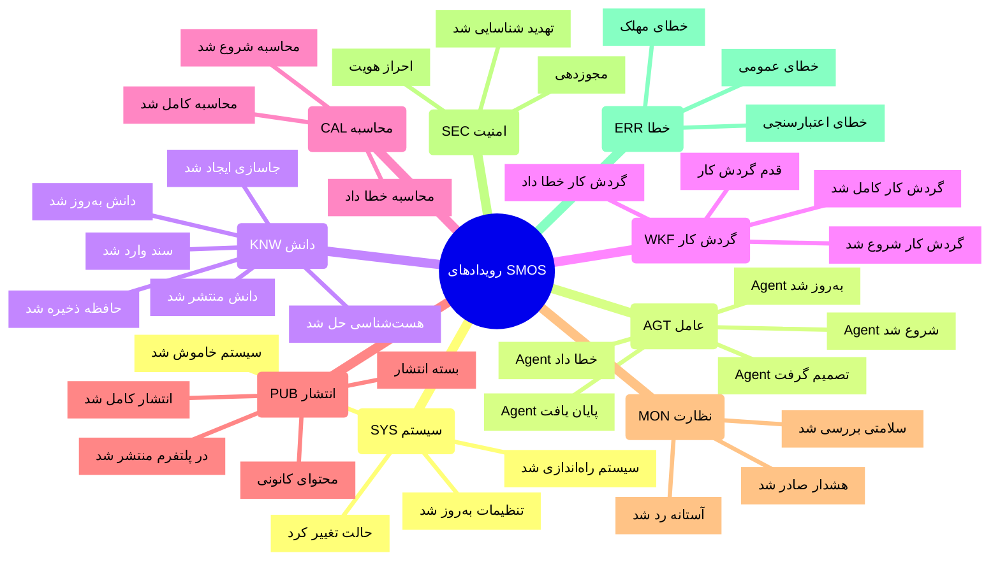

### خانواده‌های رویداد

| خانواده            | پیشوند | دامنه                | تعداد رویداد |
| ------------------ | ------ | -------------------- | ------------ |
| System Events      | `sys.` | زیرساخت سیستم        | ۸            |
| Agent Events       | `agt.` | عامل‌های هوشمند      | ۱۲           |
| Knowledge Events   | `knw.` | مدیریت دانش          | ۱۲           |
| Workflow Events    | `wkf.` | گردش کار خودکار      | ۸            |
| Calculation Events | `cal.` | محاسبات سنگین        | ۶            |
| Publishing Events  | `pub.` | انتشار محتوا         | ۱۰           |
| Monitoring Events  | `mon.` | نظارت عملیاتی        | ۸            |
| Security Events    | `sec.` | امنیت و کنترل دسترسی | ۸            |
| Error Events       | `err.` | خطاها و استثناها     | ۶            |
| **جمع کل**         |        |                      | **۷۸**       |

---

## ۵. رویدادهای سیستمی (System Events)

رویدادهایی که توسط زیرساخت اصلی SMOS منتشر می‌شوند.

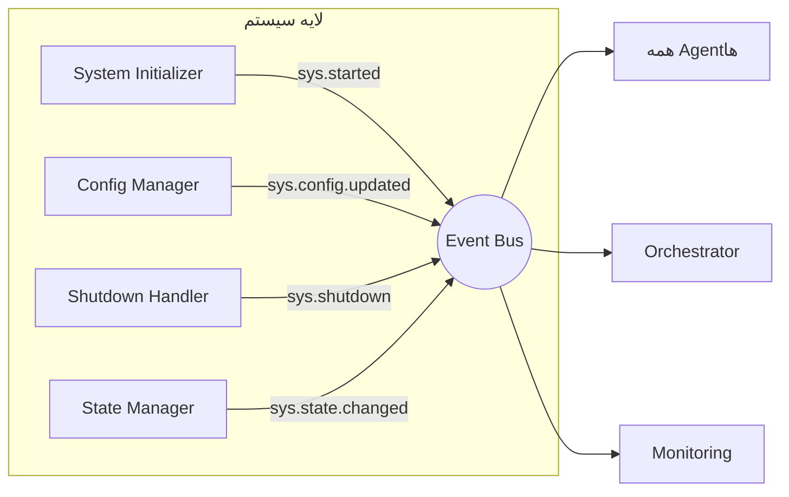

### جدول رویدادهای سیستمی

| شناسه   | نام رویداد           | موضوع (Topic)             | Payload               | منبع (Source)     | مصرف‌کنندگان             |
| ------- | -------------------- | ------------------------- | --------------------- | ----------------- | ------------------------ |
| SYS-001 | سیستم راه‌اندازی شد  | `sys.started`             | SystemStartedPayload  | System Bootloader | All Agents, Orchestrator |
| SYS-002 | سیستم خاموش شد       | `sys.shutdown`            | SystemShutdownPayload | Shutdown Manager  | All Agents, Orchestrator |
| SYS-003 | تنظیمات به‌روز شد    | `sys.config.updated`      | ConfigUpdatedPayload  | Config Manager    | All Subscribers          |
| SYS-004 | حالت سیستم تغییر کرد | `sys.state.changed`       | StateChangedPayload   | State Manager     | Orchestrator, Monitoring |
| SYS-005 | چرخه حیات شروع شد    | `sys.lifecycle.started`   | LifecyclePayload      | Lifecycle Manager | All Agents               |
| SYS-006 | چرخه حیات کامل شد    | `sys.lifecycle.completed` | LifecyclePayload      | Lifecycle Manager | Orchestrator, AI-014     |
| SYS-007 | Pulse (ضربان)        | `sys.pulse`               | PulsePayload          | Health Checker    | Monitoring               |
| SYS-008 | خطای سیستمی          | `sys.error`               | SystemErrorPayload    | Error Handler     | Alert Manager, Log       |

### Sys-001: SystemStartedPayload

```json
{
  "eventId": "evt_a1b2c3d4-e5f6-7890-abcd-ef1234567890",
  "eventType": "sys.started",
  "version": "1.0.0",
  "timestamp": "2026-07-01T10:00:00.000Z",
  "source": "system-bootloader",
  "traceId": "trace_abc123",
  "spanId": "span_001",
  "payload": {
    "systemVersion": "v2.14.0-draft",
    "bootDuration": 3450,
    "activeAgents": 14,
    "activeWorkflows": 59,
    "environment": "production",
    "mode": "normal",
    "startupTimestamp": "2026-07-01T10:00:00.000Z"
  }
}
```

---

## ۶. رویدادهای عامل (Agent Events)

رویدادهایی که توسط Agentهای هوش مصنوعی SMOS (AI-001 تا AI-014) منتشر می‌شوند.

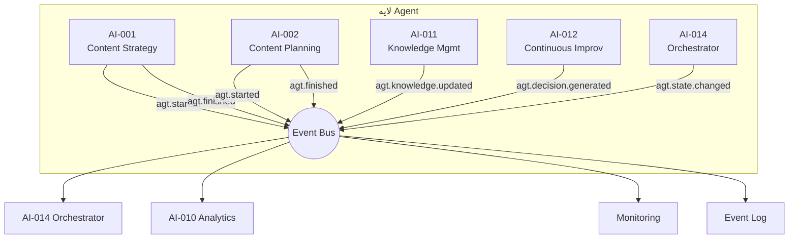

### جدول رویدادهای Agent

| شناسه   | نام رویداد            | موضوع (Topic)               | Payload                     | منبع   | مصرف‌کنندگان            |
| ------- | --------------------- | --------------------------- | --------------------------- | ------ | ----------------------- |
| AGT-001 | Agent شروع شد         | `agt.{agentId}.started`     | AgentStartedPayload         | AI-NNN | AI-014, AI-010, MON     |
| AGT-002 | Agent پایان یافت      | `agt.{agentId}.finished`    | AgentFinishedPayload        | AI-NNN | AI-014, AI-010, MON     |
| AGT-003 | تصمیم تولید شد        | `agt.{agentId}.decision`    | DecisionGeneratedPayload    | AI-NNN | AI-014, AI-012, AI-011  |
| AGT-004 | Agent به‌روز شد       | `agt.{agentId}.updated`     | AgentUpdatedPayload         | AI-NNN | AI-014, AI-010          |
| AGT-005 | خطای Agent            | `agt.{agentId}.error`       | AgentErrorPayload           | AI-NNN | AI-014, AI-010, MON     |
| AGT-006 | خروجی تولید شد        | `agt.{agentId}.output`      | AgentOutputPayload          | AI-NNN | AI-014, مصرف‌کننده بعدی |
| AGT-007 | وضعیت Agent تغییر کرد | `agt.{agentId}.state`       | AgentStatePayload           | AI-NNN | AI-014, MON             |
| AGT-008 | درخواست همکاری        | `agt.{agentId}.collaborate` | CollaborationRequestPayload | AI-NNN | AI-NNN هدف              |
| AGT-009 | اعتبارسنجی Agent      | `agt.{agentId}.validation`  | AgentValidationPayload      | AI-NNN | AI-004, AI-014          |
| AGT-010 | Agent به حالت تعلیق   | `agt.{agentId}.suspended`   | AgentSuspendedPayload       | AI-014 | AI-NNN هدف              |
| AGT-011 | Agent از سر گرفته شد  | `agt.{agentId}.resumed`     | AgentResumedPayload         | AI-014 | AI-NNN هدف              |
| AGT-012 | Agent گزارش داد       | `agt.{agentId}.report`      | AgentReportPayload          | AI-010 | AI-014, AI-012          |

### AGT-001: AgentStartedPayload

```json
{
  "eventId": "evt_f6e5d4c3-b2a1-0987-6543-210fedcba987",
  "eventType": "agt.ai-003.started",
  "version": "1.0.0",
  "timestamp": "2026-07-01T10:05:00.000Z",
  "source": "ai-003",
  "traceId": "trace_def456",
  "spanId": "span_002",
  "parentEventId": "evt_a1b2c3d4-e5f6-7890-abcd-ef1234567890",
  "payload": {
    "agentId": "ai-003",
    "agentName": "Content Production Agent",
    "sessionId": "session_20260701_001",
    "taskId": "task_content_456",
    "inputRef": "knw_asset_production_plan_789",
    "capabilityMode": "production",
    "authorityLevel": "A-3",
    "startedAt": "2026-07-01T10:05:00.000Z"
  }
}
```

---

## ۷. رویدادهای دانش (Knowledge Events)

رویدادهایی که توسط AI-011 (Enterprise Knowledge Management Agent) و سرویس‌های دانش منتشر می‌شوند.

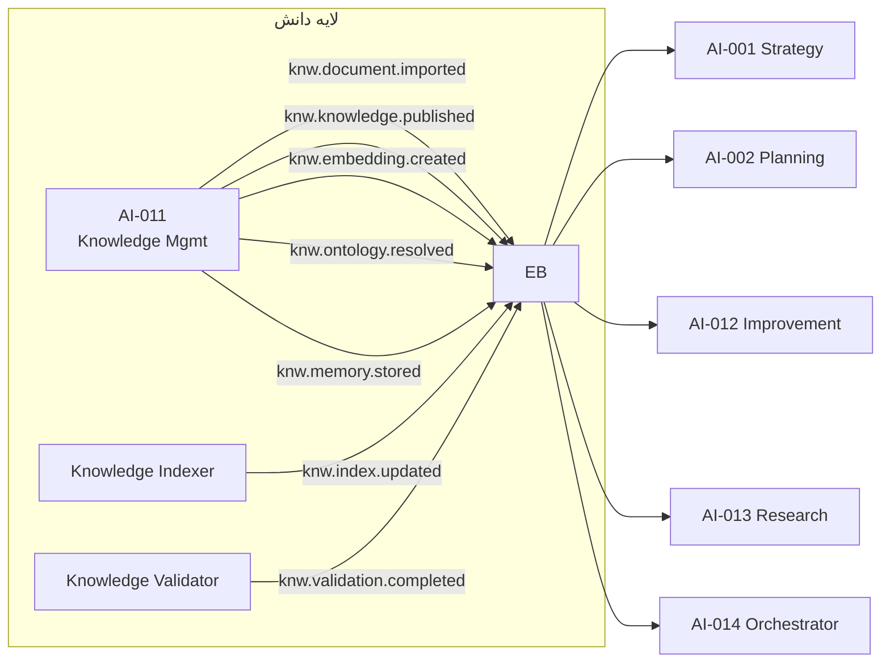

### جدول رویدادهای دانش

| شناسه   | نام رویداد            | موضوع (Topic)                 | Payload                      | منبع                | مصرف‌کنندگان                   |
| ------- | --------------------- | ----------------------------- | ---------------------------- | ------------------- | ------------------------------ |
| KNW-001 | سند وارد شد           | `knw.document.imported`       | DocumentImportedPayload      | AI-011, External    | AI-011, AI-014                 |
| KNW-002 | دانش منتشر شد         | `knw.knowledge.published`     | KnowledgePublishedPayload    | AI-011              | AI-001, AI-002, AI-012, AI-013 |
| KNW-003 | جاسازی ایجاد شد       | `knw.embedding.created`       | EmbeddingCreatedPayload      | Embedding Service   | AI-011, AI-013, AI-010         |
| KNW-004 | هستی‌شناسی حل شد      | `knw.ontology.resolved`       | OntologyResolvedPayload      | Ontology Service    | AI-011, AI-001, AI-002         |
| KNW-005 | حافظه ذخیره شد        | `knw.memory.stored`           | MemoryStoredPayload          | Memory Service      | AI-011, AI-012                 |
| KNW-006 | دانش به‌روز شد        | `knw.knowledge.updated`       | KnowledgeUpdatedPayload      | AI-011, AI-012      | All Agents                     |
| KNW-007 | نمایه به‌روز شد       | `knw.index.updated`           | IndexUpdatedPayload          | Knowledge Indexer   | AI-011, AI-001, AI-002         |
| KNW-008 | دانش اعتبارسنجی شد    | `knw.validation.completed`    | ValidationCompletedPayload   | Knowledge Validator | AI-011, AI-004, AI-014         |
| KNW-009 | رابطه استخراج شد      | `knw.relationship.extracted`  | RelationshipExtractedPayload | AI-011              | AI-011, AI-013                 |
| KNW-010 | غنی‌سازی کامل شد      | `knw.enrichment.completed`    | EnrichmentCompletedPayload   | AI-011              | AI-011, AI-012, AI-001         |
| KNW-011 | تکرار حذف شد          | `knw.deduplication.completed` | DedupCompletedPayload        | AI-011              | AI-011, AI-010                 |
| KNW-012 | کیفیت دانش ارزیابی شد | `knw.quality.assessed`        | QualityAssessedPayload       | AI-011              | AI-011, AI-014, AI-004         |

### KNW-001: DocumentImportedPayload

```json
{
  "eventId": "evt_98765432-10ab-cdef-0987-6543210fedcb",
  "eventType": "knw.document.imported",
  "version": "1.0.0",
  "timestamp": "2026-07-01T11:00:00.000Z",
  "source": "ai-011",
  "traceId": "trace_ghi789",
  "spanId": "span_003",
  "payload": {
    "documentId": "doc_platform_guidelines_2026",
    "documentType": "platform_playbook",
    "sourceUri": "s3://smos-knowledge/imports/instagram-guidelines-2026.pdf",
    "checksum": "sha256:a1b2c3d4e5f6...",
    "format": "pdf",
    "language": "fa",
    "size": 245000,
    "pageCount": 34,
    "importedAt": "2026-07-01T11:00:00.000Z",
    "knowledgeDomains": ["platform", "instagram", "content-guidelines"],
    "authorityLevel": "A-3"
  }
}
```

---

## ۸. رویدادهای گردش کار (Workflow Events)

رویدادهایی که توسط موتور گردش کار (Automation Engine) بر اساس AUT-000 و AUT-001 منتشر می‌شوند.

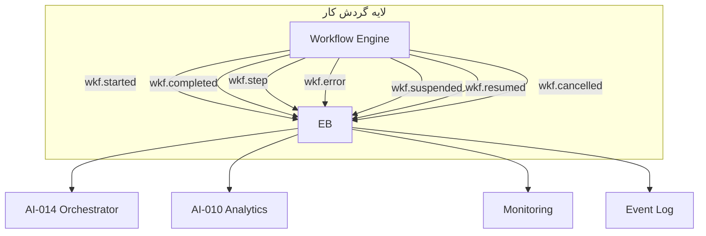

### جدول رویدادهای گردش کار

| شناسه   | نام رویداد              | موضوع (Topic)                | Payload                  | منبع       | مصرف‌کنندگان           |
| ------- | ----------------------- | ---------------------------- | ------------------------ | ---------- | ---------------------- |
| WKF-001 | گردش کار شروع شد        | `wkf.{workflowId}.started`   | WorkflowStartedPayload   | AUT Engine | AI-014, AI-010, MON    |
| WKF-002 | گردش کار کامل شد        | `wkf.{workflowId}.completed` | WorkflowCompletedPayload | AUT Engine | AI-014, AI-010, AI-012 |
| WKF-003 | قدم گردش کار            | `wkf.{workflowId}.step`      | WorkflowStepPayload      | AUT Engine | AI-014, AI-010         |
| WKF-004 | گردش کار خطا داد        | `wkf.{workflowId}.error`     | WorkflowErrorPayload     | AUT Engine | AI-014, AI-010, MON    |
| WKF-005 | گردش کار معلق شد        | `wkf.{workflowId}.suspended` | WorkflowSuspendedPayload | AUT Engine | AI-014, MON            |
| WKF-006 | گردش کار از سر گرفته شد | `wkf.{workflowId}.resumed`   | WorkflowResumedPayload   | AUT Engine | AI-014, MON            |
| WKF-007 | گردش کار لغو شد         | `wkf.{workflowId}.cancelled` | WorkflowCancelledPayload | AUT Engine | AI-014, AI-010         |
| WKF-008 | گردش کار به‌روز شد      | `wkf.{workflowId}.updated`   | WorkflowUpdatedPayload   | AUT Engine | AI-014, AI-012         |

### WKF-002: WorkflowCompletedPayload

```json
{
  "eventId": "evt_11223344-5566-7788-99aa-bbccddeeff00",
  "eventType": "wkf.content-publishing-001.completed",
  "version": "1.0.0",
  "timestamp": "2026-07-01T12:00:00.000Z",
  "source": "automation-engine",
  "traceId": "trace_jkl012",
  "spanId": "span_004",
  "parentEventId": "evt_99887766-5544-3322-1100-aabbccddeeff",
  "payload": {
    "workflowId": "content-publishing-001",
    "workflowName": "انتشار محتوای چندپلتفرمی",
    "sessionId": "wf_session_20260701_003",
    "triggerEvent": "pub.package.assembled",
    "stepsCompleted": 7,
    "stepsTotal": 7,
    "duration": 12500,
    "status": "completed",
    "outputRefs": ["pub_record_001", "pub_record_002", "pub_record_003"],
    "platformsPublished": ["website", "instagram", "linkedin"],
    "completedAt": "2026-07-01T12:00:00.000Z",
    "errorCount": 0
  }
}
```

---

## ۹. رویدادهای محاسباتی (Calculation Events)

رویدادهایی که توسط موتورهای محاسباتی (Analytics Engine, Embedding Engine, etc.) منتشر می‌شوند.

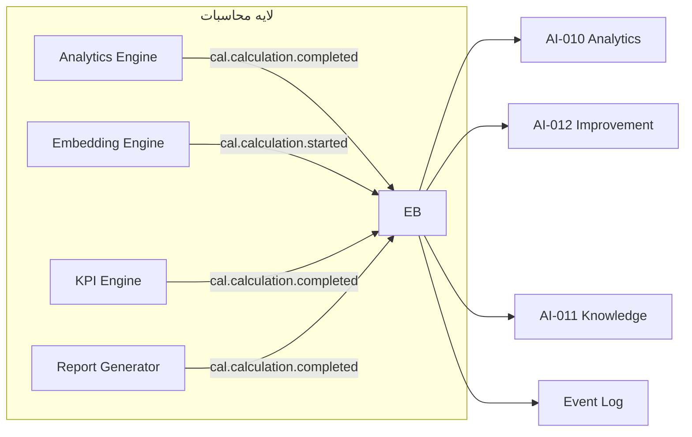

### جدول رویدادهای محاسباتی

| شناسه   | نام رویداد     | موضوع (Topic)            | Payload                     | منبع             | مصرف‌کنندگان           |
| ------- | -------------- | ------------------------ | --------------------------- | ---------------- | ---------------------- |
| CAL-001 | محاسبه شروع شد | `cal.{calcId}.started`   | CalculationStartedPayload   | Cal Engine       | AI-010, AI-014, MON    |
| CAL-002 | محاسبه کامل شد | `cal.{calcId}.completed` | CalculationCompletedPayload | Cal Engine       | AI-010, AI-012, AI-011 |
| CAL-003 | محاسبه خطا داد | `cal.{calcId}.error`     | CalculationErrorPayload     | Cal Engine       | AI-010, AI-014, MON    |
| CAL-004 | KPI محاسبه شد  | `cal.kpi.computed`       | KPIComputedPayload          | KPI Engine       | AI-010, AI-012, AI-014 |
| CAL-005 | روند تحلیل شد  | `cal.trend.analyzed`     | TrendAnalyzedPayload        | Analytics Engine | AI-010, AI-012, AI-001 |
| CAL-006 | بینش تولید شد  | `cal.insight.generated`  | InsightGeneratedPayload     | Analytics Engine | AI-010, AI-012, AI-001 |

---

## ۱۰. رویدادهای انتشار (Publishing Events)

رویدادهایی که توسط فرآیند انتشار محتوا منتشر می‌شوند.

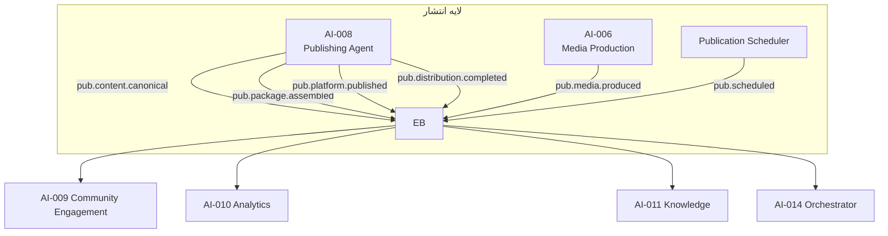

### جدول رویدادهای انتشار

| شناسه   | نام رویداد             | موضوع (Topic)                | Payload                      | منبع           | مصرف‌کنندگان                   |
| ------- | ---------------------- | ---------------------------- | ---------------------------- | -------------- | ------------------------------ |
| PUB-001 | محتوای کانونی تولید شد | `pub.content.canonical`      | CanonicalContentPayload      | AI-003, AI-007 | AI-005, AI-006, AI-008, AI-011 |
| PUB-002 | بسته انتشار آماده شد   | `pub.package.assembled`      | PackageAssembledPayload      | AI-008         | AUT Engine, AI-009, AI-010     |
| PUB-003 | در پلتفرم منتشر شد     | `pub.platform.published`     | PlatformPublishedPayload     | AI-008, AUT    | AI-009, AI-010, AI-011         |
| PUB-004 | انتشار کامل شد         | `pub.distribution.completed` | DistributionCompletedPayload | AI-008         | AI-010, AI-012, AI-014         |
| PUB-005 | انتشار زمان‌بندی شد    | `pub.scheduled`              | ScheduledPublishPayload      | Scheduler      | AI-008, AI-014, AI-010         |
| PUB-006 | دارایی رسانه تولید شد  | `pub.media.produced`         | MediaProducedPayload         | AI-006, AI-007 | AI-008, AI-004, AI-011         |
| PUB-007 | انتشار لغو شد          | `pub.cancelled`              | PublishCancelledPayload      | AI-008, AI-014 | AI-010, AI-012                 |
| PUB-008 | انتشار تأیید شد        | `pub.publication.verified`   | PublicationVerifiedPayload   | AI-008         | AI-010, AI-014                 |
| PUB-009 | انطباق پلتفرم تأیید شد | `pub.compliance.verified`    | ComplianceVerifiedPayload    | AI-004, AI-008 | AI-008, AI-014                 |
| PUB-010 | پلتفرم انتخاب شد       | `pub.platform.selected`      | PlatformSelectedPayload      | AI-008         | AUT Engine, AI-010, AI-011     |

---

## ۱۱. رویدادهای نظارت (Monitoring Events)

رویدادهایی که توسط سرویس نظارت و مانیتورینگ منتشر می‌شوند.

| شناسه   | نام رویداد           | موضوع (Topic)            | Payload                  | منبع              | مصرف‌کنندگان           |
| ------- | -------------------- | ------------------------ | ------------------------ | ----------------- | ---------------------- |
| MON-001 | سلامت سرویس بررسی شد | `mon.health.checked`     | HealthCheckPayload       | Health Checker    | AI-010, AI-014, Alert  |
| MON-002 | آستانه رد شد         | `mon.threshold.exceeded` | ThresholdExceededPayload | Monitor           | AI-010, AI-014, Alert  |
| MON-003 | هشدار صادر شد        | `mon.alert.triggered`    | AlertTriggeredPayload    | Alert Manager     | AI-010, AI-012, AI-014 |
| MON-004 | وضعیت سیستم          | `mon.system.status`      | SystemStatusPayload      | Monitor           | AI-010, AI-014         |
| MON-005 | معیار ثبت شد         | `mon.metric.recorded`    | MetricRecordedPayload    | Metrics Collector | AI-010, Event Log      |
| MON-006 | هشدار برطرف شد       | `mon.alert.resolved`     | AlertResolvedPayload     | Alert Manager     | AI-010, AI-014         |
| MON-007 | وقوع حادثه           | `mon.incident.detected`  | IncidentDetectedPayload  | Incident Detector | AI-010, AI-014, AI-012 |
| MON-008 | سرویس تخریب شد       | `mon.service.degraded`   | ServiceDegradedPayload   | Health Checker    | AI-010, AI-014, Alert  |

---

## ۱۲. رویدادهای امنیتی (Security Events)

رویدادهایی که توسط لایه امنیت SMOS منتشر می‌شوند.

| شناسه   | نام رویداد             | موضوع (Topic)         | Payload               | منبع             | مصرف‌کنندگان          |
| ------- | ---------------------- | --------------------- | --------------------- | ---------------- | --------------------- |
| SEC-001 | احراز هویت شد          | `sec.authentication`  | AuthenticationPayload | Auth Service     | AI-014, Audit Log     |
| SEC-002 | مجوز صادر شد           | `sec.authorization`   | AuthorizationPayload  | Auth Service     | AI-014, Audit Log     |
| SEC-003 | تهدید شناسایی شد       | `sec.threat.detected` | ThreatDetectedPayload | Security Monitor | AI-014, Alert, AI-012 |
| SEC-004 | دسترسی رد شد           | `sec.access.denied`   | AccessDeniedPayload   | Auth Service     | AI-014, Audit Log     |
| SEC-005 | رمزنگاری انجام شد      | `sec.encryption`      | EncryptionPayload     | Security Service | Audit Log             |
| SEC-006 | توکن صادر شد           | `sec.token.issued`    | TokenIssuedPayload    | Auth Service     | AI-014, Audit Log     |
| SEC-007 | دسترسی ممیزی شد        | `sec.access.audited`  | AccessAuditedPayload  | Audit Service    | Audit Log, AI-012     |
| SEC-008 | سیاست امنیتی به‌روز شد | `sec.policy.updated`  | SecurityPolicyPayload | Security Service | AI-014, AI-011        |

---

## ۱۳. رویدادهای خطا (Error Events)

رویدادهایی که توسط تمام لایه‌ها در صورت بروز خطا منتشر می‌شوند.

| شناسه   | نام رویداد      | موضوع (Topic)    | Payload                | منبع              | مصرف‌کنندگان             |
| ------- | --------------- | ---------------- | ---------------------- | ----------------- | ------------------------ |
| ERR-001 | خطای عمومی      | `err.generic`    | GenericErrorPayload    | Any Component     | AI-014, AI-010, MON, Log |
| ERR-002 | خطای اعتبارسنجی | `err.validation` | ValidationErrorPayload | AI-004, AI-011    | AI-014, AI-012, MON      |
| ERR-003 | خطای مهلک       | `err.fatal`      | FatalErrorPayload      | Any Component     | AI-014, MON, Alert       |
| ERR-004 | خطای شبکه       | `err.network`    | NetworkErrorPayload    | Integration Layer | AI-014, AI-010, MON      |
| ERR-005 | خطای زمان       | `err.timeout`    | TimeoutErrorPayload    | Any Component     | AI-014, AI-010, MON      |
| ERR-006 | خطای کسب‌وکار   | `err.business`   | BusinessErrorPayload   | AI-NNN, AUT       | AI-014, AI-012, AI-011   |

---

## ۱۴. معماری باس رویداد (Event Bus Architecture)

Event Bus در SMOS به صورت **لایه‌ای و توزیع‌شده** طراحی شده است:

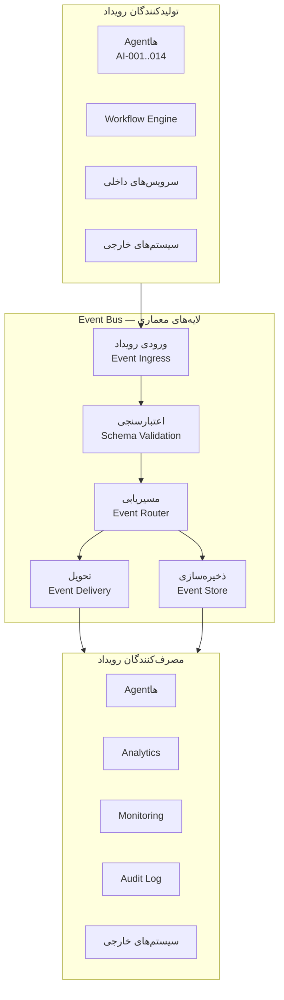

### ویژگی‌های Event Bus

| ویژگی                 | توضیح                                                       |
| --------------------- | ----------------------------------------------------------- |
| **نوع**               | Event-Driven, Publish-Subscribe (Pub/Sub)                   |
| **حالت تحویل**        | Pull-based برای مصرف‌کنندگان سنگین، Push-based برای Agentها |
| **Scalability**       | افقی — پارتیشن‌بندی بر اساس Topic                           |
| **Persistence**       | تمام رویدادها در Event Log پایدار ذخیره می‌شوند             |
| **پشتیبانی از الگو**  | Topic Wildcard: `agt.*.started`, `knw.*`, `*.error`         |
| **Dead Letter Queue** | رویدادهای ناموفق پس از N بار تلاش به DLQ منتقل می‌شوند      |
| **بازپخش (Replay)**   | امکان بازپخش رویدادها از یک نقطه زمانی مشخص                 |

---

## ۱۵. مدل انتشار رویداد (Event Publishing Model)

SMOS از دو مدل انتشار پشتیبانی می‌کند:

### ۱۵.۱ انتشار همگام (Sync)

برای رویدادهایی که Consumer باید بلافاصله پاسخ دهد:

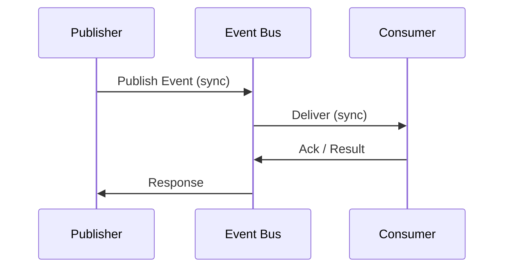

**مورد استفاده:** Validation Events, Authorization Checks

### ۱۵.۲ انتشار ناهمگام (Async)

برای اکثر رویدادهای SMOS:

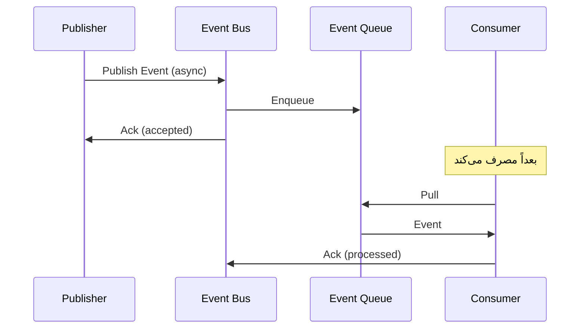

### قواعد انتخاب مدل

| معیار             | همگام            | ناهمگام            |
| ----------------- | ---------------- | ------------------ |
| نیاز به پاسخ فوری | ✓                | ✗                  |
| تحمل تأخیر        | ✗                | ✓                  |
| مقیاس‌پذیری       | محدود            | بالا               |
| پیچیدگی           | کم               | متوسط              |
| موارد استفاده     | اعتبارسنجی، مجوز | همه رویدادهای دیگر |

---

## ۱۶. مدل اشتراک رویداد (Event Subscription Model)

Consumerها از طریق Subscription به رویدادها متصل می‌شوند:

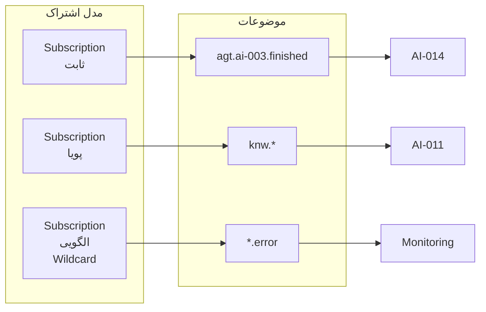

### انواع Subscription

| نوع                    | توضیح                             | مثال                               |
| ---------------------- | --------------------------------- | ---------------------------------- |
| **ثابت (Static)**      | اشتراک از پیش تعریف‌شده در کانفیگ | `agt.ai-003.finished` → AI-014     |
| **پویا (Dynamic)**     | اشتراک در زمان اجرا توسط Agent    | `knw.knowledge.published` → AI-013 |
| **الگویی (Wildcard)**  | اشتراک با الگوی Topic             | `knw.*` → AI-011                   |
| **شرطی (Conditional)** | اشتراک با فیلتر محتوا             | `agt.*.error` با severity=critical |

### فرمت Subscription

```json
{
  "subscriptionId": "sub_agent_014_to_sys_all",
  "consumerId": "ai-014",
  "topicPattern": "sys.*",
  "subscriptionType": "static",
  "deliveryMode": "push",
  "filters": {
    "requiredVersion": ">=1.0.0",
    "allowedSources": ["system-bootloader", "config-manager"]
  },
  "retryPolicy": {
    "maxRetries": 3,
    "backoffMs": 1000,
    "backoffMultiplier": 2
  },
  "deadLetterQueue": "dlq-orchestrator",
  "active": true,
  "createdAt": "2026-07-01T00:00:00.000Z"
}
```

---

## ۱۷. مدل مسیریابی رویداد (Event Routing Model)

رویدادها بر اساس **موضوع (Topic)** و **قوانین مسیریابی** هدایت می‌شوند:

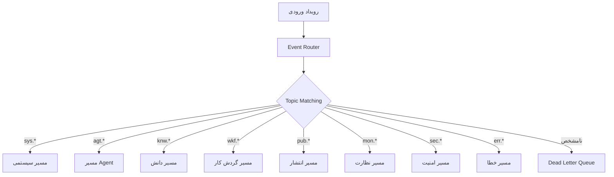

### قوانین مسیریابی

| قانون     | اولویت | شرط                            | اقدام                                         |
| --------- | ------ | ------------------------------ | --------------------------------------------- |
| ROUTE-001 | ۱۰     | topic matches `sys.*`          | تحویل به Orchestrator + Monitoring            |
| ROUTE-002 | ۲۰     | topic matches `agt.*.started`  | تحویل به AI-014, AI-010                       |
| ROUTE-003 | ۲۰     | topic matches `agt.*.finished` | تحویل به AI-014, AI-010, مصرف‌کننده زنجیره‌ای |
| ROUTE-004 | ۳۰     | topic matches `knw.*`          | تحویل به AI-011 + مشترکین                     |
| ROUTE-005 | ۳۰     | topic matches `wkf.*`          | تحویل به AI-014, AI-010                       |
| ROUTE-006 | ۴۰     | topic matches `pub.*`          | تحویل به AI-009, AI-010, AI-011               |
| ROUTE-007 | ۵۰     | topic matches `mon.*`          | تحویل به Monitoring, AI-010                   |
| ROUTE-008 | ۶۰     | topic matches `sec.*`          | تحویل به Security Audit + AI-014              |
| ROUTE-009 | ۱۰۰    | topic matches `*.error`        | تحویل به Monitoring + Alert + AI-014          |
| ROUTE-010 | ۱۰۰۰   | no match                       | ارسال به DLQ + Alert                          |

---

## ۱۸. تضمین تحویل رویداد (Event Delivery Guarantees)

SMOS سه سطح تضمین تحویل را پشتیبانی می‌کند:

| سطح               | تضمین        | توضیح                              | موارد استفاده                              |
| ----------------- | ------------ | ---------------------------------- | ------------------------------------------ |
| **At-Most-Once**  | صفر یا یکبار | بدون Retry, بدون Ack               | sys.pulse, mon.health.checked              |
| **At-Least-Once** | حداقل یکبار  | Retry با Backoff, Ack مورد نیاز    | اکثر رویدادها: knw._, agt._                |
| **Exactly-Once**  | دقیقاً یکبار | Idempotency Key, Transactional Log | sec.authentication, pub.platform.published |

### سیاست Retry

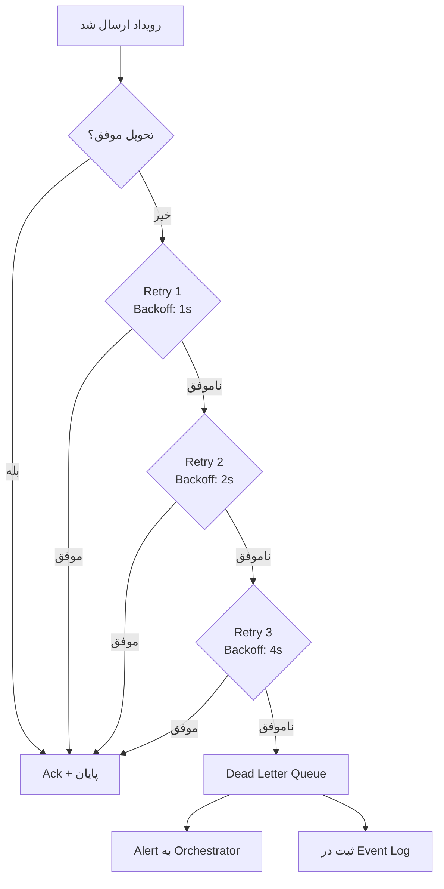

### Idempotency Key برای Exactly-Once

```json
{
  "idempotencyKey": "pub_platform_001_instagram_20260701_120000",
  "eventType": "pub.platform.published",
  "payloadHash": "sha256:aabbccddee...",
  "processedAt": null
}
```

---

## ۱۹. ماندگاری رویداد (Event Persistence)

تمام رویدادها در **Event Store** پایدار ذخیره می‌شوند:

| ویژگی           | مقدار                                                        |
| --------------- | ------------------------------------------------------------ |
| **ذخیره‌سازی**  | Event Log (فایل خطی زمان‌دار) + Event Store (جستجوپذیر)      |
| **مدت نگهداری** | ۹۰ روز برای رویدادهای عملیاتی، ۳۶۵ روز برای رویدادهای امنیتی |
| **فشرده‌سازی**  | رویدادهای قدیمی‌تر از ۳۰ روز فشرده می‌شوند                   |
| **بایگانی**     | رویدادهای بیش از ۳۶۵ روز به بایگانی بلندمدت منتقل می‌شوند    |
| **فرمت فایل**   | JSON Lines (.jsonl)                                          |
| **رمزنگاری**    | AES-256-GCM در حالت استراحت                                  |

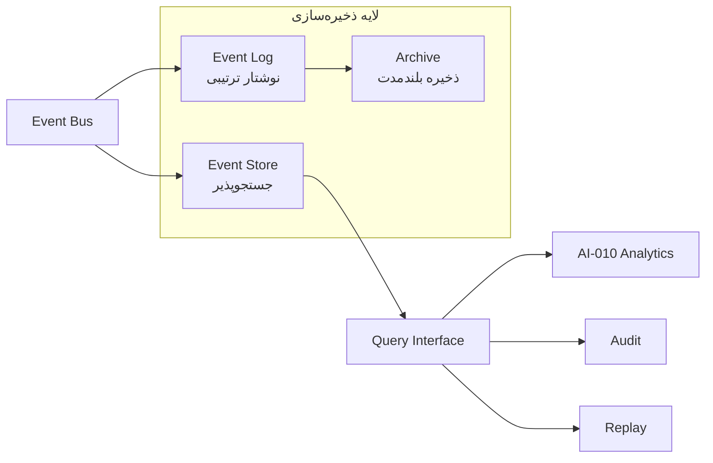

---

## ۲۰. ترتیب‌دهی رویداد (Event Ordering)

SMOS از دو مدل ترتیب‌دهی پشتیبانی می‌کند:

### ۲۰.۱ ترتیب جهانی (Global Ordering)

همه رویدادها بر اساس Timestamp مرتب می‌شوند.但对于同一时间戳的事件，依赖关系由 ParentEventId 决定。

### ۲۰.۲ ترتیب بر اساس Stream (Partition Key)

رویدادهای مرتبط با یک **موجودیت** در یک Stream حفظ می‌شوند:

| Stream Key              | مثال                      | رویدادها                   |
| ----------------------- | ------------------------- | -------------------------- |
| `session:{sessionId}`   | `session_20260701_001`    | تمام رویدادهای یک جلسه     |
| `workflow:{workflowId}` | `content-publishing-001`  | تمام رویدادهای یک گردش کار |
| `agent:{agentId}`       | `ai-003`                  | تمام رویدادهای یک Agent    |
| `document:{documentId}` | `doc_platform_guidelines` | تمام رویدادهای یک سند      |

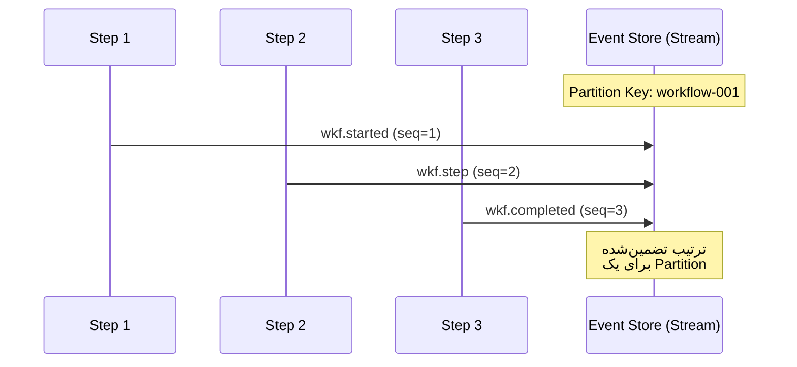

---

## ۲۱. ثبات طرح‌واره رویداد (Event Schema Registry)

همه رویدادها در **Schema Registry** ثبت می‌شوند:

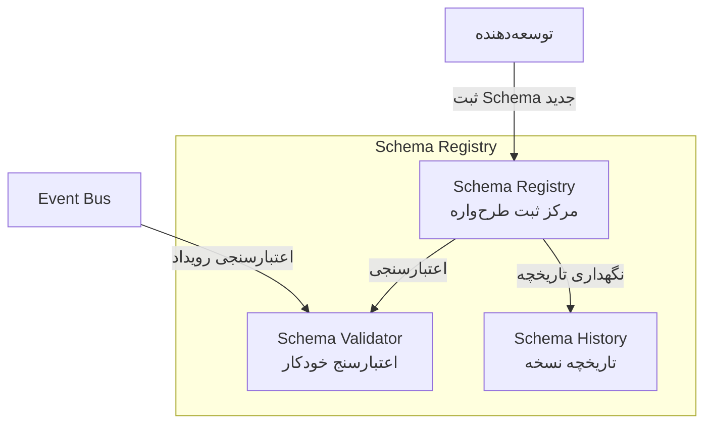

### ویژگی‌های Schema Registry

| ویژگی          | توضیح                                   |
| -------------- | --------------------------------------- |
| **فرمت**       | JSON Schema Draft-07                    |
| **شناسه**      | `smos.event.{eventType}.v{version}`     |
| **ذخیره‌سازی** | نسخه‌بندی شده با SemVer                 |
| **اعتبارسنجی** | خودکار در زمان انتشار و مصرف            |
| **سازگاری**    | Backward + Forward Compatibility Check  |
| **کاتالوگ**    | همه Event Schemaها در یک Registry مرکزی |

---

## ۲۲. نسخه‌بندی رویداد (Event Versioning)

### قواعد نسخه‌بندی

- **Major:** تغییرات ناسازگار (حذف فیلد، تغییر نوع)
- **Minor:** افزودن فیلد اختیاری (Backward Compatible)
- **Patch:** اصلاح توضیحات، مثال‌ها (بدون تغییر ساختار)

### استراتژی سازگاری

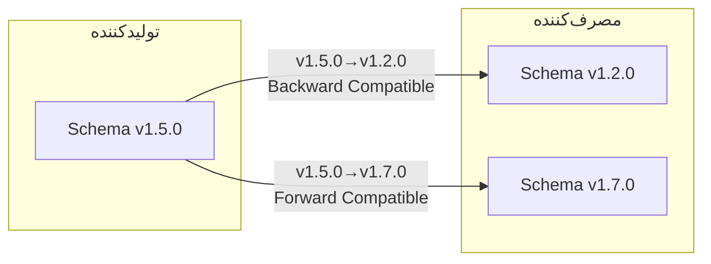

### نوع سازگاری

| نوع          | توضیح                                         | مثال                     |
| ------------ | --------------------------------------------- | ------------------------ |
| **Backward** | Consumer قدیمی می‌تواند رویداد جدید را بخواند | افزودن فیلد optional     |
| **Forward**  | Consumer جدید می‌تواند رویداد قدیمی را بخواند | عدم نیاز به فیلد جدید    |
| **Full**     | هر دو طرف با هر نسخه‌ای کار می‌کنند           | ترکیب Backward + Forward |
| **None**     | تغییر ناسازگار — نیاز به migration            | حذف فیلد اجباری          |

---

## ۲۳. فیلتر و تبدیل رویداد (Event Filtering & Transformation)

### فیلتر رویداد

Subscriptionها می‌توانند رویدادها را بر اساس شرایط فیلتر کنند:

```json
{
  "subscriptionId": "sub_analytics_critical_errors",
  "topicPattern": "err.*",
  "filters": [
    { "field": "payload.severity", "operator": "gte", "value": "high" },
    {
      "field": "payload.source",
      "operator": "in",
      "value": ["ai-003", "ai-008", "automation-engine"]
    }
  ]
}
```

### تبدیل رویداد

تبدیل رویدادها در مسیر (Event Transformation Pipeline):

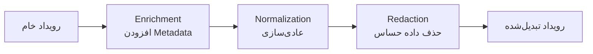

| مرحله         | عملیات                      | توضیح                      |
| ------------- | --------------------------- | -------------------------- |
| Enrichment    | افزودن GeoIP, Agent Context | غنی‌سازی با داده‌های محیطی |
| Normalization | یکسان‌سازی فرمت تاریخ، ارز  | تبدیل به فرمت استاندارد    |
| Redaction     | حذف Token, Password         | حذف داده‌های حساس          |
| Aggregation   | تجمیع رویدادهای مشابه       | کاهش حجم                   |

---

## ۲۴. امنیت رویداد (Event Security)

### سطوح امنیتی

| سطح     | رمزنگاری                 | احراز هویت       | مجوزدهی         | موارد استفاده         |
| ------- | ------------------------ | ---------------- | --------------- | --------------------- |
| **S-0** | TLS در انتقال            | داخلی (Internal) | ندارد           | sys.pulse, mon.health |
| **S-1** | TLS + Signature          | Service Token    | Topic-based     | knw._, cal._, wkf.\*  |
| **S-2** | TLS + Payload Encryption | JWT              | Consumer-based  | pub._, agt._          |
| **S-3** | End-to-End Encryption    | Mutal TLS        | Attribute-based | sec.\*, err.fatal     |

### خط لوله امنیتی

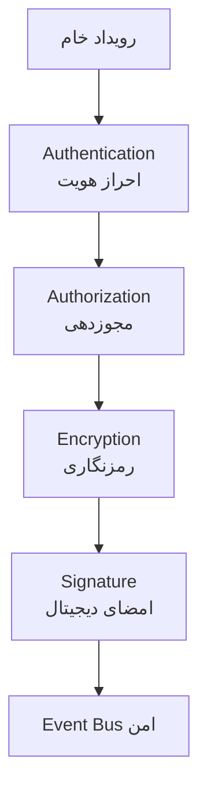

---

## ۲۵. ردگیری ممیزی رویداد (Event Audit Trail)

همه رویدادها برای ممیزی ثبت می‌شوند:

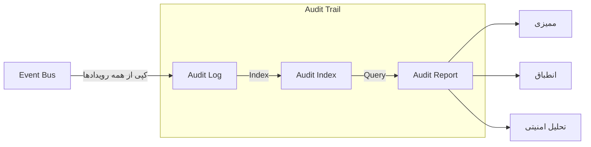

### ساختار Audit Record

```json
{
  "auditId": "audit_20260701_001",
  "eventId": "evt_a1b2c3d4-...",
  "eventType": "agt.ai-003.started",
  "timestamp": "2026-07-01T10:05:00.000Z",
  "source": "ai-003",
  "principal": "system-orchestrator",
  "action": "execute",
  "resource": "ai-003",
  "result": "success",
  "traceId": "trace_def456",
  "signature": "sig_a1b2c3d4e5..."
}
```

---

## ۲۶. تعریف طرح‌واره‌ها (Schema Definitions)

### ۲۶.۱ EventEnvelope Schema

طرح‌واره جامع پوشش رویداد که تمام رویدادها از آن مشتق می‌شوند:

```json
{
  "$schema": "https://json-schema.org/draft-07/schema#",
  "$id": "https://smos.xennic.ai/schemas/event-envelope-v1.json",
  "title": "EventEnvelope",
  "description": "Universal event envelope for all SMOS runtime events",
  "type": "object",
  "required": [
    "eventId",
    "eventType",
    "version",
    "timestamp",
    "source",
    "traceId",
    "spanId",
    "payload"
  ],
  "properties": {
    "eventId": {
      "type": "string",
      "pattern": "^evt_[a-f0-9-]{36}$",
      "description": "Unique event identifier (UUID v4)"
    },
    "eventType": {
      "type": "string",
      "pattern": "^[a-z]+\\.[a-z][a-zA-Z0-9]*\\.?[a-zA-Z0-9]*$",
      "description": "Fully qualified event type (e.g. agt.ai-003.started)"
    },
    "version": {
      "type": "string",
      "pattern": "^\\d+\\.\\d+\\.\\d+$",
      "description": "Event schema version (SemVer)"
    },
    "timestamp": {
      "type": "string",
      "format": "date-time",
      "description": "ISO 8601 UTC timestamp of event creation"
    },
    "source": {
      "type": "string",
      "description": "Source component identifier"
    },
    "traceId": {
      "type": "string",
      "pattern": "^trace_[a-f0-9]+$",
      "description": "Distributed tracing trace ID"
    },
    "spanId": {
      "type": "string",
      "pattern": "^span_[a-f0-9]+$",
      "description": "Distributed tracing span ID"
    },
    "parentEventId": {
      "type": "string",
      "pattern": "^evt_[a-f0-9-]{36}$",
      "description": "Optional parent event ID for causal chains"
    },
    "idempotencyKey": {
      "type": "string",
      "description": "Optional idempotency key for exactly-once delivery"
    },
    "headers": {
      "type": "object",
      "additionalProperties": { "type": "string" },
      "description": "Optional metadata headers"
    },
    "payload": {
      "type": "object",
      "description": "Event-specific payload (validated against subtype schema)"
    }
  }
}
```

### ۲۶.۲ EventPayload Schema (Base)

```json
{
  "$schema": "https://json-schema.org/draft-07/schema#",
  "$id": "https://smos.xennic.ai/schemas/event-payload-base-v1.json",
  "title": "EventPayload",
  "description": "Base payload schema for all SMOS event payloads",
  "type": "object",
  "properties": {
    "metadata": {
      "type": "object",
      "properties": {
        "agentId": { "type": "string" },
        "sessionId": { "type": "string" },
        "taskId": { "type": "string" },
        "correlationId": { "type": "string" },
        "environment": {
          "type": "string",
          "enum": ["development", "staging", "production"]
        }
      }
    },
    "data": {
      "type": "object",
      "description": "Event-specific data content"
    },
    "context": {
      "type": "object",
      "description": "Execution context (authority level, capability mode, etc.)"
    },
    "links": {
      "type": "array",
      "items": {
        "type": "object",
        "properties": {
          "rel": { "type": "string" },
          "href": { "type": "string" },
          "type": { "type": "string" }
        }
      },
      "description": "Related resource links"
    }
  }
}
```

### ۲۶.۳ EventSubscription Schema

```json
{
  "$schema": "https://json-schema.org/draft-07/schema#",
  "$id": "https://smos.xennic.ai/schemas/event-subscription-v1.json",
  "title": "EventSubscription",
  "description": "Event subscription definition for SMOS consumers",
  "type": "object",
  "required": ["subscriptionId", "consumerId", "topicPattern", "subscriptionType", "deliveryMode"],
  "properties": {
    "subscriptionId": {
      "type": "string",
      "pattern": "^sub_[a-z0-9_]+$"
    },
    "consumerId": {
      "type": "string",
      "description": "Unique identifier of the consuming component"
    },
    "consumerGroup": {
      "type": "string",
      "description": "Consumer group for load-balanced delivery"
    },
    "topicPattern": {
      "type": "string",
      "description": "Topic pattern with wildcard support (*)"
    },
    "subscriptionType": {
      "type": "string",
      "enum": ["static", "dynamic", "wildcard", "conditional"]
    },
    "deliveryMode": {
      "type": "string",
      "enum": ["push", "pull"]
    },
    "filters": {
      "type": "array",
      "items": {
        "type": "object",
        "required": ["field", "operator", "value"],
        "properties": {
          "field": { "type": "string" },
          "operator": {
            "type": "string",
            "enum": ["eq", "neq", "gte", "lte", "gt", "lt", "in", "not_in", "exists", "regex"]
          },
          "value": {}
        }
      }
    },
    "retryPolicy": {
      "type": "object",
      "properties": {
        "maxRetries": { "type": "integer", "minimum": 0, "maximum": 10 },
        "backoffMs": { "type": "integer", "minimum": 100 },
        "backoffMultiplier": { "type": "number", "minimum": 1.0 }
      }
    },
    "deadLetterQueue": {
      "type": "string",
      "description": "Target DLQ after exhausted retries"
    },
    "active": { "type": "boolean" },
    "createdAt": { "type": "string", "format": "date-time" },
    "expiresAt": { "type": "string", "format": "date-time" }
  }
}
```

### ۲۶.۴ EventRoute Schema

```json
{
  "$schema": "https://json-schema.org/draft-07/schema#",
  "$id": "https://smos.xennic.ai/schemas/event-route-v1.json",
  "title": "EventRoute",
  "description": "Event routing rule definition",
  "type": "object",
  "required": ["routeId", "priority", "topicPattern", "targetConsumers"],
  "properties": {
    "routeId": {
      "type": "string",
      "pattern": "^ROUTE-\\d{3}$"
    },
    "priority": {
      "type": "integer",
      "minimum": 1,
      "maximum": 10000
    },
    "topicPattern": {
      "type": "string",
      "description": "Topic pattern to match"
    },
    "conditions": {
      "type": "array",
      "items": {
        "type": "object",
        "properties": {
          "field": { "type": "string" },
          "operator": { "type": "string" },
          "value": {}
        }
      }
    },
    "targetConsumers": {
      "type": "array",
      "items": { "type": "string" },
      "minItems": 1
    },
    "transformations": {
      "type": "array",
      "items": {
        "type": "object",
        "properties": {
          "type": {
            "type": "string",
            "enum": ["enrich", "normalize", "redact", "aggregate"]
          },
          "config": { "type": "object" }
        }
      }
    },
    "fallbackRouteId": {
      "type": "string",
      "description": "Route to use if primary fails"
    },
    "active": { "type": "boolean" }
  }
}
```

### ۲۶.۵ EventRegistry Schema

```json
{
  "$schema": "https://json-schema.org/draft-07/schema#",
  "$id": "https://smos.xennic.ai/schemas/event-registry-v1.json",
  "title": "EventRegistry",
  "description": "Central registry entry for an event type",
  "type": "object",
  "required": ["eventType", "family", "schemaId", "currentVersion", "status", "authorityLevel"],
  "properties": {
    "eventType": {
      "type": "string",
      "description": "Fully qualified event type identifier"
    },
    "family": {
      "type": "string",
      "enum": [
        "system",
        "agent",
        "knowledge",
        "workflow",
        "calculation",
        "publishing",
        "monitoring",
        "security",
        "error"
      ]
    },
    "displayName": {
      "type": "string",
      "description": "Human-readable Persian name"
    },
    "description": {
      "type": "string",
      "description": "Detailed description in Persian"
    },
    "schemaId": {
      "type": "string",
      "description": "Reference to schema in Schema Registry"
    },
    "currentVersion": {
      "type": "string",
      "pattern": "^\\d+\\.\\d+\\.\\d+$"
    },
    "status": {
      "type": "string",
      "enum": ["active", "deprecated", "sunset", "experimental"]
    },
    "authorityLevel": {
      "type": "string",
      "enum": ["A-0", "A-1", "A-2", "A-3", "A-4"]
    },
    "deliveryGuarantee": {
      "type": "string",
      "enum": ["at-most-once", "at-least-once", "exactly-once"]
    },
    "producers": {
      "type": "array",
      "items": { "type": "string" },
      "description": "List of component IDs that can produce this event"
    },
    "consumers": {
      "type": "array",
      "items": { "type": "string" },
      "description": "List of component IDs that consume this event"
    },
    "relatedEvents": {
      "type": "array",
      "items": {
        "type": "object",
        "properties": {
          "eventType": { "type": "string" },
          "relationship": {
            "type": "string",
            "enum": ["causes", "caused_by", "correlated", "alternative", "follows"]
          }
        }
      }
    },
    "securityLevel": {
      "type": "string",
      "enum": ["S-0", "S-1", "S-2", "S-3"]
    },
    "maxLatencyMs": {
      "type": "integer",
      "description": "Maximum acceptable latency in milliseconds"
    },
    "versionHistory": {
      "type": "array",
      "items": {
        "type": "object",
        "properties": {
          "version": { "type": "string" },
          "releaseDate": { "type": "string", "format": "date" },
          "changeDescription": { "type": "string" }
        }
      }
    }
  }
}
```

### ۲۶.۶ EventAudit Schema

```json
{
  "$schema": "https://json-schema.org/draft-07/schema#",
  "$id": "https://smos.xennic.ai/schemas/event-audit-v1.json",
  "title": "EventAudit",
  "description": "Audit record for event compliance and forensics",
  "type": "object",
  "required": [
    "auditId",
    "eventId",
    "eventType",
    "timestamp",
    "source",
    "principal",
    "action",
    "resource",
    "result"
  ],
  "properties": {
    "auditId": {
      "type": "string",
      "pattern": "^audit_\\d{8}_\\d+$"
    },
    "eventId": {
      "type": "string",
      "description": "Reference to the original event"
    },
    "eventType": {
      "type": "string"
    },
    "timestamp": {
      "type": "string",
      "format": "date-time"
    },
    "source": {
      "type": "string"
    },
    "principal": {
      "type": "string",
      "description": "Identity that performed the action"
    },
    "principalType": {
      "type": "string",
      "enum": ["agent", "user", "system", "workflow", "external"]
    },
    "action": {
      "type": "string",
      "description": "Action performed (e.g. execute, publish, delete)"
    },
    "resource": {
      "type": "string",
      "description": "Resource affected"
    },
    "resourceType": {
      "type": "string",
      "description": "Type of resource"
    },
    "result": {
      "type": "string",
      "enum": ["success", "failure", "pending", "skipped"]
    },
    "failureReason": {
      "type": "string",
      "description": "Reason if result is failure"
    },
    "traceId": {
      "type": "string"
    },
    "ipAddress": {
      "type": "string",
      "format": "ipv4"
    },
    "userAgent": {
      "type": "string"
    },
    "signature": {
      "type": "string",
      "description": "Digital signature for tamper evidence"
    },
    "immutable": {
      "type": "boolean",
      "const": true,
      "description": "Audit records are immutable"
    }
  }
}
```

---

## ۲۷. کاتالوگ رویداد (Event Catalog)

### همه رویدادهای SMOS

| #   | شناسه   | موضوع کامل                    | خانواده     | سطح اختیار | تضمین         | امنیت | وضعیت  |
| --- | ------- | ----------------------------- | ----------- | ---------- | ------------- | ----- | ------ |
| 1   | SYS-001 | `sys.started`                 | system      | A-4        | at-least-once | S-0   | active |
| 2   | SYS-002 | `sys.shutdown`                | system      | A-4        | at-least-once | S-1   | active |
| 3   | SYS-003 | `sys.config.updated`          | system      | A-3        | at-least-once | S-1   | active |
| 4   | SYS-004 | `sys.state.changed`           | system      | A-4        | at-least-once | S-1   | active |
| 5   | SYS-005 | `sys.lifecycle.started`       | system      | A-4        | at-least-once | S-1   | active |
| 6   | SYS-006 | `sys.lifecycle.completed`     | system      | A-4        | at-least-once | S-1   | active |
| 7   | SYS-007 | `sys.pulse`                   | system      | A-0        | at-most-once  | S-0   | active |
| 8   | SYS-008 | `sys.error`                   | system      | A-4        | at-least-once | S-1   | active |
| 9   | AGT-001 | `agt.{id}.started`            | agent       | A-3        | at-least-once | S-2   | active |
| 10  | AGT-002 | `agt.{id}.finished`           | agent       | A-3        | at-least-once | S-2   | active |
| 11  | AGT-003 | `agt.{id}.decision`           | agent       | A-3        | exactly-once  | S-2   | active |
| 12  | AGT-004 | `agt.{id}.updated`            | agent       | A-3        | at-least-once | S-2   | active |
| 13  | AGT-005 | `agt.{id}.error`              | agent       | A-3        | at-least-once | S-2   | active |
| 14  | AGT-006 | `agt.{id}.output`             | agent       | A-3        | at-least-once | S-2   | active |
| 15  | AGT-007 | `agt.{id}.state`              | agent       | A-3        | at-least-once | S-2   | active |
| 16  | AGT-008 | `agt.{id}.collaborate`        | agent       | A-3        | exactly-once  | S-2   | active |
| 17  | AGT-009 | `agt.{id}.validation`         | agent       | A-3        | exactly-once  | S-2   | active |
| 18  | AGT-010 | `agt.{id}.suspended`          | agent       | A-4        | at-least-once | S-2   | active |
| 19  | AGT-011 | `agt.{id}.resumed`            | agent       | A-4        | at-least-once | S-2   | active |
| 20  | AGT-012 | `agt.{id}.report`             | agent       | A-3        | at-least-once | S-2   | active |
| 21  | KNW-001 | `knw.document.imported`       | knowledge   | A-3        | at-least-once | S-1   | active |
| 22  | KNW-002 | `knw.knowledge.published`     | knowledge   | A-3        | exactly-once  | S-1   | active |
| 23  | KNW-003 | `knw.embedding.created`       | knowledge   | A-2        | at-least-once | S-1   | active |
| 24  | KNW-004 | `knw.ontology.resolved`       | knowledge   | A-3        | at-least-once | S-1   | active |
| 25  | KNW-005 | `knw.memory.stored`           | knowledge   | A-2        | exactly-once  | S-2   | active |
| 26  | KNW-006 | `knw.knowledge.updated`       | knowledge   | A-3        | at-least-once | S-1   | active |
| 27  | KNW-007 | `knw.index.updated`           | knowledge   | A-2        | at-least-once | S-1   | active |
| 28  | KNW-008 | `knw.validation.completed`    | knowledge   | A-3        | at-least-once | S-1   | active |
| 29  | KNW-009 | `knw.relationship.extracted`  | knowledge   | A-3        | exactly-once  | S-1   | active |
| 30  | KNW-010 | `knw.enrichment.completed`    | knowledge   | A-3        | at-least-once | S-1   | active |
| 31  | KNW-011 | `knw.deduplication.completed` | knowledge   | A-2        | at-least-once | S-1   | active |
| 32  | KNW-012 | `knw.quality.assessed`        | knowledge   | A-3        | at-least-once | S-1   | active |
| 33  | WKF-001 | `wkf.{id}.started`            | workflow    | A-3        | at-least-once | S-1   | active |
| 34  | WKF-002 | `wkf.{id}.completed`          | workflow    | A-3        | exactly-once  | S-1   | active |
| 35  | WKF-003 | `wkf.{id}.step`               | workflow    | A-2        | at-least-once | S-1   | active |
| 36  | WKF-004 | `wkf.{id}.error`              | workflow    | A-3        | at-least-once | S-1   | active |
| 37  | WKF-005 | `wkf.{id}.suspended`          | workflow    | A-3        | at-least-once | S-1   | active |
| 38  | WKF-006 | `wkf.{id}.resumed`            | workflow    | A-3        | at-least-once | S-1   | active |
| 39  | WKF-007 | `wkf.{id}.cancelled`          | workflow    | A-3        | at-least-once | S-1   | active |
| 40  | WKF-008 | `wkf.{id}.updated`            | workflow    | A-2        | at-least-once | S-1   | active |
| 41  | CAL-001 | `cal.{id}.started`            | calculation | A-2        | at-least-once | S-1   | active |
| 42  | CAL-002 | `cal.{id}.completed`          | calculation | A-3        | exactly-once  | S-1   | active |
| 43  | CAL-003 | `cal.{id}.error`              | calculation | A-2        | at-least-once | S-1   | active |
| 44  | CAL-004 | `cal.kpi.computed`            | calculation | A-3        | exactly-once  | S-1   | active |
| 45  | CAL-005 | `cal.trend.analyzed`          | calculation | A-3        | at-least-once | S-1   | active |
| 46  | CAL-006 | `cal.insight.generated`       | calculation | A-3        | at-least-once | S-1   | active |
| 47  | PUB-001 | `pub.content.canonical`       | publishing  | A-3        | exactly-once  | S-2   | active |
| 48  | PUB-002 | `pub.package.assembled`       | publishing  | A-3        | exactly-once  | S-2   | active |
| 49  | PUB-003 | `pub.platform.published`      | publishing  | A-3        | exactly-once  | S-3   | active |
| 50  | PUB-004 | `pub.distribution.completed`  | publishing  | A-3        | exactly-once  | S-2   | active |
| 51  | PUB-005 | `pub.scheduled`               | publishing  | A-2        | at-least-once | S-1   | active |
| 52  | PUB-006 | `pub.media.produced`          | publishing  | A-3        | at-least-once | S-2   | active |
| 53  | PUB-007 | `pub.cancelled`               | publishing  | A-3        | at-least-once | S-2   | active |
| 54  | PUB-008 | `pub.publication.verified`    | publishing  | A-3        | exactly-once  | S-2   | active |
| 55  | PUB-009 | `pub.compliance.verified`     | publishing  | A-3        | exactly-once  | S-2   | active |
| 56  | PUB-010 | `pub.platform.selected`       | publishing  | A-2        | at-least-once | S-1   | active |
| 57  | MON-001 | `mon.health.checked`          | monitoring  | A-1        | at-most-once  | S-0   | active |
| 58  | MON-002 | `mon.threshold.exceeded`      | monitoring  | A-3        | at-least-once | S-1   | active |
| 59  | MON-003 | `mon.alert.triggered`         | monitoring  | A-3        | at-least-once | S-1   | active |
| 60  | MON-004 | `mon.system.status`           | monitoring  | A-1        | at-most-once  | S-0   | active |
| 61  | MON-005 | `mon.metric.recorded`         | monitoring  | A-1        | at-least-once | S-0   | active |
| 62  | MON-006 | `mon.alert.resolved`          | monitoring  | A-2        | at-least-once | S-1   | active |
| 63  | MON-007 | `mon.incident.detected`       | monitoring  | A-3        | at-least-once | S-1   | active |
| 64  | MON-008 | `mon.service.degraded`        | monitoring  | A-3        | at-least-once | S-1   | active |
| 65  | SEC-001 | `sec.authentication`          | security    | A-4        | exactly-once  | S-3   | active |
| 66  | SEC-002 | `sec.authorization`           | security    | A-4        | exactly-once  | S-3   | active |
| 67  | SEC-003 | `sec.threat.detected`         | security    | A-4        | exactly-once  | S-3   | active |
| 68  | SEC-004 | `sec.access.denied`           | security    | A-4        | exactly-once  | S-3   | active |
| 69  | SEC-005 | `sec.encryption`              | security    | A-3        | at-least-once | S-3   | active |
| 70  | SEC-006 | `sec.token.issued`            | security    | A-3        | exactly-once  | S-3   | active |
| 71  | SEC-007 | `sec.access.audited`          | security    | A-3        | at-least-once | S-3   | active |
| 72  | SEC-008 | `sec.policy.updated`          | security    | A-4        | at-least-once | S-3   | active |
| 73  | ERR-001 | `err.generic`                 | error       | A-2        | at-least-once | S-1   | active |
| 74  | ERR-002 | `err.validation`              | error       | A-2        | at-least-once | S-1   | active |
| 75  | ERR-003 | `err.fatal`                   | error       | A-4        | at-least-once | S-3   | active |
| 76  | ERR-004 | `err.network`                 | error       | A-2        | at-least-once | S-1   | active |
| 77  | ERR-005 | `err.timeout`                 | error       | A-2        | at-least-once | S-1   | active |
| 78  | ERR-006 | `err.business`                | error       | A-3        | at-least-once | S-2   | active |

---

## ۲۸. نمونه‌های جریان رویداد (Event Flow Examples)

### ۲۸.۱ جریان انتشار محتوا (Content Publishing Flow)

```mermaid
sequenceDiagram
    participant AI003 as AI-003<br/>Content Production
    participant AI005 as AI-005<br/>Discoverability
    participant AI006 as AI-006<br/>Media Production
    participant AI008 as AI-008<br/>Publishing
    participant AI009 as AI-009<br/>Community
    participant EB as Event Bus
    participant AUT as Automation Engine
    participant AI010 as AI-010<br/>Analytics

    AI003->>EB: pub.content.canonical (CanonicalContentPayload)
    EB->>AI005: consume (برای بهینه‌سازی SEO)
    EB->>AI006: consume (برای تولید رسانه)
    EB->>AI008: consume (برای بسته انتشار)

    AI005->>EB: agt.ai-005.finished
    AI006->>EB: pub.media.produced
    AI008->>EB: pub.package.assembled

    EB->>AUT: wkf.content-publishing-001.started
    AUT->>EB: wkf.content-publishing-001.step (×7)
    AUT->>EB: pub.platform.published (×3: وبسایت, اینستاگرام, لینکدین)

    EB->>AI008: consume
    AI008->>EB: pub.distribution.completed

    EB->>AI009: consume (برای تعامل با جامعه)
    EB->>AI010: consume (برای تحلیل عملکرد)

    AI009->>EB: agt.ai-009.started
    AI010->>EB: mon.metric.recorded
```

### ۲۸.۲ جریان یادگیری سازمانی (Organizational Learning Flow)

```mermaid
sequenceDiagram
    participant AI011 as AI-011<br/>Knowledge Mgmt
    participant AI012 as AI-012<br/>Continuous Improvement
    participant AI001 as AI-001<br/>Content Strategy
    participant EB as Event Bus
    participant AI014 as AI-014<br/>Orchestrator

    AI011->>EB: knw.document.imported (سند جدید)
    AI011->>EB: knw.embedding.created
    AI011->>EB: knw.ontology.resolved
    AI011->>EB: knw.knowledge.published

    EB->>AI001: consume (برای به‌روزرسانی استراتژی)
    EB->>AI012: consume (برای بهبود مستمر)

    AI012->>EB: agt.ai-012.started
    AI012->>EB: agt.ai-012.decision (پیشنهاد بهبود)
    AI012->>EB: knw.knowledge.updated

    EB->>AI011: consume (برای ذخیره دانش جدید)
    AI011->>EB: knw.validation.completed
    AI011->>EB: knw.deduplication.completed

    EB->>AI014: consume
    AI014->>EB: agt.ai-014.state (به‌روزرسانی وضعیت هماهنگ‌ساز)
```

### ۲۸.۳ جریان خطا و بازیابی (Error & Recovery Flow)

```mermaid
sequenceDiagram
    participant AI003 as AI-003<br/>Content Production
    participant AI014 as AI-014<br/>Orchestrator
    participant MON as Monitoring
    participant EB as Event Bus

    AI003->>EB: err.fatal (خرابی موتور تولید محتوا)
    EB->>AI014: consume
    EB->>MON: consume
    AI014->>EB: agt.ai-003.suspended
    MON->>EB: mon.alert.triggered (severity: critical)
    AI014->>EB: sys.state.changed (حالت: degraded)
    AI014->>EB: agt.ai-003.resumed (پس از بازیابی)
    MON->>EB: mon.alert.resolved
    AI003->>EB: agt.ai-003.started (راه‌اندازی مجدد)
```

---

## ۲۹. ماتریس ارجاع متقابل (Cross-Reference Matrix)

### نگاشت رویداد ↔ سند معماری

| سند معماری                         | رویدادهای مرتبط            | نوع رابطه    |
| ---------------------------------- | -------------------------- | ------------ |
| AI-000 (معماری مادر Agent)         | AGT-001 تا AGT-012         | علت و معلول  |
| AI-001 تا AI-014 (Agentها)         | AGT-001..012, PUB-001..010 | تعریف و مصرف |
| KNW-000 (معماری دانش)              | KNW-001 تا KNW-012         | اجرا         |
| KNW-001 (نمایه دانش)               | KNW-007 (نمایه به‌روز شد)  | به‌روزرسانی  |
| KNW-101 تا KNW-104 (دانش کسب‌وکار) | KNW-001, KNW-002, KNW-006  | مصرف         |
| KNW-301 تا KNW-308 (دانش پلتفرم)   | KNW-001..012               | مصرف و تولید |
| KNW-401 تا KNW-405 (دانش عملیات)   | MON-001..008, ERR-001..006 | مصرف         |
| KNW-501 تا KNW-508 (دانش AI)       | AGT-001..012, KNW-005      | مصرف و تولید |
| AUT-000 (معماری خودکارسازی)        | WKF-001 تا WKF-008         | تعریف و اجرا |
| AUT-001 (نمایه خودکارسازی)         | WKF-001..008               | مرجع         |
| PRM-000 (معماری پرامپت)            | AGT-001..012               | مصرف         |
| PRM-001 (نمایه پرامپت)             | AGT-006 (خروجی Agent)      | مصرف         |
| DEPLOY-001 (استقرار)               | SYS-001, SYS-002, MON-001  | اجرا         |
| PLAT-001 تا PLAT-007 (کتابچه‌ها)   | PUB-001..010               | اجرا         |
| BRD-001, BRD-002 (برند)            | PUB-009 (انطباق برند)      | اعتبارسنجی   |
| EDT-001, EDT-002 (تحریریه)         | PUB-001 (محتوای کانونی)    | تولید        |

### نگاشت رویداد ↔ Agent

| Agent                      | رویدادهای منتشرشده                      | رویدادهای مصرف‌شده        |
| -------------------------- | --------------------------------------- | ------------------------- |
| AI-001 (استراتژی محتوا)    | AGT-001..012 (زیرمجموعه)                | KNW-002, KNW-006, CAL-006 |
| AI-002 (برنامه‌ریزی محتوا) | AGT-001..012                            | KNW-002, KNW-006          |
| AI-003 (تولید محتوا)       | PUB-001, AGT-001..012                   | AGT-002 (از AI-002)       |
| AI-004 (بازبینی)           | AGT-009, PUB-009, AGT-001..012          | PUB-001, PUB-006          |
| AI-005 (بهینه‌سازی جستجو)  | AGT-001..012                            | PUB-001                   |
| AI-006 (تولید رسانه)       | PUB-006, AGT-001..012                   | PUB-001                   |
| AI-007 (تولید ویدئو)       | PUB-006, AGT-001..012                   | PUB-001                   |
| AI-008 (انتشار)            | PUB-002..010, AGT-001..012              | PUB-001, PUB-006, PUB-009 |
| AI-009 (تعامل با جامعه)    | AGT-001..012                            | PUB-003, PUB-004          |
| AI-010 (تحلیل)             | AGT-012, CAL-004..006, MON-005          | همه رویدادها              |
| AI-011 (مدیریت دانش)       | KNW-001..012, AGT-001..012              | KNW-001..012, PUB-001     |
| AI-012 (بهبود مستمر)       | AGT-003, KNW-006, AGT-001..012          | CAL-002, CAL-006, KNW-012 |
| AI-013 (پژوهش)             | AGT-001..012                            | KNW-002, KNW-003, KNW-009 |
| AI-014 (هماهنگ‌ساز)        | AGT-010, AGT-011, SYS-004, AGT-001..012 | همه رویدادها              |

---

## ۳۰. مدل بلوغ (Maturity Model)

```mermaid
flowchart LR
    subgraph Levels["سطوح بلوغ"]
        L1[L1: انتشار پایه<br/>Basic] --> L2[L2: نظارت<br/>Monitored]
        L2 --> L3[L3: مدیریت‌شده<br/>Managed]
        L3 --> L4[L4: پیش‌بینی‌پذیر<br/>Predictive]
        L4 --> L5[L5: بهینه<br/>Optimized]
    end
```

| سطح | نام            | ویژگی‌ها                                            | وضعیت SMOS     |
| --- | -------------- | --------------------------------------------------- | -------------- |
| L1  | **Basic**      | انتشار رویداد، مصرف ساده، بدون Schema               | —              |
| L2  | **Monitored**  | Schema Registry, Basic Routing, Logging             | —              |
| L3  | **Managed**    | Subscription Model, Retry/DLQ, Filters              | جاری (Current) |
| L4  | **Predictive** | Predictive Routing, Auto-scaling, Anomaly Detection | هدف (Target)   |
| L5  | **Optimized**  | Self-healing, Autonomous Event Mesh                 | آینده (Future) |

### معیارهای بلوغ

| معیار             | L1  | L2      | L3          | L4         | L5           |
| ----------------- | --- | ------- | ----------- | ---------- | ------------ |
| Schema Validation | ✗   | ✓       | ✓           | ✓          | ✓            |
| Topic Hierarchy   | ✗   | Partial | ✓           | ✓          | ✓            |
| Retry Policy      | ✗   | Basic   | Exponential | Adaptive   | Self-tuning  |
| Dead Letter Queue | ✗   | ✗       | ✓           | ✓          | ✓            |
| Event Tracing     | ✗   | Basic   | Distributed | End-to-End | Autonomous   |
| Filtering         | ✗   | ✗       | Basic       | Advanced   | ML-based     |
| Transformation    | ✗   | ✗       | Basic       | Advanced   | Adaptive     |
| Security          | ✗   | TLS     | TLS+Auth    | E2E Enc    | Zero Trust   |
| Audit             | ✗   | Basic   | Structured  | Real-time  | Predictive   |
| Replay            | ✗   | ✗       | Manual      | Automated  | Self-healing |

---

## ۳۱. شکاف‌ها و کارهای آینده (Gaps & Future Work)

### شکاف‌های شناسایی‌شده

| #       | شکاف                          | تأثیر                     | اولویت | راهکار پیشنهادی                          |
| ------- | ----------------------------- | ------------------------- | ------ | ---------------------------------------- |
| GAP-001 | فقدان Event Replay خودکار     | بازیابی دستی خطاها        | بالا   | پیاده‌سازی Event Store با قابلیت Replay  |
| GAP-002 | نبود Event Timeout механизм   | رویدادهای بی‌پاسخ         | متوسط  | افزودن TTL به EventEnvelope              |
| GAP-003 | فقدان Schema Evolution خودکار | شکست Consumer در تغییرات  | بالا   | پیاده‌سازی Schema Compatibility Checker  |
| GAP-004 | نبود Event Compaction         | رشد بی‌رویه Event Log     | متوسط  | پیاده‌سازی فشرده‌سازی دوره‌ای            |
| GAP-005 | فقدان Event Priority Queue    | تأخیر در رویدادهای بحرانی | بالا   | پیاده‌سازی Priority Queue سطح S-3        |
| GAP-006 | نبود Event Aggregation        | نویز در Monitoring        | پایین  | پیاده‌سازی Aggregation Pipeline          |
| GAP-007 | فقدان Event Simulation        | تست دشوار جریان‌ها        | متوسط  | ابزار شبیه‌سازی رویداد (Event Simulator) |
| GAP-008 | نبود Circuit Breaker در مصرف  | سرایت خطا                 | بالا   | افزودن Circuit Breaker به Event Bus      |

### نقشه راه آینده

```mermaid
gantt
    title نقشه راه معماری رویداد SMOS
    dateFormat  YYYY-MM-DD
    section Core
    پیاده‌سازی Schema Registry           :done, 2026-07-01, 30d
    Event Envelope v1.0.0                 :done, 2026-07-15, 14d
    Subscription Model                    :done, 2026-07-20, 20d
    Routing Engine                        :active, 2026-08-01, 30d
    section Enhancements
    Event Replay                          :2026-09-01, 45d
    Schema Evolution                      :2026-09-15, 60d
    Priority Queue                        :2026-10-01, 30d
    Circuit Breaker                       :2026-10-15, 45d
    section Advanced
    Predictive Routing                    :2026-12-01, 60d
    Event Mesh                            :2027-02-01, 90d
    Self-healing Events                   :2027-04-01, 90d
```

---

## پیوست‌ها (Appendices)

### پیوست A: فهرست اختصارات

| اختصار  | کامل                          |
| ------- | ----------------------------- |
| EVT     | Enterprise Event Architecture |
| DLQ     | Dead Letter Queue             |
| E2E     | End-to-End                    |
| SSOT    | Single Source of Truth        |
| Pub/Sub | Publish / Subscribe           |
| TTL     | Time To Live                  |
| ECS     | Event Correlation Service     |

### پیوست B: وابستگی‌های سند

| سند                                          | نوع وابستگی                               |
| -------------------------------------------- | ----------------------------------------- |
| AI-000 (Enterprise AI Agent Architecture)    | معماری مادر Agentها — تعریف AGT Events    |
| KNW-000 (Enterprise Knowledge Architecture)  | معماری مادر دانش — تعریف KNW Events       |
| AUT-000 (Enterprise Automation Architecture) | معماری مادر خودکارسازی — تعریف WKF Events |
| PRM-000 (Enterprise Prompt Architecture)     | معماری مادر پرامپت — مصرف AGT Events      |
| DEPLOY-001 (Enterprise Deployment Strategy)  | استقرار — مصرف SYS Events                 |

### پیوست C: تاریخچه نسخه

| نسخه         | تاریخ      | تغییرات                                             |
| ------------ | ---------- | --------------------------------------------------- |
| v1.0.0-draft | ۱۴۰۵/۰۴/۱۱ | ایجاد اولیه — ۳۱ بخش, ۷۸ رویداد, ۶ Schema, ۸ نمودار |

---

**پایان سند SMOS-705 — Enterprise Event Architecture (EVT-000)**  
**نسخه v1.0.0-draft — خانواده 75-EXECUTION**
