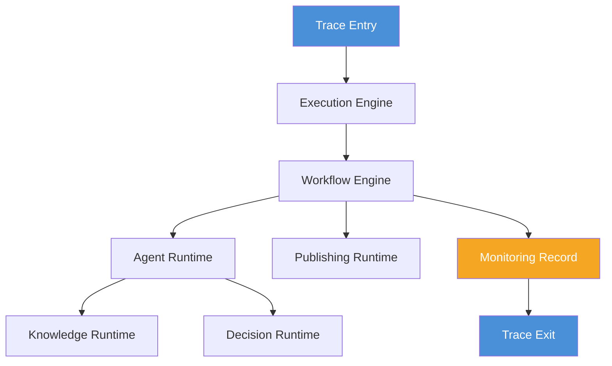
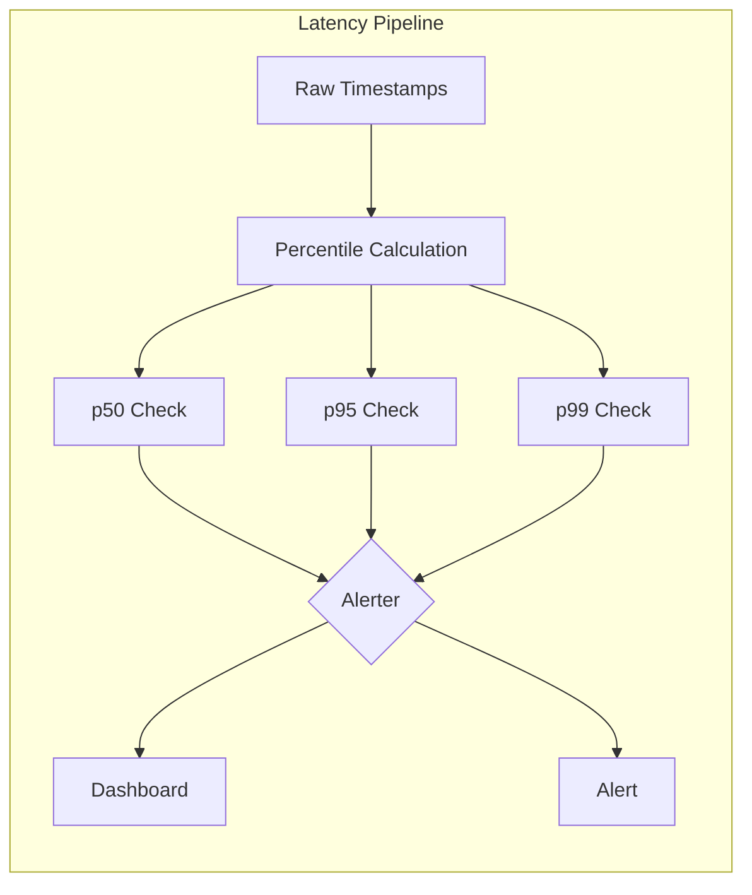
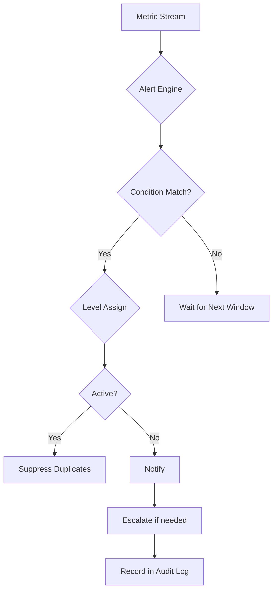
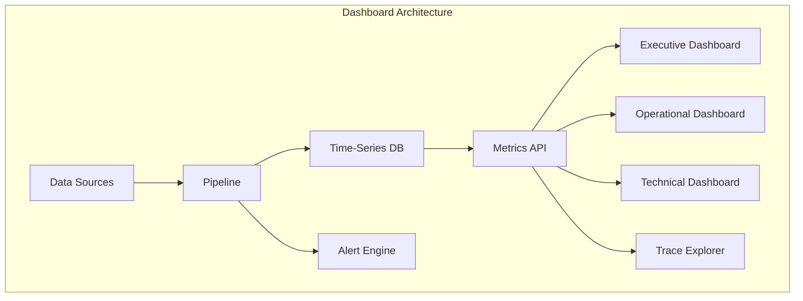
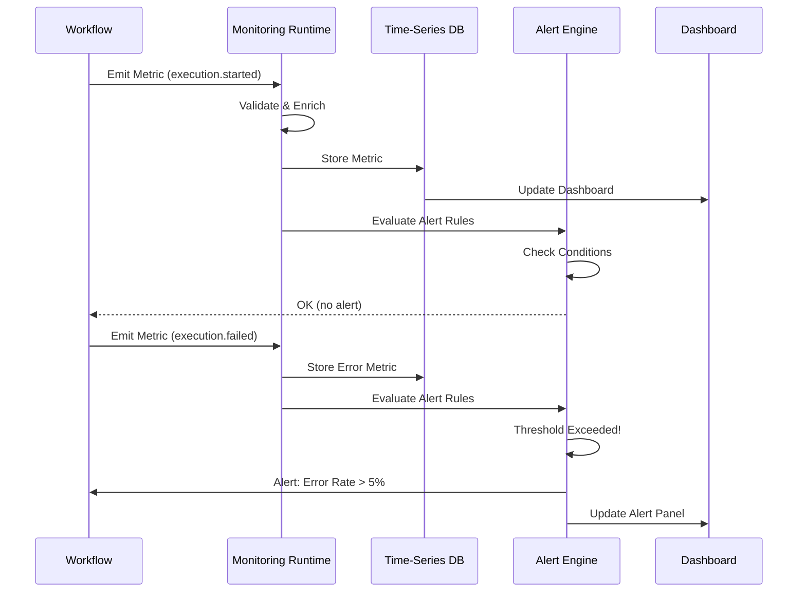
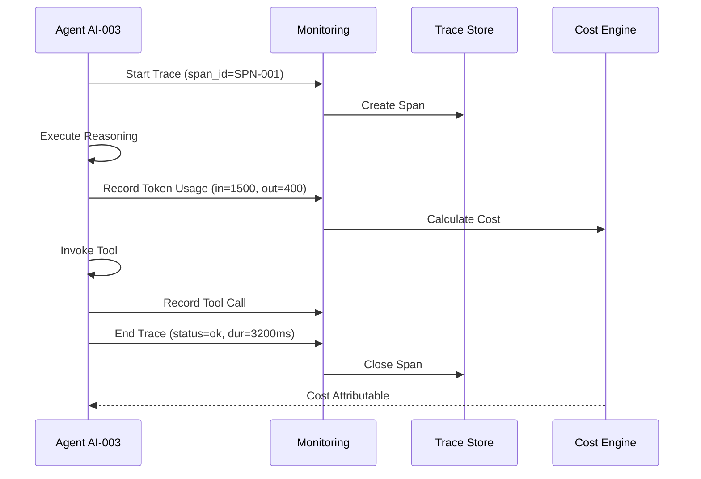

# SMOS-706 — Execution Monitoring Architecture

## 1. Document Control

| Field          | Value                                        |
| -------------- | -------------------------------------------- |
| Document ID    | SMOS-706                                     |
| Document Name  | Enterprise Execution Monitoring Architecture |
| Phase          | P7.S01                                       |
| Version        | 1.0.0-draft                                  |
| Status         | Draft                                        |
| Classification | Enterprise Architecture                      |
| Author         | SMOS Architecture Team                       |
| Owner          | Xennic (زر نور نیرو یکتا)                    |
| Created        | 2026-07-01                                   |
| Last Updated   | 2026-07-01                                   |
| Supersedes     | —                                            |

## 2. Purpose & Scope

This document defines the complete monitoring architecture for the SMOS execution system. It covers how every runtime component, agent, workflow, and resource is monitored, measured, traced, and audited during execution.

**Scope:**

- Runtime metrics collection and aggregation
- Distributed execution tracing
- Performance monitoring (latency, throughput, error rates)
- Resource monitoring (memory, tokens, compute)
- Tool, agent, calculation, and knowledge usage monitoring
- Cost tracking per execution unit
- Audit trail architecture
- Alerting and dashboard architecture

**Out of Scope:**

- Platform analytics (covered by AI-010, KNW-404)
- Business KPI monitoring
- User behavior analytics
- Implementation code or vendor-specific tooling

## 3. Monitoring Architecture Principles

| #      | Principle                 | Description                                                         |
| ------ | ------------------------- | ------------------------------------------------------------------- |
| MPR-01 | Observability by Design   | Every runtime component MUST emit telemetry by default              |
| MPR-02 | Zero-Overhead Baseline    | Monitoring overhead MUST be <1% of runtime resources                |
| MPR-03 | Structured Telemetry      | All metrics MUST use a canonical schema                             |
| MPR-04 | Trace-Context Propagation | Every execution MUST carry a trace ID across all runtimes           |
| MPR-05 | Real-Time Streaming       | Metrics MUST be available with <1s latency                          |
| MPR-06 | Immutable Audit           | Audit records MUST be append-only and tamper-evident                |
| MPR-07 | Cost Attribution          | Every metric MUST be attributable to an execution unit              |
| MPR-08 | Multi-Dimensional         | Metrics MUST support drill-down by agent, workflow, runtime, tenant |
| MPR-09 | Privacy-Preserving        | Monitoring MUST NOT expose PII or sensitive content                 |
| MPR-10 | Self-Monitoring           | The monitoring system MUST monitor its own health                   |

## 4. Monitoring Data Model

The monitoring system uses a hierarchical data model with four tiers:

```
Tier 0 — Raw Events
  │
  ▼
Tier 1 — Aggregated Metrics (1m, 5m, 1h windows)
  │
  ▼
Tier 2 — Derived Insights (trends, anomalies, predictions)
  │
  ▼
Tier 3 — Dashboards & Alerts (visualization, notification)
```

**Core Metric Types:**

| Type      | Description                    | Example                 |
| --------- | ------------------------------ | ----------------------- |
| Counter   | Monotonically increasing count | Total executions        |
| Gauge     | Point-in-time value            | Active agents           |
| Histogram | Distribution of values         | Latency p50/p95/p99     |
| Timer     | Duration measurement           | Workflow execution time |
| Meter     | Rate of events                 | Executions per second   |
| Trace     | Span tree of execution flow    | Full request trace      |

```json
{
  "$schema": "http://json-schema.org/draft-07/schema#",
  "$id": "smos:monitoring:metric:canonical",
  "title": "CanonicalMetric",
  "type": "object",
  "required": ["metric_id", "name", "type", "value", "timestamp", "labels"],
  "properties": {
    "metric_id": { "type": "string", "pattern": "^MTR-[A-Z0-9]{8}$" },
    "name": { "type": "string", "maxLength": 128 },
    "type": {
      "type": "string",
      "enum": ["counter", "gauge", "histogram", "timer", "meter", "trace"]
    },
    "value": { "type": "number" },
    "unit": { "type": "string", "enum": ["count", "ms", "bytes", "tokens", "percent", "rate"] },
    "timestamp": { "type": "string", "format": "date-time" },
    "labels": {
      "type": "object",
      "properties": {
        "runtime_id": { "type": "string" },
        "agent_id": { "type": "string" },
        "workflow_id": { "type": "string" },
        "execution_id": { "type": "string" },
        "tenant_id": { "type": "string" },
        "trace_id": { "type": "string" }
      },
      "required": ["execution_id"]
    },
    "tags": { "type": "object", "additionalProperties": { "type": "string" } }
  }
}
```

## 5. Runtime Metrics

Each runtime defined in SMOS-701 emits a standard set of metrics:

### Execution Engine Metrics

| Metric                    | Type    | Description                          |
| ------------------------- | ------- | ------------------------------------ |
| engine.executions.total   | Counter | Total executions initiated           |
| engine.executions.active  | Gauge   | Currently executing workflows        |
| engine.executions.queued  | Gauge   | Items waiting in queue               |
| engine.execution.duration | Timer   | End-to-end execution time            |
| engine.queue.latency      | Timer   | Time spent in queue before execution |

### Workflow Runtime Metrics

| Metric               | Type    | Description                      |
| -------------------- | ------- | -------------------------------- |
| workflow.started     | Counter | Workflows started                |
| workflow.completed   | Counter | Workflows completed successfully |
| workflow.failed      | Counter | Workflows failed                 |
| workflow.duration    | Timer   | Workflow execution duration      |
| workflow.steps.total | Counter | Total steps executed             |
| workflow.retries     | Counter | Retry attempts                   |

### Agent Runtime Metrics

| Metric                  | Type    | Description                 |
| ----------------------- | ------- | --------------------------- |
| agent.started           | Counter | Agent invocations started   |
| agent.completed         | Counter | Agent invocations completed |
| agent.failed            | Counter | Agent invocations failed    |
| agent.duration          | Timer   | Agent execution time        |
| agent.reasoning.latency | Timer   | Time spent in reasoning     |

### Knowledge Runtime Metrics

| Metric                       | Type    | Description                 |
| ---------------------------- | ------- | --------------------------- |
| knowledge.queries            | Counter | Knowledge queries performed |
| knowledge.hits               | Counter | Cache hits                  |
| knowledge.misses             | Counter | Cache misses                |
| knowledge.retrieval.duration | Timer   | Retrieval time              |
| knowledge.embedding.latency  | Timer   | Embedding generation time   |

### RAG Runtime Metrics

| Metric                  | Type    | Description                   |
| ----------------------- | ------- | ----------------------------- |
| rag.queries             | Counter | RAG queries performed         |
| rag.documents.retrieved | Counter | Documents retrieved per query |
| rag.relevance.score     | Gauge   | Average relevance score       |
| rag.generation.latency  | Timer   | Generation time               |
| rag.context.window      | Gauge   | Tokens used per generation    |

### Calculation Runtime Metrics

| Metric          | Type    | Description                  |
| --------------- | ------- | ---------------------------- |
| calc.executions | Counter | Calculations executed        |
| calc.duration   | Timer   | Calculation time             |
| calc.complexity | Gauge   | Calculation complexity score |
| calc.errors     | Counter | Calculation errors           |

### Decision Runtime Metrics

| Metric             | Type    | Description                  |
| ------------------ | ------- | ---------------------------- |
| decision.evaluated | Counter | Decisions evaluated          |
| decision.approved  | Counter | Decisions approved           |
| decision.rejected  | Counter | Decisions rejected           |
| decision.escalated | Counter | Decisions escalated to human |
| decision.duration  | Timer   | Decision evaluation time     |

### Learning Runtime Metrics

| Metric            | Type    | Description                 |
| ----------------- | ------- | --------------------------- |
| learning.cycles   | Counter | Learning cycles executed    |
| learning.insights | Counter | Insights generated          |
| learning.applied  | Counter | Learnings applied to system |
| learning.duration | Timer   | Learning cycle duration     |

### Publishing Runtime Metrics

| Metric            | Type    | Description             |
| ----------------- | ------- | ----------------------- |
| publish.attempted | Counter | Publication attempts    |
| publish.succeeded | Counter | Successful publications |
| publish.failed    | Counter | Failed publications     |
| publish.duration  | Timer   | Publication time        |
| publish.platforms | Counter | Target platform count   |

```json
{
  "$schema": "http://json-schema.org/draft-07/schema#",
  "$id": "smos:monitoring:runtime:metrics",
  "title": "RuntimeMetricCollection",
  "type": "object",
  "required": ["runtime_id", "runtime_type", "metrics", "collected_at"],
  "properties": {
    "runtime_id": { "type": "string" },
    "runtime_type": { "type": "string" },
    "metrics": {
      "type": "array",
      "items": { "$ref": "#/$defs/MetricEntry" },
      "minItems": 1
    },
    "collected_at": { "type": "string", "format": "date-time" },
    "collection_duration_ms": { "type": "integer", "minimum": 0 }
  },
  "$defs": {
    "MetricEntry": {
      "type": "object",
      "required": ["name", "value", "type"],
      "properties": {
        "name": { "type": "string" },
        "value": { "type": "number" },
        "type": { "type": "string" },
        "unit": { "type": "string" },
        "dimensions": { "type": "object" }
      }
    }
  }
}
```

## 6. Execution Tracing

Distributed tracing provides end-to-end visibility across runtime boundaries.

### Trace Model

```
Trace (trace_id)
  │
  ├── Span — ExecutionEngine.init
  │     ├── Span — WorkflowRuntime.execute
  │     │     ├── Span — AgentRuntime.invoke
  │     │     │     ├── Span — KnowledgeRuntime.query
  │     │     │     └── Span — DecisionRuntime.evaluate
  │     │     └── Span — PublishingRuntime.publish
  │     └── Span — MonitoringRuntime.record
  └── Span — WorkflowRuntime.complete
```



### Span Structure

```json
{
  "$schema": "http://json-schema.org/draft-07/schema#",
  "$id": "smos:monitoring:trace:span",
  "title": "ExecutionSpan",
  "type": "object",
  "required": ["span_id", "trace_id", "name", "start_time", "end_time", "status"],
  "properties": {
    "span_id": { "type": "string", "pattern": "^SPN-[A-Z0-9]{8}$" },
    "trace_id": { "type": "string", "pattern": "^TRC-[A-Z0-9]{12}$" },
    "parent_span_id": { "type": "string" },
    "name": { "type": "string" },
    "runtime_type": { "type": "string" },
    "start_time": { "type": "string", "format": "date-time" },
    "end_time": { "type": "string", "format": "date-time" },
    "duration_ms": { "type": "integer", "minimum": 0 },
    "status": { "type": "string", "enum": ["ok", "error", "timeout"] },
    "attributes": { "type": "object" },
    "events": {
      "type": "array",
      "items": {
        "type": "object",
        "properties": {
          "timestamp": { "type": "string", "format": "date-time" },
          "name": { "type": "string" },
          "attributes": { "type": "object" }
        }
      }
    }
  }
}
```

## 7. Performance Metrics

### Latency Monitoring

| Percentile | Target | Warning | Critical |
| ---------- | ------ | ------- | -------- |
| p50        | <500ms | <1s     | >1s      |
| p95        | <2s    | <5s     | >5s      |
| p99        | <5s    | <10s    | >10s     |



### Throughput Monitoring

| Metric       | Description                    |
| ------------ | ------------------------------ |
| executions/s | Workflows initiated per second |
| agents/s     | Agent invocations per second   |
| queries/s    | Knowledge queries per second   |
| tokens/s     | Tokens processed per second    |

### Error Rate Monitoring

| Error Type      | Threshold | Action   |
| --------------- | --------- | -------- |
| Execution Error | >1%       | Alert    |
| Agent Error     | >2%       | Escalate |
| Knowledge Error | >5%       | Warn     |
| Timeout         | >0.5%     | Alert    |

## 8. Memory Monitoring

Memory is tracked per runtime and per execution context:

| Metric            | Source            | Granularity        |
| ----------------- | ----------------- | ------------------ |
| heap.used         | Runtime process   | Per agent instance |
| heap.total        | Runtime process   | Per runtime        |
| context.size      | Execution context | Per execution      |
| cache.usage       | Knowledge runtime | Per cache shard    |
| embeddings.memory | Vector store      | Per index          |

```json
{
  "$schema": "http://json-schema.org/draft-07/schema#",
  "$id": "smos:monitoring:memory:usage",
  "title": "MemoryUsageRecord",
  "type": "object",
  "required": ["runtime_id", "heap_used_bytes", "heap_total_bytes", "timestamp"],
  "properties": {
    "runtime_id": { "type": "string" },
    "heap_used_bytes": { "type": "integer", "minimum": 0 },
    "heap_total_bytes": { "type": "integer", "minimum": 0 },
    "heap_percent": { "type": "number", "minimum": 0, "maximum": 100 },
    "context_count": { "type": "integer", "minimum": 0 },
    "cache_entries": { "type": "integer" },
    "cache_size_bytes": { "type": "integer" },
    "timestamp": { "type": "string", "format": "date-time" }
  }
}
```

## 9. Token Monitoring

Token usage is tracked at every LLM interaction point:

| Metric         | Description          | Attribution    |
| -------------- | -------------------- | -------------- |
| tokens.input   | Prompt tokens        | Per agent call |
| tokens.output  | Completion tokens    | Per agent call |
| tokens.total   | Sum of input+output  | Per execution  |
| tokens.cost    | Estimated cost       | Per workflow   |
| tokens.cache   | Cached tokens        | Per session    |
| tokens.context | Context window usage | Per agent      |

```json
{
  "$schema": "http://json-schema.org/draft-07/schema#",
  "$id": "smos:monitoring:token:usage",
  "title": "TokenUsageRecord",
  "type": "object",
  "required": ["execution_id", "agent_id", "input_tokens", "output_tokens", "model"],
  "properties": {
    "execution_id": { "type": "string" },
    "agent_id": { "type": "string" },
    "workflow_id": { "type": "string" },
    "input_tokens": { "type": "integer", "minimum": 0 },
    "output_tokens": { "type": "integer", "minimum": 0 },
    "total_tokens": { "type": "integer", "minimum": 0 },
    "cached_tokens": { "type": "integer", "minimum": 0 },
    "model": { "type": "string" },
    "estimated_cost": { "type": "number" },
    "currency": { "type": "string", "default": "USD" },
    "timestamp": { "type": "string", "format": "date-time" }
  }
}
```

## 10. Tool Usage Monitoring

Every tool call is monitored:

| Metric             | Description             |
| ------------------ | ----------------------- |
| tool.calls.total   | Total tool invocations  |
| tool.calls.success | Successful tool calls   |
| tool.calls.failed  | Failed tool calls       |
| tool.duration      | Tool execution duration |
| tool.retries       | Tool retry count        |

## 11. Agent Usage Monitoring

Agent-level monitoring covers:

| Metric                | Description                      |
| --------------------- | -------------------------------- |
| agent.invocations     | Number of times agent was called |
| agent.tokens.per_call | Average tokens per agent call    |
| agent.tools.used      | Number of tools invoked by agent |
| agent.reasoning.steps | Steps in reasoning chain         |
| agent.escalations     | Number of escalations to human   |
| agent.cost.total      | Total cost attributed to agent   |

## 12. Calculation Usage Monitoring

For the Calculation Runtime:

| Metric              | Description                      |
| ------------------- | -------------------------------- |
| calc.executions     | Calculations executed            |
| calc.duration       | Per-calculation timing           |
| calc.complexity     | Input size or formula complexity |
| calc.results.cached | Results served from cache        |
| calc.errors         | Calculation errors               |

## 13. Knowledge Usage Monitoring

For the Knowledge Runtime:

| Metric                 | Description                   |
| ---------------------- | ----------------------------- |
| knw.queries            | Knowledge queries submitted   |
| knw.documents.returned | Documents retrieved per query |
| knw.relevance          | Average retrieval relevance   |
| knw.cache.hit_rate     | Cache hit percentage          |
| knw.embedding.requests | Embedding generation requests |
| knw.index.searches     | Vector index searches         |

## 14. Cost Tracking

Cost is tracked at multiple granularity levels:

| Level         | Attribution Model | Example                        |
| ------------- | ----------------- | ------------------------------ |
| Per Token     | Direct            | Model input/output cost        |
| Per Call      | Direct            | Agent invocation cost          |
| Per Execution | Aggregated        | Complete workflow cost         |
| Per Agent     | Aggregated        | All costs for AI-003           |
| Per Workflow  | Aggregated        | All costs for workflow WKF-001 |
| Per Tenant    | Aggregated        | All costs for workspace        |
| Per Period    | Summarized        | Daily/weekly/monthly cost      |

```json
{
  "$schema": "http://json-schema.org/draft-07/schema#",
  "$id": "smos:monitoring:cost:record",
  "title": "CostRecord",
  "type": "object",
  "required": ["record_id", "execution_id", "cost_type", "amount", "currency"],
  "properties": {
    "record_id": { "type": "string", "pattern": "^CST-[A-Z0-9]{10}$" },
    "execution_id": { "type": "string" },
    "agent_id": { "type": "string" },
    "workflow_id": { "type": "string" },
    "runtime_type": { "type": "string" },
    "cost_type": {
      "type": "string",
      "enum": [
        "token_input",
        "token_output",
        "tool_call",
        "embedding",
        "compute",
        "storage",
        "network"
      ]
    },
    "amount": { "type": "number" },
    "currency": { "type": "string", "default": "USD" },
    "resource_id": { "type": "string" },
    "quantity": { "type": "number" },
    "unit_price": { "type": "number" },
    "timestamp": { "type": "string", "format": "date-time" },
    "labels": { "type": "object" }
  }
}
```

## 15. Audit Trail

The audit trail is an immutable, append-only log of all significant execution events.

### Audit Event Types

| Event Category | Events                                                |
| -------------- | ----------------------------------------------------- |
| Execution      | ExecutionStarted, ExecutionCompleted, ExecutionFailed |
| Security       | AccessGranted, AccessDenied, PermissionChanged        |
| Configuration  | ConfigChanged, FeatureToggled, PolicyUpdated          |
| Data           | DataExported, DataDeleted, DataArchived               |
| Approval       | ApprovalRequested, ApprovalGranted, ApprovalRejected  |
| Escalation     | EscalationRaised, EscalationResolved                  |

### Audit Record Schema

```json
{
  "$schema": "http://json-schema.org/draft-07/schema#",
  "$id": "smos:monitoring:audit:record",
  "title": "AuditRecord",
  "type": "object",
  "required": ["audit_id", "event_type", "actor", "action", "timestamp", "hash"],
  "properties": {
    "audit_id": { "type": "string", "pattern": "^AUD-[A-Z0-9]{12}$" },
    "event_type": { "type": "string" },
    "actor": {
      "type": "object",
      "required": ["id", "type"],
      "properties": {
        "id": { "type": "string" },
        "type": { "type": "string", "enum": ["user", "agent", "workflow", "system"] }
      }
    },
    "action": { "type": "string" },
    "resource": {
      "type": "object",
      "properties": {
        "type": { "type": "string" },
        "id": { "type": "string" }
      }
    },
    "timestamp": { "type": "string", "format": "date-time" },
    "hash": { "type": "string", "description": "SHA-256 hash of previous audit record" },
    "previous_hash": { "type": "string" },
    "chain_index": { "type": "integer" },
    "details": { "type": "object" },
    "immutable": { "type": "boolean", "const": true }
  }
}
```

## 16. Alerting Architecture

### Alert Levels

| Level | Severity  | Response Time | Escalation           |
| ----- | --------- | ------------- | -------------------- |
| L1    | Info      | None          | No escalation        |
| L2    | Warning   | <30m          | Team lead            |
| L3    | Error     | <10m          | Engineering lead     |
| L4    | Critical  | <5m           | On-call + management |
| L5    | Emergency | Immediate     | Full escalation      |

### Alert Rules

```json
{
  "$schema": "http://json-schema.org/draft-07/schema#",
  "$id": "smos:monitoring:alert:rule",
  "title": "AlertRule",
  "type": "object",
  "required": ["rule_id", "name", "condition", "severity", "actions"],
  "properties": {
    "rule_id": { "type": "string", "pattern": "^ALR-[A-Z0-9]{6}$" },
    "name": { "type": "string" },
    "description": { "type": "string" },
    "enabled": { "type": "boolean", "default": true },
    "condition": {
      "type": "object",
      "required": ["metric", "operator", "threshold"],
      "properties": {
        "metric": { "type": "string" },
        "operator": { "type": "string", "enum": ["gt", "lt", "gte", "lte", "eq", "neq"] },
        "threshold": { "type": "number" },
        "duration_seconds": { "type": "integer" },
        "evaluation_window": { "type": "string" }
      }
    },
    "severity": { "type": "string", "enum": ["L1", "L2", "L3", "L4", "L5"] },
    "actions": {
      "type": "array",
      "items": {
        "type": "object",
        "properties": {
          "type": { "type": "string", "enum": ["email", "webhook", "slack", "pager", "log"] },
          "target": { "type": "string" }
        }
      }
    },
    "escalation_path": { "type": "string" }
  }
}
```



## 17. Dashboard Architecture

### Dashboard Tiers

| Tier             | Audience   | Refresh   | Detail Level     |
| ---------------- | ---------- | --------- | ---------------- |
| T1 — Executive   | C-level    | Daily     | Summary KPIs     |
| T2 — Operational | Team leads | 5m        | Runtime health   |
| T3 — Technical   | Engineers  | Real-time | Detailed metrics |
| T4 — Debug       | Developers | Real-time | Trace-level data |

### Standard Dashboards

| Dashboard         | Metrics                                  | Tier   |
| ----------------- | ---------------------------------------- | ------ |
| System Health     | All runtime health, error rates, latency | T1, T2 |
| Agent Performance | Agent invocations, tokens, costs         | T2, T3 |
| Workflow Status   | Running/completed/failed workflows       | T2     |
| Cost Dashboard    | Cost per agent, workflow, tenant         | T1, T2 |
| Token Usage       | Token consumption trends                 | T2, T3 |
| Trace Explorer    | Full trace search and visualization      | T3, T4 |



## 18. Monitoring Data Retention

| Data Type    | Hot Storage | Warm Storage | Cold Storage | Deletion |
| ------------ | ----------- | ------------ | ------------ | -------- |
| Metrics      | 7 days      | 30 days      | 1 year       | 3 years  |
| Traces       | 3 days      | 14 days      | 90 days      | 1 year   |
| Audit Log    | 30 days     | 1 year       | 7 years      | Never    |
| Alerts       | 30 days     | 90 days      | 2 years      | 5 years  |
| Cost Records | 90 days     | 1 year       | 3 years      | 7 years  |

## 19. Monitoring Security

| Control          | Description                                       |
| ---------------- | ------------------------------------------------- |
| Access Control   | Read-only metrics for operators, write for system |
| Encryption       | Data encrypted at rest and in transit             |
| Audit Protection | Audit trail append-only, hash-chained             |
| PII Filtering    | PII stripped before metric ingestion              |
| Rate Limiting    | Per-source metric submission limits               |
| Validation       | Schema validation on all metric ingestion         |

## 20. Schema Definitions

| Schema ID                          | Description               | Reference |
| ---------------------------------- | ------------------------- | --------- |
| `smos:monitoring:metric:canonical` | Canonical metric format   | §4        |
| `smos:monitoring:runtime:metrics`  | Runtime metric collection | §5        |
| `smos:monitoring:trace:span`       | Execution trace span      | §6        |
| `smos:monitoring:memory:usage`     | Memory usage record       | §8        |
| `smos:monitoring:token:usage`      | Token usage record        | §9        |
| `smos:monitoring:cost:record`      | Cost tracking record      | §14       |
| `smos:monitoring:audit:record`     | Audit trail record        | §15       |
| `smos:monitoring:alert:rule`       | Alert rule definition     | §16       |

## 21. Monitoring Flow Examples





## 22. Cross-Reference Matrix

| Document | Relationship                         | Monitoring Relevance  |
| -------- | ------------------------------------ | --------------------- |
| SMOS-701 | Defines runtimes monitored           | Each runtime §5       |
| SMOS-702 | State machine events to trace        | State transitions §15 |
| SMOS-703 | Context for metric attribution       | Context labels §4     |
| SMOS-704 | Workflow-level monitoring            | Workflow metrics §5   |
| SMOS-705 | Event sources                        | Event monitoring §15  |
| SMOS-707 | Security for monitoring data         | Auth & audit §19      |
| AI-010   | Analytics & performance intelligence | KPI alignment         |
| KNW-404  | Operations reporting knowledge       | Dashboard design §17  |
| KNW-306  | Platform quality metrics             | Metric definitions    |
| AUT-000  | Automation metrics                   | Workflow monitoring   |

## 23. Architectural Decisions

| ID          | Decision                            | Rationale              |
| ----------- | ----------------------------------- | ---------------------- |
| ADR-MON-001 | Use pull-based metric collection    | Reduces agent overhead |
| ADR-MON-002 | Implement trace sampling (1:100)    | Controls data volume   |
| ADR-MON-003 | Hash-chain audit trail              | Tamper-evident logging |
| ADR-MON-004 | Real-time streaming for metrics     | Sub-second alerting    |
| ADR-MON-005 | Cost attribution at execution level | Granular cost tracking |

## 24. Maturity Model

| Level | State      | Capabilities                       |
| ----- | ---------- | ---------------------------------- |
| ML-01 | Initial    | Basic counters, manual dashboards  |
| ML-02 | Structured | Standardized metrics, basic alerts |
| ML-03 | Integrated | Distributed tracing, cost tracking |
| ML-04 | Predictive | Anomaly detection, trend analysis  |
| ML-05 | Adaptive   | Auto-remediation, self-tuning      |

**Current Target:** ML-03

## 25. Gaps & Future Work

| Gap ID | Gap Description            | Impact                       | Target |
| ------ | -------------------------- | ---------------------------- | ------ |
| GAP-01 | No anomaly detection       | Blind to novel issues        | P8     |
| GAP-02 | No auto-remediation        | Manual incident response     | P8     |
| GAP-03 | Limited trace retention    | Debugging old issues hard    | P7.S02 |
| GAP-04 | No cross-tenant dashboards | Multi-tenant monitoring gap  | P7.S03 |
| GAP-05 | Cost forecasting missing   | Budget planning difficult    | P8     |
| GAP-06 | Alert fatigue possible     | Too many low-severity alerts | P7.S02 |

---

**End of SMOS-706**
