# Enterprise Runtime Security Architecture — معماری امنیت زمان اجرای سازمانی SMOS

> **شناسه:** SMOS-707
> **وضعیت:** پیش‌نویس
> **نسخه:** 1.0.0-draft
> **خانواده:** EXEC
> **دامنه:** EXD-07
> **نوع:** Enterprise Runtime Security Architecture
> **تاریخ:** 2026-07-01
> **مسئول:** معمار امنیت زمان اجرا
> **SSOT:** ✅ بله — تک منبع حقیقت امنیت زمان اجرای SMOS
> **وابستگی:** SMOS-701, SMOS-702, SMOS-703, SMOS-705, KNW-308, KNW-402, KNW-501, KNW-502, KNW-503, KNW-504, KNW-505, KNW-506, KNW-507, KNW-508, AI-000, AUT-000, PRM-000, GOV-001, GOV-002, GOV-003, GOV-004, GOV-005, GOV-006
> **مخاطب:** security-architect, system-architect, ai-architect, automation-engineer, compliance-officer, risk-manager, devops-engineer, ai-agent, mcp

---

## ۱. Executive Summary

SMOS-707 معماری امنیت زمان اجرای سازمانی SMOS را تعریف می‌کند. این سند به عنوان **تک منبع حقیقت (SSOT)** برای تمام جنبه‌های امنیت در لایه اجرای سیستم — شامل مجوزدهی اجرا، مجوزدهی ابزار، ایزوله‌سازی بافت، ایزوله‌سازی فضای کار، اجرای سیاست، اعتبارسنجی پیش از اجرا، سندباکس اجرا، امنیت پرامپت، امنیت عامل و امنیت گردش کار — عمل می‌کند.

### چرا SMOS-707 وجود دارد

SMOS یک سیستم عامل سازمانی با هشت Runtime مجزا است که هر کدام عملیات بحرانی اجرا می‌کنند. بدون معماری امنیت زمان اجرا:

- عملیات Runtime بدون مدل امنیتی یکپارچه اجرا می‌شوند
- دسترسی Agentها به ابزارها و منابع بدون کنترل باقی می‌ماند
- بافت‌های اجرایی با یکدیگر تداخل پیدا می‌کنند
- فضای کار مستأجرها (Tenantها) از یکدیگر جدا نیست
- سیاست‌های امنیتی بدون موتور اجرا و اعمال نمی‌شوند
- پرامپت‌ها در برابر تزریق (Injection) آسیب‌پذیر هستند
- هویت Agentها قابل تأیید نیست
- ممیزی امنیتی ناقص و غیرقابل اعتماد است

SMOS-707 این شکاف را با تعریف یک **معماری امنیت زمان اجرای لایه‌ای** پر می‌کند که ده دامنه امنیتی، شش Schema اصلی، یک مدل تهدید و یک مدل بلوغ را تعریف می‌کند.

### معماری امنیت زمان اجرا در یک نگاه

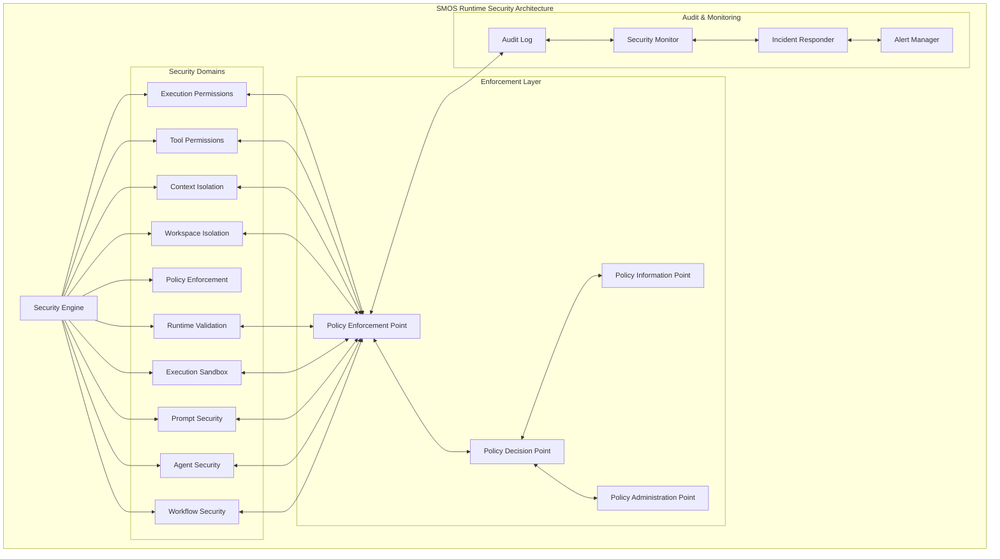
```mermaid
graph TB
    subgraph "SMOS Runtime Security Architecture"
        SEC[Security Engine]

        subgraph "Security Domains"
            EP[Execution Permissions]
            TP[Tool Permissions]
            CI[Context Isolation]
            WI[Workspace Isolation]
            PE[Policy Enforcement]
            RV[Runtime Validation]
            ES[Execution Sandbox]
            PS[Prompt Security]
            AS[Agent Security]
            WS[Workflow Security]
        end

        subgraph "Enforcement Layer"
            PEP[Policy Enforcement Point]
            PDP[Policy Decision Point]
            PIP[Policy Information Point]
            PAP[Policy Administration Point]
        end

        subgraph "Audit & Monitoring"
            AL[Audit Log]
            SM[Security Monitor]
            IR[Incident Responder]
            AM[Alert Manager]
        end

        SEC --> EP
        SEC --> TP
        SEC --> CI
        SEC --> WI
        SEC --> PE
        SEC --> RV
        SEC --> ES
        SEC --> PS
        SEC --> AS
        SEC --> WS

        EP <--> PEP
        TP <--> PEP
        CI <--> PEP
        WI <--> PEP
        RV <--> PEP
        ES <--> PEP
        PS <--> PEP
        AS <--> PEP
        WS <--> PEP

        PEP <--> PDP
        PDP <--> PIP
        PDP <--> PAP

        PEP <--> AL
        AL <--> SM
        SM <--> IR
        IR <--> AM
    end
```

---

## ۲. Purpose & Scope

### ۲.۱ Purpose

SMOS-707 معماری امنیت زمان اجرای سازمانی SMOS را تعریف می‌کند با اهداف زیر:

1. **تعریف مدل امنیتی یکپارچه Runtime**: همه هشت Runtime از یک چارچوب امنیتی واحد پیروی می‌کنند
2. **جلوگیری از دسترسی غیرمجاز**: هر عملیات، ابزار و منبع با مدل مجوزدهی دقیق کنترل می‌شود
3. **ایزوله‌سازی کامل**: بافت‌ها، فضاهای کار و فرآیندهای اجرا از یکدیگر ایزوله می‌شوند
4. **قابلیت اعمال سیاست**: سیاست‌های امنیتی به صورت خودکار و یکپارچه اجرا می‌شوند
5. **قابلیت حسابرسی**: تمام رویدادهای امنیتی قابل ردیابی، حسابرسی و بازرسی هستند
6. **مقاومت در برابر حمله**: سیستم در برابر تزریق پرامپت، فرار از سندباکس و حملات زنجیره تأمین مقاوم است

### ۲.۲ Inside Scope

| حوزه                  | توضیح                                               |
| --------------------- | --------------------------------------------------- |
| Execution Permissions | مدل مجوزدهی برای اجرای عملیات در Runtimeها          |
| Tool Permissions      | کنترل دسترسی سطح ابزار برای هر Agent                |
| Context Isolation     | مرزهای ایزوله‌سازی بین بافت‌های اجرایی              |
| Workspace Isolation   | جداسازی مستأجرها (Tenantها) در سطح فضای کار         |
| Policy Enforcement    | موتور سیاست، RBAC، ABAC و enforcing                 |
| Runtime Validation    | اعتبارسنجی پیش از اجرا برای همه عملیات              |
| Execution Sandbox     | معماری سندباکس برای اجرای امن Agentها               |
| Prompt Security       | جلوگیری از تزریق پرامپت، اعتبارسنجی ورودی           |
| Agent Security        | هویت Agent، مجوزهای Agent، تأیید هویت               |
| Workflow Security     | کنترل دسترسی سطح گردش کار                           |
| Data Security         | طبقه‌بندی داده‌ها، رمزنگاری در حال استراحت و انتقال |
| Audit Security        | ثبت امن رویدادها، زنجیره امانت                      |
| Incident Response     | پاسخ به حادثه امنیتی در زمان اجرا                   |
| Threat Model          | مدل تهدید برای سیستم اجرا                           |

### ۲.۳ Outside Scope

| حوزه                          | دلیل                        |
| ----------------------------- | --------------------------- |
| Network Security              | تحت پوشش GOV-006 و KNW-308  |
| Physical Security             | خارج از دامنه SMOS          |
| Application Code Security     | تحت پوشش CI/CD و DEPLOY-001 |
| Identity Provider             | تحت پوشش KNW-308            |
| Key Management Infrastructure | تحت پوشش KNW-308            |
| Third-party Platform Security | تحت پوشش PLAT-\*            |

### ۲.۴ نقش SMOS-707 در SMOS

| سند          | نقش                                                         |
| ------------ | ----------------------------------------------------------- |
| SMOS-701     | SSOT معماری اجرای سازمانی — مصرف‌کننده مدل امنیت            |
| SMOS-702     | SSOT ماشین حالت اجرا — مصرف‌کننده گیت‌های امنیت             |
| SMOS-703     | SSOT مدل بافت اجرا — مصرف‌کننده Context Isolation           |
| SMOS-705     | SSOT معماری رویداد — مصرف‌کننده Audit Security              |
| **SMOS-707** | **SSOT امنیت زمان اجرا — تعریف‌کننده همه دامنه‌های امنیتی** |
| KNW-308      | معماری امنیت پلتفرم — مرجع سطوح اعتماد، هویت و دسترسی       |
| KNW-402      | معماری حکمرانی عملیات — مرجع سیاست‌های عملیاتی              |
| AI-000       | معماری مادر Agent — مصرف‌کننده Agent Security               |

---

## ۳. Runtime Security Principles — اصول امنیت زمان اجرا

SMOS-707 بر ۱۲ اصل بنیادین استوار است:

| #      | اصل                         | توضیح                                                                         |
| ------ | --------------------------- | ----------------------------------------------------------------------------- |
| RSP-01 | **Least Privilege**         | هر موجودیت (Agent, Workflow, User) حداقل دسترسی لازم برای انجام وظیفه را دارد |
| RSP-02 | **Defense in Depth**        | امنیت در چند لایه — شکست یک لایه به معنای شکست کل سیستم نیست                  |
| RSP-03 | **Fail Secure**             | در صورت خطا، سیستم به حالت امن (Secure State) می‌رود نه حالت باز              |
| RSP-04 | **Secure by Default**       | پیش‌فرض همه دسترسی‌ها ممنوع است — دسترسی باید صریاً اعطا شود                  |
| RSP-05 | **Complete Mediation**      | هر دسترسی در هر بار درخواست بررسی می‌شود — هیچ دسترسی کش نمی‌شود              |
| RSP-06 | **Separation of Duties**    | هیچ موجودیتی به تنهایی نمی‌تواند عملیات بحرانی را کامل کند                    |
| RSP-07 | **Trust but Verify**        | حتی موجودیت‌های معتبر نیز در زمان اجرا اعتبارسنجی می‌شوند                     |
| RSP-08 | **Audit Everything**        | تمام رویدادهای امنیتی بدون استثنا ثبت می‌شوند                                 |
| RSP-09 | **Isolation by Default**    | همه بافت‌ها، فضاهای کار و فرآیندها به صورت پیش‌فرض ایزوله هستند               |
| RSP-10 | **Immutable Audit**         | لاگ‌های امنیتی پس از ثبت قابل تغییر نیستند (WORM)                             |
| RSP-11 | **Input Validation**        | تمام ورودی‌های خارجی قبل از پردازش اعتبارسنجی و پالایش می‌شوند                |
| RSP-12 | **Continuous Verification** | اعتبار موجودیت‌ها در طول اجرا به طور مداوم بررسی می‌شود                       |

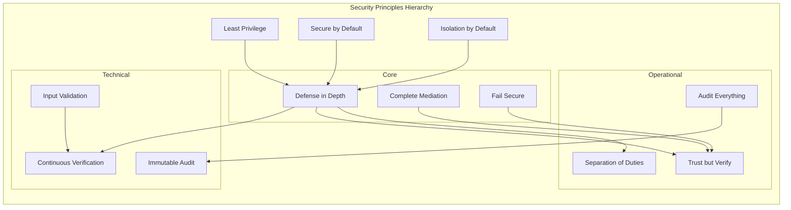
```mermaid
graph LR
    subgraph "Security Principles Hierarchy"
        RSP01[Least Privilege]
        RSP04[Secure by Default]
        RSP09[Isolation by Default]

        subgraph "Core"
            RSP02[Defense in Depth]
            RSP03[Fail Secure]
            RSP05[Complete Mediation]
        end

        subgraph "Operational"
            RSP06[Separation of Duties]
            RSP07[Trust but Verify]
            RSP08[Audit Everything]
        end

        subgraph "Technical"
            RSP10[Immutable Audit]
            RSP11[Input Validation]
            RSP12[Continuous Verification]
        end

        RSP01 --> RSP02
        RSP04 --> RSP02
        RSP09 --> RSP02
        RSP02 --> RSP06
        RSP02 --> RSP07
        RSP02 --> RSP12
        RSP05 --> RSP07
        RSP03 --> RSP07
        RSP08 --> RSP10
        RSP11 --> RSP12
    end
```

---

## ۴. Threat Model for Execution System — مدل تهدید برای سیستم اجرا

### ۴.۱ دسته‌بندی تهدیدات

| شناسه     | تهدید                                       | سطح ریسک | دامنه تأثیر | منبع تهدید        |
| --------- | ------------------------------------------- | -------- | ----------- | ----------------- |
| THR-RT-01 | **تزریق پرامپت (Prompt Injection)**         | بحرانی   | PS, AS      | ورودی Agent       |
| THR-RT-02 | **فرار از سندباکس (Sandbox Escape)**        | بحرانی   | ES          | Agent مخرب        |
| THR-RT-03 | **دسترسی غیرمجاز به ابزار**                 | بالا     | TP          | Agent نفوذی       |
| THR-RT-04 | **تداخل بافت (Context Leakage)**            | بالا     | CI          | خطای ایزوله‌سازی  |
| THR-RT-05 | **نشت داده بین مستأجرها**                   | بحرانی   | WI          | خطای جداسازی      |
| THR-RT-06 | **دور زدن سیاست (Policy Bypass)**           | بالا     | PE          | مهاجم داخلی       |
| THR-RT-07 | **اجرای کد دلخواه**                         | بحرانی   | ES          | Agent مخرب        |
| THR-RT-08 | **حمله زنجیره تأمین (Supply Chain)**        | بالا     | WS, AS      | وابستگی آلوده     |
| THR-RT-09 | **بازپخش درخواست (Replay Attack)**          | متوسط    | EP, AS      | مهاجم شبکه        |
| THR-RT-10 | **تغییر لاگ امنیتی**                        | متوسط    | Audit       | مهاجم داخلی       |
| THR-RT-11 | **حمله DoS روی Runtime**                    | متوسط    | همه         | مهاجم خارجی       |
| THR-RT-12 | **سوءاستفاده از اعتبار (Credential Abuse)** | بالا     | AS, WS      | مهاجم خارجی       |
| THR-RT-13 | **افشای فراداده (Metadata Leakage)**        | متوسط    | CI, WI      | خطای پیکربندی     |
| THR-RT-14 | **حمله زمان‌بندی (Timing Attack)**          | کم       | EP, AS      | مهاجم شبکه        |
| THR-RT-15 | **تزریق دستور (Command Injection)**         | بحرانی   | RV, ES      | ورودی پردازش‌نشده |

### ۴.۲ ماتریس کاهش تهدید

| شناسه     | راهکار کاهشی                                                      | سند مرتبط   | اولویت |
| --------- | ----------------------------------------------------------------- | ----------- | ------ |
| THR-RT-01 | اعتبارسنجی ورودی، پالایش پرامپت، جداسازی دستورالعمل               | §۱۲ این سند | P0     |
| THR-RT-02 | سندباکس سخت‌افزاری، محدودیت syscall, namespace                    | §۱۱ این سند | P0     |
| THR-RT-03 | مجوزدهی سطح ابزار، بررسی هر تماس                                  | §۶ این سند  | P0     |
| THR-RT-04 | Context Boundary, Memory Isolation, Label-Based Separation        | §۷ این سند  | P0     |
| THR-RT-05 | Workspace Namespace, Data Segregation, Tenant ID Enforcement      | §۸ این سند  | P0     |
| THR-RT-06 | Policy Engine, PDP/PEP Separation, Policy Integrity Check         | §۹ این سند  | P1     |
| THR-RT-07 | Sandbox Restriction, Capability Dropping, Read-only FS            | §۱۱ این سند | P0     |
| THR-RT-08 | Signature Verification, Integrity Check, Supply Chain Attestation | §۱۴ این سند | P1     |
| THR-RT-09 | Nonce, Timestamp, HMAC, Session Binding                           | §۵ این سند  | P1     |
| THR-RT-10 | WORM Storage, Digital Signature, Blockchain Anchoring             | §۱۶ این سند | P1     |
| THR-RT-11 | Rate Limiting, Resource Quota, Circuit Breaker                    | §۹ این سند  | P1     |
| THR-RT-12 | Mutual TLS, Token Rotation, Short-lived Credentials               | §۱۳ این سند | P0     |
| THR-RT-13 | Metadata Classification, Output Filtering, Minimal Disclosure     | §۱۵ این سند | P2     |
| THR-RT-14 | Constant-time Comparison, Jitter, Randomized Delay                | §۵ این سند  | P2     |
| THR-RT-15 | Input Sanitization, Parameterized Execution, Allowlist            | §۱۰ این سند | P0     |

### ۴.۳ سناریوهای حمله

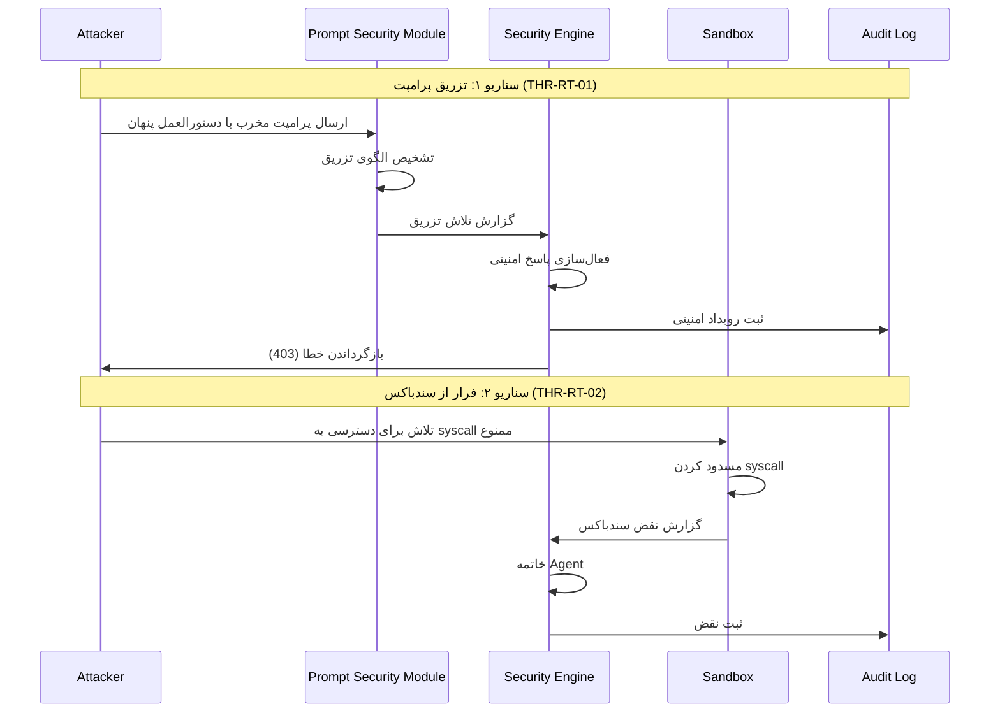
```mermaid
sequenceDiagram
    participant A as Attacker
    participant PSM as Prompt Security Module
    participant SEC as Security Engine
    participant SAN as Sandbox
    participant AUD as Audit Log

    Note over A,AUD: سناریو ۱: تزریق پرامپت (THR-RT-01)
    A->>PSM: ارسال پرامپت مخرب با دستورالعمل پنهان
    PSM->>PSM: تشخیص الگوی تزریق
    PSM->>SEC: گزارش تلاش تزریق
    SEC->>SEC: فعال‌سازی پاسخ امنیتی
    SEC->>AUD: ثبت رویداد امنیتی
    SEC->>A: بازگرداندن خطا (403)

    Note over A,AUD: سناریو ۲: فرار از سندباکس (THR-RT-02)
    A->>SAN: تلاش برای دسترسی به syscall ممنوع
    SAN->>SAN: مسدود کردن syscall
    SAN->>SEC: گزارش نقض سندباکس
    SEC->>SEC: خاتمه Agent
    SEC->>AUD: ثبت نقض
```

---

## ۵. Execution Permissions — مدل مجوزدهی اجرا

### ۵.۱ معماری مجوزدهی

مدل مجوزدهی اجرای SMOS از الگوی **Policy Decision Point (PDP) / Policy Enforcement Point (PEP)** پیروی می‌کند:

- **PEP (Policy Enforcement Point)**: در هر Runtime قرار دارد و درخواست‌های اجرا را قبل از اجرا متوقف کرده و از PDP مجوز می‌گیرد
- **PDP (Policy Decision Point)**: تصمیم مجوز را بر اساس سیاست‌ها و بافت درخواست اتخاذ می‌کند
- **PIP (Policy Information Point)**: اطلاعات بافت (نقش، سطح دسترسی، وضعیت) را فراهم می‌کند
- **PAP (Policy Administration Point)**: مدیریت و نسخه‌بندی سیاست‌ها را انجام می‌دهد

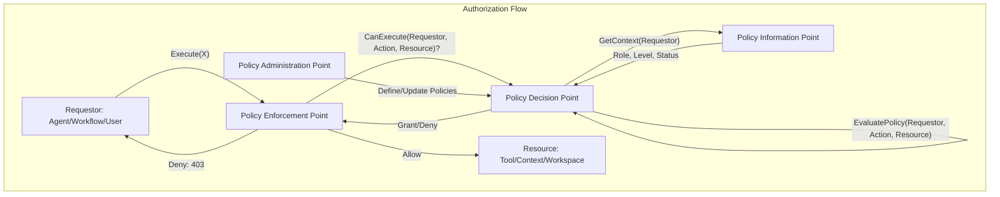
```mermaid
graph TD
    subgraph "Authorization Flow"
        REQ[Requestor: Agent/Workflow/User]
        PEP[Policy Enforcement Point]
        PDP[Policy Decision Point]
        PIP[Policy Information Point]
        PAP[Policy Administration Point]
        RES[Resource: Tool/Context/Workspace]

        REQ -->|"Execute(X)"| PEP
        PEP -->|"CanExecute(Requestor, Action, Resource)?"| PDP
        PDP -->|"GetContext(Requestor)"| PIP
        PIP -->|"Role, Level, Status"| PDP
        PDP -->|"EvaluatePolicy(Requestor, Action, Resource)"| PDP
        PDP -->|"Grant/Deny"| PEP
        PEP -->|"Allow"| RES
        PEP -->|"Deny: 403"| REQ
        PAP -->|"Define/Update Policies"| PDP
    end
```

### ۵.۲ سطح‌های مجوز اجرا

| سطح | شناسه           | توضیح                                 | مثال              |
| --- | --------------- | ------------------------------------- | ----------------- |
| A-0 | No Access       | هیچ دسترسی اجرایی ندارد               | Agent غیرفعال     |
| A-1 | Read-Only       | فقط خواندن وضعیت و داده               | Agent بازبینی     |
| A-2 | Execute Limited | اجرای عملیات محدود و از پیش تعریف‌شده | Agent تولید محتوا |
| A-3 | Execute Full    | اجرای تمام عملیات در دامنه مجاز       | Agent استراتژی    |
| A-4 | Admin           | اجرای هر عملیات + مدیریت سیاست‌ها     | Orchestrator      |

### ۵.۳ انواع مجوز اجرا

| نوع مجوز | شناسه      | توضیح                              |
| -------- | ---------- | ---------------------------------- |
| Execute  | PERM-EXEC  | اجازه اجرای یک عملیات خاص          |
| Read     | PERM-READ  | اجازه خواندن وضعیت یا داده         |
| Write    | PERM-WRITE | اجازه نوشتن یا تغییر وضعیت         |
| Delegate | PERM-DEL   | اجازه واگذاری مجوز به موجودیت دیگر |
| Admin    | PERM-ADMIN | اجازه مدیریت سیاست‌ها و مجوزها     |
| Audit    | PERM-AUDIT | اجازه مشاهده لاگ‌های امنیتی        |

### ۵.۴ شرایط مجوز (Conditions)

مجوزها می‌توانند مشروط باشند:

| شرط             | توضیح                                              |
| --------------- | -------------------------------------------------- |
| Time-based      | مجوز فقط در بازه زمانی مشخص معتبر است              |
| Resource-based  | مجوز محدود به یک منبع خاص است                      |
| Role-based      | مجوز وابسته به نقش درخواست‌کننده است               |
| Attribute-based | مجوز وابسته به ویژگی‌های درخواست‌کننده یا محیط است |
| Hierarchy-based | مجوز به صورت سلسله‌مراتبی به ارث می‌رسد            |
| Quota-based     | مجوز محدود به سهمیه استفاده است                    |

---

## ۶. Tool Permissions — مجوزدهی سطح ابزار

### ۶.۱ معماری مجوز ابزار

هر ابزار در SMOS یک **شناسه ابزار (Tool ID)** دارد و دسترسی به آن از طریق **Tool Permission Policy** کنترل می‌شود. هیچ Agent یا Workflow نمی‌تواند ابزاری را بدون مجوز صریح فراخوانی کند.

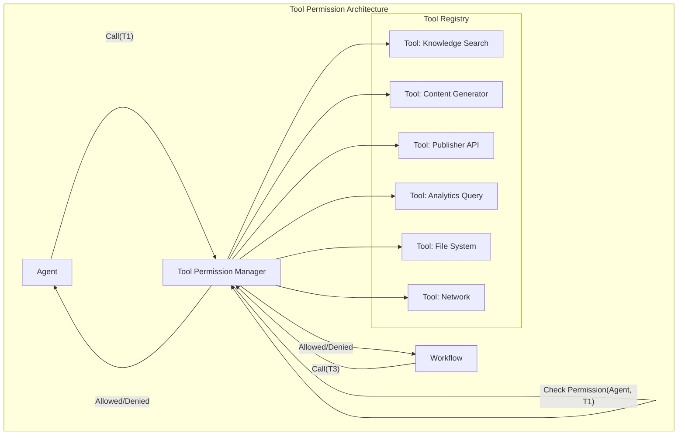
```mermaid
graph TB
    subgraph "Tool Permission Architecture"
        AG[Agent]
        WF[Workflow]
        TPM[Tool Permission Manager]

        subgraph "Tool Registry"
            T1[Tool: Knowledge Search]
            T2[Tool: Content Generator]
            T3[Tool: Publisher API]
            T4[Tool: Analytics Query]
            T5[Tool: File System]
            T6[Tool: Network]
        end

        AG -->|"Call(T1)"| TPM
        WF -->|"Call(T3)"| TPM
        TPM -->|"Check Permission(Agent, T1)"| TPM
        TPM -->|"Allowed/Denied"| AG
        TPM -->|"Allowed/Denied"| WF
        TPM --> T1
        TPM --> T2
        TPM --> T3
        TPM --> T4
        TPM --> T5
        TPM --> T6
    end
```

### ۶.۲ دسته‌بندی ابزارها از نظر امنیت

| دسته                 | شناسه    | سطح ریسک | نیاز به مجوز ویژه |
| -------------------- | -------- | -------- | ----------------- |
| Read-Only Knowledge  | TOOL-ROK | کم       | A-1+              |
| Read-Write Knowledge | TOOL-RWK | متوسط    | A-2+              |
| Content Generation   | TOOL-CGN | متوسط    | A-2+              |
| Publishing API       | TOOL-PUB | بالا     | A-3+              |
| File System Access   | TOOL-FSA | بحرانی   | A-4               |
| Network Access       | TOOL-NET | بحرانی   | A-4               |
| System Command       | TOOL-SYS | بحرانی   | A-4               |
| User Data Access     | TOOL-UDA | بحرانی   | A-4               |
| Configuration        | TOOL-CFG | بالا     | A-4               |
| Audit Log            | TOOL-AUD | بالا     | A-4               |

### ۶.۳ قواعد مجوز ابزار

| قاعده  | توضیح                                                       |
| ------ | ----------------------------------------------------------- |
| TPR-01 | هر Agent باید مجوز صریح برای هر Tool داشته باشد             |
| TPR-02 | مجوز Tool به صورت پیش‌فرض ممنوع است (Default Deny)          |
| TPR-03 | مجوز Tool در زمان ثبت Agent تعریف می‌شود                    |
| TPR-04 | Workflow مجوز Tool را از Agent مؤلف به ارث می‌برد           |
| TPR-05 | Toolهای بحرانی نیاز به تأیید دومرحله‌ای دارند               |
| TPR-06 | هر فراخوانی Tool در Audit Log ثبت می‌شود                    |
| TPR-07 | Tool نمی‌تواند مجوز خود را تغییر دهد                        |
| TPR-08 | Tool نمی‌تواند Agent دیگر را بدون مجوز فراخوانی کند         |
| TPR-09 | خروجی Tool قبل از تحویل به Agent اعتبارسنجی می‌شود          |
| TPR-10 | Toolهای Network و File System همیشه در سندباکس اجرا می‌شوند |

---

## ۷. Context Isolation — ایزوله‌سازی بافت

### ۷.۱ معماری ایزوله‌سازی بافت

بافت (Context) در SMOS شامل وضعیت اجرا، حافظه، متغیرها و داده‌های موقت یک Agent یا Workflow است. Context Isolation تضمین می‌کند که بافت‌های مختلف با یکدیگر تداخل ندارند.

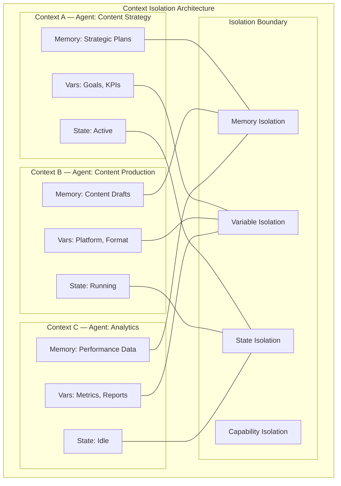
```mermaid
graph TB
    subgraph "Context Isolation Architecture"
        subgraph "Context A — Agent: Content Strategy"
            CA1[Memory: Strategic Plans]
            CA2[Vars: Goals, KPIs]
            CA3[State: Active]
        end

        subgraph "Context B — Agent: Content Production"
            CB1[Memory: Content Drafts]
            CB2[Vars: Platform, Format]
            CB3[State: Running]
        end

        subgraph "Context C — Agent: Analytics"
            CC1[Memory: Performance Data]
            CC2[Vars: Metrics, Reports]
            CC3[State: Idle]
        end

        subgraph "Isolation Boundary"
            IB1[Memory Isolation]
            IB2[Variable Isolation]
            IB3[State Isolation]
            IB4[Capability Isolation]
        end

        CA1 --- IB1
        CA2 --- IB2
        CA3 --- IB3
        CB1 --- IB1
        CB2 --- IB2
        CB3 --- IB3
        CC1 --- IB1
        CC2 --- IB2
        CC3 --- IB3
    end
```

### ۷.۲ انواع ایزوله‌سازی بافت

| نوع    | شناسه    | توضیح                     | مکانیزم                    |
| ------ | -------- | ------------------------- | -------------------------- |
| حافظه  | CI-MEM   | جداسازی حافظه Runtime     | Process/Container Boundary |
| متغیر  | CI-VAR   | جداسازی فضای نام متغیرها  | Namespace Prefix           |
| وضعیت  | CI-STATE | جداسازی ماشین حالت        | State Partition            |
| قابلیت | CI-CAP   | جداسازی قابلیت‌های دسترسی | Capability Set             |
| شبکه   | CI-NET   | جداسازی دسترسی شبکه       | Network Namespace          |
| فایل   | CI-FS    | جداسازی دسترسی فایل‌سیستم | Mount Namespace            |

### ۷.۳ قواعد ایزوله‌سازی بافت

| قاعده  | توضیح                                                                  |
| ------ | ---------------------------------------------------------------------- |
| CIR-01 | هر Context دارای یک Context ID یکتاست                                  |
| CIR-02 | Contextها نمی‌توانند به حافظه یکدیگر دسترسی داشته باشند                |
| CIR-03 | متغیرهای Context فقط درون همان Context قابل خواندن و نوشتن هستند       |
| CIR-04 | ارتباط بین Contextها فقط از طریق کانال‌های مجاز (Channel) انجام می‌شود |
| CIR-05 | هر Context یک Lifetime مستقل دارد                                      |
| CIR-06 | پس از پایان Context، تمام حافظه آن پاک‌سازی می‌شود (Secure Cleanup)    |
| CIR-07 | Context فرزند نمی‌تواند به داده‌های Context والد دسترسی داشته باشد     |
| CIR-08 | Context والد می‌تواند Context فرزند را خاتمه دهد                       |
| CIR-09 | تمام مرزهای Context در Audit Log ثبت می‌شوند                           |

### ۷.۴ چرخه حیات Context از نظر امنیتی

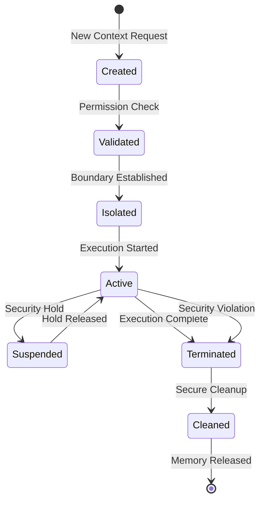
```mermaid
stateDiagram-v2
    [*] --> Created: New Context Request
    Created --> Validated: Permission Check
    Validated --> Isolated: Boundary Established
    Isolated --> Active: Execution Started
    Active --> Suspended: Security Hold
    Suspended --> Active: Hold Released
    Active --> Terminated: Execution Complete
    Active --> Terminated: Security Violation
    Terminated --> Cleaned: Secure Cleanup
    Cleaned --> [*]: Memory Released
```

---

## ۸. Workspace Isolation — ایزوله‌سازی فضای کار

### ۸.۱ معماری ایزوله‌سازی فضای کار

فضای کار (Workspace) مرز منطقی برای جداسازی مستأجرها (Tenantها)، پروژه‌ها و تیم‌ها در SMOS است. Workspace Isolation تضمین می‌کند که داده‌ها و عملیات یک مستأجر برای مستأجر دیگر قابل مشاهده یا تأثیرگذاری نیست.

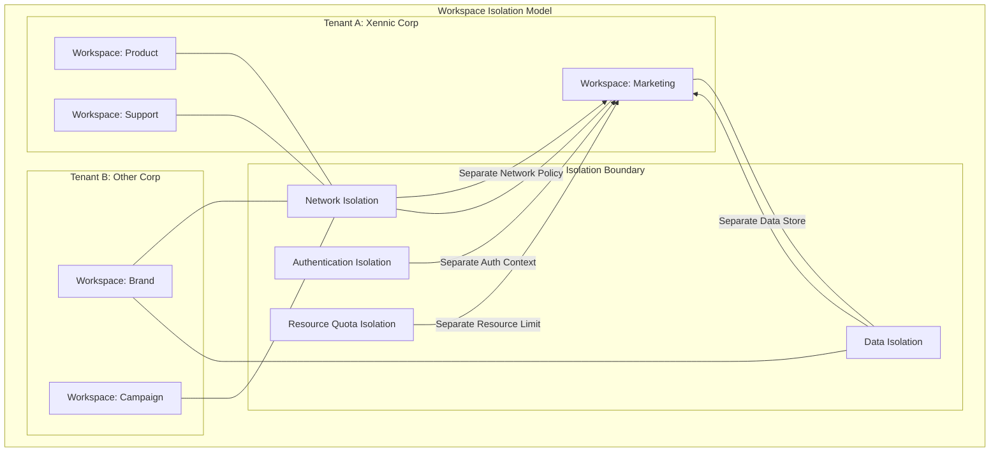
```mermaid
graph TB
    subgraph "Workspace Isolation Model"
        subgraph "Tenant A: Xennic Corp"
            WA1[Workspace: Marketing]
            WA2[Workspace: Product]
            WA3[Workspace: Support]
        end

        subgraph "Tenant B: Other Corp"
            WB1[Workspace: Brand]
            WB2[Workspace: Campaign]
        end

        subgraph "Isolation Boundary"
            IB1[Network Isolation]
            IB2[Data Isolation]
            IB3[Authentication Isolation]
            IB4[Resource Quota Isolation]
        end

        WA1 --- IB1
        WA2 --- IB1
        WA3 --- IB1
        WB1 --- IB1
        WB2 --- IB1

        WA1 --- IB2
        WB1 --- IB2

        IB1 -->|Separate Network Policy| WA1
        IB2 -->|Separate Data Store| WA1
        IB3 -->|Separate Auth Context| WA1
        IB4 -->|Separate Resource Limit| WA1
    end
```

### ۸.۲ سطوح ایزوله‌سازی فضای کار

| سطح                   | شناسه | توضیح                                                                   |
| --------------------- | ----- | ----------------------------------------------------------------------- |
| L1 — Soft Isolation   | WI-L1 | جداسازی منطقی با Namespace — مناسب برای پروژه‌های یک تیم                |
| L2 — Hard Isolation   | WI-L2 | جداسازی فیزیکی با Container/Database — مناسب برای تیم‌های مختلف         |
| L3 — Strong Isolation | WI-L3 | جداسازی کامل با VM/Separate Infrastructure — مناسب برای مستأجرهای مختلف |
| L4 — Air-Gapped       | WI-L4 | جداسازی فیزیکی کامل بدون اشتراک منابع — مناسب برای مستأجرهای حساس       |

### ۸.۳ قواعد ایزوله‌سازی فضای کار

| قاعده  | توضیح                                                         |
| ------ | ------------------------------------------------------------- |
| WIR-01 | هر Workspace دارای Workspace ID یکتاست                        |
| WIR-02 | Agent فقط در Workspace مجاز خود اجرا می‌شود                   |
| WIR-03 | داده‌های Workspace به صورت فیزیکی یا منطقی جدا می‌شوند        |
| WIR-04 | Cross-Workspace Access از طریق API مجاز و با Audit ثبت می‌شود |
| WIR-05 | هر Workspace دارای Resource Quota مجزاست                      |
| WIR-06 | Workspace Admin می‌تواند خط‌مشی امنیتی Workspace را تعریف کند |
| WIR-07 | Tenant Admin می‌تواند تمام Workspaceهای خود را مدیریت کند     |

---

## ۹. Policy Enforcement — موتور سیاست و اجرا

### ۹.۱ معماری موتور سیاست

موتور سیاست SMOS (Policy Engine) مسئول تعریف، ذخیره، ارزیابی و اجرای سیاست‌های امنیتی است. این موتور از ترکیب RBAC (Role-Based Access Control) و ABAC (Attribute-Based Access Control) استفاده می‌کند.

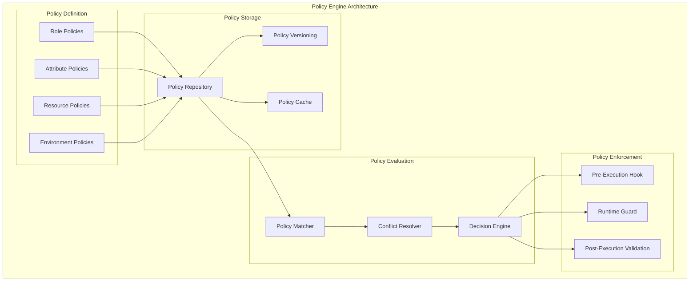
```mermaid
graph TB
    subgraph "Policy Engine Architecture"
        subgraph "Policy Definition"
            PD1[Role Policies]
            PD2[Attribute Policies]
            PD3[Resource Policies]
            PD4[Environment Policies]
        end

        subgraph "Policy Storage"
            PS1[Policy Repository]
            PS2[Policy Versioning]
            PS3[Policy Cache]
        end

        subgraph "Policy Evaluation"
            EV1[Policy Matcher]
            EV2[Conflict Resolver]
            EV3[Decision Engine]
        end

        subgraph "Policy Enforcement"
            EF1[Pre-Execution Hook]
            EF2[Runtime Guard]
            EF3[Post-Execution Validation]
        end

        PD1 --> PS1
        PD2 --> PS1
        PD3 --> PS1
        PD4 --> PS1

        PS1 --> EV1
        PS1 --> PS2
        PS1 --> PS3

        EV1 --> EV2
        EV2 --> EV3

        EV3 --> EF1
        EV3 --> EF2
        EV3 --> EF3
    end
```

### ۹.۲ انواع سیاست

| نوع سیاست         | شناسه    | دامنه         | مثال                                                 |
| ----------------- | -------- | ------------- | ---------------------------------------------------- |
| Role-Based        | POL-RBAC | نقش موجودیت   | Agent با نقش Strategist می‌تواند Goal بنویسد         |
| Attribute-Based   | POL-ABAC | ویژگی موجودیت | Agent با سطح A-3+ می‌تواند منتشر کند                 |
| Resource-Based    | POL-RBAC | نوع منبع      | فقط Publishing Runtime می‌تواند API خارجی صدا بزند   |
| Environment-Based | POL-EBAC | وضعیت محیط    | در محیط Production، اجرا فقط با تأیید دومرحله‌ای     |
| Time-Based        | POL-TBAC | زمان          | عملیات بحرانی فقط در ساعات اداری                     |
| Location-Based    | POL-LBAC | مکان          | Admin Panel فقط از IP داخلی قابل دسترس               |
| Quota-Based       | POL-QBAC | سهمیه         | Agent می‌تواند حداکثر ۱۰۰ درخواست در ساعت داشته باشد |
| History-Based     | POL-HBAC | تاریخچه       | Agent با ۳ تخلف امنیتی مسدود می‌شود                  |

### ۹.۳ ساختار تصمیم‌گیری سیاست

| نتیجه             | توضیح                                               |
| ----------------- | --------------------------------------------------- |
| **Permit**        | دسترسی مجاز است                                     |
| **Deny**          | دسترسی ممنوع است (پیش‌فرض)                          |
| **NotApplicable** | سیاستی برای این درخواست وجود ندارد — بررسی سطح بعدی |
| **Indeterminate** | خطا در ارزیابی — Fail Secure به Deny                |
| **Defer**         | تصمیم به تأیید انسانی موکول شد                      |

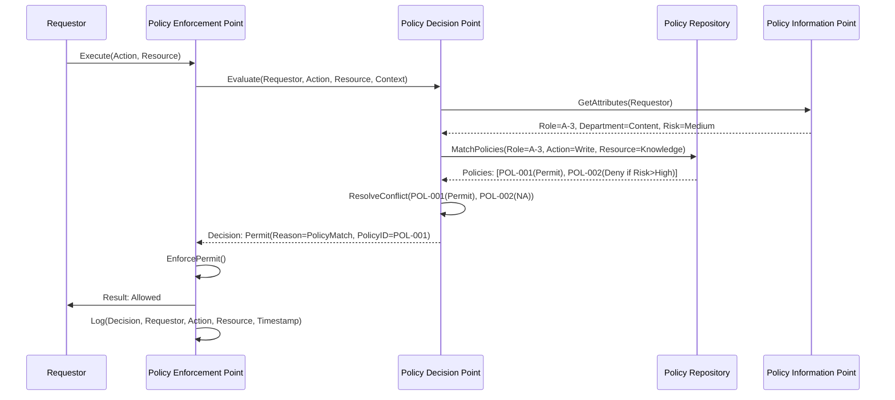
```mermaid
sequenceDiagram
    participant REQ as Requestor
    participant PEP as Policy Enforcement Point
    participant PDP as Policy Decision Point
    participant PR as Policy Repository
    participant PIP as Policy Information Point

    REQ->>PEP: Execute(Action, Resource)
    PEP->>PDP: Evaluate(Requestor, Action, Resource, Context)
    PDP->>PIP: GetAttributes(Requestor)
    PIP-->>PDP: Role=A-3, Department=Content, Risk=Medium
    PDP->>PR: MatchPolicies(Role=A-3, Action=Write, Resource=Knowledge)
    PR-->>PDP: Policies: [POL-001(Permit), POL-002(Deny if Risk>High)]
    PDP->>PDP: ResolveConflict(POL-001(Permit), POL-002(NA))
    PDP-->>PEP: Decision: Permit(Reason=PolicyMatch, PolicyID=POL-001)
    PEP->>PEP: EnforcePermit()
    PEP->>REQ: Result: Allowed
    PEP->>PEP: Log(Decision, Requestor, Action, Resource, Timestamp)
```

---

## ۱۰. Runtime Validation — اعتبارسنجی پیش از اجرا

### ۱۰.۱ معماری اعتبارسنجی

Runtime Validation گیت امنیتی پیش از اجرای هر عملیات است. این فرآیند قبل از رسیدن درخواست به PDP اجرا می‌شود و درخواست‌های آشکارا مخرب را بدون مصرف منابع PDP رد می‌کند.

### ۱۰.۲ مراحل اعتبارسنجی

| مرحله   | شناسه | توضیح                                       | نتیجه رد                 |
| ------- | ----- | ------------------------------------------- | ------------------------ |
| ساختار  | RV-01 | اعتبارسنجی ساختار درخواست (JSON Schema)     | Malformed Request        |
| دامنه   | RV-02 | بررسی وجود دامنه عملیات در Scope مجاز Agent | Out of Scope             |
| ورودی   | RV-03 | پالایش ورودی (Input Sanitization)           | Malicious Input Detected |
| اندازه  | RV-04 | بررسی محدودیت اندازه ورودی و خروجی          | Size Limit Exceeded      |
| نرخ     | RV-05 | بررسی Rate Limit و Quota                    | Rate Limit Exceeded      |
| وابستگی | RV-06 | بررسی وجود و سلامت وابستگی‌ها               | Dependency Unavailable   |
| امضا    | RV-07 | بررسی امضای دیجیتال درخواست (در صورت نیاز)  | Invalid Signature        |
| تکراری  | RV-08 | بررسی duplicate با Nonce/Idempotency Key    | Duplicate Request        |

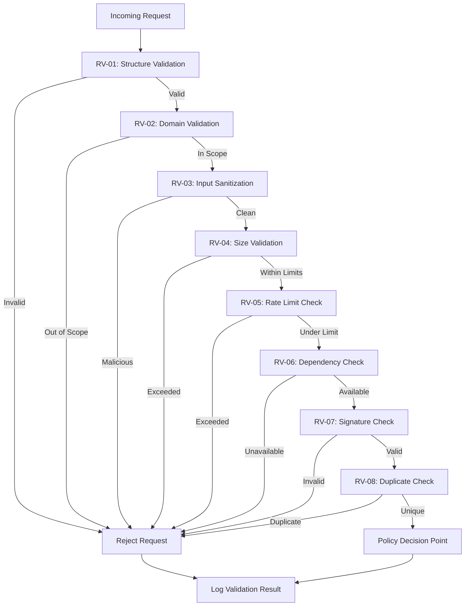
```mermaid
flowchart TD
    REQ[Incoming Request]
    RV01[RV-01: Structure Validation]
    RV02[RV-02: Domain Validation]
    RV03[RV-03: Input Sanitization]
    RV04[RV-04: Size Validation]
    RV05[RV-05: Rate Limit Check]
    RV06[RV-06: Dependency Check]
    RV07[RV-07: Signature Check]
    RV08[RV-08: Duplicate Check]
    PDP[Policy Decision Point]
    REJECT[Reject Request]
    LOG[Log Validation Result]

    REQ --> RV01
    RV01 -->|Valid| RV02
    RV01 -->|Invalid| REJECT
    RV02 -->|In Scope| RV03
    RV02 -->|Out of Scope| REJECT
    RV03 -->|Clean| RV04
    RV03 -->|Malicious| REJECT
    RV04 -->|Within Limits| RV05
    RV04 -->|Exceeded| REJECT
    RV05 -->|Under Limit| RV06
    RV05 -->|Exceeded| REJECT
    RV06 -->|Available| RV07
    RV06 -->|Unavailable| REJECT
    RV07 -->|Valid| RV08
    RV07 -->|Invalid| REJECT
    RV08 -->|Unique| PDP
    RV08 -->|Duplicate| REJECT
    REJECT --> LOG
    PDP --> LOG
```

### ۱۰.۳ قواعد اعتبارسنجی

| قاعده  | توضیح                                                    |
| ------ | -------------------------------------------------------- |
| RVR-01 | هر درخواست اجرا باید از ۸ مرحله اعتبارسنجی عبور کند      |
| RVR-02 | شکست هر مرحله به معنی رد درخواست است (Fail Fast)         |
| RVR-03 | ورودی‌های مخرب در Audit Log با جزئیات کامل ثبت می‌شوند   |
| RVR-04 | Rate Limit در سطح Agent, Workspace و Tenant اعمال می‌شود |
| RVR-05 | Nonce باید یکتا باشد و در بازه زمانی معتبر               |
| RVR-06 | امضای دیجیتال برای عملیات بحرانی (A-4) الزامی است        |

---

## ۱۱. Execution Sandbox — معماری سندباکس اجرا

### ۱۱.۱ معماری سندباکس

سندباکس اجرا (Execution Sandbox) یک محیط ایزوله برای اجرای امن Agentها، Workflowها و کدهای احتمالی است. این سندباکس در چند لایه ایزوله‌سازی عمل می‌کند.

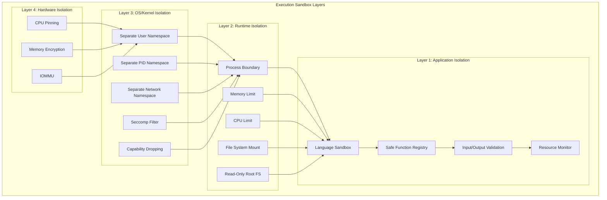
```mermaid
graph TB
    subgraph "Execution Sandbox Layers"
        subgraph "Layer 4: Hardware Isolation"
            HW1[CPU Pinning]
            HW2[Memory Encryption]
            HW3[IOMMU]
        end

        subgraph "Layer 3: OS/Kernel Isolation"
            OS1[Separate User Namespace]
            OS2[Separate PID Namespace]
            OS3[Separate Network Namespace]
            OS4[Seccomp Filter]
            OS5[Capability Dropping]
        end

        subgraph "Layer 2: Runtime Isolation"
            RT1[Process Boundary]
            RT2[Memory Limit]
            RT3[CPU Limit]
            RT4[File System Mount]
            RT5[Read-Only Root FS]
        end

        subgraph "Layer 1: Application Isolation"
            AP1[Language Sandbox]
            AP2[Safe Function Registry]
            AP3[Input/Output Validation]
            AP4[Resource Monitor]
        end

        HW1 --> OS1
        HW2 --> OS1
        HW3 --> OS1
        OS1 --> RT1
        OS2 --> RT1
        OS3 --> RT1
        OS4 --> RT1
        OS5 --> RT1
        RT1 --> AP1
        RT2 --> AP1
        RT3 --> AP1
        RT4 --> AP1
        RT5 --> AP1
        AP1 --> AP2
        AP2 --> AP3
        AP3 --> AP4
    end
```

### ۱۱.۲ محدودیت‌های سندباکس

| محدودیت     | شناسه    | مقدار پیش‌فرض           | قابل تنظیم       |
| ----------- | -------- | ----------------------- | ---------------- |
| حافظه       | SAN-MEM  | ۵۱۲ MB                  | بله — توسط Admin |
| CPU         | SAN-CPU  | ۱ Core                  | بله — توسط Admin |
| دیسک        | SAN-DSK  | ۱۰۰ MB Temp             | بله — توسط Admin |
| شبکه        | SAN-NET  | Only Allowed Endpoints  | بله — توسط سیاست |
| فرآیند      | SAN-PROC | ۵۰ هم‌زمان              | بله — توسط Admin |
| زمان        | SAN-TIME | ۳۰ دقیقه                | بله — توسط Admin |
| Syscall     | SAN-SYS  | Allowlist از ۵۰ syscall | خیر — ثابت       |
| File Access | SAN-FILE | فقط /tmp                | خیر — ثابت       |

### ۱۱.۳ قواعد سندباکس

| قاعده  | توضیح                                                    |
| ------ | -------------------------------------------------------- |
| SAN-01 | هر Agent غیرمعتمد در سندباکس مجزا اجرا می‌شود            |
| SAN-02 | Agentهای معتبر (A-4) می‌توانند خارج از سندباکس اجرا شوند |
| SAN-03 | سندباکس پس از اتمام کار به صورت امن پاک‌سازی می‌شود      |
| SAN-04 | هیچ داده‌ای از سندباکس به خارج نشت نمی‌کند               |
| SAN-05 | Networ Access فقط از طریق Proxy مجاز است                 |
| SAN-06 | File System به صورت Read-Only mount می‌شود               |
| SAN-07 | تمام syscallهای غیرمجاز توسط Seccomp مسدود می‌شوند       |
| SAN-08 | خروجی سندباکس قبل از تحویل اعتبارسنجی می‌شود             |

---

## ۱۲. Prompt Security — امنیت پرامپت

### ۱۲.۱ معماری امنیت پرامپت

Prompt Security تضمین می‌کند که پرامپت‌های ارسالی به Agentها و LLMها حاوی دستورالعمل‌های مخرب، تزریقی یا فراتر از محدوده مجاز نیستند.

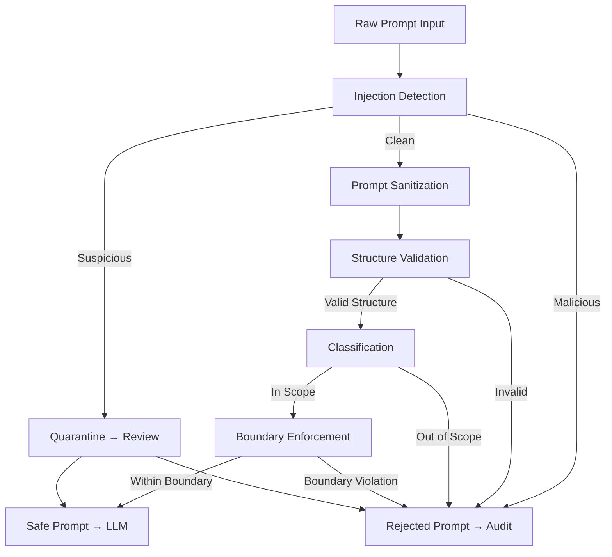
```mermaid
flowchart TD
    INPUT[Raw Prompt Input]
    DETECT[Injection Detection]
    SANITIZE[Prompt Sanitization]
    VALIDATE[Structure Validation]
    CLASSIFY[Classification]
    BOUNDARY[Boundary Enforcement]
    ALLOW[Safe Prompt → LLM]
    REJECT[Rejected Prompt → Audit]
    QUARANTINE[Quarantine → Review]

    INPUT --> DETECT
    DETECT -->|Clean| SANITIZE
    DETECT -->|Suspicious| QUARANTINE
    DETECT -->|Malicious| REJECT
    SANITIZE --> VALIDATE
    VALIDATE -->|Valid Structure| CLASSIFY
    VALIDATE -->|Invalid| REJECT
    CLASSIFY -->|In Scope| BOUNDARY
    CLASSIFY -->|Out of Scope| REJECT
    BOUNDARY -->|Within Boundary| ALLOW
    BOUNDARY -->|Boundary Violation| REJECT
    QUARANTINE --> ALLOW
    QUARANTINE --> REJECT
```

### ۱۲.۲ الگوهای تزریق پرامپت

| الگو                   | شناسه | توضیح                              | روش تشخیص                |
| ---------------------- | ----- | ---------------------------------- | ------------------------ |
| Instruction Override   | PI-01 | تلاش برای بازنویسی دستورالعمل اصلی | Regex Pattern Matching   |
| Role Play              | PI-02 | تلاش برای تغییر نقش Agent          | NLP Classification       |
| Information Extraction | PI-03 | تلاش برای استخراج System Prompt    | Heuristic Detection      |
| Payload Embedding      | PI-04 | پنهان‌سازی دستور در داده           | Base64/Encoded Detection |
| Context Manipulation   | PI-05 | تلاش برای تغییر بافت تصمیم‌گیری    | Context Diff Analysis    |
| Indirect Injection     | PI-06 | تزریق از طریق داده خارجی (RAG)     | Source Verification      |
| Multi-turn Attack      | PI-07 | تزریق تدریجی در چند نوبت           | Conversation Analysis    |
| Escape Sequence        | PI-08 | استفاده از Escape Character        | Input Sanitization       |

### ۱۲.۳ قواعد امنیت پرامپت

| قاعده  | توضیح                                                               |
| ------ | ------------------------------------------------------------------- |
| PSR-01 | تمام پرامپت‌ها قبل از ارسال به LLM از فیلتر امنیتی عبور می‌کنند     |
| PSR-02 | System Prompt از User Prompt جدا می‌ماند و قابل دستکاری نیست        |
| PSR-03 | پرامپت‌های حاوی کد اجرایی (Code) در سندباکس مجزا ارزیابی می‌شوند    |
| PSR-04 | پرامپت‌های مشکوک به Quarantine می‌روند و نیاز به تأیید انسانی دارند |
| PSR-05 | محدودیت طول پرامپت اعمال می‌شود                                     |
| PSR-06 | Agent نمی‌تواند System Prompt خود را تغییر دهد                      |
| PSR-07 | تمام تلاش‌های تزریق در Audit Log با جزئیات ثبت می‌شود               |

---

## ۱۳. Agent Security — امنیت عامل

### ۱۳.۱ معماری امنیت Agent

هر Agent در SMOS یک **هویت دیجیتال (Agent Identity)** دارد که توسط **Identity Registry** مدیریت می‌شود. Agentها قبل از اجرا احراز هویت می‌شوند و در طول اجرا به طور مداوم اعتبارسنجی می‌شوند.

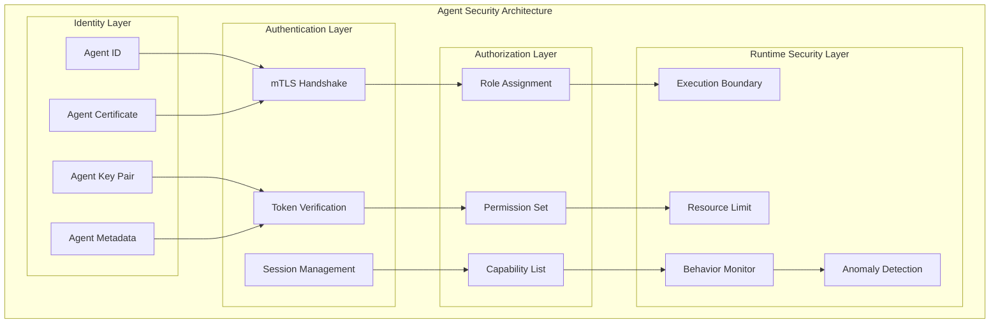
```mermaid
graph TB
    subgraph "Agent Security Architecture"
        subgraph "Identity Layer"
            ID1[Agent ID]
            ID2[Agent Certificate]
            ID3[Agent Key Pair]
            ID4[Agent Metadata]
        end

        subgraph "Authentication Layer"
            AU1[mTLS Handshake]
            AU2[Token Verification]
            AU3[Session Management]
        end

        subgraph "Authorization Layer"
            AZ1[Role Assignment]
            AZ2[Permission Set]
            AZ3[Capability List]
        end

        subgraph "Runtime Security Layer"
            RS1[Execution Boundary]
            RS2[Resource Limit]
            RS3[Behavior Monitor]
            RS4[Anomaly Detection]
        end

        ID1 --> AU1
        ID2 --> AU1
        ID3 --> AU2
        ID4 --> AU2
        AU1 --> AZ1
        AU2 --> AZ2
        AU3 --> AZ3
        AZ1 --> RS1
        AZ2 --> RS2
        AZ3 --> RS3
        RS3 --> RS4
    end
```

### ۱۳.۲ انواع هویت Agent

| نوع              | شناسه   | توضیح                         | سطح اعتماد   |
| ---------------- | ------- | ----------------------------- | ------------ |
| System Agent     | AID-SYS | Agent سیستمی SMOS             | Trusted      |
| Configured Agent | AID-CFG | Agent پیکربندی‌شده توسط Admin | Semi-Trusted |
| Custom Agent     | AID-CUS | Agent سفارشی بارگذاری‌شده     | Semi-Trusted |
| External Agent   | AID-EXT | Agent خارجی متصل از طریق API  | Untrusted    |
| Ephemeral Agent  | AID-EPH | Agent موقت برای یک Task       | Untrusted    |

### ۱۳.۳ قواعد امنیت Agent

| قاعده  | توضیح                                                                  |
| ------ | ---------------------------------------------------------------------- |
| ASR-01 | هر Agent دارای گواهی دیجیتال یکتاست                                    |
| ASR-02 | ارتباط بین Agentها از طریق mTLS انجام می‌شود                           |
| ASR-03 | Agent نمی‌تواند هویت Agent دیگر را جعل کند                             |
| ASR-04 | Agent فقط در Workspace مجاز خود اجرا می‌شود                            |
| ASR-05 | Agent نمی‌تواند سطح دسترسی خود را افزایش دهد (No Privilege Escalation) |
| ASR-06 | Agent خارجی (AID-EXT) در سندباکس سطح ۲ اجرا می‌شود                     |
| ASR-07 | Agent پس از اتمام یا خطا به طور کامل خاتمه می‌یابد                     |
| ASR-08 | Agent نمی‌تواند Agent دیگر را بدون مجوز Orchestrator ایجاد کند         |

---

## ۱۴. Workflow Security — امنیت گردش کار

### ۱۴.۱ معماری امنیت Workflow

گردش کار (Workflow) در SMOS توالی از مراحل (Steps) است که توسط Agentها یا Runtimeها اجرا می‌شود. Workflow Security تضمین می‌کند که هر مرحله با مجوز مناسب و در محدوده مجاز اجرا می‌شود.

### ۱۴.۲ سطوح امنیت Workflow

| سطح              | شناسه  | توضیح                           |
| ---------------- | ------ | ------------------------------- |
| Workflow-Level   | WSL-01 | مجوز اجرای کل Workflow          |
| Step-Level       | WSL-02 | مجوز اجرای هر Step به صورت مجزا |
| Transition-Level | WSL-03 | مجوز انتقال بین Stepها          |
| Data-Level       | WSL-04 | مجوز دسترسی به داده در هر Step  |
| Output-Level     | WSL-05 | مجوز تحویل خروجی به Step بعدی   |

### ۱۴.۳ قواعد امنیت Workflow

| قاعده  | توضیح                                                            |
| ------ | ---------------------------------------------------------------- |
| WSR-01 | هر Workflow دارای یک Access Control List (ACL) است               |
| WSR-02 | Agent فقط می‌تواند Workflowهایی را اجرا کند که در ACL مجاز هستند |
| WSR-03 | Stepهای بحرانی نیاز به تأیید دومرحله‌ای دارند                    |
| WSR-04 | داده بین Stepها از طریق Channel ایمن منتقل می‌شود                |
| WSR-05 | هر Step در Context ایزوله اجرا می‌شود                            |
| WSR-06 | شکست یک Step به معنی Fail کلی Workflow است                       |
| WSR-07 | Workflow نمی‌تواند به Workflow دیگر دسترسی داشته باشد            |
| WSR-08 | تکرار (Retry) Workflow با مجوز مجدد همراه است                    |

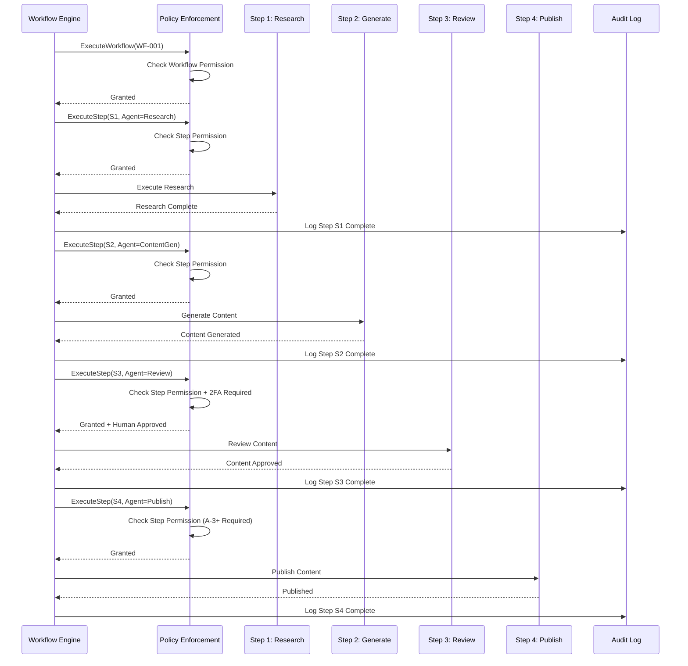
```mermaid
sequenceDiagram
    participant WF as Workflow Engine
    participant PEP as Policy Enforcement
    participant S1 as Step 1: Research
    participant S2 as Step 2: Generate
    participant S3 as Step 3: Review
    participant S4 as Step 4: Publish
    participant AUD as Audit Log

    WF->>PEP: ExecuteWorkflow(WF-001)
    PEP->>PEP: Check Workflow Permission
    PEP-->>WF: Granted

    WF->>PEP: ExecuteStep(S1, Agent=Research)
    PEP->>PEP: Check Step Permission
    PEP-->>WF: Granted
    WF->>S1: Execute Research
    S1-->>WF: Research Complete
    WF->>AUD: Log Step S1 Complete

    WF->>PEP: ExecuteStep(S2, Agent=ContentGen)
    PEP->>PEP: Check Step Permission
    PEP-->>WF: Granted
    WF->>S2: Generate Content
    S2-->>WF: Content Generated
    WF->>AUD: Log Step S2 Complete

    WF->>PEP: ExecuteStep(S3, Agent=Review)
    PEP->>PEP: Check Step Permission + 2FA Required
    PEP-->>WF: Granted + Human Approved
    WF->>S3: Review Content
    S3-->>WF: Content Approved
    WF->>AUD: Log Step S3 Complete

    WF->>PEP: ExecuteStep(S4, Agent=Publish)
    PEP->>PEP: Check Step Permission (A-3+ Required)
    PEP-->>WF: Granted
    WF->>S4: Publish Content
    S4-->>WF: Published
    WF->>AUD: Log Step S4 Complete
```

---

## ۱۵. Data Security — امنیت داده

### ۱۵.۱ طبقه‌بندی داده‌ها

| سطح     | شناسه  | توضیح                  | مثال                 | رمزنگاری                             |
| ------- | ------ | ---------------------- | -------------------- | ------------------------------------ |
| عمومی   | DCL-01 | داده قابل انتشار عمومی | محتوای منتشرشده      | AES-256 در حال استراحت               |
| داخلی   | DCL-02 | داده داخلی SMOS        | گزارش‌های تحلیلی     | AES-256 + TLS                        |
| محرمانه | DCL-03 | داده محرمانه سازمان    | استراتژی محتوا       | AES-256 + TLS + KMS                  |
| خصوصی   | DCL-04 | داده خصوصی حساس        | اطلاعات مشتری        | AES-256 + TLS + KMS + HSM            |
| بحرانی  | DCL-05 | داده بحرانی حیاتی      | Credentialها، کلیدها | AES-256 + TLS + KMS + HSM + Rotation |

### ۱۵.۲ رمزنگاری داده‌ها

| حالت                       | الگوریتم                        | مدیریت کلید                            |
| -------------------------- | ------------------------------- | -------------------------------------- |
| در حال استراحت (At Rest)   | AES-256-GCM                     | KMS + Automatic Key Rotation هر ۹۰ روز |
| در حال انتقال (In Transit) | TLS 1.3                         | mTLS با گواهی‌های Agent                |
| در حال پردازش (In Process) | Memory Encryption (SME/TME)     | Hardware-Backed                        |
| لاگ‌های امنیتی             | AES-256-GCM + Digital Signature | HSM + Immutable Storage                |

### ۱۵.۳ قواعد امنیت داده

| قاعده  | توضیح                                                         |
| ------ | ------------------------------------------------------------- |
| DSR-01 | تمام داده‌های DCL-03 و بالاتر رمزنگاری می‌شوند                |
| DSR-02 | کلیدهای رمزنگاری در HSM یا KMS مدیریت می‌شوند                 |
| DSR-03 | داده‌های DCL-04 و بالاتر در سندباکس پردازش می‌شوند            |
| DSR-04 | داده‌های حساس پس از پردازش پاک‌سازی می‌شوند (Secure Deletion) |
| DSR-05 | فراداده (Metadata) با سطح دسترسی مجزا محافظت می‌شود           |
| DSR-06 | خروجی Agentها قبل از تحویل از نظر افشای داده بررسی می‌شود     |

---

## ۱۶. Audit Security — امنیت ممیزی

### ۱۶.۱ معماری Audit امنیتی

Audit Security تضمین می‌کند که تمام رویدادهای امنیتی به صورت **غیرقابل تغییر (Immutable)** و **غیرقابل انکار (Non-Repudiation)** ثبت می‌شوند.

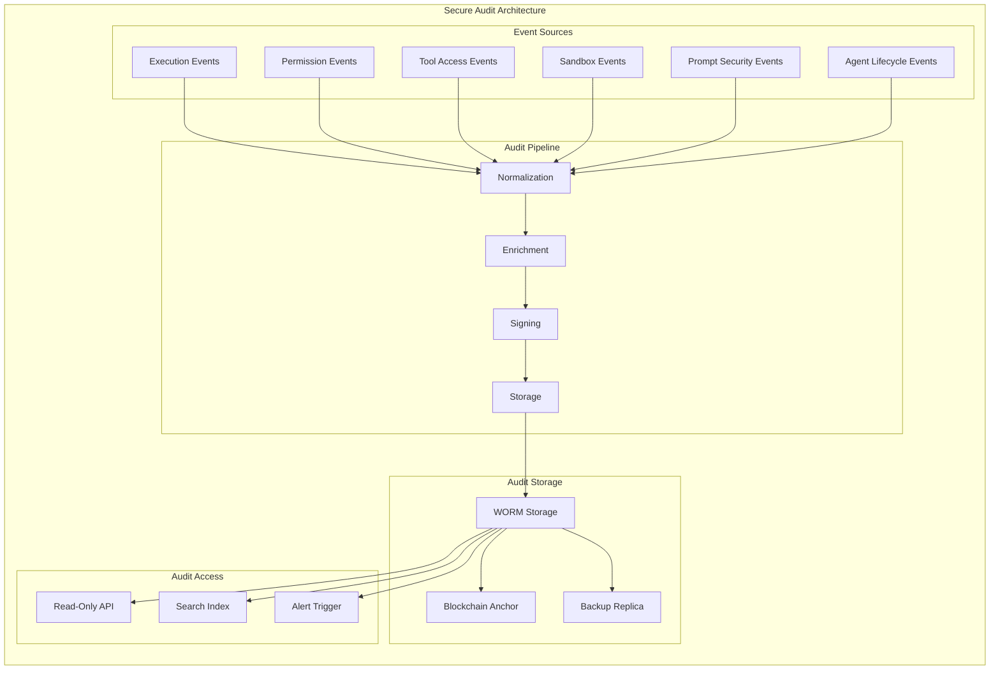
```mermaid
graph LR
    subgraph "Secure Audit Architecture"
        subgraph "Event Sources"
            S1[Execution Events]
            S2[Permission Events]
            S3[Tool Access Events]
            S4[Sandbox Events]
            S5[Prompt Security Events]
            S6[Agent Lifecycle Events]
        end

        subgraph "Audit Pipeline"
            P1[Normalization]
            P2[Enrichment]
            P3[Signing]
            P4[Storage]
        end

        subgraph "Audit Storage"
            ST1[WORM Storage]
            ST2[Blockchain Anchor]
            ST3[Backup Replica]
        end

        subgraph "Audit Access"
            A1[Read-Only API]
            A2[Search Index]
            A3[Alert Trigger]
        end

        S1 --> P1
        S2 --> P1
        S3 --> P1
        S4 --> P1
        S5 --> P1
        S6 --> P1
        P1 --> P2
        P2 --> P3
        P3 --> P4
        P4 --> ST1
        ST1 --> ST2
        ST1 --> ST3
        ST1 --> A1
        ST1 --> A2
        ST1 --> A3
    end
```

### ۱۶.۲ انواع رویداد امنیتی

| نوع رویداد        | شناسه      | توضیح                  |
| ----------------- | ---------- | ---------------------- |
| Permission Check  | EVT-AUD-01 | هر بررسی مجوز          |
| Access Granted    | EVT-AUD-02 | دسترسی مجاز            |
| Access Denied     | EVT-AUD-03 | دسترسی ممنوع           |
| Policy Change     | EVT-AUD-04 | تغییر در سیاست         |
| Sandbox Event     | EVT-AUD-05 | رویداد سندباکس         |
| Injection Attempt | EVT-AUD-06 | تلاش تزریق پرامپت      |
| Agent Lifecycle   | EVT-AUD-07 | ایجاد/خاتمه Agent      |
| Workspace Change  | EVT-AUD-08 | تغییر فضای کار         |
| Data Access       | EVT-AUD-09 | دسترسی به داده محرمانه |
| Security Alert    | EVT-AUD-10 | هشدار امنیتی           |

### ۱۶.۳ قواعد Audit امنیتی

| قاعده  | توضیح                                                 |
| ------ | ----------------------------------------------------- |
| ASR-01 | تمام رویدادهای امنیتی بدون استثنا ثبت می‌شوند         |
| ASR-02 | رویدادها با امضای دیجیتال (HMAC-SHA256) امضا می‌شوند  |
| ASR-03 | رویدادها در WORM (Write Once Read Many) ذخیره می‌شوند |
| ASR-04 | رویدادها قابل حذف یا تغییر نیستند                     |
| ASR-05 | دسترسی به Audit Log فقط خواندنی است                   |
| ASR-06 | Audit Log به صورت دوره‌ای در بلاکچین anchor می‌شود    |
| ASR-07 | بازه نگهداری Audit Log حداقل ۷ سال است                |
| ASR-08 | Audit Log در دو منطقه جغرافیایی replica می‌شود        |

---

## ۱۷. Incident Response for Runtime — پاسخ به حادثه

### ۱۷.۱ معماری پاسخ به حادثه

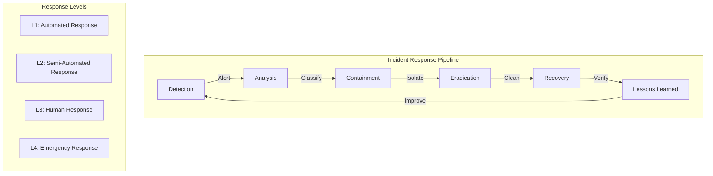
```mermaid
graph TB
    subgraph "Incident Response Pipeline"
        DETECT[Detection]
        ANALYZE[Analysis]
        CONTAIN[Containment]
        ERADICATE[Eradication]
        RECOVER[Recovery]
        LEARN[Lessons Learned]

        DETECT -->|Alert| ANALYZE
        ANALYZE -->|Classify| CONTAIN
        CONTAIN -->|Isolate| ERADICATE
        ERADICATE -->|Clean| RECOVER
        RECOVER -->|Verify| LEARN
        LEARN -->|Improve| DETECT
    end

    subgraph "Response Levels"
        L1[L1: Automated Response]
        L2[L2: Semi-Automated Response]
        L3[L3: Human Response]
        L4[L4: Emergency Response]
    end
```

### ۱۷.۲ سطوح پاسخ

| سطح              | شناسه | زمان پاسخ  | تصمیم‌گیرنده                   | مثال                      |
| ---------------- | ----- | ---------- | ------------------------------ | ------------------------- |
| L1 — خودکار      | L1-IR | < ۱ ثانیه  | Security Engine                | مسدود کردن درخواست تزریقی |
| L2 — نیمه‌خودکار | L2-IR | < ۵ دقیقه  | Security Engine + تأیید انسانی | تعلیق Agent مشکوک         |
| L3 — انسانی      | L3-IR | < ۳۰ دقیقه | Security Team                  | بررسی نشت داده            |
| L4 — اضطراری     | L4-IR | < ۵ دقیقه  | Incident Commander             | خاموشی Runtime            |

### ۱۷.۳ مراحل پاسخ به حادثه

| مرحله           | اقدامات                                                        |
| --------------- | -------------------------------------------------------------- |
| Detection       | تشخیص ناهنجاری، تطبیق با Ruleهای امنیتی، امتیازدهی تهدید       |
| Analysis        | جمع‌آوری شواهد، تحلیل علت، تعیین سطح و دامنه تأثیر             |
| Containment     | ایزوله‌سازی Agent متخلف، مسدود کردن دسترسی، فعال‌سازی Failover |
| Eradication     | خاتمه فرآیندهای مخرب، پاک‌سازی سندباکس، چرخش کلیدها            |
| Recovery        | بازگردانی از Backup, تأیید یکپارچگی، فعال‌سازی مجوزها          |
| Lessons Learned | تحلیل ریشه‌ای (RCA), به‌روزرسانی Ruleها, مستندسازی             |

---

## ۱۸. Schema Definitions — تعاریف Schema

### Schema 1: ExecutionPermission

```json
{
  "$schema": "https://json-schema.org/draft-07/schema#",
  "$id": "smos://schemas/execution-permission.json",
  "title": "ExecutionPermission",
  "description": "Schema for execution permission definition in SMOS runtime security",
  "type": "object",
  "required": ["permissionId", "principalId", "resourceId", "action", "effect", "policyVersion"],
  "properties": {
    "permissionId": {
      "type": "string",
      "pattern": "^PERM-EXEC-[A-Z0-9]{8}$",
      "description": "Unique permission identifier"
    },
    "principalId": {
      "type": "string",
      "description": "Agent ID or Workflow ID requesting execution"
    },
    "resourceId": {
      "type": "string",
      "description": "Runtime, Tool, or Resource identifier"
    },
    "action": {
      "type": "string",
      "enum": ["execute", "read", "write", "delegate", "admin", "audit"]
    },
    "effect": {
      "type": "string",
      "enum": ["permit", "deny"]
    },
    "condition": {
      "type": "object",
      "properties": {
        "timeRange": {
          "type": "object",
          "properties": {
            "start": { "type": "string", "format": "date-time" },
            "end": { "type": "string", "format": "date-time" }
          }
        },
        "ipRange": {
          "type": "array",
          "items": { "type": "string" }
        },
        "authLevel": {
          "type": "string",
          "enum": ["A-0", "A-1", "A-2", "A-3", "A-4"]
        },
        "requireMFA": { "type": "boolean" }
      }
    },
    "policyVersion": {
      "type": "string",
      "pattern": "^\\d+\\.\\d+\\.\\d+$"
    },
    "validFrom": {
      "type": "string",
      "format": "date-time"
    },
    "validUntil": {
      "type": "string",
      "format": "date-time"
    },
    "createdAt": {
      "type": "string",
      "format": "date-time"
    },
    "updatedAt": {
      "type": "string",
      "format": "date-time"
    },
    "createdBy": {
      "type": "string",
      "description": "Admin or policy that created this permission"
    }
  },
  "additionalProperties": false
}
```

### Schema 2: ToolPermission

```json
{
  "$schema": "https://json-schema.org/draft-07/schema#",
  "$id": "smos://schemas/tool-permission.json",
  "title": "ToolPermission",
  "description": "Schema for per-tool access permission in SMOS runtime security",
  "type": "object",
  "required": ["toolPermissionId", "agentId", "toolId", "accessType", "effect"],
  "properties": {
    "toolPermissionId": {
      "type": "string",
      "pattern": "^TP-[A-Z0-9]{10}$",
      "description": "Unique tool permission identifier"
    },
    "agentId": {
      "type": "string",
      "description": "Agent identifier requesting tool access"
    },
    "toolId": {
      "type": "string",
      "pattern": "^TOOL-[A-Z]{3,6}$",
      "description": "Tool identifier from Tool Registry"
    },
    "toolCategory": {
      "type": "string",
      "enum": [
        "TOOL-ROK",
        "TOOL-RWK",
        "TOOL-CGN",
        "TOOL-PUB",
        "TOOL-FSA",
        "TOOL-NET",
        "TOOL-SYS",
        "TOOL-UDA",
        "TOOL-CFG",
        "TOOL-AUD"
      ]
    },
    "accessType": {
      "type": "string",
      "enum": ["read", "write", "execute", "admin"]
    },
    "effect": {
      "type": "string",
      "enum": ["permit", "deny"]
    },
    "conditions": {
      "type": "object",
      "properties": {
        "maxCallsPerHour": { "type": "integer", "minimum": 0 },
        "maxDataSize": { "type": "integer", "description": "Maximum data size in bytes" },
        "requireSandbox": { "type": "boolean" },
        "requireAudit": { "type": "boolean", "default": true },
        "allowedParameters": {
          "type": "array",
          "items": { "type": "string" }
        }
      }
    },
    "grantedAt": {
      "type": "string",
      "format": "date-time"
    },
    "expiresAt": {
      "type": "string",
      "format": "date-time"
    },
    "grantedBy": {
      "type": "string",
      "description": "Admin or policy that granted this permission"
    }
  },
  "additionalProperties": false
}
```

### Schema 3: ContextIsolationPolicy

```json
{
  "$schema": "https://json-schema.org/draft-07/schema#",
  "$id": "smos://schemas/context-isolation-policy.json",
  "title": "ContextIsolationPolicy",
  "description": "Schema for context isolation policy in SMOS runtime security",
  "type": "object",
  "required": ["policyId", "contextId", "isolationLevel", "allowedChannels", "memoryPolicy"],
  "properties": {
    "policyId": {
      "type": "string",
      "pattern": "^CIP-[A-Z0-9]{8}$",
      "description": "Unique context isolation policy identifier"
    },
    "contextId": {
      "type": "string",
      "description": "Context identifier this policy applies to"
    },
    "isolationLevel": {
      "type": "string",
      "enum": ["CI-MEM", "CI-VAR", "CI-STATE", "CI-CAP", "CI-NET", "CI-FS"],
      "description": "Type of isolation boundary"
    },
    "isolationMechanism": {
      "type": "string",
      "enum": ["process", "container", "namespace", "vm", "hardware"]
    },
    "allowedChannels": {
      "type": "array",
      "items": {
        "type": "object",
        "properties": {
          "channelId": { "type": "string" },
          "direction": { "type": "string", "enum": ["inbound", "outbound", "bidirectional"] },
          "dataType": { "type": "string" }
        },
        "required": ["channelId", "direction"]
      },
      "minItems": 0
    },
    "memoryPolicy": {
      "type": "object",
      "required": ["maxMemory", "cleanupOnExit", "encryption"],
      "properties": {
        "maxMemory": { "type": "integer", "description": "Maximum memory in bytes" },
        "cleanupOnExit": { "type": "boolean", "default": true },
        "encryption": { "type": "boolean", "default": false },
        "secureCleanup": { "type": "boolean", "default": true }
      }
    },
    "lifecycle": {
      "type": "object",
      "properties": {
        "maxLifetime": { "type": "integer", "description": "Maximum context lifetime in seconds" },
        "extendable": { "type": "boolean", "default": false },
        "parentContextId": { "type": "string" }
      }
    },
    "auditLevel": {
      "type": "string",
      "enum": ["none", "minimal", "standard", "detailed", "complete"],
      "default": "standard"
    },
    "version": {
      "type": "string",
      "pattern": "^\\d+\\.\\d+\\.\\d+$"
    }
  },
  "additionalProperties": false
}
```

### Schema 4: SecurityPolicy

```json
{
  "$schema": "https://json-schema.org/draft-07/schema#",
  "$id": "smos://schemas/security-policy.json",
  "title": "SecurityPolicy",
  "description": "Schema for runtime security policy definition in SMOS",
  "type": "object",
  "required": ["policyId", "policyType", "effect", "rules", "priority", "version"],
  "properties": {
    "policyId": {
      "type": "string",
      "pattern": "^POL-(RBAC|ABAC|RBAC|EBAC|TBAC|LBAC|QBAC|HBAC)-[A-Z0-9]{6}$",
      "description": "Unique policy identifier with type prefix"
    },
    "policyType": {
      "type": "string",
      "enum": [
        "POL-RBAC",
        "POL-ABAC",
        "POL-RBAC",
        "POL-EBAC",
        "POL-TBAC",
        "POL-LBAC",
        "POL-QBAC",
        "POL-HBAC"
      ],
      "description": "Type of access control policy"
    },
    "effect": {
      "type": "string",
      "enum": ["permit", "deny", "defer"],
      "description": "Default effect when all rules match"
    },
    "rules": {
      "type": "array",
      "items": {
        "type": "object",
        "required": ["ruleId", "condition", "effect"],
        "properties": {
          "ruleId": { "type": "string" },
          "condition": {
            "type": "object",
            "properties": {
              "subject": {
                "type": "object",
                "properties": {
                  "roles": { "type": "array", "items": { "type": "string" } },
                  "levels": {
                    "type": "array",
                    "items": { "type": "string", "enum": ["A-0", "A-1", "A-2", "A-3", "A-4"] }
                  },
                  "departments": { "type": "array", "items": { "type": "string" } }
                }
              },
              "resource": {
                "type": "object",
                "properties": {
                  "types": { "type": "array", "items": { "type": "string" } },
                  "tags": { "type": "array", "items": { "type": "string" } }
                }
              },
              "environment": {
                "type": "object",
                "properties": {
                  "timeRange": {
                    "type": "object",
                    "properties": {
                      "start": { "type": "string", "format": "time" },
                      "end": { "type": "string", "format": "time" }
                    }
                  },
                  "ipRange": { "type": "array", "items": { "type": "string" } },
                  "riskLevel": { "type": "string", "enum": ["low", "medium", "high", "critical"] }
                }
              }
            }
          },
          "effect": {
            "type": "string",
            "enum": ["permit", "deny", "notApplicable", "defer"]
          },
          "priority": { "type": "integer" }
        }
      },
      "minItems": 1
    },
    "priority": {
      "type": "integer",
      "description": "Policy evaluation priority (higher = evaluated first)"
    },
    "conflictStrategy": {
      "type": "string",
      "enum": ["deny-overrides", "permit-overrides", "first-applicable", "highest-priority"],
      "default": "deny-overrides"
    },
    "enforcementMode": {
      "type": "string",
      "enum": ["enforcing", "permissive", "disabled"],
      "default": "enforcing"
    },
    "version": {
      "type": "string",
      "pattern": "^\\d+\\.\\d+\\.\\d+$"
    },
    "createdAt": { "type": "string", "format": "date-time" },
    "updatedAt": { "type": "string", "format": "date-time" },
    "createdBy": { "type": "string" }
  },
  "additionalProperties": false
}
```

### Schema 5: ExecutionSandbox

```json
{
  "$schema": "https://json-schema.org/draft-07/schema#",
  "$id": "smos://schemas/execution-sandbox.json",
  "title": "ExecutionSandbox",
  "description": "Schema for execution sandbox configuration in SMOS runtime security",
  "type": "object",
  "required": ["sandboxId", "agentId", "securityLevel", "resourceLimits", "restrictions"],
  "properties": {
    "sandboxId": {
      "type": "string",
      "pattern": "^SAN-[A-F0-9]{16}$",
      "description": "Unique sandbox instance identifier"
    },
    "agentId": {
      "type": "string",
      "description": "Agent identifier executing in this sandbox"
    },
    "agentTrustLevel": {
      "type": "string",
      "enum": ["AID-SYS", "AID-CFG", "AID-CUS", "AID-EXT", "AID-EPH"],
      "description": "Agent trust level determining sandbox strictness"
    },
    "securityLevel": {
      "type": "string",
      "enum": ["L1-soft", "L2-hard", "L3-strong", "L4-air-gapped"],
      "description": "Sandbox isolation level"
    },
    "isolationLayers": {
      "type": "array",
      "items": {
        "type": "string",
        "enum": ["app-isolation", "runtime-isolation", "os-isolation", "hardware-isolation"]
      },
      "minItems": 2
    },
    "resourceLimits": {
      "type": "object",
      "required": ["memoryMB", "cpuCores", "diskMB", "maxProcesses", "maxRuntimeSeconds"],
      "properties": {
        "memoryMB": { "type": "integer", "minimum": 64, "maximum": 65536 },
        "cpuCores": { "type": "number", "minimum": 0.1, "maximum": 64 },
        "diskMB": { "type": "integer", "minimum": 10, "maximum": 1048576 },
        "maxProcesses": { "type": "integer", "minimum": 1, "maximum": 1000 },
        "maxRuntimeSeconds": { "type": "integer", "minimum": 1, "maximum": 86400 },
        "maxNetworkConnections": { "type": "integer", "minimum": 0 }
      }
    },
    "restrictions": {
      "type": "object",
      "required": ["networkAccess", "filesystemAccess", "syscallAllowlist"],
      "properties": {
        "networkAccess": {
          "type": "object",
          "properties": {
            "enabled": { "type": "boolean", "default": false },
            "allowedEndpoints": { "type": "array", "items": { "type": "string", "format": "uri" } },
            "proxyRequired": { "type": "boolean", "default": true }
          }
        },
        "filesystemAccess": {
          "type": "object",
          "properties": {
            "readOnly": { "type": "boolean", "default": true },
            "allowedPaths": { "type": "array", "items": { "type": "string" } },
            "tempSizeMB": { "type": "integer", "default": 100 }
          }
        },
        "syscallAllowlist": {
          "type": "array",
          "items": { "type": "string" },
          "description": "Allowed system calls (seccomp allowlist)"
        },
        "capabilityDrop": {
          "type": "array",
          "items": { "type": "string" },
          "description": "Linux capabilities to drop"
        }
      }
    },
    "cleanupPolicy": {
      "type": "object",
      "properties": {
        "secureCleanup": { "type": "boolean", "default": true },
        "memoryWipe": { "type": "boolean", "default": true },
        "diskWipe": { "type": "boolean", "default": true },
        "auditOnCleanup": { "type": "boolean", "default": true }
      }
    },
    "createdAt": { "type": "string", "format": "date-time" },
    "expiresAt": { "type": "string", "format": "date-time" }
  },
  "additionalProperties": false
}
```

### Schema 6: SecurityAudit

```json
{
  "$schema": "https://json-schema.org/draft-07/schema#",
  "$id": "smos://schemas/security-audit.json",
  "title": "SecurityAudit",
  "description": "Schema for security audit event in SMOS runtime security",
  "type": "object",
  "required": [
    "eventId",
    "eventType",
    "timestamp",
    "principalId",
    "action",
    "resourceId",
    "decision",
    "signature"
  ],
  "properties": {
    "eventId": {
      "type": "string",
      "pattern": "^AUD-[A-F0-9]{20}$",
      "description": "Unique audit event identifier"
    },
    "eventType": {
      "type": "string",
      "enum": [
        "EVT-AUD-01",
        "EVT-AUD-02",
        "EVT-AUD-03",
        "EVT-AUD-04",
        "EVT-AUD-05",
        "EVT-AUD-06",
        "EVT-AUD-07",
        "EVT-AUD-08",
        "EVT-AUD-09",
        "EVT-AUD-10"
      ],
      "description": "Type of security event"
    },
    "timestamp": {
      "type": "string",
      "format": "date-time",
      "description": "Event timestamp in UTC"
    },
    "principalId": {
      "type": "string",
      "description": "Agent, Workflow, or User identifier"
    },
    "principalType": {
      "type": "string",
      "enum": ["agent", "workflow", "user", "system", "external"]
    },
    "action": {
      "type": "string",
      "description": "Action attempted or performed"
    },
    "resourceId": {
      "type": "string",
      "description": "Resource targeted by the action"
    },
    "resourceType": {
      "type": "string",
      "enum": ["tool", "context", "workspace", "runtime", "data", "policy", "agent", "workflow"]
    },
    "decision": {
      "type": "object",
      "required": ["result", "reason"],
      "properties": {
        "result": {
          "type": "string",
          "enum": ["permit", "deny", "defer", "error"]
        },
        "reason": { "type": "string" },
        "policyId": { "type": "string" },
        "ruleId": { "type": "string" }
      }
    },
    "context": {
      "type": "object",
      "properties": {
        "workspaceId": { "type": "string" },
        "contextId": { "type": "string" },
        "sessionId": { "type": "string" },
        "ipAddress": { "type": "string", "format": "ipv4" },
        "userAgent": { "type": "string" }
      }
    },
    "severity": {
      "type": "string",
      "enum": ["info", "warning", "error", "critical"],
      "default": "info"
    },
    "signature": {
      "type": "object",
      "required": ["algorithm", "value", "keyId"],
      "properties": {
        "algorithm": { "type": "string", "enum": ["HMAC-SHA256", "ECDSA-SHA384"] },
        "value": { "type": "string", "description": "Hex-encoded signature" },
        "keyId": { "type": "string" },
        "signedFields": {
          "type": "array",
          "items": { "type": "string" }
        }
      }
    },
    "metadata": {
      "type": "object",
      "properties": {
        "correlationId": { "type": "string" },
        "traceId": { "type": "string" },
        "spanId": { "type": "string" },
        "tags": {
          "type": "array",
          "items": { "type": "string" }
        }
      }
    },
    "immutable": {
      "type": "boolean",
      "const": true,
      "description": "Audit events are immutable once written"
    }
  },
  "additionalProperties": false
}
```

---

## ۱۹. Security Flow Examples — مثال‌های جریان امنیتی

### ۱۹.۱ جریان کامل تأیید و اجرا

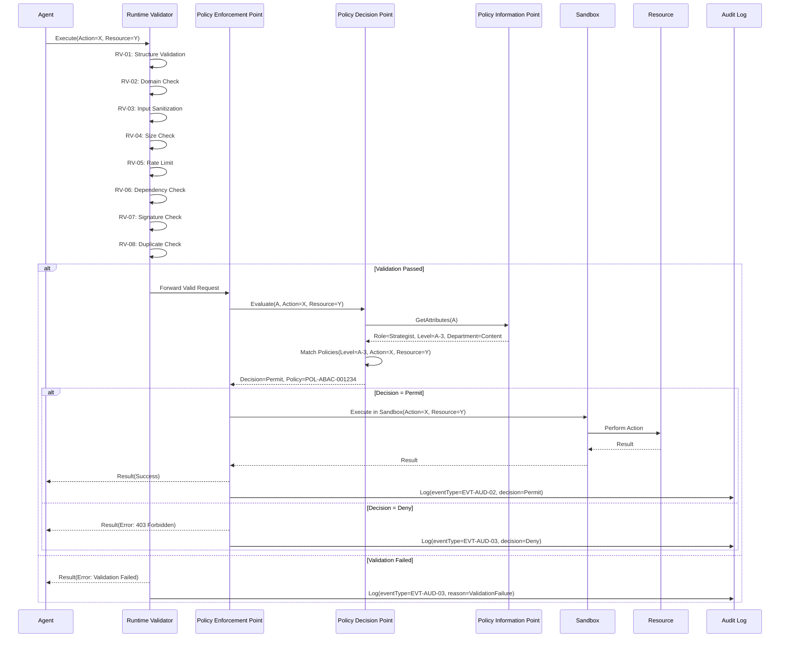
```mermaid
sequenceDiagram
    participant A as Agent
    participant RV as Runtime Validator
    participant PEP as Policy Enforcement Point
    participant PDP as Policy Decision Point
    participant PIP as Policy Information Point
    participant SAN as Sandbox
    participant RES as Resource
    participant AUD as Audit Log

    A->>RV: Execute(Action=X, Resource=Y)
    RV->>RV: RV-01: Structure Validation
    RV->>RV: RV-02: Domain Check
    RV->>RV: RV-03: Input Sanitization
    RV->>RV: RV-04: Size Check
    RV->>RV: RV-05: Rate Limit
    RV->>RV: RV-06: Dependency Check
    RV->>RV: RV-07: Signature Check
    RV->>RV: RV-08: Duplicate Check

    alt Validation Passed
        RV->>PEP: Forward Valid Request
        PEP->>PDP: Evaluate(A, Action=X, Resource=Y)
        PDP->>PIP: GetAttributes(A)
        PIP-->>PDP: Role=Strategist, Level=A-3, Department=Content
        PDP->>PDP: Match Policies(Level=A-3, Action=X, Resource=Y)
        PDP-->>PEP: Decision=Permit, Policy=POL-ABAC-001234

        alt Decision = Permit
            PEP->>SAN: Execute in Sandbox(Action=X, Resource=Y)
            SAN->>RES: Perform Action
            RES-->>SAN: Result
            SAN-->>PEP: Result
            PEP-->>A: Result(Success)
            PEP->>AUD: Log(eventType=EVT-AUD-02, decision=Permit)
        else Decision = Deny
            PEP-->>A: Result(Error: 403 Forbidden)
            PEP->>AUD: Log(eventType=EVT-AUD-03, decision=Deny)
        end
    else Validation Failed
        RV-->>A: Result(Error: Validation Failed)
        RV->>AUD: Log(eventType=EVT-AUD-03, reason=ValidationFailure)
    end
```

### ۱۹.۲ جریان پاسخ به حمله تزریق پرامپت

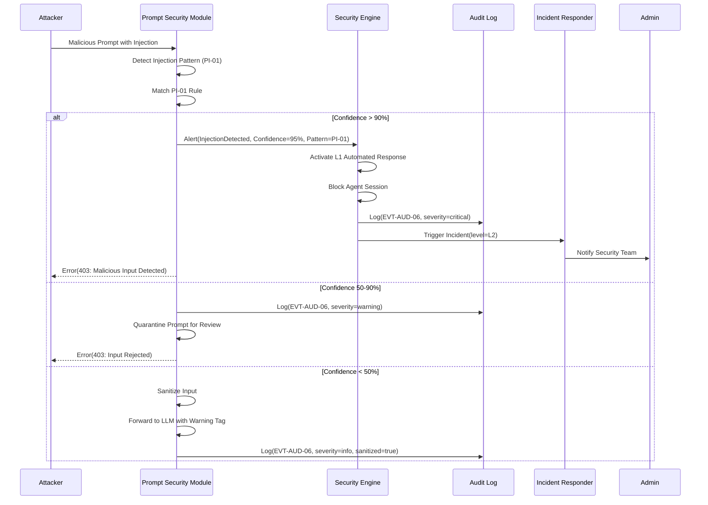
```mermaid
sequenceDiagram
    participant ATK as Attacker
    participant PSM as Prompt Security Module
    participant SEC as Security Engine
    participant AUD as Audit Log
    participant IR as Incident Responder
    participant ADM as Admin

    ATK->>PSM: Malicious Prompt with Injection
    PSM->>PSM: Detect Injection Pattern (PI-01)
    PSM->>PSM: Match PI-01 Rule

    alt Confidence > 90%
        PSM->>SEC: Alert(InjectionDetected, Confidence=95%, Pattern=PI-01)
        SEC->>SEC: Activate L1 Automated Response
        SEC->>SEC: Block Agent Session
        SEC->>AUD: Log(EVT-AUD-06, severity=critical)
        SEC->>IR: Trigger Incident(level=L2)
        IR->>ADM: Notify Security Team
        PSM-->>ATK: Error(403: Malicious Input Detected)
    else Confidence 50-90%
        PSM->>AUD: Log(EVT-AUD-06, severity=warning)
        PSM->>PSM: Quarantine Prompt for Review
        PSM-->>ATK: Error(403: Input Rejected)
    else Confidence < 50%
        PSM->>PSM: Sanitize Input
        PSM->>PSM: Forward to LLM with Warning Tag
        PSM->>AUD: Log(EVT-AUD-06, severity=info, sanitized=true)
    end
```

### ۱۹.۳ جریان ایزوله‌سازی فضای کار

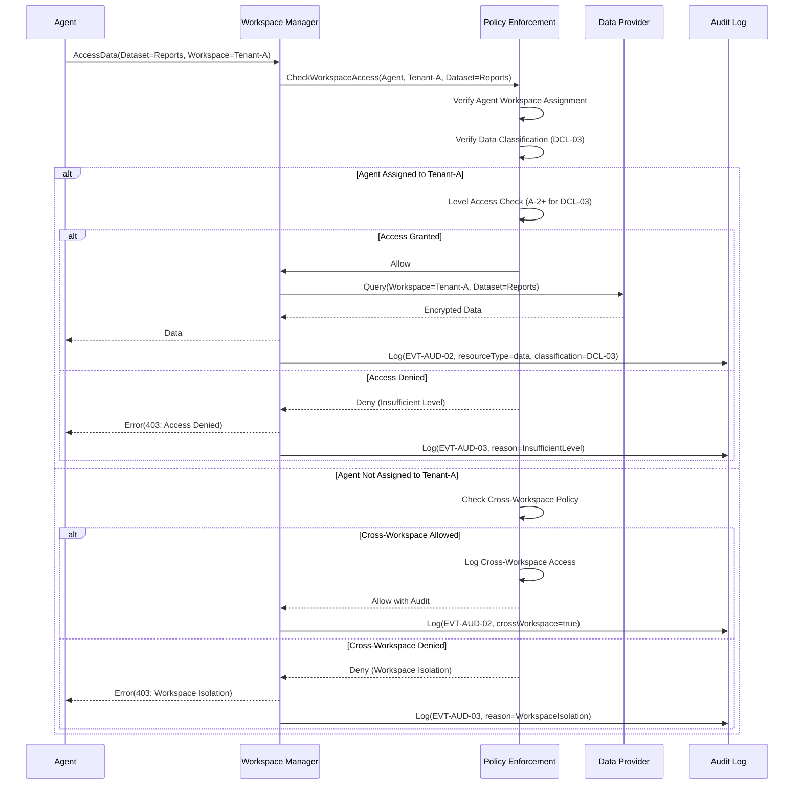
```mermaid
sequenceDiagram
    participant AG as Agent
    participant WM as Workspace Manager
    participant PEP as Policy Enforcement
    participant DP as Data Provider
    participant AUD as Audit Log

    AG->>WM: AccessData(Dataset=Reports, Workspace=Tenant-A)
    WM->>PEP: CheckWorkspaceAccess(Agent, Tenant-A, Dataset=Reports)
    PEP->>PEP: Verify Agent Workspace Assignment
    PEP->>PEP: Verify Data Classification (DCL-03)

    alt Agent Assigned to Tenant-A
        PEP->>PEP: Level Access Check (A-2+ for DCL-03)

        alt Access Granted
            PEP->>WM: Allow
            WM->>DP: Query(Workspace=Tenant-A, Dataset=Reports)
            DP-->>WM: Encrypted Data
            WM-->>AG: Data
            WM->>AUD: Log(EVT-AUD-02, resourceType=data, classification=DCL-03)
        else Access Denied
            PEP-->>WM: Deny (Insufficient Level)
            WM-->>AG: Error(403: Access Denied)
            WM->>AUD: Log(EVT-AUD-03, reason=InsufficientLevel)
        end
    else Agent Not Assigned to Tenant-A
        PEP->>PEP: Check Cross-Workspace Policy

        alt Cross-Workspace Allowed
            PEP->>PEP: Log Cross-Workspace Access
            PEP-->>WM: Allow with Audit
            WM->>AUD: Log(EVT-AUD-02, crossWorkspace=true)
        else Cross-Workspace Denied
            PEP-->>WM: Deny (Workspace Isolation)
            WM-->>AG: Error(403: Workspace Isolation)
            WM->>AUD: Log(EVT-AUD-03, reason=WorkspaceIsolation)
        end
    end
```

---

## ۲۰. Cross-Reference Matrix — ماتریس ارجاع متقابل

### ۲۰.۱ ارجاع به اسناد SMOS

| بخش SMOS-707             | سند مرتبط                       | نوع رابطه              |
| ------------------------ | ------------------------------- | ---------------------- |
| §۵ Execution Permissions | KNW-308 §۵ (مدل دسترسی پلتفرم)  | استفاده از سطوح دسترسی |
| §۵ Execution Permissions | AI-000 §۶ (سطوح اختیار Agent)   | تطبیق سطح A-\*         |
| §۶ Tool Permissions      | KNW-302 §۴ (قابلیت‌های پلتفرم)  | نگاشت Tool←Capability  |
| §۶ Tool Permissions      | GOV-001 (استانداردهای مستندات)  | انطباق با قالب         |
| §۷ Context Isolation     | SMOS-703 §۴ (مدل بافت اجرا)     | تعریف مرز بافت         |
| §۷ Context Isolation     | KNW-503 (معماری حافظه AI)       | ایزوله‌سازی حافظه      |
| §۸ Workspace Isolation   | KNW-304 §۶ (حکمرانی پلتفرم)     | جداسازی مستأجر         |
| §۸ Workspace Isolation   | GOV-006 (حکمرانی امنیت)         | انطباق با سیاست        |
| §۹ Policy Enforcement    | KNW-402 §۵ (حکمرانی عملیات)     | موتور سیاست            |
| §۹ Policy Enforcement    | AI-000 §۷ (اختیار تصمیم‌گیری)   | RBAC/ABAC تطبیق        |
| §۱۰ Runtime Validation   | SMOS-701 §۶ (قراردادهای اجرا)   | پیش‌اعتبارسنجی         |
| §۱۰ Runtime Validation   | GOV-003 (قراردادهای نام‌گذاری)  | شناسه قواعد            |
| §۱۱ Execution Sandbox    | KNW-308 §۱۰ (مدل محرمانگی)      | ایزوله‌سازی داده       |
| §۱۱ Execution Sandbox    | AUT-000 §۸ (مدل خطا و بازیابی)  | سندباکس Recovery       |
| §۱۲ Prompt Security      | PRM-000 §۴ (خانواده‌های پرامپت) | امنیت پرامپت           |
| §۱۲ Prompt Security      | KNW-502 §۶ (استدلال AI)         | اعتبارسنجی ورودی       |
| §۱۳ Agent Security       | AI-000 §۵ (انواع Agent)         | هویت و مجوز Agent      |
| §۱۳ Agent Security       | KNW-501 §۴ (مفاهیم AI)          | موجودیت‌های Agent      |
| §۱۴ Workflow Security    | AUT-000 §۶ (انواع Workflow)     | امنیت Workflow         |
| §۱۴ Workflow Security    | SMOS-702 §۵ (ماشین حالت)        | حالت‌های امنیتی        |
| §۱۵ Data Security        | KNW-308 §۸ (مدل محرمانگی)       | طبقه‌بندی داده         |
| §۱۵ Data Security        | GOV-004 (ارجاع متقابل)          | انطباق با خط‌مشی       |
| §۱۶ Audit Security       | SMOS-705 §۶ (معماری رویداد)     | زنجیره Audit           |
| §۱۶ Audit Security       | GOV-002 (نسخه‌بندی)             | نسخه Audit Log         |
| §۱۷ Incident Response    | KNW-405 §۵ (تداوم عملیات)       | بازیابی پس از حادثه    |
| §۱۷ Incident Response    | DEPLOY-001 §۴ (Ring Rollout)    | استقرار امن            |

### ۲۰.۲ ارجاع به قواعد و استانداردها

| استاندارد                             | بخش SMOS-707    | وضعیت انطباق |
| ------------------------------------- | --------------- | ------------ |
| ISO 27001 §A.9 (Access Control)       | §۵, §۶, §۹      | ✅           |
| ISO 27001 §A.12 (Operations Security) | §۱۰, §۱۱, §۱۴   | ✅           |
| ISO 27001 §A.16 (Incident Management) | §۱۷             | ✅           |
| NIST SP 800-53 AC (Access Control)    | §۵, §۶, §۹, §۱۳ | ✅           |
| NIST SP 800-53 AU (Audit)             | §۱۶             | ✅           |
| NIST SP 800-53 SC (System Protection) | §۷, §۸, §۱۱     | ✅           |
| OWASP ASVS (Application Security)     | §۱۲, §۱۰        | ✅           |
| GDPR (Data Protection)                | §۱۵             | ✅           |

---

## ۲۱. Architectural Decisions — تصمیمات معماری

| AD     | عنوان                                  | تصمیم                                               | گزینه‌های ردشده         | دلیل                                                       |
| ------ | -------------------------------------- | --------------------------------------------------- | ----------------------- | ---------------------------------------------------------- |
| AD-001 | **Policy Engine: PDP/PEP Separation**  | PDP و PEP به صورت مؤلفه‌های مجزا با ارتباط API      | PDP/PEP یکپارچه         | قابلیت مقیاس‌پذیری و تست مجزای هر کدام                     |
| AD-002 | **Sandbox: Layered Architecture**      | سندباکس ۴ لایه (Application, Runtime, OS, Hardware) | سندباکک تک‌لایه         | Defense in Depth — شکست یک لایه به معنی شکست کل سیستم نیست |
| AD-003 | **Audit: WORM + Blockchain Anchor**    | ذخیره WORM با anchor دوره‌ای در بلاکچین             | فقط WORM یا فقط بلاکچین | تداوم یکپارچگی بلندمدت + مقیاس‌پذیری                       |
| AD-004 | **Prompt Security: Pre-LLM Filter**    | فیلتر پرامپت قبل از ارسال به LLM                    | Post-LLM Filter         | جلوگیری از مصرف منابع LLM برای پرامپت‌های مخرب             |
| AD-005 | **Permission Model: RBAC + ABAC**      | ترکیب RBAC و ABAC برای حداکثر انعطاف                | فقط RBAC یا فقط ABAC    | RBAC برای نقش‌های ثابت, ABAC برای شرایط پویا               |
| AD-006 | **Context Isolation: Memory Boundary** | ایزوله‌سازی حافظه با Process/Container Boundary     | فقط Logical Namespace   | جلوگیری از نشت حافظه در سطح سیستمعامل                      |
| AD-007 | **Agent Identity: mTLS + Certificate** | احراز هویت Agent با گواهی دیجیتال و mTLS            | توکن API + JWT          | امنیت بالاتر, قابلیت چرخش و ابطال گواهی                    |
| AD-008 | **Incident Response: Multi-Level**     | ۴ سطح پاسخ (L1-L4) با زمان‌بندی مشخص                | سطح واحد                | تناسب پاسخ با شدت حادثه                                    |

---

## ۲۲. Maturity Model — مدل بلوغ

| سطح | نام           | توضیح                               | معیارها                                                                                                   |
| --- | ------------- | ----------------------------------- | --------------------------------------------------------------------------------------------------------- |
| M1  | **Initial**   | امنیت حداقلی و ad-hoc               | • بررسی دسترسی اولیه<br>• لاگ ساده<br>• بدون سندباکس                                                      |
| M2  | **Defined**   | امنیت تعریف‌شده و مستند             | • RBAC پیاده‌سازی شده<br>• Audit متمرکز<br>• سیاست‌های پایه                                               |
| M3  | **Managed**   | امنیت مدیریت‌شده و قابل اندازه‌گیری | • ABAC + RBAC فعال<br>• سندباکس فعال<br>• PDP/PEP جدا<br>• فیلتر پرامپت                                   |
| M4  | **Measured**  | امنیت قابل اندازه‌گیری با KPI       | • تمام ۱۰ دامنه امنیتی فعال<br>• Dashboard امنیتی<br>• KPI بلادرنگ<br>• Incident Response L1-L3           |
| M5  | **Optimized** | امنیت بهینه‌شده و تطبیقی            | • AI-based Threat Detection<br>• پاسخ خودکار کامل<br>• Continuous Verification<br>• Self-Healing Security |

### وضعیت فعلی: **M3 — Managed**

| دامنه                 | وضعیت فعلی | سطح هدف |
| --------------------- | ---------- | ------- |
| Execution Permissions | M3         | M5      |
| Tool Permissions      | M2         | M4      |
| Context Isolation     | M3         | M5      |
| Workspace Isolation   | M3         | M5      |
| Policy Enforcement    | M3         | M4      |
| Runtime Validation    | M3         | M5      |
| Execution Sandbox     | M2         | M4      |
| Prompt Security       | M2         | M5      |
| Agent Security        | M2         | M4      |
| Workflow Security     | M2         | M4      |
| Data Security         | M2         | M4      |
| Audit Security        | M2         | M5      |
| Incident Response     | M1         | M4      |

---

## ۲۳. Gaps & Future Work — شکاف‌ها و کارهای آینده

### ۲۳.۱ شکاف‌های شناسایی‌شده

| شکاف                                | شناسه  | اولویت | توضیح                                                |
| ----------------------------------- | ------ | ------ | ---------------------------------------------------- |
| فاقد Security Dashboard بلادرنگ     | GAP-01 | بالا   | KPI امنیتی بدون داشبورد متمرکز قابل پایش نیستند      |
| فاقد AI-based Anomaly Detection     | GAP-02 | بالا   | تشخیص ناهنجاری نیازمند مدل ML برای الگوهای حمله      |
| سندباکس سخت‌افزاری پیاده‌سازی نشده  | GAP-03 | متوسط  | Layer 4 سندباکس (Hardware Isolation) نیازمند زیرساخت |
| Incident Response L3-L4 نیازمند SOP | GAP-04 | بالا   | رویه پاسخ انسانی و اضطراری مستند نشده است            |
| فاقد Supply Chain Security          | GAP-05 | متوسط  | زنجیره تأمین Agentها و Workflowها اعتبارسنجی نمی‌شود |
| فاقد Security Chaos Engineering     | GAP-06 | پایین  | امنیت در برابر خطاهای تصادفی تست نشده است            |
| فاقد Cross-Region Audit Replication | GAP-07 | متوسط  | Audit Log در یک منطقه ذخیره می‌شود                   |
| فاقد Crypto-agility                 | GAP-08 | پایین  | الگوریتم‌های رمزنگاری قابل جایگزینی نیستند           |

### ۲۳.۲ نقشه راه آینده

```mermaid
gantt
    title Runtime Security Roadmap
    dateFormat  YYYY-MM-DD
    axisFormat  %Y-Q%q

    section Foundation (M3)
    RBAC/ABAC Policy Engine        :2026-07-01, 90d
    Context & Workspace Isolation  :2026-07-01, 60d
    Basic Sandbox (L1-L2)         :2026-08-01, 60d
    Prompt Security Filter         :2026-07-15, 45d

    section Growth (M4)
    Sandbox L3 (OS Isolation)      :2026-10-01, 60d
    Security Dashboard             :2026-10-01, 90d
    Audit L3 (WORM + Blockchain)   :2026-11-01, 60d
    Incident Response L1-L2        :2026-11-01, 45d

    section Optimization (M5)
    AI-based Anomaly Detection     :2027-01-01, 90d
    Sandbox L4 (Hardware)          :2027-02-01, 120d
    Full Incident Response L1-L4   :2027-03-01, 90d
    Self-Healing Security         :2027-04-01, 120d
    Crypto-agility Implementation :2027-05-01, 90d
```

### ۲۳.۳ توصیه‌های فوری

1. **پیاده‌سازی Prompt Security Filter**: بالاترین اولویت با توجه به THR-RT-01 (تزریق پرامپت)
2. **تکمیل RBAC/ABAC Policy Engine**: پیش‌نیاز همه دامنه‌های امنیتی دیگر
3. **استقرار Secure Audit Pipeline**: ضروری برای انطباق و ردیابی
4. **مستندسازی Incident Response SOP**: برای سطوح L3 و L4
5. **پیاده‌سازی Agent mTLS**: برای احراز هویت امن Agentها

---

## ۲۴. Security KPIs — شاخص‌های کلیدی امنیت

| KPI                     | شناسه      | هدف     | اندازه‌گیری                                |
| ----------------------- | ---------- | ------- | ------------------------------------------ |
| درصد دسترسی‌های مجاز    | SEC-KPI-01 | > 99.9% | (Permitted / Total Requests) × 100         |
| درصد دسترسی‌های ممنوع   | SEC-KPI-02 | < 0.1%  | (Denied / Total Requests) × 100            |
| زمان تشخیص تزریق پرامپت | SEC-KPI-03 | < ۵۰ms  | Average Detection Time                     |
| درصد تزریق‌های مسدودشده | SEC-KPI-04 | 100%    | (Blocked / Total Injection Attempts) × 100 |
| زمان پاسخ به حادثه L1   | SEC-KPI-05 | < ۱s    | P50 Incident Response Time                 |
| زمان پاسخ به حادثه L3   | SEC-KPI-06 | < ۳۰min | P90 Incident Response Time                 |
| درصد Audit Logهای معتبر | SEC-KPI-07 | 100%    | (Verified Signatures / Total Events) × 100 |
| 覆盖率 Policy Testing   | SEC-KPI-08 | > 95%   | (Tested Policies / Total Policies) × 100   |
| نرخ False Positive      | SEC-KPI-09 | < 0.1%  | (False Positives / Total Alerts) × 100     |
| MTTR امنیتی             | SEC-KPI-10 | < ۱۵min | Mean Time to Resolve Security Incidents    |

---

## ۲۵. Diagram Index — نمایه نمودارها

| #    | نمودار                            | بخش | نوع       |
| ---- | --------------------------------- | --- | --------- |
| D-01 | معماری امنیت زمان اجرا در یک نگاه | §۱  | Graph     |
| D-02 | سلسله‌مراتب اصول امنیت            | §۳  | Graph     |
| D-03 | سناریوهای حمله                    | §۴  | Sequence  |
| D-04 | جریان مجوزدهی                     | §۵  | Sequence  |
| D-05 | معماری مجوز ابزار                 | §۶  | Graph     |
| D-06 | ایزوله‌سازی بافت                  | §۷  | Graph     |
| D-07 | چرخه حیات Context امنیتی          | §۷  | State     |
| D-08 | ایزوله‌سازی فضای کار              | §۸  | Graph     |
| D-09 | معماری موتور سیاست                | §۹  | Graph     |
| D-10 | جریان تصمیم‌گیری سیاست            | §۹  | Sequence  |
| D-11 | جریان اعتبارسنجی Runtime          | §۱۰ | Flowchart |
| D-12 | معماری سندباکس                    | §۱۱ | Graph     |
| D-13 | جریان امنیت پرامپت                | §۱۲ | Flowchart |
| D-14 | معماری امنیت Agent                | §۱۳ | Graph     |
| D-15 | جریان امنیت Workflow              | §۱۴ | Sequence  |
| D-16 | معماری Audit امنیتی               | §۱۶ | Graph     |
| D-17 | خط لوله پاسخ به حادثه             | §۱۷ | Graph     |
| D-18 | جریان کامل تأیید و اجرا           | §۱۹ | Sequence  |
| D-19 | جریان پاسخ به حمله تزریق          | §۱۹ | Sequence  |
| D-20 | جریان ایزوله‌سازی فضای کار        | §۱۹ | Sequence  |
| D-21 | نقشه راه امنیت زمان اجرا          | §۲۳ | Gantt     |

---

## ۲۶. Glossary — واژه‌نامه

| اصطلاح                  | تعریف                                                        |
| ----------------------- | ------------------------------------------------------------ |
| **ABAC**                | Attribute-Based Access Control — کنترل دسترسی مبتنی بر ویژگی |
| **Execution Sandbox**   | محیط ایزوله برای اجرای امن Agentها                           |
| **mTLS**                | Mutual TLS — احراز هویت دوطرفه با گواهی                      |
| **PDP**                 | Policy Decision Point — نقطه تصمیم‌گیری سیاست                |
| **PEP**                 | Policy Enforcement Point — نقطه اجرای سیاست                  |
| **PIP**                 | Policy Information Point — نقطه اطلاعات سیاست                |
| **RBAC**                | Role-Based Access Control — کنترل دسترسی مبتنی بر نقش        |
| **RSP**                 | Runtime Security Principle — اصل امنیت زمان اجرا             |
| **WORM**                | Write Once Read Many — ذخیره‌سازی غیرقابل تغییر              |
| **Secure Cleanup**      | پاک‌سازی امن حافظه و دیسک پس از اتمام                        |
| **Context Boundary**    | مرز ایزوله‌سازی بین بافت‌های اجرایی                          |
| **Workspace Isolation** | جداسازی مستأجرها و پروژه‌ها                                  |
| **Prompt Injection**    | حمله تزریق دستورالعمل به پرامپت                              |
| **Incident Response**   | فرآیند پاسخ به حادثه امنیتی                                  |
| **Supply Chain Attack** | حمله از طریق وابستگی‌های آلوده                               |

---

## ۲۷. Document Control — کنترل سند

| نسخه        | تاریخ      | تغییرات                                       | نویسنده               |
| ----------- | ---------- | --------------------------------------------- | --------------------- |
| 1.0.0-draft | 2026-07-01 | پیش‌نویس اولیه — ۲۷ بخش, ۶ Schema, ۲۱ Mermaid | معمار امنیت زمان اجرا |

### نگهداری سند

- **مسئول نگهداری**: معمار امنیت زمان اجرا
- **بازبینی دوره‌ای**: هر ۳ ماه یکبار
- **بازبینی اضطراری**: پس از هر حادثه امنیتی بحرانی
- **تأییدکننده**: کمیته معماری SMOS (Governance Board)

### مسیر تصویب

```mermaid
graph LR
    D[Draft: Security Architect] --> R[Review: System Architect]
    R --> RA[Review: Risk & Compliance]
    RA --> A[Approve: Architecture Board]
    A --> P[Published: Knowledge Base]
```
