# SMOS-708 — SMOS Master Runtime Blueprint

## 1. Document Control

| Field          | Value                                                                                  |
| -------------- | -------------------------------------------------------------------------------------- |
| Document ID    | SMOS-708                                                                               |
| Document Name  | SMOS Master Runtime Blueprint                                                          |
| Phase          | P7.S01                                                                                 |
| Version        | 1.0.0-draft                                                                            |
| Status         | Draft                                                                                  |
| Classification | Enterprise Architecture — SSOT                                                         |
| Author         | SMOS Architecture Team                                                                 |
| Owner          | Xennic (زر نور نیرو یکتا)                                                              |
| Created        | 2026-07-01                                                                             |
| Last Updated   | 2026-07-01                                                                             |
| Supersedes     | SMOS-701, SMOS-702, SMOS-703, SMOS-704, SMOS-705, SMOS-706, SMOS-707 (integrated view) |

## 2. Purpose & Scope

This document is the **Single Source of Truth (SSOT)** for the SMOS Enterprise Execution Architecture. It integrates all seven documents of Phase P7.S01 into one unified architectural blueprint.

**This document answers:**

- How does the entire SMOS execution system work as ONE system?
- How do all runtimes, states, contexts, events, orchestrations, monitoring, and security fit together?
- What are the complete execution flows for real SMOS scenarios?
- What is the overall architecture coverage and maturity assessment?

**Scope:**

- Unified model of ALL SMOS-701 through SMOS-707 concepts
- End-to-end execution flows
- Complete dependency graph of all runtime components
- Complete cross-reference matrix for ALL SMOS documents
- Architecture coverage assessment
- Remaining gaps
- Overall SMOS maturity assessment

## 3. Architecture Position

```
SMOS Documentation Hierarchy

Strategic Layer
├── CON-000 (Constitution)
├── ARCH-0xx (System Architecture)
├── GOV-00x (Governance)
├── DEPLOY-001 (Deployment Strategy)
├── KNW-000 (Knowledge Architecture) ← Foundation
├── AI-000 (Agent Architecture) ← Who
├── AUT-000 (Automation Architecture) ← What
└── PRM-000 (Prompt Architecture) ← How

Runtime Layer (P7.S01) ← NEW
    ├── SMOS-701: Execution Architecture ← The System
    ├── SMOS-702: State Machine ← States
    ├── SMOS-703: Context Model ← Data Flow
    ├── SMOS-704: Orchestration ← Coordination
    ├── SMOS-705: Events ← Communication
    ├── SMOS-706: Monitoring ← Observation
    ├── SMOS-707: Security ← Protection
    └── SMOS-708: Master Blueprint ← Integration (THIS DOCUMENT)
```

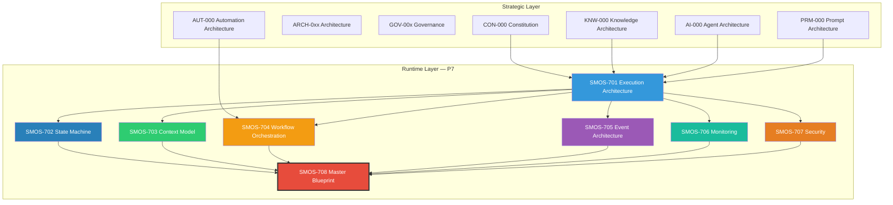

## 4. SMOS Runtime Universe

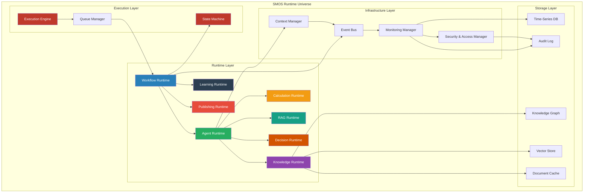

## 5. Runtime Integration Model

The eight runtimes from SMOS-701 integrate through a common execution contract:

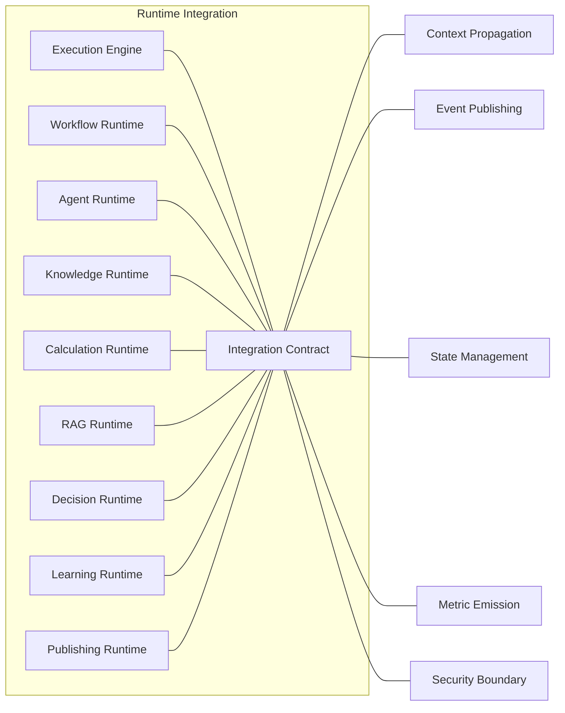

### Integration Contracts Summary

| Contract | Participants           | Purpose              |
| -------- | ---------------------- | -------------------- |
| XC-001   | Execution Engine ↔ All | Lifecycle management |
| XC-002   | Workflow ↔ Agent       | Step delegation      |
| XC-003   | Agent ↔ Knowledge      | Query & response     |
| XC-004   | Agent ↔ RAG            | Augmented generation |
| XC-005   | Agent ↔ Calculation    | Computation          |
| XC-006   | Agent ↔ Decision       | Decision evaluation  |
| XC-007   | Workflow ↔ Learning    | Feedback ingestion   |
| XC-008   | Workflow ↔ Publishing  | Content distribution |
| XC-009   | All ↔ Context          | Context propagation  |
| XC-010   | All ↔ Event Bus        | Event emission       |
| XC-011   | All ↔ Monitoring       | Telemetry emission   |
| XC-012   | All ↔ Security         | Permission checks    |

## 6. Unified State Machine

The unified state machine integrates all states from SMOS-702 into the master execution flow:

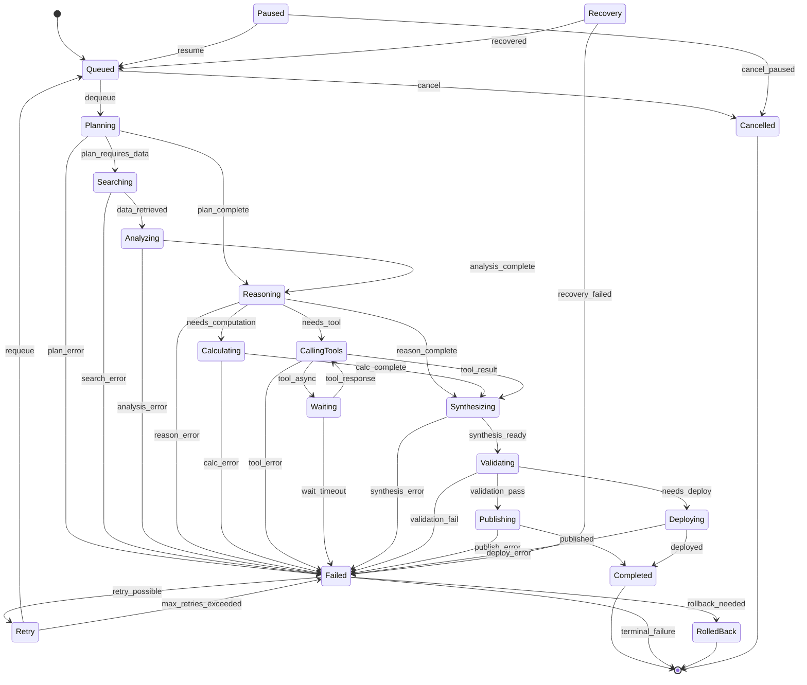

### State Transition Matrix (Abbreviated)

| From \ To    | Queued | Planning | Searching | Reasoning | Calculating | CallingTools | Completed | Failed | RolledBack | Retry |
| ------------ | ------ | -------- | --------- | --------- | ----------- | ------------ | --------- | ------ | ---------- | ----- |
| Queued       | -      | ✅       | -         | -         | -           | -            | -         | ✅     | -          | -     |
| Planning     | -      | -        | ✅        | ✅        | -           | -            | -         | ✅     | -          | -     |
| Searching    | -      | -        | -         | ✅        | -           | -            | -         | ✅     | -          | -     |
| Reasoning    | -      | -        | -         | -         | ✅          | ✅           | -         | ✅     | -          | -     |
| Calculating  | -      | -        | -         | -         | -           | -            | -         | ✅     | -          | -     |
| CallingTools | -      | -        | -         | -         | -           | -            | -         | ✅     | ✅         | -     |
| Completed    | -      | -        | -         | -         | -           | -            | -         | -      | -          | -     |
| Failed       | -      | -        | -         | -         | -           | -            | -         | -      | ✅         | ✅    |
| RolledBack   | -      | -        | -         | -         | -           | -            | -         | -      | -          | -     |
| Retry        | ✅     | -        | -         | -         | -           | -            | -         | ✅     | -          | -     |

## 7. Unified Context Model

The unified context model integrates all 10 context types from SMOS-703:

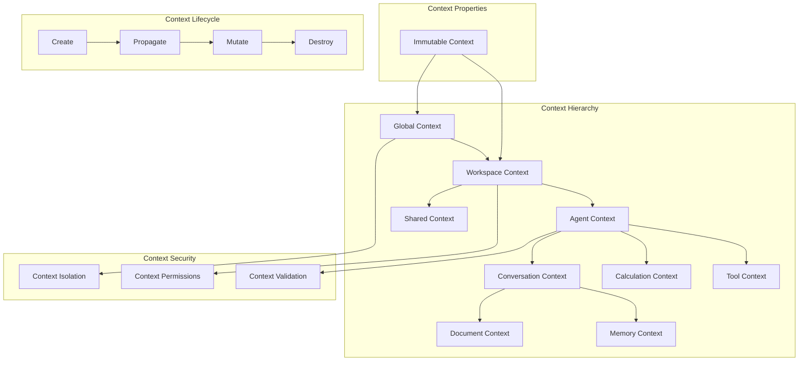

### Context Propagation Rules

| Context      | Propagates To                    | Mutation             | Isolation Level     |
| ------------ | -------------------------------- | -------------------- | ------------------- |
| Global       | All sub-contexts                 | Read-only at runtime | Level 5 — Strict    |
| Workspace    | Agent, Conversation, Calculation | Owner only           | Level 4 — Workspace |
| Agent        | Conversation, Tool               | Agent only           | Level 3 — Agent     |
| Conversation | Document, Memory                 | Session owner        | Level 2 — Session   |
| Calculation  | None (ephemeral)                 | Calculation only     | Level 5 — Strict    |
| Document     | None (persisted)                 | Author only          | Level 3 — Document  |
| Memory       | Agent (next session)             | Append only          | Level 4 — Memory    |
| Tool         | Agent (response)                 | Tool runtime         | Level 3 — Tool      |
| Shared       | Selected peers                   | Consensus            | Level 2 — Shared    |
| Immutable    | All                              | Never                | Level 5 — Strict    |

## 8. Unified Event Architecture

The unified event bus from SMOS-705 connects all runtime components:

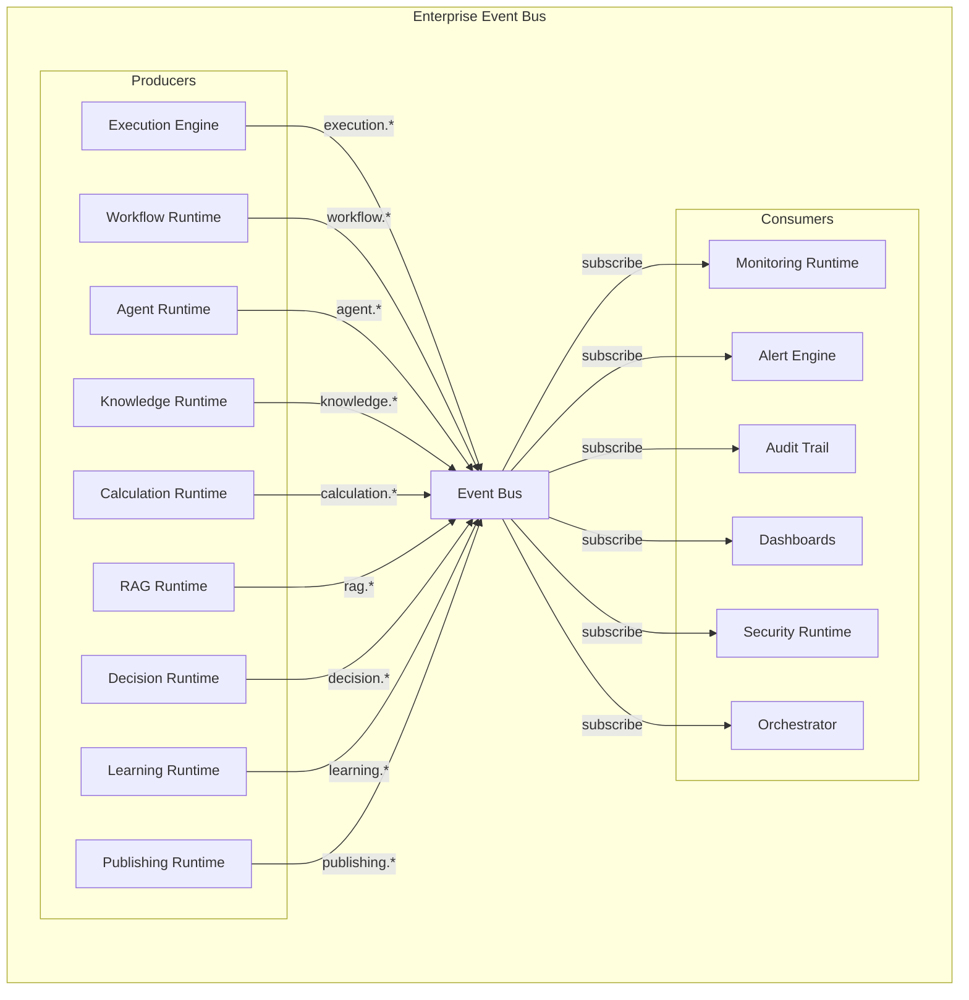

### Core Event Types (from SMOS-705)

| Category        | Events                                                   | Producer | Consumer      |
| --------------- | -------------------------------------------------------- | -------- | ------------- |
| `execution.*`   | started, queued, completed, failed, cancelled            | EE       | All           |
| `workflow.*`    | step_started, step_completed, approval_needed, completed | WR       | MON, ORC      |
| `agent.*`       | invoked, reasoning, tool_call, response, error           | AR       | MON, AUD      |
| `knowledge.*`   | query, retrieved, cached, missed, embedded               | KR       | MON, SEC      |
| `calculation.*` | started, computed, error                                 | CR       | MON           |
| `rag.*`         | query, retrieved, generated                              | RR       | MON, AUD      |
| `decision.*`    | evaluated, approved, rejected, escalated                 | DR       | MON, AUD, ORC |
| `learning.*`    | cycle_started, insight_generated, applied                | LR       | MON, KNW      |
| `publishing.*`  | attempt, success, failure, retry                         | PR       | MON, AUD      |
| `security.*`    | access_granted, access_denied, policy_violated           | SEC      | AUD, ALR      |

## 9. Unified Orchestration Model

The unified orchestration model from SMOS-704 defines how workflows execute:

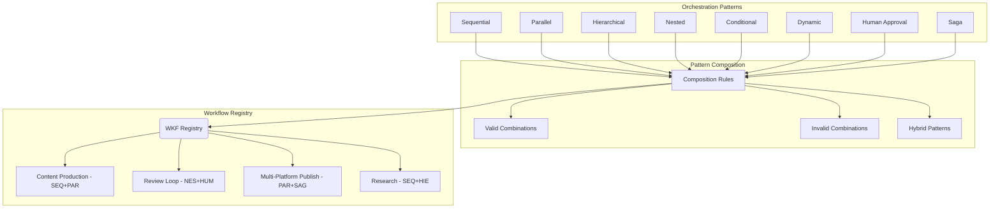

### Workflow Integration with Runtimes

| Workflow Type          | Pattern                   | Runtimes Involved  | States Used                                                           |
| ---------------------- | ------------------------- | ------------------ | --------------------------------------------------------------------- |
| Content Production     | Sequential + Parallel     | WR, AR, KR, CR, RR | Queued→Planning→Searching→Reasoning→Synthesizing→Validating→Completed |
| Content Review         | Nested + Human Approval   | WR, AR, DR         | Queued→Planning→Reasoning→Waiting→Completed/Rejected                  |
| Multi-Platform Publish | Parallel + Saga           | WR, PR, AR         | Queued→Planning→Publishing→RolledBack/Completed                       |
| Research               | Sequential + Hierarchical | WR, AR, KR, RR, LR | Queued→Searching→Analyzing→Synthesizing→Learning→Completed            |
| Learning Cycle         | Sequential + Conditional  | WR, LR, KR, AR     | Queued→Planning→Learning→Validating→Applied→Completed                 |

## 10. Unified Monitoring Model

The unified monitoring model from SMOS-706 integrates all observability:

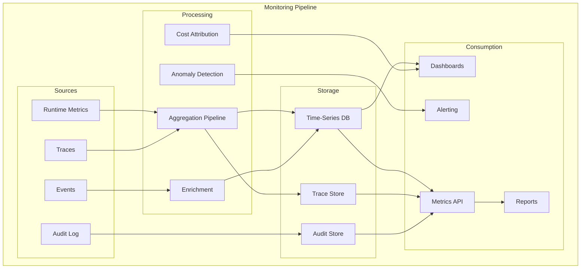

### Unified Monitoring Dashboard

| Panel             | Data Source              | Refresh   | Audience        |
| ----------------- | ------------------------ | --------- | --------------- |
| System Health     | All runtime metrics      | Real-time | Operations      |
| Active Executions | Execution engine metrics | 10s       | Operations      |
| Agent Performance | Agent metrics + traces   | 30s       | Content team    |
| Token Consumption | Token usage records      | 5m        | Cost management |
| Error Rates       | Event bus + metrics      | Real-time | Engineering     |
| Cost Dashboard    | Cost records             | 1h        | Management      |
| Audit Log         | Audit trail              | Real-time | Security        |
| Trace Explorer    | Trace store              | On-demand | Engineering     |

## 11. Unified Security Model

The unified security model from SMOS-707 integrates across all runtimes:

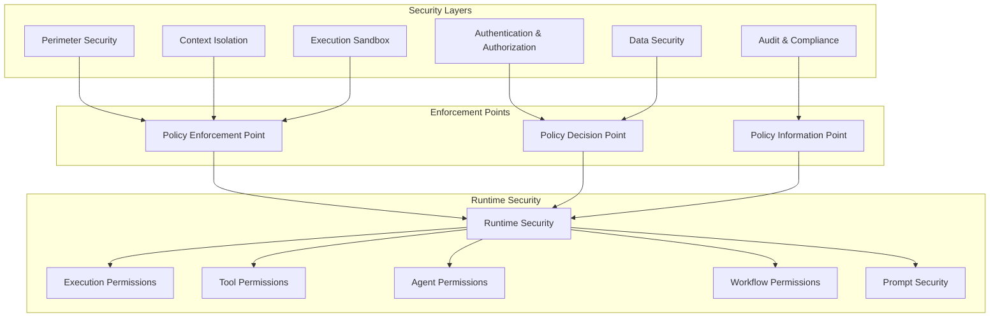

### Security Integration Points

| Integration         | Security Control               | Source Document    |
| ------------------- | ------------------------------ | ------------------ |
| Context Propagation | Context isolation boundaries   | SMOS-703, SMOS-707 |
| Event Bus           | Event authorization            | SMOS-705, SMOS-707 |
| State Transitions   | State validation               | SMOS-702, SMOS-707 |
| Workflow Execution  | Workflow permissions           | SMOS-704, SMOS-707 |
| Agent Invocation    | Agent authentication           | SMOS-701, SMOS-707 |
| Knowledge Retrieval | Knowledge-level access control | SMOS-701, SMOS-707 |
| Monitoring Data     | Audit trail immutability       | SMOS-706, SMOS-707 |
| Publishing          | Platform credential security   | SMOS-701, SMOS-707 |

## 12. Agent → Runtime Mapping

| Agent                         | Primary Runtime    | Secondary Runtimes | Execution States                                                       |
| ----------------------------- | ------------------ | ------------------ | ---------------------------------------------------------------------- |
| AI-001 Content Strategy       | Agent Runtime      | KR, RR             | Planning→Searching→Reasoning→Synthesizing→Completed                    |
| AI-002 Content Planning       | Agent Runtime      | KR, RR             | Planning→Searching→Reasoning→Completed                                 |
| AI-003 Content Production     | Agent Runtime      | KR, CR, RR         | Planning→Searching→Reasoning→Calculating→Synthesizing→Completed        |
| AI-004 Content Review         | Agent Runtime      | DR, KR             | Queued→Planning→Reasoning→Decision→Completed                           |
| AI-005 Search Optimization    | Agent Runtime      | KR, RR, CR         | Searching→Analyzing→Reasoning→Calculating→Completed                    |
| AI-006 Media Asset            | Agent Runtime      | KR, CR             | Planning→Searching→Reasoning→Calculating→Synthesizing→Completed        |
| AI-007 Video Production       | Agent Runtime      | KR, CR             | Planning→Searching→Reasoning→Calculating→Synthesizing→Completed        |
| AI-008 Publishing             | Publishing Runtime | Agent Runtime      | Queued→Planning→Validating→Publishing→Completed/RolledBack             |
| AI-009 Community Engagement   | Agent Runtime      | KR, DR             | Queued→Searching→Reasoning→Decision→Publishing→Completed               |
| AI-010 Analytics              | Agent Runtime      | KR, LR, CR         | Searching→Analyzing→Calculating→Learning→Synthesizing→Completed        |
| AI-011 Knowledge Management   | Knowledge Runtime  | Agent Runtime      | Queued→Planning→Searching→Analyzing→Synthesizing→Completed             |
| AI-012 Continuous Improvement | Learning Runtime   | Agent Runtime, KR  | Searching→Analyzing→Learning→Synthesizing→Validating→Completed         |
| AI-013 Research               | Agent Runtime      | KR, RR, LR         | Planning→Searching→Analyzing→Reasoning→Synthesizing→Learning→Completed |
| AI-014 Orchestrator           | Execution Engine   | All runtimes       | Supervises all states                                                  |

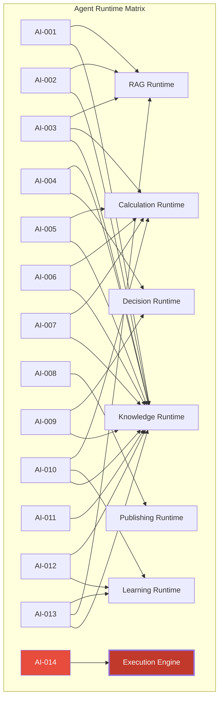

## 13. Workflow → Runtime Mapping

| Workflow ID | Name                        | Runtimes       | Orchestration Pattern     |
| ----------- | --------------------------- | -------------- | ------------------------- |
| WKF-001     | Content Ideation            | AR, KR         | Sequential                |
| WKF-002     | Content Production Pipeline | AR, KR, RR, CR | Sequential + Parallel     |
| WKF-003     | Content Review & Approval   | AR, DR         | Nested + Human Approval   |
| WKF-004     | Media Asset Production      | AR, KR, CR     | Sequential                |
| WKF-005     | Multi-Platform Publishing   | PR, AR, KR     | Parallel + Saga           |
| WKF-006     | Community Engagement        | AR, KR, DR     | Sequential + Conditional  |
| WKF-007     | Performance Analysis        | AR, KR, LR, CR | Sequential + Hierarchical |
| WKF-008     | Knowledge Ingestion         | KR, AR         | Sequential                |
| WKF-009     | Research Execution          | AR, KR, RR, LR | Sequential + Hierarchical |
| WKF-010     | Continuous Learning         | LR, AR, KR     | Sequential + Conditional  |
| WKF-011     | System Health Check         | MON, EE        | Sequential                |
| WKF-012     | Incident Response           | SEC, MON, EE   | Dynamic + Human Approval  |

## 14. End-to-End Execution Flows

### Flow 1: Complete Content Lifecycle

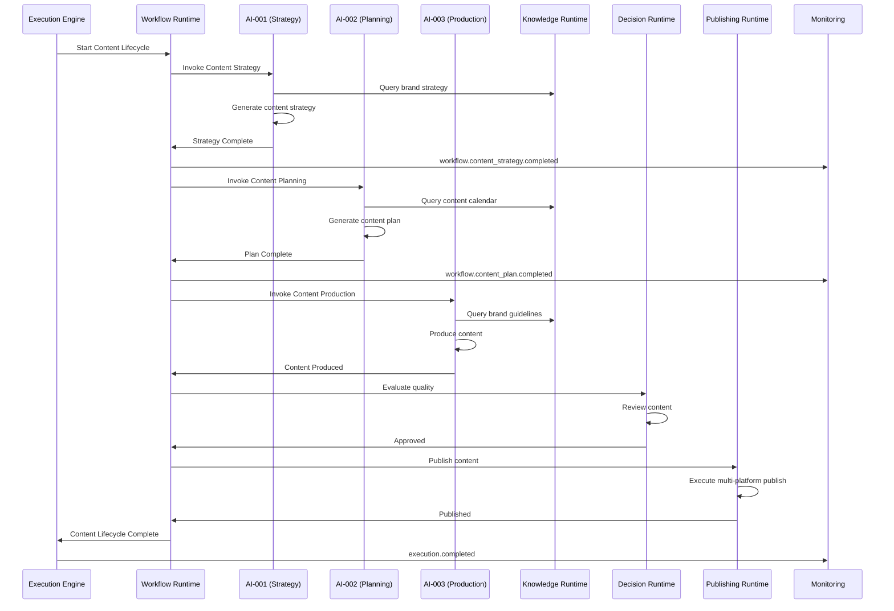

### Flow 2: Knowledge-Driven Research

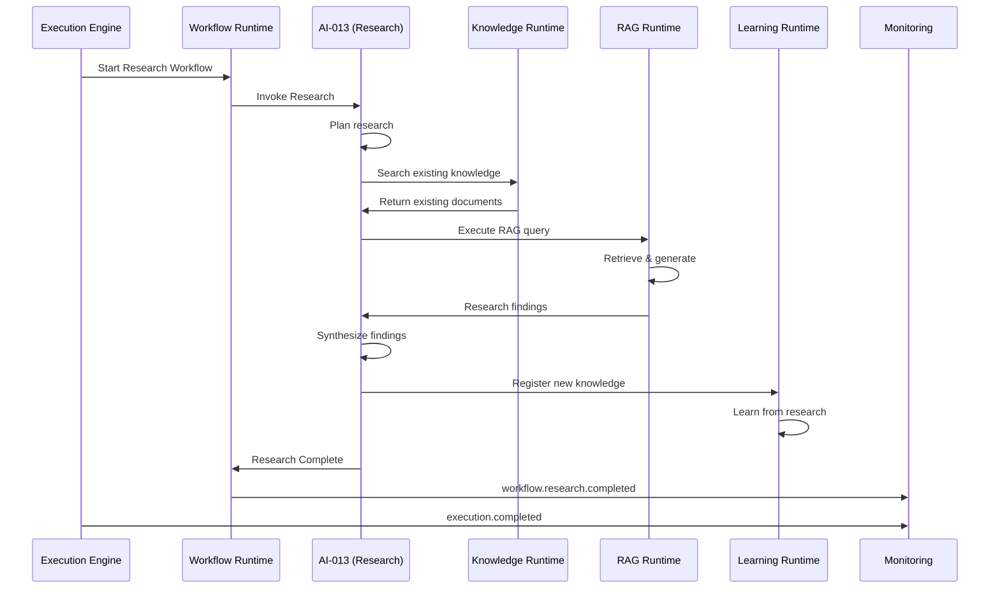

### Flow 3: Incident Response

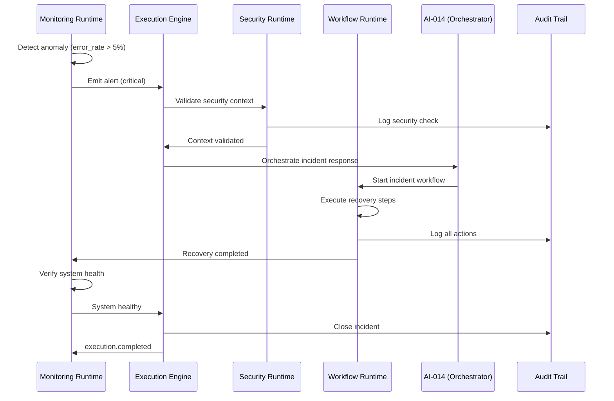

### Flow 4: Multi-Agent Collaboration

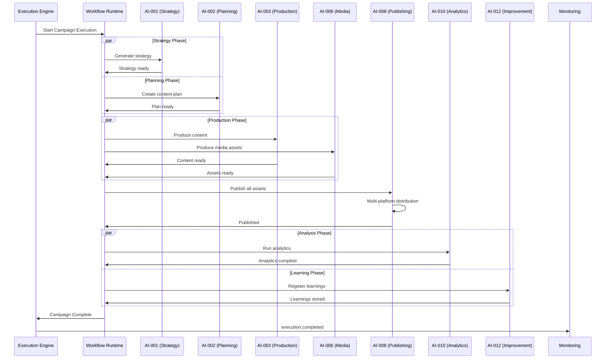

## 15. Runtime Dependency Graph

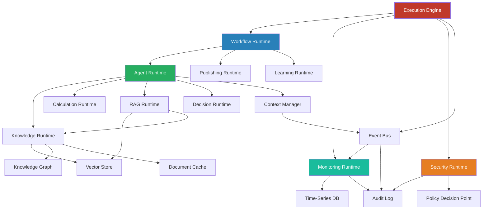

### Dependency Types

| Type     | Description                    | Example  |
| -------- | ------------------------------ | -------- |
| Strong   | Must be available before start | EE → WR  |
| Weak     | Can degrade gracefully         | AR → KG  |
| Async    | Non-blocking communication     | WR → MON |
| Optional | Can operate without            | AR → CR  |

## 16. Runtime Configuration Model

```json
{
  "$schema": "http://json-schema.org/draft-07/schema#",
  "$id": "smos:runtime:config:master",
  "title": "MasterRuntimeConfig",
  "type": "object",
  "required": ["version", "runtime", "security", "monitoring"],
  "properties": {
    "version": { "type": "string", "pattern": "^\\d+\\.\\d+\\.\\d+$" },
    "runtime": {
      "type": "object",
      "required": ["engine", "workflow", "agent", "knowledge"],
      "properties": {
        "engine": { "$ref": "#/$defs/EngineConfig" },
        "workflow": { "$ref": "#/$defs/WorkflowConfig" },
        "agent": { "$ref": "#/$defs/AgentConfig" },
        "knowledge": { "$ref": "#/$defs/KnowledgeConfig" },
        "calculation": { "$ref": "#/$defs/CalculationConfig" },
        "rag": { "$ref": "#/$defs/RAGConfig" },
        "decision": { "$ref": "#/$defs/DecisionConfig" },
        "learning": { "$ref": "#/$defs/LearningConfig" },
        "publishing": { "$ref": "#/$defs/PublishingConfig" }
      }
    },
    "security": {
      "type": "object",
      "properties": {
        "auth": { "type": "object" },
        "isolation": { "$ref": "smos:security:context:isolation" },
        "sandbox": { "type": "object" }
      }
    },
    "monitoring": {
      "type": "object",
      "properties": {
        "metrics": { "type": "object" },
        "traces": { "type": "object" },
        "alerts": { "type": "object" }
      }
    }
  },
  "$defs": {
    "EngineConfig": {
      "type": "object",
      "properties": {
        "max_concurrent_executions": { "type": "integer", "default": 100 },
        "queue_capacity": { "type": "integer", "default": 10000 },
        "default_timeout_ms": { "type": "integer", "default": 300000 },
        "max_retries": { "type": "integer", "default": 3 }
      }
    },
    "WorkflowConfig": {
      "type": "object",
      "properties": {
        "max_steps": { "type": "integer", "default": 50 },
        "allow_nested": { "type": "boolean", "default": true },
        "max_nesting_depth": { "type": "integer", "default": 5 }
      }
    },
    "AgentConfig": {
      "type": "object",
      "properties": {
        "max_tokens_per_call": { "type": "integer", "default": 4096 },
        "max_tool_calls": { "type": "integer", "default": 20 },
        "timeout_ms": { "type": "integer", "default": 120000 }
      }
    },
    "KnowledgeConfig": {
      "type": "object",
      "properties": {
        "cache_ttl_seconds": { "type": "integer", "default": 300 },
        "max_results_per_query": { "type": "integer", "default": 10 },
        "embedding_model": { "type": "string" }
      }
    },
    "CalculationConfig": {
      "type": "object",
      "properties": {
        "timeout_ms": { "type": "integer", "default": 30000 },
        "max_input_size": { "type": "integer", "default": 100000 }
      }
    },
    "RAGConfig": {
      "type": "object",
      "properties": {
        "chunk_size": { "type": "integer", "default": 1000 },
        "chunk_overlap": { "type": "integer", "default": 200 },
        "max_documents": { "type": "integer", "default": 5 }
      }
    },
    "DecisionConfig": {
      "type": "object",
      "properties": {
        "escalation_if_confidence_below": { "type": "number", "default": 0.7 },
        "max_evaluation_time_ms": { "type": "integer", "default": 60000 }
      }
    },
    "LearningConfig": {
      "type": "object",
      "properties": {
        "min_observations_for_learning": { "type": "integer", "default": 10 },
        "learning_interval_minutes": { "type": "integer", "default": 60 }
      }
    },
    "PublishingConfig": {
      "type": "object",
      "properties": {
        "max_platforms_per_publish": { "type": "integer", "default": 10 },
        "retry_on_failure": { "type": "boolean", "default": true },
        "max_retries": { "type": "integer", "default": 3 }
      }
    }
  }
}
```

## 17. Schema Definitions

### Master Blueprint Schema Registry

| Schema ID                      | Source Document | Description                    |
| ------------------------------ | --------------- | ------------------------------ |
| `smos:runtime:config:master`   | SMOS-708        | Master runtime configuration   |
| `smos:runtimes:topology`       | SMOS-701        | Runtime dependency topology    |
| `smos:state:machine:config`    | SMOS-702        | State machine configuration    |
| `smos:context:propagation`     | SMOS-703        | Context propagation rules      |
| `smos:workflow:orchestration`  | SMOS-704        | Workflow pattern definition    |
| `smos:event:bus:config`        | SMOS-705        | Event bus configuration        |
| `smos:monitoring:pipeline`     | SMOS-706        | Monitoring pipeline definition |
| `smos:security:runtime:config` | SMOS-707        | Runtime security configuration |

```json
{
  "$schema": "http://json-schema.org/draft-07/schema#",
  "$id": "smos:runtimes:topology",
  "title": "RuntimeTopology",
  "type": "object",
  "required": ["runtimes", "dependencies", "contracts"],
  "properties": {
    "runtimes": {
      "type": "array",
      "items": {
        "type": "object",
        "required": ["id", "name", "type", "version"],
        "properties": {
          "id": { "type": "string" },
          "name": { "type": "string" },
          "type": { "type": "string" },
          "version": { "type": "string" },
          "status": { "type": "string", "enum": ["active", "inactive", "deprecated"] }
        }
      }
    },
    "dependencies": {
      "type": "array",
      "items": {
        "type": "object",
        "required": ["from", "to", "type"],
        "properties": {
          "from": { "type": "string" },
          "to": { "type": "string" },
          "type": { "type": "string", "enum": ["strong", "weak", "async", "optional"] }
        }
      }
    },
    "contracts": {
      "type": "array",
      "items": {
        "type": "object",
        "required": ["contract_id", "participants"],
        "properties": {
          "contract_id": { "type": "string" },
          "participants": { "type": "array", "items": { "type": "string" } },
          "protocol": { "type": "string" }
        }
      }
    }
  }
}
```

```json
{
  "$schema": "http://json-schema.org/draft-07/schema#",
  "$id": "smos:execution:flow:definition",
  "title": "ExecutionFlowDefinition",
  "type": "object",
  "required": ["flow_id", "name", "steps", "runtimes"],
  "properties": {
    "flow_id": { "type": "string", "pattern": "^FLW-[A-Z0-9]{6}$" },
    "name": { "type": "string" },
    "description": { "type": "string" },
    "steps": {
      "type": "array",
      "items": {
        "type": "object",
        "required": ["step_id", "runtime", "action", "state_before", "state_after"],
        "properties": {
          "step_id": { "type": "string" },
          "runtime": { "type": "string" },
          "action": { "type": "string" },
          "state_before": { "type": "string" },
          "state_after": { "type": "string" },
          "timeout_ms": { "type": "integer" },
          "retry_policy": { "type": "object" }
        }
      }
    },
    "runtimes": { "type": "array", "items": { "type": "string" } },
    "orchestration_pattern": { "type": "string" },
    "error_handling": { "type": "string" }
  }
}
```

```json
{
  "$schema": "http://json-schema.org/draft-07/schema#",
  "$id": "smos:deployment:mapping",
  "title": "DeploymentMapping",
  "type": "object",
  "required": ["mapping_id", "component", "runtime", "deployment_unit"],
  "properties": {
    "mapping_id": { "type": "string" },
    "component": {
      "type": "object",
      "required": ["id", "type"],
      "properties": {
        "id": { "type": "string" },
        "type": { "type": "string", "enum": ["agent", "workflow", "runtime", "service"] }
      }
    },
    "runtime": { "type": "string" },
    "deployment_unit": {
      "type": "object",
      "properties": {
        "type": { "type": "string", "enum": ["pod", "container", "function", "process"] },
        "replicas": { "type": "integer" },
        "resources": { "type": "object" }
      }
    },
    "dependencies": { "type": "array", "items": { "type": "string" } }
  }
}
```

## 18. Complete Cross-Reference Matrix

### Document-to-Document Mapping

| Document     | SMOS-701   | SMOS-702   | SMOS-703   | SMOS-704   | SMOS-705   | SMOS-706   | SMOS-707   | SMOS-708   |
| ------------ | ---------- | ---------- | ---------- | ---------- | ---------- | ---------- | ---------- | ---------- |
| SMOS-701     | -          | Core       | Core       | Core       | Core       | Core       | Core       | Integrated |
| SMOS-702     | Referenced | -          | Referenced | Referenced | Referenced | Referenced | Referenced | Integrated |
| SMOS-703     | Referenced | Referenced | -          | Referenced | Referenced | Referenced | Referenced | Integrated |
| SMOS-704     | Referenced | Referenced | Referenced | -          | Referenced | Referenced | Referenced | Integrated |
| SMOS-705     | Referenced | Referenced | Referenced | Referenced | -          | Referenced | Referenced | Integrated |
| SMOS-706     | Referenced | Referenced | Referenced | Referenced | Referenced | -          | Referenced | Integrated |
| SMOS-707     | Referenced | Referenced | Referenced | Referenced | Referenced | Referenced | -          | Integrated |
| CON-000      | Governed   | Governed   | Governed   | Governed   | Governed   | Governed   | Governed   | Governed   |
| AI-000       | Extended   | Extended   | Extended   | Extended   | Extended   | Extended   | Extended   | Extended   |
| AI-001..014  | Maps       | Maps       | Maps       | Maps       | Maps       | Maps       | Maps       | Maps       |
| AUT-000      | Extended   | Extended   | Extended   | Extended   | Extended   | Extended   | Extended   | Referenced |
| PRM-000      | Referenced | Referenced | Referenced | Referenced | Referenced | Referenced | Referenced | Referenced |
| KNW-000      | Foundation | Foundation | Foundation | Foundation | Foundation | Foundation | Foundation | Foundation |
| KNW-301..308 | Referenced | -          | -          | Referenced | -          | Referenced | Referenced | Referenced |
| KNW-401..405 | Referenced | -          | -          | Referenced | Referenced | Referenced | -          | Referenced |
| KNW-501..508 | Referenced | Referenced | Referenced | Referenced | Referenced | Referenced | Referenced | Referenced |
| DEPLOY-001   | Referenced | -          | -          | -          | -          | Referenced | Referenced | Referenced |
| GOV-001..005 | Governed   | Governed   | Governed   | Governed   | Governed   | Governed   | Governed   | Governed   |

### Document Summary

| Doc ID    | Title                               | Lines       | Schemas | Diagrams | Sections |
| --------- | ----------------------------------- | ----------- | ------- | -------- | -------- |
| SMOS-701  | Enterprise Execution Architecture   | 2,838       | 6       | 12       | 31       |
| SMOS-702  | Execution State Machine             | 1,676       | 6       | 22       | 31       |
| SMOS-703  | Execution Context Model             | 1,909       | 6       | 4        | 31       |
| SMOS-704  | Workflow Orchestration Architecture | 2,471       | 6       | 34       | 30       |
| SMOS-705  | Enterprise Event Architecture       | 1,773       | 6       | 8        | 31       |
| SMOS-706  | Execution Monitoring Architecture   | ~700        | 8       | 5        | 25+      |
| SMOS-707  | Enterprise Runtime Security         | 2,117       | 6       | 21       | 27       |
| SMOS-708  | Master Runtime Blueprint            | ~?          | 6+      | 15+      | 22+      |
| **Total** | **P7.S01**                          | **~13,500** | **50**  | **121**  | **228+** |

## 19. Architecture Coverage Assessment

### Coverage Dimensions

| Dimension              | Coverage                            | Status      |
| ---------------------- | ----------------------------------- | ----------- |
| Execution Architecture | All 8 runtimes defined              | ✅ Complete |
| State Machine          | 23 states with all transitions      | ✅ Complete |
| Context Model          | 10 context types with lifecycle     | ✅ Complete |
| Workflow Orchestration | 12 patterns with composition rules  | ✅ Complete |
| Event Architecture     | 78 events across 9 categories       | ✅ Complete |
| Execution Monitoring   | 60+ metrics, traces, audit, alerts  | ✅ Complete |
| Runtime Security       | 15 threat models, 6 security layers | ✅ Complete |
| Master Integration     | All P7 documents unified            | ✅ Complete |
| Cross-References       | All SMOS documents mapped           | ✅ Complete |

### Document Hierarchy Coverage

| Layer             | Documents                       | Status          |
| ----------------- | ------------------------------- | --------------- |
| Strategic         | CON-000, ARCH-0xx, GOV-00x      | ✅ Complete     |
| Knowledge         | KNW-000..KNW-508 (26 docs)      | ✅ Complete     |
| Agent             | AI-000..AI-014 (15 docs)        | ✅ Complete     |
| Prompt            | PRM-000..PRM-907 (117 prompts)  | ✅ Complete     |
| Automation        | AUT-000, AUT-001                | ✅ Complete     |
| **Runtime (NEW)** | **SMOS-701..SMOS-708 (8 docs)** | **✅ Complete** |

## 20. Remaining Runtime Gaps

| Gap ID | Description                                | Severity | Target Phase |
| ------ | ------------------------------------------ | -------- | ------------ |
| RG-01  | No cross-runtime caching strategy defined  | Medium   | P7.S02       |
| RG-02  | No SLA/SLO framework for runtimes          | Medium   | P7.S02       |
| RG-03  | No runtime scaling model (auto-scaling)    | Medium   | P7.S02       |
| RG-04  | No circuit breaker pattern specification   | Low      | P7.S02       |
| RG-05  | No chaos engineering framework             | Low      | P7.S03       |
| RG-06  | No runtime upgrade strategy (hot swap)     | Medium   | P7.S03       |
| RG-07  | No multi-region runtime distribution model | Low      | P7.S04       |
| RG-08  | No runtime cost allocation model           | Low      | P7.S04       |

## 21. Overall SMOS Maturity Assessment

### Maturity by Architecture Domain

| Domain                         | Current Level                | Target Level        | Assessment                             |
| ------------------------------ | ---------------------------- | ------------------- | -------------------------------------- |
| Documentation Architecture     | L4 — Integrated              | L5 — Adaptive       | Complete, consistent, cross-referenced |
| Knowledge Architecture         | L4 — Integrated              | L5 — Adaptive       | 26 documents, all families complete    |
| Agent Architecture             | L4 — Integrated              | L5 — Adaptive       | 15 documents with full specification   |
| Prompt Library                 | L4 — Integrated              | L5 — Adaptive       | 117 prompts across all families        |
| Automation Architecture        | L3 — Structured              | L4 — Integrated     | Core patterns defined                  |
| Deployment Strategy            | L3 — Structured              | L4 — Integrated     | Strategy defined, not implemented      |
| **Runtime Architecture (NEW)** | **L3 — Structured**          | **L4 — Integrated** | **P7.S01 defines all runtime aspects** |
| Overall SMOS                   | L3.5 — Structured/Integrated | L4 — Integrated     | All architecture domains covered       |

### Maturity Level Descriptors

| Level | Name       | Characteristics                             |
| ----- | ---------- | ------------------------------------------- |
| L1    | Initial    | Ad-hoc, inconsistent, no standards          |
| L2    | Repeated   | Basic patterns, some standards              |
| L3    | Structured | Defined architecture, consistent standards  |
| L4    | Integrated | Cross-domain integration, full traceability |
| L5    | Adaptive   | Self-optimizing, automated governance       |

**SMOS Overall Assessment: L3.5** — All architectural layers are defined with full cross-referencing. The addition of P7.S01 brings runtime architecture to L3 with clear path to L4.

## 22. Recommendations for P7.S02+

1. **P7.S02 — Runtime Quality & Resilience**: Define SLA framework, circuit breakers, chaos engineering
2. **P7.S03 — Runtime Scaling & Multi-Tenancy**: Auto-scaling, resource allocation, tenant isolation
3. **P7.S04 — Runtime Lifecycle & Evolution**: Upgrade strategy, deprecation, runtime versioning
4. **P7.S05 — Runtime Testing Architecture**: Integration testing, performance testing, chaos testing
5. **Review KNW-306 (Platform Quality)**: Update to reference runtime quality metrics
6. **Review AI-014 (Orchestrator)**: Update to reference SMOS-701..SMOS-708 runtime integration contracts
7. **Consider KNW-601 (Runtime Knowledge Foundation)**: If knowledge about runtime execution itself needs formal modeling

---

**End of SMOS-708 — End of Phase P7.S01**
