# SMOS-709 — معماری زمان‌بند اجرا (Runtime Scheduler Architecture)

> **شناسه:** SMOS-709
> **وضعیت:** پیش‌نویس
> **نسخه:** 1.0.0-draft
> **فاز:** P7.S02 — Runtime Quality & Resilience
> **خانواده:** EXEC
> **دامنه:** EXD-09 — Scheduler
> **نوع:** Runtime Scheduler Architecture
> **تاریخ:** 2026-07-01
> **مسئول:** معمار اجرای سیستم
> **SSOT:** ✅ بله — تک منبع حقیقت معماری زمان‌بند اجرا
> **اختیار:** A-4 (Enterprise)
> **زبان روایت:** فارسی
> **زبان شناسه‌ها:** انگلیسی
> **وابستگی:** SMOS-701, SMOS-702, SMOS-703, SMOS-704, SMOS-705, SMOS-706, SMOS-707, SMOS-708, AI-000, AI-001..014, KNW-000, KNW-001, KNW-101, KNW-102, AUT-000, AUT-001, PRM-000, PRM-001, DEPLOY-001
> **مخاطب:** system-architect, runtime-engineer, scheduler-developer, devops-engineer, ai-orchestrator, automation-engineer

---

## فهرست (Table of Contents)

1. [Document Control](#1-document-control)
2. [Purpose & Scope](#2-purpose--scope)
3. [Scheduler Architecture Overview](#3-scheduler-architecture-overview)
4. [Scheduling Principles](#4-scheduling-principles)
5. [Scheduler Core Components](#5-scheduler-core-components)
6. [Queue Management Architecture](#6-queue-management-architecture)
7. [Priority Model](#7-priority-model)
8. [Scheduling Algorithms](#8-scheduling-algorithms)
9. [Task Dispatching Model](#9-task-dispatching-model)
10. [Scheduler State Machine](#10-scheduler-state-machine)
11. [Scheduler Workflow](#11-scheduler-workflow)
12. [Concurrency Control](#12-concurrency-control)
13. [Resource-Aware Scheduling](#13-resource-aware-scheduling)
14. [Preemption Model](#14-preemption-model)
15. [Deadline Management](#15-deadline-management)
16. [Scheduler Failure Scenarios](#16-scheduler-failure-scenarios)
17. [Retry Strategies](#17-retry-strategies)
18. [Rollback Strategies](#18-rollback-strategies)
19. [Scheduler Monitoring & Metrics](#19-scheduler-monitoring--metrics)
20. [Scheduler Security](#20-scheduler-security)
21. [Scheduler Scaling](#21-scheduler-scaling)
22. [Multi-Tenancy Support](#22-multi-tenancy-support)
23. [API Contracts](#23-api-contracts)
24. [JSON Schema Definitions](#24-json-schema-definitions)
25. [Event Schema Definitions](#25-event-schema-definitions)
26. [Configuration Examples](#26-configuration-examples)
27. [Configuration Reference](#27-configuration-reference)
28. [Cross-Reference Matrix](#28-cross-reference-matrix)
29. [Version History](#29-version-history)
30. [Gaps & Future Work](#30-gaps--future-work)

---

## 1. Document Control

| Field          | Value                                 |
| -------------- | ------------------------------------- |
| Document ID    | SMOS-709                              |
| Document Name  | Runtime Scheduler Architecture        |
| Phase          | P7.S02 — Runtime Quality & Resilience |
| Version        | 1.0.0-draft                           |
| Status         | Draft                                 |
| Classification | Enterprise Architecture — SSOT        |
| Author         | SMOS Architecture Team                |
| Owner          | Xennic (زر نور نیرو یکتا)             |
| Created        | 2026-07-01                            |
| Last Updated   | 2026-07-01                            |
| Supersedes     | SMOS-701 §۸ (scheduling overview)     |
| Review Due     | P7.S03                                |

### 1.1 واژگان کلیدی (Key Terms)

| اصطلاح         | تعریف                                                                                  |
| -------------- | -------------------------------------------------------------------------------------- |
| **Scheduler**  | مؤلفه مرکزی که زمان‌بندی، صف‌بندی، اولویت‌بندی و توزیع واحدهای اجرایی را مدیریت می‌کند |
| **Task**       | یک واحد اجرایی اتمی که توسط Scheduler برنامه‌ریزی و توزیع می‌شود                       |
| **Queue**      | ساختار داده FIFO یا priority-based که وظایف منتظر اجرا را نگهداری می‌کند               |
| **Priority**   | درجه اهمیت یک Task که ترتیب اجرا را تعیین می‌کند                                       |
| **Dispatch**   | فرآیند اختصاص یک Task به یک Executor برای اجرا                                         |
| **Preemption** | توقف یک Task با اولویت پایین‌تر برای اجرای Task با اولویت بالاتر                       |
| **Deadline**   | مهلت زمانی مشخص برای تکمیل یک Task                                                     |
| **SLA**        | سطح توافق شده سرویس برای زمان تکمیل Task                                               |
| **Tenant**     | یک نهاد مستقل (مشتری / دپارتمان) که از Scheduler به صورت ایزوله استفاده می‌کند         |
| **Executor**   | مؤلفه اجرایی که یک Task را اجرا می‌کند (مثلاً Runtime Agent, Workflow Engine)          |

---

## 2. Purpose & Scope

### 2.1 Purpose

SMOS-709 **معماری زمان‌بند اجرا (Runtime Scheduler)** را تعریف می‌کند. این سند مشخص می‌کند که Taskها چگونه در SMOS زمان‌بندی، اولویت‌بندی، صف‌بندی و توزیع می‌شوند.

**اهداف اصلی:**

1. **تعریف معماری Scheduler** — مؤلفه‌ها، لایه‌ها، اتصالات و جریان داده
2. **مدل صف‌بندی چندلایه** — FIFO, Priority, Deadline-Aware, Resource-Aware
3. **مدل اولویت سازمانی** — ۸ سطح اولویت با قواعد ارتقا/تنزل
4. **۴ الگوریتم زمان‌بندی** — با جزئیات کامل پیاده‌سازی
5. **مدل توزیع Task** — انتشار، Load Balancing, Affinity
6. **ماشین حالت Scheduler** — ۱۲ وضعیت با انتقال‌های تعریف‌شده
7. **مدل همروندی** — قفل‌گذاری، محدودیت‌ها، الگوهای همگام‌سازی
8. **آگاهی از منابع** — CPU, Memory, Token, API Rate Limit
9. **مدل Preemption** — قطع و ازسرگیری Taskها
10. **مدیریت مهلت (Deadline)** — EDF, LLF, Miss Ratio
11. **سناریوهای خطا** — ۸ سناریو با استراتژی Retry/Rollback
12. **نظارت و متریک** — ۲۵+ متریک زمان‌بندی
13. **مدل امنیتی** — احراز هویت، مجوز، ایزولاسیون
14. **مقیاس‌پذیری** — Horizontal/Vertical, Partitioning, Sharding
15. **چندمستاجری** — ایزولاسیون کامل بین Tenantها
16. **قرارداد API** — ۹ endpoint با Request/Response کامل
17. **۶ Schema JSON (Draft-07)**
18. **تعاریف رویداد** — ۱۵ رویداد Scheduler

### 2.2 In Scope

| حوزه                   | توضیح                                   |
| ---------------------- | --------------------------------------- |
| معماری Scheduler       | مؤلفه‌ها، لایه‌ها، اتصالات، دیاگرام     |
| مدیریت صف              | FIFO, Priority, Delay, Dead-Letter      |
| مدل اولویت             | ۸ سطح اولویت، قواعد ارتقا/تنزل          |
| الگوریتم‌های زمان‌بندی | FIFO, Priority, Weighted, EDF           |
| مدل توزیع              | Dispatch, Load Balance, Affinity, Retry |
| ماشین حالت Scheduler   | ۱۲ وضعیت، انتقال‌های مجاز               |
| همروندی                | قفل‌گذاری، Semaphore, Mutex             |
| آگاهی از منابع         | CPU, Memory, Token, Rate Limit          |
| Preemption             | قطع همکارانه، اجباری، Checkpoint        |
| Deadline               | EDF, LLF, Deadline Miss                 |
| خطا و بازیابی          | ۸ سناریو، Retry/Rollback                |
| نظارت و متریک          | ۲۵+ متریک، ۵ داشبورد                    |
| امنیت                  | احراز هویت، مجوز، ایزولاسیون            |
| مقیاس‌پذیری            | Horizontal/Vertical, Sharding           |
| Multi-Tenancy          | ایزولاسیون کامل Tenant                  |
| API                    | ۹ endpoint با Schema کامل               |
| JSON Schema            | ۶ Schema (Draft-07)                     |
| رویداد                 | ۱۵ رویداد Scheduler                     |
| پیکربندی               | JSON/YAML نمونه و مرجع                  |

### 2.3 Out of Scope

| حوزه                                | دلیل                          |
| ----------------------------------- | ----------------------------- |
| پیاده‌سازی کد Scheduler             | حوزه مهندسی نرم‌افزار         |
| زیرساخت صف Broker (RabbitMQ, Kafka) | حوزه SMOS-705 و انتخاب فناوری |
| Task اجرایی خاص                     | حوزه AUT-NNN و AI-NNN         |
| جزئیات Executor داخلی               | حوزه SMOS-701 و Runtimeها     |
| واسط کاربری Scheduler               | حوزه UX/UI                    |
| Vendor-specific APIs                | خنثی‌بودن فناوری              |

---

## 3. Scheduler Architecture Overview

Scheduler SMOS یک **زمان‌بند چندلایه، توزیع‌شده و آگاه از منابع** است که تمام Taskهای سیستم را مدیریت می‌کند.

### 3.1 معماری مؤلفه‌ای (Component Architecture)

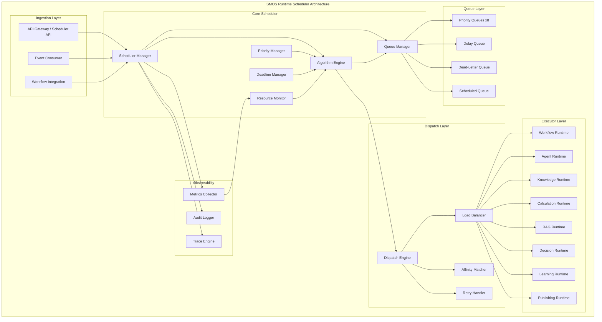

### 3.2 جایگاه Scheduler در معماری SMOS

Scheduler بین **Runtime Layer** (SMOS-701) و **Workflow Orchestration** (SMOS-704) قرار می‌گیرد. تمام Taskهایی که توسط Orchestrator تعریف می‌شوند برای اجرا به Scheduler سپرده می‌شوند.

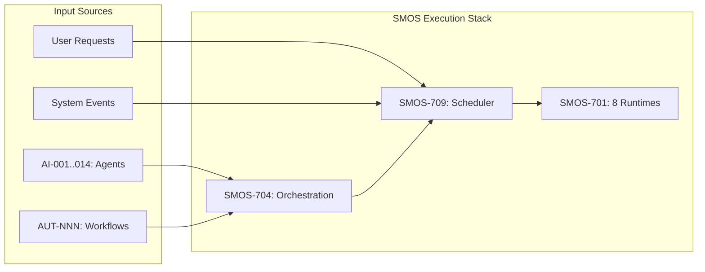

### 3.3 جریان داده (Data Flow)

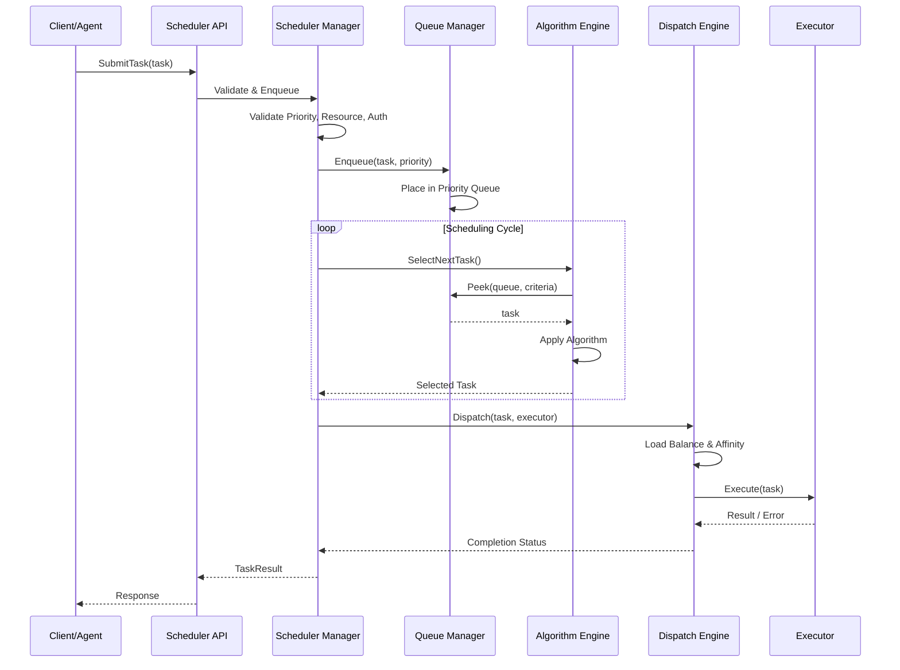

### 3.4 اعداد کلیدی Scheduler

| آیتم                     | مقدار پیش‌فرض | توضیح                       |
| ------------------------ | ------------- | --------------------------- |
| حداکثر Task همزمان       | ۱۰۰۰          | قابل تنظیم در Configuration |
| تعداد Priority Level     | ۸             | P-0 تا P-7                  |
| حداکثر Retry             | ۳             | قابل تنظیم per Task         |
| زمان پایه Retry          | ۵s            | Backoff: exponential        |
| حداکثر Deep Queue        | ۱۰۰,۰۰۰       | قبل از Backpressure         |
| Scheduler Tick           | ۱۰۰ms         | چرخه اصلی زمان‌بندی         |
| حداکتور تأخیر Priority   | ۵۰ms          | P-0 تا P-1                  |
| حداکثر تأخیر Best Effort | ۶۰s           | P-7                         |
| Deadline Slack           | ۱۰٪           | پنجره برای EDF              |

---

## 4. Scheduling Principles

این اصول چارچوب طراحی Scheduler SMOS را شکل می‌دهند:

| #      | اصل                                         | توضیح                                                                      | پیامد نقض                               |
| ------ | ------------------------------------------- | -------------------------------------------------------------------------- | --------------------------------------- |
| SCP-01 | **عدالت در توزیع (Fairness)**               | همه Taskها بر اساس اولویت و منابع، سهم عادلانه از زمان اجرا دریافت می‌کنند | گرسنمانی (Starvation) Taskهای کم‌اولویت |
| SCP-02 | **شفافیت اولویت (Priority Transparency)**   | اولویت هر Task مستند، قابل ردیابی و تغییرناپذیر پس از شروع اجراست          | دستکاری اولویت، هرج‌ومرج زمان‌بندی      |
| SCP-03 | **جداسازی بار (Workload Isolation)**        | Tenantها و اولویت‌های مختلف از یکدیگر ایزوله هستند                         | تداخل بار، نقض SLA                      |
| SCP-04 | **آگاهی از منابع (Resource Awareness)**     | Scheduler قبل از توزیع، منابع موجود را بررسی می‌کند                        | تخصیص بیش از حد، خرابی آبشاری           |
| SCP-05 | **پایبندی به مهلت (Deadline Adherence)**    | Taskهای دارای مهلت با الگوریتم EDF زمان‌بندی می‌شوند                       | نقض SLA                                 |
| SCP-06 | **کشسانی (Elasticity)**                     | Scheduler با افزایش/کاهش بار، منابع را پویا تنظیم می‌کند                   | مصرف بیش از حد یا کمبود منابع           |
| SCP-07 | **بازیابی خودکار (Self-Healing)**           | خرابی‌ها به صورت خودکار شناسایی و جبران می‌شوند                            | وابستگی به مداخله دستی                  |
| SCP-08 | **قابلیت حسابرسی کامل (Full Auditability)** | تمام تصمیمات Scheduler ثبت و قابل بازبینی است                              | عدم ردیابی خطاهای زمان‌بندی             |
| SCP-09 | **پیش‌بینی‌پذیری (Determinism)**            | برای ورودی یکسان، Scheduler همواره خروجی یکسان تولید می‌کند                | غیرقابل پیش‌بینی بودن رفتار سیستم       |
| SCP-10 | **کمینه‌سازی سربار (Minimal Overhead)**     | Scheduler نباید بیش از ۵٪ از منابع سیستم را مصرف کند                       | کاهش توان عملیاتی سیستم                 |
| SCP-11 | **اولویت امنیت (Security by Default)**      | همه Taskها با کمترین سطح دسترسی (Least Privilege) اجرا می‌شوند             | نشت داده، دسترسی غیرمجاز                |
| SCP-12 | **عدم مسدودیت فراگیر (No Global Block)**    | خطا در یک صف یا Task نباید کل Scheduler را مسدود کند                       | ازکارافتادگی کامل زمان‌بندی             |

---

## 5. Scheduler Core Components

### 5.1 Scheduler Manager

مدیر مرکزی Scheduler که تمام عملیات را هماهنگ می‌کند.

| ویژگی   | توضیح                                             |
| ------- | ------------------------------------------------- |
| مسئولیت | مدیریت چرخه حیات Task، هماهنگی بین مؤلفه‌ها       |
| ورودی   | SubmitTask, CancelTask, GetStatus, UpdatePriority |
| خروجی   | TaskResult, StatusChange Event, Audit Log         |
| حالت‌ها | Running, Paused, Draining, Stopped                |
| Cache   | Task Cache (LRU, ۱۰٬۰۰۰ entry)                    |

### 5.2 Queue Manager

مدیریت تمام صف‌های Scheduler.

| ویژگی       | توضیح                                                                |
| ----------- | -------------------------------------------------------------------- |
| مسئولیت     | Enqueue, Dequeue, Peek, Reorder, MoveToDeadLetter                    |
| صف‌ها       | Priority Queue (x8), Delay Queue, Dead-Letter Queue, Scheduled Queue |
| ساختار      | Heap-based Priority Queue + LinkedList                               |
| عملیات اتمی | Enqueue/Dequeue با قفل خوش‌بینانه                                    |

### 5.3 Priority Manager

مدیریت و محاسبه اولویت Taskها.

| ویژگی   | توضیح                                                      |
| ------- | ---------------------------------------------------------- |
| مسئولیت | اعتبارسنجی اولویت، ارتقا/تنزل اولویت، Priority Inheritance |
| سطوح    | P-0 (Critical) تا P-7 (Best Effort)                        |
| ارتقا   | Dynamic Priority Aging برای جلوگیری از Starvation          |
| تنزل    | در صورت مصرف بیش از حد منابع                               |

### 5.4 Algorithm Engine

موتور الگوریتم‌های زمان‌بندی.

| ویژگی          | توضیح                                  |
| -------------- | -------------------------------------- |
| مسئولیت        | انتخاب Task بعدی بر اساس الگوریتم فعال |
| الگوریتم‌ها    | FIFO, Priority, Weighted Fair, EDF     |
| انتخاب         | قابل تنظیم per Queue / Per Task Type   |
| Context Switch | ثبت و اندازه‌گیری سربار تغییر Task     |

### 5.5 Deadline Manager

مدیریت مهلت‌های Task.

| ویژگی    | توضیح                                                   |
| -------- | ------------------------------------------------------- |
| مسئولیت  | ردیابی مهلت‌ها، اعلان نزدیکی مهلت، مدیریت Miss          |
| الگوریتم | Earliest Deadline First (EDF), Least Laxity First (LLF) |
| Events   | DeadlineApproaching, DeadlineMissed, DeadlineExtended   |
| SLA      | ثبت درصد Miss و تأخیر                                   |

### 5.6 Resource Monitor

نظارت و مدیریت منابع سیستم.

| ویژگی    | توضیح                                               |
| -------- | --------------------------------------------------- |
| مسئولیت  | جمع‌آوری متریک‌های منابع، محاسبه ظرفیت باقیمانده    |
| منابع    | CPU, Memory, Token Budget, API Rate Limit, Disk I/O |
| خروجی    | ResourceAvailability, CapacityPlan, ThrottleSignal  |
| پیش‌بینی | مدل ساده خطی برای تخمین مصرف آتی                    |

### 5.7 Dispatch Engine

توزیع Task به Executorهای مناسب.

| ویژگی                 | توضیح                                              |
| --------------------- | -------------------------------------------------- |
| مسئولیت               | انتخاب Executor, Load Balancing, Affinity Matching |
| استراتژی Load Balance | Round Robin, Least Loaded, Weighted                |
| Affinity              | Locality-aware, Cache-aware, Tenant-aware          |
| Retry                 | ارسال مجدد به Executor دیگر در صورت خطا            |

---

## 6. Queue Management Architecture

### 6.1 ساختار صف (Queue Structure)

SMOS از **۴ خانواده صف** با ساختار سلسله‌مراتبی استفاده می‌کند:

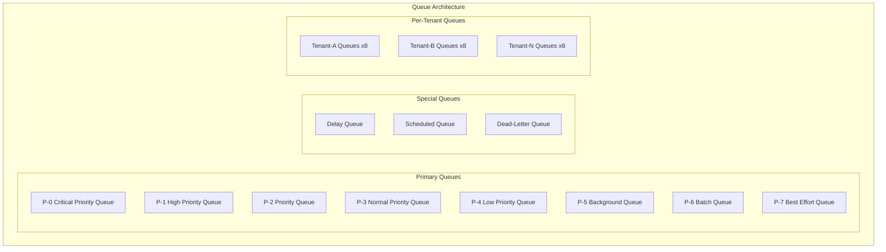

### 6.2 مشخصات هر صف

| ویژگی    | Priority Queue                          | Delay Queue                      | Scheduled Queue                     | Dead-Letter Queue      |
| -------- | --------------------------------------- | -------------------------------- | ----------------------------------- | ---------------------- |
| ساختار   | Heap (Min/Max)                          | Timer Wheel                      | Timer Wheel + Heap                  | LinkedList             |
| ظرفیت    | ∞ (configurable)                        | ۱۰,۰۰۰                           | ۵۰,۰۰۰                              | ∞                      |
| TTL Task | ۷ روز                                   | Configurable                     | تا زمان Schedule                    | ۳۰ روز                 |
| رفتار    | Task با اولویت بالاتر زودتر خارج می‌شود | Task تا زمان Delay در صف می‌ماند | Task تا زمان Schedule در صف می‌ماند | Taskهای ناموفق نهایی   |
| عملیات   | Enqueue/Dequeue/Peek/Reorder            | Enqueue/Dequeue/Promote          | Enqueue/Dequeue                     | Enqueue/Dequeue/Replay |

### 6.3 Queue Operations

| عملیات           | توضیح                                        | Atomic?               | Complexity |
| ---------------- | -------------------------------------------- | --------------------- | ---------- |
| Enqueue          | افزودن Task به صف                            | بله                   | O(log n)   |
| Dequeue          | برداشتن Task از صف                           | بله                   | O(log n)   |
| Peek             | مشاهده Task بدون حذف                         | بله                   | O(1)       |
| Reorder          | تغییر اولویت Task در صف                      | خیر (Dequeue+Enqueue) | O(log n)   |
| Promote          | انتقال Task از Delay Queue به Priority Queue | بله                   | O(log n)   |
| MoveToDeadLetter | انتقال Task به Dead-Letter Queue             | بله                   | O(1)       |
| Drain            | تخلیه تدریجی صف                              | خیر                   | O(n)       |

### 6.4 Queue State Machine

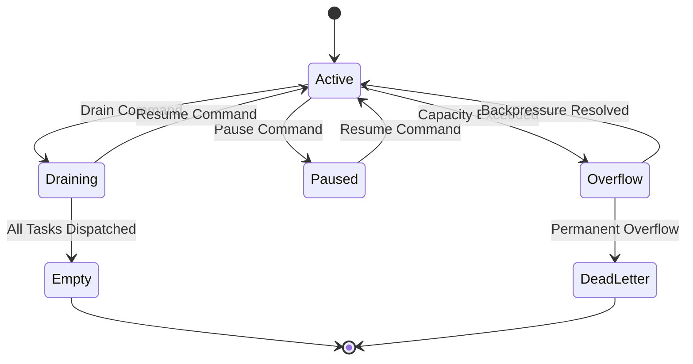

### 6.5 Backpressure

زمانی که صف Priority Queue به آستانه ۹۰٪ ظرفیت خود می‌رسد:

1. Scheduler Manager **Backpressure Signal** صادر می‌کند
2. منابع ورودی جدید محدود می‌شوند (Rate Limiting)
3. Taskهای Priority P-6 و P-7 به Delay Queue منتقل می‌شوند
4. در صورت تداوم فشار، Taskهای P-5 به Delay Queue منتقل می‌شوند
5. اعلان Backpressure به Orchestrator (SMOS-704) ارسال می‌شود

---

## 7. Priority Model

### 7.1 سطوح اولویت (Priority Levels)

| سطح | شناسه | نام         | حداکثر تأخیر | موارد مصرف                          | SLA     |
| --- | ----- | ----------- | ------------ | ----------------------------------- | ------- |
| ۰   | P-0   | Critical    | ۵۰ms         | دستورات امنیتی، استثناهای بحرانی    | ۹۹٫۹۹۹٪ |
| ۱   | P-1   | High        | ۱۰۰ms        | پاسخ به کاربر, Transactionهای حیاتی | ۹۹٫۹۹٪  |
| ۲   | P-2   | Priority    | ۲۵۰ms        | انتشار محتوا, تصمیم‌گیری بلادرنگ    | ۹۹٫۹٪   |
| ۳   | P-3   | Normal      | ۱s           | تولید محتوا, پردازش Agent           | ۹۹٪     |
| ۴   | P-4   | Low         | ۵s           | همگام‌سازی دانش, تحلیل              | ۹۸٪     |
| ۵   | P-5   | Background  | ۳۰s          | یادگیری, بهینه‌سازی                 | ۹۵٪     |
| ۶   | P-6   | Batch       | ۵min         | پردازش دسته‌ای, گزارش               | ۹۰٪     |
| ۷   | P-7   | Best Effort | بدون تضمین   | پاکسازی, بایگانی, Crawling          | -       |

### 7.2 قواعد اولویت (Priority Rules)

| قانون | توضیح                                                                                |
| ----- | ------------------------------------------------------------------------------------ |
| PR-01 | هر Task دقیقاً یک Priority Level دارد                                                |
| PR-02 | اولویت در زمان ایجاد Task تعیین می‌شود و قابل تغییر نیست (مگر توسط Priority Manager) |
| PR-03 | تنها Priority Manager می‌تواند اولویت را تغییر دهد                                   |
| PR-04 | ارتقا فقط برای جلوگیری از Starvation مجاز است                                        |
| PR-05 | تنزل فقط در صورت مصرف بیش از حد منابع مجاز است                                       |
| PR-06 | Taskهای P-0 هرگز مسدود نمی‌شوند                                                      |
| PR-07 | Taskهای P-7 هرگز Priority Inheritance ندارند                                         |

### 7.3 Priority Aging

برای جلوگیری از Starvation Taskهای کم‌اولویت:

```json
{
  "priorityAging": {
    "enabled": true,
    "intervalMs": 60000,
    "incrementStep": 1,
    "maxPromotion": 4,
    "eligibleLevels": ["P-3", "P-4", "P-5", "P-6", "P-7"],
    "promotionTargets": {
      "P-7": "P-5",
      "P-6": "P-4",
      "P-5": "P-3",
      "P-4": "P-2",
      "P-3": "P-2"
    }
  }
}
```

### 7.4 Priority Inheritance

زمانی که یک Task با اولویت بالا به نتیجه Task با اولویت پایین وابسته است:

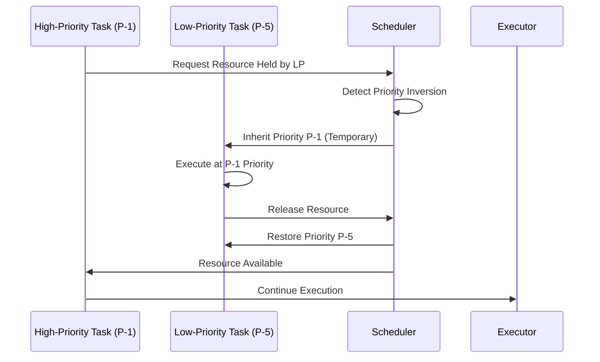

---

## 8. Scheduling Algorithms

SMOS از **۴ الگوریتم زمان‌بندی** اصلی پشتیبانی می‌کند که قابل انتخاب per Task Type هستند.

### 8.1 الگوریتم ۱: FIFO (First-In-First-Out)

ساده‌ترین الگوریتم — Taskها به ترتیب ورود اجرا می‌شوند.

| ویژگی      | مقدار                                |
| ---------- | ------------------------------------ |
| نام        | FIFO                                 |
| مناسب برای | Bulk Processing, Batch Jobs          |
| پیش‌نیاز   | ندارد                                |
| مزیت       | سادگی، Fairness در سطح یک اولویت     |
| عیب        | عدم تمایز بین Taskهای مهم و کم‌اهمیت |

```text
FIFO Algorithm:
  1. Dequeue from Priority Queue head
  2. Assign to next available Executor
  3. Wait for completion or timeout
  4. If success: acknowledge, compute metrics
  5. If failure: increment retry count
```

### 8.2 الگوریتم ۲: Priority-Based

Taskها بر اساس Priority Level انتخاب می‌شوند.

| ویژگی      | مقدار                              |
| ---------- | ---------------------------------- |
| نام        | Priority                           |
| مناسب برای | سیستم‌های تعاملی، Agentهای بلادرنگ |
| پیش‌نیاز   | Priority Level معتبر               |
| مزیت       | تضمین پاسخ‌دهی Taskهای مهم         |
| عیب        | Starvation احتمالی (رفع با Aging)  |

```text
Priority Algorithm:
  1. Scan Priority Queues from P-0 to P-7
  2. Select highest non-empty queue
  3. Dequeue head Task
  4. Apply Priority Aging to all queues
  5. Assign Task to Executor
  6. Track wait time per priority level
```

### 8.3 الگوریتم ۳: Weighted Fair Scheduling

توزیع عادلانه با وزن‌های مشخص.

| ویژگی      | مقدار                          |
| ---------- | ------------------------------ |
| نام        | Weighted Fair                  |
| مناسب برای | Multi-Tenant, Resource-Sharing |
| پیش‌نیاز   | Weight Configuration per Queue |
| مزیت       | Fairness دقیق، قابل تنظیم      |
| عیب        | پیچیدگی محاسباتی بیشتر         |

وزن‌های پیش‌فرض:

| Priority Level | Weight | سهم CPU |
| -------------- | ------ | ------- |
| P-0            | ۱۰۰    | ۴۰٪     |
| P-1            | ۵۰     | ۲۰٪     |
| P-2            | ۲۵     | ۱۰٪     |
| P-3            | ۱۵     | ۸٪      |
| P-4            | ۱۰     | ۶٪      |
| P-5            | ۸      | ۵٪      |
| P-6            | ۵      | ۳٪      |
| P-7            | ۲      | ۱٪      |

```text
Weighted Fair Algorithm:
  1. Calculate virtual finish time for each Task:
     VFT = max(current_time, last_finish_time) + (task_weight / total_weight) * quantum
  2. Select Task with minimum VFT
  3. Execute for quantum duration
  4. If preempted: recalculate VFT
  5. Repeat
```

### 8.4 الگوریتم ۴: Deadline-Aware (EDF)

اولویت با Taskهایی که مهلت نزدیک‌تری دارند.

| ویژگی      | مقدار                                  |
| ---------- | -------------------------------------- |
| نام        | EDF (Earliest Deadline First)          |
| مناسب برای | SLA-sensitive, Time-critical Tasks     |
| پیش‌نیاز   | Deadline تعریف‌شده برای Task           |
| مزیت       | بیشینه‌سازی Miss Ratio                 |
| عیب        | نیاز به Deadline دقیق، احتمال Overload |

```text
EDF Algorithm:
  1. For each Task with deadline:
     laxity = deadline - current_time - remaining_execution_time
  2. If laxity < SLACK_THRESHOLD (10% of deadline):
     Mark as URGENT
  3. Sort urgent tasks by deadline (earliest first)
  4. Select task with minimum deadline
  5. If no urgent task: fall back to Priority algorithm
  6. Track deadline miss ratio
```

### 8.5 انتخاب الگوریتم (Algorithm Selection)

| Task Type          | الگوریتم پیش‌فرض | قابل تغییر؟ |
| ------------------ | ---------------- | ----------- |
| Agent Execution    | Priority         | بله         |
| Workflow Step      | Priority         | بله         |
| Knowledge Indexing | FIFO             | خیر         |
| Content Publishing | EDF              | خیر         |
| Batch Report       | Weighted Fair    | بله         |
| System Command     | Priority (P-0)   | خیر         |
| Learning Cycle     | Weighted Fair    | بله         |
| API Request        | Priority         | بله         |

---

## 9. Task Dispatching Model

### 9.1 معماری Dispatch

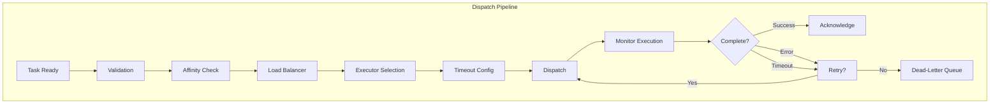

### 9.2 Executor Affinity

Affinity تعیین می‌کند که یک Task به کدام Executor تخصیص یابد:

| نوع Affinity   | توضیح                           | مثال                                      |
| -------------- | ------------------------------- | ----------------------------------------- |
| **Locality**   | نزدیکی داده به Executor         | Task دانش → Executor با Cache داغ         |
| **Cache**      | Executor دارای Cache مرتبط      | Task پردازش ویدئو → Executor با GPU Cache |
| **Tenant**     | Executor همان Tenant            | Task Tenant-A → Executor مختص Tenant-A    |
| **Capability** | Executor دارای قابلیت مورد نیاز | Task تولید محتوا → Executor با قابلیت NLP |
| **Session**    | تداوم Session قبلی              | Task ادامه پردازش → Executor قبلی         |

### 9.3 Load Balancing Strategies

| استراتژی     | توضیح                         | مزیت          | عیب                    |
| ------------ | ----------------------------- | ------------- | ---------------------- |
| Round Robin  | توزیع چرخشی                   | سادگی         | نادیده گرفتن بار واقعی |
| Least Loaded | انتخاب Executor با کمترین بار | توزیع متوازن  | نیاز به نظارت لحظه‌ای  |
| Weighted     | وزندهی به Executorها          | تناسب با توان | نیاز به کالیبراسیون    |
| Random       | انتخاب تصادفی                 | سادگی         | توزیع ناهموار          |

### 9.4 Dispatch Contract

هر Task توزیع‌شده شامل قرارداد زیر است:

```json
{
  "dispatchContract": {
    "taskId": "uuid",
    "executorId": "executor-uuid",
    "dispatchTime": "ISO-8601",
    "deadline": "ISO-8601",
    "timeoutMs": 30000,
    "maxRetries": 3,
    "retryDelayMs": 5000,
    "backoffMultiplier": 2.0,
    "compensationStrategy": "rollback | skip | notify",
    "auditToken": "jwt-or-opaque-token"
  }
}
```

---

## 10. Scheduler State Machine

### 10.1 ماشین حالت Scheduler Manager

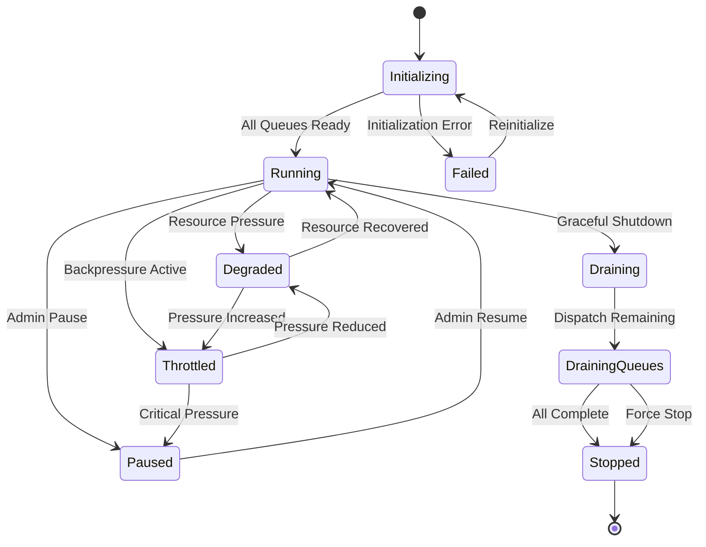

### 10.2 ماشین حالت Task

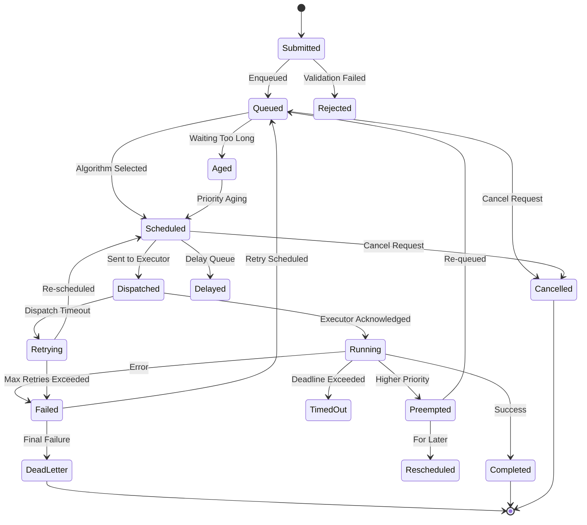

---

## 11. Scheduler Workflow

### 11.1 جریان کامل زمان‌بندی (Full Scheduling Flow)

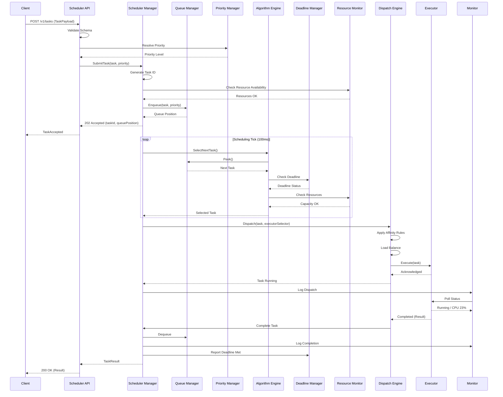

### 11.2 جریان Preemption

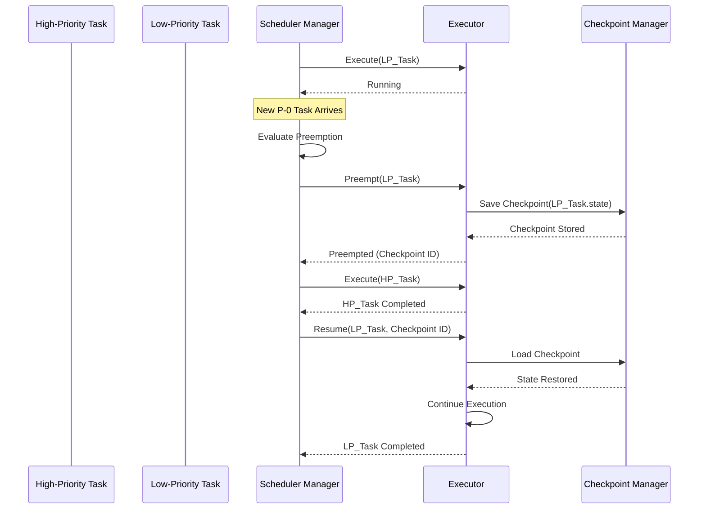

---

## 12. Concurrency Control

### 12.1 مدل همروندی (Concurrency Model)

SMOS Scheduler از **مدل همروندی توزیع‌شده با قفل خوش‌بینانه** استفاده می‌کند.

| مکانیزم              | توضیح                            | کاربرد                         |
| -------------------- | -------------------------------- | ------------------------------ |
| **Mutex**            | قفل انحصاری برای منابع بحرانی    | تغییر اولویت, Drain Queue      |
| **Semaphore**        | شمارنده منابع محدود              | محدودیت Executor, Token Bucket |
| **ReadWrite Lock**   | قفل خواندن/نوشتن                 | وضعیت صف فقط خواندنی           |
| **Optimistic Lock**  | بدون قفل, بررسی version در انتها | Enqueue/Dequeue                |
| **Distributed Lock** | قفل توزیع‌شده (Redis/Etcd)       | Shard Coordination             |

### 12.2 محدودیت‌های همروندی

| محدودیت                | مقدار پیش‌فرض | توضیح                           |
| ---------------------- | ------------- | ------------------------------- |
| Max Concurrent Tasks   | ۱۰۰۰          | حداکثر Task همزمان در کل سیستم  |
| Max Tasks Per Executor | ۵۰            | حداکثر Task همزمان per Executor |
| Max Tasks Per Tenant   | ۲۰۰           | حداکثر Task همزمان per Tenant   |
| Max Enqueue Rate       | ۱۰,۰۰۰/sec    | حداکثر نرخ ورود Task            |
| Queue Depth Warning    | ۸۰٪           | آستانه هشدار عمق صف             |
| Queue Depth Critical   | ۹۵٪           | آستانه بحرانی عمق صف            |

### 12.3 الگوی قفل‌گذاری (Locking Pattern)

```json
{
  "lockingPatterns": [
    {
      "name": "optimistic-enqueue",
      "procedure": [
        "1. Read queue version number",
        "2. Enqueue task (local operation)",
        "3. CAS (Compare-And-Swap) version",
        "4. If conflict: retry from step 1",
        "5. Max retries: 3"
      ],
      "conflictProbability": "0.01% (low contention)"
    },
    {
      "name": "pessimistic-reorder",
      "procedure": [
        "1. Acquire distributed lock on queue ID",
        "2. Read queue state",
        "3. Dequeue task",
        "4. Update priority",
        "5. Enqueue task",
        "6. Release lock",
        "7. Timeout: 5s"
      ],
      "conflictProbability": "5% (high contention)"
    }
  ]
}
```

---

## 13. Resource-Aware Scheduling

### 13.1 منابع تحت نظارت

| منبع              | واحد        | منبع داده         | آستانه هشدار  | آستانه بحرانی |
| ----------------- | ----------- | ----------------- | ------------- | ------------- |
| CPU               | درصد        | OS / Container    | ۷۰٪           | ۹۰٪           |
| Memory            | درصد        | OS / Container    | ۷۵٪           | ۹۰٪           |
| Token Budget      | عدد         | Token Manager     | ۳۰٪ باقیمانده | ۱۰٪ باقیمانده |
| API Rate Limit    | Request/sec | API Gateway       | ۶۰٪           | ۸۵٪           |
| Queue Depth       | عدد         | Queue Manager     | ۸۰٪           | ۹۵٪           |
| Executor Capacity | عدد         | Executor Registry | ۸۰٪           | ۹۵٪           |
| Network I/O       | Mbps        | OS                | ۶۰٪           | ۸۰٪           |

### 13.2 Resource-Aware Decision Model

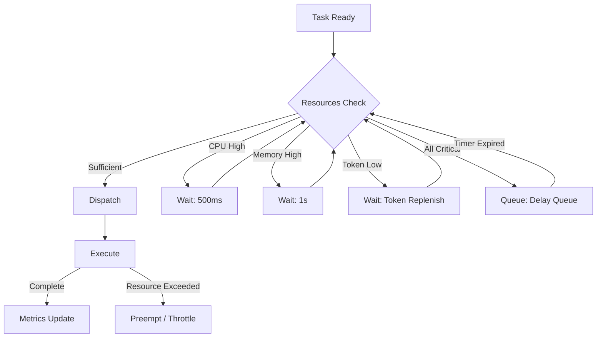

### 13.3 Token Bucket Algorithm برای Rate Limiting

```json
{
  "tokenBucket": {
    "algorithm": "TokenBucket",
    "defaultCapacity": 1000,
    "defaultRefillRate": 100,
    "refillIntervalMs": 1000,
    "perTenantBuckets": true,
    "perPriorityBuckets": [
      { "priority": "P-0", "capacity": 500, "refillRate": 200 },
      { "priority": "P-1", "capacity": 300, "refillRate": 100 },
      { "priority": "P-2", "capacity": 200, "refillRate": 80 },
      { "priority": "P-3", "capacity": 100, "refillRate": 50 },
      { "priority": "P-4", "capacity": 50, "refillRate": 30 },
      { "priority": "P-5", "capacity": 30, "refillRate": 20 },
      { "priority": "P-6", "capacity": 20, "refillRate": 10 },
      { "priority": "P-7", "capacity": 10, "refillRate": 5 }
    ]
  }
}
```

---

## 14. Preemption Model

### 14.1 انواع Preemption

| نوع             | توضیح                          | هزینه  | موارد استفاده         |
| --------------- | ------------------------------ | ------ | --------------------- |
| **Cooperative** | Task داوطلبانه کنار می‌رود     | کم     | Taskهای طولانی، Batch |
| **Forced**      | Scheduler Task را متوقف می‌کند | متوسط  | Taskهای حیاتی جدید    |
| **Checkpoint**  | ذخیره وضعیت و توقف             | زیاد   | Taskهای حالتمند       |
| **Kill**        | حذف کامل Task                  | حداکثر | Taskهای خارج از کنترل |

### 14.2 قواعد Preemption

| قانون  | توضیح                                                    |
| ------ | -------------------------------------------------------- |
| PRM-01 | فقط Taskهای P-5, P-6, P-7 قابل Preemption هستند          |
| PRM-02 | Taskهای P-0 تا P-4 هرگز Preempt نمی‌شوند                 |
| PRM-03 | هر Task حداکثر ۲ بار Preempt می‌شود                      |
| PRM-04 | Preemption فقط برای Task با ۳ سطح اولویت بالاتر مجاز است |
| PRM-05 | Preemption Cooperative優先 است                           |
| PRM-06 | Preemption Forced فقط با مجوز Administrator              |
| PRM-07 | Checkpoint اجباری برای Taskهای بیش از ۳۰ ثانیه           |
| PRM-08 | Kill فقط برای Taskهای بحرانی امنیتی                      |

### 14.3 Preemption Flow

```text
Preemption Procedure:
  1. Scheduler identifies preemption candidate
  2. Verify eligibility (PRM-01 to PRM-08)
  3. Send preemption notice to Executor
  4. If Cooperative: wait up to 5s for graceful yield
  5. If no response: escalate to Forced
  6. Save checkpoint (if applicable)
  7. Move task to Queued state with Preempted flag
  8. Dispatch higher-priority task
  9. When higher-priority completes: reschedule preempted task
```

---

## 15. Deadline Management

### 15.1 مدل Deadline

هر Task می‌تواند دارای **Deadline سخت (Hard)** یا **Deadline نرم (Soft)** باشد:

| نوع               | توضیح                       | پیامد Miss                   |
| ----------------- | --------------------------- | ---------------------------- |
| **Hard Deadline** | حداکثر زمان مطلق برای تکمیل | Task باطل می‌شود, Escalation |
| **Soft Deadline** | زمان ترجیحی برای تکمیل      | First-Level Alert            |
| **Firm Deadline** | بین Hard و Soft             | Grace Period ۱۰٪             |
| **SLA Deadline**  | برگرفته از SLA سازمانی      | Penalty, Credit              |

### 15.2 Deadline Management Algorithm

```text
Deadline Management:
  1. On Task submission:
     - Parse deadline from task metadata or SLA
     - Calculate absolute deadline time
     - Register with Deadline Manager
  2. On each scheduling tick:
     - For each queued task with deadline:
       remaining = deadline - now
       execution_time = estimated_duration
       laxity = remaining - execution_time
       urgency = 1 - (laxity / remaining)
     - If laxity < SLACK (10% of deadline):
       Mark as URGENT
     - If remaining < execution_time:
       Mark as CRITICAL
     - If remaining <= 0:
       Mark as MISSED
  3. Urgent tasks get priority boost (+2 levels)
  4. Critical tasks get maximum priority (P-0 temporary)
  5. Missed tasks trigger DeadlineMissed event
```

### 15.3 Deadline Configuration

```json
{
  "deadlineManagement": {
    "enabled": true,
    "slackPercentage": 10,
    "urgencyBoostLevels": 2,
    "maxUrgentTasks": 50,
    "hardDeadlineAction": "abort-and-escalate",
    "softDeadlineAction": "notify-only",
    "missedTaskRetention": "7-days",
    "deadlineMetricsIntervalMs": 5000
  }
}
```

---

## 16. Scheduler Failure Scenarios

| #    | سناریو                  | علت                                   | اثر                         | Severity |
| ---- | ----------------------- | ------------------------------------- | --------------------------- | -------- |
| F-01 | **Queue Corruption**    | خطای داده در Heap                     | ازدست‌رفتن ترتیب صف         | بحرانی   |
| F-02 | **Executor Crash**      | Executor از کار می‌افتد               | Taskهای معلق                | بالا     |
| F-03 | **Deadlock**            | قفل‌های تودرتو                        | توقف کامل Scheduler         | بحرانی   |
| F-04 | **Resource Exhaustion** | تمام منابع مصرف شد                    | رد Taskهای جدید             | متوسط    |
| F-05 | **Scheduler Crash**     | Scheduler از کار می‌افتد              | ازدست‌رفتن وضعیت درون‌حافظه | بحرانی   |
| F-06 | **Network Partition**   | قطع ارتباط بین Shardها                | عدم هماهنگی                 | بالا     |
| F-07 | **Priority Inversion**  | Task کم‌اولویت منبع را در اختیار دارد | تأخیر Task پراولویت         | متوسط    |
| F-08 | **Runaway Task**        | Task بیش از حد مجاز اجرا می‌شود       | مصرف بی‌رویه منابع          | بالا     |

### 16.1 استراتژی‌های مقابله

| سناریو | تشخیص                          | اقدام                                     | زمان بازیابی |
| ------ | ------------------------------ | ----------------------------------------- | ------------ |
| F-01   | Checksum mismatch              | Rebuild from Replica Queue                | ۵s           |
| F-02   | Missing heartbeat > 10s        | Redistribute tasks, mark Executor offline | ۱۵s          |
| F-03   | Lock timeout > 5s              | Break lock, rollback transaction          | ۱۰s          |
| F-04   | All resources > 95%            | Backpressure, pause P-7/P-6               | ۳۰s          |
| F-05   | Process exit                   | Restart from last checkpoint (WAL)        | ۶۰s          |
| F-06   | Shard heartbeat lost           | Consensus protocol, auto-rebalance        | ۳۰s          |
| F-07   | Wait time anomaly              | Priority Inheritance Protocol             | ۵s           |
| F-08   | Execution time > 10x estimated | Kill task, alert admin                    | ۵s           |

---

## 17. Retry Strategies

### 17.1 Retry Policy

```json
{
  "retryPolicy": {
    "maxRetries": 3,
    "initialDelayMs": 5000,
    "backoffMultiplier": 2.0,
    "maxDelayMs": 60000,
    "jitterMs": 1000,
    "retryableErrors": [
      "executor_unavailable",
      "dispatch_timeout",
      "resource_temporary",
      "rate_limited",
      "network_timeout"
    ],
    "nonRetryableErrors": [
      "validation_failed",
      "authentication_failed",
      "authorization_failed",
      "invalid_payload",
      "task_not_found"
    ],
    "exhaustedAction": "move_to_dead_letter"
  }
}
```

### 17.2 Backoff Strategies

| Strategy                 | توضیح          | رابطه Delay                                         |
| ------------------------ | -------------- | --------------------------------------------------- |
| **Fixed**                | تأخیر ثابت     | delay = base                                        |
| **Linear**               | افزایش خطی     | delay = base \* retry_count                         |
| **Exponential**          | افزایش نمایی   | delay = base \* 2^retry_count                       |
| **Exponential + Jitter** | نمایی + تصادفی | delay = (base \* 2^retry_count) + random(0, jitter) |

### 17.3 Retry Flow

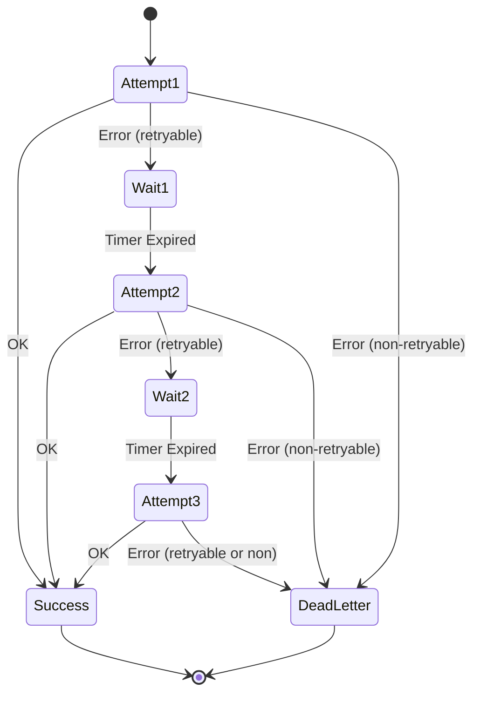

---

## 18. Rollback Strategies

### 18.1 Rollback Levels

| سطح | توضیح                         | دامنه                      | هزینه  |
| --- | ----------------------------- | -------------------------- | ------ |
| L0  | No Rollback (Idempotent Task) | Taskهای بدون اثر جانبی     | ۰      |
| L1  | Task-level Rollback           | بازگردانی یک Task منفرد    | کم     |
| L2  | Workflow-level Rollback       | بازگردانی یک Workflow کامل | متوسط  |
| L3  | Saga Rollback                 | جبران زنجیره‌ای            | زیاد   |
| L4  | Global Rollback               | بازگردانی کل Session       | حداکثر |

### 18.2 Compensation Strategies

| استراتژی       | توضیح                        | مثال                  |
| -------------- | ---------------------------- | --------------------- |
| **Undo**       | معکوس کردن اثر Task          | حذف محتوای منتشرشده   |
| **Skip**       | نادیده گرفتن Task شکست‌خورده | Task غیربحرانی        |
| **Compensate** | اجرای عملیات جبرانی          | بازگردانی Token مصرفی |
| **Notify**     | اطلاع‌رسانی و اقدام دستی     | خطای بحرانی           |

### 18.3 Rollback Configuration

```json
{
  "rollbackStrategy": {
    "defaultLevel": "L1",
    "compensationTimeoutMs": 30000,
    "maxCompensationAttempts": 3,
    "autoRollbackOnFailure": true,
    "rollbackOnCancel": true,
    "compensationRegistry": {
      "publish_content": "delete_published_content",
      "send_notification": "void_notification",
      "update_database": "restore_database_snapshot",
      "consume_token": "refund_token"
    }
  }
}
```

---

## 19. Scheduler Monitoring & Metrics

### 19.1 Core Metrics

| متریک                           | نوع       | واحد    | توضیح                     | Source            |
| ------------------------------- | --------- | ------- | ------------------------- | ----------------- |
| `scheduler.tasks.submitted`     | Counter   | count   | تعداد کل Taskهای ارسالی   | Scheduler Manager |
| `scheduler.tasks.completed`     | Counter   | count   | تعداد Taskهای تکمیل‌شده   | Dispatch Engine   |
| `scheduler.tasks.failed`        | Counter   | count   | تعداد Taskهای شکست‌خورده  | Dispatch Engine   |
| `scheduler.tasks.queued`        | Gauge     | count   | تعداد Taskهای در صف       | Queue Manager     |
| `scheduler.tasks.running`       | Gauge     | count   | تعداد Taskهای در حال اجرا | Dispatch Engine   |
| `scheduler.queue.depth`         | Gauge     | count   | عمق هر صف                 | Queue Manager     |
| `scheduler.queue.latency`       | Histogram | ms      | تأخیر صف per priority     | Queue Manager     |
| `scheduler.dispatch.latency`    | Histogram | ms      | زمان توزیع Task           | Dispatch Engine   |
| `scheduler.execution.time`      | Histogram | ms      | زمان اجرای Task           | Executor          |
| `scheduler.preemption.count`    | Counter   | count   | تعداد Preemption          | Scheduler Manager |
| `scheduler.deadline.missed`     | Counter   | count   | تعداد Deadline Miss       | Deadline Manager  |
| `scheduler.resource.cpu`        | Gauge     | %       | مصرف CPU                  | Resource Monitor  |
| `scheduler.resource.memory`     | Gauge     | %       | مصرف Memory               | Resource Monitor  |
| `scheduler.retry.count`         | Counter   | count   | تعداد Retry               | Retry Handler     |
| `scheduler.backpressure.active` | Gauge     | boolean | وضعیت Backpressure        | Scheduler Manager |

### 19.2 SLA Metrics

| متریک               | هدف SLA         | پنجره اندازه‌گیری |
| ------------------- | --------------- | ----------------- |
| P-0 Latency (p99)   | < 50ms          | ۵ دقیقه           |
| P-1 Latency (p99)   | < 100ms         | ۵ دقیقه           |
| P-2 Latency (p99)   | < 250ms         | ۵ دقیقه           |
| P-3 Latency (p99)   | < 1s            | ۱۵ دقیقه          |
| Deadline Miss Ratio | < 0.1%          | ۱ ساعت            |
| Throughput          | > ۱۰۰۰ Task/sec | ۱ دقیقه           |
| Scheduler Uptime    | ۹۹٫۹۹٪          | ۳۰ روز            |

### 19.3 Dashboards

| داشبورد                | متریک‌ها                                      | مخاطب           |
| ---------------------- | --------------------------------------------- | --------------- |
| **Scheduler Overview** | Submitted, Completed, Failed, Queued, Running | همه             |
| **Queue Deep Dive**    | Queue Depth, Latency per Priority, Starvation | Scheduler Admin |
| **SLA Compliance**     | P-0..P-3 Latency, Deadline Miss, Trending     | مدیریت          |
| **Resource Health**    | CPU, Memory, Token, Rate Limit                | DevOps          |
| **Tenant View**        | Metrics per Tenant                            | Tenant Admin    |

### 19.4 Alert Rules

| هشدار                | شرط                          | Severity | کانال           |
| -------------------- | ---------------------------- | -------- | --------------- |
| QueueDepthWarning    | depth > 80% for 1min         | Warning  | Slack           |
| QueueDepthCritical   | depth > 95% for 30s          | Critical | PagerDuty       |
| HighFailureRate      | failure_rate > 5% for 5min   | Warning  | Slack           |
| SLABreach            | P-0 latency > 100ms for 1min | Critical | PagerDuty       |
| DeadlineMissWarning  | miss_ratio > 1% for 15min    | Warning  | Slack           |
| DeadlineMissCritical | miss_ratio > 5% for 5min     | Critical | PagerDuty       |
| SchedulerDown        | heartbeat missing for 30s    | Critical | PagerDuty + SMS |
| ResourceCritical     | CPU > 90% or Memory > 90%    | Critical | PagerDuty       |

---

## 20. Scheduler Security

### 20.1 اصول امنیتی

| اصل    | توضیح                                               |
| ------ | --------------------------------------------------- |
| SEC-01 | همه APIهای Scheduler نیاز به احراز هویت (JWT) دارند |
| SEC-02 | هر Task با هویت (Identity) مشخص ارسال می‌شود        |
| SEC-03 | هر Task با Least Privilege اجرا می‌شود              |
| SEC-04 | داده‌های حساس Task رمزنگاری می‌شوند                 |
| SEC-05 | همه عملیات Scheduler در Audit Log ثبت می‌شوند       |
| SEC-06 | Tenantها کاملاً از یکدیگر ایزوله هستند              |
| SEC-07 | Rate Limiting در سطح API الزامی است                 |
| SEC-08 | Scheduler Admin نیاز به MFA دارد                    |

### 20.2 Authentication & Authorization

```json
{
  "securityModel": {
    "authentication": {
      "type": "JWT",
      "tokenTtlMs": 3600000,
      "refreshEnabled": true,
      "allowedIssuers": ["smos-identity", "xennic-iam"]
    },
    "authorization": {
      "type": "RBAC",
      "roles": [
        {
          "name": "scheduler.admin",
          "permissions": ["submit:any", "cancel:any", "pause", "drain", "config:write"]
        },
        {
          "name": "scheduler.operator",
          "permissions": ["submit:any", "cancel:any", "view:metrics"]
        },
        {
          "name": "scheduler.developer",
          "permissions": ["submit:own", "view:own", "view:metrics"]
        },
        {
          "name": "scheduler.tenant-admin",
          "permissions": ["submit:tenant", "cancel:tenant", "view:tenant"]
        }
      ]
    },
    "audit": {
      "enabled": true,
      "events": ["submit", "cancel", "dispatch", "complete", "fail", "preempt", "config-change"],
      "retentionDays": 90,
      "storage": "append-only-log"
    }
  }
}
```

### 20.3 Task Isolation

| ایزولاسیون   | مکانیزم                    | Enforcement Point |
| ------------ | -------------------------- | ----------------- |
| **Tenant**   | Namespace per Tenant Queue | Queue Manager     |
| **Priority** | Separate Queue per Level   | Queue Manager     |
| **Network**  | Network Policy per Tenant  | Executor          |
| **Data**     | Data Access Token          | Executor          |
| **Resource** | Resource Quota per Tenant  | Resource Monitor  |

---

## 21. Scheduler Scaling

### 21.1 Vertical Scaling

| منبع           | حداقل  | حداکثر    | استراتژی افزایش                   |
| -------------- | ------ | --------- | --------------------------------- |
| CPU            | ۴ Core | ۶۴ Core   | Auto-scaling based on queue depth |
| Memory         | ۸ GB   | ۱۲۸ GB    | Heap + Off-heap cache             |
| Queue Capacity | ۱۰,۰۰۰ | ۱,۰۰۰,۰۰۰ | Configurable per deployment       |

### 21.2 Horizontal Scaling

SMOS Scheduler از **Sharding** برای مقیاس‌پذیری افقی استفاده می‌کند:

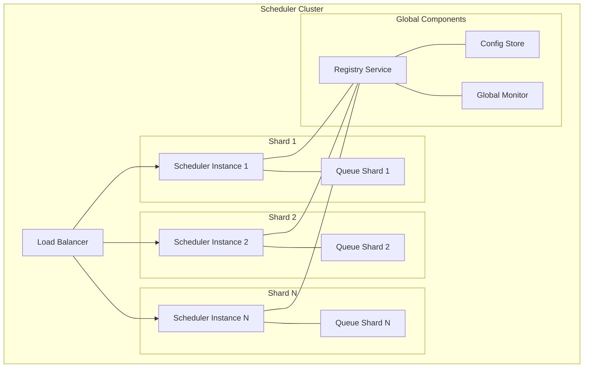

### 21.3 Sharding Strategy

| پارامتر          | مقدار                           |
| ---------------- | ------------------------------- |
| Shard Key        | Tenant ID (hash)                |
| Number of Shards | Configurable (default: 4)       |
| Rebalance        | Automatic on add/remove shard   |
| Consistency      | Eventual (with leader election) |
| Max Shards       | ۶۴                              |

### 21.4 Auto-Scaling Rules

```json
{
  "autoScaling": {
    "enabled": true,
    "metrics": [
      {
        "name": "queue_depth",
        "threshold": 50000,
        "scaleUpBy": 1,
        "cooldownMs": 300000
      },
      {
        "name": "dispatch_latency_p99",
        "threshold": 500,
        "unit": "ms",
        "scaleUpBy": 1,
        "cooldownMs": 300000
      }
    ],
    "minInstances": 2,
    "maxInstances": 16,
    "scaleDownDelayMs": 600000
  }
}
```

---

## 22. Multi-Tenancy Support

### 22.1 Tenant Isolation Model

Scheduler SMOS از **ایزولاسیون کامل** بین Tenantها پشتیبانی می‌کند:

| بعد ایزولاسیون | مکانیزم                          | سطح               |
| -------------- | -------------------------------- | ----------------- |
| **Queue**      | Priority Queue مجزا per Tenant   | سخت‌افزاری (Hard) |
| **Resource**   | Resource Quota per Tenant        | نرم‌افزاری (Soft) |
| **Priority**   | Priority Level مستقل per Tenant  | نرم‌افزاری (Soft) |
| **Metric**     | Metrics تگ‌گذاری‌شده per Tenant  | نرم‌افزاری (Soft) |
| **Audit**      | Audit Log فیلترشده per Tenant    | سخت‌افزاری (Hard) |
| **Config**     | Scheduler Config مجزا per Tenant | سخت‌افزاری (Hard) |

### 22.2 Tenant Configuration

```json
{
  "tenantConfig": {
    "tenantId": "xennic-corporate",
    "enabled": true,
    "quotas": {
      "maxConcurrentTasks": 200,
      "maxQueuedTasks": 10000,
      "maxRatePerSecond": 500,
      "cpuLimitPercent": 30,
      "memoryLimitMB": 4096,
      "tokenBudgetPerHour": 100000
    },
    "allowedPriorities": ["P-2", "P-3", "P-4", "P-5"],
    "defaultPriority": "P-3",
    "algorithms": ["priority", "fifo"],
    "retryPolicy": {
      "maxRetries": 3,
      "backoffStrategy": "exponential"
    },
    "monitoring": {
      "metricsEnabled": true,
      "alertsEnabled": true,
      "dashboardAccess": true
    }
  }
}
```

### 22.3 Cross-Tenant Policies

| خط‌مشی | توضیح                                                   |
| ------ | ------------------------------------------------------- |
| CT-01  | هیچ Taskی بین Tenantها به اشتراک گذاشته نمی‌شود         |
| CT-02  | یک Tenant نمی‌تواند Priority Queue Tenant دیگر را ببیند |
| CT-03  | Resource Quota Tenantها مستقل است                       |
| CT-04  | Tenantها می‌توانند Scheduler Config خود را تنظیم کنند   |
| CT-05  | Tenant Admin فقط Tenant خود را مدیریت می‌کند            |
| CT-06  | Global Admin همه Tenantها را می‌بیند                    |

---

## 23. API Contracts

### 23.1 API Overview

Scheduler API در `https://scheduler.smos.internal/v1` در دسترس است.

| Endpoint               | Method | توضیح                  |
| ---------------------- | ------ | ---------------------- |
| `/v1/tasks`            | POST   | ارسال Task جدید        |
| `/v1/tasks/{taskId}`   | GET    | دریافت وضعیت Task      |
| `/v1/tasks/{taskId}`   | DELETE | لغو Task               |
| `/v1/tasks/batch`      | POST   | ارسال دسته‌ای Task     |
| `/v1/queues`           | GET    | دریافت وضعیت صف‌ها     |
| `/v1/queues/{queueId}` | GET    | دریافت جزئیات صف       |
| `/v1/scheduler/status` | GET    | دریافت وضعیت Scheduler |
| `/v1/scheduler/pause`  | POST   | توقف Scheduler         |
| `/v1/scheduler/resume` | POST   | ازسرگیری Scheduler     |
| `/v1/metrics`          | GET    | دریافت متریک‌ها        |

### 23.2 Request/Response Schemas

#### POST /v1/tasks

**Request:**

```json
{
  "taskId": "uuid-or-null",
  "type": "agent_execution | workflow_step | knowledge_index | content_publish | report_generate | system_command",
  "priority": "P-3",
  "deadline": "2026-07-01T12:00:00Z",
  "payload": {
    "source": "ai-003",
    "action": "generate_content",
    "params": {
      "contentType": "blog_post",
      "campaignId": "camp-2026-q3"
    }
  },
  "metadata": {
    "tenantId": "xennic-corporate",
    "userId": "user-001",
    "correlationId": "corr-abc-123",
    "sourceWorkflow": "aut-042"
  },
  "executionSpec": {
    "timeoutMs": 30000,
    "maxRetries": 3,
    "retryDelayMs": 5000,
    "estimatedDurationMs": 10000,
    "resourceRequirements": {
      "cpu": "1-core",
      "memory": "512MB",
      "tokenBudget": 500
    }
  },
  "security": {
    "authToken": "jwt-token",
    "impersonate": null
  }
}
```

**Response (202 Accepted):**

```json
{
  "status": "accepted",
  "taskId": "uuid-1234-5678",
  "queuePosition": 42,
  "estimatedWaitMs": 2500,
  "priority": "P-3",
  "queue": "priority-p3",
  "timestamp": "2026-07-01T10:00:00Z",
  "selfUrl": "https://scheduler.smos.internal/v1/tasks/uuid-1234-5678"
}
```

**Response (200 OK — Synchronous):**

```json
{
  "status": "completed",
  "taskId": "uuid-1234-5678",
  "result": {
    "output": "content-generated",
    "contentId": "cnt-9876",
    "size": 45600
  },
  "executionTimeMs": 1234,
  "priority": "P-3",
  "queue": "priority-p3",
  "timestamp": "2026-07-01T10:00:00Z"
}
```

#### GET /v1/tasks/{taskId}

**Response:**

```json
{
  "taskId": "uuid-1234-5678",
  "status": "running | queued | completed | failed | cancelled | preempted",
  "priority": "P-3",
  "queue": "priority-p3",
  "createdAt": "2026-07-01T10:00:00Z",
  "startedAt": "2026-07-01T10:00:02Z",
  "completedAt": null,
  "executorId": "executor-05",
  "retryCount": 0,
  "deadline": "2026-07-01T12:00:00Z",
  "deadlineStatus": "met | approaching | missed",
  "estimatedRemainingMs": 5000,
  "events": [
    {
      "type": "task_submitted",
      "timestamp": "2026-07-01T10:00:00Z"
    },
    {
      "type": "task_dispatched",
      "timestamp": "2026-07-01T10:00:02Z"
    }
  ]
}
```

#### GET /v1/queues

**Response:**

```json
{
  "queues": [
    {
      "queueId": "priority-p0",
      "type": "priority",
      "priorityLevel": "P-0",
      "depth": 0,
      "oldestTaskAgeMs": 0,
      "throughputPerSec": 5.2,
      "avgLatencyMs": 12,
      "p99LatencyMs": 45,
      "status": "active"
    },
    {
      "queueId": "priority-p3",
      "type": "priority",
      "priorityLevel": "P-3",
      "depth": 42,
      "oldestTaskAgeMs": 3200,
      "throughputPerSec": 23.1,
      "avgLatencyMs": 850,
      "p99LatencyMs": 2100,
      "status": "active"
    },
    {
      "queueId": "dead-letter",
      "type": "dead-letter",
      "depth": 5,
      "oldestTaskAgeMs": 86400000,
      "status": "active"
    }
  ],
  "totalQueued": 127,
  "totalRunning": 45,
  "totalDeadLetter": 5,
  "timestamp": "2026-07-01T10:05:00Z"
}
```

---

## 24. JSON Schema Definitions

### Schema 1: TaskSubmission (Draft-07)

```json
{
  "$schema": "http://json-schema.org/draft-07/schema#",
  "$id": "https://schemas.smos.internal/scheduler/task-submission-v1.json",
  "title": "TaskSubmission",
  "description": "Schema for submitting a task to the SMOS Runtime Scheduler",
  "type": "object",
  "required": ["type", "priority", "payload"],
  "properties": {
    "taskId": {
      "type": "string",
      "format": "uuid",
      "description": "Client-generated task ID (optional; server generates if null)"
    },
    "type": {
      "type": "string",
      "enum": [
        "agent_execution",
        "workflow_step",
        "knowledge_index",
        "content_publish",
        "report_generate",
        "system_command"
      ],
      "description": "Task type classification"
    },
    "priority": {
      "type": "string",
      "enum": ["P-0", "P-1", "P-2", "P-3", "P-4", "P-5", "P-6", "P-7"],
      "description": "Priority level (P-0 = highest)"
    },
    "deadline": {
      "type": "string",
      "format": "date-time",
      "description": "Task deadline (ISO 8601)"
    },
    "payload": {
      "type": "object",
      "required": ["source", "action"],
      "properties": {
        "source": { "type": "string", "description": "Source agent or workflow ID" },
        "action": { "type": "string", "description": "Action to perform" },
        "params": { "type": "object", "description": "Action parameters" }
      },
      "additionalProperties": false
    },
    "metadata": {
      "type": "object",
      "properties": {
        "tenantId": { "type": "string" },
        "userId": { "type": "string" },
        "correlationId": { "type": "string" },
        "sourceWorkflow": { "type": "string" }
      },
      "required": ["tenantId"]
    },
    "executionSpec": {
      "type": "object",
      "properties": {
        "timeoutMs": { "type": "integer", "minimum": 100, "maximum": 3600000 },
        "maxRetries": { "type": "integer", "minimum": 0, "maximum": 10 },
        "retryDelayMs": { "type": "integer", "minimum": 100, "maximum": 300000 },
        "estimatedDurationMs": { "type": "integer", "minimum": 1 },
        "resourceRequirements": {
          "type": "object",
          "properties": {
            "cpu": {
              "type": "string",
              "enum": ["0.5-core", "1-core", "2-core", "4-core", "8-core"]
            },
            "memory": { "type": "string", "pattern": "^[0-9]+(MB|GB)$" },
            "tokenBudget": { "type": "integer", "minimum": 0 }
          }
        }
      }
    },
    "security": {
      "type": "object",
      "properties": {
        "authToken": { "type": "string" },
        "impersonate": { "type": ["string", "null"] }
      },
      "required": ["authToken"]
    }
  },
  "additionalProperties": false
}
```

### Schema 2: TaskStatus (Draft-07)

```json
{
  "$schema": "http://json-schema.org/draft-07/schema#",
  "$id": "https://schemas.smos.internal/scheduler/task-status-v1.json",
  "title": "TaskStatus",
  "description": "Schema for task status response from the SMOS Runtime Scheduler",
  "type": "object",
  "required": ["taskId", "status", "priority"],
  "properties": {
    "taskId": { "type": "string", "format": "uuid" },
    "status": {
      "type": "string",
      "enum": [
        "submitted",
        "queued",
        "scheduled",
        "dispatched",
        "running",
        "completed",
        "failed",
        "cancelled",
        "preempted",
        "timed_out",
        "dead_letter"
      ]
    },
    "priority": {
      "type": "string",
      "enum": ["P-0", "P-1", "P-2", "P-3", "P-4", "P-5", "P-6", "P-7"]
    },
    "queue": { "type": "string" },
    "createdAt": { "type": "string", "format": "date-time" },
    "startedAt": { "type": ["string", "null"], "format": "date-time" },
    "completedAt": { "type": ["string", "null"], "format": "date-time" },
    "executorId": { "type": ["string", "null"] },
    "retryCount": { "type": "integer", "minimum": 0 },
    "deadline": { "type": ["string", "null"], "format": "date-time" },
    "deadlineStatus": { "type": "string", "enum": ["met", "approaching", "missed", "none"] },
    "estimatedRemainingMs": { "type": "integer", "minimum": 0 },
    "result": { "type": ["object", "null"] },
    "error": { "type": ["object", "null"] },
    "events": {
      "type": "array",
      "items": {
        "type": "object",
        "properties": {
          "type": { "type": "string" },
          "timestamp": { "type": "string", "format": "date-time" }
        },
        "required": ["type", "timestamp"]
      }
    }
  }
}
```

### Schema 3: QueueStatus (Draft-07)

```json
{
  "$schema": "http://json-schema.org/draft-07/schema#",
  "$id": "https://schemas.smos.internal/scheduler/queue-status-v1.json",
  "title": "QueueStatus",
  "description": "Schema for queue status information",
  "type": "object",
  "required": ["queueId", "type", "depth", "status"],
  "properties": {
    "queueId": { "type": "string" },
    "type": {
      "type": "string",
      "enum": ["priority", "delay", "scheduled", "dead-letter"]
    },
    "priorityLevel": { "type": "string" },
    "depth": { "type": "integer", "minimum": 0 },
    "capacity": { "type": "integer", "minimum": 0 },
    "usagePercent": { "type": "number", "minimum": 0, "maximum": 100 },
    "oldestTaskAgeMs": { "type": "integer", "minimum": 0 },
    "throughputPerSec": { "type": "number", "minimum": 0 },
    "avgLatencyMs": { "type": "number", "minimum": 0 },
    "p99LatencyMs": { "type": "number", "minimum": 0 },
    "status": {
      "type": "string",
      "enum": ["active", "paused", "draining", "overflow", "dead"]
    },
    "tenantId": { "type": "string" }
  }
}
```

### Schema 4: SchedulerConfig (Draft-07)

```json
{
  "$schema": "http://json-schema.org/draft-07/schema#",
  "$id": "https://schemas.smos.internal/scheduler/scheduler-config-v1.json",
  "title": "SchedulerConfig",
  "description": "Configuration schema for the SMOS Runtime Scheduler",
  "type": "object",
  "required": ["version", "general", "queues", "algorithms", "security"],
  "properties": {
    "version": { "type": "string", "pattern": "^\\d+\\.\\d+\\.\\d+$" },
    "general": {
      "type": "object",
      "properties": {
        "schedulerTickMs": { "type": "integer", "default": 100, "minimum": 10, "maximum": 5000 },
        "maxConcurrentTasks": { "type": "integer", "default": 1000 },
        "defaultTimeoutMs": { "type": "integer", "default": 30000 },
        "defaultMaxRetries": { "type": "integer", "default": 3 },
        "enablePreemption": { "type": "boolean", "default": true },
        "enableDeadlineManagement": { "type": "boolean", "default": true },
        "enablePriorityAging": { "type": "boolean", "default": true }
      }
    },
    "queues": {
      "type": "object",
      "properties": {
        "priorityCount": { "type": "integer", "enum": [8] },
        "maxQueueDepth": { "type": "integer", "default": 100000 },
        "backpressureThresholdPercent": {
          "type": "integer",
          "default": 90,
          "minimum": 50,
          "maximum": 100
        },
        "delayQueueEnabled": { "type": "boolean", "default": true },
        "deadLetterRetentionDays": { "type": "integer", "default": 30 }
      }
    },
    "algorithms": {
      "type": "object",
      "properties": {
        "defaultAlgorithm": {
          "type": "string",
          "enum": ["fifo", "priority", "weighted-fair", "edf"]
        },
        "weightedFairConfig": {
          "type": "object",
          "properties": {
            "defaultQuantumMs": { "type": "integer", "default": 100 },
            "enableWeightAging": { "type": "boolean", "default": true }
          }
        },
        "edfConfig": {
          "type": "object",
          "properties": {
            "slackPercent": { "type": "integer", "default": 10 },
            "urgencyBoostLevels": { "type": "integer", "default": 2 }
          }
        }
      }
    },
    "resources": {
      "type": "object",
      "properties": {
        "monitoringIntervalMs": { "type": "integer", "default": 1000 },
        "cpuHighThreshold": { "type": "integer", "default": 80 },
        "memoryHighThreshold": { "type": "integer", "default": 85 }
      }
    },
    "security": {
      "type": "object",
      "properties": {
        "authenticationEnabled": { "type": "boolean", "default": true },
        "authorizationEnabled": { "type": "boolean", "default": true },
        "auditEnabled": { "type": "boolean", "default": true },
        "auditRetentionDays": { "type": "integer", "default": 90 }
      },
      "required": ["authenticationEnabled"]
    },
    "scaling": {
      "type": "object",
      "properties": {
        "autoScalingEnabled": { "type": "boolean", "default": false },
        "minInstances": { "type": "integer", "default": 2 },
        "maxInstances": { "type": "integer", "default": 16 },
        "shardCount": { "type": "integer", "default": 4, "minimum": 1, "maximum": 64 }
      }
    },
    "tenants": {
      "type": "object",
      "patternProperties": {
        "^[a-zA-Z0-9_-]+$": {
          "type": "object",
          "$ref": "#/definitions/TenantConfig"
        }
      }
    }
  },
  "definitions": {
    "TenantConfig": {
      "type": "object",
      "properties": {
        "enabled": { "type": "boolean" },
        "quotas": {
          "type": "object",
          "properties": {
            "maxConcurrentTasks": { "type": "integer" },
            "maxQueuedTasks": { "type": "integer" },
            "cpuLimitPercent": { "type": "integer" },
            "memoryLimitMB": { "type": "integer" }
          }
        },
        "allowedPriorities": {
          "type": "array",
          "items": {
            "type": "string",
            "enum": ["P-0", "P-1", "P-2", "P-3", "P-4", "P-5", "P-6", "P-7"]
          }
        },
        "defaultPriority": { "type": "string" }
      }
    }
  }
}
```

### Schema 5: SchedulerEvent (Draft-07)

```json
{
  "$schema": "http://json-schema.org/draft-07/schema#",
  "$id": "https://schemas.smos.internal/scheduler/scheduler-event-v1.json",
  "title": "SchedulerEvent",
  "description": "Schema for events emitted by the SMOS Runtime Scheduler",
  "type": "object",
  "required": ["eventId", "eventType", "source", "timestamp", "data"],
  "properties": {
    "eventId": { "type": "string", "format": "uuid" },
    "eventType": {
      "type": "string",
      "enum": [
        "task_submitted",
        "task_queued",
        "task_scheduled",
        "task_dispatched",
        "task_completed",
        "task_failed",
        "task_cancelled",
        "task_preempted",
        "task_timed_out",
        "task_retried",
        "task_dead_letter",
        "deadline_approaching",
        "deadline_missed",
        "queue_overflow",
        "queue_drained",
        "scheduler_paused",
        "scheduler_resumed",
        "scheduler_degraded",
        "scheduler_throttled",
        "backpressure_started",
        "backpressure_ended"
      ]
    },
    "source": {
      "type": "string",
      "description": "Source component (e.g., queue-manager, dispatch-engine)"
    },
    "timestamp": { "type": "string", "format": "date-time" },
    "data": {
      "type": "object",
      "properties": {
        "taskId": { "type": "string" },
        "queueId": { "type": "string" },
        "priority": { "type": "string" },
        "tenantId": { "type": "string" },
        "executorId": { "type": "string" },
        "retryCount": { "type": "integer" },
        "error": { "type": "object" },
        "latencyMs": { "type": "number" },
        "queueDepth": { "type": "integer" }
      }
    },
    "metadata": {
      "type": "object",
      "properties": {
        "correlationId": { "type": "string" },
        "traceId": { "type": "string" },
        "version": { "type": "string" }
      }
    }
  }
}
```

### Schema 6: SchedulerMetrics (Draft-07)

```json
{
  "$schema": "http://json-schema.org/draft-07/schema#",
  "$id": "https://schemas.smos.internal/scheduler/scheduler-metrics-v1.json",
  "title": "SchedulerMetrics",
  "description": "Snapshot of scheduler metrics for monitoring and alerting",
  "type": "object",
  "required": ["timestamp", "instance", "counters", "gauges"],
  "properties": {
    "timestamp": { "type": "string", "format": "date-time" },
    "instance": { "type": "string", "description": "Scheduler instance ID" },
    "periodMs": { "type": "integer", "description": "Metrics collection period in ms" },
    "counters": {
      "type": "object",
      "properties": {
        "tasksSubmitted": { "type": "integer" },
        "tasksCompleted": { "type": "integer" },
        "tasksFailed": { "type": "integer" },
        "tasksCancelled": { "type": "integer" },
        "tasksPreempted": { "type": "integer" },
        "tasksTimedOut": { "type": "integer" },
        "tasksRetried": { "type": "integer" },
        "deadlineMissed": { "type": "integer" },
        "deadlineMet": { "type": "integer" }
      }
    },
    "gauges": {
      "type": "object",
      "properties": {
        "tasksQueued": { "type": "integer" },
        "tasksRunning": { "type": "integer" },
        "queueDepth": { "type": "integer" },
        "oldestTaskAgeMs": { "type": "integer" },
        "cpuUsagePercent": { "type": "number" },
        "memoryUsagePercent": { "type": "number" },
        "activeExecutors": { "type": "integer" },
        "backpressureActive": { "type": "boolean" }
      }
    },
    "histograms": {
      "type": "object",
      "properties": {
        "queueLatencyMs": {
          "type": "object",
          "properties": {
            "p50": { "type": "number" },
            "p90": { "type": "number" },
            "p95": { "type": "number" },
            "p99": { "type": "number" },
            "avg": { "type": "number" },
            "max": { "type": "number" }
          }
        },
        "dispatchLatencyMs": {
          "$ref": "#/properties/histograms/properties/queueLatencyMs"
        },
        "executionTimeMs": {
          "$ref": "#/properties/histograms/properties/queueLatencyMs"
        }
      }
    }
  }
}
```

---

## 25. Event Schema Definitions

### 25.1 رویدادهای Scheduler

Scheduler رویدادهای زیر را منتشر می‌کند (consumed by SMOS-705 Event Architecture):

| رویداد                           | Trigger                   | Payload                                     | مصرف‌کنندگان                            |
| -------------------------------- | ------------------------- | ------------------------------------------- | --------------------------------------- |
| `scheduler.task.submitted`       | Task جدید ارسال شد        | taskId, type, priority, tenantId, timestamp | Monitoring, Audit, Orchestrator         |
| `scheduler.task.queued`          | Task در صف قرار گرفت      | taskId, queueId, position, priority         | Monitoring, Audit                       |
| `scheduler.task.scheduled`       | Task برای اجرا انتخاب شد  | taskId, algorithm, estimatedStart           | Orchestrator, Monitoring                |
| `scheduler.task.dispatched`      | Task به Executor ارسال شد | taskId, executorId, dispatchTime            | Monitoring, Audit, Tenant               |
| `scheduler.task.completed`       | Task با موفقیت تکمیل شد   | taskId, result, executionTimeMs             | Orchestrator, Audit, Monitoring, Tenant |
| `scheduler.task.failed`          | Task شکست خورد            | taskId, error, retryCount                   | Orchestrator, Alert, Audit              |
| `scheduler.task.cancelled`       | Task لغو شد               | taskId, reason, userId                      | Orchestrator, Audit                     |
| `scheduler.task.preempted`       | Task متوقف شد             | taskId, preemptedBy, checkpointId           | Monitoring, Orchestrator                |
| `scheduler.task.retried`         | Task دوباره ارسال شد      | taskId, attempt, delayMs                    | Monitoring, Audit                       |
| `scheduler.task.dead_letter`     | Task به Dead-Letter رفت   | taskId, error, maxRetriesExceeded           | Alert, Admin                            |
| `scheduler.deadline.approaching` | مهلت نزدیک است            | taskId, deadline, remainingMs, urgency      | Orchestrator, Alert                     |
| `scheduler.deadline.missed`      | مهلت از دست رفت           | taskId, deadline, severity                  | Alert, Admin, Orchestrator              |
| `scheduler.queue.overflow`       | صف سرریز شد               | queueId, depth, threshold                   | Alert, AutoScaler                       |
| `scheduler.backpressure.started` | Backpressure فعال شد      | reason, affectedQueues, timestamp           | AutoScaler, Alert                       |
| `scheduler.backpressure.ended`   | Backpressure پایان یافت   | timestamp, recoveredQueues                  | AutoScaler                              |

### 25.2 Event Payload Example

```json
{
  "eventId": "evt-sch-001234",
  "eventType": "scheduler.task.failed",
  "source": "dispatch-engine-03",
  "timestamp": "2026-07-01T10:05:23.456Z",
  "data": {
    "taskId": "task-abc-456",
    "queueId": "priority-p3",
    "priority": "P-3",
    "tenantId": "xennic-corporate",
    "executorId": "executor-07",
    "retryCount": 2,
    "error": {
      "code": "EXECUTOR_TIMEOUT",
      "message": "Executor did not respond within 30000ms",
      "details": {
        "lastHeartbeat": "2026-07-01T10:04:50.000Z",
        "executorStatus": "running"
      }
    },
    "latencyMs": 30123
  },
  "metadata": {
    "correlationId": "corr-content-pub-042",
    "traceId": "trace-xyz-789",
    "version": "1.0"
  }
}
```

---

## 26. Configuration Examples

### 26.1 Scheduler Configuration (YAML)

```yaml
version: '1.0.0'

general:
  schedulerTickMs: 100
  maxConcurrentTasks: 1000
  defaultTimeoutMs: 30000
  defaultMaxRetries: 3
  enablePreemption: true
  enableDeadlineManagement: true
  enablePriorityAging: true

queues:
  priorityCount: 8
  maxQueueDepth: 100000
  backpressureThresholdPercent: 90
  delayQueueEnabled: true
  deadLetterRetentionDays: 30

algorithms:
  defaultAlgorithm: 'priority'
  weightedFairConfig:
    defaultQuantumMs: 100
    enableWeightAging: true
  edfConfig:
    slackPercent: 10
    urgencyBoostLevels: 2

resources:
  monitoringIntervalMs: 1000
  cpuHighThreshold: 80
  memoryHighThreshold: 85
  tokenBuckets:
    defaultCapacity: 1000
    defaultRefillRate: 100

security:
  authenticationEnabled: true
  authorizationEnabled: true
  auditEnabled: true
  auditRetentionDays: 90

scaling:
  autoScalingEnabled: true
  minInstances: 2
  maxInstances: 16
  shardCount: 4

tenants:
  xennic-corporate:
    enabled: true
    quotas:
      maxConcurrentTasks: 200
      maxQueuedTasks: 10000
      cpuLimitPercent: 30
      memoryLimitMB: 4096
    allowedPriorities:
      - P-2
      - P-3
      - P-4
      - P-5
    defaultPriority: P-3
  xennic-agency:
    enabled: true
    quotas:
      maxConcurrentTasks: 100
      maxQueuedTasks: 5000
      cpuLimitPercent: 15
      memoryLimitMB: 2048
    allowedPriorities:
      - P-3
      - P-4
      - P-5
      - P-6
    defaultPriority: P-4
```

### 26.2 Priority Queue Weights Configuration

```json
{
  "priorityWeights": {
    "P-0": { "weight": 100, "maxConcurrent": 50, "schedulingQuota": 0.4 },
    "P-1": { "weight": 50, "maxConcurrent": 100, "schedulingQuota": 0.2 },
    "P-2": { "weight": 25, "maxConcurrent": 150, "schedulingQuota": 0.1 },
    "P-3": { "weight": 15, "maxConcurrent": 200, "schedulingQuota": 0.08 },
    "P-4": { "weight": 10, "maxConcurrent": 200, "schedulingQuota": 0.06 },
    "P-5": { "weight": 8, "maxConcurrent": 150, "schedulingQuota": 0.05 },
    "P-6": { "weight": 5, "maxConcurrent": 100, "schedulingQuota": 0.03 },
    "P-7": { "weight": 2, "maxConcurrent": 50, "schedulingQuota": 0.01 }
  }
}
```

### 26.3 Multi-Tenant with Custom Algorithms

```yaml
version: '1.0.0'
general:
  schedulerTickMs: 100
  maxConcurrentTasks: 2000

tenants:
  xennic-corporate:
    algorithms:
      default: 'priority'
      allowed:
        - 'priority'
        - 'edf'
        - 'weighted-fair'
    deadlineManagement:
      enabled: true
      slackPercent: 15

  xennic-batch:
    algorithms:
      default: 'fifo'
      allowed:
        - 'fifo'
        - 'weighted-fair'
    deadlineManagement:
      enabled: false
```

---

## 27. Configuration Reference

| پارامتر                                          | نوع     | پیش‌فرض    | محدوده                             | توضیح                    |
| ------------------------------------------------ | ------- | ---------- | ---------------------------------- | ------------------------ |
| `general.schedulerTickMs`                        | integer | ۱۰۰        | ۱۰-۵۰۰۰                            | چرخه اصلی زمان‌بندی (ms) |
| `general.maxConcurrentTasks`                     | integer | ۱۰۰۰       | ۱-۱۰۰۰۰                            | حداکثر Task همزمان       |
| `general.defaultTimeoutMs`                       | integer | ۳۰۰۰۰      | ۱۰۰-۳۶۰۰۰۰۰                        | Timeout پیش‌فرض Task     |
| `general.defaultMaxRetries`                      | integer | ۳          | ۰-۱۰                               | Retry پیش‌فرض            |
| `general.enablePreemption`                       | boolean | true       | -                                  | فعال‌سازی Preemption     |
| `general.enableDeadlineManagement`               | boolean | true       | -                                  | فعال‌سازی Deadline       |
| `general.enablePriorityAging`                    | boolean | true       | -                                  | فعال‌سازی Priority Aging |
| `queues.maxQueueDepth`                           | integer | ۱۰۰۰۰۰     | ۱۰۰۰-۱۰۰۰۰۰۰                       | حداکثر عمق صف            |
| `queues.backpressureThresholdPercent`            | integer | ۹۰         | ۵۰-۱۰۰                             | آستانه Backpressure      |
| `queues.deadLetterRetentionDays`                 | integer | ۳۰         | ۱-۳۶۵                              | مدت نگهداری Dead-Letter  |
| `algorithms.defaultAlgorithm`                    | string  | "priority" | fifo, priority, weighted-fair, edf | الگوریتم پیش‌فرض         |
| `algorithms.weightedFairConfig.defaultQuantumMs` | integer | ۱۰۰        | ۱۰-۱۰۰۰                            | Quantum Weighted Fair    |
| `algorithms.edfConfig.slackPercent`              | integer | ۱۰         | ۱-۵۰                               | Slack درصد EDF           |
| `algorithms.edfConfig.urgencyBoostLevels`        | integer | ۲          | ۱-۵                                | افزایش سطح Urgency       |
| `resources.monitoringIntervalMs`                 | integer | ۱۰۰۰       | ۱۰۰-۶۰۰۰۰                          | فاصله نظارت منابع        |
| `resources.cpuHighThreshold`                     | integer | ۸۰         | ۵۰-۹۵                              | آستانه CPU بالا          |
| `resources.memoryHighThreshold`                  | integer | ۸۵         | ۵۰-۹۵                              | آستانه Memory بالا       |
| `security.auditRetentionDays`                    | integer | ۹۰         | ۱-۳۶۵                              | مدت نگهداری Audit Log    |
| `scaling.autoScalingEnabled`                     | boolean | false      | -                                  | فعال‌سازی Auto Scaling   |
| `scaling.minInstances`                           | integer | ۲          | ۱-۶۴                               | حداقل Instance           |
| `scaling.maxInstances`                           | integer | ۱۶         | ۱-۶۴                               | حداکثر Instance          |
| `scaling.shardCount`                             | integer | ۴          | ۱-۶۴                               | تعداد Shard              |

---

## 28. Cross-Reference Matrix

### 28.1 وابستگی به اسناد SMOS

| سند                                   | رابطه                                             | بخش‌های مرتبط                                       |
| ------------------------------------- | ------------------------------------------------- | --------------------------------------------------- |
| **SMOS-701** (Execution Architecture) | بنیادی — Scheduler بخشی از Execution Engine است   | §۳ (Runtime Architecture), §۸ (Scheduling Overview) |
| **SMOS-702** (State Machine)          | Task State Machine از SMOS-702 مشتق شده است       | §۵ (Execution States), §۷ (State Transitions)       |
| **SMOS-703** (Context Model)          | Context Task از SMOS-703 پیروی می‌کند             | §۴ (Context Types), §۶ (Context Propagation)        |
| **SMOS-704** (Workflow Orchestration) | Orchestrator Taskها را به Scheduler می‌سپارد      | §۷ (Orchestration Patterns), §۱۲ (Saga)             |
| **SMOS-705** (Event Architecture)     | Scheduler رویدادها را منتشر و مصرف می‌کند         | §۴ (Event Taxonomy), §۶ (Event Flow)                |
| **SMOS-706** (Monitoring)             | Metrics Scheduler در Monitoring استفاده می‌شود    | §۳ (Metrics Definition), §۵ (Dashboards)            |
| **SMOS-707** (Security)               | Security Model Scheduler از SMOS-707 تبعیت می‌کند | §۴ (AuthN/Z), §۶ (Audit)                            |
| **SMOS-708** (Master Blueprint)       | Scheduler بخشی از Master Blueprint است            | §۴ (Integrated Model), §۵ (Component Map)           |

### 28.2 وابستگی به Agentها

| Agent                           | رابطه                                            | بخش‌های مرتبط                        |
| ------------------------------- | ------------------------------------------------ | ------------------------------------ |
| **AI-001** (Content Strategy)   | Taskهای استراتژی محتوا → Priority P-3            | §۷ (Priority Model), §۸ (Algorithms) |
| **AI-002** (Content Planning)   | Taskهای برنامه‌ریزی → Priority P-3               | §۷ (Priority Model)                  |
| **AI-003** (Content Production) | Taskهای تولید → Priority P-4                     | §۷, §۸                               |
| **AI-004** (Review)             | Taskهای بازبینی → Priority P-3                   | §۷, §۸                               |
| **AI-005** (Discoverability)    | Taskهای SEO → Priority P-4                       | §۷                                   |
| **AI-006** (Media Asset)        | Taskهای رسانه → Priority P-4, Resource-Aware     | §۱۳ (Resource-Aware)                 |
| **AI-007** (Video Production)   | Taskهای ویدئو → Priority P-4, Resource-Intensive | §۱۳, §۱۴ (Preemption)                |
| **AI-008** (Publishing)         | Taskهای انتشار → Priority P-2, Deadline-Aware    | §۱۵ (Deadline)                       |
| **AI-009** (Community)          | Taskهای تعامل → Priority P-3 (Real-time)         | §۷, §۸                               |
| **AI-010** (Analytics)          | Taskهای تحلیل → Priority P-5                     | §۷                                   |
| **AI-011** (Knowledge)          | Taskهای دانش → Priority P-4                      | §۷, §۸                               |
| **AI-012** (Improvement)        | Taskهای بهبود → Priority P-5                     | §۷, §۸                               |
| **AI-013** (Research)           | Taskهای پژوهش → Priority P-5, Batch              | §۸ (FIFO)                            |
| **AI-014** (Orchestrator)       | Orchestrator از Scheduler API استفاده می‌کند     | §۲۳ (API Contracts)                  |

### 28.3 وابستگی به سایر اسناد

| سند                                   | رابطه                                                    |
| ------------------------------------- | -------------------------------------------------------- |
| **KNW-000** (Knowledge Architecture)  | Knowledge Tasks از مدل Scheduler استفاده می‌کنند         |
| **KNW-001** (Knowledge Index)         | Knowledge Indexing → FIFO Algorithm                      |
| **KNW-101** (Business Knowledge)      | Business Rules برای Priority Resolution                  |
| **KNW-102** (Business Rules)          | قواعد کسب‌وکار برای Deadline Management                  |
| **AUT-000** (Automation Architecture) | Automation Workflowها Taskهای Scheduler را تولید می‌کنند |
| **AUT-001** (Automation Index)        | نگاشت Workflowها به Priority Levels                      |
| **PRM-000** (Prompt Architecture)     | پرامپت‌های اجرایی با Priority مشخص ارسال می‌شوند         |
| **PRM-001** (Prompt Index)            | نگاشت پرامپت‌ها به Task Types                            |
| **DEPLOY-001** (Deployment Strategy)  | Scheduler Configuration در Deployment تعریف می‌شود       |

---

## 29. Version History

| Version     | Date       | Author                 | Changes                                                                                            |
| ----------- | ---------- | ---------------------- | -------------------------------------------------------------------------------------------------- |
| 1.0.0-draft | 2026-07-01 | SMOS Architecture Team | Initial draft — 30 sections, 6 JSON schemas, 10+ Mermaid diagrams, complete scheduler architecture |

---

## 30. Gaps & Future Work

### 30.1 Gaps شناسایی‌شده

| #    | Gap                                                 | اولویت | راهکار پیشنهادی                          | Sprint هدف |
| ---- | --------------------------------------------------- | ------ | ---------------------------------------- | ---------- |
| G-01 | پیاده‌سازی Distributed Lock برای Shard Coordination | بالا   | استفاده از Redis/Etcd Consensus          | P7.S03     |
| G-02 | مدل پیش‌بینی بار (Load Prediction)                  | متوسط  | ML-based prediction از Metrics تاریخی    | P7.S04     |
| G-03 | QoS تضمین‌شده per Tenant                            | بالا   | Resource Reservation + Admission Control | P7.S03     |
| G-04 | Dynamic Priority Adjustment بر اساس رفتار Task      | متوسط  | Feedback Loop با AI-010                  | P7.S04     |
| G-05 | Scheduler Federation بین Clusterها                  | پایین  | Global Scheduler + Regional Scheduler    | P7.S05     |
| G-06 | Testing Architecture برای Scheduler                 | بالا   | Unit, Integration, Chaos, Load Testing   | P7.S05     |
| G-07 | Recovery از Full Cluster Crash                      | بحرانی | WAL + State Reconstruction               | P7.S03     |
| G-08 | مدل Cost-Aware Scheduling                           | متوسط  | Cost Function بر اساس Cloud Pricing      | P7.S04     |

### 30.2 Future Work (P7.S03+)

| حوزه                       | توضیح                                                 | Sprint |
| -------------------------- | ----------------------------------------------------- | ------ |
| **Scheduler Resilience**   | بهبود Recovery, Circuit Breaker, Bulkhead             | P7.S03 |
| **Scheduler Lifecycle**    | چرخه حیات کامل Scheduler Instance                     | P7.S03 |
| **Scheduler Testing**      | Chaos Engineering, Latency Injection, Fault Tolerance | P7.S05 |
| **Scheduler Audit**        | Complete Audit Trail با Event Sourcing                | P7.S04 |
| **Scheduler Optimization** | Machine Learning برای بهینه‌سازی Algorithm Selection  | P7.S04 |
| **Scheduler Self-Healing** | تشخیص و بازیابی خودکار خرابی‌ها                       | P7.S03 |

### 30.3 Maturity Assessment

| بعد                 | سطح فعلی           | سطح هدف         | مسیر ارتقا                    |
| ------------------- | ------------------ | --------------- | ----------------------------- |
| Functional Coverage | ML-03 (Defined)    | ML-04 (Managed) | پیاده‌سازی G-01..G-08         |
| Resilience          | ML-02 (Repeatable) | ML-04 (Managed) | Chaos Testing, Self-Healing   |
| Scalability         | ML-03 (Defined)    | ML-04 (Managed) | Auto-Scaling, Federation      |
| Security            | ML-03 (Defined)    | ML-04 (Managed) | Pen Testing, Threat Modeling  |
| Monitoring          | ML-03 (Defined)    | ML-04 (Managed) | Predictive, Anomaly Detection |
| Multi-Tenancy       | ML-03 (Defined)    | ML-04 (Managed) | Dynamic Quota, QoS Guarantee  |

---

> **پایان سند SMOS-709 — Runtime Scheduler Architecture**
>
> این سند به عنوان **SSOT (Single Source of Truth)** برای معماری زمان‌بند اجرای SMOS عمل می‌کند. تمام پیاده‌سازی‌های Scheduler باید با این سند مطابقت داشته باشند. تغییرات معماری نیاز به ADR (Architecture Decision Record) و به‌روزرسانی این سند دارند.
