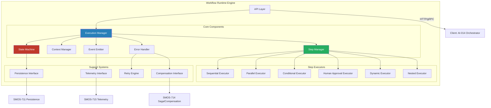
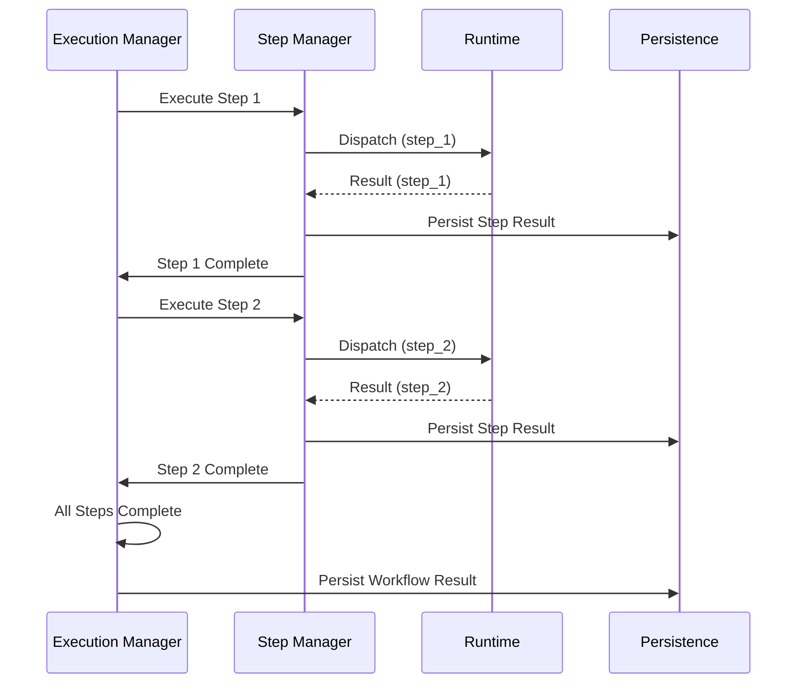
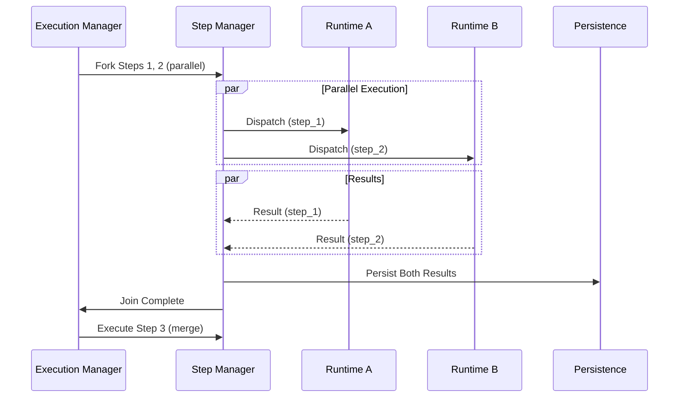
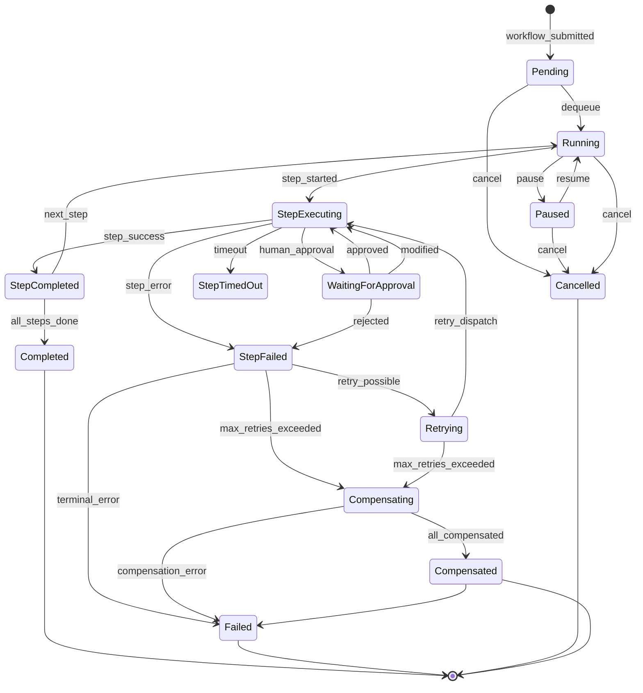
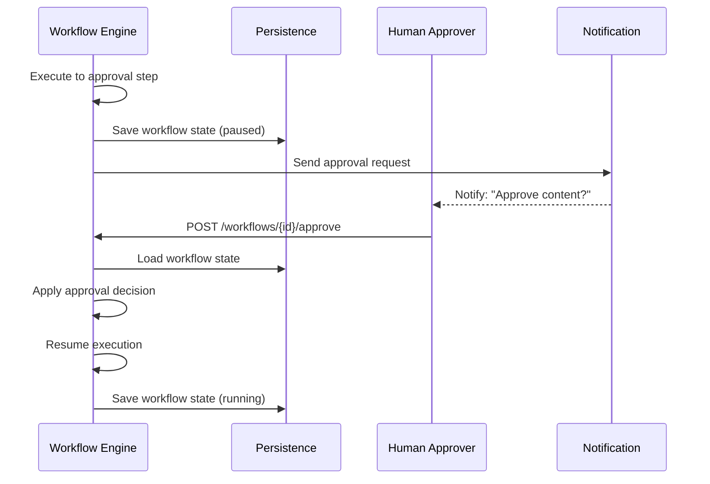

# SMOS-710 — Workflow Runtime Engine

## 1. Document Control

| Field          | Value                                                     |
| -------------- | --------------------------------------------------------- |
| Document ID    | SMOS-710                                                  |
| Document Name  | Workflow Runtime Engine Architecture                      |
| Phase          | P7.S02                                                    |
| Version        | 1.0.0-draft                                               |
| Status         | Draft                                                     |
| Classification | Enterprise Runtime Architecture                           |
| Owner          | Xennic (زر نور نیرو یکتا)                                 |
| Created        | 2026-07-01                                                |
| Supersedes     | SMOS-704 (orchestration patterns → engine implementation) |

## 2. Purpose & Scope

This document defines the **Workflow Runtime Engine** — the core component that executes SMOS workflows defined in SMOS-704. While SMOS-704 defined orchestration _patterns_, this document defines the _engine_ that implements them: step execution, state management, error handling, compensation, human approval, and engine lifecycle.

**Scope:**

- Engine architecture and core components
- Step execution model for all 12 orchestration patterns
- Workflow lifecycle management
- Engine state machine
- Error handling, retry, and rollback
- Human approval integration
- Monitoring, security, scaling, multi-tenancy
- API contracts for workflow operations

**Out of Scope:**

- Orchestration pattern definitions (SMOS-704)
- Runtime scheduler (SMOS-709)
- Persistence layer (SMOS-711)
- Distributed coordination (SMOS-712)
- Checkpoint/recovery (SMOS-713)
- Saga/compensation (SMOS-714)

## 3. Engine Architecture Overview



## 4. Engine Architecture Principles

| #      | Principle             | Description                                        |
| ------ | --------------------- | -------------------------------------------------- |
| WEP-01 | Step Isolation        | Every step executes in an isolated context         |
| WEP-02 | Deterministic Replay  | Same input always produces same step output        |
| WEP-03 | Graceful Degradation  | Engine continues operating during partial failures |
| WEP-04 | Compensatable Steps   | Every mutating step has a registered compensation  |
| WEP-05 | Observable Execution  | All step transitions emit telemetry                |
| WEP-06 | Timebound Execution   | Every step has a configurable timeout              |
| WEP-07 | Idempotent Steps      | Steps are safe to retry without side effects       |
| WEP-08 | Tenant Isolation      | Workflows from different tenants never interfere   |
| WEP-09 | Versioned Definitions | Workflow definitions are immutable once executed   |
| WEP-10 | Resource Bounded      | Engine enforces per-workflow resource limits       |

## 5. Engine Core Components

### 5.1 Execution Manager

Orchestrates the entire workflow lifecycle: start, pause, resume, cancel, complete.

| Operation          | Description                                                |
| ------------------ | ---------------------------------------------------------- |
| `StartWorkflow`    | Validates definition, creates context, enqueues first step |
| `PauseWorkflow`    | Suspends execution at next safe point                      |
| `ResumeWorkflow`   | Restarts execution from last checkpoint                    |
| `CancelWorkflow`   | Triggers compensation for all completed steps              |
| `CompleteWorkflow` | Finalizes execution, persists results                      |

### 5.2 Step Manager

Manages the lifecycle of individual workflow steps: dispatch, execute, complete, fail.

### 5.3 Context Manager

Maintains the execution context chain across steps (see SMOS-703).

### 5.4 State Machine

Tracks workflow state transitions (see §9).

### 5.5 Event Emitter

Emits events for every state transition, step completion, and error.

### 5.6 Error Handler

Routes errors to retry engine, compensation engine, or terminal failure.

## 6. Step Execution Model

```json
{
  "$schema": "http://json-schema.org/draft-07/schema#",
  "$id": "smos:workflow:step:definition",
  "title": "StepDefinition",
  "type": "object",
  "required": ["step_id", "type", "action"],
  "properties": {
    "step_id": { "type": "string", "pattern": "^ST-[A-Z0-9]{8}$" },
    "name": { "type": "string" },
    "type": {
      "type": "string",
      "enum": [
        "sequential",
        "parallel",
        "conditional",
        "dynamic",
        "human_approval",
        "nested",
        "saga"
      ]
    },
    "action": {
      "type": "object",
      "required": ["runtime", "operation"],
      "properties": {
        "runtime": { "type": "string" },
        "operation": { "type": "string" },
        "input_schema": { "type": "object" },
        "timeout_ms": { "type": "integer", "minimum": 1000 }
      }
    },
    "retry_policy": { "$ref": "#/$defs/RetryPolicy" },
    "compensation": { "type": "string" },
    "depends_on": { "type": "array", "items": { "type": "string" } },
    "condition": { "type": "string" },
    "on_complete": { "type": "array", "items": { "type": "string" } },
    "on_failure": { "type": "array", "items": { "type": "string" } }
  },
  "$defs": {
    "RetryPolicy": {
      "type": "object",
      "properties": {
        "max_retries": { "type": "integer", "default": 3 },
        "backoff_ms": { "type": "integer", "default": 1000 },
        "backoff_multiplier": { "type": "number", "default": 2.0 },
        "max_backoff_ms": { "type": "integer", "default": 60000 },
        "retryable_errors": { "type": "array", "items": { "type": "string" } }
      }
    }
  }
}
```

## 7. Sequential Execution



## 8. Parallel Execution



## 9. Engine State Machine



### State Transition Matrix

| From \ To | Pending | Running | StepExec | StepCmp | StepFail | Retry | Waiting | Paused | Cancel | Cmpens | Cmpensd | Cmpetd |
| --------- | ------- | ------- | -------- | ------- | -------- | ----- | ------- | ------ | ------ | ------ | ------- | ------ |
| Pending   | -       | ✅      | -        | -       | -        | -     | -       | -      | ✅     | -      | -       | -      |
| Running   | -       | -       | ✅       | -       | -        | -     | -       | ✅     | ✅     | -      | -       | -      |
| StepExec  | -       | -       | -        | ✅      | ✅       | -     | ✅      | -      | -      | -      | -       | -      |
| StepCmp   | -       | ✅      | ✅       | -       | -        | -     | -       | -      | -      | -      | -       | ✅     |
| StepFail  | -       | -       | -        | -       | -        | ✅    | -       | -      | -      | ✅     | -       | -      |
| Retry     | -       | -       | ✅       | -       | -        | -     | -       | -      | -      | ✅     | -       | -      |
| Waiting   | -       | -       | ✅       | -       | ✅       | -     | -       | -      | -      | -      | -       | -      |
| Paused    | -       | ✅      | -        | -       | -        | -     | -       | -      | ✅     | -      | -       | -      |
| Cancel    | -       | -       | -        | -       | -        | -     | -       | -      | -      | -      | -       | ✅     |
| Cmpens    | -       | -       | -        | -       | -        | -     | -       | -      | -      | -      | ✅      | ✅     |
| Cmpensd   | -       | -       | -        | -       | -        | -     | -       | -      | -      | -      | -       | ✅     |

## 10. Conditional Execution

Conditional steps evaluate an expression and route execution accordingly:

```json
{
  "step_id": "ST-COND-001",
  "type": "conditional",
  "condition": "{{context.quality_score >= 0.8}}",
  "branches": {
    "true": ["ST-PUB-001", "ST-PUB-002"],
    "false": ["ST-REV-001"]
  }
}
```

## 11. Dynamic Workflows

Dynamic workflows are composed at runtime based on execution context:

```json
{
  "workflow_id": "WKF-DYN-001",
  "type": "dynamic",
  "composition_rule": "{{runtime.discover_required_steps}}",
  "dynamic_binding": {
    "variable": "content_type",
    "source": "context.content_type",
    "template": "wf_content_{{.}}"
  }
}
```

## 12. Human Approval Steps



## 13. Error Handling Architecture

### Error Categories

| Category       | Examples                    | Default Action   |
| -------------- | --------------------------- | ---------------- |
| Transient      | Network timeout, rate limit | Retry            |
| Persistent     | Invalid input, schema error | Terminal failure |
| Semantic       | Business rule violation     | Compensation     |
| Infrastructure | Node failure, DB error      | Failover + retry |

```json
{
  "error_code": "ERR-WF-001",
  "category": "transient",
  "retry_policy": {
    "max_retries": 3,
    "backoff_ms": 1000,
    "backoff_multiplier": 2.0
  },
  "compensation": "compensate_publish_step",
  "notify": ["ai-014", "ops-channel"]
}
```

## 14. Retry Strategies

| Strategy            | Description                                         | Use Case                  |
| ------------------- | --------------------------------------------------- | ------------------------- |
| Fixed Backoff       | Constant delay between retries                      | External API calls        |
| Exponential Backoff | Delay doubles each retry                            | Rate-limited APIs         |
| Jittered Backoff    | Adds random variation to prevent thundering herd    | High-contention resources |
| Immediate Retry     | No delay                                            | Local transient errors    |
| Circuit Breaker     | Stops retrying after threshold, periodically probes | Unstable dependencies     |

## 15. Rollback Strategies

| Strategy                 | Description                     | Use Case                     |
| ------------------------ | ------------------------------- | ---------------------------- |
| Sequential Undo          | Reverse steps in opposite order | Sequential workflows         |
| Parallel Undo            | Reverse steps simultaneously    | Parallel workflows           |
| Compensating Transaction | Execute compensating action     | Saga pattern                 |
| Checkpoint Restore       | Restore from last checkpoint    | Checkpoint-enabled workflows |

## 16. Engine Monitoring & Metrics

| Metric                  | Type      | Description                      |
| ----------------------- | --------- | -------------------------------- |
| workflow.started        | Counter   | Workflows started                |
| workflow.completed      | Counter   | Workflows completed successfully |
| workflow.failed         | Counter   | Workflows failed                 |
| workflow.cancelled      | Counter   | Workflows cancelled              |
| workflow.duration_ms    | Histogram | End-to-end duration              |
| step.duration_ms        | Histogram | Per-step duration                |
| step.retries            | Counter   | Retry attempts                   |
| engine.workflows.active | Gauge     | Currently active workflows       |
| engine.queue.depth      | Gauge     | Queue depth                      |
| engine.memory.bytes     | Gauge     | Memory usage                     |

## 17. Engine Security

| Control              | Description                                                 |
| -------------------- | ----------------------------------------------------------- |
| Workflow Permissions | Per-workflow access control (create, read, execute, cancel) |
| Step Permissions     | Per-step execution authorization                            |
| Input Validation     | All step inputs validated against schema                    |
| Output Sanitization  | Step output sanitized before context injection              |
| Audit Trail          | All state transitions, step results, and approvals logged   |

## 18. Engine Scaling & Multi-Tenancy

| Dimension          | Strategy                                                  |
| ------------------ | --------------------------------------------------------- |
| Horizontal Scaling | Engine instances behind load balancer, shared persistence |
| Queue Partitioning | Per-tenant queues                                         |
| Resource Quotas    | Per-tenant max workflows, max steps, timeout limits       |
| Isolation Level    | Soft isolation (shared engine, partitioned data)          |
| Burst Handling     | Overflow queue with back-pressure                         |

## 19. Engine API Contracts

### Core API

| Endpoint                         | Method | Description                 |
| -------------------------------- | ------ | --------------------------- |
| `/api/v1/workflows`              | POST   | Create and start workflow   |
| `/api/v1/workflows/{id}`         | GET    | Get workflow status         |
| `/api/v1/workflows/{id}`         | DELETE | Cancel workflow             |
| `/api/v1/workflows/{id}/pause`   | POST   | Pause workflow              |
| `/api/v1/workflows/{id}/resume`  | POST   | Resume workflow             |
| `/api/v1/workflows/{id}/approve` | POST   | Approve human approval step |
| `/api/v1/workflows/{id}/reject`  | POST   | Reject human approval step  |
| `/api/v1/workflows/{id}/history` | GET    | Get execution history       |

## 20. JSON Schema Definitions

| Schema ID                       | Description                 | Section  |
| ------------------------------- | --------------------------- | -------- |
| `smos:workflow:step:definition` | Step definition schema      | §6       |
| `smos:workflow:engine:config`   | Engine configuration schema | implicit |
| `smos:workflow:state:machine`   | State machine config schema | §9       |
| `smos:workflow:retry:policy`    | Retry policy schema         | §14      |
| `smos:workflow:human:approval`  | Human approval schema       | §12      |
| `smos:workflow:error:handling`  | Error handling schema       | §13      |

## 21. Configuration Examples

```yaml
engine:
  max_concurrent_workflows: 500
  max_steps_per_workflow: 50
  default_step_timeout_ms: 30000
  max_retries: 3

persistence:
  type: postgresql
  connection_pool: 20

queues:
  type: redis
  max_size: 10000

telemetry:
  metrics_export_interval_ms: 10000
  trace_sample_rate: 0.1
```

## 22. Cross-Reference Matrix

| Document | Relationship                                            |
| -------- | ------------------------------------------------------- |
| SMOS-701 | Execution architecture — defines engine as core runtime |
| SMOS-702 | State machine — engine implements state transitions     |
| SMOS-703 | Context model — engine manages execution context        |
| SMOS-704 | Orchestration patterns — engine implements all patterns |
| SMOS-705 | Events — engine emits events for every transition       |
| SMOS-706 | Monitoring — engine exposes metrics for monitoring      |
| SMOS-707 | Security — engine enforces runtime security policies    |
| SMOS-708 | Master blueprint — engine position in runtime universe  |
| SMOS-709 | Scheduler — engine delegates scheduling to scheduler    |
| SMOS-711 | Persistence — engine uses persistence for state storage |
| SMOS-713 | Checkpoint — engine uses checkpoints for recovery       |
| SMOS-714 | Saga/Compensation — engine delegates to saga engine     |
| SMOS-715 | Telemetry — engine emits telemetry events               |
| AI-014   | Orchestrator — primary client of the engine API         |
| AUT-000  | Automation — workflow definitions for automation        |

## 23. Version History

| Version     | Date       | Author            | Changes         |
| ----------- | ---------- | ----------------- | --------------- |
| 1.0.0-draft | 2026-07-01 | Architecture Team | Initial version |

## 24. Gaps & Future Work

| Gap    | Description                                   | Impact                                   |
| ------ | --------------------------------------------- | ---------------------------------------- |
| GAP-01 | No workflow simulation mode                   | Can't test workflows without execution   |
| GAP-02 | No workflow metrics dashboard                 | Operations visibility limited            |
| GAP-03 | No workflow migration between engine versions | Version upgrades break running workflows |
| GAP-04 | No workflow SLA monitoring                    | Missed deadlines not detected            |
| GAP-05 | No workflow cost estimation per execution     | Budget planning difficult                |

---

**End of SMOS-710**
