# SMOS-711 — معماری ماندگاری اجرا

## Execution Persistence Architecture

**شناسه:** PERS-000  
**وضعیت:** پیش‌نویس (Draft)  
**نسخه:** v1.0.0-draft  
**خانواده:** 75-EXECUTION  
**دامنه:** زیرساخت ماندگاری داده  
**اختیار:** A-4 (سطح سازمانی)  
**نویسنده:** معماری SMOS  
**تاریخ:** ۱۴۰۵/۰۴/۱۱

---

## ۱. کنترل سند (Document Control)

| بخش                | مقدار                                                                                                                                             |
| ------------------ | ------------------------------------------------------------------------------------------------------------------------------------------------- |
| شناسه سند          | SMOS-711                                                                                                                                          |
| شناسه معماری       | PERS-000                                                                                                                                          |
| عنوان              | Execution Persistence Architecture                                                                                                                |
| نسخه               | v1.0.0-draft                                                                                                                                      |
| وضعیت              | پیش‌نویس                                                                                                                                          |
| سطح اختیار         | A-4                                                                                                                                               |
| مسئول              | معمار ماندگاری سیستم                                                                                                                              |
| تاریخ ایجاد        | ۱۴۰۵/۰۴/۱۱                                                                                                                                        |
| تاریخ بازبینی بعدی | ۱۴۰۵/۰۷/۱۱                                                                                                                                        |
| وابستگی‌ها         | SMOS-701, SMOS-702, SMOS-703, SMOS-704, SMOS-705, SMOS-706, SMOS-707, SMOS-708, SMOS-709, SMOS-710, KNW-000, AI-000, AUT-000, PRM-000, DEPLOY-001 |
| مخاطب              | system-architect, devops-engineer, security-engineer, ai-architect, workflow-engineer                                                             |

---

## ۲. هدف و دامنه (Purpose & Scope)

### ۲.۱ هدف

SMOS-711 **معماری ماندگاری (Persistence Architecture)** سیستم اجرایی SMOS را تعریف می‌کند. این سند نحوه ذخیره‌سازی، بازیابی، بایگانی، پاکسازی و ممیزی تمام داده‌های زمان اجرا — وضعیت اجرا، وضعیت Workflow، بافت‌ها، رویدادها، تاریخچه، گزارش‌های حسابرسی — را مشخص می‌کند.

اهداف اصلی:

- تعریف **مدل‌های داده** برای تمام اشیاء ماندگار زمان اجرا
- طراحی **لایه انتزاع ذخیره‌سازی** (Storage Backend Abstraction)
- تعریف **راهبرد بایگانی** (Archival Strategy) با سطوح Hot/Warm/Cold
- تعیین **سیاست‌های نگهداری و پاکسازی** داده (Retention & Purge)
- ایجاد **ماشین وضعیت ماندگاری** و **گردش کار ماندگاری**
- تضمین **امنیت، مقیاس‌پذیری و چندمستاجری** در لایه ماندگاری
- ارائه **قراردادهای API** برای عملیات ماندگاری

### ۲.۲ دامنه

| درون حوزه                      | برون حوزه                    |
| ------------------------------ | ---------------------------- |
| مدل‌های داده زمان اجرا (۶ نوع) | پیاده‌سازی دیتابیس خاص       |
| Storage Backend Abstraction    | Vendor SDKها                 |
| استراتژی بایگانی و پاکسازی     | کانفیگ محیطی خاص             |
| قراردادهای API ماندگاری        | الگوریتم‌های فشرده‌سازی      |
| ماژول امنیت ماندگاری           | مهاجرت دیتابیس               |
| مقیاس‌پذیری و چندمستاجری       | ابزارهای ETL                 |
| معیارهای نظارت ماندگاری        | Backup/Restore ابزاری        |
| Failure Scenarios & Recovery   | Disaster Recovery بین Region |

### ۲.۳ مخاطبان

| شناسه       | نقش            | مسئولیت ماندگاری                         |
| ----------- | -------------- | ---------------------------------------- |
| PERS-AUD-01 | معمار سیستم    | طراحی و نگهداری معماری ماندگاری          |
| PERS-AUD-02 | مهندس DevOps   | پیاده‌سازی و بهره‌برداری Storage Backend |
| PERS-AUD-03 | مهندس امنیت    | اعمال سیاست‌های امنیتی ماندگاری          |
| PERS-AUD-04 | مهندس Workflow | مصرف قراردادهای API ماندگاری             |
| PERS-AUD-05 | معمار AI       | یکپارچگی ماندگاری Agent Context          |

---

## ۳. اصول معماری ماندگاری (Persistence Architecture Principles)

| ID      | اصل                         | توضیح                                                           | پیامد نقض                 |
| ------- | --------------------------- | --------------------------------------------------------------- | ------------------------- |
| PERP-01 | **ماندگاری همیشه**          | همه داده‌های زمان اجرا باید پایدار باشند — ماندگاری اجباری است  | ازدست‌رفتن وضعیت در Crash |
| PERP-02 | **جداسازی ذخیره‌سازی**      | لایه ذخیره‌سازی از منطق ماندگاری جدا است                        | وابستگی به Vendor         |
| PERP-03 | **بازیابی‌پذیری**           | همه داده‌های ماندگار قابل بازیابی به وضعیت دقیق ذخیره‌شده هستند | فساد داده                 |
| PERP-04 | **تغییرناپذیری رویدادها**   | رویدادهای ماندگار پس از نوشتن تغییر نمی‌کنند                    | نقص حسابرسی               |
| PERP-05 | **انقضای اجباری**           | همه داده‌ها دارای TTL و Retention Policy هستند                  | انباشت بی‌رویه            |
| PERP-06 | **رمزنگاری در حال سکون**    | داده‌ها در لایه ذخیره‌سازی رمزنگاری می‌شوند                     | نشت داده                  |
| PERP-07 | **ایزولاسیون Tenant**       | داده‌های Tenantهای مختلف کاملاً جدا هستند                       | نشت بین Tenant            |
| PERP-08 | **ردیابی‌پذیری همه عملیات** | هر عملیات ماندگاری قابل ممیزی است                               | ناتوانی در Forensics      |
| PERP-09 | **حداقل دسترسی**            | هر مؤلفه فقط به داده‌های مجاز دسترسی دارد                       | دسترسی غیرمجاز            |
| PERP-10 | **نسخه‌بندی Schema**        | همه مدل‌های داده دارای نسخه صریح Schema هستند                   | ناسازگاری backward        |
| PERP-11 | **مقیاس‌پذیری افقی**        | لایه ماندگاری باید افقی مقیاس‌پذیر باشد                         | محدودیت ظرفیت             |
| PERP-12 | **سازگاری نهایی**           | داده‌های غیرحیاتی می‌توانند سازگاری نهایی داشته باشند           | داده کهنه                 |

---

## ۴. معماری ماندگاری (Persistence Architecture)

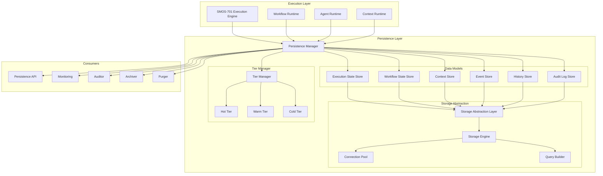

### ۴.۱ مؤلفه‌های معماری

| مؤلفه                     | مسئولیت                          | داده‌ها            |
| ------------------------- | -------------------------------- | ------------------ |
| **Persistence Manager**   | هماهنگی همه عملیات ماندگاری      | Coordination State |
| **Execution State Store** | ذخیره وضعیت اجرای جاری و تاریخچه | ExecutionState     |
| **Workflow State Store**  | ذخیره وضعیت Workflowها           | WorkflowState      |
| **Context Store**         | ذخیره بافت‌های زمان اجرا         | Context            |
| **Event Store**           | ذخیره غیرقابل تغییر رویدادها     | EventEnvelope      |
| **History Store**         | ذخیره تاریخچه کامل اجراها        | ExecutionHistory   |
| **Audit Log Store**       | ذخیره گزارش‌های حسابرسی          | AuditRecord        |
| **Storage Abstraction**   | انتزاع Backend ذخیره‌سازی        | —                  |
| **Tier Manager**          | مدیریت سطوح Hot/Warm/Cold        | TierMapping        |
| **Archiver**              | بایگانی داده‌ها                  | ArchivePackage     |
| **Purger**                | پاکسازی داده‌های منقضی           | PurgeBatch         |

---

## ۵. مدل‌های داده — Execution State (PSD-01)

Schema وضعیت اجرا برای ردیابی وضعیت جاری و تاریخچه هر اجرا در SMOS.

```json
{
  "$schema": "http://json-schema.org/draft-07/schema#",
  "$id": "https://smos.xennic.io/schemas/persistence/execution-state-v1.json",
  "title": "ExecutionState",
  "description": "وضعیت یک اجرا در SMOS Execution Engine",
  "type": "object",
  "version": "1.0.0",
  "required": ["executionId", "traceId", "status", "runtime", "createdAt", "updatedAt", "version"],
  "properties": {
    "executionId": {
      "type": "string",
      "pattern": "^exec_[a-f0-9]{32}$",
      "description": "شناسه یکتای اجرا"
    },
    "traceId": {
      "type": "string",
      "pattern": "^trace_[a-f0-9]{32}$",
      "description": "شناسه ردیابی سراسری"
    },
    "parentExecutionId": {
      "type": "string",
      "pattern": "^exec_[a-f0-9]{32}$",
      "description": "شناسه اجرای والد (برای اجراهای فرزند)"
    },
    "status": {
      "type": "string",
      "enum": [
        "pending",
        "initializing",
        "running",
        "waiting",
        "suspended",
        "completed",
        "failed",
        "cancelled",
        "timed_out",
        "compensating",
        "compensated",
        "archived"
      ],
      "description": "وضعیت جاری اجرا"
    },
    "runtime": {
      "type": "string",
      "enum": [
        "workflow",
        "agent",
        "knowledge",
        "calculation",
        "rag",
        "decision",
        "learning",
        "publishing"
      ],
      "description": "نوع Runtime اجراکننده"
    },
    "agentId": {
      "type": "string",
      "pattern": "^ai-\\d{3}$",
      "description": "شناسه Agent (فقط برای Agent Runtime)"
    },
    "workflowId": {
      "type": "string",
      "pattern": "^wf_[a-z0-9_]+$",
      "description": "شناسه Workflow (فقط برای Workflow Runtime)"
    },
    "sessionId": {
      "type": "string",
      "description": "شناسه جلسه اجرا"
    },
    "taskId": {
      "type": "string",
      "description": "شناسه وظیفه"
    },
    "contextRef": {
      "type": "string",
      "description": "ارجاع به Context Entry ماندگار"
    },
    "inputRef": {
      "type": "string",
      "description": "ارجاع به ورودی اجرا"
    },
    "outputRef": {
      "type": "string",
      "description": "ارجاع به خروجی اجرا"
    },
    "errorRef": {
      "type": "string",
      "description": "ارجاع به خطا (در صورت وجود)"
    },
    "metadata": {
      "type": "object",
      "description": "فراداده اضافی",
      "properties": {
        "priority": { "type": "integer", "minimum": 0, "maximum": 10 },
        "retryCount": { "type": "integer", "minimum": 0 },
        "maxRetries": { "type": "integer", "minimum": 0 },
        "timeout": { "type": "integer", "description": "مهلت اجرا (میلی‌ثانیه)" },
        "environment": { "type": "string", "enum": ["dev", "staging", "production"] },
        "tenantId": { "type": "string" },
        "workspaceId": { "type": "string" }
      },
      "additionalProperties": true
    },
    "timeline": {
      "type": "array",
      "description": "زمان‌بندی رویدادهای اجرا",
      "items": {
        "type": "object",
        "properties": {
          "event": { "type": "string" },
          "timestamp": { "type": "string", "format": "date-time" },
          "message": { "type": "string" }
        }
      }
    },
    "createdAt": {
      "type": "string",
      "format": "date-time"
    },
    "updatedAt": {
      "type": "string",
      "format": "date-time"
    },
    "completedAt": {
      "type": "string",
      "format": "date-time"
    },
    "version": {
      "type": "integer",
      "minimum": 1,
      "description": "نسخه سند (برای optimistic concurrency)"
    },
    "ttl": {
      "type": "integer",
      "description": "TTL بر حسب ثانیه از آخرین به‌روزرسانی"
    }
  }
}
```

### ۵.۱ مثال ExecutionState

```json
{
  "executionId": "exec_a1b2c3d4e5f67890a1b2c3d4e5f67890",
  "traceId": "trace_f6e5d4c3b2a10987f6e5d4c3b2a10987",
  "parentExecutionId": null,
  "status": "running",
  "runtime": "agent",
  "agentId": "ai-003",
  "sessionId": "session_20260701_042",
  "taskId": "task_content_production_789",
  "contextRef": "ctx_20260701_042_agent_ai-003_v3",
  "inputRef": "knw_production_plan_789",
  "outputRef": null,
  "errorRef": null,
  "metadata": {
    "priority": 5,
    "retryCount": 0,
    "maxRetries": 3,
    "timeout": 300000,
    "environment": "production",
    "tenantId": "xennic-main",
    "workspaceId": "ws-xennic-social"
  },
  "timeline": [
    { "event": "created", "timestamp": "2026-07-01T14:00:00.000Z", "message": "اجرا ایجاد شد" },
    {
      "event": "started",
      "timestamp": "2026-07-01T14:00:01.000Z",
      "message": "اجرا توسط Orchestrator آغاز شد"
    },
    {
      "event": "context_loaded",
      "timestamp": "2026-07-01T14:00:02.500Z",
      "message": "بافت Agent بارگذاری شد"
    }
  ],
  "createdAt": "2026-07-01T14:00:00.000Z",
  "updatedAt": "2026-07-01T14:00:02.500Z",
  "completedAt": null,
  "version": 3,
  "ttl": 604800
}
```

---

## ۶. مدل‌های داده — Workflow State (PSD-02)

Schema وضعیت Workflow برای ردیابی مراحل، شاخه‌ها و وضعیت هر Workflow.

```json
{
  "$schema": "http://json-schema.org/draft-07/schema#",
  "$id": "https://smos.xennic.io/schemas/persistence/workflow-state-v1.json",
  "title": "WorkflowState",
  "description": "وضعیت یک Workflow در SMOS Automation Engine",
  "type": "object",
  "version": "1.0.0",
  "required": ["workflowId", "executionId", "status", "steps", "createdAt", "updatedAt"],
  "properties": {
    "workflowId": {
      "type": "string",
      "pattern": "^wf_[a-z0-9_]+$"
    },
    "workflowName": {
      "type": "string"
    },
    "executionId": {
      "type": "string",
      "pattern": "^exec_[a-f0-9]{32}$"
    },
    "traceId": {
      "type": "string",
      "pattern": "^trace_[a-f0-9]{32}$"
    },
    "status": {
      "type": "string",
      "enum": [
        "pending",
        "running",
        "paused",
        "waiting_input",
        "waiting_approval",
        "completed",
        "failed",
        "cancelled",
        "timed_out",
        "compensating",
        "compensated",
        "suspended",
        "archived"
      ]
    },
    "triggerEvent": {
      "type": "string",
      "description": "رویداد محرک Workflow"
    },
    "triggerRef": {
      "type": "string",
      "description": "ارجاع به رویداد محرک (Event Store ID)"
    },
    "currentStep": {
      "type": "integer",
      "minimum": 0
    },
    "totalSteps": {
      "type": "integer",
      "minimum": 0
    },
    "steps": {
      "type": "array",
      "items": {
        "type": "object",
        "required": ["stepId", "stepName", "status", "order"],
        "properties": {
          "stepId": { "type": "string" },
          "stepName": { "type": "string" },
          "stepType": {
            "type": "string",
            "enum": [
              "task",
              "subworkflow",
              "decision",
              "parallel",
              "wait",
              "approval",
              "notification",
              "compensation"
            ]
          },
          "status": {
            "type": "string",
            "enum": [
              "pending",
              "running",
              "completed",
              "failed",
              "skipped",
              "waiting",
              "compensated"
            ]
          },
          "order": { "type": "integer" },
          "agentId": { "type": "string" },
          "inputRef": { "type": "string" },
          "outputRef": { "type": "string" },
          "errorRef": { "type": "string" },
          "startedAt": { "type": "string", "format": "date-time" },
          "completedAt": { "type": "string", "format": "date-time" },
          "retryCount": { "type": "integer" },
          "duration": { "type": "integer", "description": "مدت اجرا (میلی‌ثانیه)" }
        }
      }
    },
    "branches": {
      "type": "object",
      "description": "شاخه‌های Workflow (برای parallel/decision)",
      "additionalProperties": {
        "type": "object",
        "properties": {
          "branchId": { "type": "string" },
          "condition": { "type": "string" },
          "status": { "type": "string" },
          "steps": { "type": "array", "items": { "type": "object" } }
        }
      }
    },
    "variables": {
      "type": "object",
      "description": "متغیرهای Workflow",
      "additionalProperties": true
    },
    "metadata": {
      "type": "object",
      "properties": {
        "retryPolicy": { "type": "string" },
        "timeout": { "type": "integer" },
        "tenantId": { "type": "string" },
        "workspaceId": { "type": "string" },
        "automationRef": { "type": "string" }
      }
    },
    "timeline": {
      "type": "array",
      "items": {
        "type": "object",
        "properties": {
          "event": { "type": "string" },
          "stepId": { "type": "string" },
          "timestamp": { "type": "string", "format": "date-time" },
          "message": { "type": "string" }
        }
      }
    },
    "createdAt": { "type": "string", "format": "date-time" },
    "updatedAt": { "type": "string", "format": "date-time" },
    "completedAt": { "type": "string", "format": "date-time" },
    "version": { "type": "integer", "minimum": 1 },
    "ttl": { "type": "integer" }
  }
}
```

### ۶.۱ مثال WorkflowState

```json
{
  "workflowId": "wf_content_publishing_001",
  "workflowName": "انتشار محتوای چندپلتفرمی",
  "executionId": "exec_b2c3d4e5f67890a1b2c3d4e5f67890a1",
  "traceId": "trace_1234567890abcdef1234567890abcdef",
  "status": "running",
  "triggerEvent": "pub.package.assembled",
  "triggerRef": "evt_aabbccdd-1122-3344-5566-77889900aabb",
  "currentStep": 4,
  "totalSteps": 8,
  "steps": [
    {
      "stepId": "step_01",
      "stepName": "بررسی بسته انتشار",
      "stepType": "task",
      "status": "completed",
      "order": 1,
      "agentId": "ai-004",
      "completedAt": "2026-07-01T14:05:00.000Z",
      "duration": 45000
    },
    {
      "stepId": "step_02",
      "stepName": "تطبیق قالب پلتفرمی",
      "stepType": "parallel",
      "status": "completed",
      "order": 2,
      "completedAt": "2026-07-01T14:06:30.000Z",
      "duration": 90000
    },
    {
      "stepId": "step_03",
      "stepName": "بررسی انطباق پلتفرمی",
      "stepType": "task",
      "status": "completed",
      "order": 3,
      "agentId": "ai-008",
      "completedAt": "2026-07-01T14:07:00.000Z",
      "duration": 30000
    },
    {
      "stepId": "step_04",
      "stepName": "انتشار به اینستاگرام",
      "stepType": "task",
      "status": "running",
      "order": 4,
      "agentId": "ai-008",
      "startedAt": "2026-07-01T14:07:01.000Z"
    }
  ],
  "createdAt": "2026-07-01T14:00:00.000Z",
  "updatedAt": "2026-07-01T14:07:01.000Z",
  "version": 12,
  "ttl": 2592000
}
```

---

## ۷. مدل‌های داده — Context Persistence (PSD-03)

Schema ذخیره‌سازی بافت‌های زمان اجرا (SMOS-703).

```json
{
  "$schema": "http://json-schema.org/draft-07/schema#",
  "$id": "https://smos.xennic.io/schemas/persistence/context-v1.json",
  "title": "PersistedContext",
  "description": "بافت ماندگار شده در SMOS",
  "type": "object",
  "version": "1.0.0",
  "required": ["contextId", "contextType", "owner", "status", "payload", "createdAt", "ttl"],
  "properties": {
    "contextId": { "type": "string", "pattern": "^ctx_[a-f0-9]{32}$" },
    "contextType": {
      "type": "string",
      "enum": [
        "global",
        "workspace",
        "agent",
        "conversation",
        "calculation",
        "document",
        "memory",
        "tool",
        "shared",
        "immutable"
      ]
    },
    "owner": {
      "type": "string",
      "description": "شناسه مالک بافت"
    },
    "workspaceId": { "type": "string" },
    "tenantId": { "type": "string" },
    "status": {
      "type": "string",
      "enum": ["active", "frozen", "archived", "purged"]
    },
    "parentContextId": {
      "type": "string",
      "description": "ارجاع به بافت والد (برای ارث‌بری)"
    },
    "isolationLevel": {
      "type": "string",
      "enum": ["public", "workspace", "agent", "private", "sandboxed"]
    },
    "payload": {
      "type": "object",
      "description": "محتوای اصلی بافت",
      "additionalProperties": true
    },
    "schemaVersion": {
      "type": "string",
      "description": "نسخه Schema بافت"
    },
    "checksum": {
      "type": "string",
      "description": "SHA-256 checksum payload"
    },
    "size": {
      "type": "integer",
      "description": "حجم بافت (بایت)"
    },
    "accessControl": {
      "type": "object",
      "properties": {
        "readers": { "type": "array", "items": { "type": "string" } },
        "writers": { "type": "array", "items": { "type": "string" } },
        "public": { "type": "boolean" }
      }
    },
    "tags": {
      "type": "object",
      "additionalProperties": { "type": "string" }
    },
    "createdAt": { "type": "string", "format": "date-time" },
    "updatedAt": { "type": "string", "format": "date-time" },
    "accessedAt": { "type": "string", "format": "date-time", "description": "آخرین زمان دسترسی" },
    "ttl": { "type": "integer" },
    "version": { "type": "integer", "minimum": 1 }
  }
}
```

---

## ۸. مدل‌های داده — Event Store (PSD-04)

Schema ذخیره‌سازی غیرقابل تغییر رویدادها (SMOS-705).

```json
{
  "$schema": "http://json-schema.org/draft-07/schema#",
  "$id": "https://smos.xennic.io/schemas/persistence/event-v1.json",
  "title": "PersistedEvent",
  "description": "رویداد ماندگار شده در Event Store SMOS",
  "type": "object",
  "version": "1.0.0",
  "required": ["eventId", "eventType", "version", "timestamp", "source", "traceId", "payload"],
  "properties": {
    "eventId": {
      "type": "string",
      "pattern": "^evt_[a-f0-9]{8}-[a-f0-9]{4}-[a-f0-9]{4}-[a-f0-9]{4}-[a-f0-9]{12}$"
    },
    "eventType": { "type": "string", "description": "نوع رویداد با namespace (مثال: sys.started)" },
    "version": { "type": "string", "description": "نسخه Schema رویداد" },
    "timestamp": { "type": "string", "format": "date-time" },
    "source": { "type": "string" },
    "traceId": { "type": "string" },
    "spanId": { "type": "string" },
    "parentEventId": { "type": "string" },
    "correlationId": { "type": "string" },
    "partitionKey": {
      "type": "string",
      "description": "کلید پارتیشن برای حفظ ترتیب"
    },
    "payload": {
      "type": "object",
      "description": "محتوای رویداد",
      "additionalProperties": true
    },
    "metadata": {
      "type": "object",
      "properties": {
        "tenantId": { "type": "string" },
        "workspaceId": { "type": "string" },
        "sourceRuntime": { "type": "string" },
        "sourceAgentId": { "type": "string" },
        "sourceWorkflowId": { "type": "string" },
        "deliveryCount": { "type": "integer" },
        "size": { "type": "integer" },
        "ttl": { "type": "integer" }
      }
    },
    "storeTimestamp": {
      "type": "string",
      "format": "date-time",
      "description": "زمان ذخیره‌سازی در Event Store"
    },
    "ttl": { "type": "integer" }
  }
}
```

---

## ۹. مدل‌های داده — Execution History (PSD-05)

Schema تاریخچه کامل اجرا برای ردیابی و تحلیل.

```json
{
  "$schema": "http://json-schema.org/draft-07/schema#",
  "$id": "https://smos.xennic.io/schemas/persistence/execution-history-v1.json",
  "title": "ExecutionHistory",
  "description": "تاریخچه کامل یک اجرا از شروع تا پایان",
  "type": "object",
  "version": "1.0.0",
  "required": ["historyId", "executionId", "traceId", "runtime", "status", "createdAt"],
  "properties": {
    "historyId": { "type": "string", "pattern": "^hist_[a-f0-9]{40}$" },
    "executionId": { "type": "string", "pattern": "^exec_[a-f0-9]{32}$" },
    "traceId": { "type": "string" },
    "parentExecutionId": { "type": "string" },
    "runtime": { "type": "string" },
    "agentId": { "type": "string" },
    "workflowId": { "type": "string" },
    "status": { "type": "string" },
    "statusTransitions": {
      "type": "array",
      "description": "تغییرات وضعیت در طول اجرا",
      "items": {
        "type": "object",
        "properties": {
          "fromStatus": { "type": "string" },
          "toStatus": { "type": "string" },
          "timestamp": { "type": "string", "format": "date-time" },
          "trigger": { "type": "string" },
          "message": { "type": "string" }
        }
      }
    },
    "inputSnapshot": {
      "type": "object",
      "description": "Snapshot ورودی در زمان شروع",
      "properties": {
        "ref": { "type": "string" },
        "checksum": { "type": "string" },
        "size": { "type": "integer" }
      }
    },
    "outputSnapshot": {
      "type": "object",
      "description": "Snapshot خروجی در زمان پایان",
      "properties": {
        "ref": { "type": "string" },
        "checksum": { "type": "string" },
        "size": { "type": "integer" }
      }
    },
    "errorSummary": {
      "type": "object",
      "properties": {
        "errorCode": { "type": "string" },
        "errorMessage": { "type": "string" },
        "errorCategory": {
          "type": "string",
          "enum": ["transient", "permanent", "security", "validation", "resource"]
        },
        "stackTraceRef": { "type": "string" },
        "recoveryAction": { "type": "string" }
      }
    },
    "resourceUsage": {
      "type": "object",
      "properties": {
        "cpuMs": { "type": "integer" },
        "memoryBytes": { "type": "integer" },
        "tokenCount": { "type": "integer" },
        "apiCalls": { "type": "integer" },
        "duration": { "type": "integer" }
      }
    },
    "contextRefs": {
      "type": "array",
      "description": "ارجاع به بافت‌های استفاده‌شده",
      "items": { "type": "string" }
    },
    "eventRefs": {
      "type": "array",
      "description": "ارجاع به رویدادهای مرتبط",
      "items": { "type": "string" }
    },
    "tags": {
      "type": "object",
      "additionalProperties": { "type": "string" }
    },
    "createdAt": { "type": "string", "format": "date-time" },
    "completedAt": { "type": "string", "format": "date-time" },
    "ttl": { "type": "integer" }
  }
}
```

---

## ۱۰. مدل‌های داده — Audit Log (PSD-06)

Schema گزارش حسابرسی برای تمام عملیات ماندگاری.

```json
{
  "$schema": "http://json-schema.org/draft-07/schema#",
  "$id": "https://smos.xennic.io/schemas/persistence/audit-v1.json",
  "title": "AuditRecord",
  "description": "گزارش حسابرسی عملیات ماندگاری SMOS",
  "type": "object",
  "version": "1.0.0",
  "required": ["auditId", "timestamp", "action", "actor", "resourceType", "resourceId", "outcome"],
  "properties": {
    "auditId": { "type": "string", "pattern": "^audit_[a-f0-9]{40}$" },
    "timestamp": { "type": "string", "format": "date-time" },
    "action": {
      "type": "string",
      "enum": [
        "create",
        "read",
        "update",
        "delete",
        "purge",
        "archive",
        "restore",
        "export",
        "query",
        "grant_access",
        "revoke_access",
        "config_change",
        "retention_change",
        "ttl_change",
        "lock",
        "unlock",
        "reencrypt",
        "migrate"
      ]
    },
    "actor": {
      "type": "object",
      "required": ["id", "type"],
      "properties": {
        "id": { "type": "string" },
        "type": {
          "type": "string",
          "enum": ["agent", "human", "system", "workflow", "api"]
        },
        "ip": { "type": "string" },
        "sessionId": { "type": "string" }
      }
    },
    "resourceType": {
      "type": "string",
      "enum": [
        "execution_state",
        "workflow_state",
        "context",
        "event",
        "history",
        "audit_log",
        "archive",
        "purge_batch",
        "config"
      ]
    },
    "resourceId": { "type": "string" },
    "outcome": {
      "type": "string",
      "enum": ["success", "failure", "denied", "pending"]
    },
    "failureReason": { "type": "string" },
    "changes": {
      "type": "object",
      "description": "تغییرات اعمال‌شده",
      "properties": {
        "before": { "type": "object" },
        "after": { "type": "object" },
        "diff": { "type": "string" }
      }
    },
    "tenantId": { "type": "string" },
    "workspaceId": { "type": "string" },
    "traceId": { "type": "string" },
    "metadata": {
      "type": "object",
      "additionalProperties": true
    },
    "ttl": { "type": "integer", "description": "TTL ویژه Audit (معمولاً طولانی‌تر)" }
  }
}
```

---

## ۱۱. انتزاع Backend ذخیره‌سازی (Storage Backend Abstraction)

### ۱۱.۱ معماری Abstraction Layer

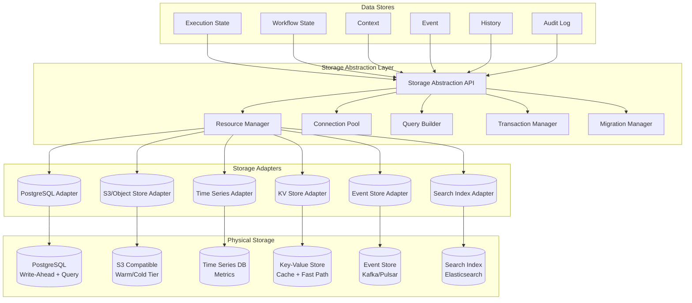

### ۱۱.۲ Storage Backend Interface

```json
{
  "storageInterface": {
    "operations": {
      "write": {
        "signature": "Write(ctx, collection, document) -> (id, version, error)",
        "guarantee": "write_acknowledged | write_durable",
        "consistency": "strong | eventual"
      },
      "read": {
        "signature": "Read(ctx, collection, id, options) -> (document, error)",
        "options": ["include_archived", "snapshot_time", "version"]
      },
      "query": {
        "signature": "Query(ctx, collection, filter, options) -> (cursor, error)",
        "options": ["limit", "offset", "sort", "include_total"]
      },
      "update": {
        "signature": "Update(ctx, collection, id, update, options) -> (new_version, error)",
        "options": ["expected_version", "upsert"]
      },
      "delete": {
        "signature": "Delete(ctx, collection, id, options) -> error",
        "options": ["soft_delete", "expected_version"]
      },
      "archive": {
        "signature": "Archive(ctx, collection, filter) -> (batch_id, count, error)"
      },
      "restore": {
        "signature": "Restore(ctx, collection, filter) -> (batch_id, count, error)"
      },
      "purge": {
        "signature": "Purge(ctx, collection, filter) -> (batch_id, count, error)"
      }
    },
    "requiredCapabilities": [
      "transactions",
      "point_in_time_read",
      "batch_operations",
      "ttl_management",
      "encryption_at_rest",
      "audit_integration"
    ]
  }
}
```

### ۱۱.۳ نگاشت Backend به Data Store

| Data Store      | Backend ترجیحی             | Backend جایگزین  | دلیل                               |
| --------------- | -------------------------- | ---------------- | ---------------------------------- |
| Execution State | PostgreSQL (SSD)           | CockroachDB      | نیاز به تراکنش و Query انعطاف‌پذیر |
| Workflow State  | PostgreSQL (SSD)           | DynamoDB         | نیاز به تراکنش قدم‌ها              |
| Context         | KV Store (Redis/TiKV)      | PostgreSQL       | دسترسی سریع با Latency کم          |
| Event           | Event Store (Kafka/Pulsar) | PostgreSQL (WAL) | Append-only, Replay, Partition     |
| History         | Time Series + PostgreSQL   | ClickHouse       | Query تحلیلی در بازه زمانی         |
| Audit Log       | PostgreSQL (append-only)   | S3 (JSON Lines)  | یکپارچگی, Immutability             |

---

## ۱۲. مدل Query (Query Model)

### ۱۲.۱ انواع Query

| ID   | Query                         | پارامترها                                | Data Store                | پیچیدگی   |
| ---- | ----------------------------- | ---------------------------------------- | ------------------------- | --------- |
| Q-01 | **GetExecutionByID**          | executionId                              | Execution State           | O(1)      |
| Q-02 | **ListExecutionsByTimeRange** | from, to, runtime, status                | Execution State + History | O(log n)  |
| Q-03 | **ListExecutionsByStatus**    | status, runtime, limit                   | Execution State           | O(log n)  |
| Q-04 | **ListExecutionsByAgent**     | agentId, from, to, limit                 | Execution State + History | O(log n)  |
| Q-05 | **ListExecutionsByWorkflow**  | workflowId, from, to, limit              | Workflow State            | O(log n)  |
| Q-06 | **GetWorkflowState**          | workflowId, executionId                  | Workflow State            | O(1)      |
| Q-07 | **GetContextByID**            | contextId                                | Context Store             | O(1)      |
| Q-08 | **QueryContextsByType**       | contextType, owner, limit                | Context Store             | O(log n)  |
| Q-09 | **GetEventByID**              | eventId                                  | Event Store               | O(1)      |
| Q-10 | **QueryEventsByType**         | eventType, from, to, limit               | Event Store               | O(log n)  |
| Q-11 | **QueryEventsByTrace**        | traceId                                  | Event Store               | O(log n)  |
| Q-12 | **QueryEventsByCorrelation**  | correlationId                            | Event Store               | O(log n)  |
| Q-13 | **GetExecutionHistory**       | executionId                              | History Store             | O(1)      |
| Q-14 | **SearchHistory**             | runtime, status, agentId, from, to, tags | History Store             | O(log n)  |
| Q-15 | **GetAuditLogByResource**     | resourceType, resourceId                 | Audit Log                 | O(log n)  |
| Q-16 | **QueryAuditLog**             | actor, action, from, to, limit           | Audit Log                 | O(log n)  |
| Q-17 | **CountExecutionsByStatus**   | status, runtime, from, to                | Execution State           | O(log n)  |
| Q-18 | **AggregateDuration**         | runtime, from, to, granularity           | History Store             | O(n) scan |
| Q-19 | **GetFailedExecutions**       | from, to, limit, errorCategory           | History Store             | O(log n)  |
| Q-20 | **SearchByTags**              | tags (key:value), limit                  | Execution State + History | O(n)      |

### ۱۲.۲ Query API Contract

```json
{
  "queryRequest": {
    "type": "object",
    "properties": {
      "queryId": { "type": "string", "enum": ["Q-01", "Q-02", "..."] },
      "params": {
        "type": "object",
        "additionalProperties": true
      },
      "options": {
        "type": "object",
        "properties": {
          "limit": { "type": "integer", "maximum": 1000 },
          "offset": { "type": "integer" },
          "sort": { "type": "string", "enum": ["asc", "desc"] },
          "sortBy": { "type": "string" },
          "includeArchived": { "type": "boolean" },
          "tenantId": { "type": "string" },
          "workspaceId": { "type": "string" }
        }
      }
    },
    "required": ["queryId", "params"]
  },
  "queryResponse": {
    "type": "object",
    "properties": {
      "items": { "type": "array" },
      "total": { "type": "integer" },
      "limit": { "type": "integer" },
      "offset": { "type": "integer" },
      "hasMore": { "type": "boolean" },
      "queryDuration": { "type": "integer", "description": "مدت Query (میلی‌ثانیه)" }
    }
  }
}
```

---

## ۱۳. استراتژی بایگانی (Archival Strategy)

### ۱۳.۱ سطوح ذخیره‌سازی (Tiers)

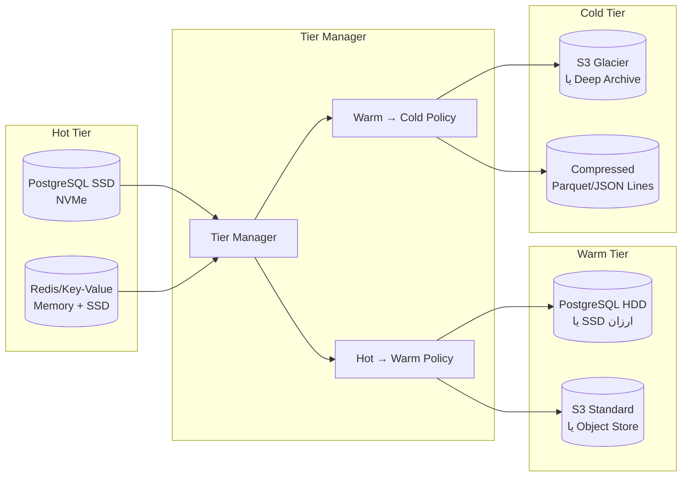

### ۱۳.۲ سیاست‌های انتقال بین Tierها

| Data Type        | Hot → Warm                     | Warm → Cold   | Cold → Purge   |
| ---------------- | ------------------------------ | ------------- | -------------- |
| Execution State  | پس از ۷ روز                    | پس از ۳۰ روز  | پس از ۹۰ روز   |
| Workflow State   | پس از ۱۴ روز                   | پس از ۶۰ روز  | پس از ۱۸۰ روز  |
| Context          | پس از ۱ روز (بافت‌های غیرفعال) | پس از ۷ روز   | پس از ۳۰ روز   |
| Event            | پس از ۳ روز                    | پس از ۱۴ روز  | پس از ۶۰ روز   |
| History          | پس از ۳۰ روز                   | پس از ۹۰ روز  | پس از ۳۶۵ روز  |
| Audit Log        | — (همیشه Hot)                  | پس از ۳۶۵ روز | پس از ۷ سال    |
| Archived Package | —                              | —             | بستگی به سیاست |

### ۱۳.۳ Archival Batch Schema

```json
{
  "$schema": "http://json-schema.org/draft-07/schema#",
  "title": "ArchiveBatch",
  "type": "object",
  "properties": {
    "batchId": { "type": "string" },
    "sourceTier": { "type": "string", "enum": ["hot", "warm"] },
    "targetTier": { "type": "string", "enum": ["warm", "cold"] },
    "collection": { "type": "string" },
    "filter": { "type": "object" },
    "totalRecords": { "type": "integer" },
    "totalSize": { "type": "integer" },
    "records": {
      "type": "array",
      "items": {
        "type": "object",
        "properties": {
          "ref": { "type": "string" },
          "checksum": { "type": "string" },
          "targetPath": { "type": "string" }
        }
      }
    },
    "createdAt": { "type": "string", "format": "date-time" },
    "completedAt": { "type": "string", "format": "date-time" },
    "status": {
      "type": "string",
      "enum": ["pending", "in_progress", "completed", "failed", "partially_completed"]
    },
    "error": { "type": "string" }
  }
}
```

---

## ۱۴. سیاست‌های نگهداری داده (Data Retention Policies)

### ۱۴.۱ Retention Policy Matrix

| Policy ID | Data Type                   | Retention | Rationale                      | Legal Hold           |
| --------- | --------------------------- | --------- | ------------------------------ | -------------------- |
| RET-001   | Execution State (completed) | ۹۰ روز    | نیاز به Debug کوتاه‌مدت        | قابل override        |
| RET-002   | Execution State (failed)    | ۱۸۰ روز   | تحلیل خطا نیاز به زمان بیشتر   | قابل override        |
| RET-003   | Workflow State (completed)  | ۱۸۰ روز   | ردیابی گردش کار                | قابل override        |
| RET-004   | Workflow State (failed)     | ۳۶۵ روز   | تحلیل نقاط شکست                | قابل override        |
| RET-005   | Context (agent)             | ۳۰ روز    | بافت Agent سریعاً منقضی می‌شود | —                    |
| RET-006   | Context (memory)            | ۳۶۵ روز   | حافظه بلندمدت Agent            | قابل override        |
| RET-007   | Context (immutable)         | ۷ سال     | بافت تغییرناپذیر حسابرسی       | اجباری               |
| RET-008   | Event (all)                 | ۶۰ روز    | Event Log میان‌مدت             | قابل override        |
| RET-009   | Event (audit)               | ۷ سال     | الزام قانونی حسابرسی           | اجباری               |
| RET-010   | History (standard)          | ۳۶۵ روز   | تحلیل عملکرد سالانه            | قابل override        |
| RET-011   | History (failed)            | ۲ سال     | تحلیل عمیق خطاها               | قابل override        |
| RET-012   | Audit Log (all)             | ۷ سال     | الزام قانونی                   | اجباری/غیرقابل تغییر |

### ۱۴.۲ Retention Configuration Schema

```json
{
  "$schema": "http://json-schema.org/draft-07/schema#",
  "title": "RetentionPolicy",
  "type": "object",
  "properties": {
    "policyId": { "type": "string" },
    "dataType": { "type": "string" },
    "hotRetention": { "type": "integer", "description": "روزها در Hot Tier" },
    "warmRetention": { "type": "integer", "description": "روزها در Warm Tier" },
    "coldRetention": { "type": "integer", "description": "روزها در Cold Tier" },
    "totalRetention": { "type": "integer", "description": "روزها تا Purge" },
    "legalHold": { "type": "boolean" },
    "immutable": { "type": "boolean", "description": "تغییرناپذیر" },
    "overrideable": { "type": "boolean" },
    "actions": {
      "type": "object",
      "properties": {
        "onHotExpiry": { "type": "string", "enum": ["archive_to_warm", "purge"] },
        "onWarmExpiry": { "type": "string", "enum": ["archive_to_cold", "purge"] },
        "onColdExpiry": { "type": "string", "enum": ["purge", "notify"] }
      }
    }
  }
}
```

---

## ۱۵. مدل پاکسازی داده (Data Purge Model)

### ۱۵.۱ Purge State Machine

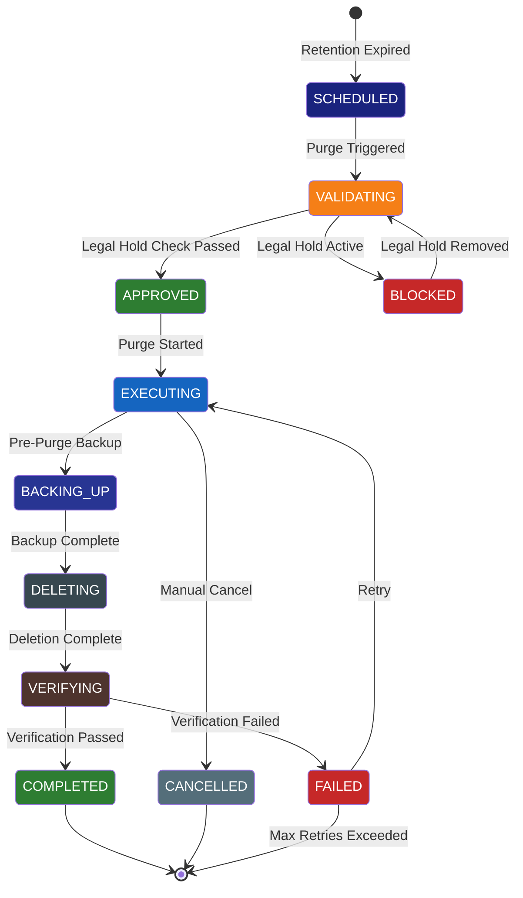

### ۱۵.۲ Purge Batch Schema

```json
{
  "$schema": "http://json-schema.org/draft-07/schema#",
  "title": "PurgeBatch",
  "type": "object",
  "properties": {
    "purgeId": { "type": "string", "pattern": "^purge_[a-f0-9]{32}$" },
    "policyId": { "type": "string" },
    "dataType": { "type": "string" },
    "tier": { "type": "string", "enum": ["hot", "warm", "cold"] },
    "status": {
      "type": "string",
      "enum": [
        "scheduled",
        "validating",
        "approved",
        "blocked",
        "executing",
        "backing_up",
        "deleting",
        "verifying",
        "completed",
        "failed",
        "cancelled"
      ]
    },
    "filter": { "type": "object" },
    "totalRecords": { "type": "integer" },
    "totalSize": { "type": "integer" },
    "deletedRecords": { "type": "integer" },
    "backupRef": { "type": "string" },
    "legalHoldChecked": { "type": "boolean" },
    "legalHoldBlockedBy": { "type": "array", "items": { "type": "string" } },
    "error": { "type": "string" },
    "retryCount": { "type": "integer" },
    "maxRetries": { "type": "integer", "default": 3 },
    "createdAt": { "type": "string", "format": "date-time" },
    "completedAt": { "type": "string", "format": "date-time" },
    "auditRefs": { "type": "array", "items": { "type": "string" } }
  },
  "required": ["purgeId", "policyId", "dataType", "status", "createdAt"]
}
```

### ۱۵.۳ قواعد پاکسازی

1. **Legal Hold اولویت دارد**: هیچ داده‌ای با Legal Hold فعال پاک نمی‌شود
2. **Backup پیش از Purge**: قبل از هر Purge عمده، یک Backup گرفته می‌شود
3. **Soft Delete اول**: داده‌ها ابتدا Soft Delete می‌شوند (قابل بازیابی تا ۷ روز)
4. **Hard Delete پس از تأیید**: حذف فیزیکی فقط پس از تأیید Soft Delete
5. **Audit اجباری**: هر Purge در Audit Log ثبت می‌شود
6. **قابل لغو**: Purgeهای در حال اجرا قابل لغو دستی هستند
7. **محدودیت نرخ**: حداکثر ۱۰٬۰۰۰ رکورد در هر Purge Batch

---

## ۱۶. ماشین وضعیت ماندگاری (Persistence State Machine)

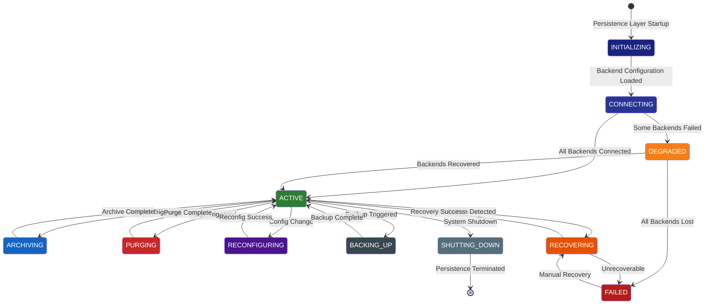

### ۱۶.۱ تعریف وضعیت‌ها

| State         | توضیح                          | اقدام مجاز                             |
| ------------- | ------------------------------ | -------------------------------------- |
| INITIALIZING  | بارگذاری کانفیگ و راه‌اندازی   | هیچ                                    |
| CONNECTING    | اتصال به Backendها             | هیچ                                    |
| ACTIVE        | عملیات عادی                    | read, write, query, update, delete     |
| DEGRADED      | برخی Backendها در دسترس نیستند | read (محدود), write به Backendهای سالم |
| ARCHIVING     | بایگانی در حال اجرا            | read, write (با محدودیت)               |
| PURGING       | پاکسازی در حال اجرا            | read, write ممنوع (برای داده‌های هدف)  |
| RECONFIGURING | تغییر کانفیگ                   | read (محدود)                           |
| BACKING_UP    | Backup در حال اجرا             | read, write (با محدودیت)               |
| RECOVERING    | بازیابی از Failure             | read (محدود)                           |
| FAILED        | Failure غیرقابل بازیابی        | فقط read تاریخچه                       |
| SHUTTING_DOWN | خاموشی سیستم                   | هیچ                                    |

---

## ۱۷. گردش کار ماندگاری (Persistence Workflow)

### ۱۷.۱ Sequence: ذخیره‌سازی Execution State

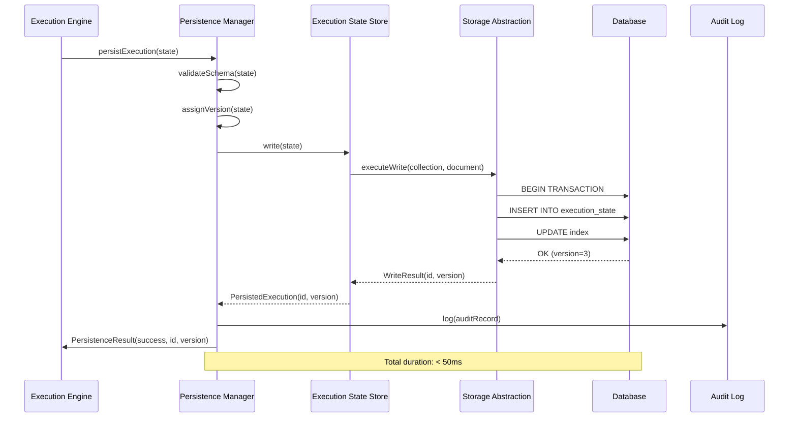

### ۱۷.۲ Sequence: بازیابی بافت (Context Recovery)

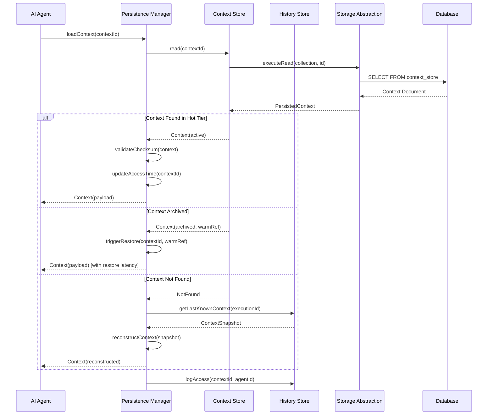

### ۱۷.۳ Sequence: بایگانی و پاکسازی

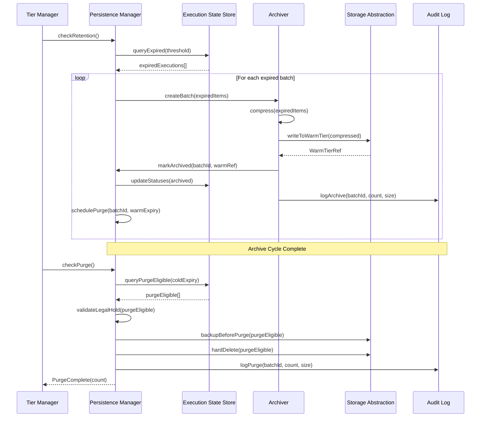

---

## ۱۸. سناریوهای خطا (Failure Scenarios)

| ID   | سناریو                  | علت                      | تأثیر                    | شدت    |
| ---- | ----------------------- | ------------------------ | ------------------------ | ------ |
| F-01 | **Write Failure**       | قطعی شبکه/DB             | ازدست‌رفتن وضعیت جاری    | بالا   |
| F-02 | **Read Failure**        | Backend در دسترس نیست    | عدم بارگذاری بافت        | بالا   |
| F-03 | **Version Conflict**    | Write همزمان روی یک سند  | رد یکی از Writeها        | متوسط  |
| F-04 | **Corrupt Document**    | Checksum نامعتبر         | فساد داده                | بحرانی |
| F-05 | **Archive Failure**     | قطعی در حین بایگانی      | داده در هیچ Tier ای نیست | بحرانی |
| F-06 | **Purge Failure**       | حذف ناقص                 | Leftover یا حذف نادرست   | بحرانی |
| F-07 | **Retention Misconfig** | TTL اشتباه               | حذف زودهنگام یا عدم حذف  | بالا   |
| F-08 | **Backend Saturation**  | overload                 | افزایش Latency           | متوسط  |
| F-09 | **Transaction Timeout** | تراکنش طولانی            | قفل ماندن رکوردها        | متوسط  |
| F-10 | **Schema Mismatch**     | نسخه Schema متفاوت       | عدم امکان Deserialize    | بالا   |
| F-11 | **Encryption Key Loss** | ازدست‌رفتن کلید رمزنگاری | عدم امکان Decrypt        | بحرانی |
| F-12 | **Audit Log Overflow**  | حجم بالای Audit          | ازدست‌رفتن Audit记录     | متوسط  |

---

## ۱۹. استراتژی‌های بازیابی (Recovery Strategies)

| Failure ID                 | Recovery Strategy                                              | RTO هدف  | RPO هدف     | خودکار        |
| -------------------------- | -------------------------------------------------------------- | -------- | ----------- | ------------- |
| F-01 (Write Failure)       | **Retry with Backoff**: ۳ بار تلاش مجدد با exponential backoff | ۵ ثانیه  | ۰ (no loss) | ✅            |
| F-02 (Read Failure)        | **Failover to Replica**: خواندن از Replica یا Cache            | ۲ ثانیه  | ۰           | ✅            |
| F-03 (Version Conflict)    | **Optimistic Concurrency**: خواندن نسخه جدید و retry           | ۱ ثانیه  | ۰           | ✅            |
| F-04 (Corrupt Document)    | **Reconstruct from History**: بازسازی از History Store         | ۳۰ ثانیه | < ۱ دقیقه   | ✅ (با تأیید) |
| F-05 (Archive Failure)     | **Two-Phase Archive**: تأیید در هر دو Tier قبل از حذف مبدأ     | ۶۰ ثانیه | ۰           | ✅            |
| F-06 (Purge Failure)       | **Rollback Purge**: بازیابی از Pre-Purge Backup                | ۵ دقیقه  | < ۵ دقیقه   | دستی          |
| F-07 (Retention Misconfig) | **Audit Alert + Manual Override**: هشدار و قفل دستی            | ۱۵ دقیقه | —           | دستی          |
| F-08 (Backend Saturation)  | **Circuit Breaker + Backpressure**: قطع خودکار و فشار معکوس    | ۱۰ ثانیه | —           | ✅            |
| F-09 (Transaction Timeout) | **Deadlock Detection + Retry**: تشخیص و retry                  | ۳۰ ثانیه | ۰           | ✅            |
| F-10 (Schema Mismatch)     | **Schema Registry Lookup + Migration**: جستجوی Schema Registry | ۱۰ ثانیه | —           | ✅            |
| F-11 (Encryption Key Loss) | **Key Vault Rotation**: بازیابی از Key Vault Backup            | ۵ دقیقه  | —           | دستی          |
| F-12 (Audit Log Overflow)  | **Auto-Partition + Archive**: پارتیشن خودکار و بایگانی         | ۳۰ ثانیه | —           | ✅            |

### ۱۹.۱ Retry Policy Configuration

```json
{
  "retryPolicy": {
    "maxRetries": 3,
    "baseDelay": 100,
    "maxDelay": 5000,
    "multiplier": 2,
    "jitter": 0.1,
    "retryableErrors": [
      "connection_timeout",
      "deadlock",
      "backend_unavailable",
      "throttling",
      "network_error",
      "replica_lag"
    ],
    "nonRetryableErrors": [
      "schema_mismatch",
      "checksum_failure",
      "authorization_denied",
      "invalid_document",
      "encryption_error"
    ],
    "circuitBreaker": {
      "failureThreshold": 5,
      "resetTimeout": 30000,
      "halfOpenMaxRequests": 3
    }
  }
}
```

---

## ۲۰. نظارت و معیارهای ماندگاری (Persistence Monitoring & Metrics)

### ۲۰.۱ Metric Categories

| Category       | Metrics                                                                    | جمع‌آوری    |
| -------------- | -------------------------------------------------------------------------- | ----------- |
| **Latency**    | write_latency, read_latency, query_latency, archive_latency, purge_latency | P50/P95/P99 |
| **Throughput** | writes_per_sec, reads_per_sec, queries_per_sec, archives_per_hour          | Rate        |
| **Volume**     | total_rows, total_size_bytes, hot_size, warm_size, cold_size               | Gauge       |
| **Errors**     | write_errors, read_errors, query_errors, archive_errors, purge_errors      | Count       |
| **Retention**  | expired_count, purged_count, archived_count, legal_hold_count              | Count       |
| **Health**     | backend_status, connection_pool_usage, replication_lag, tier_usage         | State       |

### ۲۰.۲ Metric Definitions

```json
{
  "metrics": {
    "persistence_write_latency_ms": {
      "type": "histogram",
      "buckets": [1, 5, 10, 25, 50, 100, 250, 500, 1000, 5000],
      "labels": ["collection", "backend", "tier"]
    },
    "persistence_read_latency_ms": {
      "type": "histogram",
      "buckets": [1, 5, 10, 25, 50, 100, 250, 500, 1000],
      "labels": ["collection", "backend", "hit_cache"]
    },
    "persistence_query_latency_ms": {
      "type": "histogram",
      "buckets": [5, 10, 25, 50, 100, 250, 500, 1000, 5000, 30000],
      "labels": ["query_id", "collection"]
    },
    "persistence_write_total": {
      "type": "counter",
      "labels": ["collection", "status"]
    },
    "persistence_read_total": {
      "type": "counter",
      "labels": ["collection", "status"]
    },
    "persistence_error_total": {
      "type": "counter",
      "labels": ["operation", "error_code", "backend"]
    },
    "persistence_tier_size_bytes": {
      "type": "gauge",
      "labels": ["tier", "collection"]
    },
    "persistence_tier_record_count": {
      "type": "gauge",
      "labels": ["tier", "collection"]
    },
    "persistence_archive_batch_size": {
      "type": "histogram",
      "buckets": [100, 500, 1000, 5000, 10000, 50000],
      "labels": ["source_tier", "target_tier"]
    },
    "persistence_purge_batch_size": {
      "type": "histogram",
      "buckets": [100, 500, 1000, 5000, 10000],
      "labels": ["data_type"]
    },
    "persistence_connection_pool_usage": {
      "type": "gauge",
      "labels": ["backend", "pool_name"]
    },
    "persistence_replication_lag_ms": {
      "type": "gauge",
      "labels": ["backend", "region"]
    },
    "persistence_legal_hold_count": {
      "type": "gauge",
      "labels": ["collection"]
    }
  }
}
```

### ۲۰.۳ Health Check Contract

```json
{
  "healthCheck": {
    "endpoint": "GET /health/persistence",
    "response": {
      "status": {
        "type": "string",
        "enum": ["healthy", "degraded", "unhealthy"]
      },
      "backends": {
        "type": "array",
        "items": {
          "type": "object",
          "properties": {
            "name": { "type": "string" },
            "status": { "type": "string", "enum": ["connected", "disconnected", "error"] },
            "latencyMs": { "type": "integer" },
            "connections": { "type": "integer" },
            "error": { "type": "string" }
          }
        }
      },
      "tiers": {
        "type": "object",
        "properties": {
          "hot": {
            "type": "object",
            "properties": {
              "totalSizeBytes": { "type": "integer" },
              "recordCount": { "type": "integer" }
            }
          },
          "warm": {
            "type": "object",
            "properties": {
              "totalSizeBytes": { "type": "integer" },
              "recordCount": { "type": "integer" }
            }
          },
          "cold": {
            "type": "object",
            "properties": {
              "totalSizeBytes": { "type": "integer" },
              "recordCount": { "type": "integer" }
            }
          }
        }
      },
      "lastArchiveTime": { "type": "string", "format": "date-time" },
      "lastPurgeTime": { "type": "string", "format": "date-time" },
      "activeArchives": { "type": "integer" },
      "activePurges": { "type": "integer" },
      "errors": { "type": "array", "items": { "type": "string" } }
    }
  }
}
```

---

## ۲۱. امنیت ماندگاری (Persistence Security)

### ۲۱.۱ اصول امنیتی

| ID     | اصل                                                | پیاده‌سازی                                   |
| ------ | -------------------------------------------------- | -------------------------------------------- |
| SEC-01 | **رمزنگاری در حال سکون** (Encryption at Rest)      | AES-256-GCM برای همه Backendها               |
| SEC-02 | **رمزنگاری در حال انتقال** (Encryption in Transit) | TLS 1.3 برای همه اتصالات                     |
| SEC-03 | **رمزنگاری در سطح رکورد** (Field-Level Encryption) | فیلدهای حساس با کلید مجزا                    |
| SEC-04 | **احراز هویت** (Authentication)                    | mTLS بین مؤلفه‌ها + API Key + JWT            |
| SEC-05 | **مجوزدهی** (Authorization)                        | RBAC در سطح Collection + Record              |
| SEC-06 | **جداسازی Tenant**                                 | Tenant ID به عنوان Partition Key اجباری      |
| SEC-07 | **Audit همه عملیات**                               | هر عملیات CRUD در Audit Log ثبت می‌شود       |
| SEC-08 | **حداقل دسترسی**                                   | هر مؤلفه فقط به Collections مجاز دسترسی دارد |
| SEC-09 | **Immutable Audit**                                | Audit Log قابل تغییر نیست (Append-Only)      |
| SEC-10 | **Key Rotation**                                   | چرخش خودکار کلیدهای رمزنگاری هر ۹۰ روز       |

### ۲۱.۲ Access Control Matrix

| Role                      | Execution State | Workflow State | Context        | Event          | History        | Audit |
| ------------------------- | --------------- | -------------- | -------------- | -------------- | -------------- | ----- |
| **System Admin**          | CRUD            | CRUD           | CRUD           | R              | CRUD           | R     |
| **Orchestrator (AI-014)** | CRUD            | CRUD           | CRUD           | R              | R              | —     |
| **Agent**                 | R (own)         | R (own)        | CRUD (own)     | —              | —              | —     |
| **Analytics (AI-010)**    | R               | R              | R              | R              | R              | —     |
| **Auditor**               | R               | R              | R              | R              | R              | R     |
| **Workflow Engine**       | CRUD            | CRUD           | R              | R              | CRUD           | —     |
| **DevOps**                | R               | R              | R              | R              | R              | R     |
| **Tenant Admin**          | R (own tenant)  | R (own tenant) | R (own tenant) | R (own tenant) | R (own tenant) | —     |

---

## ۲۲. مقیاس‌پذیری و چندمستاجری (Scaling & Multi-Tenancy)

### ۲۲.۱ استراتژی مقیاس‌پذیری

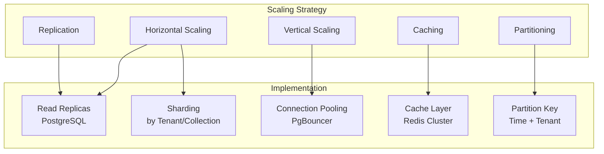

### ۲۲.۲ Multi-Tenancy Model

| بعد                 | استراتژی                              | توضیح                                                    |
| ------------------- | ------------------------------------- | -------------------------------------------------------- |
| **جداسازی داده**    | Tenant ID Column + Row-Level Security | همه Tableها دارای tenant_id                              |
| **Partition Key**   | tenant_id + date_trunc                | پارتیشن بر اساس Tenant + زمان                            |
| **Connection Pool** | Per-Tenant Pool Option                | امکان Pool مجزا برای Tenantهای بزرگ                      |
| **Rate Limiting**   | Per-Tenant Write/Read Limit           | محدودیت ۱۰۰۰ write/sec per Tenant                        |
| **Storage Quota**   | Per-Tenant Quota                      | محدودیت ۱۰۰GB Hot per Tenant                             |
| **Isolation Level** | Configurable                          | Tenant عادی: Column-Level / Tenant Premium: Schema-Level |

### ۲۲.۳ Tenant Configuration Schema

```json
{
  "$schema": "http://json-schema.org/draft-07/schema#",
  "title": "TenantPersistenceConfig",
  "type": "object",
  "properties": {
    "tenantId": { "type": "string" },
    "isolationLevel": {
      "type": "string",
      "enum": ["column_level", "schema_level", "database_level"]
    },
    "quotas": {
      "type": "object",
      "properties": {
        "hotStorageBytes": { "type": "integer" },
        "warmStorageBytes": { "type": "integer" },
        "writesPerSecond": { "type": "integer" },
        "readsPerSecond": { "type": "integer" },
        "maxRetentionDays": { "type": "integer" },
        "maxContextCount": { "type": "integer" }
      }
    },
    "features": {
      "type": "object",
      "properties": {
        "legalHold": { "type": "boolean" },
        "customRetention": { "type": "boolean" },
        "crossTenantQuery": { "type": "boolean", "default": false },
        "encryptionCustomKey": { "type": "boolean" }
      }
    },
    "backends": {
      "type": "object",
      "properties": {
        "preferredExecutionStore": { "type": "string" },
        "preferredEventStore": { "type": "string" },
        "preferredContextStore": { "type": "string" }
      }
    }
  }
}
```

---

## ۲۳. قراردادهای API (API Contracts)

### ۲۳.۱ Persistence REST API

| Method | Path                                   | توضیح                       | Body              | Response            |
| ------ | -------------------------------------- | --------------------------- | ----------------- | ------------------- |
| POST   | `/api/v1/persistence/executions`       | ایجاد Execution State       | ExecutionState    | 201: ExecutionState |
| GET    | `/api/v1/persistence/executions/{id}`  | دریافت Execution State      | —                 | 200: ExecutionState |
| PUT    | `/api/v1/persistence/executions/{id}`  | به‌روزرسانی Execution State | ExecutionState    | 200: ExecutionState |
| PATCH  | `/api/v1/persistence/executions/{id}`  | به‌روزرسانی جزئی            | PartialState      | 200: ExecutionState |
| DELETE | `/api/v1/persistence/executions/{id}`  | حذف Execution State         | —                 | 204                 |
| POST   | `/api/v1/persistence/executions/query` | Query Execution State       | QueryRequest      | 200: QueryResponse  |
| POST   | `/api/v1/persistence/workflows`        | ایجاد Workflow State        | WorkflowState     | 201                 |
| GET    | `/api/v1/persistence/workflows/{id}`   | دریافت Workflow State       | —                 | 200                 |
| PUT    | `/api/v1/persistence/workflows/{id}`   | به‌روزرسانی Workflow State  | WorkflowState     | 200                 |
| POST   | `/api/v1/persistence/workflows/query`  | Query Workflow State        | QueryRequest      | 200                 |
| POST   | `/api/v1/persistence/contexts`         | ایجاد Context               | PersistedContext  | 201                 |
| GET    | `/api/v1/persistence/contexts/{id}`    | دریافت Context              | —                 | 200                 |
| PUT    | `/api/v1/persistence/contexts/{id}`    | به‌روزرسانی Context         | PersistedContext  | 200                 |
| DELETE | `/api/v1/persistence/contexts/{id}`    | حذف Context                 | —                 | 204                 |
| POST   | `/api/v1/persistence/contexts/query`   | Query Context               | QueryRequest      | 200                 |
| POST   | `/api/v1/persistence/events`           | ثبت رویداد                  | PersistedEvent    | 201                 |
| GET    | `/api/v1/persistence/events/{id}`      | دریافت رویداد               | —                 | 200                 |
| POST   | `/api/v1/persistence/events/query`     | Query رویداد                | QueryRequest      | 200                 |
| POST   | `/api/v1/persistence/events/replay`    | Replay رویدادها             | ReplayRequest     | 202                 |
| POST   | `/api/v1/persistence/history`          | ایجاد History               | ExecutionHistory  | 201                 |
| GET    | `/api/v1/persistence/history/{id}`     | دریافت History              | —                 | 200                 |
| POST   | `/api/v1/persistence/history/query`    | Query History               | QueryRequest      | 200                 |
| GET    | `/api/v1/persistence/audit`            | Query Audit Log             | AuditQueryRequest | 200                 |
| POST   | `/api/v1/persistence/archive`          | شروع بایگانی                | ArchiveRequest    | 202                 |
| POST   | `/api/v1/persistence/purge`            | شروع پاکسازی                | PurgeRequest      | 202                 |
| GET    | `/api/v1/persistence/health`           | Health Check                | —                 | 200                 |
| GET    | `/api/v1/persistence/metrics`          | Metrics                     | —                 | 200                 |

### ۲۳.۲ Persistence gRPC Service Definition

```protobuf
service PersistenceService {
    // Execution State
    rpc CreateExecution(CreateExecutionRequest) returns (CreateExecutionResponse);
    rpc GetExecution(GetExecutionRequest) returns (GetExecutionResponse);
    rpc UpdateExecution(UpdateExecutionRequest) returns (UpdateExecutionResponse);
    rpc PartialUpdateExecution(PartialUpdateExecutionRequest) returns (UpdateExecutionResponse);
    rpc DeleteExecution(DeleteExecutionRequest) returns (DeleteExecutionResponse);
    rpc QueryExecutions(QueryExecutionsRequest) returns (QueryExecutionsResponse);

    // Workflow State
    rpc CreateWorkflow(CreateWorkflowRequest) returns (CreateWorkflowResponse);
    rpc GetWorkflow(GetWorkflowRequest) returns (GetWorkflowResponse);
    rpc UpdateWorkflow(UpdateWorkflowRequest) returns (UpdateWorkflowResponse);
    rpc QueryWorkflows(QueryWorkflowsRequest) returns (QueryWorkflowsResponse);

    // Context
    rpc CreateContext(CreateContextRequest) returns (CreateContextResponse);
    rpc GetContext(GetContextRequest) returns (GetContextResponse);
    rpc UpdateContext(UpdateContextRequest) returns (UpdateContextResponse);
    rpc DeleteContext(DeleteContextRequest) returns (DeleteContextResponse);
    rpc QueryContexts(QueryContextsRequest) returns (QueryContextsResponse);

    // Events
    rpc StoreEvent(StoreEventRequest) returns (StoreEventResponse);
    rpc GetEvent(GetEventRequest) returns (GetEventResponse);
    rpc QueryEvents(QueryEventsRequest) returns (QueryEventsResponse);
    rpc ReplayEvents(ReplayEventsRequest) returns (ReplayEventsResponse);

    // History
    rpc CreateHistory(CreateHistoryRequest) returns (CreateHistoryResponse);
    rpc GetHistory(GetHistoryRequest) returns (GetHistoryResponse);
    rpc QueryHistory(QueryHistoryRequest) returns (QueryHistoryResponse);

    // Audit
    rpc QueryAuditLog(QueryAuditLogRequest) returns (QueryAuditLogResponse);

    // Operations
    rpc StartArchive(StartArchiveRequest) returns (StartArchiveResponse);
    rpc StartPurge(StartPurgeRequest) returns (StartPurgeResponse);
    rpc GetOperationStatus(GetOperationStatusRequest) returns (OperationStatusResponse);

    // Health
    rpc HealthCheck(HealthCheckRequest) returns (HealthCheckResponse);
}
```

### ۲۳.۳ Error Response Schema

```json
{
  "$schema": "http://json-schema.org/draft-07/schema#",
  "title": "PersistenceErrorResponse",
  "type": "object",
  "properties": {
    "errorCode": { "type": "string" },
    "message": { "type": "string" },
    "details": { "type": "object" },
    "requestId": { "type": "string" },
    "timestamp": { "type": "string", "format": "date-time" }
  },
  "errorCodes": {
    "PERS-001": "Backend Unavailable",
    "PERS-002": "Document Not Found",
    "PERS-003": "Version Conflict",
    "PERS-004": "Validation Failed",
    "PERS-005": "Quota Exceeded",
    "PERS-006": "Legal Hold Active",
    "PERS-007": "Archive In Progress",
    "PERS-008": "Purge In Progress",
    "PERS-009": "Schema Mismatch",
    "PERS-010": "Encryption Error",
    "PERS-011": "Authorization Denied",
    "PERS-012": "Rate Limit Exceeded",
    "PERS-013": "Transaction Timeout",
    "PERS-014": "Document Corrupt",
    "PERS-015": "Operation Not Supported"
  }
}
```

---

## ۲۴. تعاریف JSON Schema (JSON Schema Definitions)

علاوه بر Schemaهای تعریف‌شده در بخش‌های ۵ تا ۱۰ و ۱۵، Schemaهای زیر نیز تعریف می‌شوند:

### ۲۴.۱ Storage Backend Config Schema

```json
{
  "$schema": "http://json-schema.org/draft-07/schema#",
  "$id": "https://smos.xennic.io/schemas/persistence/storage-backend-config-v1.json",
  "title": "StorageBackendConfig",
  "type": "object",
  "properties": {
    "backendId": { "type": "string" },
    "backendType": {
      "type": "string",
      "enum": ["postgresql", "s3", "redis", "kafka", "elasticsearch", "timescaledb"]
    },
    "connection": {
      "type": "object",
      "properties": {
        "host": { "type": "string" },
        "port": { "type": "integer" },
        "database": { "type": "string" },
        "username": { "type": "string" },
        "passwordRef": { "type": "string", "description": "ارجاع به Vault" },
        "ssl": { "type": "boolean", "default": true },
        "poolSize": { "type": "integer", "default": 20 },
        "timeout": { "type": "integer", "default": 5000 },
        "retryAttempts": { "type": "integer", "default": 3 }
      }
    },
    "tier": { "type": "string", "enum": ["hot", "warm", "cold"] },
    "collections": { "type": "array", "items": { "type": "string" } },
    "options": { "type": "object" }
  }
}
```

### ۲۴.۲ Persistence Config Schema

```json
{
  "$schema": "http://json-schema.org/draft-07/schema#",
  "$id": "https://smos.xennic.io/schemas/persistence/persistence-config-v1.json",
  "title": "PersistenceConfig",
  "type": "object",
  "properties": {
    "defaultTier": { "type": "string", "default": "hot" },
    "defaultTtl": { "type": "integer", "default": 604800 },
    "writeConsistency": { "type": "string", "enum": ["strong", "eventual"], "default": "strong" },
    "readPreference": {
      "type": "string",
      "enum": ["primary", "secondary", "nearest"],
      "default": "primary"
    },
    "enableAudit": { "type": "boolean", "default": true },
    "enableCompression": { "type": "boolean", "default": false },
    "encryptionAtRest": { "type": "boolean", "default": true },
    "keyVaultRef": { "type": "string" },
    "retryPolicy": { "$ref": "#/definitions/RetryPolicy" },
    "circuitBreaker": {
      "type": "object",
      "properties": {
        "enabled": { "type": "boolean", "default": true },
        "failureThreshold": { "type": "integer", "default": 5 },
        "resetTimeout": { "type": "integer", "default": 30000 },
        "halfOpenMaxRequests": { "type": "integer", "default": 3 }
      }
    },
    "backends": {
      "type": "array",
      "items": { "$ref": "storage-backend-config-v1.json" }
    },
    "retentionPolicies": {
      "type": "array",
      "items": { "$ref": "#/definitions/RetentionPolicy" }
    },
    "tenants": {
      "type": "array",
      "items": { "$ref": "#/definitions/TenantPersistenceConfig" }
    }
  }
}
```

### ۲۴.۳ Replay Request Schema

```json
{
  "$schema": "http://json-schema.org/draft-07/schema#",
  "title": "ReplayRequest",
  "type": "object",
  "properties": {
    "from": { "type": "string", "format": "date-time" },
    "to": { "type": "string", "format": "date-time" },
    "eventTypes": { "type": "array", "items": { "type": "string" } },
    "traceId": { "type": "string" },
    "correlationId": { "type": "string" },
    "target": {
      "type": "string",
      "enum": ["event_bus", "dead_letter_queue", "file_export"]
    },
    "rate": { "type": "integer", "description": "رویداد در ثانیه", "default": 100 }
  }
}
```

---

## ۲۵. نمونه‌های پیکربندی (Configuration Examples)

### ۲۵.۱ Production Configuration

```json
{
  "persistence": {
    "defaultTier": "hot",
    "defaultTtl": 604800,
    "writeConsistency": "strong",
    "readPreference": "primary",
    "enableAudit": true,
    "encryptionAtRest": true,
    "keyVaultRef": "smos/production/persistence-key",
    "retryPolicy": {
      "maxRetries": 3,
      "baseDelay": 100,
      "maxDelay": 5000,
      "multiplier": 2,
      "jitter": 0.1
    },
    "circuitBreaker": {
      "enabled": true,
      "failureThreshold": 5,
      "resetTimeout": 30000,
      "halfOpenMaxRequests": 3
    },
    "backends": [
      {
        "backendId": "pg-hot-01",
        "backendType": "postgresql",
        "connection": {
          "host": "pg-hot-cluster.smos.internal",
          "port": 5432,
          "database": "smos_persistence",
          "username": "smos_persist",
          "passwordRef": "vault://smos/pg/hot",
          "ssl": true,
          "poolSize": 50,
          "timeout": 5000
        },
        "tier": "hot",
        "collections": ["execution_state", "workflow_state", "context", "audit_log"]
      },
      {
        "backendId": "s3-warm-01",
        "backendType": "s3",
        "connection": {
          "host": "s3.warm.smos.internal",
          "port": 443,
          "database": "smos-warm",
          "username": "smos_archive",
          "passwordRef": "vault://smos/s3/warm",
          "ssl": true
        },
        "tier": "warm",
        "collections": ["archived_executions", "archived_contexts", "archived_events"]
      },
      {
        "backendId": "kafka-events-01",
        "backendType": "kafka",
        "connection": {
          "host": "kafka-cluster.smos.internal:9092",
          "database": "smos_events",
          "ssl": true,
          "poolSize": 10
        },
        "tier": "hot",
        "collections": ["events"]
      },
      {
        "backendId": "redis-cache-01",
        "backendType": "redis",
        "connection": {
          "host": "redis-cluster.smos.internal",
          "port": 6379,
          "database": "0",
          "passwordRef": "vault://smos/redis/cache",
          "ssl": true,
          "poolSize": 100,
          "timeout": 200
        },
        "tier": "hot",
        "collections": ["context_cache", "session_cache"],
        "options": { "ttl": 3600 }
      }
    ],
    "retentionPolicies": [
      {
        "policyId": "ret-execution",
        "dataType": "execution_state",
        "hotRetention": 7,
        "warmRetention": 30,
        "coldRetention": 90,
        "totalRetention": 90,
        "legalHold": false,
        "immutable": false,
        "overrideable": true
      },
      {
        "policyId": "ret-audit",
        "dataType": "audit_log",
        "hotRetention": 365,
        "warmRetention": 365,
        "coldRetention": 2555,
        "totalRetention": 2555,
        "legalHold": true,
        "immutable": true,
        "overrideable": false
      }
    ]
  }
}
```

### ۲۵.۲ Development Configuration

```json
{
  "persistence": {
    "defaultTier": "hot",
    "defaultTtl": 86400,
    "writeConsistency": "eventual",
    "readPreference": "primary",
    "enableAudit": false,
    "encryptionAtRest": false,
    "backends": [
      {
        "backendId": "pg-dev-01",
        "backendType": "postgresql",
        "connection": {
          "host": "localhost",
          "port": 5432,
          "database": "smos_persist_dev",
          "username": "dev",
          "passwordRef": "vault://smos/dev/pg",
          "ssl": false,
          "poolSize": 5,
          "timeout": 10000
        },
        "tier": "hot",
        "collections": ["*"]
      }
    ],
    "retentionPolicies": [
      { "policyId": "ret-all", "dataType": "*", "totalRetention": 7, "legalHold": false }
    ]
  }
}
```

---

## ۲۶. مدل بلوغ (Maturity Model)

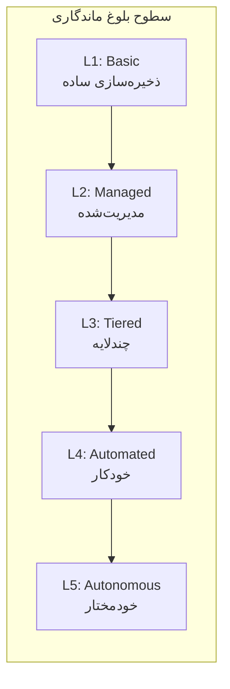

| سطح | نام            | ویژگی‌ها                                                      | وضعیت SMOS     |
| --- | -------------- | ------------------------------------------------------------- | -------------- |
| L1  | **Basic**      | ذخیره‌سازی تمام داده در یک Backend, بدون Tier, بدون Retention | —              |
| L2  | **Managed**    | Retention Policy, Basic Archival, Backup دستی                 | —              |
| L3  | **Tiered**     | Hot/Warm/Cold, Automated Archive, Basic Monitoring            | جاری (Current) |
| L4  | **Automated**  | Auto-scaling, Auto-purge, Predictive Retention, Health Checks | هدف (Target)   |
| L5  | **Autonomous** | Self-healing, Self-tuning Tiers, Anomaly Detection            | آینده (Future) |

### معیارهای بلوغ

| معیار            | L1  | L2       | L3           | L4           | L5             |
| ---------------- | --- | -------- | ------------ | ------------ | -------------- |
| Tiering          | ✗   | ✗        | ✓            | ✓            | ✓              |
| Retention Policy | ✗   | Manual   | Automated    | Predictive   | Self-tuning    |
| Archival         | ✗   | Manual   | Automated    | Scheduled    | Adaptive       |
| Purge            | ✗   | Manual   | Automated    | Verified     | Autonomous     |
| Encryption       | ✗   | Partial  | Full         | E2E          | Zero Trust     |
| Monitoring       | ✗   | Basic    | Structured   | Predictive   | Self-healing   |
| Multi-Tenancy    | ✗   | Basic    | Column-Level | Schema-Level | Database-Level |
| Scalability      | ✗   | Vertical | Horizontal   | Auto-scaling | Elastic        |
| Backup           | ✗   | Manual   | Scheduled    | Continuous   | Self-healing   |
| Recovery         | ✗   | Manual   | Semi-auto    | Automated    | Autonomous     |

---

## ۲۷. تصمیمات معماری (Architectural Decisions)

### AD-PERS-001: Storage Abstraction Layer

| فیلد         | مقدار                                                                                             |
| ------------ | ------------------------------------------------------------------------------------------------- |
| **شناسه**    | AD-PERS-001                                                                                       |
| **عنوان**    | Storage Abstraction Layer for Backend Independence                                                |
| **زمینه**    | آیا Persistence Layer باید مستقیماً به Backend خاصی متصل شود یا از Abstraction Layer استفاده کند؟ |
| **گزینه‌ها** | ۱. Direct Backend Access — ۲. Abstraction Layer with Adapters                                     |
| **تصمیم**    | گزینه ۲ — Abstraction Layer با Adapter معماری                                                     |
| **دلیل**     | قابلیت تعویض Backend بدون تغییر منطق, تست‌پذیری,vendor independence                               |
| **پیامد**    | سربار جزئی در Latency اما انعطاف‌پذیری بالا                                                       |
| **ارجاع**    | بخش ۱۱ — Storage Backend Abstraction                                                              |

### AD-PERS-002: Append-Only Event Store

| فیلد         | مقدار                                                              |
| ------------ | ------------------------------------------------------------------ |
| **شناسه**    | AD-PERS-002                                                        |
| **عنوان**    | Append-Only Immutable Event Store                                  |
| **زمینه**    | آیا Event Store باید اجازه Update/Delete بدهد یا Append-Only باشد؟ |
| **گزینه‌ها** | ۱. Mutable Event Store — ۲. Append-Only Immutable                  |
| **تصمیم**    | گزینه ۲ — Append-Only با Immutability                              |
| **دلیل**     | یکپارچگی Event Sourcing, Audit Trail, Replayability                |
| **پیامد**    | نیاز به Compaction برای مدیریت حجم                                 |
| **ارجاع**    | بخش ۸ — Event Store Schema                                         |

### AD-PERS-003: Time-Based Partitioning

| فیلد         | مقدار                                                     |
| ------------ | --------------------------------------------------------- |
| **شناسه**    | AD-PERS-003                                               |
| **عنوان**    | Time-Based + Tenant Partitioning                          |
| **زمینه**    | استراتژی پارتیشن‌بندی برای مقیاس‌پذیری                    |
| **گزینه‌ها** | ۱. Hash-Based — ۲. Time-Based — ۳. Hybrid (Time + Tenant) |
| **تصمیم**    | گزینه ۳ — Hybrid Partitioning                             |
| **دلیل**     | Query بر اساس زمان متداول‌ترین الگو + ایزولاسیون Tenant   |
| **پیامد**    | پیچیدگی در Rebalancing پارتیشن‌ها                         |
| **ارجاع**    | بخش ۲۲ — Scaling & Multi-Tenancy                          |

### AD-PERS-004: Soft Delete Before Hard Purge

| فیلد         | مقدار                                               |
| ------------ | --------------------------------------------------- |
| **شناسه**    | AD-PERS-004                                         |
| **عنوان**    | Two-Phase Delete (Soft + Hard)                      |
| **زمینه**    | آیا حذف داده باید یک مرحله‌ای باشد یا دو مرحله‌ای؟  |
| **گزینه‌ها** | ۱. Direct Hard Delete — ۲. Soft Delete → Hard Purge |
| **تصمیم**    | گزینه ۲ — Two-Phase با Recovery Window ۷ روزه       |
| **دلیل**     | جلوگیری از حذف اشتباهی, قابلیت بازیابی              |
| **پیامد**    | نیاز به Purge Scheduler برای Hard Delete            |
| **ارجاع**    | بخش ۱۵ — Data Purge Model                           |

### AD-PERS-005: Strong Consistency for State, Eventual for History

| فیلد         | مقدار                                                                  |
| ------------ | ---------------------------------------------------------------------- |
| **شناسه**    | AD-PERS-005                                                            |
| **عنوان**    | Hybrid Consistency Model                                               |
| **زمینه**    | آیا همه داده‌ها باید Strong Consistency داشته باشند؟                   |
| **گزینه‌ها** | ۱. All Strong — ۲. All Eventual — ۳. Hybrid                            |
| **تصمیم**    | گزینه ۳ — Strong برای State/Context/Event, Eventual برای History/Audit |
| **دلیل**     | State نیاز به Consistency دارد, History تحمل Eventual را دارد          |
| **پیامد**    | پیچیدگی در لایه Consistency Management                                 |
| **ارجاع**    | بخش ۱۱ — Storage Backend Abstraction                                   |

### AD-PERS-006: Legal Hold Before Purge

| فیلد      | مقدار                                                   |
| --------- | ------------------------------------------------------- |
| **شناسه** | AD-PERS-006                                             |
| **عنوان** | Mandatory Legal Hold Check Before Purge                 |
| **زمینه** | آیا Purge باید Legal Hold Check کند؟                    |
| **تصمیم** | Legal Hold Check اجباری برای همه Purgeها                |
| **دلیل**  | انطباق قانونی, جلوگیری از حذف داده‌های تحت تعقیب قانونی |
| **پیامد** | قفل ماندن داده‌های دارای Legal Hold تا رفع              |
| **ارجاع** | بخش ۱۵ — Data Purge Model                               |

---

## ۲۸. ماتریس ارجاع متقابل (Cross-Reference Matrix)

### نگاشت SMOS-711 ↔ اسناد معماری

| سند معماری                                                           | بخش‌های مرتبط                                             | نوع رابطه         |
| -------------------------------------------------------------------- | --------------------------------------------------------- | ----------------- |
| [SMOS-701](../75-EXECUTION/01-enterprise-execution-architecture.md)  | ۵ (Execution State), ۹ (History), ۱۷ (Workflow)           | تعریف و مصرف      |
| [SMOS-702](../75-EXECUTION/02-execution-state-machine.md)            | ۵ (State Machine Mapping), ۱۶ (Persistence State Machine) | تکمیل             |
| [SMOS-703](../75-EXECUTION/03-execution-context-model.md)            | ۷ (Context Persistence), ۱۲ (Query), ۱۸ (Recovery)        | ماندگاری بافت     |
| [SMOS-704](../75-EXECUTION/04-workflow-orchestration.md)             | ۶ (Workflow State), ۱۷ (Workflow Persistence)             | ماندگاری Workflow |
| [SMOS-705](../75-EXECUTION/05-enterprise-event-architecture.md)      | ۸ (Event Store), ۱۲ (Event Query), ۲۴ (Replay)            | ذخیره‌سازی رویداد |
| [SMOS-706](../75-EXECUTION/06-execution-monitoring-architecture.md)  | ۲۰ (Metrics), ۲۳ (Health Check)                           | نظارت             |
| [SMOS-707](../75-EXECUTION/07-enterprise-runtime-security.md)        | ۲۱ (Security)                                             | امنیت             |
| [SMOS-708](../75-EXECUTION/08-smos-master-runtime-blueprint.md)      | ۴ (Architecture), ۱۱ (Abstraction)                        | یکپارچگی          |
| [KNW-000](../70-KNOWLEDGE/00-enterprise-knowledge-architecture.md)   | ۲۱ (Encryption), ۲۲ (Multi-Tenancy)                       | معماری دانش       |
| [AI-000](../40-AI-AGENTS/00-enterprise-ai-agent-architecture.md)     | ۷ (Context), ۲۱ (Agent Access Control)                    | معماری Agent      |
| [AUT-000](../50-AUTOMATION/00-enterprise-automation-architecture.md) | ۶ (Workflow State), ۱۷ (Workflow Recovery)                | معماری Automation |
| [PRM-000](../60-PROMPTS/00-enterprise-prompt-architecture.md)        | ۱۷ (Prompt Context Persistence)                           | معماری پرامپت     |
| [DEPLOY-001](../15-DEPLOY/00-deployment-strategy.md)                 | ۲۵ (Config Examples), ۲۲ (Scaling)                        | استقرار           |

### نگاشت مدل‌های داده ↔ Backend

| Data Model       | Schema ID                   | Backend                  | Tier Default |
| ---------------- | --------------------------- | ------------------------ | ------------ |
| ExecutionState   | `execution-state-v1.json`   | PostgreSQL               | Hot          |
| WorkflowState    | `workflow-state-v1.json`    | PostgreSQL               | Hot          |
| PersistedContext | `context-v1.json`           | Redis/PostgreSQL         | Hot          |
| PersistedEvent   | `event-v1.json`             | Kafka/Pulsar             | Hot          |
| ExecutionHistory | `execution-history-v1.json` | TimeScaleDB              | Warm         |
| AuditRecord      | `audit-v1.json`             | PostgreSQL (append-only) | Hot          |
| ArchiveBatch     | `archive-batch-v1.json`     | S3                       | Cold         |
| PurgeBatch       | `purge-batch-v1.json`       | PostgreSQL               | Hot          |

---

## ۲۹. شکاف‌ها و کارهای آینده (Gaps & Future Work)

### ۲۹.۱ شکاف‌های شناسایی‌شده

| #       | شکاف                                         | تأثیر                                     | اولویت | راهکار پیشنهادی                         |
| ------- | -------------------------------------------- | ----------------------------------------- | ------ | --------------------------------------- |
| GAP-001 | فقدان Snapshot خودکار برای Context Recovery  | بازیابی دستی Context پس از Crash          | بالا   | Periodic Context Snapshotter            |
| GAP-002 | نبود Data Compaction خودکار برای Event Store | رشد بی‌رویه Event Store                   | بالا   | Automated Compaction با retention-aware |
| GAP-003 | فقدان Cross-Region Replication               | عدم Disaster Recovery بین Region          | بالا   | Active-Passive Replication (DEPLOY-001) |
| GAP-004 | نبود Schema Evolution خودکار                 | شکست Deserialize پس از تغییر Schema       | متوسط  | Schema Registry با Compatibility Check  |
| GAP-005 | فقدان Backup Verification خودکار             | Backup خراب ولی نامشخص                    | متوسط  | Automated Backup Restore Test           |
| GAP-006 | نبود Performance Benchmarking                | عدم visibility در performance degradation | متوسط  | Benchmark Suite در CI/CD                |
| GAP-007 | فقدان Tenant Migration Tool                  | جابجایی Tenant بین Backendها پیچیده       | کم     | Tenant Migration Workflow               |
| GAP-008 | نبود Data Lineage Tracking                   | عدم ردیابی مبدأ داده‌ها                   | کم     | Data Lineage Graph Integration          |

### ۲۹.۲ نقشه راه آینده

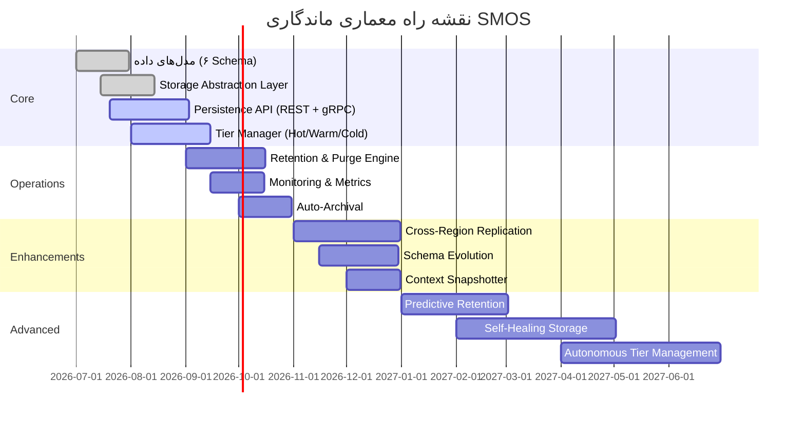

---

## ۳۰. واژه‌نامه (Glossary)

| اصطلاح                     | تعریف                                                   |
| -------------------------- | ------------------------------------------------------- |
| **ماندگاری (Persistence)** | فرآیند ذخیره‌سازی و بازیابی داده‌های زمان اجرا          |
| **Tier**                   | سطح ذخیره‌سازی با عملکرد و هزینه متفاوت (Hot/Warm/Cold) |
| **Retention Policy**       | سیاست تعیین‌کننده مدت زمان نگهداری داده                 |
| **Purge**                  | حذف قطعی داده‌های منقضی                                 |
| **Archive**                | انتقال داده به Tier پایین‌تر برای ذخیره‌سازی بلندمدت    |
| **Legal Hold**             | نگهداری اجباری داده به دلیل الزام قانونی                |
| **Checksum**               | هش رمزنگاری برای تأیید یکپارچگی داده                    |
| **TTL**                    | Time To Live — زمان انقضای داده                         |
| **Soft Delete**            | علامت‌گذاری داده به عنوان حذف‌شده بدون حذف فیزیکی       |
| **Hard Delete**            | حذف فیزیکی داده از ذخیره‌سازی                           |
| **Storage Abstraction**    | لایه انتزاع برای یکسان‌سازی دسترسی به Backendهای مختلف  |
| **Event Replay**           | بازپخش رویدادها برای بازیابی وضعیت یا Debug             |
| **Snapshot**               | تصویر لحظه‌ای از وضعیت یک بافت یا اجرا                  |
| **Compaction**             | فشرده‌سازی رویدادها با حذف نسخه‌های قدیمی               |
| **Circuit Breaker**        | الگوی قطع خودکار برای جلوگیری از سرایت خطا              |

---

## ۳۱. آمار سند (Statistics)

| شاخص                    | مقدار                                                                              |
| ----------------------- | ---------------------------------------------------------------------------------- |
| تعداد مدل‌های داده      | ۶ (PSD-01 تا PSD-06)                                                               |
| تعداد JSON Schema       | ۱۰ (۶ Data Model + ۴ Config/Supporting)                                            |
| تعداد Mermaid Diagram   | ۱۰ (Architecture, Sequence ×۳, State Machine ×۲, Tier, Scaling, Maturity, Roadmap) |
| تعداد Query تعریف‌شده   | ۲۰ (Q-01 تا Q-20)                                                                  |
| تعداد سناریوهای خطا     | ۱۲ (F-01 تا F-12)                                                                  |
| تعداد Recovery Strategy | ۱۲                                                                                 |
| تعداد Metric            | ۱۷                                                                                 |
| تعداد API Endpoint      | ۳۵                                                                                 |
| تعداد gRPC Method       | ۲۲                                                                                 |
| تعداد تصمیمات معماری    | ۶ (AD-PERS-001 تا AD-PERS-006)                                                     |
| تعداد Gap               | ۸ (GAP-001 تا GAP-008)                                                             |
| تعداد اصول معماری       | ۱۲ (PERP-01 تا PERP-12)                                                            |
| تعداد Retention Policy  | ۱۲ (RET-001 تا RET-012)                                                            |
| نقشه راه                | ۱۲ آیتم در ۴ فاز                                                                   |

---

## ۳۲. تاریخچه نسخه (Version History)

| نسخه         | تاریخ      | تغییرات                                                                                                                                                                                |
| ------------ | ---------- | -------------------------------------------------------------------------------------------------------------------------------------------------------------------------------------- |
| v1.0.0-draft | ۱۴۰۵/۰۴/۱۱ | ایجاد اولیه — ۳۲ بخش, ۶ مدل داده, ۱۰ JSON Schema, ۱۰ Mermaid Diagram, ۲۰ Query, ۱۲ سناریوی خطا, ۱۲ Recovery Strategy, ۳۵ API Endpoint, ۲۲ gRPC Method, ۶ Architectural Decision, ۸ Gap |

---

**پایان سند SMOS-711 — Execution Persistence Architecture (PERS-000)**  
**نسخه v1.0.0-draft — خانواده 75-EXECUTION**
