# SMOS-712 — Distributed Execution Architecture

## معماری اجرای توزیع‌شده SMOS

**شناسه:** SMOS-712  
**وضعیت:** پیش‌نویس (Draft)  
**نسخه:** v1.0.0-draft  
**خانواده:** 75-EXECUTION — معماری اجرا  
**فاز:** P7.S02 — Runtime Quality & Resilience  
**دامنه:** Distributed Execution, Coordination, Consistency  
**اختیار:** A-4 (سطح سازمانی)  
**نویسنده:** معماری SMOS  
**تاریخ:** ۱۴۰۵/۰۴/۱۱  
**SSOT:** ✅ بله — تک منبع حقیقت اجرای توزیع‌شده SMOS  
**مخاطب:** system-architect, infrastructure-engineer, devops-engineer, ai-architect, security-engineer  
**مرجع:** SMOS-701, SMOS-702, SMOS-703, SMOS-704, SMOS-705, SMOS-706, SMOS-707, SMOS-708, SMOS-709, SMOS-710, SMOS-711

---

## ۱. Document Control

| Field             | Value                                 |
| ----------------- | ------------------------------------- |
| **Document ID**   | SMOS-712                              |
| **Document Name** | Distributed Execution Architecture    |
| **Phase**         | P7.S02 — Runtime Quality & Resilience |
| **Version**       | v1.0.0-draft                          |
| **Status**        | Draft                                 |
| **Authority**     | AI-014 (Enterprise AI Orchestrator)   |
| **Domain**        | Execution Infrastructure              |
| **Layer**         | LYR-02 (Tactical — Infrastructure)    |
| **Supersedes**    | —                                     |
| **Next Review**   | P7.S04                                |

**Keywords:** distributed execution, lock manager, consensus, leader election, node discovery, partition tolerance, split-brain, snapshot, execution history, coordination, quorum, gossip protocol

---

## ۲. Purpose & Scope

### ۲.۱ Purpose

هدف این سند، تعریف کامل **معماری اجرای توزیع‌شده** SMOS است. با رشد سیستم به بیش از یک Runtime و چندین Agent همزمان، نیاز به مدل اجرای توزیع‌شده با قابلیت‌های هماهنگی (Coordination)، قفل‌گذاری (Locking)، سازگاری (Consistency) و بازیابی (Recovery) ضروری است.

SMOS-712 معماری‌ای را تعریف می‌کند که:

- اجرای Workflowها و Agentها را در **چندین Node** توزیع می‌کند
- **سازگاری نهایی (Eventual Consistency)** را با تضمین‌های مشخص تضمین می‌کند
- از **Split-Brain** و **Network Partition** جلوگیری می‌کند
- **قفل‌گذاری توزیع‌شده** برای منابع بحرانی فراهم می‌کند
- **Snapshot** و **Execution History** را برای بازیابی و ممیزی ذخیره می‌کند
- **عضویت و کشف Node** را به صورت پویا مدیریت می‌کند

### ۲.۲ Inside Scope

| حوزه                             | توضیح                                                 |
| -------------------------------- | ----------------------------------------------------- |
| Distributed Lock Manager         | انواع قفل، نحوه اخذ، رهاسازی، Timeout، تشخیص Deadlock |
| Execution History Service        | ثبت، پرس‌وجو و بازپخش تاریخچه اجرا                    |
| Runtime Snapshot Engine          | ضبط، ذخیره و بازیابی وضعیت Runtime                    |
| Distributed Coordination         | Consensus، Quorum، Gossip Protocol                    |
| Node Discovery & Membership      | کشف پویا و مدیریت عضویت Node                          |
| Leader Election                  | الگوریتم انتخاب Leader برای هر Partition              |
| Partition Tolerance              | تحمل پارتیشن‌بندی شبکه، Split-Brain                   |
| State Synchronization            | همگام‌سازی وضعیت بین Nodeها                           |
| Conflict Resolution              | حل تعارض در وضعیت‌های همزمان                          |
| Distributed State Machine        | ماشین حالت توزیع‌شده                                  |
| Failure Scenarios                | پارتیشن شبکه، خرابی Node، Split-Brain                 |
| Recovery Strategies              | بازیابی خودکار و دستی                                 |
| Distributed Monitoring & Metrics | نظارت بر سلامت توزیع‌شده                              |
| Distributed Security             | امنیت در معماری توزیع‌شده                             |
| Scaling & Multi-Tenancy          | مقیاس‌پذیری و چندمستاجری                              |
| API Contracts                    | قراردادهای سرویس                                      |

### ۲.۳ Outside Scope

- پیاده‌سازی کد (Implementation)
- جزئیات زیرساخت شبکه فیزیکی
- کتابخانه‌های خارجی (etcd, Consul, ZooKeeper)
- بارگذاری اولیه سیستم (Initial Bootstrap)

---

## ۳. Distributed Architecture Overview

### ۳.۱ معماری کلی

SMOS از یک **معماری توزیع‌شده همتا-همتا با رهبر (Leader-Based Peer-to-Peer)** استفاده می‌کند. هر Cluster از سه نقش Node تشکیل شده است:

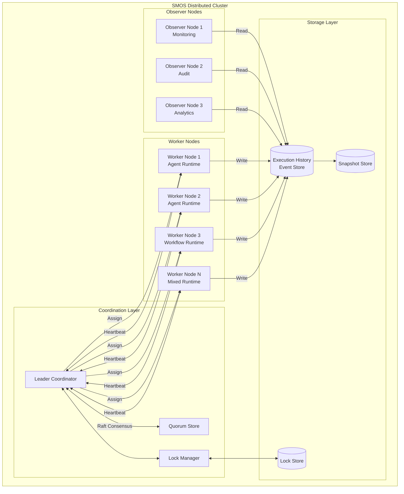

### ۳.۲ Cluster Topology

| ویژگی                          | مقدار                     |
| ------------------------------ | ------------------------- |
| **حداقل Node برای Quorum**     | ۳ (برای تحمل ۱ خرابی)     |
| **حداقل Node برای Production** | ۵ (برای تحمل ۲ خرابی)     |
| **حداکثر Node در یک Cluster**  | ۶۴                        |
| **نوع Consensus**              | Raft-inspired             |
| **انتقال رهبر**                | < ۵ ثانیه                 |
| **Heartbeat Interval**         | ۱ ثانیه                   |
| **Snapshot Interval**          | ۵ دقیقه یا هر ۱۰۰۰ رویداد |

---

## ۴. Distributed Execution Principles

| #      | اصل                               | توضیح                                                                    |
| ------ | --------------------------------- | ------------------------------------------------------------------------ |
| DEX-01 | **Consistency over Availability** | در تعارض بین سازگاری و دسترس‌پذیری، سازگاری اولویت دارد                  |
| DEX-02 | **Leader-Based Consensus**        | تمام تصمیمات بحرانی از طریق رهبر و Quorum انجام می‌شود                   |
| DEX-03 | **At-Least-Once Delivery**        | رویدادهای اجرا با تضمین at-least-once تحویل می‌شوند                      |
| DEX-04 | **Idempotent Operations**         | تمام عملیات توزیع‌شده باید Idempotent باشند                              |
| DEX-05 | **Fencing Tokens**                | هر عملیات توزیع‌شده دارای Fencing Token برای جلوگیری از اجرای تکراری است |
| DEX-06 | **Graceful Degradation**          | در صورت پارتیشن، سیستم با قابلیت کاهش‌یافته به کار ادامه می‌دهد          |
| DEX-07 | **Observability by Default**      | تمام عملیات توزیع‌شده قابل مشاهده، ردیابی و ممیزی هستند                  |
| DEX-08 | **Self-Healing**                  | سیستم به طور خودکار خرابی‌ها را شناسایی و بازیابی می‌کند                 |

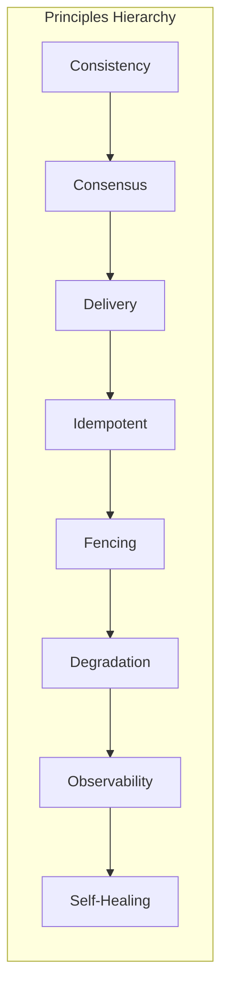

---

## ۵. Node Architecture

### ۵.۱ Node Roles

SMOS سه نقش اصلی برای Nodeها در معماری توزیع‌شده تعریف می‌کند:

| Role            | ID         | مسئولیت‌ها                                              | تعداد در Cluster     |
| --------------- | ---------- | ------------------------------------------------------- | -------------------- |
| **Coordinator** | NODE-COORD | رهبری Cluster، توزیع Task، مدیریت Quorum، انتخاب Leader | ۱ فعال + N آماده‌باش |
| **Worker**      | NODE-WORK  | اجرای Runtimeها، اجرای Agentها، اجرای Workflowها        | ۳ تا ۶۴              |
| **Observer**    | NODE-OBS   | نظارت، ممیزی، Analytics، ذخیره‌سازی Log                 | ۱ تا ۱۰              |

### ۵.۲ Coordinator Node

Node رهبر که وظایف زیر را بر عهده دارد:

- **Leader Election**: اجرای الگوریتم انتخاب رهبر
- **Task Distribution**: توزیع Task بین Workerها
- **Quorum Management**: نگهداری و مدیریت Quorum
- **Heartbeat Monitoring**: نظارت بر سلامت Workerها
- **Lock Management**: مدیریت قفل‌های توزیع‌شده
- **State Reconciliation**: تطبیق وضعیت بین Nodeها

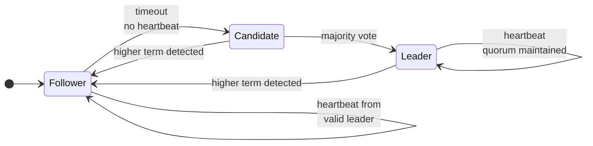

### ۵.۳ Worker Node

Node اجرایی که Runtimeها را اجرا می‌کند:

- یک یا چند Runtime از SMOS-701 (§۴) را میزبانی می‌کند
- Heartbeat به Coordinator ارسال می‌کند
- Taskها را از Coordinator دریافت و اجرا می‌کند
- Execution History را به Event Store می‌نویسد
- قفل‌ها را از Lock Manager درخواست می‌کند

### ۵.۴ Observer Node

Node نظارتی که به صورت Read-Only عمل می‌کند:

- Execution History را برای گزارش‌گیری می‌خواند
- Metrics جمع‌آوری می‌کند (SMOS-706)
- Alertها را پردازش می‌کند
- Audit Trail را ذخیره می‌کند
- Dashboardها را به‌روز می‌کند

### ۵.۵ Node Capability Matrix

| قابلیت                   | Coordinator | Worker       | Observer     |
| ------------------------ | ----------- | ------------ | ------------ |
| اجرای Task               | ❌          | ✅           | ❌           |
| رأی‌دهی Consensus        | ✅          | ❌           | ❌           |
| خواندن Execution History | ✅          | ✅           | ✅           |
| نوشتن Execution History  | ❌          | ✅           | ❌           |
| مدیریت قفل               | ✅          | ❌           | ❌           |
| ضبط Snapshot             | ❌          | ✅           | ❌           |
| Heartbeat                | ✅ (گیرنده) | ✅ (فرستنده) | ✅ (فرستنده) |

---

## ۶. Distributed Lock Manager

### ۶.۱ معرفی

Lock Manager توزیع‌شده (DLM) مسئول هماهنگی دسترسی به منابع مشترک در Cluster است. تمام Runtimeها و Agentها برای دسترسی به منابع بحرانی باید از DLM قفل دریافت کنند.

### ۶.۲ Lock Types

| Type            | ID       | Scope       | Duration | توضیح                                 |
| --------------- | -------- | ----------- | -------- | ------------------------------------- |
| **Exclusive**   | LOCK-EXT | Global      | Variable | دسترسی انحصاری — یک Node در یک زمان   |
| **Shared**      | LOCK-SHR | Global      | Variable | دسترسی اشتراکی — چند Node برای خواندن |
| **Read**        | LOCK-RD  | Resource    | Variable | فقط خواندن یک منبع                    |
| **Write**       | LOCK-WR  | Resource    | Variable | نوشتن یک منبع — انحصاری               |
| **Session**     | LOCK-SSN | Session     | Lifetime | قفل سطح Session برای تمام عملیات      |
| **Transaction** | LOCK-TXN | Transaction | Atomic   | قفل تراکنشی — تا commit یا rollback   |
| **Namespace**   | LOCK-NS  | Namespace   | Variable | قفل فضای نام برای عملیات دسته‌جمعی    |

### ۶.۳ Lock Acquisition

فرآیند اخذ قفل:

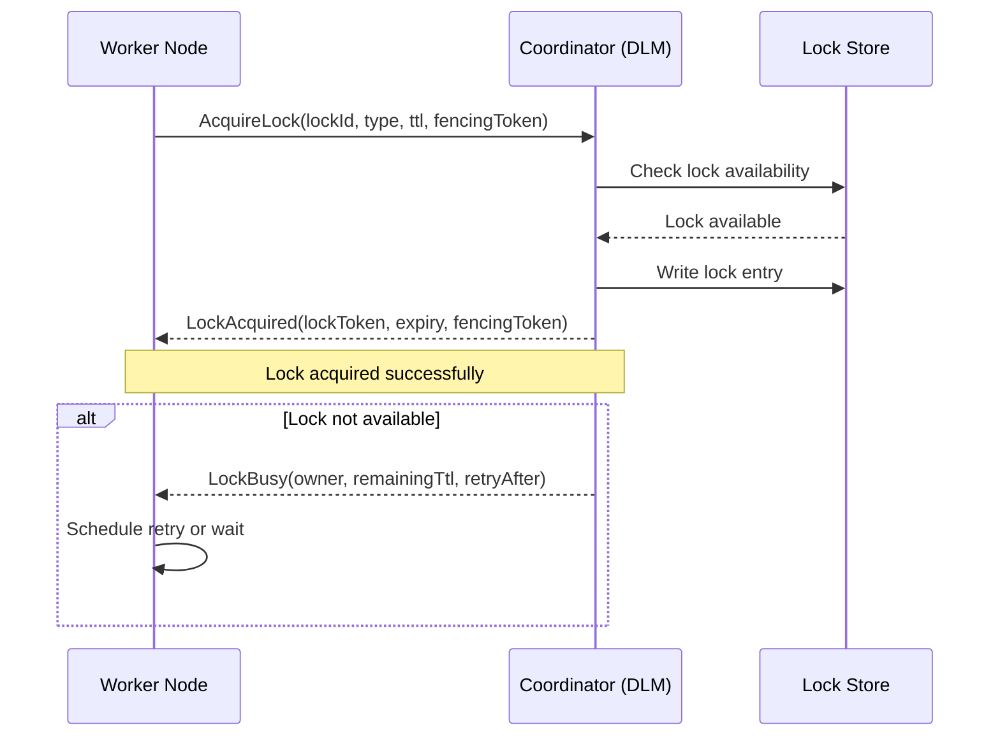

### ۶.۴ Lock Release

| روش                  | توضیح                                                            |
| -------------------- | ---------------------------------------------------------------- |
| **Explicit Release** | Worker با ReleaseLock صریح قفل را آزاد می‌کند                    |
| **TTL Expiry**       | قفل پس از انقضای TTL خودکار آزاد می‌شود                          |
| **Heartbeat Loss**   | در صورت قطع Heartbeat Worker، قفل پس از Grace Period آزاد می‌شود |
| **Session End**      | قفل‌های Session با پایان Session آزاد می‌شوند                    |
| **Force Release**    | Coordinator در شرایط Recovery قفل را به اجبار آزاد می‌کند        |

### ۶.۵ Timeout Configuration

| پارامتر               | پیش‌فرض | حداقل | حداکثر |
| --------------------- | ------- | ----- | ------ |
| `lock_ttl`            | ۳۰s     | ۵s    | ۳۰۰s   |
| `lock_retry_interval` | ۱s      | ۱۰۰ms | ۱۰s    |
| `lock_retry_max`      | ۵       | ۱     | ۱۰۰    |
| `heartbeat_grace`     | ۱۰s     | ۳s    | ۶۰s    |
| `lease_duration`      | ۶۰s     | ۱۰s   | ۶۰۰s   |

### ۶.۶ Deadlock Detection

DLM از **Wait-For Graph (WFG)** برای تشخیص Deadlock استفاده می‌کند:

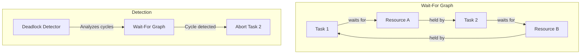

الگوریتم:

1. هر Worker لیست قفل‌های در انتظار خود را به Coordinator گزارش می‌دهد
2. Coordinator WFG جهانی را می‌سازد
3. هر T ثانیه (پیش‌فرض: ۵s) WFG برای چرخه (Cycle) اسکن می‌شود
4. در صورت تشخیص چرخه، قفل با کمترین اولویت آزاد می‌شود (Victim Selection)
5. Task Victim Rollback و بعداً Retry می‌شود

### ۶.۷ Fencing Token

برای جلوگیری از **Split-Brain** در سطح Lock، هر Lock دارای Fencing Token است:

```json
{
  "fencingToken": {
    "term": 7,
    "nodeId": "node-03",
    "sequence": 1042,
    "timestamp": "2026-07-01T10:30:00.000Z"
  }
}
```

Fencing Token به صورت Strictly Monotonic افزایش می‌یابد. هر عملیات با Fencing Token قدیمی‌تر رد می‌شود.

### ۶.۸ Lock Data Model

```json
{
  "$schema": "https://json-schema.org/draft-07/schema#",
  "$id": "smos://schemas/distributed/lock.json",
  "title": "Distributed Lock",
  "type": "object",
  "required": ["lockId", "type", "owner", "token", "ttl", "createdAt"],
  "properties": {
    "lockId": {
      "type": "string",
      "pattern": "^lock:[a-zA-Z0-9_\\-./]+$",
      "description": "شناسه یکتای قفل در سراسر Cluster"
    },
    "type": {
      "type": "string",
      "enum": ["exclusive", "shared", "read", "write", "session", "transaction", "namespace"],
      "description": "نوع قفل"
    },
    "owner": {
      "type": "string",
      "description": "شناسه Node یا Task مالک قفل"
    },
    "token": {
      "type": "string",
      "description": "Token یکتای قفل برای Release"
    },
    "fencing": {
      "type": "object",
      "properties": {
        "term": { "type": "integer" },
        "nodeId": { "type": "string" },
        "sequence": { "type": "integer" },
        "timestamp": { "type": "string", "format": "date-time" }
      }
    },
    "ttl": {
      "type": "integer",
      "minimum": 5,
      "maximum": 300,
      "description": "Time-to-Live بر حسب ثانیه"
    },
    "resource": {
      "type": "string",
      "description": "شناسه منبع تحت قفل"
    },
    "createdAt": {
      "type": "string",
      "format": "date-time"
    },
    "expiresAt": {
      "type": "string",
      "format": "date-time"
    }
  }
}
```

---

## ۷. Distributed Coordination Model

### ۷.۱ Consensus Protocol

SMOS از یک **Raft-inspired Consensus Protocol** برای توافق بر سر وضعیت Cluster استفاده می‌کند:

| ویژگی                         | مقدار                                |
| ----------------------------- | ------------------------------------ |
| **Protocol**                  | Raft-inspired (سازگار با Raft §۵-§۸) |
| **Election Timeout**          | ۱۵۰–۳۰۰ms (randomized)               |
| **Heartbeat Interval**        | ۵۰ms                                 |
| **Max Log Entries per Batch** | ۱۰۰                                  |
| **Commit Strategy**           | Leader → Majority → Commit           |
| **Read Consistency**          | Read from Leader + Index Check       |

### ۷.۲ Quorum

| Cluster Size | Majority (Quorum) | Tolerated Failures |
| ------------ | ----------------- | ------------------ |
| ۱            | ۱                 | ۰                  |
| ۳            | ۲                 | ۱                  |
| ۵            | ۳                 | ۲                  |
| ۷            | ۴                 | ۳                  |
| N            | floor(N/2) + 1    | floor((N-1)/2)     |

### ۷.۳ Coordination Operations

| Operation                | Quorum Required | توضیح                           |
| ------------------------ | --------------- | ------------------------------- |
| **Leader Election**      | Majority        | انتخاب رهبر جدید                |
| **Log Entry Append**     | Majority        | ثبت ورودی جدید در Consensus Log |
| **Lock Acquisition**     | Majority        | اخذ قفل توزیع‌شده               |
| **State Change**         | Majority        | تغییر وضعیت Cluster             |
| **Read (Safe)**          | Majority        | خواندن با تضمین Consistency     |
| **Read (Stale)**         | Single Node     | خواندن بدون ضمانت Consistency   |
| **Configuration Change** | Majority + 1    | تغییر پیکربندی Cluster          |

### ۷.۴ Gossip Protocol

برای انتشار اطلاعات غیر بحرانی (مانند Metrics، Membership Metadata) از Gossip Protocol استفاده می‌شود:

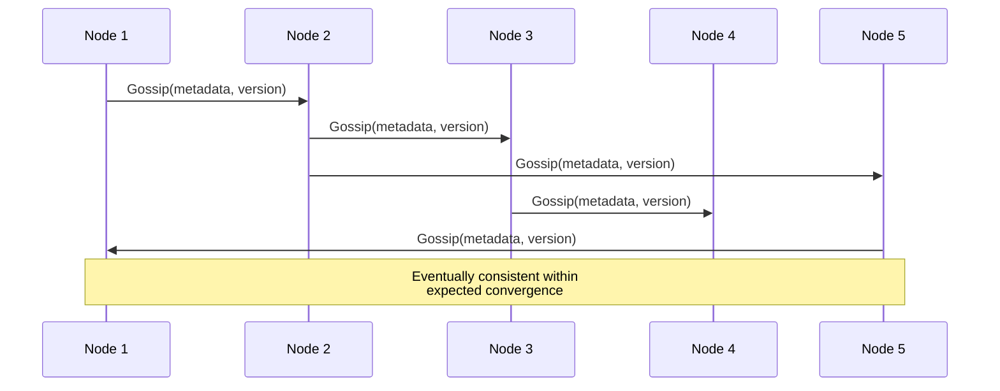

پارامترهای Gossip:

| پارامتر               | مقدار پیش‌فرض | توضیح                                         |
| --------------------- | ------------- | --------------------------------------------- |
| `gossip_interval`     | ۵۰۰ms         | فاصله بین Gossip Rounds                       |
| `gossip_fanout`       | ۳             | تعداد Nodeهای هدف در هر Round                 |
| `gossip_max_nodes`    | ۶۴            | حداکثر Node در یک Gossip Pool                 |
| `convergence_timeout` | ۱۰s           | حداکثر زمان همگرایی                           |
| `suspicion_timeout`   | ۱۵s           | زمان قبل از علامت‌گذاری Node به عنوان Suspect |

---

## ۸. Leader Election Algorithm

### ۸.۱ الگوریتم

SMOS از **Raft Leader Election** با تغییرات زیر استفاده می‌کند:

1. هر Node Coordinator در یکی از حالت‌های **Follower**, **Candidate**, **Leader** است
2. Followerها پس از Election Timeout (۱۵۰–۳۰۰ms تصادفی) به Candidate تبدیل می‌شوند
3. Candidate به Nodeهای دیگر درخواست رأی (RequestVote RPC) می‌فرستد
4. اگر Candidate رأی اکثریت را کسب کند، Leader می‌شود
5. هر Term فقط یک Leader دارد
6. Leader با Heartbeat مداوم (۵۰ms) اقتدار خود را حفظ می‌کند

### ۸.۲ Leader Election Flow

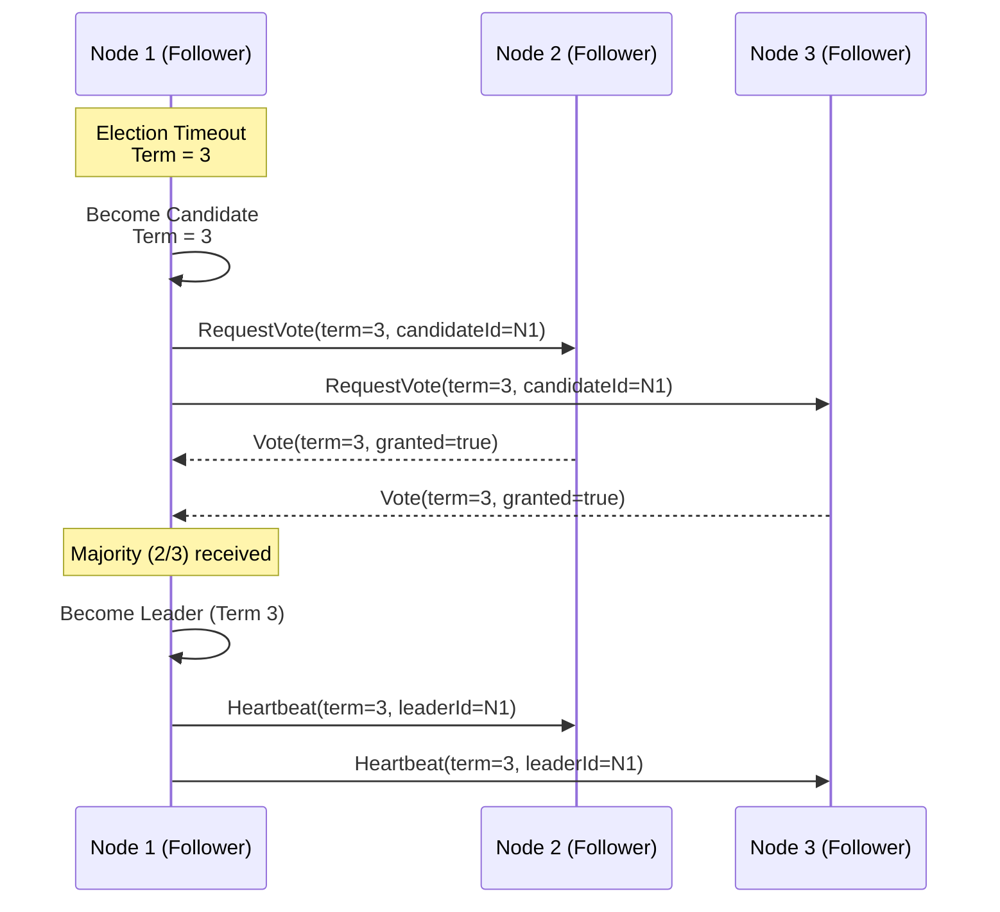

### ۸.۳ Leader Failure Detection

| معیار                 | آستانه     | اقدام                               |
| --------------------- | ---------- | ----------------------------------- |
| Missed Heartbeats     | ۳ (۱۵۰ms)  | شروع Election جدید                  |
| AppendEntries Failure | ۵ متوالی   | تغییر Leader                        |
| Quorum Lost           | < Majority | Demote به Follower                  |
| Network Timeout       | ۵۰۰ms      | علامت‌گذاری Leader به عنوان Suspect |

### ۸.۴ Graceful Leader Transfer

برای تعویض برنامه‌ریزی‌شده Leader (مانند Maintenance):

1. Leader فعلی پیام **LeadershipTransfer** ارسال می‌کند
2. Follower هدف Logها را تا آخرین Entry همگام می‌کند
3. Leader فعلی Step Down می‌کند
4. Follower هدف بلافاصله Election جدید شروع می‌کند
5. به دلیل Log همگام، Follower هدف تقریباً قطعی Leader می‌شود

---

## ۹. Node Discovery & Membership

### ۹.۱ Discovery Mechanism

کشف Nodeها از طریق ترکیبی از **Seed Nodes** و **Gossip Protocol** انجام می‌شود:

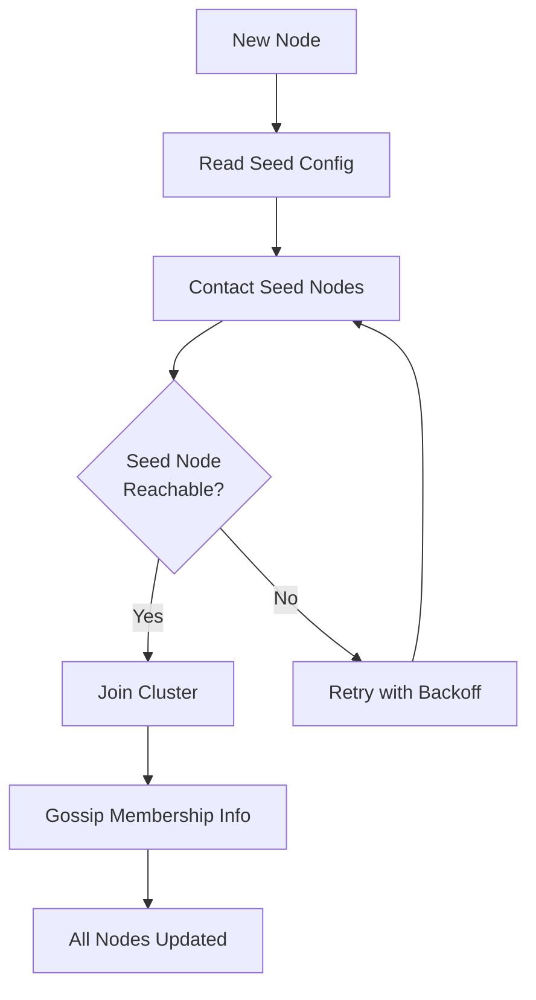

### ۹.۲ Membership State Machine

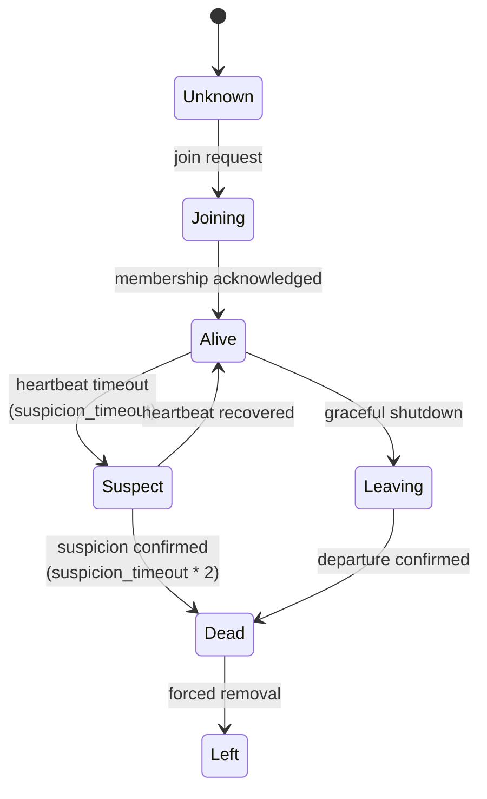

### ۹.۳ Membership Events

| Event          | Description           | Trigger           |
| -------------- | --------------------- | ----------------- |
| `NODE_JOINING` | Node در حال عضویت است | Join Request      |
| `NODE_ALIVE`   | Node فعال شد          | تأیید عضویت       |
| `NODE_SUSPECT` | Node مشکوک به خرابی   | Heartbeat Timeout |
| `NODE_DEAD`    | Node مرده اعلام شد    | تأیید Suspect     |
| `NODE_LEAVING` | Node در حال خروج      | Graceful Shutdown |
| `NODE_LEFT`    | Node خارج شد          | تأیید خروج        |

### ۹.۴ Seed Configuration

```yaml
# seed-config.yaml
cluster:
  name: 'smos-production-01'
  seed_nodes:
    - host: 'coordinator-01.smos.internal'
      port: 8200
    - host: 'coordinator-02.smos.internal'
      port: 8200
    - host: 'coordinator-03.smos.internal'
      port: 8200
  discovery:
    mechanism: 'gossip+seed'
    gossip_port: 8300
    join_timeout: 30s
    max_join_attempts: 10
    retry_backoff_base: 2s
    retry_backoff_max: 60s
```

---

## ۱۰. Partition Tolerance

### ۱۰.۱ استراتژی تحمل پارتیشن

SMOS از **CP System** (Consistency + Partition Tolerance در مثلث CAP) پیروی می‌کند. در صورت پارتیشن شبکه:

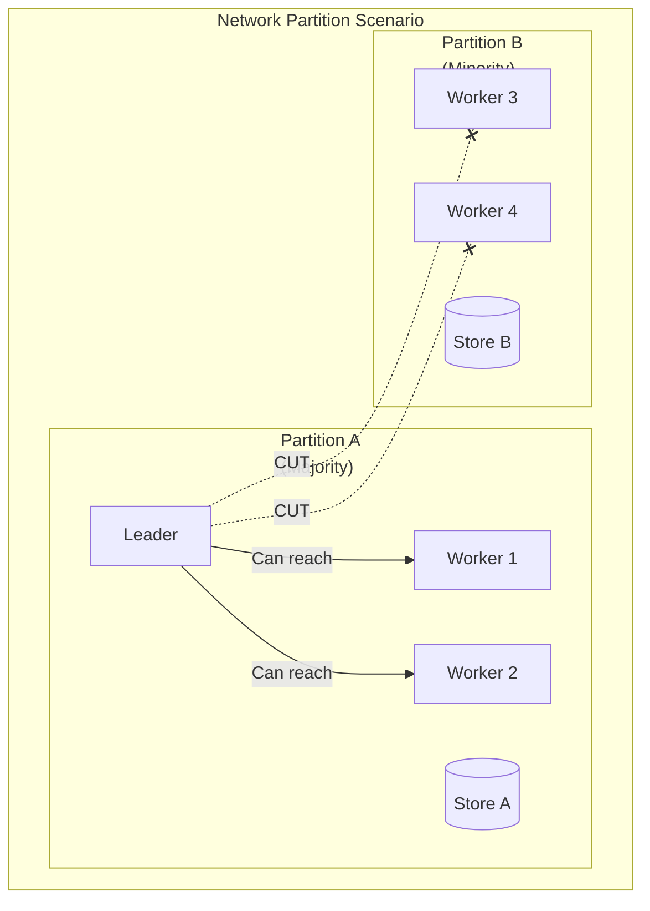

### ۱۰.۲ Partition Detection

| معیار              | آستانه       | تشخیص                |
| ------------------ | ------------ | -------------------- |
| Failed Heartbeats  | > ۵۰٪ Nodeها | پارتیشن احتمالی      |
| Quorum Failure     | ۳ متوالی     | پارتیشن قطعی         |
| Gossip Silence     | > ۳۰s        | پارتیشن یا Node Down |
| Disconnected Peers | > ۲ Node     | پارتیشن محتمل        |

### ۱۰.۳ Partition Behavior

| Partition Side    | Quorum?  | Behavior                                         |
| ----------------- | -------- | ------------------------------------------------ |
| **Majority Side** | ✅ دارد  | به کار عادی ادامه می‌دهد                         |
| **Minority Side** | ❌ ندارد | به حالت Read-Only می‌رود؛ Lock جدید صادر نمی‌کند |
| **Isolated Node** | ❌ ندارد | تمام عملیات را متوقف می‌کند؛ منتظر恢復 می‌ماند   |

### ۱۰.۴ Split-Brain Prevention

برای جلوگیری از Split-Brain:

1. **Fencing Token**: هر Leader دارای Fencing Token منحصربه‌فرد است؛ عملیات Leader قدیمی رد می‌شود
2. **Quorum-Based Writes**: نوشتن فقط با Quorum Majority انجام می‌شود
3. **Lease Mechanism**: Leader پس از ازدست‌دادن Quorum به Follower تنزل می‌کند
4. **Watchdog Timer**: اگر Leader در مدت `lease_duration` Quorum را بازیابی نکند، Step Down می‌کند
5. **Stale Read Detection**: خواندن از Nodeهای Minority با هشدار Staleness همراه است

---

## ۱۱. Execution History Service

### ۱۱.۱ معرفی

Execution History Service تمام رویدادهای اجرا را در طول زمان ثبت می‌کند. این سرویس نقش Event Log و Audit Trail را در معماری توزیع‌شده ایفا می‌کند.

### ۱۱.۲ Data Model

```json
{
  "$schema": "https://json-schema.org/draft-07/schema#",
  "$id": "smos://schemas/distributed/execution-history-entry.json",
  "title": "Execution History Entry",
  "type": "object",
  "required": [
    "entryId",
    "executionId",
    "seq",
    "type",
    "source",
    "state",
    "timestamp",
    "fencingToken"
  ],
  "properties": {
    "entryId": {
      "type": "string",
      "pattern": "^eh:[a-f0-9\\-]{36}:[0-9]+$",
      "description": "شناسه یکتا: eh:<uuid>:<sequence>"
    },
    "executionId": {
      "type": "string",
      "description": "شناسه اجرا (Task, Workflow, Session)"
    },
    "seq": {
      "type": "integer",
      "minimum": 0,
      "description": "شماره ترتیبی در History"
    },
    "type": {
      "type": "string",
      "enum": [
        "state_transition",
        "task_started",
        "task_completed",
        "task_failed",
        "lock_acquired",
        "lock_released",
        "lock_timeout",
        "snapshot_taken",
        "snapshot_restored",
        "node_joined",
        "node_left",
        "node_failed",
        "leader_elected",
        "partition_detected",
        "recovery_initiated"
      ]
    },
    "source": {
      "type": "string",
      "description": "Node ID مبدأ"
    },
    "state": {
      "type": "object",
      "description": "وضعیت لحظه‌ای اجرا (Snapshot of State)",
      "properties": {
        "taskState": { "type": "string" },
        "workflowState": { "type": "string" },
        "runtimeState": { "type": "string" }
      }
    },
    "payload": {
      "type": "object",
      "description": "داده‌های اختصاصی رویداد"
    },
    "timestamp": {
      "type": "string",
      "format": "date-time"
    },
    "fencingToken": {
      "type": "object",
      "properties": {
        "term": { "type": "integer" },
        "nodeId": { "type": "string" },
        "sequence": { "type": "integer" }
      }
    },
    "traceId": {
      "type": "string",
      "description": "شناسه ردیابی توزیع‌شده"
    },
    "spanId": {
      "type": "string",
      "description": "شناسه Span برای Distributed Tracing"
    },
    "parentEntryId": {
      "type": "string",
      "description": "ارجاع به Entry والد (برای رویدادهای تو در تو)"
    }
  }
}
```

### ۱۱.۳ Query Operations

| Query                   | پارامترها                          | توضیح                          |
| ----------------------- | ---------------------------------- | ------------------------------ |
| `GetExecutionHistory`   | executionId, fromSeq, toSeq, limit | دریافت تاریخچه یک اجرا         |
| `GetHistoryByType`      | type, from, to, limit              | دریافت رویدادهای یک نوع خاص    |
| `GetHistoryByNode`      | nodeId, from, to, limit            | دریافت رویدادهای یک Node       |
| `GetHistoryByTimeRange` | from, to, limit                    | دریافت رویدادهای یک بازه زمانی |
| `ReplayExecution`       | executionId                        | بازپخش کامل یک اجرا            |
| `GetLatestSnapshot`     | executionId                        | دریافت آخرین Snapshot یک اجرا  |

### ۱۱.۴ Retention Policy

| Tier        | Retention | Storage                   | Query Performance |
| ----------- | --------- | ------------------------- | ----------------- |
| **Hot**     | ۷ روز     | SSD/In-Memory             | < ۱۰ms            |
| **Warm**    | ۳۰ روز    | SSD                       | < ۱۰۰ms           |
| **Cold**    | ۱ سال     | HDD/Object Store          | < ۱s              |
| **Archive** | ۷ سال     | Object Store (Compressed) | > ۱s              |

---

## ۱۲. Runtime Snapshot Engine

### ۱۲.۱ معرفی

Runtime Snapshot Engine وضعیت کامل یک Runtime یا Task را در یک نقطه زمانی خاص ضبط می‌کند. Snapshotها برای بازیابی، ممیزی و Debugging استفاده می‌شوند.

### ۱۲.۲ Snapshot Types

| Type             | ID       | Scope                     | Frequency         |
| ---------------- | -------- | ------------------------- | ----------------- |
| **Full**         | SNP-FULL | تمام وضعیت Runtime        | هر ۱۰ دقیقه       |
| **Incremental**  | SNP-INC  | تغییرات از آخرین Snapshot | هر ۱ دقیقه        |
| **Delta**        | SNP-DLT  | تغییرات از Baseline       | به‌روزرسانی مداوم |
| **On-Demand**    | SNP-ODM  | درخواست صریح              | دستی              |
| **Pre-Recovery** | SNP-PRC  | قبل از Recovery           | خودکار            |
| **Checkpoint**   | SNP-CKP  | نقاط Checkout Workflow    | پس از هر Stage    |

### ۱۲.۳ Snapshot Lifecycle

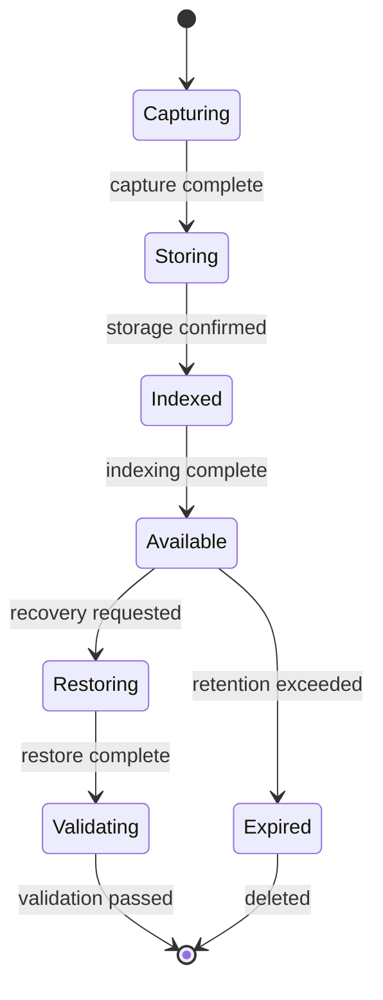

### ۱۲.۴ Snapshot Data Model

```json
{
  "$schema": "https://json-schema.org/draft-07/schema#",
  "$id": "smos://schemas/distributed/runtime-snapshot.json",
  "title": "Runtime Snapshot",
  "type": "object",
  "required": ["snapshotId", "executionId", "type", "nodeId", "state", "term", "createdAt"],
  "properties": {
    "snapshotId": {
      "type": "string",
      "pattern": "^snp:[a-f0-9\\-]{36}$"
    },
    "executionId": {
      "type": "string"
    },
    "type": {
      "type": "string",
      "enum": ["full", "incremental", "delta", "on_demand", "pre_recovery", "checkpoint"]
    },
    "nodeId": {
      "type": "string"
    },
    "term": {
      "type": "integer",
      "description": "Raft Term در زمان Snapshot"
    },
    "state": {
      "type": "object",
      "properties": {
        "runtimeState": { "type": "string" },
        "workflowState": { "type": "string" },
        "contextId": { "type": "string" },
        "variables": { "type": "object" },
        "lockHoldings": {
          "type": "array",
          "items": { "type": "string" }
        },
        "pendingOperations": {
          "type": "array",
          "items": { "type": "object" }
        }
      }
    },
    "metadata": {
      "type": "object",
      "properties": {
        "size": { "type": "integer" },
        "checksum": { "type": "string" },
        "compressed": { "type": "boolean" },
        "compressionType": { "type": "string" }
      }
    },
    "parentSnapshotId": {
      "type": "string",
      "description": "برای Incremental/Delta — ارجاع به Snapshot قبلی"
    },
    "createdAt": {
      "type": "string",
      "format": "date-time"
    },
    "expiresAt": {
      "type": "string",
      "format": "date-time"
    }
  }
}
```

### ۱۲.۵ Capture Process

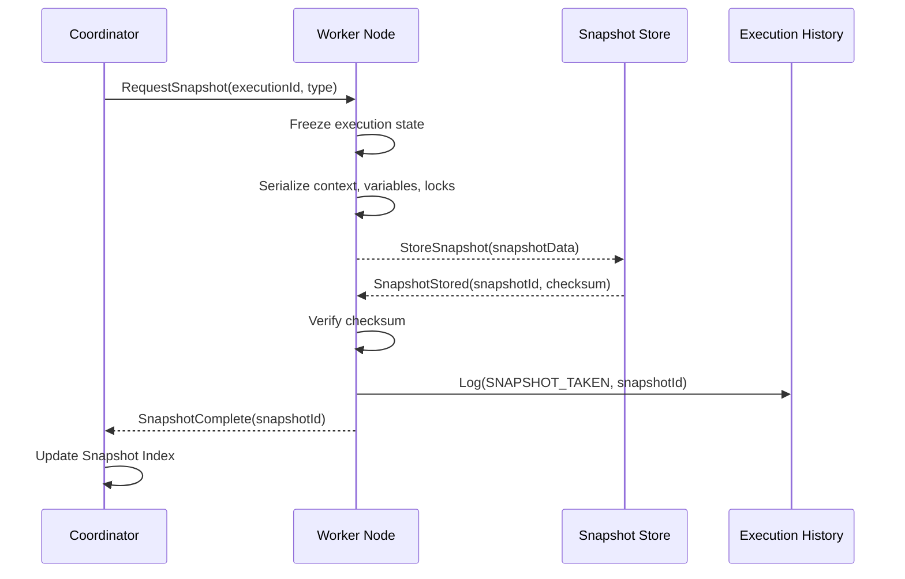

### ۱۲.۶ Restore Process

| Step | Action                                            | Validation                |
| ---- | ------------------------------------------------- | ------------------------- |
| ۱    | Coordinator Restore را تأیید می‌کند               | Quorum Check              |
| ۲    | Snapshot از Snapshot Store بازیابی می‌شود         | Checksum Verification     |
| ۳    | State دیکد می‌شود                                 | Schema Validation         |
| ۴    | Context بازسازی می‌شود                            | Context Integrity Check   |
| ۵    | Lock Holdings بازبینی می‌شود                      | Lock Store Reconciliation |
| ۶    | Pending Operations reschedule می‌شوند             | Duplicate Detection       |
| ۷    | Execution History از Snapshot Point بازپخش می‌شود | Consistency Check         |

---

## ۱۳. State Synchronization

### ۱۳.۱ همگام‌سازی وضعیت

همگام‌سازی وضعیت بین Nodeها از طریق **Raft Log Replication** انجام می‌شود:

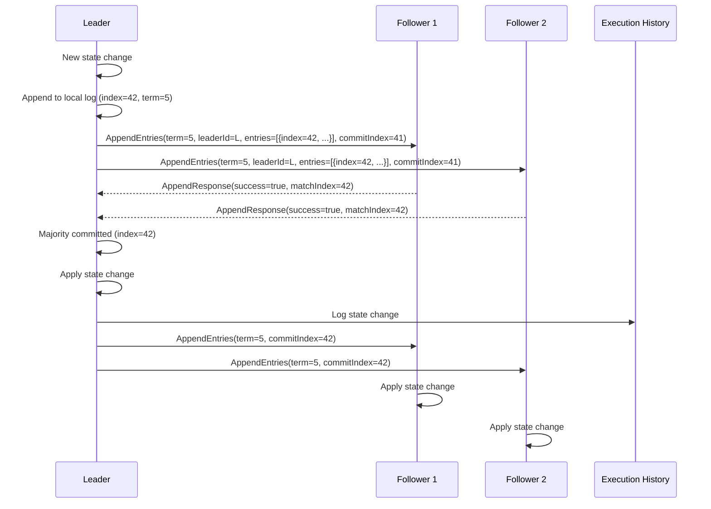

### ۱۳.۲ Synchronization Guarantees

| Guarantee                | توضیح                                              |
| ------------------------ | -------------------------------------------------- |
| **Leader Completeness**  | Log Leader کامل‌ترین Log را دارد                   |
| **Log Matching**         | دو Log با same index & term حاوی دستور یکسان هستند |
| **Follower Consistency** | Followerها دقیقاً به ترتیب Leader اعمال می‌کنند    |
| **Commit Safety**        | فقط Leader می‌تواند Commit کند (Fencing Token)     |
| **State Monotonicity**   | وضعیت به صورت Strictly Monotonic تکامل می‌یابد     |

### ۱۳.۳ Synchronization Conflicts

| Conflict Type           | Detection                       | Resolution                                |
| ----------------------- | ------------------------------- | ----------------------------------------- |
| **Term Mismatch**       | AppendEntries Response          | Follower Log را تا Term منطبق Trim می‌کند |
| **Index Conflict**      | AppendEntries Consistency Check | Follower Entryهای متضاد را حذف می‌کند     |
| **Duplicate Execution** | Fencing Token                   | Token تکراری رد می‌شود                    |
| **Stale State**         | Version Vector                  | State قدیمی با State جدید جایگزین می‌شود  |

---

## ۱۴. Conflict Resolution

### ۱۴.۱ استراتژی حل تعارض

SMOS از **Last-Writer-Wins (LWW)** با Version Vector برای حل تعارض استفاده می‌کند:

```json
{
  "$schema": "https://json-schema.org/draft-07/schema#",
  "$id": "smos://schemas/distributed/conflict-resolution.json",
  "title": "Conflict Resolution Policy",
  "type": "object",
  "required": ["resourceId", "strategy", "versionVector"],
  "properties": {
    "resourceId": {
      "type": "string"
    },
    "strategy": {
      "type": "string",
      "enum": [
        "lww_last_writer_wins",
        "crdt_merge",
        "manual_resolution",
        "version_vector",
        "timestamp_based"
      ]
    },
    "versionVector": {
      "type": "object",
      "patternProperties": {
        "^node-[0-9]+$": { "type": "integer" }
      },
      "description": "نگاشت Node ID به Version Number"
    },
    "conflictLog": {
      "type": "array",
      "items": {
        "type": "object",
        "properties": {
          "conflictId": { "type": "string" },
          "resourceId": { "type": "string" },
          "nodeA": { "type": "string" },
          "nodeB": { "type": "string" },
          "versionA": { "type": "integer" },
          "versionB": { "type": "integer" },
          "detectedAt": { "type": "string", "format": "date-time" },
          "resolution": { "type": "string" },
          "resolvedAt": { "type": "string", "format": "date-time" }
        }
      }
    },
    "resolutionRules": {
      "type": "array",
      "items": {
        "type": "object",
        "properties": {
          "resourceType": { "type": "string" },
          "defaultStrategy": { "type": "string" },
          "escalationThreshold": { "type": "integer" },
          "manualApprovalRequired": { "type": "boolean" }
        }
      }
    }
  }
}
```

### ۱۴.۲ Conflict Types & Resolutions

| Conflict                   | Detection               | Strategy              | اقدام                                         |
| -------------------------- | ----------------------- | --------------------- | --------------------------------------------- |
| **Concurrent Writes**      | Version Vector Conflict | LWW + Timestamp       | نوشته با timestamp جدیدتر برنده است           |
| **State Divergence**       | Hash Mismatch           | Full Sync             | Leader Log کامل را replicate می‌کند           |
| **Lock Contention**        | Deadlock Detection      | Victim Selection      | قفل Task با اولویت پایین‌تر آزاد می‌شود       |
| **Data Race**              | Fencing Token           | Reject Older          | عملیات با Fencing Token قدیمی رد می‌شود       |
| **Network Split Recovery** | Term Comparison         | Leader Reconciliation | Leader جدید وضعیت Minority را بازنویسی می‌کند |

### ۱۴.۳ Manual Escalation

در صورت تعارض غیرقابل حل خودکار:

| Level             | Condition                     | Action                               |
| ----------------- | ----------------------------- | ------------------------------------ |
| **L1 — Auto**     | تعارض ساده، LWW قابل اجرا     | حل خودکار                            |
| **L2 — Warn**     | تعارض با Version Vector نزدیک | حل خودکار + هشدار                    |
| **L3 — Escalate** | تعارض با شاخه‌های مساوی       | ایجاد Conflict Ticket + توقف عملیات  |
| **L4 — Block**    | تعارض امنیتی یا دادهای        | مسدودسازی کامل + اطلاع Administrator |

---

## ۱۵. Distributed State Machine

### ۱۵.۱ ماشین حالت توزیع‌شده

تمام Nodeهای Worker از یک **ماشین حالت توزیع‌شده یکسان** پیروی می‌کنند که توسط Raft Log همگام می‌شود:

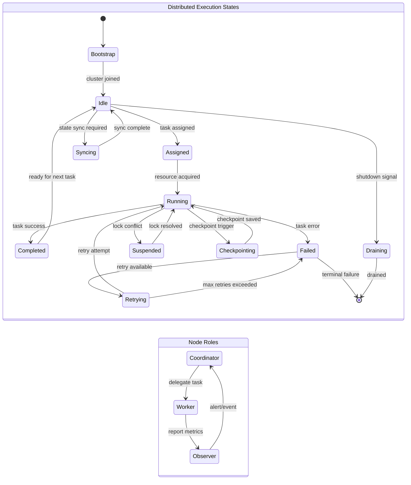

### ۱۵.۲ State Transitions Matrix

| From          | To            | Trigger                          | Validation             |
| ------------- | ------------- | -------------------------------- | ---------------------- |
| Bootstrap     | Idle          | Cluster Join Confirmed           | Membership Verified    |
| Idle          | Assigned      | Task Assignment from Coordinator | Resource Availability  |
| Assigned      | Running       | Lock Acquired + Resource Ready   | Fencing Token Valid    |
| Running       | Completed     | Task Result Produced             | Result Schema Valid    |
| Running       | Failed        | Unrecoverable Error              | Error Classification   |
| Running       | Suspended     | Lock Contention / Deadlock       | Deadlock Detected      |
| Suspended     | Running       | Lock Resolved / Retry Granted    | Lock Re-acquired       |
| Completed     | Idle          | Result Published                 | History Logged         |
| Failed        | Retrying      | Retry Policy Allows              | Retry Count < Max      |
| Retrying      | Failed        | Max Retries Exceeded             | Error Persists         |
| Idle          | Syncing       | Coordinator Initiated Sync       | State Version Mismatch |
| Syncing       | Idle          | Log Fully Replicated             | Checksum Verified      |
| Running       | Checkpointing | Checkpoint Trigger               | State Frozen           |
| Checkpointing | Running       | Snapshot Stored                  | Checksum Stored        |
| Idle          | Draining      | Shutdown / Scale-in              | No Pending Tasks       |
| Draining      | [*]           | Last Task Completed              | Grace Period Expired   |

---

## ۱۶. Failure Scenarios

### ۱۶.۱ Network Partition

**سناریو:** پارتیشن شبکه بین Majority و Minority

```
[Node A (Leader)] ---X--- [Node B (Follower)]
[Node C (Follower)]        [Node D (Follower)]
     Majority (3)               Minority (2)
```

**تأثیر:**

- Majority: به کار عادی ادامه می‌دهد
- Minority: به Read-Only می‌رود
- Lockهای متعلق به Nodeهای Minority پس از TTL آزاد می‌شوند

**اقدامات:**

1. یکسویه شبکه پس از ۱۵۰ms (missed heartbeat) تشخیص داده می‌شود
2. Nodeهای Majority Leader موجود را حفظ می‌کنند
3. Nodeهای Minority Election شروع می‌کنند اما به دلیل نداشتن Quorum موفق نمی‌شوند
4. Nodeهای Minority به حالت Read-Only می‌روند
5. Lockهای Nodeهای Minority در DLM پس از TTL + grace منقضی می‌شوند
6. پس از بازگشت شبکه، Nodeهای Minority Log خود را با Leader همگام می‌کنند

### ۱۶.۲ Node Crash (Coordinator)

**سناریو:** Node Coordinator از کار می‌افتد

**تشخیص:**

- ۳ Heartbeat متوالی از دست می‌رود (~۱۵۰ms)
- Follower دیگر Election Timeout را شروع می‌کند

**اقدامات:**

1. Followerها Election جدید برگزار می‌کنند
2. Leader جدید انتخاب می‌شود (< ۳۰۰ms)
3. Log Leader جدید تا آخرین Committed Entry کامل است
4. Workerها همچنان به کار خود ادامه می‌دهند (Heartbeat را به Leader جدید می‌فرستند)
5. اگر Leader قدیمی بازگردد، به عنوان Follower با Term جدید می‌پیوندد

### ۱۶.۳ Node Crash (Worker)

**سناریو:** Worker Node از کار می‌افتد

**تشخیص:**

- Coordinator Heartbeat Worker را دریافت نمی‌کند
- پس از `suspicion_timeout` (۱۵s) Worker Suspect می‌شود
- پس از `suspicion_timeout * 2` (۳۰s) Worker Dead اعلام می‌شود

**اقدامات:**

1. Coordinator تمام Taskهای Worker را **Reassign** می‌کند
2. Lockهای Worker پس از TTL آزاد می‌شوند
3. Snapshot آخرین Worker برای بازیابی استفاده می‌شود
4. Execution History Worker برای Audit نگهداری می‌شود
5. اگر Worker بازگردد، باید دوباره Join کند

### ۱۶.۴ Split-Brain

**سناریو:** پارتیشن به گونه‌ای است که دو Partition هر دو خود را Majority می‌دانند

```
[Node A] ---X--- [Node B]
[Node C]          [Node D]  <-- هر دو طرف ۲ رأی دارند (با ۴ Node)
```

**تشخیص:**

- هر دو Partition Leader انتخاب می‌کنند
- Fencing Token Term بالاتر برنده است
- Lockهای Leader با Term قدیمی توسط DLM رد می‌شوند

**اقدامات:**

1. هر Leader جدید با Term بالاتر به طور خودکار Leader قدیمی را ابطال می‌کند
2. تمام عملیات Partition با Term پایین‌تر Rollback می‌شوند
3. Fencing Token از نوشتن داده‌های متناقض جلوگیری می‌کند
4. پس از بازگشت شبکه، Logها با Term بالاتر همگام می‌شوند
5. Conflict Log برای ممیزی ذخیره می‌شود

### ۱۶.۵ Cascading Failure

**سناریو:** خرابی یک Node باعث خرابی‌های زنجیره‌ای می‌شود

**پیشگیری:**
| مکانیسم | توضیح |
|---|---|
| **Circuit Breaker** | پس از N خطا، درخواست‌ها به Node خراب قطع می‌شوند |
| **Bulkhead Isolation** | هر Runtime در یک Bulkhead مجزا اجرا می‌شود |
| **Rate Limiting** | هر Worker محدودیت نرخ درخواست دارد |
| **Graceful Degradation** | Runtimeهای غیربحرانی در صورت فشار غیرفعال می‌شوند |

---

## ۱۷. Recovery Strategies

### ۱۷.۱ استراتژی‌های بازیابی

| Strategy               | ID     | Scope             | RTO     | RPO           |
| ---------------------- | ------ | ----------------- | ------- | ------------- |
| **Leader Re-election** | REC-LE | Coordinator       | < ۳۰۰ms | ۰ (zero loss) |
| **Task Reassignment**  | REC-TA | Worker Task       | < ۵s    | < ۳۰s         |
| **Snapshot Restore**   | REC-SR | Full Runtime      | < ۳۰s   | < ۵min        |
| **Log Replay**         | REC-LR | Execution History | < ۶۰s   | < ۱s          |
| **Full State Sync**    | REC-FS | Cluster-wide      | < ۶۰s   | ۰ (complete)  |

### ۱۷.۲ Recovery Flow

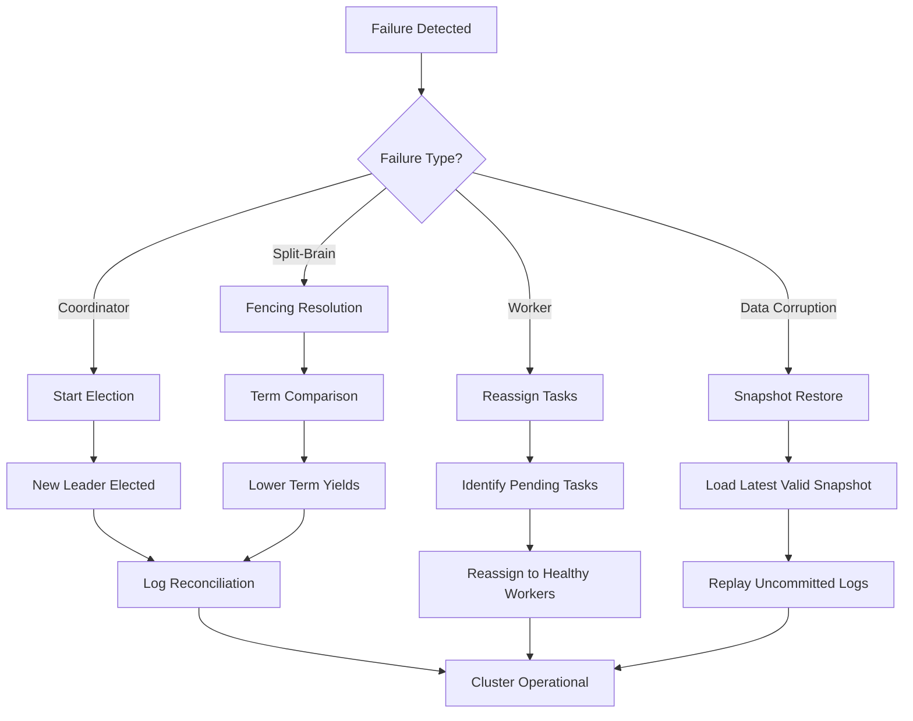

### ۱۷.۳ Recovery Policies

```yaml
# recovery-policies.yaml
recovery:
  leader_election:
    max_attempts: 3
    election_timeout: 150-300ms
    pre_vote: true

  task_reassignment:
    max_retries: 5
    retry_delay: 5s
    retry_backoff: 2.0
    exclude_nodes_grace_period: 60s

  snapshot_restore:
    max_restore_time: 30s
    validate_checksum: true
    auto_replay: true
    consistency_check: required

  log_replay:
    batch_size: 100
    replay_speed: 1000 entries/s
    validate_state: true

  full_state_sync:
    sync_timeout: 60s
    validate_after_sync: true
    quorum_required: true
```

### ۱۷.۴ Recovery Flow Diagram

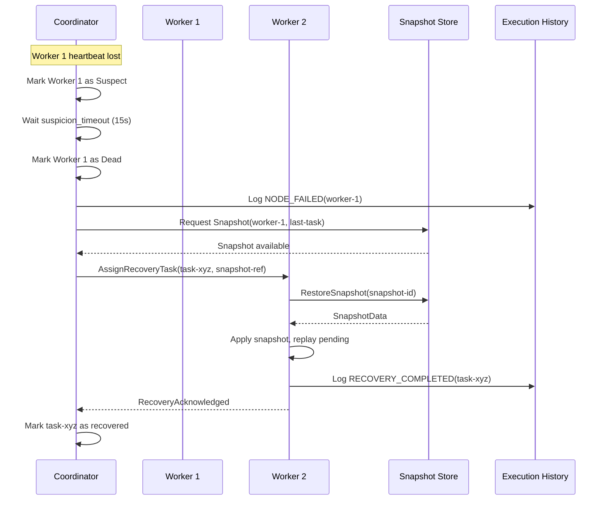

---

## ۱۸. Distributed Execution Monitoring & Metrics

### ۱۸.۱ Distributed Metrics

| Metric                             | Type      | Description                      | Tags               |
| ---------------------------------- | --------- | -------------------------------- | ------------------ |
| `cluster.nodes.alive`              | Gauge     | تعداد Nodeهای فعال               | cluster, node_role |
| `cluster.nodes.suspect`            | Gauge     | تعداد Nodeهای مشکوک              | cluster            |
| `cluster.leader.term`              | Gauge     | Term فعلی Leader                 | cluster            |
| `cluster.quorum.status`            | Gauge     | وضعیت Quorum (۱=دارد, ۰=ندارد)   | cluster            |
| `cluster.partition.count`          | Gauge     | تعداد پارتیشن‌های فعال           | cluster            |
| `lock.acquire.count`               | Counter   | تعداد قفل‌های اخذشده             | lock_type, node_id |
| `lock.release.count`               | Counter   | تعداد قفل‌های رها شده            | lock_type, node_id |
| `lock.timeout.count`               | Counter   | تعداد Timeout قفل                | node_id            |
| `lock.deadlock.count`              | Counter   | تعداد Deadlock تشخیص‌داده‌شده    | cluster            |
| `lock.contention.duration`         | Histogram | مدت زمان انتظار برای قفل         | lock_type          |
| `snapshot.capture.duration`        | Histogram | مدت زمان ضبط Snapshot            | snapshot_type      |
| `snapshot.restore.duration`        | Histogram | مدت زمان بازیابی Snapshot        | snapshot_type      |
| `snapshot.size`                    | Gauge     | حجم Snapshot بر حسب بایت         | snapshot_type      |
| `execution.history.write.latency`  | Histogram | تأخیر نوشتن در Execution History | node_id            |
| `execution.history.query.latency`  | Histogram | تأخیر پرس‌وجوی Execution History | query_type         |
| `consensus.append.entries.latency` | Histogram | تأخیر AppendEntries RPC          | cluster            |
| `consensus.election.duration`      | Histogram | مدت زمان انتخاب Leader           | cluster            |
| `gossip.convergence.time`          | Histogram | زمان همگرایی Gossip              | cluster            |
| `membership.changes.count`         | Counter   | تعداد تغییرات عضویت              | change_type        |

### ۱۸.۲ Health Checks

| Check                        | Interval       | Action on Failure            |
| ---------------------------- | -------------- | ---------------------------- |
| **Cluster Health**           | ۵s             | Alert if quorum lost         |
| **Node Health**              | ۱s (Heartbeat) | Mark suspect if missed       |
| **Lock Store Health**        | ۱۰s            | Switch to backup Lock Store  |
| **Snapshot Store Health**    | ۳۰s            | Degraded snapshot capability |
| **Execution History Health** | ۱۰s            | Buffer writes + alert        |
| **Consensus Health**         | ۵s             | Trigger election if stalled  |

### ۱۸.3 Alert Thresholds

| Alert                   | Condition                       | Severity | Action              |
| ----------------------- | ------------------------------- | -------- | ------------------- |
| `QuorumLost`            | cluster.quorum.status == 0      | Critical | Página              |
| `LeaderElectionTimeout` | election.duration > 5s          | Critical | Auto-recovery       |
| `NodeDown`              | nodes.alive < expected          | High     | Reassign tasks      |
| `HighLockContention`    | contention.duration p99 > 5s    | High     | Scale workers       |
| `SnapshotFailure`       | snapshot.capture.duration > 60s | Medium   | Retry + alert       |
| `HistoryWriteBacklog`   | write.latency p99 > 1s          | Medium   | Scale history store |
| `SplitBrainDetected`    | partition.count > 0             | Critical | Immediate fencing   |

---

## ۱۹. Distributed Execution Security

### ۱۹.۱ اصول امنیت توزیع‌شده

| اصل                   | توضیح                                                 |
| --------------------- | ----------------------------------------------------- |
| **Mutual TLS (mTLS)** | تمام ارتباطات بین Nodeها با mTLS رمزنگاری می‌شود      |
| **Node Identity**     | هر Node دارای Certificate معتبر با شناسه یکتاست       |
| **Role-Based Access** | هر Node فقط عملیات مجاز برای Role خود را انجام می‌دهد |
| **Audit All**         | تمام عملیات توزیع‌شده در Execution History ثبت می‌شود |
| **Fencing Integrity** | Fencing Token توسط Leader امضا می‌شود                 |
| **Sealed Snapshots**  | Snapshotها با کلید Cluster امضا می‌شوند               |

### ۱۹.۲ Authentication & Authorization

```yaml
# distributed-security.yaml
security:
  tls:
    enabled: true
    mutual: true
    min_version: '1.3'
    cert_rotation: 30d

  node_identity:
    provider: 'internal-ca'
    certificate_validity: 90d
    revocation_check: true

  authorization:
    model: 'rbac'
    roles:
      coordinator: ['lock:write', 'task:assign', 'snapshot:request', 'cluster:admin']
      worker: ['lock:read', 'task:execute', 'history:write', 'snapshot:write']
      observer: ['history:read', 'metrics:read', 'snapshot:read']

  fencing:
    signing: 'ed25519'
    key_rotation: 7d
    verify_on_every_operation: true

  audit:
    all_operations: true
    retention: 7y
    immutable: true
```

### ۱۹.۳ Secure Communication Matrix

| Communication             | Encryption     | Authentication      | Authorization |
| ------------------------- | -------------- | ------------------- | ------------- |
| Coordinator ↔ Coordinator | mTLS (TLS 1.3) | Certificate         | Mutual        |
| Coordinator ↔ Worker      | mTLS (TLS 1.3) | Certificate         | Role Check    |
| Worker ↔ Worker           | mTLS (TLS 1.3) | Certificate         | Role Check    |
| Worker ↔ Lock Store       | mTLS + Token   | Certificate + Token | RW Check      |
| Worker ↔ Event Store      | mTLS + Token   | Certificate + Token | RW Check      |
| Gossip Messages           | Symmetric Key  | HMAC                | Node ID       |

---

## ۲۰. Scaling & Multi-Tenancy

### ۲۰.۱ Horizontal Scaling

SMOS از **Horizontal Scaling** برای افزایش ظرفیت Cluster پشتیبانی می‌کند:

```yaml
# scaling-config.yaml
scaling:
  strategy: "horizontal"
  auto_scaling:
    enabled: true
    metrics:
      - name: "cpu_utilization"
        threshold: 80%
      - name: "lock_contention"
        threshold: p95 > 3s
      - name: "queue_depth"
        threshold: > 1000
    cooldown: 60s
    min_nodes: 3
    max_nodes: 64

  partition_strategy:
    type: "consistent_hashing"
    vnodes: 256
    replication_factor: 3
    rebalance_threshold: 0.1
```

### ۲۰.۲ Multi-Tenancy

| Tenant Isolation           | Lock Scope            | Data Isolation    | Resource Quota    |
| -------------------------- | --------------------- | ----------------- | ----------------- |
| **Namespace**              | Lock Namespace Prefix | Partitioned Store | CPU/Memory Limits |
| **Lock Prefix Per Tenant** | `lock:tenant-{id}:*`  | Separate Tables   | Connection Pool   |
| **QoS Class**              | Priority Queue        | Read Replicas     | Rate Limiting     |

### ۲۰.۳ Tenant Configuration

```yaml
# tenant-config.yaml
tenants:
  - tenantId: 'xennic-corp'
    namespace: 'xennic'
    quota:
      max_workers: 16
      max_locks: 100
      max_concurrent_tasks: 50
      cpu_limit: '8 cores'
      memory_limit: '16GB'
    priority: 'high'
    isolation: 'dedicated'

  - tenantId: 'xennic-dev'
    namespace: 'xennic-dev'
    quota:
      max_workers: 4
      max_locks: 20
      max_concurrent_tasks: 10
      cpu_limit: '2 cores'
      memory_limit: '4GB'
    priority: 'low'
    isolation: 'shared'
```

---

## ۲۱. API Contracts

### ۲۱.۱ Coordination API

#### `POST /v1/coordination/acquire-lock`

درخواست اخذ قفل توزیع‌شده:

```json
// Request
{
  "lockId": "lock:task:content-publish:1",
  "type": "exclusive",
  "owner": "worker-03",
  "ttl": 30,
  "resource": "resource:/content/publish/1",
  "fencingToken": {
    "term": 7,
    "nodeId": "coordinator-01",
    "sequence": 1042
  }
}

// Response — Success
{
  "status": "acquired",
  "lockToken": "lt_a1b2c3d4e5f6",
  "expiresAt": "2026-07-01T10:30:30.000Z",
  "fencingToken": { "term": 7, "nodeId": "coordinator-01", "sequence": 1042 }
}

// Response — Busy
{
  "status": "busy",
  "owner": "worker-01",
  "remainingTtl": 18,
  "retryAfter": "2026-07-01T10:30:18.000Z"
}
```

#### `POST /v1/coordination/release-lock`

```json
// Request
{
  "lockId": "lock:task:content-publish:1",
  "lockToken": "lt_a1b2c3d4e5f6",
  "owner": "worker-03"
}

// Response
{
  "status": "released"
}
```

#### `POST /v1/coordination/heartbeat`

```json
// Request
{
  "nodeId": "worker-03",
  "nodeRole": "worker",
  "timestamp": "2026-07-01T10:30:15.000Z",
  "status": "healthy",
  "load": {
    "activeTasks": 3,
    "queuedTasks": 2,
    "cpuUsage": 45.2,
    "memoryUsage": 62.1
  }
}

// Response
{
  "status": "acknowledged",
  "leaderId": "coordinator-01",
  "currentTerm": 7,
  "pendingOperation": null
}
```

### ۲۱.۲ Execution History API

#### `GET /v1/history/executions/{executionId}`

```json
// Response
{
  "executionId": "exec-abc-123",
  "entries": [
    {
      "entryId": "eh:abc-123:0",
      "seq": 0,
      "type": "task_started",
      "source": "worker-03",
      "state": { "taskState": "initializing" },
      "timestamp": "2026-07-01T10:30:00.000Z",
      "fencingToken": { "term": 7, "nodeId": "coordinator-01", "sequence": 1000 }
    },
    {
      "entryId": "eh:abc-123:1",
      "seq": 1,
      "type": "lock_acquired",
      "source": "worker-03",
      "state": { "taskState": "running" },
      "timestamp": "2026-07-01T10:30:01.000Z",
      "fencingToken": { "term": 7, "nodeId": "coordinator-01", "sequence": 1042 }
    }
  ],
  "pagination": {
    "nextSeq": 2,
    "hasMore": true,
    "totalEntries": 15
  }
}
```

#### `POST /v1/history/query`

```json
// Request
{
  "query": {
    "type": "state_transition",
    "source": "worker-03",
    "from": "2026-07-01T00:00:00.000Z",
    "to": "2026-07-01T23:59:59.000Z"
  },
  "limit": 100,
  "offset": 0
}

// Response
{
  "results": [ /* array of entries */ ],
  "total": 42,
  "limit": 100,
  "offset": 0
}
```

### ۲۱.۳ Snapshot API

#### `POST /v1/snapshot/capture`

```json
// Request
{
  "executionId": "exec-abc-123",
  "type": "checkpoint",
  "nodeId": "worker-03",
  "reason": "workflow_stage_complete",
  "metadata": {
    "stage": "content_generation",
    "progress": 0.6
  }
}

// Response
{
  "snapshotId": "snp:def-456",
  "status": "captured",
  "size": 24576,
  "checksum": "sha256:a1b2c3d4e5f6...",
  "createdAt": "2026-07-01T10:30:00.000Z"
}
```

#### `POST /v1/snapshot/restore`

```json
// Request
{
  "snapshotId": "snp:def-456",
  "targetNodeId": "worker-05",
  "validateConsistency": true
}

// Response
{
  "snapshotId": "snp:def-456",
  "status": "restored",
  "executionId": "exec-abc-123",
  "replayedEntries": 3,
  "restoredAt": "2026-07-01T10:31:00.000Z"
}
```

### ۲۱.۴ Membership API

#### `GET /v1/membership/nodes`

```json
// Response
{
  "nodes": [
    {
      "nodeId": "coordinator-01",
      "role": "coordinator",
      "status": "alive",
      "address": "10.0.1.1:8200",
      "term": 7,
      "isLeader": true,
      "joinedAt": "2026-07-01T08:00:00.000Z",
      "lastHeartbeat": "2026-07-01T10:30:15.000Z"
    },
    {
      "nodeId": "worker-03",
      "role": "worker",
      "status": "alive",
      "address": "10.0.1.3:8200",
      "runtimes": ["agent", "workflow"],
      "activeTasks": 3,
      "joinedAt": "2026-07-01T08:05:00.000Z",
      "lastHeartbeat": "2026-07-01T10:30:15.000Z"
    }
  ],
  "cluster": {
    "name": "smos-production-01",
    "nodeCount": 5,
    "aliveCount": 5,
    "hasQuorum": true,
    "currentTerm": 7
  }
}
```

### ۲۱.۵ Error Responses

```json
// Lock Conflict
{
  "error": {
    "code": "LOCK_CONFLICT",
    "message": "قفل درخواستی توسط Worker دیگر نگه‌داشته شده است",
    "details": {
      "lockId": "lock:task:content-publish:1",
      "currentOwner": "worker-01",
      "remainingTtl": 18,
      "retryAfter": "2026-07-01T10:30:18.000Z"
    },
    "traceId": "trace-abc-123"
  }
}

// Fencing Token Rejected
{
  "error": {
    "code": "FENCING_TOKEN_REJECTED",
    "message": "Fencing Token منقضی یا متعلق به Term قدیمی است",
    "details": {
      "received": { "term": 5, "nodeId": "coordinator-old" },
      "current": { "term": 7, "nodeId": "coordinator-01" }
    },
    "traceId": "trace-def-456"
  }
}

// Quorum Not Available
{
  "error": {
    "code": "QUORUM_NOT_AVAILABLE",
    "message": "Quorum Cluster در دسترس نیست. عملیات رد شد.",
    "details": {
      "aliveNodes": 2,
      "requiredQuorum": 3,
      "clusterSize": 5
    },
    "traceId": "trace-ghi-789"
  }
}
```

---

## ۲۲. JSON Schema Definitions

### ۲۲.۱ Distributed Node

```json
{
  "$schema": "https://json-schema.org/draft-07/schema#",
  "$id": "smos://schemas/distributed/node.json",
  "title": "Distributed Node",
  "type": "object",
  "required": ["nodeId", "role", "address", "status"],
  "properties": {
    "nodeId": {
      "type": "string",
      "pattern": "^(coordinator|worker|observer)-[0-9]{2}$"
    },
    "role": {
      "type": "string",
      "enum": ["coordinator", "worker", "observer"]
    },
    "address": {
      "type": "string",
      "format": "hostname"
    },
    "port": {
      "type": "integer",
      "minimum": 1024,
      "maximum": 65535
    },
    "status": {
      "type": "string",
      "enum": ["unknown", "joining", "alive", "suspect", "dead", "leaving", "left"]
    },
    "runtimes": {
      "type": "array",
      "items": { "type": "string" }
    },
    "capabilities": {
      "type": "array",
      "items": {
        "type": "string",
        "enum": ["lock", "task", "snapshot", "history", "consensus", "gossip"]
      }
    },
    "term": { "type": "integer" },
    "isLeader": { "type": "boolean" },
    "load": {
      "type": "object",
      "properties": {
        "activeTasks": { "type": "integer" },
        "cpuUsage": { "type": "number" },
        "memoryUsage": { "type": "number" }
      }
    }
  }
}
```

### ۲۲.۲ Cluster Configuration

```json
{
  "$schema": "https://json-schema.org/draft-07/schema#",
  "$id": "smos://schemas/distributed/cluster-config.json",
  "title": "Cluster Configuration",
  "type": "object",
  "required": ["clusterName", "seedNodes", "consensus"],
  "properties": {
    "clusterName": {
      "type": "string",
      "pattern": "^smos-[a-z0-9\\-]+$"
    },
    "seedNodes": {
      "type": "array",
      "minItems": 1,
      "items": {
        "type": "object",
        "required": ["host", "port"],
        "properties": {
          "host": { "type": "string" },
          "port": { "type": "integer" }
        }
      }
    },
    "consensus": {
      "type": "object",
      "properties": {
        "heartbeatInterval": { "type": "string", "pattern": "^[0-9]+ms$" },
        "electionTimeout": {
          "type": "object",
          "properties": {
            "min": { "type": "string" },
            "max": { "type": "string" }
          }
        },
        "maxLogEntriesPerBatch": { "type": "integer" }
      }
    },
    "gossip": {
      "type": "object",
      "properties": {
        "interval": { "type": "string" },
        "fanout": { "type": "integer" },
        "suspicionTimeout": { "type": "string" }
      }
    },
    "lockManager": {
      "type": "object",
      "properties": {
        "defaultTtl": { "type": "string" },
        "deadlockCheckInterval": { "type": "string" },
        "maxRetries": { "type": "integer" }
      }
    },
    "snapshot": {
      "type": "object",
      "properties": {
        "fullInterval": { "type": "string" },
        "incrementalInterval": { "type": "string" },
        "retention": {
          "type": "object",
          "properties": {
            "hot": { "type": "string" },
            "warm": { "type": "string" },
            "cold": { "type": "string" }
          }
        }
      }
    }
  }
}
```

### ۲۲.۳ Execution Event

```json
{
  "$schema": "https://json-schema.org/draft-07/schema#",
  "$id": "smos://schemas/distributed/execution-event.json",
  "title": "Distributed Execution Event",
  "type": "object",
  "required": ["eventId", "eventType", "source", "target", "timestamp", "fencingToken"],
  "properties": {
    "eventId": {
      "type": "string",
      "pattern": "^evt:[a-f0-9\\-]{36}$"
    },
    "eventType": {
      "type": "string",
      "enum": [
        "task_assigned",
        "task_started",
        "task_completed",
        "task_failed",
        "lock_acquired",
        "lock_released",
        "lock_timeout",
        "lock_deadlock",
        "snapshot_captured",
        "snapshot_restored",
        "node_joined",
        "node_left",
        "node_failed",
        "node_suspect",
        "leader_elected",
        "leader_transferred",
        "partition_detected",
        "partition_healed",
        "quorum_lost",
        "quorum_regained",
        "recovery_started",
        "recovery_completed",
        "state_sync_started",
        "state_sync_completed",
        "conflict_detected",
        "conflict_resolved"
      ]
    },
    "source": { "type": "string" },
    "target": { "type": "string" },
    "payload": { "type": "object" },
    "timestamp": { "type": "string", "format": "date-time" },
    "fencingToken": {
      "type": "object",
      "properties": {
        "term": { "type": "integer" },
        "nodeId": { "type": "string" },
        "sequence": { "type": "integer" }
      }
    },
    "traceId": { "type": "string" },
    "spanId": { "type": "string" }
  }
}
```

### ۲۲.۴ Lock Store

```json
{
  "$schema": "https://json-schema.org/draft-07/schema#",
  "$id": "smos://schemas/distributed/lock-store.json",
  "title": "Lock Store Entry",
  "type": "object",
  "required": ["lockId", "state", "owner", "ttl", "createdAt"],
  "properties": {
    "lockId": { "type": "string" },
    "state": {
      "type": "string",
      "enum": ["free", "locked", "contended", "deadlocked", "releasing"]
    },
    "owner": { "type": "string" },
    "type": {
      "type": "string",
      "enum": ["exclusive", "shared", "read", "write", "session", "transaction", "namespace"]
    },
    "token": { "type": "string" },
    "fencingToken": {
      "type": "object",
      "properties": {
        "term": { "type": "integer" },
        "nodeId": { "type": "string" },
        "sequence": { "type": "integer" }
      }
    },
    "ttl": { "type": "integer" },
    "waiters": {
      "type": "array",
      "items": {
        "type": "object",
        "properties": {
          "nodeId": { "type": "string" },
          "waitingSince": { "type": "string", "format": "date-time" },
          "priority": { "type": "integer" }
        }
      }
    },
    "createdAt": { "type": "string", "format": "date-time" },
    "expiresAt": { "type": "string", "format": "date-time" },
    "lastModified": { "type": "string", "format": "date-time" }
  }
}
```

### ۲۲.۵ Cluster Membership

```json
{
  "$schema": "https://json-schema.org/draft-07/schema#",
  "$id": "smos://schemas/distributed/cluster-membership.json",
  "title": "Cluster Membership",
  "type": "object",
  "required": ["clusterName", "nodes", "term", "leaderId"],
  "properties": {
    "clusterName": { "type": "string" },
    "nodes": {
      "type": "array",
      "items": { "$ref": "smos://schemas/distributed/node.json" }
    },
    "term": { "type": "integer" },
    "leaderId": { "type": "string" },
    "quorum": {
      "type": "object",
      "properties": {
        "required": { "type": "integer" },
        "current": { "type": "integer" },
        "hasQuorum": { "type": "boolean" }
      }
    },
    "partitions": {
      "type": "array",
      "items": {
        "type": "object",
        "properties": {
          "partitionId": { "type": "string" },
          "nodes": { "type": "array", "items": { "type": "string" } },
          "detectedAt": { "type": "string", "format": "date-time" },
          "healedAt": { "type": "string", "format": "date-time" }
        }
      }
    },
    "version": { "type": "integer" }
  }
}
```

### ۲۲.۶ Recovery Plan

```json
{
  "$schema": "https://json-schema.org/draft-07/schema#",
  "$id": "smos://schemas/distributed/recovery-plan.json",
  "title": "Recovery Plan",
  "type": "object",
  "required": ["planId", "trigger", "steps", "createdAt"],
  "properties": {
    "planId": { "type": "string" },
    "trigger": {
      "type": "object",
      "properties": {
        "type": {
          "type": "string",
          "enum": [
            "node_failure",
            "coordinator_failure",
            "network_partition",
            "split_brain",
            "quorum_loss",
            "data_corruption",
            "snapshot_failure",
            "lock_corruption"
          ]
        },
        "nodeId": { "type": "string" },
        "detectedAt": { "type": "string", "format": "date-time" },
        "details": { "type": "object" }
      }
    },
    "steps": {
      "type": "array",
      "items": {
        "type": "object",
        "properties": {
          "stepId": { "type": "integer" },
          "action": { "type": "string" },
          "target": { "type": "string" },
          "timeout": { "type": "string" },
          "retryCount": { "type": "integer" },
          "mandatory": { "type": "boolean" }
        }
      }
    },
    "status": {
      "type": "string",
      "enum": ["pending", "in_progress", "completed", "failed", "rolled_back"]
    },
    "createdAt": { "type": "string", "format": "date-time" },
    "completedAt": { "type": "string", "format": "date-time" }
  }
}
```

---

## ۲۳. Configuration Examples

### ۲۳.۱ Full Cluster Configuration

```yaml
# smos-cluster.yaml
cluster:
  name: 'smos-production-01'
  environment: 'production'
  region: 'me-central-1'

  seed_nodes:
    - host: 'coordinator-01.smos.internal'
      port: 8200
    - host: 'coordinator-02.smos.internal'
      port: 8200
    - host: 'coordinator-03.smos.internal'
      port: 8200

  consensus:
    protocol: 'raft'
    heartbeat_interval: 50ms
    election_timeout:
      min: 150ms
      max: 300ms
    max_log_entries_per_batch: 100
    snapshot_threshold: 1000

  gossip:
    enabled: true
    port: 8300
    interval: 500ms
    fanout: 3
    suspicion_timeout: 15s
    max_nodes: 64

  lock_manager:
    enabled: true
    default_ttl: 30s
    deadlock_check_interval: 5s
    max_retries: 5
    fencing_required: true

  snapshot:
    full_interval: 10m
    incremental_interval: 1m
    retention:
      hot: 7d
      warm: 30d
      cold: 365d
    compression: 'zstd'
    validate_checksum: true

  execution_history:
    retention:
      hot: 7d
      warm: 30d
      cold: 365d
    batch_write_size: 100
    query_timeout: 10s

  security:
    tls:
      enabled: true
      mutual: true
      min_version: '1.3'
    fencing:
      algorithm: 'ed25519'
    audit:
      enabled: true
      retention: 7y

  scaling:
    auto_scaling:
      enabled: true
      min_nodes: 3
      max_nodes: 64
    metrics:
      - cpu_utilization > 80%
      - lock_contention_p95 > 3s
```

### ۲۳.۲ Worker Node Configuration

```yaml
# worker-config.yaml
node:
  id: 'worker-03'
  role: 'worker'
  cluster: 'smos-production-01'
  address: '10.0.1.3'
  ports:
    runtime: 8201
    gossip: 8300
    metrics: 9090

  runtimes:
    - 'agent'
    - 'workflow'
    - 'knowledge'

  resources:
    cpu_limit: '4 cores'
    memory_limit: '8GB'
    max_concurrent_tasks: 10

  lock:
    acquire_timeout: 10s
    retry_interval: 1s
    max_retries: 5

  heartbeat:
    interval: 1s
    timeout: 5s

  logging:
    level: 'info'
    format: 'json'
    output: 'stdout'
```

---

## ۲۴. Cross-Reference Matrix

### ۲۴.۱ Internal Cross-References

| SMOS-ID      | Title                             | Relation to SMOS-712                                              |
| ------------ | --------------------------------- | ----------------------------------------------------------------- |
| **SMOS-701** | Enterprise Execution Architecture | §۳: اجرای توزیع‌شده از ۸ Runtime SMOS-701 استفاده می‌کند          |
| **SMOS-702** | Execution State Machine           | §۱۵: ماشین حالت توزیع‌شده از حالت‌های SMOS-702 مشتق می‌شود        |
| **SMOS-703** | Execution Context Model           | §۱۳: State Synchronization از مدل Context SMOS-703 استفاده می‌کند |
| **SMOS-704** | Workflow Orchestration            | §۱۱: Execution History Service برای Orchestration استفاده می‌شود  |
| **SMOS-705** | Enterprise Event Architecture     | §۲۲.۳: Execution Event Schema از SMOS-705 پیروی می‌کند            |
| **SMOS-706** | Execution Monitoring              | §۱۸: Metrics تعریف‌شده در SMOS-712 با SMOS-706 هماهنگ است         |
| **SMOS-707** | Runtime Security                  | §۱۹: Distributed Security از اصول SMOS-707 پیروی می‌کند           |
| **SMOS-708** | Master Runtime Blueprint          | §۳: معماری کلی از SMOS-708 به عنوان مرجع استفاده می‌کند           |
| **SMOS-709** | Runtime Quality Architecture      | §۱۷: Recovery Strategies با Quality Gates SMOS-709 هماهنگ است     |
| **SMOS-710** | Runtime Scaling Architecture      | §۲۰: Scaling Strategy از SMOS-710 مشتق می‌شود                     |
| **SMOS-711** | Runtime Resilience Architecture   | §۱۶: Failure Scenarios با SMOS-711 هماهنگ است                     |

### ۲۴.۲ External Cross-References

| Document ID | Title                              | Relation                                                          |
| ----------- | ---------------------------------- | ----------------------------------------------------------------- |
| **AI-000**  | Enterprise AI Agent Architecture   | §۵: Node Architecture با Agent Types AI-000 هماهنگ است            |
| **AI-014**  | Enterprise AI Orchestrator         | §۸: Leader Election با Orchestrator AI-014 تعامل دارد             |
| **AUT-000** | Enterprise Automation Architecture | §۴: Distributed Principles با AUT-000 هماهنگ است                  |
| **PRM-000** | Enterprise Prompt Architecture     | §۲۱: API Contracts از PRM-000 برای Prompt Patterns استفاده می‌کند |
| **KNW-000** | Enterprise Knowledge Architecture  | §۱۲: Snapshot Engine با Knowledge Store KNW-000 تعامل دارد        |
| **GOV-003** | Naming Conventions                 | تمام شناسه‌ها مطابق GOV-003 نام‌گذاری شده‌اند                     |

---

## ۲۵. Version History

| Version      | Date       | Author      | Changes                   |
| ------------ | ---------- | ----------- | ------------------------- |
| v1.0.0-draft | ۱۴۰۵/۰۴/۱۱ | معماری SMOS | نگارش اولیه — تمام ۲۶ بخش |

---

## ۲۶. Gaps & Future Work

### ۲۶.۱ Gaps

| Gap                          | Section | Impact                                                   | Resolution |
| ---------------------------- | ------- | -------------------------------------------------------- | ---------- |
| **Multi-Region Replication** | §۲۰     | هنوز Cross-Region Consistency تعریف نشده است             | P7.S04     |
| **Chaos Engineering**        | §۱۶     | آزمایش Failure Scenarios نیاز به Chaos Testing Plan دارد | P7.S05     |
| **Auto-Scaling Policies**    | §۲۰     | Policies دقیق Scaling تعریف نشده است                     | P7.S03     |
| **Performance Benchmarks**   | §۱۸     | Benchmark Targets برای Latency/Throughput تنظیم نشده است | P7.S05     |
| **Disaster Recovery**        | §۱۷     | DR Plan کامل با RTO/RPO دقیق تعریف نشده است              | P7.S04     |

### ۲۶.۲ Future Work

| موضوع                                       | اولویت | Sprint پیشنهادی |
| ------------------------------------------- | ------ | --------------- |
| **Multi-Region Active-Active**              | High   | P7.S04          |
| **Chaos Testing Framework**                 | Medium | P7.S05          |
| **Auto-Scaling Implementation Rules**       | High   | P7.S03          |
| **Performance Benchmark Suite**             | Medium | P7.S05          |
| **Disaster Recovery Playbook**              | High   | P7.S04          |
| **Webhook-based Lock Event Streaming**      | Low    | P8.S01          |
| **Client-side Load Balancing for Lock API** | Low    | P8.S01          |

---

## Appendix A — Glossary

| Term                | Persian      | Definition                                                  |
| ------------------- | ------------ | ----------------------------------------------------------- |
| **Fencing Token**   | توکن حصار    | Token یکتای صعودی که از دسترسی Nodeهای قدیمی جلوگیری می‌کند |
| **Quorum**          | حد نصاب      | حداقل تعداد رأی مورد نیاز برای تصمیم‌گیری در Cluster        |
| **Split-Brain**     | مغز دوپاره   | وضعیتی که دو Partition هر دو خود را Leader می‌دانند         |
| **Gossip Protocol** | پروتکل زمزمه | پروتکل انتشار اطلاعات غیربحرانی در Cluster                  |
| **Wait-For Graph**  | گراف انتظار  | گراف وابستگی Taskها برای تشخیص Deadlock                     |
| **Consensus**       | اجماع        | توافق بر سر یک مقدار واحد بین Nodeهای توزیع‌شده             |
| **Heartbeat**       | ضربان قلب    | پیام دوره‌ای برای اعلام سلامت Node                          |
| **Snapshot**        | عکس فوری     | ضبط کامل وضعیت یک Runtime در یک نقطه زمانی                  |
| **Majority**        | اکثریت       | بیش از نیمی از Nodeهای Cluster                              |
| **Grace Period**    | مهلت         | زمان انتظار قبل از اقدام قطعی در Failure Scenario           |
| **Bulkhead**        | دیوار حائل   | الگوی جداسازی برای جلوگیری از سرایت خرابی                   |

---

> **End of SMOS-712 — Distributed Execution Architecture**
>
> This document is the Single Source of Truth (SSOT) for all distributed execution aspects of SMOS.
> For implementation details, refer to SMOS-701 (Execution Architecture), SMOS-707 (Runtime Security),
> and SMOS-711 (Runtime Resilience).
>
> **Next: P7.S03 — Runtime Scaling & Multi-Tenancy**
