# SMOS-713 — Checkpoint & Recovery Architecture (معماری ایست بازرسی و بازیابی)

## ۱. Document Control

| Field             | Value                                 |
| ----------------- | ------------------------------------- |
| **Document ID**   | SMOS-713                              |
| **Document Name** | Checkpoint & Recovery Architecture    |
| **Phase**         | P7.S02 — Runtime Quality & Resilience |
| **Version**       | v1.0.0-draft                          |
| **Status**        | Draft                                 |
| **Authority**     | AI-014 (Enterprise AI Orchestrator)   |
| **Domain**        | Execution (FAM-05)                    |
| **Layer**         | LYR-02 (Tactical)                     |
| **Supersedes**    | —                                     |
| **Next Review**   | P7.S04                                |

**Keywords:** checkpoint, recovery, replay, resilience, fault-tolerance, state-persistence, workflow-recovery, failure-handling

---

## ۲. Purpose & Scope

هدف این سند، تعریف کامل معماری **ایست بازرسی (Checkpoint)** و **بازیابی (Recovery)** در SMOS است. هر Workflow، Task و Session باید بتواند در نقاط استراتژیک وضعیت خود را ذخیره کرده و در صورت بروز خطا از آخرین ایست بازرسی معتبر بازیابی شود.

**Scope:**

- تمام Agentهای SMOS (AI-001 تا AI-014)
- تمام Workflowهای AUT-001
- تمام Sessionهای Orchestration (AI-014)
- تمام زیرفرآیندهای KNW-103
- تمام Runtimeهای SMOS-701 (WR, AR, KR, CR, RR, DR, LR, PR)

**Out of Scope:**

- پیاده‌سازی ذخیره‌ساز فیزیکی (Storage Engine)
- Disaster Recovery بین مراکز داده (پوشش‌داده شده در DEPLOY-001)
- Backup/Restore دیتابیس‌های خارجی

---

## ۳. Checkpoint Architecture Overview

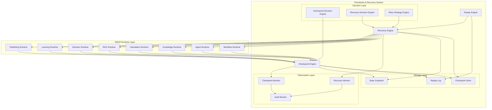

### اعداد کلیدی

| Metric                                 | Value      |
| -------------------------------------- | ---------- |
| حداکثر فاصله بین نقاط ایست بازرسی      | ۵ دقیقه    |
| حداکثر زمان بازیابی (RTO)              | ۳۰ ثانیه   |
| حداکثر از دست دادن داده (RPO)          | ۱ دقیقه    |
| حداقل تعداد ایست بازرسی در هر Workflow | ۳          |
| حداکثر حجم هر ایست بازرسی              | ۱۰ مگابایت |
| مدت نگهداری ایست بازرسی‌ها             | ۷ روز      |
| حداکثر تعداد تلاش مجدد                 | ۵          |
| درصد موفقیت بازیابی هدف                | ۹۹.۹٪      |

---

## ۴. Checkpoint Principles

معماری ایست بازرسی SMOS بر هفت اصل زیر استوار است:

| #   | اصل             | توضیح                                                                |
| --- | --------------- | -------------------------------------------------------------------- |
| ۱   | **Determinism** | ایست بازرسی در نقاط قطعی ایجاد می‌شود — خروجی یکسان برای ورودی یکسان |
| ۲   | **Minimality**  | فقط داده‌های لازم برای بازیابی ذخیره می‌شوند — حذف افزونگی           |
| ۳   | **Durability**  | ایست بازرسی تا زمان مشخص شده پایدار می‌ماند                          |
| ۴   | **Consistency** | وضعیت ذخیره‌شده باید از نظر منطقی سازگار باشد                        |
| ۵   | **Atomicity**   | ایجاد ایست بازرسی یا کاملاً موفق است یا هیچ اثری ندارد               |
| ۶   | **Isolation**   | ایست بازرسی یک Task بر Taskهای دیگر تأثیر نمی‌گذارد                  |
| ۷   | **Performance** | سربار ایجاد ایست بازرسی نباید از ۵٪ زمان اجرا تجاوز کند              |

---

## ۵. Checkpoint Types

پنج نوع ایست بازرسی در SMOS تعریف می‌شود:

| Type ID | Name                | Trigger              | Frequency         | Overhead |
| ------- | ------------------- | -------------------- | ----------------- | -------- |
| CP-01   | **Periodic**        | زمان‌سنج (Timer)     | هر ۶۰ ثانیه       | کم       |
| CP-02   | **Step-Boundary**   | پایان هر Step        | طبیعی             | متوسط    |
| CP-03   | **On-Demand**       | درخواست صریح         | به‌درخواست        | متغیر    |
| CP-04   | **Before-Critical** | قبل از عملیات بحرانی | به‌ازای هر عملیات | بالا     |
| CP-05   | **Global**          | رویداد سیستمی        | رویدادمحور        | بالا     |

### ۵.۱ Periodic Checkpoint (CP-01)

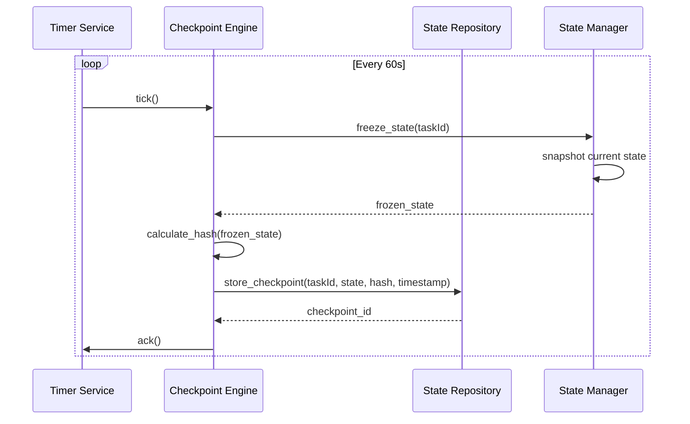

| Config                   | Default | Range    |
| ------------------------ | ------- | -------- |
| `periodicInterval`       | 60s     | 10s–300s |
| `periodicMaxOverhead`    | 3%      | 1%–10%   |
| `periodicMinCheckpoints` | 3       | 1–10     |

### ۵.۲ Step-Boundary Checkpoint (CP-02)

در پایان هر Step از Workflow، یک ایست بازرسی خودکار ایجاد می‌شود:

```json
{
  "checkpointType": "CP-02",
  "workflowId": "w-001",
  "stepId": "s-005",
  "stepName": "content_generation",
  "executionId": "e-f4a2b8c0",
  "stateSnapshot": {
    "workflowState": "RUNNING",
    "completedSteps": ["s-001", "s-002", "s-003", "s-004"],
    "currentOutput": { "contentId": "c-042", "status": "draft" },
    "variables": { "attempt": 3, "temperature": 0.7 }
  },
  "createdAt": "2026-07-01T14:30:00.000Z",
  "hash": "sha256:a1b2c3d4e5f6..."
}
```

### ۵.۳ On-Demand Checkpoint (CP-03)

```json
{
  "checkpointType": "CP-03",
  "requestedBy": "AI-008",
  "reason": "pre_publish_checkpoint",
  "executionId": "e-f4a2b8c0",
  "priority": "HIGH",
  "ttl": "P7D"
}
```

### ۵.۴ Before-Critical Checkpoint (CP-04)

نقاط بحرانی که قبل از آنها ایست بازرسی الزامی است:

| Critical Operation          | Runtime | Risk if Lost    | CP-04 Required |
| --------------------------- | ------- | --------------- | -------------- |
| Publishing to platform      | PR      | انتشار ناقص     | ✅             |
| Payment/Subscription        | CR      | تراکنش دوباره   | ✅             |
| API call with side-effect   | AR      | سایدافکت تکراری | ✅             |
| Knowledge registration      | KR      | دانش تکراری     | ✅             |
| Agent collaboration handoff | AR      | گسست زنجیره     | ✅             |
| Decision with commitment    | DR      | تصمیم ناقص      | ✅             |

### ۵.۵ Global Checkpoint (CP-05)

ایست بازرسی سراسری هنگام رویدادهای سیستمی:

| Event           | Description            |
| --------------- | ---------------------- |
| SYSTEM_STARTUP  | راه‌اندازی مجدد سیستم  |
| SYSTEM_SHUTDOWN | خاموشی برنامه‌ریزی‌شده |
| RUNTIME_SWITCH  | جابجایی Runtime        |
| SCALE_EVENT     | رویداد مقیاس‌پذیری     |
| UPGRADE_START   | شروع به‌روزرسانی       |

---

## ۶. Checkpoint Lifecycle

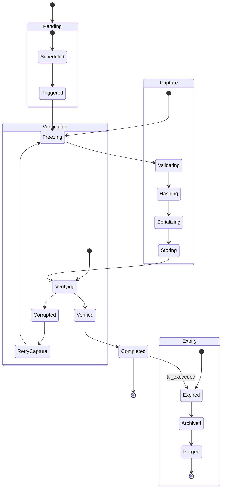

| State        | Description                  | Max Dwell Time |
| ------------ | ---------------------------- | -------------- |
| Scheduled    | منتظر رسیدن زمان ایست بازرسی | P1D            |
| Triggered    | فعال‌سازی فرآیند ذخیره‌سازی  | PT30S          |
| Freezing     | توقف موقت وضعیت              | PT5S           |
| Validating   | اعتبارسنجی سازگاری وضعیت     | PT10S          |
| Hashing      | تولید هش برای یکپارچگی       | PT3S           |
| Serializing  | تبدیل به فرمت ذخیره‌سازی     | PT15S          |
| Storing      | نوشتن در مخزن                | PT30S          |
| Verifying    | تأیید ذخیره‌سازی موفق        | PT10S          |
| Completed    | ایست بازرسی با موفقیت ثبت شد | —              |
| Corrupted    | داده‌های ذخیره‌شده خراب است  | PT60S          |
| RetryCapture | تلاش مجدد برای ثبت           | PT60S          |
| Expired      | پایان عمر ایست بازرسی        | —              |
| Archived     | بایگانی بلندمدت              | P90D           |
| Purged       | حذف کامل                     | —              |

---

## ۷. Checkpoint Content

هر ایست بازرسی شامل بخش‌های زیر است:

### ۷.۱ Core Components

| Component          | Required | Size Estimate | Description             |
| ------------------ | -------- | ------------- | ----------------------- |
| checkpointMetadata | ✅       | ۱KB           | فراداده ایست بازرسی     |
| workflowState      | ✅       | ۵KB           | وضعیت جاری Workflow     |
| executionContext   | ✅       | ۵۰KB          | بافت اجرا (SMOS-703)    |
| completedSteps     | ✅       | ۲KB           | لیست مراحل تکمیل‌شده    |
| variableSet        | ✅       | ۱۰KB          | متغیرهای جلسه           |
| pendingEvents      | ⚠️       | ۲۰KB          | رویدادهای در انتظار     |
| agentState         | ✅       | ۳۰KB          | وضعیت Agentهای فعال     |
| resourceAllocation | ✅       | ۵KB           | تخصیص منابع جاری        |
| auditTrail         | ✅       | ۱۰KB          | آخرین رویدادهای حسابرسی |
| hash               | ✅       | ۱KB           | هش یکپارچگی             |

### ۷.۲ پیکربندی انتخاب محتوا

```json
{
  "checkpointContentPolicy": {
    "defaultIncluded": [
      "checkpointMetadata",
      "workflowState",
      "executionContext",
      "completedSteps",
      "variableSet",
      "agentState",
      "resourceAllocation",
      "auditTrail",
      "hash"
    ],
    "optionalIncluded": ["pendingEvents"],
    "alwaysExcluded": ["temporaryCache", "logStreams", "metricsBuffer"],
    "maxContentSize": "10MB",
    "compressionAlgorithm": "zstd",
    "compressionLevel": 3
  }
}
```

---

## ۸. Checkpoint Storage Model

### ۸.۱ Storage Architecture

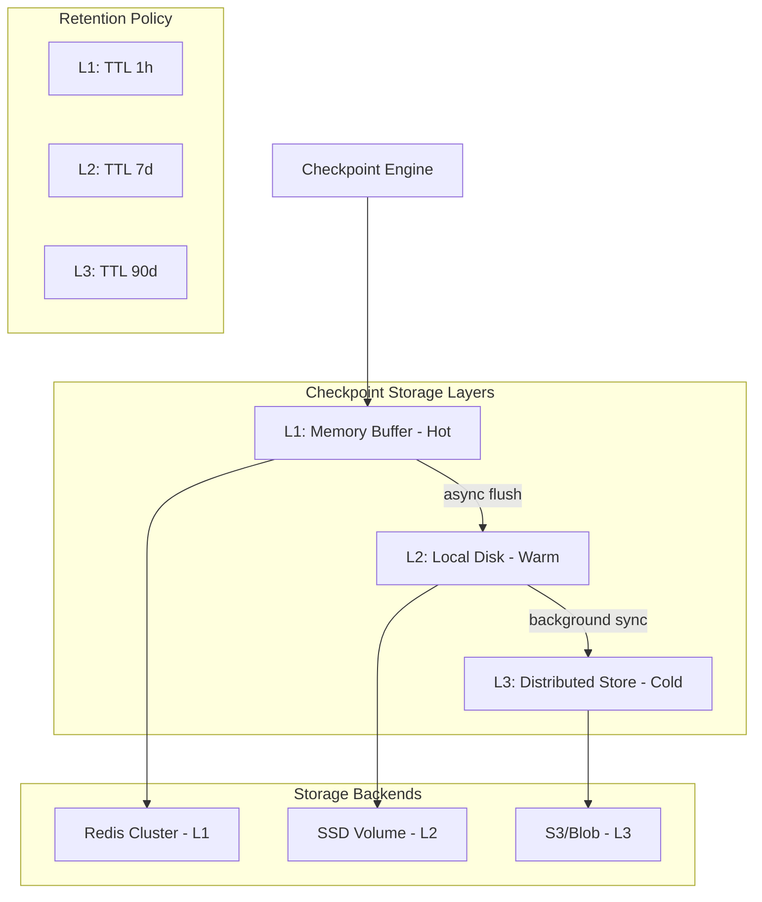

### ۸.۲ Storage Backend Selection

| Level | Backend       | Latency | Capacity | TTL | Use Case                            |
| ----- | ------------- | ------- | -------- | --- | ----------------------------------- |
| L1    | Redis Cluster | <۵ms    | ۱GB      | ۱h  | بازیابی سریع، آخرین ایست بازرسی     |
| L2    | Local SSD     | <۱۰۰ms  | ۵۰GB     | ۷d  | بازیابی معمول، ایست بازرسی‌های اخیر |
| L3    | S3-Compatible | <۱s     | نامحدود  | ۹۰d | بایگانی، ممیزی، Workflow Replay     |

### ۸.۳ Data Model

```json
{
  "$schema": "https://json-schema.org/draft-07/schema#",
  "$id": "smos://schemas/execution/checkpoint/v1",
  "title": "CheckpointRecord",
  "description": "A single checkpoint record for execution state",
  "type": "object",
  "required": [
    "checkpointId",
    "executionId",
    "checkpointType",
    "workflowId",
    "stepId",
    "content",
    "createdAt",
    "ttl",
    "hash"
  ],
  "properties": {
    "checkpointId": {
      "type": "string",
      "format": "uuid",
      "description": "Unique checkpoint identifier"
    },
    "executionId": {
      "type": "string",
      "format": "uuid",
      "description": "Parent execution identifier"
    },
    "checkpointType": {
      "type": "string",
      "enum": ["CP-01", "CP-02", "CP-03", "CP-04", "CP-05"],
      "description": "Type of checkpoint"
    },
    "workflowId": {
      "type": "string",
      "description": "Workflow definition identifier"
    },
    "stepId": {
      "type": "string",
      "description": "Step identifier at checkpoint time"
    },
    "content": {
      "type": "object",
      "description": "Checkpoint content payload",
      "properties": {
        "workflowState": { "type": "string" },
        "executionContext": { "$ref": "smos://schemas/execution/context/v1" },
        "completedSteps": {
          "type": "array",
          "items": { "type": "string" }
        },
        "variableSet": {
          "type": "object",
          "additionalProperties": true
        },
        "agentState": {
          "type": "array",
          "items": {
            "type": "object",
            "properties": {
              "agentId": { "type": "string" },
              "state": { "type": "string" },
              "output": { "type": "object" }
            }
          }
        },
        "pendingEvents": {
          "type": "array",
          "items": { "$ref": "smos://schemas/execution/event/v1" }
        },
        "resourceAllocation": { "type": "object" },
        "auditTrail": {
          "type": "array",
          "items": { "type": "object" }
        }
      }
    },
    "createdAt": {
      "type": "string",
      "format": "date-time",
      "description": "Checkpoint creation timestamp"
    },
    "ttl": {
      "type": "string",
      "pattern": "^P(\\d+D|\\d+W|\\d+M)$",
      "description": "Time-to-live in ISO 8601 duration"
    },
    "hash": {
      "type": "string",
      "description": "SHA-256 hash of content for integrity"
    },
    "size": {
      "type": "integer",
      "minimum": 0,
      "description": "Content size in bytes"
    },
    "compression": {
      "type": "string",
      "enum": ["none", "zstd", "gzip"],
      "default": "zstd"
    },
    "metadata": {
      "type": "object",
      "description": "Additional checkpoint metadata"
    }
  }
}
```

---

## ۹. Checkpoint Orchestration

### ۹.۱ Sequence: Normal Checkpoint Flow

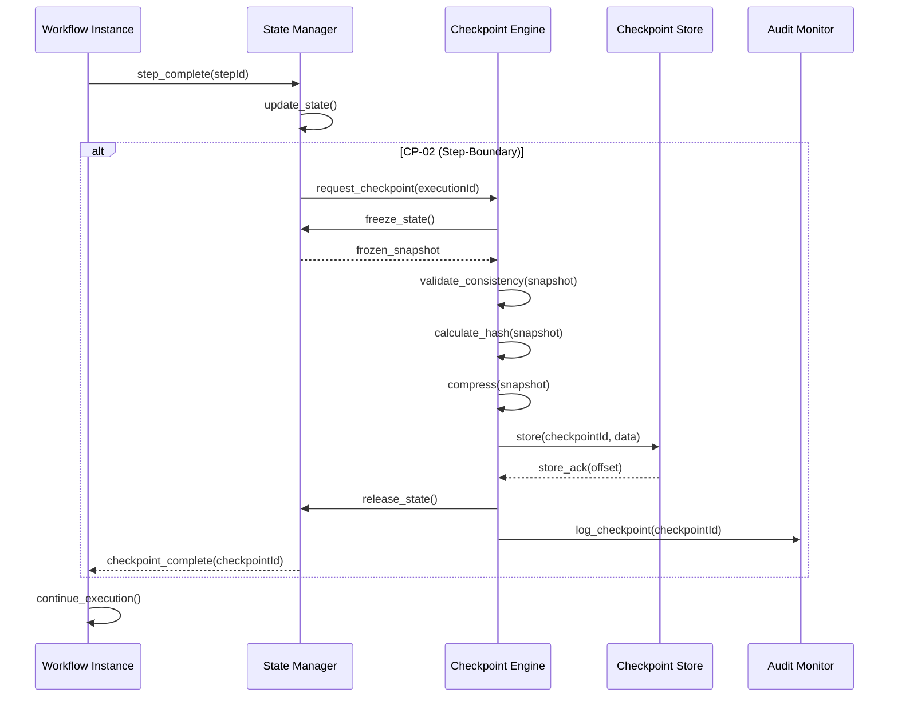

### ۹.۲ Sequence: Checkpoint Creation Failure

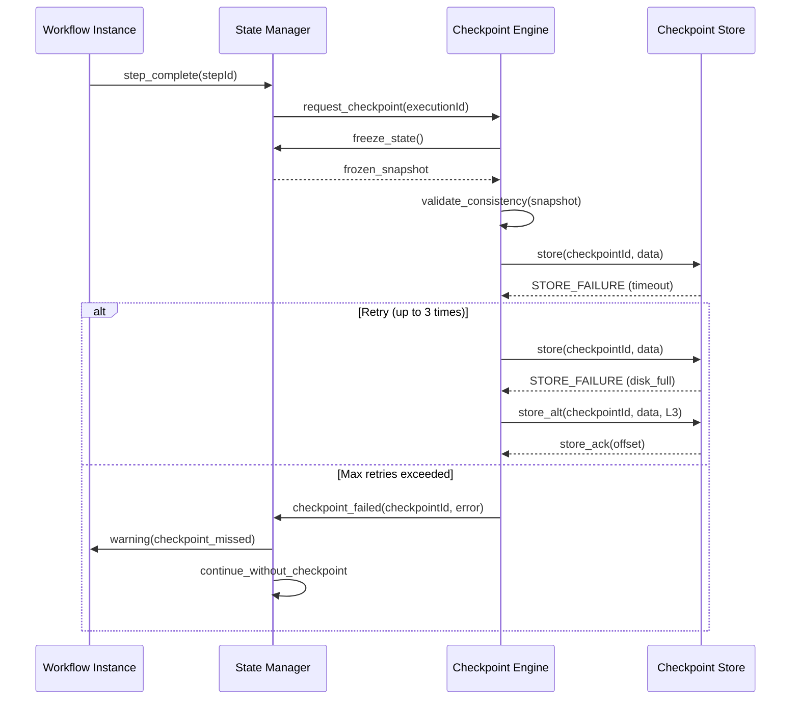

### ۹.۳ Checkpoint Decision Rules

| Rule       | Condition                     | Action                                    |
| ---------- | ----------------------------- | ----------------------------------------- |
| RULE-CP-01 | Periodic timer expired        | Trigger CP-01                             |
| RULE-CP-02 | Step completed                | Trigger CP-02 if step is checkpont-worthy |
| RULE-CP-03 | Manual request from Agent     | Trigger CP-03                             |
| RULE-CP-04 | Critical operation detected   | Trigger CP-04                             |
| RULE-CP-05 | System shutdown signal        | Trigger CP-05 on all active executions    |
| RULE-CP-06 | Storage failure on primary    | Switch to secondary storage               |
| RULE-CP-07 | Content exceeds 10MB          | Trim optional sections, warn              |
| RULE-CP-08 | Hash mismatch on verification | Retry capture (max 3)                     |

---

## ۱۰. Recovery Architecture Overview

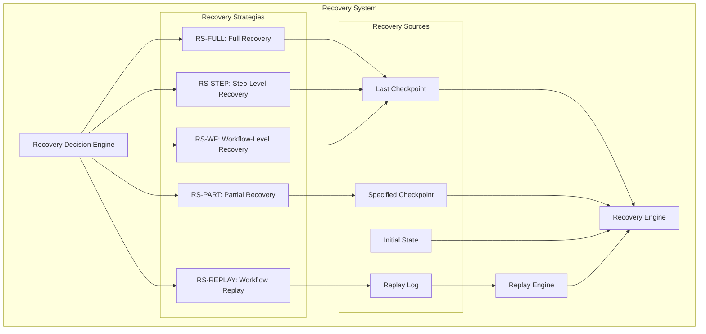

### Recovery Process Flow

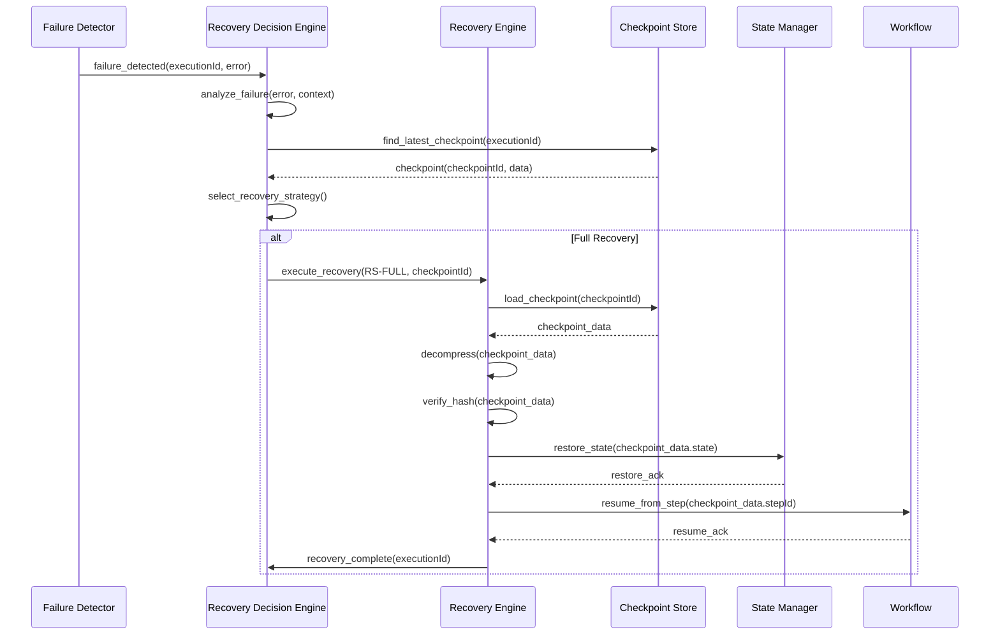

---

## ۱۱. Recovery Types

| Type ID   | Name                        | Description                       | RTO   | RPO  |
| --------- | --------------------------- | --------------------------------- | ----- | ---- |
| RS-FULL   | **Full Recovery**           | بازیابی کامل از آخرین ایست بازرسی | <۳۰s  | <۶۰s |
| RS-PART   | **Partial Recovery**        | بازیابی بخش مشخصی از اجرا         | <۱۵s  | <۳۰s |
| RS-STEP   | **Step-Level Recovery**     | بازیابی یک Step خاص               | <۱۰s  | <۵s  |
| RS-WF     | **Workflow-Level Recovery** | بازیابی کل Workflow از ابتدا      | <۶۰s  | ۰    |
| RS-REPLAY | **Workflow Replay**         | بازپخش ضبط‌شده Workflow           | متغیر | ۰    |

### ۱۱.۱ Full Recovery (RS-FULL)

```json
{
  "recoveryType": "RS-FULL",
  "executionId": "e-f4a2b8c0",
  "sourceCheckpoint": "cp-a1b2c3d4",
  "restoreSteps": [
    "validate_checkpoint_integrity",
    "load_state_snapshot",
    "restore_context",
    "restore_variables",
    "restore_agent_states",
    "restore_pending_events",
    "reestablish_resource_allocations",
    "resume_execution"
  ],
  "validationGates": [
    "state_consistency_check",
    "context_integrity_check",
    "variable_continuity_check"
  ],
  "estimatedRTO": "30s",
  "estimatedRPO": "60s"
}
```

### ۱۱.۲ Partial Recovery (RS-PART)

```json
{
  "recoveryType": "RS-PART",
  "executionId": "e-f4a2b8c0",
  "scope": {
    "agents": ["AI-003", "AI-006"],
    "steps": ["content_generation", "media_production"],
    "variables": ["contentId", "templateId", "mediaUrls"]
  },
  "restoreStrategy": "selective_restore"
}
```

### ۱۱.۳ Step-Level Recovery (RS-STEP)

| Scenario                    | Trigger                     | Recovery Point        |
| --------------------------- | --------------------------- | --------------------- |
| Agent timeout               | AI-003 timeout > 30s        | Step start checkpoint |
| Invalid output              | Validation failure (AI-004) | Step start checkpoint |
| Resource exhaustion         | Memory/CPU exceeded         | Step start checkpoint |
| External dependency failure | API unavailable             | Step start checkpoint |

### ۱۱.۴ Workflow-Level Recovery (RS-WF)

| Scenario              | Trigger                     | Action                     |
| --------------------- | --------------------------- | -------------------------- |
| Catastrophic failure  | Runtime crash               | Restart entire workflow    |
| Data corruption       | Hash mismatch               | Restart from initial state |
| Configuration change  | Workflow definition updated | Re-execute with new config |
| Long-duration failure | Retry budget exhausted      | Escalate to human          |

---

## ۱۲. Recovery Lifecycle

```mermaid
stateDiagram-v2
    direction TB
    [*] --> Detecting
    Detecting --> Analyzing

    state Analyzing {
        [*] --> Classifying
        Classifying --> ImpactAssessing
        ImpactAssessing --> StrategySelecting
    }

    Analyzing --> Restoring
    Analyzing --> Escalating : unresolvable
    Escalating --> HumanIntervention

    state Restoring {
        [*] --> LoadingCheckpoint
        LoadingCheckpoint --> VerifyingIntegrity
        VerifyingIntegrity --> Decompressing
        Decompressing --> RestoringState
        RestoringState --> ValidatingConsistency
    end

    Restoring --> Resuming
    ValidatingConsistency --> ConsistencyFailed
    ConsistencyFailed --> AlternativeStrategy
    AlternativeStrategy --> Restoring

    state Resuming {
        [*] --> ReestablishingContext
        ReestablishingContext --> ReallocatingResources
        ReallocatingResources --> ContinuingExecution
    }

    Resuming --> Completed
    Resuming --> PartialSuccess
    PartialSuccess --> Completed
    Resuming --> FailedRecovery
    FailedRecovery --> Escalating

    HumanIntervention --> Completed
    Completed --> [*]
```

### Recovery States

| State                 | Description                     | Max Dwell Time |
| --------------------- | ------------------------------- | -------------- |
| Detecting             | تشخیص خطا توسط Failure Detector | PT10S          |
| Analyzing             | تحلیل خطا و انتخاب استراتژی     | PT15S          |
| Classifying           | طبقه‌بندی نوع خطا               | PT5S           |
| ImpactAssessing       | ارزیابی تأثیر خطا               | PT10S          |
| StrategySelecting     | انتخاب استراتژی بازیابی         | PT3S           |
| Restoring             | اجرای بازیابی                   | PT30S          |
| LoadingCheckpoint     | بارگذاری ایست بازرسی            | PT10S          |
| VerifyingIntegrity    | تأیید یکپارچگی                  | PT5S           |
| Decompressing         | خارج‌سازی از فشرده‌سازی         | PT5S           |
| RestoringState        | بازگردانی وضعیت                 | PT15S          |
| ValidatingConsistency | اعتبارسنجی سازگاری              | PT10S          |
| Resuming              | ادامه اجرا                      | PT10S          |
| ReestablishingContext | بازسازی بافت                    | PT5S           |
| ReallocatingResources | تخصیص مجدد منابع                | PT5S           |
| ContinuingExecution   | ادامه اجرا                      | —              |
| ConsistencyFailed     | شکست اعتبارسنجی سازگاری         | PT30S          |
| AlternativeStrategy   | تلاش با استراتژی جایگزین        | PT60S          |
| Escalating            | ارجاع به انسان                  | PT5M           |
| HumanIntervention     | مداخله انسانی                   | P1D            |
| PartialSuccess        | بازیابی نسبی                    | —              |
| FailedRecovery        | شکست کامل بازیابی               | —              |
| Completed             | بازیابی موفق                    | —              |

---

## ۱۳. Recovery Decision Engine

### ۱۳.۱ Decision Matrix

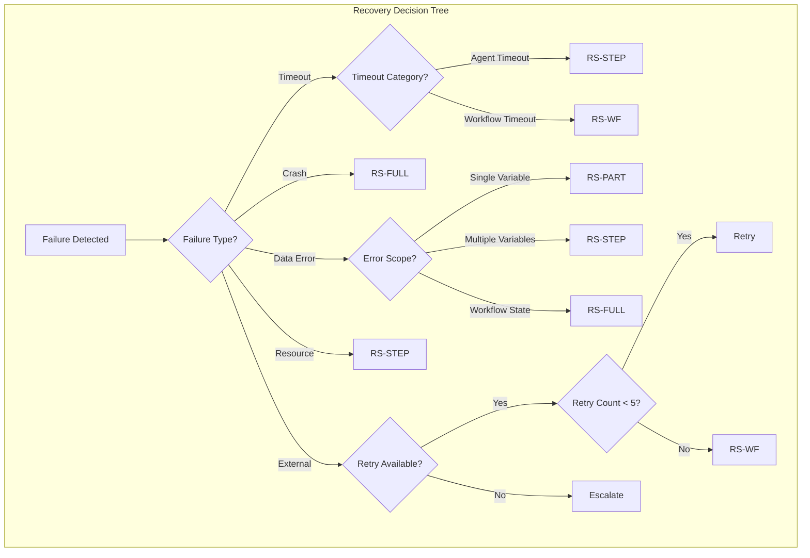

### ۱۳.۲ Decision Rules

| Rule ID     | Condition                        | Selected Strategy | Priority |
| ----------- | -------------------------------- | ----------------- | -------- |
| RULE-REC-01 | Agent timeout (single)           | RS-STEP           | ۱        |
| RULE-REC-02 | Agent crash                      | RS-STEP           | ۱        |
| RULE-REC-03 | Workflow timeout > ۵min          | RS-WF             | ۲        |
| RULE-REC-04 | Workflow runtime crash           | RS-FULL           | ۱        |
| RULE-REC-05 | Data corruption (variable)       | RS-PART           | ۲        |
| RULE-REC-06 | Data corruption (state)          | RS-FULL           | ۱        |
| RULE-REC-07 | Resource exhaustion (transient)  | RS-STEP           | ۲        |
| RULE-REC-08 | External API failure (retryable) | Retry + RS-STEP   | ۱        |
| RULE-REC-09 | External API failure (permanent) | RS-WF             | ۳        |
| RULE-REC-10 | Validation failure (single step) | RS-STEP           | ۱        |
| RULE-REC-11 | Validation failure (chain)       | RS-WF             | ۲        |
| RULE-REC-12 | Storage backend unavailable      | RS-REPLAY         | ۳        |
| RULE-REC-13 | Concurrent modification          | RS-PART           | ۲        |
| RULE-REC-14 | Configuration mismatch           | RS-WF             | ۳        |

### ۱۳.۳ Recovery Decision Schema

```json
{
  "$schema": "https://json-schema.org/draft-07/schema#",
  "$id": "smos://schemas/execution/recovery-decision/v1",
  "title": "RecoveryDecision",
  "description": "Decision record for recovery strategy selection",
  "type": "object",
  "required": [
    "decisionId",
    "executionId",
    "failureType",
    "selectedStrategy",
    "rulesApplied",
    "timestamp"
  ],
  "properties": {
    "decisionId": {
      "type": "string",
      "format": "uuid"
    },
    "executionId": {
      "type": "string",
      "format": "uuid"
    },
    "failureType": {
      "type": "string",
      "enum": [
        "timeout",
        "crash",
        "data_error",
        "resource_exhaustion",
        "external_failure",
        "validation_failure",
        "storage_failure",
        "concurrent_modification",
        "config_mismatch",
        "unknown"
      ]
    },
    "failureSeverity": {
      "type": "string",
      "enum": ["LOW", "MEDIUM", "HIGH", "CRITICAL"]
    },
    "selectedStrategy": {
      "type": "string",
      "enum": ["RS-FULL", "RS-PART", "RS-STEP", "RS-WF", "RS-REPLAY", "ESCALATE"]
    },
    "rulesApplied": {
      "type": "array",
      "items": { "type": "string" },
      "minItems": 1
    },
    "alternativeStrategies": {
      "type": "array",
      "items": { "type": "string" }
    },
    "context": {
      "type": "object",
      "properties": {
        "failedStepId": { "type": "string" },
        "failedAgentId": { "type": "string" },
        "failureMessage": { "type": "string" },
        "retryCount": {
          "type": "integer",
          "minimum": 0
        },
        "lastCheckpointId": { "type": "string" },
        "checkpointAge": { "type": "string" }
      }
    },
    "timestamp": {
      "type": "string",
      "format": "date-time"
    },
    "decisionDuration": {
      "type": "integer",
      "minimum": 0,
      "description": "Decision time in milliseconds"
    }
  }
}
```

---

## ۱۴. Workflow Replay

### ۱۴.۱ Replay Architecture

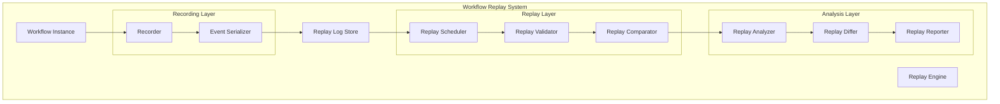

### ۱۴.۲ Recording

هر Workflow在执行时، کلیه رویدادها و انتقال‌های وضعیت در Replay Log ثبت می‌شود:

```json
{
  "$schema": "https://json-schema.org/draft-07/schema#",
  "$id": "smos://schemas/execution/replay-entry/v1",
  "title": "ReplayLogEntry",
  "description": "A single entry in the workflow replay log",
  "type": "object",
  "required": [
    "entryId",
    "executionId",
    "sequenceNumber",
    "eventType",
    "eventData",
    "stateBefore",
    "stateAfter",
    "timestamp",
    "agentId"
  ],
  "properties": {
    "entryId": {
      "type": "string",
      "format": "uuid"
    },
    "executionId": {
      "type": "string",
      "format": "uuid"
    },
    "sequenceNumber": {
      "type": "integer",
      "minimum": 1
    },
    "eventType": {
      "type": "string",
      "enum": [
        "STEP_START",
        "STEP_COMPLETE",
        "STEP_FAILED",
        "STATE_TRANSITION",
        "CHECKPOINT_CREATED",
        "TOOL_CALL",
        "TOOL_RESULT",
        "AGENT_REPLY",
        "CONTEXT_UPDATE",
        "VARIABLE_CHANGE",
        "DECISION_MADE",
        "KNOWLEDGE_QUERY",
        "PUBLISH_ACTION",
        "EXTERNAL_CALL",
        "ERROR_OCCURRED",
        "RECOVERY_INITIATED"
      ]
    },
    "eventData": {
      "type": "object",
      "description": "Event-specific payload"
    },
    "stateBefore": {
      "type": "object",
      "description": "State snapshot before event"
    },
    "stateAfter": {
      "type": "object",
      "description": "State snapshot after event"
    },
    "timestamp": {
      "type": "string",
      "format": "date-time"
    },
    "agentId": {
      "type": "string",
      "description": "Agent that produced the event"
    },
    "duration": {
      "type": "integer",
      "minimum": 0,
      "description": "Event processing time (ms)"
    },
    "correlationId": {
      "type": "string",
      "description": "Correlation identifier for grouped events"
    },
    "metadata": {
      "type": "object",
      "description": "Additional context"
    }
  }
}
```

### ۱۴.۳ Replay Engine

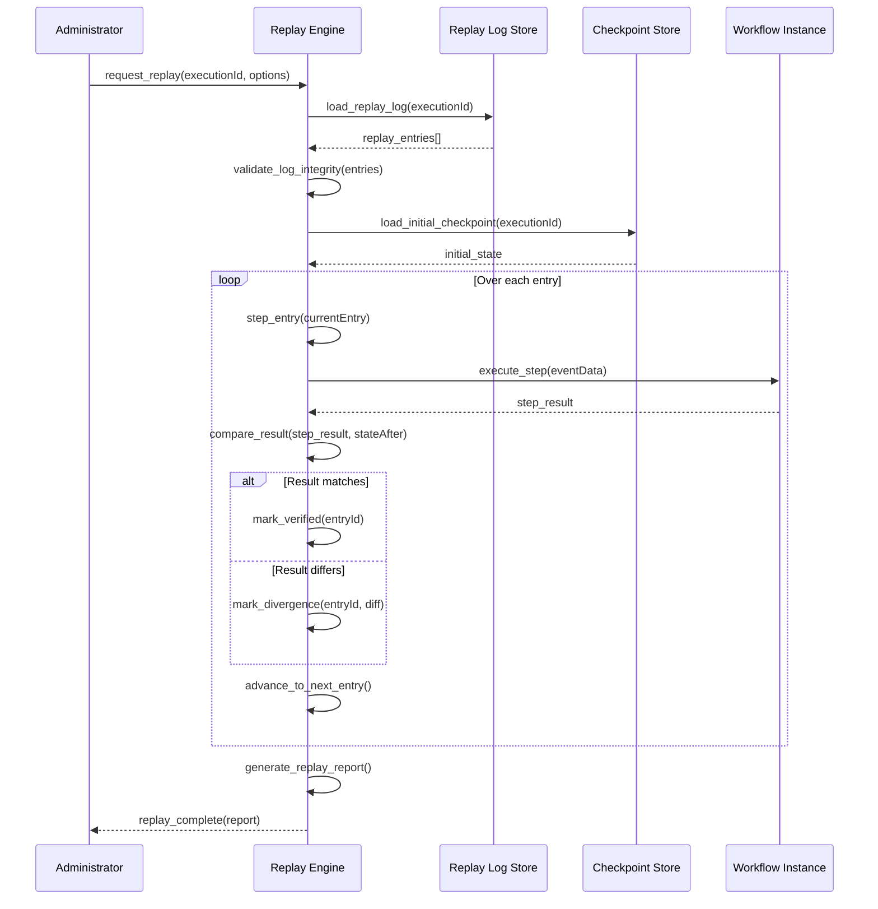

### ۱۴.۴ Replay Consistency Validation

| Validation | Description                 | Criteria                          |
| ---------- | --------------------------- | --------------------------------- |
| V-RPL-01   | Sequence continuity         | sequenceNumber بدون شکاف          |
| V-RPL-02   | State transition validity   | انتقال وضعیت مطابق SMOS-702       |
| V-RPL-03   | Timestamp ordering          | timestamps strictly increasing    |
| V-RPL-04   | Deterministic output        | خروجی یکسان برای ورودی یکسان      |
| V-RPL-05   | Checkpoint alignment        | ایست بازرسی در نقاط منطبق         |
| V-RPL-06   | Event completeness          | همه رویدادهای ضروری ثبت شده‌اند   |
| V-RPL-07   | Agent identity consistency  | agentId در سراسر replay یکسان است |
| V-RPL-08   | Resource allocation logging | تخصیص منابع قابل بازتولید است     |

---

## ۱۵. Recovery Failure Scenarios

### ۱۵.۱ Failure Scenario Catalog

| Scenario ID | Name                                      | Probability | Impact   | Recovery Strategy              |
| ----------- | ----------------------------------------- | ----------- | -------- | ------------------------------ |
| FSC-01      | Last checkpoint corrupted                 | Medium      | High     | RS-WF with initial state       |
| FSC-02      | Checkpoint storage unavailable            | Low         | Critical | RS-REPLAY                      |
| FSC-03      | Hash mismatch during restore              | Medium      | Medium   | RS-PART (reload from L3)       |
| FSC-04      | State inconsistent after restore          | Low         | High     | RS-WF                          |
| FSC-05      | Partial restore fails mid-way             | Low         | Medium   | RS-FULL retry                  |
| FSC-06      | Replay log truncated                      | Medium      | High     | RS-FULL from last valid CP     |
| FSC-07      | Replay output divergence                  | Medium      | Medium   | Generate diff report, escalate |
| FSC-08      | Recovery agent itself crashes             | Low         | Critical | Supervisor recovery            |
| FSC-09      | TTL expired on all checkpoints            | Low         | Critical | RS-WF from scratch             |
| FSC-10      | Concurrent recovery conflicts             | Medium      | High     | Lock-based serialization       |
| FSC-11      | Resource allocation fails during recovery | Medium      | Medium   | RS-STEP with backoff           |
| FSC-12      | External dependency changed               | High        | Medium   | RS-WF with re-validation       |

### ۱۵.۲ Scenario: Last Checkpoint Corrupted (FSC-01)

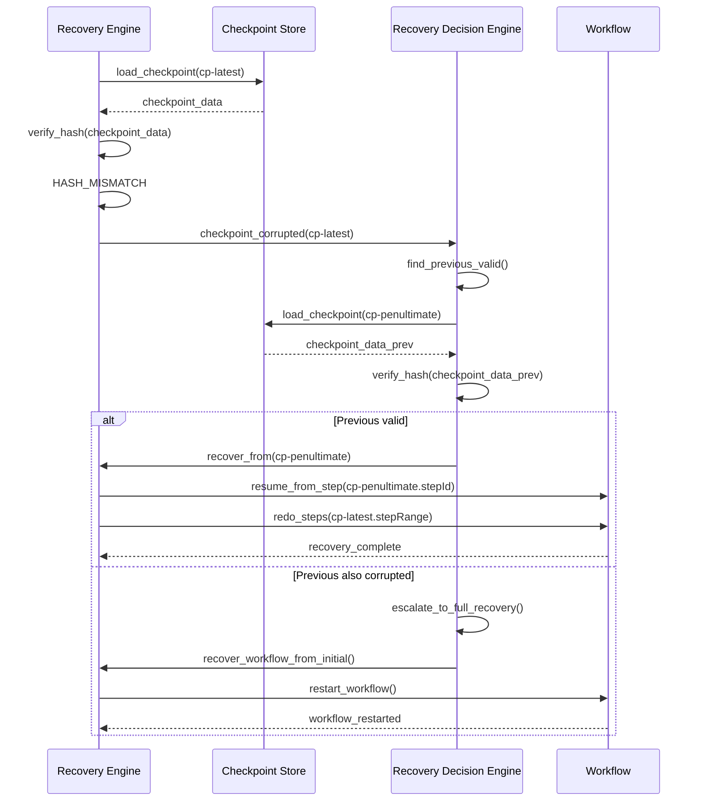

### ۱۵.۳ Scenario: Recovery Agent Crash (FSC-08)

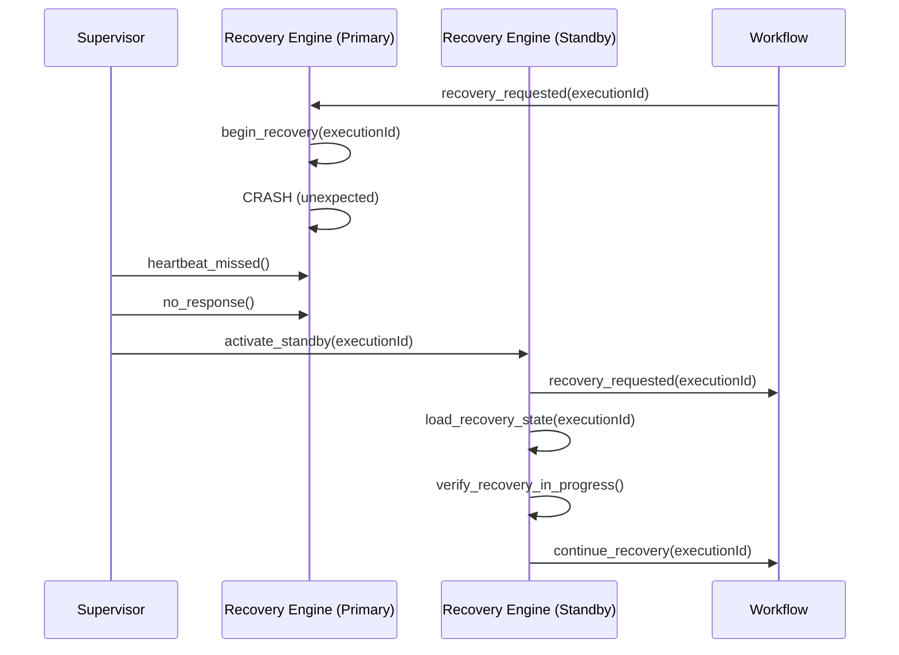

---

## ۱۶. Failure Detection & Classification

### ۱۶.۱ Detection Architecture

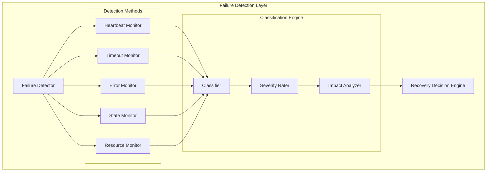

### ۱۶.۲ Detection Methods

| Method            | Mechanism                        | Interval       | False Positive Rate |
| ----------------- | -------------------------------- | -------------- | ------------------- |
| Heartbeat Monitor | Agent heartbeat every ۵s         | ۵s             | < ۱٪                |
| Timeout Monitor   | SLA-based timeout tracking       | Per-call       | < ۰.۱٪              |
| Error Monitor     | Error event stream analysis      | Real-time      | < ۲٪                |
| State Monitor     | State machine invariant checking | Per-transition | < ۰.۵٪              |
| Resource Monitor  | CPU/Memory/Disk threshold        | ۱۰s            | < ۱٪                |

### ۱۶.۳ Failure Classification Matrix

| Class              | ID     | Examples                                      | Detection Method   | Default Action    |
| ------------------ | ------ | --------------------------------------------- | ------------------ | ----------------- |
| **Transient**      | FCL-01 | Network timeout, rate limit, connection reset | Heartbeat, Timeout | Retry (immediate) |
| **Resource**       | FCL-02 | OOM, CPU spike, disk full                     | Resource Monitor   | Retry (backoff)   |
| **Logic**          | FCL-03 | Invalid state, bad output, validation fail    | State, Error       | RS-STEP           |
| **Infrastructure** | FCL-04 | Storage down, DB unavailable                  | Heartbeat, Error   | RS-FULL           |
| **Security**       | FCL-05 | Auth failure, permission denied               | Error Monitor      | Escalate          |
| **Data**           | FCL-06 | Corruption, schema mismatch, hash fail        | State, Error       | RS-WF             |

### ۱۶.۴ Detection Configuration

```json
{
  "$schema": "https://json-schema.org/draft-07/schema#",
  "$id": "smos://schemas/execution/failure-detection/v1",
  "title": "FailureDetectionConfig",
  "description": "Configuration for failure detection subsystem",
  "type": "object",
  "required": ["enabled", "methods"],
  "properties": {
    "enabled": { "type": "boolean", "default": true },
    "methods": {
      "type": "object",
      "properties": {
        "heartbeat": {
          "type": "object",
          "properties": {
            "intervalMs": { "type": "integer", "default": 5000 },
            "missedThreshold": { "type": "integer", "default": 3 },
            "enabled": { "type": "boolean", "default": true }
          }
        },
        "timeout": {
          "type": "object",
          "properties": {
            "defaultTimeoutMs": { "type": "integer", "default": 30000 },
            "toleranceFactor": { "type": "number", "default": 1.5 },
            "enabled": { "type": "boolean", "default": true }
          }
        },
        "stateMonitor": {
          "type": "object",
          "properties": {
            "checkIntervalMs": { "type": "integer", "default": 10000 },
            "invariantViolationThreshold": { "type": "integer", "default": 1 },
            "enabled": { "type": "boolean", "default": true }
          }
        },
        "errorStream": {
          "type": "object",
          "properties": {
            "bufferSize": { "type": "integer", "default": 1000 },
            "analysisWindowMs": { "type": "integer", "default": 60000 },
            "enabled": { "type": "boolean", "default": true }
          }
        }
      }
    },
    "classification": {
      "type": "object",
      "properties": {
        "autoClassify": { "type": "boolean", "default": true },
        "overrideRules": {
          "type": "array",
          "items": {
            "type": "object",
            "properties": {
              "errorPattern": { "type": "string" },
              "overrideClass": { "type": "string" }
            }
          }
        }
      }
    }
  }
}
```

---

## ۱۷. Retry Strategies for Recovery

### ۱۶.۱ Retry Configuration

```json
{
  "$schema": "https://json-schema.org/draft-07/schema#",
  "$id": "smos://schemas/execution/retry-config/v1",
  "title": "RetryConfiguration",
  "description": "Retry strategy configuration for recovery operations",
  "type": "object",
  "required": ["strategy", "maxRetries", "backoffType"],
  "properties": {
    "strategy": {
      "type": "string",
      "enum": [
        "IMMEDIATE",
        "FIXED_DELAY",
        "EXPONENTIAL_BACKOFF",
        "LINEAR_BACKOFF",
        "JITTERED_BACKOFF",
        "CIRCUIT_BREAKER"
      ]
    },
    "maxRetries": {
      "type": "integer",
      "minimum": 0,
      "maximum": 10,
      "default": 3
    },
    "backoffType": {
      "type": "string",
      "enum": ["none", "fixed", "linear", "exponential", "jittered"]
    },
    "initialDelayMs": {
      "type": "integer",
      "minimum": 100,
      "default": 1000
    },
    "maxDelayMs": {
      "type": "integer",
      "minimum": 1000,
      "default": 60000
    },
    "multiplier": {
      "type": "number",
      "minimum": 1.0,
      "default": 2.0
    },
    "jitterFactor": {
      "type": "number",
      "minimum": 0.0,
      "maximum": 1.0,
      "default": 0.1
    },
    "retryOnErrors": {
      "type": "array",
      "items": { "type": "string" },
      "description": "Error types that trigger retry"
    },
    "circuitBreakerThreshold": {
      "type": "integer",
      "minimum": 1,
      "default": 5,
      "description": "Failures before circuit opens"
    },
    "circuitBreakerResetMs": {
      "type": "integer",
      "minimum": 10000,
      "default": 60000,
      "description": "Time before circuit half-opens"
    }
  }
}
```

### ۱۶.۲ Retry Strategy Table

| Strategy            | Use Case                      | Base Delay | Max Delay | Retries    | Description     |
| ------------------- | ----------------------------- | ---------- | --------- | ---------- | --------------- |
| IMMEDIATE           | Transient network error       | ۰          | ۰         | ۲          | بدون تأخیر      |
| FIXED_DELAY         | Storage temporary unavailable | ۵s         | ۵s        | ۳          | تأخیر ثابت      |
| EXPONENTIAL_BACKOFF | Resource exhaustion           | ۱s         | ۳۰s       | ۵          | ضریب ۲          |
| LINEAR_BACKOFF      | Rate limiting                 | ۲s         | ۲۰s       | ۴          | افزایش خطی      |
| JITTERED_BACKOFF    | Concurrent recovery conflicts | ۱s         | ۶۰s       | ۵          | تصادفی‌سازی‌شده |
| CIRCUIT_BREAKER     | Persistent storage failure    | —          | —         | ۵ (window) | قطع خودکار      |

### ۱۶.۳ Retry State Machine

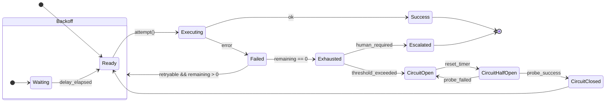

---

## ۱۷. Checkpoint & Recovery Monitoring

### ۱۷.۱ Monitoring Dimensions

| Dimension                 | Metrics                                                  | Collection Method | Alert Threshold  |
| ------------------------- | -------------------------------------------------------- | ----------------- | ---------------- |
| **Checkpoint Coverage**   | checkpoints_per_workflow, steps_per_checkpoint           | Event counter     | < ۳ per workflow |
| **Checkpoint Latency**    | freeze_time, serialize_time, store_time, total_time      | Histogram         | p99 > ۵s         |
| **Checkpoint Size**       | content_size, compression_ratio                          | Gauge             | > ۱۰MB           |
| **Recovery Success Rate** | recovery_attempts, recovery_successes, recovery_failures | Counter           | < ۹۹.۹٪          |
| **Recovery Duration**     | detect_time, decide_time, restore_time, resume_time      | Histogram         | p99 > ۶۰s        |
| **RPO Compliance**        | data_loss_seconds                                        | Gauge             | > ۶۰s            |
| **RTO Compliance**        | recovery_total_time                                      | Histogram         | p99 > ۳۰s        |
| **Replay Consistency**    | replay_attempts, divergences, verified_entries           | Counter           | divergence > ۰   |
| **Storage Usage**         | storage_used, storage_available, ttl_expired             | Gauge             | > ۸۰٪ capacity   |

### ۱۷.۲ Alert Rules

| Alert ID  | Condition                                | Severity | Action                          |
| --------- | ---------------------------------------- | -------- | ------------------------------- |
| ALR-CP-01 | Checkpoint coverage < ۳ per workflow     | WARNING  | Log, notify orchestrator        |
| ALR-CP-02 | Checkpoint store latency > ۵s            | WARNING  | Switch to L2 storage            |
| ALR-CP-03 | Checkpoint store failure > ۳ consecutive | CRITICAL | Failover to backup store        |
| ALR-CP-04 | Recovery success rate < ۹۹.۵٪            | WARNING  | Analyze failure patterns        |
| ALR-CP-05 | Recovery success rate < ۹۹.۰٪            | CRITICAL | Escalate to operations          |
| ALR-CP-06 | Recovery duration > ۶۰s                  | WARNING  | Optimize recovery path          |
| ALR-CP-07 | RPO exceeded > ۶۰s                       | CRITICAL | Increase checkpoint frequency   |
| ALR-CP-08 | Replay divergence detected               | WARNING  | Generate divergence report      |
| ALR-CP-09 | Checkpoint storage > ۸۰٪                 | WARNING  | Initiate TTL cleanup            |
| ALR-CP-10 | Checkpoint storage > ۹۵٪                 | CRITICAL | Force purge expired checkpoints |

### ۱۷.۳ Monitoring Schema

```json
{
  "$schema": "https://json-schema.org/draft-07/schema#",
  "$id": "smos://schemas/monitoring/checkpoint-metric/v1",
  "title": "CheckpointMetric",
  "description": "A single checkpoint metric data point",
  "type": "object",
  "required": ["metricId", "metricType", "checkpointId", "executionId", "value", "timestamp"],
  "properties": {
    "metricId": {
      "type": "string",
      "format": "uuid"
    },
    "metricType": {
      "type": "string",
      "enum": [
        "checkpoint_latency",
        "checkpoint_size",
        "compression_ratio",
        "checkpoint_coverage",
        "recovery_duration",
        "recovery_success",
        "data_loss_seconds",
        "replay_verification_time",
        "storage_usage_bytes",
        "storage_available_bytes"
      ]
    },
    "checkpointId": { "type": "string" },
    "executionId": { "type": "string" },
    "value": { "type": "number" },
    "unit": {
      "type": "string",
      "enum": ["ms", "s", "bytes", "count", "ratio", "percent"]
    },
    "tags": {
      "type": "object",
      "additionalProperties": { "type": "string" },
      "description": "Metric tags for filtering"
    },
    "timestamp": {
      "type": "string",
      "format": "date-time"
    }
  }
}
```

---

## ۱۸. Checkpoint & Recovery Security

### ۱۸.۱ Security Principles

| #   | Principle                  | Description                                                   |
| --- | -------------------------- | ------------------------------------------------------------- |
| ۱   | **Encryption at Rest**     | تمام ایست بازرسی‌ها در L2 و L3 رمزنگاری می‌شوند               |
| ۲   | **Encryption in Transit**  | تمام انتقال داده بین اجزاء از TLS 1.3 استفاده می‌کند          |
| ۳   | **Integrity Verification** | هر ایست بازرسی دارای SHA-256 hash برای تأیید یکپارچگی است     |
| ۴   | **Access Control**         | فقط Agentهای مجاز می‌توانند ایست بازرسی ایجاد یا بازیابی کنند |
| ۵   | **Audit Trail**            | تمام عملیات ایست بازرسی و بازیابی ثبت می‌شود                  |
| ۶   | **Non-Repudiation**        | هر ایست بازرسی با امضای دیجیتال Agent ایجادکننده همراه است    |
| ۷   | **Data Minimization**      | فقط داده‌های ضروری در ایست بازرسی ذخیره می‌شود                |
| ۸   | **Secure Purge**           | حذف ایست بازرسی‌ها با overwrite امن انجام می‌شود              |

### ۱۸.۲ Access Control Matrix

| Operation              | AI-014 | Agent Owner | Other Agent | Human Admin | System   |
| ---------------------- | ------ | ----------- | ----------- | ----------- | -------- |
| Create Checkpoint      | ✅     | ✅          | ❌          | ❌          | ✅       |
| Read Own Checkpoint    | ✅     | ✅          | ❌          | ✅          | ✅       |
| Read Any Checkpoint    | ✅     | ❌          | ❌          | ✅          | ❌       |
| Delete Checkpoint      | ✅     | ❌          | ❌          | ✅          | ✅ (TTL) |
| Initiate Recovery      | ✅     | ✅ (own)    | ❌          | ✅          | ✅       |
| Modify Recovery Config | ✅     | ❌          | ❌          | ✅          | ❌       |
| Access Replay Log      | ✅     | ✅ (own)    | ❌          | ✅          | ✅       |
| Purge Expired          | ✅     | ❌          | ❌          | ✅          | ✅       |

### ۱۸.۳ Checkpoint Security Schema

```json
{
  "$schema": "https://json-schema.org/draft-07/schema#",
  "$id": "smos://schemas/execution/checkpoint-security/v1",
  "title": "CheckpointSecurity",
  "description": "Security attributes for checkpoint records",
  "type": "object",
  "required": [
    "checkpointId",
    "encryptionAlgorithm",
    "signingAlgorithm",
    "signature",
    "accessScope"
  ],
  "properties": {
    "checkpointId": {
      "type": "string",
      "format": "uuid"
    },
    "encryptionAlgorithm": {
      "type": "string",
      "enum": ["AES-256-GCM", "AES-256-CBC", "CHACHA20-POLY1305"],
      "default": "AES-256-GCM"
    },
    "encryptionKeyId": {
      "type": "string",
      "description": "Reference to KMS key"
    },
    "encryptionIV": {
      "type": "string",
      "description": "Initialization vector (base64)"
    },
    "signingAlgorithm": {
      "type": "string",
      "enum": ["Ed25519", "ECDSA-P256", "HMAC-SHA256"],
      "default": "Ed25519"
    },
    "signature": {
      "type": "string",
      "description": "Digital signature of checkpoint content (base64)"
    },
    "signingAgentId": {
      "type": "string",
      "description": "Agent that signed the checkpoint"
    },
    "accessScope": {
      "type": "string",
      "enum": ["PRIVATE", "WORKFLOW", "DOMAIN", "SYSTEM"],
      "description": "Access scope for the checkpoint"
    },
    "allowedReaders": {
      "type": "array",
      "items": { "type": "string" },
      "description": "List of agent IDs allowed to read"
    },
    "integrityHash": {
      "type": "string",
      "description": "SHA-256 hash of decrypted content"
    }
  }
}
```

### ۱۸.۴ Secure Recovery Protocol

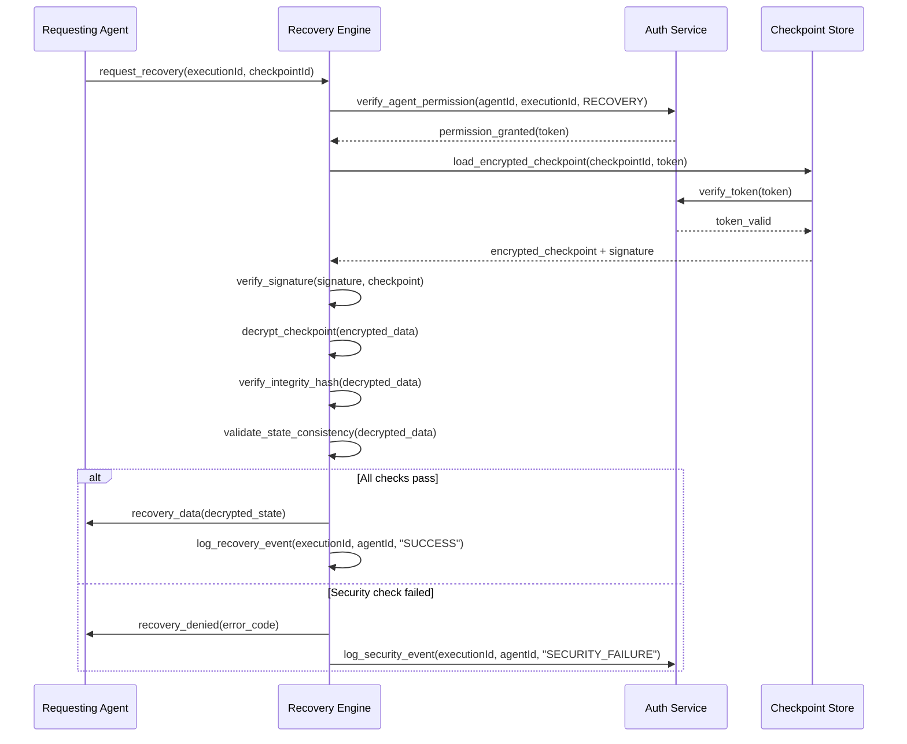

---

## ۱۹. Scaling & Multi-Tenancy

### ۱۹.۱ Scaling Model

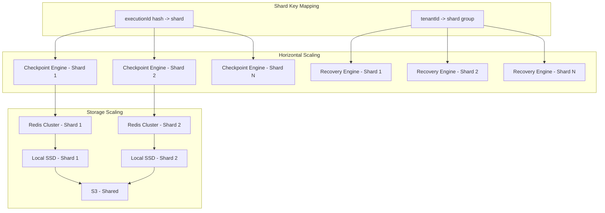

### ۱۹.۲ Multi-Tenancy Isolation

| Isolation Level | Tenants Share                   | Separated By     | Use Case              |
| --------------- | ------------------------------- | ---------------- | --------------------- |
| L1-ISOLATION    | Storage cluster                 | Prefix/Namespace | Low-risk tenants      |
| L2-ISOLATION    | Storage cluster, separate shard | Shard key        | Medium-risk tenants   |
| L3-ISOLATION    | Nothing — dedicated storage     | Dedicated L2/L3  | High-security tenants |
| L4-ISOLATION    | Nothing — dedicated engines     | Full separation  | Regulatory/Compliance |

### ۱۹.۳ Tenant Configuration

```json
{
  "$schema": "https://json-schema.org/draft-07/schema#",
  "$id": "smos://schemas/execution/checkpoint-tenant-config/v1",
  "title": "CheckpointTenantConfig",
  "description": "Tenant-specific checkpoint & recovery configuration",
  "type": "object",
  "required": ["tenantId", "isolationLevel", "storageQuota"],
  "properties": {
    "tenantId": {
      "type": "string",
      "description": "Unique tenant identifier"
    },
    "isolationLevel": {
      "type": "string",
      "enum": ["L1-ISOLATION", "L2-ISOLATION", "L3-ISOLATION", "L4-ISOLATION"]
    },
    "checkpointConfig": {
      "type": "object",
      "properties": {
        "enabled": { "type": "boolean", "default": true },
        "periodicInterval": {
          "type": "string",
          "pattern": "^PT\\d+S$",
          "default": "PT60S"
        },
        "maxCheckpointSize": {
          "type": "string",
          "pattern": "^\\d+MB$",
          "default": "10MB"
        },
        "retentionDays": {
          "type": "integer",
          "minimum": 1,
          "maximum": 90,
          "default": 7
        },
        "compressionEnabled": { "type": "boolean", "default": true }
      }
    },
    "recoveryConfig": {
      "type": "object",
      "properties": {
        "maxRetries": {
          "type": "integer",
          "minimum": 0,
          "maximum": 10,
          "default": 3
        },
        "maxRecoveryTime": {
          "type": "string",
          "pattern": "^PT\\d+S$",
          "default": "PT60S"
        },
        "requireManualApproval": { "type": "boolean", "default": false }
      }
    },
    "storageQuota": {
      "type": "string",
      "pattern": "^\\d+GB$",
      "description": "Maximum storage quota per tenant"
    },
    "currentUsage": {
      "type": "string",
      "pattern": "^\\d+GB$",
      "description": "Current storage usage"
    },
    "features": {
      "type": "object",
      "properties": {
        "workflowReplay": { "type": "boolean", "default": true },
        "recoveryAudit": { "type": "boolean", "default": true },
        "crossTenantReplay": { "type": "boolean", "default": false },
        "autoCleanup": { "type": "boolean", "default": true }
      }
    }
  }
}
```

---

## ۲۰. API Contracts

### ۲۰.۱ Checkpoint API

| Endpoint                            | Method | Description                   |
| ----------------------------------- | ------ | ----------------------------- |
| `/api/v1/checkpoint/create`         | POST   | ایجاد ایست بازرسی جدید        |
| `/api/v1/checkpoint/{checkpointId}` | GET    | دریافت اطلاعات ایست بازرسی    |
| `/api/v1/checkpoint/list`           | GET    | فهرست ایست بازرسی‌های یک اجرا |
| `/api/v1/checkpoint/{checkpointId}` | DELETE | حذف ایست بازرسی               |
| `/api/v1/checkpoint/purge`          | POST   | پاکسازی ایست بازرسی‌های منقضی |

### ۲۰.۲ Recovery API

| Endpoint                               | Method | Description                |
| -------------------------------------- | ------ | -------------------------- |
| `/api/v1/recovery/request`             | POST   | درخواست بازیابی            |
| `/api/v1/recovery/{recoveryId}`        | GET    | وضعیت بازیابی              |
| `/api/v1/recovery/{recoveryId}/cancel` | POST   | لغو بازیابی                |
| `/api/v1/recovery/strategy`            | GET    | استراتژی‌های بازیابی موجود |
| `/api/v1/recovery/history`             | GET    | تاریخچه بازیابی‌ها         |

### ۲۰.۳ Replay API

| Endpoint                           | Method | Description  |
| ---------------------------------- | ------ | ------------ |
| `/api/v1/replay/start`             | POST   | شروع بازپخش  |
| `/api/v1/replay/{replayId}`        | GET    | وضعیت بازپخش |
| `/api/v1/replay/{replayId}/report` | GET    | گزارش بازپخش |
| `/api/v1/replay/{replayId}/cancel` | POST   | لغو بازپخش   |

### ۲۰.۴ API Request/Response Schemas

#### Create Checkpoint

```json
{
  "name": "create_checkpoint_request",
  "title": "CreateCheckpointRequest",
  "type": "object",
  "required": ["executionId", "checkpointType"],
  "properties": {
    "executionId": {
      "type": "string",
      "format": "uuid"
    },
    "checkpointType": {
      "type": "string",
      "enum": ["CP-01", "CP-02", "CP-03", "CP-04", "CP-05"]
    },
    "stepId": {
      "type": "string",
      "description": "Current step ID (optional, inferred if not provided)"
    },
    "reason": {
      "type": "string",
      "description": "Reason for checkpoint creation"
    },
    "priority": {
      "type": "string",
      "enum": ["LOW", "NORMAL", "HIGH", "CRITICAL"],
      "default": "NORMAL"
    },
    "ttl": {
      "type": "string",
      "pattern": "^P(\\d+D|\\d+W|\\d+M)$",
      "default": "P7D"
    }
  }
}
```

```json
{
  "name": "create_checkpoint_response",
  "title": "CreateCheckpointResponse",
  "type": "object",
  "required": ["checkpointId", "status", "createdAt"],
  "properties": {
    "checkpointId": {
      "type": "string",
      "format": "uuid"
    },
    "status": {
      "type": "string",
      "enum": ["PENDING", "COMPLETED", "FAILED"]
    },
    "createdAt": {
      "type": "string",
      "format": "date-time"
    },
    "size": {
      "type": "integer",
      "description": "Checkpoint size in bytes"
    },
    "storageLevel": {
      "type": "string",
      "enum": ["L1", "L2", "L3"]
    },
    "error": {
      "type": "string",
      "description": "Error message if failed"
    }
  }
}
```

#### Request Recovery

```json
{
  "name": "request_recovery_request",
  "title": "RequestRecoveryRequest",
  "type": "object",
  "required": ["executionId"],
  "properties": {
    "executionId": {
      "type": "string",
      "format": "uuid"
    },
    "checkpointId": {
      "type": "string",
      "format": "uuid",
      "description": "Optional: specific checkpoint to recover from"
    },
    "preferredStrategy": {
      "type": "string",
      "enum": ["RS-FULL", "RS-PART", "RS-STEP", "RS-WF", "RS-REPLAY", "AUTO"],
      "default": "AUTO"
    },
    "scope": {
      "type": "object",
      "description": "Recovery scope (for partial recovery)"
    },
    "autoResume": {
      "type": "boolean",
      "default": true,
      "description": "Automatically resume after recovery"
    },
    "reason": {
      "type": "string",
      "description": "Reason for recovery request"
    }
  }
}
```

```json
{
  "name": "request_recovery_response",
  "title": "RequestRecoveryResponse",
  "type": "object",
  "required": ["recoveryId", "executionId", "selectedStrategy", "status"],
  "properties": {
    "recoveryId": {
      "type": "string",
      "format": "uuid"
    },
    "executionId": {
      "type": "string",
      "format": "uuid"
    },
    "selectedStrategy": {
      "type": "string",
      "enum": ["RS-FULL", "RS-PART", "RS-STEP", "RS-WF", "RS-REPLAY"]
    },
    "status": {
      "type": "string",
      "enum": ["PENDING", "IN_PROGRESS", "COMPLETED", "FAILED", "ESCALATED"]
    },
    "estimatedDuration": {
      "type": "string",
      "description": "Estimated recovery duration (ISO 8601)"
    },
    "checkpointSource": {
      "type": "string",
      "description": "Checkpoint used for recovery"
    },
    "stepsToRedo": {
      "type": "array",
      "items": { "type": "string" },
      "description": "Steps that will be re-executed"
    },
    "decisionLog": {
      "type": "array",
      "items": {
        "type": "object",
        "properties": {
          "rule": { "type": "string" },
          "result": { "type": "string" }
        }
      }
    }
  }
}
```

---

## ۲۱. JSON Schema Definitions

### ۲۱.۱ CheckpointRecord Schema

(Defined in §۸.۳ — full schema above)

### ۲۱.۲ CheckpointSecurity Schema

(Defined in §۱۸.۳ — full schema above)

### ۲۱.۳ RecoveryDecision Schema

(Defined in §۱۳.۳ — full schema above)

### ۲۱.۴ RetryConfiguration Schema

(Defined in §۱۶.۱ — full schema above)

### ۲۱.۵ ReplayLogEntry Schema

(Defined in §۱۴.۲ — full schema above)

### ۲۱.۶ CheckpointMetric Schema

(Defined in §۱۷.۳ — full schema above)

### ۲۱.۷ CheckpointEvent Schema

```json
{
  "$schema": "https://json-schema.org/draft-07/schema#",
  "$id": "smos://schemas/execution/checkpoint-event/v1",
  "title": "CheckpointEvent",
  "description": "Event emitted during checkpoint lifecycle operations",
  "type": "object",
  "required": ["eventId", "eventType", "checkpointId", "executionId", "timestamp", "source"],
  "properties": {
    "eventId": {
      "type": "string",
      "format": "uuid"
    },
    "eventType": {
      "type": "string",
      "enum": [
        "CHECKPOINT_CREATED",
        "CHECKPOINT_LOADED",
        "CHECKPOINT_EXPIRED",
        "CHECKPOINT_PURGED",
        "CHECKPOINT_CORRUPTED",
        "CHECKPOINT_FAILED",
        "RECOVERY_STARTED",
        "RECOVERY_COMPLETED",
        "RECOVERY_FAILED",
        "RECOVERY_ESCALATED",
        "REPLAY_STARTED",
        "REPLAY_COMPLETED",
        "REPLAY_DIVERGENCE_DETECTED"
      ]
    },
    "checkpointId": {
      "type": "string",
      "format": "uuid"
    },
    "executionId": {
      "type": "string",
      "format": "uuid"
    },
    "timestamp": {
      "type": "string",
      "format": "date-time"
    },
    "source": {
      "type": "string",
      "description": "Source component that emitted the event"
    },
    "severity": {
      "type": "string",
      "enum": ["INFO", "WARNING", "ERROR", "CRITICAL"],
      "default": "INFO"
    },
    "payload": {
      "type": "object",
      "description": "Event-specific payload data"
    },
    "correlationId": {
      "type": "string",
      "description": "Correlation identifier for related events"
    },
    "tenantId": {
      "type": "string",
      "description": "Tenant identifier"
    }
  }
}
```

### ۲۱.۸ RecoveryStatus Schema

```json
{
  "$schema": "https://json-schema.org/draft-07/schema#",
  "$id": "smos://schemas/execution/recovery-status/v1",
  "title": "RecoveryStatus",
  "description": "Current status of a recovery operation",
  "type": "object",
  "required": ["recoveryId", "executionId", "currentState", "startedAt", "progressPercent"],
  "properties": {
    "recoveryId": {
      "type": "string",
      "format": "uuid"
    },
    "executionId": {
      "type": "string",
      "format": "uuid"
    },
    "currentState": {
      "type": "string",
      "enum": [
        "PENDING",
        "DETECTING",
        "ANALYZING",
        "RESTORING",
        "RESUMING",
        "COMPLETED",
        "FAILED",
        "ESCALATED"
      ]
    },
    "previousState": {
      "type": "string"
    },
    "startedAt": {
      "type": "string",
      "format": "date-time"
    },
    "estimatedCompletion": {
      "type": "string",
      "format": "date-time"
    },
    "progressPercent": {
      "type": "integer",
      "minimum": 0,
      "maximum": 100
    },
    "selectedStrategy": {
      "type": "string"
    },
    "currentStep": {
      "type": "string",
      "description": "Current recovery step being executed"
    },
    "errors": {
      "type": "array",
      "items": {
        "type": "object",
        "properties": {
          "code": { "type": "string" },
          "message": { "type": "string" },
          "timestamp": { "type": "string", "format": "date-time" }
        }
      }
    },
    "metrics": {
      "type": "object",
      "properties": {
        "detectionDurationMs": { "type": "integer" },
        "decisionDurationMs": { "type": "integer" },
        "restoreDurationMs": { "type": "integer" },
        "totalDurationMs": { "type": "integer" },
        "dataLossSeconds": { "type": "integer" }
      }
    }
  }
}
```

### ۲۱.۹ ReplayReport Schema

```json
{
  "$schema": "https://json-schema.org/draft-07/schema#",
  "$id": "smos://schemas/execution/replay-report/v1",
  "title": "ReplayReport",
  "description": "Report generated after workflow replay execution",
  "type": "object",
  "required": [
    "replayId",
    "executionId",
    "status",
    "totalEntries",
    "verifiedEntries",
    "divergentEntries",
    "duration"
  ],
  "properties": {
    "replayId": {
      "type": "string",
      "format": "uuid"
    },
    "executionId": {
      "type": "string",
      "format": "uuid"
    },
    "status": {
      "type": "string",
      "enum": ["CONSISTENT", "DIVERGENT", "FAILED", "CANCELLED"]
    },
    "totalEntries": {
      "type": "integer",
      "minimum": 0
    },
    "verifiedEntries": {
      "type": "integer",
      "minimum": 0
    },
    "divergentEntries": {
      "type": "integer",
      "minimum": 0
    },
    "failedEntries": {
      "type": "integer",
      "minimum": 0
    },
    "duration": {
      "type": "string",
      "description": "Total replay duration (ISO 8601)"
    },
    "divergenceDetails": {
      "type": "array",
      "items": {
        "type": "object",
        "properties": {
          "entryId": { "type": "string" },
          "sequenceNumber": { "type": "integer" },
          "expectedOutput": { "type": "object" },
          "actualOutput": { "type": "object" },
          "difference": { "type": "string" }
        }
      }
    },
    "consistencyScore": {
      "type": "number",
      "minimum": 0.0,
      "maximum": 1.0,
      "description": "Ratio of verified to total entries"
    },
    "createdAt": {
      "type": "string",
      "format": "date-time"
    }
  }
}
```

---

## ۲۲. Configuration Examples

### ۲۲.۱ Full System Configuration

```json
{
  "$schema": "smos://schemas/execution/checkpoint-system-config/v1",
  "configVersion": "1.0.0",
  "systemId": "smos-production",
  "defaults": {
    "checkpoint": {
      "enabled": true,
      "periodicInterval": "PT60S",
      "stepBoundaryEnabled": true,
      "beforeCriticalEnabled": true,
      "maxCheckpointSize": "10MB",
      "compressionAlgorithm": "zstd",
      "compressionLevel": 3
    },
    "recovery": {
      "enabled": true,
      "defaultStrategy": "AUTO",
      "maxRetries": 3,
      "backoffType": "exponential",
      "initialDelayMs": 1000,
      "maxDelayMs": 60000,
      "multiplier": 2.0,
      "jitterFactor": 0.1,
      "circuitBreakerThreshold": 5,
      "circuitBreakerResetMs": 60000
    },
    "replay": {
      "enabled": true,
      "recordingEnabled": true,
      "maxReplayEntries": 100000,
      "consistencyThreshold": 0.99
    },
    "storage": {
      "L1": {
        "backend": "redis",
        "ttl": "PT1H",
        "maxSize": "1GB"
      },
      "L2": {
        "backend": "local_ssd",
        "ttl": "P7D",
        "maxSize": "50GB",
        "path": "/data/checkpoints/l2"
      },
      "L3": {
        "backend": "s3",
        "ttl": "P90D",
        "bucket": "smos-checkpoints",
        "prefix": "checkpoints/",
        "region": "us-east-1"
      }
    },
    "monitoring": {
      "metricsEnabled": true,
      "alertingEnabled": true,
      "auditLogging": true,
      "samplingRate": 1.0
    },
    "security": {
      "encryptionAtRest": true,
      "encryptionInTransit": true,
      "signingEnabled": true,
      "integrityVerification": true,
      "keyRotationDays": 90
    }
  },
  "tenants": {
    "xennic": {
      "isolationLevel": "L2-ISOLATION",
      "checkpointConfig": {
        "periodicInterval": "PT30S",
        "retentionDays": 14
      },
      "storageQuota": "100GB"
    }
  },
  "criticalOperations": [
    "publishing",
    "payment",
    "knowledge_registration",
    "agent_handoff",
    "decision_commitment"
  ]
}
```

### ۲۲.۲ Minimal Agent Configuration

```json
{
  "agentId": "AI-003",
  "checkpointConfig": {
    "enabled": true,
    "periodicInterval": "PT120S",
    "beforeCritical": true,
    "stepBoundary": true
  },
  "recoveryConfig": {
    "maxRetries": 3,
    "preferredStrategy": "RS-STEP",
    "autoResume": true
  }
}
```

### ۲۲.۳ High-Security Tenant Configuration

```json
{
  "tenantId": "financial-services",
  "isolationLevel": "L4-ISOLATION",
  "checkpointConfig": {
    "enabled": true,
    "periodicInterval": "PT15S",
    "maxCheckpointSize": "5MB",
    "retentionDays": 90,
    "compressionEnabled": false
  },
  "recoveryConfig": {
    "maxRetries": 5,
    "maxRecoveryTime": "PT120S",
    "requireManualApproval": true
  },
  "features": {
    "workflowReplay": true,
    "recoveryAudit": true,
    "crossTenantReplay": false,
    "autoCleanup": false
  },
  "security": {
    "encryptionAlgorithm": "AES-256-GCM",
    "signingAlgorithm": "Ed25519",
    "keyRotationDays": 30
  }
}
```

---

## ۲۳. Checkpoint & Recovery Governance

### ۲۳.۱ Governance Principles

| #   | Principle            | Description                                         | Enforcement           |
| --- | -------------------- | --------------------------------------------------- | --------------------- |
| ۱   | Checkpoint Mandate   | هر Workflow باید حداقل ۳ ایست بازرسی داشته باشد     | Automated gate        |
| ۲   | Recovery Audit       | هر بازیابی باید به طور کامل ثبت و قابل ممیزی باشد   | Automated logging     |
| ۳   | RTO/SLA Compliance   | RTO باید برای هر Tenant و Workflow تعریف شود        | Monitoring & alerting |
| ۴   | Data Sovereignty     | ایست بازرسی‌ها در منطقه جغرافیایی Tenant ذخیره شوند | Storage routing       |
| ۵   | Retention Compliance | مدت نگهداری طبق خط مشی Tenant اعمال شود             | TTL enforcement       |
| ۶   | Recovery Approval    | بازیابی‌های سطح بالا نیاز به تأیید دارند            | Manual approval gate  |
| ۷   | Periodic Review      | معماری ایست بازرسی هر ۳ ماه بازبینی شود             | Review cycle          |

### ۲۳.۲ Governance Roles

| Role                    | Responsibilities                     | Authority Level |
| ----------------------- | ------------------------------------ | --------------- |
| **Checkpoint Steward**  | مدیریت خط مشی ایست بازرسی، تنظیم TTL | A-3             |
| **Recovery Operator**   | اجرا و نظارت بر بازیابی‌ها           | A-3             |
| **Recovery Approver**   | تأیید بازیابی‌های پرخطر              | A-4 (Human)     |
| **Compliance Auditor**  | بررسی انطباق با قوانین نگهداری       | A-4 (Human)     |
| **System Orchestrator** | نظارت بر سلامت کلی سیستم ایست بازرسی | A-4 (AI-014)    |

### ۲۳.۳ Governance Rules

| Rule ID   | Rule                                                    | Violation Action      |
| --------- | ------------------------------------------------------- | --------------------- |
| GOV-CP-01 | هر Workflow باید CP-02 در پایان هر Step داشته باشد      | Warning → Block       |
| GOV-CP-02 | ایست بازرسی‌های CP-04 قبل از انتشار الزامی است          | Block publication     |
| GOV-CP-03 | TTL ایست بازرسی نباید از خط مشی Tenant تجاوز کند        | Auto-truncate         |
| GOV-CP-04 | Recovery دستی باید ثبت و قابل بازگشت باشد               | Mandatory audit       |
| GOV-CP-05 | Replay لاگ‌ها باید حداقل ۳۰ روز نگهداری شوند            | Automated purge block |
| GOV-CP-06 | استراتژی بازیابی باید با Severity خطا مطابقت داشته باشد | Warning → Override    |

---

## ۲۴. Cross-Reference Matrix

### ۲۳.۱ Internal References (SMOS-7xx)

| Reference ID | Document                          | Section       | Relationship                                              |
| ------------ | --------------------------------- | ------------- | --------------------------------------------------------- |
| SMOS-701     | Enterprise Execution Architecture | §۱۶, §۲۰, §۲۱ | Runtime states, error model, recovery strategies          |
| SMOS-702     | Execution State Machine           | §۴, §۵, §۲۴   | State categories, transitions, state persistence          |
| SMOS-703     | Execution Context Model           | §۸, §۱۲       | Context snapshot, context propagation during recovery     |
| SMOS-704     | Workflow Orchestration            | §۶, §۹, §۱۰   | Workflow step model, orchestration patterns, compensation |
| SMOS-705     | Enterprise Event Architecture     | §۱۵, §۱۸      | Checkpoint events, recovery events, event replay          |
| SMOS-706     | Execution Monitoring Architecture | §۷, §۹, §۱۱   | Checkpoint metrics, recovery alerts, health monitoring    |
| SMOS-707     | Enterprise Runtime Security       | §۶, §۱۰, §۱۳  | Secure state, access control, audit requirements          |
| SMOS-708     | Master Runtime Blueprint          | §۵, §۸, §۱۴   | Runtime lifecycle, storage layer, resource management     |
| SMOS-711     | (Future) Quality Architecture     | §۴            | Resilience patterns, fault tolerance                      |
| SMOS-712     | (Future) Testing Architecture     | §۶            | Recovery testing, checkpoint validation                   |

### ۲۳.۲ External References

| Reference ID | Document                           | Section | Relationship                                  |
| ------------ | ---------------------------------- | ------- | --------------------------------------------- |
| AI-000       | Enterprise AI Agent Architecture   | §۷, §۹  | Agent lifecycle, state management             |
| AI-014       | Enterprise AI Orchestrator         | §۵, §۸  | Session orchestration, execution coordination |
| AUT-000      | Enterprise Automation Architecture | §۶, §۱۰ | Workflow failure, retry, compensation         |
| DEPLOY-001   | Enterprise Deployment Strategy     | §۴, §۷  | Deployment rings, DR strategy                 |
| KNW-103      | Business Process Architecture      | §۵      | Process state, step definitions               |
| PRM-904      | Execution Routing Strategy         | §۳      | Routing decisions during recovery             |
| PRM-905      | Execution Recovery Strategy        | §۱, §۲  | Recovery prompt, strategy selection           |

### ۲۳.۳ Agent Checkpoint Dependency

| Agent  | Checkpoint Type     | Critical Checkpoints           | Recovery Strategy   |
| ------ | ------------------- | ------------------------------ | ------------------- |
| AI-001 | CP-01, CP-02, CP-04 | Strategy decisions             | RS-WF (re-evaluate) |
| AI-002 | CP-01, CP-02        | Planning milestones            | RS-STEP             |
| AI-003 | CP-01, CP-02, CP-04 | Content generation checkpoints | RS-STEP             |
| AI-004 | CP-01, CP-02        | Review milestones              | RS-STEP             |
| AI-005 | CP-01, CP-02        | Optimization milestones        | RS-STEP             |
| AI-006 | CP-01, CP-02, CP-04 | Media generation               | RS-STEP             |
| AI-007 | CP-01, CP-02, CP-04 | Video production stages        | RS-STEP             |
| AI-008 | CP-01, CP-02, CP-04 | Pre-publish, publish           | RS-FULL             |
| AI-009 | CP-01, CP-02        | Engagement sessions            | RS-PART             |
| AI-010 | CP-01, CP-02        | Analysis checkpoints           | RS-WF               |
| AI-011 | CP-01, CP-02, CP-04 | Knowledge registration         | RS-STEP             |
| AI-012 | CP-01, CP-02        | Improvement cycles             | RS-WF               |
| AI-013 | CP-01, CP-02        | Research milestones            | RS-STEP             |
| AI-014 | CP-01, CP-02, CP-05 | Orchestration sessions         | RS-FULL             |

---

## ۲۴. Version History

| Version      | Date       | Author            | Changes                                      |
| ------------ | ---------- | ----------------- | -------------------------------------------- |
| v1.0.0-draft | 2026-07-01 | معمار اجرای سیستم | نگارش اولیه سند معماری ایست بازرسی و بازیابی |

---

## ۲۶. Performance & Capacity Planning

### ۲۶.۱ Performance Budget

| Operation                 | Target Latency (p50) | Target Latency (p99) | Max Throughput |
| ------------------------- | -------------------- | -------------------- | -------------- |
| Create Checkpoint (CP-01) | ۲۰۰ms                | ۱s                   | ۵۰۰/sec        |
| Create Checkpoint (CP-02) | ۵۰۰ms                | ۲s                   | ۲۰۰/sec        |
| Create Checkpoint (CP-04) | ۱s                   | ۳s                   | ۱۰۰/sec        |
| Load Checkpoint (L1)      | ۵ms                  | ۵۰ms                 | ۱۰۰۰/sec       |
| Load Checkpoint (L2)      | ۵۰ms                 | ۲۰۰ms                | ۵۰۰/sec        |
| Load Checkpoint (L3)      | ۲۰۰ms                | ۱s                   | ۲۰۰/sec        |
| Recovery Decision         | ۱۰۰ms                | ۵۰۰ms                | ۱۰۰/sec        |
| Full Recovery             | ۵s                   | ۳۰s                  | ۵۰/sec         |
| Replay Entry Verification | ۱۰ms                 | ۱۰۰ms                | ۱۰۰۰/sec       |

### ۲۶.۲ Capacity Planning Guidelines

| Factor                 | Calculation                             | Example                      |
| ---------------------- | --------------------------------------- | ---------------------------- |
| Storage per checkpoint | contentSize × checkpointsPerWorkflow    | ۲MB × ۶ = ۱۲MB               |
| Daily storage growth   | storagePerCheckpoint × executionsPerDay | ۱۲MB × ۱۰۰۰۰ = ۱۲۰GB         |
| L1 memory needed       | workloadsPerShard × checkpointSize × ۲  | ۵۰۰ × ۲MB × ۲ = ۲GB          |
| L2 disk needed         | dailyGrowth × retentionDays             | ۱۲۰GB × ۷ = ۸۴۰GB            |
| L3 storage needed      | dailyGrowth × retentionDaysL3           | ۱۲۰GB × ۹۰ = ۱۰.۸TB          |
| Recovery capacity      | peakFailsPerMin × recoveryTime × ۲      | ۱۰ × ۳۰s × ۲ = ۱۰ concurrent |

### ۲۶.۳ Scaling Triggers

| Trigger                              | Threshold  | Action                         |
| ------------------------------------ | ---------- | ------------------------------ |
| Checkpoint p99 latency > ۱s          | ۱ minute   | Add shard                      |
| Storage usage > ۸۰٪                  | ۱۰ minutes | Scale storage, trigger cleanup |
| Recovery queue depth > ۵۰            | Immediate  | Add recovery engine instance   |
| Concurrent recoveries > ۲۰           | Immediate  | Throttle new recovery requests |
| Replay log write throughput > ۱۰۰۰/s | ۵ minutes  | Shard replay log               |

---

## ۲۷. Gaps & Future Work

### ۲۵.۱ Identified Gaps

| Gap ID | Description                              | Priority | Resolution Target |
| ------ | ---------------------------------------- | -------- | ----------------- |
| GAP-01 | Predictive checkpoint placement with ML  | Medium   | P8.S01            |
| GAP-02 | Cross-region checkpoint replication      | High     | P7.S04            |
| GAP-03 | Checkpoint deduplication across tenants  | Low      | P8.S02            |
| GAP-04 | Realtime checkpoint streaming            | Medium   | P7.S05            |
| GAP-05 | Automated recovery testing framework     | High     | P7.S03            |
| GAP-06 | Chaos engineering for recovery scenarios | Medium   | P8.S01            |
| GAP-07 | Checkpoint compression benchmark         | Low      | P7.S03            |
| GAP-08 | Incremental checkpoint (delta only)      | High     | P7.S04            |

### ۲۵.۲ Future Work

| Work Item                           | Description                                                      | Dependencies         | Estimated Sprint |
| ----------------------------------- | ---------------------------------------------------------------- | -------------------- | ---------------- |
| Checkpoint Compression Optimization | To check compression algorithms and tune for SMOS workload       | SMOS-713             | P7.S03           |
| Recovery Time Objective Guarantees  | SLAs implementation for RTO per tenant and workflow type         | SMOS-713, DEPLOY-001 | P7.S04           |
| Cross-Tenant Replay Analysis        | Replay across tenant boundaries for audit/compliance             | SMOS-713, SMOS-707   | P7.S05           |
| Checkpoint Garbage Collection       | Automated TTL-based cleanup with tenant-aware policies           | SMOS-713             | P7.S03           |
| Recovery Simulation Environment     | Sandbox for testing recovery scenarios without production impact | SMOS-713, SMOS-706   | P7.S05           |
| Adaptive Checkpoint Frequency       | Dynamic adjustment based on failure probability and workload     | SMOS-713, AI-012     | P8.S01           |

---

## Appendix A: Checkpoint and Recovery Glossary

| Term              | Persian          | Definition                                 |
| ----------------- | ---------------- | ------------------------------------------ |
| Checkpoint        | ایست بازرسی      | ذخیره‌سازی وضعیت اجرا در یک نقطه مشخص      |
| Recovery          | بازیابی          | بازگرداندن اجرا به وضعیت پایدار پس از خطا  |
| Replay            | بازپخش           | اجرای مجدد یک Workflow از روی لاگ رویدادها |
| RTO               | هدف زمان بازیابی | حداکثر زمان مجاز برای بازیابی              |
| RPO               | هدف نقطه بازیابی | حداکثر داده قابل قبول از دست رفته          |
| Checkpoint Type   | نوع ایست بازرسی  | دسته‌بندی ایست بازرسی بر اساس محرک         |
| Recovery Strategy | استراتژی بازیابی | رویکرد انتخاب‌شده برای بازیابی از خطا      |
| Replay Log        | لاگ بازپخش       | ثبت ترتیبی رویدادهای یک Workflow           |
| Integrity Hash    | هش یکپارچگی      | هش رمزنگاری برای تأیید صحت داده            |
| Circuit Breaker   | قطع‌کن مدار      | مکانیزم جلوگیری از تلاش مجدد بی‌نتیجه      |
| Backoff           | تأخیر تدریجی     | افزایش تدریجی فاصله بین تلاش‌های مجدد      |

---

## Appendix B: Checkpoint Sizing Guidelines

| Workflow Type       | Avg Steps | Checkpoints/Cycle | Avg Size | Storage/Day (10k exec) |
| ------------------- | --------- | ----------------- | -------- | ---------------------- |
| Content Production  | ۱۲        | ۶                 | ۲MB      | ۱۲۰GB                  |
| Publishing          | ۸         | ۵                 | ۳MB      | ۱۵۰GB                  |
| Knowledge Retrieval | ۶         | ۴                 | ۱MB      | ۴۰GB                   |
| Research            | ۱۵        | ۸                 | ۵MB      | ۴۰۰GB                  |
| Orchestration       | ۲۰        | ۱۰                | ۴MB      | ۴۰۰GB                  |
| Learning            | ۱۰        | ۶                 | ۳MB      | ۱۸۰GB                  |

---

_— End of SMOS-713 —_
