# SMOS-714 — موتور ساگا و جبران (Saga & Compensation Engine)

> **شناسه:** SMOS-714
> **وضعیت:** پیش‌نویس
> **نسخه:** 1.0.0-draft
> **خانواده:** EXEC
> **دامنه:** EXD-14
> **نوع:** Saga & Compensation Architecture
> **تاریخ:** 2026-07-01
> **مسئول:** معمار اجرای سیستم
> **SSOT:** ✅ بله — تک منبع حقیقت معماری ساگا و جبران
> **وابستگی:** SMOS-701, SMOS-702, SMOS-703, SMOS-704, SMOS-705, SMOS-706, SMOS-707, SMOS-708, AUT-000, AI-014, KNW-000, KNW-502
> **مخاطب:** system-architect, ai-orchestrator, workflow-engineer, automation-engineer, agent-developer, sre-engineer

---

## ۱. کنترل سند (Document Control)

| بخش                | مقدار                                 |
| ------------------ | ------------------------------------- |
| شناسه سند          | SMOS-714                              |
| عنوان              | Saga & Compensation Engine            |
| فاز                | P7.S02 — Runtime Quality & Resilience |
| نسخه               | v1.0.0-draft                          |
| وضعیت              | Draft                                 |
| مسئول              | معمار اجرای سیستم                     |
| تاریخ ایجاد        | 2026-07-01                            |
| تاریخ بازبینی بعدی | P7.S04                                |
| سطح اختیار         | A-4 (Enterprise)                      |
| دامنه              | EXD-14 — Saga & Compensation          |
| زبان روایت         | فارسی                                 |
| زبان شناسه‌ها      | انگلیسی                               |

### ۱.۱ تاریخچه نسخه

| نسخه        | تاریخ      | تغییرات                                                                              | توسط        |
| ----------- | ---------- | ------------------------------------------------------------------------------------ | ----------- |
| 1.0.0-draft | 2026-07-01 | نگارش اولیه — ۳۳ بخش، ۸ Schema، ۱۲ Mermaid Diagram، ۱۵ سناریوی خطا، ۵ استراتژی جبران | معمار سیستم |

### ۱.۲ واژگان کلیدی

| اصطلاح                   | تعریف                                                                            |
| ------------------------ | -------------------------------------------------------------------------------- |
| **Saga**                 | الگوی تراکنش توزیع‌شده با عملیات جبرانی — هر Step یک جبران‌ساز دارد              |
| **Compensation**         | عملیات برگردان اثر یک Step — مخالف عملیات اصلی                                   |
| **Saga Coordinator**     | Orchestrator مرکزی که ترتیب، وضعیت و جبران Stepها را مدیریت می‌کند               |
| **Compensation Engine**  | موتور تخصصی اجرای عملیات جبرانی به صورت خودکار یا دستی                           |
| **Compensation Action**  | یک عملیات جبرانی ثبت‌شده در رجیستری                                              |
| **Compensation Chain**   | زنجیره ترتیبی از عملیات جبرانی (LIFO)                                            |
| **Transaction Boundary** | مرز تراکنشی که محدوده اثر یک Step را تعیین می‌کند                                |
| **Saga State**           | وضعیت جاری یک Saga شامل STARTED, STEP_EXECUTING, COMPENSATING, COMPLETED, FAILED |
| **Isolation Level**      | سطح جداسازی تراکنش در بافت ساگا                                                  |
| **Forward Action**       | عملیات اصلی یک Step در جهت پیشرو                                                 |
| **Rollback Strategy**    | استراتژی بازگشت شامل Immediate, Deferred, Partial                                |
| **Idempotency Key**      | کلید یکتاسازی برای جلوگیری از اجرای تکراری                                       |

---

## ۲. هدف و دامنه (Purpose & Scope)

### ۲.۱ هدف

SMOS-714 معماری موتور ساگا و جبران سازمانی SMOS را تعریف می‌کند. در یک سیستم چندعاملی توزیع‌شده، عملیات‌ها در سراسر Runtimeهای مختلف (WR, PR, AR, KR, CR, MR, SR, OR) اجرا می‌شوند. هر یک از این عملیات می‌تواند به صورت جزئی شکست بخورد و نیاز به جبران داشته باشد. این سند مشخص می‌کند که:

1. **Sagaها** چگونه تعریف، ثبت و اجرا می‌شوند
2. **Compensation Engine** چگونه عملیات جبرانی را کشف، اولویت‌بندی و اجرا می‌کند
3. **Compensation Action Registry** چگونه عملیات جبرانی را نمایه می‌کند
4. **استراتژی‌های خطا** در سطوح Step, Chain, Saga و Cross-Saga چگونه پیاده می‌شوند
5. **Monitor کردن** وضعیت ساگا و جبران چگونه انجام می‌شود
6. **امنیت** ساگا و جبران چگونه تأمین می‌شود

### ۲.۲ درون دامنه (In Scope)

| حوزه                                   | توضیح                                                                                                                     |
| -------------------------------------- | ------------------------------------------------------------------------------------------------------------------------- |
| معماری Saga Coordinator                | مؤلفه‌ها، اتصالات، دیاگرام                                                                                                |
| معماری Compensation Engine             | مؤلفه‌ها، گردش کار، رجیستری                                                                                               |
| مدل Step ساگا (Forward + Compensation) | ساختار، وضعیت، Schema                                                                                                     |
| چرخه حیات ساگا                         | حالت‌ها، انتقال‌ها، دیاگرام State Machine                                                                                 |
| Transaction Boundary Model             | مرزها، جداسازی، قفل                                                                                                       |
| Failure Scenarios                      | ۱۵ سناریوی خطا با استراتژی جبران                                                                                          |
| Compensation Registry                  | نمایه متمرکز عملیات جبرانی                                                                                                |
| Saga Monitoring                        | متریک‌ها، رویدادها، آلرت‌ها                                                                                               |
| Saga Security                          | مجوزها، رمزنگاری، ممیزی                                                                                                   |
| Scaling & Multi-Tenancy                | مقیاس‌پذیری، ایزوله‌سازی مستاجر                                                                                           |
| API Contracts                          | REST, Event, gRPC                                                                                                         |
| JSON Schema (۸ عدد)                    | SagaDefinition, CompensationAction, CompensationChain, SagaState, SagaConfig, SagaEvent, SagaReport, CompensationRegistry |

### ۲.۳ برون دامنه (Out of Scope)

| حوزه                               | دلیل                                                         |
| ---------------------------------- | ------------------------------------------------------------ |
| پیاده‌سازی کد                      | حوزه پیاده‌سازی فنی                                          |
| جزییات دیتابیس جبران               | حوزه انتخاب فناوری                                           |
| Saga Pattern در سطح SMOS-704 (§۱۵) | از قبل در SMOS-704 تعریف شده — این سند موتور را تعریف می‌کند |
| Workflow Orchestration عمومی       | حوزه SMOS-704                                                |
| Event Broker جزییات                | حوزه SMOS-705                                                |
| State Machine عمومی                | حوزه SMOS-702                                                |

---

## ۳. نمای کلی معماری ساگا (Saga Architecture Overview)

معماری ساگا در SMOS از یک **Saga Coordinator** مرکزی تشکیل شده است که تمام تراکنش‌های توزیع‌شده را مدیریت می‌کند. هر Step در ساگا شامل دو بخش است: **Forward Action** (عملیات اصلی) و **Compensation Action** (عملیات جبرانی). در صورت شکست هر Step، Coordinator زنجیره جبران را به ترتیب معکوس (LIFO) اجرا می‌کند.

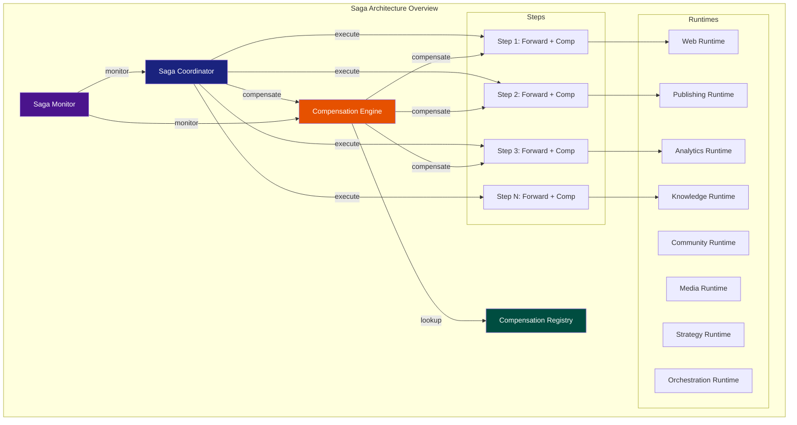

### ۳.۱ مؤلفه‌های اصلی

| مؤلفه                     | شناسه    | وظیفه                                                | وابستگی                     |
| ------------------------- | -------- | ---------------------------------------------------- | --------------------------- |
| **Saga Coordinator**      | SAG-CORE | مدیریت چرخه حیات ساگا، اجرای Stepها، فعال‌سازی جبران | SMOS-704, AI-014            |
| **Compensation Engine**   | SAG-CMP  | اجرای عملیات جبرانی، مدیریت زنجیره، retry            | SAG-CORE, REG               |
| **Compensation Registry** | SAG-REG  | نمایه متمرکز عملیات جبرانی                           | SAG-CMP                     |
| **Saga Monitor**          | SAG-MON  | نظارت، متریک، آلرت، لاگ                              | SAG-CORE, SAG-CMP, SMOS-706 |
| **Saga Store**            | SAG-DB   | ذخیره وضعیت، تاریخچه، قفل                            | —                           |

---

## ۴. اصول ساگا (Saga Principles)

| #      | اصل                                                | توضیح                                                               | پیامد نقض              |
| ------ | -------------------------------------------------- | ------------------------------------------------------------------- | ---------------------- |
| SGP-01 | **جبران‌پذیری کامل (Full Compensatability)**       | هر Step در ساگا باید یک Compensation Action داشته باشد              | ناتوانی در بازگشت کامل |
| SGP-02 | **جبران معکوس (LIFO Compensation)**                | ترتیب جبران همیشه معکوس ترتیب اجراست                                | وابستگی‌های شکسته      |
| SGP-03 | **یکتاسازی (Idempotency)**                         | هر Compensation Action باید یکتاساز باشد — اجرای مجدد آن بی‌اثر است | حالت‌های دوگانه        |
| SGP-04 | **مرز تراکنشی شفاف (Clear Transaction Boundary)**  | هر Step مرز دقیق اثر خود را تعریف می‌کند                            | نشت تراکنش             |
| SGP-05 | **شکست اتمی (Atomic Failure)**                     | اگر یک Step شکست بخورد، ساگا باید به وضعیت یکپارچه بازگردد          | ناسازگاری داده         |
| SGP-06 | **ردیابی کامل (Full Traceability)**                | هر رویداد ساگا و جبران ثبت و قابل ممیزی است                         | ناتوانی در تحلیل خطا   |
| SGP-07 | **انقضای ساگا (Saga Timeout)**                     | هر ساگا یک Timeout کلی دارد — پس از اتمام، جبران اجباری می‌شود      | ساگاهای معلق           |
| SGP-08 | **کشتن تدریجی (Graceful Degradation)**             | شکست جبران نباید باعث فروپاشی کل سیستم شود                          | خطای آبشاری            |
| SGP-09 | **عدم تداخل جبران (Non-Interfering Compensation)** | جبران دو ساگای مجاور نباید با هم تداخل کنند                         | وابستگی جبران          |
| SGP-10 | **اختیار سطح A-4 برای تعریف ساگا**                 | فقط موجودیت با سطح A-4 مجاز به تعریف ساگاست                         | ساگاهای غیرمجاز        |

---

## ۵. انواع ساگا (Saga Types)

SMOS سه نوع ساگا را پشتیبانی می‌کند:

### ۵.۱ ساگای مبتنی بر هماهنگ‌سازی (Orchestration-based Saga)

یک **Saga Coordinator** مرکزی ترتیب، وضعیت و جبران Stepها را مدیریت می‌کند. این نوع پیش‌فرض SMOS است.

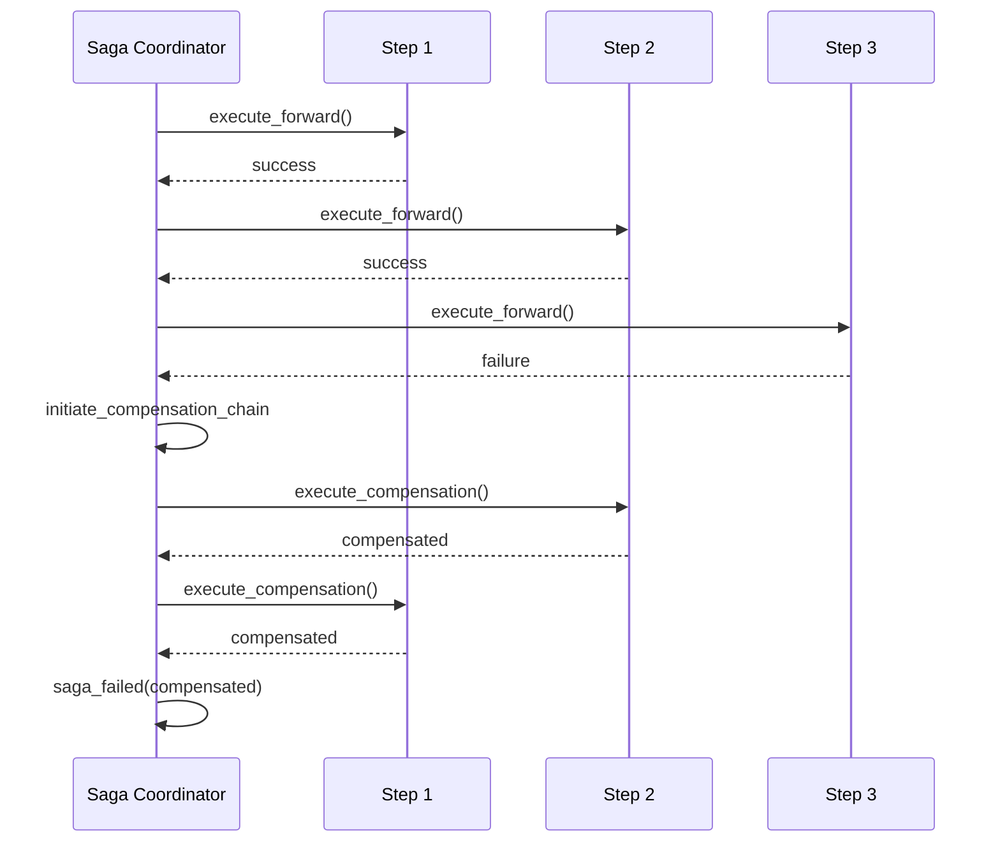

### ۵.۲ ساگای مبتنی بر هماهنگی (Choreography-based Saga)

هر Step پس از اتمام، رویداد publish می‌کند و Step بعدی به رویداد گوش می‌دهد. SMOS این نوع را به صورت محدود و فقط برای ساگاهای ساده (حداکثر ۳ Step) پشتیبانی می‌کند.

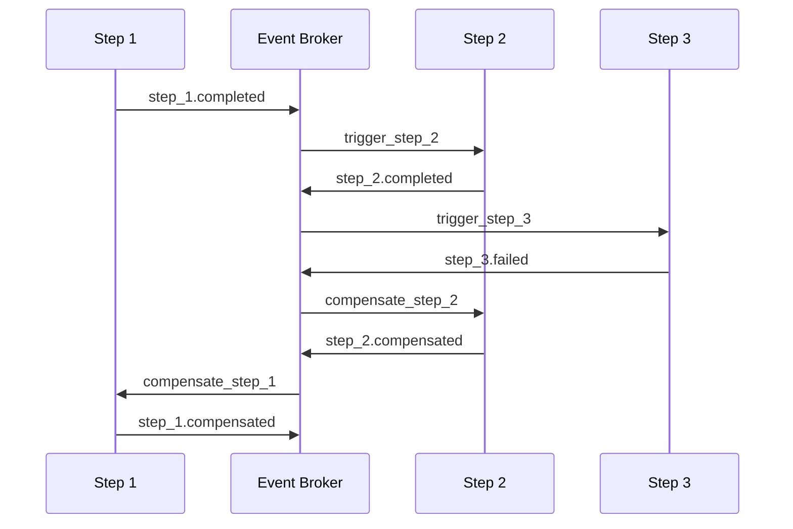

### ۵.۳ ساگای ترکیبی (Hybrid Saga)

ترکیبی از Orchestration و Choreography — Coordinator فقط مرزهای ساگا و نقاط تصمیم را مدیریت می‌کند و Stepهای داخلی به صورت Choreography اجرا می‌شوند.

| ویژگی        | Orchestration | Choreography | Hybrid       |
| ------------ | ------------- | ------------ | ------------ |
| کنترل مرکزی  | ✅ کامل       | ❌           | ✅ محدود     |
| پیچیدگی      | متوسط         | کم           | زیاد         |
| مقیاس‌پذیری  | متوسط         | بالا         | بالا         |
| ردیابی       | کامل          | غیرمتمرکز    | کامل         |
| حداکثر Step  | ۵۰            | ۳            | ۲۰           |
| جبران خودکار | ✅            | ✅ شرطی      | ✅           |
| کاربرد SMOS  | پیش‌فرض       | ساگاهای ساده | ساگاهای مرکب |

---

## ۶. چرخه حیات ساگا (Saga Lifecycle)

### ۶.۱ دیاگرام حالت ساگا

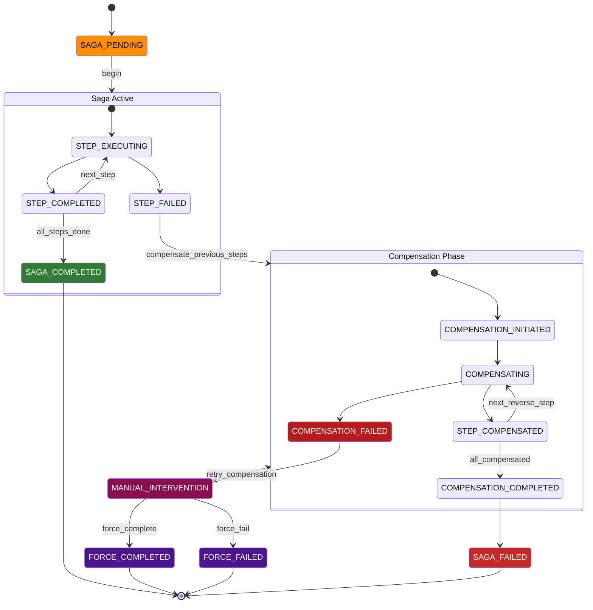

### ۶.۲ جدول حالت‌ها

| State ID               | نام فارسی         | دسته     | توضیح                           | TTL   |
| ---------------------- | ----------------- | -------- | ------------------------------- | ----- |
| SAGA_PENDING           | در انتظار         | Pending  | ساگا ثبت شده اما هنوز شروع نشده | PT30M |
| STEP_EXECUTING         | در حال اجرای Step | Active   | یک Step در حال اجراست           | PT15M |
| STEP_COMPLETED         | Step completed    | Active   | یک Step با موفقیت تمام شد       | —     |
| STEP_FAILED            | Step failed       | Active   | یک Step شکست خورد               | —     |
| SAGA_COMPLETED         | ساگا کامل شد      | Terminal | تمام Stepها با موفقیت تمام شدند | —     |
| COMPENSATION_INITIATED | جبران آغاز شد     | Recovery | فرآیند جبران شروع شد            | PT5M  |
| COMPENSATING           | در حال جبران      | Recovery | یک Step در حال جبران است        | PT15M |
| STEP_COMPENSATED       | Step جبران شد     | Recovery | یک Step با موفقیت جبران شد      | —     |
| COMPENSATION_COMPLETED | جبران کامل شد     | Recovery | تمام Stepها جبران شدند          | —     |
| COMPENSATION_FAILED    | جبران شکست خورد   | Recovery | یک عملیات جبرانی شکست خورد      | —     |
| MANUAL_INTERVENTION    | دخالت انسانی      | Recovery | نیاز به مداخله دستی             | PT48H |
| SAGA_FAILED            | ساگا شکست خورد    | Terminal | ساگا با جبران ناقص پایان یافت   | —     |
| FORCE_COMPLETED        | اجباراً کامل شد   | Terminal | ساگا با دستور ادمین کامل شد     | —     |
| FORCE_FAILED           | اجباراً شکست خورد | Terminal | ساگا با دستور ادمین شکست خورد   | —     |

### ۶.۳ رویدادهای چرخه حیات

| Event ID  | نام                    | مبدأ                   | مقصد                   | توضیح           |
| --------- | ---------------------- | ---------------------- | ---------------------- | --------------- |
| EVT-SG-01 | saga.pending           | [*]                    | SAGA_PENDING           | ثبت ساگا        |
| EVT-SG-02 | saga.begin             | SAGA_PENDING           | STEP_EXECUTING         | شروع ساگا       |
| EVT-SG-03 | step.success           | STEP_EXECUTING         | STEP_COMPLETED         | موفقیت Step     |
| EVT-SG-04 | step.failure           | STEP_EXECUTING         | STEP_FAILED            | شکست Step       |
| EVT-SG-05 | saga.completed         | STEP_COMPLETED         | SAGA_COMPLETED         | اتمام ساگا      |
| EVT-SG-06 | compensation.initiate  | STEP_FAILED            | COMPENSATION_INITIATED | شروع جبران      |
| EVT-SG-07 | compensation.step      | COMPENSATION_INITIATED | COMPENSATING           | جبران یک Step   |
| EVT-SG-08 | compensation.success   | COMPENSATING           | STEP_COMPENSATED       | موفقیت جبران    |
| EVT-SG-09 | compensation.failure   | COMPENSATING           | COMPENSATION_FAILED    | شکست جبران      |
| EVT-SG-10 | compensation.completed | STEP_COMPENSATED       | COMPENSATION_COMPLETED | اتمام جبران     |
| EVT-SG-11 | saga.failed            | COMPENSATION_COMPLETED | SAGA_FAILED            | اعلام شکست ساگا |
| EVT-SG-12 | manual.intervention    | COMPENSATION_FAILED    | MANUAL_INTERVENTION    | دخالت انسانی    |
| EVT-SG-13 | force.complete         | MANUAL_INTERVENTION    | FORCE_COMPLETED        | اتمام اجباری    |
| EVT-SG-14 | force.fail             | MANUAL_INTERVENTION    | FORCE_FAILED           | شکست اجباری     |
| EVT-SG-15 | saga.timeout           | STEP_EXECUTING         | COMPENSATION_INITIATED | انقضای ساگا     |

---

## ۷. مدل Step ساگا (Saga Step Model)

هر Step در ساگا از دو بخش تشکیل شده است: **Forward Action** (عملیات پیشرو) و **Compensation Action** (عملیات جبرانی).

### ۷.۱ ساختار Step

```json
{
  "stepId": "stp_pub_website_01",
  "name": "Publish to Website",
  "type": "api_call",
  "runtime": "PR",
  "forward": {
    "action": "publish_content",
    "endpoint": "runtime://pr/publish",
    "payload": {
      "contentId": "cnt_abc123",
      "platform": "website"
    },
    "timeout": "PT30S",
    "retry": {
      "maxAttempts": 3,
      "backoff": "exponential",
      "initialDelay": "PT1S"
    },
    "idempotencyKey": "idem_pub_website_01"
  },
  "compensation": {
    "action": "unpublish_content",
    "endpoint": "runtime://pr/unpublish",
    "payload": {
      "contentId": "cnt_abc123",
      "platform": "website",
      "reason": "saga_compensation"
    },
    "timeout": "PT30S",
    "retry": {
      "maxAttempts": 3,
      "backoff": "exponential",
      "initialDelay": "PT1S"
    },
    "idempotencyKey": "idem_unpublish_website_01",
    "compensationGroup": "publishing"
  },
  "dependencies": ["stp_create_content_01"],
  "timeout": "PT60S",
  "authority": "A-3"
}
```

### ۷.۲ انواع Forward Action

| نوع                  | شناسه          | توضیح                         | مثال                               |
| -------------------- | -------------- | ----------------------------- | ---------------------------------- |
| **API Call**         | api_call       | فراخوانی سرویس خارجی یا داخلی | publish_content, send_notification |
| **Database Write**   | db_write       | نوشتن در دیتابیس              | insert_knowledge_record            |
| **File Operation**   | file_op        | عملیات فایل                   | upload_media, delete_temp          |
| **Message Publish**  | msg_publish    | انتشار پیام در صف             | notify_subscribers                 |
| **State Transition** | state_trans    | تغییر حالت یک موجودیت         | change_workflow_state              |
| **AI Agent Call**    | agent_call     | فراخوانی Agent هوش مصنوعی     | ai_generate_content                |
| **Human Approval**   | human_approval | تأیید انسانی                  | review_content                     |
| **Sub-Saga**         | sub_saga       | ساگای تودرتو                  | nested_compensation                |

### ۷.۳ انواع Compensation Action

| نوع            | شناسه         | توضیح                  | یکتاساز |
| -------------- | ------------- | ---------------------- | ------- |
| **Delete**     | delete        | حذف منبع ایجادشده      | ✅      |
| **Revert**     | revert        | بازگردانی وضعیت قبلی   | ✅      |
| **Unpublish**  | unpublish     | لغو انتشار             | ✅      |
| **Deactivate** | deactivate    | غیرفعال‌سازی           | ✅      |
| **Rollback**   | rollback      | برگردان تراکنش دیتابیس | ✅      |
| **Notify**     | notify_cancel | لغو اعلان              | ✅      |
| **Refund**     | refund        | بازگشت وجه (آینده)     | ✅      |
| **Cleanup**    | cleanup       | پاکسازی منابع موقت     | ✅      |

---

## ۸. معماری Saga Coordinator (Saga Coordinator Architecture)

Saga Coordinator مؤلفه مرکزی مدیریت ساگا در SMOS است. این مؤلفه در Orchestration Runtime (OR) مستقر است و توسط AI-014 مدیریت می‌شود.

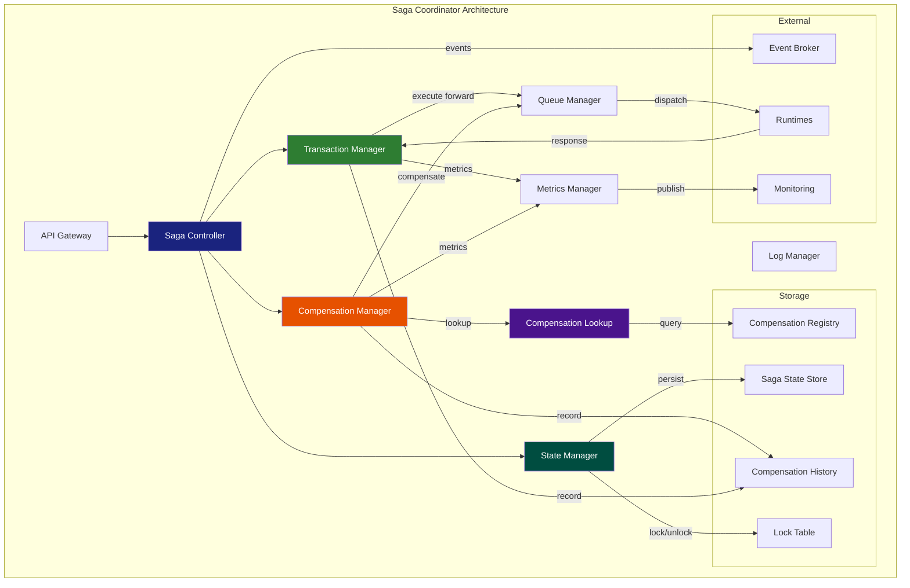

### ۸.۱ مؤلفه‌های داخلی Coordinator

| مؤلفه                    | شناسه  | وظیفه                                     | مقیاس‌پذیری |
| ------------------------ | ------ | ----------------------------------------- | ----------- |
| **Saga Controller**      | SC-CTL | دریافت دستورات ساگا، اعتبارسنجی، مسیریابی | Horizontal  |
| **State Manager**        | SC-SM  | مدیریت وضعیت ساگا، قفل‌گذاری، persistence | Horizontal  |
| **Transaction Manager**  | SC-TM  | اجرای Stepهای forward، مدیریت retry       | Horizontal  |
| **Compensation Manager** | SC-CM  | اجرای زنجیره جبران، مدیریت retry جبران    | Horizontal  |
| **Compensation Lookup**  | SC-CL  | جستجوی عملیات جبرانی در رجیستری           | Cache       |
| **Queue Manager**        | SC-QM  | صف‌بندی و توزیع Stepها روی Runtimeها      | Partitioned |
| **Log Manager**          | SC-LM  | ثبت رویدادها، tracing                     | Async       |
| **Metrics Manager**      | SC-MM  | جمع‌آوری متریک‌ها                         | Async       |

---

## ۹. معماری Compensation Engine (Compensation Engine Architecture)

Compensation Engine موتور تخصصی اجرای عملیات جبرانی است. این موتور می‌تواند به صورت **خودکار** (در صورت شکست Step) یا **دستی** (در صورت فراخوانی ادمین) فعال شود.

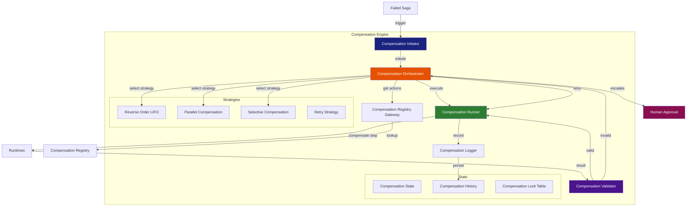

### ۹.۱ استراتژی‌های جبران

| استراتژی                   | شناسه      | توضیح                             | کاربرد                      |
| -------------------------- | ---------- | --------------------------------- | --------------------------- |
| **Reverse Order (LIFO)**   | CMP-STR-01 | جبران به ترتیب معکوس اجرا         | پیش‌فرض تمام ساگاها         |
| **Parallel Compensation**  | CMP-STR-02 | جبران همزمان Stepهای مستقل        | Stepهای بدون وابستگی متقابل |
| **Selective Compensation** | CMP-STR-03 | جبران انتخابی — فقط Stepهای مشخص  | جبران جزئی                  |
| **Retry on Failure**       | CMP-STR-04 | تلاش مجدد در صورت شکست جبران      | جبران با transient error    |
| **Escalate on Failure**    | CMP-STR-05 | ارجاع به انسان در صورت شکست جبران | جبران بحرانی                |

---

## ۱۰. رجیستری عملیات جبرانی (Compensation Action Registry)

رجیستری عملیات جبرانی یک نمایه متمرکز از تمام Compensation Actionهای قابل اجرا در SMOS است. هر Action یک Handler مشخص دارد که می‌تواند در یک Runtime خاص اجرا شود.

### ۱۰.۱ ساختار رجیستری

```json
{
  "registryId": "cmp_reg_v1",
  "version": "1.0.0",
  "actions": [
    {
      "actionId": "cmp_unpublish_website",
      "name": "Unpublish Content from Website",
      "type": "unpublish",
      "runtime": "PR",
      "handler": "runtime://pr/compensation/unpublish",
      "idempotent": true,
      "timeout": "PT30S",
      "retryPolicy": {
        "maxAttempts": 3,
        "backoff": "exponential",
        "initialDelay": "PT2S",
        "maxDelay": "PT30S"
      },
      "inputSchema": {
        "type": "object",
        "properties": {
          "contentId": { "type": "string" },
          "platform": { "type": "string" }
        },
        "required": ["contentId", "platform"]
      },
      "authority": "A-3",
      "tags": ["publishing", "website", "critical"]
    },
    {
      "actionId": "cmp_delete_knowledge_record",
      "name": "Delete Knowledge Record",
      "type": "delete",
      "runtime": "KR",
      "handler": "runtime://kr/compensation/delete",
      "idempotent": true,
      "timeout": "PT15S",
      "retryPolicy": {
        "maxAttempts": 2,
        "backoff": "fixed",
        "initialDelay": "PT1S"
      },
      "inputSchema": {
        "type": "object",
        "properties": {
          "recordId": { "type": "string" },
          "knowledgeDomain": { "type": "string" }
        },
        "required": ["recordId"]
      },
      "authority": "A-2",
      "tags": ["knowledge", "data"]
    }
  ],
  "compensationGroups": [
    {
      "groupId": "publishing",
      "name": "Publishing Compensation",
      "priority": 1,
      "actions": ["cmp_unpublish_website", "cmp_unpublish_instagram", "cmp_unpublish_linkedin"]
    },
    {
      "groupId": "knowledge",
      "name": "Knowledge Compensation",
      "priority": 2,
      "actions": ["cmp_delete_knowledge_record", "cmp_revert_knowledge_index"]
    }
  ]
}
```

### ۱۰.۲ رجیستری پیش‌فرض SMOS

| Action ID                     | Runtime | نوع           | وابسته به                   | حساسیت   |
| ----------------------------- | ------- | ------------- | --------------------------- | -------- |
| cmp_unpublish_website         | PR      | unpublish     | —                           | CRITICAL |
| cmp_unpublish_instagram       | PR      | unpublish     | —                           | CRITICAL |
| cmp_unpublish_linkedin        | PR      | unpublish     | —                           | CRITICAL |
| cmp_unpublish_telegram        | PR      | unpublish     | —                           | CRITICAL |
| cmp_unpublish_youtube         | PR      | unpublish     | —                           | CRITICAL |
| cmp_unpublish_aparat          | PR      | unpublish     | —                           | CRITICAL |
| cmp_delete_knowledge_record   | KR      | delete        | —                           | HIGH     |
| cmp_revert_knowledge_index    | KR      | revert        | cmp_delete_knowledge_record | HIGH     |
| cmp_delete_media_asset        | MR      | delete        | —                           | HIGH     |
| cmp_revert_media_metadata     | MR      | revert        | cmp_delete_media_asset      | MEDIUM   |
| cmp_deactivate_community_post | CR      | deactivate    | —                           | MEDIUM   |
| cmp_revert_content_strategy   | SR      | revert        | —                           | HIGH     |
| cmp_delete_analytics_snapshot | AR      | delete        | —                           | LOW      |
| cmp_cleanup_temp_files        | WR      | cleanup       | —                           | LOW      |
| cmp_cancel_notification       | OR      | notify_cancel | —                           | MEDIUM   |

---

## ۱۱. گردش کار جبران (Compensation Workflow)

### ۱۱.۱ دیاگرام توالی جبران کامل

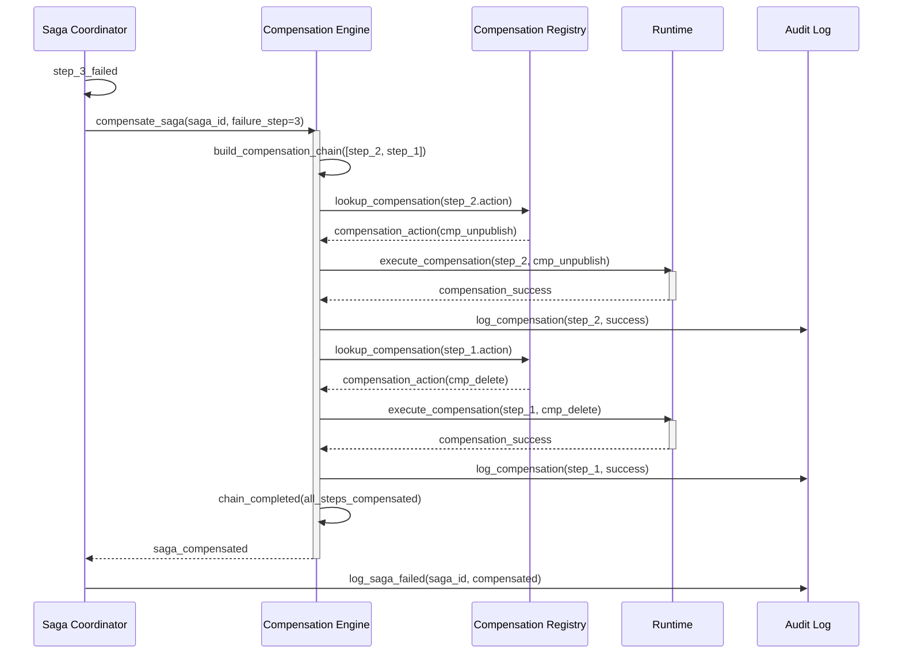

### ۱۱.۲ دیاگرام جبران با شکست جبران

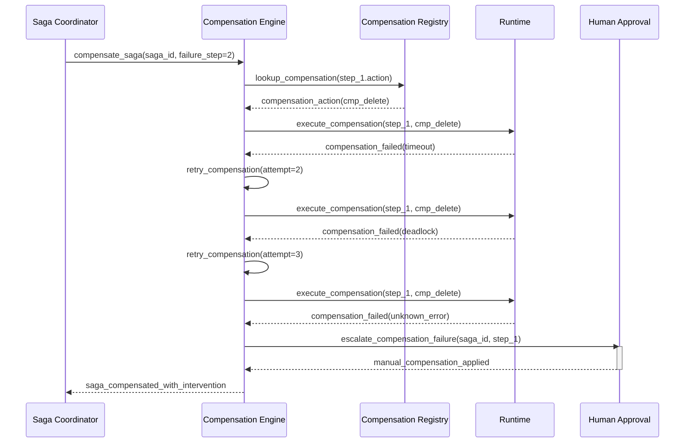

### ۱۱.۳ دیاگرام جبران موازی

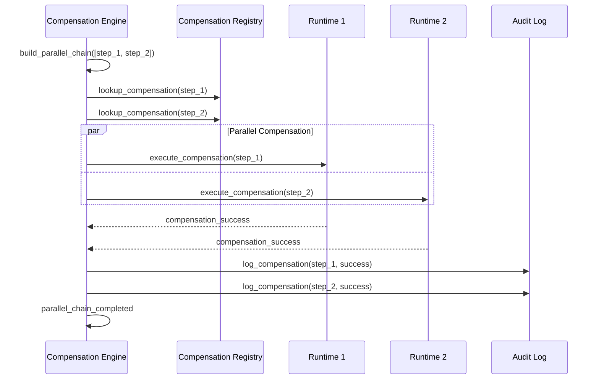

---

## ۱۲. مدل مرز تراکنش (Transaction Boundary Model)

### ۱۲.۱ تعریف مرز تراکنش

هر Step در ساگا یک **مرز تراکنش** (Transaction Boundary) مشخص دارد که تعیین می‌کند اثر Step تا کجا گسترش می‌یابد. مرز تراکنش شامل موارد زیر است:

| بُعد         | توضیح                               | مثال                            |
| ------------ | ----------------------------------- | ------------------------------- |
| **Runtime**  | Runtimeای که Step در آن اجرا می‌شود | PR, KR, AR                      |
| **Resource** | منابع درگیر در تراکنش               | content_id, platform, record_id |
| **Time**     | پنجره زمانی اعتبار تراکنش           | PT30S                           |
| **Scope**    | دامنه اثر تراکنش                    | local / runtime / global        |
| **Lock**     | نوع قفل مورد نیاز                   | read / write / exclusive        |

### ۱۲.۲ انواع مرز

| نوع مرز        | شناسه   | توضیح                       | قفل                  |
| -------------- | ------- | --------------------------- | -------------------- |
| **Local**      | BND-LOC | فقط در یک Runtime اثر دارد  | read                 |
| **Runtime**    | BND-RTM | در کل یک Runtime اثر دارد   | write                |
| **Global**     | BND-GLB | در چند Runtime اثر دارد     | exclusive            |
| **Cross-Saga** | BND-CSG | بین دو ساگای مجاور اثر دارد | exclusive + advisory |

### ۱۲.۳ مدل قفل

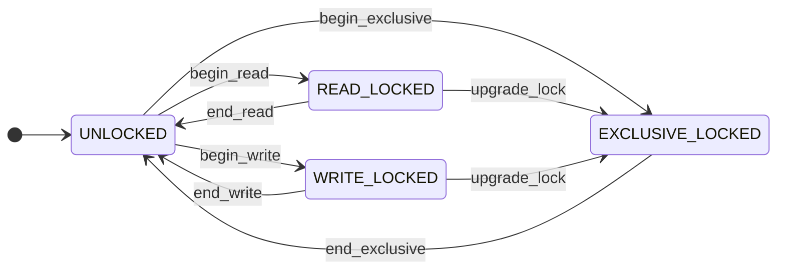

---

## ۱۳. سطح جداسازی برای ساگاها (Isolation Level for Sagas)

ساگاها ذاتاً تراکنش‌های طولانی (Long-lived Transactions) هستند و نمی‌توانند از قفل‌های تراکنشی سنتی استفاده کنند. SMOS از سطوح جداسازی زیر برای ساگاها پشتیبانی می‌کند:

| سطح                    | شناسه  | توضیح                            | آنومالی مجاز                        | کاربرد          |
| ---------------------- | ------ | -------------------------------- | ----------------------------------- | --------------- |
| **Read Uncommitted**   | ISO-RU | خواندن داده‌های ناپایدار         | Dirty Read, Non-repeatable, Phantom | ساگاهای غیرحساس |
| **Read Committed**     | ISO-RC | خواندن داده‌های پایدار           | Non-repeatable, Phantom             | پیش‌فرض         |
| **Repeatable Read**    | ISO-RR | خواندن تکراری پایدار             | Phantom                             | ساگاهای حساس    |
| **Snapshot**           | ISO-SN | عکس‌برداری از وضعیت در شروع ساگا | —                                   | ساگاهای تحلیلی  |
| **Compensation-based** | ISO-CB | بدون قفل — جبران در صورت تداخل   | همه                                 | ساگاهای طولانی  |

### ۱۳.۱ استراتژی جداسازی پیشنهادی

| نوع ساگا                    | سطح پیشنهادی | دلیل                                |
| --------------------------- | ------------ | ----------------------------------- |
| Content Publishing          | ISO-RC       | تعادل بین consistency و performance |
| Knowledge Ingestion         | ISO-SN       | یکپارچگی داده دانش                  |
| Analytics Pipeline          | ISO-SN       | صحت محاسبات تحلیلی                  |
| Community Engagement        | ISO-RC       | سرعت پاسخ‌دهی                       |
| Media Processing            | ISO-RR       | یکپارچگی دارایی‌های رسانه           |
| Multi-Platform Distribution | ISO-CB       | ساگای طولانی — جبران جایگزین قفل    |

---

## ۱۴. سناریوهای خطا (Failure Scenarios)

### ۱۴.۱ سناریوهای خطای Step

| #     | سناریو                    | شناسه      | علت                        | اثر                     | استراتژی جبران        |
| ----- | ------------------------- | ---------- | -------------------------- | ----------------------- | --------------------- |
| FS-01 | **API Timeout**           | ERR-API-TO | سرویس مقصد پاسخ نمی‌دهد    | Step معلق می‌ماند       | Retry (۳ بار) + جبران |
| FS-02 | **API 4xx Error**         | ERR-API-4X | درخواست نامعتبر            | Step غیرقابل بازیابی    | جبران فوری            |
| FS-03 | **API 5xx Error**         | ERR-API-5X | خطای سمت سرویس             | Step می‌تواند retry شود | Retry + جبران         |
| FS-04 | **Network Failure**       | ERR-NET    | قطع شبکه                   | Step نامشخص             | Retry + جبران         |
| FS-05 | **Data Inconsistency**    | ERR-DAT    | داده ناسازگار              | Step غیرمنتظره          | جبران + دخالت انسانی  |
| FS-06 | **Deadlock**              | ERR-DLK    | قفل‌های متقاطع             | Step مسدود              | جبران/Retry           |
| FS-07 | **Rate Limit**            | ERR-RAT    | محدودیت نرخ سرویس          | Step موقتاً مسدود       | Retry با backoff      |
| FS-08 | **Authorization Failure** | ERR-AUTH   | مجوز ناکافی                | Step غیرقابل اجرا       | جبران + دخالت انسانی  |
| FS-09 | **Resource Exhaustion**   | ERR-RES    | کمبود منابع (memory, disk) | Step ناموفق             | جبران + alert         |
| FS-10 | **Partial Write**         | ERR-PWR    | بخشی از داده نوشته شد      | Step ناقص               | جبران اختصاصی         |

### ۱۴.۲ سناریوهای خطای جبران

| #     | سناریو                               | شناسه      | علت                                     | اثر                 | استراتژی              |
| ----- | ------------------------------------ | ---------- | --------------------------------------- | ------------------- | --------------------- |
| FS-11 | **Compensation Timeout**             | ERR-CMP-TO | عملیات جبرانی timeout                   | جبران ناقص          | Retry (۳ بار) + ارجاع |
| FS-12 | **Compensation Failure**             | ERR-CMP-FA | عملیات جبرانی برگشت ۴xx/5xx             | جبران ناقص          | Retry + دخالت انسانی  |
| FS-13 | **Compensation Not Found**           | ERR-CMP-NF | Action در رجیستری یافت نشد              | جبران غیرممکن       | دخالت انسانی          |
| FS-14 | **Compensation Non-Idempotent**      | ERR-CMP-NI | جبران یکتاساز نیست                      | اجرای تکراری خطرناک | Lock + دخالت انسانی   |
| FS-15 | **Cross-Saga Compensation Conflict** | ERR-CMP-CS | دو ساگا می‌خواهند یک منبع را جبران کنند | تداخل جبران         | قفل advisory + ارجاع  |

### ۱۴.۳ ماتریس خطا → استراتژی

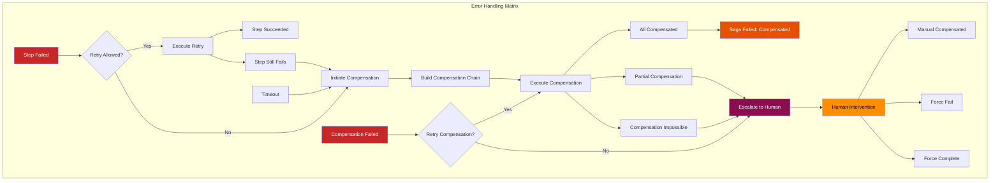

---

## ۱۵. استراتژی‌های Retry برای ساگاها (Retry Strategies for Sagas)

### ۱۵.۱ Retry برای Forward Action

| استراتژی                 | شناسه     | توضیح                       | پارامترها                                          |
| ------------------------ | --------- | --------------------------- | -------------------------------------------------- |
| **Fixed**                | RTY-FIX   | تأخیر ثابت بین تلاش‌ها      | delay: PT2S, maxAttempts: 3                        |
| **Exponential**          | RTY-EXP   | تأخیر تصاعدی                | initialDelay: PT1S, multiplier: 2, maxDelay: PT30S |
| **Exponential + Jitter** | RTY-EXP-J | تأخیر تصاعدی با نویز تصادفی | + jitter: 0.1                                      |
| **Immediate**            | RTY-IMM   | تلاش مجدد فوری              | maxAttempts: 2                                     |
| **No Retry**             | RTY-NON   | بدون تلاش مجدد — جبران فوری | —                                                  |

### ۱۵.۲ Retry برای Compensation Action

| استراتژی                               | شناسه      | توضیح                        | حداکثر تلاش  |
| -------------------------------------- | ---------- | ---------------------------- | ------------ |
| **Compensation Retry**                 | CMP-RTY-01 | تلاش مجدد با backoff خطی     | ۳            |
| **Compensation Retry with Escalation** | CMP-RTY-02 | ۲ تلاش مجدد + ارجاع به انسان | ۲ + escalate |
| **No Compensation Retry**              | CMP-RTY-03 | بدون retry — ارجاع فوری      | ۰            |

### ۱۵.۳ پیکربندی Retry پیش‌فرض

```json
{
  "defaultRetryPolicy": {
    "forwardAction": {
      "strategy": "exponential",
      "maxAttempts": 3,
      "initialDelay": "PT1S",
      "multiplier": 2.0,
      "maxDelay": "PT30S",
      "retryableErrors": ["ERR-API-TO", "ERR-API-5X", "ERR-NET", "ERR-RAT"],
      "nonRetryableErrors": ["ERR-API-4X", "ERR-AUTH"]
    },
    "compensationAction": {
      "strategy": "fixed",
      "maxAttempts": 3,
      "delay": "PT2S",
      "retryableErrors": ["ERR-CMP-TO"],
      "nonRetryableErrors": ["ERR-CMP-NF", "ERR-CMP-NI"]
    }
  }
}
```

---

## ۱۶. استراتژی‌های بازگشت (Rollback Strategies)

### ۱۶.۱ انواع بازگشت

| استراتژی               | شناسه   | توضیح                                 | کاربرد            |
| ---------------------- | ------- | ------------------------------------- | ----------------- |
| **Immediate Rollback** | RBL-IMM | جبران تمام Stepها بلافاصله پس از شکست | خطاهای بحرانی     |
| **Deferred Rollback**  | RBL-DEF | جبران با تأخیر — جمع‌آوری چندین جبران | بهینه‌سازی منابع  |
| **Partial Rollback**   | RBL-PRT | جبران فقط Stepهای مشخص                | خطاهای جزئی       |
| **Selective Rollback** | RBL-SEL | جبران بر اساس اولویت                  | Stepهای غیربحرانی |
| **No Rollback**        | RBL-NON | بدون جبران — ثبت خطا                  | خطاهای غیرمخرب    |

### ۱۶.۲ انتخاب استراتژی بر اساس نوع خطا

| نوع خطا            | استراتژی بازگشت       | توضیح                     |
| ------------------ | --------------------- | ------------------------- |
| API 4xx            | Immediate             | خطای قطعی — جبران فوری    |
| API 5xx            | Retry → Immediate     | تلاش مجدد، سپس جبران      |
| Timeout            | Retry → Immediate     | تلاش مجدد، سپس جبران      |
| Network Failure    | Retry → Deferred      | تلاش مجدد، جبران با تأخیر |
| Data Inconsistency | Immediate + Escalate  | جبران فوری + دخالت انسانی |
| Deadlock           | Immediate             | جبران فوری برای رفع قفل   |
| Partial Write      | Selective + Immediate | جبران انتخابی و فوری      |

### ۱۶.۳ دیاگرام تصمیم‌گیری بازگشت

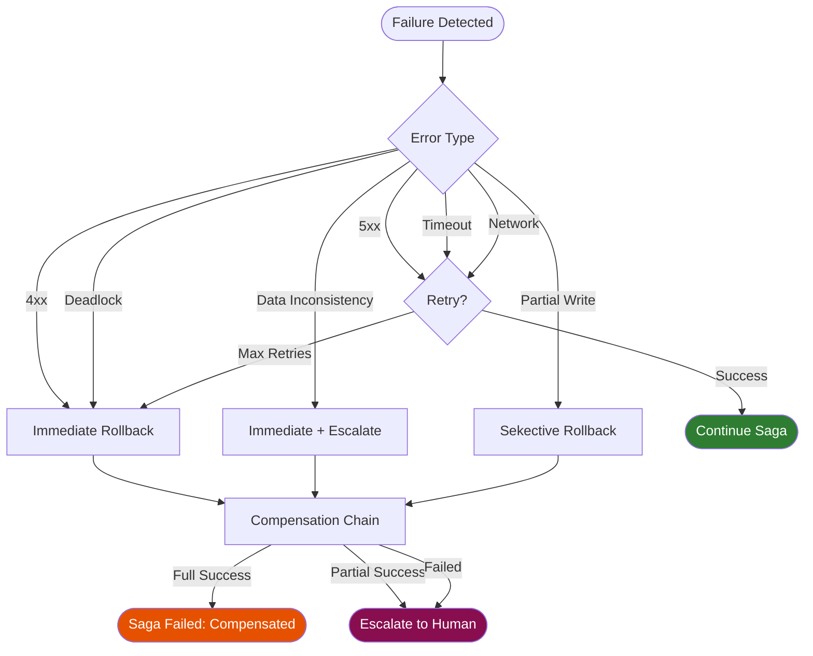

---

## ۱۷. نظارت بر ساگا و جبران (Saga & Compensation Monitoring)

### ۱۷.۱ متریک‌های ساگا

| متریک                 | شناسه     | نوع       | واحد    | توضیح                   |
| --------------------- | --------- | --------- | ------- | ----------------------- |
| saga.created.count    | MET-SG-01 | Counter   | count   | تعداد ساگاهای ایجادشده  |
| saga.completed.count  | MET-SG-02 | Counter   | count   | تعداد ساگاهای موفّق     |
| saga.failed.count     | MET-SG-03 | Counter   | count   | تعداد ساگاهای ناموفق    |
| saga.duration.seconds | MET-SG-04 | Histogram | seconds | مدت زمان ساگا           |
| saga.step.count       | MET-SG-05 | Histogram | count   | تعداد Stepها در ساگا    |
| saga.active.gauge     | MET-SG-06 | Gauge     | count   | تعداد ساگاهای فعال      |
| saga.pending.gauge    | MET-SG-07 | Gauge     | count   | تعداد ساگاهای در انتظار |

### ۱۷.۲ متریک‌های جبران

| متریک                         | شناسه      | نوع       | واحد    | توضیح                    |
| ----------------------------- | ---------- | --------- | ------- | ------------------------ |
| compensation.initiated.count  | MET-CMP-01 | Counter   | count   | تعداد جبران‌های شروع‌شده |
| compensation.completed.count  | MET-CMP-02 | Counter   | count   | تعداد جبران‌های موفق     |
| compensation.failed.count     | MET-CMP-03 | Counter   | count   | تعداد جبران‌های ناموفق   |
| compensation.duration.seconds | MET-CMP-04 | Histogram | seconds | مدت زمان جبران           |
| compensation.retry.count      | MET-CMP-05 | Counter   | count   | تعداد retry جبران        |
| compensation.escalation.count | MET-CMP-06 | Counter   | count   | تعداد ارجاع به انسان     |
| compensation.chain.length     | MET-CMP-07 | Histogram | count   | طول زنجیره جبران         |

### ۱۷.۳ آلرت‌های ساگا و جبران

| آلرت                         | شناسه     | شرط                                        | شدت | کانال               |
| ---------------------------- | --------- | ------------------------------------------ | --- | ------------------- |
| High Saga Failure Rate       | ALR-SG-01 | saga.failed.rate > 0.05 (5%) در ۵ دقیقه    | P1  | Slack + Email + SMS |
| Compensation Escalated       | ALR-SG-02 | compensation.escalation.count > 0          | P1  | Slack + SMS         |
| Saga Stuck in Pending        | ALR-SG-03 | saga.pending.gauge > 10 و duration > PT15M | P2  | Slack               |
| Compensation Retry Exhausted | ALR-SG-04 | compensation.retry.count > 3 در یک ساگا    | P2  | Slack + Email       |
| Saga Duration Anomaly        | ALR-SG-05 | saga.duration.seconds > P99 (p99\*3)       | P3  | Slack               |

### ۱۷.۴ رویدادهای نظارتی

| Event ID             | نام            | payload                        | مصرف‌کننده               |
| -------------------- | -------------- | ------------------------------ | ------------------------ |
| saga.mon.created     | ساگا ایجاد شد  | sagaId, type, steps, authority | SMOS-706, AI-010         |
| saga.mon.completed   | ساگا کامل شد   | sagaId, duration               | SMOS-706, AI-010         |
| saga.mon.failed      | ساگا شکست خورد | sagaId, failedStep, reason     | SMOS-706, AI-010, AI-014 |
| saga.mon.compensated | ساگا جبران شد  | sagaId, chain, duration        | SMOS-706, AI-010         |
| saga.mon.escalated   | ساگا ارجاع شد  | sagaId, step, reason           | SMOS-706, AI-014, AI-009 |

---

## ۱۸. امنیت ساگا و جبران (Saga & Compensation Security)

### ۱۸.۱ اصول امنیتی

| اصل                            | شناسه     | توضیح                                                    |
| ------------------------------ | --------- | -------------------------------------------------------- |
| **Least Privilege**            | SEC-SG-01 | هر Saga فقط به منابع مورد نیاز دسترسی دارد               |
| **Authorization per Saga**     | SEC-SG-02 | هر ساگا باید مجوز سطح A-3 یا A-4 داشته باشد              |
| **Idempotency Verification**   | SEC-SG-03 | هر Compensation Action باید یکتاساز بودن را تأیید کند    |
| **Audit Trail**                | SEC-SG-04 | تمام رویدادهای ساگا و جبران ثبت می‌شوند                  |
| **Encryption in Transit**      | SEC-SG-05 | تمام ارتباطات بین Coordinator و Runtime رمزنگاری می‌شوند |
| **Compensation Authorization** | SEC-SG-06 | اجرای جبران نیازمند مجوز حداقل A-2 است                   |
| **Human Escalation Auth**      | SEC-SG-07 | تأیید انسانی جبران نیازمند مجوز A-3 است                  |
| **Saga Timeout Enforcement**   | SEC-SG-08 | ساگاهای منقضی‌شده به‌طور خودکار جبران می‌شوند            |

### ۱۸.۲ مدل دسترسی

| نقش                 | سطح اختیار | ایجاد ساگا | مشاهده ساگا | جبران دستی | Force Complete | Force Fail |
| ------------------- | ---------- | ---------- | ----------- | ---------- | -------------- | ---------- |
| system-architect    | A-4        | ✅         | ✅          | ✅         | ✅             | ✅         |
| ai-orchestrator     | A-4        | ✅         | ✅          | ✅         | ✅             | ✅         |
| workflow-engineer   | A-3        | ✅         | ✅          | ✅         | ❌             | ❌         |
| automation-engineer | A-3        | ✅         | ✅          | ❌         | ❌             | ❌         |
| agent-developer     | A-2        | ❌         | ✅          | ❌         | ❌             | ❌         |
| sre-engineer        | A-3        | ❌         | ✅          | ✅         | ✅             | ✅         |
| auditor             | A-1        | ❌         | ✅          | ❌         | ❌             | ❌         |

### ۱۸.۳ رمزنگاری

| داده                 | در حال انتقال | در حال ذخیره    | الگوریتم    |
| -------------------- | ------------- | --------------- | ----------- |
| Saga State           | ✅ TLS 1.3    | ✅ AES-256      | AES-256-GCM |
| Compensation Payload | ✅ TLS 1.3    | ✅ AES-256      | AES-256-GCM |
| Idempotency Keys     | ✅ TLS 1.3    | ✅ SHA-256 hash | SHA-256     |
| Audit Log            | ✅ TLS 1.3    | ✅ AES-256      | AES-256-GCM |

---

## ۱۹. مقیاس‌پذیری و چندمستاجری (Scaling & Multi-Tenancy)

### ۱۹.۱ مدل مقیاس‌پذیری

| مؤلفه                 | استراتژی مقیاس‌پذیری       | پارتیشن‌بندی                | کش                  |
| --------------------- | -------------------------- | --------------------------- | ------------------- |
| Saga Coordinator      | Horizontal (active-active) | saga_id hash → partition    | Redis Cluster       |
| Compensation Engine   | Horizontal (active-active) | saga_id hash → partition    | Redis Cluster       |
| Compensation Registry | Replicated Cache           | region → local copy         | Local Cache + Redis |
| Saga State Store      | Sharded Database           | tenant_id + saga_id → shard | Read-through Cache  |
| Compensation History  | Time-based Partition       | event_date → partition      | Write-back Cache    |

### ۱۹.۲ ایزوله‌سازی مستاجر (Multi-Tenancy)

| بُعد                       | استراتژی                 | توضیح                                     |
| -------------------------- | ------------------------ | ----------------------------------------- |
| **Data Isolation**         | Schema-per-tenant        | هر مستاجر schema جداگانه در دیتابیس       |
| **Rate Limiting**          | Per-tenant quota         | محدودیت ساگا به ازای هر مستاجر            |
| **Priority Queuing**       | Tenant priority queue    | صف مجزا با priority                       |
| **Resource Quota**         | Max concurrent sagas     | حداکثر ساگاهای همزمان به ازای مستاجر      |
| **Compensation Isolation** | Independent compensation | جبران یک مستاجر بر دیگران تأثیر نمی‌گذارد |

### ۱۹.۳ پیکربندی چندمستاجری

```json
{
  "tenancy": {
    "enabled": true,
    "defaultQuota": {
      "maxConcurrentSagas": 50,
      "maxSagaSteps": 30,
      "maxSagaDuration": "PT1H",
      "maxPendingSagas": 100
    },
    "tenantOverrides": {
      "tenant_xennic": {
        "maxConcurrentSagas": 200,
        "maxSagaSteps": 50,
        "authorityLevel": "A-4"
      }
    },
    "isolationStrategy": "schema_per_tenant",
    "compensationIsolation": true
  }
}
```

---

## ۲۰. قراردادهای API (API Contracts)

### ۲۰.۱ REST API

| Method | مسیر                                    | توضیح                   | سطح اختیار |
| ------ | --------------------------------------- | ----------------------- | ---------- |
| POST   | `/api/v1/sagas`                         | ایجاد ساگا              | A-3+       |
| GET    | `/api/v1/sagas/{sagaId}`                | دریافت وضعیت ساگا       | A-1+       |
| GET    | `/api/v1/sagas`                         | فهرست ساگاها (فیلتردار) | A-2+       |
| POST   | `/api/v1/sagas/{sagaId}/compensate`     | شروع جبران دستی         | A-3+       |
| POST   | `/api/v1/sagas/{sagaId}/force-complete` | اتمام اجباری            | A-4        |
| POST   | `/api/v1/sagas/{sagaId}/force-fail`     | شکست اجباری             | A-4        |
| GET    | `/api/v1/compensation/actions`          | فهرست عملیات جبرانی     | A-2+       |
| POST   | `/api/v1/compensation/actions`          | ثبت Action جدید         | A-3+       |
| GET    | `/api/v1/compensation/registry`         | دریافت رجیستری          | A-2+       |
| GET    | `/api/v1/compensation/history/{sagaId}` | تاریخچه جبران ساگا      | A-2+       |

### ۲۰.۲ Event API

| Event                  | مسیر                             | payload              | فرستنده     | گیرنده               |
| ---------------------- | -------------------------------- | -------------------- | ----------- | -------------------- |
| saga.created           | `event://saga/created`           | SagaDefinition       | Coordinator | AI-014, Monitor      |
| saga.completed         | `event://saga/completed`         | sagaId, duration     | Coordinator | AI-014, Monitor      |
| saga.failed            | `event://saga/failed`            | sagaId, reason       | Coordinator | AI-014, Monitor      |
| saga.compensated       | `event://saga/compensated`       | sagaId, chain        | Engine      | Coordinator, Monitor |
| saga.escalated         | `event://saga/escalated`         | sagaId, step, reason | Engine      | AI-014, AI-009       |
| compensation.completed | `event://compensation/completed` | actionId, status     | Engine      | Registry, Monitor    |

### ۲۰.۳ gRPC API (Internal)

| Service             | Method                 | Request              | Response              | توضیح             |
| ------------------- | ---------------------- | -------------------- | --------------------- | ----------------- |
| SagaService         | CreateSaga             | SagaDefinition       | SagaMetadata          | ایجاد ساگا        |
| SagaService         | GetSagaStatus          | SagaId               | SagaStatus            | وضعیت ساگا        |
| SagaService         | ExecuteStep            | StepExecutionRequest | StepExecutionResponse | اجرای Step        |
| SagaService         | CompensateSaga         | CompensationRequest  | CompensationResponse  | جبران ساگا        |
| SagaService         | ForceComplete          | ForceRequest         | ForceResponse         | اتمام اجباری      |
| CompensationService | RegisterAction         | ActionDefinition     | ActionMetadata        | ثبت Action جبرانی |
| CompensationService | LookupAction           | ActionLookupRequest  | ActionDefinition      | جستجوی Action     |
| CompensationService | GetCompensationHistory | HistoryRequest       | HistoryResponse       | تاریخچه جبران     |

### ۲۰.۴ نمونه درخواست REST

```json
// POST /api/v1/sagas
{
  "name": "Multi-Platform Publishing",
  "type": "orchestration",
  "authority": "A-4",
  "timeout": "PT30M",
  "compensationStrategy": "reverse_order",
  "onCompensationFailure": "manual_intervention",
  "tenantId": "xennic",
  "tags": ["publishing", "critical"],
  "steps": [
    {
      "stepId": "stp_pub_web",
      "name": "Publish to Website",
      "type": "api_call",
      "runtime": "PR",
      "forward": {
        "action": "publish_content",
        "endpoint": "runtime://pr/publish",
        "payload": {
          "contentId": "cnt_abc123",
          "platform": "website"
        },
        "timeout": "PT30S",
        "retry": {
          "maxAttempts": 3,
          "backoff": "exponential"
        }
      },
      "compensation": {
        "action": "unpublish_content",
        "endpoint": "runtime://pr/unpublish",
        "payload": {
          "contentId": "cnt_abc123",
          "platform": "website"
        },
        "timeout": "PT30S",
        "idempotencyKey": "idem_unpublish_web"
      },
      "dependencies": []
    },
    {
      "stepId": "stp_pub_ig",
      "name": "Publish to Instagram",
      "type": "api_call",
      "runtime": "PR",
      "forward": {
        "action": "publish_content",
        "endpoint": "runtime://pr/publish/instagram",
        "payload": {
          "contentId": "cnt_abc123",
          "platform": "instagram"
        },
        "timeout": "PT60S",
        "retry": {
          "maxAttempts": 2,
          "backoff": "fixed",
          "delay": "PT5S"
        }
      },
      "compensation": {
        "action": "unpublish_content",
        "endpoint": "runtime://pr/unpublish/instagram",
        "payload": {
          "contentId": "cnt_abc123",
          "platform": "instagram"
        },
        "timeout": "PT30S",
        "idempotencyKey": "idem_unpublish_ig"
      },
      "dependencies": ["stp_pub_web"]
    }
  ]
}
```

---

## ۲۱. تعاریف JSON Schema (JSON Schema Definitions)

### ۲۱.۱ SagaDefinition Schema

```json
{
  "$schema": "http://json-schema.org/draft-07/schema#",
  "$id": "smos:saga:saga-definition:1.0.0",
  "title": "SMOS Saga Definition",
  "type": "object",
  "properties": {
    "sagaId": {
      "type": "string",
      "pattern": "^sag_[a-f0-9-]{36}$"
    },
    "name": {
      "type": "string",
      "minLength": 1,
      "maxLength": 128
    },
    "type": {
      "type": "string",
      "enum": ["orchestration", "choreography", "hybrid"]
    },
    "authority": {
      "type": "string",
      "enum": ["A-3", "A-4"]
    },
    "timeout": {
      "type": "string",
      "pattern": "^PT[0-9]+[SMHD]$",
      "description": "ISO 8601 duration"
    },
    "compensationStrategy": {
      "type": "string",
      "enum": ["reverse_order", "parallel", "selective"]
    },
    "onCompensationFailure": {
      "type": "string",
      "enum": ["manual_intervention", "retry_compensation", "log_and_continue"]
    },
    "tenantId": {
      "type": "string",
      "minLength": 1,
      "maxLength": 64
    },
    "tags": {
      "type": "array",
      "items": { "type": "string" },
      "maxItems": 20
    },
    "steps": {
      "type": "array",
      "items": { "$ref": "#/definitions/SagaStep" },
      "minItems": 1,
      "maxItems": 50
    },
    "metadata": {
      "type": "object",
      "properties": {
        "createdBy": { "type": "string" },
        "workflowId": { "type": "string" },
        "agentId": { "type": "string" }
      }
    }
  },
  "required": [
    "sagaId",
    "name",
    "type",
    "authority",
    "timeout",
    "compensationStrategy",
    "tenantId",
    "steps"
  ],
  "definitions": {
    "SagaStep": {
      "type": "object",
      "properties": {
        "stepId": { "type": "string", "pattern": "^stp_[a-z_]+$" },
        "name": { "type": "string", "minLength": 1, "maxLength": 128 },
        "type": {
          "type": "string",
          "enum": [
            "api_call",
            "db_write",
            "file_op",
            "msg_publish",
            "state_trans",
            "agent_call",
            "human_approval",
            "sub_saga"
          ]
        },
        "runtime": { "type": "string", "enum": ["WR", "PR", "AR", "KR", "CR", "MR", "SR", "OR"] },
        "forward": { "$ref": "#/definitions/ForwardAction" },
        "compensation": { "$ref": "#/definitions/CompensationAction" },
        "dependencies": {
          "type": "array",
          "items": { "type": "string" },
          "uniqueItems": true
        },
        "timeout": { "type": "string", "pattern": "^PT[0-9]+[SM]$" }
      },
      "required": ["stepId", "name", "type", "runtime", "forward", "compensation"]
    },
    "ForwardAction": {
      "type": "object",
      "properties": {
        "action": { "type": "string" },
        "endpoint": { "type": "string", "format": "uri" },
        "payload": { "type": "object" },
        "timeout": { "type": "string", "pattern": "^PT[0-9]+[SM]$" },
        "retry": {
          "type": "object",
          "properties": {
            "maxAttempts": { "type": "integer", "minimum": 1, "maximum": 10 },
            "backoff": {
              "type": "string",
              "enum": ["fixed", "exponential", "exponential_jitter", "immediate"]
            },
            "initialDelay": { "type": "string", "pattern": "^PT[0-9]+[SM]$" },
            "maxDelay": { "type": "string", "pattern": "^PT[0-9]+[SM]$" }
          }
        },
        "idempotencyKey": { "type": "string" }
      },
      "required": ["action", "endpoint"]
    },
    "CompensationAction": {
      "type": "object",
      "properties": {
        "action": { "type": "string" },
        "endpoint": { "type": "string", "format": "uri" },
        "payload": { "type": "object" },
        "timeout": { "type": "string", "pattern": "^PT[0-9]+[SM]$" },
        "retry": {
          "type": "object",
          "properties": {
            "maxAttempts": { "type": "integer", "minimum": 1, "maximum": 5 },
            "backoff": { "type": "string", "enum": ["fixed", "exponential"] },
            "initialDelay": { "type": "string", "pattern": "^PT[0-9]+[SM]$" }
          }
        },
        "idempotencyKey": { "type": "string" },
        "compensationGroup": { "type": "string" }
      },
      "required": ["action", "endpoint"]
    }
  }
}
```

### ۲۱.۲ CompensationAction Schema

```json
{
  "$schema": "http://json-schema.org/draft-07/schema#",
  "$id": "smos:saga:compensation-action:1.0.0",
  "title": "SMOS Compensation Action",
  "type": "object",
  "properties": {
    "actionId": {
      "type": "string",
      "pattern": "^cmp_[a-z_]+$"
    },
    "name": {
      "type": "string",
      "minLength": 1,
      "maxLength": 128
    },
    "type": {
      "type": "string",
      "enum": [
        "delete",
        "revert",
        "unpublish",
        "deactivate",
        "rollback",
        "notify_cancel",
        "refund",
        "cleanup"
      ]
    },
    "runtime": {
      "type": "string",
      "enum": ["WR", "PR", "AR", "KR", "CR", "MR", "SR", "OR"]
    },
    "handler": {
      "type": "string",
      "format": "uri"
    },
    "idempotent": {
      "type": "boolean",
      "default": true
    },
    "timeout": {
      "type": "string",
      "pattern": "^PT[0-9]+[SM]$"
    },
    "retryPolicy": {
      "type": "object",
      "properties": {
        "maxAttempts": { "type": "integer", "minimum": 1, "maximum": 5 },
        "backoff": { "type": "string", "enum": ["fixed", "exponential"] },
        "initialDelay": { "type": "string", "pattern": "^PT[0-9]+[SM]$" },
        "maxDelay": { "type": "string", "pattern": "^PT[0-9]+[SM]$" }
      },
      "required": ["maxAttempts", "backoff"]
    },
    "inputSchema": {
      "type": "object",
      "description": "JSON Schema for input validation"
    },
    "authority": {
      "type": "string",
      "enum": ["A-1", "A-2", "A-3", "A-4"]
    },
    "tags": {
      "type": "array",
      "items": { "type": "string" },
      "maxItems": 10
    }
  },
  "required": [
    "actionId",
    "name",
    "type",
    "runtime",
    "handler",
    "idempotent",
    "timeout",
    "authority"
  ]
}
```

### ۲۱.۳ CompensationChain Schema

```json
{
  "$schema": "http://json-schema.org/draft-07/schema#",
  "$id": "smos:saga:compensation-chain:1.0.0",
  "title": "SMOS Compensation Chain",
  "type": "object",
  "properties": {
    "chainId": {
      "type": "string",
      "pattern": "^chn_[a-f0-9-]{36}$"
    },
    "sagaId": {
      "type": "string",
      "pattern": "^sag_[a-f0-9-]{36}$"
    },
    "strategy": {
      "type": "string",
      "enum": ["reverse_order", "parallel", "selective"]
    },
    "failedStepId": {
      "type": "string"
    },
    "failedStepIndex": {
      "type": "integer",
      "minimum": 0
    },
    "entries": {
      "type": "array",
      "items": {
        "type": "object",
        "properties": {
          "stepId": { "type": "string" },
          "stepIndex": { "type": "integer" },
          "actionId": { "type": "string" },
          "status": {
            "type": "string",
            "enum": ["pending", "executing", "completed", "failed", "skipped"]
          },
          "attempts": { "type": "integer", "minimum": 0 },
          "startedAt": { "type": "string", "format": "date-time" },
          "completedAt": { "type": "string", "format": "date-time" },
          "error": {
            "type": "object",
            "properties": {
              "code": { "type": "string" },
              "message": { "type": "string" }
            }
          }
        },
        "required": ["stepId", "actionId", "status"]
      },
      "minItems": 1
    },
    "overallStatus": {
      "type": "string",
      "enum": ["compensating", "compensated", "partial", "failed", "escalated"]
    },
    "startedAt": {
      "type": "string",
      "format": "date-time"
    },
    "completedAt": {
      "type": "string",
      "format": "date-time"
    }
  },
  "required": ["chainId", "sagaId", "strategy", "failedStepId", "entries", "overallStatus"]
}
```

### ۲۱.۴ SagaState Schema

```json
{
  "$schema": "http://json-schema.org/draft-07/schema#",
  "$id": "smos:saga:saga-state:1.0.0",
  "title": "SMOS Saga State",
  "type": "object",
  "properties": {
    "sagaId": {
      "type": "string",
      "pattern": "^sag_[a-f0-9-]{36}$"
    },
    "state": {
      "type": "string",
      "enum": [
        "SAGA_PENDING",
        "STEP_EXECUTING",
        "STEP_COMPLETED",
        "STEP_FAILED",
        "SAGA_COMPLETED",
        "COMPENSATION_INITIATED",
        "COMPENSATING",
        "STEP_COMPENSATED",
        "COMPENSATION_COMPLETED",
        "COMPENSATION_FAILED",
        "MANUAL_INTERVENTION",
        "SAGA_FAILED",
        "FORCE_COMPLETED",
        "FORCE_FAILED"
      ]
    },
    "currentStepIndex": {
      "type": "integer",
      "minimum": 0
    },
    "totalSteps": {
      "type": "integer",
      "minimum": 1
    },
    "stepStates": {
      "type": "array",
      "items": {
        "type": "object",
        "properties": {
          "stepId": { "type": "string" },
          "forwardStatus": {
            "type": "string",
            "enum": ["pending", "executing", "completed", "failed", "skipped"]
          },
          "compensationStatus": {
            "type": "string",
            "enum": ["none", "pending", "executing", "completed", "failed", "skipped"]
          },
          "attempts": { "type": "integer" },
          "lastError": { "type": "string" }
        },
        "required": ["stepId", "forwardStatus", "compensationStatus"]
      }
    },
    "compensationChainId": {
      "type": "string"
    },
    "error": {
      "type": "object",
      "properties": {
        "code": { "type": "string" },
        "message": { "type": "string" },
        "failedStepId": { "type": "string" }
      }
    },
    "startedAt": {
      "type": "string",
      "format": "date-time"
    },
    "updatedAt": {
      "type": "string",
      "format": "date-time"
    },
    "completedAt": {
      "type": "string",
      "format": "date-time"
    }
  },
  "required": ["sagaId", "state", "currentStepIndex", "totalSteps", "stepStates"]
}
```

### ۲۱.۵ SagaConfig Schema

```json
{
  "$schema": "http://json-schema.org/draft-07/schema#",
  "$id": "smos:saga:saga-config:1.0.0",
  "title": "SMOS Saga Configuration",
  "type": "object",
  "properties": {
    "configId": {
      "type": "string",
      "pattern": "^cfg_[a-f0-9-]{36}$"
    },
    "defaultRetryPolicy": {
      "type": "object",
      "properties": {
        "forwardAction": {
          "type": "object",
          "properties": {
            "strategy": {
              "type": "string",
              "enum": ["fixed", "exponential", "exponential_jitter", "immediate", "none"]
            },
            "maxAttempts": { "type": "integer", "minimum": 0, "maximum": 10 },
            "initialDelay": { "type": "string", "pattern": "^PT[0-9]+[SM]$" },
            "multiplier": { "type": "number", "minimum": 1.0, "maximum": 5.0 },
            "maxDelay": { "type": "string", "pattern": "^PT[0-9]+[SM]$" },
            "retryableErrors": { "type": "array", "items": { "type": "string" } },
            "nonRetryableErrors": { "type": "array", "items": { "type": "string" } }
          },
          "required": ["strategy", "maxAttempts"]
        },
        "compensationAction": {
          "type": "object",
          "properties": {
            "strategy": { "type": "string", "enum": ["fixed", "exponential", "none"] },
            "maxAttempts": { "type": "integer", "minimum": 0, "maximum": 5 },
            "delay": { "type": "string", "pattern": "^PT[0-9]+[SM]$" },
            "retryableErrors": { "type": "array", "items": { "type": "string" } },
            "nonRetryableErrors": { "type": "array", "items": { "type": "string" } }
          },
          "required": ["strategy", "maxAttempts"]
        }
      }
    },
    "defaultTimeout": {
      "type": "string",
      "pattern": "^PT[0-9]+[SMHD]$"
    },
    "defaultCompensationStrategy": {
      "type": "string",
      "enum": ["reverse_order", "parallel", "selective"]
    },
    "defaultOnCompensationFailure": {
      "type": "string",
      "enum": ["manual_intervention", "retry_compensation", "log_and_continue"]
    },
    "maxSagaSteps": {
      "type": "integer",
      "minimum": 1,
      "maximum": 100
    },
    "maxConcurrentSagas": {
      "type": "integer",
      "minimum": 1
    },
    "sagaTimeoutCheckInterval": {
      "type": "string",
      "pattern": "^PT[0-9]+[SM]$"
    },
    "enableMetrics": {
      "type": "boolean",
      "default": true
    },
    "enableAuditLog": {
      "type": "boolean",
      "default": true
    },
    "tenancy": {
      "type": "object",
      "properties": {
        "enabled": { "type": "boolean" },
        "defaultQuota": {
          "type": "object",
          "properties": {
            "maxConcurrentSagas": { "type": "integer" },
            "maxSagaSteps": { "type": "integer" },
            "maxSagaDuration": { "type": "string" },
            "maxPendingSagas": { "type": "integer" }
          }
        },
        "isolationStrategy": {
          "type": "string",
          "enum": ["schema_per_tenant", "database_per_tenant", "shared"]
        }
      }
    }
  },
  "required": [
    "configId",
    "defaultRetryPolicy",
    "defaultTimeout",
    "defaultCompensationStrategy",
    "maxSagaSteps"
  ]
}
```

### ۲۱.۶ SagaEvent Schema

```json
{
  "$schema": "http://json-schema.org/draft-07/schema#",
  "$id": "smos:saga:saga-event:1.0.0",
  "title": "SMOS Saga Event",
  "type": "object",
  "properties": {
    "eventId": {
      "type": "string",
      "pattern": "^evt_[a-f0-9-]{36}$"
    },
    "eventType": {
      "type": "string",
      "enum": [
        "saga.created",
        "saga.started",
        "saga.completed",
        "saga.failed",
        "saga.compensated",
        "saga.escalated",
        "saga.force_completed",
        "saga.force_failed",
        "saga.timeout",
        "step.started",
        "step.completed",
        "step.failed",
        "compensation.started",
        "compensation.completed",
        "compensation.failed",
        "compensation.escalated"
      ]
    },
    "sagaId": {
      "type": "string"
    },
    "timestamp": {
      "type": "string",
      "format": "date-time"
    },
    "source": {
      "type": "string",
      "enum": ["saga_coordinator", "compensation_engine", "runtime", "human"]
    },
    "data": {
      "type": "object",
      "properties": {
        "stepId": { "type": "string" },
        "actionId": { "type": "string" },
        "status": { "type": "string" },
        "duration": { "type": "number" },
        "error": {
          "type": "object",
          "properties": {
            "code": { "type": "string" },
            "message": { "type": "string" }
          }
        },
        "compensationChainId": { "type": "string" },
        "tenantId": { "type": "string" }
      }
    },
    "metadata": {
      "type": "object",
      "properties": {
        "correlationId": { "type": "string" },
        "workflowId": { "type": "string" },
        "agentId": { "type": "string" }
      }
    }
  },
  "required": ["eventId", "eventType", "sagaId", "timestamp", "source"]
}
```

### ۲۱.۷ SagaReport Schema

```json
{
  "$schema": "http://json-schema.org/draft-07/schema#",
  "$id": "smos:saga:saga-report:1.0.0",
  "title": "SMOS Saga Report",
  "type": "object",
  "properties": {
    "reportId": {
      "type": "string",
      "pattern": "^rpt_[a-f0-9-]{36}$"
    },
    "sagaId": {
      "type": "string"
    },
    "reportType": {
      "type": "string",
      "enum": ["summary", "detail", "failure_analysis", "compensation_audit"]
    },
    "period": {
      "type": "object",
      "properties": {
        "start": { "type": "string", "format": "date-time" },
        "end": { "type": "string", "format": "date-time" }
      }
    },
    "summary": {
      "type": "object",
      "properties": {
        "totalSagas": { "type": "integer" },
        "completedSagas": { "type": "integer" },
        "failedSagas": { "type": "integer" },
        "compensatedSagas": { "type": "integer" },
        "escalatedSagas": { "type": "integer" },
        "avgDurationSeconds": { "type": "number" },
        "p99DurationSeconds": { "type": "number" },
        "compensationSuccessRate": { "type": "number", "minimum": 0, "maximum": 1 }
      }
    },
    "failures": {
      "type": "array",
      "items": {
        "type": "object",
        "properties": {
          "sagaId": { "type": "string" },
          "failedStep": { "type": "string" },
          "errorCode": { "type": "string" },
          "compensationStatus": { "type": "string" },
          "duration": { "type": "number" }
        }
      }
    },
    "compensationAudit": {
      "type": "array",
      "items": {
        "type": "object",
        "properties": {
          "sagaId": { "type": "string" },
          "chainId": { "type": "string" },
          "actionsExecuted": { "type": "integer" },
          "actionsFailed": { "type": "integer" },
          "totalDurationSeconds": { "type": "number" },
          "escalated": { "type": "boolean" }
        }
      }
    },
    "generatedAt": {
      "type": "string",
      "format": "date-time"
    }
  },
  "required": ["reportId", "sagaId", "reportType", "summary", "generatedAt"]
}
```

### ۲۱.۸ CompensationRegistry Schema

```json
{
  "$schema": "http://json-schema.org/draft-07/schema#",
  "$id": "smos:saga:compensation-registry:1.0.0",
  "title": "SMOS Compensation Registry",
  "type": "object",
  "properties": {
    "registryId": {
      "type": "string"
    },
    "version": {
      "type": "string",
      "pattern": "^[0-9]+\\.[0-9]+\\.[0-9]+$"
    },
    "actions": {
      "type": "array",
      "items": { "$ref": "smos:saga:compensation-action:1.0.0" },
      "uniqueItems": true
    },
    "compensationGroups": {
      "type": "array",
      "items": {
        "type": "object",
        "properties": {
          "groupId": { "type": "string" },
          "name": { "type": "string" },
          "priority": { "type": "integer", "minimum": 1, "maximum": 100 },
          "actions": {
            "type": "array",
            "items": { "type": "string" },
            "uniqueItems": true
          }
        },
        "required": ["groupId", "name", "priority", "actions"]
      }
    },
    "updatedAt": {
      "type": "string",
      "format": "date-time"
    },
    "updatedBy": {
      "type": "string"
    }
  },
  "required": ["registryId", "version", "actions", "updatedAt"]
}
```

---

## ۲۲. مثال‌های پیکربندی (Configuration Examples)

### ۲۲.۱ پیکربندی کامل Saga Coordinator

```yaml
# saga-coordinator.yaml
coordinator:
  name: 'SMOS Saga Coordinator'
  version: '1.0.0'
  authority: 'A-4'

  saga:
    defaultTimeout: 'PT30M'
    maxConcurrentSagas: 500
    maxSagaSteps: 50
    timeoutCheckInterval: 'PT30S'
    enableAutoCompensation: true

  compensation:
    engine:
      enabled: true
      maxConcurrentCompensations: 100
      defaultStrategy: 'reverse_order'
      onFailure: 'manual_intervention'
    registry:
      refreshInterval: 'PT5M'
      cacheTTL: 'PT15M'
      enableLocalCache: true
    retry:
      forwardDefault: 'exponential'
      forwardMaxAttempts: 3
      compensationDefault: 'fixed'
      compensationMaxAttempts: 3
      escalationAfterAttempts: 3

  storage:
    stateStore:
      type: 'postgresql'
      connectionString: '${SAGA_DB_URL}'
      poolSize: 50
      enableSSL: true
    lockTable:
      type: 'redis'
      connectionString: '${REDIS_URL}'
      lockTTL: 'PT30S'
      retryDelay: 'PT0.5S'

  monitoring:
    metrics:
      enabled: true
      exportInterval: 'PT15S'
      exporter: 'prometheus'
    events:
      enabled: true
      broker: 'kafka'
      topic: 'saga-events'
      partitions: 12
    alerts:
      enabled: true
      channels: ['slack', 'email', 'sms']

  tenancy:
    enabled: true
    defaultQuota:
      maxConcurrentSagas: 50
      maxSagaSteps: 30
      maxSagaDuration: 'PT1H'
      maxPendingSagas: 100
    isolationStrategy: 'schema_per_tenant'

  security:
    tls:
      enabled: true
      version: '1.3'
    authorization:
      mode: 'rbac'
      cacheTTL: 'PT5M'
    auditLog:
      enabled: true
      retention: 'P90D'
```

### ۲۲.۲ پیکربندی Runtime برای جبران

```yaml
# runtime-compensation.yaml
runtime:
  name: 'Publishing Runtime'
  id: 'PR'

  compensation:
    enabled: true
    handlers:
      - action: 'unpublish_content'
        handler: 'compensation/unpublish'
        timeout: 'PT30S'
        idempotent: true
      - action: 'unpublish_instagram'
        handler: 'compensation/unpublish/instagram'
        timeout: 'PT60S'
        idempotent: true
      - action: 'unpublish_linkedin'
        handler: 'compensation/unpublish/linkedin'
        timeout: 'PT60S'
        idempotent: true
      - action: 'unpublish_telegram'
        handler: 'compensation/unpublish/telegram'
        timeout: 'PT30S'
        idempotent: true

    retryPolicy:
      maxAttempts: 3
      backoff: 'exponential'
      initialDelay: 'PT1S'
      maxDelay: 'PT30S'

    rateLimit:
      maxCompensationsPerMinute: 60
      burstSize: 10
```

### ۲۲.۳ پیکربندی مستاجر

```yaml
# tenant-xennic.yaml
tenant:
  id: 'xennic'
  name: 'Xennic (Zar Noor Niroo Yekta)'
  authority: 'A-4'

  saga:
    maxConcurrentSagas: 200
    maxSagaSteps: 50
    compensationStrategy: 'reverse_order'

  compensation:
    retryPolicy:
      forwardMaxAttempts: 5
      compensationMaxAttempts: 3
    escalationContact:
      type: 'slack'
      channel: '#saga-escalations'
      notifyOn: ['compensation_failure', 'manual_intervention']

  isolation:
    strategy: 'schema_per_tenant'
    database: 'smos_xennic'
```

---

## ۲۳. ماتریس ارجاع متقابل (Cross-Reference Matrix)

### ۲۳.۱ ارجاع به اسناد SMOS

| بخش SMOS-714              | سند مرتبط      | بخش مرتبط                | توضیح                    |
| ------------------------- | -------------- | ------------------------ | ------------------------ |
| §۳ معماری ساگا            | SMOS-701 (§۵)  | Runtime Architecture     | Runtimeهای ۸‌گانه        |
| §۴ اصول ساگا              | SMOS-704 (§۳)  | Orchestration Principles | اصول هماهنگ‌سازی         |
| §۵ انواع ساگا             | SMOS-704 (§۱۵) | Saga Pattern             | الگوی ساگا در SMOS-704   |
| §۶ چرخه حیات              | SMOS-702 (§۴)  | State Categories         | دسته‌بندی حالت‌ها        |
| §۶ رویدادها               | SMOS-705 (§۴)  | Event Catalog            | کاتالوگ رویدادها         |
| §۸ Saga Coordinator       | SMOS-704 (§۵)  | Orchestration Engine     | معماری موتور هماهنگ‌سازی |
| §۸ Saga Coordinator       | AI-014 (§۶)    | AI-014 Responsibilities  | وظایف هماهنگ‌ساز         |
| §۹ Compensation Engine    | AUT-000 (§۷)   | Error Handling           | مدیریت خطا در خودکارسازی |
| §۱۰ Compensation Registry | AUT-001 (§۴)   | Workflow Registry        | نمایه Workflowها         |
| §۱۴ سناریوهای خطا         | SMOS-707 (§۶)  | Threat Model             | مدل تهدید امنیتی         |
| §۱۶ Rollback              | SMOS-704 (§۱۱) | Rollback Pattern         | الگوی بازگشت             |
| §۱۷ Monitoring            | SMOS-706 (§۵)  | Metrics Catalog          | کاتالوگ متریک‌ها         |
| §۱۷ Alerts                | SMOS-706 (§۷)  | Alerting Rules           | قواعد آلرتینگ            |
| §۱۸ Security              | SMOS-707 (§۴)  | Security Principles      | اصول امنیتی              |
| §۱۹ Multi-Tenancy         | SMOS-708 (§۸)  | Multi-Tenancy Model      | مدل چندمستاجری           |
| §۲۱ JSON Schema           | PRM-000 (§۶)   | Schema Standards         | استانداردهای Schema      |
| §۲۳ Cross-Reference       | GOV-004        | Cross-Reference Standard | استاندارد ارجاع متقابل   |

### ۲۳.۲ ارجاع به Workflowهای AUT

| Workflow                     | AUT ID  | نوع ساگا                   | بخش مرتبط |
| ---------------------------- | ------- | -------------------------- | --------- |
| Publishing Distribution      | AUT-401 | Orchestration              | §۵.۱      |
| Improvement Cycle            | AUT-801 | Orchestration              | §۵.۱      |
| Learning & Evolution         | AUT-802 | Hybrid (Saga + Checkpoint) | §۵.۳      |
| Disaster Recovery            | AUT-901 | Orchestration              | §۵.۱      |
| Knowledge Ingestion Pipeline | AUT-501 | Choreography               | §۵.۲      |
| Multi-Platform Publishing    | AUT-401 | Orchestration              | §۵.۱      |

### ۲۳.۳ ارجاع به Agentها

| Agent                               | مسئولیت ساگا                              | بخش مرتبط |
| ----------------------------------- | ----------------------------------------- | --------- |
| AI-014 (Enterprise AI Orchestrator) | مدیریت Saga Coordinator, تصمیم‌گیری جبران | §۸, §۱۱   |
| AI-010 (Analytics)                  | نظارت بر ساگاها, گزارش خطا                | §۱۷       |
| AI-009 (Community Engagement)       | مدیریت ارجاع‌های انسانی                   | §۱۴.۳     |
| AI-008 (Publishing)                 | اجرای Stepهای انتشار و جبران              | §۷        |
| AI-011 (Knowledge Management)       | مدیریت جبران دانش                         | §۱۰       |
| AI-004 (Review)                     | اعتبارسنجی جبران                          | §۹        |

---

## ۲۴. تصمیمات معماری (Architecture Decision Records)

| ADR ID     | عنوان                      | گزینه‌ها                                        | تصمیم                                                                        | تاریخ      |
| ---------- | -------------------------- | ----------------------------------------------- | ---------------------------------------------------------------------------- | ---------- |
| ADR-714-01 | **نوع ساگای پیش‌فرض**      | Orchestration / Choreography / Hybrid           | **Orchestration-based Saga** — کنترل مرکزی، ردیابی کامل، مدیریت خطای یکپارچه | 2026-07-01 |
| ADR-714-02 | **استراتژی جبران پیش‌فرض** | Reverse Order / Parallel / Selective            | **Reverse Order (LIFO)** — سازگار با وابستگی‌های Step                        | 2026-07-01 |
| ADR-714-03 | **رفتار در شکست جبران**    | Manual Intervention / Retry / Log & Continue    | **Manual Intervention** — عدم مخفی‌سازی خطاهای جبران                         | 2026-07-01 |
| ADR-714-04 | **ایزوله‌سازی مستاجر**     | Schema-per-tenant / DB-per-tenant / Shared      | **Schema-per-tenant** — تعادل بین ایزوله‌سازی و هزینه                        | 2026-07-01 |
| ADR-714-05 | **ذخیره وضعیت ساگا**       | PostgreSQL / Redis / MongoDB                    | **PostgreSQL** — durability, ACID, query capability                          | 2026-07-01 |
| ADR-714-06 | **یکتاساز جبران**          | Client-provided / Server-generated / Hash-based | **Client-provided + Server validation** — انعطاف و امنیت                     | 2026-07-01 |

---

## ۲۵. شکاف‌ها و کارهای آینده (Gaps & Future Work)

| #      | شکاف                                 | توضیح                                                      | اولویت | فاز پیشنهادی |
| ------ | ------------------------------------ | ---------------------------------------------------------- | ------ | ------------ |
| GAP-01 | **Saga Nesting**                     | ساگای تودرتو (Sub-saga) هنوز به طور کامل تعریف نشده        | Medium | P7.S04       |
| GAP-02 | **Cross-Runtime Compensation**       | جبران هماهنگ بین Runtimeهای مختلف نیازمند پروتکل استاندارد | High   | P7.S03       |
| GAP-03 | **Compensation Dry-Run**             | شبیه‌سازی جبران قبل از اجرای واقعی                         | Low    | P7.S05       |
| GAP-04 | **Saga Recovery from Crash**         | بازیابی ساگا پس از crash Coordinator                       | High   | P7.S03       |
| GAP-05 | **Automatic Compensation Testing**   | تست خودکار جبران‌ها در محیط staging                        | Medium | P7.S05       |
| GAP-06 | **Compensation Budget**              | بودجه جبران — حداکثر هزینه مجاز جبران به ازای ساگا         | Low    | P7.S05       |
| GAP-07 | **Saga Priority Queue**              | صف اولویت‌دار برای ساگاهای بحرانی                          | Medium | P7.S04       |
| GAP-08 | **Compensation SLA**                 | ضمانت سطح سرویس برای جبران                                 | Medium | P7.S04       |
| GAP-09 | **Cross-Tenant Compensation**        | جبران بین مستاجری                                          | Low    | P7.S06       |
| GAP-10 | **ML-based Compensation Prediction** | پیش‌بینی خطای جبران با یادگیری ماشین                       | Low    | P7.S06       |

---

## ۲۶. مدل بلوغ ساگا (Saga Maturity Model)

| سطح   | نام           | توضیح                                   | وضعیت SMOS           |
| ----- | ------------- | --------------------------------------- | -------------------- |
| ML-00 | **None**      | بدون ساگا — تراکنش‌های تکی              | ❌ پشت‌سرگذاشته      |
| ML-01 | **Basic**     | ساگاهای ترتیبی ساده با جبران دستی       | ❌ پشت‌سرگذاشته      |
| ML-02 | **Defined**   | ساگاهای تعریف‌شده با جبران خودکار       | ✅ سطح جاری (v1.0.0) |
| ML-03 | **Managed**   | ساگاهای مرکب با نظارت و متریک           | 🎯 هدف P7.S04        |
| ML-04 | **Optimized** | ساگاهای تطبیقی با ML-based compensation | 🎯 هدف P7.S06        |

### ۲۶.۱ معیارهای بلوغ

| معیار              | ML-01 | ML-02      | ML-03            | ML-04       |
| ------------------ | ----- | ---------- | ---------------- | ----------- |
| تعداد Step         | ≤ ۵   | ≤ ۲۰       | ≤ ۵۰             | ≤ ۱۰۰       |
| جبران خودکار       | ❌    | ✅         | ✅               | ✅          |
| یکتاسازی           | ❌    | ✅         | ✅               | ✅          |
| Retry              | ❌    | ✅         | ✅               | ✅ Adaptive |
| نظارت              | دستی  | متریک      | آلرت + Dashboard | Predictive  |
| چندمستاجری         | ❌    | ❌         | ✅               | ✅ Isolated |
| تودرتو             | ❌    | ❌         | ✅               | ✅          |
| بازیابی از Crash   | ❌    | دستی       | خودکار           | Instant     |
| زمان بازیابی (RTO) | N/A   | < ۳۰ دقیقه | < ۵ دقیقه        | < ۳۰ ثانیه  |

---

## ۲۷. سناریوهای SMOS (SMOS Scenarios)

### ۲۷.۱ سناریوی انتشار چندپلتفرمی

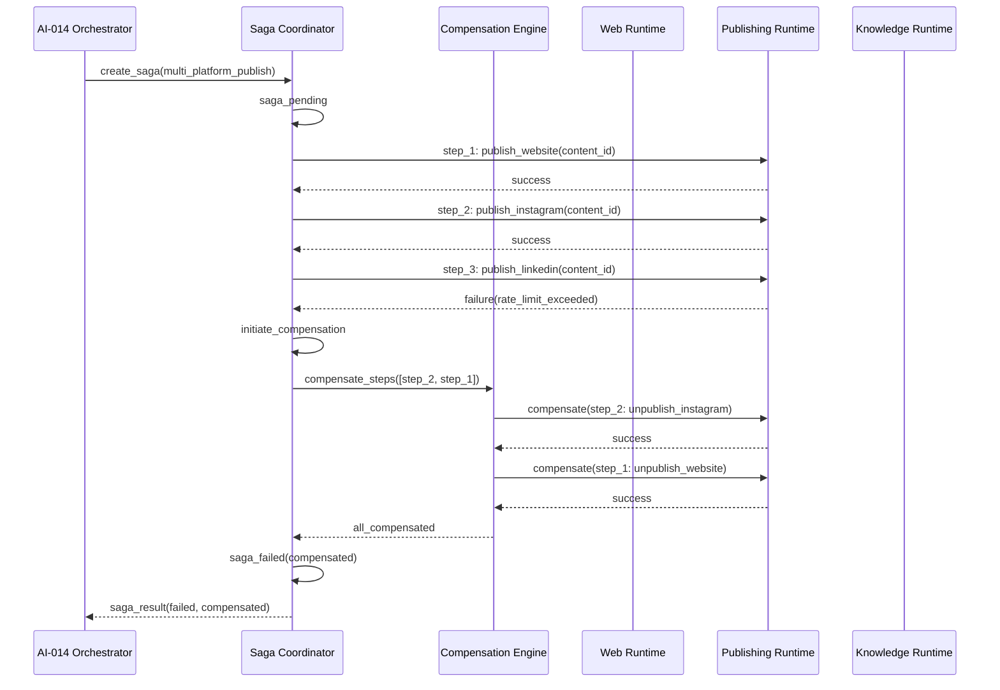

### ۲۷.۲ سناریوی دانش با جبران جزئی

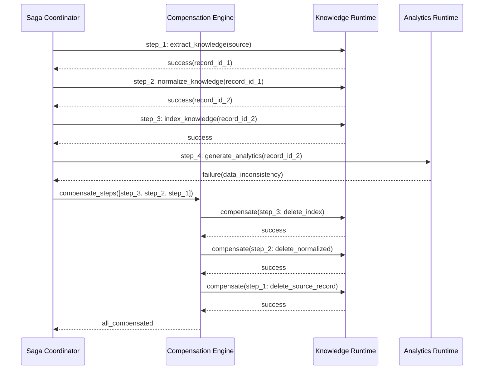

### ۲۷.۳ سناریوی ارجاع انسانی

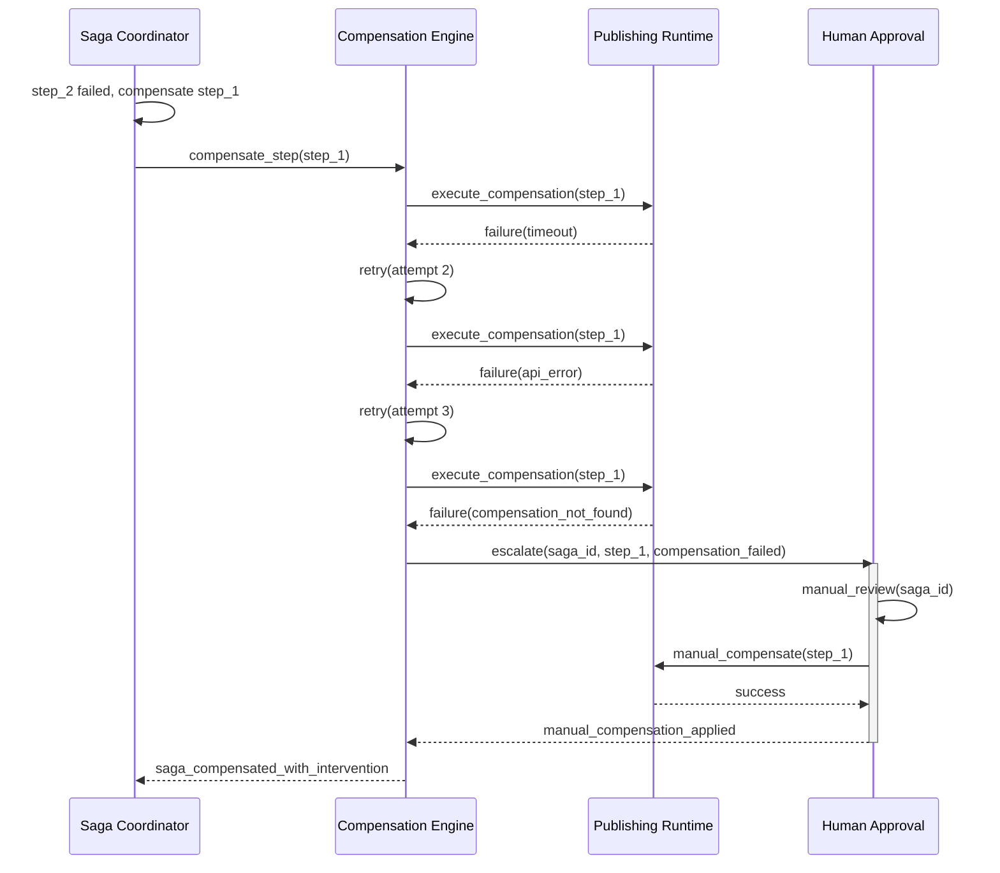

---

## ۲۸. معیارهای کیفیت (Quality Metrics)

| معیار                          | شناسه    | هدف                                 | روش اندازه‌گیری                                   |
| ------------------------------ | -------- | ----------------------------------- | ------------------------------------------------- |
| **Saga Success Rate**          | QM-SG-01 | > 99.5%                             | completed / (completed + failed)                  |
| **Compensation Success Rate**  | QM-SG-02 | > 99.9%                             | compensated / (compensated + compensation_failed) |
| **Saga Duration P99**          | QM-SG-03 | < ۳۰ ثانیه (ساده), < ۵ دقیقه (مرکب) | histogram                                         |
| **Compensation Duration P99**  | QM-SG-04 | < ۱۵ ثانیه به ازای هر Step          | histogram                                         |
| **Manual Intervention Rate**   | QM-SG-05 | < 0.1%                              | escalations / total                               |
| **Saga Timeout Rate**          | QM-SG-06 | < 0.01%                             | timeouts / total                                  |
| **Compensation Retry Rate**    | QM-SG-07 | < 1%                                | retries / compensations                           |
| **Idempotency Violation Rate** | QM-SG-08 | 0%                                  | violations / total operations                     |

---

## ۲۹. ملاحظات اجرایی (Implementation Considerations)

| مؤلفه                 | زبان پیشنهادی | چارچوب               | وابستگی‌ها                 | تست                        |
| --------------------- | ------------- | -------------------- | -------------------------- | -------------------------- |
| Saga Coordinator      | Go / Rust     | gRPC + Redis         | SMOS-704, AI-014, SMOS-702 | Unit + Integration + Chaos |
| Compensation Engine   | Go / Rust     | gRPC + PostgreSQL    | Saga Coordinator, Registry | Unit + Integration + Chaos |
| Compensation Registry | Go / Python   | REST + PostgreSQL    | —                          | Unit + Integration         |
| Saga State Store      | PostgreSQL    | —                    | Saga Coordinator           | Migration + Backup         |
| Saga Monitor          | Python / Go   | Prometheus + Grafana | SMOS-706                   | Integration                |
| Saga Event Producer   | Go            | Kafka                | SMOS-705                   | Integration                |

---

## ۳۰. خلاصه (Summary)

SMOS-714 معماری کامل موتور ساگا و جبران سازمانی SMOS را در ۳۰+ بخش تعریف می‌کند:

| مؤلفه                      | تعداد | توضیح                                                                                                                     |
| -------------------------- | ----- | ------------------------------------------------------------------------------------------------------------------------- |
| **بخش**                    | ۳۳    | تعریف کامل معماری                                                                                                         |
| **Mermaid Diagram**        | ۱۲    | Sequence, State, Component, Flow                                                                                          |
| **JSON Schema (Draft-07)** | ۸     | SagaDefinition, CompensationAction, CompensationChain, SagaState, SagaConfig, SagaEvent, SagaReport, CompensationRegistry |
| **Failure Scenarios**      | ۱۵    | FS-01 تا FS-15 با استراتژی جبران                                                                                          |
| **Retry Strategies**       | ۸     | ۵ forward + ۳ compensation                                                                                                |
| **Rollback Strategies**    | ۵     | Immediate, Deferred, Partial, Selective, No Rollback                                                                      |
| **Metrics**                | ۱۳    | ۷ saga + ۶ compensation                                                                                                   |
| **Alerts**                 | ۵     | P1 تا P3                                                                                                                  |
| **Events**                 | ۱۰    | رویدادهای نظارتی                                                                                                          |
| **API Endpoints**          | ۱۰    | REST + Event + gRPC                                                                                                       |
| **Config Examples**        | ۳     | Coordinator, Runtime, Tenant                                                                                              |
| **Cross-References**       | ۲۰+   | به SMOS-701..708, AUT, AI                                                                                                 |
| **ADR**                    | ۶     | تصمیمات معماری ثبت‌شده                                                                                                    |
| **Gaps**                   | ۱۰    | کارهای آینده                                                                                                              |
| **Scenarios**              | ۳     | سناریوهای واقعی SMOS                                                                                                      |

این سند مکمل SMOS-704 (§۱۵ — Saga Pattern) است و جزئیات موتور اجرایی ساگا، جبران، رجیستری، خطا، نظارت، امنیت و مقیاس‌پذیری را ارائه می‌دهد.
