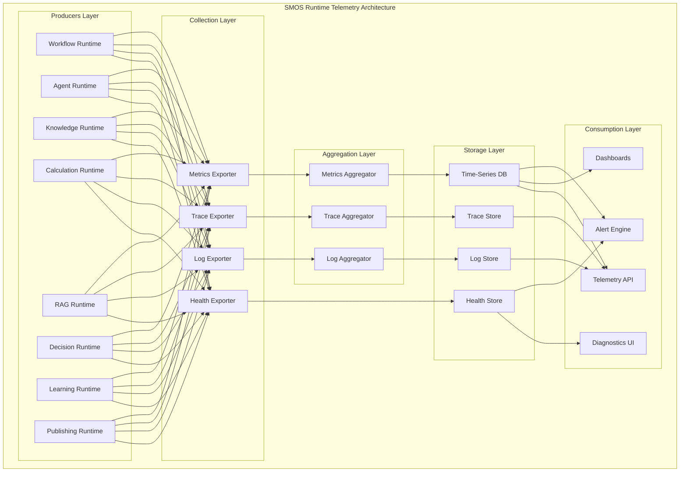
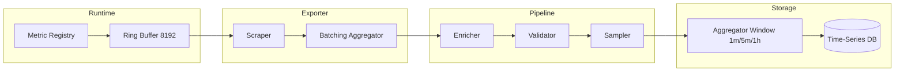
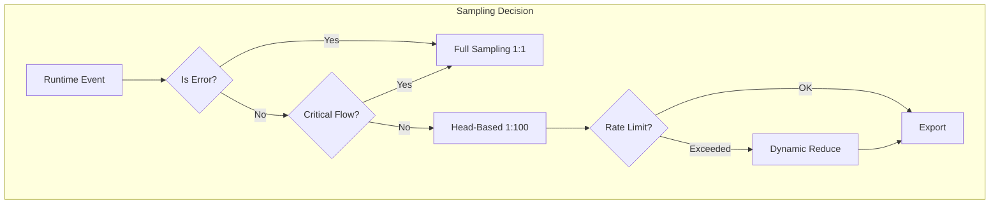
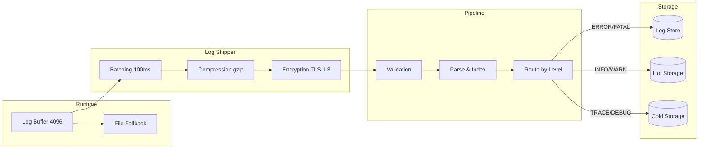
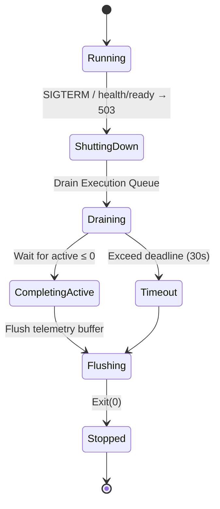
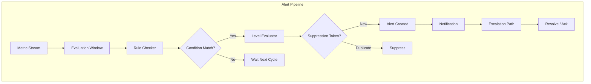
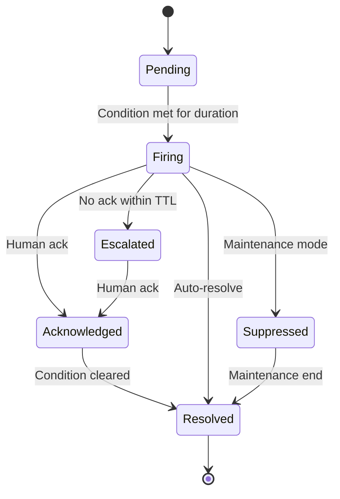
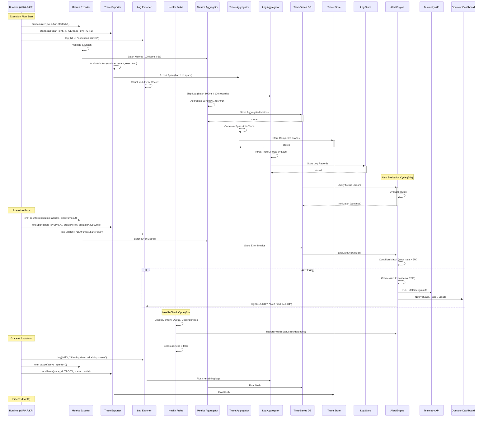
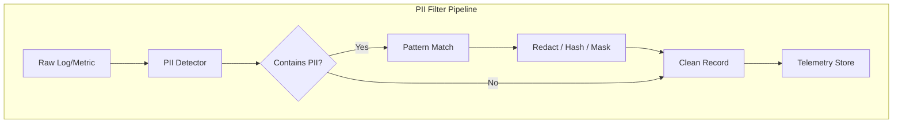
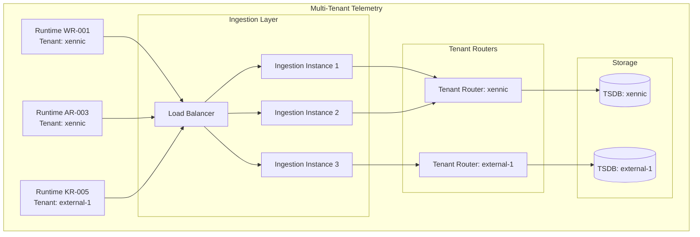

# SMOS-715 — معماری تله‌متری زمان اجرا

## Runtime Telemetry Architecture

> **شناسه:** SMOS-715
> **وضعیت:** پیش‌نویس
> **نسخه:** 1.0.0-draft
> **خانواده:** EXEC
> **دامنه:** EXD-15 — Runtime Telemetry
> **نوع:** Telemetry Architecture
> **تاریخ:** 2026-07-01
> **مسئول:** معمار اجرای سیستم
> **SSOT:** ✅ بله — تک منبع حقیقت تله‌متری زمان اجرا
> **وابستگی:** SMOS-701, SMOS-702, SMOS-703, SMOS-704, SMOS-705, SMOS-706, SMOS-707, SMOS-708, SMOS-709, SMOS-710, SMOS-711, SMOS-712, SMOS-713, SMOS-714, SMOS-716, AI-010, KNW-404, KNW-306
> **مخاطب:** system-architect, sre-engineer, devops-engineer, ai-orchestrator, monitoring-engineer, agent-developer

---

## ۱. کنترل سند (Document Control)

| بخش                | مقدار                                 |
| ------------------ | ------------------------------------- |
| شناسه سند          | SMOS-715                              |
| عنوان              | Runtime Telemetry Architecture        |
| فاز                | P7.S02 — Runtime Quality & Resilience |
| نسخه               | v1.0.0-draft                          |
| وضعیت              | Draft                                 |
| مسئول              | معمار اجرای سیستم                     |
| تاریخ ایجاد        | 2026-07-01                            |
| تاریخ بازبینی بعدی | P7.S04                                |
| سطح اختیار         | A-4 (Enterprise)                      |
| دامنه              | EXD-15 — Runtime Telemetry            |
| زبان روایت         | فارسی                                 |
| زبان شناسه‌ها      | انگلیسی                               |

### ۱.۱ تاریخچه نسخه

| نسخه        | تاریخ      | تغییرات                                                                                  | توسط        |
| ----------- | ---------- | ---------------------------------------------------------------------------------------- | ----------- |
| 1.0.0-draft | 2026-07-01 | نگارش اولیه — ۳۵ بخش، ۱۲ JSON Schema، ۹ Mermaid Diagram، ۱۵ سناریوی خطا، ۱۰ اصل تله‌متری | معمار سیستم |

### ۱.۲ واژگان کلیدی

| اصطلاح              | تعریف                                                                                   |
| ------------------- | --------------------------------------------------------------------------------------- |
| **Telemetry**       | داده‌های اندازه‌گیری‌شده به صورت خودکار از مؤلفه‌های سیستم — شامل Metrics, Traces, Logs |
| **Metric**          | اندازه‌گیری کمی (Counter, Gauge, Histogram, Timer)                                      |
| **Trace**           | ردیابی توزیع‌شده یک درخواست در سراسر Runtimeها                                          |
| **Span**            | واحد کار در یک Trace — دارای شناسه، زمان شروع/پایان، وضعیت                              |
| **Log Record**      | رخداد متنی ساختیافته با سطح، زمان، منبع                                                 |
| **Health Probe**    | بررسی وضعیت یک سرویس (Liveness, Readiness, Startup)                                     |
| **Alert Rule**      | شرط + آستانه + اقدام برای تشخیص ناهنجاری                                                |
| **Escalation Path** | زنجیره اعلان افزایشی برای رویدادهای بحرانی                                              |
| **Pipeline**        | زنجیره collect → aggregate → export → store → alert                                     |
| **Sampling**        | نمونه‌گیری کاهشی volume داده (Head-based, Tail-based)                                   |
| **Cardinality**     | تعداد مقادیر یکتای یک برچسب — کنترل cardinality حیاتی است                               |
| **Exemplar**        | یک نمونه از Trace متصل به یک Metric                                                     |

---

## ۲. هدف و دامنه (Purpose & Scope)

### ۲.۱ هدف

SMOS-715 معماری تله‌متری زمان اجرا (Runtime Telemetry) را برای تمام هشت Runtime سیستم SMOS تعریف می‌کند. در حالی که SMOS-706 معماری نظارت (Monitoring Architecture) را در سطح استراتژیک و KPIs تعریف می‌کند، SMOS-715 به لایه **پایین‌تر اجرایی** — نحوه جمع‌آوری، انتقال، ذخیره‌سازی و هشداردهی داده‌های تله‌متری از مؤلفه‌های زمان اجرا — می‌پردازد.

این سند مشخص می‌کند:

1. **Metrics Pipeline** — جمع‌آوری، aggregation، export metrics از Runtimeها
2. **Distributed Tracing** — ردیابی توزیع‌شده با W3C Trace Context
3. **Event Logging** — ثبت رویدادهای ساختیافته با سطوح و shipping
4. **Health Check System** — Liveness/Readiness/Startup probes برای هر Runtime
5. **Alerting Architecture** — قواعد، آستانه‌ها، مسیرهای escalation
6. **Runtime Diagnostics** — دیباگ و عیب‌یابی در سطح Runtime
7. **Telemetry Pipeline** — جریان end-to-end از تولید تا مصرف

### ۲.۲ درون دامنه (In Scope)

| حوزه                      | توضیح                                                 |
| ------------------------- | ----------------------------------------------------- |
| معماری Metrics Pipeline   | Collection, Aggregation, Export                       |
| Distributed Tracing Model | W3C Trace Context, Span Model, Sampling               |
| Structured Event Logging  | Log Levels, Schema, Shipping                          |
| Health Check System       | Liveness, Readiness, Startup, Graceful Shutdown       |
| Alerting Architecture     | Rules, Thresholds, Escalations, Notification Channels |
| Runtime Diagnostics       | Debug Mode, Diagnostics Endpoints, Profiling          |
| Telemetry Security        | Access Control, PII Filtering, Encryption, Audit      |
| Scaling & Multi-Tenancy   | Partitioning, Rate Limiting, Isolation                |
| API Contracts             | Telemetry Ingestion API, Health API, Diagnostics API  |

### ۲.۳ خارج از دامنه (Out of Scope)

| حوزه                                        | دلیل                                                |
| ------------------------------------------- | --------------------------------------------------- |
| تله‌متری زیرساخت (Infrastructure Telemetry) | پوشش داده شده در فضای DevOps / Platform Engineering |
| Business KPIs و Dashboard                   | پوشش داده شده در SMOS-706 §17 و AI-010              |
| Anomaly Detection خودکار                    | Gap — به P7.S04 موکول شد                            |
| Platform Analytics (AI-010)                 | لایه تحلیل کسب‌وکار — خارج از تله‌متری Runtime      |

### ۲.۴ مخاطبان

- SRE Engineers و DevOps Engineers
- معماران Runtime (۸ Runtime)
- توسعه‌دهندگان Agent (AI-001..AI-014)
- AI Orchestrator (AI-014)
- تیم Monitoring و Observability
- معمار امنیت سیستم

---

## ۳. نمای کلی معماری تله‌متری (Telemetry Architecture Overview)



### ۳.۱ مؤلفه‌های معماری

| مؤلفه                  | نقش                                             | مقیاس                |
| ---------------------- | ----------------------------------------------- | -------------------- |
| **Metrics Exporter**   | خروجی metrics از هر Runtime با فرمت OpenMetrics | Per Runtime Instance |
| **Trace Exporter**     | خروجی spans با فرمت OpenTelemetry OTLP          | Per Execution        |
| **Log Exporter**       | خروجی log records ساختیافته با فرمت JSON        | Per Runtime Instance |
| **Health Exporter**    | افشای endpoints liveness, readiness, startup    | Per Runtime Instance |
| **Metrics Aggregator** | تجمیع metrics با پنجره‌های ۱m, ۵m, ۱h           | Horizontal Scale     |
| **Trace Aggregator**   | همبستگی spans و ساخت Trace کامل                 | Horizontal Scale     |
| **Log Aggregator**     | نمایه‌سازی و shipping logs به Log Store         | Horizontal Scale     |
| **Alert Engine**       | ارزیابی قواعد هشدار روی metrics stream          | Active/Standby       |

---

## ۴. اصول تله‌متری (Telemetry Principles)

| #      | اصل (Telemetry Principle)       | توضیح                                                                                  |
| ------ | ------------------------------- | -------------------------------------------------------------------------------------- |
| TPR-01 | **Observability Built-In**      | هر Runtime تله‌متری را به صورت پیش‌فرض و بدون نیاز به پیکربندی اضافی منتشر می‌کند      |
| TPR-02 | **Zero-Overhead Baseline**      | overhead تله‌متری < ۰.۵% منابع Runtime — استفاده از ring buffer و async export         |
| TPR-03 | **Three Pillars**               | هر سه رکن Metrics, Traces, Logs برای هر Runtime پشتیبانی می‌شود                        |
| TPR-04 | **W3C Trace Context**           | تمام traces از استاندارد W3C Trace Context (traceparent, tracestate) پیروی می‌کنند     |
| TPR-05 | **Structured Everywhere**       | تمام خروجی‌های تله‌متری با JSON Schema معتبر تولید می‌شوند                             |
| TPR-06 | **Real-Time with Backpressure** | تله‌متری با حداکثر تأخیر ۵s در دسترس است — backpressure با dropping sampleهای غیرحیاتی |
| TPR-07 | **Privacy by Default**          | PII پیش از خروج از Runtime فیلتر می‌شود — هرگز در pipeline ذخیره نمی‌شود               |
| TPR-08 | **Self-Telemetry**              | خود سیستم تله‌متری metrics سلامت خود را منتشر می‌کند (Telemetry Health)                |
| TPR-09 | **Explicit Sampling**           | sampling به صورت صریح پیکربندی می‌شود — default: head-based 1:100 برای traces          |
| TPR-10 | **Multi-Tenant Isolation**      | تله‌متری هر tenant به صورت منطقی و فیزیکی ایزوله است                                   |
| TPR-11 | **Cost Attribution**            | هر metric/trace/log قابل انتساب به execution_id و tenant_id است                        |
| TPR-12 | **Immutable Audit**             | logهای audit به صورت append-only و hash-chained ذخیره می‌شوند                          |

---

## ۵. خط لوله جمع‌آوری Metrics (Metrics Collection Pipeline)

### ۵.۱ معماری Collection



### ۵.۲ Metric Types پشتیبانی‌شده

| نوع              | رفتار             | مثال                                     |
| ---------------- | ----------------- | ---------------------------------------- |
| `counter`        | افزایشی — فقط add | total_executions, total_errors           |
| `gauge`          | لحظه‌ای — set     | active_agents, memory_usage_bytes        |
| `histogram`      | توزیع — observe   | latency_ms, token_count                  |
| `timer`          | مدت‌زمان — record | execution_duration, query_duration       |
| `meter`          | نرخ — mark        | executions_per_second, tokens_per_second |
| `updown_counter` | افزایش/کاهش       | queue_depth, pending_tasks               |

### ۵.۳ استراتژی Aggregate

| پنجره | مؤلفه             | کاربرد                                    |
| ----- | ----------------- | ----------------------------------------- |
| Raw   | Metric Collector  | نمایش بلادرنگ، alerting فوری              |
| 1m    | Aggregator Tier-1 | dashboards عملیاتی، trend کوتاه           |
| 5m    | Aggregator Tier-2 | dashboards تحلیلی، alerting با hysteresis |
| 1h    | Aggregator Tier-3 | reporting, capacity planning              |

### ۵.۴ Aggregation Functions

| تابع                | توضیح          | کاربرد روی              |
| ------------------- | -------------- | ----------------------- |
| `sum`               | مجموع مقادیر   | counter, updown_counter |
| `avg`               | میانگین        | gauge, timer, histogram |
| `min`               | کمینه          | latency, memory         |
| `max`               | بیشینه         | latency, memory, queue  |
| `count`             | تعداد نمونه‌ها | counter, histogram      |
| `p50`, `p95`, `p99` | درصدی‌ها       | histogram, timer        |
| `rate`              | نرخ بر ثانیه   | counter, meter          |

### ۵.۵ Metric Export Protocol

Metrics با فرمت **OpenMetrics** (پیش‌فرض) و **OTLP Metrics** (اختیاری) صادر می‌شوند:

```
# HELP smos_runtime_executions_total Total executions per runtime
# TYPE smos_runtime_executions_total counter
smos_runtime_executions_total{runtime_type="workflow",runtime_id="WR-001",tenant_id="xennic"} 1542 1720000000
smos_runtime_executions_total{runtime_type="agent",runtime_id="AR-003",tenant_id="xennic"} 8923 1720000000
# HELP smos_runtime_active_agents Current active agent count
# TYPE smos_runtime_active_agents gauge
smos_runtime_active_agents{runtime_id="AR-003",tenant_id="xennic"} 12 1720000000
```

### ۵.۶ استراتژی Backpressure

| سطح اشغال Ring Buffer | اقدام                                                            |
| --------------------- | ---------------------------------------------------------------- |
| < 70%                 | عادی — همه metrics جمع‌آوری می‌شوند                              |
| 70–85%                | هشدار — metrics غیرحیاتی (debug) drop می‌شوند                    |
| 85–95%                | بحرانی — aggregation سمت Runtime فعال می‌شود                     |
| > 95%                 | اضطراری — فقط metrics حیاتی (health, liveness) نگه داشته می‌شوند |

---

## ۶. مدل ردیابی توزیع‌شده (Distributed Tracing Model)

### ۶.۱ W3C Trace Context

کلیه traces از استاندارد **W3C Trace Context** پیروی می‌کنند:

| Header        | فرمت                      | مثال                                                      |
| ------------- | ------------------------- | --------------------------------------------------------- |
| `traceparent` | `00-traceid-spanid-flags` | `00-0af7651916cd43dd8448eb211c80319c-b7ad6b7169203331-01` |
| `tracestate`  | `key=value,key=value`     | `smos=tenant_id:xennic,runtime:WR`                        |

**TraceId**: 128-bit hex-string (32 نویسه)  
**SpanId**: 64-bit hex-string (16 نویسه)  
**TraceFlags**: 01 = sampled, 00 = not sampled

### ۶.۲ Span Taxonomy

| Span Type            | توضیح                             | Parent                              |
| -------------------- | --------------------------------- | ----------------------------------- |
| `runtime.execute`    | اجرای کامل یک Runtime             | root span                           |
| `workflow.step`      | اجرای یک Step در Workflow Runtime | `runtime.execute`                   |
| `agent.reason`       | چرخه استدلال Agent                | `runtime.execute`                   |
| `agent.tool_call`    | فراخوانی ابزار توسط Agent         | `agent.reason`                      |
| `knowledge.query`    | جستجوی دانش                       | `agent.reason` یا `runtime.execute` |
| `knowledge.embed`    | تولید embedding                   | `knowledge.query`                   |
| `knowledge.retrieve` | بازیابی اسناد                     | `knowledge.query`                   |
| `rag.generate`       | تولید پاسخ RAG                    | `runtime.execute`                   |
| `calculation.eval`   | ارزیابی محاسبه                    | `runtime.execute`                   |
| `decision.evaluate`  | ارزیابی تصمیم                     | `runtime.execute`                   |
| `decision.approve`   | تأیید تصمیم                       | `decision.evaluate`                 |
| `learning.cycle`     | چرخه یادگیری                      | `runtime.execute`                   |
| `publish.platform`   | انتشار روی پلتفرم                 | `runtime.execute`                   |
| `publish.verify`     | تأیید انتشار                      | `publish.platform`                  |
| `saga.step`          | اجرای Step ساگا                   | `runtime.execute`                   |
| `saga.compensate`    | عملیات جبران                      | `runtime.execute`                   |

### ۶.۳ Span Attributes

| Attribute             | نوع    | توضیح                                         |
| --------------------- | ------ | --------------------------------------------- |
| `smos.runtime_type`   | string | نوع Runtime (workflow, agent, knowledge, ...) |
| `smos.runtime_id`     | string | شناسه Runtime instance                        |
| `smos.execution_id`   | string | شناسه اجرا                                    |
| `smos.workflow_id`    | string | شناسه Workflow (در صورت وجود)                 |
| `smos.agent_id`       | string | شناسه Agent (در صورت وجود)                    |
| `smos.tenant_id`      | string | شناسه Tenant                                  |
| `smos.step_name`      | string | نام Step فعلی                                 |
| `smos.state_from`     | string | حالت مبدأ (SMOS-702)                          |
| `smos.state_to`       | string | حالت مقصد (SMOS-702)                          |
| `smos.retry_count`    | int    | تعداد تلاش مجدد                               |
| `smos.error_code`     | string | کد خطا (در صورت خطا)                          |
| `smos.error_category` | string | دسته خطا (transient, fatal, business)         |
| `smos.cost_estimate`  | float  | هزینه تخمینی این Span                         |
| `smos.token_input`    | int    | توکن ورودی                                    |
| `smos.token_output`   | int    | توکن خروجی                                    |

### ۶.۴ استراتژی Sampling

| استراتژی              | نرخ        | هدف                                                     |
| --------------------- | ---------- | ------------------------------------------------------- |
| Head-based (default)  | 1:100      | کاهش volume پیش از تولید                                |
| Tail-based (critical) | 1:1        | نگهداری ۱۰۰% traces با error                            |
| Tenant override       | قابل تنظیم | Tenant با اولویت بالا می‌تواند sampling را override کند |
| Dynamic               | adaptive   | کاهش خودکار نرخ در بار بالا                             |



---

## ۷. ثبت رویداد (Event Logging)

### ۷.۱ سطوح Log

| سطح        | مقدار عددی | کاربرد                            | نمونه                           |
| ---------- | ---------- | --------------------------------- | ------------------------------- |
| `TRACE`    | 0          | دیباگ سطح پایین — جزئیات تابع     | ورود به حلقه پردازش             |
| `DEBUG`    | 1          | دیباگ توسعه‌دهنده — اطلاعات میانی | Step execution details          |
| `INFO`     | 2          | اطلاعات عمومی — عملکرد عادی       | Workflow started, Agent invoked |
| `WARN`     | 3          | هشدار — مشکل غیربحرانی            | Retry attempt, Slow query       |
| `ERROR`    | 4          | خطا — عملکرد مختل شده             | Execution failed, Timeout       |
| `FATAL`    | 5          | بحرانی — Runtime down             | Out of memory, Panic            |
| `SECURITY` | 6          | امنیت — رویدادهای امنیتی          | Access denied, Auth failure     |

### ۷.۲ ساختار Log Record

هر Log Record یک JSON با schema مشخص است:

```json
{
  "timestamp": "2026-07-01T10:30:00.123Z",
  "level": "ERROR",
  "logger": "smos.execution.agent-runtime",
  "runtime_id": "AR-003",
  "runtime_type": "agent",
  "execution_id": "EXC-A7F3C2D1",
  "trace_id": "TRC-0af7651916cd43dd8448eb211c80319c",
  "span_id": "SPN-b7ad6b7169203331",
  "tenant_id": "xennic",
  "message": "Agent reasoning failed: LLM timeout",
  "error_code": "ERR-LLM-TIMEOUT-001",
  "error_category": "transient",
  "attributes": {
    "agent_id": "AI-003",
    "model": "gpt-4o",
    "retry_count": 2,
    "duration_ms": 30500
  },
  "tags": ["llm", "timeout", "transient"]
}
```

### ۷.۳ Log Shipping



### ۷.۴ استراتژی Ship

| شرط                          | رفتار                              |
| ---------------------------- | ---------------------------------- |
| Batch size ≥ 100             | ارسال فوری                         |
| Time since last ship ≥ 100ms | ارسال با timeout                   |
| Buffer ≥ 80%                 | ارسال فوری با priority             |
| Network failure              | Fallback به disk، retry با backoff |
| Disk fallback ≥ 90%          | Drop logهای TRACE/DEBUG            |

### ۷.۵ Log Retention

| سطح Log  | Hot (SSD) | Warm (HDD) | Cold (Object Store) | Deletion |
| -------- | --------- | ---------- | ------------------- | -------- |
| TRACE    | —         | —          | ۷ روز               | ۳۰ روز   |
| DEBUG    | —         | ۱ روز      | ۷ روز               | ۳۰ روز   |
| INFO     | ۳ روز     | ۱۴ روز     | ۹۰ روز              | ۱ سال    |
| WARN     | ۷ روز     | ۳۰ روز     | ۱ سال               | ۳ سال    |
| ERROR    | ۳۰ روز    | ۱ سال      | ۳ سال               | ۷ سال    |
| FATAL    | ۱ سال     | ۳ سال      | ۷ سال               | هرگز     |
| SECURITY | ۱ سال     | ۳ سال      | ۷ سال               | هرگز     |

---

## ۸. سیستم بررسی سلامت (Health Check System)

### ۸.۱ انواع Probe

| Probe         | هدف                              | فرکانس       | اقدام در Failure          |
| ------------- | -------------------------------- | ------------ | ------------------------- |
| **Liveness**  | آیا Runtime زنده است؟            | ۱۰s          | Restart container/process |
| **Readiness** | آیا Runtime آماده سرویس‌دهی است؟ | ۵s           | Remove from load balancer |
| **Startup**   | آیا Runtime راه‌اندازی کامل شده؟ | ۲s (initial) | Delay liveness checks     |

### ۸.۲ Health Check Endpoints

| endpoint              | روش             | خروجی                                                       |
| --------------------- | --------------- | ----------------------------------------------------------- |
| `GET /health/live`    | Liveness probe  | `{"status": "ok"}` یا `{"status": "error", "error": "..."}` |
| `GET /health/ready`   | Readiness probe | `{"status": "ok", "checks": [...]}`                         |
| `GET /health/startup` | Startup probe   | `{"status": "ok", "ready": true}`                           |
| `GET /health/all`     | Comprehensive   | تمام checks با جزئیات                                       |

### ۸.۳ ساختار Health Check Response

```json
{
  "status": "ok",
  "timestamp": "2026-07-01T10:30:00.123Z",
  "runtime_id": "WR-001",
  "runtime_type": "workflow",
  "version": "1.0.0-draft",
  "uptime_seconds": 86400,
  "checks": [
    {
      "name": "database_connectivity",
      "status": "ok",
      "duration_ms": 5,
      "last_success": "2026-07-01T10:30:00.118Z"
    },
    {
      "name": "queue_connectivity",
      "status": "ok",
      "duration_ms": 3,
      "last_success": "2026-07-01T10:30:00.120Z"
    },
    {
      "name": "memory_pressure",
      "status": "degraded",
      "duration_ms": 1,
      "message": "Heap usage at 78% — approaching threshold",
      "value_percent": 78
    },
    {
      "name": "disk_space",
      "status": "ok",
      "duration_ms": 2,
      "value_bytes": 42949672960,
      "free_bytes": 21474836480
    }
  ],
  "dependencies": {
    "database": "connected",
    "message_queue": "connected",
    "cache": "connected",
    "llm_service": "degraded"
  }
}
```

### ۸.۴ Health Check Categories

| دسته             | اجزای بررسی                                    | Critical            |
| ---------------- | ---------------------------------------------- | ------------------- |
| **System**       | CPU, Memory, Disk, Network I/O                 | لزوم برای liveness  |
| **Connectivity** | Database, Queue, Cache, Object Store           | لزوم برای readiness |
| **Runtime**      | State Machine, Execution Queue, Worker Pool    | لزوم برای readiness |
| **Dependency**   | LLM Service, Embedding Service, Search Service | غیرمستقیم           |
| **Telemetry**    | Metrics Pipeline, Log Shipper, Trace Exporter  | غیرمستقیم           |

### ۸.۵ Graceful Shutdown



---

## ۹. معماری هشدار (Alerting Architecture)

### ۹.۱ سطوح هشدار

| Level | Severity  | Response Time | Escalation                 | مثال                        |
| ----- | --------- | ------------- | -------------------------- | --------------------------- |
| L1    | Info      | None          | —                          | Metric threshold warning    |
| L2    | Warning   | < ۳۰m         | Team lead                  | Error rate > ۲%             |
| L3    | Error     | < ۱۰m         | Engineering lead           | Runtime degraded            |
| L4    | Critical  | < ۵m          | On-call + Manager          | Runtime down                |
| L5    | Emergency | Immediate     | Full escalation + War Room | Data loss / Security breach |

### ۹.۲ معماری Alert Engine



### ۹.۳ Alert Lifecycle



### ۹.۴ Suppression & Deduplication

| مکانیزم                | توضیح                                                                   |
| ---------------------- | ----------------------------------------------------------------------- |
| **Suppression Token**  | کلید یکتا (runtime_id + alert_rule_id) — از هشدار تکراری جلوگیری می‌کند |
| **Maintenance Window** | سکوت هشدارها در بازه زمانی مشخص                                         |
| **Flapping Detection** | تشخیص حالت نوسانی (ok→alert→ok→alert)                                   |
| **Grouping**           | تجمیع هشدارهای مشابه در یک notification                                 |

---

## ۱۰. دیباگ و عیب‌یابی زمان اجرا (Runtime Diagnostics)

### ۱۰.۱ Debug Mode

| سطح Debug | توضیح                                 | فعال‌سازی               |
| --------- | ------------------------------------- | ----------------------- |
| `off`     | بدون دیباگ — تولیدی                   | پیش‌فرض                 |
| `basic`   | metrics + log سطح INFO                | `runtime.debug=basic`   |
| `verbose` | metrics + log سطح DEBUG + traces      | `runtime.debug=verbose` |
| `trace`   | metrics + log سطح TRACE + تمام traces | `runtime.debug=trace`   |

### ۱۰.۲ Diagnostics Endpoints

| Endpoint                               | توضیح                                       | دسترسی   |
| -------------------------------------- | ------------------------------------------- | -------- |
| `GET /diag/pprof/all`                  | Profiling snapshot (heap, goroutine, mutex) | admin    |
| `GET /diag/metrics`                    | Metrics snapshot لحظه‌ای                    | operator |
| `GET /diag/traces/active`              | Traces فعال در حال اجرا                     | operator |
| `GET /diag/logs/tail?lines=100`        | Tail آخرین logها                            | operator |
| `GET /diag/state`                      | State Machine وضعیت فعلی                    | operator |
| `GET /diag/queue`                      | وضعیت صف اجرا                               | operator |
| `GET /diag/threads`                    | وضعیت Worker Threadها                       | admin    |
| `POST /diag/force_gc`                  | اجبار Garbage Collection                    | admin    |
| `POST /diag/dump_state`                | Dump کامل State                             | admin    |
| `POST /diag/set_log_level?level=DEBUG` | تغییر سطح log در حال اجرا                   | operator |

### ۱۰.۳ Profiling Data Model

```json
{
  "profile_id": "PROF-A7F3C2D1B9E8",
  "runtime_id": "AR-003",
  "timestamp": "2026-07-01T10:30:00.123Z",
  "duration_ms": 5000,
  "samples": [
    {
      "function": "github.com/smos/agent-runtime/internal/reasoning.(*Engine).execute",
      "file": "reasoning/engine.go:142",
      "line": 142,
      "count": 847,
      "percent": 34.2
    },
    {
      "function": "github.com/smos/agent-runtime/internal/llm.(*Client).Invoke",
      "file": "llm/client.go:89",
      "line": 89,
      "count": 412,
      "percent": 16.6
    }
  ],
  "heap_alloc_bytes": 157286400,
  "heap_inuse_bytes": 188743680,
  "goroutines": 42,
  "mutex_wait_ns": 1500000
}
```

---

## ۱۱. تعریف Schema Metrics (Metrics Schema Definitions)

### ۱۱.۱ CanonicalMetric

```json
{
  "$schema": "http://json-schema.org/draft-07/schema#",
  "$id": "smos:telemetry:metric:canonical",
  "title": "CanonicalMetric",
  "type": "object",
  "required": ["metric_id", "name", "type", "value", "timestamp", "labels"],
  "properties": {
    "metric_id": {
      "type": "string",
      "pattern": "^MTR-[A-Z0-9]{8}$"
    },
    "name": {
      "type": "string",
      "pattern": "^[a-z][a-z0-9_.]{1,127}$",
      "maxLength": 128
    },
    "type": {
      "type": "string",
      "enum": ["counter", "gauge", "histogram", "timer", "meter", "updown_counter"]
    },
    "value": {
      "type": "number"
    },
    "unit": {
      "type": "string",
      "enum": [
        "count",
        "ms",
        "bytes",
        "tokens",
        "percent",
        "rate",
        "bytes_per_second",
        "requests_per_second"
      ]
    },
    "timestamp": {
      "type": "string",
      "format": "date-time"
    },
    "labels": {
      "type": "object",
      "minProperties": 1,
      "maxProperties": 12,
      "properties": {
        "runtime_id": { "type": "string" },
        "runtime_type": { "type": "string" },
        "agent_id": { "type": "string" },
        "workflow_id": { "type": "string" },
        "execution_id": { "type": "string" },
        "tenant_id": { "type": "string" },
        "trace_id": { "type": "string" }
      },
      "required": ["runtime_id", "tenant_id"]
    },
    "exemplar": {
      "type": "object",
      "properties": {
        "trace_id": { "type": "string" },
        "span_id": { "type": "string" },
        "value": { "type": "number" },
        "timestamp": { "type": "string", "format": "date-time" }
      }
    },
    "tags": {
      "type": "object",
      "additionalProperties": { "type": "string" },
      "maxProperties": 8
    }
  }
}
```

### ۱۱.۲ MetricBatch

```json
{
  "$schema": "http://json-schema.org/draft-07/schema#",
  "$id": "smos:telemetry:metric:batch",
  "title": "MetricBatch",
  "type": "object",
  "required": ["batch_id", "source_id", "metrics", "collected_at"],
  "properties": {
    "batch_id": {
      "type": "string",
      "pattern": "^MTR-BATCH-[A-Z0-9]{12}$"
    },
    "source_id": {
      "type": "string",
      "description": "شناسه Runtime مبدأ"
    },
    "source_type": {
      "type": "string",
      "enum": [
        "workflow",
        "agent",
        "knowledge",
        "calculation",
        "rag",
        "decision",
        "learning",
        "publishing"
      ]
    },
    "metrics": {
      "type": "array",
      "items": { "$ref": "#/$defs/MetricEntry" },
      "minItems": 1,
      "maxItems": 500
    },
    "collected_at": {
      "type": "string",
      "format": "date-time"
    },
    "collection_duration_ms": {
      "type": "integer",
      "minimum": 0
    },
    "sequence_number": {
      "type": "integer",
      "minimum": 1
    }
  },
  "$defs": {
    "MetricEntry": {
      "type": "object",
      "required": ["name", "value", "type", "timestamp"],
      "properties": {
        "name": { "type": "string" },
        "value": { "type": "number" },
        "type": { "type": "string" },
        "unit": { "type": "string" },
        "timestamp": { "type": "string", "format": "date-time" },
        "labels": { "type": "object" }
      }
    }
  }
}
```

### ۱۱.۳ AggregatedMetric

```json
{
  "$schema": "http://json-schema.org/draft-07/schema#",
  "$id": "smos:telemetry:metric:aggregated",
  "title": "AggregatedMetric",
  "type": "object",
  "required": ["metric_name", "window", "start_time", "end_time", "aggregates"],
  "properties": {
    "metric_name": { "type": "string" },
    "window": {
      "type": "string",
      "enum": ["1m", "5m", "1h"]
    },
    "start_time": { "type": "string", "format": "date-time" },
    "end_time": { "type": "string", "format": "date-time" },
    "aggregates": {
      "type": "object",
      "required": ["count", "sum", "avg", "min", "max"],
      "properties": {
        "count": { "type": "integer", "minimum": 0 },
        "sum": { "type": "number" },
        "avg": { "type": "number" },
        "min": { "type": "number" },
        "max": { "type": "number" },
        "p50": { "type": "number" },
        "p95": { "type": "number" },
        "p99": { "type": "number" },
        "rate": { "type": "number" }
      }
    },
    "labels": { "type": "object" }
  }
}
```

---

## ۱۲. تعریف Schema Trace (Trace Schema Definitions)

### ۱۲.۱ Trace

```json
{
  "$schema": "http://json-schema.org/draft-07/schema#",
  "$id": "smos:telemetry:trace:record",
  "title": "TraceRecord",
  "type": "object",
  "required": ["trace_id", "spans", "start_time", "end_time", "duration_ms"],
  "properties": {
    "trace_id": {
      "type": "string",
      "pattern": "^[0-9a-f]{32}$"
    },
    "spans": {
      "type": "array",
      "items": { "$ref": "#/$defs/Span" },
      "minItems": 1
    },
    "start_time": { "type": "string", "format": "date-time" },
    "end_time": { "type": "string", "format": "date-time" },
    "duration_ms": { "type": "integer", "minimum": 0 },
    "span_count": { "type": "integer", "minimum": 1 },
    "status": {
      "type": "string",
      "enum": ["ok", "error", "partial"]
    },
    "execution_id": { "type": "string" },
    "tenant_id": { "type": "string" }
  },
  "$defs": {
    "Span": {
      "type": "object",
      "required": ["span_id", "trace_id", "name", "start_time", "end_time", "status"],
      "properties": {
        "span_id": {
          "type": "string",
          "pattern": "^[0-9a-f]{16}$"
        },
        "trace_id": {
          "type": "string",
          "pattern": "^[0-9a-f]{32}$"
        },
        "parent_span_id": {
          "type": "string",
          "pattern": "^[0-9a-f]{16}$"
        },
        "name": { "type": "string", "maxLength": 256 },
        "span_type": {
          "type": "string",
          "enum": [
            "runtime.execute",
            "workflow.step",
            "agent.reason",
            "agent.tool_call",
            "knowledge.query",
            "knowledge.embed",
            "knowledge.retrieve",
            "rag.generate",
            "calculation.eval",
            "decision.evaluate",
            "decision.approve",
            "learning.cycle",
            "publish.platform",
            "publish.verify",
            "saga.step",
            "saga.compensate"
          ]
        },
        "runtime_type": { "type": "string" },
        "runtime_id": { "type": "string" },
        "start_time": { "type": "string", "format": "date-time" },
        "end_time": { "type": "string", "format": "date-time" },
        "duration_ms": { "type": "integer", "minimum": 0 },
        "status": {
          "type": "string",
          "enum": ["ok", "error", "timeout", "cancelled"]
        },
        "status_code": {
          "type": "integer",
          "minimum": 0,
          "maximum": 2
        },
        "error_message": { "type": "string" },
        "attributes": {
          "type": "object",
          "additionalProperties": true,
          "maxProperties": 32
        },
        "events": {
          "type": "array",
          "items": {
            "type": "object",
            "required": ["timestamp", "name"],
            "properties": {
              "timestamp": { "type": "string", "format": "date-time" },
              "name": { "type": "string" },
              "attributes": { "type": "object" }
            }
          }
        },
        "links": {
          "type": "array",
          "items": {
            "type": "object",
            "properties": {
              "trace_id": { "type": "string" },
              "span_id": { "type": "string" },
              "type": {
                "type": "string",
                "enum": ["follows_from", "child_of"]
              }
            }
          }
        }
      }
    }
  }
}
```

### ۱۲.۲ SpanBatch

```json
{
  "$schema": "http://json-schema.org/draft-07/schema#",
  "$id": "smos:telemetry:trace:batch",
  "title": "SpanBatch",
  "type": "object",
  "required": ["batch_id", "source_id", "spans", "exported_at"],
  "properties": {
    "batch_id": {
      "type": "string",
      "pattern": "^TRC-BATCH-[A-Z0-9]{12}$"
    },
    "source_id": { "type": "string" },
    "spans": {
      "type": "array",
      "items": { "$ref": "smos:telemetry:trace:record#/$defs/Span" },
      "maxItems": 256
    },
    "exported_at": { "type": "string", "format": "date-time" },
    "sampling_rate": {
      "type": "number",
      "minimum": 0,
      "maximum": 1
    }
  }
}
```

---

## ۱۳. تعریف Schema Log (Log Schema Definitions)

### ۱۳.۱ LogRecord

```json
{
  "$schema": "http://json-schema.org/draft-07/schema#",
  "$id": "smos:telemetry:log:record",
  "title": "LogRecord",
  "type": "object",
  "required": ["timestamp", "level", "logger", "message"],
  "properties": {
    "log_id": {
      "type": "string",
      "pattern": "^LOG-[A-Z0-9]{12}$"
    },
    "timestamp": { "type": "string", "format": "date-time" },
    "level": {
      "type": "string",
      "enum": ["TRACE", "DEBUG", "INFO", "WARN", "ERROR", "FATAL", "SECURITY"]
    },
    "level_number": {
      "type": "integer",
      "minimum": 0,
      "maximum": 6
    },
    "logger": {
      "type": "string",
      "pattern": "^smos\\.[a-z][a-z0-9._-]{1,63}$",
      "maxLength": 64
    },
    "runtime_id": { "type": "string" },
    "runtime_type": {
      "type": "string",
      "enum": [
        "workflow",
        "agent",
        "knowledge",
        "calculation",
        "rag",
        "decision",
        "learning",
        "publishing",
        "execution-engine",
        "orchestrator"
      ]
    },
    "execution_id": { "type": "string" },
    "trace_id": { "type": "string" },
    "span_id": { "type": "string" },
    "tenant_id": { "type": "string" },
    "message": {
      "type": "string",
      "maxLength": 4096
    },
    "error_code": { "type": "string" },
    "error_category": {
      "type": "string",
      "enum": ["transient", "fatal", "business", "security", "configuration"]
    },
    "attributes": {
      "type": "object",
      "additionalProperties": true,
      "maxProperties": 24
    },
    "tags": {
      "type": "array",
      "items": { "type": "string", "maxLength": 32 },
      "maxItems": 8
    },
    "pii_redacted": {
      "type": "boolean",
      "default": false
    }
  }
}
```

### ۱۳.۲ LogBatch

```json
{
  "$schema": "http://json-schema.org/draft-07/schema#",
  "$id": "smos:telemetry:log:batch",
  "title": "LogBatch",
  "type": "object",
  "required": ["batch_id", "source_id", "records", "exported_at"],
  "properties": {
    "batch_id": {
      "type": "string",
      "pattern": "^LOG-BATCH-[A-Z0-9]{12}$"
    },
    "source_id": { "type": "string" },
    "records": {
      "type": "array",
      "items": { "$ref": "smos:telemetry:log:record" },
      "minItems": 1,
      "maxItems": 500
    },
    "exported_at": { "type": "string", "format": "date-time" },
    "compression": {
      "type": "string",
      "enum": ["none", "gzip"],
      "default": "none"
    },
    "sequence_number": {
      "type": "integer",
      "minimum": 1
    }
  }
}
```

---

## ۱۴. تعریف Schema رویداد (Event Schema Definitions)

### ۱۴.۱ TelemetryEvent

```json
{
  "$schema": "http://json-schema.org/draft-07/schema#",
  "$id": "smos:telemetry:event:record",
  "title": "TelemetryEvent",
  "type": "object",
  "required": ["event_id", "event_type", "source", "timestamp", "payload"],
  "properties": {
    "event_id": {
      "type": "string",
      "pattern": "^TEV-[A-Z0-9]{10}$"
    },
    "event_type": {
      "type": "string",
      "enum": [
        "telemetry.metric.collected",
        "telemetry.metric.aggregated",
        "telemetry.metric.dropped",
        "telemetry.trace.started",
        "telemetry.trace.completed",
        "telemetry.trace.sampled",
        "telemetry.log.shipped",
        "telemetry.log.dropped",
        "telemetry.alert.created",
        "telemetry.alert.resolved",
        "telemetry.alert.escalated",
        "telemetry.alert.suppressed",
        "telemetry.health.changed",
        "telemetry.health.degraded",
        "telemetry.pipeline.buffer_high",
        "telemetry.pipeline.backpressure",
        "telemetry.pipeline.error"
      ]
    },
    "source": {
      "type": "object",
      "required": ["runtime_id", "runtime_type", "component"],
      "properties": {
        "runtime_id": { "type": "string" },
        "runtime_type": { "type": "string" },
        "component": {
          "type": "string",
          "enum": [
            "metrics_exporter",
            "trace_exporter",
            "log_exporter",
            "health_exporter",
            "metrics_aggregator",
            "trace_aggregator",
            "log_aggregator",
            "alert_engine",
            "telemetry_api",
            "diagnostics"
          ]
        }
      }
    },
    "timestamp": { "type": "string", "format": "date-time" },
    "severity": {
      "type": "string",
      "enum": ["info", "warning", "error", "critical"],
      "default": "info"
    },
    "payload": {
      "type": "object",
      "additionalProperties": true
    },
    "context": {
      "type": "object",
      "properties": {
        "trace_id": { "type": "string" },
        "tenant_id": { "type": "string" },
        "execution_id": { "type": "string" }
      }
    }
  }
}
```

### ۱۴.۲ Event Taxonomy تله‌متری

| دسته     | رویداد                            | Severity | توضیح                                  |
| -------- | --------------------------------- | -------- | -------------------------------------- |
| Metric   | `telemetry.metric.collected`      | info     | Metric دریافت و ثبت شد                 |
| Metric   | `telemetry.metric.aggregated`     | info     | پنجره aggregation بسته شد              |
| Metric   | `telemetry.metric.dropped`        | warning  | Metric به دلیل backpressure dropped شد |
| Trace    | `telemetry.trace.started`         | info     | Trace جدید شروع شد                     |
| Trace    | `telemetry.trace.completed`       | info     | Trace کامل شد                          |
| Trace    | `telemetry.trace.sampled`         | info     | Trace به دلیل sampling dropped شد      |
| Log      | `telemetry.log.shipped`           | info     | Batch log ارسال شد                     |
| Log      | `telemetry.log.dropped`           | warning  | Log به دلیل buffer overflow dropped شد |
| Alert    | `telemetry.alert.created`         | critical | هشدار جدید ایجاد شد                    |
| Alert    | `telemetry.alert.resolved`        | info     | هشدار برطرف شد                         |
| Alert    | `telemetry.alert.escalated`       | critical | هشدار escalation شد                    |
| Health   | `telemetry.health.changed`        | info     | وضعیت سلامت تغییر کرد                  |
| Health   | `telemetry.health.degraded`       | warning  | وضعیت به degraded تغییر کرد            |
| Pipeline | `telemetry.pipeline.buffer_high`  | warning  | استفاده از buffer > ۸۰%                |
| Pipeline | `telemetry.pipeline.backpressure` | critical | backpressure فعال شد                   |
| Pipeline | `telemetry.pipeline.error`        | error    | خطا در pipeline                        |

---

## ۱۵. تعریف Schema هشدار (Alert Schema Definitions)

### ۱۵.۱ AlertRule

```json
{
  "$schema": "http://json-schema.org/draft-07/schema#",
  "$id": "smos:telemetry:alert:rule",
  "title": "AlertRule",
  "type": "object",
  "required": ["rule_id", "name", "condition", "severity", "actions"],
  "properties": {
    "rule_id": {
      "type": "string",
      "pattern": "^ALR-[A-Z0-9]{6}$"
    },
    "name": {
      "type": "string",
      "maxLength": 128
    },
    "description": {
      "type": "string",
      "maxLength": 1024
    },
    "enabled": {
      "type": "boolean",
      "default": true
    },
    "source_filter": {
      "type": "object",
      "properties": {
        "runtime_types": {
          "type": "array",
          "items": { "type": "string" },
          "uniqueItems": true
        },
        "runtime_ids": {
          "type": "array",
          "items": { "type": "string" },
          "uniqueItems": true
        },
        "tenant_ids": {
          "type": "array",
          "items": { "type": "string" },
          "uniqueItems": true
        }
      }
    },
    "condition": {
      "type": "object",
      "required": ["metric", "operator", "threshold"],
      "properties": {
        "metric": { "type": "string" },
        "operator": {
          "type": "string",
          "enum": ["gt", "lt", "gte", "lte", "eq", "neq"]
        },
        "threshold": { "type": "number" },
        "for_duration_seconds": {
          "type": "integer",
          "minimum": 0,
          "default": 60
        },
        "evaluation_window": {
          "type": "string",
          "enum": ["raw", "1m", "5m", "1h"],
          "default": "1m"
        },
        "aggregation_function": {
          "type": "string",
          "enum": ["avg", "sum", "max", "min", "count", "p95", "p99", "rate"],
          "default": "avg"
        }
      }
    },
    "severity": {
      "type": "string",
      "enum": ["L1", "L2", "L3", "L4", "L5"]
    },
    "actions": {
      "type": "array",
      "items": {
        "type": "object",
        "required": ["type", "target"],
        "properties": {
          "type": {
            "type": "string",
            "enum": ["email", "webhook", "slack", "pager", "log", "mcp_tool"]
          },
          "target": { "type": "string" },
          "template": { "type": "string" }
        }
      },
      "minItems": 1
    },
    "escalation_path": {
      "type": "string",
      "enum": ["standard", "critical", "security", "silent"],
      "default": "standard"
    },
    "suppression": {
      "type": "object",
      "properties": {
        "cooldown_seconds": { "type": "integer", "minimum": 0 },
        "max_alerts_per_hour": { "type": "integer", "minimum": 1 }
      }
    },
    "annotations": {
      "type": "object",
      "properties": {
        "runbook_url": { "type": "string", "format": "uri" },
        "dashboard_url": { "type": "string", "format": "uri" },
        "summary": { "type": "string" },
        "owner": { "type": "string" }
      }
    }
  }
}
```

### ۱۵.۲ AlertInstance

```json
{
  "$schema": "http://json-schema.org/draft-07/schema#",
  "$id": "smos:telemetry:alert:instance",
  "title": "AlertInstance",
  "type": "object",
  "required": ["alert_id", "rule_id", "severity", "status", "started_at"],
  "properties": {
    "alert_id": {
      "type": "string",
      "pattern": "^ALT-[A-Z0-9]{10}$"
    },
    "rule_id": {
      "type": "string",
      "pattern": "^ALR-[A-Z0-9]{6}$"
    },
    "severity": {
      "type": "string",
      "enum": ["L1", "L2", "L3", "L4", "L5"]
    },
    "status": {
      "type": "string",
      "enum": ["pending", "firing", "acknowledged", "escalated", "resolved", "suppressed"]
    },
    "started_at": { "type": "string", "format": "date-time" },
    "resolved_at": { "type": "string", "format": "date-time" },
    "acknowledged_by": { "type": "string" },
    "acknowledged_at": { "type": "string", "format": "date-time" },
    "condition_match": {
      "type": "object",
      "properties": {
        "metric_name": { "type": "string" },
        "observed_value": { "type": "number" },
        "threshold": { "type": "number" },
        "operator": { "type": "string" }
      }
    },
    "labels": {
      "type": "object",
      "additionalProperties": { "type": "string" }
    },
    "annotations": {
      "type": "object",
      "additionalProperties": { "type": "string" }
    },
    "escalation_level": {
      "type": "integer",
      "minimum": 0,
      "maximum": 5
    },
    "notifications_sent": {
      "type": "array",
      "items": {
        "type": "object",
        "properties": {
          "channel": { "type": "string" },
          "target": { "type": "string" },
          "sent_at": { "type": "string", "format": "date-time" },
          "status": { "type": "string", "enum": ["sent", "failed", "pending"] }
        }
      }
    }
  }
}
```

---

## ۱۶. خط لوله End-to-End تله‌متری (Telemetry Pipeline — Sequence Diagram)



---

## ۱۷. سناریوهای خطا (Failure Scenarios)

### ۱۷.۱ Metrics Pipeline Failure

| سناریو                    | علت                               | اثر                                   | بازیابی                                        |
| ------------------------- | --------------------------------- | ------------------------------------- | ---------------------------------------------- |
| Ring buffer overflow      | نرخ metrics بیش از ظرفیت          | Drop metrics غیرحیاتی                 | کاهش خودکار sampling، افزایش buffer            |
| Network partition         | از دست دادن اتصال به aggregator   | Metrics در buffer محلی انباشه می‌شوند | Retry با exponential backoff، fallback به disk |
| Aggregator down           | Crash aggregator instance         | Metrics در صف publish باقی می‌مانند   | Failover به standby aggregator                 |
| Schema validation failure | Metric با فرمت نامعتبر            | Metric رد می‌شود                      | Log خطا، counter رد شده                        |
| Clock skew                | اختلاف زمان Runtime با aggregator | Timestamp نامعتبر                     | Reject با clock skew > ۵s                      |

### ۱۷.۲ Trace Pipeline Failure

| سناریو                    | علت                      | اثر                    | بازیابی                               |
| ------------------------- | ------------------------ | ---------------------- | ------------------------------------- |
| Span buffer full          | نرخ span بیش از حد       | Drop oldest span       | افزایش buffer، کاهش sampling          |
| Trace incomplete          | Span گمشده به دلیل crash | Trace status = partial | Telemetry API gap detection           |
| Sampling misconfiguration | نرخ اشتباه               | Over/under sampling    | Validation در deploy                  |
| Export failure            | Trace store unavailable  | Spans در queue         | Retry, backoff, drop after N attempts |

### ۱۷.۳ Log Pipeline Failure

| سناریو                | علت                  | اثر                        | بازیابی                   |
| --------------------- | -------------------- | -------------------------- | ------------------------- |
| Log buffer overflow   | نرخ log بیش از ظرفیت | Drop TRACE/DEBUG logs      | کاهش سطح log موقت         |
| Disk full (fallback)  | فضای دیسک کافی نیست  | Drop all non-critical logs | Alert فوری L4             |
| Log store unavailable | سرویس log store down | Logها در buffer queue      | Switch به secondary store |
| Shipping delay        | تأخیر شبکه           | Logها با تأخیر ثبت می‌شوند | Re-order توسط timestamp   |

### ۱۷.۴ Health Check Failure

| سناریو                | علت                     | اثر               | بازیابی                            |
| --------------------- | ----------------------- | ----------------- | ---------------------------------- |
| Liveness probe fails  | Runtime hung/deadlocked | Container restart | Auto-restart توسط orchestrator     |
| Readiness probe fails | Dependency down         | Traffic stopped   | Auto-recovery پس از恢复 dependency |
| Startup probe timeout | Initialization طولانی   | Runtime restart   | افزایش startup timeout             |
| False positive        | Network blip            | Restart غیرضروری  | Hysteresis: N consecutive failures |

### ۱۷.۵ Alert Engine Failure

| سناریو                  | علت                       | اثر                          | بازیابی                           |
| ----------------------- | ------------------------- | ---------------------------- | --------------------------------- |
| Alert engine crash      | Panic در alert evaluation | هشدارها صادر نمی‌شوند        | Failover به standby instance      |
| Notification failure    | Channel down              | Alert issued but undelivered | Fallback channel                  |
| Alert storm             | تعداد زیاد هشدار همزمان   | Notification flood           | Grouping, suppression, rate limit |
| Rule evaluation timeout | Rule پیچیده               | Skip evaluation cycle        | Timeout > evaluation window       |

### ۱۷.۶ Data Loss Scenarios

| سناریو           | Severity | Recovery                             | Mitigation                  |
| ---------------- | -------- | ------------------------------------ | --------------------------- |
| Metric data loss | L3       | Re-export از runtime logs            | Dual-write, WAL             |
| Trace data loss  | L3       | در صورت نمونه‌برداری قابل جبران نیست | Sampling rate پیکربندی      |
| Log data loss    | L2       | در صورت disk fallback قابل جبران     | Persistent buffer           |
| Audit log tamper | L5       | Hash chain validation                | Immutable append-only store |

---

## ۱۸. امنیت تله‌متری (Telemetry Security)

### ۱۸.۱ کنترل دسترسی

| Principal              | Metrics       | Traces | Logs               | Alerts     | Diagnostics   |
| ---------------------- | ------------- | ------ | ------------------ | ---------- | ------------- |
| **Operator (read)**    | Read          | Read   | Read               | Read       | Read          |
| **Admin (read/write)** | Read/Write    | Read   | Read/Write         | Read/Write | Full          |
| **Runtime (write)**    | Write         | Write  | Write              | —          | —             |
| **Auditor (audit)**    | Read metadata | —      | Read security logs | Read       | Read metadata |

### ۱۸.۲ PII Filtering



| PII Type   | روش Filtering        | مثال                                 |
| ---------- | -------------------- | ------------------------------------ |
| Email      | Regex + Mask         | `user@domain.com` → `u**@domain.com` |
| Phone      | Regex + Redact       | `+98 912 000 0000` → `[REDACTED]`    |
| IP Address | Hash                 | `192.168.1.1` → `sha256(ip+salt)`    |
| Name       | NER + Redact         | `Ahmed Mohammadi` → `[PERSON]`       |
| API Key    | Regex + Redact       | `sk-...` → `[API_KEY]`               |
| Custom PII | Configurable pattern | Per-tenant PII rules                 |

### ۱۸.۳ رمزنگاری

| لایه                 | مکانیزم           | استاندارد                   |
| -------------------- | ----------------- | --------------------------- |
| In Transit (network) | mTLS              | TLS 1.3                     |
| At Rest (storage)    | AES-256-GCM       | Encryption Key per tenant   |
| Audit Log            | Hash Chain + Sign | SHA-256 + Ed25519 signature |
| At Rest (backup)     | AES-256-GCM       | Separate backup key         |

### ۱۸.۴ Telemetry Audit Trail

هر دسترسی به سیستم تله‌متری ثبت می‌شود:

```json
{
  "audit_id": "AUD-TLM-A7F3C2D1B9E8",
  "event_type": "telemetry.access",
  "actor": {
    "id": "operator-01",
    "type": "user"
  },
  "action": "query_metrics",
  "resource": {
    "type": "telemetry_metric",
    "id": "MTR-A7F3C2D1",
    "scope": "runtime:WR-001,tenant:xennic"
  },
  "timestamp": "2026-07-01T10:30:00.123Z",
  "source_ip": "10.0.1.50",
  "allowed": true,
  "hash": "sha256_previous_hash",
  "immutable": true
}
```

---

## ۱۹. مقیاس‌پذیری و چندمستاجری (Scaling & Multi-Tenancy)

### ۱۹.۱ استراتژی Partitioning

| داده    | Partition Key              | تعداد Shard     | توضیح                          |
| ------- | -------------------------- | --------------- | ------------------------------ |
| Metrics | `tenant_id` + `runtime_id` | ۶۴ shards       | هر shard یک بازه زمانی مشخص    |
| Traces  | `trace_id` hash            | ۳۲ shards       | Co-location همه spans یک trace |
| Logs    | `tenant_id` + روز          | ۳۶۵ shards/year | Partitioned by day + tenant    |
| Alerts  | `tenant_id`                | ۱۶ shards       | هر tenant alerts ایزوله        |

### ۱۹.۲ Rate Limiting

| منبع              | حد پیش‌فرض | هر Tenant | اقدام در exceeded                          |
| ----------------- | ---------- | --------- | ------------------------------------------ |
| Metrics/sec       | ۱۰۰,000    | ۱۰,000    | Drop با counter `telemetry.metric.dropped` |
| Spans/sec         | ۱۰,000     | ۱,000     | افزایش sampling rate                       |
| Logs/sec          | ۵۰,000     | ۵,۰۰۰     | Drop non-critical levels                   |
| Health checks/min | ۱,۰۰۰      | ۱۰۰       | 429 Too Many Requests                      |

### ۱۹.۳ Tenant Isolation Model

| ایزولاسیون             | Metrics                   | Traces                   | Logs                | Alerts                 |
| ---------------------- | ------------------------- | ------------------------ | ------------------- | ---------------------- |
| **Logical (default)**  | Tenant label در هر metric | Tenant attribute در span | Tenant field در log | Tenant filter در alert |
| **Physical (premium)** | Dedicated TSDB instance   | Dedicated trace store    | Dedicated log store | Dedicated alert engine |

### ۱۹.۴ Telemetry Pipeline Scaling



---

## ۲۰. نمونه‌های Health Check (Health Check Examples)

### ۲۰.۱ Workflow Runtime Health Check

```
GET /health/ready
Response 200 OK
```

```json
{
  "status": "ok",
  "timestamp": "2026-07-01T10:30:00.123Z",
  "runtime_id": "WR-001",
  "runtime_type": "workflow",
  "version": "1.0.0-draft",
  "uptime_seconds": 172800,
  "checks": [
    {
      "name": "execution_queue",
      "status": "ok",
      "duration_ms": 2,
      "value": 12,
      "max": 100
    },
    {
      "name": "state_machine_health",
      "status": "ok",
      "duration_ms": 1,
      "current_state": "RUNNING"
    },
    {
      "name": "database_connectivity",
      "status": "ok",
      "duration_ms": 4,
      "replica_count": 3,
      "connected_replicas": 3
    },
    {
      "name": "message_queue",
      "status": "ok",
      "duration_ms": 3,
      "queue_depth": 45,
      "consumer_lag_ms": 120
    }
  ]
}
```

### ۲۰.۲ Agent Runtime Degraded Health

```
GET /health/all
Response 200 OK (degraded)
```

```json
{
  "status": "degraded",
  "timestamp": "2026-07-01T10:35:00.456Z",
  "runtime_id": "AR-003",
  "runtime_type": "agent",
  "version": "1.0.0-draft",
  "uptime_seconds": 3600,
  "checks": [
    {
      "name": "llm_service",
      "status": "degraded",
      "duration_ms": 5050,
      "message": "LLM response time > 5s for 3 consecutive calls",
      "last_success": "2026-07-01T10:34:55.000Z",
      "error_rate_percent": 12.5
    },
    {
      "name": "memory_pressure",
      "status": "critical",
      "duration_ms": 1,
      "message": "Heap usage 92% — approaching OOM threshold",
      "value_percent": 92,
      "threshold_percent": 90
    },
    {
      "name": "tool_executor",
      "status": "ok",
      "duration_ms": 15,
      "active_tools": 3,
      "failed_calls_last_min": 0
    }
  ],
  "recommendation": "Scale AR-003 to larger instance or reduce concurrent agent executions"
}
```

### ۲۰.۳ Liveness Probe Failure

```
GET /health/live
Response 503 Service Unavailable
```

```json
{
  "status": "error",
  "timestamp": "2026-07-01T10:40:00.789Z",
  "runtime_id": "KR-002",
  "runtime_type": "knowledge",
  "error": "runtime_hung",
  "message": "Knowledge runtime unresponsive for 30s — last active at 10:39:30",
  "last_known_state": "EMBEDDING",
  "goroutine_count": 156,
  "heap_fragmentation_percent": 67
}
```

---

## ۲۱. نمونه‌های قواعد هشدار (Alert Rule Examples)

### ۲۱.۱ Error Rate Threshold

```json
{
  "rule_id": "ALR-ERR01",
  "name": "Execution Error Rate > 5%",
  "description": "هشدار زمانی که نرخ خطای اجرا از ۵% در پنجره ۵ دقیقه عبور کند",
  "enabled": true,
  "source_filter": {
    "runtime_types": ["workflow", "agent", "knowledge"]
  },
  "condition": {
    "metric": "smos_runtime_executions_failed_total",
    "operator": "gt",
    "threshold": 0.05,
    "for_duration_seconds": 120,
    "evaluation_window": "5m",
    "aggregation_function": "rate"
  },
  "severity": "L3",
  "actions": [
    { "type": "slack", "target": "#smos-alerts", "template": "error_rate" },
    { "type": "log", "target": "smos.telemetry.alerts" }
  ],
  "escalation_path": "standard",
  "suppression": {
    "cooldown_seconds": 300,
    "max_alerts_per_hour": 6
  },
  "annotations": {
    "runbook_url": "https://runbook.smos.xennic.com/error-rate",
    "dashboard_url": "https://dash.smos.xennic.com/error-rate",
    "summary": "نرخ خطای Runtime بالاست — بررسی فوری",
    "owner": "sre-team"
  }
}
```

### ۲۱.۲ Latency Threshold

```json
{
  "rule_id": "ALR-LAT01",
  "name": "LLM Response Latency p99 > 10s",
  "description": "هشدار زمانی که p99 تأخیر پاسخ LLM از ۱۰ ثانیه عبور کند",
  "enabled": true,
  "source_filter": {
    "runtime_types": ["agent"]
  },
  "condition": {
    "metric": "smos_llm_response_duration_ms",
    "operator": "gt",
    "threshold": 10000,
    "for_duration_seconds": 60,
    "evaluation_window": "5m",
    "aggregation_function": "p99"
  },
  "severity": "L3",
  "actions": [
    { "type": "slack", "target": "#smos-latency" },
    { "type": "pager", "target": "smos-sre@xennic.com" }
  ],
  "escalation_path": "critical",
  "suppression": {
    "cooldown_seconds": 600,
    "max_alerts_per_hour": 3
  },
  "annotations": {
    "runbook_url": "https://runbook.smos.xennic.com/llm-latency",
    "summary": "LLM latency spike — بررسی model degradation",
    "owner": "ai-architect"
  }
}
```

### ۲۱.۳ Resource Pressure

```json
{
  "rule_id": "ALR-MEM01",
  "name": "Heap Memory > 85% Usage",
  "description": "هشدار زمانی که usage حافظه Heap از ۸۵% عبور کند",
  "enabled": true,
  "condition": {
    "metric": "smos_runtime_heap_percent",
    "operator": "gt",
    "threshold": 85,
    "for_duration_seconds": 30,
    "evaluation_window": "1m",
    "aggregation_function": "max"
  },
  "severity": "L2",
  "actions": [
    { "type": "slack", "target": "#smos-alerts", "template": "memory" },
    { "type": "webhook", "target": "https://hcp.smos.xennic.com/auto-scale" }
  ],
  "escalation_path": "standard",
  "suppression": {
    "cooldown_seconds": 180
  },
  "annotations": {
    "summary": "Memory pressure on runtime — auto-scale triggered",
    "owner": "sre-team"
  }
}
```

### ۲۱.۴ Pipeline Health Alert

```json
{
  "rule_id": "ALR-PPL01",
  "name": "Telemetry Pipeline Backpressure",
  "description": "Pipeline تله‌متری تحت backpressure — داده‌ها dropped می‌شوند",
  "enabled": true,
  "source_filter": {
    "runtime_types": ["execution-engine"]
  },
  "condition": {
    "metric": "smos_telemetry_backpressure_active",
    "operator": "eq",
    "threshold": 1,
    "for_duration_seconds": 10
  },
  "severity": "L4",
  "actions": [
    { "type": "pager", "target": "sre-onshift@xennic.com" },
    { "type": "slack", "target": "#smos-critical" },
    { "type": "mcp_tool", "target": "smos:telemetry:reduce_sampling" }
  ],
  "escalation_path": "critical",
  "annotations": {
    "summary": "Telemetry pipeline backpressure active — داده‌ها dropped می‌شوند",
    "owner": "sre-team"
  }
}
```

### ۲۱.۵ Security Alert

```json
{
  "rule_id": "ALR-SEC01",
  "name": "PII Leak Detected in Logs",
  "description": "PII در logها شناسایی شده — امکان نقض حریم خصوصی",
  "enabled": true,
  "condition": {
    "metric": "smos_telemetry_pii_detected_total",
    "operator": "gt",
    "threshold": 0,
    "for_duration_seconds": 0,
    "evaluation_window": "raw"
  },
  "severity": "L4",
  "actions": [
    { "type": "pager", "target": "security@xennic.com" },
    { "type": "slack", "target": "#smos-security" },
    { "type": "email", "target": "dpo@xennic.com" }
  ],
  "escalation_path": "security",
  "annotations": {
    "summary": "PII leak detected — نیاز به بررسی فوری",
    "owner": "security-team"
  }
}
```

---

## ۲۲. قراردادهای API (API Contracts)

### ۲۲.۱ Telemetry Ingestion API

#### `POST /api/v1/telemetry/metrics`

ثبت batch Metrics:

```
POST /api/v1/telemetry/metrics
Content-Type: application/json
Authorization: Bearer <runtime-token>
X-Tenant-Id: xennic
```

Request Body: `MetricBatch` schema (§ 11.2)

| کد  | وضعیت             | توضیح                         |
| --- | ----------------- | ----------------------------- |
| 200 | Accepted          | Metrics با موفقیت دریافت شدند |
| 400 | Bad Request       | Schema validation failed      |
| 401 | Unauthorized      | Token نامعتبر                 |
| 403 | Forbidden         | Tenant mismatch               |
| 429 | Too Many Requests | Rate limit exceeded           |

#### `POST /api/v1/telemetry/traces`

ثبت batch Spanها:

```
POST /api/v1/telemetry/traces
Content-Type: application/json
Authorization: Bearer <runtime-token>
X-Tenant-Id: xennic
```

Request Body: `SpanBatch` schema (§ 12.2)

#### `POST /api/v1/telemetry/logs`

ثبت batch Log:

```
POST /api/v1/telemetry/logs
Content-Type: application/json
Content-Encoding: gzip
Authorization: Bearer <runtime-token>
X-Tenant-Id: xennic
```

Request Body: `LogBatch` schema (§ 13.2)

### ۲۲.۲ Health Check API

#### `GET /health/live`

| کد  | وضعیت                |
| --- | -------------------- |
| 200 | Runtime is alive     |
| 503 | Runtime is not alive |

#### `GET /health/ready`

| کد  | وضعیت                     |
| --- | ------------------------- |
| 200 | Runtime ready for traffic |
| 503 | Runtime not ready         |

#### `GET /health/startup`

| کد  | وضعیت                    |
| --- | ------------------------ |
| 200 | Runtime startup complete |
| 503 | Runtime still starting   |

### ۲۲.۳ Diagnostics API

#### `GET /api/v1/diag/state`

```
GET /api/v1/diag/state
Authorization: Bearer <admin-token>
```

Response:

```json
{
  "runtime_id": "WR-001",
  "state": "RUNNING",
  "state_machine": {
    "current": "EXECUTING",
    "previous": "QUEUED",
    "transitions": 1542,
    "last_transition_at": "2026-07-01T10:30:00.000Z"
  },
  "execution": {
    "active_count": 12,
    "queued_count": 45,
    "completed_total": 8950,
    "failed_total": 124,
    "avg_duration_ms": 3200
  },
  "resources": {
    "cpu_percent": 45,
    "memory_percent": 62,
    "goroutines": 84,
    "open_fds": 32
  }
}
```

#### `POST /api/v1/diag/set_log_level`

```
POST /api/v1/diag/set_log_level
Authorization: Bearer <admin-token>
Content-Type: application/json

{
  "level": "DEBUG",
  "logger": "smos.execution.agent-runtime",
  "persist": false,
  "ttl_seconds": 300
}
```

| کد  | وضعیت                                |
| --- | ------------------------------------ |
| 200 | Log level changed                    |
| 400 | Invalid level                        |
| 403 | Forbidden — insufficient permissions |

### ۲۲.۴ Alert API

#### `GET /api/v1/alerts`

```
GET /api/v1/alerts?status=firing&severity=gte:L3&tenant_id=xennic
Authorization: Bearer <operator-token>
```

#### `POST /api/v1/alerts/{alert_id}/acknowledge`

```
POST /api/v1/alerts/ALT-A7F3C2D1B9/acknowledge
Authorization: Bearer <operator-token>
Content-Type: application/json

{
  "acknowledged_by": "operator-01",
  "comment": "Investigating LLM latency spike"
}
```

#### `POST /api/v1/alerts/{alert_id}/resolve`

```
POST /api/v1/alerts/ALT-A7F3C2D1B9/resolve
Authorization: Bearer <operator-token>
Content-Type: application/json

{
  "resolved_by": "operator-01",
  "resolution": "Scaled AR-003 to larger instance",
  "root_cause": "Memory pressure caused LLM timeout"
}
```

---

## ۲۳. نمونه‌های پیکربندی (Configuration Examples)

### ۲۳.۱ Metrics Exporter Configuration

```yaml
# smos-runtime-metrics.yaml
metrics_exporter:
  enabled: true
  export_interval_ms: 5000
  batch_size: 100
  ring_buffer_size: 8192

  exporters:
    - type: otlp
      endpoint: 'https://telemetry.smos.xennic.com:4318'
      headers:
        Authorization: 'Bearer ${TELEMETRY_TOKEN}'
      compression: gzip
      timeout_ms: 10000
      retry:
        max_attempts: 3
        initial_backoff_ms: 1000
        max_backoff_ms: 30000

  aggregation:
    windows:
      - duration: '1m'
        functions: [sum, avg, count]
      - duration: '5m'
        functions: [sum, avg, min, max, p50, p95, p99]
      - duration: '1h'
        functions: [sum, avg, min, max, p50, p95, p99, rate]

  labels:
    default:
      runtime_id: '${RUNTIME_ID}'
      runtime_type: '${RUNTIME_TYPE}'
      tenant_id: '${TENANT_ID}'
    cardinality_limit: 12

  backpressure:
    drop_priority: [debug, trace]
    high_watermark_percent: 85
    critical_watermark_percent: 95
```

### ۲۳.۲ Trace Exporter Configuration

```yaml
# smos-runtime-traces.yaml
trace_exporter:
  enabled: true
  export_interval_ms: 2000
  batch_size: 64
  max_queue_size: 4096

  sampling:
    strategy: head_based
    default_rate: 0.01 # 1:100
    overrides:
      - runtime_type: execution-engine
        rate: 1.0 # Full trace for orchestration
      - agent_id: AI-014
        rate: 1.0 # Full trace for orchestrator
      - error: true
        rate: 1.0 # Full trace on error

  exporters:
    - type: otlp
      endpoint: 'https://telemetry.smos.xennic.com:4318'
      headers:
        Authorization: 'Bearer ${TELEMETRY_TOKEN}'

  attributes:
    required:
      - runtime_id
      - runtime_type
      - tenant_id
      - execution_id
    optional:
      - agent_id
      - workflow_id
      - step_name

  w3c_trace_context:
    enabled: true
    traceparent_header: 'traceparent'
    tracestate_header: 'tracestate'
    tracestate_vendor_key: 'smos'
```

### ۲۳.۳ Log Shipper Configuration

```yaml
# smos-runtime-logs.yaml
log_shipper:
  enabled: true
  level: INFO # Default log level
  buffer_size: 4096

  batch:
    max_size: 100
    max_interval_ms: 100
    compression: gzip

  exporters:
    - type: http
      endpoint: 'https://telemetry.smos.xennic.com:443/api/v1/telemetry/logs'
      headers:
        Authorization: 'Bearer ${TELEMETRY_TOKEN}'
      timeout_ms: 15000

  fallback:
    type: file
    path: '/var/log/smos/${RUNTIME_ID}/'
    max_size_mb: 100
    max_files: 5
    compression: gzip

  levels:
    console: [ERROR, FATAL, SECURITY]
    file: [WARN, ERROR, FATAL, SECURITY]
    network: [INFO, WARN, ERROR, FATAL, SECURITY]

  pii_filtering:
    enabled: true
    patterns:
      - type: regex
        pattern: "[a-zA-Z0-9._%+-]+@[a-zA-Z0-9.-]+\\.[a-zA-Z]{2,}"
        action: mask
        mask: '{local_part}@domain'
      - type: regex
        pattern: "\\b(\\+?\\d{1,3}[-.]?)?\\(?\\d{3}\\)?[-.]?\\d{3}[-.]?\\d{4}\\b"
        action: redact
      - type: regex
        pattern: 'sk-[A-Za-z0-9]{32,}'
        action: redact
```

### ۲۳.۴ Alert Engine Configuration

```yaml
# smos-alert-engine.yaml
alert_engine:
  enabled: true
  evaluation_interval_seconds: 30

  storage:
    type: postgresql
    connection_string: '${ALERT_DB_CONNECTION}'

  notification:
    channels:
      - type: slack
        webhook_url: '${SLACK_WEBHOOK}'
        default_channel: '#smos-alerts'
      - type: pager
        provider: pagerduty
        integration_key: '${PAGERDUTY_KEY}'
      - type: email
        smtp_host: '${SMTP_HOST}'
        smtp_port: 587
        from: 'alerts@smos.xennic.com'

  suppression:
    default_cooldown_seconds: 300
    max_alerts_per_hour: 10

  escalation:
    paths:
      standard:
        - level: L1
          delay_minutes: 0
          notify: [log]
        - level: L2
          delay_minutes: 5
          notify: [slack]
        - level: L3
          delay_minutes: 10
          notify: [slack, email]
        - level: L4
          delay_minutes: 5
          notify: [pager, slack]
        - level: L5
          delay_minutes: 0
          notify: [pager, slack, email]
      critical:
        - level: L4
          delay_minutes: 0
          notify: [pager, slack, email]
        - level: L5
          delay_minutes: 2
          notify: [pager, slack, email, phone]

  auto_resolve:
    enabled: true
    evaluation_cycles: 3
```

### ۲۳.۵ Health Probe Configuration

```yaml
# smos-runtime-health.yaml
health_probes:
  liveness:
    enabled: true
    path: '/health/live'
    period_seconds: 10
    timeout_seconds: 3
    failure_threshold: 3
    success_threshold: 1

  readiness:
    enabled: true
    path: '/health/ready'
    period_seconds: 5
    timeout_seconds: 3
    failure_threshold: 2
    success_threshold: 1

  startup:
    enabled: true
    path: '/health/startup'
    initial_delay_seconds: 5
    period_seconds: 2
    timeout_seconds: 5
    failure_threshold: 30

  dependencies:
    database:
      enabled: true
      timeout_ms: 5000
      critical: true
    message_queue:
      enabled: true
      timeout_ms: 3000
      critical: true
    llm_service:
      enabled: true
      timeout_ms: 10000
      critical: false

  graceful_shutdown:
    drain_timeout_seconds: 30
    flush_telemetry: true
    force_exit_seconds: 45
```

---

## ۲۴. ماتریس ارجاع متقابل (Cross-Reference Matrix)

| سند          | رابطه                                               | ارجاع در SMOS-715                                       |
| ------------ | --------------------------------------------------- | ------------------------------------------------------- |
| **SMOS-701** | معماری اجرا — ۸ Runtime تولیدکننده تله‌متری         | §۳ Producers Layer, §۵ Metrics Collection, §۶ Tracing   |
| **SMOS-702** | State Machine — حالت‌های Runtime برای health checks | §۸ Health Check System, §۱۰ Diagnostics                 |
| **SMOS-703** | Context Model — بافت برای برچسب‌های metrics/traces  | §۵۵ Labels, §۶۳ Span Attributes                         |
| **SMOS-704** | Workflow Orchestration — تله‌متری Workflow steps    | §۶۲ Span Taxonomy (workflow.step), §۲۰۱ Health Examples |
| **SMOS-705** | Event Architecture — رویدادهای تله‌متری             | §۱۴ Telemetry Events, Taxonomy جدول ۱۴.۲                |
| **SMOS-706** | Monitoring Architecture — KPIs و Dashboards         | §۴ Telemetry Principles, §۲۴ Cross-Reference            |
| **SMOS-707** | Runtime Security — امنیت pipeline تله‌متری          | §۱۸ Telemetry Security, §۲۴ Security Alert              |
| **SMOS-708** | Master Runtime Blueprint — یکپارچه‌سازی تله‌متری    | §۳ Architecture Overview, §۲۳ Configuration             |
| **SMOS-709** | Runtime Scheduler — metrics زمان‌بندی               | §۵۴ Aggregation Functions, §۶۱ Span Taxonomy            |
| **SMOS-710** | Workflow Runtime Engine — تله‌متری موتور            | §۵ Metrics, §۶ Tracing, §۲۰ Health Examples             |
| **SMOS-711** | Execution Persistence — تله‌متری ذخیره‌سازی         | §۱۳ Log Schema, §۱۷ Data Loss Scenarios                 |
| **SMOS-712** | Distributed Execution — tracing توزیع‌شده           | §۶ Distributed Tracing, W3C Trace Context               |
| **SMOS-713** | Checkpoint & Recovery — تله‌متری checkpoint         | §۸۵ Graceful Shutdown, §۱۷ Failure Scenarios            |
| **SMOS-714** | Saga & Compensation — تله‌متری ساگا                 | §۶۲ Span Taxonomy (saga.step, saga.compensate)          |
| **SMOS-716** | Runtime Quality & Resilience                        | §۱۷ Failure Scenarios, §۸ Health Checks                 |
| **AI-010**   | Analytics Agent — مصرف‌کننده metrics                | §۲۳۰ Configuration Examples, Metrics Schema             |
| **AI-014**   | Orchestrator — full tracing                         | §۶ Trace Sampling (AI-014 override)                     |
| **KNW-404**  | Operations Reporting — alignment با dashboards      | §۴ Telemetry Principles, Storage Layer                  |
| **KNW-306**  | Platform Quality — quality metrics alignment        | §۱۱ Metrics Schema, §۲۱ Alert Rules                     |
| **AUT-000**  | Automation Architecture — workflow تله‌متری         | §۵۵ Metrics Collection Pipeline                         |

---

## ۲۵. تصمیمات معماری (Architectural Decisions)

| ID          | تصمیم                                                 | دلیل                                                            |
| ----------- | ----------------------------------------------------- | --------------------------------------------------------------- |
| ADR-TLM-001 | استفاده از OpenTelemetry OTLP به عنوان پروتکل پیش‌فرض | استاندارد صنعت، vendor-neutral، پشتیبانی از metrics/traces/logs |
| ADR-TLM-002 | Head-based sampling پیش‌فرض با ۱:۱۰۰                  | کاهش volume داده با کمترین overhead                             |
| ADR-TLM-003 | Ring buffer به جای blocking queue                     | عدم مسدودسازی Runtime در زمان peak                              |
| ADR-TLM-004 | PII filtering در سطح Runtime (قبل از خروج)            | حریم خصوصی — PII هرگز pipeline را ترک نمی‌کند                   |
| ADR-TLM-005 | W3C Trace Context اجباری برای تمام Runtimeها          | قابلیت همکاری tracing بین کلیه مؤلفه‌ها                         |
| ADR-TLM-006 | سه سطح aggregation (۱m/۵m/۱h)                         | تعادل بین granularity و volume ذخیره‌سازی                       |
| ADR-TLM-007 | Alert Engine با failover active/standby               | تضمین تحویل هشدارهای حیاتی                                      |
| ADR-TLM-008 | Tenant isolation منطقی پیش‌فرض، فیزیکی اختیاری        | انعطاف‌پذیری برای tenantهای premium                             |
| ADR-TLM-009 | Health probes سه‌گانه (liveness/readiness/startup)    | استاندارد Kubernetes-native                                     |
| ADR-TLM-010 | ممنوعیت cardinality بالای ۱۲ label                    | جلوگیری از explosion ابعاد metrics                              |

---

## ۲۶. مدل بلوغ (Maturity Model)

| Level | وضعیت          | قابلیت‌ها                                                    |
| ----- | -------------- | ------------------------------------------------------------ |
| ML-01 | Initial        | Metrics counters پایه، health checks دستی                    |
| ML-02 | Structured     | Metrics استاندارد، tracing ابتدایی، log aggregation          |
| ML-03 | **Integrated** | **Distributed tracing کامل، alerting خودکار، health probes** |
| ML-04 | Predictive     | Anomaly detection خودکار، trend analysis                     |
| ML-05 | Adaptive       | Auto-remediation، self-tuning sampling                       |

**Current Target:** ML-03

---

## ۲۷. شکاف‌ها و کارهای آینده (Gaps & Future Work)

| Gap ID | شکاف                      | Impact                              | Target |
| ------ | ------------------------- | ----------------------------------- | ------ |
| GAP-01 | Anomaly detection خودکار  | نیاز به تشخیص ناهنجاری‌های ناشناخته | P7.S04 |
| GAP-02 | Auto-remediation          | رفع خودکار خطاهای رایج              | P7.S04 |
| GAP-03 | Cross-tenant analytics    | مقایسه performance بین tenantها     | P7.S03 |
| GAP-04 | Cost forecasting          | پیش‌بینی هزینه‌های runtime          | P7.S04 |
| GAP-05 | Trace tail-based sampling | کاهش volume بر اساس اهمیت trace     | P7.S03 |
| GAP-06 | Alert fatigue reduction   | کاهش هشدارهای غیرضروری              | P7.S03 |
| GAP-07 | Profiling integration     | پروفایل خودکار runtime              | P8     |
| GAP-08 | SLO/SLI tracking          | ردیابی توافقنامه سطح سرویس          | P7.S04 |
| GAP-09 | Synthetic monitoring      | مانیتورینگ مصنوعی runtime           | P8     |
| GAP-10 | Federated telemetry       | تله‌متری خوشه‌های توزیع‌شده         | P8     |

---

## ۲۸. متادیتا و انطباق با حکمرانی (Metadata & Governance Compliance)

| الزام GOV                         | وضعیت               | ارجاع               |
| --------------------------------- | ------------------- | ------------------- |
| GOV-001 (Documentation Standards) | ✅ مطابق            | کل سند              |
| GOV-002 (Versioning)              | ✅ v1.0.0-draft     | §۱ Document Control |
| GOV-003 (Naming Conventions)      | ✅ SMOS-715, EXD-15 | §۱                  |
| GOV-004 (Cross-References)        | ✅ کامل             | §۲۴ Matrix          |
| GOV-005 (Metadata)                | ✅ کامل             | §۱, §۲۸             |

### ۲۸.۱ واژگان ثبت‌شده در Canonical Vocabulary (ARCH-003)

| مفهوم        | شناسه   |
| ------------ | ------- |
| Telemetry    | TLM-001 |
| Metric       | TLM-002 |
| Trace        | TLM-003 |
| Span         | TLM-004 |
| Log Record   | TLM-005 |
| Health Probe | TLM-006 |
| Alert Rule   | TLM-007 |
| Sampling     | TLM-008 |
| Ring Buffer  | TLM-009 |
| Exemplar     | TLM-010 |

---

## ۲۹. پیوست: Telemetry IDs Registry

| نوع                | پیشوند       | فرمت                     | مثال                               |
| ------------------ | ------------ | ------------------------ | ---------------------------------- |
| Metric ID          | `MTR-`       | `MTR-[A-Z0-9]{8}`        | `MTR-A7F3C2D1`                     |
| Metric Batch ID    | `MTR-BATCH-` | `MTR-BATCH-[A-Z0-9]{12}` | `MTR-BATCH-A7F3C2D1B9E8`           |
| Trace ID           | —            | `[0-9a-f]{32}`           | `0af7651916cd43dd8448eb211c80319c` |
| Span ID            | —            | `[0-9a-f]{16}`           | `b7ad6b7169203331`                 |
| Span Batch ID      | `TRC-BATCH-` | `TRC-BATCH-[A-Z0-9]{12}` | `TRC-BATCH-A7F3C2D1B9E8`           |
| Log ID             | `LOG-`       | `LOG-[A-Z0-9]{12}`       | `LOG-A7F3C2D1B9E8`                 |
| Log Batch ID       | `LOG-BATCH-` | `LOG-BATCH-[A-Z0-9]{12}` | `LOG-BATCH-A7F3C2D1B9E8`           |
| Telemetry Event ID | `TEV-`       | `TEV-[A-Z0-9]{10}`       | `TEV-A7F3C2D1B9`                   |
| Alert Rule ID      | `ALR-`       | `ALR-[A-Z0-9]{6}`        | `ALR-ERR01`                        |
| Alert Instance ID  | `ALT-`       | `ALT-[A-Z0-9]{10}`       | `ALT-A7F3C2D1B9`                   |
| Profile ID         | `PROF-`      | `PROF-[A-Z0-9]{12}`      | `PROF-A7F3C2D1B9E8`                |
| Audit ID           | `AUD-TLM-`   | `AUD-TLM-[A-Z0-9]{12}`   | `AUD-TLM-A7F3C2D1B9E8`             |

---

## ۳۰. پیوست: MIME Types و Endpoints Summary

| Endpoint                          | Method | Content-Type                             | Authentication | Rate Limit |
| --------------------------------- | ------ | ---------------------------------------- | -------------- | ---------- |
| `/health/live`                    | GET    | `application/json`                       | None           | ۱۰/min     |
| `/health/ready`                   | GET    | `application/json`                       | None           | ۱۰/min     |
| `/health/startup`                 | GET    | `application/json`                       | None           | ۱۰/min     |
| `/health/all`                     | GET    | `application/json`                       | None           | ۵/min      |
| `/api/v1/telemetry/metrics`       | POST   | `application/json`                       | Bearer Token   | ۱۰۰۰/min   |
| `/api/v1/telemetry/traces`        | POST   | `application/json`                       | Bearer Token   | ۵۰۰/min    |
| `/api/v1/telemetry/logs`          | POST   | `application/json` or `application/gzip` | Bearer Token   | ۲۰۰۰/min   |
| `/api/v1/alerts`                  | GET    | `application/json`                       | Operator Token | ۳۰/min     |
| `/api/v1/alerts/{id}/acknowledge` | POST   | `application/json`                       | Operator Token | ۱۰/min     |
| `/api/v1/alerts/{id}/resolve`     | POST   | `application/json`                       | Operator Token | ۱۰/min     |
| `/api/v1/diag/state`              | GET    | `application/json`                       | Admin Token    | ۱۰/min     |
| `/api/v1/diag/set_log_level`      | POST   | `application/json`                       | Admin Token    | ۵/min      |
| `/api/v1/diag/pprof`              | GET    | `application/octet-stream`               | Admin Token    | ۲/min      |
| `/api/v1/diag/dump_state`         | POST   | `application/json`                       | Admin Token    | ۱/min      |

---

## ۳۱. پیوست: Metric Naming Convention

| بخش نام                                                         | Separator | مثال                            |
| --------------------------------------------------------------- | --------- | ------------------------------- |
| Prefix: `smos`                                                  | `_`       | `smos`                          |
| Domain: `runtime`, `execution`, `llm`, `knowledge`, `telemetry` | `_`       | `smos_runtime`                  |
| Entity: `executions`, `agents`, `queries`, `memory`, `tokens`   | `_`       | `smos_runtime_executions`       |
| Metric: `total`, `active`, `duration_ms`, `errors`, `percent`   | `_`       | `smos_runtime_executions_total` |
| Suffix (optional): `_total`, `_count`, `_sum`, `_bucket`        | `_`       | `smos_runtime_executions_total` |

**قواعد:**

- فقط حروف کوچک، اعداد و underscore
- حداکثر ۱۲۸ نویسه
- الگوی: `smos_<domain>_<entity>_<metric>[_<suffix>]`
- Counterها: suffix `_total`
- Histogram buckets: suffix `_bucket` با label `le`
- Unit در name: `_ms`, `_bytes`, `_percent`, `_seconds`
- Labels: حداکثر ۱۲ عدد — cardinality کنترل‌شده

---

## ۳۲. Full Schema Index

| Schema ID                            | عنوان               | بخش    |
| ------------------------------------ | ------------------- | ------ |
| `smos:telemetry:metric:canonical`    | Canonical Metric    | § 11.1 |
| `smos:telemetry:metric:batch`        | Metric Batch        | § 11.2 |
| `smos:telemetry:metric:aggregated`   | Aggregated Metric   | § 11.3 |
| `smos:telemetry:trace:record`        | Trace Record        | § 12.1 |
| `smos:telemetry:trace:batch`         | Span Batch          | § 12.2 |
| `smos:telemetry:log:record`          | Log Record          | § 13.1 |
| `smos:telemetry:log:batch`           | Log Batch           | § 13.2 |
| `smos:telemetry:event:record`        | Telemetry Event     | § 14.1 |
| `smos:telemetry:alert:rule`          | Alert Rule          | § 15.1 |
| `smos:telemetry:alert:instance`      | Alert Instance      | § 15.2 |
| `smos:telemetry:health:response`     | Health Response     | § 8.3  |
| `smos:telemetry:diagnostics:profile` | Diagnostics Profile | § 10.3 |

---

**پایان SMOS-715 — Runtime Telemetry Architecture**

> **نسخه:** v1.0.0-draft | **تاریخ:** 2026-07-01 | **فاز:** P7.S02 — Runtime Quality & Resilience
