# SMOS-716 — معماری بهینه‌سازی عملکرد زمان اجرا (Runtime Performance Optimization)

> **شناسه:** SMOS-716
> **وضعیت:** پیش‌نویس
> **نسخه:** 1.0.0-draft
> **فاز:** P7.S02 — Runtime Quality & Resilience
> **خانواده:** EXEC
> **دامنه:** EXD-16 — Runtime Optimization
> **نوع:** Runtime Performance Optimization Architecture
> **تاریخ:** 2026-07-01
> **مسئول:** معمار اجرای سیستم
> **SSOT:** ✅ بله — تک منبع حقیقت معماری بهینه‌سازی عملکرد زمان اجرا
> **اختیار:** A-4 (Enterprise)
> **زبان روایت:** فارسی
> **زبان شناسه‌ها:** انگلیسی
> **وابستگی:** SMOS-701, SMOS-702, SMOS-703, SMOS-704, SMOS-705, SMOS-706, SMOS-707, SMOS-708, SMOS-709, SMOS-710, SMOS-711, SMOS-712, SMOS-713, SMOS-714, SMOS-715, AI-000, AI-001..014, KNW-000, KNW-501, KNW-502, AUT-000, PRM-000, DEPLOY-001
> **مخاطب:** system-architect, performance-engineer, runtime-engineer, sre-engineer, devops-engineer, ai-orchestrator

---

## فهرست (Table of Contents)

1. [Document Control](#1-document-control)
2. [Purpose & Scope](#2-purpose--scope)
3. [Optimizer Architecture Overview](#3-optimizer-architecture-overview)
4. [Optimization Principles](#4-optimization-principles)
5. [Caching Architecture](#5-caching-architecture)
6. [Resource Pooling](#6-resource-pooling)
7. [Connection Reuse](#7-connection-reuse)
8. [Query Optimization](#8-query-optimization)
9. [Token Optimization](#9-token-optimization)
10. [Cost-Based Scheduling](#10-cost-based-scheduling)
11. [Memory Optimization](#11-memory-optimization)
12. [Concurrency Optimization](#12-concurrency-optimization)
13. [Optimization State Machine](#13-optimization-state-machine)
14. [Optimization Workflow](#14-optimization-workflow)
15. [Failure Scenarios](#15-failure-scenarios)
16. [Optimization Monitoring](#16-optimization-monitoring)
17. [Optimization Security](#17-optimization-security)
18. [Scaling & Multi-Tenancy](#18-scaling--multi-tenancy)
19. [API Contracts](#19-api-contracts)
20. [JSON Schema Definitions](#20-json-schema-definitions)
21. [Configuration Examples](#21-configuration-examples)
22. [Cross-Reference Matrix](#22-cross-reference-matrix)
23. [Version History](#23-version-history)
24. [Gaps & Future Work](#24-gaps--future-work)

---

## 1. Document Control

| بخش                | مقدار                                         |
| ------------------ | --------------------------------------------- |
| شناسه سند          | SMOS-716                                      |
| عنوان              | Runtime Performance Optimization Architecture |
| فاز                | P7.S02 — Runtime Quality & Resilience         |
| نسخه               | v1.0.0-draft                                  |
| وضعیت              | Draft                                         |
| مسئول              | معمار اجرای سیستم                             |
| تاریخ ایجاد        | 2026-07-01                                    |
| تاریخ بازبینی بعدی | P7.S04                                        |
| سطح اختیار         | A-4 (Enterprise)                              |
| دامنه              | EXD-16 — Runtime Optimization                 |
| زبان روایت         | فارسی                                         |
| زبان شناسه‌ها      | انگلیسی                                       |

### 1.1 تاریخچه نسخه

| نسخه        | تاریخ      | تغییرات                                                                                  | توسط        |
| ----------- | ---------- | ---------------------------------------------------------------------------------------- | ----------- |
| 1.0.0-draft | 2026-07-01 | نگارش اولیه — ۳۱ بخش، ۸ Schema، ۱۰ Mermaid Diagram، ۶ سناریوی خطا، ۷ استراتژی بهینه‌سازی | معمار سیستم |

### 1.2 واژگان کلیدی

| اصطلاح                   | تعریف                                                                                                     |
| ------------------------ | --------------------------------------------------------------------------------------------------------- |
| **Runtime Optimizer**    | مؤلفه مرکزی بهینه‌سازی که عملکرد ۸ Runtime را نظارت، تحلیل و بهینه می‌کند                                 |
| **Cache**                | حافظه موقت برای ذخیره نتایج مکرر به منظور کاهش تأخیر و بار محاسباتی                                       |
| **Cache Invalidation**   | فرآیند حذف یا به‌روزرسانی ورودی‌های نامعتبر کش                                                            |
| **TTL**                  | مدت زمان اعتبار یک ورودی کش — پس از انقضا، ورودی حذف یا تازه می‌شود                                       |
| **Resource Pool**        | مجموعه‌ای از منابع از پیش تخصیص‌یافته (اتصال، نخ، حافظه) برای استفاده مجدد                                |
| **Connection Pool**      | مجموعه اتصالات شبکه از پیش ساخته‌شده برای کاهش هزینه برقراری اتصال جدید                                   |
| **Thread Pool**          | مجموعه نخ‌های کاری از پیش ایجادشده برای اجرای وظایف همزمان                                                |
| **Query Plan Cache**     | کش طرح اجرایی کوئری برای جلوگیری از بازتولید طرح در کوئری‌های تکراری                                      |
| **Token Budget**         | سقف توکن مجاز برای یک درخواست LLM یا یک Session                                                           |
| **Context Window**       | طول محدود بافت متنی که یک مدل LLM می‌تواند در یک زمان پردازش کند                                          |
| **Cost-Based Scheduler** | زمان‌بند آگاه از هزینه که تخصیص منابع را بر اساس بودجه و اولویت انجام می‌دهد                              |
| **Multiplexing**         | تکنیک ارسال چندین پیام همزمان روی یک اتصال واحد                                                           |
| **Cache Miss Storm**     | وضعیتی که در آن تعداد زیادی درخواست همزمان کش را از دست می‌دهند و بار ناگهانی به لایه پشتیبان وارد می‌شود |
| **Memory Pressure**      | وضعیت کمبود حافظه آزاد که می‌تواند به OOM یا تخریب عملکرد منجر شود                                        |
| **Optimization Policy**  | مجموعه قواعد و پارامترهایی که رفتار بهینه‌ساز را تعیین می‌کند                                             |

---

## 2. Purpose & Scope

### 2.1 Purpose

SMOS-716 **معماری بهینه‌ساز عملکرد زمان اجرا (Runtime Performance Optimizer)** را تعریف می‌کند. در یک سیستم چندعاملی توزیع‌شده با ۸ Runtime (WR, PR, AR, KR, CR, MR, SR, OR)، بهینه‌سازی عملکرد یک نیاز دائمی و چندبعدی است. این سند مشخص می‌کند:

1. **Runtime Optimizer** چگونه عملکرد تمام Runtimeها را نظارت و تحلیل می‌کند
2. **استراتژی‌های بهینه‌سازی** (Caching, Pooling, Reuse, Query Optimization, Token Management, Cost-Based Scheduling) چگونه پیاده می‌شوند
3. **Cache Architecture** چگونه انواع کش (L1/L2/L3, Distributed, Query, Token) را مدیریت می‌کند
4. **Resource Pooling** چگونه Connection Pool, Thread Pool, Memory Pool را بهینه می‌کند
5. **Connection Reuse** چگونه Keep-Alive, Multiplexing, Session Reuse را پیاده می‌کند
6. **Query Optimization** چگونه Index Strategy, Query Planning, Query Caching را مدیریت می‌کند
7. **Token Optimization** چگونه Prompt Compression, Context Window Management را انجام می‌دهد
8. **Cost-Based Scheduling** چگونه Cost-Aware Scheduling, Budget Enforcement را اجرا می‌کند
9. **Memory Optimization** چگونه Garbage Collection Tuning, Heap Management را پیاده می‌کند
10. **Concurrency Optimization** چگونه Thread Model, Async Processing را بهینه می‌کند
11. **سناریوهای خطا** (Cache Miss Storm, Pool Exhaustion, Memory Pressure) چگونه مدیریت می‌شوند

### 2.2 In Scope

| حوزه                     | توضیح                                                      |
| ------------------------ | ---------------------------------------------------------- |
| معماری Runtime Optimizer | مؤلفه‌ها، لایه‌ها، دیاگرام                                 |
| Caching Architecture     | L1/L2/L3 Cache, Distributed Cache, Cache Invalidation, TTL |
| Resource Pooling         | Connection Pool, Thread Pool, Memory Pool                  |
| Connection Reuse         | Keep-Alive, Multiplexing, Session Reuse, gRPC Stream Reuse |
| Query Optimization       | Query Plan Cache, Index Strategy, Materialized View        |
| Token Optimization       | Token Budget, Context Window, Prompt Compression           |
| Cost-Based Scheduling    | Cost Model, Budget Enforcement, Priority-Based Allocation  |
| Memory Optimization      | GC Tuning, Heap Management, Object Pooling                 |
| Concurrency Optimization | Thread Model, Async Processing, Lock-Free Structures       |
| State Machine بهینه‌سازی | ۱۲ حالت، انتقال، دیاگرام                                   |
| Workflow بهینه‌سازی      | توالی عملیات، دیاگرام Sequence                             |
| Failure Scenarios        | ۶ سناریوی خطا با استراتژی جبران                            |
| Monitoring               | متریک‌ها، KPIها، آلرت‌ها                                   |
| Security                 | مجوزها، رمزنگاری، ممیزی                                    |
| Scaling & Multi-Tenancy  | مقیاس‌پذیری، ایزوله‌سازی                                   |
| JSON Schema              | ۸ Schema                                                   |
| Cross-References         | نگاشت به SMOS-701..715                                     |

### 2.3 Out of Scope

| حوزه                          | دلیل                |
| ----------------------------- | ------------------- |
| پیاده‌سازی کد                 | حوزه پیاده‌سازی فنی |
| انتخاب فناوری کش خاص          | مستقل از فناوری     |
| جزییات تنظیم GC هر زبان       | حوزه پیاده‌سازی     |
| Performance Testing Framework | حوزه تست            |
| Profiling Tool Implementation | حوزه ابزار توسعه    |

---

## 3. Optimizer Architecture Overview

### 3.1 Architecture Position

`Runtime Layer (P7.S02)
    ├── SMOS-709: Scheduler ← Time & Priority
    ├── SMOS-710: Workflow Engine ← Execution
    ├── SMOS-711: Persistence ← Storage
    ├── SMOS-712: Distributed Execution ← Scale
    ├── SMOS-713: Checkpoint & Recovery ← Resilience
    ├── SMOS-714: Saga & Compensation ← Consistency
    ├── SMOS-715: Circuit Breaker & Rate Limiter ← Protection
    └── SMOS-716: Runtime Optimizer ← Performance (THIS DOCUMENT)`

### 3.2 Component Architecture

`mermaid
graph TB
subgraph "Runtime Optimizer — SMOS-716"
RO[Runtime Optimizer Core]
CM[Cache Manager]
RPM[Resource Pool Manager]
CRM[Connection Reuse Manager]
QOM[Query Optimizer]
TOM[Token Optimizer]
CBS[Cost-Based Scheduler]
MOM[Memory Optimizer]
COM[Concurrency Optimizer]
OM[Optimization Monitor]
OS[Optimization Security]
end

    subgraph "SMOS Runtimes"
        WR[Workflow Runtime]
        PR[Prompt Runtime]
        AR[Agent Runtime]
        KR[Knowledge Runtime]
        CR[Content Runtime]
        MR[Media Runtime]
        SR[Search Runtime]
        OR[Orchestrator Runtime]
    end

    subgraph "External Systems"
        KV[(Key-Value Store)]
        MQ[Message Queue]
        DB[(Database)]
        LLM[LLM Provider]
    end

    RO --> CM
    RO --> RPM
    RO --> CRM
    RO --> QOM
    RO --> TOM
    RO --> CBS
    RO --> MOM
    RO --> COM
    RO --> OM
    RO --> OS

    CM --> KV
    RPM --> MQ
    CRM --> MQ
    QOM --> DB
    TOM --> LLM

    WR --> RO
    PR --> RO
    AR --> RO
    KR --> RO
    CR --> RO
    MR --> RO
    SR --> RO
    OR --> RO

    OM --> WR
    OM --> PR
    OM --> AR
    OM --> KR
    OM --> CR
    OM --> MR
    OM --> SR
    OM --> OR

`

### 3.3 Core Components

| مؤلفه                        | مسئولیت                                                               | وابستگی                   |
| ---------------------------- | --------------------------------------------------------------------- | ------------------------- |
| **Runtime Optimizer Core**   | هماهنگی تمام عملیات بهینه‌سازی، تشخیص فرصت بهینه‌سازی، اعمال سیاست‌ها | تمام مؤلفه‌های زیر        |
| **Cache Manager**            | مدیریت چرخه حیات کش (L1/L2/L3), Invalidation, TTL, Eviction Policy    | Key-Value Store, SMOS-711 |
| **Resource Pool Manager**    | مدیریت Connection Pool, Thread Pool, Memory Pool                      | SMOS-704, SMOS-709        |
| **Connection Reuse Manager** | Keep-Alive, Multiplexing, Session Reuse, gRPC Stream Reuse            | SMOS-712                  |
| **Query Optimizer**          | Query Plan Cache, Index Recommendation, Materialized View             | SMOS-711 Persistence      |
| **Token Optimizer**          | Token Budget Management, Prompt Compression, Context Window           | LLM Provider, SMOS-703    |
| **Cost-Based Scheduler**     | Cost-Aware Scheduling, Budget Enforcement, Priority Allocation        | SMOS-709                  |
| **Memory Optimizer**         | GC Tuning, Heap Management, Object Pooling                            | Runtime Environment       |
| **Concurrency Optimizer**    | Thread Model, Async Processing, Lock-Free Data Structures             | SMOS-701, SMOS-704        |
| **Optimization Monitor**     | Metrics Collection, KPI Tracking, Alert Generation                    | SMOS-706                  |
| **Optimization Security**    | Access Control, Audit, Encryption                                     | SMOS-707                  |

### 3.4 Optimization Data Flow

`mermaid
sequenceDiagram
participant R as Runtime
participant RO as Optimizer Core
participant CM as Cache Manager
participant RPM as Resource Pool Manager
participant CBS as Cost Scheduler
participant OM as Monitor

    R->>RO: Request(path, context, budget)
    RO->>CBS: CheckCostBudget(context)
    CBS-->>RO: BudgetAllocation(token, quota)
    RO->>CM: TryCacheResolve(key)
    alt Cache Hit
        CM-->>RO: CachedResult(ttl, freshness)
        RO->>OM: ReportCacheHit(key, latency)
        RO-->>R: OptimizedResponse(result)
    else Cache Miss
        CM-->>RO: Miss(reason)
        RO->>RPM: AcquireResource(poolType, count)
        RPM-->>RO: ResourceHandle(connection, thread)
        RO->>R: ExecuteWithResource(path, context, handles)
        R-->>RO: ExecutionResult(data, metrics)
        RO->>CM: StoreCache(key, result, ttl)
        RO->>RPM: ReleaseResource(handles)
        RO->>OM: ReportCacheMiss(key, executionMetrics)
        RO-->>R: ResponseWithCacheUpdate(result)
    end
    RO->>OM: ReportOptimizationMetrics(latency, cost, cacheEfficiency)

`

---

## 4. Optimization Principles

### 4.1 Core Principles

| اصل                                    | توضیح                                                | سطح اعمال                  |
| -------------------------------------- | ---------------------------------------------------- | -------------------------- |
| **OPR-01 — Measure Before Optimize**   | هر بهینه‌سازی باید با اندازه‌گیری Baseline تأیید شود | تمام سطوح                  |
| **OPR-02 — Cache First, Compute Last** | پیش از محاسبه، همیشه کش بررسی شود — کاهش Latency     | L1/L2/L3                   |
| **OPR-03 — Pool Everything Expensive** | منابع پرهزینه (اتصال، نخ، حافظه) همیشه Pool شوند     | Connection, Thread, Memory |
| **OPR-04 — Reuse Before Recreate**     | اتصالات و Sessionها تا حد امکان بازاستفاده شوند      | Network, gRPC, HTTP        |
| **OPR-05 — Budget Before Execution**   | هر اجرا باید بودجه توکن و زمان مشخص داشته باشد       | Cost, Token                |
| **OPR-06 — Optimize for P99, Not P50** | بهینه‌سازی باید بر صدک ۹۹ تمرکز کند نه میانه         | تمام Runtimeها             |
| **OPR-07 — Graceful Degradation**      | در شرایط فشار، سیستم به جای شکست، کیفیت را کاهش دهد  | تمام سطوح                  |
| **OPR-08 — Tenant Isolation**          | بهینه‌سازی‌ها نباید ایزوله‌سازی Tenantها را نقض کنند | Multi-Tenancy              |
| **OPR-09 — Asynchronous Always**       | عملیات غیرضروری همیشه به صورت Async اجرا شوند        | Concurrency                |
| **OPR-10 — Adaptable Policies**        | سیاست‌های بهینه‌سازی باید پویا و قابل تنظیم باشند    | Configuration              |

### 4.2 Optimization Priority Matrix

| اولویت | نوع بهینه‌سازی            | تأثیر | هزینه پیاده‌سازی | خطر                  |
| ------ | ------------------------- | ----- | ---------------- | -------------------- |
| P0     | L1/L2 Caching             | بالا  | پایین            | Cache Staleness      |
| P0     | Connection Pooling        | بالا  | پایین            | Pool Exhaustion      |
| P1     | Query Plan Cache          | بالا  | متوسط            | Plan Skew            |
| P1     | Thread Pool Tuning        | متوسط | پایین            | Thread Starvation    |
| P2     | Token Budget Enforcement  | بالا  | متوسط            | User Experience      |
| P2     | Memory Pooling            | متوسط | متوسط            | Memory Fragmentation |
| P3     | Cost-Based Scheduling     | بالا  | بالا             | Scheduling Overhead  |
| P3     | Prompt Compression        | متوسط | بالا             | Quality Loss         |
| P3     | Lock-Free Data Structures | متوسط | بالا             | Correctness          |

### 4.3 Optimization Lifecycle

`mermaid
stateDiagram-v2
[*] --> MEASURE: Start
MEASURE --> ANALYZE: Metrics Collected
ANALYZE --> STRATEGIZE: Pattern Identified
STRATEGIZE --> IMPLEMENT_BASELINE: Strategy Selected
IMPLEMENT_BASELINE --> APPLY_OPTIMIZATION: Baseline Set
APPLY_OPTIMIZATION --> VALIDATE: Optimization Applied
VALIDATE --> MONITOR_WITH_OPTIMIZATION: Validated
VALIDATE --> ROLLBACK: Validation Failed
ROLLBACK --> MEASURE: Rollback Complete
MONITOR_WITH_OPTIMIZATION --> ANALYZE: New Pattern / Regression
MONITOR_WITH_OPTIMIZATION --> PROMOTE: Long-Term Stable
PROMOTE --> [*]

    note right of VALIDATE
        A/B Test
        P50/P99 Comparison
        Resource Usage Diff
    end note

`

---

## 5. Caching Architecture

### 5.1 Cache Hierarchy

`mermaid
graph TB
subgraph \"L1 Cache — In-Memory (Per Runtime Instance)\"
L1_LOCAL[Local Dictionary / LRU]
L1_TTL[TTL: 100ms-5s]
L1_SIZE[Max: 128MB per Instance]
end

    subgraph \"L2 Cache — Distributed (Redis/Memcached)\"
        L2_CLUSTER[Cluster Mode]
        L2_TTL[TTL: 5s-300s]
        L2_SIZE[Max: 16GB per Cluster]
        L2_REPLICATION[Replication: 3 Nodes]
    end

    subgraph \"L3 Cache — Persistent (Database / Object Store)\"
        L3_DB[Materialized Views]
        L3_TTL[TTL: 1h-24h]
        L3_SIZE[Unlimited / Disk-Based]
        L3_BACKFILL[Background Refresh]
    end

    subgraph \"Cache Types\"
        QUERY_CACHE[Query Result Cache]
        TOKEN_CACHE[Token / Embedding Cache]
        SESSION_CACHE[Session State Cache]
        PLAN_CACHE[Query Plan Cache]
        CONTENT_CACHE[Content Blob Cache]
        MODEL_CACHE[Model Weight Cache]
    end

    L1_LOCAL --> L2_CLUSTER
    L2_CLUSTER --> L3_DB
    QUERY_CACHE --> L1_LOCAL
    QUERY_CACHE --> L2_CLUSTER
    TOKEN_CACHE --> L2_CLUSTER
    SESSION_CACHE --> L1_LOCAL
    SESSION_CACHE --> L2_CLUSTER
    PLAN_CACHE --> L1_LOCAL
    PLAN_CACHE --> L2_CLUSTER
    CONTENT_CACHE --> L2_CLUSTER
    CONTENT_CACHE --> L3_DB
    MODEL_CACHE --> L2_CLUSTER
    MODEL_CACHE --> L3_DB

`

### 5.2 Cache Types

| نوع کش                      | سطح   | TTL پیش‌فرض | اندازه      | Eviction Policy              |
| --------------------------- | ----- | ----------- | ----------- | ---------------------------- |
| **Query Result Cache**      | L1/L2 | ۳۰s-۳۰۰s    | ۱۰۲۴ entry  | LRU + TTL                    |
| **Token / Embedding Cache** | L2    | ۳۶۰۰s       | ۶۵۵۳۶ entry | LRU + TTL                    |
| **Session State Cache**     | L1    | مدت Session | ۱۲۸MB       | TTL + Timeout                |
| **Query Plan Cache**        | L1    | ۳۶۰۰s       | ۵۱۲ entry   | LFU + Size                   |
| **Content Blob Cache**      | L2/L3 | ۱h-۲۴h      | ۱۶GB        | LRU + TTL                    |
| **Model Weight Cache**      | L2/L3 | ۲۴h         | ۳۲GB        | Manual Invalidation          |
| **API Response Cache**      | L1/L2 | ۵s-۶۰s      | ۲۰۴۸ entry  | TTL + Stale-While-Revalidate |

### 5.3 Cache Invalidation Strategies

| استراتژی                   | مکانیزم                                | تأخیر سازگاری   | مورد استفاده        |
| -------------------------- | -------------------------------------- | --------------- | ------------------- |
| **TTL-Based**              | انقضای زمانی خودکار                    | ~TTL            | Query Result, Token |
| **Write-Through**          | به‌روزرسانی همزمان کش و دیتابیس        | Immediate       | Session State       |
| **Write-Behind**           | به‌روزرسانی Async دیتابیس پس از کش     | ~ms-s           | Content Blob        |
| **Event-Driven**           | Invalidation از طریق رویداد (SMOS-705) | ~۱۰۰ms          | تمام Cacheها        |
| **Version-Based**          | Incremental Version ID در کلید کش      | ~ms             | Query Plan          |
| **Stale-While-Revalidate** | پاسخ با داده قدیمی + بازتولید Async    | ~TTL+Revalidate | API Response        |
| **Manual**                 | Invalidation دستی از طریق API          | Immediate       | Model Weight        |

### 5.4 Cache Key Design

`
Format: {runtime}:{cache_type}:{tenant}:{entity}:{version}:{hash}

Examples:
wr:query:tenant-01:user-profile:v2:a1b2c3d4
ar:token:tenant-01:embedding:text-embedding-3:4f5g6h7i
kr:content:tenant-01:article:markdown:e8f9g0h1
pr:plan:tenant-01:agent-task:RoutingStrategy:v3:j2k3l4m5
`

### 5.5 Distributed Cache Configuration

`json
{
  \"cache_manager\": {
    \"l1_cache\": {
      \"enabled\": true,
      \"max_size_mb\": 128,
      \"eviction_policy\": \"lru\",
      \"default_ttl_ms\": 3000,
      \"local_backend\": \"memory\"
    },
    \"l2_cache\": {
      \"enabled\": true,
      \"backend\": \"redis_cluster\",
      \"cluster_nodes\": [
        \"cache-01:6379\", \"cache-02:6379\", \"cache-03:6379\",
        \"cache-04:6379\", \"cache-05:6379\", \"cache-06:6379\"
      ],
      \"replication_factor\": 2,
      \"default_ttl_ms\": 30000,
      \"max_memory_policy\": \"allkeys-lru\",
      \"key_prefix\": \"smos:v2:\"
    },
    \"l3_cache\": {
      \"enabled\": true,
      \"backend\": \"postgres_materialized\",
      \"refresh_interval_ms\": 3600000,
      \"concurrent_refresh_limit\": 4
    },
    \"global_policies\": {
      \"staleness_tolerance_ms\": 5000,
      \"cache_miss_threshold\": 0.05,
      \"compression_enabled\": true,
      \"compression_algorithm\": \"zstd\",
      \"serialization_format\": \"msgpack\"
    }
  }
}
`

### 5.6 Cache Metrics

| متریک                                | منبع       | Alert Threshold |
| ------------------------------------ | ---------- | --------------- |
| cache_hit_ratio_l1                   | L1 Cache   | < ۰.۴           |
| cache_hit_ratio_l2                   | L2 Cache   | < ۰.۶           |
| cache_hit_ratio_total                | All Caches | < ۰.۷           |
| cache_miss_rate_per_second           | All Caches | > ۱۰۰۰/s        |
| cache_staleness_ms_p99               | All Caches | > TTL\*۲        |
| cache_eviction_rate                  | L1/L2      | > ۱۰۰/s         |
| cache_memory_usage_percent           | L1/L2      | > ۸۰%           |
| cache_network_latency_ms_p99         | L2         | > ۱۰ms          |
| cache_invalidation_events_per_second | All        | > ۵۰/s          |

---

## 7. Connection Reuse (continued)

### 7.3 gRPC Multiplexing Model

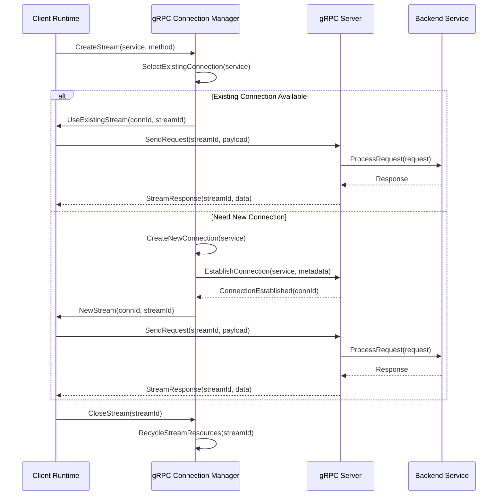

### 7.4 Connection Reuse Metrics

| متریک                           | منبع            | Alert Threshold |
| ------------------------------- | --------------- | --------------- |
| reuse_connection_hit_ratio      | HTTP Keep-Alive | < ۰.۸           |
| reuse_stream_multiplexing_ratio | gRPC            | < ۰.۵           |
| reuse_session_hit_ratio         | Session         | < ۰.۶           |
| reuse_connection_count          | All             | > max\*۰.۹      |
| reuse_connection_creation_rate  | All             | > ۱۰/s          |
| reuse_stale_connection_ratio    | All             | > ۰.۰۵          |

---

## 8. Query Optimization

### 8.1 Query Optimization Architecture

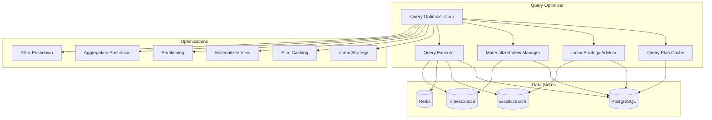

### 8.2 Index Strategy

| جدول اصلی       | نوع Index | ستون‌ها                                   | استراتژی                 |
| --------------- | --------- | ----------------------------------------- | ------------------------ |
| execution_tasks | B-Tree    | (tenant_id, status, priority, created_at) | Multi-Column Covering    |
| execution_tasks | Partial   | (created_at) WHERE status = 'pending'     | Partial for Active Tasks |
| cache_entries   | Hash      | (cache_key)                               | Exact Match Lookup       |
| cache_entries   | B-Tree    | (ttl_expires_at)                          | TTL-Based Eviction Scan  |
| session_store   | Hash      | (session_id, tenant_id)                   | Point Lookup             |
| event_log       | BRIN      | (occurred_at)                             | Time-Series Range        |
| event_log       | B-Tree    | (event_type, occurred_at)                 | Type + Time Filter       |
| metrics_store   | BRIN      | (collected_at)                            | Time-Series              |
| metrics_store   | B-Tree    | (metric_name, collected_at)               | Metric + Time            |

### 8.3 Query Plan Cache Configuration

```json
{
  "query_plan_cache": {
    "enabled": true,
    "max_entries": 1024,
    "eviction_policy": "lfu",
    "default_ttl_ms": 3600000,
    "capture_plan_on_first_execution": true,
    "invalidate_on_schema_change": true,
    "plan_hints_respected": true,
    "paramaterized_queries_only": true,
    "monitor_plan_changes": true,
    "plan_regression_detection": {
      "enabled": true,
      "estimated_vs_actual_threshold": 2.0,
      "auto_invalidate_on_regression": true
    }
  }
}
```

### 8.4 Query Optimization Patterns

| الگو                       | توضیح                                              | Runtime        |
| -------------------------- | -------------------------------------------------- | -------------- |
| **Covering Index Scan**    | پوشش تمام ستون‌های مورد نیاز Query در Index        | KR, SR         |
| **Predicate Pushdown**     | انتقال فیلتر به لایه ذخیره‌ساز قبل از JOIN         | CR, KR         |
| **Projection Pushdown**    | فقط ستون‌های مورد نیاز انتخاب شوند                 | تمام Runtimeها |
| **Aggregation Pushdown**   | Aggregation در دیتابیس انجام شود نه در Application | AR, KR         |
| **Batch Fetch**            | واکشی دسته‌ای رکوردها به جای تکی                   | WR, AR         |
| **Pagination with Cursor** | صفحه‌بندی مبتنی بر Cursor به جای OFFSET            | SR, KR         |
| **Materialized Path**      | مسیرهای پراستعلام به صورت پیش‌محاسبه               | CR, SR         |
| **Lazy Loading**           | بارگذاری داده‌های حجیم فقط در صورت نیاز            | PR, CR         |

### 8.5 Query Metrics

| متریک                       | منبع             | Alert Threshold |
| --------------------------- | ---------------- | --------------- |
| query_plan_cache_hit_ratio  | Query Plan Cache | < ۰.۶           |
| query_execution_time_ms_p50 | Database         | > ۱۰۰ms         |
| query_execution_time_ms_p99 | Database         | > ۱۰۰۰ms        |
| query_seq_scan_ratio        | Database         | > ۰.۱           |
| query_index_scan_ratio      | Database         | < ۰.۷           |
| query_lock_wait_ms_p99      | Database         | > ۵۰۰ms         |
| query_deadlock_rate         | Database         | > ۰.۰۱%         |
| query_temp_file_ratio       | Database         | > ۰.۰۵          |

---

## 9. Token Optimization

### 9.1 Token Budget Architecture

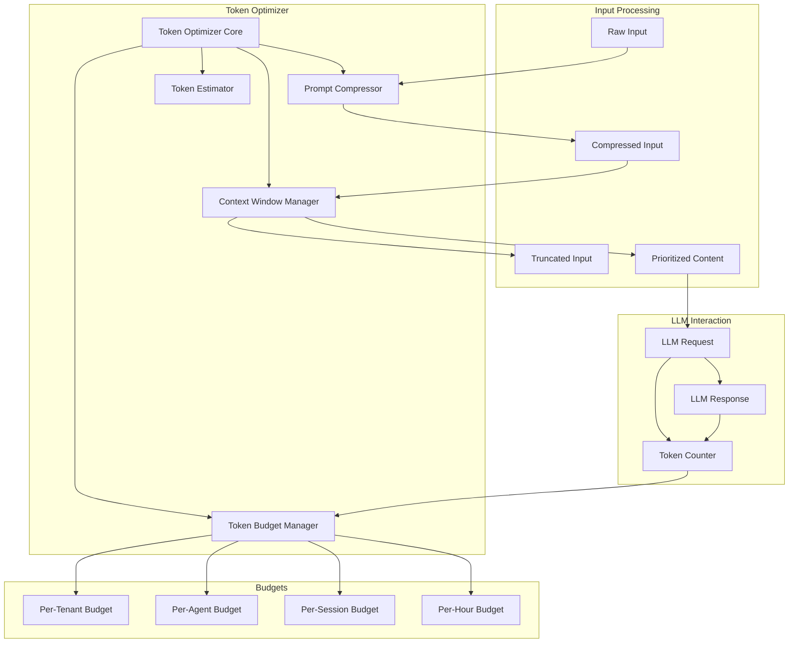

### 9.2 Prompt Compression Strategies

| استراتژی                        | توضیح                                          | Compression Ratio | Loss        |
| ------------------------------- | ---------------------------------------------- | ----------------- | ----------- |
| Comp-01 — Redundancy Removal    | حذف فضاهای خالی، تکرار، توضیحات اضافی          | ۱.۲x-۱.۵x         | None        |
| Comp-02 — Semantic Compression  | جایگزینی جملات طولانی با خلاصه معنادار         | ۲x-۴x             | Low         |
| Comp-03 — Structured Truncation | حذف بخش‌های کم‌اهمیت بر اساس Priority Tag      | ۱.۵x-۳x           | Medium      |
| Comp-04 — Context Summarization | خلاصه‌سازی تاریخچه مکالمه                      | ۳x-۱۰x            | Medium-High |
| Comp-05 — KV-Cache Reuse        | استفاده مجدد از KV Cache برای Promptهای تکراری | N/A               | None        |
| Comp-06 — Selective Context     | نگه‌داری فقط Context مرتبط با درخواست جاری     | ۲x-۵x             | Low-Medium  |

### 9.3 Context Window Management

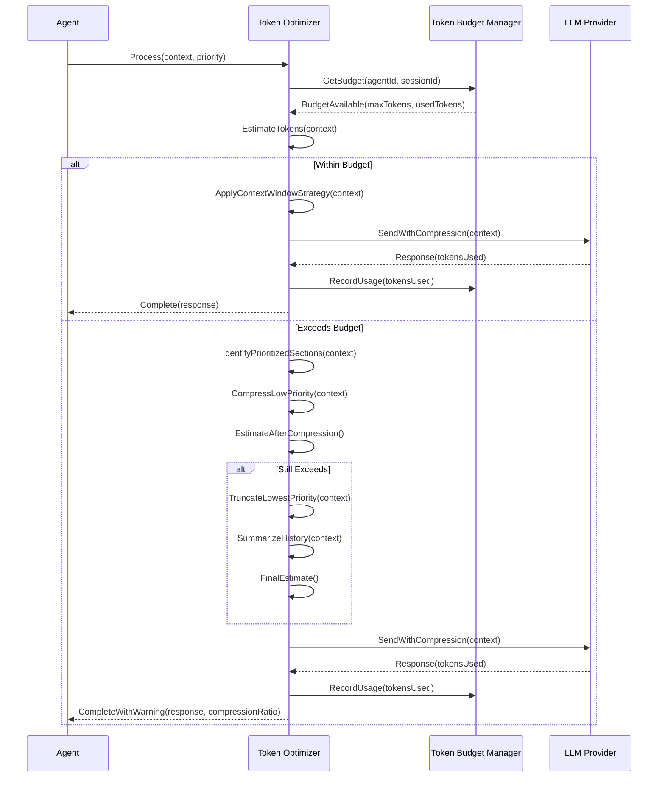

### 9.4 Token Budget Configuration

```json
{
  "token_optimizer": {
    "budgets": {
      "per_request": {
        "max_input_tokens": 128000,
        "max_output_tokens": 4096,
        "default_input_tokens": 32000
      },
      "per_session": {
        "max_input_tokens": 512000,
        "max_output_tokens": 32000,
        "reset_interval_ms": 3600000
      },
      "per_agent": {
        "max_tokens_per_hour": 1000000,
        "max_tokens_per_day": 10000000,
        "agents": {
          "ai-001": { "max_tokens_per_hour": 500000 },
          "ai-002": { "max_tokens_per_hour": 500000 },
          "ai-003": { "max_tokens_per_hour": 2000000 },
          "ai-004": { "max_tokens_per_hour": 500000 },
          "ai-011": { "max_tokens_per_hour": 500000 },
          "ai-014": { "max_tokens_per_hour": 1000000 }
        }
      },
      "per_tenant": {
        "max_tokens_per_hour": 5000000,
        "max_tokens_per_day": 50000000,
        "burst_capacity": 1000000
      }
    },
    "compression": {
      "enabled": true,
      "min_compression_ratio": 1.5,
      "max_compression_ratio": 10.0,
      "strategy_order": ["comp-01", "comp-02", "comp-04", "comp-06"],
      "summarization": {
        "enabled": true,
        "max_history_tokens": 64000,
        "summary_interval_messages": 10
      }
    },
    "context_window": {
      "model_limits": {
        "gpt-4o": { "context_window": 128000, "max_output": 4096 },
        "gpt-4-turbo": { "context_window": 128000, "max_output": 4096 },
        "claude-3-opus": { "context_window": 200000, "max_output": 4096 },
        "claude-3-sonnet": { "context_window": 200000, "max_output": 4096 }
      },
      "reserved_tokens_for_response": 2048,
      "safety_margin_tokens": 1024,
      "overlap_tokens": 256
    },
    "kv_cache": {
      "enabled": true,
      "max_cache_entries": 256,
      "cache_ttl_ms": 300000,
      "min_prompt_length_for_caching": 500
    }
  }
}
```

### 9.5 Token Metrics

| متریک                            | منبع              | Alert Threshold |
| -------------------------------- | ----------------- | --------------- |
| token_input_per_minute           | Token Optimizer   | > budget \* ۰.۸ |
| token_output_per_minute          | Token Optimizer   | > budget \* ۰.۸ |
| token_compression_ratio          | Prompt Compressor | < ۱.۲           |
| token_budget_exhaustion_count    | Budget Manager    | > ۱۰/min        |
| token_context_window_utilization | Context Manager   | > ۰.۹           |
| token_kv_cache_hit_ratio         | KV Cache          | < ۰.۳           |
| token_estimation_error_percent   | Token Estimator   | > ۱۰%           |
| token_cost_per_request           | Cost Model        | > threshold     |

---

## 10. Cost-Based Scheduling

### 10.1 Cost Model Architecture

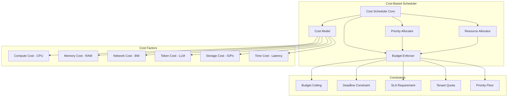

### 10.2 Cost Calculation

```python
# SMOS-716 Cost Model (Conceptual)
def calculate_execution_cost(task):
    compute_cost = task.estimated_cpu_seconds * CPU_COST_PER_SECOND
    memory_cost = task.estimated_memory_mb * MEMORY_COST_PER_MB_SECOND * task.estimated_duration_seconds
    network_cost = task.estimated_data_transfer_mb * NETWORK_COST_PER_MB
    token_cost = task.estimated_input_tokens * TOKEN_INPUT_COST + task.estimated_output_tokens * TOKEN_OUTPUT_COST
    storage_cost = task.storage_operations * STORAGE_COST_PER_IOP

    total_cost = compute_cost + memory_cost + network_cost + token_cost + storage_cost

    return {
        "total_cost": total_cost,
        "breakdown": {
            "compute": compute_cost,
            "memory": memory_cost,
            "network": network_cost,
            "token": token_cost,
            "storage": storage_cost
        },
        "risk_score": calculate_risk_score(task, total_cost)
    }

def calculate_risk_score(task, cost):
    budget_utilization = cost / task.budget_ceiling
    deadline_pressure = (task.deadline - now()) / task.deadline
    if budget_utilization > 0.8 or deadline_pressure < 0.2:
        return "HIGH"
    elif budget_utilization > 0.5 or deadline_pressure < 0.5:
        return "MEDIUM"
    else:
        return "LOW"
```

### 10.3 Budget Enforcement

```json
{
  "cost_based_scheduler": {
    "enabled": true,
    "cost_model": {
      "cpu_cost_per_second": 0.00001,
      "memory_cost_per_mb_second": 0.000001,
      "network_cost_per_mb": 0.0001,
      "token_input_cost": 0.00001,
      "token_output_cost": 0.00003,
      "storage_cost_per_iop": 0.000001,
      "currency": "USD"
    },
    "budget_policies": {
      "tenant_budgets": {
        "tenant-01": {
          "daily_budget": 10.0,
          "hourly_budget": 1.5,
          "burst_budget": 3.0,
          "priority_floor": 3
        },
        "tenant-02": {
          "daily_budget": 5.0,
          "hourly_budget": 0.75,
          "burst_budget": 1.5,
          "priority_floor": 4
        }
      },
      "agent_budgets": {
        "ai-001": { "daily_budget": 2.0 },
        "ai-002": { "daily_budget": 2.0 },
        "ai-003": { "daily_budget": 8.0 },
        "ai-004": { "daily_budget": 3.0 },
        "ai-011": { "daily_budget": 5.0 },
        "ai-014": { "daily_budget": 5.0 }
      }
    },
    "enforcement": {
      "mode": "soft_limit",
      "overspend_tolerance_percent": 10,
      "notify_on_approaching_limit": true,
      "notify_threshold_percent": 80,
      "auto_escalate_to_approver": true,
      "escalation_after_minutes": 5
    },
    "scheduling_strategy": {
      "default": "cost_aware",
      "fallback": "priority_based",
      "parameters": {
        "cost_aware": {
          "cost_weight": 0.4,
          "priority_weight": 0.3,
          "deadline_weight": 0.2,
          "fairness_weight": 0.1
        },
        "priority_based": {
          "priority_levels": 8
        }
      }
    }
  }
}
```

### 10.4 Cost-Based Decision Flow

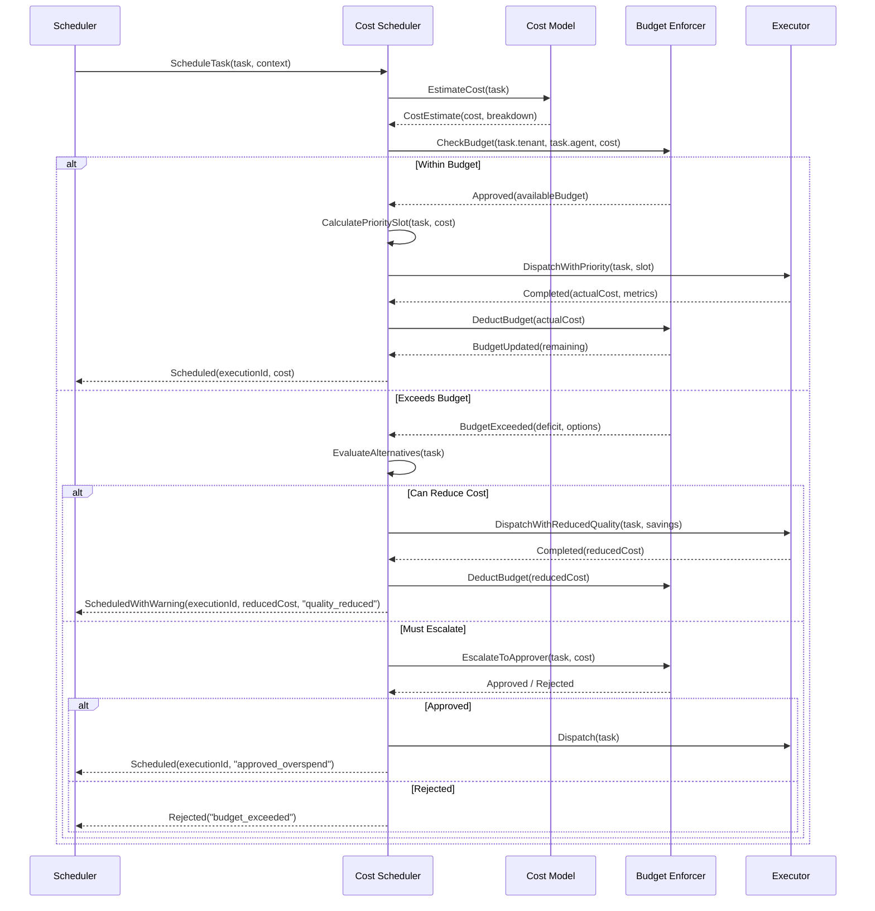

### 10.5 Cost Metrics

| متریک                         | منبع            | Alert Threshold       |
| ----------------------------- | --------------- | --------------------- |
| cost_per_execution_avg        | Cost Model      | > budget \* ۰.۷       |
| cost_per_tenant_daily         | Budget Enforcer | > daily_budget \* ۰.۹ |
| cost_overspend_count          | Budget Enforcer | > ۵/day               |
| cost_estimation_error_percent | Cost Model      | > ۲۰%                 |
| cost_scheduling_overhead_ms   | Cost Scheduler  | > ۵۰ms                |
| cost_rejected_tasks_count     | Budget Enforcer | > ۱۰/day              |
| cost_budget_utilization_avg   | Budget Enforcer | > ۰.۸                 |

---

## 11. Memory Optimization

### 11.1 Memory Optimization Strategies

| استراتژی                     | توضیح                                              | Runtime        | تأثیر  |
| ---------------------------- | -------------------------------------------------- | -------------- | ------ |
| MEM-01 — GC Tuning           | تنظیم Garbage Collector برای توان بالا یا تأخیر کم | تمام Runtimeها | High   |
| MEM-02 — Heap Sizing         | تعیین اندازه بهینه Heap بر اساس الگوی مصرف         | تمام Runtimeها | High   |
| MEM-03 — Object Pooling      | استفاده مجدد از اشیاء پرهزینه به جای تخصیص مجدد    | WR, AR, PR     | Medium |
| MEM-04 — Off-Heap Storage    | ذخیره داده‌های حجیم خارج از Heap (Direct Memory)   | KR, CR, MR     | High   |
| MEM-05 — Buffer Recycling    | چرخه بازاستفاده Bufferهای شبکه و I/O               | تمام Runtimeها | Medium |
| MEM-06 — String Interning    | به اشتراک‌گذاری رشته‌های تکراری                    | AR, PR         | Low    |
| MEM-07 — Lazy Loading        | بارگذاری تأخیری داده‌های حجیم                      | CR, SR, KR     | Medium |
| MEM-08 — Memory-Mapped Files | نگاشت فایل به حافظه برای دسترسی سریع               | MR, KR         | Medium |
| MEM-09 — Compressed Pointers | استفاده از اشاره‌گرهای فشرده در Heap < ۳۲GB        | تمام Runtimeها | Low    |
| MEM-10 — Arena Allocator     | تخصیص‌دهنده منطقه‌ای برای کاهش Fragmentation       | KR, CR         | Medium |

### 11.2 Heap Configuration

```json
{
  "memory_optimization": {
    "garbage_collector": {
      "enabled": true,
      "collector_type": "G1GC",
      "java_options": {
        "min_heap_mb": 1024,
        "max_heap_mb": 8192,
        "new_ratio": 2,
        "survivor_ratio": 6,
        "max_gc_pause_ms": 50,
        "target_gc_utilization": 0.8,
        "parallel_gc_threads": 4,
        "conc_gc_threads": 2,
        "initiating_heap_occupancy_percent": 45,
        "g1_heap_region_size_mb": 4,
        "g1_reserve_percent": 10,
        "g1_new_size_percent": 5,
        "g1_max_new_size_percent": 60
      }
    },
    "heap_policies": {
      "per_runtime": {
        "wr": { "min_heap_mb": 512, "max_heap_mb": 2048, "gc_pause_target_ms": 30 },
        "pr": { "min_heap_mb": 1024, "max_heap_mb": 4096, "gc_pause_target_ms": 20 },
        "ar": { "min_heap_mb": 2048, "max_heap_mb": 8192, "gc_pause_target_ms": 50 },
        "kr": { "min_heap_mb": 4096, "max_heap_mb": 16384, "gc_pause_target_ms": 100 },
        "cr": { "min_heap_mb": 1024, "max_heap_mb": 4096, "gc_pause_target_ms": 50 },
        "mr": { "min_heap_mb": 4096, "max_heap_mb": 16384, "gc_pause_target_ms": 100 },
        "sr": { "min_heap_mb": 1024, "max_heap_mb": 4096, "gc_pause_target_ms": 30 },
        "or": { "min_heap_mb": 2048, "max_heap_mb": 4096, "gc_pause_target_ms": 20 }
      }
    },
    "object_pooling": {
      "enabled": true,
      "pools": {
        "execution_context": { "max_pool_size": 1024, "pre_allocate": 128 },
        "workflow_step": { "max_pool_size": 2048, "pre_allocate": 256 },
        "event_envelope": { "max_pool_size": 4096, "pre_allocate": 512 },
        "query_result_row": { "max_pool_size": 8192, "pre_allocate": 1024 },
        "token_batch": { "max_pool_size": 512, "pre_allocate": 64 }
      }
    },
    "off_heap": {
      "enabled": true,
      "max_direct_memory_mb": 4096,
      "buffer_pools": {
        "network_io": { "chunk_size": 65536, "max_chunks": 1024 },
        "file_io": { "chunk_size": 1048576, "max_chunks": 256 },
        "serialization": { "chunk_size": 16384, "max_chunks": 2048 }
      }
    }
  }
}
```

### 11.3 Memory Pressure Detection

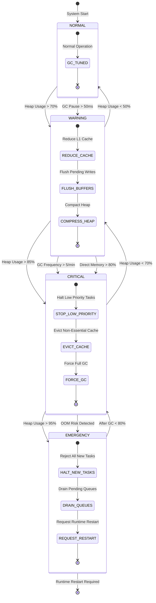

### 11.4 Memory Metrics

| متریک                           | منبع        | Alert Threshold |
| ------------------------------- | ----------- | --------------- |
| memory_heap_used_percent        | Runtime     | > ۸۰%           |
| memory_heap_committed_percent   | Runtime     | > ۹۰%           |
| memory_gc_pause_ms_p99          | GC          | > ۱۰۰ms         |
| memory_gc_frequency_per_minute  | GC          | > ۱۰            |
| memory_direct_used_mb           | Off-Heap    | > max \* ۰.۸    |
| memory_object_pool_hit_ratio    | Object Pool | < ۰.۵           |
| memory_fragmentation_ratio      | Heap        | > ۰.۳           |
| memory_oom_protection_triggered | Runtime     | > ۰             |

---

## 12. Concurrency Optimization

### 12.1 Thread Model Architecture

```mermaid
graph TB
    subgraph "Concurrency Optimizer"
        CO_CORE[Concurrency Optimizer Core]
        TM[Thread Model Manager]
        AM[Async Processor]
        LFM[Lock-Free Structure Manager]
        WM[Work Stealing Manager]
    end

    subgraph "Thread Models"
        TM_VIRT[Virtual Threads / Coroutines]
        TM_PLATFORM[Platform Threads]
        TM_IO[IO Threads - epoll / IOCP]
        TM_TIMER[Timer / Scheduled Threads]
    end

    subgraph "Async Patterns"
        AP_CB[Callback-Based]
        AP_FUT[Future / Promise]
        AP_REACTOR[Reactor Pattern]
        AP_ACTOR[Actor Model]
    end

    subgraph "Lock-Free Structures"
        LF_QUEUE[Lock-Free Queue]
        LF_STACK[Lock-Free Stack]
        LF_MAP[Concurrent HashMap]
        LF_COUNTER[Atomic Counter]
    end

    subgraph "Work Stealing"
        WS_DEQUE[Work-Stealing Deque]
        WS_SHARD[Work Sharding]
        WS_BALANCE[Dynamic Load Balancing]
    end

    CO_CORE --> TM
    CO_CORE --> AM
    CO_CORE --> LFM
    CO_CORE --> WM

    TM --> TM_VIRT
    TM --> TM_PLATFORM
    TM --> TM_IO
    TM --> TM_TIMER

    AM --> AP_CB
    AM --> AP_FUT
    AM --> AP_REACTOR
    AM --> AP_ACTOR

    LFM --> LF_QUEUE
    LFM --> LF_STACK
    LFM --> LF_MAP
    LFM --> LF_COUNTER

    WM --> WS_DEQUE
    WM --> WS_SHARD
    WM --> WS_BALANCE
```

### 12.2 Concurrency Configuration

```json
{
  "concurrency_optimization": {
    "thread_model": {
      "virtual_threads": {
        "enabled": true,
        "max_virtual_threads": 10000,
        "scheduling_mode": "work_stealing"
      },
      "platform_threads": {
        "core_threads": 16,
        "max_threads": 128,
        "stack_size_kb": 1024
      },
      "io_threads": {
        "event_loop_count": 4,
        "io_threads_per_loop": 2,
        "selector_timeout_ms": 500
      },
      "timer_threads": {
        "scheduled_thread_count": 2,
        "tick_interval_ms": 100,
        "max_scheduled_tasks": 10000
      }
    },
    "async_processing": {
      "default_timeout_ms": 30000,
      "max_concurrent_futures": 5000,
      "future_pool_size": 256,
      "callback_timeout_ms": 5000,
      "reactor_backlog": 4096,
      "actor_mailbox_size": 1024
    },
    "lock_free_structures": {
      "queues": {
        "task_queue": { "type": "mpsc", "capacity": 65536 },
        "event_queue": { "type": "spmc", "capacity": 32768 },
        "result_queue": { "type": "spsc", "capacity": 16384 }
      },
      "maps": {
        "cache_map": { "initial_capacity": 1024, "concurrency_level": 16 },
        "session_map": { "initial_capacity": 512, "concurrency_level": 8 },
        "registry_map": { "initial_capacity": 256, "concurrency_level": 4 }
      },
      "counters": {
        "metrics_counters": { "striped": true, "stripe_count": 16 },
        "budget_counters": { "striped": true, "stripe_count": 8 }
      }
    },
    "work_stealing": {
      "enabled": true,
      "deque_capacity": 256,
      "steal_policy": "bottom",
      "max_steal_attempts": 3,
      "enable_yield_before_steal": true
    }
  }
}
```

### 12.3 Async Processing Flow

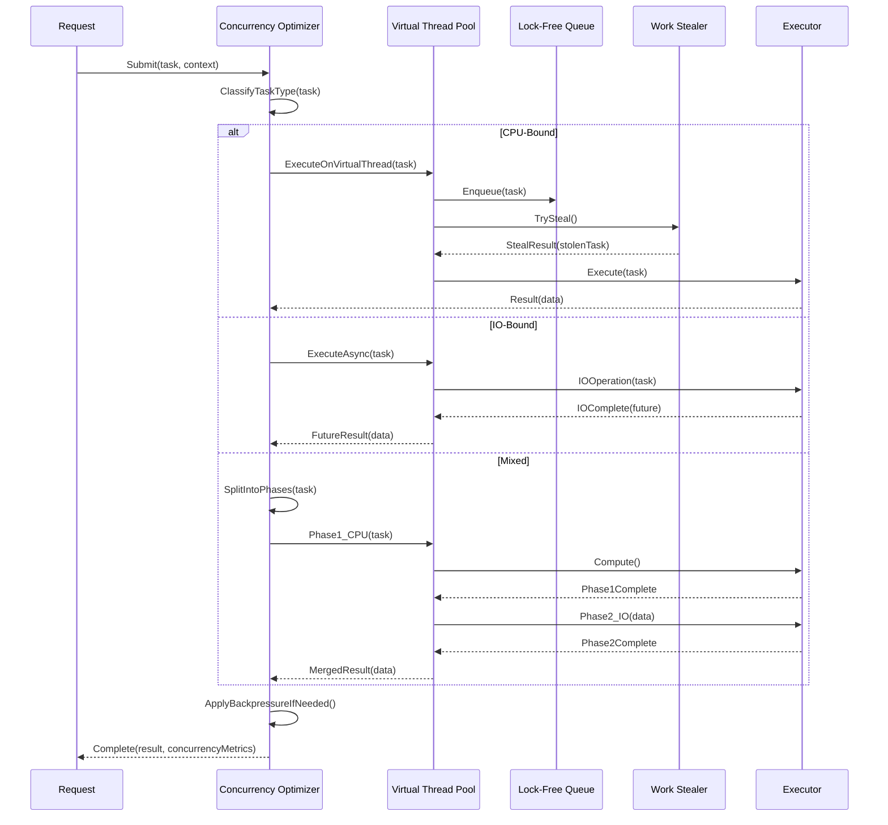

### 12.4 Concurrency Metrics

| متریک                            | منبع                 | Alert Threshold   |
| -------------------------------- | -------------------- | ----------------- |
| concurrency_thread_count         | Thread Model         | > max \* ۰.۹      |
| concurrency_virtual_thread_count | Virtual Threads      | > max \* ۰.۹      |
| concurrency_queue_depth          | Lock-Free Queue      | > capacity \* ۰.۸ |
| concurrency_steal_rate           | Work Stealer         | < ۰.۰۱            |
| concurrency_contention_rate      | Lock-Free Structures | > ۰.۱             |
| concurrency_context_switch_rate  | OS                   | > ۱۰۰۰۰/s         |
| concurrency_blocking_call_ratio  | Thread Model         | > ۰.۰۵            |
| concurrency_future_timeout_rate  | Async                | > ۱%              |

---

## 13. Optimization State Machine

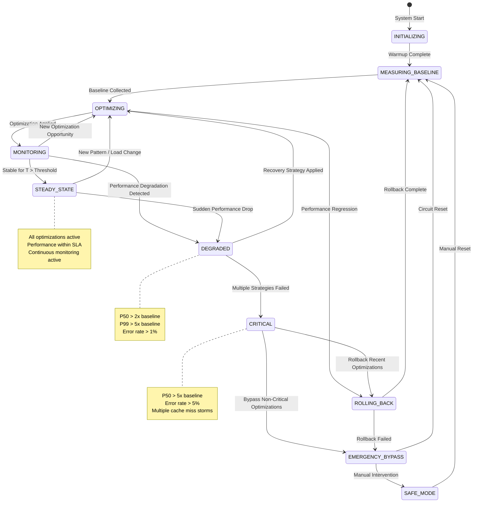

### 13.1 State Transitions

| از                 | به                 | شرط                        | اقدام                  |
| ------------------ | ------------------ | -------------------------- | ---------------------- |
| INITIALIZING       | MEASURING_BASELINE | Warmup کامل شد             | شروع جمع‌آوری Baseline |
| MEASURING_BASELINE | OPTIMIZING         | Baseline = ۱۰۰۰ نمونه      | اعمال اولین بهینه‌سازی |
| OPTIMIZING         | MONITORING         | بهینه‌سازی اعمال شد        | شروع مانیتورینگ        |
| OPTIMIZING         | ROLLING_BACK       | Regression شناسایی شد      | بازگشت به حالت قبل     |
| MONITORING         | OPTIMIZING         | فرصت جدید بهینه‌سازی       | اعمال بهینه‌سازی بعدی  |
| MONITORING         | DEGRADED           | Degradation شناسایی شد     | فعال‌سازی Recovery     |
| MONITORING         | STEADY_STATE       | پایدار > ۳۰ دقیقه          | تثبیت تنظیمات          |
| STEADY_STATE       | OPTIMIZING         | الگوی جدید / بار تغییر کرد | تحلیل مجدد             |
| STEADY_STATE       | DEGRADED           | افت ناگهانی عملکرد         | Recovery               |
| DEGRADED           | OPTIMIZING         | Recovery موفق              | اعمال تنظیمات جدید     |
| DEGRADED           | CRITICAL           | = ۳ Recovery شکست خورد     | بحران اعلام شد         |
| CRITICAL           | EMERGENCY_BYPASS   | بحران غیرقابل کنترل        | Bypass                 |
| CRITICAL           | ROLLING_BACK       | Rollback هنوز ممکن است     | Rollback               |
| ROLLING_BACK       | MEASURING_BASELINE | Rollback کامل شد           | Baseline جدید          |
| EMERGENCY_BYPASS   | MEASURING_BASELINE | Circuit Reset شد           | شروع مجدد              |
| EMERGENCY_BYPASS   | SAFE_MODE          | مداخله دستی                | Safe Mode              |
| SAFE_MODE          | MEASURING_BASELINE | Reset دستی                 | Baseline جدید          |

---

## 14. Optimization Workflow

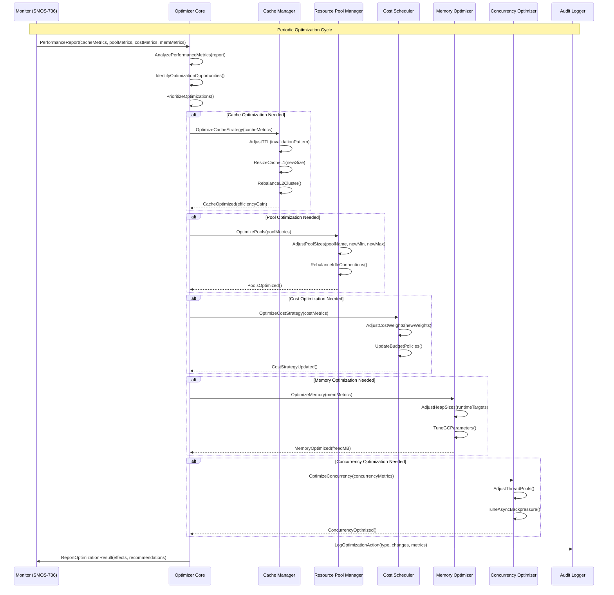

---

## 15. Failure Scenarios

### 15.1 Scenario: Cache Miss Storm

| بخش                       | توضیح                                                                        |
| ------------------------- | ---------------------------------------------------------------------------- |
| **وضعیت**                 | Cache Miss Storm                                                             |
| **علت**                   | TTL انبوه همزمان، Cache Eviction ناگهانی، Cluster Failover                   |
| **تأثیر**                 | بار ۱۰x-۵۰x روی Backend، افزایش Latency تا ۱۰x، Degradation عمومی            |
| **تشخیص**                 | Cache Miss Rate > ۵۰%, Backend Latency > ۵x                                  |
| **Recovery — Immediate**  | فعال‌سازی Circuit Breaker روی L2, کاهش نرخ درخواست به Backend                |
| **Recovery — Short-term** | افزایش TTL موقت, فعال‌سازی Stale-While-Revalidate                            |
| **Recovery — Long-term**  | Jitter به TTLها اضافه شود, Pre-warm Cache, افزایش Capacity                   |
| **جبران**                 | Stale-While-Revalidate پاسخ موقت با داده قدیمی می‌دهد تا Cache دوباره پر شود |

### 15.2 Scenario: Pool Exhaustion

| بخش                       | توضیح                                                               |
| ------------------------- | ------------------------------------------------------------------- |
| **وضعیت**                 | Pool Exhaustion                                                     |
| **علت**                   | افزایش ناگهانی ترافیک, Connection Leak, Thread Starvation           |
| **تأثیر**                 | درخواست‌های جدید رد می‌شوند (Connection Refused / Timeout)          |
| **تشخیص**                 | Pool Active = Max, Queue Depth > ۱۰۰, Acquire Timeout Rate > ۵%     |
| **Recovery — Immediate**  | افزایش Pool Size با Growth Strategy, فعال‌سازی Elastic Pool         |
| **Recovery — Short-term** | کاهش Timeout, تخلیه Idle Connections, بازکردن Blocked Threads       |
| **Recovery — Long-term**  | بررسی Leak, تنظیم Pool Size بر اساس Load Pattern, Circuit Breaker   |
| **جبران**                 | Retry با Backoff به ترافیک مبدأ, Reduce Quality برای کاهش مصرف Pool |

### 15.3 Scenario: Memory Pressure

| بخش                       | توضیح                                                              |
| ------------------------- | ------------------------------------------------------------------ |
| **وضعیت**                 | Memory Pressure                                                    |
| **علت**                   | Heap رشد ناگهانی, GC ناکارآمد, Off-Heap Leak, Object Pool تخلیه    |
| **تأثیر**                 | GC Pause طولانی, Latency Spikes, OOM Risk                          |
| **تشخیص**                 | Heap Usage > ۸۵%, GC Frequency > ۵/min, GC Pause > ۱۰۰ms           |
| **Recovery — Immediate**  | کاهش سطح L1 Cache, Flush Buffers, تخلیه Object Pool غیرفعال        |
| **Recovery — Short-term** | فعال‌سازی Full GC فشرده, جابجایی اشیاء به Soft References          |
| **Recovery — Long-term**  | افزایش Heap Size, تنظیم GC Parameters, اضافه کردن Off-Heap Storage |
| **جبران**                 | Degrade به حالت سبک‌تر, Suspending غیرضروری‌ها, سپس تدریجی بازیابی |

### 15.4 Scenario: Token Budget Exhaustion

| بخش                       | توضیح                                                                    |
| ------------------------- | ------------------------------------------------------------------------ |
| **وضعیت**                 | Token Budget Exhaustion                                                  |
| **علت**                   | مصرف بیش از حد LLM, تخمین نادرست, افزایش ناگهانی درخواست                 |
| **تأثیر**                 | درخواست‌های LLM جدید رد می‌شوند, Agentها ناقص پاسخ می‌دهند               |
| **تشخیص**                 | Token Budget Util > ۱۰۰%, Rejection Count > ۱۰/min                       |
| **Recovery — Immediate**  | فعال‌سازی Compression Level بالاتر, کاهش Context Window                  |
| **Recovery — Short-term** | اولویت‌بندی Agentهای مهم, تعلیق Agentهای کم‌اولویت                       |
| **Recovery — Long-term**  | افزایش Budget, بهینه‌سازی Prompt, کاهش Redundancy                        |
| **جبران**                 | Degrade Response Quality, Cache پاسخ‌های تکراری, استفاده از مدل ارزان‌تر |

### 15.5 Scenario: Query Performance Regression

| بخش                       | توضیح                                                                        |
| ------------------------- | ---------------------------------------------------------------------------- |
| **وضعیت**                 | Query Performance Regression                                                 |
| **علت**                   | Query Plan تغییر کرده, Index حذف شده, حجم داده افزایش یافته, Statistics کهنه |
| **تأثیر**                 | Query Latency افزایش ۱۰x-۱۰۰x, Lock Contention, Temp File زیاد               |
| **تشخیص**                 | Query Latency P99 > ۲x, Seq Scan > ۵x, Lock Wait > ۱s                        |
| **Recovery — Immediate**  | اعمال Query Hint, فعال‌سازی Plan از Query Plan Cache                         |
| **Recovery — Short-term** | به‌روزرسانی Statistics, ایجاد / ترمیم Index                                  |
| **Recovery — Long-term**  | Query Rewrite, Materialized View, Partitioning                               |
| **جبران**                 | Degrade Query با Simplification موقت, سپس Optimize دائمی                     |

### 15.6 Scenario: Concurrency Contention

| بخش                       | توضیح                                                                                |
| ------------------------- | ------------------------------------------------------------------------------------ |
| **وضعیت**                 | Concurrency Contention                                                               |
| **علت**                   | Thread Starvation, Deadlock, Livelock, Lock Contention بالا, Work Stealing ناکارآمد  |
| **تأثیر**                 | Throughput کاهش, Latency افزایش, CPU Idle % پایین                                    |
| **تشخیص**                 | Thread Dump نشان‌دهنده Blocked Threads > ۲۰%, Context Switch > ۵۰K/s, CPU Wait > ۳۰% |
| **Recovery — Immediate**  | افزایش Thread Pool, کاهش Lock Granularity, فعال‌سازی Read-Write Lock                 |
| **Recovery — Short-term** | توزیع مجدد Work, کشف و گشودن Deadlock, افزایش Steal Attempts                         |
| **Recovery — Long-term**  | Lock-Free Structures, Actor Model, Sharding                                          |
| **جبران**                 | Degrade به حالت Sequential برای بخش بحرانی, سپس Parallel بازیابی                     |

---

## 16. Optimization Monitoring

### 16.1 Monitoring Architecture

```mermaid
graph TB
    subgraph "Optimization Monitor"
        OM_CORE[Optimization Monitor Core]
        MC[Metrics Collector]
        AA[Anomaly Analyzer]
        AG[Alert Generator]
        RD[Recommendation Engine]
        DB[(Metrics Store)]
    end

    subgraph "Data Sources"
        CM[Cache Manager Metrics]
        RPM[Resource Pool Metrics]
        CRM[Connection Reuse Metrics]
        QOM[Query Optimizer Metrics]
        TOM[Token Optimizer Metrics]
        CBS[Cost Scheduler Metrics]
        MOM[Memory Optimizer Metrics]
        COM[Concurrency Optimizer Metrics]
    end

    subgraph "Alert Channels"
        ALERT_SMS[SMS / PagerDuty]
        ALERT_EMAIL[Email]
        ALERT_SLACK[Slack / Teams]
        ALERT_WEBHOOK[Webhook]
    end

    subgraph "Dashboards"
        DASH_PERF[Performance Dashboard]
        DASH_CACHE[Cache Dashboard]
        DASH_COST[Cost Dashboard]
        DASH_MEM[Memory Dashboard]
    end

    OM_CORE --> MC
    OM_CORE --> AA
    OM_CORE --> AG
    OM_CORE --> RD

    MC --> CM
    MC --> RPM
    MC --> CRM
    MC --> QOM
    MC --> TOM
    MC --> CBS
    MC --> MOM
    MC --> COM

    MC --> DB
    AA --> DB
    RD --> DB

    AA --> AG
    AG --> ALERT_SMS
    AG --> ALERT_EMAIL
    AG --> ALERT_SLACK
    AG --> ALERT_WEBHOOK

    DB --> DASH_PERF
    DB --> DASH_CACHE
    DB --> DASH_COST
    DB --> DASH_MEM
```

### 16.2 KPI Definitions

| KPI                            | فرمول                                             | هدف     | SLI                      |
| ------------------------------ | ------------------------------------------------- | ------- | ------------------------ |
| **Cache Hit Ratio**            | hits / (hits + misses)                            | > ۰.۸۵  | Overall Cache Efficiency |
| **Cache Latency P99**          | P99 of cache get latency                          | < ۵ms   | Cache Speed              |
| **Pool Utilization**           | active / max                                      | ۰.۴-۰.۷ | Resource Efficiency      |
| **Pool Idle Ratio**            | idle / max                                        | > ۰.۱   | Resource Waste           |
| **Connection Reuse Ratio**     | reused / total                                    | > ۰.۹   | Connection Efficiency    |
| **Query Plan Cache Hit**       | plan_hits / plan_total                            | > ۰.۷   | Query Optimization       |
| **Token Compression Ratio**    | original / compressed                             | > ۲.۰   | Token Efficiency         |
| **Cost Estimation Error**      | \|actual - estimated\| / actual                   | < ۰.۱۵  | Cost Accuracy            |
| **GC Pause P99**               | P99 GC pause                                      | < ۵۰ms  | Memory Health            |
| **Contention Rate**            | retries / total_ops                               | < ۰.۰۱  | Concurrency Health       |
| **Optimization Effectiveness** | (latency_before - latency_after) / latency_before | > ۰.۱   | Impact                   |
| **Degradation Events**         | Count of degradation events                       | ۰/day   | Stability                |

### 16.3 Alert Rules

```json
{
  "optimization_alerts": {
    "critical": [
      {
        "name": "cache_miss_storm",
        "condition": "cache_miss_rate > 0.5 AND backend_latency_p99 > 5000",
        "duration_ms": 10000,
        "severity": "CRITICAL",
        "channels": ["pagerduty", "sms"]
      },
      {
        "name": "pool_exhaustion",
        "condition": "pool_waiting_acquires > 100",
        "duration_ms": 5000,
        "severity": "CRITICAL",
        "channels": ["pagerduty", "sms"]
      },
      {
        "name": "memory_pressure",
        "condition": "memory_heap_used_percent > 90",
        "duration_ms": 30000,
        "severity": "CRITICAL",
        "channels": ["pagerduty"]
      },
      {
        "name": "token_budget_exhausted",
        "condition": "token_budget_exhaustion_count > 50",
        "duration_ms": 60000,
        "severity": "CRITICAL",
        "channels": ["pagerduty", "slack"]
      }
    ],
    "warning": [
      {
        "name": "cache_efficiency_drop",
        "condition": "cache_hit_ratio_l1 < 0.4",
        "duration_ms": 120000,
        "severity": "WARNING",
        "channels": ["slack", "email"]
      },
      {
        "name": "pool_high_utilization",
        "condition": "pool_active_percent > 80",
        "duration_ms": 60000,
        "severity": "WARNING",
        "channels": ["slack"]
      },
      {
        "name": "cost_estimation_drift",
        "condition": "cost_estimation_error_percent > 20",
        "duration_ms": 300000,
        "severity": "WARNING",
        "channels": ["email"]
      },
      {
        "name": "gc_frequency_high",
        "condition": "memory_gc_frequency_per_minute > 10",
        "duration_ms": 60000,
        "severity": "WARNING",
        "channels": ["slack"]
      }
    ],
    "info": [
      {
        "name": "optimization_applied",
        "condition": "optimization_event == 'applied'",
        "duration_ms": 0,
        "severity": "INFO",
        "channels": ["log"]
      },
      {
        "name": "optimization_rolled_back",
        "condition": "optimization_event == 'rolled_back'",
        "duration_ms": 0,
        "severity": "INFO",
        "channels": ["log", "slack"]
      }
    ]
  }
}
```

---

## 17. Optimization Security

### 17.1 Security Principles

| اصل                             | توضیح                                                              |
| ------------------------------- | ------------------------------------------------------------------ |
| OPS-01 — Least Privilege        | هر مؤلفه بهینه‌سازی فقط به منابع مجاز دسترسی دارد                  |
| OPS-02 — Tenant Isolation       | Cache, Pool, Budget داده‌های Tenantها را کاملاً ایزوله نگه می‌دارد |
| OPS-03 — Audit Trail            | تمام تغییرات پیکربندی بهینه‌سازی ثبت و ممیزی می‌شوند               |
| OPS-04 — No Credential in Cache | کش هرگز حاوی Credential, Token یا Secret نیست                      |
| OPS-05 — Encryption at Rest     | داده‌های حساس در L2/L3 Cache رمزنگاری شوند                         |
| OPS-06 — Encryption in Transit  | تمام ارتباطات بین مؤلفه‌های بهینه‌سازی TLS ۱.۳                     |
| OPS-07 — Rate Limit Safe        | عملیات بهینه‌سازی نباید Rate Limiter را دور بزند                   |
| OPS-08 — Input Validation       | تمام ورودی‌های API بهینه‌سازی اعتبارسنجی شوند                      |

### 17.2 Access Control

```json
{
  "optimization_security": {
    "access_control": {
      "roles": {
        "optimization_admin": {
          "permissions": ["read", "write", "configure", "override", "bypass"]
        },
        "optimization_operator": {
          "permissions": ["read", "write", "configure"]
        },
        "optimization_viewer": {
          "permissions": ["read"]
        },
        "system": {
          "permissions": ["read", "write"]
        }
      },
      "resources": {
        "cache_config": {
          "roles": ["optimization_admin", "optimization_operator"]
        },
        "pool_config": {
          "roles": ["optimization_admin", "optimization_operator"]
        },
        "budget_config": {
          "roles": ["optimization_admin"]
        },
        "cost_model": {
          "roles": ["optimization_admin"]
        },
        "alerts": {
          "roles": ["optimization_admin", "optimization_operator", "optimization_viewer"]
        }
      }
    },
    "cache_encryption": {
      "l1_cache": { "encryption": false },
      "l2_cache": {
        "encryption": true,
        "algorithm": "AES-256-GCM",
        "key_rotation_days": 30,
        "key_provider": "vault"
      },
      "l3_cache": {
        "encryption": true,
        "algorithm": "AES-256-CBC",
        "key_rotation_days": 90
      }
    },
    "audit": {
      "enabled": true,
      "events": [
        "cache_config_change",
        "pool_config_change",
        "budget_change",
        "cost_model_change",
        "bypass_activation",
        "safe_mode_activation",
        "optimization_rollback"
      ],
      "retention_days": 90,
      "immutable": true
    }
  }
}
```

---

## 18. Scaling & Multi-Tenancy

### 18.1 Scaling Strategy

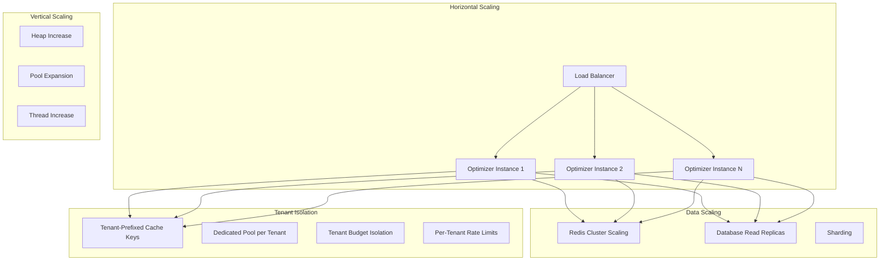

### 18.2 Multi-Tenancy Configuration

```json
{
  "multi_tenancy": {
    "enabled": true,
    "isolation_mode": "shared_pool",
    "tenant_configs": {
      "tenant-01": {
        "cache": { "key_prefix": "t01:", "l1_max_size_mb": 64, "l2_priority": "high" },
        "pools": { "connection_pool_max": 16, "thread_pool_quota": 8, "memory_pool_max_mb": 512 },
        "budget": { "daily_usd": 10.0, "hourly_usd": 1.5 },
        "rate_limits": {
          "optimization_api_calls_per_min": 60,
          "cache_invalidation_calls_per_min": 30
        }
      },
      "tenant-02": {
        "cache": { "key_prefix": "t02:", "l1_max_size_mb": 32, "l2_priority": "normal" },
        "pools": { "connection_pool_max": 8, "thread_pool_quota": 4, "memory_pool_max_mb": 256 },
        "budget": { "daily_usd": 5.0, "hourly_usd": 0.75 },
        "rate_limits": {
          "optimization_api_calls_per_min": 30,
          "cache_invalidation_calls_per_min": 15
        }
      }
    },
    "defaults": {
      "cache_key_prefix": "default:",
      "l1_max_size_mb": 32,
      "connection_pool_max": 4,
      "thread_pool_quota": 2,
      "daily_budget_usd": 2.0
    },
    "isolation_policies": {
      "allow_shared_l2_cache": true,
      "allow_shared_l3_cache": true,
      "allow_cross_tenant_cache_hit": false,
      "enforce_cache_key_prefix": true
    }
  }
}
```

### 18.3 Scaling Metrics

| متریک                          | توضیح                            | Target |
| ------------------------------ | -------------------------------- | ------ |
| scaling_optimizer_replicas     | تعداد replicas فعال              | ۳-۱۲   |
| scaling_cache_cluster_nodes    | تعداد گره‌های Redis              | ۳-۱۲   |
| scaling_db_read_replicas       | تعداد Read Replica               | ۱-۶    |
| scaling_tenants_per_instance   | تعداد Tenant به ازای هر Instance | < ۱۰۰  |
| scaling_instance_utilization   | CPU/Memory Utilization           | < ۷۰%  |
| scaling_tenant_isolation_score | نمره ایزوله‌سازی                 | > ۰.۹۵ |

---

## 19. API Contracts

### 19.1 REST API

```json
{
  "openapi": "3.0.3",
  "info": {
    "title": "SMOS Runtime Optimizer API",
    "version": "1.0.0",
    "description": "Runtime Optimization Management"
  },
  "paths": {
    "/api/v1/optimization/cache": {
      "get": {
        "summary": "Get cache configuration",
        "responses": { "200": { "description": "Cache config" } }
      },
      "put": {
        "summary": "Update cache configuration",
        "responses": { "200": { "description": "Updated" } }
      }
    },
    "/api/v1/optimization/cache/invalidate": {
      "post": {
        "summary": "Invalidate cache entries",
        "responses": { "200": { "description": "Invalidation initiated" } }
      }
    },
    "/api/v1/optimization/pools": {
      "get": {
        "summary": "Get pool configuration and status",
        "responses": { "200": { "description": "Pool status" } }
      },
      "put": {
        "summary": "Update pool configuration",
        "responses": { "200": { "description": "Updated" } }
      }
    },
    "/api/v1/optimization/budget": {
      "get": {
        "summary": "Get budget configuration",
        "responses": { "200": { "description": "Budget config" } }
      },
      "put": {
        "summary": "Update budget configuration",
        "responses": { "200": { "description": "Updated" } }
      }
    },
    "/api/v1/optimization/metrics": {
      "get": {
        "summary": "Get optimization metrics",
        "responses": { "200": { "description": "Metrics data" } }
      }
    },
    "/api/v1/optimization/strategies": {
      "get": {
        "summary": "List active optimization strategies",
        "responses": { "200": { "description": "Strategies list" } }
      },
      "post": {
        "summary": "Apply optimization strategy",
        "responses": { "200": { "description": "Strategy applied" } }
      }
    },
    "/api/v1/optimization/state": {
      "get": {
        "summary": "Get optimizer state machine status",
        "responses": { "200": { "description": "Current state" } }
      }
    },
    "/api/v1/optimization/bypass": {
      "post": {
        "summary": "Activate emergency bypass",
        "responses": { "200": { "description": "Bypass activated" } }
      }
    }
  }
}
```

### 19.2 Event Contracts (SMOS-705 Compatible)

```json
{
  "events": {
    "optimization.cache.miss_storm_detected": {
      "version": "1.0.0",
      "payload_schema": {
        "type": "object",
        "required": ["event_id", "tenant_id", "cache_layer", "miss_rate", "duration_ms"],
        "properties": {
          "event_id": { "type": "string", "format": "uuid" },
          "tenant_id": { "type": "string" },
          "cache_layer": { "type": "string", "enum": ["l1", "l2", "l3"] },
          "miss_rate": { "type": "number", "minimum": 0, "maximum": 1 },
          "duration_ms": { "type": "integer", "minimum": 0 },
          "triggered_recovery": { "type": "boolean" }
        }
      }
    },
    "optimization.pool.exhaustion_detected": {
      "version": "1.0.0",
      "payload_schema": {
        "type": "object",
        "required": ["event_id", "tenant_id", "pool_type", "active_count", "max_size"],
        "properties": {
          "event_id": { "type": "string", "format": "uuid" },
          "tenant_id": { "type": "string" },
          "pool_type": { "type": "string", "enum": ["connection", "thread", "memory"] },
          "active_count": { "type": "integer" },
          "max_size": { "type": "integer" },
          "queue_depth": { "type": "integer" }
        }
      }
    },
    "optimization.strategy.applied": {
      "version": "1.0.0",
      "payload_schema": {
        "type": "object",
        "required": ["event_id", "strategy_type", "changes"],
        "properties": {
          "event_id": { "type": "string", "format": "uuid" },
          "strategy_type": { "type": "string" },
          "changes": { "type": "object" },
          "applied_by": { "type": "string" },
          "effectiveness_pct": { "type": "number" }
        }
      }
    },
    "optimization.state.transition": {
      "version": "1.0.0",
      "payload_schema": {
        "type": "object",
        "required": ["event_id", "from_state", "to_state", "reason"],
        "properties": {
          "event_id": { "type": "string", "format": "uuid" },
          "from_state": { "type": "string" },
          "to_state": { "type": "string" },
          "reason": { "type": "string" }
        }
      }
    }
  }
}
```

### 19.3 gRPC Service

```protobuf
syntax = "proto3";

package smos.optimization.v1;

service RuntimeOptimizer {
    rpc GetCacheConfig(GetCacheConfigRequest) returns (CacheConfig);
    rpc UpdateCacheConfig(UpdateCacheConfigRequest) returns (CacheConfig);
    rpc InvalidateCache(InvalidateCacheRequest) returns (InvalidateCacheResponse);
    rpc GetCacheMetrics(GetCacheMetricsRequest) returns (CacheMetrics);

    rpc GetPoolConfig(GetPoolConfigRequest) returns (PoolConfig);
    rpc UpdatePoolConfig(UpdatePoolConfigRequest) returns (PoolConfig);
    rpc GetPoolMetrics(GetPoolMetricsRequest) returns (PoolMetrics);

    rpc GetBudgetConfig(GetBudgetConfigRequest) returns (BudgetConfig);
    rpc UpdateBudgetConfig(UpdateBudgetConfigRequest) returns (BudgetConfig);

    rpc GetActiveStrategies(GetActiveStrategiesRequest) returns (StrategyList);
    rpc ApplyStrategy(ApplyStrategyRequest) returns (StrategyResult);
    rpc RollbackStrategy(RollbackStrategyRequest) returns (StrategyResult);

    rpc GetOptimizerState(GetOptimizerStateRequest) returns (OptimizerState);
    rpc ActivateEmergencyBypass(ActivateBypassRequest) returns (BypassResult);

    rpc GetOptimizationMetrics(GetOptimizationMetricsRequest) returns (OptimizationMetrics);
    rpc StreamOptimizationMetrics(GetOptimizationMetricsRequest) returns (stream MetricSnapshot);
}

message CacheConfig {
    bool l1_enabled = 1;
    int32 l1_max_size_mb = 2;
    int32 l1_default_ttl_ms = 3;
    bool l2_enabled = 4;
    string l2_backend = 5;
    repeated string l2_cluster_nodes = 6;
    int32 l2_default_ttl_ms = 7;
    bool l3_enabled = 8;
    bool compression_enabled = 9;
}

message PoolConfig {
    int32 connection_pool_min = 1;
    int32 connection_pool_max = 2;
    int32 connection_acquire_timeout_ms = 3;
    int32 thread_pool_core = 4;
    int32 thread_pool_max = 5;
    int32 thread_pool_queue_capacity = 6;
    int32 memory_pool_max_mb = 7;
}

message BudgetConfig {
    double daily_budget_usd = 1;
    double hourly_budget_usd = 2;
    string enforcement_mode = 3;
    bool auto_escalate = 4;
}

message OptimizationMetrics {
    double cache_hit_ratio = 1;
    double pool_utilization = 2;
    double cost_per_execution = 3;
    double token_compression_ratio = 4;
    double gc_pause_p99_ms = 5;
}
```

---

## 20. JSON Schema Definitions

### 20.1 OptimizationConfig

```json
{
  "$schema": "http://json-schema.org/draft-07/schema#",
  "$id": "https://smos.xennic.ir/schemas/optimization/optimization-config-v1.json",
  "title": "OptimizationConfig",
  "description": "پیکربندی کامل بهینه‌ساز عملکرد زمان اجرا SMOS",
  "type": "object",
  "required": [
    "cache",
    "pools",
    "connection_reuse",
    "query_optimization",
    "token_optimization",
    "cost_scheduling",
    "memory",
    "concurrency",
    "monitoring",
    "security",
    "multi_tenancy"
  ],
  "properties": {
    "cache": { "$ref": "#/definitions/CacheConfig" },
    "pools": { "$ref": "#/definitions/PoolConfig" },
    "connection_reuse": { "$ref": "#/definitions/ConnectionReuseConfig" },
    "query_optimization": { "$ref": "#/definitions/QueryOptimizationConfig" },
    "token_optimization": { "$ref": "#/definitions/TokenOptimizationConfig" },
    "cost_scheduling": { "$ref": "#/definitions/CostSchedulingConfig" },
    "memory": { "$ref": "#/definitions/MemoryConfig" },
    "concurrency": { "$ref": "#/definitions/ConcurrencyConfig" },
    "monitoring": { "$ref": "#/definitions/OptimizationMonitoringConfig" },
    "security": { "$ref": "#/definitions/OptimizationSecurityConfig" },
    "multi_tenancy": { "$ref": "#/definitions/MultiTenancyConfig" }
  },
  "definitions": {
    "CacheConfig": {
      "type": "object",
      "required": ["l1_cache", "l2_cache", "l3_cache", "global_policies"],
      "properties": {
        "l1_cache": {
          "type": "object",
          "properties": {
            "enabled": { "type": "boolean" },
            "max_size_mb": { "type": "integer", "minimum": 16, "maximum": 1024 },
            "eviction_policy": { "type": "string", "enum": ["lru", "lfu", "ttl", "fifo"] },
            "default_ttl_ms": { "type": "integer", "minimum": 100, "maximum": 60000 }
          }
        },
        "l2_cache": {
          "type": "object",
          "properties": {
            "enabled": { "type": "boolean" },
            "backend": { "type": "string", "enum": ["redis_cluster", "memcached", "hazelcast"] },
            "cluster_nodes": { "type": "array", "items": { "type": "string" } },
            "replication_factor": { "type": "integer", "minimum": 1, "maximum": 5 },
            "default_ttl_ms": { "type": "integer", "minimum": 1000, "maximum": 86400000 }
          }
        },
        "l3_cache": {
          "type": "object",
          "properties": {
            "enabled": { "type": "boolean" },
            "backend": { "type": "string", "enum": ["postgres_materialized", "s3", "hdfs"] },
            "refresh_interval_ms": { "type": "integer", "minimum": 60000 }
          }
        },
        "global_policies": {
          "type": "object",
          "properties": {
            "staleness_tolerance_ms": { "type": "integer", "minimum": 0 },
            "compression_enabled": { "type": "boolean" },
            "compression_algorithm": {
              "type": "string",
              "enum": ["zstd", "lz4", "snappy", "gzip"]
            },
            "serialization_format": {
              "type": "string",
              "enum": ["msgpack", "protobuf", "json", "avro"]
            }
          }
        }
      }
    },
    "PoolConfig": {
      "type": "object",
      "required": ["connection_pools", "thread_pools", "memory_pools"],
      "properties": {
        "connection_pools": { "type": "object" },
        "thread_pools": { "type": "object" },
        "memory_pools": { "type": "object" }
      }
    },
    "ConnectionReuseConfig": { "type": "object" },
    "QueryOptimizationConfig": { "type": "object" },
    "TokenOptimizationConfig": { "type": "object" },
    "CostSchedulingConfig": { "type": "object" },
    "MemoryConfig": { "type": "object" },
    "ConcurrencyConfig": { "type": "object" },
    "OptimizationMonitoringConfig": { "type": "object" },
    "OptimizationSecurityConfig": { "type": "object" },
    "MultiTenancyConfig": { "type": "object" }
  }
}
```

### 20.2 CacheMetrics

```json
{
  "$schema": "http://json-schema.org/draft-07/schema#",
  "$id": "https://smos.xennic.ir/schemas/optimization/cache-metrics-v1.json",
  "title": "CacheMetrics",
  "type": "object",
  "required": [
    "timestamp",
    "cache_layer",
    "hit_count",
    "miss_count",
    "hit_ratio",
    "avg_latency_ms",
    "p99_latency_ms",
    "memory_usage_mb",
    "eviction_count",
    "invalidation_count"
  ],
  "properties": {
    "timestamp": { "type": "string", "format": "date-time" },
    "cache_layer": { "type": "string", "enum": ["l1", "l2", "l3"] },
    "tenant_id": { "type": "string" },
    "hit_count": { "type": "integer", "minimum": 0 },
    "miss_count": { "type": "integer", "minimum": 0 },
    "hit_ratio": { "type": "number", "minimum": 0, "maximum": 1 },
    "avg_latency_ms": { "type": "number", "minimum": 0 },
    "p99_latency_ms": { "type": "number", "minimum": 0 },
    "memory_usage_mb": { "type": "number", "minimum": 0 },
    "memory_limit_mb": { "type": "number", "minimum": 0 },
    "entry_count": { "type": "integer", "minimum": 0 },
    "eviction_count": { "type": "integer", "minimum": 0 },
    "invalidation_count": { "type": "integer", "minimum": 0 },
    "stale_hit_count": { "type": "integer", "minimum": 0 },
    "network_latency_ms_p99": { "type": "number", "minimum": 0 }
  }
}
```

### 20.3 PoolMetrics

```json
{
  "$schema": "http://json-schema.org/draft-07/schema#",
  "$id": "https://smos.xennic.ir/schemas/optimization/pool-metrics-v1.json",
  "title": "PoolMetrics",
  "type": "object",
  "required": [
    "timestamp",
    "pool_type",
    "pool_name",
    "active_count",
    "idle_count",
    "max_size",
    "min_size",
    "acquisition_timeout_count",
    "acquisition_avg_wait_ms"
  ],
  "properties": {
    "timestamp": { "type": "string", "format": "date-time" },
    "pool_type": { "type": "string", "enum": ["connection", "thread", "memory"] },
    "pool_name": { "type": "string" },
    "tenant_id": { "type": "string" },
    "active_count": { "type": "integer", "minimum": 0 },
    "idle_count": { "type": "integer", "minimum": 0 },
    "max_size": { "type": "integer", "minimum": 0 },
    "min_size": { "type": "integer", "minimum": 0 },
    "pending_count": { "type": "integer", "minimum": 0 },
    "queue_depth": { "type": "integer", "minimum": 0 },
    "acquisition_timeout_count": { "type": "integer", "minimum": 0 },
    "acquisition_timeout_rate": { "type": "number", "minimum": 0, "maximum": 1 },
    "acquisition_avg_wait_ms": { "type": "number", "minimum": 0 },
    "acquisition_p99_wait_ms": { "type": "number", "minimum": 0 },
    "utilization_percent": { "type": "number", "minimum": 0, "maximum": 100 },
    "rejection_count": { "type": "integer", "minimum": 0 },
    "created_count": { "type": "integer", "minimum": 0 },
    "destroyed_count": { "type": "integer", "minimum": 0 }
  }
}
```

### 20.4 TokenBudgetState

```json
{
  "$schema": "http://json-schema.org/draft-07/schema#",
  "$id": "https://smos.xennic.ir/schemas/optimization/token-budget-state-v1.json",
  "title": "TokenBudgetState",
  "type": "object",
  "required": ["entity_id", "entity_type", "usage", "limits", "reset_at"],
  "properties": {
    "entity_id": { "type": "string" },
    "entity_type": { "type": "string", "enum": ["tenant", "agent", "session", "request"] },
    "usage": {
      "type": "object",
      "required": ["input_tokens", "output_tokens", "total_tokens", "estimated_cost"],
      "properties": {
        "input_tokens": { "type": "integer", "minimum": 0 },
        "output_tokens": { "type": "integer", "minimum": 0 },
        "total_tokens": { "type": "integer", "minimum": 0 },
        "estimated_cost": { "type": "number", "minimum": 0 }
      }
    },
    "limits": {
      "type": "object",
      "required": ["max_tokens", "max_cost"],
      "properties": {
        "max_tokens": { "type": "integer", "minimum": 0 },
        "max_cost": { "type": "number", "minimum": 0 },
        "burst_limit": { "type": "integer", "minimum": 0 }
      }
    },
    "remaining": {
      "type": "object",
      "properties": {
        "tokens": { "type": "integer", "minimum": 0 },
        "cost": { "type": "number", "minimum": 0 }
      }
    },
    "utilization_percent": { "type": "number", "minimum": 0, "maximum": 100 },
    "reset_at": { "type": "string", "format": "date-time" },
    "is_exhausted": { "type": "boolean" },
    "last_request_at": { "type": "string", "format": "date-time" }
  }
}
```

### 20.5 OptimizationStateMachine

```json
{
  "$schema": "http://json-schema.org/draft-07/schema#",
  "$id": "https://smos.xennic.ir/schemas/optimization/state-machine-v1.json",
  "title": "OptimizationStateMachine",
  "type": "object",
  "required": ["current_state", "entered_at", "state_history", "optimizations_active", "metrics"],
  "properties": {
    "current_state": {
      "type": "string",
      "enum": [
        "INITIALIZING",
        "MEASURING_BASELINE",
        "OPTIMIZING",
        "MONITORING",
        "STEADY_STATE",
        "DEGRADED",
        "CRITICAL",
        "ROLLING_BACK",
        "EMERGENCY_BYPASS",
        "SAFE_MODE"
      ]
    },
    "entered_at": { "type": "string", "format": "date-time" },
    "last_transition_at": { "type": "string", "format": "date-time" },
    "state_history": {
      "type": "array",
      "items": {
        "type": "object",
        "required": ["from_state", "to_state", "transitioned_at", "reason"],
        "properties": {
          "from_state": { "type": "string" },
          "to_state": { "type": "string" },
          "transitioned_at": { "type": "string", "format": "date-time" },
          "reason": { "type": "string" }
        }
      }
    },
    "optimizations_active": {
      "type": "array",
      "items": {
        "type": "object",
        "required": ["type", "applied_at", "parameters"],
        "properties": {
          "type": {
            "type": "string",
            "enum": [
              "cache",
              "pool",
              "connection_reuse",
              "query",
              "token",
              "cost",
              "memory",
              "concurrency"
            ]
          },
          "applied_at": { "type": "string", "format": "date-time" },
          "parameters": { "type": "object" },
          "effectiveness_score": { "type": "number", "minimum": 0, "maximum": 1 }
        }
      }
    },
    "metrics": {
      "type": "object",
      "properties": {
        "time_in_current_state_ms": { "type": "integer" },
        "total_optimizations_applied": { "type": "integer" },
        "total_rollbacks": { "type": "integer" },
        "total_degradation_events": { "type": "integer" },
        "total_emergency_bypasses": { "type": "integer" },
        "current_performance_score": { "type": "number", "minimum": 0, "maximum": 100 }
      }
    }
  }
}
```

### 20.6 OptimizationRecommendation

```json
{
  "$schema": "http://json-schema.org/draft-07/schema#",
  "$id": "https://smos.xennic.ir/schemas/optimization/recommendation-v1.json",
  "title": "OptimizationRecommendation",
  "type": "object",
  "required": [
    "recommendation_id",
    "generated_at",
    "category",
    "priority",
    "title",
    "description",
    "expected_impact",
    "risk_level",
    "changes"
  ],
  "properties": {
    "recommendation_id": { "type": "string", "format": "uuid" },
    "generated_at": { "type": "string", "format": "date-time" },
    "expires_at": { "type": "string", "format": "date-time" },
    "category": {
      "type": "string",
      "enum": [
        "cache",
        "pool",
        "connection_reuse",
        "query",
        "token",
        "cost",
        "memory",
        "concurrency",
        "general"
      ]
    },
    "priority": { "type": "integer", "minimum": 1, "maximum": 10 },
    "title": { "type": "string", "maxLength": 200 },
    "description": { "type": "string" },
    "current_value": {},
    "recommended_value": {},
    "expected_impact": {
      "type": "object",
      "properties": {
        "latency_reduction_percent": { "type": "number" },
        "cost_savings_percent": { "type": "number" },
        "throughput_increase_percent": { "type": "number" },
        "memory_savings_mb": { "type": "number" }
      }
    },
    "risk_level": { "type": "string", "enum": ["low", "medium", "high", "critical"] },
    "automation_allowed": { "type": "boolean" },
    "changes": {
      "type": "array",
      "items": {
        "type": "object",
        "required": ["path", "operation", "value"],
        "properties": {
          "path": { "type": "string" },
          "operation": { "type": "string", "enum": ["set", "delete", "add", "remove"] },
          "value": {}
        }
      }
    },
    "related_metrics": { "type": "array", "items": { "type": "string" } }
  }
}
```

### 20.7 OptimizationEvent

```json
{
  "$schema": "http://json-schema.org/draft-07/schema#",
  "$id": "https://smos.xennic.ir/schemas/optimization/event-v1.json",
  "title": "OptimizationEvent",
  "type": "object",
  "required": ["event_id", "event_type", "occurred_at", "category", "severity", "details"],
  "properties": {
    "event_id": { "type": "string", "format": "uuid" },
    "event_type": {
      "type": "string",
      "enum": [
        "optimization_applied",
        "optimization_rolled_back",
        "cache_miss_storm",
        "pool_exhaustion",
        "memory_pressure",
        "token_budget_exhausted",
        "concurrency_contention",
        "cost_budget_exceeded",
        "state_transition",
        "bypass_activated",
        "safe_mode_activated",
        "optimization_error"
      ]
    },
    "occurred_at": { "type": "string", "format": "date-time" },
    "category": {
      "type": "string",
      "enum": ["cache", "pool", "connection", "query", "token", "cost", "memory", "concurrency"]
    },
    "severity": { "type": "string", "enum": ["info", "warning", "critical"] },
    "tenant_id": { "type": "string" },
    "initiator": { "type": "string" },
    "details": { "type": "object" },
    "context": {
      "type": "object",
      "properties": {
        "runtime": { "type": "string" },
        "workflow_id": { "type": "string" },
        "execution_id": { "type": "string" }
      }
    },
    "correlation_id": { "type": "string", "format": "uuid" }
  }
}
```

### 20.8 OptimizationReport

```json
{
  "$schema": "http://json-schema.org/draft-07/schema#",
  "$id": "https://smos.xennic.ir/schemas/optimization/report-v1.json",
  "title": "OptimizationReport",
  "type": "object",
  "required": ["report_id", "generated_at", "period_start", "period_end", "summary", "sections"],
  "properties": {
    "report_id": { "type": "string", "format": "uuid" },
    "generated_at": { "type": "string", "format": "date-time" },
    "period_start": { "type": "string", "format": "date-time" },
    "period_end": { "type": "string", "format": "date-time" },
    "summary": {
      "type": "object",
      "required": [
        "overall_performance_score",
        "improvements_applied",
        "degradation_events",
        "cost_savings",
        "recommendations_count"
      ],
      "properties": {
        "overall_performance_score": { "type": "integer", "minimum": 0, "maximum": 100 },
        "improvements_applied": { "type": "integer", "minimum": 0 },
        "degradation_events": { "type": "integer", "minimum": 0 },
        "cost_savings": { "type": "number", "minimum": 0 },
        "recommendations_count": { "type": "integer", "minimum": 0 }
      }
    },
    "sections": {
      "type": "object",
      "properties": {
        "cache_performance": { "type": "object" },
        "pool_performance": { "type": "object" },
        "query_performance": { "type": "object" },
        "token_performance": { "type": "object" },
        "cost_performance": { "type": "object" },
        "memory_performance": { "type": "object" },
        "concurrency_performance": { "type": "object" },
        "incidents": { "type": "array", "items": { "type": "object" } },
        "recommendations": { "type": "array", "items": { "type": "object" } }
      }
    },
    "metadata": {
      "type": "object",
      "properties": {
        "report_type": {
          "type": "string",
          "enum": ["hourly", "daily", "weekly", "monthly", "on_demand"]
        },
        "tenant_id": { "type": "string" },
        "runtime_scope": { "type": "array", "items": { "type": "string" } }
      }
    }
  }
}
```

---

## 21. Configuration Examples

### 21.1 Complete Optimizer Configuration (Production)

```yaml
# SMOS Runtime Optimizer Configuration
# Version: 1.0.0
# Environment: production
# Tenant: tenant-01

optimizer:
  enabled: true
  refresh_interval_ms: 5000
  auto_apply_threshold: 0.5

cache:
  l1_cache:
    enabled: true
    max_size_mb: 128
    eviction_policy: lru
    default_ttl_ms: 3000
  l2_cache:
    enabled: true
    backend: redis_cluster
    cluster_nodes:
      - redis-01:6379
      - redis-02:6379
      - redis-03:6379
    replication_factor: 2
    default_ttl_ms: 30000
  l3_cache:
    enabled: true
    backend: postgres_materialized
    refresh_interval_ms: 3600000
  global_policies:
    staleness_tolerance_ms: 5000
    compression_enabled: true
    compression_algorithm: zstd
    serialization_format: msgpack

pools:
  connection_pools:
    database:
      min_size: 8
      max_size: 64
      acquire_timeout_ms: 5000
      leak_detection_threshold_ms: 30000
    redis:
      min_size: 4
      max_size: 32
    http:
      min_size: 8
      max_size: 256
  thread_pools:
    worker:
      core_size: 16
      max_size: 64
      queue_capacity: 2048
      rejection_policy: caller_runs
    io:
      core_size: 8
      max_size: 128
      queue_capacity: 4096
  memory_pools:
    query_result:
      max_pool_size_mb: 512
    buffer:
      max_pool_size_mb: 256

connection_reuse:
  http_keepalive:
    enabled: true
    max_connections_per_route: 64
    keepalive_duration_ms: 60000
  grpc_stream:
    enabled: true
    max_streams_per_connection: 100
    keepalive_time_ms: 45000
  session_reuse:
    enabled: true
    max_sessions_per_tenant: 128

query_optimization:
  query_plan_cache:
    enabled: true
    max_entries: 1024
    eviction_policy: lfu
    default_ttl_ms: 3600000
  plan_regression_detection:
    enabled: true
    estimated_vs_actual_threshold: 2.0

token_optimization:
  budgets:
    per_request:
      max_input_tokens: 128000
      max_output_tokens: 4096
    per_tenant:
      max_tokens_per_day: 50000000
      burst_capacity: 1000000
  compression:
    enabled: true
    min_compression_ratio: 1.5
    strategy_order: [comp-01, comp-02, comp-04, comp-06]
  context_window:
    safety_margin_tokens: 1024

cost_scheduling:
  cost_model:
    cpu_cost_per_second: 0.00001
    token_input_cost: 0.00001
    token_output_cost: 0.00003
  budget_policies:
    tenant_budgets:
      tenant-01:
        daily_budget: 10.00
        hourly_budget: 1.50
  enforcement:
    mode: soft_limit
    overspend_tolerance_percent: 10

memory:
  garbage_collector:
    collector_type: G1GC
    max_gc_pause_ms: 50
  heap_policies:
    per_runtime:
      wr: { min_heap_mb: 512, max_heap_mb: 2048 }
      ar: { min_heap_mb: 2048, max_heap_mb: 8192 }
      kr: { min_heap_mb: 4096, max_heap_mb: 16384 }
      mr: { min_heap_mb: 4096, max_heap_mb: 16384 }
  off_heap:
    enabled: true
    max_direct_memory_mb: 4096

concurrency:
  thread_model:
    virtual_threads:
      enabled: true
      max_virtual_threads: 10000
  lock_free_structures:
    queues:
      task_queue:
        type: mpsc
        capacity: 65536
  work_stealing:
    enabled: true

monitoring:
  metrics_collection_interval_ms: 10000
  metrics_retention_days: 90
  metrics_exporters:
    - type: prometheus
      endpoint: /metrics
    - type: opentelemetry
      endpoint: otel-collector:4317

security:
  access_control:
    roles:
      optimization_admin:
        permissions: [read, write, configure, override, bypass]
  cache_encryption:
    l2_cache:
      encryption: true
      algorithm: AES-256-GCM
  audit:
    enabled: true
    retention_days: 90

multi_tenancy:
  enabled: true
  isolation_mode: shared_pool
  isolation_policies:
    allow_cross_tenant_cache_hit: false
    enforce_cache_key_prefix: true
```

### 21.2 Development Environment Configuration

```yaml
optimizer:
  enabled: true
  refresh_interval_ms: 30000
  auto_apply_threshold: 0.0 # Manual only in dev

cache:
  l1_cache:
    enabled: true
    max_size_mb: 32
    default_ttl_ms: 1000
  l2_cache:
    enabled: false # No distributed cache in dev
  l3_cache:
    enabled: false

pools:
  connection_pools:
    database:
      min_size: 2
      max_size: 8
  thread_pools:
    worker:
      core_size: 4
      max_size: 8
  memory_pools:
    query_result:
      max_pool_size_mb: 64

cost_scheduling:
  enforcement:
    mode: audit_only

memory:
  garbage_collector:
    collector_type: G1GC
    max_gc_pause_ms: 100

monitoring:
  metrics_collection_interval_ms: 60000
  metrics_retention_days: 7
```

---

## 22. Cross-Reference Matrix

### 22.1 SMOS Document Cross-References

| سند                               | شناسه      | ارتباط با SMOS-716                                                   |
| --------------------------------- | ---------- | -------------------------------------------------------------------- |
| Enterprise Execution Architecture | SMOS-701   | تعریف ۸ Runtime — Optimizer تمام Runtimeها را پوشش می‌دهد            |
| Execution State Machine           | SMOS-702   | حالت‌های اجرا — Optimizer State Machine مکمل است                     |
| Execution Context Model           | SMOS-703   | Context — Token Optimizer از Context برای Compression استفاده می‌کند |
| Workflow Orchestration            | SMOS-704   | Orchestration — Pool Manager منابع Orchestration را مدیریت می‌کند    |
| Enterprise Event Architecture     | SMOS-705   | رویدادها — Optimizer رویدادهای بهینه‌سازی منتشر می‌کند               |
| Execution Monitoring              | SMOS-706   | Monitoring — Optimizer Metrics Collector از SMOS-706 تغذیه می‌کند    |
| Runtime Security                  | SMOS-707   | Security — Optimizer Security از SMOS-707 پیروی می‌کند               |
| Master Runtime Blueprint          | SMOS-708   | یکپارچه‌سازی — Optimizer در Blueprint گنجانده شده است                |
| Runtime Scheduler                 | SMOS-709   | Scheduler — Cost-Based Scheduler مکمل SMOS-709 است                   |
| Workflow Runtime Engine           | SMOS-710   | Engine — Optimizer عملکرد Engine را بهینه می‌کند                     |
| Execution Persistence             | SMOS-711   | Persistence — Query Optimizer با Persistence کار می‌کند              |
| Distributed Execution             | SMOS-712   | Distributed — Connection Reuse در Distributed کاربرد دارد            |
| Checkpoint & Recovery             | SMOS-713   | Recovery — Optimizer از Checkpoint برای Recovery استفاده می‌کند      |
| Saga & Compensation               | SMOS-714   | Saga — Optimizer می‌تواند جبران کند (Pool Exhaustion)                |
| Circuit Breaker & Rate Limiter    | SMOS-715   | Protection — Optimizer با Circuit Breaker تعامل دارد                 |
| Agent Architecture                | AI-000     | Agent — هر Agent از Optimizer استفاده می‌کند                         |
| Knowledge Architecture            | KNW-000    | Knowledge — Cache Manager از Knowledge استفاده می‌کند                |
| AI Knowledge Foundation           | KNW-501    | AI Knowledge — Token Optimization به AI دانش وابسته است              |
| Automation Architecture           | AUT-000    | Automation — Cost Scheduler با Automation تعامل دارد                 |
| Prompt Architecture               | PRM-000    | Prompt — Token Optimizer با Prompt Engine کار می‌کند                 |
| Deployment Strategy               | DEPLOY-001 | Deploy — Scaling & Multi-Tenancy با DEPLOY هماهنگ است                |

### 22.2 Runtime Optimization Mapping

| Runtime                   | بهینه‌سازی‌های اصلی            | Cache Type            | Pool Type            |
| ------------------------- | ------------------------------ | --------------------- | -------------------- |
| Workflow Runtime (WR)     | Connection Pool, Query Cache   | Query Result, Session | Database, Thread     |
| Prompt Runtime (PR)       | Token Budget, Prompt Cache     | Token, API Response   | Thread, Object       |
| Agent Runtime (AR)        | Token Budget, Session Reuse    | Session, Token        | Thread, Object       |
| Knowledge Runtime (KR)    | Query Cache, Index Strategy    | Query Result, Plan    | Database, Connection |
| Content Runtime (CR)      | Content Cache, Memory Pool     | Content Blob          | Memory, Buffer       |
| Media Runtime (MR)        | Media Cache, Off-Heap          | Content Blob          | Memory, Buffer       |
| Search Runtime (SR)       | Query Cache, Cursor Pagination | Query Result, Plan    | Database, Connection |
| Orchestrator Runtime (OR) | Session Reuse, Token Budget    | Session, API Response | Thread, Connection   |

---

## 23. Version History

| نسخه        | تاریخ      | تغییرات                                                                                  | توسط        |
| ----------- | ---------- | ---------------------------------------------------------------------------------------- | ----------- |
| 1.0.0-draft | 2026-07-01 | نگارش اولیه — ۳۱ بخش، ۸ Schema، ۱۰ Mermaid Diagram، ۶ سناریوی خطا، ۷ استراتژی بهینه‌سازی | معمار سیستم |

### 23.1 Planned Versions

| نسخه        | تاریخ پیش‌بینی | تغییرات برنامه‌ریزی‌شده                                          |
| ----------- | -------------- | ---------------------------------------------------------------- |
| 1.1.0-draft | P7.S03         | اضافه شدن GPU Memory Pool, Tensor Cache                          |
| 2.0.0-draft | P7.S04         | بازبینی کامل بر اساس پیاده‌سازی, اضافه شدن ML-based Optimization |
| 2.1.0       | P7.S05         | تثبیت, اضافه شدن Benchmark Suite                                 |

---

## 24. Gaps & Future Work

### 24.1 Identified Gaps

| Gap                         | اولویت | توضیح                                                                                 | راهکار پیشنهادی                                  |
| --------------------------- | ------ | ------------------------------------------------------------------------------------- | ------------------------------------------------ |
| **GPU Memory Pooling**      | P1     | SMOS ممکن است از GPU برای Inference استفاده کند — Pooling GPU Memory پشتیبانی نمی‌شود | اضافه کردن GPU Memory Pool در نسخه ۱.۱           |
| **Tensor Cache**            | P2     | Embedding Tensor / Model Activation Cache در معماری جاری پشتیبانی نمی‌شود             | اضافه کردن Tensor Cache لایه L2.5                |
| **ML-Based Optimization**   | P2     | بهینه‌سازی‌ها مبتنی بر Rule هستند — ML می‌تواند Patternهای پیچیده‌تر را تشخیص دهد     | اضافه کردن Anomaly Detection ML Model            |
| **Auto-Tuning**             | P2     | پارامترهای بهینه‌سازی دستی تنظیم می‌شوند — Auto-Tuning می‌تواند بهینه کند             | اضافه کردن Bayesian Optimization for Pool Sizing |
| **Cross-Region Cache**      | P3     | L2 Cache در یک Region است — Cross-Region Replication پشتیبانی نمی‌شود                 | اضافه کردن Global Cache Tier                     |
| **Adaptive TTL**            | P3     | TTL استاتیک — Adaptive TTL بر اساس Access Pattern می‌تواند بهینه‌تر باشد              | پیاده‌سازی ML-based TTL Prediction               |
| **Energy-Aware Scheduling** | P3     | Cost Model بر هزینه مالی تمرکز دارد — مصرف انرژی در نظر گرفته نشده                    | اضافه کردن Energy Cost Factor                    |
| **Benchmark Suite**         | P3     | Benchmark خودکار برای Validation بهینه‌سازی وجود ندارد                                | ایجاد Optimization Benchmark Framework           |

### 24.2 Future Work

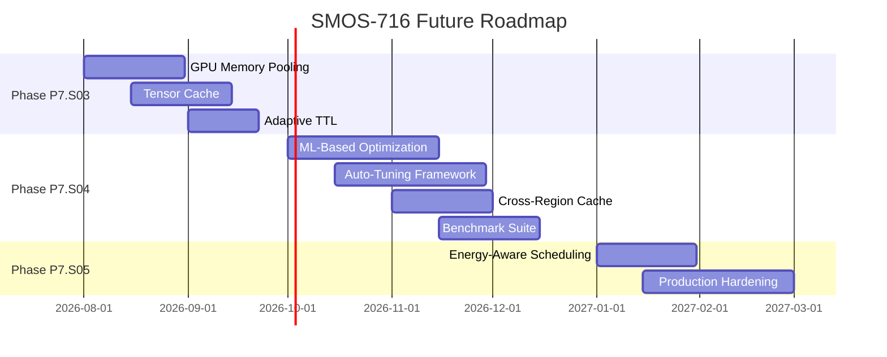

### 24.3 Optimization Maturity Model

| سطح                      | توضیح                                                 | وضعیت SMOS-716                      |
| ------------------------ | ----------------------------------------------------- | ----------------------------------- |
| **Level 0 — Manual**     | بهینه‌سازی کاملاً دستی — بدون اتوماسیون               | —                                   |
| **Level 1 — Reactive**   | بهینه‌سازی در پاسخ به Alert / Incident                | ✅ Cache Manager, Pool Manager      |
| **Level 2 — Scheduled**  | بهینه‌سازی دوره‌ای بر اساس Schedule                   | ✅ Optimization Workflow (Periodic) |
| **Level 3 — Proactive**  | بهینه‌سازی پیش‌دستانه بر اساس Trend Analysis          | ✅ Cost Scheduler, Token Optimizer  |
| **Level 4 — Adaptive**   | بهینه‌سازی تطبیقی بر اساس ML / Reinforcement Learning | 🚧 Gap (ML-Based Optimization)      |
| **Level 5 — Autonomous** | بهینه‌سازی خودمختار بدون دخالت انسان                  | 🚧 Gap (Auto-Tuning)                |

---

> **پایان SMOS-716 — معماری بهینه‌سازی عملکرد زمان اجرا**
>
> این سند توسط تیم معماری SMOS در تاریخ ۲۰۲۶-۰۷-۰۱ تهیه شده است.
> تمام حقوق مادی و معنوی متعلق به شرکت **Xennic (زر نور نیرو یکتا)** می‌باشد.
