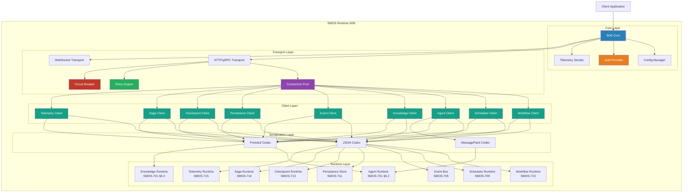
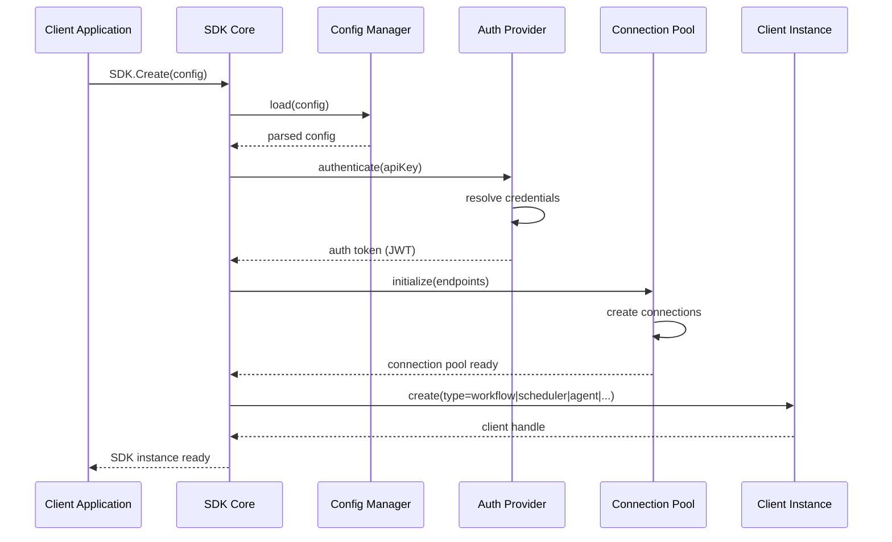
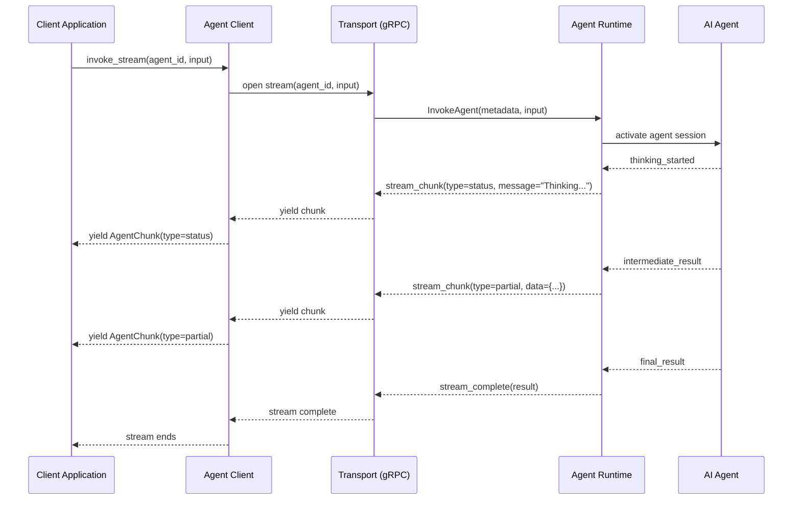
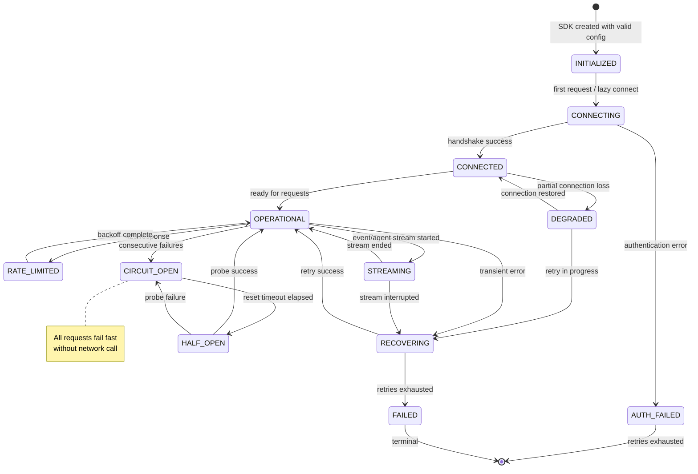

# SMOS-717 — Runtime Software Development Kit (SDK) / کیت توسعه نرم‌افزار زمان اجرا

> **شناسه:** SMOS-717
> **وضعیت:** پیش‌نویس
> **نسخه:** 1.0.0-draft
> **فاز:** P7.S02 — Runtime Quality & Resilience
> **خانواده:** EXEC
> **دامنه:** EXD-17 — Runtime SDK
> **نوع:** Software Development Kit Architecture
> **تاریخ:** 2026-07-01
> **مسئول:** معمار اجرای سیستم
> **SSOT:** ✅ بله — تک منبع حقیقت کیت توسعه نرم‌افزار زمان اجرا
> **اختیار:** A-4 (Enterprise)
> **زبان روایت:** فارسی
> **زبان شناسه‌ها:** انگلیسی
> **وابستگی:** SMOS-701, SMOS-702, SMOS-703, SMOS-704, SMOS-705, SMOS-706, SMOS-707, SMOS-708, SMOS-709, SMOS-710, SMOS-711, SMOS-712, SMOS-713, SMOS-714, SMOS-715, SMOS-716, AI-000, KNW-000, AUT-000, PRM-000, DEPLOY-001
> **مخاطب:** system-architect, sdk-developer, agent-developer, workflow-engineer, automation-engineer, devops-engineer, ai-agent, mcp

---

## فهرست (Table of Contents)

1. [Document Control](#1-document-control)
2. [Purpose & Scope](#2-purpose--scope)
3. [SDK Architecture](#3-sdk-architecture)
4. [SDK Design Principles](#4-sdk-design-principles)
5. [Client Libraries Overview](#5-client-libraries-overview)
6. [Workflow Client](#6-workflow-client)
7. [Scheduler Client](#7-scheduler-client)
8. [Agent Client](#8-agent-client)
9. [Knowledge Client](#9-knowledge-client)
10. [Event Client](#10-event-client)
11. [Persistence Client](#11-persistence-client)
12. [Checkpoint Client](#12-checkpoint-client)
13. [Saga Client](#13-saga-client)
14. [Telemetry Client](#14-telemetry-client)
15. [Authentication & Authorization](#15-authentication--authorization)
16. [SDK State Machine](#16-sdk-state-machine)
17. [Error Handling & Retries](#17-error-handling--retries)
18. [SDK Configuration](#18-sdk-configuration)
19. [Security Best Practices](#19-security-best-practices)
20. [API Contract Catalog](#20-api-contract-catalog)
21. [JSON Schema Definitions](#21-json-schema-definitions)
22. [Configuration Examples](#22-configuration-examples)
23. [Cross-Reference Matrix](#23-cross-reference-matrix)
24. [Version History](#24-version-history)
25. [Gaps & Future Work](#25-gaps--future-work)

---

## 1. Document Control

### 1.1 Metadata

| Field          | Value                                  |
| -------------- | -------------------------------------- |
| Document ID    | SMOS-717                               |
| Document Name  | Runtime Software Development Kit (SDK) |
| Phase          | P7.S02 — Runtime Quality & Resilience  |
| Version        | 1.0.0-draft                            |
| Status         | Draft                                  |
| Classification | Enterprise Runtime Architecture — SSOT |
| Author         | SMOS Architecture Team                 |
| Owner          | Xennic (زر نور نیرو یکتا)              |
| Created        | 2026-07-01                             |
| Last Updated   | 2026-07-01                             |
| Supersedes     | —                                      |
| Review Due     | P7.S04                                 |

### 1.2 Key Terms

| Term                | Persian             | Definition                                                            |
| ------------------- | ------------------- | --------------------------------------------------------------------- |
| **SDK**             | کیت توسعه نرم‌افزار | مجموعه کتابخانه‌های کلاینت برای تعامل برنامه‌نویسی با Runtimeهای SMOS |
| **Client**          | کلاینت              | نمونه از یک کتابخانه SDK که به یک Runtime مشخص متصل می‌شود            |
| **Transport**       | لایه انتقال         | پروتکل ارتباطی بین SDK و Runtime (gRPC, HTTP, WebSocket)              |
| **Connection Pool** | مخزن اتصال          | مجموعه اتصالات مدیریت‌شده برای برقراری ارتباط همزمان                  |
| **Retry Policy**    | خط‌مشی تلاش مجدد    | قواعد خودکار برای تکرار درخواست‌های ناموفق                            |
| **Circuit Breaker** | قطع‌کن مدار         | مکانیزم جلوگیری از ارسال درخواست به سرویس ناسالم                      |
| **Idempotency Key** | کلید یکتاسازی       | شناسه یکتا برای جلوگیری از اجرای تکراری درخواست                       |
| **Stream**          | جریان               | ارتباط پیوسته برای دریافت رویدادها یا پاسخ‌های طولانی                 |
| **Backpressure**    | فشار برگشتی         | مکانیزم کنترل نرخ برای جلوگیری از overwhelm سرویس                     |
| **Tenant Context**  | بافت مستاجر         | اطلاعات مستاجر برای ایزوله‌سازی درخواست‌ها                            |

### 1.3 Document Conventions

```
📦 Client Package      — بسته نرم‌افزاری کلاینت
🔧 Method              — متد قابل فراخوانی
📡 Event               — رویداد قابل اشتراک
🛡️ Security            — ملاحظات امنیتی
⚡ Performance          — ملاحظات کارایی
```

---

## 2. Purpose & Scope

### 2.1 Purpose

SMOS-717 **کیت توسعه نرم‌افزار زمان اجرا (Runtime SDK)** را تعریف می‌کند. این سند مشخص می‌کند که Agentهای SMOS، Workflowها، ابزارهای خودکار و توسعه‌دهندگان خارجی چگونه با تمام Runtimeهای SMOS به صورت برنامه‌نویسی تعامل می‌کنند.

**این سند پاسخ می‌دهد:**

- SDK چگونه معماری شده و چه مؤلفه‌هایی دارد؟
- هر کلاینت SDK چه APIهایی ارائه می‌دهد؟
- چگونه SDK با تمام Runtimeهای SMOS (WR, AR, KR, CR, RR, DR, LR, PR) تعامل می‌کند؟
- امنیت، خطا، Retry و Circuit Breaker چگونه مدیریت می‌شوند؟
- پیکربندی SDK در زبان‌های مختلف چگونه است؟
- قراردادهای API برای تمام Runtimeها چیست؟

### 2.2 Scope

| In Scope                               | Out of Scope                |
| -------------------------------------- | --------------------------- |
| معماری کلی SDK و مؤلفه‌ها              | پیاده‌سازی داخلی Runtimeها  |
| API Contract تمام کلاینت‌ها            | پیاده‌سازی Storage Backend  |
| پیکربندی SDK در زبان‌های مختلف         | Deployment و Infrastructure |
| Error Handling, Retry, Circuit Breaker | Monitoring infrastructure   |
| Authentication & Authorization         | Disaster Recovery           |
| JSON Schema تمام قراردادها             | UI/Frontend ابزارها         |
| Security Best Practices                | Vendor SDKهای خاص           |
| Multi-tenancy در سطح SDK               | ابزارهای خط فرمان (CLI)     |

### 2.3 Audience

| ID         | Role                | Responsibility                               |
| ---------- | ------------------- | -------------------------------------------- |
| SDK-AUD-01 | Agent Developer     | استفاده از SDK برای تعامل Agent با Runtimeها |
| SDK-AUD-02 | Workflow Engineer   | فراخوانی SDK در Stepهای Workflow             |
| SDK-AUD-03 | Automation Engineer | یکپارچه‌سازی n8n با SDK                      |
| SDK-AUD-04 | System Architect    | طراحی معماری تعامل Runtimeها                 |
| SDK-AUD-05 | Security Engineer   | ممیزی امنیتی SDK                             |
| SDK-AUD-06 | External Developer  | توسعه بر روی SMOS Platform                   |

---

## 3. SDK Architecture

### 3.1 High-Level Architecture



### 3.2 Client Initialization Sequence



### 3.3 Transport Protocol Selection

| Transport     | Protocol           | Use Case                              | Latency        | Throughput |
| ------------- | ------------------ | ------------------------------------- | -------------- | ---------- |
| **gRPC**      | HTTP/2 + Protobuf  | Agent ↔ Runtime, Workflow Engine      | Low (<5ms)     | High       |
| **REST**      | HTTP/1.1 + JSON    | External integrations, Simple queries | Medium (<20ms) | Medium     |
| **WebSocket** | WS + JSON/Protobuf | Event streaming, Real-time updates    | Very Low       | High       |
| **SSE**       | HTTP/1.1 + Text    | Telemetry, Monitoring                 | Low            | Medium     |

---

## 4. SDK Design Principles

| ID     | Principle                 | Description                                                           | Implication                                                 |
| ------ | ------------------------- | --------------------------------------------------------------------- | ----------------------------------------------------------- |
| SDP-01 | **Idiomatic by Language** | SDK برای هر زبان از conventions همان زبان پیروی می‌کند                | APIها به صورت async/await, callback, Promise متناسب با زبان |
| SDP-02 | **Fail Fast**             | خطاهای پیکربندی و احراز هویت در زمان ساخت SDK تشخیص داده شوند         | کاهش خطاهای زمان اجرا                                       |
| SDP-03 | **Resilient by Default**  | Retry, Circuit Breaker, Timeout به صورت پیش‌فرض فعال هستند            | افزایش پایداری                                              |
| SDP-04 | **Transparent Telemetry** | تمام درخواست‌ها به صورت خودکار metrics, traces, logs تولید می‌کنند    | observability ذاتی                                          |
| SDP-05 | **Context Propagation**   | بافت (tenant, correlationId, userId) به طور خودکار propagation می‌شود | کاهش خطای انسانی                                            |
| SDP-06 | **Backpressure Aware**    | SDK به طور خودکار با backpressure از سمت Runtime سازگار می‌شود        | جلوگیری از overwhelmed شدن                                  |
| SDP-07 | **Idempotency First**     | تمام عملیات نوشتن از idempotency key پشتیبانی می‌کنند                 | safety در retryها                                           |
| SDP-08 | **Streaming by Design**   | عملیات طولانی از streaming به جای polling استفاده می‌کنند             | کاهش latency و بار                                          |
| SDP-09 | **Tenant Isolation**      | تمام درخواست‌ها tenant context را حمل می‌کنند                         | multi-tenancy امن                                           |
| SDP-10 | **Minimal Dependencies**  | SDK حداقل وابستگی‌های خارجی دارد                                      | کاهش vulnerability surface                                  |

---

## 5. Client Libraries Overview

### 5.1 Supported Languages

| Language       | Package Name             | Status        | Transport Support     | Version |
| -------------- | ------------------------ | ------------- | --------------------- | ------- |
| **Python**     | `smos-sdk-python`        | ✅ Production | gRPC, REST, WebSocket | ≥3.10   |
| **TypeScript** | `@smos/sdk-node`         | ✅ Production | gRPC, REST, WebSocket | ≥18 LTS |
| **Go**         | `github.com/smos/sdk-go` | ✅ Production | gRPC, REST            | ≥1.22   |
| **Rust**       | `smos-sdk-rs`            | 🧪 Beta       | gRPC                  | ≥1.75   |
| **Java**       | `io.smos:sdk-java`       | 🧪 Beta       | gRPC, REST            | ≥17     |
| **C#**         | `Smos.Sdk`               | 📋 Planned    | gRPC                  | ≥8.0    |
| **Ruby**       | `smos-sdk-ruby`          | 📋 Planned    | REST                  | ≥3.2    |

### 5.2 Core Abstractions

Every client library provides these core abstractions:

```python
# Python example — Core SDK initialization
from smos import SMOS, Config
from smos.auth import APIKeyAuth, OAuth2Auth

# Minimal configuration
sdk = SMOS(
    Config(
        endpoint="https://runtime.smos.internal:8443",
        auth=APIKeyAuth(api_key="sk-..."),
        tenant="xennic-corporate",
        default_timeout_ms=30000,
    )
)

# Access all clients
workflow = sdk.workflow()
scheduler = sdk.scheduler()
agent = sdk.agent()
knowledge = sdk.knowledge()
events = sdk.events()
persistence = sdk.persistence()
checkpoint = sdk.checkpoint()
saga = sdk.saga()
telemetry = sdk.telemetry()
```

### 5.3 Package Structure

```
smos-sdk/
├── core/
│   ├── __init__.py           # SDK entry point
│   ├── config.py             # Configuration management
│   ├── errors.py             # Error hierarchy
│   ├── transport.py          # Transport layer
│   ├── pool.py               # Connection pool
│   ├── retry.py              # Retry engine
│   ├── circuit_breaker.py    # Circuit breaker
│   ├── auth.py               # Authentication
│   └── telemetry.py          # OpenTelemetry integration
├── clients/
│   ├── workflow.py           # Workflow Client
│   ├── scheduler.py          # Scheduler Client
│   ├── agent.py              # Agent Client
│   ├── knowledge.py          # Knowledge Client
│   ├── events.py             # Event Client
│   ├── persistence.py        # Persistence Client
│   ├── checkpoint.py         # Checkpoint Client
│   ├── saga.py               # Saga Client
│   └── telemetry_client.py   # Telemetry Client
├── models/
│   ├── workflow.py           # Workflow data models
│   ├── scheduler.py          # Scheduler data models
│   ├── agent.py              # Agent data models
│   ├── knowledge.py          # Knowledge data models
│   ├── events.py             # Event data models
│   ├── persistence.py        # Persistence data models
│   ├── checkpoint.py         # Checkpoint data models
│   ├── saga.py               # Saga data models
│   └── common.py             # Shared models
├── streaming/
│   ├── event_stream.py       # Event subscription
│   ├── agent_stream.py       # Agent response streaming
│   └── telemetry_stream.py   # Telemetry streaming
└── utils/
    ├── backoff.py            # Backoff strategies
    └── idempotency.py        # Idempotency key generation
```

---

## 6. Workflow Client

### 6.1 Overview

Workflow Client برای تعامل با **Workflow Runtime Engine (SMOS-710)** طراحی شده است. این کلاینت امکان ایجاد، اجرا، نظارت و مدیریت Workflowها را فراهم می‌کند.

### 6.2 Client Interface

```python
class WorkflowClient:
    """Client for SMOS Workflow Runtime Engine — SMOS-710"""

    async def create_workflow(
        self,
        workflow_id: str,
        definition: WorkflowDefinition,
        tenant: str | None = None,
        idempotency_key: str | None = None,
    ) -> WorkflowHandle: ...

    async def execute_workflow(
        self,
        workflow_id: str,
        input: dict[str, Any],
        context: ExecutionContext | None = None,
        timeout_ms: int | None = None,
    ) -> ExecutionResult: ...

    async def get_workflow_status(
        self,
        execution_id: str,
    ) -> WorkflowStatus: ...

    async def cancel_workflow(
        self,
        execution_id: str,
        reason: str | None = None,
    ) -> None: ...

    async def list_workflows(
        self,
        filter: WorkflowFilter | None = None,
        page: int = 1,
        page_size: int = 50,
    ) -> list[WorkflowSummary]: ...

    async def get_workflow_history(
        self,
        execution_id: str,
        offset: int = 0,
        limit: int = 100,
    ) -> list[StepExecution]: ...

    async def pause_workflow(
        self,
        execution_id: str,
    ) -> None: ...

    async def resume_workflow(
        self,
        execution_id: str,
    ) -> None: ...

    async def stream_workflow_events(
        self,
        execution_id: str,
        event_types: list[str] | None = None,
    ) -> AsyncIterator[WorkflowEvent]: ...

    async def wait_for_completion(
        self,
        execution_id: str,
        poll_interval_ms: int = 1000,
        timeout_ms: int = 300000,
    ) -> ExecutionResult: ...
```

### 6.3 Usage Examples

**Create and execute a workflow:**

```python
# Create workflow definition
definition = WorkflowDefinition(
    name="content_publish_flow",
    version="1.0.0",
    steps=[
        StepDefinition(
            id="validate",
            type="step",
            handler="ai-004:review_content",
            timeout_ms=30000,
        ),
        StepDefinition(
            id="publish",
            type="step",
            handler="ai-008:publish_content",
            depends_on=["validate"],
            timeout_ms=60000,
        ),
    ],
)

# Create workflow
handle = await sdk.workflow().create_workflow(
    workflow_id="publish-flow",
    definition=definition,
)

# Execute
result = await handle.execute(
    input={
        "content_id": "cnt-9876",
        "platforms": ["website", "instagram", "linkedin"],
    }
)

# Stream events
async for event in handle.stream_events():
    print(f"[{event.type}] {event.timestamp}: {event.message}")

# Wait
final = await handle.wait_for_completion(timeout_ms=120000)
print(f"Status: {final.status}, Duration: {final.duration_ms}ms")
```

```typescript
// TypeScript example
import { SMOS } from '@smos/sdk-node';

const sdk = new SMOS({
  endpoint: 'https://runtime.smos.internal:8443',
  apiKey: process.env.SMOS_API_KEY,
  tenant: 'xennic-corporate',
});

const workflow = sdk.workflow();

const handle = await workflow.createWorkflow('publish-flow', {
  name: 'content_publish_flow',
  version: '1.0.0',
  steps: [
    { id: 'validate', type: 'step', handler: 'ai-004:review_content' },
    { id: 'publish', type: 'step', handler: 'ai-008:publish_content', dependsOn: ['validate'] },
  ],
});

const result = await handle.execute({
  content_id: 'cnt-9876',
  platforms: ['website', 'instagram'],
});

// Stream events
for await (const event of handle.streamEvents()) {
  console.log(`[${event.type}] ${event.message}`);
}
```

```go
// Go example
import (
    "context"
    "github.com/smos/sdk-go"
)

func main() {
    ctx := context.Background()
    sdk, _ := smos.New(ctx, smos.Config{
        Endpoint: "https://runtime.smos.internal:8443",
        APIKey:   os.Getenv("SMOS_API_KEY"),
        Tenant:   "xennic-corporate",
    })

    handle, _ := sdk.Workflow().CreateWorkflow(ctx, &smos.CreateWorkflowInput{
        WorkflowID: "publish-flow",
        Definition: &smos.WorkflowDefinition{
            Name:    "content_publish_flow",
            Version: "1.0.0",
            Steps: []smos.StepDefinition{
                {ID: "validate", Type: "step", Handler: "ai-004:review_content"},
                {ID: "publish", Type: "step", Handler: "ai-008:publish_content", DependsOn: []string{"validate"}},
            },
        },
    })

    result, _ := handle.Execute(ctx, map[string]interface{}{
        "content_id": "cnt-9876",
    })

    if result.Status == "completed" {
        fmt.Printf("Workflow completed in %dms\n", result.DurationMs)
    }
}
```

### 6.4 Error Scenarios

| Error                 | Condition                  | SDK Behavior                       | Recovery                     |
| --------------------- | -------------------------- | ---------------------------------- | ---------------------------- |
| `WorkflowNotFound`    | workflow_id نامعتبر        | throw `WorkflowNotFoundError`      | بررسی workflow_id            |
| `WorkflowTimeout`     | execution از timeout رد شد | throw `WorkflowTimeoutError`       | افزایش timeout یا checkpoint |
| `StepFailed`          | یک Step با خطا مواجه شد    | throw `StepFailedError` با step_id | بررسی history                |
| `WorkflowPaused`      | Workflow روی pause است     | throw `WorkflowPausedError`        | فراخوانی resume              |
| `IdempotencyConflict` | duplicate execution        | throw `IdempotencyConflictError`   | استفاده از key جدید          |

---

## 7. Scheduler Client

### 7.1 Overview

Scheduler Client برای تعامل با **Runtime Scheduler (SMOS-709)** طراحی شده است. این کلاینت امکان زمان‌بندی، صف‌بندی، اولویت‌بندی و مدیریت Taskها را فراهم می‌کند.

### 7.2 Client Interface

```python
class SchedulerClient:
    """Client for SMOS Runtime Scheduler — SMOS-709"""

    async def submit_task(
        self,
        task_type: str,
        priority: PriorityLevel,
        payload: dict[str, Any],
        deadline: datetime | None = None,
        metadata: TaskMetadata | None = None,
        execution_spec: ExecutionSpec | None = None,
        idempotency_key: str | None = None,
    ) -> TaskSubmissionResult: ...

    async def submit_batch(
        self,
        tasks: list[TaskSubmission],
        ordered: bool = False,
    ) -> list[TaskSubmissionResult]: ...

    async def get_task_status(
        self,
        task_id: str,
    ) -> TaskStatus: ...

    async def cancel_task(
        self,
        task_id: str,
    ) -> None: ...

    async def list_tasks(
        self,
        filter: TaskFilter | None = None,
        page: int = 1,
        page_size: int = 50,
    ) -> list[TaskSummary]: ...

    async def get_queue_status(
        self,
        queue_id: str | None = None,
    ) -> QueueStatus | list[QueueStatus]: ...

    async def pause_scheduler(
        self,
    ) -> None: ...

    async def resume_scheduler(
        self,
    ) -> None: ...

    async def get_scheduler_status(
        self,
    ) -> SchedulerHealth: ...

    async def wait_for_task(
        self,
        task_id: str,
        poll_interval_ms: int = 500,
        timeout_ms: int = 60000,
    ) -> TaskResult: ...

    async def schedule_cron(
        self,
        expression: str,
        task_template: TaskSubmission,
        timezone: str = "UTC",
    ) -> CronSchedule: ...

    async def list_schedules(
        self,
    ) -> list[CronSchedule]: ...

    async def delete_schedule(
        self,
        schedule_id: str,
    ) -> None: ...
```

### 7.3 Usage Examples

```python
# Submit a high-priority task
result = await sdk.scheduler().submit_task(
    task_type="agent_execution",
    priority="P-1",  # Critical
    payload={
        "source": "ai-014",
        "action": "handle_escalation",
        "params": {"escalation_id": "esc-001"},
    },
    metadata=TaskMetadata(
        tenant_id="xennic-corporate",
        correlation_id="corr-abc-123",
        source_workflow="aut-401",
    ),
    execution_spec=ExecutionSpec(
        timeout_ms=60000,
        max_retries=3,
        retry_delay_ms=5000,
        resource_requirements=ResourceRequirements(
            cpu="2-core",
            memory="1024MB",
        ),
    ),
)

print(f"Task {result.task_id} submitted, position: {result.queue_position}")

# Wait for completion
task_result = await scheduler.wait_for_task(
    result.task_id,
    timeout_ms=120000,
)
print(f"Task completed: {task_result.status}")

# Schedule a recurring task
schedule = await scheduler.schedule_cron(
    expression="0 6 * * *",  # Daily at 06:00 UTC
    task_template=TaskSubmission(
        type="report_generate",
        priority="P-3",
        payload={"report_type": "daily_performance", "source": "ai-010"},
    ),
    timezone="Asia/Tehran",
)
print(f"Scheduled: {schedule.schedule_id}")
```

```typescript
// TypeScript Scheduler Client
const scheduler = sdk.scheduler();

const result = await scheduler.submitTask({
  type: 'knowledge_index',
  priority: 'P-2',
  payload: { source: 'ai-011', action: 'index_knowledge' },
  executionSpec: { timeoutMs: 120000, maxRetries: 2 },
});

// Stream scheduler events
for await (const event of scheduler.streamEvents(['task_dispatched', 'task_completed'])) {
  console.log(`[${event.type}] Task ${event.taskId}: ${event.status}`);
}
```

---

## 8. Agent Client

### 8.1 Overview

Agent Client برای تعامل با **Agent Runtime** و فراخوانی مستقیم Agentهای SMOS (AI-001 تا AI-014) طراحی شده است. از streaming پاسخ‌ها برای عملیات طولانی پشتیبانی می‌کند.

### 8.2 Client Interface

```python
class AgentClient:
    """Client for SMOS Agent Runtime — SMOS-701 §6.2"""

    async def invoke(
        self,
        agent_id: str,
        input: AgentInput,
        context: AgentContext | None = None,
        timeout_ms: int | None = None,
    ) -> AgentResult: ...

    async def invoke_stream(
        self,
        agent_id: str,
        input: AgentInput,
        context: AgentContext | None = None,
    ) -> AsyncIterator[AgentChunk]: ...

    async def invoke_async(
        self,
        agent_id: str,
        input: AgentInput,
        callback_url: str | None = None,
        context: AgentContext | None = None,
    ) -> AsyncHandle: ...

    async def get_agent_status(
        self,
        agent_id: str,
    ) -> AgentHealth: ...

    async def list_agents(
        self,
        filter: AgentFilter | None = None,
    ) -> list[AgentInfo]: ...

    async def get_session_status(
        self,
        session_id: str,
    ) -> SessionStatus: ...

    async def cancel_session(
        self,
        session_id: str,
    ) -> None: ...

    async def send_session_feedback(
        self,
        session_id: str,
        feedback: SessionFeedback,
    ) -> None: ...
```

### 8.3 Streaming Response



### 8.4 Usage Examples

```python
# Synchronous invoke
result = await sdk.agent().invoke(
    agent_id="ai-003",
    input=AgentInput(
        action="generate_content",
        params={
            "content_type": "blog_post",
            "topic": "SMOS Architecture",
            "platform": "website",
        },
    ),
    context=AgentContext(
        tenant_id="xennic-corporate",
        session_id="sess-001",
        correlation_id="corr-xyz-789",
    ),
)
print(f"Result: {result.output}")
print(f"Token usage: {result.usage.total_tokens}")

# Streaming invoke
async for chunk in sdk.agent().invoke_stream(
    agent_id="ai-003",
    input=AgentInput(action="generate_content", params={"topic": "SMOS"}),
):
    if chunk.type == "partial":
        sys.stdout.write(chunk.data.text)
        sys.stdout.flush()
    elif chunk.type == "status":
        print(f"\n[Status] {chunk.message}")
    elif chunk.type == "complete":
        print(f"\n[Done] tokens: {chunk.usage.total_tokens}")
```

```rust
// Rust example — streaming agent invocation
use smos_sdk_rs::{SMOS, Config, AgentInput};

#[tokio::main]
async fn main() {
    let sdk = SMOS::new(Config::builder()
        .endpoint("https://runtime.smos.internal:8443")
        .api_key(std::env::var("SMOS_API_KEY").unwrap())
        .build()
    );

    let mut stream = sdk.agent().invoke_stream(
        "ai-003",
        AgentInput::new("generate_content")
            .param("content_type", "blog_post")
            .param("topic", "SMOS Architecture"),
    ).await.unwrap();

    while let Some(chunk) = stream.next().await {
        match chunk {
            AgentChunk::Partial { text, .. } => print!("{}", text),
            AgentChunk::Complete { result, .. } => {
                println!("\nDone: {} tokens", result.usage.total_tokens);
            }
            _ => {}
        }
    }
}
```

---

## 9. Knowledge Client

### 9.1 Overview

Knowledge Client برای تعامل با **Knowledge Runtime (SMOS-701 §6.3)** و پایگاه دانش سازمانی (KNW-000..KNW-508) طراحی شده است.

### 9.2 Client Interface

```python
class KnowledgeClient:
    """Client for SMOS Knowledge Runtime — SMOS-701 §6.3"""

    async def query(
        self,
        query: str,
        filters: KnowledgeFilter | None = None,
        limit: int = 10,
        min_score: float = 0.7,
        tenant: str | None = None,
    ) -> list[KnowledgeResult]: ...

    async def retrieve(
        self,
        knowledge_id: str,
    ) -> KnowledgeAsset: ...

    async def store(
        self,
        asset: KnowledgeAsset,
        idempotency_key: str | None = None,
    ) -> str:  # returns knowledge_id

    async def update(
        self,
        knowledge_id: str,
        asset: KnowledgeAsset,
    ) -> None: ...

    async def delete(
        self,
        knowledge_id: str,
        soft: bool = True,
    ) -> None: ...

    async def search(
        self,
        vector: list[float],
        filters: KnowledgeFilter | None = None,
        limit: int = 10,
    ) -> list[KnowledgeResult]: ...

    async def index_status(
        self,
    ) -> IndexHealth: ...

    async def list_domains(
        self,
    ) -> list[KnowledgeDomain]: ...

    async def get_relationships(
        self,
        knowledge_id: str,
        depth: int = 1,
    ) -> KnowledgeGraph: ...
```

### 9.3 Usage Examples

```python
# Query knowledge
results = await sdk.knowledge().query(
    query="What are the brand voice principles for Instagram?",
    filters=KnowledgeFilter(
        domains=["brand", "platform"],
        tags=["instagram", "brand-voice"],
        status="published",
    ),
    limit=5,
    min_score=0.75,
)

for r in results:
    print(f"[{r.score:.2f}] {r.asset.title} ({r.asset.knowledge_id})")

# Store new knowledge
knowledge_id = await sdk.knowledge().store(
    KnowledgeAsset(
        title="Instagram Brand Voice Guidelines 2026",
        content="...",
        domain="brand",
        tags=["instagram", "brand-voice", "guidelines"],
        source="ai-011",
        metadata={
            "version": "2.1.0",
            "author": "ai-001",
            "reviewed_by": "ai-004",
        },
    ),
    idempotency_key="ingest-instagram-bv-2026-v1",
)
print(f"Stored: {knowledge_id}")
```

```go
// Go — Knowledge Client with vector search
results, err := sdk.Knowledge().Search(ctx, &smos.VectorSearchInput{
    Vector:    embedding,  // []float32 from embedding model
    Limit:     10,
    MinScore:  0.8,
    Filters: &smos.KnowledgeFilter{
        Domains: []string{"brand", "editorial"},
        Status:  "published",
    },
})
if err != nil {
    log.Fatal(err)
}
for _, r := range results {
    fmt.Printf("%.3f %s\n", r.Score, r.Asset.Title)
}
```

---

## 10. Event Client

### 10.1 Overview

Event Client برای تعامل با **Event Bus Architecture (SMOS-705)** طراحی شده است. امکان انتشار (Publish) و اشتراک (Subscribe) رویدادها را فراهم می‌کند.

### 10.2 Client Interface

```python
class EventClient:
    """Client for SMOS Event Bus — SMOS-705"""

    async def publish(
        self,
        event: Event,
        idempotency_key: str | None = None,
    ) -> str:  # returns event_id

    async def publish_batch(
        self,
        events: list[Event],
    ) -> list[str]:  # returns event_ids

    async def subscribe(
        self,
        topic: str,
        handler: Callable[[Event], Awaitable[None]],
        filters: EventFilter | None = None,
        group_id: str | None = None,
    ) -> Subscription: ...

    async def subscribe_pattern(
        self,
        pattern: str,
        handler: Callable[[Event], Awaitable[None]],
    ) -> Subscription: ...

    async def unsubscribe(
        self,
        subscription_id: str,
    ) -> None: ...

    async def stream_events(
        self,
        topics: list[str],
        offset: str | None = None,
    ) -> AsyncIterator[Event]: ...

    async def get_event(
        self,
        event_id: str,
    ) -> Event: ...

    async def replay_events(
        self,
        topic: str,
        start_time: datetime,
        end_time: datetime | None = None,
    ) -> AsyncIterator[Event]: ...

    async def get_topic_status(
        self,
        topic: str,
    ) -> TopicStatus: ...
```

### 10.3 Usage Examples

```python
# Publish an event
event_id = await sdk.events().publish(
    Event(
        type="content.published",
        source="ai-008",
        subject="cnt-9876",
        data={
            "content_id": "cnt-9876",
            "platform": "website",
            "url": "https://xennic.ir/blog/smos-architecture",
        },
        severity="info",
    ),
    idempotency_key="pub-cnt-9876-website-v1",
)
print(f"Event published: {event_id}")

# Subscribe to events
subscription = await sdk.events().subscribe(
    topic="content.*",
    handler=handle_content_event,
    filters=EventFilter(
        severities=["info", "warning"],
        sources=["ai-008"],
    ),
    group_id="analytics-consumer",
)

# Pattern subscription
await sdk.events().subscribe_pattern(
    pattern="workflow.*.completed",
    handler=lambda e: print(f"Workflow {e.subject} completed"),
)

# Event handler
async def handle_content_event(event: Event):
    print(f"[{event.type}] {event.data['platform']}: {event.timestamp}")
    if event.type == "content.published":
        await notify_analytics(event)

# Stream events
async for event in sdk.events().stream_events(
    topics=["content.published", "content.failed"],
    offset="latest",
):
    if event.severity == "error":
        await alert_oncall(event)
```

```typescript
// TypeScript — Event streaming with pattern matching
const events = sdk.events();

// Subscribe with pattern
const sub = await events.subscribePattern('workflow.*', async (event) => {
  const [, , action] = event.type.split('.');
  console.log(`Workflow ${action}: ${event.subject}`);
});

// Stream latest events
for await (const event of events.streamEvents(['content.published', 'agent.completed'])) {
  await processEvent(event);
}
```

---

## 11. Persistence Client

### 11.1 Overview

Persistence Client برای تعامل با **Execution Persistence Architecture (SMOS-711)** طراحی شده است. امکان ذخیره‌سازی و بازیابی وضعیت اجرا، بافت‌ها، رویدادها و تاریخچه را فراهم می‌کند.

### 11.2 Client Interface

```python
class PersistenceClient:
    """Client for SMOS Execution Persistence — SMOS-711"""

    # State operations
    async def save_state(
        self,
        state: ExecutionState,
        idempotency_key: str | None = None,
    ) -> str: ...

    async def load_state(
        self,
        state_id: str,
    ) -> ExecutionState: ...

    async def delete_state(
        self,
        state_id: str,
        soft: bool = True,
    ) -> None: ...

    # Context operations
    async def save_context(
        self,
        context: ExecutionContext,
        ttl_seconds: int | None = None,
    ) -> str: ...

    async def load_context(
        self,
        context_id: str,
    ) -> ExecutionContext: ...

    # History operations
    async def append_history(
        self,
        execution_id: str,
        entry: HistoryEntry,
    ) -> None: ...

    async def get_history(
        self,
        execution_id: str,
        offset: int = 0,
        limit: int = 100,
    ) -> list[HistoryEntry]: ...

    # Blob operations
    async def store_blob(
        self,
        key: str,
        data: bytes,
        content_type: str = "application/octet-stream",
        ttl_seconds: int | None = None,
    ) -> None: ...

    async def retrieve_blob(
        self,
        key: str,
    ) -> bytes: ...

    async def delete_blob(
        self,
        key: str,
    ) -> None: ...

    # Query operations
    async def query_states(
        self,
        filter: StateFilter,
        page: int = 1,
        page_size: int = 50,
    ) -> list[ExecutionState]: ...

    async def count_states(
        self,
        filter: StateFilter,
    ) -> int: ...
```

### 11.3 Usage Examples

```python
# Save execution state
state_id = await sdk.persistence().save_state(
    ExecutionState(
        execution_id="exec-001",
        workflow_id="content-publish-flow",
        status="running",
        current_step="publish",
        context={
            "content_id": "cnt-9876",
            "retry_count": 0,
        },
        metadata={
            "tenant_id": "xennic-corporate",
            "started_at": "2026-07-01T10:00:00Z",
        },
    )
)

# Load and restore
state = await sdk.persistence().load_state(state_id)
if state.status == "running":
    print(f"Resuming from step: {state.current_step}")

# Store binary asset
await sdk.persistence().store_blob(
    key="checkpoints/cnt-9876/step-2.json",
    data=checkpoint_data,
    content_type="application/json",
    ttl_seconds=86400,  # 24 hours
)
```

---

## 12. Checkpoint Client

### 12.1 Overview

Checkpoint Client برای تعامل با **Checkpoint & Recovery Architecture (SMOS-713)** طراحی شده است. امکان ایجاد، فهرست‌بندی، بازیابی و مدیریت ایست‌های بازرسی را فراهم می‌کند.

### 12.2 Client Interface

```python
class CheckpointClient:
    """Client for SMOS Checkpoint & Recovery — SMOS-713"""

    async def create_checkpoint(
        self,
        execution_id: str,
        checkpoint_type: CheckpointType,
        data: dict[str, Any],
        metadata: CheckpointMetadata | None = None,
    ) -> Checkpoint: ...

    async def get_checkpoint(
        self,
        checkpoint_id: str,
    ) -> Checkpoint: ...

    async def list_checkpoints(
        self,
        execution_id: str,
        checkpoint_type: CheckpointType | None = None,
        page: int = 1,
        page_size: int = 50,
    ) -> list[Checkpoint]: ...

    async def restore_checkpoint(
        self,
        checkpoint_id: str,
        options: RestoreOptions | None = None,
    ) -> RestoreResult: ...

    async def restore_latest(
        self,
        execution_id: str,
        checkpoint_type: CheckpointType | None = None,
    ) -> RestoreResult: ...

    async def delete_checkpoint(
        self,
        checkpoint_id: str,
    ) -> None: ...

    async def prune_checkpoints(
        self,
        execution_id: str,
        retention_policy: RetentionPolicy,
    ) -> int:  # returns number of deleted

    async def verify_checkpoint(
        self,
        checkpoint_id: str,
    ) -> VerificationResult: ...

    async def get_checkpoint_summary(
        self,
        execution_id: str,
    ) -> CheckpointSummary: ...

    async def replay_workflow(
        self,
        execution_id: str,
        options: ReplayOptions | None = None,
    ) -> ReplayReport: ...

    async def set_auto_checkpoint(
        self,
        execution_id: str,
        config: AutoCheckpointConfig,
    ) -> None: ...
```

### 12.3 Usage Examples

```python
# Create a checkpoint at a critical step
cp = await sdk.checkpoint().create_checkpoint(
    execution_id="exec-001",
    checkpoint_type=CheckpointType.STEP_BOUNDARY,
    data={
        "step_id": "publish",
        "step_input": {"platform": "website"},
        "step_output": {"status": "success", "url": "https://..."},
        "context": {"content_id": "cnt-9876"},
    },
    metadata=CheckpointMetadata(
        agent_id="ai-008",
        workflow_id="content-publish-flow",
        tenant_id="xennic-corporate",
    ),
)
print(f"Checkpoint created: {cp.checkpoint_id} (type: {cp.type})")

# Restore latest checkpoint
result = await sdk.checkpoint().restore_latest(
    execution_id="exec-001",
    checkpoint_type=CheckpointType.PRE_CRITICAL,
)
print(f"Restored: {result.status}, data loss: {result.data_loss_seconds}s")

# Set auto-checkpointing
await sdk.checkpoint().set_auto_checkpoint(
    execution_id="exec-001",
    config=AutoCheckpointConfig(
        enabled=True,
        periodic_interval_seconds=60,
        step_boundary=True,
        before_critical=True,
    ),
)

# Verify checkpoint integrity
verification = await sdk.checkpoint().verify_checkpoint(cp.checkpoint_id)
print(f"Integrity: {'✅ PASS' if verification.valid else '❌ FAIL'}")
if not verification.valid:
    print(f"  Error: {verification.error}")
```

---

## 13. Saga Client

### 13.1 Overview

Saga Client برای تعامل با **Saga & Compensation Engine (SMOS-714)** طراحی شده است. امکان ایجاد، نظارت و جبران Sagaها را فراهم می‌کند.

### 13.2 Client Interface

```python
class SagaClient:
    """Client for SMOS Saga & Compensation Engine — SMOS-714"""

    async def create_saga(
        self,
        name: str,
        steps: list[SagaStep],
        compensation_strategy: CompensationStrategy = "reverse_order",
        timeout_ms: int | None = None,
        metadata: SagaMetadata | None = None,
    ) -> SagaHandle: ...

    async def execute_saga(
        self,
        saga_id: str,
        input: dict[str, Any],
    ) -> SagaExecution: ...

    async def get_saga_status(
        self,
        saga_id: str,
    ) -> SagaStatus: ...

    async def compensate_saga(
        self,
        saga_id: str,
        strategy: CompensationStrategy | None = None,
    ) -> CompensationResult: ...

    async def compensate_step(
        self,
        saga_id: str,
        step_id: str,
    ) -> None: ...

    async def list_sagas(
        self,
        filter: SagaFilter | None = None,
        page: int = 1,
        page_size: int = 50,
    ) -> list[SagaSummary]: ...

    async def get_saga_history(
        self,
        saga_id: str,
    ) -> list[SagaEvent]: ...

    async def register_compensation_action(
        self,
        action: CompensationAction,
    ) -> str: ...

    async def get_compensation_registry(
        self,
    ) -> list[CompensationAction]: ...

    async def dry_run_compensation(
        self,
        saga_id: str,
    ) -> CompensationPlan: ...

    async def monitor_saga(
        self,
        saga_id: str,
    ) -> AsyncIterator[SagaEvent]: ...
```

### 13.3 Usage Examples

```python
# Define a saga with compensation steps
handle = await sdk.saga().create_saga(
    name="multi_platform_publish",
    steps=[
        SagaStep(
            id="publish_website",
            handler="ai-008:publish_website",
            compensation=CompensationStep(
                handler="compensation:unpublish_website",
                timeout_ms=30000,
            ),
        ),
        SagaStep(
            id="publish_instagram",
            handler="ai-008:publish_instagram",
            compensation=CompensationStep(
                handler="compensation:unpublish_instagram",
                timeout_ms=30000,
            ),
            depends_on=["publish_website"],
        ),
        SagaStep(
            id="publish_linkedin",
            handler="ai-008:publish_linkedin",
            compensation=CompensationStep(
                handler="compensation:unpublish_linkedin",
                timeout_ms=30000,
            ),
            depends_on=["publish_instagram"],
        ),
    ],
    compensation_strategy="reverse_order",
)

# Execute the saga
execution = await handle.execute(
    input={
        "content_id": "cnt-9876",
        "platforms": ["website", "instagram", "linkedin"],
    }
)

# Monitor saga events
async for event in handle.monitor():
    if event.type == "step_failed":
        print(f"Step {event.step_id} failed: {event.error}")
        # Trigger manual compensation
        await sdk.saga().compensate_saga(handle.saga_id)
    elif event.type == "saga_completed":
        print(f"Saga completed: {event.status}")
```

---

## 14. Telemetry Client

### 14.1 Overview

Telemetry Client برای تعامل با **Execution Monitoring Architecture (SMOS-706)** و **Telemetry Runtime (SMOS-715)** طراحی شده است. امکان انتشار متریک‌ها، traces و logs را فراهم می‌کند.

### 14.2 Client Interface

```python
class TelemetryClient:
    """Client for SMOS Telemetry & Monitoring — SMOS-706, SMOS-715"""

    async def emit_metric(
        self,
        name: str,
        value: float,
        tags: dict[str, str] | None = None,
        timestamp: datetime | None = None,
    ) -> None: ...

    async def emit_counter(
        self,
        name: str,
        value: int = 1,
        tags: dict[str, str] | None = None,
    ) -> None: ...

    async def emit_histogram(
        self,
        name: str,
        value: float,
        tags: dict[str, str] | None = None,
    ) -> None: ...

    async def emit_gauge(
        self,
        name: str,
        value: float,
        tags: dict[str, str] | None = None,
    ) -> None: ...

    async def start_span(
        self,
        name: str,
        parent_span_id: str | None = None,
        attributes: dict[str, str] | None = None,
    ) -> Span: ...

    async def end_span(
        self,
        span: Span,
    ) -> None: ...

    async def add_span_event(
        self,
        span: Span,
        name: str,
        attributes: dict[str, str] | None = None,
    ) -> None: ...

    async def log(
        self,
        level: LogLevel,
        message: str,
        attributes: dict[str, str] | None = None,
        exception: Exception | None = None,
    ) -> None: ...

    async def flush(
        self,
    ) -> None: ...

    async def get_health(
        self,
    ) -> TelemetryHealth: ...
```

### 14.3 Usage Examples

```python
# Auto-instrumented via SDK core
# Every SDK call automatically emits:
# - metrics (request_count, latency, error_count)
# - traces (distributed tracing)
# - logs (structured logs)

# Explicit metric emission
await sdk.telemetry().emit_counter(
    "content.published.count",
    tags={"platform": "instagram", "tenant": "xennic-corporate"},
)

# Custom span
span = await sdk.telemetry().start_span(
    "custom_content_processing",
    attributes={"content_id": "cnt-9876"},
)

try:
    result = await process_content(content_id)
    await sdk.telemetry().add_span_event(
        span,
        "content_processed",
        attributes={"size": len(result), "status": "success"},
    )
finally:
    await sdk.telemetry().end_span(span)

# Structured logging
await sdk.telemetry().log(
    "info",
    "Content published successfully",
    attributes={
        "content_id": "cnt-9876",
        "platform": "website",
        "duration_ms": 1234,
    },
)
```

---

## 15. Authentication & Authorization

### 15.1 Authentication Methods

| Method                | Description                                                | Use Case                           | Security Level |
| --------------------- | ---------------------------------------------------------- | ---------------------------------- | -------------- |
| **API Key**           | Static key in HTTP Header (`Authorization: Bearer sk-...`) | Server-to-server, CI/CD            | Medium         |
| **JWT**               | Signed JSON Web Token with claims                          | Agent-to-Runtime, User sessions    | High           |
| **OAuth 2.0**         | Client Credentials flow                                    | External integrations, Third-party | High           |
| **mTLS**              | Mutual TLS with client certificate                         | Internal Runtime-to-Runtime        | Very High      |
| **Short-lived Token** | Token with TTL from STS                                    | Temporary access, Delegation       | High           |

### 15.2 Role-Based Access Control

| Role                    | Permissions                                      | Clients Available      |
| ----------------------- | ------------------------------------------------ | ---------------------- |
| `sdk.admin`             | Full access to all clients and operations        | All                    |
| `sdk.workflow.admin`    | Create, execute, cancel, pause, resume workflows | Workflow, Scheduler    |
| `sdk.workflow.executor` | Execute workflows only                           | Workflow               |
| `sdk.agent.invoker`     | Invoke agents, read results                      | Agent                  |
| `sdk.knowledge.reader`  | Query and read knowledge                         | Knowledge (read-only)  |
| `sdk.knowledge.writer`  | Store, update, delete knowledge                  | Knowledge (full)       |
| `sdk.events.publisher`  | Publish events                                   | Event (publish only)   |
| `sdk.events.subscriber` | Subscribe to events                              | Event (subscribe only) |
| `sdk.monitoring.reader` | Read telemetry data                              | Telemetry (read-only)  |

### 15.3 Client Authentication

```python
# API Key
sdk = SMOS(Config(
    auth=APIKeyAuth(api_key="sk-..."),
))

# JWT
sdk = SMOS(Config(
    auth=JWTAuth(
        token="eyJhbGciOiJSUzI1NiIs...",
    ),
))

# OAuth 2.0 Client Credentials
sdk = SMOS(Config(
    auth=OAuth2Auth(
        client_id="sdk-client",
        client_secret="cs-...",
        token_url="https://auth.smos.internal/oauth/token",
        scopes=["workflow:execute", "knowledge:read"],
    ),
))

# mTLS
sdk = SMOS(Config(
    auth=MTLSAuth(
        cert_path="/etc/smos/certs/client.pem",
        key_path="/etc/smos/certs/client-key.pem",
        ca_path="/etc/smos/certs/ca.pem",
    ),
))
```

### 15.4 Token Claims

```json
{
  "sub": "ai-003",
  "iss": "smos-auth",
  "aud": "smos-runtime",
  "exp": 1829376000,
  "iat": 1700000000,
  "jti": "uuid-unique-token-id",
  "tenant": "xennic-corporate",
  "roles": ["sdk.workflow.executor", "sdk.agent.invoker"],
  "permissions": [
    "workflow:execute:content-publish-flow",
    "agent:invoke:ai-003",
    "agent:invoke:ai-004"
  ],
  "metadata": {
    "agent_name": "Content Production Agent",
    "authority_level": "A-3"
  }
}
```

---

## 16. SDK State Machine

### 16.1 Client State Machine

هر کلاینت SDK دارای یک ماشین حالت داخلی است:



### 16.2 State Transitions

| From           | To             | Trigger                             | Action                       |
| -------------- | -------------- | ----------------------------------- | ---------------------------- |
| `INITIALIZED`  | `CONNECTING`   | First API call                      | Open transport connection    |
| `CONNECTING`   | `CONNECTED`    | Successful handshake                | Enable request queue         |
| `CONNECTED`    | `OPERATIONAL`  | Ready state                         | Start processing             |
| `OPERATIONAL`  | `RATE_LIMITED` | HTTP 429                            | Start backoff timer          |
| `RATE_LIMITED` | `OPERATIONAL`  | Backoff complete                    | Resume normal ops            |
| `OPERATIONAL`  | `CIRCUIT_OPEN` | N consecutive failures (default: 5) | Fail fast all requests       |
| `CIRCUIT_OPEN` | `HALF_OPEN`    | Reset timeout (default: 30s)        | Allow one probe request      |
| `HALF_OPEN`    | `OPERATIONAL`  | Probe succeeds                      | Close circuit, reset counter |
| `HALF_OPEN`    | `CIRCUIT_OPEN` | Probe fails                         | Restart timeout              |
| `OPERATIONAL`  | `RECOVERING`   | Transient error (retryable)         | Execute retry policy         |
| `RECOVERING`   | `OPERATIONAL`  | Retry succeeds                      | Reset retry counter          |
| `RECOVERING`   | `FAILED`       | Retries exhausted                   | Throw terminal error         |

---

## 17. Error Handling & Retries

### 17.1 Error Hierarchy

```python
class SMOSError(Exception):  # Base error
    """Base class for all SDK errors"""
    def __init__(self, message: str, code: str, status_code: int = 500):
        self.code = code
        self.status_code = status_code

# Retryable errors (automatic retry)
class RetryableError(SMOSError): ...
class RateLimitError(RetryableError): ...       # 429
class ServiceUnavailableError(RetryableError): ...  # 503
class GatewayTimeoutError(RetryableError): ...  # 504
class NetworkError(RetryableError): ...         # connection refused, DNS
class ConflictError(RetryableError): ...        # 409 (with idempotency)

# Non-retryable errors (fail fast)
class NonRetryableError(SMOSError): ...
class AuthenticationError(NonRetryableError): ...     # 401
class AuthorizationError(NonRetryableError): ...      # 403
class ValidationError(NonRetryableError): ...         # 400
class NotFoundError(NonRetryableError): ...           # 404
class MethodNotAllowedError(NonRetryableError): ...   # 405
class UnsupportedMediaTypeError(NonRetryableError): ... # 415
class UnprocessableEntityError(NonRetryableError): ...  # 422

# Domain-specific errors
class WorkflowNotFoundError(NonRetryableError): ...
class WorkflowTimeoutError(RetryableError): ...
class AgentNotFoundError(NonRetryableError): ...
class AgentTimeoutError(RetryableError): ...
class KnowledgeNotFoundError(NonRetryableError): ...
class IdempotencyConflictError(ConflictError): ...
class CircuitBreakerOpenError(SMOSError): ...
class StreamInterruptedError(RetryableError): ...
```

### 17.2 Retry Configuration

```python
from smos import RetryPolicy, CircuitBreakerConfig

sdk = SMOS(Config(
    endpoint="https://runtime.smos.internal:8443",
    auth=APIKeyAuth(api_key="sk-..."),

    # Global retry policy
    retry=RetryPolicy(
        max_retries=3,
        base_delay_ms=1000,
        max_delay_ms=60000,
        multiplier=2.0,
        jitter_factor=0.1,
        retryable_status_codes={429, 503, 504},
        retryable_exceptions=[
            "NetworkError",
            "ServiceUnavailableError",
            "GatewayTimeoutError",
        ],
    ),

    # Per-client overrides
    client_retry={
        "workflow": RetryPolicy(max_retries=5, base_delay_ms=500),
        "scheduler": RetryPolicy(max_retries=3),
        "agent": RetryPolicy(max_retries=2, base_delay_ms=2000),
    },

    # Circuit breaker
    circuit_breaker=CircuitBreakerConfig(
        failure_threshold=5,
        reset_timeout_ms=30000,
        half_open_max_requests=3,
        monitored_status_codes={500, 502, 503, 504},
    ),
))
```

### 17.3 Error Handling Examples

```python
# Basic try/catch
try:
    result = await sdk.workflow().execute_workflow("publish-flow", input_data)
except WorkflowTimeoutError as e:
    print(f"Workflow timed out after {e.timeout_ms}ms")
    checkpoint = await sdk.checkpoint().restore_latest(e.execution_id)
except AuthenticationError as e:
    print(f"Auth failed: {e.message}")
    await refresh_credentials()
except CircuitBreakerOpenError as e:
    print(f"Circuit breaker open for {e.service}, cooling down...")
    await asyncio.sleep(e.retry_after_ms / 1000)
    result = await sdk.workflow().execute_workflow("publish-flow", input_data)

# With retry context manager
from smos import retry_context

async with retry_context(
    max_retries=3,
    backoff="exponential",
    retryable_errors=[RateLimitError, ServiceUnavailableError],
) as ctx:
    result = await sdk.agent().invoke("ai-003", agent_input)

    if ctx.attempt > 1:
        print(f"Retry #{ctx.attempt} after {ctx.last_delay_ms}ms")
```

### 17.4 Backoff Strategies

| Strategy                    | Formula                                              | Use Case                   |
| --------------------------- | ---------------------------------------------------- | -------------------------- |
| **Fixed**                   | `delay = base_delay`                                 | Simple retry               |
| **Exponential**             | `delay = base_delay × 2^attempt`                     | Rate limiting              |
| **Exponential with Jitter** | `delay = base_delay × 2^attempt + random(0, jitter)` | Default SMOS               |
| **Decorrelated Jitter**     | `delay = min(cap, random(base_delay, delay × 3))`    | High contention            |
| **Immediate**               | `delay = 0`                                          | Idempotent safe operations |

---

## 18. SDK Configuration

### 18.1 Configuration Schema

```json
{
  "$schema": "http://json-schema.org/draft-07/schema#",
  "$id": "https://schemas.smos.internal/sdk/sdk-config-v1.json",
  "title": "SDKConfig",
  "description": "Configuration for SMOS Runtime SDK",
  "type": "object",
  "required": ["endpoint", "auth", "tenant"],
  "properties": {
    "endpoint": {
      "type": "string",
      "format": "uri",
      "description": "Runtime endpoint URL"
    },
    "auth": {
      "type": "object",
      "oneOf": [
        { "$ref": "#/definitions/APIKeyAuth" },
        { "$ref": "#/definitions/JWTAuth" },
        { "$ref": "#/definitions/OAuth2Auth" },
        { "$ref": "#/definitions/MTLSAuth" }
      ]
    },
    "tenant": {
      "type": "string",
      "description": "Default tenant ID"
    },
    "default_timeout_ms": {
      "type": "integer",
      "default": 30000,
      "minimum": 100,
      "maximum": 600000
    },
    "transport": {
      "type": "object",
      "properties": {
        "protocol": {
          "type": "string",
          "enum": ["grpc", "rest", "auto"],
          "default": "auto"
        },
        "compression": {
          "type": "string",
          "enum": ["none", "gzip", "zstd"],
          "default": "zstd"
        },
        "max_message_size_bytes": {
          "type": "integer",
          "default": 4194304,
          "minimum": 65536,
          "maximum": 67108864
        },
        "keep_alive_seconds": {
          "type": "integer",
          "default": 30,
          "minimum": 5
        },
        "tls": {
          "type": "object",
          "properties": {
            "insecure": { "type": "boolean", "default": false },
            "ca_cert_path": { "type": "string" },
            "server_name": { "type": "string" }
          }
        }
      }
    },
    "retry": { "$ref": "smos://schemas/sdk/retry-policy-v1" },
    "circuit_breaker": { "$ref": "smos://schemas/sdk/circuit-breaker-config-v1" },
    "connection_pool": {
      "type": "object",
      "properties": {
        "max_connections": { "type": "integer", "default": 10, "minimum": 1 },
        "max_idle_per_host": { "type": "integer", "default": 5 },
        "idle_timeout_seconds": { "type": "integer", "default": 300 }
      }
    },
    "telemetry": {
      "type": "object",
      "properties": {
        "enabled": { "type": "boolean", "default": true },
        "sampling_rate": { "type": "number", "default": 1.0, "minimum": 0, "maximum": 1 },
        "endpoint": { "type": "string", "format": "uri" },
        "attributes": {
          "type": "object",
          "additionalProperties": { "type": "string" }
        }
      }
    },
    "logging": {
      "type": "object",
      "properties": {
        "level": {
          "type": "string",
          "enum": ["debug", "info", "warn", "error"],
          "default": "info"
        },
        "format": {
          "type": "string",
          "enum": ["json", "text"],
          "default": "json"
        }
      }
    },
    "client_defaults": {
      "type": "object",
      "properties": {
        "workflow": { "$ref": "smos://schemas/sdk/client-config-v1" },
        "scheduler": { "$ref": "smos://schemas/sdk/client-config-v1" },
        "agent": { "$ref": "smos://schemas/sdk/client-config-v1" },
        "knowledge": { "$ref": "smos://schemas/sdk/client-config-v1" },
        "events": { "$ref": "smos://schemas/sdk/client-config-v1" },
        "persistence": { "$ref": "smos://schemas/sdk/client-config-v1" },
        "checkpoint": { "$ref": "smos://schemas/sdk/client-config-v1" },
        "saga": { "$ref": "smos://schemas/sdk/client-config-v1" },
        "telemetry": { "$ref": "smos://schemas/sdk/client-config-v1" }
      }
    }
  },
  "definitions": {
    "APIKeyAuth": {
      "type": "object",
      "required": ["api_key"],
      "properties": {
        "type": { "const": "api_key" },
        "api_key": { "type": "string" }
      }
    },
    "JWTAuth": {
      "type": "object",
      "required": ["token"],
      "properties": {
        "type": { "const": "jwt" },
        "token": { "type": "string" }
      }
    },
    "OAuth2Auth": {
      "type": "object",
      "required": ["client_id", "client_secret", "token_url"],
      "properties": {
        "type": { "const": "oauth2" },
        "client_id": { "type": "string" },
        "client_secret": { "type": "string" },
        "token_url": { "type": "string", "format": "uri" },
        "scopes": {
          "type": "array",
          "items": { "type": "string" }
        }
      }
    },
    "MTLSAuth": {
      "type": "object",
      "required": ["cert_path", "key_path"],
      "properties": {
        "type": { "const": "mtls" },
        "cert_path": { "type": "string" },
        "key_path": { "type": "string" },
        "ca_path": { "type": "string" }
      }
    }
  }
}
```

### 18.2 Environment Variables

SDK از متغیرهای محیطی برای پیکربندی ساده پشتیبانی می‌کند:

| Variable                  | Config Field                        | Default |
| ------------------------- | ----------------------------------- | ------- |
| `SMOS_ENDPOINT`           | `endpoint`                          | —       |
| `SMOS_API_KEY`            | `auth.api_key`                      | —       |
| `SMOS_TENANT`             | `tenant`                            | —       |
| `SMOS_TIMEOUT_MS`         | `default_timeout_ms`                | `30000` |
| `SMOS_TRANSPORT`          | `transport.protocol`                | `auto`  |
| `SMOS_RETRY_MAX`          | `retry.max_retries`                 | `3`     |
| `SMOS_CIRCUIT_THRESHOLD`  | `circuit_breaker.failure_threshold` | `5`     |
| `SMOS_TELEMETRY_ENDPOINT` | `telemetry.endpoint`                | —       |
| `SMOS_LOG_LEVEL`          | `logging.level`                     | `info`  |

---

## 19. Security Best Practices

### 19.1 Credential Management

```python
# ❌ BAD: Hardcoded credentials
sdk = SMOS(Config(auth=APIKeyAuth(api_key="sk-1234567890abcdef")))

# ✅ GOOD: Environment variables
import os
sdk = SMOS(Config(auth=APIKeyAuth(api_key=os.environ["SMOS_API_KEY"])))

# ✅ GOOD: Secret manager (production)
from smos.auth import SecretManagerAuth
sdk = SMOS(Config(
    auth=SecretManagerAuth(
        provider="aws-secrets-manager",
        secret_name="smos/production/api-key",
    ),
))

# ✅ GOOD: Short-lived tokens
from smos.auth import STSAuth
sdk = SMOS(Config(
    auth=STSAuth(
        role="sdk-workflow-executor",
        ttl_seconds=3600,
    ),
))
```

### 19.2 Transport Security

```python
# ✅ GOOD: TLS with verification
sdk = SMOS(Config(
    endpoint="https://runtime.smos.internal:8443",
    transport=TransportConfig(
        tls=TLSConfig(
            insecure=False,
            ca_cert_path="/etc/smos/certs/ca.pem",
        ),
    ),
))

# ❌ BAD: Disabling TLS verification (dev only)
sdk = SMOS(Config(
    transport=TransportConfig(
        tls=TLSConfig(insecure=True),
    ),
))
```

### 19.3 Input Validation

```python
# All SDK clients validate input before sending
try:
    await sdk.workflow().create_workflow(
        workflow_id="",
        definition=invalid_definition,
    )
except ValidationError as e:
    print(f"Validation failed: {e.message}")
    # e.details contains field-level errors
    # {
    #   "workflow_id": ["must not be empty"],
    #   "definition.steps": ["must have at least 1 step"],
    # }
```

### 19.4 Security Checklist

| #   | Practice                                                       | Mandatory |
| --- | -------------------------------------------------------------- | --------- |
| 1   | Use TLS 1.3 for all connections                                | ✅        |
| 2   | Rotate API keys every 90 days                                  | ✅        |
| 3   | Use short-lived tokens for agent-to-runtime                    | ✅        |
| 4   | Never log credentials or tokens                                | ✅        |
| 5   | Validate all input server-side (in addition to SDK validation) | ✅        |
| 6   | Use principle of least privilege for SDK roles                 | ✅        |
| 7   | Enable audit logging for all write operations                  | ✅        |
| 8   | Use idempotency keys for all mutating operations               | ✅        |
| 9   | Set appropriate timeouts to prevent resource exhaustion        | ✅        |
| 10  | Use circuit breaker to prevent cascading failures              | ✅        |
| 11  | Sanitize error messages (no stack traces in production)        | ✅        |
| 12  | Verify JWT signatures with public key                          | ✅        |

---

## 20. API Contract Catalog

### 20.1 Workflow Runtime Endpoints

| Endpoint                      | Method    | Client Method            | Description                  |
| ----------------------------- | --------- | ------------------------ | ---------------------------- |
| `/v1/workflows`               | POST      | `create_workflow`        | Create a workflow definition |
| `/v1/workflows/{id}`          | GET       | `get_workflow`           | Get workflow definition      |
| `/v1/workflows/{id}/execute`  | POST      | `execute_workflow`       | Execute workflow             |
| `/v1/executions/{id}`         | GET       | `get_workflow_status`    | Get execution status         |
| `/v1/executions/{id}`         | DELETE    | `cancel_workflow`        | Cancel execution             |
| `/v1/executions/{id}/pause`   | POST      | `pause_workflow`         | Pause execution              |
| `/v1/executions/{id}/resume`  | POST      | `resume_workflow`        | Resume execution             |
| `/v1/executions/{id}/history` | GET       | `get_workflow_history`   | Get step history             |
| `/v1/executions/{id}/events`  | GET (SSE) | `stream_workflow_events` | Stream execution events      |
| `/v1/workflows`               | GET       | `list_workflows`         | List workflows               |
| `/v1/executions`              | GET       | `list_executions`        | List executions              |

### 20.2 Scheduler Endpoints

| Endpoint               | Method | Client Method          | Description          |
| ---------------------- | ------ | ---------------------- | -------------------- |
| `/v1/tasks`            | POST   | `submit_task`          | Submit a task        |
| `/v1/tasks/batch`      | POST   | `submit_batch`         | Submit batch tasks   |
| `/v1/tasks/{id}`       | GET    | `get_task_status`      | Get task status      |
| `/v1/tasks/{id}`       | DELETE | `cancel_task`          | Cancel task          |
| `/v1/tasks/{id}/wait`  | GET    | `wait_for_task`        | Wait (long poll)     |
| `/v1/queues`           | GET    | `get_queue_status`     | List queue statuses  |
| `/v1/queues/{id}`      | GET    | `get_queue_status`     | Get queue detail     |
| `/v1/scheduler/status` | GET    | `get_scheduler_status` | Scheduler health     |
| `/v1/scheduler/pause`  | POST   | `pause_scheduler`      | Pause scheduler      |
| `/v1/scheduler/resume` | POST   | `resume_scheduler`     | Resume scheduler     |
| `/v1/schedules`        | POST   | `schedule_cron`        | Create cron schedule |
| `/v1/schedules`        | GET    | `list_schedules`       | List cron schedules  |
| `/v1/schedules/{id}`   | DELETE | `delete_schedule`      | Delete cron schedule |

### 20.3 Agent Runtime Endpoints

| Endpoint                        | Method           | Client Method           | Description           |
| ------------------------------- | ---------------- | ----------------------- | --------------------- |
| `/v1/agents/{id}/invoke`        | POST             | `invoke`                | Invoke agent (sync)   |
| `/v1/agents/{id}/invoke-stream` | POST (WebSocket) | `invoke_stream`         | Invoke agent (stream) |
| `/v1/agents/{id}/invoke-async`  | POST             | `invoke_async`          | Invoke agent (async)  |
| `/v1/agents/{id}`               | GET              | `get_agent_status`      | Get agent health      |
| `/v1/agents`                    | GET              | `list_agents`           | List available agents |
| `/v1/sessions/{id}`             | GET              | `get_session_status`    | Get session status    |
| `/v1/sessions/{id}`             | DELETE           | `cancel_session`        | Cancel session        |
| `/v1/sessions/{id}/feedback`    | POST             | `send_session_feedback` | Send session feedback |

### 20.4 Knowledge Runtime Endpoints

| Endpoint                           | Method | Client Method       | Description            |
| ---------------------------------- | ------ | ------------------- | ---------------------- |
| `/v1/knowledge/query`              | POST   | `query`             | Query knowledge        |
| `/v1/knowledge/search`             | POST   | `search`            | Vector search          |
| `/v1/knowledge/{id}`               | GET    | `retrieve`          | Get knowledge asset    |
| `/v1/knowledge`                    | POST   | `store`             | Store knowledge asset  |
| `/v1/knowledge/{id}`               | PUT    | `update`            | Update knowledge asset |
| `/v1/knowledge/{id}`               | DELETE | `delete`            | Delete knowledge asset |
| `/v1/knowledge/{id}/relationships` | GET    | `get_relationships` | Get knowledge graph    |
| `/v1/knowledge/domains`            | GET    | `list_domains`      | List knowledge domains |
| `/v1/knowledge/index/status`       | GET    | `index_status`      | Index health           |

### 20.5 Event Bus Endpoints

| Endpoint                 | Method          | Client Method      | Description           |
| ------------------------ | --------------- | ------------------ | --------------------- |
| `/v1/events`             | POST            | `publish`          | Publish event         |
| `/v1/events/batch`       | POST            | `publish_batch`    | Publish batch events  |
| `/v1/events/{id}`        | GET             | `get_event`        | Get event by ID       |
| `/v1/subscriptions`      | POST            | `subscribe`        | Create subscription   |
| `/v1/subscriptions/{id}` | DELETE          | `unsubscribe`      | Delete subscription   |
| `/v1/stream`             | GET (WebSocket) | `stream_events`    | Stream events         |
| `/v1/replay`             | GET (SSE)       | `replay_events`    | Replay events by time |
| `/v1/topics/{topic}`     | GET             | `get_topic_status` | Topic status          |

### 20.6 Persistence Endpoints

| Endpoint                                | Method | Client Method    | Description          |
| --------------------------------------- | ------ | ---------------- | -------------------- |
| `/v1/persistence/states`                | POST   | `save_state`     | Save execution state |
| `/v1/persistence/states/{id}`           | GET    | `load_state`     | Load execution state |
| `/v1/persistence/states/{id}`           | DELETE | `delete_state`   | Delete state         |
| `/v1/persistence/contexts`              | POST   | `save_context`   | Save context         |
| `/v1/persistence/contexts/{id}`         | GET    | `load_context`   | Load context         |
| `/v1/persistence/history/{executionId}` | POST   | `append_history` | Append history       |
| `/v1/persistence/history/{executionId}` | GET    | `get_history`    | Get history          |
| `/v1/persistence/blobs/{key}`           | PUT    | `store_blob`     | Store blob           |
| `/v1/persistence/blobs/{key}`           | GET    | `retrieve_blob`  | Retrieve blob        |
| `/v1/persistence/blobs/{key}`           | DELETE | `delete_blob`    | Delete blob          |
| `/v1/persistence/states/query`          | POST   | `query_states`   | Query states         |

### 20.7 Checkpoint Endpoints

| Endpoint                                | Method | Client Method            | Description             |
| --------------------------------------- | ------ | ------------------------ | ----------------------- |
| `/v1/checkpoints`                       | POST   | `create_checkpoint`      | Create checkpoint       |
| `/v1/checkpoints/{id}`                  | GET    | `get_checkpoint`         | Get checkpoint          |
| `/v1/checkpoints/{id}`                  | DELETE | `delete_checkpoint`      | Delete checkpoint       |
| `/v1/checkpoints/{id}/restore`          | POST   | `restore_checkpoint`     | Restore from checkpoint |
| `/v1/checkpoints/{id}/verify`           | GET    | `verify_checkpoint`      | Verify integrity        |
| `/v1/checkpoints`                       | GET    | `list_checkpoints`       | List checkpoints        |
| `/v1/checkpoints/latest/{executionId}`  | GET    | `restore_latest`         | Restore latest          |
| `/v1/checkpoints/prune`                 | POST   | `prune_checkpoints`      | Prune by retention      |
| `/v1/checkpoints/summary/{executionId}` | GET    | `get_checkpoint_summary` | Checkpoint summary      |
| `/v1/checkpoints/replay/{executionId}`  | POST   | `replay_workflow`        | Replay workflow         |
| `/v1/checkpoints/auto/{executionId}`    | PUT    | `set_auto_checkpoint`    | Set auto-checkpoint     |

### 20.8 Saga Endpoints

| Endpoint                             | Method    | Client Method                  | Description            |
| ------------------------------------ | --------- | ------------------------------ | ---------------------- |
| `/v1/sagas`                          | POST      | `create_saga`                  | Create saga definition |
| `/v1/sagas/{id}/execute`             | POST      | `execute_saga`                 | Execute saga           |
| `/v1/sagas/{id}`                     | GET       | `get_saga_status`              | Get saga status        |
| `/v1/sagas/{id}/compensate`          | POST      | `compensate_saga`              | Compensate saga        |
| `/v1/sagas/{id}/compensate/{stepId}` | POST      | `compensate_step`              | Compensate single step |
| `/v1/sagas/{id}/history`             | GET       | `get_saga_history`             | Get saga history       |
| `/v1/sagas/{id}/monitor`             | GET (SSE) | `monitor_saga`                 | Monitor saga events    |
| `/v1/sagas/{id}/dry-run`             | POST      | `dry_run_compensation`         | Dry-run compensation   |
| `/v1/sagas`                          | GET       | `list_sagas`                   | List sagas             |
| `/v1/compensation/actions`           | POST      | `register_compensation_action` | Register action        |
| `/v1/compensation/actions`           | GET       | `get_compensation_registry`    | List actions           |

### 20.9 Telemetry Endpoints

| Endpoint                          | Method | Client Method             | Description      |
| --------------------------------- | ------ | ------------------------- | ---------------- |
| `/v1/telemetry/metrics`           | POST   | `emit_metric`             | Emit metric      |
| `/v1/telemetry/metrics/counter`   | POST   | `emit_counter`            | Emit counter     |
| `/v1/telemetry/metrics/histogram` | POST   | `emit_histogram`          | Emit histogram   |
| `/v1/telemetry/metrics/gauge`     | POST   | `emit_gauge`              | Emit gauge       |
| `/v1/telemetry/traces`            | POST   | `start_span` / `end_span` | Trace operations |
| `/v1/telemetry/logs`              | POST   | `log`                     | Emit log entry   |
| `/v1/telemetry/health`            | GET    | `get_health`              | Telemetry health |

---

## 21. JSON Schema Definitions

### 21.1 SDKConfig (Draft-07)

```json
{
  "$schema": "http://json-schema.org/draft-07/schema#",
  "$id": "https://schemas.smos.internal/sdk/sdk-config-v1.json",
  "title": "SDKConfig",
  "description": "Root configuration schema for SMOS Runtime SDK",
  "type": "object",
  "required": ["endpoint", "auth", "tenant"],
  "properties": {
    "endpoint": {
      "type": "string",
      "format": "uri",
      "description": "SMOS Runtime endpoint",
      "examples": ["https://runtime.smos.internal:8443"]
    },
    "auth": {
      "type": "object",
      "description": "Authentication configuration",
      "oneOf": [
        {
          "type": "object",
          "required": ["type", "api_key"],
          "properties": {
            "type": { "const": "api_key" },
            "api_key": { "type": "string", "minLength": 8 }
          }
        },
        {
          "type": "object",
          "required": ["type", "token"],
          "properties": {
            "type": { "const": "jwt" },
            "token": { "type": "string" }
          }
        },
        {
          "type": "object",
          "required": ["type", "client_id", "client_secret", "token_url"],
          "properties": {
            "type": { "const": "oauth2" },
            "client_id": { "type": "string" },
            "client_secret": { "type": "string" },
            "token_url": { "type": "string", "format": "uri" },
            "scopes": {
              "type": "array",
              "items": { "type": "string" },
              "minItems": 1
            }
          }
        }
      ]
    },
    "tenant": {
      "type": "string",
      "description": "Default tenant identifier",
      "pattern": "^[a-z][a-z0-9-]{2,63}$"
    },
    "default_timeout_ms": {
      "type": "integer",
      "default": 30000,
      "minimum": 100,
      "maximum": 600000
    },
    "transport": {
      "type": "object",
      "properties": {
        "protocol": {
          "type": "string",
          "enum": ["grpc", "rest", "auto"],
          "default": "auto"
        },
        "compression": {
          "type": "string",
          "enum": ["none", "gzip", "zstd"],
          "default": "zstd"
        },
        "max_message_size_bytes": {
          "type": "integer",
          "default": 4194304,
          "minimum": 65536,
          "maximum": 67108864
        },
        "keep_alive_seconds": {
          "type": "integer",
          "default": 30,
          "minimum": 5,
          "maximum": 300
        },
        "tls": {
          "type": "object",
          "properties": {
            "insecure": { "type": "boolean", "default": false },
            "ca_cert_path": { "type": "string" },
            "server_name": { "type": "string" }
          },
          "additionalProperties": false
        }
      },
      "additionalProperties": false
    },
    "connection_pool": {
      "type": "object",
      "properties": {
        "max_connections": {
          "type": "integer",
          "default": 10,
          "minimum": 1,
          "maximum": 100
        },
        "max_idle_per_host": {
          "type": "integer",
          "default": 5,
          "minimum": 0
        },
        "idle_timeout_seconds": {
          "type": "integer",
          "default": 300,
          "minimum": 10
        }
      },
      "additionalProperties": false
    },
    "telemetry": {
      "type": "object",
      "properties": {
        "enabled": { "type": "boolean", "default": true },
        "sampling_rate": {
          "type": "number",
          "default": 1.0,
          "minimum": 0,
          "maximum": 1
        },
        "endpoint": { "type": "string", "format": "uri" },
        "attributes": {
          "type": "object",
          "additionalProperties": { "type": "string" },
          "maxProperties": 20
        }
      },
      "additionalProperties": false
    },
    "logging": {
      "type": "object",
      "properties": {
        "level": {
          "type": "string",
          "enum": ["debug", "info", "warn", "error"],
          "default": "info"
        },
        "format": {
          "type": "string",
          "enum": ["json", "text"],
          "default": "json"
        }
      },
      "additionalProperties": false
    }
  },
  "additionalProperties": false
}
```

### 21.2 RetryPolicy (Draft-07)

```json
{
  "$schema": "http://json-schema.org/draft-07/schema#",
  "$id": "https://schemas.smos.internal/sdk/retry-policy-v1.json",
  "title": "RetryPolicy",
  "description": "Retry policy configuration for SMOS SDK clients",
  "type": "object",
  "properties": {
    "max_retries": {
      "type": "integer",
      "default": 3,
      "minimum": 0,
      "maximum": 10
    },
    "base_delay_ms": {
      "type": "integer",
      "default": 1000,
      "minimum": 100,
      "maximum": 60000
    },
    "max_delay_ms": {
      "type": "integer",
      "default": 60000,
      "minimum": 1000,
      "maximum": 300000
    },
    "multiplier": {
      "type": "number",
      "default": 2.0,
      "minimum": 1.0,
      "maximum": 10.0
    },
    "jitter_factor": {
      "type": "number",
      "default": 0.1,
      "minimum": 0,
      "maximum": 1.0
    },
    "strategy": {
      "type": "string",
      "enum": ["fixed", "exponential", "exponential_jitter", "decorrelated_jitter", "immediate"],
      "default": "exponential_jitter"
    },
    "retryable_status_codes": {
      "type": "array",
      "items": {
        "type": "integer",
        "enum": [429, 500, 502, 503, 504]
      },
      "default": [429, 503, 504]
    },
    "retryable_exceptions": {
      "type": "array",
      "items": {
        "type": "string"
      }
    },
    "max_retry_duration_ms": {
      "type": "integer",
      "default": 120000,
      "minimum": 5000,
      "maximum": 600000
    }
  },
  "additionalProperties": false
}
```

### 21.3 CircuitBreakerConfig (Draft-07)

```json
{
  "$schema": "http://json-schema.org/draft-07/schema#",
  "$id": "https://schemas.smos.internal/sdk/circuit-breaker-config-v1.json",
  "title": "CircuitBreakerConfig",
  "description": "Circuit breaker configuration for SMOS SDK clients",
  "type": "object",
  "properties": {
    "enabled": {
      "type": "boolean",
      "default": true
    },
    "failure_threshold": {
      "type": "integer",
      "default": 5,
      "minimum": 2,
      "maximum": 50
    },
    "success_threshold": {
      "type": "integer",
      "default": 3,
      "minimum": 1,
      "maximum": 20
    },
    "reset_timeout_ms": {
      "type": "integer",
      "default": 30000,
      "minimum": 5000,
      "maximum": 300000
    },
    "half_open_max_requests": {
      "type": "integer",
      "default": 3,
      "minimum": 1,
      "maximum": 20
    },
    "monitored_status_codes": {
      "type": "array",
      "items": {
        "type": "integer",
        "enum": [429, 500, 502, 503, 504]
      },
      "default": [500, 502, 503, 504]
    },
    "monitored_exceptions": {
      "type": "array",
      "items": {
        "type": "string"
      }
    },
    "window_size_seconds": {
      "type": "integer",
      "default": 60,
      "minimum": 10,
      "maximum": 600
    }
  },
  "additionalProperties": false
}
```

### 21.4 WorkflowDefinition (Draft-07)

```json
{
  "$schema": "http://json-schema.org/draft-07/schema#",
  "$id": "https://schemas.smos.internal/workflow/definition-v1.json",
  "title": "WorkflowDefinition",
  "description": "Workflow definition for SMOS Workflow Runtime",
  "type": "object",
  "required": ["name", "version", "steps"],
  "properties": {
    "workflow_id": {
      "type": "string",
      "pattern": "^[a-z][a-z0-9_-]{2,63}$",
      "description": "Unique workflow identifier"
    },
    "name": {
      "type": "string",
      "minLength": 1,
      "maxLength": 256
    },
    "version": {
      "type": "string",
      "pattern": "^\\d+\\.\\d+\\.\\d+(-[a-zA-Z0-9]+)?$"
    },
    "description": {
      "type": "string",
      "maxLength": 1024
    },
    "tags": {
      "type": "object",
      "additionalProperties": { "type": "string" },
      "maxProperties": 20
    },
    "steps": {
      "type": "array",
      "minItems": 1,
      "maxItems": 100,
      "items": {
        "type": "object",
        "required": ["id", "type", "handler"],
        "properties": {
          "id": {
            "type": "string",
            "pattern": "^[a-z][a-z0-9_-]{1,63}$"
          },
          "type": {
            "type": "string",
            "enum": [
              "step",
              "parallel",
              "conditional",
              "human_approval",
              "dynamic",
              "nested",
              "delay"
            ]
          },
          "handler": {
            "type": "string",
            "description": "Agent ID or workflow handler reference (e.g., ai-004:review_content)"
          },
          "depends_on": {
            "type": "array",
            "items": { "type": "string" },
            "uniqueItems": true
          },
          "timeout_ms": {
            "type": "integer",
            "minimum": 100,
            "maximum": 86400000
          },
          "max_retries": {
            "type": "integer",
            "minimum": 0,
            "maximum": 10
          },
          "input": {
            "type": "object",
            "description": "Static input passed to the step handler"
          },
          "conditions": {
            "type": "object",
            "description": "Conditions for conditional step type"
          },
          "compensation": {
            "type": "object",
            "properties": {
              "handler": { "type": "string" },
              "timeout_ms": { "type": "integer", "minimum": 100 }
            }
          }
        },
        "additionalProperties": false
      }
    },
    "metadata": {
      "type": "object",
      "properties": {
        "tenant_id": { "type": "string" },
        "author": { "type": "string" },
        "category": { "type": "string" },
        "tags": {
          "type": "array",
          "items": { "type": "string" }
        }
      }
    }
  },
  "additionalProperties": false
}
```

### 21.5 CheckpointData (Draft-07)

```json
{
  "$schema": "http://json-schema.org/draft-07/schema#",
  "$id": "https://schemas.smos.internal/checkpoint/checkpoint-v1.json",
  "title": "CheckpointData",
  "description": "Checkpoint data stored by SMOS Checkpoint Runtime",
  "type": "object",
  "required": ["checkpoint_id", "execution_id", "type", "data", "timestamp"],
  "properties": {
    "checkpoint_id": {
      "type": "string",
      "format": "uuid"
    },
    "execution_id": {
      "type": "string",
      "format": "uuid"
    },
    "workflow_id": {
      "type": "string"
    },
    "type": {
      "type": "string",
      "enum": ["periodic", "step_boundary", "pre_critical", "post_critical", "manual", "system"]
    },
    "data": {
      "type": "object",
      "description": "Serialized execution state at checkpoint point"
    },
    "metadata": {
      "type": "object",
      "properties": {
        "agent_id": { "type": "string" },
        "step_id": { "type": "string" },
        "tenant_id": { "type": "string" },
        "size_bytes": { "type": "integer" },
        "compression": { "type": "string", "enum": ["none", "gzip", "zstd"] },
        "integrity_hash": { "type": "string" },
        "signature": { "type": "string" }
      }
    },
    "timestamp": {
      "type": "string",
      "format": "date-time"
    },
    "ttl_seconds": {
      "type": "integer",
      "minimum": 0
    },
    "storage_tier": {
      "type": "string",
      "enum": ["L1", "L2", "L3"],
      "default": "L1"
    }
  },
  "additionalProperties": false
}
```

### 21.6 SagaDefinition (Draft-07)

```json
{
  "$schema": "http://json-schema.org/draft-07/schema#",
  "$id": "https://schemas.smos.internal/saga/definition-v1.json",
  "title": "SagaDefinition",
  "description": "Saga definition for SMOS Saga & Compensation Engine",
  "type": "object",
  "required": ["name", "steps"],
  "properties": {
    "saga_id": {
      "type": "string",
      "format": "uuid"
    },
    "name": {
      "type": "string",
      "minLength": 1,
      "maxLength": 256
    },
    "version": {
      "type": "string",
      "pattern": "^\\d+\\.\\d+\\.\\d+$"
    },
    "compensation_strategy": {
      "type": "string",
      "enum": ["reverse_order", "parallel", "selective", "custom"],
      "default": "reverse_order"
    },
    "timeout_ms": {
      "type": "integer",
      "default": 300000,
      "minimum": 1000,
      "maximum": 86400000
    },
    "steps": {
      "type": "array",
      "minItems": 1,
      "maxItems": 50,
      "items": {
        "type": "object",
        "required": ["id", "handler"],
        "properties": {
          "id": {
            "type": "string",
            "pattern": "^[a-z][a-z0-9_-]{1,63}$"
          },
          "handler": {
            "type": "string",
            "description": "Runtime handler for forward execution"
          },
          "compensation": {
            "type": "object",
            "required": ["handler"],
            "properties": {
              "handler": {
                "type": "string",
                "description": "Handler for compensation"
              },
              "timeout_ms": {
                "type": "integer",
                "minimum": 100,
                "maximum": 300000
              },
              "idempotent": {
                "type": "boolean",
                "default": false
              },
              "required": {
                "type": "boolean",
                "default": true,
                "description": "If false, compensation failure is non-blocking"
              }
            }
          },
          "depends_on": {
            "type": "array",
            "items": { "type": "string" },
            "uniqueItems": true
          },
          "timeout_ms": {
            "type": "integer",
            "minimum": 100,
            "maximum": 3600000
          },
          "max_retries": {
            "type": "integer",
            "minimum": 0,
            "maximum": 10
          },
          "input": {
            "type": "object"
          }
        },
        "additionalProperties": false
      }
    },
    "metadata": {
      "type": "object",
      "properties": {
        "tenant_id": { "type": "string" },
        "source_workflow": { "type": "string" },
        "correlation_id": { "type": "string" },
        "authority": {
          "type": "string",
          "enum": ["A-1", "A-2", "A-3", "A-4"]
        }
      }
    }
  },
  "additionalProperties": false
}
```

### 21.7 TelemetryPayload (Draft-07)

```json
{
  "$schema": "http://json-schema.org/draft-07/schema#",
  "$id": "https://schemas.smos.internal/telemetry/metric-payload-v1.json",
  "title": "TelemetryPayload",
  "description": "Telemetry metric payload for SMOS Telemetry Runtime",
  "type": "object",
  "required": ["name", "value", "type", "timestamp"],
  "properties": {
    "name": {
      "type": "string",
      "pattern": "^[a-z][a-z0-9_.-]{1,127}$",
      "description": "Metric name in dot notation (e.g., smos.workflow.execution.duration)"
    },
    "value": {
      "type": "number",
      "description": "Metric value"
    },
    "type": {
      "type": "string",
      "enum": ["counter", "gauge", "histogram", "summary"],
      "description": "Metric type"
    },
    "unit": {
      "type": "string",
      "description": "Unit of measurement (ms, bytes, count, etc.)"
    },
    "tags": {
      "type": "object",
      "additionalProperties": { "type": "string" },
      "maxProperties": 15,
      "description": "Dimension tags for metric filtering"
    },
    "timestamp": {
      "type": "string",
      "format": "date-time",
      "description": "ISO 8601 timestamp"
    },
    "metadata": {
      "type": "object",
      "properties": {
        "tenant_id": { "type": "string" },
        "source": { "type": "string" },
        "correlation_id": { "type": "string" }
      },
      "additionalProperties": false
    },
    "sampling": {
      "type": "object",
      "properties": {
        "rate": {
          "type": "number",
          "minimum": 0,
          "maximum": 1
        },
        "mode": {
          "type": "string",
          "enum": ["always", "probabilistic", "adaptive"]
        }
      }
    }
  },
  "additionalProperties": false
}
```

---

## 22. Configuration Examples

### 22.1 Python — Production Config

```python
# config_production.py
from smos import SMOS, Config
from smos.auth import SecretManagerAuth
from smos import RetryPolicy, CircuitBreakerConfig, TransportConfig

config = Config(
    endpoint="https://runtime.smos.internal:8443",
    auth=SecretManagerAuth(
        provider="aws-secrets-manager",
        secret_name="smos/production/sdk-credentials",
    ),
    tenant="xennic-corporate",
    default_timeout_ms=60000,

    transport=TransportConfig(
        protocol="grpc",
        compression="zstd",
        max_message_size_bytes=8388608,
        tls=TLSConfig(
            insecure=False,
            ca_cert_path="/etc/smos/certs/ca.pem",
        ),
    ),

    retry=RetryPolicy(
        max_retries=5,
        strategy="exponential_jitter",
        base_delay_ms=1000,
        max_delay_ms=60000,
        multiplier=2.0,
        jitter_factor=0.1,
        retryable_status_codes={429, 502, 503, 504},
    ),

    circuit_breaker=CircuitBreakerConfig(
        enabled=True,
        failure_threshold=10,
        success_threshold=3,
        reset_timeout_ms=60000,
        half_open_max_requests=5,
    ),

    connection_pool={
        "max_connections": 20,
        "max_idle_per_host": 10,
        "idle_timeout_seconds": 600,
    },

    telemetry={
        "enabled": True,
        "sampling_rate": 1.0,
        "endpoint": "https://telemetry.smos.internal:4318",
        "attributes": {
            "environment": "production",
            "service": "content-pipeline",
            "version": "2.1.0",
        },
    },

    logging={
        "level": "info",
        "format": "json",
    },
)

sdk = SMOS(config)
```

### 22.2 TypeScript — Development Config

```typescript
// config.development.ts
import { SMOS, SMOSConfig } from '@smos/sdk-node';

const config: SMOSConfig = {
  endpoint: 'https://dev-runtime.smos.internal:8443',
  apiKey: process.env.SMOS_API_KEY ?? 'sk-dev-local',
  tenant: 'xennic-dev',
  defaultTimeoutMs: 30000,

  transport: {
    protocol: 'rest',
    compression: 'gzip',
    tls: {
      insecure: true, // Dev only
    },
  },

  retry: {
    maxRetries: 3,
    strategy: 'exponential',
    baseDelayMs: 500,
    maxDelayMs: 10000,
  },

  circuitBreaker: {
    enabled: false, // Dev only
  },

  telemetry: {
    enabled: false,
  },

  logging: {
    level: 'debug',
    format: 'text',
  },
};

const sdk = new SMOS(config);
```

### 22.3 Go — Agent Configuration

```go
// config_agent.go
package main

import (
    "github.com/smos/sdk-go"
    "github.com/smos/sdk-go/auth"
)

func NewAgentSDK() (*smos.SDK, error) {
    cfg := smos.Config{
        Endpoint: "https://runtime.smos.internal:8443",
        Auth: auth.NewJWTProvider(auth.JWTOptions{
            Token: os.Getenv("SMOS_AGENT_TOKEN"),
        }),
        Tenant: "xennic-corporate",
        DefaultTimeout: 120 * time.Second,

        Transport: smos.TransportConfig{
            Protocol:       smos.ProtocolGRPC,
            Compression:    smos.CompressionZstd,
            KeepAlive:      30 * time.Second,
        },

        Retry: smos.RetryPolicy{
            MaxRetries:          2,
            Strategy:            smos.RetryExponentialJitter,
            BaseDelay:           2 * time.Second,
            MaxDelay:            30 * time.Second,
            Multiplier:          2.0,
            RetryableStatus:     []int{429, 503},
        },

        CircuitBreaker: smos.CircuitBreakerConfig{
            Enabled:          true,
            FailureThreshold: 5,
            ResetTimeout:     30 * time.Second,
        },

        Telemetry: smos.TelemetryConfig{
            Enabled:      true,
            SamplingRate: 1.0,
            Attributes: map[string]string{
                "agent_id": "ai-003",
                "type":     "content_production",
            },
        },
    }

    return smos.New(cfg)
}
```

### 22.4 YAML — Infrastructure Config

```yaml
# sdk-config.yaml
sdk:
  version: '1.0.0'

  endpoint: 'https://runtime.smos.internal:8443'
  tenant: 'xennic-corporate'

  auth:
    type: oauth2
    client_id: '${SMOS_CLIENT_ID}'
    client_secret: '${SMOS_CLIENT_SECRET}'
    token_url: 'https://auth.smos.internal/oauth/token'
    scopes:
      - 'workflow:execute'
      - 'knowledge:read'
      - 'events:publish'

  transport:
    protocol: grpc
    compression: zstd
    tls:
      ca_cert_path: '/etc/smos/certs/ca.pem'

  retry:
    max_retries: 5
    strategy: exponential_jitter
    base_delay_ms: 1000
    max_delay_ms: 60000

  circuit_breaker:
    enabled: true
    failure_threshold: 10
    reset_timeout_ms: 30000

  connection_pool:
    max_connections: 25

  telemetry:
    enabled: true
    endpoint: 'https://telemetry.smos.internal:4318'

  logging:
    level: info
    format: json
```

### 22.5 JSON — Minimal Config

```json
{
  "endpoint": "https://runtime.smos.internal:8443",
  "auth": {
    "type": "api_key",
    "api_key": "${SMOS_API_KEY}"
  },
  "tenant": "xennic-corporate"
}
```

---

## 23. Cross-Reference Matrix

### 23.1 Internal References (SMOS-7xx)

| Reference ID | Document                           | Section          | Relationship                                                 |
| ------------ | ---------------------------------- | ---------------- | ------------------------------------------------------------ |
| SMOS-701     | Enterprise Execution Architecture  | §۴, §۶, §۷       | Runtime types, execution contracts, error model              |
| SMOS-702     | Execution State Machine            | §۴, §۶, §۱۵      | State definitions, transitions relevant to SDK state machine |
| SMOS-703     | Execution Context Model            | §۵, §۸, §۱۰      | Context propagation, correlation IDs, tenant context         |
| SMOS-704     | Workflow Orchestration             | §۴, §۶, §۹       | Orchestration patterns implemented by Workflow Client        |
| SMOS-705     | Enterprise Event Architecture      | §۴, §۷, §۱۰, §۱۵ | Event types, schema, pub/sub contracts for Event Client      |
| SMOS-706     | Execution Monitoring Architecture  | §۳, §۵, §۹       | Metrics format, monitoring contracts for Telemetry Client    |
| SMOS-707     | Enterprise Runtime Security        | §۴, §۶, §۹, §۱۲  | Auth methods, token claims, security models                  |
| SMOS-708     | Master Runtime Blueprint           | §۵, §۷, §۱۴      | Integrated view of all runtime endpoints                     |
| SMOS-709     | Runtime Scheduler Architecture     | §۲۳, §۲۴, §۲۵    | API contracts, JSON schemas, task model                      |
| SMOS-710     | Workflow Runtime Engine            | §۳, §۷, §۸       | Engine API, step execution, state transitions                |
| SMOS-711     | Execution Persistence Architecture | §۱۹, §۲۰, §۲۱    | Storage API, state models, persistence schema                |
| SMOS-712     | Distributed Execution Architecture | §۶, §۹           | Distributed coordination patterns for SDK                    |
| SMOS-713     | Checkpoint & Recovery Architecture | §۹, §۱۰, §۲۱     | Checkpoint API, recovery strategies, schemas                 |
| SMOS-714     | Saga & Compensation Engine         | §۸, §۲۱, §۲۳     | Saga API, compensation actions, definition schemas           |
| SMOS-715     | Telemetry Architecture             | §۴, §۷, §۹       | Telemetry data model, metric types                           |
| SMOS-716     | (Future) Quality Architecture      | —                | Quality metrics, SLAs, error budgets                         |

### 23.2 External References

| Reference ID | Document                           | Section | Relationship                                       |
| ------------ | ---------------------------------- | ------- | -------------------------------------------------- |
| AI-000       | Enterprise AI Agent Architecture   | §۶, §۸  | Agent invocation model, context requirements       |
| AI-014       | Enterprise AI Orchestrator         | §۴, §۷  | Orchestrator → SDK integration, session management |
| AUT-000      | Enterprise Automation Architecture | §۶, §۱۰ | Workflow automation, SDK integration with n8n      |
| AUT-001      | Enterprise Automation Index        | §۴      | Workflow catalog consumed by SDK                   |
| KNW-000      | Enterprise Knowledge Architecture  | §۵, §۸  | Knowledge domain model, asset types                |
| KNW-101      | Business Knowledge Foundation      | §۴      | Business entities referenced in knowledge queries  |
| PRM-000      | Enterprise Prompt Architecture     | §۶      | Schema standards, JSON Schema conventions          |
| PRM-903      | Agent Capability Matching          | §۳      | Agent lookup for Agent Client invoke               |
| PRM-904      | Execution Routing Strategy         | §۵      | Routing decisions reflected in SDK connection pool |
| PRM-905      | Execution Recovery Strategy        | §۴      | Recovery strategies used by Checkpoint Client      |
| GOV-004      | Cross-Reference Standard           | §۳      | Cross-reference format consistency                 |

### 23.3 Client ↔ Runtime Mapping

| SDK Client        | Runtime                    | SMOS Doc      | Protocol         | Auth Required       |
| ----------------- | -------------------------- | ------------- | ---------------- | ------------------- |
| WorkflowClient    | Workflow Runtime Engine    | SMOS-710      | gRPC + REST      | `sdk.workflow.*`    |
| SchedulerClient   | Runtime Scheduler          | SMOS-709      | REST             | `sdk.scheduler.*`   |
| AgentClient       | Agent Runtime              | SMOS-701 §6.2 | gRPC + WebSocket | `sdk.agent.*`       |
| KnowledgeClient   | Knowledge Runtime          | SMOS-701 §6.3 | REST + gRPC      | `sdk.knowledge.*`   |
| EventClient       | Event Bus                  | SMOS-705      | REST + WebSocket | `sdk.events.*`      |
| PersistenceClient | Persistence Store          | SMOS-711      | REST + gRPC      | `sdk.persistence.*` |
| CheckpointClient  | Checkpoint Runtime         | SMOS-713      | REST             | `sdk.checkpoint.*`  |
| SagaClient        | Saga & Compensation Engine | SMOS-714      | REST + SSE       | `sdk.saga.*`        |
| TelemetryClient   | Telemetry Runtime          | SMOS-715      | REST + gRPC      | `sdk.monitoring.*`  |

---

## 24. Version History

| Version      | Date       | Author            | Changes                                                                           |
| ------------ | ---------- | ----------------- | --------------------------------------------------------------------------------- |
| v1.0.0-draft | 2026-07-01 | معمار اجرای سیستم | نگارش اولیه سند — ۲۵+ بخش، ۹ کلاینت، ۷ Schema، ۱۰۰+ API endpoint، معماری کامل SDK |

### 24.1 Version Plan

| Version | Target | Changes                                                |
| ------- | ------ | ------------------------------------------------------ |
| v1.0.0  | P7.S02 | Initial release — Python, TypeScript, Go, Rust         |
| v1.1.0  | P7.S03 | Java, C# support; streaming improvements               |
| v1.2.0  | P7.S04 | Ruby support; advanced circuit breaker; adaptive retry |
| v2.0.0  | P7.S05 | Stable API surface; full multi-tenancy; SDK registry   |

---

## 25. Gaps & Future Work

### 25.1 Identified Gaps

| Gap ID | Description                                   | Priority | Resolution Target |
| ------ | --------------------------------------------- | -------- | ----------------- |
| GAP-01 | **Java SDK not production-ready**             | High     | P7.S03            |
| GAP-02 | **C# / .NET SDK missing**                     | Medium   | P7.S04            |
| GAP-03 | **Ruby SDK missing**                          | Low      | P7.S05            |
| GAP-04 | **Automatic retry for streaming operations**  | High     | P7.S03            |
| GAP-05 | **SDK performance benchmarks**                | Medium   | P7.S03            |
| GAP-06 | **Client-side caching for Knowledge queries** | High     | P7.S04            |
| GAP-07 | **Offline/fallback mode for Agent Client**    | Medium   | P7.S04            |
| GAP-08 | **SDK plugin/extension system**               | Low      | P7.S05            |
| GAP-09 | **Automatic schema generation from OpenAPI**  | Medium   | P7.S03            |
| GAP-10 | **Cross-language SDK integration tests**      | High     | P7.S03            |
| GAP-11 | **Rate limiting at SDK level (client-side)**  | Medium   | P7.S04            |
| GAP-12 | **Adaptive retry based on server load hints** | Low      | P7.S05            |

### 25.2 Future Work

| Work Item                        | Description                                               | Dependencies         | Estimated Sprint |
| -------------------------------- | --------------------------------------------------------- | -------------------- | ---------------- |
| Java SDK GA                      | Production release of `smos-sdk-java`                     | SMOS-717, SMOS-707   | P7.S03           |
| C# SDK Beta                      | Initial release of `Smos.Sdk`                             | SMOS-717             | P7.S04           |
| SDK Performance Suite            | Automated benchmarks for all clients across all languages | SMOS-717, SMOS-706   | P7.S03           |
| Client Caching Layer             | In-memory cache for Knowledge queries with TTL            | SMOS-717, KNW-000    | P7.S04           |
| Streaming Resilience             | Automatic reconnection for WebSocket streams              | SMOS-717, SMOS-705   | P7.S03           |
| SDK Plugin System                | Hook-based extension system for custom middleware         | SMOS-717             | P7.S05           |
| OpenAPI Spec Generation          | Auto-generate OpenAPI 3.0 specs from SMOS-717             | SMOS-717             | P7.S03           |
| Cross-Language Integration Tests | Run same scenarios across all SDK languages               | SMOS-717, SMOS-706   | P7.S03           |
| Adaptive Retry                   | ML-based retry delay optimization                         | SMOS-717, AI-012     | P7.S05           |
| SDK Registry                     | Central package registry for all SMOS SDK packages        | SMOS-717, DEPLOY-001 | P7.S04           |

### 25.3 SDK Maturity Model

| Level | Name             | Description                                | Target              |
| ----- | ---------------- | ------------------------------------------ | ------------------- |
| L-00  | **None**         | No SDK, direct HTTP calls                  | ❌ Past             |
| L-01  | **Basic**        | Single client, REST only, no retry         | ❌ Past             |
| L-02  | **Multi-Client** | All 9 clients, gRPC + REST, basic retry    | ✅ Current (v1.0.0) |
| L-03  | **Resilient**    | Circuit breaker, adaptive retry, caching   | 🎯 P7.S04           |
| L-04  | **Intelligent**  | Adaptive algorithms, ML-based optimization | 🎯 P7.S06           |

### 25.4 SDK Quality Metrics

| Metric                     | Target                     | Measurement                                     |
| -------------------------- | -------------------------- | ----------------------------------------------- |
| **Client Test Coverage**   | > 95%                      | Lines covered / total lines                     |
| **API Coverage**           | 100%                       | All SMOS-7xx API endpoints implemented          |
| **Code Documentation**     | 100% public API documented | Docstring coverage                              |
| **Type Safety**            | 100% typed                 | mypy (Python strict), TypeScript strict, Go vet |
| **Performance (overhead)** | < 1ms per call             | SDK overhead vs direct HTTP                     |
| **Memory Leaks**           | 0                          | Leak detection in CI                            |
| **Security Scan**          | 0 critical/high            | Snyk/Dependabot                                 |

---

_— End of SMOS-717 —_
