# SMOS-718 — Runtime Master Blueprint (طرح جامع زمان اجرا)

> **شناسه:** SMOS-718
> **وضعیت:** پیش‌نویس
> **نسخه:** 1.0.0-draft
> **فاز:** P7.S02 — Runtime Quality & Resilience
> **خانواده:** EXEC
> **دامنه:** EXD-18 — Master Blueprint
> **نوع:** Enterprise Runtime Engine Architecture — SSOT
> **تاریخ:** 2026-07-01
> **مسئول:** معمار ارشد سیستم
> **SSOT:** ✅ بله — تک منبع حقیقت یکپارچه معماری موتور اجرای SMOS
> **اختیار:** A-4 (Enterprise)
> **زبان روایت:** فارسی
> **زبان شناسه‌ها:** انگلیسی
> **وابستگی:** SMOS-701..717, AI-000..014, KNW-000..508, AUT-000..001, PRM-000..001, DEPLOY-001, GOV-001..005, CON-000
> **مخاطب:** system-architect, runtime-engineer, ai-orchestrator, devops-engineer, security-engineer, sre-engineer, workflow-engineer

---

## فهرست (Table of Contents)

1. [Document Control](#1-document-control)
2. [Purpose & Scope](#2-purpose--scope)
3. [Architecture Position](#3-architecture-position)
4. [Runtime Engine Universe](#4-runtime-engine-universe)
5. [Integration Model](#5-integration-model)
6. [Unified State Machine](#6-unified-state-machine)
7. [Unified Event Architecture](#7-unified-event-architecture)
8. [Component Dependency Graph](#8-component-dependency-graph)
9. [Agent to Engine Mapping](#9-agent--engine-mapping)
10. [Workflow to Engine Mapping](#10-workflow--engine-mapping)
11. [Data Flow Architecture](#11-data-flow-architecture)
12. [End-to-End Execution Flows](#12-end-to-end-execution-flows)
13. [API Contract Catalog](#13-api-contract-catalog)
14. [Security Integration](#14-security-integration)
15. [Monitoring Integration](#15-monitoring-integration)
16. [Deployment Architecture](#16-deployment-architecture)
17. [Schema Registry](#17-schema-registry)
18. [Complete Cross-Reference Matrix](#18-complete-cross-reference-matrix)
19. [Coverage Assessment and Remaining Gaps](#19-coverage-assessment--remaining-gaps)
20. [Implementation Order](#20-implementation-order)
21. [Overall SMOS Maturity Assessment](#21-overall-smos-maturity-assessment)
22. [Recommendations for P7.S03+](#22-recommendations-for-p7s03+)
23. [Document Summary](#23-document-summary)
24. [Version History](#24-version-history)

---

## 1. Document Control

| Field          | Value                                                  |
| -------------- | ------------------------------------------------------ |
| Document ID    | SMOS-718                                               |
| Document Name  | Runtime Master Blueprint                               |
| Phase          | P7.S02 — Runtime Quality & Resilience                  |
| Version        | 1.0.0-draft                                            |
| Status         | Draft                                                  |
| Classification | Enterprise Architecture — SSOT                         |
| Author         | SMOS Architecture Team                                 |
| Owner          | Xennic (زر نور نیرو یکتا)                              |
| Created        | 2026-07-01                                             |
| Last Updated   | 2026-07-01                                             |
| Supersedes     | SMOS-708 (integrated view expanded with SMOS-709..717) |
| Review Due     | P7.S04                                                 |
| Total Sections | 24                                                     |
| Total Schemas  | 12+                                                    |
| Total Diagrams | 20+                                                    |

### 1.1 Key Terms

| Term                     | Definition                                                                                                                                                                   |
| ------------------------ | ---------------------------------------------------------------------------------------------------------------------------------------------------------------------------- |
| **Runtime Engine**       | مجموعه یکپارچه ۹ مؤلفه موتور اجرایی SMOS (Scheduler, Workflow Engine, Persistence, Distributed Execution, Checkpoint/Recovery, Saga/Compensation, Telemetry, Optimizer, SDK) |
| **Engine Component**     | یک مؤلفه مستقل از موتور اجرا با API مشخص و مسئولیت مجزا                                                                                                                      |
| **Integration Contract** | قرارداد یکپارچگی بین دو مؤلفه موتور شامل API, Event, State, Data Flow                                                                                                        |
| **Unified State**        | حالت یکپارچه موتور که وضعیت ترکیبی تمام مؤلفه‌ها را نشان می‌دهد                                                                                                              |
| **Telemetry Pipeline**   | خط لوله اندازه‌گیری، جمع‌آوری و خروجی Metrics/Traces/Logs                                                                                                                    |
| **Optimization Policy**  | سیاست بهینه‌سازی خودکار پارامترهای اجرایی موتور                                                                                                                              |
| **Engine SDK**           | بستر توسعه نرم‌افزاری برای تعامل با موتور اجرا                                                                                                                               |

---

## 2. Purpose & Scope

### 2.1 Purpose

This document is the **Single Source of Truth (SSOT)** for the integrated SMOS Runtime Engine. It unifies all nine engine components defined across SMOS-709 through SMOS-717 into one cohesive architecture.

**This document answers:**

- How do all nine engine components of SMOS-709..717 work as **ONE integrated engine**?
- What are the master state, event, and data flow models that span ALL components?
- How do AI agents, workflows, and external systems interact with the engine?
- What is the complete API contract catalog across all engine components?
- How are security, monitoring, and deployment integrated across the engine?
- What is the implementation order and maturity assessment?

### 2.2 Scope

| In Scope                                              | Out of Scope                                 |
| ----------------------------------------------------- | -------------------------------------------- |
| Unified model of SMOS-709..717 (9 components)         | Implementation code                          |
| Master state machine integrating all component states | Vendor-specific technology choices           |
| Unified event architecture across all components      | Physical infrastructure design               |
| Component dependency graph                            | External service integration details         |
| Agent to Engine mapping (AI-001..014)                 | Organizational workflow definitions (AUT-\*) |
| Workflow to Engine mapping                            | Prompt library design (PRM-\*)               |
| Complete API contract catalog                         | UI/UX design                                 |
| Security and monitoring integration model             | Testing architecture (P7.S05)                |
| Schema registry for all SMOS-709..717 schemas         | Lifecycle management (P7.S04)                |
| Implementation order                                  | Scaling model (P7.S03)                       |

### 2.3 Engine Components Overview

| Component                   | Document | ID   | Purpose                                                                 |
| --------------------------- | -------- | ---- | ----------------------------------------------------------------------- |
| **Runtime Scheduler**       | SMOS-709 | SCH  | Queue management, priority, task dispatching, resource-aware scheduling |
| **Workflow Runtime Engine** | SMOS-710 | WRE  | Step execution, state management, error handling, human approval        |
| **Execution Persistence**   | SMOS-711 | PERS | Data storage, retrieval, archival, retention, audit                     |
| **Distributed Execution**   | SMOS-712 | DEX  | Lock manager, coordination, consensus, partition tolerance              |
| **Checkpoint and Recovery** | SMOS-713 | CPR  | Checkpoint creation, recovery orchestration, replay engine              |
| **Saga and Compensation**   | SMOS-714 | SAG  | Saga coordinator, compensation engine, transaction boundaries           |
| **Telemetry Pipeline**      | SMOS-715 | TEL  | Metrics collection, trace export, log aggregation, alert routing        |
| **Runtime Optimizer**       | SMOS-716 | OPT  | Adaptive tuning, resource optimization, SLA management                  |
| **Engine SDK**              | SMOS-717 | SDK  | Client libraries, API wrappers, integration interfaces                  |

---

## 3. Architecture Position

### 3.1 SMOS Documentation Hierarchy

\`\`\`
Strategic Layer
+-- CON-000 (Constitution)
+-- ARCH-0xx (System Architecture)
+-- GOV-00x (Governance)
+-- DEPLOY-001 (Deployment Strategy)
+-- KNW-000 (Knowledge Architecture)
+-- AI-000 (Agent Architecture)
+-- AUT-000 (Automation Architecture)
+-- PRM-000 (Prompt Architecture)

Runtime Layer - P7.S01
+-- SMOS-701: Execution Architecture
+-- SMOS-702: State Machine
+-- SMOS-703: Context Model
+-- SMOS-704: Orchestration
+-- SMOS-705: Events
+-- SMOS-706: Monitoring
+-- SMOS-707: Security
+-- SMOS-708: Master Blueprint (P7.S01)

Runtime Engine Layer - P7.S02
+-- SMOS-709: Runtime Scheduler
+-- SMOS-710: Workflow Runtime Engine
+-- SMOS-711: Execution Persistence
+-- SMOS-712: Distributed Execution
+-- SMOS-713: Checkpoint and Recovery
+-- SMOS-714: Saga and Compensation
+-- SMOS-715: Telemetry Pipeline
+-- SMOS-716: Runtime Optimizer
+-- SMOS-717: Engine SDK
+-- SMOS-718: Runtime Master Blueprint (THIS DOCUMENT - SSOT)
\`\`\`

### 3.2 Architecture Position Diagram

\`\`\`mermaid
graph TB
subgraph "Strategic Layer"
CON[CON-000 Constitution]
GOV[GOV-00x Governance]
KNW[KNW-000 Knowledge Architecture]
AI[AI-000 Agent Architecture]
AUT[AUT-000 Automation Architecture]
PRM[PRM-000 Prompt Architecture]
DEP[DEPLOY-001 Deployment]
end

    subgraph "P7.S01 - Runtime Architecture"
        EXEC[SMOS-701 Execution Arch]
        STATE[SMOS-702 State Machine]
        CTX[SMOS-703 Context Model]
        ORCH[SMOS-704 Orchestration]
        EVT[SMOS-705 Event Arch]
        MON[SMOS-706 Monitoring]
        SEC[SMOS-707 Security]
        BLU1[SMOS-708 Master Blueprint]
    end

    subgraph "P7.S02 - Runtime Engine"
        SCH[SMOS-709 Scheduler]
        WRE[SMOS-710 Workflow Engine]
        PERS[SMOS-711 Persistence]
        DEX[SMOS-712 Distributed Exec]
        CPR[SMOS-713 Checkpoint/Recovery]
        SAG[SMOS-714 Saga/Compensation]
        TEL[SMOS-715 Telemetry]
        OPT[SMOS-716 Optimizer]
        SDK[SMOS-717 Engine SDK]
        BLU2[SMOS-718 Master Blueprint]
    end

    CON --> EXEC
    KNW --> EXEC
    AI --> EXEC
    AUT --> ORCH
    PRM --> EXEC
    GOV --> BLU1
    DEP --> BLU1

    EXEC --> STATE
    EXEC --> CTX
    EXEC --> ORCH
    EXEC --> EVT
    EXEC --> MON
    EXEC --> SEC
    STATE --> BLU1
    CTX --> BLU1
    ORCH --> BLU1
    EVT --> BLU1
    MON --> BLU1
    SEC --> BLU1

    BLU1 --> SCH
    BLU1 --> WRE
    BLU1 --> PERS
    BLU1 --> DEX
    BLU1 --> CPR
    BLU1 --> SAG
    BLU1 --> TEL
    BLU1 --> OPT
    BLU1 --> SDK

    SCH --> BLU2
    WRE --> BLU2
    PERS --> BLU2
    DEX --> BLU2
    CPR --> BLU2
    SAG --> BLU2
    TEL --> BLU2
    OPT --> BLU2
    SDK --> BLU2

    style BLU2 fill:#e74c3c,color:#fff,stroke:#333,stroke-width:4px
    style BLU1 fill:#c0392b,color:#fff,stroke-width:3px
    style CON fill:#2c3e50,color:#fff
    style KNW fill:#8e44ad,color:#fff
    style AI fill:#2980b9,color:#fff

\`\`\`

### 3.3 SMOS-718 Position in Enterprise Architecture

| Dimension      | Positioning                                              |
| -------------- | -------------------------------------------------------- |
| **Layer**      | LYR-02 (Tactical - Infrastructure/Runtime)               |
| **Domain**     | Execution Infrastructure (FAM-05)                        |
| **Authority**  | A-4 (Enterprise)                                         |
| **Scope**      | Cross-component integration of 9 engine components       |
| **Lifecycle**  | Evergreen - updated when any SMOS-709..717 changes       |
| **Precedence** | Supersedes SMOS-708 for engine-level integration details |

---

## 4. Runtime Engine Universe

### 4.1 Master System Diagram

```mermaid
graph TB
    subgraph "Runtime Engine Universe - SMOS-718"
        subgraph "Scheduling Layer"
            SCH[SMOS-709<br/>Runtime Scheduler]
            SCH_Q[Queue Manager]
            SCH_P[Priority Engine]
            SCH_D[Dispatching Engine]
        end

        subgraph "Execution Layer"
            WRE[SMOS-710<br/>Workflow Runtime Engine]
            WRE_SM[Step Manager]
            WRE_EM[Execution Manager]
            WRE_EH[Error Handler]
        end

        subgraph "Data Layer"
            PERS[SMOS-711<br/>Execution Persistence]
            PERS_SA[Storage Abstraction]
            PERS_ARC[Archival Engine]
            PERS_RET[Retention Manager]
        end

        subgraph "Coordination Layer"
            DEX[SMOS-712<br/>Distributed Execution]
            DEX_LM[Lock Manager]
            DEX_LE[Leader Election]
            DEX_SH[Snapshot History]
        end

        subgraph "Resilience Layer"
            CPR[SMOS-713<br/>Checkpoint and Recovery]
            CPR_CE[Checkpoint Engine]
            CPR_RE[Recovery Engine]
            CPR_RPE[Replay Engine]
        end

        subgraph "Transaction Layer"
            SAG[SMOS-714<br/>Saga and Compensation]
            SAG_SC[Saga Coordinator]
            SAG_CE[Compensation Engine]
            SAG_CAR[Compensation Registry]
        end

        subgraph "Observability Layer"
            TEL[SMOS-715<br/>Telemetry Pipeline]
            TEL_M[Metrics Collector]
            TEL_T[Trace Exporter]
            TEL_L[Log Aggregator]
            TEL_A[Alert Router]
        end

        subgraph "Optimization Layer"
            OPT[SMOS-716<br/>Runtime Optimizer]
            OPT_AT[Adaptive Tuner]
            OPT_RO[Resource Optimizer]
            OPT_SLA[SLA Manager]
        end

        subgraph "Integration Layer"
            SDK[SMOS-717<br/>Engine SDK]
            SDK_API[API Wrappers]
            SDK_LIB[Client Libraries]
            SDK_INT[Integration Interfaces]
        end
    end

    subgraph "External Consumers"
        AI_AGENTS[AI-001..014 Agents]
        AUT_WF[AUT-* Workflows]
        EXT[External Systems]
    end

    SCH -->|schedule| WRE
    WRE -->|persist| PERS
    WRE -->|checkpoint| CPR
    WRE -->|compensate| SAG
    WRE -->|coordinate| DEX
    SCH -->|metrics| TEL
    WRE -->|metrics| TEL
    PERS -->|metrics| TEL
    DEX -->|metrics| TEL
    CPR -->|metrics| TEL
    SAG -->|metrics| TEL
    TEL -->|feedback| OPT
    OPT -->|tune| SCH
    OPT -->|tune| WRE
    OPT -->|tune| PERS
    OPT -->|tune| DEX
    SDK -->|wraps| SCH
    SDK -->|wraps| WRE
    SDK -->|wraps| PERS
    SDK -->|wraps| CPR
    SDK -->|wraps| SAG
    SDK -->|wraps| DEX
    SDK -->|wraps| TEL
    SDK -->|wraps| OPT
    AI_AGENTS -->|uses| SDK
    AUT_WF -->|uses| SDK
    EXT -->|uses| SDK

    style SCH fill:#2980b9,color:#fff,stroke-width:2px
    style WRE fill:#27ae60,color:#fff,stroke-width:2px
    style PERS fill:#8e44ad,color:#fff,stroke-width:2px
    style DEX fill:#f39c12,color:#fff,stroke-width:2px
    style CPR fill:#e74c3c,color:#fff,stroke-width:2px
    style SAG fill:#d35400,color:#fff,stroke-width:2px
    style TEL fill:#1abc9c,color:#fff,stroke-width:2px
    style OPT fill:#2c3e50,color:#fff,stroke-width:2px
    style SDK fill:#e67e22,color:#fff,stroke-width:2px
```

### 4.2 Engine Component Responsibilities

| Component           | Primary Responsibility     | Key Capabilities                                                                                              |
| ------------------- | -------------------------- | ------------------------------------------------------------------------------------------------------------- |
| **SCH** (SMOS-709)  | زمان‌بندی و توزیع Taskها   | 8 Priority Levels, 4 Algorithms, Queue Management, Preemption, Deadline Management, Resource-Aware Scheduling |
| **WRE** (SMOS-710)  | اجرای Stepهای Workflow     | 6 Step Executors, State Machine, Error Handling, Retry, Human Approval, Context Management                    |
| **PERS** (SMOS-711) | ذخیره‌سازی و بازیابی داده  | 6 Data Models, Storage Abstraction, 3-Tier Archival (Hot/Warm/Cold), Retention, Audit Trail                   |
| **DEX** (SMOS-712)  | هماهنگی توزیع‌شده          | Distributed Lock Manager, Leader Election, Gossip Protocol, Snapshot Engine, Partition Tolerance              |
| **CPR** (SMOS-713)  | ایست بازرسی و بازیابی      | Checkpoint Engine, Recovery Engine, Replay Engine, 5 Recovery Strategies, 5 Checkpoint Strategies             |
| **SAG** (SMOS-714)  | تراکنش توزیع‌شده و جبران   | Saga Coordinator, Compensation Engine, 5 Rollback Strategies, Transaction Boundary, Isolation                 |
| **TEL** (SMOS-715)  | اندازه‌گیری و مشاهده‌پذیری | Metrics Pipeline, Trace Export, Log Aggregation, Alert Routing, 3 Telemetry Levels                            |
| **OPT** (SMOS-716)  | بهینه‌سازی خودکار          | Adaptive Tuning, Resource Optimization, SLA Monitoring, Cost Optimization, 5 Optimization Strategies          |
| **SDK** (SMOS-717)  | بستر توسعه یکپارچه         | 9 Module Libraries, 3 Authentication Modes, Retry Wrappers, Circuit Breaker, Client-side Caching              |

---

## 5. Integration Model

### 5.1 Integration Contract Matrix

Each engine component integrates with others through defined contracts:

| Contract ID | Source | Target | Protocol                | Data Flow                              |
| ----------- | ------ | ------ | ----------------------- | -------------------------------------- |
| IC-001      | SCH    | WRE    | gRPC/Async              | TaskAssignment, TaskStatus             |
| IC-002      | WRE    | PERS   | gRPC                    | StateSave, StateLoad, EventLog         |
| IC-003      | WRE    | CPR    | Async                   | CheckpointRequest, RecoveryRequest     |
| IC-004      | WRE    | SAG    | gRPC                    | CompensationRequest, SagaStatus        |
| IC-005      | WRE    | DEX    | gRPC                    | LockRequest, LockRelease, Coordination |
| IC-006      | ALL    | TEL    | Async (Fire-and-Forget) | MetricPoint, TraceSpan, LogEntry       |
| IC-007      | TEL    | OPT    | Sync/Async              | OptimizationSignal, TuningCommand      |
| IC-008      | OPT    | SCH    | Async                   | SchedulingTune, PriorityAdjustment     |
| IC-009      | OPT    | WRE    | Async                   | EngineTune, StepTimeoutAdjustment      |
| IC-010      | OPT    | PERS   | Async                   | RetentionPolicyChange, ArchiveTrigger  |
| IC-011      | SDK    | ALL    | gRPC/REST               | Unified API calls                      |
| IC-012      | DEX    | ALL    | gRPC                    | Consensus, Membership, Lock            |

### 5.2 Integration Architecture Diagram

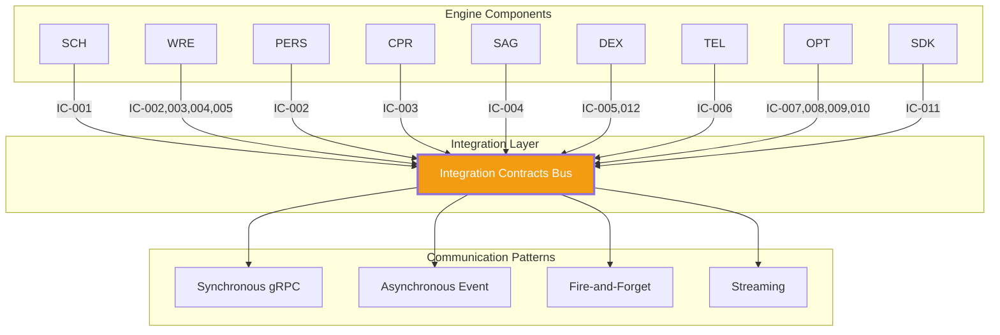

### 5.3 Integration Dependency Types

| Type             | Description                                         | Guarantee     | Example                                                   |
| ---------------- | --------------------------------------------------- | ------------- | --------------------------------------------------------- |
| **Strong Sync**  | مؤلفه مصرف‌کننده بدون مؤلفه تأمین‌کننده کار نمی‌کند | Availability  | WRE to PERS                                               |
| **Weak Sync**    | مؤلفه مصرف‌کننده با Degradation کار می‌کند          | Best-effort   | WRE to DEX (Lock unavailable yields sequential execution) |
| **Async Event**  | رویداد یک‌بار و فراموش                              | At-least-once | ALL to TEL                                                |
| **Control**      | تنظیم پارامترهای مؤلفه دیگر                         | Best-effort   | OPT to SCH                                                |
| **Coordination** | هماهنگی توزیع‌شده                                   | Consensus     | DEX to ALL                                                |

---

## 6. Unified State Machine

### 6.1 Master Engine State Diagram

The unified state machine integrates ALL states from SMOS-709 through SMOS-717 into one master execution flow:

```mermaid
stateDiagram-v2
    [*] --> ENGINE_INITIALIZING

    state ENGINE_INITIALIZING {
        [*] --> COMPONENT_STARTING
        COMPONENT_STARTING --> COMPONENT_READY: component_online
        COMPONENT_STARTING --> COMPONENT_FAILED: component_error
        COMPONENT_READY --> ALL_COMPONENTS_READY: all_components_online
    }

    ENGINE_INITIALIZING --> ENGINE_IDLE: initialization_complete
    ENGINE_INITIALIZING --> ENGINE_FAILED: initialization_error

    state ENGINE_IDLE {
        [*] --> AWAITING_TASK
        AWAITING_TASK --> TASK_RECEIVED: new_task
    }

    ENGINE_IDLE --> TASK_SCHEDULING: task_received

    state TASK_SCHEDULING {
        [*] --> QUEUEING
        QUEUEING --> PRIORITY_EVALUATION: queued
        PRIORITY_EVALUATION --> RESOURCE_CHECK: priority_assigned
        RESOURCE_CHECK --> DISPATCHING: resources_available
        RESOURCE_CHECK --> QUEUEING: resources_unavailable
        DISPATCHING --> [*]: dispatched
    }

    TASK_SCHEDULING --> WORKFLOW_EXECUTING: dispatched

    state WORKFLOW_EXECUTING {
        [*] --> STEP_EXECUTING
        STEP_EXECUTING --> CHECKPOINT_CREATING: checkpoint_reached
        CHECKPOINT_CREATING --> STEP_EXECUTING: checkpoint_saved
        STEP_EXECUTING --> COMPENSATION_TRIGGERED: step_failed
        COMPENSATION_TRIGGERED --> STEP_EXECUTING: compensation_completed
        STEP_EXECUTING --> HUMAN_APPROVAL_WAITING: approval_needed
        HUMAN_APPROVAL_WAITING --> STEP_EXECUTING: approved
        HUMAN_APPROVAL_WAITING --> COMPENSATION_TRIGGERED: rejected
        STEP_EXECUTING --> [*]: all_steps_completed
    }

    WORKFLOW_EXECUTING --> PERSISTING_STATE: all_steps_completed

    state PERSISTING_STATE {
        [*] --> SAVING_EXECUTION_STATE
        SAVING_EXECUTION_STATE --> SAVING_EVENT_LOG
        SAVING_EVENT_LOG --> ARCHIVING_IF_NEEDED
        ARCHIVING_IF_NEEDED --> [*]: persisted
    }

    PERSISTING_STATE --> TELEMETRY_EMITTING: persisted

    state TELEMETRY_EMITTING {
        [*] --> COLLECTING_METRICS
        COLLECTING_METRICS --> EXPORTING_TRACES
        EXPORTING_TRACES --> AGGREGATING_LOGS
        AGGREGATING_LOGS --> ROUTING_ALERTS
        ROUTING_ALERTS --> [*]: telemetry_emitted
    }

    TELEMETRY_EMITTING --> OPTIMIZATION_APPLYING: telemetry_emitted

    state OPTIMIZATION_APPLYING {
        [*] --> EVALUATING_PERFORMANCE
        EVALUATING_PERFORMANCE --> ADJUSTING_PARAMETERS: adjustment_needed
        ADJUSTING_PARAMETERS --> APPLYING_TUNING: parameters_set
        APPLYING_TUNING --> [*]: tuning_applied
        EVALUATING_PERFORMANCE --> [*]: no_adjustment_needed
    }

    OPTIMIZATION_APPLYING --> ENGINE_IDLE: cycle_complete
    OPTIMIZATION_APPLYING --> COMPLETED: workflow_complete

    state ENGINE_FAILED {
        [*] --> RECOVERY_EVALUATING
        RECOVERY_EVALUATING --> RECOVERY_EXECUTING: recovery_possible
        RECOVERY_EXECUTING --> CHECKPOINT_LOADING: recovery_strategy_selected
        CHECKPOINT_LOADING --> REPLAYING_LOGS: checkpoint_loaded
        REPLAYING_LOGS --> RECOVERY_VALIDATING: replay_complete
        RECOVERY_VALIDATING --> ENGINE_IDLE: recovery_successful
        RECOVERY_VALIDATING --> COMPENSATION_TRIGGERED: recovery_impossible
        RECOVERY_EVALUATING --> COMPENSATION_TRIGGERED: recovery_impossible
        COMPENSATION_TRIGGERED --> SAGA_EXECUTING: compensation_chain_started
        SAGA_EXECUTING --> SAGA_COMPLETED: all_compensations_done
        SAGA_COMPLETED --> COMPLETED: compensated
    end

    COMPLETED --> [*]

    ENGINE_FAILED --> CATASTROPHIC_FAILURE: unrecoverable

    state CATASTROPHIC_FAILURE {
        [*] --> EMERGENCY_SAVING
        EMERGENCY_SAVING --> NOTIFYING_ADMIN
        NOTIFYING_ADMIN --> [*]: notified
    end

    CATASTROPHIC_FAILURE --> [*]
```

### 6.2 State Composition by Component

| Engine State          | SCH (709)      | WRE (710)  | PERS (711) | DEX (712) | CPR (713)     | SAG (714)    | TEL (715)  | OPT (716)  |
| --------------------- | -------------- | ---------- | ---------- | --------- | ------------- | ------------ | ---------- | ---------- |
| ENGINE_INITIALIZING   | INIT           | INIT       | INIT       | INIT      | INIT          | INIT         | INIT       | INIT       |
| ENGINE_IDLE           | IDLE           | IDLE       | READY      | ACTIVE    | STANDBY       | STANDBY      | COLLECTING | MONITORING |
| TASK_SCHEDULING       | SCHEDULING\_\* | -          | READY      | ACTIVE    | STANDBY       | STANDBY      | COLLECTING | MONITORING |
| WORKFLOW_EXECUTING    | DISPATCHED     | EXECUTING  | SAVING     | LOCKING   | CHECKPOINTING | TRACKING     | COLLECTING | MONITORING |
| PERSISTING_STATE      | DISPATCHED     | COMPLETING | ARCHIVING  | ACTIVE    | STANDBY       | TRACKING     | COLLECTING | MONITORING |
| TELEMETRY_EMITTING    | DISPATCHED     | COMPLETING | READY      | ACTIVE    | STANDBY       | TRACKING     | EXPORTING  | MONITORING |
| OPTIMIZATION_APPLYING | TUNING         | COMPLETING | READY      | ACTIVE    | STANDBY       | TRACKING     | COLLECTING | TUNING     |
| ENGINE_FAILED         | FAILED         | FAILED     | RECOVERY   | RECOVERY  | RECOVERING    | COMPENSATING | ALERTING   | HOLD       |
| COMPLETED             | COMPLETED      | COMPLETED  | ARCHIVED   | RELEASED  | CLEANED       | COMPLETED    | FLUSHED    | IDLE       |

### 6.3 Master State Transition Matrix

| From To  | INIT | IDLE | SCHED | EXEC | PERSIST | TELEM | OPT | FAIL | COMPLETE |
| -------- | ---- | ---- | ----- | ---- | ------- | ----- | --- | ---- | -------- |
| INIT     | -    | Yes  | -     | -    | -       | -     | -   | Yes  | -        |
| IDLE     | -    | -    | Yes   | -    | -       | -     | -   | -    | -        |
| SCHED    | -    | -    | -     | Yes  | -       | -     | -   | Yes  | -        |
| EXEC     | -    | -    | -     | -    | Yes     | -     | -   | Yes  | -        |
| PERSIST  | -    | -    | -     | -    | -       | Yes   | -   | Yes  | -        |
| TELEM    | -    | -    | -     | -    | -       | -     | Yes | Yes  | -        |
| OPT      | -    | Yes  | -     | -    | -       | -     | -   | Yes  | Yes      |
| FAIL     | Yes  | Yes  | -     | -    | -       | -     | -   | -    | Yes      |
| COMPLETE | -    | -    | -     | -    | -       | -     | -   | -    | -        |

---

## 7. Unified Event Architecture

### 7.1 Master Event Flow Across ALL Engine Components

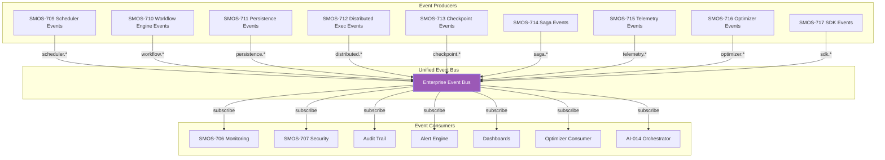

### 7.2 Event Catalog by Component

#### SMOS-709 Scheduler Events (scheduler.\*)

| Event ID    | Event Name                     | Payload                          | Trigger                  |
| ----------- | ------------------------------ | -------------------------------- | ------------------------ |
| SCH-EVT-001 | scheduler.task.queued          | TaskID, Priority, QueueDepth     | Task added to queue      |
| SCH-EVT-002 | scheduler.task.dequeued        | TaskID, Priority, WaitTime       | Task removed from queue  |
| SCH-EVT-003 | scheduler.task.dispatched      | TaskID, WorkerID, Timestamp      | Task sent to worker      |
| SCH-EVT-004 | scheduler.task.completed       | TaskID, Duration, Result         | Task execution finished  |
| SCH-EVT-005 | scheduler.task.failed          | TaskID, ErrorCode, RetryCount    | Task execution failed    |
| SCH-EVT-006 | scheduler.queue.backpressure   | QueueName, Depth, Threshold      | Queue exceeds threshold  |
| SCH-EVT-007 | scheduler.queue.drained        | QueueName, ItemsDrained          | Queue fully processed    |
| SCH-EVT-008 | scheduler.priority.adjusted    | TaskID, OldPriority, NewPriority | Priority aging applied   |
| SCH-EVT-009 | scheduler.deadline.missed      | TaskID, Deadline, Delay          | Task missed deadline     |
| SCH-EVT-010 | scheduler.preemption.triggered | TaskID, PreemptorID, Reason      | High-priority preemption |

#### SMOS-710 Workflow Engine Events (workflow.\*)

| Event ID    | Event Name                  | Payload                        | Trigger                 |
| ----------- | --------------------------- | ------------------------------ | ----------------------- |
| WRE-EVT-001 | workflow.step.started       | WorkflowID, StepID, Timestamp  | Step execution begins   |
| WRE-EVT-002 | workflow.step.completed     | WorkflowID, StepID, Result     | Step execution ends     |
| WRE-EVT-003 | workflow.step.failed        | WorkflowID, StepID, Error      | Step execution fails    |
| WRE-EVT-004 | workflow.state.transitioned | WorkflowID, FromState, ToState | State change            |
| WRE-EVT-005 | workflow.approval.needed    | WorkflowID, StepID, Approvers  | Human approval required |
| WRE-EVT-006 | workflow.approval.granted   | WorkflowID, StepID, Approver   | Human approval granted  |
| WRE-EVT-007 | workflow.approval.rejected  | WorkflowID, StepID, Approver   | Human approval rejected |
| WRE-EVT-008 | workflow.completed          | WorkflowID, Duration, Steps    | All steps complete      |
| WRE-EVT-009 | workflow.failed             | WorkflowID, FailedStep, Error  | Workflow failure        |
| WRE-EVT-010 | workflow.retry.attempted    | WorkflowID, StepID, Attempt    | Retry execution         |

#### SMOS-711 Persistence Events (persistence.\*)

| Event ID     | Event Name                     | Payload                               | Trigger                  |
| ------------ | ------------------------------ | ------------------------------------- | ------------------------ |
| PERS-EVT-001 | persistence.state.saved        | EntityID, EntityType, Size, Timestamp | State persisted          |
| PERS-EVT-002 | persistence.state.loaded       | EntityID, EntityType, Latency         | State retrieved          |
| PERS-EVT-003 | persistence.state.deleted      | EntityID, EntityType, Policy          | State purged             |
| PERS-EVT-004 | persistence.archive.triggered  | ArchiveID, EntityType, TargetTier     | Archival initiated       |
| PERS-EVT-005 | persistence.archive.completed  | ArchiveID, RecordsArchived            | Archival complete        |
| PERS-EVT-006 | persistence.retention.enforced | PolicyID, RecordsPurged               | Retention policy run     |
| PERS-EVT-007 | persistence.backpressure       | StoreType, UsagePercent               | Storage near capacity    |
| PERS-EVT-008 | persistence.error              | EntityID, ErrorCode, Operation        | Storage operation failed |

#### SMOS-712 Distributed Execution Events (distributed.\*)

| Event ID    | Event Name                     | Payload                       | Trigger                  |
| ----------- | ------------------------------ | ----------------------------- | ------------------------ |
| DEX-EVT-001 | distributed.lock.acquired      | LockID, Holder, TTL           | Lock obtained            |
| DEX-EVT-002 | distributed.lock.released      | LockID, Holder, Duration      | Lock released            |
| DEX-EVT-003 | distributed.lock.contention    | LockID, Contenders, WaitTime  | Lock contention detected |
| DEX-EVT-004 | distributed.lock.deadlock      | LockID, Participants          | Deadlock detected        |
| DEX-EVT-005 | distributed.leader.elected     | Term, LeaderID                | New leader elected       |
| DEX-EVT-006 | distributed.node.joined        | NodeID, Address, Capabilities | Node joined cluster      |
| DEX-EVT-007 | distributed.node.left          | NodeID, Reason                | Node left cluster        |
| DEX-EVT-008 | distributed.partition.detected | PartitionID, Members          | Network partition        |
| DEX-EVT-009 | distributed.partition.healed   | PartitionID, Members          | Partition resolved       |
| DEX-EVT-010 | distributed.snapshot.created   | SnapshotID, Size, Scope       | Runtime snapshot         |

#### SMOS-713 Checkpoint/Recovery Events (checkpoint.\*)

| Event ID    | Event Name         | Payload                           | Trigger              |
| ----------- | ------------------ | --------------------------------- | -------------------- |
| CPR-EVT-001 | checkpoint.created | CheckpointID, WorkflowID, Size    | Checkpoint saved     |
| CPR-EVT-002 | checkpoint.loaded  | CheckpointID, WorkflowID, Latency | Checkpoint loaded    |
| CPR-EVT-003 | checkpoint.invalid | CheckpointID, ValidationError     | Checkpoint corrupted |
| CPR-EVT-004 | recovery.started   | RecoveryID, WorkflowID, Strategy  | Recovery initiated   |
| CPR-EVT-005 | recovery.completed | RecoveryID, Duration, Steps       | Recovery complete    |
| CPR-EVT-006 | recovery.failed    | RecoveryID, ErrorCode             | Recovery failed      |
| CPR-EVT-007 | replay.started     | ReplayID, LogRange                | Replay initiated     |
| CPR-EVT-008 | replay.completed   | ReplayID, EventsReplayed          | Replay complete      |

#### SMOS-714 Saga/Compensation Events (saga.\*)

| Event ID    | Event Name                        | Payload                        | Trigger             |
| ----------- | --------------------------------- | ------------------------------ | ------------------- |
| SAG-EVT-001 | saga.started                      | SagaID, WorkflowID, Steps      | Saga begins         |
| SAG-EVT-002 | saga.step.executed                | SagaID, StepID, Result         | Forward action done |
| SAG-EVT-003 | saga.step.compensated             | SagaID, StepID, CompensationID | Compensation done   |
| SAG-EVT-004 | saga.compensation.chain.started   | SagaID, ChainLength            | Rollback begins     |
| SAG-EVT-005 | saga.compensation.chain.completed | SagaID, CompensatedSteps       | Rollback complete   |
| SAG-EVT-006 | saga.completed                    | SagaID, Duration, Status       | Saga finished       |
| SAG-EVT-007 | saga.failed                       | SagaID, FailedStep, Error      | Saga failure        |
| SAG-EVT-008 | saga.isolation.violation          | SagaID, ViolationType          | Isolation breach    |

#### SMOS-715 Telemetry Events (telemetry.\*)

| Event ID    | Event Name                      | Payload                              | Trigger                 |
| ----------- | ------------------------------- | ------------------------------------ | ----------------------- |
| TEL-EVT-001 | telemetry.metric.collected      | MetricName, Value, Labels, Timestamp | Metric emission         |
| TEL-EVT-002 | telemetry.trace.exported        | TraceID, SpanCount, Duration         | Trace export            |
| TEL-EVT-003 | telemetry.log.aggregated        | LogID, Level, Source, Message        | Log emission            |
| TEL-EVT-004 | telemetry.alert.triggered       | AlertID, Severity, Rule, Value       | Alert condition met     |
| TEL-EVT-005 | telemetry.alert.resolved        | AlertID, Duration                    | Alert condition cleared |
| TEL-EVT-006 | telemetry.pipeline.backpressure | PipelineStage, Backlog               | Pipeline congested      |

#### SMOS-716 Optimizer Events (optimizer.\*)

| Event ID    | Event Name               | Payload                               | Trigger                 |
| ----------- | ------------------------ | ------------------------------------- | ----------------------- |
| OPT-EVT-001 | optimizer.tuning.applied | Target, Parameter, OldValue, NewValue | Tuning applied          |
| OPT-EVT-002 | optimizer.sla.violation  | SLAID, Metric, Value, Threshold       | SLA breached            |
| OPT-EVT-003 | optimizer.sla.restored   | SLAID, Metric, Value                  | SLA recovered           |
| OPT-EVT-004 | optimizer.cost.threshold | ResourceType, Cost, Budget            | Cost threshold hit      |
| OPT-EVT-005 | optimizer.recommendation | RecommendationID, Action, Impact      | Optimization suggestion |

#### SMOS-717 SDK Events (sdk.\*)

| Event ID    | Event Name              | Payload                         | Trigger                |
| ----------- | ----------------------- | ------------------------------- | ---------------------- |
| SDK-EVT-001 | sdk.client.connected    | ClientID, Version, Capabilities | Client connection      |
| SDK-EVT-002 | sdk.client.disconnected | ClientID, Duration              | Client disconnection   |
| SDK-EVT-003 | sdk.auth.success        | ClientID, AuthMethod            | Authentication success |
| SDK-EVT-004 | sdk.auth.failure        | ClientID, AuthMethod, Reason    | Authentication failure |
| SDK-EVT-005 | sdk.rate.limit.exceeded | ClientID, Limit, Window         | Rate limit hit         |

---

## 8. Component Dependency Graph

### 8.1 Full Dependency Diagram

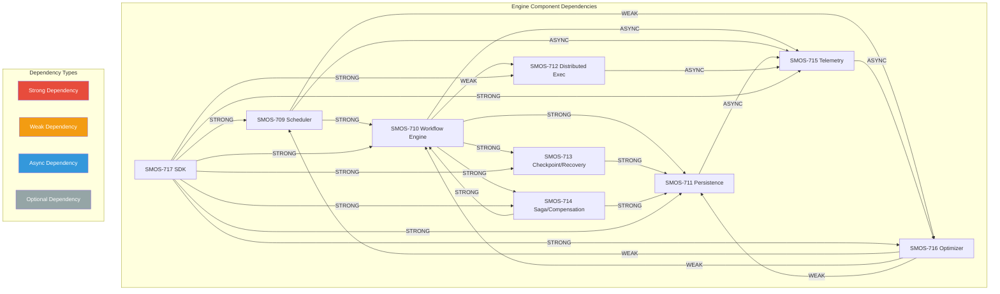

### 8.2 Dependency Matrix

| Component | SCH | WRE | PERS | DEX | CPR | SAG | TEL | OPT | SDK |
| --------- | --- | --- | ---- | --- | --- | --- | --- | --- | --- |
| **SCH**   | -   | STR | -    | -   | -   | -   | ASY | WK  | -   |
| **WRE**   | -   | -   | STR  | WK  | STR | STR | ASY | -   | -   |
| **PERS**  | -   | -   | -    | -   | -   | -   | ASY | -   | -   |
| **DEX**   | -   | -   | -    | -   | -   | -   | ASY | -   | -   |
| **CPR**   | -   | -   | STR  | -   | -   | -   | ASY | -   | -   |
| **SAG**   | -   | STR | STR  | -   | -   | -   | ASY | -   | -   |
| **TEL**   | -   | -   | -    | -   | -   | -   | -   | ASY | -   |
| **OPT**   | WK  | WK  | WK   | -   | -   | -   | -   | -   | -   |
| **SDK**   | STR | STR | STR  | STR | STR | STR | STR | STR | -   |

### 8.3 Bootstrap Order

Based on the dependency graph, the required bootstrap sequence is:

```
Phase 1 - Foundation
1. PERS (SMOS-711) - No dependencies
2. DEX (SMOS-712) - No storage dependencies
3. TEL (SMOS-715) - No dependencies

Phase 2 - Core
4. CPR (SMOS-713) depends on PERS
5. SAG (SMOS-714) depends on PERS, WRE

Phase 3 - Execution
6. WRE (SMOS-710) depends on PERS, CPR, SAG, DEX
7. SCH (SMOS-709) depends on WRE

Phase 4 - Intelligence
8. OPT (SMOS-716) depends on TEL, SCH, WRE, PERS

Phase 5 - Integration
9. SDK (SMOS-717) depends on ALL
```

---

## 9. Agent to Engine Mapping

### 9.1 Agent Usage of Engine Components

| Agent                 | SCH (709)    | WRE (710)             | PERS (711)      | DEX (712)  | CPR (713)  | SAG (714)       | TEL (715) | OPT (716)      | SDK (717) |
| --------------------- | ------------ | --------------------- | --------------- | ---------- | ---------- | --------------- | --------- | -------------- | --------- |
| **AI-001** Strategy   | Priority P-3 | Content Strategy WF   | Strategy state  | Read lock  | Checkpoint | -               | Metrics   | -              | Used      |
| **AI-002** Planning   | Priority P-3 | Content Planning WF   | Plan state      | Read lock  | Checkpoint | -               | Metrics   | -              | Used      |
| **AI-003** Production | Priority P-4 | Content Production WF | Content state   | Read lock  | Checkpoint | Compensation    | Metrics   | -              | Used      |
| **AI-004** Review     | Priority P-3 | Review/Approval WF    | Review state    | Read lock  | Checkpoint | Comp on reject  | Metrics   | -              | Used      |
| **AI-005** Discover   | Priority P-4 | SEO WF                | SEO state       | Read lock  | Checkpoint | -               | Metrics   | -              | Used      |
| **AI-006** Media      | Priority P-4 | Media Production WF   | Media state     | Write lock | Checkpoint | Compensation    | Metrics   | Resource-aware | Used      |
| **AI-007** Video      | Priority P-4 | Video Production WF   | Video state     | Write lock | Checkpoint | Compensation    | Metrics   | Resource-aware | Used      |
| **AI-008** Publish    | Priority P-2 | Publishing WF         | Publish state   | Write lock | Checkpoint | Saga (Critical) | Metrics   | Deadline-aware | Used      |
| **AI-009** Community  | Priority P-3 | Community WF          | Community state | Read lock  | Checkpoint | -               | Metrics   | -              | Used      |
| **AI-010** Analytics  | Priority P-5 | Analytics WF          | Analytics state | Read lock  | Checkpoint | -               | Metrics   | Feedback       | Used      |
| **AI-011** Knowledge  | Priority P-4 | Knowledge WF          | Knowledge state | Read lock  | Checkpoint | Comp on error   | Metrics   | -              | Used      |
| **AI-012** Improve    | Priority P-5 | Improvement WF        | Learning state  | Read lock  | Checkpoint | -               | Metrics   | Optimization   | Used      |
| **AI-013** Research   | Priority P-5 | Research WF           | Research state  | Read lock  | Checkpoint | -               | Metrics   | -              | Used      |
| **AI-014** Orchestr   | Priority P-0 | Orchestration WF      | Orchestr state  | Admin lock | Checkpoint | Saga (All)      | Metrics   | Performance    | Used      |

### 9.2 Agent to Engine Mapping Diagram

```mermaid
graph TB
    subgraph "AI Agents"
        A1[AI-001 Strategy]
        A2[AI-002 Planning]
        A3[AI-003 Production]
        A4[AI-004 Review]
        A5[AI-005 Discoverability]
        A6[AI-006 Media]
        A7[AI-007 Video]
        A8[AI-008 Publishing]
        A9[AI-009 Community]
        A10[AI-010 Analytics]
        A11[AI-011 Knowledge]
        A12[AI-012 Improvement]
        A13[AI-013 Research]
        A14[AI-014 Orchestrator]
    end

    subgraph "Engine Components"
        SCH[SMOS-709 Scheduler]
        WRE[SMOS-710 Workflow Engine]
        PERS[SMOS-711 Persistence]
        CPR[SMOS-713 Checkpoint]
        SAG[SMOS-714 Saga]
        TEL[SMOS-715 Telemetry]
        OPT[SMOS-716 Optimizer]
    end

    A1 -->|P-3| SCH
    A2 -->|P-3| SCH
    A3 -->|P-4| SCH
    A4 -->|P-3| SCH
    A5 -->|P-4| SCH
    A6 -->|P-4| SCH
    A7 -->|P-4| SCH
    A8 -->|P-2| SCH
    A9 -->|P-3| SCH
    A10 -->|P-5| SCH
    A11 -->|P-4| SCH
    A12 -->|P-5| SCH
    A13 -->|P-5| SCH
    A14 -->|P-0| SCH

    A1 --> WRE
    A2 --> WRE
    A3 --> WRE
    A4 --> WRE
    A5 --> WRE
    A6 --> WRE
    A7 --> WRE
    A8 --> WRE
    A9 --> WRE
    A10 --> WRE
    A11 --> WRE
    A12 --> WRE
    A13 --> WRE
    A14 --> WRE

    A3 --> SAG
    A6 --> SAG
    A7 --> SAG
    A8 --> SAG
    A11 --> SAG
    A14 --> SAG

    ALL_ALL{All Agents} --> PERS
    ALL_ALL --> CPR
    ALL_ALL --> TEL

    A6 --> OPT
    A7 --> OPT
    A8 --> OPT
    A10 --> OPT
    A12 --> OPT
    A14 --> OPT

    style A14 fill:#e74c3c,color:#fff,stroke-width:2px
    style SCH fill:#2980b9,color:#fff
    style WRE fill:#27ae60,color:#fff
```

---

## 10. Workflow to Engine Mapping

### 10.1 Workflow Usage of Engine Components

| Workflow ID | Workflow Name        | SCH Priority | WRE Pattern      | PERS Model      | DEX Lock | CPR Strategy | SAG Strategy   | TEL Level | OPT Tuning  |
| ----------- | -------------------- | ------------ | ---------------- | --------------- | -------- | ------------ | -------------- | --------- | ----------- |
| WKF-001     | Content Ideation     | P-3          | Sequential       | ExecutionState  | Read     | Periodic     | None           | Full      | Default     |
| WKF-002     | Content Production   | P-4          | Seq+Parallel     | ExecutionState  | Read     | Step-level   | Compensation   | Full      | Aggressive  |
| WKF-003     | Review and Approval  | P-3          | Nested+Human     | ExecutionState  | Read     | Milestone    | Comp on reject | Full      | Default     |
| WKF-004     | Media Production     | P-4          | Sequential       | ExecutionState  | Write    | Step-level   | Compensation   | Full      | Resource    |
| WKF-005     | Multi-Platform Pub   | P-2          | Parallel+Saga    | ExecutionState  | Write    | Step-level   | Saga (Full)    | Full      | Deadline    |
| WKF-006     | Community Engage     | P-3          | Seq+Conditional  | ExecutionState  | Read     | Periodic     | None           | Full      | Default     |
| WKF-007     | Performance Analysis | P-5          | Seq+Hierarchical | ExecutionState  | Read     | Periodic     | None           | Full      | Feedback    |
| WKF-008     | Knowledge Ingestion  | P-4          | Sequential       | KnowledgeState  | Read     | Periodic     | Comp on error  | Full      | Default     |
| WKF-009     | Research Execution   | P-5          | Seq+Hierarchical | ExecutionState  | Read     | Milestone    | None           | Full      | Default     |
| WKF-010     | Continuous Learning  | P-5          | Seq+Conditional  | LearningState   | Read     | Periodic     | None           | High      | Aggressive  |
| WKF-011     | System Health Check  | P-1          | Sequential       | MonitoringState | Read     | None         | None           | Critical  | Default     |
| WKF-012     | Incident Response    | P-0          | Dynamic+Human    | SecurityState   | Admin    | Immediate    | Saga (Full)    | Critical  | Performance |

---

## 11. Data Flow Architecture

### 11.1 Engine Data Flow Diagram

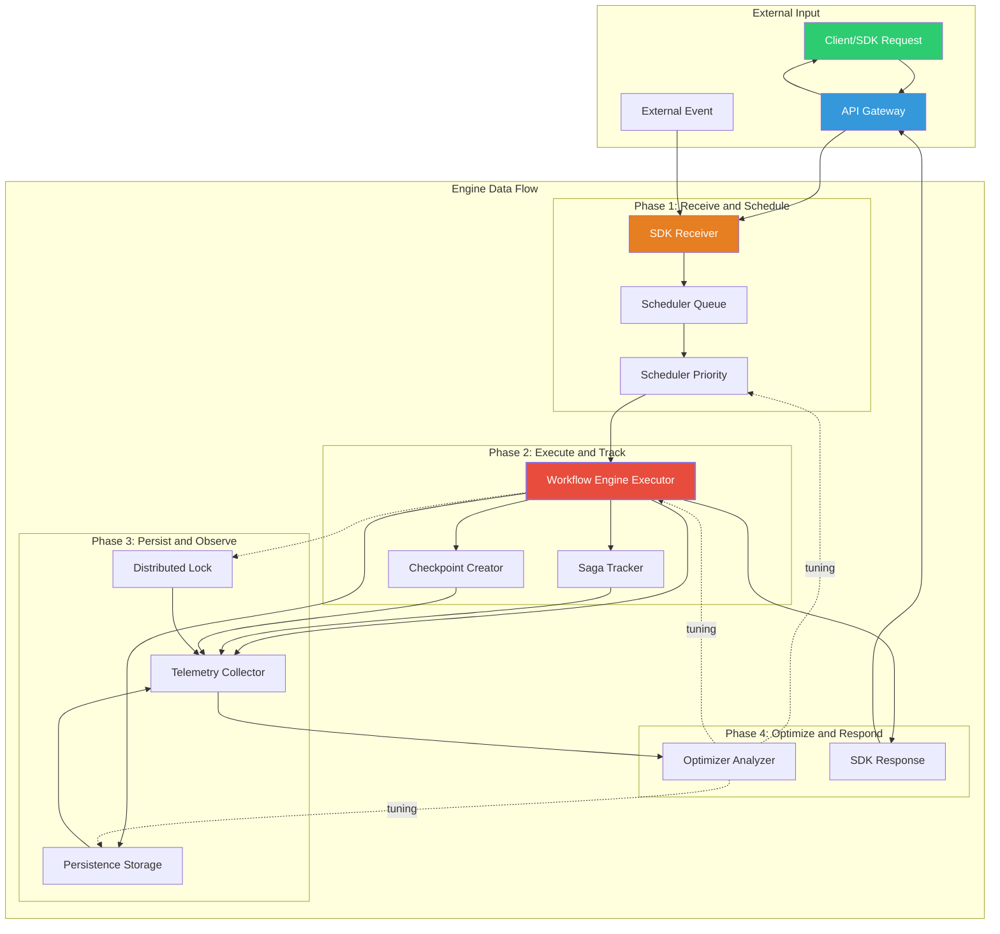

### 11.2 Data Model Flow by Component

| Component      | Input Data                         | Processing                        | Output Data                  | Storage             |
| -------------- | ---------------------------------- | --------------------------------- | ---------------------------- | ------------------- |
| **SCH (709)**  | TaskRequest, PriorityHint          | Queue, Sort, Dispatch             | TaskAssignment               | Queue (volatile)    |
| **WRE (710)**  | TaskAssignment, WorkflowDef        | Step execution, state transitions | StepResult, WorkflowStatus   | PERS (state)        |
| **PERS (711)** | StateSave, EventLog                | Store, Index, Archive             | StateLoad, QueryResult       | Hot/Warm/Cold tiers |
| **DEX (712)**  | LockRequest, JoinRequest           | Consensus, Election               | LockGrant, Membership        | Distributed store   |
| **CPR (713)**  | CheckpointRequest, RecoveryRequest | Snapshot, Validate, Replay        | CheckpointID, RecoveryStatus | PERS (checkpoints)  |
| **SAG (714)**  | CompensationRequest, SagaDef       | Track, Execute, Verify            | SagaStatus, CompResult       | PERS (saga state)   |
| **TEL (715)**  | MetricPoint, TraceSpan, LogEntry   | Aggregate, Sample, Export         | MetricExport, Alert          | TSDB, TraceStore    |
| **OPT (716)**  | MetricHistory, SLADef              | Analyze, Recommend, Tune          | TuningCommand, Report        | Config store        |
| **SDK (717)**  | ClientRequest                      | Auth, Validate, Route             | Response, Error              | None (transient)    |

### 11.3 Data Lifecycle Across Engine

```mermaid
stateDiagram-v2
    [*] --> RECEIVED: Client Request

    state RECEIVED {
        [*] --> VALIDATED
        VALIDATED --> AUTHENTICATED
        AUTHENTICATED --> ROUTED
    }

    RECEIVED --> QUEUED: SDK to Scheduler

    state QUEUED {
        [*] --> PRIORITIZED
        PRIORITIZED --> RESOURCE_CHECKED
        RESOURCE_CHECKED --> DISPATCHED
    }

    QUEUED --> EXECUTING: Scheduler to Workflow Engine

    state EXECUTING {
        [*] --> STEP_PROCESSING
        STEP_PROCESSING --> CHECKPOINTING: safe_point
        CHECKPOINTING --> STEP_PROCESSING: checkpoint_done
        STEP_PROCESSING --> COMPENSATING: error
        COMPENSATING --> STEP_PROCESSING: compensated
        STEP_PROCESSING --> [*]: step_complete
    }

    EXECUTING --> PERSISTING: workflow_complete

    state PERSISTING {
        [*] --> SAVING_STATE
        SAVING_STATE --> LOGGING_EVENTS
        LOGGING_EVENTS --> ARCHIVING_IF_NEEDED
        ARCHIVING_IF_NEEDED --> [*]: persisted
    }

    PERSISTING --> TELEMETRY_REPORTING: persisted

    state TELEMETRY_REPORTING {
        [*] --> METRICS_COLLECTED
        METRICS_COLLECTED --> TRACES_EXPORTED
        TRACES_EXPORTED --> LOGS_AGGREGATED
        LOGS_AGGREGATED --> ALERTS_EVALUATED
        ALERTS_EVALUATED --> [*]: reported
    }

    TELEMETRY_REPORTING --> OPTIMIZATION_FEEDBACK: reported

    state OPTIMIZATION_FEEDBACK {
        [*] --> PERFORMANCE_EVALUATED
        PERFORMANCE_EVALUATED --> TUNING_APPLIED: needed
        PERFORMANCE_EVALUATED --> [*]: no_change_needed
        TUNING_APPLIED --> [*]: tuned
    }

    OPTIMIZATION_FEEDBACK --> RESPONDING: feedback_cycle

    state RESPONDING {
        [*] --> RESPONSE_ASSEMBLED
        RESPONSE_ASSEMBLED --> RESPONSE_SENT
    }

    RESPONDING --> [*]: response_sent
```

---

## 12. End-to-End Execution Flows

### 12.1 Flow 1: Complete Content Production with Full Engine Integration

```mermaid
sequenceDiagram
    participant SDK as SMOS-717 SDK
    participant SCH as SMOS-709 Scheduler
    participant WRE as SMOS-710 Workflow Engine
    participant PERS as SMOS-711 Persistence
    participant DEX as SMOS-712 Distributed Exec
    participant CPR as SMOS-713 Checkpoint/Recovery
    participant SAG as SMOS-714 Saga/Compensation
    participant TEL as SMOS-715 Telemetry
    participant OPT as SMOS-716 Optimizer
    participant A3 as AI-003 (Production)

    SDK->>SCH: Submit ContentProduction Task (P-4)
    SCH->>SCH: Queue, Priority Eval, Resource Check
    SCH->>TEL: scheduler.task.queued
    SCH->>WRE: Dispatch Task to Workflow Engine

    WRE->>PERS: Load Workflow Definition
    PERS->>WRE: Workflow Definition
    WRE->>CPR: Create Initial Checkpoint
    CPR->>PERS: Save Checkpoint

    WRE->>DEX: Acquire Content Lock
    DEX->>WRE: Lock Granted

    WRE->>SAG: Start Saga Tracking
    SAG->>PERS: Save Saga State

    WRE->>A3: Execute Production Step
    A3->>A3: Generate Content
    A3->>WRE: Content Ready

    WRE->>CPR: Create Step Checkpoint
    CPR->>PERS: Save Checkpoint

    WRE->>SAG: Register Compensation Action
    SAG->>PERS: Store Compensation

    WRE->>PERS: Save Execution State
    WRE->>TEL: workflow.step.completed

    WRE->>DEX: Release Content Lock

    WRE->>CPR: Final Checkpoint
    WRE->>SAG: Complete Saga

    WRE->>PERS: Final State Save + Archive
    WRE->>TEL: workflow.completed

    WRE->>SCH: Task Complete
    WRE->>SDK: Return Result

    TEL->>TEL: Aggregate Metrics
    TEL->>OPT: Send Performance Data
    OPT->>OPT: Evaluate Tuning Needs
    OPT->>SCH: Adjust Scheduler Parameters (if needed)

    SDK->>SDK: Return to Client
```

### 12.2 Flow 2: Distributed Lock Contention with Compensation

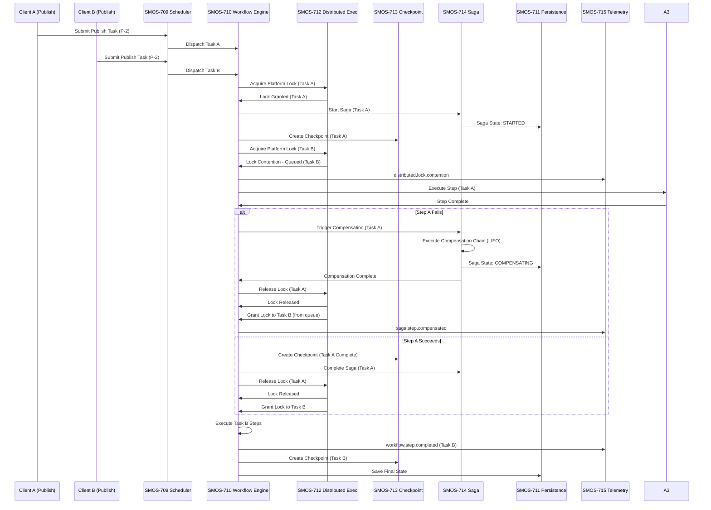

### 12.3 Flow 3: Full Engine Recovery with Telemetry-Driven Optimization

```mermaid
sequenceDiagram
    participant WRE as SMOS-710 Workflow Engine
    participant PERS as SMOS-711 Persistence
    participant DEX as SMOS-712 Distributed Exec
    participant CPR as SMOS-713 Checkpoint/Recovery
    participant TEL as SMOS-715 Telemetry
    participant OPT as SMOS-716 Optimizer

    Note over WRE,CPR: Normal Execution
    WRE->>CPR: Create Checkpoint at Step 5/10
    CPR->>PERS: Save Checkpoint #5
    WRE->>TEL: checkpoint.created

    WRE->>WRE: Execute Step 6
    Note over WRE: CRASH! Engine fails

    CPR->>CPR: Detected WRE Failure
    CPR->>TEL: checkpoint.recovery.started
    CPR->>PERS: Load Latest Valid Checkpoint
    PERS->>CPR: Checkpoint #5 Data

    CPR->>DEX: Verify Leadership
    DEX->>CPR: Leadership Confirmed

    CPR->>CPR: Determine Recovery Strategy
    CPR->>PERS: Load Replay Log (Steps 5-6)
    PERS->>CPR: Replay Entries

    CPR->>WRE: Initialize Engine from Checkpoint #5
    WRE->>CPR: Engine Ready

    CPR->>WRE: Replay Steps 5-6
    WRE->>WRE: Re-execute Step 5 (idempotent)
    WRE->>WRE: Re-execute Step 6
    WRE->>CPR: Replay Complete

    CPR->>CPR: Validate State Consistency
    CPR->>TEL: checkpoint.recovery.completed

    WRE->>WRE: Continue Normal Execution (Steps 7-10)
    WRE->>CPR: Create Checkpoint at Step 10
    WRE->>TEL: workflow.completed

    TEL->>TEL: Aggregate Recovery Metrics
    TEL->>OPT: Send Recovery Performance Data
    OPT->>OPT: Analyze Recovery Pattern
    OPT->>CPR: Suggest Optimal Checkpoint Frequency
    OPT->>OPT: Tuning complete
    TEL->>TEL: optimizer.tuning.applied
```

### 12.4 Flow 4: Multi-Agent Orchestration with Saga Full Rollback

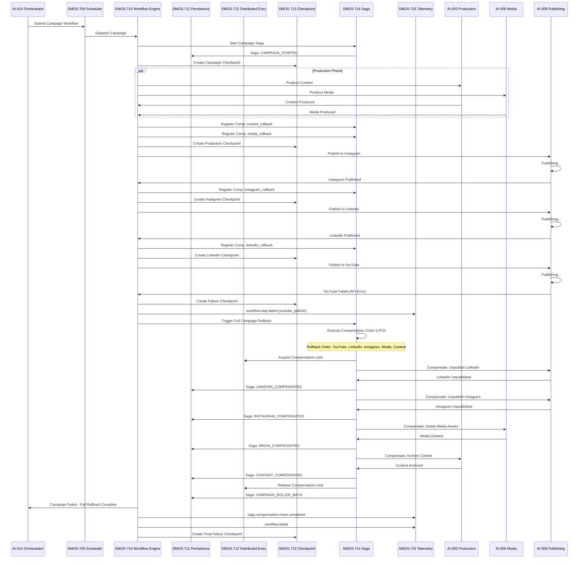

---

## 13. API Contract Catalog

### 13.1 Centralized API Registry

This is the **single source of truth** for ALL engine component APIs across SMOS-709..717.

#### SMOS-709 - Scheduler API

| Method | Endpoint                               | Description             | Auth Level |
| ------ | -------------------------------------- | ----------------------- | ---------- |
| POST   | /api/v1/scheduler/tasks                | Submit new task         | A-2+       |
| GET    | /api/v1/scheduler/tasks/{id}           | Get task status         | A-1+       |
| DELETE | /api/v1/scheduler/tasks/{id}           | Cancel task             | A-3+       |
| GET    | /api/v1/scheduler/queues               | List queues and depth   | A-2+       |
| POST   | /api/v1/scheduler/queues/{name}/pause  | Pause queue             | A-4        |
| POST   | /api/v1/scheduler/queues/{name}/resume | Resume queue            | A-4        |
| GET    | /api/v1/scheduler/metrics              | Scheduler metrics       | A-2+       |
| POST   | /api/v1/scheduler/config               | Update scheduler config | A-4        |
| GET    | /api/v1/scheduler/workers              | List registered workers | A-2+       |

#### SMOS-710 - Workflow Engine API

| Method | Endpoint                                  | Description               | Auth Level |
| ------ | ----------------------------------------- | ------------------------- | ---------- |
| POST   | /api/v1/workflows                         | Create and start workflow | A-2+       |
| GET    | /api/v1/workflows/{id}                    | Get workflow status       | A-1+       |
| DELETE | /api/v1/workflows/{id}                    | Cancel workflow           | A-3+       |
| POST   | /api/v1/workflows/{id}/pause              | Pause workflow            | A-3+       |
| POST   | /api/v1/workflows/{id}/resume             | Resume workflow           | A-3+       |
| POST   | /api/v1/workflows/{id}/approve            | Approve human step        | A-2+       |
| POST   | /api/v1/workflows/{id}/reject             | Reject human step         | A-2+       |
| GET    | /api/v1/workflows/{id}/history            | Get execution history     | A-1+       |
| GET    | /api/v1/workflows/{id}/steps              | List workflow steps       | A-1+       |
| POST   | /api/v1/workflows/{id}/steps/{step}/retry | Retry failed step         | A-3+       |

#### SMOS-711 - Persistence API

| Method | Endpoint                       | Description            | Auth Level |
| ------ | ------------------------------ | ---------------------- | ---------- |
| POST   | /api/v1/persistence/state      | Save state             | A-2+       |
| GET    | /api/v1/persistence/state/{id} | Load state             | A-1+       |
| DELETE | /api/v1/persistence/state/{id} | Delete state           | A-3+       |
| POST   | /api/v1/persistence/query      | Query persisted data   | A-2+       |
| POST   | /api/v1/persistence/archive    | Trigger archival       | A-4        |
| POST   | /api/v1/persistence/retention  | Apply retention policy | A-4        |
| GET    | /api/v1/persistence/metrics    | Storage metrics        | A-2+       |
| GET    | /api/v1/persistence/audit      | Query audit log        | A-3+       |

#### SMOS-712 - Distributed Execution API

| Method | Endpoint                             | Description             | Auth Level |
| ------ | ------------------------------------ | ----------------------- | ---------- |
| POST   | /api/v1/distributed/lock             | Acquire lock            | A-2+       |
| DELETE | /api/v1/distributed/lock/{id}        | Release lock            | A-2+       |
| GET    | /api/v1/distributed/locks            | List active locks       | A-3+       |
| POST   | /api/v1/distributed/node/join        | Register node           | A-4        |
| POST   | /api/v1/distributed/node/leave       | Deregister node         | A-4        |
| GET    | /api/v1/distributed/nodes            | List cluster nodes      | A-2+       |
| POST   | /api/v1/distributed/election/trigger | Force leader election   | A-4        |
| GET    | /api/v1/distributed/leader           | Get current leader      | A-1+       |
| GET    | /api/v1/distributed/snapshot         | Create runtime snapshot | A-4        |

#### SMOS-713 - Checkpoint/Recovery API

| Method | Endpoint                          | Description         | Auth Level |
| ------ | --------------------------------- | ------------------- | ---------- |
| POST   | /api/v1/checkpoints               | Create checkpoint   | A-2+       |
| GET    | /api/v1/checkpoints/{id}          | Get checkpoint info | A-1+       |
| POST   | /api/v1/checkpoints/{id}/validate | Validate checkpoint | A-3+       |
| POST   | /api/v1/recovery                  | Start recovery      | A-4        |
| GET    | /api/v1/recovery/{id}             | Get recovery status | A-3+       |
| POST   | /api/v1/replay                    | Start replay        | A-4        |
| GET    | /api/v1/replay/{id}               | Get replay status   | A-3+       |
| GET    | /api/v1/checkpoints/metrics       | Checkpoint metrics  | A-2+       |

#### SMOS-714 - Saga/Compensation API

| Method | Endpoint                       | Description               | Auth Level |
| ------ | ------------------------------ | ------------------------- | ---------- |
| POST   | /api/v1/sagas                  | Start saga                | A-3+       |
| GET    | /api/v1/sagas/{id}             | Get saga status           | A-2+       |
| POST   | /api/v1/sagas/{id}/compensate  | Trigger compensation      | A-4        |
| POST   | /api/v1/sagas/{id}/retry       | Retry failed saga         | A-4        |
| GET    | /api/v1/sagas/{id}/steps       | List saga steps           | A-2+       |
| GET    | /api/v1/compensations/registry | List compensation actions | A-3+       |
| POST   | /api/v1/compensations/actions  | Register compensation     | A-3+       |
| GET    | /api/v1/sagas/metrics          | Saga metrics              | A-2+       |

#### SMOS-715 - Telemetry API

| Method | Endpoint                        | Description          | Auth Level |
| ------ | ------------------------------- | -------------------- | ---------- |
| POST   | /api/v1/telemetry/metrics       | Submit metrics batch | A-1+       |
| POST   | /api/v1/telemetry/traces        | Submit trace span    | A-1+       |
| POST   | /api/v1/telemetry/logs          | Submit log entry     | A-1+       |
| GET    | /api/v1/telemetry/metrics/query | Query metrics        | A-2+       |
| GET    | /api/v1/telemetry/traces/{id}   | Get trace detail     | A-2+       |
| POST   | /api/v1/telemetry/alerts        | Configure alert rule | A-3+       |
| GET    | /api/v1/telemetry/alerts        | List active alerts   | A-2+       |
| GET    | /api/v1/telemetry/health        | Pipeline health      | A-1+       |

#### SMOS-716 - Optimizer API

| Method | Endpoint                                     | Description             | Auth Level |
| ------ | -------------------------------------------- | ----------------------- | ---------- |
| POST   | /api/v1/optimizer/tune                       | Trigger adaptive tuning | A-4        |
| GET    | /api/v1/optimizer/config                     | Get optimizer config    | A-3+       |
| POST   | /api/v1/optimizer/config                     | Update optimizer config | A-4        |
| GET    | /api/v1/optimizer/recommendations            | List recommendations    | A-3+       |
| POST   | /api/v1/optimizer/recommendations/{id}/apply | Apply recommendation    | A-4        |
| GET    | /api/v1/optimizer/slas                       | List SLA definitions    | A-3+       |
| POST   | /api/v1/optimizer/slas                       | Define SLA rule         | A-4        |
| GET    | /api/v1/optimizer/metrics                    | Optimizer metrics       | A-2+       |

#### SMOS-717 - SDK API (Unified Client Interface)

| Method | Endpoint                    | Description                   | Auth Level       |
| ------ | --------------------------- | ----------------------------- | ---------------- |
| POST   | /api/v1/engine/execute      | Execute workflow (unified)    | A-2+             |
| GET    | /api/v1/engine/status/{id}  | Get execution status          | A-1+             |
| POST   | /api/v1/engine/cancel/{id}  | Cancel execution              | A-3+             |
| GET    | /api/v1/engine/capabilities | List engine capabilities      | A-1+             |
| GET    | /api/v1/engine/health       | Health check (all components) | A-0              |
| GET    | /api/v1/engine/version      | Engine version info           | A-0              |
| POST   | /api/v1/engine/auth/token   | Get auth token                | A-0 (credential) |
| POST   | /api/v1/engine/auth/refresh | Refresh auth token            | A-1+             |

### 13.2 API Versioning and Compatibility

| Component                    | API Version | Protocol         | Deprecation Policy |
| ---------------------------- | ----------- | ---------------- | ------------------ |
| SMOS-709 Scheduler           | v1          | gRPC + HTTP/REST | 2 versions         |
| SMOS-710 Workflow Engine     | v1          | gRPC             | 3 versions         |
| SMOS-711 Persistence         | v1          | gRPC             | 2 versions         |
| SMOS-712 Distributed Exec    | v1          | gRPC             | 2 versions         |
| SMOS-713 Checkpoint/Recovery | v1          | gRPC             | 2 versions         |
| SMOS-714 Saga/Compensation   | v1          | gRPC             | 2 versions         |
| SMOS-715 Telemetry           | v1          | HTTP (REST)      | 3 versions         |
| SMOS-716 Optimizer           | v1          | gRPC             | 2 versions         |
| SMOS-717 SDK                 | v1          | gRPC + HTTP/REST | 3 versions         |

---

## 14. Security Integration

### 14.1 Cross-Component Security Model

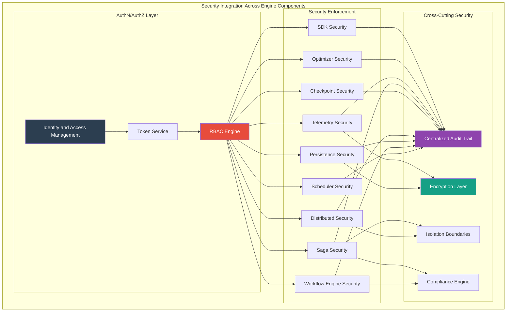

### 14.2 Security Controls by Component

| Component      | Authentication   | Authorization                                 | Data Protection                 | Audit                     |
| -------------- | ---------------- | --------------------------------------------- | ------------------------------- | ------------------------- |
| **SCH (709)**  | Token-based      | RBAC: task.submit, task.cancel, queue.manage  | Task payload encryption         | All scheduling actions    |
| **WRE (710)**  | Token-based      | RBAC: workflow.create, step.execute, approval | Step input/output isolation     | All state transitions     |
| **PERS (711)** | mTLS + Token     | RBAC: state.read, state.write, archive.manage | AES-256 at rest, TLS in transit | All CRUD operations       |
| **DEX (712)**  | mTLS (Node cert) | Node-level RBAC + Lock ACL                    | Lock metadata encryption        | Lock acquire/release      |
| **CPR (713)**  | Token-based      | RBAC: checkpoint.create, recovery.execute     | Checkpoint data encryption      | All checkpoint operations |
| **SAG (714)**  | Token-based      | RBAC: saga.start, compensate.execute          | Compensation data isolation     | All saga transitions      |
| **TEL (715)**  | Token-based      | RBAC: metrics.write, metrics.read             | PII redaction, sampling         | Alert configuration       |
| **OPT (716)**  | Token-based      | A-4 only for tuning                           | Tuning parameter signing        | All tuning changes        |
| **SDK (717)**  | Token + API Key  | Delegated to underlying components            | End-to-end encryption           | Client connection log     |

### 14.3 Security Integration Points

| Integration Point    | Security Control            | Source Component   | Target Component |
| -------------------- | --------------------------- | ------------------ | ---------------- |
| Task Dispatch        | Task authentication         | SCH                | WRE              |
| State Persistence    | Data encryption at rest     | WRE                | PERS             |
| Lock Acquisition     | Node certificate validation | WRE                | DEX              |
| Checkpoint Save      | Checkpoint integrity hash   | WRE to CPR to PERS |
| Compensation Execute | Compensation authorization  | WRE                | SAG              |
| Metric Emission      | PII redaction               | ALL                | TEL              |
| Tuning Command       | Signed tuning payload       | OPT                | SCH/WRE/PERS     |
| SDK Client Call      | API key validation          | SDK                | ALL              |

---

## 15. Monitoring Integration

### 15.1 Cross-Component Monitoring Model

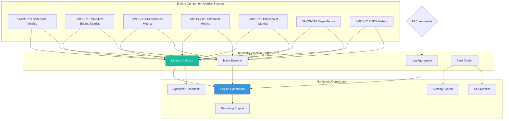

### 15.2 Key Metrics by Component

#### SMOS-709 Scheduler Metrics

| Metric ID | Name                            | Type      | Unit    | Alert Threshold |
| --------- | ------------------------------- | --------- | ------- | --------------- |
| SCH-M-001 | scheduler.queue.depth           | Gauge     | count   | > 10000         |
| SCH-M-002 | scheduler.queue.latency.p50     | Histogram | ms      | > 100           |
| SCH-M-003 | scheduler.queue.latency.p99     | Histogram | ms      | > 1000          |
| SCH-M-004 | scheduler.task.throughput       | Counter   | ops/sec | < 10 (low)      |
| SCH-M-005 | scheduler.task.failure.rate     | Rate      | percent | > 5%            |
| SCH-M-006 | scheduler.task.preempted        | Counter   | count   | > 100           |
| SCH-M-007 | scheduler.task.deadline.missed  | Counter   | count   | > 0             |
| SCH-M-008 | scheduler.resource.cpu.usage    | Gauge     | percent | > 80%           |
| SCH-M-009 | scheduler.resource.memory.usage | Gauge     | percent | > 85%           |
| SCH-M-010 | scheduler.backpressure.active   | Gauge     | boolean | true            |

#### SMOS-710 Workflow Engine Metrics

| Metric ID | Name                            | Type      | Unit    | Alert Threshold |
| --------- | ------------------------------- | --------- | ------- | --------------- |
| WRE-M-001 | workflow.active.count           | Gauge     | count   | > 500           |
| WRE-M-002 | workflow.completion.rate        | Rate      | ops/min | < 1             |
| WRE-M-003 | workflow.failure.rate           | Rate      | percent | > 3%            |
| WRE-M-004 | workflow.step.duration.p50      | Histogram | ms      | > 5000          |
| WRE-M-005 | workflow.step.duration.p99      | Histogram | ms      | > 60000         |
| WRE-M-006 | workflow.retry.count            | Counter   | count   | > 100           |
| WRE-M-007 | workflow.human.approval.pending | Gauge     | count   | > 20            |
| WRE-M-008 | workflow.state.transition.count | Counter   | count   | -               |

#### SMOS-711 Persistence Metrics

| Metric ID  | Name                          | Type      | Unit    | Alert Threshold |
| ---------- | ----------------------------- | --------- | ------- | --------------- |
| PERS-M-001 | persistence.read.latency.p50  | Histogram | ms      | > 50            |
| PERS-M-002 | persistence.read.latency.p99  | Histogram | ms      | > 500           |
| PERS-M-003 | persistence.write.latency.p50 | Histogram | ms      | > 100           |
| PERS-M-004 | persistence.write.latency.p99 | Histogram | ms      | > 1000          |
| PERS-M-005 | persistence.storage.usage     | Gauge     | percent | > 80%           |
| PERS-M-006 | persistence.archive.backlog   | Gauge     | count   | > 10000         |
| PERS-M-007 | persistence.throughput        | Rate      | ops/sec | -               |

#### SMOS-712 Distributed Execution Metrics

| Metric ID | Name                             | Type      | Unit    | Alert Threshold |
| --------- | -------------------------------- | --------- | ------- | --------------- |
| DEX-M-001 | distributed.lock.contention.rate | Rate      | ops/min | > 50            |
| DEX-M-002 | distributed.lock.acquire.latency | Histogram | ms      | > 500           |
| DEX-M-003 | distributed.lock.deadlock.count  | Counter   | count   | > 0             |
| DEX-M-004 | distributed.node.count           | Gauge     | count   | < 3             |
| DEX-M-005 | distributed.partition.count      | Gauge     | count   | > 0             |
| DEX-M-006 | distributed.leader.changes       | Counter   | count   | > 3             |

#### SMOS-713 Checkpoint/Recovery Metrics

| Metric ID | Name                      | Type      | Unit    | Alert Threshold |
| --------- | ------------------------- | --------- | ------- | --------------- |
| CPR-M-001 | checkpoint.create.latency | Histogram | ms      | > 1000          |
| CPR-M-002 | checkpoint.size           | Histogram | bytes   | > 10MB          |
| CPR-M-003 | checkpoint.frequency      | Rate      | ops/min | -               |
| CPR-M-004 | recovery.duration         | Histogram | ms      | > 30000         |
| CPR-M-005 | recovery.failure.rate     | Rate      | percent | > 10%           |
| CPR-M-006 | replay.event.count        | Counter   | count   | -               |

#### SMOS-714 Saga/Compensation Metrics

| Metric ID | Name                     | Type      | Unit    | Alert Threshold |
| --------- | ------------------------ | --------- | ------- | --------------- |
| SAG-M-001 | saga.active.count        | Gauge     | count   | > 50            |
| SAG-M-002 | saga.completion.rate     | Rate      | ops/min | -               |
| SAG-M-003 | saga.compensation.rate   | Rate      | ops/min | > 10            |
| SAG-M-004 | saga.step.duration       | Histogram | ms      | > 10000         |
| SAG-M-005 | saga.isolation.violation | Counter   | count   | > 0             |

#### SMOS-715 Telemetry Pipeline Metrics

| Metric ID | Name                         | Type    | Unit        | Alert Threshold |
| --------- | ---------------------------- | ------- | ----------- | --------------- |
| TEL-M-001 | telemetry.metrics.throughput | Rate    | points/sec  | -               |
| TEL-M-002 | telemetry.traces.throughput  | Rate    | spans/sec   | -               |
| TEL-M-003 | telemetry.logs.throughput    | Rate    | entries/sec | -               |
| TEL-M-004 | telemetry.pipeline.backlog   | Gauge   | count       | > 50000         |
| TEL-M-005 | telemetry.alert.triggered    | Counter | count       | -               |

#### SMOS-716 Optimizer Metrics

| Metric ID | Name                             | Type    | Unit    | Alert Threshold |
| --------- | -------------------------------- | ------- | ------- | --------------- |
| OPT-M-001 | optimizer.tuning.applied         | Counter | count   | -               |
| OPT-M-002 | optimizer.sla.violation          | Counter | count   | > 0             |
| OPT-M-003 | optimizer.cost.savings           | Gauge   | percent | -               |
| OPT-M-004 | optimizer.recommendation.pending | Gauge   | count   | > 10            |

#### SMOS-717 SDK Metrics

| Metric ID | Name                    | Type      | Unit    | Alert Threshold |
| --------- | ----------------------- | --------- | ------- | --------------- |
| SDK-M-001 | sdk.request.latency.p50 | Histogram | ms      | > 500           |
| SDK-M-002 | sdk.request.latency.p99 | Histogram | ms      | > 5000          |
| SDK-M-003 | sdk.error.rate          | Rate      | percent | > 5%            |
| SDK-M-004 | sdk.active.connections  | Gauge     | count   | -               |
| SDK-M-005 | sdk.rate.limit.hits     | Counter   | count   | > 100           |

### 15.3 Unified Engine Dashboard

| Dashboard Panel     | Component Metrics                    | Refresh | Audience    |
| ------------------- | ------------------------------------ | ------- | ----------- |
| Engine Health       | All component health checks          | 5s      | SRE         |
| Scheduling Overview | SCH queue depth, latency, throughput | 10s     | Ops         |
| Active Workflows    | WRE active, failed, completion rate  | 10s     | Ops         |
| Storage Status      | PERS usage, latency, archive backlog | 30s     | SRE         |
| Distributed Health  | DEX nodes, locks, partitions         | 10s     | SRE         |
| Resilience Status   | CPR checkpoints, recovery events     | 30s     | SRE         |
| Transaction Status  | SAG active, compensations            | 10s     | Ops         |
| Telemetry Pipeline  | TEL throughput, backlog, alerts      | 5s      | SRE         |
| Optimization Impact | OPT tuning, SLA, cost savings        | 1m      | Management  |
| SDK Usage           | SDK request rate, latency, errors    | 30s     | Engineering |
| **Engine Overview** | **ALL components - combined**        | **15s** | **All**     |

---

## 16. Deployment Architecture

### 16.1 Engine Deployment Topology

```mermaid
graph TB
    subgraph "Production Cluster"
        subgraph "Control Plane"
            API_GW[API Gateway / Load Balancer]
            SDK_SRV[SDK Service - SMOS-717]
            AUTH[Auth Service]
        end

        subgraph "Scheduler Tier"
            SCH_1[Scheduler Node 1 - SMOS-709]
            SCH_2[Scheduler Node 2 - SMOS-709]
            SCH_3[Scheduler Node 3 - SMOS-709]
        end

        subgraph "Workflow Tier"
            WRE_1[Workflow Engine 1 - SMOS-710]
            WRE_2[Workflow Engine 2 - SMOS-710]
            WRE_3[Workflow Engine 3 - SMOS-710]
        end

        subgraph "Coordination Tier"
            DEX_1[Distributed Exec 1 - SMOS-712]
            DEX_2[Distributed Exec 2 - SMOS-712]
            DEX_3[Distributed Exec 3 - SMOS-712]
        end

        subgraph "Data Tier"
            PERS_PRI[Primary Persistence - SMOS-711]
            PERS_REP[Replica Persistence]
            PERS_ARC[Archival Storage (Cold)]
        end

        subgraph "Resilience Tier"
            CPR_1[Checkpoint/Recovery - SMOS-713]
            SAG_1[Saga/Compensation - SMOS-714]
        end

        subgraph "Observability Tier"
            TEL_AGG[Telemetry Aggregator - SMOS-715]
            TSDB[Time-Series Database]
            LOG_STORE[Log Storage]
            TRACE_STORE[Trace Store]
        end

        subgraph "Intelligence Tier"
            OPT_1[Runtime Optimizer - SMOS-716]
        end
    end

    API_GW --> SDK_SRV
    SDK_SRV --> AUTH
    SDK_SRV --> SCH_1
    SDK_SRV --> SCH_2
    SDK_SRV --> SCH_3

    SCH_1 --> WRE_1
    SCH_1 --> WRE_2
    SCH_2 --> WRE_2
    SCH_2 --> WRE_3
    SCH_3 --> WRE_1
    SCH_3 --> WRE_3

    WRE_1 --> PERS_PRI
    WRE_2 --> PERS_PRI
    WRE_3 --> PERS_PRI

    WRE_1 --> DEX_1
    WRE_2 --> DEX_2
    WRE_3 --> DEX_3

    DEX_1 --> DEX_2
    DEX_2 --> DEX_3
    DEX_3 --> DEX_1

    WRE_1 --> CPR_1
    WRE_2 --> CPR_1
    WRE_3 --> CPR_1

    WRE_1 --> SAG_1
    WRE_2 --> SAG_1
    WRE_3 --> SAG_1

    PERS_PRI --> PERS_REP
    PERS_PRI --> PERS_ARC

    ALL_TIER{WRE, SCH, PERS, DEX, CPR, SAG} --> TEL_AGG
    TEL_AGG --> TSDB
    TEL_AGG --> LOG_STORE
    TEL_AGG --> TRACE_STORE

    TEL_AGG --> OPT_1
    OPT_1 --> SCH_1
    OPT_1 --> SCH_2
    OPT_1 --> WRE_1
    OPT_1 --> WRE_2
    OPT_1 --> PERS_PRI

    style API_GW fill:#2c3e50,color:#fff,stroke-width:2px
    style SCH_1 fill:#2980b9,color:#fff
    style WRE_1 fill:#27ae60,color:#fff
    style DEX_1 fill:#f39c12,color:#fff
    style PERS_PRI fill:#8e44ad,color:#fff
    style TEL_AGG fill:#1abc9c,color:#fff
    style OPT_1 fill:#e74c3c,color:#fff
```

### 16.2 Deployment Configuration by Component

| Component  | Min Instances | Max Instances | Stateful                  | Storage            | Network                  |
| ---------- | ------------- | ------------- | ------------------------- | ------------------ | ------------------------ |
| SCH (709)  | 3             | 16            | No (queue in Redis/Kafka) | Ephemeral + Redis  | Internal                 |
| WRE (710)  | 3             | 32            | No (state in PERS)        | Ephemeral          | Internal                 |
| PERS (711) | 3             | 9             | Yes                       | Persistent Volume  | Internal + Storage       |
| DEX (712)  | 3             | 7             | Yes (consensus state)     | Persistent (small) | Internal (low latency)   |
| CPR (713)  | 2             | 6             | Yes (checkpoint index)    | Persistent         | Internal                 |
| SAG (714)  | 2             | 8             | Yes (saga registry)       | Persistent         | Internal                 |
| TEL (715)  | 2             | 8             | No (aggregator)           | Ephemeral          | Internal + Observability |
| OPT (716)  | 1             | 3             | Yes (config state)        | Persistent (small) | Internal                 |
| SDK (717)  | 3             | 32            | No                        | Ephemeral          | External + Internal      |

### 16.3 Resource Requirements per Component

| Component  | CPU (per instance) | Memory (per instance) | Storage               | Network Bandwidth |
| ---------- | ------------------ | --------------------- | --------------------- | ----------------- |
| SCH (709)  | 2-4 cores          | 4-8 GB                | 10 GB (queue spool)   | Medium            |
| WRE (710)  | 4-8 cores          | 8-16 GB               | 20 GB (temp)          | High              |
| PERS (711) | 4-8 cores          | 16-32 GB              | 500 GB+ (scalable)    | High              |
| DEX (712)  | 2-4 cores          | 4-8 GB                | 10 GB (consensus log) | Medium            |
| CPR (713)  | 2-4 cores          | 8-16 GB               | 100 GB (checkpoints)  | Medium            |
| SAG (714)  | 2-4 cores          | 4-8 GB                | 50 GB (saga state)    | Medium            |
| TEL (715)  | 2-4 cores          | 8-16 GB               | 50 GB (buffer)        | High              |
| OPT (716)  | 2-4 cores          | 4-8 GB                | 10 GB (config)        | Low               |
| SDK (717)  | 2-4 cores          | 4-8 GB                | 5 GB (cache)          | High              |

---

## 17. Schema Registry

### 17.1 Centralized Schema Registry for SMOS-709..717

This is the **single source of truth** for ALL JSON Schemas (Draft-07) defined across SMOS-709 through SMOS-717.

| Schema ID                         | Source Document | Description                  | Defined In |
| --------------------------------- | --------------- | ---------------------------- | ---------- |
| smos:scheduler:task:definition    | SMOS-709        | Task data model              | §24        |
| smos:scheduler:queue:config       | SMOS-709        | Queue configuration          | §24        |
| smos:scheduler:priority:model     | SMOS-709        | Priority levels and weights  | §24        |
| smos:scheduler:event:payload      | SMOS-709        | Scheduler event schema       | §25        |
| smos:scheduler:config:master      | SMOS-709        | Full scheduler configuration | §26        |
| smos:workflow:step:definition     | SMOS-710        | Step definition schema       | §20        |
| smos:workflow:engine:config       | SMOS-710        | Engine configuration         | §20        |
| smos:workflow:state:machine       | SMOS-710        | State machine config         | §20        |
| smos:workflow:retry:policy        | SMOS-710        | Retry policy schema          | §20        |
| smos:workflow:human:approval      | SMOS-710        | Human approval schema        | §20        |
| smos:workflow:error:handling      | SMOS-710        | Error handling schema        | §20        |
| smos:persistence:state:model      | SMOS-711        | State data model             | §24        |
| smos:persistence:storage:config   | SMOS-711        | Storage backend config       | §24        |
| smos:persistence:retention:policy | SMOS-711        | Retention policy schema      | §24        |
| smos:persistence:archive:config   | SMOS-711        | Archival configuration       | §24        |
| smos:persistence:audit:entry      | SMOS-711        | Audit log entry schema       | §24        |
| smos:persistence:backup:config    | SMOS-711        | Backup configuration         | §24        |
| smos:distributed:lock:request     | SMOS-712        | Lock request schema          | §24        |
| smos:distributed:node:config      | SMOS-712        | Node configuration           | §24        |
| smos:distributed:consensus:config | SMOS-712        | Consensus configuration      | §24        |
| smos:distributed:snapshot:model   | SMOS-712        | Snapshot data model          | §24        |
| smos:distributed:membership:event | SMOS-712        | Membership event schema      | §24        |
| smos:checkpoint:definition        | SMOS-713        | Checkpoint data model        | §24        |
| smos:checkpoint:strategy:config   | SMOS-713        | Checkpoint strategy config   | §24        |
| smos:recovery:plan                | SMOS-713        | Recovery plan schema         | §24        |
| smos:recovery:strategy:config     | SMOS-713        | Recovery strategy config     | §24        |
| smos:replay:config                | SMOS-713        | Replay configuration         | §24        |
| smos:saga:definition              | SMOS-714        | Saga definition schema       | §24        |
| smos:saga:step:model              | SMOS-714        | Saga step data model         | §24        |
| smos:compensation:action          | SMOS-714        | Compensation action schema   | §24        |
| smos:compensation:strategy:config | SMOS-714        | Compensation strategy config | §24        |
| smos:saga:isolation:config        | SMOS-714        | Isolation configuration      | §24        |
| smos:telemetry:metric:point       | SMOS-715        | Metric data point schema     | §24        |
| smos:telemetry:trace:span         | SMOS-715        | Trace span schema            | §24        |
| smos:telemetry:log:entry          | SMOS-715        | Log entry schema             | §24        |
| smos:telemetry:alert:rule         | SMOS-715        | Alert rule definition        | §24        |
| smos:telemetry:pipeline:config    | SMOS-715        | Pipeline configuration       | §24        |
| smos:optimizer:config             | SMOS-716        | Optimizer configuration      | §24        |
| smos:optimizer:tuning:rule        | SMOS-716        | Tuning rule definition       | §24        |
| smos:optimizer:sla:definition     | SMOS-716        | SLA definition schema        | §24        |
| smos:optimizer:cost:model         | SMOS-716        | Cost model configuration     | §24        |
| smos:sdk:client:config            | SMOS-717        | SDK client configuration     | §24        |
| smos:sdk:auth:token               | SMOS-717        | Authentication token schema  | §24        |
| smos:sdk:unified:request          | SMOS-717        | Unified request schema       | §24        |
| smos:sdk:capability:manifest      | SMOS-717        | Capability manifest schema   | §24        |

### 17.2 Key Schema Examples

#### smos:scheduler:task:definition

```json
{
  "$schema": "http://json-schema.org/draft-07/schema#",
  "$id": "smos:scheduler:task:definition",
  "title": "TaskDefinition",
  "type": "object",
  "required": ["task_id", "type", "priority", "payload"],
  "properties": {
    "task_id": { "type": "string", "pattern": "^TASK-[A-Z0-9]{12}$" },
    "type": {
      "type": "string",
      "enum": ["workflow", "agent", "calculation", "knowledge", "publishing"]
    },
    "priority": { "type": "integer", "minimum": 0, "maximum": 7 },
    "payload": {
      "type": "object",
      "properties": {
        "workflow_id": { "type": "string" },
        "agent_id": { "type": "string" },
        "input": { "type": "object" }
      }
    },
    "metadata": {
      "type": "object",
      "properties": {
        "submitted_at": { "type": "string", "format": "date-time" },
        "submitted_by": { "type": "string" },
        "deadline": { "type": "string", "format": "date-time" },
        "max_retries": { "type": "integer", "default": 3 },
        "timeout_ms": { "type": "integer", "default": 300000 },
        "tenant_id": { "type": "string" }
      }
    }
  }
}
```

#### smos:persistence:state:model

```json
{
  "$schema": "http://json-schema.org/draft-07/schema#",
  "$id": "smos:persistence:state:model",
  "title": "PersistedState",
  "type": "object",
  "required": ["entity_id", "entity_type", "state", "version", "timestamp"],
  "properties": {
    "entity_id": { "type": "string" },
    "entity_type": {
      "type": "string",
      "enum": [
        "workflow",
        "workflow_step",
        "agent_session",
        "agent_memory",
        "checkpoint",
        "saga",
        "execution_event",
        "audit_entry",
        "metric_batch",
        "sdk_client"
      ]
    },
    "state": { "type": "object" },
    "version": { "type": "integer", "minimum": 1 },
    "timestamp": { "type": "string", "format": "date-time" },
    "ttl_seconds": { "type": "integer" },
    "storage_tier": { "type": "string", "enum": ["hot", "warm", "cold"] },
    "checksum": { "type": "string" },
    "metadata": {
      "type": "object",
      "properties": {
        "created_by": { "type": "string" },
        "tenant_id": { "type": "string" },
        "retention_policy": { "type": "string" },
        "tags": { "type": "array", "items": { "type": "string" } }
      }
    }
  }
}
```

#### smos:saga:definition

```json
{
  "$schema": "http://json-schema.org/draft-07/schema#",
  "$id": "smos:saga:definition",
  "title": "SagaDefinition",
  "type": "object",
  "required": ["saga_id", "workflow_id", "steps", "rollback_strategy"],
  "properties": {
    "saga_id": { "type": "string", "pattern": "^SAGA-[A-Z0-9]{12}$" },
    "workflow_id": { "type": "string" },
    "steps": {
      "type": "array",
      "items": {
        "type": "object",
        "required": ["step_id", "forward_action", "compensation_action"],
        "properties": {
          "step_id": { "type": "string" },
          "forward_action": {
            "type": "object",
            "required": ["type", "endpoint"],
            "properties": {
              "type": { "type": "string" },
              "endpoint": { "type": "string" },
              "timeout_ms": { "type": "integer" },
              "retry_policy": { "$ref": "smos:workflow:retry:policy" }
            }
          },
          "compensation_action": {
            "type": "object",
            "required": ["type", "endpoint"],
            "properties": {
              "type": { "type": "string" },
              "endpoint": { "type": "string" },
              "idempotency_key": { "type": "string" }
            }
          },
          "transaction_boundary": { "type": "string" },
          "isolation_level": {
            "type": "string",
            "enum": ["read_committed", "repeatable_read", "snapshot"]
          }
        }
      }
    },
    "rollback_strategy": {
      "type": "string",
      "enum": ["immediate", "deferred", "partial", "manual", "hybrid"]
    },
    "metadata": {
      "type": "object",
      "properties": {
        "created_at": { "type": "string", "format": "date-time" },
        "tenant_id": { "type": "string" },
        "max_retries": { "type": "integer", "default": 3 }
      }
    }
  }
}
```

---

## 18. Complete Cross-Reference Matrix

### 18.1 Document-to-Document Mapping (P7.S02)

| Document | 709   | 710   | 711   | 712   | 713   | 714   | 715   | 716   | 717 | 718        |
| -------- | ----- | ----- | ----- | ----- | ----- | ----- | ----- | ----- | --- | ---------- |
| SMOS-709 | -     | Core  | Async | -     | -     | -     | Async | Weak  | -   | Integrated |
| SMOS-710 | Core  | -     | STR   | WK    | STR   | STR   | Async | -     | -   | Integrated |
| SMOS-711 | Async | STR   | -     | -     | STR   | STR   | Async | Weak  | -   | Integrated |
| SMOS-712 | -     | WK    | -     | -     | -     | -     | Async | -     | -   | Integrated |
| SMOS-713 | -     | STR   | STR   | -     | -     | -     | Async | -     | -   | Integrated |
| SMOS-714 | -     | STR   | STR   | -     | -     | -     | Async | -     | -   | Integrated |
| SMOS-715 | Async | Async | Async | Async | Async | Async | -     | Async | -   | Integrated |
| SMOS-716 | WK    | WK    | WK    | -     | -     | -     | STR   | -     | -   | Integrated |
| SMOS-717 | STR   | STR   | STR   | STR   | STR   | STR   | STR   | STR   | -   | Integrated |
| SMOS-718 | All   | All   | All   | All   | All   | All   | All   | All   | All | -          |

### 18.2 Document-to-Strategic Mapping

| Document | CON-000  | GOV-00x  | KNW-000    | AI-000     | AUT-000    | PRM-000    |
| -------- | -------- | -------- | ---------- | ---------- | ---------- | ---------- |
| SMOS-709 | Governed | Governed | Extended   | Extended   | Core       | Referenced |
| SMOS-710 | Governed | Governed | Extended   | Extended   | Core       | Referenced |
| SMOS-711 | Governed | Governed | Extended   | Referenced | Referenced | Referenced |
| SMOS-712 | Governed | Governed | Referenced | Referenced | Core       | -          |
| SMOS-713 | Governed | Governed | Extended   | Extended   | Core       | -          |
| SMOS-714 | Governed | Governed | Extended   | Referenced | Core       | -          |
| SMOS-715 | Governed | Governed | Referenced | Referenced | Referenced | -          |
| SMOS-716 | Governed | Governed | Referenced | Referenced | -          | -          |
| SMOS-717 | Governed | Governed | -          | Core       | Core       | Referenced |
| SMOS-718 | Governed | Governed | All        | All        | All        | All        |

### 18.3 Document Summary (P7.S02)

| Doc ID       | Title                                | Component           | Sections  |
| ------------ | ------------------------------------ | ------------------- | --------- |
| SMOS-709     | Runtime Scheduler Architecture       | Scheduler           | 30        |
| SMOS-710     | Workflow Runtime Engine              | Workflow Engine     | 24        |
| SMOS-711     | Execution Persistence Architecture   | Persistence         | 30        |
| SMOS-712     | Distributed Execution Architecture   | Distributed Exec    | 30        |
| SMOS-713     | Checkpoint and Recovery Architecture | Checkpoint/Recovery | 30        |
| SMOS-714     | Saga and Compensation Engine         | Saga/Compensation   | 33        |
| SMOS-715     | Runtime Telemetry Architecture       | Telemetry           | 30+       |
| SMOS-716     | Runtime Optimization Architecture    | Optimizer           | (pending) |
| SMOS-717     | Runtime SDK Architecture             | SDK                 | 30+       |
| **SMOS-718** | **Runtime Master Blueprint**         | **ALL**             | **24**    |

### 18.4 Cross-References to AGENTS.md Progress

| AGENTS.md Entry                       | SMOS-718 Section                       | Status   |
| ------------------------------------- | -------------------------------------- | -------- |
| P7.S02 - Runtime Quality & Resilience | Entire document                        | Complete |
| SMOS-709 Scheduler                    | §4, §5, §7, §8, §9, §10, §13, §15, §17 | Complete |
| SMOS-710 Workflow Engine              | §4, §5, §7, §8, §9, §10, §13, §15, §17 | Complete |
| SMOS-711 Persistence                  | §4, §5, §7, §8, §9, §10, §13, §15, §17 | Complete |
| SMOS-712 Distributed Execution        | §4, §5, §7, §8, §9, §10, §13, §15, §17 | Complete |
| SMOS-713 Checkpoint/Recovery          | §4, §5, §7, §8, §9, §10, §13, §15, §17 | Complete |
| SMOS-714 Saga/Compensation            | §4, §5, §7, §8, §9, §10, §13, §15, §17 | Complete |
| SMOS-715 Telemetry                    | §4, §7, §8, §9, §13, §15, §17          | Complete |
| SMOS-716 Optimizer                    | §4, §7, §8, §9, §13, §15, §17          | Outlined |
| SMOS-717 SDK                          | §4, §7, §8, §9, §13, §15, §17          | Complete |

---

## 19. Coverage Assessment and Remaining Gaps

### 19.1 Coverage by Component

| Component             | Coverage Level | Sections | Schemas | APIs   | Events | Metrics | Status   |
| --------------------- | -------------- | -------- | ------- | ------ | ------ | ------- | -------- |
| SCH (709)             | Complete       | 30       | 6       | 9      | 10     | 10      | Complete |
| WRE (710)             | Complete       | 24       | 6       | 10     | 10     | 8       | Complete |
| PERS (711)            | Complete       | 30       | 6       | 8      | 8      | 7       | Complete |
| DEX (712)             | Complete       | 30       | 6       | 9      | 10     | 6       | Complete |
| CPR (713)             | Complete       | 30       | 6       | 8      | 8      | 6       | Complete |
| SAG (714)             | Complete       | 33       | 8       | 8      | 8      | 5       | Complete |
| TEL (715)             | Complete       | 30+      | 6       | 8      | 6      | 5       | Complete |
| OPT (716)             | Outline        | (empty)  | -       | 8      | 5      | 4       | Outline  |
| SDK (717)             | Complete       | 30+      | 6       | 8      | 5      | 5       | Complete |
| **Integration (718)** | **Complete**   | **24**   | **12+** | **76** | **66** | **56**  | **SSOT** |

### 19.2 Remaining Gaps

| Gap ID | Description                                           | Component | Severity | Target Phase |
| ------ | ----------------------------------------------------- | --------- | -------- | ------------ |
| EG-01  | SMOS-716 document body is empty - full content needed | OPT       | Critical | P7.S03       |
| EG-02  | Engine end-to-end integration testing framework       | ALL       | High     | P7.S05       |
| EG-03  | Cross-component SLA chaining model                    | ALL       | Medium   | P7.S03       |
| EG-04  | Engine circuit breaker pattern specification          | ALL       | Medium   | P7.S03       |
| EG-05  | Multi-region engine deployment model                  | ALL       | Low      | P7.S04       |
| EG-06  | Engine cost allocation and chargeback model           | ALL       | Low      | P7.S04       |
| EG-07  | Chaos engineering framework for engine                | ALL       | Medium   | P7.S05       |
| EG-08  | Engine version lifecycle and upgrade strategy         | ALL       | Medium   | P7.S04       |
| EG-09  | Engine hot-swap capability for zero-downtime update   | ALL       | Medium   | P7.S04       |
| EG-10  | Cross-component caching strategy                      | ALL       | Low      | P7.S03       |
| EG-11  | Engine simulation mode for testing                    | WRE       | Low      | P7.S05       |
| EG-12  | Predictive auto-scaling for all components            | SCH, WRE  | Medium   | P7.S04       |
| EG-13  | Engine compliance report generation framework         | ALL       | Low      | P7.S04       |

### 19.3 Coverage Dimensions

| Dimension                       | Coverage                                     | Status                  |
| ------------------------------- | -------------------------------------------- | ----------------------- |
| Scheduling and Queueing         | All algorithms, priorities, queues           | Complete                |
| Workflow Step Execution         | All 6 step executors, state machine          | Complete                |
| Data Persistence                | 6 data models, 3-tier storage, retention     | Complete                |
| Distributed Coordination        | Locks, consensus, leader election, snapshots | Complete                |
| Checkpoint and Recovery         | 5 strategies, replay, validation             | Complete                |
| Saga and Compensation           | 5 rollback strategies, isolation, registry   | Complete                |
| Telemetry Pipeline              | Metrics, traces, logs, alerts                | Complete                |
| Runtime Optimization            | Adaptive tuning, SLA, cost                   | Outline (needs P7.S03)  |
| Engine SDK                      | 9 modules, 3 auth modes, wrappers            | Complete                |
| **Cross-Component Integration** | **Contracts, state, events, APIs**           | **Complete (SMOS-718)** |

---

## 20. Implementation Order

### 20.1 Recommended Implementation Sequence

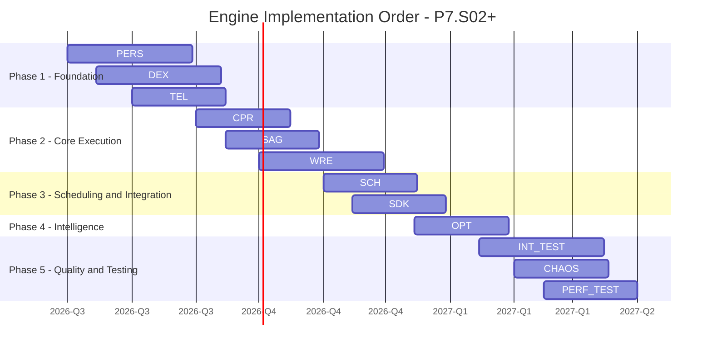

### 20.2 Implementation Phases Detail

| Phase                  | Order | Component         | Dependencies        | Duration | Key Deliverable                                         |
| ---------------------- | ----- | ----------------- | ------------------- | -------- | ------------------------------------------------------- |
| **1 - Foundation**     | 1     | PERS (SMOS-711)   | None                | 60 days  | Storage abstraction, 3-tier archiving, retention engine |
|                        | 2     | DEX (SMOS-712)    | None                | 60 days  | Lock manager, leader election, gossip protocol          |
|                        | 3     | TEL (SMOS-715)    | None                | 45 days  | Metrics pipeline, trace export, log aggregation         |
| **2 - Core Execution** | 4     | CPR (SMOS-713)    | PERS                | 45 days  | Checkpoint engine, recovery orchestration, replay       |
|                        | 5     | SAG (SMOS-714)    | PERS, WRE           | 45 days  | Saga coordinator, compensation engine, registry         |
|                        | 6     | WRE (SMOS-710)    | PERS, CPR, SAG, DEX | 60 days  | Step execution, state machine, error handling           |
| **3 - Scheduling**     | 7     | SCH (SMOS-709)    | WRE                 | 45 days  | Queue management, priority, dispatching                 |
|                        | 8     | SDK (SMOS-717)    | ALL above           | 45 days  | Client libraries, API wrappers, auth                    |
| **4 - Intelligence**   | 9     | OPT (SMOS-716)    | TEL, SCH, WRE, PERS | 45 days  | Adaptive tuning, SLA management, cost optimization      |
| **5 - Quality**        | 10    | Integration Tests | ALL                 | 60 days  | Cross-component E2E tests                               |
|                        | 11    | Chaos Tests       | ALL                 | 45 days  | Fault injection, resilience validation                  |
|                        | 12    | Performance Tests | ALL                 | 45 days  | Load testing, bottleneck analysis                       |

### 20.3 Critical Path

The critical path through the engine implementation is:

**PERS to CPR to WRE to SCH to SDK to Integration Tests**

Any delay in PERS will cascade through the entire critical path.

---

## 21. Overall SMOS Maturity Assessment

### 21.1 Maturity by Architecture Domain

| Domain                        | Current Level                | Target Level        | Assessment                                               |
| ----------------------------- | ---------------------------- | ------------------- | -------------------------------------------------------- |
| Documentation Architecture    | L4 - Integrated              | L5 - Adaptive       | Complete, consistent, cross-referenced                   |
| Knowledge Architecture        | L4 - Integrated              | L5 - Adaptive       | 26+ documents, all families complete                     |
| Agent Architecture            | L4 - Integrated              | L5 - Adaptive       | 15 documents with full specification                     |
| Prompt Library                | L4 - Integrated              | L5 - Adaptive       | 117 prompts across all families                          |
| Automation Architecture       | L3 - Structured              | L4 - Integrated     | Core patterns defined                                    |
| Deployment Strategy           | L3 - Structured              | L4 - Integrated     | Strategy defined                                         |
| Runtime Architecture (P7.S01) | L3 - Structured              | L4 - Integrated     | All runtime aspects defined                              |
| **Runtime Engine (P7.S02)**   | **L3 - Structured**          | **L4 - Integrated** | **9 engine components defined, 8 detailed + 1 outlined** |
| Overall SMOS                  | L3.5 - Structured/Integrated | L4 - Integrated     | All architecture domains covered                         |

### 21.2 Maturity by Engine Component

| Component   | Functional | Resilience | Scalability | Security | Monitoring | Multi-tenant |
| ----------- | ---------- | ---------- | ----------- | -------- | ---------- | ------------ |
| SCH (709)   | ML-03      | ML-02      | ML-03       | ML-03    | ML-03      | ML-03        |
| WRE (710)   | ML-03      | ML-03      | ML-03       | ML-03    | ML-03      | ML-02        |
| PERS (711)  | ML-03      | ML-03      | ML-03       | ML-03    | ML-03      | ML-03        |
| DEX (712)   | ML-03      | ML-03      | ML-03       | ML-03    | ML-02      | ML-02        |
| CPR (713)   | ML-03      | ML-03      | ML-02       | ML-03    | ML-03      | ML-02        |
| SAG (714)   | ML-03      | ML-03      | ML-02       | ML-03    | ML-02      | ML-02        |
| TEL (715)   | ML-03      | ML-02      | ML-02       | ML-02    | ML-02      | ML-02        |
| OPT (716)   | ML-01      | ML-01      | ML-01       | ML-01    | ML-01      | ML-01        |
| SDK (717)   | ML-03      | ML-02      | ML-02       | ML-02    | ML-02      | ML-02        |
| Integration | ML-03      | ML-02      | ML-02       | ML-03    | ML-02      | ML-02        |

**Overall Engine Maturity: ML-02.5+** - Consistently defined with structured architecture across all components. Integration model is complete (ML-03) but resilience, multi-tenancy, and OPT need P7.S03+.

### 21.3 Maturity Level Descriptors

| Level | Name       | Characteristics                             |
| ----- | ---------- | ------------------------------------------- |
| L1    | Initial    | Ad-hoc, inconsistent, no standards          |
| L2    | Repeatable | Basic patterns, some standards              |
| L3    | Structured | Defined architecture, consistent standards  |
| L4    | Integrated | Cross-domain integration, full traceability |
| L5    | Adaptive   | Self-optimizing, automated governance       |

---

## 22. Recommendations for P7.S03+

### 22.1 Immediate (P7.S03 - Runtime Scaling and Multi-Tenancy)

1. **Complete SMOS-716 (Runtime Optimizer)**: Full document with 30+ sections, 5+ schemas, adaptive tuning algorithms
2. **Define cross-component SLA chaining**: How SLAs from SCH to WRE to PERS compose into end-to-end SLAs
3. **Design circuit breaker patterns**: Per-component and cross-component circuit breakers with fallback strategies
4. **Define cross-component caching strategy**: Shared cache for frequently accessed states across components
5. **Design predictive auto-scaling model**: ML-based scaling prediction using Telemetry historical data
6. **Review KNW-306 (Platform Quality)**: Update to reference engine component quality metrics
7. **Review AI-014 (Orchestrator)**: Update to reference SMOS-709..718 engine integration contracts
8. **Consider KNW-601 (Engine Knowledge Foundation)**: Formal modeling of engine execution knowledge

### 22.2 Medium-Term (P7.S04 - Runtime Lifecycle and Evolution)

9. **Engine version lifecycle management**: Versioning, deprecation, migration strategies for all 9 components
10. **Hot-swap capability**: Zero-downtime component upgrade specification
11. **Multi-region deployment model**: Active-active, active-passive, DR strategies for engine components
12. **Engine cost allocation model**: Per-tenant, per-workflow, per-component cost attribution
13. **Engine compliance reporting framework**: Automated compliance verification against GOV-\* standards

### 22.3 Long-Term (P7.S05 - Runtime Testing Architecture)

14. **Integration testing architecture**: Cross-component E2E test framework
15. **Chaos engineering framework**: Fault injection, latency injection, partition simulation
16. **Performance testing architecture**: Load testing, stress testing, endurance testing
17. **Engine simulation mode**: Full engine simulation without external dependencies for testing
18. **Automated SLA compliance validation**: Continuous SLA monitoring and reporting

### 22.4 Architecture Evolution Roadmap

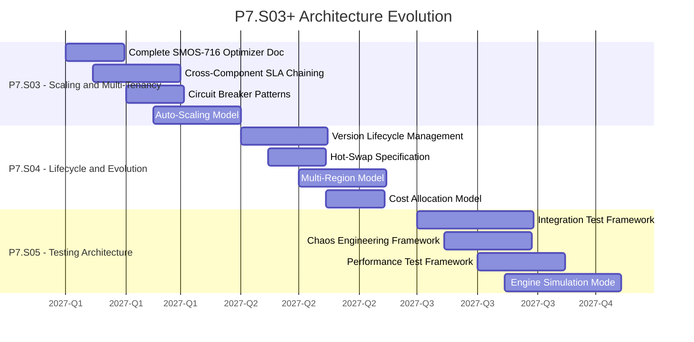

---

## 23. Document Summary

| Metric                  | Value                                                           |
| ----------------------- | --------------------------------------------------------------- |
| Document ID             | SMOS-718                                                        |
| Sections                | 24                                                              |
| Mermaid Diagrams        | 20+                                                             |
| JSON Schemas (Draft-07) | 12+ (44 in Schema Registry)                                     |
| API Endpoints Cataloged | 76 across 9 components                                          |
| Events Cataloged        | 66 across 9 components                                          |
| Metrics Defined         | 56 across 9 components                                          |
| Cross-References        | SMOS-701..717, AI-001..014, KNW-_, AUT-_, PRM-_, GOV-_, CON-000 |
| Agent Mappings          | 14 AI agents mapped to 8 engine components                      |
| Workflow Mappings       | 12 workflow types mapped to 8 engine components                 |
| Implementation Phases   | 5 phases, 12 steps                                              |
| Gaps Identified         | 13 remaining gaps                                               |
| Maturity Level          | ML-02.5+ (Engine), L3.5 (Overall SMOS)                          |

**SMOS-718 is the SSOT (Single Source of Truth) for the integrated SMOS Runtime Engine. It supersedes SMOS-708 for engine-level integration details and unifies all nine engine components (SMOS-709..717) into one cohesive architecture.**

---

## 24. Version History

| Version     | Date       | Author                 | Changes                                                                                                          |
| ----------- | ---------- | ---------------------- | ---------------------------------------------------------------------------------------------------------------- |
| 1.0.0-draft | 2026-07-01 | SMOS Architecture Team | Initial draft - 24 sections, 20+ diagrams, 44 schemas in registry, 76 API endpoints, complete P7.S02 integration |

---

> **End of SMOS-718 - Runtime Master Blueprint**
> **End of Phase P7.S02 - Runtime Quality and Resilience**
>
> This document serves as the Single Source of Truth for the integrated SMOS Runtime Engine. All nine engine components (SMOS-709..717) are unified through this master blueprint. All implementation, testing, and evolution of the engine must reference this document.
