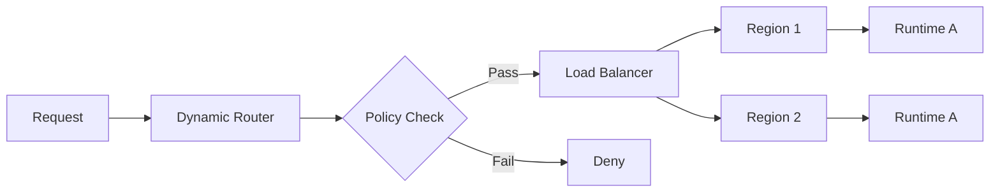
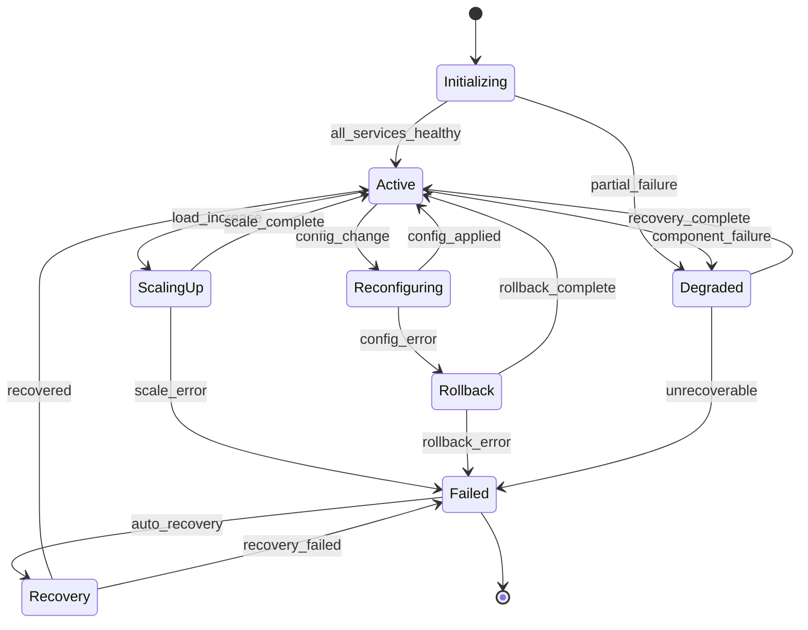

# SMOS-719 — Enterprise Control Plane Architecture

## 1. Document Control

| Field          | Value                                   |
| -------------- | --------------------------------------- |
| Document ID    | SMOS-719                                |
| Document Name  | Enterprise Control Plane Architecture   |
| Phase          | P7.S03                                  |
| Version        | 1.0.0-draft                             |
| Status         | Draft                                   |
| Classification | Enterprise Architecture — Control Plane |
| Owner          | Xennic                                  |
| Created        | 2026-07-01                              |
| Supersedes     | —                                       |

## 2. Purpose & Scope

This document defines the **Enterprise Control Plane** — the centralized governance and orchestration layer that supervises all SMOS runtimes, agents, workflows, knowledge pipelines, infrastructure, and policies.

**Key responsibilities:**

- Global orchestration of all platform components
- Policy definition, decision, and enforcement
- Resource management and capacity planning
- Configuration and feature flag management
- Multi-region coordination and failover
- SLA management and governance
- Centralized audit and security

**The Control Plane supervises — it does not replace — the existing Runtime Engine (SMOS-709..718).**

## 3. Architecture Overview

```mermaid
graph TB
    subgraph "Enterprise Control Plane"
        direction TB
        CP[Control Plane API Gateway]

        subgraph "Orchestration Layer"
            GO[Global Orchestrator]
            ESM[Enterprise Scheduler Manager]
            DR[Dynamic Router]
        end

        subgraph "Registry Layer"
            WR[Workflow Registry]
            RR[Runtime Registry]
            AR[Agent Registry]
            SR[Service Registry]
        end

        subgraph "Policy Layer"
            PDP[Policy Decision Point]
            PEP[Policy Enforcement Point]
            PE[Policy Engine]
        end

        subgraph "Resource Layer"
            RM[Resource Manager]
            CPN[Capacity Planner]
            GQM[Global Queue Manager]
            TRI[Tenant Resource Isolation]
        end

        subgraph "Governance Layer"
            SLA[SLA Manager]
            CG[Cost Governance]
            RG[Runtime Governance]
            GAC[Global Audit Controller]
        end

        subgraph "Infrastructure Layer"
            GHM[Global Health Manager]
            EFC[Enterprise Failover Controller]
            MR[Multi-Region Coordinator]
            SD[Service Discovery]
        end

        subgraph "Config Layer"
            CM[Configuration Manager]
            FM[Feature Flag Manager]
        end
    end

    CP --> GO
    CP --> PDP
    CP --> RM
    CP --> CM

    GO --> ESM
    GO --> DR
    GO --> WR
    GO --> RR
    GO --> AR

    PDP --> PE
    PE --> PEP

    RM --> CPN
    RM --> GQM
    RM --> TRI

    SLA --> CG
    SLA --> RG

    GHM --> EFC
    GHM --> MR

    MR --> GAC
    RG --> GAC
    CG --> GAC

    subgraph "Existing Runtime Engine (SMOS-709..718)"
        SCH[SMOS-709 Scheduler]
        WFE[SMOS-710 Workflow Engine]
        PERS[SMOS-711 Persistence]
        DIST[SMOS-712 Distributed Exec]
        CHK[SMOS-713 Checkpoint]
        SAGA[SMOS-714 Saga]
        TEL[SMOS-715 Telemetry]
        OPT[SMOS-716 Optimizer]
        SDK[SMOS-717 SDK]
    end

    PEP --> SCH
    PEP --> WFE
    PEP --> PERS
    PEP --> DIST
    PEP --> CHK
    PEP --> SAGA

    TEL --> GHM
    TEL --> RM

    style CP fill:#2c3e50,color:#fff
    style GO fill:#2980b9,color:#fff
    style PDP fill:#e74c3c,color:#fff
    style PEP fill:#c0392b,color:#fff
    style RM fill:#27ae60,color:#fff
    style CM fill:#8e44ad,color:#fff
    style GHM fill:#f39c12,color:#fff
    style GAC fill:#7f8c8d,color:#fff
```



## 4. Design Principles

| #      | Principle                                   | Description                                                     |
| ------ | ------------------------------------------- | --------------------------------------------------------------- |
| CPP-01 | Supervision over Substitution               | Control Plane supervises, never replaces runtime execution      |
| CPP-02 | Centralized Policy, Distributed Enforcement | Policy defined centrally, enforced at edge                      |
| CPP-03 | Observable by Default                       | All control plane decisions are auditable                       |
| CPP-04 | Tenant Isolation                            | Every tenant operates in isolated control boundaries            |
| CPP-05 | Fail-Safe                                   | Control Plane failure degrades gracefully without data loss     |
| CPP-06 | Eventually Consistent                       | Control Plane does not require real-time synchronization        |
| CPP-07 | API-First                                   | All capabilities exposed through versioned APIs                 |
| CPP-08 | Policy as Code                              | All policies are machine-readable and versioned                 |
| CPP-09 | Cost-Aware                                  | Every control decision considers resource cost                  |
| CPP-10 | Self-Healing                                | Control Plane detects and recovers from anomalies automatically |

## 5. Global Orchestrator

The Global Orchestrator (detailed in SMOS-720) is the central coordination component:

| Capability                 | Description                                  |
| -------------------------- | -------------------------------------------- |
| Workflow Orchestration     | Coordinates cross-runtime workflow execution |
| Agent Orchestration        | Coordinates multi-agent collaboration        |
| Cross-Region Orchestration | Manages workflows spanning multiple regions  |
| Scheduler Delegation       | Delegates scheduling to ESM                  |
| Queue Management           | Manages global execution queues              |

## 6. Execution Control Plane

The Execution Control Plane supervises the Runtime Engine:

```
Control Plane                    Runtime Engine
─────────────                    ─────────────
Policy Decision                  → Scheduler (enforces policy)
Resource Quota                   → Workflow Engine (resource limits)
Feature Flags                    → All runtimes (dynamic config)
Health Monitoring ← Telemetry    ← All runtimes (metrics)
Failover Control                 → All runtimes (redirect)
Audit Collection ← Audit Events ← All runtimes
```

## 7. Enterprise Scheduler Manager

The ESM manages global scheduling across all runtime instances:

| Function                   | Description                              |
| -------------------------- | ---------------------------------------- |
| Global Priority Management | Multi-tenant priority queues             |
| Deadline Management        | SLA-aware scheduling                     |
| Resource-Aware Scheduling  | Schedules based on resource availability |
| Cross-Region Scheduling    | Routes work to optimal region            |

## 8. Workflow Registry

Central registry of all workflow definitions:

```json
{
  "$schema": "http://json-schema.org/draft-07/schema#",
  "title": "WorkflowRegistryEntry",
  "type": "object",
  "required": ["workflow_id", "name", "version", "definition", "status"],
  "properties": {
    "workflow_id": { "type": "string", "pattern": "^WKF-[A-Z0-9]{6}$" },
    "name": { "type": "string" },
    "version": { "type": "string", "pattern": "^\\d+\\.\\d+\\.\\d+$" },
    "definition": { "type": "object" },
    "status": { "type": "string", "enum": ["active", "deprecated", "archived"] },
    "tenant_id": { "type": "string" },
    "created_at": { "type": "string", "format": "date-time" },
    "compatibility": { "type": "array", "items": { "type": "string" } }
  }
}
```

## 9. Runtime Registry

Central registry of all runtime instances:

```json
{
  "$schema": "http://json-schema.org/draft-07/schema#",
  "title": "RuntimeRegistryEntry",
  "type": "object",
  "required": ["runtime_id", "runtime_type", "version", "status", "region"],
  "properties": {
    "runtime_id": { "type": "string" },
    "runtime_type": {
      "type": "string",
      "enum": [
        "scheduler",
        "workflow_engine",
        "persistence",
        "distributed",
        "checkpoint",
        "saga",
        "telemetry",
        "optimizer"
      ]
    },
    "version": { "type": "string" },
    "status": { "type": "string", "enum": ["active", "draining", "inactive", "failed"] },
    "region": { "type": "string" },
    "capacity": { "type": "object" },
    "health": { "type": "object" },
    "tenant_ids": { "type": "array", "items": { "type": "string" } }
  }
}
```

## 10. Agent Registry Manager

```json
{
  "$schema": "http://json-schema.org/draft-07/schema#",
  "title": "AgentRegistryEntry",
  "type": "object",
  "required": ["agent_id", "name", "capabilities", "status"],
  "properties": {
    "agent_id": { "type": "string", "pattern": "^AI-[0-9]{3}$" },
    "name": { "type": "string" },
    "capabilities": { "type": "array", "items": { "type": "string" } },
    "status": { "type": "string", "enum": ["available", "busy", "degraded", "offline"] },
    "current_load": { "type": "number" },
    "region": { "type": "string" },
    "version": { "type": "string" }
  }
}
```

## 11. Policy Engine

The Policy Engine (detailed in SMOS-721) consists of:

| Component                      | Role                                     |
| ------------------------------ | ---------------------------------------- |
| Policy Decision Point (PDP)    | Evaluates policies and makes decisions   |
| Policy Enforcement Point (PEP) | Enforces decisions at runtime boundaries |
| Policy Repository              | Stores all policy definitions            |
| Policy Auditor                 | Logs all policy decisions for audit      |

## 12. Resource Manager

The Resource Manager (detailed in SMOS-722) manages:

| Resource  | Scope                               |
| --------- | ----------------------------------- |
| Compute   | CPU allocation per runtime/tenant   |
| Memory    | RAM allocation per runtime/tenant   |
| Storage   | Disk allocation for persistence     |
| Tokens    | LLM token quotas per agent/tenant   |
| Agents    | Concurrent agent invocation limits  |
| Knowledge | Knowledge store capacity per tenant |

## 13. Global Queue Manager

Manages cross-tenant, cross-region execution queues:

| Feature             | Description                          |
| ------------------- | ------------------------------------ |
| Multi-Tenant Queues | Separate queues per tenant           |
| Priority Queuing    | Priority-based dequeuing             |
| Dead Letter Queue   | Failed executions for review         |
| Queue Metrics       | Depth, latency, throughput per queue |

## 14. Distributed Coordination Layer

Provides consensus and coordination across the Control Plane:

| Capability                | Mechanism                        |
| ------------------------- | -------------------------------- |
| Leader Election           | Raft consensus                   |
| Distributed Locking       | Lock tables with TTL             |
| Cluster Membership        | Gossip protocol                  |
| Configuration Convergence | Eventually consistent state sync |

## 15. Service Discovery

All runtime components register themselves:

```
Component → Service Registry → Health Checks → Load Balancer
                                    ↓
                              Deregister on Failure
```

## 16. Feature Flag Framework

```json
{
  "$schema": "http://json-schema.org/draft-07/schema#",
  "title": "FeatureFlag",
  "type": "object",
  "required": ["flag_id", "name", "enabled", "owner"],
  "properties": {
    "flag_id": { "type": "string" },
    "name": { "type": "string" },
    "enabled": { "type": "boolean" },
    "owner": { "type": "string" },
    "targeting": {
      "type": "object",
      "properties": {
        "tenants": { "type": "array", "items": { "type": "string" } },
        "regions": { "type": "array", "items": { "type": "string" } },
        "percentage": { "type": "number", "minimum": 0, "maximum": 100 }
      }
    },
    "rollout_stage": { "type": "string", "enum": ["dev", "canary", "beta", "ga", "deprecated"] },
    "created_at": { "type": "string", "format": "date-time" }
  }
}
```

## 17. Configuration Management

Config hierarchy: Global → Region → Tenant → Workspace → Runtime

| Feature             | Description                                 |
| ------------------- | ------------------------------------------- |
| Hierarchical Config | Override at any level                       |
| Versioned Config    | All changes tracked with rollback           |
| Hot Reload          | Configuration changes apply without restart |
| Secret Management   | Encrypted secrets with rotation             |

## 18. Dynamic Routing

Routes requests based on policy, load, and region:



## 19. Global Health Manager

Monitors health of all control plane and runtime components:

| Health Check      | Interval | Action on Failure      |
| ----------------- | -------- | ---------------------- |
| Control Plane API | 5s       | Failover to standby    |
| Scheduler         | 10s      | Re-route to peer       |
| Workflow Engine   | 10s      | Pause, retry, redirect |
| Persistence       | 15s      | Read-only mode         |
| All Runtimes      | 30s      | Deregister, alert      |

## 20. Enterprise Failover Controller

| Scenario                   | Action                       | RTO  | RPO  |
| -------------------------- | ---------------------------- | ---- | ---- |
| Region Failure             | Route to standby region      | <5m  | <1m  |
| Control Plane Failure      | Standby takes over           | <1m  | <30s |
| Runtime Instance Failure   | Redirect to healthy instance | <30s | <5s  |
| Persistent Storage Failure | Failover to replica          | <2m  | <10s |

## 21. Runtime Governance

Governs the lifecycle of all runtime components:

| Phase        | Governance Action                            |
| ------------ | -------------------------------------------- |
| Registration | Validate capability, assign tenant scope     |
| Active       | Monitor health, enforce SLA, collect metrics |
| Degraded     | Alert, reduce load, prepare failover         |
| Draining     | Stop new work, complete in-flight            |
| Inactive     | Deregister, archive logs, release resources  |

## 22. Cost Governance

| Mechanism         | Description                                 |
| ----------------- | ------------------------------------------- |
| Budget Allocation | Per-tenant, per-runtime budget caps         |
| Cost Tracking     | Real-time cost attribution                  |
| Budget Alerts     | Warning at 80%, critical at 100%            |
| Auto-Spend Limit  | Hard cap stops execution on budget exceeded |
| Cost Reporting    | Daily/weekly/monthly cost reports           |

## 23. SLA Manager

| SLA Dimension | Target                      | Measurement               |
| ------------- | --------------------------- | ------------------------- |
| Availability  | 99.9% uptime                | Monthly uptime percentage |
| Latency p50   | <500ms                      | All execution requests    |
| Latency p99   | <5s                         | All execution requests    |
| Throughput    | >1000 executions/s          | Peak capacity             |
| Recovery Time | RTO <5m for region failover | Time to restore           |

## 24. Tenant Resource Isolation

| Isolation Level    | Description                         | Use Case           |
| ------------------ | ----------------------------------- | ------------------ |
| Soft Isolation     | Shared resources, per-tenant quotas | Standard tenants   |
| Hard Isolation     | Dedicated runtime per tenant        | Enterprise tenants |
| Physical Isolation | Dedicated infrastructure            | Regulated tenants  |
| Hybrid Isolation   | Mixed model based on policy         | Mixed workloads    |

## 25. Global Audit Controller

Centralized audit across all platform components:

```json
{
  "$schema": "http://json-schema.org/draft-07/schema#",
  "title": "AuditRecord",
  "type": "object",
  "required": ["audit_id", "timestamp", "actor", "action", "resource", "result"],
  "properties": {
    "audit_id": { "type": "string" },
    "timestamp": { "type": "string", "format": "date-time" },
    "actor": { "type": "object", "properties": { "id": {}, "type": {} } },
    "action": { "type": "string" },
    "resource": { "type": "object", "properties": { "type": {}, "id": {} } },
    "result": { "type": "string", "enum": ["allow", "deny", "error"] },
    "policy_id": { "type": "string" },
    "tenant_id": { "type": "string" },
    "correlation_id": { "type": "string" }
  }
}
```

## 26. Control Plane State Machine



## 27. Cross-Reference Matrix

| Document      | Relationship                                                  |
| ------------- | ------------------------------------------------------------- |
| SMOS-701..708 | Execution architecture — control plane governs these          |
| SMOS-709..718 | Runtime engine — control plane supervises all engines         |
| SMOS-720      | Global Orchestrator — core component of control plane         |
| SMOS-721      | Policy Engine — PDP and PEP design                            |
| SMOS-722      | Resource Management — resource allocation                     |
| SMOS-723      | Config & Feature Management                                   |
| SMOS-724      | Multi-Region Coordination                                     |
| SMOS-725      | Governance & SLA                                              |
| SMOS-726      | Control APIs                                                  |
| SMOS-727      | Control Plane Security                                        |
| SMOS-728      | Control Blueprint (integration)                               |
| AI-000        | Agent architecture — agents registered in registry            |
| AI-014        | Enterprise Orchestrator — integrated with Global Orchestrator |
| KNW-\*        | Knowledge architecture — governance applies to knowledge      |
| AUT-\*        | Automation — workflows registered in registry                 |
| DEPLOY-001    | Deployment — control plane deployed per strategy              |
| GOV-\*        | Governance — control plane implements governance              |

---

**End of SMOS-719**
