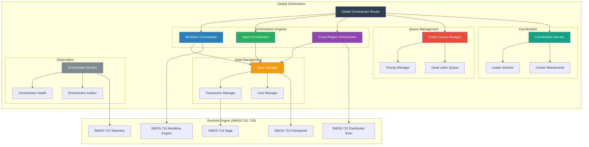
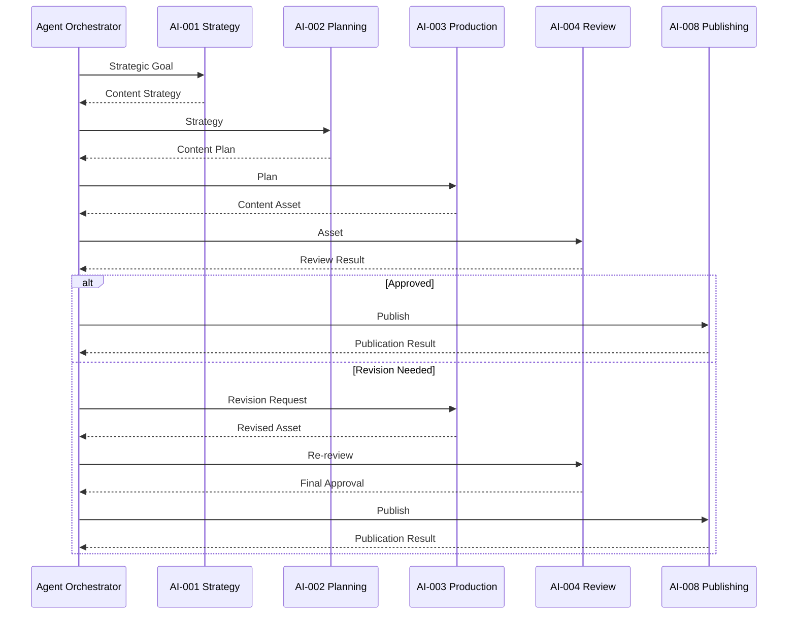
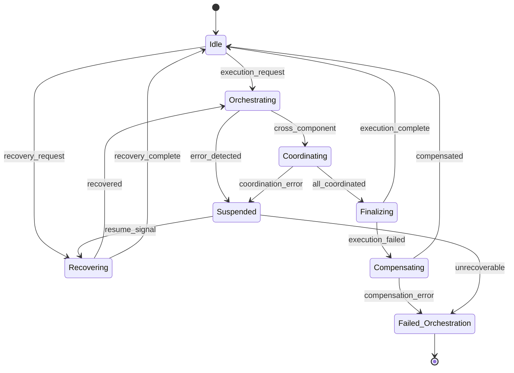
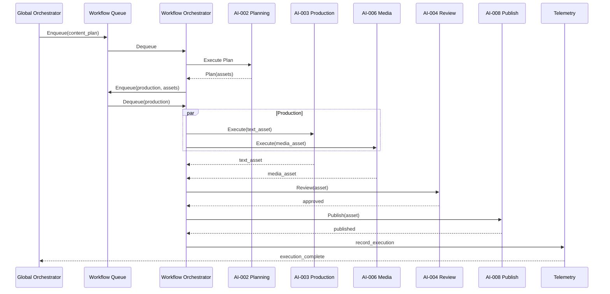

# SMOS-720 — Global Orchestrator

## 1. Document Control

| Field          | Value                                   |
| -------------- | --------------------------------------- |
| Document ID    | SMOS-720                                |
| Document Name  | Global Orchestrator                     |
| Phase          | P7.S03                                  |
| Version        | 1.0.0-draft                             |
| Status         | Draft                                   |
| Classification | Enterprise Architecture — Control Plane |
| Owner          | Xennic                                  |
| Created        | 2026-07-01                              |
| Supersedes     | —                                       |

## 2. Purpose & Scope

The **Global Orchestrator** is the central coordination engine of the SMOS Control Plane. It manages cross-component, cross-region, and cross-tenant orchestration, ensuring that every execution, agent interaction, workflow, and policy decision is coordinated, monitored, and governed.

**Scope:** Workflow orchestration, agent orchestration, cross-region coordination, queue management, state management, and execution supervision.

## 3. Orchestrator Architecture



## 4. Workflow Orchestrator

Manages cross-runtime workflow execution runs:

| Responsibility              | Description                                         |
| --------------------------- | --------------------------------------------------- |
| Global Workflow Execution   | Orchestrates workflow runs across runtime instances |
| Workflow Version Management | Routes to correct workflow version                  |
| Workflow State Coordination | Synchronizes state across workflow steps            |
| Workflow Event Handling     | Responds to workflow lifecycle events               |
| Workflow Error Management   | Coordinates error recovery and compensation         |

## 5. Agent Orchestrator

Coordinates multi-agent collaboration:



## 6. Cross-Region Orchestrator

Coordinates execution across multiple geographic regions:

| Capability            | Description                                 |
| --------------------- | ------------------------------------------- |
| Regional Routing      | Routes workflow execution to optimal region |
| State Synchronization | Syncs workflow state across regions         |
| Cross-Region Saga     | Coordinates distributed saga across regions |
| Region Affinity       | Keeps workflows within preferred region     |
| Region Failover       | Transfers execution on region failure       |

## 7. Global Queue Manager

```json
{
  "$schema": "http://json-schema.org/draft-07/schema#",
  "title": "GlobalQueue",
  "type": "object",
  "required": ["queue_id", "name", "queue_type", "tenants"],
  "properties": {
    "queue_id": { "type": "string" },
    "name": { "type": "string" },
    "queue_type": {
      "type": "string",
      "enum": ["workflow", "agent", "event", "compensation", "audit"]
    },
    "tenants": { "type": "array", "items": { "type": "string" } },
    "priorities": { "type": "array", "items": { "type": "integer" } },
    "max_depth": { "type": "integer" },
    "dead_letter_target": { "type": "string" },
    "scheduling": {
      "type": "object",
      "properties": {
        "strategy": { "type": "string", "enum": ["fifo", "priority", "weighted", "deadline"] },
        "weight": { "type": "number" }
      }
    }
  }
}
```

## 8. Orchestrator State Machine



## 9. Discovery & Registration

All orchestration targets register with the Global Orchestrator:

```json
{
  "$schema": "http://json-schema.org/draft-07/schema#",
  "title": "OrchestrationTarget",
  "type": "object",
  "required": ["target_id", "type", "capabilities", "region", "status"],
  "properties": {
    "target_id": { "type": "string" },
    "type": { "type": "string", "enum": ["runtime", "agent", "workflow", "region"] },
    "capabilities": { "type": "array", "items": { "type": "string" } },
    "region": { "type": "string" },
    "status": { "type": "string", "enum": ["active", "draining", "paused", "offline"] },
    "load": { "type": "number", "minimum": 0, "maximum": 1 },
    "tenants": { "type": "array", "items": { "type": "string" } },
    "last_heartbeat": { "type": "string", "format": "date-time" },
    "metadata": { "type": "object" }
  }
}
```

## 10. Orchestration Policies

| Policy | Scope     | Description                              |
| ------ | --------- | ---------------------------------------- |
| ORP-01 | Routing   | Route to least-loaded runtime            |
| ORP-02 | Affinity  | Keep sequential steps in same region     |
| ORP-03 | Retry     | Automatic retry with exponential backoff |
| ORP-04 | Timeout   | SLA-based execution deadlines            |
| ORP-05 | Fallback  | Fallback to secondary region on failure  |
| ORP-06 | Quota     | Per-tenant orchestration quotas          |
| ORP-07 | Isolation | Isolate tenant workflows                 |
| ORP-08 | Audit     | Audit all orchestration decisions        |

## 11. Flow: Content Plan → Publish



## 12. Dead Letter Queue Management

| Trigger              | Action      | Escalation               |
| -------------------- | ----------- | ------------------------ |
| Max retries exceeded | Move to DLQ | Alert orchestrator admin |
| Invalid payload      | Move to DLQ | Log, notify source       |
| Unhandled error      | Move to DLQ | Create incident          |
| Policy violation     | Move to DLQ | Notify governance        |
| Timeout              | Move to DLQ | Schedule retry           |

## 13. Orchestrator Metrics

| Metric                      | Description                  | Unit  |
| --------------------------- | ---------------------------- | ----- |
| orchestrations_per_second   | Throughput                   | ops/s |
| orchestration_duration      | Execution time               | ms    |
| queue_depth                 | Current queue depth          | items |
| queue_latency               | Average enqueue→dequeue time | ms    |
| failed_orchestrations       | Total failures               | count |
| compensation_executions     | Compensation runs            | count |
| cross_region_orchestrations | Cross-region count           | count |
| active_workflows            | Currently active             | count |
| registered_targets          | Total targets                | count |

## 14. Orchestrator Events

```json
{
  "$schema": "http://json-schema.org/draft-07/schema#",
  "title": "OrchestratorEvent",
  "type": "object",
  "required": ["event_id", "event_type", "timestamp", "source", "data"],
  "properties": {
    "event_id": { "type": "string" },
    "event_type": {
      "type": "string",
      "enum": [
        "orchestration_started",
        "orchestration_completed",
        "orchestration_failed",
        "orchestration_compensated",
        "target_registered",
        "target_deregistered",
        "queue_depth_exceeded",
        "dead_letter_created",
        "cross_region_triggered",
        "cross_region_completed"
      ]
    },
    "timestamp": { "type": "string", "format": "date-time" },
    "source": { "type": "string" },
    "data": { "type": "object" },
    "correlation_id": { "type": "string" }
  }
}
```

## 15. Cross-Reference Matrix

| Document | Relationship                                                                |
| -------- | --------------------------------------------------------------------------- |
| SMOS-704 | Workflow orchestration — Global Orchestrator extends to cross-runtime scope |
| SMOS-705 | Event architecture — orchestrator emits and consumes events                 |
| SMOS-710 | Workflow Engine — orchestrator coordinates engine instances                 |
| SMOS-712 | Distributed Execution — orchestrator provides cross-region coordination     |
| SMOS-714 | Saga compensation — orchestrator orchestrates compensation flows            |
| SMOS-715 | Telemetry — orchestrator reports metrics                                    |
| SMOS-719 | Control Plane — orchestrator is the core component                          |
| AI-014   | Enterprise Orchestrator — integrated for agent orchestration                |
| AUT-\*   | Automation — workflows registered and orchestrated                          |

---

**End of SMOS-720**
