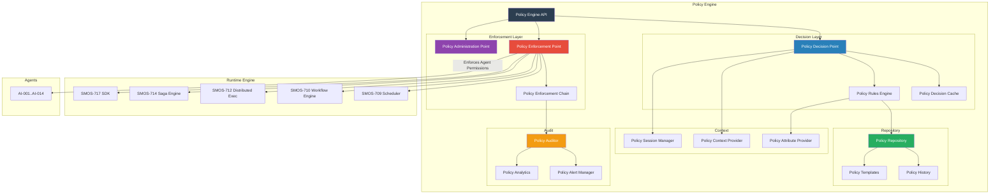
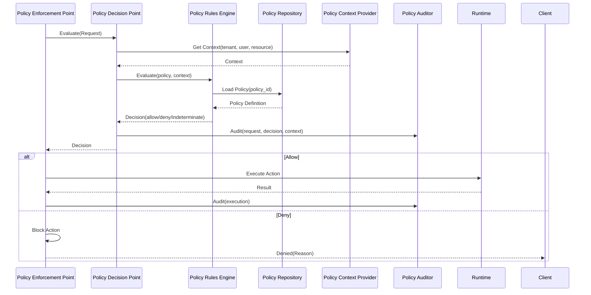
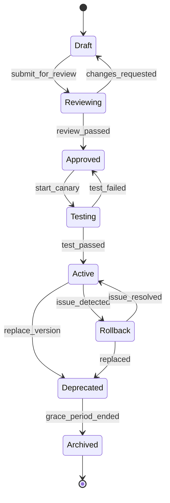

# SMOS-721 — Enterprise Policy Engine

## 1. Document Control

| Field          | Value                                   |
| -------------- | --------------------------------------- |
| Document ID    | SMOS-721                                |
| Document Name  | Enterprise Policy Engine (PDP + PEP)    |
| Phase          | P7.S03                                  |
| Version        | 1.0.0-draft                             |
| Status         | Draft                                   |
| Classification | Enterprise Architecture — Control Plane |
| Owner          | Xennic                                  |
| Created        | 2026-07-01                              |
| Supersedes     | —                                       |

## 2. Purpose & Scope

The **Enterprise Policy Engine** defines the centralized policy decision and enforcement architecture for the SMOS Control Plane. It consists of the **Policy Decision Point (PDP)** which evaluates policies and makes decisions, and the **Policy Enforcement Point (PEP)** which enforces those decisions at runtime boundaries.

All runtime components, agents, workflows, knowledge pipelines, and infrastructure are governed by this engine.

## 3. Policy Engine Architecture



## 4. Policy Decision Point (PDP)



## 5. Policy Rules Engine

Evaluates policies against provided context:

| Function  | Description                               |
| --------- | ----------------------------------------- |
| Match     | Evaluate policy condition against context |
| Combine   | Combine multiple policy decisions         |
| Override  | Apply higher-priority policy override     |
| Default   | Apply default rule if no policy matches   |
| Exception | Handle policy evaluation errors           |

## 6. Policy Enforcement Point (PEP)

The PEP is deployed at every boundary point in the system:

| Boundary       | PEP Location                            | Enforces                                     |
| -------------- | --------------------------------------- | -------------------------------------------- |
| API Gateway    | Ingress point                           | Authentication, authorization, rate limiting |
| Runtime Engine | Scheduler, Workflow Engine, Persistence | Execution policies                           |
| Agent          | AI-\* agents                            | Agent permissions, quotas                    |
| Knowledge      | KNW-\* stores                           | Access control, classification               |
| Automation     | AUT-\* workflows                        | Workflow permissions                         |
| Infrastructure | Deployment, scaling                     | Resource policies                            |

## 7. Policy Repository

```json
{
  "$schema": "http://json-schema.org/draft-07/schema#",
  "title": "PolicyDefinition",
  "type": "object",
  "required": ["policy_id", "name", "type", "rules", "effect", "version"],
  "properties": {
    "policy_id": { "type": "string", "pattern": "^POL-[A-Za-z0-9]{8}$" },
    "name": { "type": "string" },
    "type": {
      "type": "string",
      "enum": ["access", "execution", "resource", "governance", "security", "cost"]
    },
    "domain": {
      "type": "string",
      "enum": ["runtime", "agent", "knowledge", "automation", "infrastructure", "global"]
    },
    "rules": {
      "type": "array",
      "items": {
        "type": "object",
        "properties": {
          "rule_id": { "type": "string" },
          "condition": { "type": "string" },
          "effect": { "type": "string", "enum": ["allow", "deny", "audit", "quarantine"] },
          "priority": { "type": "integer" }
        }
      }
    },
    "effect": { "type": "string", "enum": ["allow", "deny", "audit"] },
    "version": { "type": "string" },
    "tenants": { "type": "array", "items": { "type": "string" } },
    "valid_from": { "type": "string", "format": "date-time" },
    "valid_until": { "type": "string", "format": "date-time" },
    "created_at": { "type": "string", "format": "date-time" }
  }
}
```

## 8. Policy Decision Cache

```json
{
  "$schema": "http://json-schema.org/draft-07/schema#",
  "title": "CachedPolicyDecision",
  "type": "object",
  "required": ["cache_key", "decision", "ttl", "timestamp"],
  "properties": {
    "cache_key": { "type": "string" },
    "decision": { "type": "string", "enum": ["allow", "deny", "indeterminate"] },
    "ttl": { "type": "integer", "description": "Time-to-live in seconds" },
    "timestamp": { "type": "string", "format": "date-time" },
    "matched_rules": { "type": "array", "items": { "type": "string" } },
    "obligations": { "type": "array", "items": { "type": "string" } }
  }
}
```

Cache invalidation strategies:
| Strategy | Description |
|----------|-------------|
| TTL-based | Auto-expire after configured duration |
| Event-based | Invalidate on policy change |
| Tenant-scoped | Separate cache per tenant |
| Resource-scoped | Separate cache per resource type |

## 9. Policy Types

| Type           | Code    | Example                                            |
| -------------- | ------- | -------------------------------------------------- |
| Access Control | POL-ACC | "Only agents with A-3 level may access production" |
| Execution      | POL-EXE | "Execution timeout must not exceed 30 minutes"     |
| Resource       | POL-RES | "Per-tenant token quota is 100K/month"             |
| Governance     | POL-GOV | "All publications must pass AI-004 review"         |
| Security       | POL-SEC | "All cross-region traffic must be encrypted"       |
| Cost           | POL-CST | "Maximum LLM cost per workflow is $5"              |
| Data           | POL-DAT | "Personal data must be anonymized in reports"      |

## 10. Policy Evaluation Models

| Model          | Description                | Use Case                |
| -------------- | -------------------------- | ----------------------- |
| First Match    | Return first matching rule | Simple access control   |
| All Match      | Combine all matching rules | Complex governance      |
| Priority Order | Evaluate by priority       | Multi-tier policies     |
| Hierarchical   | Inherit from parent scopes | Tenant hierarchies      |
| Risk-Based     | Evaluate risk score first  | Fraud/anomaly detection |

## 11. Policy Obligations

Actions that must be fulfilled alongside a policy decision:

```json
{
  "$schema": "http://json-schema.org/draft-07/schema#",
  "title": "PolicyObligation",
  "type": "object",
  "required": ["obligation_id", "type", "action"],
  "properties": {
    "obligation_id": { "type": "string" },
    "type": { "type": "string", "enum": ["log", "notify", "approve", "enrich", "transform"] },
    "action": { "type": "string" },
    "target": { "type": "string" },
    "on_fulfill": { "type": "string", "enum": ["proceed", "block", "audit"] },
    "on_fail": { "type": "string", "enum": ["block", "warn", "log"] }
  }
}
```

## 12. Policy Administration Point (PAP)

| Function         | Description                               |
| ---------------- | ----------------------------------------- |
| Policy Creation  | Define new policies with versioning       |
| Policy Update    | Modify existing policies with audit trail |
| Policy Testing   | Dry-run mode for policy validation        |
| Policy Rollout   | Gradual rollout with canary testing       |
| Policy Rollback  | Immediate rollback on detected issues     |
| Policy Lifecycle | Draft → Active → Deprecated → Archived    |

## 13. Policy Lifecycle State Machine



## 14. Policy Engine Metrics

| Metric                  | Description             | Unit  |
| ----------------------- | ----------------------- | ----- |
| policy_evaluations      | Total evaluations       | count |
| policy_evaluation_time  | Average evaluation time | ms    |
| policy_cache_hit_rate   | Cache effectiveness     | %     |
| allow_decisions         | Allowed decisions       | count |
| deny_decisions          | Denied decisions        | count |
| indeterminate_decisions | Error decisions         | count |
| active_policies         | Currently active        | count |
| policy_violations       | Violations detected     | count |

## 15. Policy Engine Events

```json
{
  "$schema": "http://json-schema.org/draft-07/schema#",
  "title": "PolicyEvent",
  "type": "object",
  "required": ["event_id", "event_type", "timestamp", "policy_id", "decision"],
  "properties": {
    "event_id": { "type": "string" },
    "event_type": {
      "type": "string",
      "enum": [
        "policy_evaluated",
        "policy_violation",
        "policy_created",
        "policy_updated",
        "policy_activated",
        "policy_deprecated",
        "policy_archived",
        "cache_invalidated",
        "obligation_failed"
      ]
    },
    "timestamp": { "type": "string", "format": "date-time" },
    "policy_id": { "type": "string" },
    "decision": { "type": "string" },
    "actor": { "type": "string" },
    "context": { "type": "object" },
    "correlation_id": { "type": "string" }
  }
}
```

## 16. Failure Scenarios

| Scenario              | Detection                        | Resolution                                  |
| --------------------- | -------------------------------- | ------------------------------------------- |
| PDP Unavailable       | Timeout on evaluation            | PEP uses cached decision or deny-by-default |
| Policy Not Found      | Missing policy_id                | Use tenant default policy                   |
| Rule Evaluation Error | Rule engine exception            | Log error, return indeterminate             |
| Cache Corruption      | Invalid cache entry              | Clear cache, re-evaluate                    |
| Policy Conflict       | Multiple matching rules          | Use highest priority rule                   |
| Obligation Timeout    | Obligation not fulfilled in time | Block if on_fail=block, else warn           |

## 17. Cross-Reference Matrix

| Document      | Relationship                                                |
| ------------- | ----------------------------------------------------------- |
| SMOS-707      | Runtime security — policy engine enforces security policies |
| SMOS-709..718 | All runtimes have PEP boundaries                            |
| SMOS-719      | Control Plane — policy engine is the governance core        |
| SMOS-722      | Resource management — resource policies enforced by engine  |
| SMOS-725      | SLA governance — SLA policies evaluated by PDP              |
| AI-000        | Agent hierarchy — policy defines agent authorization levels |
| KNW-\*        | Knowledge governance — policies control knowledge access    |
| GOV-\*        | Governance — policy engine implements governance rules      |

---

**End of SMOS-721**
