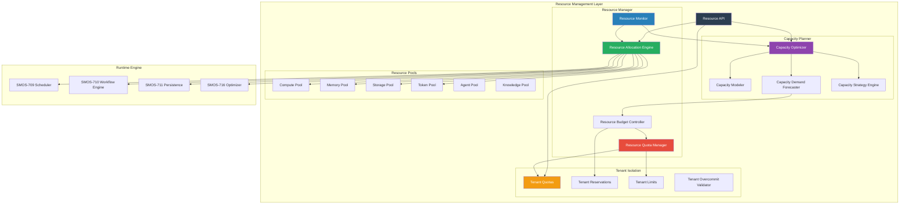
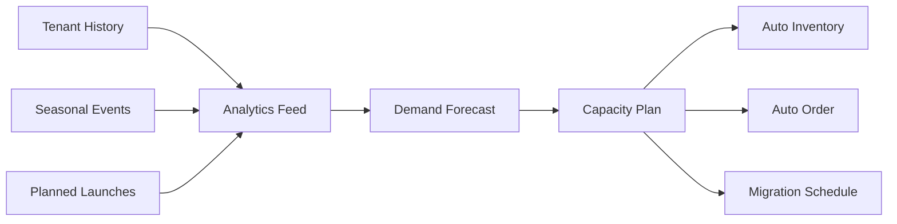

# SMOS-722 — Resource Management & Capacity Planning

## 1. Document Control

| Field          | Value                                   |
| -------------- | --------------------------------------- |
| Document ID    | SMOS-722                                |
| Document Name  | Resource Management & Capacity Planning |
| Phase          | P7.S03                                  |
| Version        | 1.0.0-draft                             |
| Status         | Draft                                   |
| Classification | Enterprise Architecture — Control Plane |
| Owner          | Xennic                                  |
| Created        | 2026-07-01                              |
| Supersedes     | —                                       |

## 2. Purpose & Scope

The **Resource Manager** and **Capacity Planner** are the components responsible for allocating, monitoring, and planning all SMOS platform resources — compute, memory, storage, tokens, agents, knowledge stores, and infrastructure — across tenants, regions, and runtime instances.

## 3. Resource Management Architecture



## 4. Resource Types & Allocation

| Resource        | Type      | Unit                   | Allocation Strategy |
| --------------- | --------- | ---------------------- | ------------------- |
| Compute         | CPU       | cores                  | Weighted fair share |
| Memory          | RAM       | GB                     | Reserved + burst    |
| Storage         | Disk      | GB                     | Provisioned IOPS    |
| Tokens          | LLM       | tokens/month           | Quota-based         |
| Agents          | AI        | concurrent invocations | Pool-based          |
| Knowledge       | Documents | documents/GB           | Storage-based       |
| Network         | Bandwidth | Gbps                   | Rate-limited        |
| Scheduler Slots | Execution | concurrent slots       | Reservation-based   |

## 5. Resource Quota Model

```json
{
  "$schema": "http://json-schema.org/draft-07/schema#",
  "title": "ResourceQuota",
  "type": "object",
  "required": ["tenant_id", "quotas"],
  "properties": {
    "tenant_id": { "type": "string" },
    "quotas": {
      "type": "object",
      "additionalProperties": {
        "type": "object",
        "properties": {
          "hard_limit": { "type": "number" },
          "soft_limit": { "type": "number" },
          "current_usage": { "type": "number" },
          "reserved": { "type": "number" },
          "unit": { "type": "string" },
          "period": {
            "type": "string",
            "enum": ["per_second", "per_minute", "per_hour", "per_day", "per_month"]
          },
          "overcommit_allowed": { "type": "boolean" },
          "overcommit_ratio": { "type": "number" }
        }
      }
    },
    "global_limits": {
      "type": "object",
      "properties": {
        "max_concurrent_executions": { "type": "integer" },
        "max_daily_executions": { "type": "integer" },
        "max_monthly_tokens": { "type": "integer" }
      }
    },
    "version": { "type": "integer" }
  }
}
```

## 6. Resource Pool Model

```json
{
  "$schema": "http://json-schema.org/draft-07/schema#",
  "title": "ResourcePool",
  "type": "object",
  "required": ["pool_id", "resource_type", "total_capacity", "allocated", "available"],
  "properties": {
    "pool_id": { "type": "string" },
    "resource_type": {
      "type": "string",
      "enum": ["compute", "memory", "storage", "tokens", "agents", "knowledge"]
    },
    "region": { "type": "string" },
    "total_capacity": { "type": "number" },
    "allocated": { "type": "number" },
    "available": { "type": "number" },
    "reserved": { "type": "number" },
    "overcommit_ratio": { "type": "number", "default": 1.0 },
    "status": { "type": "string", "enum": ["healthy", "degraded", "critical", "exhausted"] },
    "tenants": { "type": "array", "items": { "type": "string" } },
    "last_updated": { "type": "string", "format": "date-time" }
  }
}
```

## 7. Capacity Planning

### 7.1 Demand Forecasting



### 7.2 Capacity Planning Models

| Model       | Horizon     | Output                | Use Case                |
| ----------- | ----------- | --------------------- | ----------------------- |
| Short-term  | 1-7 days    | Daily demand peaks    | Auto-scaling decisions  |
| Medium-term | 1-4 weeks   | Weekly resource needs | Capacity provisioning   |
| Long-term   | 1-6 months  | Monthly/quarterly     | Infrastructure planning |
| Strategic   | 6-24 months | Annual growth         | Budget and investment   |

### 7.3 Capacity Decision Models

| Decision           | Trigger                      | Action                   |
| ------------------ | ---------------------------- | ------------------------ |
| Scale Up           | Usage > 80% for 10 min       | Add capacity within SLA  |
| Scale Down         | Usage < 30% for 30 min       | Reduce capacity          |
| Pre-emptive Scale  | Forecast predicts peak > 90% | Pre-provision capacity   |
| Regional Rebalance | Cross-region imbalance > 20% | Rebalance across regions |
| Tenant Migration   | Single tenant > 50% of pool  | Move to dedicated pool   |

## 8. Budget Controller

| Component         | Function                                           |
| ----------------- | -------------------------------------------------- |
| Budget Allocation | Allocates budget per tenant per resource           |
| Budget Tracking   | Real-time spend tracking                           |
| Budget Alert      | Warning at 80%, critical at 95%, hard stop at 100% |
| Budget Rollover   | Unused budget (if policy allows)                   |
| Budget Adjustment | Policy-based budget increases                      |

## 9. Tenant Resource Isolation

```json
{
  "$schema": "http://json-schema.org/draft-07/schema#",
  "title": "TenantIsolationConfig",
  "type": "object",
  "required": ["tenant_id", "isolation_level"],
  "properties": {
    "tenant_id": { "type": "string" },
    "isolation_level": {
      "type": "string",
      "enum": ["soft", "hard", "physical", "hybrid"]
    },
    "dedicated_pools": {
      "type": "object",
      "properties": {
        "compute_pool": { "type": "string" },
        "memory_pool": { "type": "string" },
        "storage_pool": { "type": "string" }
      }
    },
    "reservation": {
      "type": "object",
      "properties": {
        "min_compute": { "type": "number" },
        "min_memory": { "type": "number" },
        "burst_max": { "type": "number" }
      }
    }
  }
}
```

## 10. Resource Monitoring & Metrics

| Metric                     | Description                             | Source              |
| -------------------------- | --------------------------------------- | ------------------- |
| resource_usage             | Current usage per resource              | Resource Monitor    |
| resource_utilization       | Usage/capacity ratio                    | Resource Monitor    |
| resource_allocation        | Allocated amount                        | Allocation Engine   |
| pool_health                | Pool status (healthy/degraded/critical) | Resource Monitor    |
| tenant_quota_usage         | Tenant usage vs quota                   | Quota Manager       |
| capacity_forecast_accuracy | Forecast vs actual                      | Capacity Forecaster |
| overcommit_ratio           | Current overcommit level                | Pool Manager        |
| budget_utilization         | Budget spend vs allocation              | Budget Controller   |

## 11. Resource Events

```json
{
  "$schema": "http://json-schema.org/draft-07/schema#",
  "title": "ResourceEvent",
  "type": "object",
  "required": ["event_id", "event_type", "timestamp", "resource_type"],
  "properties": {
    "event_id": { "type": "string" },
    "event_type": {
      "type": "string",
      "enum": [
        "resource_allocated",
        "resource_released",
        "quota_exceeded",
        "quota_updated",
        "pool_degraded",
        "pool_critical",
        "pool_exhausted",
        "budget_warning",
        "budget_critical",
        "budget_exhausted",
        "capacity_scaled_up",
        "capacity_scaled_down",
        "tenant_isolation_changed"
      ]
    },
    "timestamp": { "type": "string", "format": "date-time" },
    "resource_type": { "type": "string" },
    "tenant_id": { "type": "string" },
    "region": { "type": "string" },
    "details": { "type": "object" }
  }
}
```

## 12. Failure Scenarios

| Scenario                | Detection                            | Resolution                             |
| ----------------------- | ------------------------------------ | -------------------------------------- |
| Pool Exhaustion         | Allocation attempt with 0 available  | Queue request, alert admin             |
| Quota Breach            | Usage exceeds hard limit             | Block new allocations                  |
| Budget Exhaustion       | Spend hits hard stop                 | Pause non-critical executions          |
| Capacity Forecast Error | Actual > forecast by 20%+            | Re-forecast, trigger emergency scaling |
| Overcommit Storm        | All tenants try to use reserved      | Activate overcommit protection         |
| Resource Leak           | Allocated > used for extended period | Force release, notify tenant           |

## 13. Cross-Reference Matrix

| Document | Relationship                                            |
| -------- | ------------------------------------------------------- |
| SMOS-709 | Scheduler — resource-aware scheduling                   |
| SMOS-711 | Persistence — storage resource management               |
| SMOS-712 | Distributed execution — cross-region resource balancing |
| SMOS-716 | Optimizer — resource optimization                       |
| SMOS-719 | Control Plane — resource manager component              |
| SMOS-723 | Config — resource thresholds configurable               |
| SMOS-725 | SLA — resource SLA enforcement                          |
| KNW-\*   | Knowledge — knowledge storage capacity                  |

---

**End of SMOS-722**
