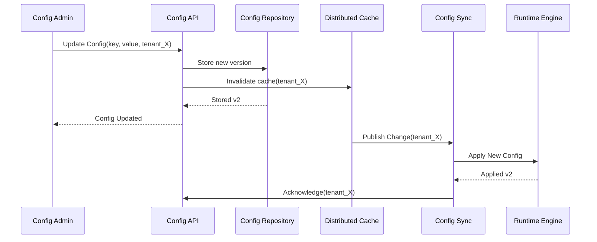

# SMOS-723 — Configuration & Feature Management

## 1. Document Control

| Field          | Value                                   |
| -------------- | --------------------------------------- |
| Document ID    | SMOS-723                                |
| Document Name  | Configuration & Feature Management      |
| Phase          | P7.S03                                  |
| Version        | 1.0.0-draft                             |
| Status         | Draft                                   |
| Classification | Enterprise Architecture — Control Plane |
| Owner          | Xennic                                  |
| Created        | 2026-07-01                              |
| Supersedes     | —                                       |

## 2. Purpose & Scope

The **Configuration Manager** and **Feature Flag Framework** manage all runtime configuration, feature flags, secrets, and rollout strategies across the SMOS Control Plane. Configurations span global, regional, tenant, workspace, and runtime scopes with hierarchical override and hot-reload capability.

## 3. Configuration Architecture

```mermaid
graph TB
    subgraph "Config Management Layer"
        direction TB
        CA[Config API]
        CR[Config Repository]

        subgraph "Config Store"
            CG[Global Config]
            CRG[Region Config]
            CT[Tenant Config]
            CW[Workspace Config]
            CRU[Runtime Config]
        end

        subgraph "Config Distribution"
            DCC[Distributed Config Cache]
            CWME[Config Watch & Monitor Engine]
            CSYNC[Config Sync Service]
        end

        subgraph "Secret Management"
            SM[Secret Manager]
            SKR[Key Rotation Service]
            SMV[Secret Vault]
        end

        subgraph "Feature Flags"
            FF[Feature Flag Service]
            FFR[Feature Flag Registry]
            FFT[Feature Flag Targeting]
            FFE[Feature Flag Evaluation Engine]
        end

        subgraph "Rollout"
            RLS[Release Service]
            CAN[Canary Manager]
            ROL[Rollback Manager]
        end
    end

    CA --> CR
    CR --> CG
    CR --> CRG
    CR --> CT
    CR --> CW
    CR --> CRU

    DCC --> CSYNC

    FF --> FFR
    FF --> FFE
    FFE --> FFT

    RLS --> CAN
    RLS --> ROL

    subgraph "Runtime Engine"
        SCH[SMOS-709 Scheduler]
        WFE[SMOS-710 Workflow Engine]
        PERS[SMOS-711 Persistence]
        DIST[SMOS-712 Distributed Exec]
        OPT[SMOS-716 Optimizer]
    end

    CWME --> SCH
    CWME --> WFE
    CWME --> PERS
    CWME --> DIST
    CSYNC --> OPT

    SM --> SKR
    SM --> SMV

    style CA fill:#2c3e50,color:#fff
    style CR fill:#8e44ad,color:#fff
    style DCC fill:#27ae60,color:#fff
    style SM fill:#e74c3c,color:#fff
    style FF fill:#2980b9,color:#fff
    style RLS fill:#f39c12,color:#fff
```



## 4. Configuration Hierarchy

```
Global (all regions, all tenants)
  └── Region (specific region)
        └── Tenant (specific tenant across workspaces)
              └── Workspace (specific workspace)
                    └── Runtime (specific runtime instance)
```

Overrides flow downward. A runtime config overrides workspace, which overrides tenant, which overrides region, which overrides global.

## 5. Configuration Model

```json
{
  "$schema": "http://json-schema.org/draft-07/schema#",
  "title": "ConfigurationEntry",
  "type": "object",
  "required": ["config_id", "key", "value", "scope", "version"],
  "properties": {
    "config_id": { "type": "string" },
    "key": { "type": "string" },
    "value": { "type": "object" },
    "scope": {
      "type": "object",
      "properties": {
        "level": {
          "type": "string",
          "enum": ["global", "region", "tenant", "workspace", "runtime"]
        },
        "region": { "type": "string" },
        "tenant_id": { "type": "string" },
        "workspace_id": { "type": "string" },
        "runtime_id": { "type": "string" }
      }
    },
    "type": {
      "type": "string",
      "enum": ["string", "number", "boolean", "json", "secret_ref"]
    },
    "version": { "type": "integer" },
    "mutable": { "type": "boolean", "default": true },
    "description": { "type": "string" },
    "labels": { "type": "object" },
    "created_at": { "type": "string", "format": "date-time" },
    "updated_at": { "type": "string", "format": "date-time" }
  }
}
```

## 6. Config Change Propagation



## 7. Secret Management

```json
{
  "$schema": "http://json-schema.org/draft-07/schema#",
  "title": "SecretEntry",
  "type": "object",
  "required": ["secret_id", "name", "scope", "status"],
  "properties": {
    "secret_id": { "type": "string" },
    "name": { "type": "string" },
    "scope": {
      "type": "object",
      "properties": {
        "level": { "type": "string", "enum": ["global", "region", "tenant"] },
        "tenant_id": { "type": "string" }
      }
    },
    "type": { "type": "string", "enum": ["api_key", "password", "token", "certificate", "custom"] },
    "status": { "type": "string", "enum": ["active", "rotating", "expired", "revoked"] },
    "rotation_policy": {
      "type": "object",
      "properties": {
        "interval_days": { "type": "integer" },
        "auto_rotate": { "type": "boolean" }
      }
    },
    "version": { "type": "integer" },
    "created_at": { "type": "string", "format": "date-time" },
    "expires_at": { "type": "string", "format": "date-time" }
  }
}
```

## 8. Feature Flag Model

```json
{
  "$schema": "http://json-schema.org/draft-07/schema#",
  "title": "FeatureFlag",
  "type": "object",
  "required": ["flag_id", "name", "enabled", "rollout_state"],
  "properties": {
    "flag_id": { "type": "string" },
    "name": { "type": "string" },
    "description": { "type": "string" },
    "enabled": { "type": "boolean" },
    "rollout_state": {
      "type": "string",
      "enum": ["dev", "canary", "beta", "ga", "deprecated"]
    },
    "owner": { "type": "string" },
    "targeting": {
      "type": "object",
      "properties": {
        "tenants": { "type": "array", "items": { "type": "string" } },
        "regions": { "type": "array", "items": { "type": "string" } },
        "workspaces": { "type": "array", "items": { "type": "string" } },
        "percentage": { "type": "number", "minimum": 0, "maximum": 100 },
        "custom_filters": { "type": "array", "items": { "type": "object" } }
      }
    },
    "dependencies": { "type": "array", "items": { "type": "string" } },
    "created_at": { "type": "string", "format": "date-time" },
    "updated_at": { "type": "string", "format": "date-time" }
  }
}
```

## 9. Rollout Strategy

| Stage       | Percentage                   | Duration | Validation         |
| ----------- | ---------------------------- | -------- | ------------------ |
| Dev         | Target environment only      | —        | Automated tests    |
| Canary      | 5% of tenants                | 1 hour   | Error rate < 0.1%  |
| Beta        | 25% of tenants               | 24 hours | Error rate < 0.01% |
| GA          | Gradual 25% → 50% → 100%     | 1 week   | All metrics stable |
| Deprecation | 100% with deprecation notice | 2 weeks  | Migration complete |

## 10. Rollback Procedure

| Trigger                       | RTO       | Action                            |
| ----------------------------- | --------- | --------------------------------- |
| Critical error rate > 0.1%    | <2 min    | Auto-rollback to previous version |
| Performance degradation > 10% | <5 min    | Auto-rollback to previous version |
| Tenant complaint              | <10 min   | Manual rollback via Config API    |
| Security vulnerability        | Immediate | Force rollback with audit         |

## 11. Config Categories

| Category    | Scope             | Examples                             |
| ----------- | ----------------- | ------------------------------------ |
| Runtime     | Global, Region    | Scheduler pool size, queue limits    |
| Execution   | Tenant, Workspace | Workflow timeout, retry policy       |
| Resource    | Tenant            | Quota limits, pool assignments       |
| Agent       | Global, Tenant    | Agent availability, permission level |
| Integration | Tenant            | Platform API keys, webhook URLs      |
| Security    | Global, Region    | Encryption keys, auth provider       |
| Feature     | Global, Tenant    | Feature flags, rollout percentages   |
| Monitoring  | Global            | Alert thresholds, metric sampling    |

## 12. Config Compliance & Governance

| Rule                | Description                                     |
| ------------------- | ----------------------------------------------- |
| Immutable Audit Log | All config changes are logged immutably         |
| Version Lock        | Configs are versioned, rollback always possible |
| Approval Gates      | Critical configs require multi-party approval   |
| Compliance Tags     | Configs tagged with compliance requirements     |
| Drift Detection     | Detects manual vs managed config drift          |
| Schema Validation   | All configs validated against JSON Schema       |

## 13. Failure Scenarios

| Scenario                | Detection                       | Resolution                   |
| ----------------------- | ------------------------------- | ---------------------------- |
| Config Corruption       | Schema validation fails         | Revert to last valid version |
| Sync Failure            | Runtime reports old version     | Force re-sync                |
| Secret Rotation Failure | New secret validation fails     | Keep previous secret active  |
| Feature Flag Cascade    | Dependent flag not enabled      | Block activation             |
| Rollout Regress         | Metrics degrade below threshold | Auto-rollback                |
| Config Drift            | Expected vs actual mismatch     | Reconcile via sync           |

## 14. Config Management Metrics

| Metric               | Description               | Unit    |
| -------------------- | ------------------------- | ------- |
| config_updates       | Config changes per period | count   |
| config_sync_lag      | Time from update to apply | ms      |
| active_feature_flags | Currently active          | count   |
| flag_evaluations     | Flag evaluation requests  | count/s |
| rollout_duration     | Time from canary to GA    | hours   |
| rollback_frequency   | Rollbacks per period      | count   |
| secret_rotations     | Successful rotations      | count   |

## 15. Cross-Reference Matrix

| Document   | Relationship                                               |
| ---------- | ---------------------------------------------------------- |
| SMOS-707   | Security — secret management aligns with security policies |
| SMOS-716   | Optimizer — config affects optimization strategies         |
| SMOS-719   | Control Plane — config manager is part of control plane    |
| SMOS-722   | Resource — resource quotas are config-driven               |
| SMOS-724   | Multi-region — per-region config overrides                 |
| SMOS-726   | Control APIs — config API is part of control API suite     |
| DEPLOY-001 | Deployment — config rollout follows deployment rings       |

---

**End of SMOS-723**
