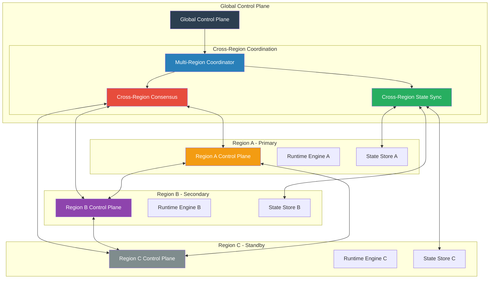
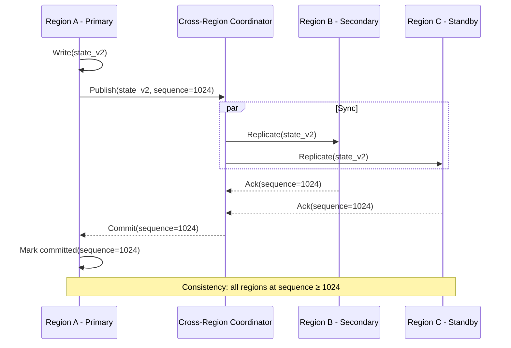
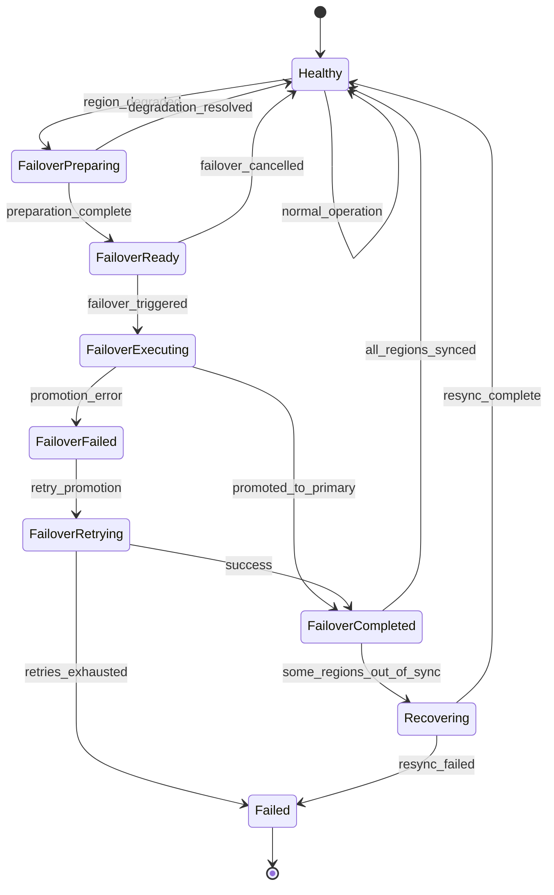

# SMOS-724 — Multi-Region Coordination

## 1. Document Control

| Field          | Value                                   |
| -------------- | --------------------------------------- |
| Document ID    | SMOS-724                                |
| Document Name  | Multi-Region Coordination               |
| Phase          | P7.S03                                  |
| Version        | 1.0.0-draft                             |
| Status         | Draft                                   |
| Classification | Enterprise Architecture — Control Plane |
| Owner          | Xennic                                  |
| Created        | 2026-07-01                              |
| Supersedes     | —                                       |

## 2. Purpose & Scope

The **Multi-Region Coordinator** manages SMOS deployment across multiple geographic regions, providing cross-region state synchronization, failover, traffic routing, and consistency models for the Control Plane.

## 3. Multi-Region Architecture



## 4. Region Roles

| Role              | Description                            | Example  |
| ----------------- | -------------------------------------- | -------- |
| Primary           | Active execution, all traffic served   | Region A |
| Secondary         | Active execution, partial traffic      | Region B |
| Standby           | Passive, ready for failover            | Region C |
| Disaster Recovery | Cold site, activated on major disaster | Region D |

## 5. Consistency Models

| Model          | Description                            | Use Case                        |
| -------------- | -------------------------------------- | ------------------------------- |
| Strong         | All regions see same state immediately | Policy decisions, audit records |
| Eventual       | State converges over time              | Knowledge store, analytics      |
| Read-Committed | Reads see committed writes             | Workflow state                  |
| Stale-Read     | Reads may see outdated state           | Monitoring, dashboards          |

## 6. Cross-Region State Synchronization



## 7. Failover Strategy

| Scenario                 | Action                            | RTO     | RPO     |
| ------------------------ | --------------------------------- | ------- | ------- |
| Primary Region Failure   | Promote secondary to primary      | <5 min  | <1 min  |
| Secondary Region Failure | Route traffic to remaining active | <2 min  | <10s    |
| Standby Activation       | Replicate full state, activate    | <15 min | <5 min  |
| Full Regional Outage     | Activate DR site                  | <30 min | <15 min |
| Network Partition        | Local operation only              | N/A     | N/A     |

## 8. Failover State Machine



## 9. Region Topology Configuration

```json
{
  "$schema": "http://json-schema.org/draft-07/schema#",
  "title": "RegionTopology",
  "type": "object",
  "required": ["regions", "primary_region"],
  "properties": {
    "regions": {
      "type": "array",
      "items": {
        "type": "object",
        "required": ["region_id", "name", "role"],
        "properties": {
          "region_id": { "type": "string" },
          "name": { "type": "string" },
          "role": { "type": "string", "enum": ["primary", "secondary", "standby", "dr"] },
          "priority": { "type": "integer" },
          "failover_order": { "type": "integer" },
          "latency_zone": { "type": "string" },
          "tenants": { "type": "array", "items": { "type": "string" } },
          "capabilities": { "type": "array", "items": { "type": "string" } }
        }
      }
    },
    "primary_region": { "type": "string" },
    "failover_policy": {
      "type": "object",
      "properties": {
        "auto_failover": { "type": "boolean" },
        "require_approval": { "type": "boolean" },
        "max_retries": { "type": "integer" }
      }
    },
    "sync_policy": {
      "type": "object",
      "properties": {
        "sync_interval_ms": { "type": "integer" },
        "batch_size": { "type": "integer" },
        "consistency_model": { "type": "string" }
      }
    }
  }
}
```

## 10. Cross-Region Traffic Routing

| Strategy        | Description                      | Use Case               |
| --------------- | -------------------------------- | ---------------------- |
| Latency-based   | Route to nearest region          | User-facing operations |
| Tenant-affinity | Route to tenant's home region    | Tenant operations      |
| Load-balanced   | Distribute across active regions | Batch operations       |
| Primary-first   | Route to primary unless degraded | Governance operations  |
| Failover        | Route to next available          | Disaster recovery      |

## 11. Region Health Monitoring

| Check             | Interval | Threshold              | Action               |
| ----------------- | -------- | ---------------------- | -------------------- |
| Control Plane API | 5s       | 3 consecutive failures | Mark degraded        |
| Runtime Health    | 10s      | Error rate > 5%        | Reduce traffic       |
| State Sync Lag    | 15s      | Lag > 10s              | Alert, increase sync |
| Network Latency   | 30s      | Latency > 500ms        | Re-route traffic     |
| Storage Health    | 60s      | Disk > 90%             | Alert, scale         |

## 12. Cross-Region Events

```json
{
  "$schema": "http://json-schema.org/draft-07/schema#",
  "title": "CrossRegionEvent",
  "type": "object",
  "required": ["event_id", "event_type", "source_region", "timestamp"],
  "properties": {
    "event_id": { "type": "string" },
    "event_type": {
      "type": "string",
      "enum": [
        "region_health_changed",
        "region_role_changed",
        "failover_started",
        "failover_completed",
        "failover_failed",
        "state_sync_lag_exceeded",
        "cross_region_network_degraded",
        "region_added",
        "region_removed"
      ]
    },
    "source_region": { "type": "string" },
    "target_region": { "type": "string" },
    "timestamp": { "type": "string", "format": "date-time" },
    "details": { "type": "object" },
    "correlation_id": { "type": "string" }
  }
}
```

## 13. Disaster Recovery Plan

| Phase             | Action                                | Duration      |
| ----------------- | ------------------------------------- | ------------- |
| Detection         | Monitor detects unrecoverable failure | <1 min        |
| Assessment        | Evaluate impact, decide DR activation | <2 min        |
| Activation        | Promote DR site to primary            | <10 min       |
| Data Restoration  | Restore from latest checkpoint        | <15 min       |
| Traffic Migration | Route all traffic to DR site          | <5 min        |
| Validation        | Verify system functionality           | <5 min        |
| Recovery          | Full operations restored              | <30 min total |

## 14. Multi-Region Metrics

| Metric               | Description                     | Unit                    |
| -------------------- | ------------------------------- | ----------------------- |
| region_health        | Per-region health status        | healthy/degraded/failed |
| sync_lag             | Cross-region state sync delay   | ms                      |
| failover_time        | Time to complete failover       | s                       |
| cross_region_latency | Network latency between regions | ms                      |
| active_regions       | Number of active regions        | count                   |
| failover_count       | Failovers per period            | count                   |
| dr_drill_success     | DR drill pass rate              | %                       |

## 15. Cross-Reference Matrix

| Document   | Relationship                                                |
| ---------- | ----------------------------------------------------------- |
| SMOS-712   | Distributed execution — cross-region execution coordination |
| SMOS-713   | Checkpoint — checkpoint used for DR data restoration        |
| SMOS-719   | Control Plane — multi-region coordination is a component    |
| SMOS-720   | Global Orchestrator — cross-region orchestration            |
| SMOS-722   | Resource — per-region resource pools                        |
| SMOS-725   | SLA — cross-region SLA enforcement                          |
| SMOS-727   | Security — cross-region encryption and security             |
| DEPLOY-001 | Deployment — multi-region deployment strategy               |

---

**End of SMOS-724**
