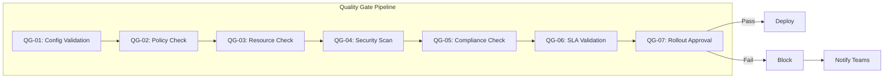

# SMOS-725 — Governance & SLA

## 1. Document Control

| Field          | Value                                   |
| -------------- | --------------------------------------- |
| Document ID    | SMOS-725                                |
| Document Name  | Governance & SLA                        |
| Phase          | P7.S03                                  |
| Version        | 1.0.0-draft                             |
| Status         | Draft                                   |
| Classification | Enterprise Architecture — Control Plane |
| Owner          | Xennic                                  |
| Created        | 2026-07-01                              |
| Supersedes     | —                                       |

## 2. Purpose & Scope

The **Enterprise Governance & SLA Manager** governs all SMOS platform operations — runtime governance, cost governance, SLA enforcement, tenant agreements, compliance auditing, and quality gates — ensuring the platform operates within defined business, operational, and regulatory boundaries.

## 3. Governance Architecture

```mermaid
graph TB
    subgraph "Governance Layer"
        direction TB
        GA[Governance API]

        subgraph "Runtime Governance"
            RG[Runtime Governance]
            RM[Runtime Monitor]
            RL[Runtime Lifecycle Manager]
        end

        subgraph "Cost Governance"
            CG[Cost Governance]
            CM[Cost Monitor]
            CB[Cost Budget Controller]
        end

        subgraph "SLA Management"
            SLA[SLA Manager]
            SLAM[SLA Monitor]
            SLAE[SLA Enforcement]
            SLAR[SLA Reporting]
        end

        subgraph "Quality Gates"
            QG[Quality Gate Service]
            QGR[Quality Gate Registry]
            QGE[Quality Gate Engine]
        end

        subgraph "Compliance"
            CMP[Compliance Manager]
            CMPR[Compliance Reporter]
            CMPA[Compliance Auditor]
        end

        subgraph "Tenant Agreements"
            TA[Tenant Agreement Manager]
            TAT[Tenant Agreement Templates]
            TAW[Tenant Agreement Workflow]
        end
    end

    GA --> RG
    GA --> CG
    GA --> SLA
    GA --> QG
    GA --> CMP
    GA --> TA

    RG --> RM
    RG --> RL

    CG --> CM
    CG --> CB

    SLA --> SLAM
    SLA --> SLAE
    SLA --> SLAR

    QG --> QGR
    QG --> QGE

    CMP --> CMPR
    CMP --> CMPA

    TA --> TAT
    TA --> TAW

    subgraph "Control Plane"
        CP[SMOS-719 Control Plane]
        PE[SMOS-721 Policy Engine]
        RMG[SMOS-722 Resource Manager]
        MRC[SMOS-724 Multi-Region]
    end

    RG --> CP
    RG --> RL
    SLA --> PE
    CG --> RMG
    CMP --> MRC

    style GA fill:#2c3e50,color:#fff
    style RG fill:#2980b9,color:#fff
    style CG fill:#27ae60,color:#fff
    style SLA fill:#e74c3c,color:#fff
    style QG fill:#8e44ad,color:#fff
    style CMP fill:#f39c12,color:#fff
    style TA fill:#16a085,color:#fff
```



## 4. Runtime Governance

Governs the complete lifecycle of runtime components:

| Phase        | Governance Action                      | Validation            |
| ------------ | -------------------------------------- | --------------------- |
| Registration | Validate capability, assign scope      | Schema compliance     |
| Activation   | Resource allocation, quota check       | Tenant policy         |
| Active       | Health monitoring, SLA enforcement     | Metrics thresholds    |
| Degraded     | Alert, reduce load, prepare recovery   | Degradation policy    |
| Draining     | Stop new work, complete in-flight      | Drain timeout         |
| Termination  | Deregister, archive, release resources | Data retention policy |

## 5. Cost Governance

```json
{
  "$schema": "http://json-schema.org/draft-07/schema#",
  "title": "CostBudget",
  "type": "object",
  "required": ["budget_id", "tenant_id", "allocations", "period"],
  "properties": {
    "budget_id": { "type": "string" },
    "tenant_id": { "type": "string" },
    "allocations": {
      "type": "object",
      "properties": {
        "compute": { "type": "number" },
        "tokens": { "type": "number" },
        "storage": { "type": "number" },
        "network": { "type": "number" }
      }
    },
    "period": { "type": "string", "enum": ["daily", "weekly", "monthly", "quarterly"] },
    "spend": { "type": "object" },
    "alerts": {
      "type": "object",
      "properties": {
        "warning_at": { "type": "number", "description": "Alert at this % of budget" },
        "critical_at": { "type": "number", "description": "Alert at this % of budget" },
        "hard_stop_at": { "type": "number", "description": "Hard stop at this %" }
      }
    },
    "status": { "type": "string", "enum": ["active", "warning", "critical", "exhausted"] }
  }
}
```

### Cost Governance Rules

| Rule                | Description             | Action                           |
| ------------------- | ----------------------- | -------------------------------- |
| Budget Warning      | Spend at 80%            | Notify tenant admin              |
| Budget Critical     | Spend at 95%            | Restrict non-critical operations |
| Budget Exhaustion   | Spend at 100%           | Suspend non-essential operations |
| Cost Anomaly        | > 2x normal daily spend | Alert, temporary suspension      |
| Cross-budget Borrow | Borrow from next period | Require governance approval      |

## 6. SLA Manager

```json
{
  "$schema": "http://json-schema.org/draft-07/schema#",
  "title": "SLADefinition",
  "type": "object",
  "required": ["sla_id", "tenant_id", "dimensions", "penalties"],
  "properties": {
    "sla_id": { "type": "string" },
    "tenant_id": { "type": "string" },
    "dimensions": {
      "type": "array",
      "items": {
        "type": "object",
        "required": ["name", "target", "measurement_window"],
        "properties": {
          "name": { "type": "string" },
          "target": { "type": "object" },
          "measurement_window": { "type": "string" },
          "exclusions": { "type": "array", "items": { "type": "string" } }
        }
      }
    },
    "penalties": {
      "type": "array",
      "items": {
        "type": "object",
        "properties": {
          "type": { "type": "string", "enum": ["credit", "escalation", "suspension"] },
          "threshold": { "type": "number" }
        }
      }
    },
    "status": { "type": "string", "enum": ["active", "breached", "suspended"] }
  }
}
```

### SLA Dimensions

| Dimension             | Target      | Measurement                                 |
| --------------------- | ----------- | ------------------------------------------- |
| Availability          | 99.9%       | Monthly uptime = (total - downtime) / total |
| Execution Latency p50 | <500ms      | Median of all execution times               |
| Execution Latency p99 | <5s         | 99th percentile                             |
| Throughput            | >1000 ops/s | Peak measured throughput                    |
| Recovery Time (RTO)   | <5 min      | Time to full recovery                       |
| Recovery Point (RPO)  | <1 min      | Data loss window                            |
| Error Rate            | <0.1%       | Errors / total operations                   |

### SLA Breach Escalation

| Breach Level           | Consequence        | Response                              |
| ---------------------- | ------------------ | ------------------------------------- |
| Minor (1 breach)       | Warning            | Notify operations team                |
| Moderate (2 breaches)  | Service credit     | Notify tenant, escalate to management |
| Major (3 breaches)     | Escalated support  | Root cause analysis, remediation plan |
| Critical (4+ breaches) | Penalty invocation | Executive escalation, contract review |

## 7. Quality Gates



### Quality Gate Definitions

| Gate  | Check                          | Failure Action                  |
| ----- | ------------------------------ | ------------------------------- |
| QG-01 | Config is valid per schema     | Block deployment                |
| QG-02 | All policies evaluate to allow | Block, notify security          |
| QG-03 | Sufficient resources available | Block, schedule later           |
| QG-04 | No security vulnerabilities    | Block, escalate to security     |
| QG-05 | Compliance rules satisfied     | Block, compliance audit         |
| QG-06 | SLA projections within target  | Warn, require approval          |
| QG-07 | Rollout plan validated         | Block, require go-live approval |

## 8. Compliance Manager

| Domain       | Compliance Area                   | Validation                  |
| ------------ | --------------------------------- | --------------------------- |
| Data Privacy | PII handling, data retention      | Privacy policy compliance   |
| Security     | Encryption, access control        | Security standards audit    |
| Operations   | Audit logging, change management  | Operations compliance       |
| Governance   | Policy adherence, SLA compliance  | Governance framework audit  |
| Regulatory   | Regional regulations (GDPR, etc.) | Regulatory compliance check |

## 9. Tenant Agreement Management

| Agreement                          | Scope                  | Lifecycle                              |
| ---------------------------------- | ---------------------- | -------------------------------------- |
| Master Service Agreement (MSA)     | Global terms           | Signed → Active → Renewed → Terminated |
| Service Level Agreement (SLA)      | Performance guarantees | Defined → Active → Breached → Reviewed |
| Data Processing Agreement (DPA)    | Data handling          | Defined → Active → Updated → Archived  |
| Business Associate Agreement (BAA) | HIPAA compliance       | Defined → Active → Terminated          |

## 10. Governance Events

```json
{
  "$schema": "http://json-schema.org/draft-07/schema#",
  "title": "GovernanceEvent",
  "type": "object",
  "required": ["event_id", "event_type", "timestamp", "source"],
  "properties": {
    "event_id": { "type": "string" },
    "event_type": {
      "type": "string",
      "enum": [
        "runtime_registered",
        "runtime_deregistered",
        "runtime_degraded",
        "budget_warning",
        "budget_critical",
        "budget_exhausted",
        "sla_breach_detected",
        "sla_breach_escalated",
        "quality_gate_passed",
        "quality_gate_failed",
        "compliance_check_passed",
        "compliance_check_failed",
        "tenant_agreement_created",
        "tenant_agreement_updated",
        "governance_review_triggered"
      ]
    },
    "timestamp": { "type": "string", "format": "date-time" },
    "source": { "type": "string" },
    "tenant_id": { "type": "string" },
    "details": { "type": "object" }
  }
}
```

## 11. Governance Metrics

| Metric                 | Description            | Unit     |
| ---------------------- | ---------------------- | -------- |
| sla_compliance_rate    | SLA target achievement | %        |
| budget_compliance_rate | Budget adherence       | %        |
| quality_gate_pass_rate | QG pass rate           | %        |
| governance_violations  | Total violations       | count    |
| runtime_uptime         | Runtime availability   | %        |
| cost_per_tenant        | Cost attribution       | currency |
| avg_recovery_time      | Mean RTO               | min      |

## 12. Cross-Reference Matrix

| Document | Relationship                                            |
| -------- | ------------------------------------------------------- |
| SMOS-706 | Monitoring — governance monitors runtime health         |
| SMOS-707 | Security — governance enforces security policies        |
| SMOS-719 | Control Plane — governance is a control plane component |
| SMOS-721 | Policy Engine — governance policies evaluated by PDP    |
| SMOS-722 | Resource — cost governance tied to resource management  |
| SMOS-724 | Multi-region — cross-region SLA enforcement             |
| SMOS-727 | Security — compliance auditor integration               |
| GOV-\*   | Enterprise governance — implements governance rules     |

---

**End of SMOS-725**
