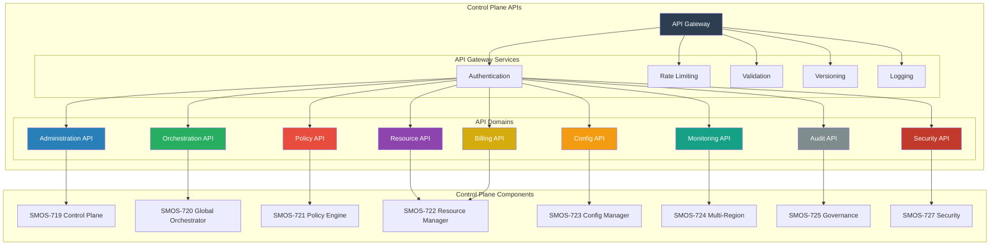

# SMOS-726 — Enterprise Control APIs

## 1. Document Control

| Field          | Value                                   |
| -------------- | --------------------------------------- |
| Document ID    | SMOS-726                                |
| Document Name  | Enterprise Control APIs                 |
| Phase          | P7.S03                                  |
| Version        | 1.0.0-draft                             |
| Status         | Draft                                   |
| Classification | Enterprise Architecture — Control Plane |
| Owner          | Xennic                                  |
| Created        | 2026-07-01                              |
| Supersedes     | —                                       |

## 2. Purpose & Scope

The **Enterprise Control APIs** define the complete API surface of the SMOS Control Plane — administrative, governance, orchestration, policy, resource, configuration, monitoring, and security APIs — enabling automated and manual management of the entire platform.

## 3. API Architecture



## 4. API Domain: Administration

| Endpoint                     | Method           | Description             |
| ---------------------------- | ---------------- | ----------------------- |
| /admin/tenants               | GET, POST        | List, create tenants    |
| /admin/tenants/{id}          | GET, PUT, DELETE | Manage tenant           |
| /admin/tenants/{id}/quotas   | GET, PUT         | Tenant quotas           |
| /admin/workspaces            | GET, POST        | List, create workspaces |
| /admin/runtimes              | GET              | List all runtimes       |
| /admin/runtimes/{id}         | GET, PUT, DELETE | Manage runtime          |
| /admin/runtimes/{id}/drain   | POST             | Drain runtime           |
| /admin/regions               | GET, POST        | List, manage regions    |
| /admin/regions/{id}/failover | POST             | Trigger failover        |
| /admin/health                | GET              | System health overview  |

## 5. API Domain: Orchestration

| Endpoint                              | Method | Description            |
| ------------------------------------- | ------ | ---------------------- |
| /orchestrate/workflows                | POST   | Execute workflow       |
| /orchestrate/workflows/{id}           | GET    | Get workflow status    |
| /orchestrate/workflows/{id}/cancel    | POST   | Cancel workflow        |
| /orchestrate/workflows/{id}/retry     | POST   | Retry failed workflow  |
| /orchestrate/agents/{agent_id}        | POST   | Invoke agent           |
| /orchestrate/agents/{agent_id}/status | GET    | Agent execution status |
| /orchestrate/queues                   | GET    | List queues            |
| /orchestrate/queues/{id}/depth        | GET    | Queue depth            |
| /orchestrate/queues/{id}/dead-letter  | GET    | Dead letter items      |

## 6. API Domain: Policy

| Endpoint                 | Method           | Description           |
| ------------------------ | ---------------- | --------------------- |
| /policies                | GET, POST        | List, create policies |
| /policies/{id}           | GET, PUT, DELETE | Manage policy         |
| /policies/{id}/evaluate  | POST             | Dry-run evaluation    |
| /policies/{id}/activate  | POST             | Activate policy       |
| /policies/{id}/deprecate | POST             | Deprecate policy      |
| /policies/obligations    | GET              | List obligations      |
| /policies/cache/clear    | POST             | Clear policy cache    |
| /policies/audit/log      | GET              | Policy audit log      |

## 7. API Domain: Resource

| Endpoint                     | Method    | Description          |
| ---------------------------- | --------- | -------------------- |
| /resources/pools             | GET       | List resource pools  |
| /resources/pools/{id}        | GET       | Pool details         |
| /resources/quotas            | GET, POST | List, create quotas  |
| /resources/quotas/{id}       | GET, PUT  | Manage quota         |
| /resources/budgets           | GET, POST | List, create budgets |
| /resources/budgets/{id}      | GET, PUT  | Manage budget        |
| /resources/allocations       | GET       | Current allocations  |
| /resources/capacity/forecast | GET       | Capacity forecast    |
| /resources/capacity/plan     | POST      | Submit capacity plan |

## 8. API Domain: Configuration

| Endpoint                       | Method           | Description                |
| ------------------------------ | ---------------- | -------------------------- |
| /config/entries                | GET, POST        | List, create configs       |
| /config/entries/{id}           | GET, PUT, DELETE | Manage config              |
| /config/secrets                | GET, POST        | List, create secrets       |
| /config/secrets/{id}/rotate    | POST             | Rotate secret              |
| /config/flags                  | GET, POST        | List, create feature flags |
| /config/flags/{id}             | GET, PUT, DELETE | Manage flag                |
| /config/flags/{id}/evaluate    | POST             | Evaluate flag              |
| /config/rollouts               | GET, POST        | List, create rollouts      |
| /config/rollouts/{id}/rollback | POST             | Rollback rollout           |

## 9. API Domain: Monitoring

| Endpoint                        | Method | Description           |
| ------------------------------- | ------ | --------------------- |
| /monitoring/metrics             | GET    | Query metrics         |
| /monitoring/health              | GET    | Health status         |
| /monitoring/alerts              | GET    | Active alerts         |
| /monitoring/alerts/{id}/ack     | POST   | Acknowledge alert     |
| /monitoring/alerts/{id}/resolve | POST   | Resolve alert         |
| /monitoring/dashboards          | GET    | Dashboard definitions |
| /monitoring/events              | GET    | Event stream          |

## 10. API Domain: Security

| Endpoint                     | Method           | Description           |
| ---------------------------- | ---------------- | --------------------- |
| /security/access/grants      | GET, POST        | Access grants         |
| /security/access/grants/{id} | GET, PUT, DELETE | Manage grant          |
| /security/roles              | GET, POST        | List, create roles    |
| /security/roles/{id}         | GET, PUT         | Manage role           |
| /security/tokens             | POST             | Generate access token |
| /security/tokens/{id}/revoke | POST             | Revoke token          |
| /security/audit              | GET              | Security audit log    |

## 11. API Domain: Audit

| Endpoint                  | Method | Description          |
| ------------------------- | ------ | -------------------- |
| /audit/records            | GET    | Query audit records  |
| /audit/records/{id}       | GET    | Audit record detail  |
| /audit/export             | GET    | Export audit log     |
| /audit/compliance/reports | GET    | Compliance reports   |
| /audit/compliance/check   | POST   | Run compliance check |

## 12. API Domain: Billing

| Endpoint          | Method | Description          |
| ----------------- | ------ | -------------------- |
| /billing/usage    | GET    | Current usage report |
| /billing/costs    | GET    | Cost breakdown       |
| /billing/invoices | GET    | Invoice history      |
| /billing/credits  | GET    | SLA credit history   |

## 13. API Contract Schema

```json
{
  "$schema": "http://json-schema.org/draft-07/schema#",
  "title": "ControlAPIResponse",
  "type": "object",
  "required": ["status", "data"],
  "properties": {
    "status": {
      "type": "object",
      "properties": {
        "code": { "type": "integer" },
        "message": { "type": "string" },
        "request_id": { "type": "string" },
        "timestamp": { "type": "string", "format": "date-time" }
      }
    },
    "data": { "type": "object" },
    "pagination": {
      "type": "object",
      "properties": {
        "page": { "type": "integer" },
        "page_size": { "type": "integer" },
        "total": { "type": "integer" }
      }
    },
    "errors": {
      "type": "array",
      "items": {
        "type": "object",
        "properties": {
          "code": { "type": "string" },
          "message": { "type": "string" },
          "details": { "type": "object" }
        }
      }
    }
  }
}
```

## 14. Error Codes

| Code    | HTTP Status | Description            |
| ------- | ----------- | ---------------------- |
| CP-1000 | 200         | Success                |
| CP-2000 | 400         | Validation error       |
| CP-2001 | 400         | Invalid configuration  |
| CP-2002 | 400         | Invalid policy         |
| CP-3000 | 401         | Unauthenticated        |
| CP-3001 | 403         | Unauthorized           |
| CP-3002 | 403         | Policy evaluation deny |
| CP-4000 | 404         | Resource not found     |
| CP-5000 | 429         | Rate limit exceeded    |
| CP-5001 | 429         | Quota exceeded         |
| CP-5002 | 429         | Budget exhausted       |
| CP-6000 | 500         | Internal error         |
| CP-6001 | 503         | Service unavailable    |
| CP-6002 | 503         | Control Plane degraded |

## 15. API Versioning

| Strategy      | Description                                    |
| ------------- | ---------------------------------------------- |
| Accept Header | `Accept: application/vnd.smos.control.v1+json` |
| URL Prefix    | `/v1/policies`                                 |
| Minor Version | Backward compatible additions                  |
| Major Version | Breaking changes, parallel support             |
| Deprecation   | Minimum 6 months deprecation notice            |

## 16. Cross-Reference Matrix

| Document | Relationship                                           |
| -------- | ------------------------------------------------------ |
| SMOS-717 | SDK — Control APIs consumed by SDK                     |
| SMOS-719 | Control Plane — APIs expose control plane capabilities |
| SMOS-720 | Global Orchestrator — orchestration API endpoints      |
| SMOS-721 | Policy Engine — policy API endpoints                   |
| SMOS-722 | Resource — resource API endpoints                      |
| SMOS-723 | Config — config API endpoints                          |
| SMOS-724 | Multi-region — region management API                   |
| SMOS-725 | Governance — governance, SLA, billing API              |
| SMOS-727 | Security — security API endpoints                      |
| SMOS-728 | Blueprint — API blueprint section                      |

---

**End of SMOS-726**
