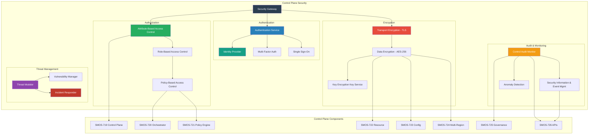
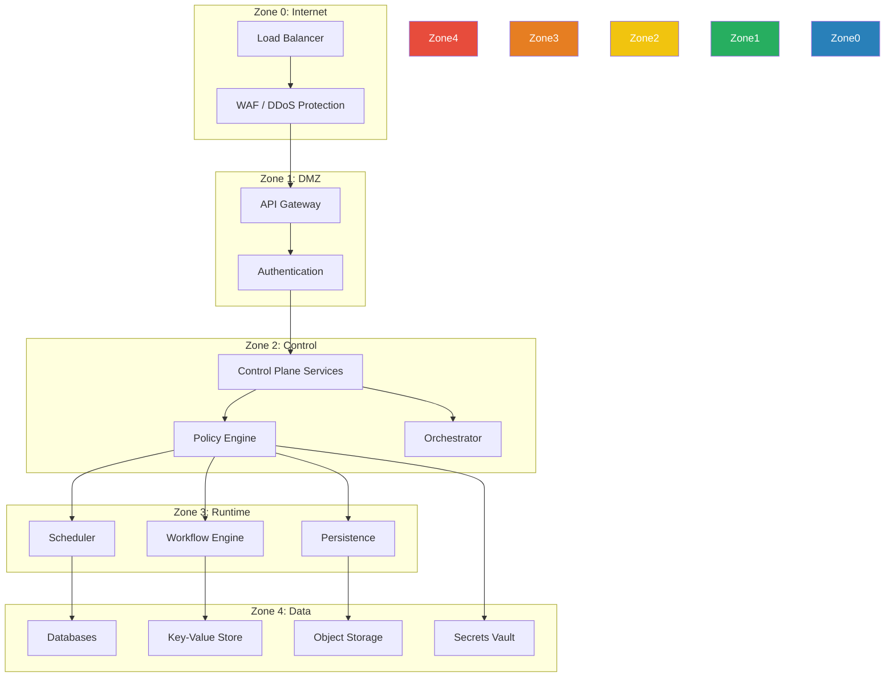
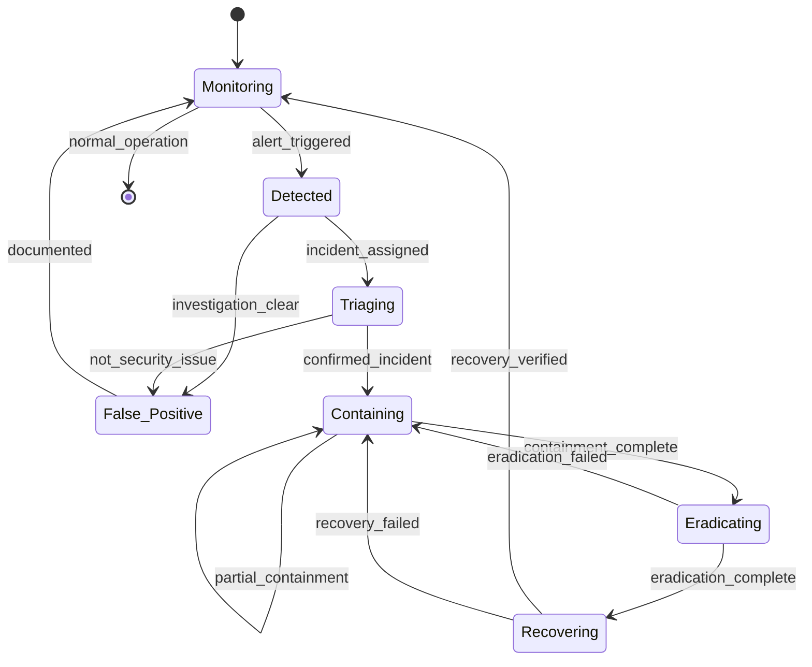

# SMOS-727 — Control Plane Security

## 1. Document Control

| Field          | Value                                   |
| -------------- | --------------------------------------- |
| Document ID    | SMOS-727                                |
| Document Name  | Control Plane Security                  |
| Phase          | P7.S03                                  |
| Version        | 1.0.0-draft                             |
| Status         | Draft                                   |
| Classification | Enterprise Architecture — Control Plane |
| Owner          | Xennic                                  |
| Created        | 2026-07-01                              |
| Supersedes     | —                                       |

## 2. Purpose & Scope

The **Control Plane Security** architecture defines authentication, authorization, encryption, auditing, threat modeling, and compliance across the entire SMOS Control Plane. It extends SMOS-707 (Runtime Security) to the control plane layer.

## 3. Security Architecture



## 4. Authentication

| Method            | Use Case                       | Strength                |
| ----------------- | ------------------------------ | ----------------------- |
| API Token         | Machine-to-machine             | Bearer token with HMAC  |
| OAuth 2.0 + OIDC  | User authentication            | Authorization code flow |
| Mutual TLS (mTLS) | Service-to-service             | Certificate-based       |
| SSO / SAML        | Enterprise identity federation | SAML 2.0 assertions     |
| MFA               | Admin operations               | TOTP / WebAuthn         |

## 5. Authorization Model

```json
{
  "$schema": "http://json-schema.org/draft-07/schema#",
  "title": "AuthorizationPolicy",
  "type": "object",
  "required": ["policy_id", "subjects", "actions", "resources", "effect"],
  "properties": {
    "policy_id": { "type": "string" },
    "subjects": {
      "type": "array",
      "items": {
        "type": "object",
        "properties": {
          "type": { "type": "string", "enum": ["user", "agent", "service", "tenant"] },
          "id": { "type": "string" },
          "role": { "type": "string" }
        }
      }
    },
    "actions": { "type": "array", "items": { "type": "string" } },
    "resources": { "type": "array", "items": { "type": "string" } },
    "conditions": {
      "type": "object",
      "properties": {
        "ip_range": { "type": "string" },
        "time_window": { "type": "object" },
        "mfa_required": { "type": "boolean" },
        "geo_restriction": { "type": "string" }
      }
    },
    "effect": { "type": "string", "enum": ["allow", "deny"] },
    "priority": { "type": "integer" }
  }
}
```

### Authorization Levels

| Level | Description   | Scope                   |
| ----- | ------------- | ----------------------- |
| A-0   | No access     | Public, unauthenticated |
| A-1   | Read-only     | Observation, metrics    |
| A-2   | Operator      | Standard operations     |
| A-3   | Administrator | Full configuration      |
| A-4   | Super-admin   | Global control plane    |

## 6. Encryption Strategy

| Layer               | Algorithm                 | Key Management            |
| ------------------- | ------------------------- | ------------------------- |
| Transport (TLS 1.3) | AES-256-GCM               | Auto-rotated certificates |
| Data at Rest        | AES-256-CBC               | Key Encryption Key (KEK)  |
| Secret Storage      | Vault transit             | Auto-rotation with HSM    |
| Cross-Region        | TLS + envelope encryption | Region-specific keys      |
| Audit Logs          | SHA-256 hash chain        | Immutable, append-only    |

## 7. Security Zones



## 8. Threat Models

| Threat                     | Vector                  | Mitigation                            |
| -------------------------- | ----------------------- | ------------------------------------- |
| Control Plane API Abuse    | Brute force, DDoS       | Rate limiting, WAF, IP allowlisting   |
| Unauthorized Policy Change | Compromised admin       | MFA, ABAC, audit trail                |
| Secret Exposure            | Code leak, log exposure | Vault, auto-rotation                  |
| Cross-Tenant Access        | Broken isolation        | Tenant-scoped PDP, resource isolation |
| Replay Attack              | Intercepted API call    | Nonce, timestamp validation           |
| Privilege Escalation       | Role manipulation       | Strict RBAC, deny-by-default          |
| Data Exfiltration          | Insider threat          | Encryption, DLP, audit                |

## 9. Incident Response



## 10. Security Audit

```json
{
  "$schema": "http://json-schema.org/draft-07/schema#",
  "title": "SecurityAuditRecord",
  "type": "object",
  "required": ["record_id", "timestamp", "event_type", "actor", "severity", "outcome"],
  "properties": {
    "record_id": { "type": "string" },
    "timestamp": { "type": "string", "format": "date-time" },
    "event_type": {
      "type": "string",
      "enum": [
        "login_success",
        "login_failure",
        "logout",
        "token_generated",
        "token_revoked",
        "policy_created",
        "policy_modified",
        "policy_deleted",
        "role_assigned",
        "role_revoked",
        "secret_accessed",
        "secret_rotated",
        "incident_detected",
        "incident_resolved",
        "authorization_denied",
        "authorization_allowed"
      ]
    },
    "actor": { "type": "object", "properties": { "id": {}, "type": {} } },
    "severity": { "type": "string", "enum": ["info", "warning", "critical"] },
    "outcome": { "type": "string", "enum": ["success", "failure", "blocked"] },
    "source_ip": { "type": "string" },
    "tenant_id": { "type": "string" },
    "correlation_id": { "type": "string" },
    "details": { "type": "object" }
  }
}
```

## 11. Security Compliance

| Standard  | Requirements                      | Validation          |
| --------- | --------------------------------- | ------------------- |
| SOC 2     | Access control, encryption, audit | Annual audit        |
| ISO 27001 | ISMS, risk management             | Certification       |
| GDPR      | Data privacy, right to deletion   | DPA, privacy impact |
| HIPAA     | PHI protection, BAA               | BAA, encryption     |
| PCI DSS   | Card data protection              | Quarterly scan      |

## 12. Key Rotation

| Key Type             | Rotation Period | Rotation Mechanism                |
| -------------------- | --------------- | --------------------------------- |
| TLS Certificate      | 90 days         | ACME / Let's Encrypt auto-renewal |
| API Signing Key      | 30 days         | Vault transit engine              |
| Data Encryption Key  | 90 days         | Re-encrypt with new key           |
| Root CA              | 1 year          | Certificate reissuance            |
| Database Credentials | 30 days         | Dynamic secrets Vault             |

## 13. Security Metrics

| Metric                | Description                | Target   |
| --------------------- | -------------------------- | -------- |
| auth_failure_rate     | Login failures / total     | <5%      |
| authorization_denials | Denied requests / total    | <1%      |
| mean_time_to_detect   | Incident detection time    | <5 min   |
| mean_time_to_respond  | Incident response time     | <30 min  |
| vulnerability_age     | Time since discovery       | <90 days |
| encryption_coverage   | Encrypted data percentage  | 100%     |
| audit_completeness    | Audited operations / total | 100%     |

## 14. Cross-Reference Matrix

| Document | Relationship                                                             |
| -------- | ------------------------------------------------------------------------ |
| SMOS-707 | Runtime security — control plane security extends runtime security model |
| SMOS-719 | Control Plane — security is integral to control plane                    |
| SMOS-721 | Policy Engine — authorization policies enforced by PDP                   |
| SMOS-723 | Config — secret management integration                                   |
| SMOS-724 | Multi-region — cross-region encryption                                   |
| SMOS-725 | Governance — security compliance auditing                                |
| SMOS-726 | Control APIs — security API endpoints                                    |
| KNW-308  | Platform security — enterprise security architecture                     |

---

**End of SMOS-727**
