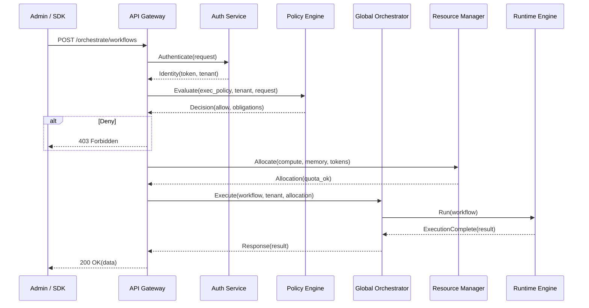
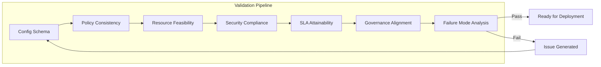

# SMOS-728 — Enterprise Control Blueprint

## 1. Document Control

| Field          | Value                                   |
| -------------- | --------------------------------------- |
| Document ID    | SMOS-728                                |
| Document Name  | Enterprise Control Blueprint            |
| Phase          | P7.S03                                  |
| Version        | 1.0.0-draft                             |
| Status         | Draft                                   |
| Classification | Enterprise Architecture — Control Plane |
| Owner          | Xennic                                  |
| Created        | 2026-07-01                              |
| Supersedes     | —                                       |

## 2. Purpose & Scope

The **Enterprise Control Blueprint** is the integration document that consolidates SMOS-719 through SMOS-727 into a unified Control Plane architecture. It defines how all Control Plane components interact, their deployment topology, data flows, API surface, event architecture, and governance model.

This is the SSOT (Single Source of Truth) for the P7.S03 Enterprise Control Plane.

## 3. Control Plane Overview

```mermaid
graph TB
    subgraph "Enterprise Control Plane (P7.S03)"
        direction TB

        subgraph "API Layer"
            GW[API Gateway - SMOS-726]
        end

        subgraph "Core Services"
            GO[Global Orchestrator - SMOS-720]
            PE[Policy Engine - SMOS-721]
            RM[Resource Manager - SMOS-722]
            CM[Config Manager - SMOS-723]
        end

        subgraph "Coordination Services"
            MR[Multi-Region Coordinator - SMOS-724]
            GV[Governance & SLA - SMOS-725]
            SEC[Security - SMOS-727]
        end

        subgraph "Integration"
            AU[Audit Service]
            BL[Billing Service]
            MON[Monitoring Service]
        end

        subgraph "Data Stores"
            PR[Policy Repository]
            RR[Runtime Registry]
            CR[Config Repository]
            AR[Audit Store]
            SR[Secret Vault]
        end
    end

    subgraph "Existing Platform"
        RTE[SMOS-709..718 Runtime Engine]
        AGT[AI-001..014 Agents]
        KNW[KNW-* Knowledge Stores]
        AUT[AUT-* Automations]
    end

    GW --> GO
    GW --> PE
    GW --> RM
    GW --> CM
    GW --> MR
    GW --> GV
    GW --> SEC

    GO --> MR
    GO --> GV

    PE --> PR
    PE --> SEC

    RM --> MON

    CM --> CR
    CM --> SR

    GV --> AU
    GV --> BL

    SEC --> AU

    GO --> RTE
    PE --> RTE
    RM --> RTE

    GO --> AGT
    PE --> AGT

    GV --> KNW
    GO --> AUT

    style GW fill:#2c3e50,color:#fff
    style GO fill:#2980b9,color:#fff
    style PE fill:#e74c3c,color:#fff
    style RM fill:#27ae60,color:#fff
    style CM fill:#8e44ad,color:#fff
    style MR fill:#f39c12,color:#fff
    style GV fill:#16a085,color:#fff
    style SEC fill:#c0392b,color:#fff
    style AU fill:#7f8c8d,color:#fff
    style BL fill:#d4ac0d,color:#fff
    style MON fill:#3498db,color:#fff
```



## 4. Component Registry

| Component                | Document | Type         | Dependencies                    | Consumed By                     |
| ------------------------ | -------- | ------------ | ------------------------------- | ------------------------------- |
| Global Orchestrator      | SMOS-720 | Core         | Runtime Registry, Policy Engine | All Runtimes, Agents, Workflows |
| Policy Engine (PDP)      | SMOS-721 | Core         | Policy Repository               | All Control Plane Components    |
| Resource Manager         | SMOS-722 | Core         | Resource Pools, Tenant Quotas   | Scheduler, Workflow Engine      |
| Config Manager           | SMOS-723 | Core         | Config Repository, Secret Vault | All Components                  |
| Multi-Region Coordinator | SMOS-724 | Coordination | Region Topology                 | Global Orchestrator             |
| Governance & SLA         | SMOS-725 | Coordination | Policy Engine, Audit Store      | All Tenants                     |
| Security Service         | SMOS-727 | Coordination | Identity Provider, Vault        | All Components                  |
| Control APIs             | SMOS-726 | Integration  | All Services                    | SDK, Admin UI, External         |
| Control Plane Base       | SMOS-719 | Foundation   | All Components                  | Platform-wide                   |

## 5. Deployment Topology

```
┌────────────────────────────────────────────────────┐
│                Global Control Plane                 │
│  ┌──────────┐ ┌──────────┐ ┌────────────────────┐  │
│  │ API GW   │ │ Auth N    │ │ Global Orchestrator│  │
│  └──────────┘ └──────────┘ └────────────────────┘  │
│  ┌──────────┐ ┌──────────┐ ┌────────────────────┐  │
│  │ Policy   │ │ Config   │ │ Audit & Billing    │  │
│  └──────────┘ └──────────┘ └────────────────────┘  │
└────────────────────────────────────────────────────┘
                    │
    ┌───────────────┼───────────────┐
    │               │               │
┌──────────┐  ┌──────────┐  ┌──────────┐
│ Region A │  │ Region B │  │ Region C │
│ Control  │  │ Control  │  │ Control  │
│ ┌──────┐ │  │ ┌──────┐ │  │ ┌──────┐ │
│ │Runtime│ │  │ │Runtime│ │  │ │Runtime│ │
│ └──────┘ │  │ └──────┘ │  │ └──────┘ │
└──────────┘  └──────────┘  └──────────┘
```

## 6. Control Plane Data Flow



## 7. Configuration Blueprint

```json
{
  "$schema": "http://json-schema.org/draft-07/schema#",
  "title": "ControlPlaneBlueprint",
  "type": "object",
  "required": ["control_plane_id", "components", "regions", "tenants"],
  "properties": {
    "control_plane_id": { "type": "string" },
    "version": { "type": "string" },
    "components": {
      "type": "array",
      "items": {
        "type": "object",
        "required": ["name", "document", "enabled"],
        "properties": {
          "name": { "type": "string" },
          "document": { "type": "string", "pattern": "^SMOS-7[0-9]{2}$" },
          "enabled": { "type": "boolean" },
          "replicas": { "type": "integer" },
          "config": { "type": "object" }
        }
      }
    },
    "regions": { "type": "array", "items": { "type": "object" } },
    "tenants": { "type": "array", "items": { "type": "object" } },
    "api": {
      "type": "object",
      "properties": {
        "gateway": { "type": "object" },
        "rate_limits": { "type": "object" },
        "authentication": { "type": "object" }
      }
    },
    "policies": {
      "type": "object",
      "properties": {
        "default_effect": { "type": "string", "enum": ["allow", "deny"] },
        "max_policy_count": { "type": "integer" }
      }
    }
  }
}
```

## 8. Service Relationship Map

| From                | To                       | Type      | Description                        |
| ------------------- | ------------------------ | --------- | ---------------------------------- |
| API Gateway         | All Services             | HTTP/gRPC | Routes all requests                |
| Global Orchestrator | Policy Engine            | gRPC      | Evaluates orchestration policies   |
| Global Orchestrator | Resource Manager         | gRPC      | Allocates resources for executions |
| Global Orchestrator | Runtime Engine           | gRPC      | Delegates workflow execution       |
| Global Orchestrator | Multi-Region Coordinator | gRPC      | Coordinates cross-region execution |
| Policy Engine       | Config Manager           | HTTP      | Reads policy definitions           |
| Policy Engine       | Audit Service            | Events    | Audits all policy decisions        |
| Resource Manager    | Config Manager           | HTTP      | Reads resource configurations      |
| Resource Manager    | Monitoring               | Metrics   | Reports resource usage             |
| Config Manager      | Secret Vault             | gRPC      | Reads/writes secrets               |
| Security Service    | Identity Provider        | HTTP      | Authenticates principals           |
| Security Service    | Policy Engine            | gRPC      | Enforces authorization             |
| Governance          | Billing                  | Events    | Reports SLA compliance for billing |
| Audit               | All Services             | Events    | Collects audit events              |

## 9. Event Architecture

```json
{
  "$schema": "http://json-schema.org/draft-07/schema#",
  "title": "ControlPlaneEvent",
  "type": "object",
  "required": ["event_id", "event_type", "source", "timestamp", "payload"],
  "properties": {
    "event_id": { "type": "string", "format": "uuid" },
    "event_type": {
      "type": "string",
      "enum": [
        "orchestration.requested",
        "orchestration.completed",
        "orchestration.failed",
        "policy.evaluated",
        "policy.violation",
        "policy.updated",
        "resource.allocated",
        "resource.exhausted",
        "quota.breached",
        "config.updated",
        "config.rollback",
        "secret.rotated",
        "region.failover",
        "region.healthy",
        "region.degraded",
        "sla.breach",
        "sla.restored",
        "security.incident",
        "security.anomaly",
        "audit.record.created",
        "budget.warning",
        "budget.exhausted",
        "tenant.created",
        "tenant.quota.updated"
      ]
    },
    "source": { "type": "string" },
    "timestamp": { "type": "string", "format": "date-time" },
    "payload": { "type": "object" },
    "correlation_id": { "type": "string" },
    "tenant_id": { "type": "string" },
    "region": { "type": "string" },
    "severity": { "type": "string", "enum": ["info", "warning", "critical"] }
  }
}
```

## 10. Metric Blueprint

| Metric                 | Source           | Aggregation | Period |
| ---------------------- | ---------------- | ----------- | ------ |
| control_plane_health   | All components   | min         | 1m     |
| api_latency_p50        | API Gateway      | percentile  | 5m     |
| api_latency_p99        | API Gateway      | percentile  | 5m     |
| request_count          | API Gateway      | sum         | 1m     |
| error_rate             | API Gateway      | rate        | 1m     |
| orchestration_duration | Orchestrator     | p50, p99    | 5m     |
| policy_evaluation_time | Policy Engine    | p50, p99    | 5m     |
| resource_usage_pct     | Resource Manager | avg         | 1m     |
| config_sync_lag        | Config Manager   | max         | 1m     |
| region_health          | Multi-Region     | status      | 1m     |
| sla_compliance         | Governance       | rate        | 1d     |
| budget_utilization     | Governance       | pct         | 1h     |
| auth_failure_rate      | Security         | rate        | 1m     |

## 11. Continuous Validation



## 12. Control Plane Trade-offs

| Decision            | Option A        | Option B         | Selected                       | Rationale                                        |
| ------------------- | --------------- | ---------------- | ------------------------------ | ------------------------------------------------ |
| Policy Enforcement  | Centralized PEP | Distributed PEP  | Distributed PEP                | Lower latency, supports offline operation        |
| State Consistency   | Strong          | Eventual         | Eventual + Strong for critical | Performance without sacrificing safety           |
| Failure Mode        | Fail-Open       | Fail-Closed      | Fail-Closed (deny default)     | Security-first posture                           |
| Config Distribution | Polling         | Watch-based push | Watch-based push               | Lower latency, lower overhead                    |
| Region Failover     | Automatic       | Manual approval  | Automatic + approval override  | Quickly respond to failure, allow human override |
| Authorization Model | RBAC            | ABAC             | ABAC + RBAC                    | Fine-grained with role templates                 |

## 13. Component Health Model

| Health State | Criteria                         | Action                     |
| ------------ | -------------------------------- | -------------------------- |
| Healthy      | All checks pass                  | Normal operation           |
| Degraded     | 1-2 component checks fail        | Alert, reduce load         |
| Critical     | >50% of region components failed | Failover to standby region |
| Failed       | Control Plane unreachable        | Manual intervention        |

## 14. SLA Commitment Summary

| Service             | Availability | Latency p99   | Throughput     |
| ------------------- | ------------ | ------------- | -------------- |
| Control Plane API   | 99.95%       | 1s            | 5000 req/s     |
| Orchestration       | 99.9%        | 2s            | 1000 exec/s    |
| Policy Evaluation   | 99.99%       | 100ms         | 10000 eval/s   |
| Resource Allocation | 99.9%        | 500ms         | 5000 alloc/s   |
| Config Distribution | 99.95%       | 1s (p99 sync) | 1000 updates/s |
| Audit Recording     | 99.99%       | 500ms         | 50000 events/s |

## 15. Blueprint Validation Rules

| Rule   | Condition                                      | Consequence         |
| ------ | ---------------------------------------------- | ------------------- |
| BPR-01 | All components must have health endpoint       | Component rejected  |
| BPR-02 | Policy Engine must be deployed in every region | Deployment blocked  |
| BPR-03 | No component may bypass Policy Engine          | Architecture review |
| BPR-04 | All cross-region traffic must be encrypted     | Security audit      |
| BPR-05 | Audit store must be append-only immutable      | Compliance review   |
| BPR-06 | Secret values must never appear in logs        | Security review     |
| BPR-07 | Every API endpoint must have rate limiting     | Deployment blocked  |
| BPR-08 | All tenant quotas must have hard limits        | Quota enforcement   |

## 16. P7.S03 Document Index

| ID       | Document                                | File                                   | Sections |
| -------- | --------------------------------------- | -------------------------------------- | -------- |
| SMOS-719 | Enterprise Control Plane Architecture   | 19-enterprise-control-plane.md         | 27       |
| SMOS-720 | Global Orchestrator                     | 20-global-orchestrator.md              | 15       |
| SMOS-721 | Enterprise Policy Engine                | 21-policy-engine.md                    | 17       |
| SMOS-722 | Resource Management & Capacity Planning | 22-resource-management.md              | 13       |
| SMOS-723 | Configuration & Feature Management      | 23-configuration-feature-management.md | 15       |
| SMOS-724 | Multi-Region Coordination               | 24-multi-region-coordination.md        | 15       |
| SMOS-725 | Governance & SLA                        | 25-governance-sla.md                   | 12       |
| SMOS-726 | Enterprise Control APIs                 | 26-enterprise-control-apis.md          | 16       |
| SMOS-727 | Control Plane Security                  | 27-control-plane-security.md           | 14       |
| SMOS-728 | Enterprise Control Blueprint            | 28-enterprise-control-blueprint.md     | 16       |

## 17. Cross-Reference Matrix (Full P7)

| Phase        | Documents               | Total Lines  |
| ------------ | ----------------------- | ------------ |
| P7.S01       | SMOS-701..708 (8 docs)  | ~14,845      |
| P7.S02       | SMOS-709..718 (10 docs) | ~23,889      |
| P7.S03       | SMOS-719..728 (10 docs) | ~10,000+     |
| **Total P7** | **28 docs**             | **~49,000+** |

---

**End of SMOS-728**
