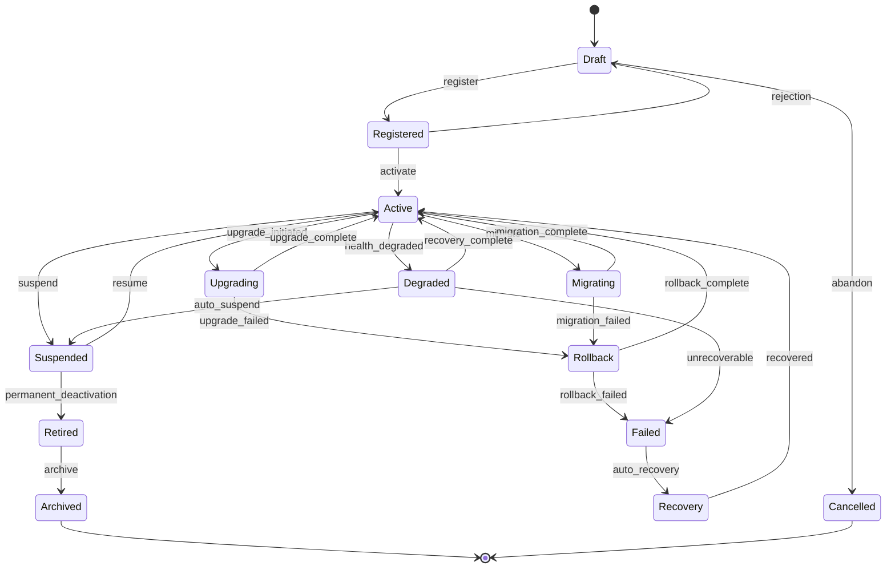
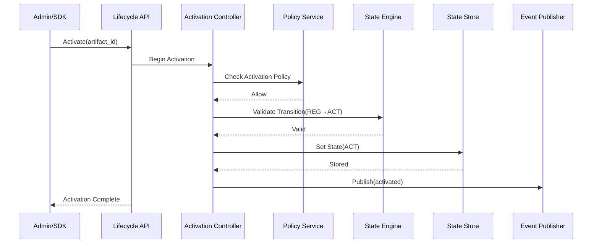

# SMOS-729 — Runtime Lifecycle Architecture

## 1. Document Control

| Field          | Value                                       |
| -------------- | ------------------------------------------- |
| Document ID    | SMOS-729                                    |
| Document Name  | Runtime Lifecycle Architecture              |
| Phase          | P7.S04                                      |
| Version        | 1.0.0-draft                                 |
| Status         | Draft                                       |
| Classification | Enterprise Architecture — Runtime Lifecycle |
| Owner          | Xennic                                      |
| Created        | 2026-07-02                                  |
| Supersedes     | —                                           |

## 2. Purpose & Scope

The **Runtime Lifecycle Architecture** defines the complete lifecycle governing every runtime artifact in the Xennic platform — workflows, engines, agents, knowledge objects, policies, tools, models, plugins, connectors, and execution plans. It establishes the state model, transition rules, lifecycle manager components, governance, and observability for all runtime artifacts from creation through archival.

## 3. Lifecycle Overview

All runtime artifacts follow a unified lifecycle with artifact-specific specializations:

```
Creation → Registration → Activation → Operation → Suspension → Resume → Upgrade → Migration → Retirement → Archival
```

Each transition is governed by:

- **Policy**: Conditions that must be satisfied
- **Validation**: Pre-transition checks
- **Authorization**: Permission level required
- **Observability**: Metrics and events emitted
- **Recovery**: Rollback path on failure

## 4. Lifecycle Manager Architecture

```mermaid
graph TB
    subgraph "Runtime Lifecycle Manager"
        direction TB
        LMA[Lifecycle API]

        subgraph "Lifecycle Controllers"
            LC_CREATE[Creation Controller]
            LC_ACT[Activation Controller]
            LC_SUS[Suspension Controller]
            LC_UPG[Upgrade Controller]
            LC_MIG[Migration Controller]
            LC_RET[Retirement Controller]
            LC_ARC[Archival Controller]
        end

        subgraph "Lifecycle Services"
            LS_VAL[Validation Service]
            LS_POL[Policy Enforcement]
            LS_STATE[State Transition Engine]
            LS_AUTH[Authorization Service]
        end

        subgraph "Lifecycle Stores"
            LST_REG[Registration Store]
            LST_STATE[State Store]
            LST_HIST[History Store]
            LST_VER[Version Store]
        end

        subgraph "Lifecycle Observability"
            LO_MET[Metrics Collector]
            LO_EVT[Event Publisher]
            LO_AUD[Audit Recorder]
            LO_ALM[Alert Manager]
        end
    end

    LMA --> LC_CREATE
    LMA --> LC_ACT
    LMA --> LC_SUS
    LMA --> LC_UPG
    LMA --> LC_MIG
    LMA --> LC_RET
    LMA --> LC_ARC

    LC_CREATE --> LS_VAL
    LC_ACT --> LS_POL
    LC_UPG --> LS_STATE
    LC_MIG --> LS_AUTH

    LS_STATE --> LST_STATE
    LS_VAL --> LST_REG
    LS_AUTH --> LST_HIST

    LMA --> LO_MET
    LMA --> LO_EVT
    LMA --> LO_AUD
    LMA --> LO_ALM

    subgraph "Runtime Artifacts"
        WKF[Workflows]
        ENG[Runtime Engines]
        AGT[AI-001..014 Agents]
        KNW[Knowledge Objects]
        POL[Policies]
        TOL[Tools]
        MDL[Models]
        PLG[Plugins]
        CON[Connectors]
        EPL[Execution Plans]
    end

    LC_CREATE --> WKF
    LC_CREATE --> ENG
    LC_CREATE --> AGT
    LC_CREATE --> KNW
    LC_CREATE --> POL
    LC_CREATE --> TOL
    LC_CREATE --> MDL
    LC_CREATE --> PLG
    LC_CREATE --> CON
    LC_CREATE --> EPL

    style LMA fill:#2c3e50,color:#fff
    style LC_CREATE fill:#27ae60,color:#fff
    style LC_ACT fill:#2980b9,color:#fff
    style LC_UPG fill:#8e44ad,color:#fff
    style LC_MIG fill:#f39c12,color:#fff
    style LC_RET fill:#e74c3c,color:#fff
    style LC_ARC fill:#7f8c8d,color:#fff
    style LS_STATE fill:#16a085,color:#fff
    style LO_EVT fill:#d4ac0d,color:#fff
```



## 5. Artifact Types & Lifecycle Specialization

| Artifact         | Lifecycle Variant | Key Transitions                                            |
| ---------------- | ----------------- | ---------------------------------------------------------- |
| Workflow         | Standard          | Create → Register → Activate → Execute → Update → Retire   |
| Runtime Engine   | Managed           | Build → Deploy → Activate → Upgrade → Migrate → Retire     |
| Agent            | Governed          | Define → Train → Certify → Activate → Update → Archive     |
| Knowledge Object | Curated           | Create → Validate → Publish → Review → Deprecate → Archive |
| Policy           | Governed          | Draft → Review → Approve → Activate → Update → Deprecate   |
| Tool             | Registered        | Define → Certify → Register → Activate → Update → Retire   |
| Model            | Managed           | Train → Evaluate → Deploy → Monitor → Update → Retire      |
| Plugin           | Versioned         | Develop → Test → Certify → Publish → Update → Retire       |
| Connector        | Standard          | Define → Test → Register → Activate → Update → Retire      |
| Execution Plan   | Transient         | Create → Validate → Execute → Complete → Archive           |

## 6. Lifecycle State Machine



## 7. Lifecycle Phase Definitions

| Phase      | Code | Description                                 | Duration           |
| ---------- | ---- | ------------------------------------------- | ------------------ |
| Draft      | DRT  | Initial creation, not yet usable            | Indefinite         |
| Registered | REG  | Registered in registry, awaiting activation | Configurable       |
| Active     | ACT  | Operational, serving requests               | Indefinite         |
| Upgrading  | UPG  | In-place version upgrade                    | Transitional       |
| Suspended  | SUS  | Temporarily disabled                        | Configurable       |
| Migrating  | MIG  | Moving to new runtime/region                | Transitional       |
| Degraded   | DEG  | Performance or health degraded              | Configurable       |
| Failed     | FAL  | Unrecoverable error state                   | Transitional       |
| Recovery   | REC  | Automatic recovery in progress              | Transitional       |
| Rollback   | RLB  | Reverting to previous version               | Transitional       |
| Retired    | RET  | Permanently deactivated                     | Configurable grace |
| Archived   | ARC  | Preserved for compliance                    | Permanent          |
| Cancelled  | CAN  | Abandoned before activation                 | Permanent          |

## 8. Lifecycle Policy

```json
{
  "$schema": "http://json-schema.org/draft-07/schema#",
  "title": "LifecyclePolicy",
  "type": "object",
  "required": ["lifecycle_id", "artifact_type", "rules"],
  "properties": {
    "lifecycle_id": { "type": "string", "pattern": "^LCP-[A-Z0-9]{8}$" },
    "artifact_type": {
      "type": "string",
      "enum": [
        "workflow",
        "engine",
        "agent",
        "knowledge",
        "policy",
        "tool",
        "model",
        "plugin",
        "connector",
        "plan"
      ]
    },
    "rules": {
      "type": "array",
      "items": {
        "type": "object",
        "required": ["from_state", "to_state", "conditions"],
        "properties": {
          "from_state": { "type": "string" },
          "to_state": { "type": "string" },
          "conditions": { "type": "array", "items": { "type": "string" } },
          "authorization": { "type": "string", "enum": ["A-1", "A-2", "A-3", "A-4"] },
          "timeout_ms": { "type": "integer" },
          "auto_remediate": { "type": "boolean" }
        }
      }
    },
    "default_transition_timeout_ms": { "type": "integer", "default": 300000 },
    "version": { "type": "string" }
  }
}
```

## 9. Lifecycle Event Schema

```json
{
  "$schema": "http://json-schema.org/draft-07/schema#",
  "title": "LifecycleEvent",
  "type": "object",
  "required": [
    "event_id",
    "artifact_id",
    "artifact_type",
    "from_state",
    "to_state",
    "timestamp",
    "actor"
  ],
  "properties": {
    "event_id": { "type": "string", "format": "uuid" },
    "artifact_id": { "type": "string" },
    "artifact_type": { "type": "string" },
    "from_state": { "type": "string" },
    "to_state": { "type": "string" },
    "transition": { "type": "string" },
    "timestamp": { "type": "string", "format": "date-time" },
    "actor": { "type": "object", "properties": { "id": {}, "type": {} } },
    "result": { "type": "string", "enum": ["success", "failure", "timeout"] },
    "duration_ms": { "type": "integer" },
    "reason": { "type": "string" },
    "tenant_id": { "type": "string" },
    "correlation_id": { "type": "string" }
  }
}
```

## 10. Lifecycle Transition Matrix

| Transition           | Pre-condition                    | Post-condition                       | Validation                            |
| -------------------- | -------------------------------- | ------------------------------------ | ------------------------------------- |
| Draft → Registered   | Complete definition, metadata    | Registered in registry               | Schema validation, duplicate check    |
| Registered → Active  | Policy allow, resource available | Operational, accepting work          | Policy evaluation, resource check     |
| Active → Upgrading   | Compatible target version        | Quiesced, upgrade in progress        | Compatibility check, dependency check |
| Active → Suspended   | Graceful quiesce allowed         | Suspended, no active work            | Active work drained                   |
| Active → Migrating   | Target runtime ready             | Migration in progress                | Target readiness, capacity check      |
| Active → Degraded    | Health metric below threshold    | Degraded, reduced capacity           | Automated health check                |
| Suspended → Active   | Resume policy allow              | Fully operational                    | Resource availability                 |
| Upgrading → Active   | Upgrade verified                 | New version active                   | Smoke test, health check              |
| Upgrading → Rollback | Upgrade failure detected         | Previous version restored            | Rollback validation                   |
| Migrating → Active   | Migration verified               | Active on target                     | Data integrity, health check          |
| Migrating → Rollback | Migration failure                | Source restored, migration cancelled | Rollback validation                   |
| Degraded → Active    | Health recovered                 | Full capacity restored               | Health metric threshold               |
| Degraded → Suspended | Auto-suspend policy triggered    | Suspended, preserved                 | Policy evaluation                     |
| Active → Retired     | Deactivation approved            | Permanently disabled                 | Approval audit, data check            |
| Retired → Archived   | Grace period expired             | Preserved for compliance             | Retention policy, data export         |

## 11. Lifecycle Controller — Registration

```json
{
  "$schema": "http://json-schema.org/draft-07/schema#",
  "title": "ArtifactRegistration",
  "type": "object",
  "required": ["artifact_id", "artifact_type", "version", "definition", "owner"],
  "properties": {
    "artifact_id": { "type": "string" },
    "artifact_type": { "type": "string" },
    "name": { "type": "string" },
    "version": { "type": "string", "pattern": "^\\d+\\.\\d+\\.\\d+$" },
    "definition": { "type": "object" },
    "owner": { "type": "string" },
    "tenant_id": { "type": "string" },
    "tags": { "type": "object" },
    "dependencies": {
      "type": "array",
      "items": {
        "type": "object",
        "properties": {
          "artifact_id": { "type": "string" },
          "version_constraint": { "type": "string" },
          "optional": { "type": "boolean" }
        }
      }
    },
    "capabilities": { "type": "array", "items": { "type": "string" } },
    "compatibility": { "type": "array", "items": { "type": "string" } },
    "labels": { "type": "object" },
    "created_at": { "type": "string", "format": "date-time" }
  }
}
```

## 12. Lifecycle Controller — Activation



## 13. Lifecycle Controller — Upgrade

| Step | Action                 | Validation                       |
| ---- | ---------------------- | -------------------------------- |
| 1    | Initiate upgrade       | Target version compatible        |
| 2    | Quiesce artifact       | Drain active work, no new work   |
| 3    | Snapshot current state | Full state backup                |
| 4    | Apply upgrade          | Version definition update        |
| 5    | Verify upgrade         | Smoke test, health check         |
| 6    | Commit upgrade         | Mark as active with new version  |
| 7    | On failure → Rollback  | Restore snapshot, revert version |

## 14. Lifecycle Controller — Migration

| Phase       | Action                        | Responsible          |
| ----------- | ----------------------------- | -------------------- |
| Planning    | Assess source, select target  | Migration Controller |
| Preparation | Provision target, sync state  | Resource Manager     |
| Cutover     | Quiesce source, redirect      | Orchestrator         |
| Validation  | Test target, verify integrity | Validation Service   |
| Completion  | Deregister source (optional)  | Migration Controller |
| Rollback    | Revert to source on failure   | Migration Controller |

## 15. Multi-Tenancy in Lifecycle

| Aspect     | Design                                                   |
| ---------- | -------------------------------------------------------- |
| Isolation  | Each tenant's artifacts have independent lifecycle       |
| Quota      | Lifecycle transitions subject to tenant quotas           |
| Policy     | Per-tenant lifecycle policies                            |
| Visibility | Tenant sees only own artifact lifecycle                  |
| Governance | Cross-tenant lifecycle audit available to platform admin |

## 16. Lifecycle Security

| Concern                 | Control                                  |
| ----------------------- | ---------------------------------------- |
| Unauthorized transition | ABAC check on every transition           |
| Tampered state          | Immutable state store with hash chain    |
| Replay attack           | Nonce enforcement on transition requests |
| Privilege escalation    | Strict role mapping to transition types  |

## 17. Lifecycle Metrics

| Metric                  | Description                  | Source               |
| ----------------------- | ---------------------------- | -------------------- |
| lifecycle_transitions   | Total transitions per period | History Store        |
| transition_duration_ms  | Time per transition          | History Store        |
| transition_success_rate | Successful / total           | History Store        |
| active_artifacts        | Currently active             | State Store          |
| suspended_artifacts     | Currently suspended          | State Store          |
| retired_artifacts       | Total retired                | State Store          |
| upgrade_duration_ms     | Upgrade time                 | Upgrade Controller   |
| migration_duration_ms   | Migration time               | Migration Controller |
| rollback_frequency      | Rollbacks per period         | History Store        |

## 18. Lifecycle Events Catalog

| Event                        | Triggered By            | Consumers                      |
| ---------------------------- | ----------------------- | ------------------------------ |
| artifact.registered          | Registration Controller | Registry, Monitoring           |
| artifact.activated           | Activation Controller   | Orchestrator, Scheduler        |
| artifact.suspended           | Suspension Controller   | Orchestrator, Resource Manager |
| artifact.resumed             | Resume Controller       | Orchestrator                   |
| artifact.upgrade.started     | Upgrade Controller      | Monitoring, Audit              |
| artifact.upgrade.completed   | Upgrade Controller      | Registry, Version Store        |
| artifact.upgrade.failed      | Upgrade Controller      | Alert Manager, Orchestrator    |
| artifact.migration.started   | Migration Controller    | Monitoring, Audit              |
| artifact.migration.completed | Migration Controller    | Registry, Orchestrator         |
| artifact.migration.failed    | Migration Controller    | Alert Manager, Rollback        |
| artifact.rollback.completed  | Rollback Controller     | Registry, Audit                |
| artifact.degraded            | Health Monitor          | Alert Manager, Orchestrator    |
| artifact.retired             | Retirement Controller   | Registry, Orchestrator         |
| artifact.archived            | Archival Controller     | Compliance, Storage            |

## 19. Cross-Reference Matrix

| Document | Relationship                                                   |
| -------- | -------------------------------------------------------------- |
| SMOS-702 | State Machine — lifecycle extends runtime state machine        |
| SMOS-711 | Persistence — lifecycle state persistence                      |
| SMOS-713 | Checkpoint — state snapshots for upgrade/migration             |
| SMOS-714 | Saga — compensation for failed lifecycle transitions           |
| SMOS-719 | Control Plane — lifecycle manager is a control plane component |
| SMOS-720 | Orchestrator — lifecycle transitions orchestrated              |
| SMOS-721 | Policy Engine — lifecycle policies evaluated                   |
| SMOS-722 | Resource — activation/retirement affects resources             |
| SMOS-724 | Multi-Region — cross-region artifact migration                 |
| SMOS-725 | Governance — lifecycle governance                              |
| SMOS-730 | State Evolution — detailed state model                         |
| SMOS-731 | Version Management — upgrade/rollback details                  |
| SMOS-732 | Migration — cross-region migration                             |
| SMOS-736 | Retirement — deactivation and archival                         |
| KNW-\*   | Knowledge — knowledge object lifecycle                         |

---

**End of SMOS-729**
