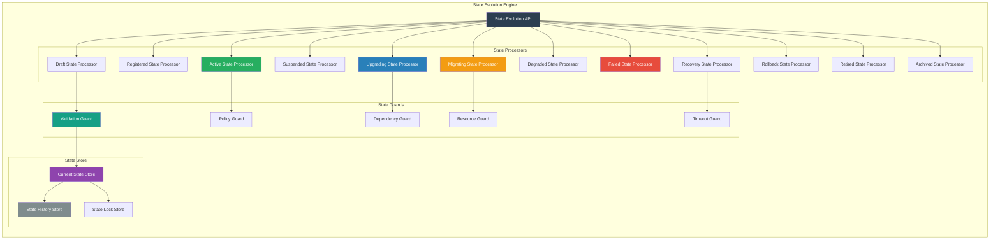
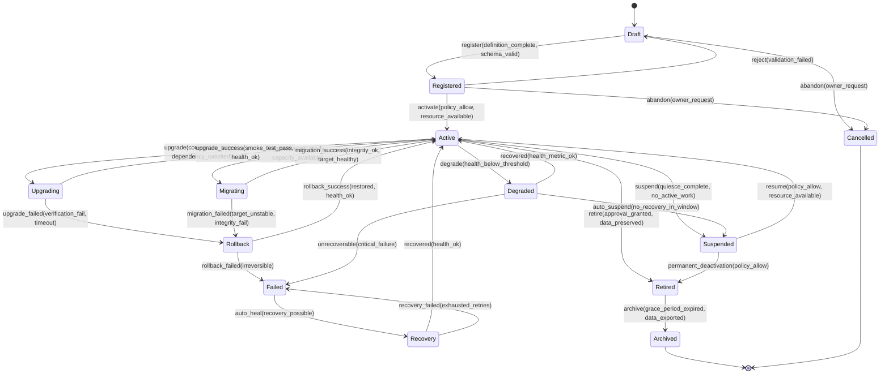

# SMOS-730 — Runtime State Evolution

## 1. Document Control

| Field          | Value                                       |
| -------------- | ------------------------------------------- |
| Document ID    | SMOS-730                                    |
| Document Name  | Runtime State Evolution                     |
| Phase          | P7.S04                                      |
| Version        | 1.0.0-draft                                 |
| Status         | Draft                                       |
| Classification | Enterprise Architecture — Runtime Lifecycle |
| Owner          | Xennic                                      |
| Created        | 2026-07-02                                  |
| Supersedes     | SMOS-702 (state extension for lifecycle)    |

## 2. Purpose & Scope

The **Runtime State Evolution** document defines the complete, deterministic state model governing all runtime artifacts across their lifecycle. It extends SMOS-702 (Execution State Machine) with lifecycle-specific states, transitions, guards, and compensation flows.

## 3. Unified State Model

Every runtime artifact exists in exactly one state at any time. The state space is divided into three domains:

| Domain       | States                                                             | Purpose                    |
| ------------ | ------------------------------------------------------------------ | -------------------------- |
| Lifecycle    | Draft, Registered, Active, Suspended, Retired, Archived, Cancelled | Lifecycle management       |
| Operational  | Active, Degraded, Failed, Recovery                                 | Runtime health & execution |
| Transitional | Upgrading, Migrating, Rollback                                     | Active transformations     |

## 4. State Evolution Engine



## 5. Deterministic State Machine



## 6. State Transition Guard Definitions

```json
{
  "$schema": "http://json-schema.org/draft-07/schema#",
  "title": "StateTransitionGuard",
  "type": "object",
  "required": ["guard_id", "transition", "conditions"],
  "properties": {
    "guard_id": { "type": "string" },
    "transition": { "type": "string", "pattern": "^[A-Za-z]+→[A-Za-z]+$" },
    "conditions": {
      "type": "array",
      "items": {
        "type": "object",
        "required": ["condition", "evaluator"],
        "properties": {
          "condition": { "type": "string" },
          "evaluator": {
            "type": "string",
            "enum": ["policy", "schema", "resource", "dependency", "health", "approval"]
          },
          "failure_action": { "type": "string", "enum": ["block", "warn", "bypass_with_approval"] }
        }
      }
    },
    "timeout_ms": { "type": "integer" },
    "auto_retry": { "type": "boolean" },
    "max_retries": { "type": "integer" },
    "compensation": { "type": "string" }
  }
}
```

## 7. State Transition Matrix (Complete)

| From → To            | Guard                                   | Timeout    | Auto-Retry | Compensation                     |
| -------------------- | --------------------------------------- | ---------- | ---------- | -------------------------------- |
| Draft → Registered   | Schema valid, definition complete       | 30s        | No         | Delete registration              |
| Draft → Cancelled    | Owner verified                          | 10s        | No         | None                             |
| Registered → Active  | Policy allow, resource OK, no duplicate | 60s        | 2          | Deactivate, release resources    |
| Registered → Draft   | Validation reason recorded              | 10s        | No         | None                             |
| Active → Upgrading   | Compatible target, deps satisfied       | 30s        | 1          | Cancel upgrade, resume active    |
| Active → Suspended   | No active work, quiesce OK              | 300s       | 2          | Resume                           |
| Active → Migrating   | Target ready, capacity OK               | 30s        | No         | Cancel migration                 |
| Active → Degraded    | Health metric below threshold           | 10s (auto) | 3          | None (auto)                      |
| Active → Retired     | Approval audit, data preserved          | 600s       | No         | Undo retirement if within window |
| Upgrading → Active   | Smoke test pass, health OK              | 300s       | 3          | None                             |
| Upgrading → Rollback | Verification fail, timeout              | 10s        | No         | Restore snapshot                 |
| Rollback → Active    | Restored, health OK                     | 120s       | 2          | None                             |
| Rollback → Failed    | Irreversible error                      | 10s        | No         | Escalate to admin                |
| Suspended → Active   | Policy allow, resource OK               | 60s        | 2          | Re-suspend                       |
| Suspended → Retired  | Policy allow, data preserved            | 300s       | No         | Undo retirement if within window |
| Migrating → Active   | Integrity OK, target healthy            | 300s       | 3          | Reverse migration                |
| Migrating → Rollback | Target unstable, integrity fail         | 30s        | 1          | Restore source                   |
| Degraded → Active    | Health metric OK                        | 30s (auto) | 3          | None                             |
| Degraded → Suspended | No recovery in window                   | 600s       | No         | Resume                           |
| Degraded → Failed    | Critical failure                        | 10s (auto) | No         | Escalate                         |
| Failed → Recovery    | Recovery possible                       | 10s        | 3          | None                             |
| Recovery → Active    | Health OK                               | 120s       | 3          | Re-fail                          |
| Recovery → Failed    | Exhausted retries                       | 10s        | No         | Escalate                         |
| Retired → Archived   | Grace expired, data exported            | 600s       | No         | Restore from archive             |

## 8. State History

```json
{
  "$schema": "http://json-schema.org/draft-07/schema#",
  "title": "StateHistoryRecord",
  "type": "object",
  "required": ["record_id", "artifact_id", "from_state", "to_state", "transition", "timestamp"],
  "properties": {
    "record_id": { "type": "string", "format": "uuid" },
    "artifact_id": { "type": "string" },
    "from_state": { "type": "string" },
    "to_state": { "type": "string" },
    "transition": { "type": "string" },
    "timestamp": { "type": "string", "format": "date-time" },
    "duration_ms": { "type": "integer" },
    "actor": { "type": "string" },
    "reason": { "type": "string" },
    "result": { "type": "string", "enum": ["success", "failure", "timeout"] },
    "metadata": { "type": "object" },
    "hash": { "type": "string", "description": "Immutable chain hash" },
    "previous_hash": { "type": "string" }
  }
}
```

## 9. Concurrent State Constraints

| Constraint               | Rule                                                      |
| ------------------------ | --------------------------------------------------------- |
| Single State             | An artifact is in exactly one state at all times          |
| No Skipping              | Transitions must follow defined edges (no Draft → Active) |
| Idempotent Transitions   | Re-applying same transition yields same result            |
| Deterministic Order      | Given same input, same output                             |
| Lock per Artifact        | No concurrent transitions on the same artifact            |
| Parent-Child Consistency | If parent transitions, children are constrained           |

## 10. State Lock Model

```json
{
  "$schema": "http://json-schema.org/draft-07/schema#",
  "title": "StateLock",
  "type": "object",
  "required": ["lock_id", "artifact_id", "holder", "acquired_at", "ttl_ms"],
  "properties": {
    "lock_id": { "type": "string", "format": "uuid" },
    "artifact_id": { "type": "string" },
    "holder": { "type": "string" },
    "acquired_at": { "type": "string", "format": "date-time" },
    "ttl_ms": { "type": "integer" },
    "purpose": {
      "type": "string",
      "enum": ["upgrade", "migration", "suspension", "retirement", "transition"]
    }
  }
}
```

## 11. State Observability

| Aspect        | Mechanism                                                | Data                               |
| ------------- | -------------------------------------------------------- | ---------------------------------- |
| Current State | State Store query                                        | artifact_id → current state        |
| State History | History Store query                                      | All transitions for artifact       |
| State Metrics | Metrics collector                                        | Per-state counts, transition rates |
| State Alerts  | Alert on: Failed, Rollback Failed, Suspended > threshold | Alert event                        |
| State Audit   | Immutable history with chain hash                        | Compliance evidence                |

## 12. Failure Recovery per State

| State     | Failure Mode        | Recovery Action               | RTO  |
| --------- | ------------------- | ----------------------------- | ---- |
| Upgrading | Timeout             | Auto-rollback                 | 60s  |
| Upgrading | Verification fail   | Auto-rollback                 | 30s  |
| Migrating | Target unstable     | Rollback to source            | 120s |
| Migrating | Data integrity fail | Rollback, full re-sync        | 300s |
| Degraded  | Auto-recovery fails | Suspend → notify admin        | 600s |
| Failed    | Non-critical        | Auto-recovery (3 retries)     | 120s |
| Failed    | Critical            | Escalate, manual intervention | —    |
| Rollback  | Rollback fails      | Escalate, manual restore      | —    |

## 13. Multi-Tenant State Isolation

| Mechanism                           | Description                             |
| ----------------------------------- | --------------------------------------- |
| Tenant-scoped state store           | State data partitioned by tenant        |
| Tenant-specific transition policies | Per-tenant guard configurations         |
| Cross-tenant visibility             | Admin only, with audit                  |
| Tenant state quotas                 | Max active/suspended/retired per tenant |

## 14. State Evolution Metrics

| Metric                  | Description                     | Source           |
| ----------------------- | ------------------------------- | ---------------- |
| current_state_count     | Artifacts per state             | State Store      |
| transition_rate         | Transitions per second          | History Store    |
| transition_success_rate | Successful / total              | History Store    |
| transition_duration_p50 | Median transition time          | History Store    |
| transition_duration_p99 | 99th percentile transition time | History Store    |
| failed_transition_count | Failed transitions              | History Store    |
| lock_contention_rate    | Lock acquisition failures       | State Lock Store |

## 15. Cross-Reference Matrix

| Document | Relationship                                                         |
| -------- | -------------------------------------------------------------------- |
| SMOS-702 | Execution state machine — lifecycle extends with new states          |
| SMOS-729 | Runtime Lifecycle — lifecycle manager uses this state model          |
| SMOS-731 | Version Management — upgrade/rollback states for version transitions |
| SMOS-732 | Migration — migrating state for cross-runtime moves                  |
| SMOS-736 | Retirement — retired and archived states                             |
| SMOS-738 | Blueprint — state model blueprint integration                        |
| SMOS-713 | Checkpoint — state snapshots for transition recovery                 |

---

**End of SMOS-730**
