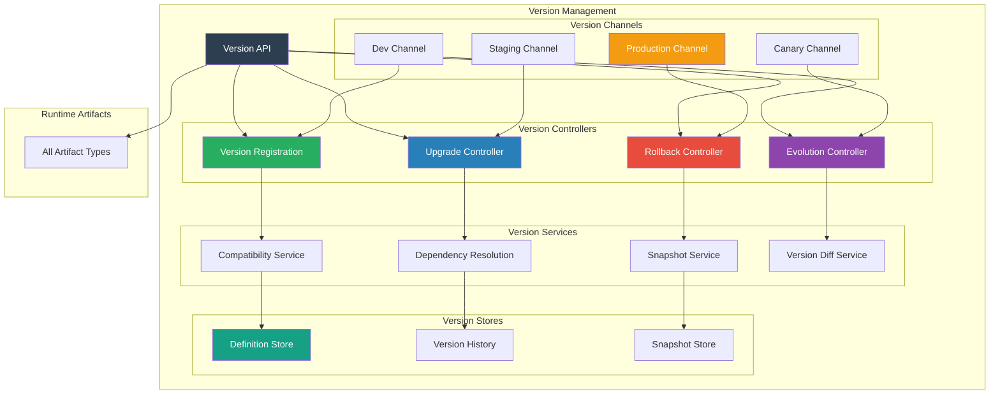
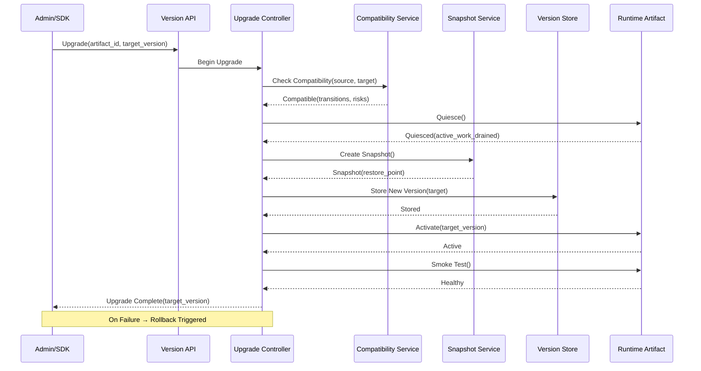
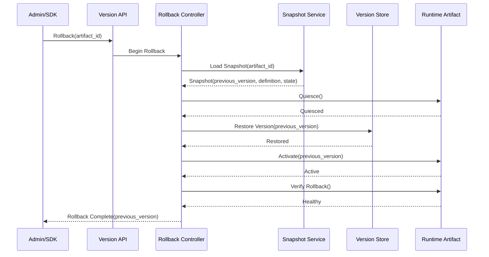
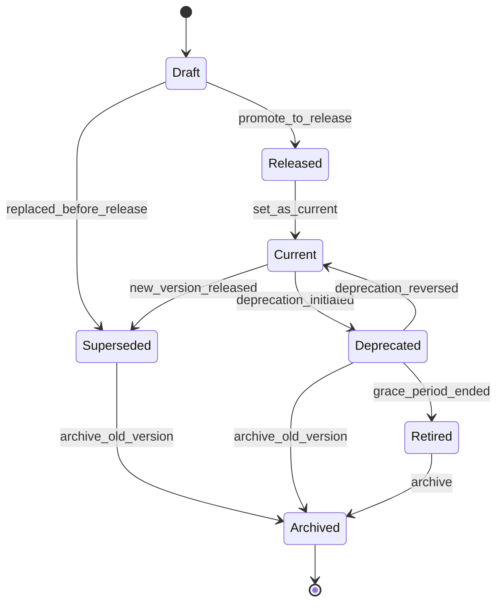

# SMOS-731 — Runtime Version Management

## 1. Document Control

| Field          | Value                                       |
| -------------- | ------------------------------------------- |
| Document ID    | SMOS-731                                    |
| Document Name  | Runtime Version Management                  |
| Phase          | P7.S04                                      |
| Version        | 1.0.0-draft                                 |
| Status         | Draft                                       |
| Classification | Enterprise Architecture — Runtime Lifecycle |
| Owner          | Xennic                                      |
| Created        | 2026-07-02                                  |
| Supersedes     | —                                           |

## 2. Purpose & Scope

The **Runtime Version Management** architecture governs versioning, upgrades, rollbacks, version evolution, compatibility checking, and version lifecycle for all runtime artifacts across the Xennic platform.

## 3. Versioning Architecture



## 4. Versioning Model

All runtime artifacts follow **Semantic Versioning 2.0.0**:

```
MAJOR.MINOR.PATCH[-PRERELEASE][+BUILD]
```

| Component  | Change                      | Impact                           |
| ---------- | --------------------------- | -------------------------------- |
| MAJOR      | Breaking change             | Incompatible with previous major |
| MINOR      | Backward-compatible feature | Compatible within same major     |
| PATCH      | Backward-compatible fix     | Fully compatible                 |
| PRERELEASE | Pre-release indicator       | Not for production               |
| BUILD      | Build metadata              | No version significance          |

## 5. Version Schema

```json
{
  "$schema": "http://json-schema.org/draft-07/schema#",
  "title": "ArtifactVersion",
  "type": "object",
  "required": ["artifact_id", "version", "semver", "definition_hash", "status"],
  "properties": {
    "artifact_id": { "type": "string" },
    "version": {
      "type": "string",
      "pattern": "^\\d+\\.\\d+\\.\\d+(-[a-zA-Z0-9.]+)?(\\+[a-zA-Z0-9.]+)?$"
    },
    "semver": {
      "type": "object",
      "properties": {
        "major": { "type": "integer" },
        "minor": { "type": "integer" },
        "patch": { "type": "integer" },
        "prerelease": { "type": "string" },
        "build": { "type": "string" }
      }
    },
    "definition_hash": { "type": "string" },
    "definition": { "type": "object" },
    "status": {
      "type": "string",
      "enum": ["draft", "released", "deprecated", "superseded", "retired"]
    },
    "previous_version": { "type": "string" },
    "changelog": { "type": "string" },
    "breaking_changes": { "type": "array", "items": { "type": "string" } },
    "compatibility": {
      "type": "object",
      "properties": {
        "min_version": { "type": "string" },
        "max_version": { "type": "string" },
        "incompatible_versions": { "type": "array", "items": { "type": "string" } }
      }
    },
    "dependencies": { "type": "array", "items": { "type": "object" } },
    "release_channel": { "type": "string", "enum": ["dev", "staging", "canary", "production"] },
    "published_at": { "type": "string", "format": "date-time" },
    "checksum": { "type": "string" }
  }
}
```

## 6. Upgrade Flow



## 7. Rollback Flow



## 8. Version Evolution Paths

| Path          | Description            | Example                                |
| ------------- | ---------------------- | -------------------------------------- |
| Minor Upgrade | 1.0.0 → 1.1.0          | Backward-compatible feature addition   |
| Patch Upgrade | 1.0.0 → 1.0.1          | Bug fix, no new features               |
| Major Upgrade | 1.x.x → 2.0.0          | Breaking changes, migration required   |
| Hotfix        | 1.0.0 → 1.0.0-hotfix.1 | Emergency fix bypassing normal release |
| Downgrade     | 1.1.0 → 1.0.0          | Revert minor/major version             |

## 9. Version Evolution State Machine



## 10. Version Policies

| Policy | Description                                     | Enforcement         |
| ------ | ----------------------------------------------- | ------------------- |
| VRP-01 | Versions must follow SemVer                     | Schema validation   |
| VRP-02 | Breaking changes require MAJOR bump             | Compatibility check |
| VRP-03 | All versions must have changelog                | Release gate        |
| VRP-04 | Production versions must be released, not draft | Channel validation  |
| VRP-05 | Rollback only within same MAJOR version         | Rollback guard      |
| VRP-06 | Hotfix bypasses minor but must be merged        | Audit requirement   |
| VRP-07 | Current version cannot be deleted               | Store constraint    |
| VRP-08 | Deprecation requires N-day notice               | Governance rule     |

## 11. Snapshot Model

```json
{
  "$schema": "http://json-schema.org/draft-07/schema#",
  "title": "VersionSnapshot",
  "type": "object",
  "required": ["snapshot_id", "artifact_id", "version", "definition", "state", "created_at"],
  "properties": {
    "snapshot_id": { "type": "string", "format": "uuid" },
    "artifact_id": { "type": "string" },
    "version": { "type": "string" },
    "definition": { "type": "object" },
    "state": { "type": "object" },
    "metadata": { "type": "object" },
    "created_at": { "type": "string", "format": "date-time" },
    "ttl_days": { "type": "integer", "description": "Snapshot retention in days" },
    "checksum": { "type": "string" }
  }
}
```

## 12. Version Lifecycle Events

```json
{
  "$schema": "http://json-schema.org/draft-07/schema#",
  "title": "VersionEvent",
  "type": "object",
  "required": ["event_id", "artifact_id", "event_type", "new_version", "old_version", "timestamp"],
  "properties": {
    "event_id": { "type": "string", "format": "uuid" },
    "artifact_id": { "type": "string" },
    "event_type": {
      "type": "string",
      "enum": [
        "version.created",
        "version.released",
        "version.upgrade.started",
        "version.upgrade.completed",
        "version.upgrade.failed",
        "version.rollback.started",
        "version.rollback.completed",
        "version.rollback.failed",
        "version.deprecated",
        "version.superseded",
        "version.retired",
        "version.snapshot.created",
        "version.snapshot.restored"
      ]
    },
    "new_version": { "type": "string" },
    "old_version": { "type": "string" },
    "timestamp": { "type": "string", "format": "date-time" },
    "actor": { "type": "string" },
    "reason": { "type": "string" },
    "channel": { "type": "string" },
    "duration_ms": { "type": "integer" }
  }
}
```

## 13. Snapshot Retention Policy

| Snapshot Type | Retention | Use Case               |
| ------------- | --------- | ---------------------- |
| Pre-upgrade   | 30 days   | Rollback recovery      |
| Pre-migration | 60 days   | Migration rollback     |
| Periodic      | 7 days    | General recovery       |
| Compliance    | 1 year    | Regulatory requirement |

## 14. Multi-Tenant Version Isolation

| Mechanism                     | Description                          |
| ----------------------------- | ------------------------------------ |
| Per-tenant version channels   | Dev/staging/production per tenant    |
| Tenant-scoped version history | Each tenant sees own history         |
| Cross-tenant version sharing  | Published library versions shared    |
| Tenant version quotas         | Max versions per artifact per tenant |

## 15. Version Metrics

| Metric                  | Description                 | Source              |
| ----------------------- | --------------------------- | ------------------- |
| version_count           | Versions per artifact       | Version Store       |
| upgrade_duration_ms     | Upgrade time                | Upgrade Controller  |
| rollback_duration_ms    | Rollback time               | Rollback Controller |
| upgrade_success_rate    | Successful / total upgrades | History             |
| rollback_frequency      | Rollbacks per period        | History             |
| snapshot_restore_time   | Snapshot restore time       | Snapshot Service    |
| version_deprecation_age | Age at deprecation          | Version Store       |

## 16. Cross-Reference Matrix

| Document | Relationship                                      |
| -------- | ------------------------------------------------- |
| SMOS-729 | Lifecycle — version transitions part of lifecycle |
| SMOS-730 | State Evolution — upgrade/rollback states         |
| SMOS-732 | Migration — version migration across runtimes     |
| SMOS-733 | Compatibility — version compatibility checks      |
| SMOS-734 | Dependency Graph — version dependency resolution  |
| SMOS-735 | Release Management — version release channels     |
| SMOS-737 | Governance — version governance rules             |
| SMOS-738 | Blueprint — version management integration        |

---

**End of SMOS-731**
