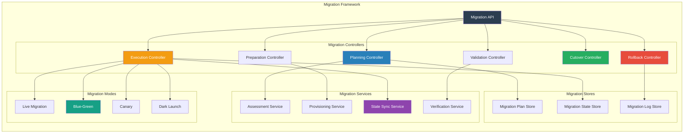
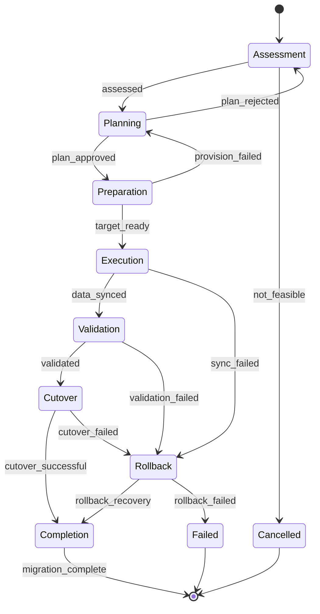
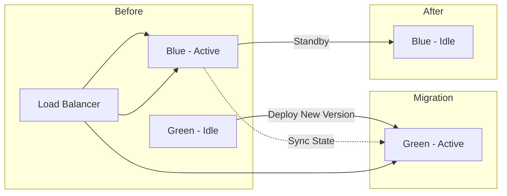

# SMOS-732 — Runtime Migration Architecture

## 1. Document Control

| Field          | Value                                       |
| -------------- | ------------------------------------------- |
| Document ID    | SMOS-732                                    |
| Document Name  | Runtime Migration Architecture              |
| Phase          | P7.S04                                      |
| Version        | 1.0.0-draft                                 |
| Status         | Draft                                       |
| Classification | Enterprise Architecture — Runtime Lifecycle |
| Owner          | Xennic                                      |
| Created        | 2026-07-02                                  |
| Supersedes     | —                                           |

## 2. Purpose & Scope

The **Runtime Migration Architecture** defines the complete framework for migrating runtime artifacts across instances, regions, versions, and infrastructure — including migration planning, execution, validation, rollback, and governance.

## 3. Migration Architecture Overview



## 4. Migration Types

| Type                     | Scope                               | Downtime            | Complexity |
| ------------------------ | ----------------------------------- | ------------------- | ---------- |
| Version Migration        | Same artifact, newer version        | Minimal             | Low        |
| Runtime Migration        | Move to different runtime instance  | Configurable        | Medium     |
| Region Migration         | Move to different geographic region | Configurable        | High       |
| Infrastructure Migration | Move to different infrastructure    | Planned             | High       |
| Data Migration           | Knowledge store relocation          | Dependent on volume | Medium     |
| Tenant Migration         | Re-assign between tenant scopes     | Minimal             | Medium     |

## 5. Migration Lifecycle



## 6. Migration Plan Schema

```json
{
  "$schema": "http://json-schema.org/draft-07/schema#",
  "title": "MigrationPlan",
  "type": "object",
  "required": ["plan_id", "artifact_id", "source", "target", "strategy", "phases"],
  "properties": {
    "plan_id": { "type": "string", "format": "uuid" },
    "artifact_id": { "type": "string" },
    "artifact_type": { "type": "string" },
    "source": {
      "type": "object",
      "properties": {
        "runtime_id": { "type": "string" },
        "region": { "type": "string" },
        "version": { "type": "string" },
        "snapshot_id": { "type": "string" }
      }
    },
    "target": {
      "type": "object",
      "properties": {
        "runtime_id": { "type": "string" },
        "region": { "type": "string" },
        "version": { "type": "string" },
        "infrastructure": { "type": "string" }
      }
    },
    "strategy": {
      "type": "string",
      "enum": ["live", "blue_green", "canary", "dark_launch"]
    },
    "phases": {
      "type": "array",
      "items": {
        "type": "object",
        "properties": {
          "name": { "type": "string" },
          "duration_estimate": { "type": "string" },
          "validation_gate": { "type": "string" },
          "rollback_procedure": { "type": "string" }
        }
      }
    },
    "risks": { "type": "array", "items": { "type": "object" } },
    "approval_required": { "type": "boolean" },
    "max_downtime_seconds": { "type": "integer" },
    "rto": { "type": "string" },
    "rpo": { "type": "string" },
    "created_at": { "type": "string", "format": "date-time" }
  }
}
```

## 7. Migration Strategies

### 7.1 Blue-Green Migration



| Phase | Action                                     | Validation                 |
| ----- | ------------------------------------------ | -------------------------- |
| 1     | Deploy new version to inactive environment | Deployment verification    |
| 2     | Sync state to inactive environment         | State consistency check    |
| 3     | Route traffic to new environment           | Smoke test                 |
| 4     | Monitor new environment                    | Health metrics (N minutes) |
| 5     | Deprecate old environment                  | Deregistration             |

### 7.2 Canary Migration

| Phase | Traffic % | Duration | Validation                     |
| ----- | --------- | -------- | ------------------------------ |
| 1     | 5%        | 10 min   | Error rate < 0.1%              |
| 2     | 25%       | 30 min   | Error rate < 0.05%, latency OK |
| 3     | 50%       | 60 min   | All metrics stable             |
| 4     | 100%      | —        | Full production validation     |

### 7.3 Dark Launch

| Phase | Action                         | Validation         |
| ----- | ------------------------------ | ------------------ |
| 1     | Deploy target alongside source | Target operational |
| 2     | Mirror real traffic to target  | Output comparison  |
| 3     | Compare results                | Match rate > 99.9% |
| 4     | Enable target for real traffic | Cutover            |

## 8. State Synchronization

```json
{
  "$schema": "http://json-schema.org/draft-07/schema#",
  "title": "MigrationStateSync",
  "type": "object",
  "required": ["sync_id", "source", "target", "sync_type", "status"],
  "properties": {
    "sync_id": { "type": "string", "format": "uuid" },
    "source": { "type": "object" },
    "target": { "type": "object" },
    "sync_type": { "type": "string", "enum": ["full", "incremental", "continuous"] },
    "status": { "type": "string", "enum": ["pending", "syncing", "completed", "failed"] },
    "data_size_bytes": { "type": "integer" },
    "sync_duration_ms": { "type": "integer" },
    "consistency_check": { "type": "object" },
    "verified_at": { "type": "string", "format": "date-time" }
  }
}
```

## 9. Validation Gates

| Gate       | Check                                 | Pass Criteria           | Fail Action             |
| ---------- | ------------------------------------- | ----------------------- | ----------------------- |
| Readiness  | Target provisioned, dependencies OK   | All checks pass         | Abort migration         |
| State Sync | Data fully synced, checksums match    | Checksum match 100%     | Re-sync or abort        |
| Health     | CPU, memory, latency within tolerance | All metrics < threshold | Rollback                |
| Smoke      | Critical paths operational            | All critical paths OK   | Investigate or rollback |
| Load       | Target handles production traffic     | No degradation          | Rollback                |
| Integrity  | Data completeness                     | No data loss detected   | Rollback                |

## 10. Cutover Procedure

| Step | Action                       | Owner                  | Timeout |
| ---- | ---------------------------- | ---------------------- | ------- |
| 1    | Quiesce source artifact      | Migration Controller   | 60s     |
| 2    | Final state sync             | State Sync Service     | 120s    |
| 3    | Verify sync completeness     | Validation Service     | 30s     |
| 4    | Route traffic to target      | Load Balancer          | 10s     |
| 5    | Health check on target       | Health Monitor         | 60s     |
| 6    | Confirm cutover              | Admin (auto or manual) | —       |
| 7    | Deregister source (optional) | Migration Controller   | 30s     |

## 11. Rollback Procedure

| Step | Action                                | Timeout |
| ---- | ------------------------------------- | ------- |
| 1    | Stop traffic to target                | 10s     |
| 2    | Route traffic back to source          | 10s     |
| 3    | Restore source to pre-migration state | 60s     |
| 4    | Verify source health                  | 60s     |
| 5    | Confirm rollback                      | —       |

## 12. Cross-Region Migration

| Aspect         | Design                               |
| -------------- | ------------------------------------ |
| Source Region  | Active region with artifact          |
| Target Region  | Destination region                   |
| State Sync     | Cross-region replication (SMOS-724)  |
| Data Transfer  | Encrypted, chunked, resumable        |
| Latency Impact | Pre-warm target to reduce cold start |
| Compliance     | Data residency validation            |

## 13. Migration Events

```json
{
  "$schema": "http://json-schema.org/draft-07/schema#",
  "title": "MigrationEvent",
  "type": "object",
  "required": ["event_id", "migration_id", "event_type", "timestamp"],
  "properties": {
    "event_id": { "type": "string", "format": "uuid" },
    "migration_id": { "type": "string" },
    "event_type": {
      "type": "string",
      "enum": [
        "migration.assessment.complete",
        "migration.plan.approved",
        "migration.plan.rejected",
        "migration.preparation.complete",
        "migration.execution.started",
        "migration.execution.completed",
        "migration.sync.complete",
        "migration.sync.failed",
        "migration.validation.passed",
        "migration.validation.failed",
        "migration.cutover.started",
        "migration.cutover.completed",
        "migration.rollback.started",
        "migration.rollback.completed",
        "migration.completed",
        "migration.failed"
      ]
    },
    "timestamp": { "type": "string", "format": "date-time" },
    "artifact_id": { "type": "string" },
    "source": { "type": "string" },
    "target": { "type": "string" },
    "duration_ms": { "type": "integer" },
    "result": { "type": "string", "enum": ["success", "failure", "rollback"] }
  }
}
```

## 14. Migration Metrics

| Metric                 | Description            | Source               |
| ---------------------- | ---------------------- | -------------------- |
| migration_duration_ms  | Total migration time   | Migration Controller |
| sync_duration_ms       | State sync time        | Sync Service         |
| cutover_duration_ms    | Cutover time           | Cutover Controller   |
| rollback_duration_ms   | Rollback time          | Rollback Controller  |
| migration_success_rate | Successful / total     | Migration Log        |
| sync_consistency_pct   | Data consistency check | Validation Service   |
| downtime_seconds       | Actual downtime        | Cutover Controller   |
| data_transferred_bytes | Total data moved       | Sync Service         |

## 15. Multi-Tenant Migration

| Aspect                  | Design                                 |
| ----------------------- | -------------------------------------- |
| Tenant Isolation        | Migration operations scoped per tenant |
| Cross-Tenant Migration  | Requires governance approval           |
| Tenant Migration Window | Scheduled per tenant preference        |
| Tenant Notification     | Notify before and after migration      |

## 16. Cross-Reference Matrix

| Document | Relationship                                      |
| -------- | ------------------------------------------------- |
| SMOS-712 | Distributed Execution — cross-region migration    |
| SMOS-713 | Checkpoint — state snapshot for migration         |
| SMOS-719 | Control Plane — Migration Controller is component |
| SMOS-720 | Orchestrator — orchestrates migration flows       |
| SMOS-724 | Multi-Region — cross-region migration             |
| SMOS-729 | Lifecycle — migration as lifecycle transition     |
| SMOS-730 | State Evolution — migrating state                 |
| SMOS-731 | Version — version migration                       |
| SMOS-733 | Compatibility — migration compatibility checks    |
| SMOS-738 | Blueprint — migration blueprint integration       |

---

**End of SMOS-732**
