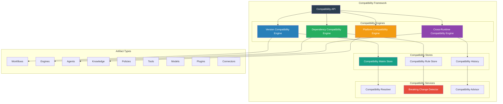
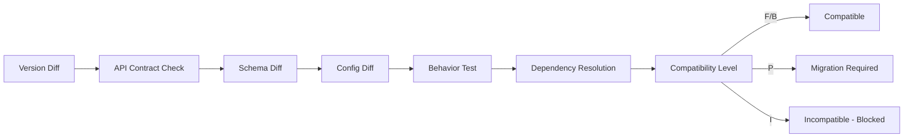

# SMOS-733 — Runtime Compatibility Matrix

## 1. Document Control

| Field          | Value                                       |
| -------------- | ------------------------------------------- |
| Document ID    | SMOS-733                                    |
| Document Name  | Runtime Compatibility Matrix                |
| Phase          | P7.S04                                      |
| Version        | 1.0.0-draft                                 |
| Status         | Draft                                       |
| Classification | Enterprise Architecture — Runtime Lifecycle |
| Owner          | Xennic                                      |
| Created        | 2026-07-02                                  |
| Supersedes     | —                                           |

## 2. Purpose & Scope

The **Runtime Compatibility Matrix** defines the complete compatibility model governing version-to-version, artifact-to-artifact, runtime-to-runtime, and cross-platform compatibility for all runtime artifacts in the Xennic platform.

## 3. Compatibility Architecture



## 4. Compatibility Dimensions

| Dimension     | Code | Description                                      |
| ------------- | ---- | ------------------------------------------------ |
| Version       | VC   | Version-to-version compatibility within artifact |
| Dependency    | DC   | Artifact-to-artifact dependency compatibility    |
| Cross-Runtime | XC   | Compatibility across runtime instances           |
| Platform      | PC   | Platform-level compatibility (regions, infra)    |
| API           | AC   | API contract compatibility                       |
| Data          | DTC  | Data schema and format compatibility             |
| Configuration | CFC  | Configuration schema compatibility               |
| Security      | SC   | Security policy compatibility                    |

## 5. Compatibility Levels

| Level        | Value | Meaning                                         | Allowed Transitions          |
| ------------ | ----- | ----------------------------------------------- | ---------------------------- |
| Full         | F     | Fully compatible, no changes needed             | Any version change           |
| Backward     | B     | Backward compatible, new features added         | Minor/Patch upgrade          |
| Forward      | FW    | Forward compatible with constraints             | Constrained upgrades         |
| Partial      | P     | Partial compatibility, some features restricted | Major upgrade with migration |
| Incompatible | I     | Breaking change, migration required             | Migration path required      |
| Unknown      | U     | Not yet determined                              | Blocked                      |

## 6. Compatibility Matrix Schema

```json
{
  "$schema": "http://json-schema.org/draft-07/schema#",
  "title": "CompatibilityEntry",
  "type": "object",
  "required": ["source_artifact", "source_version", "target_artifact", "target_version", "level"],
  "properties": {
    "entry_id": { "type": "string", "format": "uuid" },
    "source_artifact": { "type": "string" },
    "source_version": { "type": "string" },
    "target_artifact": { "type": "string" },
    "target_version": { "type": "string" },
    "level": { "type": "string", "enum": ["F", "B", "FW", "P", "I", "U"] },
    "verified": { "type": "boolean" },
    "verified_at": { "type": "string", "format": "date-time" },
    "dimensions": {
      "type": "object",
      "properties": {
        "version_compatibility": { "$ref": "#/properties/level" },
        "api_compatibility": { "$ref": "#/properties/level" },
        "data_compatibility": { "$ref": "#/properties/level" },
        "config_compatibility": { "$ref": "#/properties/level" }
      }
    },
    "constraints": { "type": "array", "items": { "type": "string" } },
    "migration_required": { "type": "boolean" },
    "migration_guide": { "type": "string" }
  }
}
```

## 7. Version Compatibility Rules

| Rule  | Condition                                                     | Compatibility                 |
| ----- | ------------------------------------------------------------- | ----------------------------- |
| CR-01 | source.major == target.major AND source.minor == target.minor | Full (F)                      |
| CR-02 | source.major == target.major AND source.minor < target.minor  | Backward (B)                  |
| CR-03 | source.major == target.major AND source.patch < target.patch  | Full (F)                      |
| CR-04 | source.major < target.major                                   | Partial/Incompatible (P/I)    |
| CR-05 | source.major > target.major                                   | Forward (FW) with constraints |
| CR-06 | Prerelease → Release within same version                      | Full (F)                      |
| CR-07 | Different artifact types                                      | Incompatible (I)              |

## 8. Artifact-to-Artifact Compatibility

```json
{
  "$schema": "http://json-schema.org/draft-07/schema#",
  "title": "ArtifactCompatibility",
  "type": "object",
  "required": ["source_type", "target_type", "compatibility_rules"],
  "properties": {
    "source_type": { "type": "string" },
    "target_type": { "type": "string" },
    "compatibility_rules": {
      "type": "array",
      "items": {
        "type": "object",
        "properties": {
          "rule_id": { "type": "string" },
          "condition": { "type": "string" },
          "level": { "type": "string", "enum": ["F", "B", "P", "I"] }
        }
      }
    },
    "default_level": { "type": "string", "enum": ["F", "B", "P", "I"] }
  }
}
```

### Cross-Artifact Compatibility Matrix (Default)

| Source → Target | Workflow | Engine | Agent | Knowledge | Policy | Tool | Model | Plugin | Connector |
| --------------- | -------- | ------ | ----- | --------- | ------ | ---- | ----- | ------ | --------- |
| Workflow        | F        | B      | B     | B         | B      | B    | I     | B      | B         |
| Engine          | B        | F      | B     | B         | B      | B    | B     | B      | B         |
| Agent           | B        | B      | F     | B         | B      | B    | B     | B      | B         |
| Knowledge       | B        | B      | B     | F         | I      | I    | I     | I      | I         |
| Policy          | B        | B      | B     | B         | F      | I    | I     | I      | I         |
| Tool            | B        | B      | B     | I         | I      | F    | I     | B      | B         |
| Model           | B        | B      | B     | I         | I      | I    | F     | I      | I         |
| Plugin          | B        | B      | B     | I         | I      | B    | I     | F      | B         |
| Connector       | B        | B      | B     | I         | I      | B    | I     | B      | F         |

## 9. Breaking Change Detection

```json
{
  "$schema": "http://json-schema.org/draft-07/schema#",
  "title": "BreakingChange",
  "type": "object",
  "required": ["change_id", "artifact_id", "version_from", "version_to", "change_type", "impact"],
  "properties": {
    "change_id": { "type": "string", "format": "uuid" },
    "artifact_id": { "type": "string" },
    "version_from": { "type": "string" },
    "version_to": { "type": "string" },
    "change_type": {
      "type": "string",
      "enum": [
        "api_signature_changed",
        "api_removed",
        "schema_changed",
        "config_removed",
        "behavior_changed",
        "dependency_changed",
        "security_policy_changed",
        "data_format_changed"
      ]
    },
    "impact": {
      "type": "object",
      "properties": {
        "level": { "type": "string", "enum": ["minor", "major", "critical"] },
        "affected_consumers": { "type": "array", "items": { "type": "string" } },
        "migration_effort": { "type": "string" },
        "remediation": { "type": "string" }
      }
    },
    "detected_at": { "type": "string", "format": "date-time" },
    "automated_detection": { "type": "boolean" }
  }
}
```

## 10. Compatibility Verification Pipeline



## 11. Compatibility Events

```json
{
  "$schema": "http://json-schema.org/draft-07/schema#",
  "title": "CompatibilityEvent",
  "type": "object",
  "required": ["event_id", "event_type", "timestamp", "result"],
  "properties": {
    "event_id": { "type": "string", "format": "uuid" },
    "event_type": {
      "type": "string",
      "enum": [
        "compatibility.check.passed",
        "compatibility.check.failed",
        "compatibility.breaking.change.detected",
        "compatibility.matrix.updated",
        "compatibility.verification.started",
        "compatibility.verification.completed"
      ]
    },
    "timestamp": { "type": "string", "format": "date-time" },
    "source_artifact": { "type": "string" },
    "target_artifact": { "type": "string" },
    "result": { "type": "string", "enum": ["compatible", "incompatible", "partial"] },
    "breaking_changes": { "type": "array", "items": { "type": "object" } },
    "migration_required": { "type": "boolean" }
  }
}
```

## 12. Compatibility Governance

| Rule                                                  | Enforcement              |
| ----------------------------------------------------- | ------------------------ |
| All upgrades must pass compatibility check            | Block upgrade on failure |
| Breaking changes recorded in changelog                | Release gate             |
| Compatibility matrix must be updated before release   | CI/CD gate               |
| Cross-artifact compatibility verified on registration | Registration gate        |
| Incompatible artifacts cannot be deployed together    | Deployment gate          |

## 13. Compatibility Metrics

| Metric                       | Description                | Source                   |
| ---------------------------- | -------------------------- | ------------------------ |
| compatibility_check_duration | Check time                 | Compatibility Engine     |
| breaking_change_count        | Breaking changes detected  | Breaking Change Detector |
| compatibility_pass_rate      | Pass / total               | Verification             |
| matrix_coverage              | Coverage of matrix entries | Matrix Store             |
| migration_required_count     | Partial compatibilities    | Compatibility Engine     |

## 14. Cross-Reference Matrix

| Document | Relationship                                        |
| -------- | --------------------------------------------------- |
| SMOS-731 | Version Management — version compatibility checks   |
| SMOS-732 | Migration — migration planning uses compatibility   |
| SMOS-734 | Dependency Graph — dependency compatibility         |
| SMOS-735 | Release Management — compatibility gates on release |
| SMOS-737 | Governance — compatibility governance rules         |
| SMOS-738 | Blueprint — compatibility integration               |
| KNW-\*   | Knowledge — knowledge object compatibility          |

---

**End of SMOS-733**
