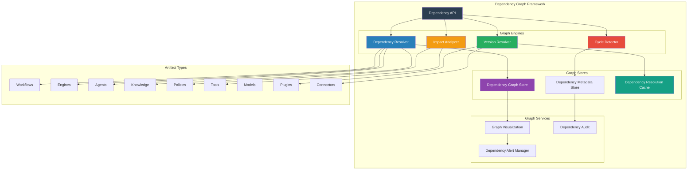
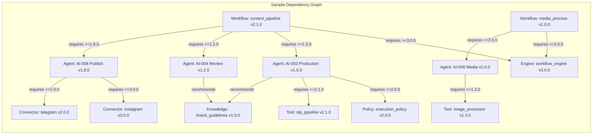

# SMOS-734 — Runtime Dependency Graph

## 1. Document Control

| Field          | Value                                       |
| -------------- | ------------------------------------------- |
| Document ID    | SMOS-734                                    |
| Document Name  | Runtime Dependency Graph                    |
| Phase          | P7.S04                                      |
| Version        | 1.0.0-draft                                 |
| Status         | Draft                                       |
| Classification | Enterprise Architecture — Runtime Lifecycle |
| Owner          | Xennic                                      |
| Created        | 2026-07-02                                  |
| Supersedes     | —                                           |

## 2. Purpose & Scope

The **Runtime Dependency Graph** defines the complete dependency model for all runtime artifacts — how artifacts depend on each other, version constraints, dependency resolution, circular detection, impact analysis, and dependency lifecycle management.

## 3. Dependency Graph Architecture



## 4. Dependency Node Schema

```json
{
  "$schema": "http://json-schema.org/draft-07/schema#",
  "title": "DependencyNode",
  "type": "object",
  "required": ["node_id", "artifact_id", "artifact_type", "version"],
  "properties": {
    "node_id": { "type": "string", "format": "uuid" },
    "artifact_id": { "type": "string" },
    "artifact_type": { "type": "string" },
    "name": { "type": "string" },
    "version": { "type": "string" },
    "status": { "type": "string", "enum": ["active", "suspended", "deprecated", "retired"] },
    "tenant_id": { "type": "string" },
    "region": { "type": "string" },
    "metadata": { "type": "object" }
  }
}
```

## 5. Dependency Edge Schema

```json
{
  "$schema": "http://json-schema.org/draft-07/schema#",
  "title": "DependencyEdge",
  "type": "object",
  "required": ["edge_id", "source_node", "target_node", "dependency_type"],
  "properties": {
    "edge_id": { "type": "string", "format": "uuid" },
    "source_node": { "type": "string" },
    "target_node": { "type": "string" },
    "dependency_type": {
      "type": "string",
      "enum": ["requires", "optional", "recommends", "conflicts", "extends", "implements"]
    },
    "version_constraint": {
      "type": "string",
      "description": "SemVer constraint, e.g. >=1.0.0 <2.0.0"
    },
    "optional": { "type": "boolean" },
    "scope": { "type": "string", "enum": ["compile", "runtime", "test", "all"] },
    "weight": { "type": "integer", "description": "Criticality of dependency" },
    "created_at": { "type": "string", "format": "date-time" }
  }
}
```

## 6. Dependency Graph Model



## 7. Dependency Types

| Type       | Code | Description                        | Resolution     |
| ---------- | ---- | ---------------------------------- | -------------- |
| Requires   | REQ  | Hard dependency, must be satisfied | Blocking       |
| Optional   | OPT  | Soft dependency, may be absent     | Non-blocking   |
| Recommends | REC  | Suggested dependency, not required | Advisory       |
| Conflicts  | CFL  | Cannot co-exist                    | Blocking       |
| Extends    | EXT  | Extension of base artifact         | Version-linked |
| Implements | IMP  | Implements a defined interface     | Contract-based |

## 8. Version Constraint Syntax

| Expression       | Meaning                                | Example          |
| ---------------- | -------------------------------------- | ---------------- |
| `^1.2.3`         | Compatible with 1.2.3 (>=1.2.3 <2.0.0) | `^1.0.0`         |
| `~1.2.3`         | Approximately 1.2.3 (>=1.2.3 <1.3.0)   | `~1.2.0`         |
| `>=1.0.0`        | At least 1.0.0                         | `>=2.0.0`        |
| `>=1.0.0 <2.0.0` | Range                                  | `>=1.5.0 <1.8.0` |
| `1.2.x`          | Wildcard minor                         | `1.x.x`          |
| `*`              | Any version                            | `*`              |
| `=1.0.0`         | Exact version                          | `=2.0.0`         |

## 9. Dependency Resolution Algorithm

```
1. Collect all direct dependencies from artifact
2. Build graph recursively resolving transitive dependencies
3. For each node, apply version constraints
4. Resolve conflicts using nearest-wins strategy
5. Detect circular dependencies
6. If conflict → try alternative version satisfying all constraints
7. If circular → report, block resolution
8. If unsatisfied → report with constraint details
9. Lock resolved versions in dependency lock file
```

## 10. Cycle Detection

```json
{
  "$schema": "http://json-schema.org/draft-07/schema#",
  "title": "DependencyCycle",
  "type": "object",
  "required": ["cycle_id", "nodes", "edges", "detected_at"],
  "properties": {
    "cycle_id": { "type": "string", "format": "uuid" },
    "nodes": { "type": "array", "items": { "type": "string" } },
    "edges": { "type": "array", "items": { "type": "object" } },
    "length": { "type": "integer" },
    "detected_at": { "type": "string", "format": "date-time" },
    "resolution": {
      "type": "object",
      "properties": {
        "break_edge": { "type": "string" },
        "optionalize": { "type": "string" },
        "reason": { "type": "string" }
      }
    },
    "severity": { "type": "string", "enum": ["warning", "blocking"] }
  }
}
```

## 11. Impact Analysis

```json
{
  "$schema": "http://json-schema.org/draft-07/schema#",
  "title": "ImpactAnalysis",
  "type": "object",
  "required": ["change_id", "artifact_id", "change_type", "affected", "impact_level"],
  "properties": {
    "change_id": { "type": "string", "format": "uuid" },
    "artifact_id": { "type": "string" },
    "change_type": {
      "type": "string",
      "enum": ["version_change", "deprecation", "removal", "breaking_change"]
    },
    "affected": {
      "type": "array",
      "items": {
        "type": "object",
        "properties": {
          "artifact_id": { "type": "string" },
          "dependency_type": { "type": "string" },
          "impact": { "type": "string", "enum": ["none", "low", "medium", "high", "critical"] },
          "remediation": { "type": "string" }
        }
      }
    },
    "impact_level": { "type": "string", "enum": ["none", "low", "medium", "high", "critical"] },
    "traversal_depth": { "type": "integer" },
    "analyzed_at": { "type": "string", "format": "date-time" }
  }
}
```

## 12. Dependency Lifecycle

| State      | Description                                 |
| ---------- | ------------------------------------------- |
| Active     | Dependency is satisfied and current         |
| Violated   | Version constraint no longer satisfied      |
| Orphaned   | Source artifact removed, dependency remains |
| Superseded | Replaced by newer dependency                |
| Deprecated | Dependency marked for removal               |
| Removed    | Dependency no longer in graph               |

## 13. Dependency Locking

```json
{
  "$schema": "http://json-schema.org/draft-07/schema#",
  "title": "DependencyLock",
  "type": "object",
  "required": ["artifact_id", "resolved_at", "dependencies"],
  "properties": {
    "artifact_id": { "type": "string" },
    "version": { "type": "string" },
    "resolved_at": { "type": "string", "format": "date-time" },
    "resolver_version": { "type": "string" },
    "dependencies": {
      "type": "array",
      "items": {
        "type": "object",
        "properties": {
          "artifact_id": { "type": "string" },
          "resolved_version": { "type": "string" },
          "constraint": { "type": "string" }
        }
      }
    },
    "integrity_hash": { "type": "string" }
  }
}
```

## 14. Multi-Tenant Dependency Isolation

| Aspect                    | Design                                   |
| ------------------------- | ---------------------------------------- |
| Per-tenant graph          | Separate dependency graph per tenant     |
| Shared dependencies       | Cross-tenant library versions shared     |
| Tenant-specific overrides | Tenant can pin dependency versions       |
| Dependency quotas         | Max dependencies per artifact per tenant |

## 15. Dependency Events

| Event                     | Trigger                  | Consumer               |
| ------------------------- | ------------------------ | ---------------------- |
| dependency.added          | Artifact registered      | Dependency Graph Store |
| dependency.removed        | Artifact retired         | Impact Analyzer        |
| dependency.violated       | Version constraint fails | Alert Manager          |
| dependency.cycle.detected | Cycle found              | Admin notification     |
| dependency.lock.created   | Resolution complete      | Version Store          |

## 16. Cross-Reference Matrix

| Document | Relationship                                                  |
| -------- | ------------------------------------------------------------- |
| SMOS-729 | Lifecycle — dependency lifecycle linked to artifact lifecycle |
| SMOS-731 | Version — dependency version constraints                      |
| SMOS-733 | Compatibility — dependency compatibility checks               |
| SMOS-735 | Release — dependency resolution for releases                  |
| SMOS-736 | Retirement — dependency impact on retirement                  |
| SMOS-737 | Governance — dependency governance rules                      |
| SMOS-738 | Blueprint — dependency graph integration                      |

---

**End of SMOS-734**
