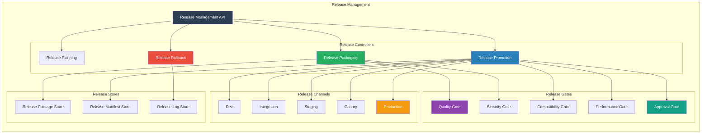
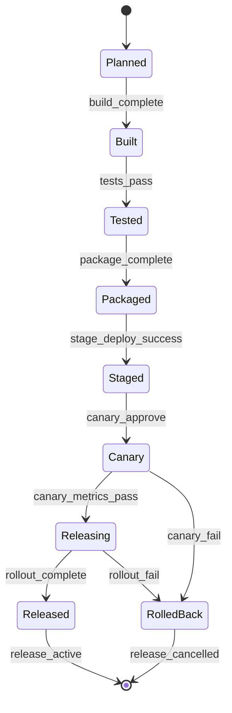
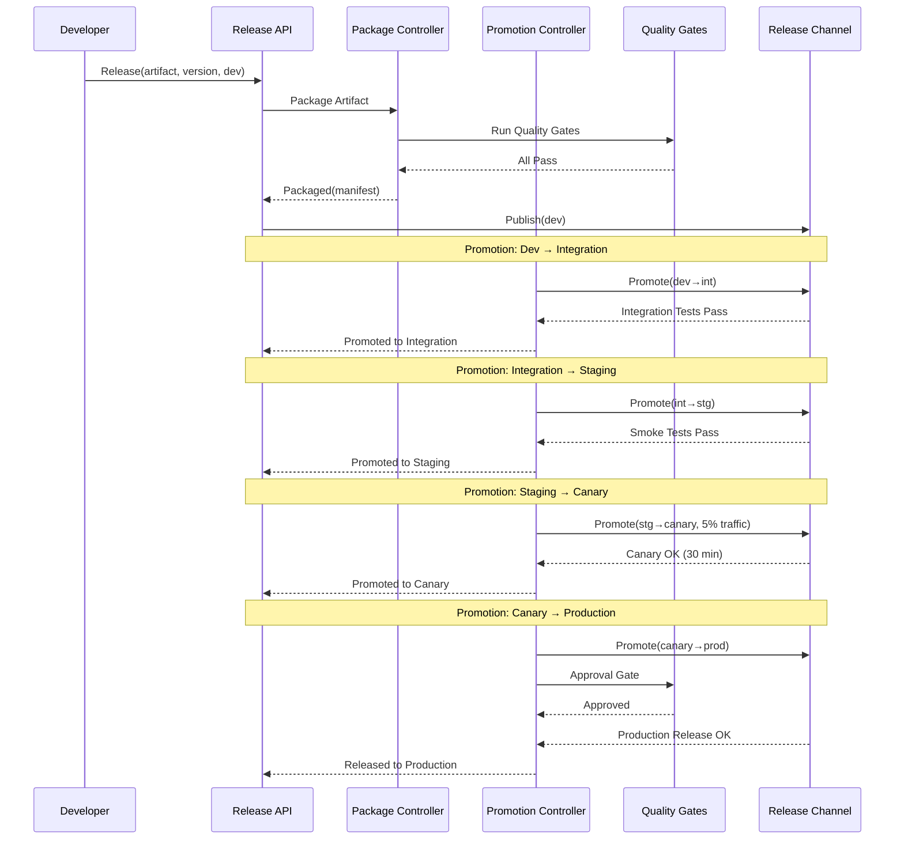

# SMOS-735 — Runtime Release Management

## 1. Document Control

| Field          | Value                                       |
| -------------- | ------------------------------------------- |
| Document ID    | SMOS-735                                    |
| Document Name  | Runtime Release Management                  |
| Phase          | P7.S04                                      |
| Version        | 1.0.0-draft                                 |
| Status         | Draft                                       |
| Classification | Enterprise Architecture — Runtime Lifecycle |
| Owner          | Xennic                                      |
| Created        | 2026-07-02                                  |
| Supersedes     | —                                           |

## 2. Purpose & Scope

The **Runtime Release Management** architecture defines the complete release pipeline — release channels, release lifecycle, artifact promotion, release gates, release automation, and observability — for all runtime artifacts in the Xennic platform.

## 3. Release Management Architecture



## 2. Release Lifecycle



## 3. Release Manifest Schema

```json
{
  "$schema": "http://json-schema.org/draft-07/schema#",
  "title": "ReleaseManifest",
  "type": "object",
  "required": ["release_id", "artifact_id", "version", "channel", "artifacts", "checksum"],
  "properties": {
    "release_id": { "type": "string", "format": "uuid" },
    "artifact_id": { "type": "string" },
    "artifact_type": { "type": "string" },
    "version": { "type": "string" },
    "channel": {
      "type": "string",
      "enum": ["dev", "integration", "staging", "canary", "production"]
    },
    "previous_version": { "type": "string" },
    "artifacts": {
      "type": "array",
      "items": {
        "type": "object",
        "properties": {
          "name": { "type": "string" },
          "type": { "type": "string" },
          "uri": { "type": "string" },
          "checksum": { "type": "string" },
          "size_bytes": { "type": "integer" }
        }
      }
    },
    "dependencies": { "type": "array", "items": { "type": "object" } },
    "changelog": { "type": "string" },
    "release_notes": { "type": "string" },
    "quality_gates": {
      "type": "object",
      "properties": {
        "quality": { "type": "string", "enum": ["pass", "fail", "waived"] },
        "security": { "type": "string", "enum": ["pass", "fail", "waived"] },
        "compatibility": { "type": "string", "enum": ["pass", "fail", "partial"] }
      }
    },
    "approval": {
      "type": "object",
      "properties": {
        "required": { "type": "boolean" },
        "approved_by": { "type": "string" },
        "approved_at": { "type": "string", "format": "date-time" }
      }
    },
    "checksum": { "type": "string" },
    "created_at": { "type": "string", "format": "date-time" },
    "published_at": { "type": "string", "format": "date-time" }
  }
}
```

## 4. Release Channels

| Channel     | Code | Purpose                    | Validation              | Auto-Promotion   |
| ----------- | ---- | -------------------------- | ----------------------- | ---------------- |
| Dev         | DEV  | Development testing        | Unit tests pass         | From build       |
| Integration | INT  | Integration testing        | Integration tests pass  | From dev         |
| Staging     | STG  | Pre-production validation  | Smoke tests, perf tests | From integration |
| Canary      | CAN  | Gradual production rollout | Metrics monitoring      | From staging     |
| Production  | PROD | Full production release    | All gates passed        | From canary      |

## 5. Promotion Flow



## 6. Release Gates

| Gate          | Check                      | Criteria                             | Fail Action          |
| ------------- | -------------------------- | ------------------------------------ | -------------------- |
| Quality       | Automated tests            | 100% pass rate                       | Block release        |
| Security      | Vulnerability scan         | 0 critical/high                      | Block release        |
| Compatibility | Dependency & version check | All compatible                       | Block release        |
| Performance   | Load test                  | Latency + throughput within baseline | Warn/block           |
| Approval      | Manual approval            | Designated approver signs off        | Block until approved |
| Compliance    | Regulatory check           | All compliance rules satisfied       | Block release        |
| Rollback      | Rollback plan              | Rollback procedure defined           | Warn                 |

## 7. Release Rollback

| Trigger                           | Action                    | Duration |
| --------------------------------- | ------------------------- | -------- |
| Canary fail (errors > 0.1%)       | Auto-rollback to previous | < 5 min  |
| Production degrade (latency > 2x) | Auto-rollback             | < 5 min  |
| Security vulnerability discovered | Manual rollback           | < 15 min |
| Approval withdrawn                | Manual rollback           | < 15 min |
| Compliance violation              | Auto-rollback + audit     | < 10 min |

## 8. Release Events

```json
{
  "$schema": "http://json-schema.org/draft-07/schema#",
  "title": "ReleaseEvent",
  "type": "object",
  "required": ["event_id", "release_id", "event_type", "timestamp"],
  "properties": {
    "event_id": { "type": "string", "format": "uuid" },
    "release_id": { "type": "string" },
    "artifact_id": { "type": "string" },
    "version": { "type": "string" },
    "event_type": {
      "type": "string",
      "enum": [
        "release.planned",
        "release.built",
        "release.packaged",
        "release.promoted",
        "release.canary.started",
        "release.canary.completed",
        "release.production.started",
        "release.production.completed",
        "release.rolled_back",
        "release.gate.passed",
        "release.gate.failed",
        "release.approved",
        "release.rejected",
        "release.published"
      ]
    },
    "timestamp": { "type": "string", "format": "date-time" },
    "channel": { "type": "string" },
    "actor": { "type": "string" },
    "result": { "type": "string", "enum": ["success", "failure", "rollback"] }
  }
}
```

## 9. Multi-Tenant Release

| Aspect                   | Design                                   |
| ------------------------ | ---------------------------------------- |
| Tenant-specific channels | Dev/Staging/Canary/Production per tenant |
| Shared release service   | Centralized but tenant-scoped            |
| Tenant release cadence   | Independent per tenant                   |
| Tenant release approval  | Per-tenant approval policy               |

## 10. Release Metrics

| Metric               | Description                   | Source            |
| -------------------- | ----------------------------- | ----------------- |
| release_frequency    | Releases per period           | Release Log       |
| release_duration     | Time from build to production | Release Log       |
| promotion_duration   | Time per promotion step       | Release Manifest  |
| canary_duration      | Time in canary phase          | Canary Controller |
| rollback_frequency   | Rollbacks per period          | Release Log       |
| gate_failure_rate    | Gate failures / total         | Release Gates     |
| release_success_rate | Successful / total releases   | Release Log       |

## 11. Cross-Reference Matrix

| Document   | Relationship                                    |
| ---------- | ----------------------------------------------- |
| SMOS-729   | Lifecycle — release as lifecycle phase          |
| SMOS-731   | Version — released versions                     |
| SMOS-732   | Migration — release-triggered migration         |
| SMOS-733   | Compatibility — release gates                   |
| SMOS-734   | Dependency — dependency resolution for releases |
| SMOS-736   | Retirement — superseded releases                |
| SMOS-737   | Governance — release governance                 |
| SMOS-738   | Blueprint — release integration                 |
| DEPLOY-001 | Deployment — release pipeline feeds deployment  |

---

**End of SMOS-735**
