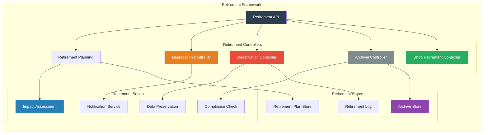
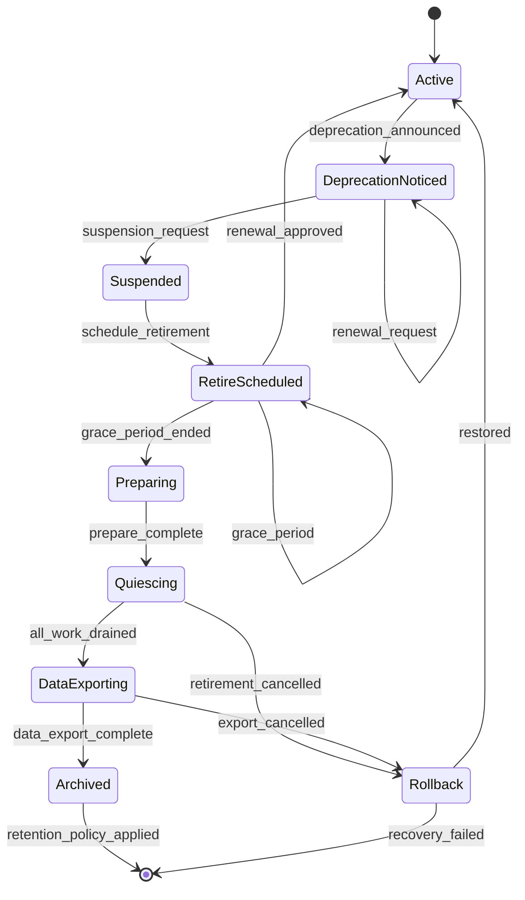
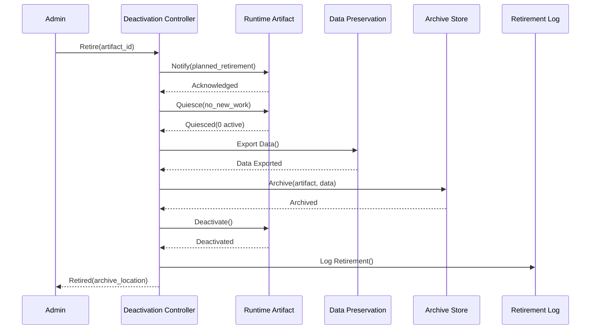

# SMOS-736 — Runtime Retirement Architecture

## 1. Document Control

| Field          | Value                                       |
| -------------- | ------------------------------------------- |
| Document ID    | SMOS-736                                    |
| Document Name  | Runtime Retirement Architecture             |
| Phase          | P7.S04                                      |
| Version        | 1.0.0-draft                                 |
| Status         | Draft                                       |
| Classification | Enterprise Architecture — Runtime Lifecycle |
| Owner          | Xennic                                      |
| Created        | 2026-07-02                                  |
| Supersedes     | —                                           |

## 2. Purpose & Scope

The **Runtime Retirement Architecture** defines the complete process for deactivating, retiring, and archiving runtime artifacts — including retirement planning, grace periods, data preservation, notifications, rollback, and compliance archival.

## 3. Retirement Architecture



## 4. Retirement Lifecycle



## 5. Retirement Plan Schema

```json
{
  "$schema": "http://json-schema.org/draft-07/schema#",
  "title": "RetirementPlan",
  "type": "object",
  "required": ["plan_id", "artifact_id", "scheduled_date", "retention_policy"],
  "properties": {
    "plan_id": { "type": "string", "format": "uuid" },
    "artifact_id": { "type": "string" },
    "artifact_type": { "type": "string" },
    "version": { "type": "string" },
    "scheduled_date": { "type": "string", "format": "date-time" },
    "grace_period_days": { "type": "integer" },
    "retention_policy": {
      "type": "object",
      "properties": {
        "archive_data": { "type": "boolean" },
        "retention_duration_days": { "type": "integer" },
        "compliance_retention": { "type": "boolean" },
        "data_export_format": { "type": "string" },
        "data_export_location": { "type": "string" }
      }
    },
    "impact_assessment": {
      "type": "object",
      "properties": {
        "affected_consumers": { "type": "array", "items": { "type": "string" } },
        "downtime_impact": { "type": "string" },
        "migration_required": { "type": "boolean" },
        "migration_target": { "type": "string" }
      }
    },
    "notification_plan": {
      "type": "object",
      "properties": {
        "notify_consumers": { "type": "boolean" },
        "notification_lead_days": { "type": "integer" },
        "notification_channels": { "type": "array", "items": { "type": "string" } }
      }
    },
    "approval_required": { "type": "boolean" },
    "approved_by": { "type": "string" },
    "created_at": { "type": "string", "format": "date-time" }
  }
}
```

## 6. Deprecation Policy

| Phase              | Duration  | Actions                                   |
| ------------------ | --------- | ----------------------------------------- |
| Deprecation Notice | Day 0     | Announce deprecation, begin 90-day notice |
| Grace Period       | Day 1–90  | Consumers must migrate; support continues |
| Hardening          | Day 91–97 | Final reminders, last-chance migration    |
| Retirement         | Day 98    | Begin deactivation process                |
| Archival           | Day 98+   | Preserve data per retention policy        |

## 7. Deactivation Flow



## 8. Data Preservation

```json
{
  "$schema": "http://json-schema.org/draft-07/schema#",
  "title": "RetirementDataExport",
  "type": "object",
  "required": ["export_id", "artifact_id", "data_types", "export_format", "export_location"],
  "properties": {
    "export_id": { "type": "string", "format": "uuid" },
    "artifact_id": { "type": "string" },
    "data_types": { "type": "array", "items": { "type": "string" } },
    "export_format": { "type": "string", "enum": ["json", "yaml", "csv", "parquet", "archive"] },
    "export_location": { "type": "string" },
    "compression": { "type": "string", "enum": ["gzip", "zstd", "none"] },
    "encryption": { "type": "object" },
    "checksum": { "type": "string" },
    "size_bytes": { "type": "integer" },
    "retention_days": { "type": "integer" },
    "compliance_retention": { "type": "boolean" },
    "exported_at": { "type": "string", "format": "date-time" }
  }
}
```

## 9. Undo Retirement

| Condition                 | Undo Action                  | Feasibility                      |
| ------------------------- | ---------------------------- | -------------------------------- |
| Deprecation notice window | Cancel notice, resume active | Always feasible                  |
| Grace period              | Cancel retirement plan       | Always feasible                  |
| Quiescing                 | Resume active work           | Feasible if state preserved      |
| After deactivation        | Restore from archive         | Limited by retention             |
| After archival            | Restore from archive         | Limited by retention, compliance |

## 10. Retirement Events

```json
{
  "$schema": "http://json-schema.org/draft-07/schema#",
  "title": "RetirementEvent",
  "type": "object",
  "required": ["event_id", "artifact_id", "event_type", "timestamp"],
  "properties": {
    "event_id": { "type": "string", "format": "uuid" },
    "artifact_id": { "type": "string" },
    "event_type": {
      "type": "string",
      "enum": [
        "retirement.planned",
        "retirement.notice_sent",
        "retirement.deprecation_started",
        "retirement.grace_period_started",
        "retirement.deactivation.started",
        "retirement.deactivation.completed",
        "retirement.quiesce.completed",
        "retirement.data_export.completed",
        "retirement.archived",
        "retirement.undone",
        "retirement.cancelled"
      ]
    },
    "timestamp": { "type": "string", "format": "date-time" },
    "actor": { "type": "string" },
    "reason": { "type": "string" },
    "archive_location": { "type": "string" },
    "retention_until": { "type": "string", "format": "date-time" }
  }
}
```

## 7. Multi-Tenant Retirement

| Aspect                        | Design                                      |
| ----------------------------- | ------------------------------------------- |
| Tenant-scoped retirement      | Each tenant manages own artifact retirement |
| Cross-tenant dependency check | Notify dependent tenants before retirement  |
| Tenant data export            | Export data per tenant scope                |
| Tenant retention policy       | Per-tenant compliance requirements          |

## 8. Retirement Metrics

| Metric                   | Description                   | Source          |
| ------------------------ | ----------------------------- | --------------- |
| retirement_count         | Artifacts retired per period  | Retirement Log  |
| graceful_retirement_pct  | % with completed grace period | Retirement Plan |
| undo_retirement_count    | Retirements undone            | Retirement Log  |
| archive_size_bytes       | Total archived data           | Archive Store   |
| compliance_retention_pct | % under compliance retention  | Archive Store   |
| retirement_lead_time     | Notice to deactivation        | Retirement Plan |

## 9. Cross-Reference Matrix

| Document | Relationship                                      |
| -------- | ------------------------------------------------- |
| SMOS-729 | Lifecycle — retirement as final lifecycle phase   |
| SMOS-730 | State Evolution — retired/archived states         |
| SMOS-731 | Version — version deprecation and retirement      |
| SMOS-732 | Migration — retirement may follow migration       |
| SMOS-734 | Dependency — dependency impact on retirement      |
| SMOS-737 | Governance — retirement governance                |
| SMOS-738 | Blueprint — retirement integration                |
| SMOS-711 | Persistence — data preservation during retirement |
| KNW-\*   | Knowledge — knowledge object retirement           |

---

**End of SMOS-736**
