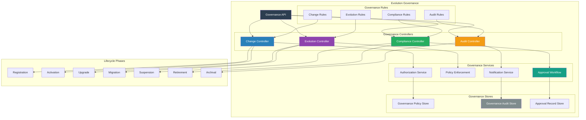
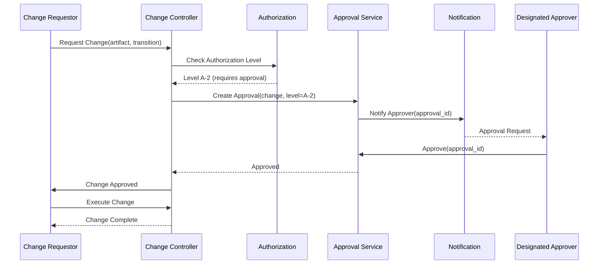

# SMOS-737 — Runtime Evolution Governance

## 1. Document Control

| Field          | Value                                       |
| -------------- | ------------------------------------------- |
| Document ID    | SMOS-737                                    |
| Document Name  | Runtime Evolution Governance                |
| Phase          | P7.S04                                      |
| Version        | 1.0.0-draft                                 |
| Status         | Draft                                       |
| Classification | Enterprise Architecture — Runtime Lifecycle |
| Owner          | Xennic                                      |
| Created        | 2026-07-02                                  |
| Supersedes     | —                                           |

## 2. Purpose & Scope

The **Runtime Evolution Governance** architecture defines the governance framework controlling how runtime artifacts evolve — change authorization, evolution policies, compliance validation, audit, approval workflows, and evolutionary guardrails across the entire lifecycle.

## 3. Evolution Governance Architecture



## 4. Evolution Governance Principles

| Principle | Description                                         |
| --------- | --------------------------------------------------- |
| EG-01     | Every lifecycle transition must be authorized       |
| EG-02     | Breaking changes require governance approval        |
| EG-03     | All governance decisions are audited immutably      |
| EG-04     | Tenants govern their own artifacts within limits    |
| EG-05     | Platform-wide rules supersede tenant rules          |
| EG-06     | Deprecation notices must meet minimum notice period |
| EG-07     | Rollback is always permitted within recovery window |
| EG-08     | Compliance retention trumps deletion requests       |

## 5. Change Authorization Levels

| Level | Authority         | Scope                                            |
| ----- | ----------------- | ------------------------------------------------ |
| A-0   | Auto              | Standard patch upgrades, no-breaking changes     |
| A-1   | Tenant Admin      | Minor upgrades within tenant scope               |
| A-2   | Platform Operator | Major upgrades, tenant migrations                |
| A-3   | Governance Board  | Breaking changes, cross-tenant migrations        |
| A-4   | Executive         | Platform-wide deprecations, compliance overrides |

## 6. Governance Policy Schema

```json
{
  "$schema": "http://json-schema.org/draft-07/schema#",
  "title": "EvolutionGovernancePolicy",
  "type": "object",
  "required": ["policy_id", "name", "scope", "rules"],
  "properties": {
    "policy_id": { "type": "string", "pattern": "^EGP-[A-Z0-9]{8}$" },
    "name": { "type": "string" },
    "scope": {
      "type": "object",
      "properties": {
        "artifact_types": { "type": "array", "items": { "type": "string" } },
        "tenants": { "type": "array", "items": { "type": "string" } },
        "regions": { "type": "array", "items": { "type": "string" } },
        "lifecycle_phases": { "type": "array", "items": { "type": "string" } }
      }
    },
    "rules": {
      "type": "array",
      "items": {
        "type": "object",
        "required": ["rule_id", "condition", "action"],
        "properties": {
          "rule_id": { "type": "string" },
          "condition": { "type": "string" },
          "action": {
            "type": "string",
            "enum": ["allow", "deny", "require_approval", "audit", "notify"]
          },
          "approval_level": { "type": "string", "enum": ["A-1", "A-2", "A-3", "A-4"] },
          "notification_targets": { "type": "array", "items": { "type": "string" } }
        }
      }
    },
    "version": { "type": "string" },
    "effective_from": { "type": "string", "format": "date-time" },
    "effective_until": { "type": "string", "format": "date-time" }
  }
}
```

## 7. Evolution Approval Workflow



## 8. Compliance Validation

```json
{
  "$schema": "http://json-schema.org/draft-07/schema#",
  "title": "ComplianceValidation",
  "type": "object",
  "required": ["validation_id", "artifact_id", "phase", "checks"],
  "properties": {
    "validation_id": { "type": "string", "format": "uuid" },
    "artifact_id": { "type": "string" },
    "phase": { "type": "string" },
    "checks": {
      "type": "array",
      "items": {
        "type": "object",
        "properties": {
          "check_id": { "type": "string" },
          "name": { "type": "string" },
          "status": { "type": "string", "enum": ["pass", "fail", "waived"] },
          "waived_by": { "type": "string" },
          "details": { "type": "string" }
        }
      }
    },
    "overall_status": { "type": "string", "enum": ["compliant", "non_compliant", "waived"] },
    "validated_at": { "type": "string", "format": "date-time" },
    "validated_by": { "type": "string" }
  }
}
```

## 9. Governance Audit

```json
{
  "$schema": "http://json-schema.org/draft-07/schema#",
  "title": "GovernanceAuditRecord",
  "type": "object",
  "required": ["record_id", "timestamp", "event_type", "actor", "action", "resource"],
  "properties": {
    "record_id": { "type": "string", "format": "uuid" },
    "timestamp": { "type": "string", "format": "date-time" },
    "event_type": {
      "type": "string",
      "enum": [
        "change.requested",
        "change.approved",
        "change.denied",
        "change.executed",
        "change.rolled_back",
        "policy.created",
        "policy.updated",
        "policy.enforced",
        "compliance.passed",
        "compliance.failed",
        "compliance.waived",
        "approval.created",
        "approval.granted",
        "approval.rejected"
      ]
    },
    "actor": { "type": "object", "properties": { "id": {}, "type": {} } },
    "action": { "type": "string" },
    "resource": { "type": "object", "properties": { "type": {}, "id": {} } },
    "result": { "type": "string", "enum": ["allow", "deny", "pending", "error"] },
    "policy_id": { "type": "string" },
    "details": { "type": "object" }
  }
}
```

## 10. Governance Rules

| Rule   | Description                                          | Enforcement                |
| ------ | ---------------------------------------------------- | -------------------------- |
| EGR-01 | All artifact upgrades must pass compatibility        | Block change on fail       |
| EGR-02 | Breaking changes require A-3 approval                | Block on insufficient auth |
| EGR-03 | Deprecation requires minimum 90-day notice           | Block early deactivation   |
| EGR-04 | Compliance-retained artifacts cannot be deleted      | Prevent deletion           |
| EGR-05 | Cross-tenant migration requires both tenant admins   | Multi-party approval       |
| EGR-06 | Rollback requires same approval as original change   | Authorization match        |
| EGR-07 | All governance decisions recorded in immutable audit | Append-only store          |

## 11. Multi-Tenant Governance

| Aspect                  | Design                                               |
| ----------------------- | ---------------------------------------------------- |
| Tenant Autonomy         | Tenants govern own lifecycle within platform rules   |
| Platform Overrides      | Platform can enforce cross-tenant rules              |
| Tenant Approval         | Tenant-scoped changes require tenant approval        |
| Cross-Tenant Escalation | Cross-tenant changes escalate to platform governance |

## 12. Governance Events

| Event                        | Trigger               | Consumer                    |
| ---------------------------- | --------------------- | --------------------------- |
| governance.change.approved   | Request approved      | Change Controller           |
| governance.change.denied     | Request denied        | Change Requestor            |
| governance.compliance.passed | Compliance check OK   | Lifecycle Controller        |
| governance.compliance.failed | Compliance check fail | Lifecycle Controller, Admin |
| governance.policy.created    | New policy            | Policy Store                |
| governance.audit.recorded    | Any governance action | Audit Store                 |

## 13. Governance Metrics

| Metric                   | Description               | Source                |
| ------------------------ | ------------------------- | --------------------- |
| change_requests          | Total change requests     | Governance Log        |
| approval_time_p50        | Median approval time      | Approval Service      |
| denial_rate              | Denied / total            | Governance Log        |
| compliance_fail_rate     | Failed compliance / total | Compliance Controller |
| audit_record_count       | Total audit records       | Audit Store           |
| policy_enforcement_count | Policies enforced         | Policy Store          |

## 14. Cross-Reference Matrix

| Document | Relationship                                                   |
| -------- | -------------------------------------------------------------- |
| SMOS-721 | Policy Engine — governance policies enforced by PDP            |
| SMOS-725 | Governance & SLA — evolution governance is a governance domain |
| SMOS-727 | Security — governance ensures security compliance              |
| SMOS-729 | Lifecycle — governance controls every lifecycle transition     |
| SMOS-730 | State Evolution — authorized state transitions                 |
| SMOS-731 | Version Management — version governance                        |
| SMOS-732 | Migration — migration approval governance                      |
| SMOS-735 | Release Management — release governance gates                  |
| SMOS-736 | Retirement — retirement governance rules                       |
| SMOS-738 | Blueprint — governance integration                             |
| GOV-\*   | Enterprise governance — implements platform-wide governance    |

---

**End of SMOS-737**
