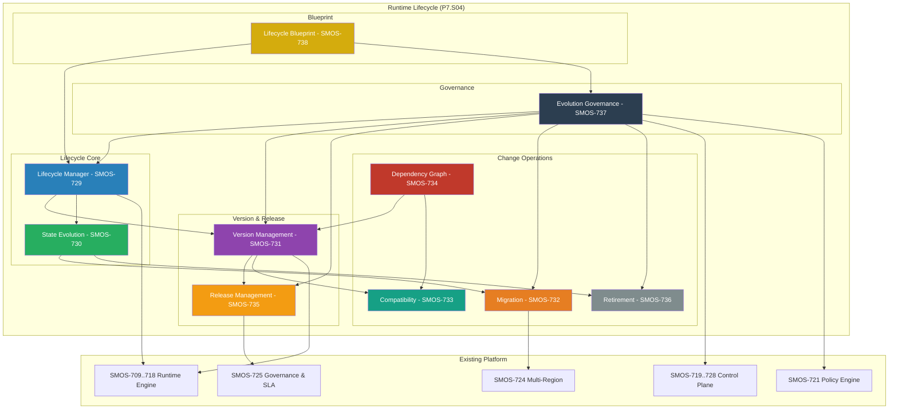
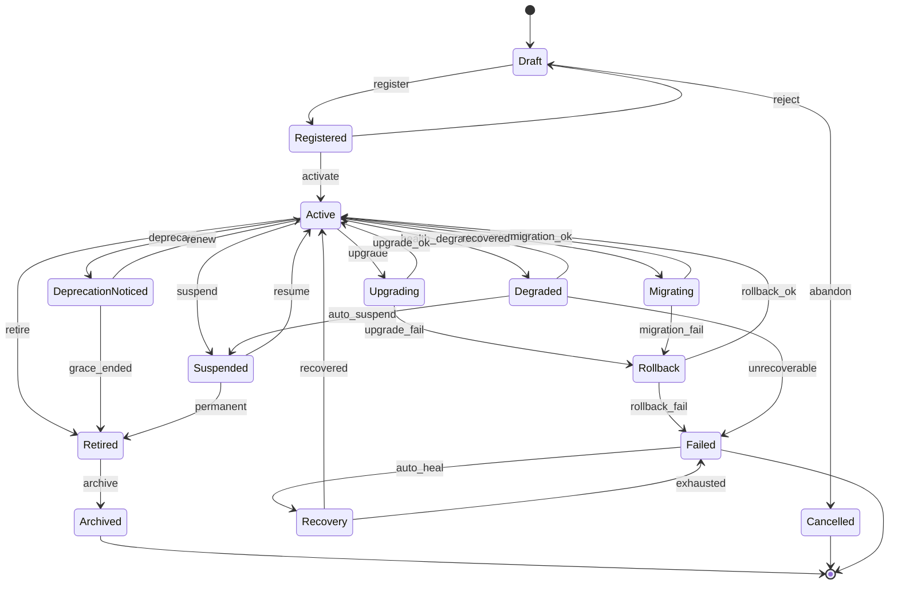

# SMOS-738 — Runtime Lifecycle Master Blueprint

## 1. Document Control

| Field          | Value                                       |
| -------------- | ------------------------------------------- |
| Document ID    | SMOS-738                                    |
| Document Name  | Runtime Lifecycle Master Blueprint          |
| Phase          | P7.S04                                      |
| Version        | 1.0.0-draft                                 |
| Status         | Draft                                       |
| Classification | Enterprise Architecture — Runtime Lifecycle |
| Owner          | Xennic                                      |
| Created        | 2026-07-02                                  |
| Supersedes     | —                                           |

## 2. Purpose & Scope

The **Runtime Lifecycle Master Blueprint** is the integration document that consolidates SMOS-729 through SMOS-737 into a unified lifecycle architecture. It defines component relationships, data flows, transition matrix, dependency topology, and governance model for all lifecycle operations.

This is the SSOT for P7.S04 Runtime Lifecycle & Evolution.

## 3. Lifecycle Architecture Overview



## 4. Component Registry (P7.S04)

| ID       | Document             | Type       | Dependencies       | Consumed By               |
| -------- | -------------------- | ---------- | ------------------ | ------------------------- |
| SMOS-729 | Runtime Lifecycle    | Core       | SMOS-730, SMOS-737 | All lifecycle controllers |
| SMOS-730 | State Evolution      | Core       | SMOS-702           | All state transitions     |
| SMOS-731 | Version Management   | Operation  | SMOS-733, SMOS-734 | Upgrades, rollbacks       |
| SMOS-732 | Migration            | Operation  | SMOS-724, SMOS-731 | Cross-runtime moves       |
| SMOS-733 | Compatibility        | Service    | SMOS-731           | All version operations    |
| SMOS-734 | Dependency Graph     | Service    | SMOS-731           | All artifact operations   |
| SMOS-735 | Release Management   | Operation  | SMOS-731, SMOS-733 | Release pipeline          |
| SMOS-736 | Retirement           | Operation  | SMOS-729, SMOS-730 | Deactivation              |
| SMOS-737 | Evolution Governance | Governance | All P7.S04         | All lifecycle decisions   |
| SMOS-738 | Lifecycle Blueprint  | Blueprint  | All P7.S04         | Integration SSOT          |

## 5. Complete Lifecycle State Machine (P7 Unified)



## 6. Unified Lifecycle Transition Matrix

| Transition                  | P7.S04 Doc | Guard             | Timeout | Auth Level |
| --------------------------- | ---------- | ----------------- | ------- | ---------- |
| Draft → Registered          | SMOS-729   | Schema valid      | 30s     | A-1        |
| Registered → Active         | SMOS-729   | Policy allow      | 60s     | A-2        |
| Active → Upgrading          | SMOS-731   | Compatible target | 30s     | A-1        |
| Active → Suspended          | SMOS-729   | Quiesce OK        | 300s    | A-2        |
| Active → Migrating          | SMOS-732   | Target ready      | 30s     | A-2        |
| Active → Degraded           | SMOS-730   | Auto-detected     | 10s     | Auto       |
| Active → Retired            | SMOS-736   | Approval audit    | 600s    | A-3        |
| Active → DeprecationNoticed | SMOS-736   | Notice prepared   | 30s     | A-2        |
| Upgrading → Active          | SMOS-731   | Smoke test pass   | 300s    | A-1        |
| Upgrading → Rollback        | SMOS-731   | Verification fail | 10s     | Auto       |
| Rollback → Active           | SMOS-731   | Restored          | 120s    | A-1        |
| Migrating → Active          | SMOS-732   | Integrity OK      | 300s    | A-2        |
| Migrating → Rollback        | SMOS-732   | Target unstable   | 30s     | A-2        |
| Suspended → Active          | SMOS-729   | Policy allow      | 60s     | A-2        |
| Degraded → Active           | SMOS-730   | Health OK         | 30s     | Auto       |
| Failed → Recovery           | SMOS-730   | Possible          | 10s     | Auto       |
| Retired → Archived          | SMOS-736   | Grace expired     | 600s    | A-1        |

## 7. Lifecycle Data Flows

### 7.1 Artifact Registration → Activation

```
Artifact Definition → Schema Validation → Registration Store → Policy Check
    → Resource Allocation → State Engine (Active) → Event Published → Orchestrator Notified
```

### 7.2 Upgrade Flow

```
Upgrade Request → Compatibility Check → Dependency Resolution → Snapshot Creation
    → Quiesce → Apply New Version → Smoke Test → State Engine (Active)
    → On Failure → Rollback: Snapshot Restore → Revert Version → State Engine (Active)
```

### 7.3 Migration Flow

```
Migration Request → Impact Assessment → Target Provisioning → State Sync
    → Quiesce → Cutover → Validation → State Engine (Active on Target)
    → On Failure → Rollback: Cutover Reversal → Source Restore → State Engine (Active on Source)
```

### 7.4 Retirement Flow

```
Retirement Plan → Impact Assessment → Deprecation Notice → Grace Period
    → Quiesce → Data Export → Artifact Deactivation → Archive → State Engine (Archived)
    → On Undo: Restore from Archive → State Engine (Active)
```

## 8. Lifecycle Configuration Blueprint

```json
{
  "$schema": "http://json-schema.org/draft-07/schema#",
  "title": "LifecycleBlueprintConfig",
  "type": "object",
  "required": ["lifecycle_version", "components", "transition_defaults"],
  "properties": {
    "lifecycle_version": { "type": "string" },
    "components": {
      "type": "array",
      "items": {
        "type": "object",
        "required": ["document_id", "enabled"],
        "properties": {
          "document_id": { "type": "string", "pattern": "^SMOS-73[0-8]$" },
          "enabled": { "type": "boolean" },
          "config": { "type": "object" }
        }
      }
    },
    "transition_defaults": {
      "type": "object",
      "properties": {
        "default_timeout_ms": { "type": "integer" },
        "max_retries": { "type": "integer" },
        "auto_remediate": { "type": "boolean" }
      }
    },
    "governance": {
      "type": "object",
      "properties": {
        "default_approval_level": { "type": "string" },
        "audit_all_transitions": { "type": "boolean" },
        "compliance_enabled": { "type": "boolean" }
      }
    }
  }
}
```

## 9. Service Relationship Map

| From                 | To                       | Type     | Description                   |
| -------------------- | ------------------------ | -------- | ----------------------------- |
| Lifecycle Manager    | State Evolution          | Internal | State transitions             |
| Lifecycle Manager    | Version Manager          | Internal | Versioned transitions         |
| Lifecycle Manager    | Retirement               | Internal | Deactivation lifecycle        |
| Version Manager      | Compatibility            | gRPC     | Version compatibility checks  |
| Version Manager      | Dependency Graph         | gRPC     | Version dependency resolution |
| Version Manager      | Release Manager          | Events   | New version → release         |
| Migration            | Multi-Region Coordinator | gRPC     | Cross-region migration        |
| Migration            | Compatibility            | gRPC     | Migration compatibility       |
| Retirement           | Data Preservation        | Internal | Data export                   |
| Retirement           | Archival Store           | Internal | Data archival                 |
| Evolution Governance | Lifecycle Manager        | gRPC     | Authorize transitions         |
| Evolution Governance | Policy Engine            | gRPC     | Governance policy evaluation  |
| Evolution Governance | Audit Store              | Events   | Governance audit records      |

## 10. P7.S04 Events Catalog

| Event                        | Source                | Consumers                      |
| ---------------------------- | --------------------- | ------------------------------ |
| artifact.registered          | Lifecycle Manager     | Registry, Orchestrator         |
| artifact.activated           | Lifecycle Manager     | Orchestrator, Scheduler        |
| artifact.suspended           | Lifecycle Manager     | Orchestrator, Resource Manager |
| artifact.resumed             | Lifecycle Manager     | Orchestrator                   |
| artifact.upgrade.started     | Version Manager       | Monitoring, Audit              |
| artifact.upgrade.completed   | Version Manager       | Registry, Release Manager      |
| artifact.upgrade.failed      | Version Manager       | Alert, Rollback Controller     |
| artifact.rollback.completed  | Version Manager       | Registry, Audit                |
| artifact.migration.started   | Migration Controller  | Monitoring, Multi-Region       |
| artifact.migration.completed | Migration Controller  | Registry, Orchestrator         |
| artifact.migration.failed    | Migration Controller  | Alert, Rollback                |
| artifact.deprecated          | Retirement Controller | Notification, Consumers        |
| artifact.retired             | Retirement Controller | Registry, Orchestrator         |
| artifact.archived            | Retirement Controller | Compliance, Storage            |
| artifact.compatibility.check | Compatibility Engine  | Version Manager                |
| dependency.violated          | Dependency Graph      | Alert Manager                  |
| governance.change.approved   | Governance            | Change Controller              |
| governance.change.denied     | Governance            | Change Requestor               |
| release.promoted             | Release Manager       | Deployment                     |

## 11. P7.S04 Metrics

| Metric                       | Source            | Aggregation |
| ---------------------------- | ----------------- | ----------- |
| lifecycle_transitions        | State Engine      | rate, total |
| transition_duration_p50      | State Engine      | percentile  |
| transition_success_rate      | State Engine      | rate        |
| active_artifacts             | State Store       | gauge       |
| suspended_artifacts          | State Store       | gauge       |
| upgrade_duration             | Version Manager   | percentile  |
| upgrade_success_rate         | Version Manager   | rate        |
| migration_duration           | Migration         | percentile  |
| migration_success_rate       | Migration         | rate        |
| compatibility_check_duration | Compatibility     | percentile  |
| breaking_change_count        | Compatibility     | rate        |
| dependency_violations        | Dependency Graph  | rate        |
| release_frequency            | Release Manager   | rate        |
| release_duration             | Release Manager   | percentile  |
| rollback_frequency           | Version/Migration | rate        |
| retirement_count             | Retirement        | rate        |
| approval_time                | Governance        | percentile  |
| audit_record_count           | Governance        | gauge       |

## 12. P7.S04 Document Index

| ID       | Document                        | File                               | Sections |
| -------- | ------------------------------- | ---------------------------------- | -------- |
| SMOS-729 | Runtime Lifecycle Architecture  | 29-runtime-lifecycle.md            | 19       |
| SMOS-730 | Runtime State Evolution         | 30-runtime-state-evolution.md      | 15       |
| SMOS-731 | Runtime Version Management      | 31-runtime-version-management.md   | 16       |
| SMOS-732 | Runtime Migration Architecture  | 32-runtime-migration.md            | 16       |
| SMOS-733 | Runtime Compatibility Matrix    | 33-runtime-compatibility.md        | 14       |
| SMOS-734 | Runtime Dependency Graph        | 34-runtime-dependency-graph.md     | 16       |
| SMOS-735 | Runtime Release Management      | 35-runtime-release-management.md   | 11       |
| SMOS-736 | Runtime Retirement Architecture | 36-runtime-retirement.md           | 9        |
| SMOS-737 | Runtime Evolution Governance    | 37-runtime-evolution-governance.md | 14       |
| SMOS-738 | Runtime Lifecycle Blueprint     | 38-runtime-lifecycle-blueprint.md  | 13       |

## 13. P7.S04 → P7.S01..S03 Cross-Reference

| P7.S04 Document             | Depends On                                   | Extends            |
| --------------------------- | -------------------------------------------- | ------------------ |
| SMOS-729 Lifecycle          | SMOS-719 Control Plane, SMOS-722 Resource    | —                  |
| SMOS-730 State Evolution    | SMOS-702 Execution State Machine             | SMOS-702 states    |
| SMOS-731 Version Management | SMOS-721 Policy Engine, SMOS-725 Governance  | —                  |
| SMOS-732 Migration          | SMOS-724 Multi-Region, SMOS-720 Orchestrator | SMOS-724           |
| SMOS-733 Compatibility      | SMOS-731 Version                             | —                  |
| SMOS-734 Dependency         | SMOS-731 Version, SMOS-733 Compatibility     | —                  |
| SMOS-735 Release            | SMOS-731 Version, SMOS-733 Compatibility     | DEPLOY-001         |
| SMOS-736 Retirement         | SMOS-711 Persistence, SMOS-730 State         | —                  |
| SMOS-737 Governance         | SMOS-721 Policy, SMOS-725 Governance         | GOV-\*             |
| SMOS-738 Blueprint          | All P7.S04                                   | SMOS-718 Blueprint |

## 14. Implementation Roadmap

| Phase       | Documents                    | Effort                             | Dependencies            |
| ----------- | ---------------------------- | ---------------------------------- | ----------------------- |
| Foundation  | SMOS-729, SMOS-730           | Core lifecycle and state model     | P7.S01, P7.S02          |
| Versioning  | SMOS-731, SMOS-733, SMOS-734 | Version, compatibility, dependency | Foundation              |
| Operations  | SMOS-732, SMOS-735, SMOS-736 | Migration, release, retirement     | Versioning              |
| Governance  | SMOS-737                     | Lifecycle governance               | Foundation + Operations |
| Integration | SMOS-738                     | Blueprint SSOT                     | All P7.S04              |

## 15. Lifecycle Blueprint Validation

| Rule   | Condition                                                | Consequence              |
| ------ | -------------------------------------------------------- | ------------------------ |
| LBR-01 | All lifecycle transitions must be deterministic          | Architecture review      |
| LBR-02 | Every state must have a valid exit path                  | State machine validation |
| LBR-03 | Rollback path must exist for all upgrade/migration       | Release gate             |
| LBR-04 | No lifecycle transition bypasses governance              | Governance gate          |
| LBR-05 | All lifecycle decisions must be auditable                | Compliance check         |
| LBR-06 | Deprecation must include minimum notice period           | Retirement gate          |
| LBR-07 | Artifacts cannot be permanently deleted under compliance | Data governance          |

## 16. Full P7 Document Index

| Phase        | Documents               | Lines        |
| ------------ | ----------------------- | ------------ |
| P7.S01       | SMOS-701..708 (8 docs)  | ~14,845      |
| P7.S02       | SMOS-709..718 (10 docs) | ~23,889      |
| P7.S03       | SMOS-719..728 (10 docs) | ~10,500      |
| P7.S04       | SMOS-729..738 (10 docs) | ~3,200+      |
| **Total P7** | **38 docs**             | **~52,400+** |

---

**End of SMOS-738**
