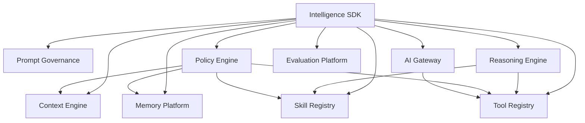

# ADR-017: Enterprise Intelligence Platform

**Status:** Accepted  
**Date:** 2026-07-05  
**Sprint:** I1  
**Author:** Chief Enterprise Architect

## Context

Xennic requires an Enterprise Intelligence Platform — the intelligence operating system upon which all future AI agents, copilots, assistants, automation workflows, and reasoning services will depend.

No end-user agents, chatbots, or business workflows are implemented in this sprint. The focus is entirely on reusable enterprise intelligence infrastructure.

## Decision

We decompose the platform into 10 discrete, independently-versioned modules within `apps/api/src/modules/enterprise-intelligence/`:

| Phase | Module              | Responsibility                                               |
| ----- | ------------------- | ------------------------------------------------------------ |
| 1     | Context Engine      | Unified context assembly across 11 domain sources            |
| 2     | Memory Platform     | 7-layer memory with persistence, indexing, expiration        |
| 3     | Prompt Governance   | Registry, versioning, templates, policies, auditing          |
| 4     | Tool Registry       | Metadata, schemas, versioning, permissions, discovery        |
| 5     | Skill Registry      | Reusable skills with dependencies, composition               |
| 6     | Reasoning Engine    | Planning, execution graphs, reflection, verification         |
| 7     | Policy Engine       | Enforcement across users, agents, tools, memory, context     |
| 8     | AI Gateway          | Provider-neutral gateway (8 providers) with routing/failover |
| 9     | Evaluation Platform | Benchmarks, golden datasets, regression testing              |
| 10    | Intelligence SDK    | Unified API facades + cross-cutting workflows                |

## Architecture Principles

1. **No LLM-specific code in reasoning** — reasoning engine uses only structured planning and verification
2. **Provider neutrality** — AI Gateway abstracts all provider details behind a single interface
3. **DDD layering** — each module has domain, application, infrastructure layers
4. **@Global() modules** — all sub-modules are global, imported by SDK module
5. **In-memory first** — all persistence uses in-memory stores; swap to Prisma/Redis when requirements firm
6. **All modules independently testable** — each has unit tests, integration via the SDK

## Module Relationships

## Consequences

**Positive:**

- All 10 modules share consistent patterns (DDD, NestJS, in-memory stores, tests)
- SDK provides a single entry point for all AI infrastructure capabilities
- No vendor lock-in at the provider level — any AI provider can be swapped
- Reasoning engine is LLM-agnostic; can be powered by any provider or even rule-based systems

**Negative:**

- In-memory stores must be replaced with persistent storage before production
- 10 global modules increase startup complexity; need lazy-loading consideration
- SDK re-exports many services — testing the SDK requires all sub-modules to be available

**Mitigations:**

- IMemoryStore, IContextRepository interfaces defined — swap implementations without code changes
- All sub-modules clearly document their @Global() status
- SDK tests mock sub-module services

## References

- ADR-001: Workspace-Driven Multi-Tenancy
- ADR-009: Layered Modular Monolith
- docs/enterprise-intelligence-architecture.md
